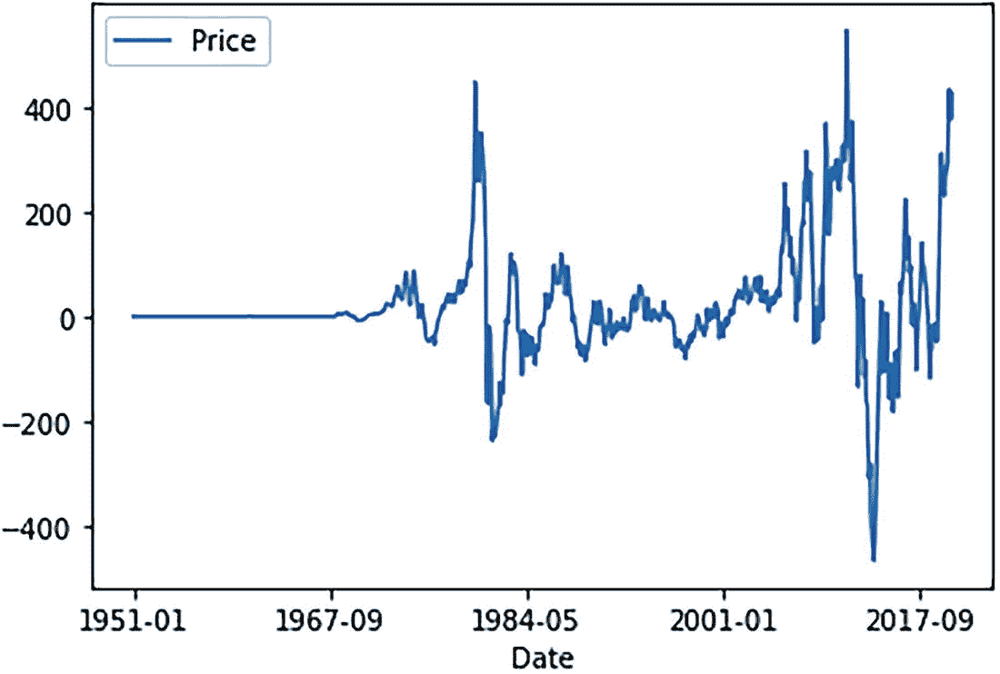
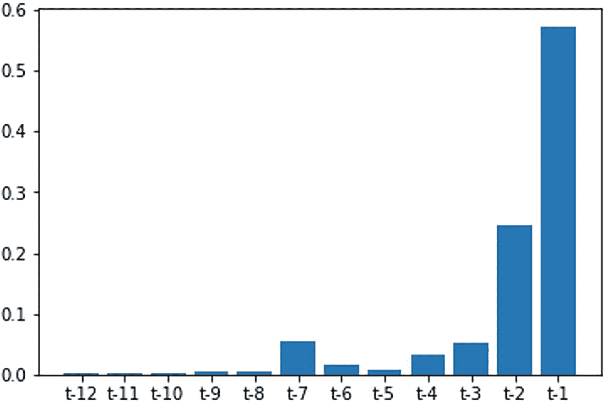
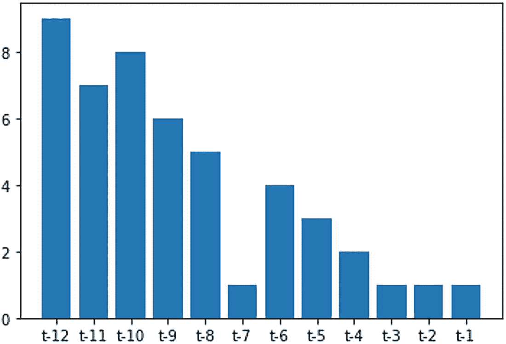
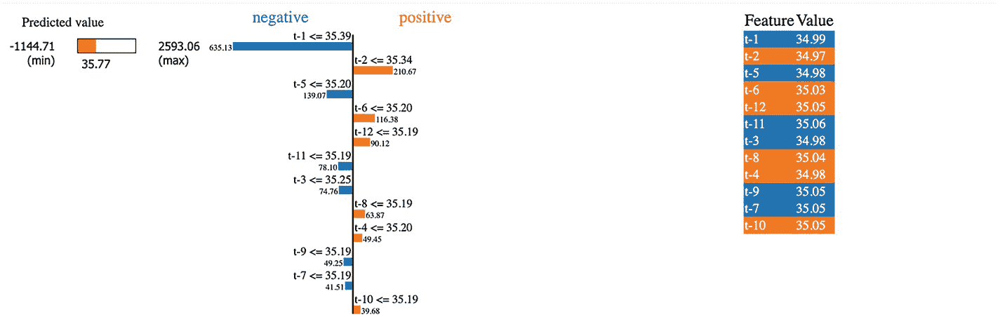
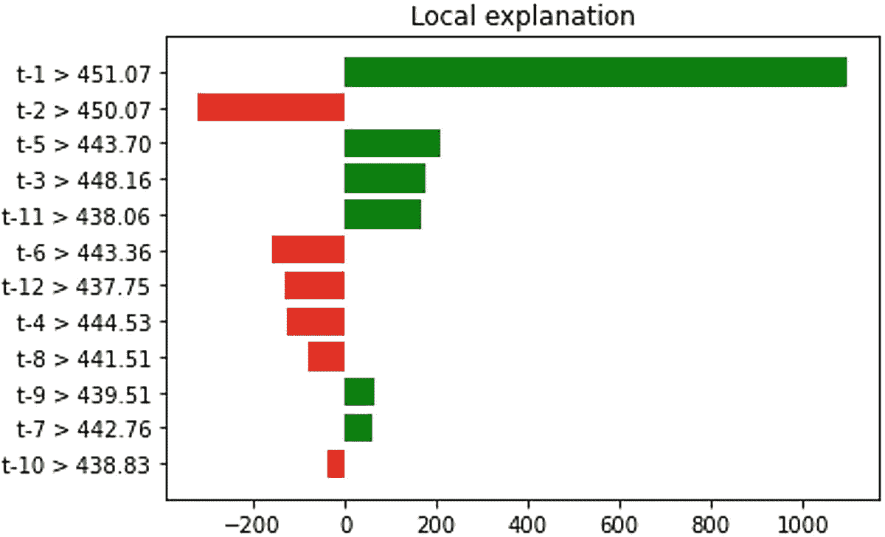
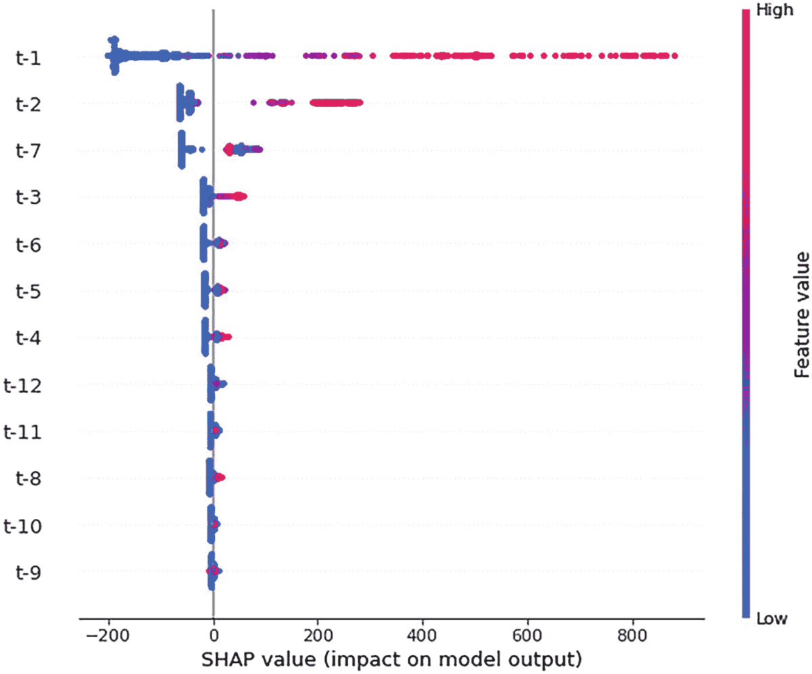
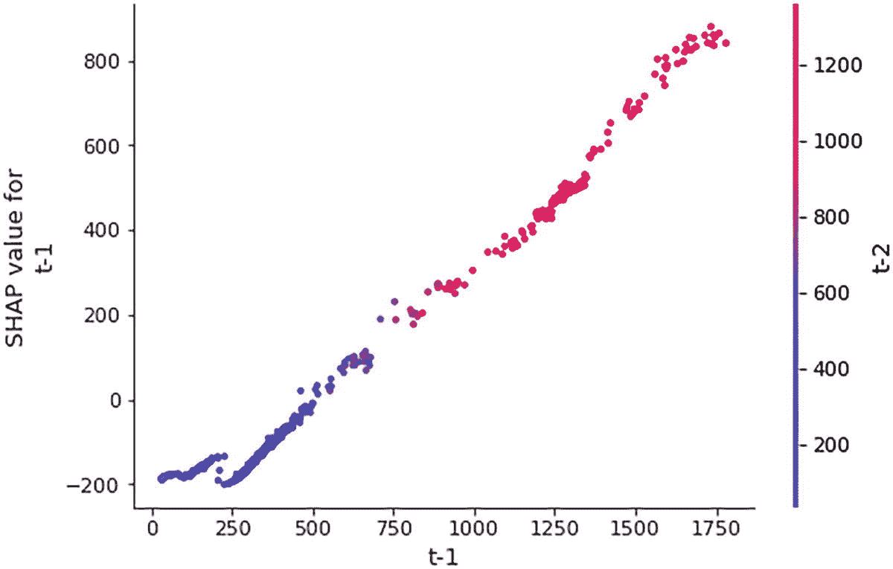
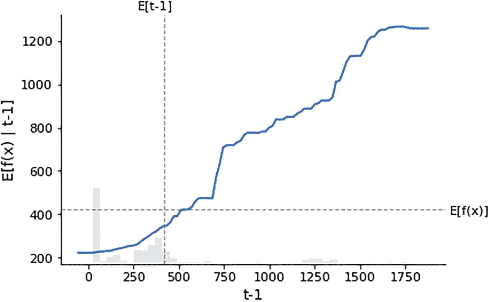

# 6. 时间序列模型的可解释性

时间序列，顾名思义，具有时间戳和一个我们随时间观察的变量，例如股票价格、销售额、收入、利润随时间的变化等。时间序列建模是一组可用于为未来时间段生成多步预测的技术，这将帮助企业更好地规划，并帮助决策者根据未来预估进行规划。存在基于机器学习的技术可用于生成未来预测；同时，也需要解释关于未来的预测。

时间序列预测最常用的技术是自回归方法、移动平均方法、自回归移动平均方法以及基于深度学习的技术，例如 LSTM 等。时间序列模型要求数据以频繁的时间间隔记录。如果记录中存在任何间隙，则需要不同的过程来处理时间序列中的间隙。时间序列模型可以从两个角度来看：单变量，完全依赖于时间；以及多变量，考虑了各种因素。这些因素被称为*因果因素*，它们会影响预测。在时间序列模型中，时间是一个自变量，因此我们可以从时间中计算出各种特征作为独立特征。时间序列建模具有各种组成部分，例如趋势、季节性和周期性。

## 方案 6-1. 使用 LIME 解释时间序列模型

### 问题

您希望使用 LIME 解释时间序列模型。

### 解决方案

我们考虑一个包含日期和价格的示例数据集，并且我们将只考虑单变量分析。我们将使用 LIME 库来解释预测。

### 工作原理

让我们来看下面的示例（见图 6-1）：



该图绘制了经季节性调整后的差值随时间变化的曲线。它呈现出一条波动曲线，为价格提供了数据，峰值出现在 2017 年左右。

**图 6-1** 经季节性调整的差值图

```python
import pandas as pd
import numpy as np
import matplotlib.pyplot as plt
%matplotlib inline
df = pd.read_csv('https://raw.githubusercontent.com/pradmishra1/PublicDatasets/main/monthly_csv.csv',index_col=0)
# seasonal difference
differenced = df.diff(12)
# trim off the first year of empty data
differenced = differenced[12:]
# save differenced dataset to file
differenced.to_csv('seasonally_adjusted.csv', index=False)
# plot differenced dataset
differenced.plot()
plt.show()
```

```python
# reframe as supervised learning
dataframe = pd.DataFrame()
for i in range(12,0,-1):
dataframe['t-'+str(i)] = df.shift(i).values[:,0]
dataframe['t'] = df.values[:,0]
print(dataframe.head(13))
dataframe = dataframe[13:]
# save to new file
dataframe.to_csv('lags_12months_features.csv', index=False)
```

对于过去 12 个月，滞后特征将被用作训练特征，以预测未来的时间序列销售值。

```python
# split into input and output
df = pd.read_csv('lags_12months_features.csv')
data = df.values
X = data[:,0:-1]
y = data[:,-1]
from sklearn.ensemble import RandomForestRegressor
# fit random forest model
model = RandomForestRegressor(n_estimators=500, random_state=1)
model.fit(X, y)
```

我们使用随机森林回归器来评估子集场景中每个特征的重要性。见图 6-2。



该柱状图比较了 12 个滞后特征的得分。`t-1` 得分较高，约为 0.58，而 `t-10`、`t-11` 和 `t-12` 得分较低，约为 0.02。

**图 6-2** 12 个滞后特征的特征重要性

```python
# show importance scores
print(model.feature_importances_)
# plot importance scores
names = dataframe.columns.values[0:-1]
ticks = [i for i in range(len(names))]
plt.bar(ticks, model.feature_importances_)
plt.xticks(ticks, names)
plt.show()
```

```python
from sklearn.feature_selection import RFE
```

递归特征消除是一种技术，通常用于从可用特征列表中微调出相关特征，以便只有重要的特征才能进入推理生成过程。

```python
# perform feature selection
rfe = RFE(RandomForestRegressor(n_estimators=500, random_state=1), n_features_to_select=4)
fit = rfe.fit(X, y)
# report selected features
print('Selected Features:')
names = dataframe.columns.values[0:-1]
for i in range(len(fit.support_)):
if fit.support_[i]:
print(names[i])
Selected Features:
t-7
t-3
t-2
t-1
```

我们可以对具有时间感知的重要特征（即滞后项）进行排序。见图 6-3 和图 6-4。



该柱状图比较了 12 个滞后特征的排名。`t-12` 排名较高，约为 9，而 `t-1`、`t-2` 和 `t-3` 排名较低，约为 1。

**图 6-3** 所有可用滞后项的特征排名

```python
# plot feature rank
names = dataframe.columns.values[0:-1]
ticks = [i for i in range(len(names))]
plt.bar(ticks, fit.ranking_)
plt.xticks(ticks, names)
plt.show()
```

```python
!pip install Lime
import lime
import lime.lime_tabular
explainer = lime.lime_tabular.LimeTabularExplainer(np.array(X),
mode='regression',
feature_names=X.columns,
class_names=['t'],
verbose=True)
explainer.feature_frequencies
{0: array([0.25659472, 0.24340528, 0.24940048, 0.25059952]), 1: array([0.25539568, 0.24460432, 0.24940048, 0.25059952]), 2: array([0.25419664, 0.24580336, 0.24940048, 0.25059952]), 3: array([0.2529976 , 0.2470024 , 0.24940048, 0.25059952]), 4: array([0.25179856, 0.24820144, 0.24940048, 0.25059952]), 5: array([0.25059952, 0.24940048, 0.24940048, 0.25059952]), 6: array([0.2529976 , 0.2470024 , 0.24940048, 0.25059952]), 7: array([0.25179856, 0.24820144, 0.24940048, 0.25059952]), 8: array([0.25059952, 0.24940048, 0.24940048, 0.25059952]), 9: array([0.25059952, 0.24940048, 0.24940048, 0.25059952]), 10: array([0.25059952, 0.24940048, 0.24940048, 0.25059952]), 11: array([0.25059952, 0.24940048, 0.24940048, 0.25059952])}
# asking for explanation for LIME model
i = 60
exp = explainer.explain_instance(np.array(X)[i],
new_model.predict,
num_features=12
)
Intercept 524.1907857658252
Prediction_local [76.53408383]
Right: 35.77034850521053
X does not have valid feature names, but LinearRegression was fitted with feature names
exp.show_in_notebook(show_table=True)
```



该柱状图比较了预测值和特征值。`t-2` 和 `t-1` 的正负值较高，分别约为 210.67 和 635.13。

**图 6-4** 时间序列的局部解释

对于数据集中的第 60 条记录，预测值为 35.77，其中滞后 1 是最重要的特征。

```python
exp.as_list()
[('t-1 <= 35.39', -635.1332339969734), ('t-2 <= 35.34', 210.66614528187935), ('t-5 <= 35.20', -139.067880800616), ('t-6 <= 35.20', 116.37720395001742), ('t-12 <= 35.19', 90.11939668085971), ('t-11 <= 35.19', -78.09554990821964), ('t-3 <= 35.25', -74.75587075373902), ('t-8 <= 35.19', 63.86565747018194), ('t-4 <= 35.20', 49.45398090327778), ('t-9 <= 35.19', -49.24830755303888), ('t-7 <= 35.19', -41.51328966914635), ('t-10 <= 35.19', 39.67504645890767)]
# Code for SP-LIME
import warnings
from lime import submodular_pick
# Remember to convert the dataframe to matrix values
# SP-LIME returns exaplanations on a sample set to provide a non redundant global decision boundary of original model
sp_obj = submodular_pick.SubmodularPick(explainer, np.array(X),
new_model.predict,
num_features=12,
num_exps_desired=10)
```

来自 `LIME` 库的 `SP-LIME` 模块提供对样本集的解释，以提供关于预测的全局决策边界。在前面的脚本中，我们将时间序列模型视为监督学习模型，并使用 12 个滞后项作为特征。我们使用 `LIME` 库中的 `LIME` 表格解释器。以下脚本显示了第 60 条记录的解释。预测值为 35.77，下限阈值和上限阈值反映了预测结果的置信区间。图 6-5 显示了促成预测的正向因素和负向因素。



该柱状图比较了滞后项的正向特征。`t-1` 和 `t-2` 的正负值较高，分别约为 1100 和 -250。

**图 6-5** 局部解释以绿色显示正向特征，以红色显示负向特征

## 方法 6-2：使用 SHAP 解释时间序列模型

### 问题

您希望使用 SHAP 解释时间序列模型。

### 解决方案

我们考虑一个包含日期和价格的样本数据集，并且只进行单变量分析。我们将使用 `SHAP` 库来解释预测结果。

### 工作原理

让我们来看下面的示例（图 6-6）：



汇总图比较了滞后特征的 SHAP 值。`t-1` 和 `t-10` 分别具有约 900 和 20 的高特征值和低特征值。

**图 6-6** SHAP 特征值汇总图

```python
import shap
from sklearn.ensemble import RandomForestRegressor
rforest = RandomForestRegressor(n_estimators=100, random_state=0)
rforest.fit(X, y)
# 解释测试集中的所有预测
explainer = shap.TreeExplainer(rforest)
shap_values = explainer.shap_values(X)
shap.summary_plot(shap_values, X)
```

`t-1`、`t-2` 和 `t-7` 是影响预测的三个重要特征。`t-1` 表示上一个时间段的滞后，`t-2` 表示过去两个时间段的滞后，`t-7` 表示第七个时间段的滞后。假设数据是按月提供的，那么 `t-1` 表示上个月，`t-2` 表示过去第二个月，`t-7` 表示过去第七个月。这些值会影响预测。见图 6-7 和图 6-8。



散点图比较了 `t-1` 和 `t-2` 的 SHAP 值。它按递增趋势绘制数据，并在约 (1750, 900) 处获得高值。

**图 6-7** SHAP 依赖图

```python
shap.dependence_plot("t-1", shap_values, X)
```

```python
shap.partial_dependence_plot(
"t-1", rforest.predict, X, ice=False,
model_expected_value=True, feature_expected_value=True
)
```



一张图绘制了 `E[f(x) | t-1]` 与 `t-1` 的关系。它绘制了一条递增曲线，并附有垂直条，为特征 `t-1` 的偏依赖提供了数据。

**图 6-8** 特征 `t-1` 的偏依赖图

## 结论

在本章中，我们介绍了如何解释时间序列模型以生成预测。为了解释单变量时间序列模型，我们将其视为一个监督学习问题，将滞后项作为可训练特征。然后使用线性回归器训练这些特征，并利用回归模型在全局和局部层面生成解释，同时使用了 SHAP 和 LIME 库。类似地，可以使用更复杂的算法（如非线性和集成技术）生成解释，最后，可以像前几章一样，使用 SHAP 和 LIME 生成类似的图形和图表。下一章将包含解释深度神经网络模型的配方。