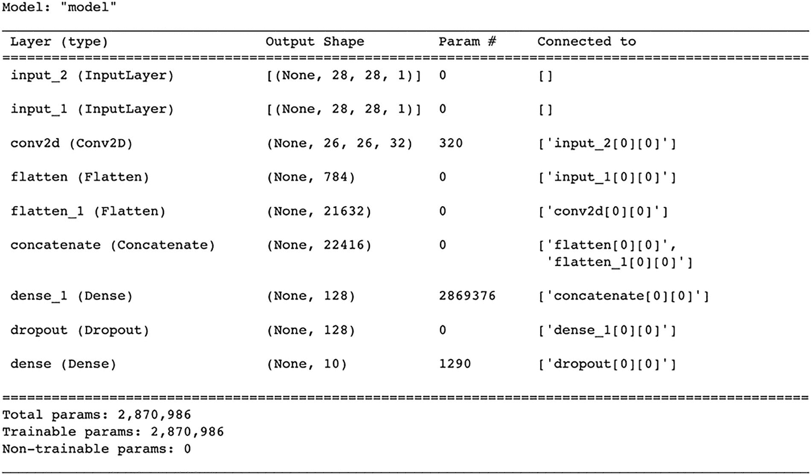
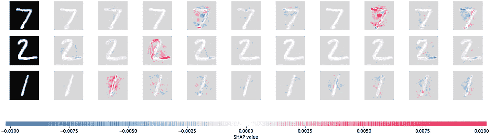
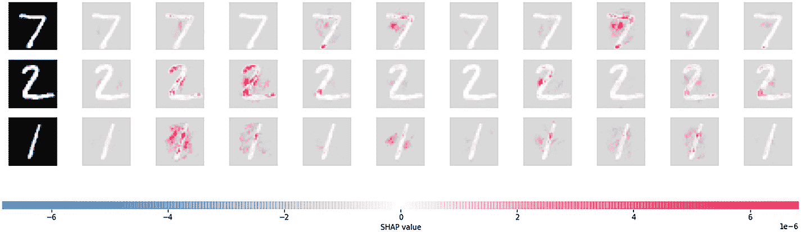
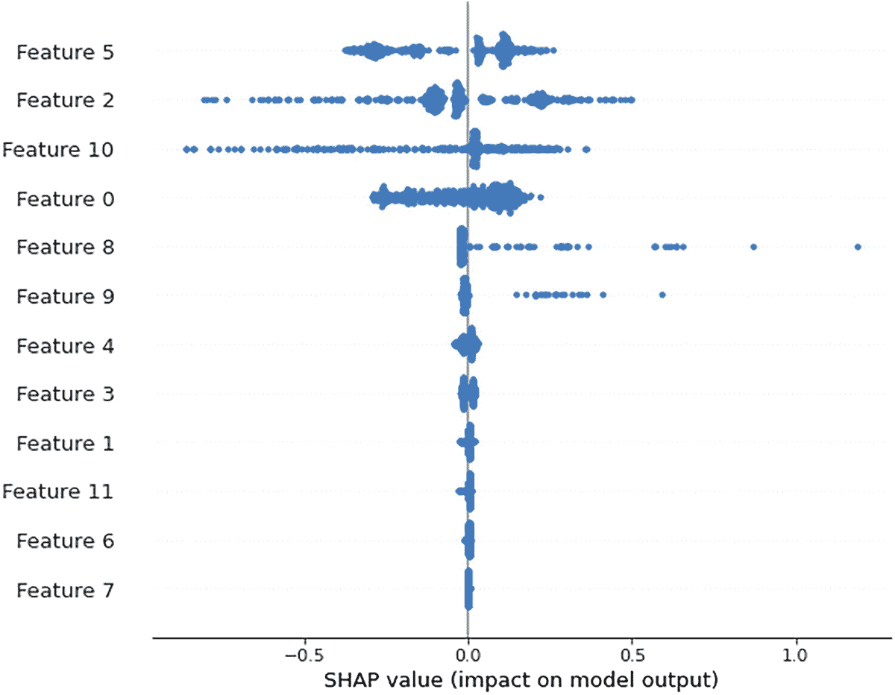

# 7. 深度学习模型的可解释性

深度学习模型正成为人工智能实现的支柱。同时，构建可解释性层来解释深度学习模型的预测和输出也极其重要。为了建立对深度学习模型结果的信任，我们需要解释其结果或输出。从高层次来看，深度学习层涉及多个隐藏层，而神经网络层有三个层：输入层、隐藏层和输出层。神经网络模型有不同的变体，例如单隐藏层神经网络模型、多隐藏层神经网络、前馈神经网络和反向传播神经网络。根据神经网络模型的结构，有三种流行的结构：循环神经网络，主要用于序列信息处理，如音频处理、文本分类等；深度神经网络，用于构建极深的网络；最后是卷积神经网络模型，用于图像分类。

`Deep SHAP` 是一个框架，用于从使用 `TensorFlow`、`Keras` 或 `PyTorch` 开发的深度学习模型中推导出 `SHAP` 值。如果我们将机器学习模型与深度学习模型进行比较，深度学习模型很难向任何人解释。在本章中，我们将提供解释深度学习模型组件的配方。

## 配方 7-1. 使用基于 Keras 的梯度解释器解释 MNIST 图像

### 问题

你想使用 `SHAP` 解释一个基于 `Keras` 的深度学习模型。

### 解决方案

我们使用一个名为 `MNIST` 的示例图像数据集。首先，我们可以使用 `TensorFlow` 管道中的 `Keras` 训练一个卷积神经网络。然后，我们可以使用 `SHAP` 库中的梯度解释器模块来构建解释器对象。该解释器对象可用于创建 `SHAP` 值，进而利用 `SHAP` 值，我们可以更深入地了解图像分类任务、单个类别预测及其对应的概率值。

### 工作原理

让我们来看下面的示例：

```python
import TensorFlow as tf
from TensorFlow.keras import Input
from TensorFlow.keras.layers import Flatten, Dense, Dropout, Conv2D
import warnings
warnings.filterwarnings("ignore")
# load the MNIST data
(x_train, y_train), (x_test, y_test) = tf.keras.datasets.mnist.load_data()
x_train, x_test = x_train / 255.0, x_test / 255.0
x_train = x_train.astype('float32')
x_test = x_test.astype('float32')
x_train = x_train.reshape(x_train.shape[0], 28, 28, 1)
x_test = x_test.reshape(x_test.shape[0], 28, 28, 1)
```

这里有两个输入：一个用于通过前馈神经网络层生成解释，另一个用于通过卷积神经网络层生成解释。这是为了比较两个输入，它们可以通过 `SHAP` 库以不同的方式进行解释。

```python
# define our model
input1 = Input(shape=(28,28,1))
input2 = Input(shape=(28,28,1))
input2c = Conv2D(32, kernel_size=(3, 3), activation='relu')(input2)
joint = tf.keras.layers.concatenate([Flatten()(input1), Flatten()(input2c)])
out = Dense(10, activation='softmax')(Dropout(0.2)(Dense(128, activation='relu')(joint)))
model = tf.keras.models.Model(inputs = [input1, input2], outputs=out)
model.summary()
```



表格有四列，分别为层、输出形状、参数哈希和连接至。表格有九行，对应不同的层。表格底部的文本显示总参数、可训练参数和不可训练参数。

使用 `Adam` 优化器编译模型，并采用稀疏分类交叉熵和准确率作为指标。我们可以选择不同类型的优化器来达到最佳准确率。

```python
model.compile(optimizer='adam',
loss='sparse_categorical_crossentropy',
metrics=['accuracy'])
```

接下来，我们可以训练模型。由于处理能力的限制，这里选择了 3 个周期，但可以根据时间可用性和机器的计算能力来增加周期数。

```python
# fit the model
model.fit([x_train, x_train], y_train, epochs=3)
```

模型创建完成后，下一步我们可以安装 `SHAP` 库，并使用相同的训练数据集或测试数据集创建一个梯度解释器对象。

```python
pip install shap
import shap
# since we have two inputs we pass a list of inputs to the explainer
explainer = shap.GradientExplainer(model, [x_train, x_train])
# we explain the model's predictions on the first three samples of the test set
shap_values = explainer.shap_values([x_test[:3], x_test[:3]])
# since the model has 10 outputs we get a list of 10 explanations (one for each output)
print(len(shap_values))
```

前面已经解释了两个输入。这里有两组 `SHAP` 值，一组对应于前馈层，另一组对应于卷积神经网络层。见图 7-1 和图 7-2。


SHAP 值的图形表示有三行十一列，包含数字 7、2 和 1 的色块。第一列有阴影。

**图 7-1** 三个样本的 SHAP 值，包含正负权重

```python
# since the model has 2 inputs we get a list of 2 explanations (one for each input) for each output
print(len(shap_values[0]))
# here we plot the explanations for all classes for the first input (this is the feed forward input)
shap.image_plot([shap_values[i][0] for i in range(10)], x_test[:3])
```

```python
# here we plot the explanations for all classes for the second input (this is the conv-net input)
shap.image_plot([shap_values[i][1] for i in range(10)], x_test[:3])
```



SHAP 值的图形表示有三行十一列，包含数字 7、2 和 1 的色块。第一列有阴影。

**图 7-2** 第二个输入相对于所有类别的 SHAP 值

```python
# get the variance of our estimates
shap_values, shap_values_var = explainer.shap_values([x_test[:3], x_test[:3]], return_variances=True)
```

为了解释前馈方式的权重分布和类别归属，我们需要估计方差；因此，我们需要获取方差的 `SHAP` 值。见图 7-3。



SHAP 值的图形表示有三行十一列，包含数字 7、2 和 1 的色块。第一列有阴影。

**图 7-3** 所有类别的前馈输入解释

```python
# here we plot the explanations for all classes for the first input (this is the feed forward input)
shap.image_plot([shap_values_var[i][0] for i in range(10)], x_test[:3])
```

## 配方 7-2. 使用基于 Keras 模型的 Kernel 解释器 SHAP 值

### 问题

你希望针对一个用于二分类的结构化数据问题，解释基于核的解释器，同时使用 `Keras` 的深度学习模型进行训练。

### 解决方案

我们将使用 `SHAP` 库中提供的人口普查收入数据集；开发一个神经网络模型；然后使用训练好的模型对象来应用核解释器。核 `SHAP` 方法被定义为一种特殊的加权线性回归，用于计算深度学习模型中每个特征的重要性。

### 工作原理

让我们来看下面的示例：

```python
from sklearn.model_selection import train_test_split
from keras.layers import Input, Dense, Flatten, Concatenate, concatenate, Dropout, Lambda
from keras.models import Model
from keras.layers.embeddings import Embedding
from tqdm import tqdm
import shap
# print the JS visualization code to the notebook
#shap.initjs()
```

如果机器支持 `JS` 可视化，请移除注释并运行前面的脚本。见图 7-4。

```python
X,y = shap.datasets.adult()
X_display,y_display = shap.datasets.adult(display=True)
# normalize data (this is important for model convergence)
dtypes = list(zip(X.dtypes.index, map(str, X.dtypes)))
for k,dtype in dtypes:
if dtype == "float32":
X[k] -= X[k].mean()
X[k] /= X[k].std()
X_train, X_valid, y_train, y_valid = train_test_split(X, y, test_size=0.2, random_state=7)
# build model
input_els = []
encoded_els = []
for k,dtype in dtypes:
input_els.append(Input(shape=(1,)))
if dtype == "int8":
e = Flatten()(Embedding(X_train[k].max()+1, 1)(input_els[-1]))
else:
e = input_els[-1]
encoded_els.append(e)
encoded_els = concatenate(encoded_els)
layer1 = Dropout(0.5)(Dense(100, activation="relu")(encoded_els))
out = Dense(1)(layer1)
# train model
clf = Model(inputs=input_els, outputs=[out])
clf.compile(optimizer="adam", loss='binary_crossentropy')
clf.fit(
[X_train[k].values for k,t in dtypes],
y_train,
epochs=5,
batch_size=512,
shuffle=True,
validation_data=([X_valid[k].values for k,t in dtypes], y_valid)
)
def f(X):
return clf.predict([X[:,i] for i in range(X.shape[1])]).flatten()
# print the JS visualization code to the notebook
shap.initjs()
explainer = shap.KernelExplainer(f, X.iloc[:50,:])
shap_values = explainer.shap_values(X.iloc[299,:], nsamples=500)
```

为了生成 `SHAP` 值，我们需要使用 `SHAP` 库中的核解释器函数。

```python
shap_values50 = explainer.shap_values(X.iloc[280:285,:], nsamples=500)
shap_values
import warnings
warnings.filterwarnings("ignore")
# summarize the effects of all the features
shap_values50 = explainer.shap_values(X.iloc[280:781,:], nsamples=500)
shap.summary_plot(shap_values50)
```



SHAP 值的图形表示有 12 个针对不同特征的波动信号。

**图 7-4** SHAP 值特征重要性

## 配方 7-3. 解释基于 PyTorch 的深度学习模型

### 问题

你希望解释一个使用 `PyTorch` 开发的深度学习模型。

### 解决方案

我们使用一个名为 `Captum` 的工具，它作为一个平台，集成了多种可解释性方法，有助于进一步阐明决策是如何做出的。通过典型的神经网络模型解释，可以理解特征重要性、识别主导层和主导神经元。`Captum` 提供了三种归因算法，分别用于实现主要归因、层级归因和神经元归因。

### 工作原理

以下语法说明了如何安装该库：

```bash
conda install captum -c pytorch
```

或

```bash
pip install captum
```

主要归因层提供了积分梯度、梯度 `SHAP`（`SHapley Additive exPlanations`）、显著性等方法，以更有效的方式解释模型。我们可以使用样本数据，例如泰坦尼克号生存预测数据集，这是一个常用于机器学习示例或教程的常见数据集，每位开发者无需过多介绍就能快速理解。

# 初始导入

```python
import numpy as np
import torch
from captum.attr import IntegratedGradients
from captum.attr import LayerConductance
from captum.attr import NeuronConductance
import matplotlib
import matplotlib.pyplot as plt
%matplotlib inline
from scipy import stats
import pandas as pd
dataset_path = "https://raw.githubusercontent.com/pradmishra1/PublicDatasets/main/titanic.csv"
titanic_data = pd.read_csv(dataset_path)
del titanic_data['Unnamed: 0']
del titanic_data['PassengerId']
titanic_data = pd.concat([titanic_data,
pd.get_dummies(titanic_data['Sex']),
pd.get_dummies(titanic_data['Embarked'],prefix="embark"),
pd.get_dummies(titanic_data['Pclass'],prefix="class")], axis=1)
titanic_data["Age"] = titanic_data["Age"].fillna(titanic_data["Age"].mean())
titanic_data["Fare"] = titanic_data["Fare"].fillna(titanic_data["Fare"].mean())
titanic_data = titanic_data.drop(['Name','Ticket','Cabin','Sex','Embarked','Pclass'], axis=1)
# 设置随机种子以确保可重复性。
np.random.seed(707)
# 将特征和标签转换为 numpy 数组。
labels = titanic_data["Survived"].to_numpy()
titanic_data = titanic_data.drop(['Survived'], axis=1)
feature_names = list(titanic_data.columns)
data = titanic_data.to_numpy()
# 划分训练集和测试集
train_indices = np.random.choice(len(labels), int(0.7*len(labels)), replace=False)
test_indices = list(set(range(len(labels))) - set(train_indices))
train_features = data[train_indices]
train_labels = labels[train_indices]
test_features = data[test_indices]
test_labels = labels[test_indices]
train_features.shape
(623, 12)
```

现在训练集和测试集已经准备好，我们可以开始使用 `PyTorch` 编写模型开发的代码。

```python
import torch
import torch.nn as nn
torch.manual_seed(1)  # 设置种子以确保可重复性。
class TitanicSimpleNNModel(nn.Module):
    def __init__(self):
        super().__init__()
        self.linear1 = nn.Linear(12, 12)
        self.sigmoid1 = nn.Sigmoid()
        self.linear2 = nn.Linear(12, 8)
        self.sigmoid2 = nn.Sigmoid()
        self.linear3 = nn.Linear(8, 2)
        self.softmax = nn.Softmax(dim=1)
    def forward(self, x):
        lin1_out = self.linear1(x)
        sigmoid_out1 = self.sigmoid1(lin1_out)
        sigmoid_out2 = self.sigmoid2(self.linear2(sigmoid_out1))
        return self.softmax(self.linear3(sigmoid_out2))
net = TitanicSimpleNNModel()
criterion = nn.CrossEntropyLoss()
num_epochs = 200
optimizer = torch.optim.Adam(net.parameters(), lr=0.1)
input_tensor = torch.from_numpy(train_features).type(torch.FloatTensor)
label_tensor = torch.from_numpy(train_labels)
```

深度学习模型配置已完成，因此我们可以继续运行周期或迭代以减少误差。

```python
for epoch in range(num_epochs):
    output = net(input_tensor)
    loss = criterion(output, label_tensor)
    optimizer.zero_grad()
    loss.backward()
    optimizer.step()
    if epoch % 20 == 0:
        print ('Epoch {}/{} => Loss: {:.2f}'.format(epoch+1, num_epochs, loss.item()))
torch.save(net.state_dict(), '/model.pt')
Epoch 1/200 => Loss: 0.70
Epoch 21/200 => Loss: 0.55
Epoch 41/200 => Loss: 0.50
Epoch 61/200 => Loss: 0.49
Epoch 81/200 => Loss: 0.48
Epoch 101/200 => Loss: 0.49
Epoch 121/200 => Loss: 0.47
Epoch 141/200 => Loss: 0.47
Epoch 161/200 => Loss: 0.47
Epoch 181/200 => Loss: 0.47
out_probs = net(input_tensor).detach().numpy()
out_classes = np.argmax(out_probs, axis=1)
print("Train Accuracy:", sum(out_classes == train_labels) / len(train_labels))
Train Accuracy: 0.8523274478330658
test_input_tensor = torch.from_numpy(test_features).type(torch.FloatTensor)
out_probs = net(test_input_tensor).detach().numpy()
out_classes = np.argmax(out_probs, axis=1)
print("Test Accuracy:", sum(out_classes == test_labels) / len(test_labels))
Test Accuracy: 0.832089552238806
```

从神经网络模型中提取积分梯度；这可以通过使用 `attribute` 函数来完成。

```python
ig = IntegratedGradients(net)
test_input_tensor.requires_grad_()
attr, delta = ig.attribute(test_input_tensor,target=1, return_convergence_delta=True)
attr = attr.detach().numpy()
np.round(attr,2)
array([[-0.7 , 0.09, -0\. , ..., 0\. , 0\. , -0.33], [-2.78, -0\. , -0\. , ..., 0\. , 0\. , -1.82], [-0.65, 0\. , -0\. , ..., 0\. , 0\. , -0.31], ..., [-0.47, -0\. , -0\. , ..., 0.71, 0\. , -0\. ], [-0.1 , -0\. , -0\. , ..., 0\. , 0\. , -0.1 ], [-0.7 , 0\. , -0\. , ..., 0\. , 0\. , -0.28]])
```

`attr` 对象包含了模型中输入特征的特征重要性。

```python
importances = np.mean(attr, axis=0)
for i in range(len(feature_names)):
    print(feature_names[i], ": ", '%.3f'%(importances[i]))
Age :  -0.574
SibSp :  -0.010
Parch :  -0.026
Fare :  0.278
female :  0.101
male :  -0.460
embark_C :  0.042
embark_Q :  0.005
embark_S :  -0.021
class_1 :  0.067
class_2 :  0.090
class_3 :  -0.144
```

`LayerConductance` 帮助我们计算神经元重要性，并通过计算神经元相对于输入和输出的偏导数来组合神经元激活。传导层通过观察积分梯度归因的流动，在积分梯度基础上进行了扩展。

```python
cond = LayerConductance(net, net.sigmoid1)
cond_vals = cond.attribute(test_input_tensor,target=1)
cond_vals = cond_vals.detach().numpy()
Average_Neuron_Importances = np.mean(cond_vals, axis=0)
Average_Neuron_Importances
array([ 0.03051018, -0.23244175, 0.04743345, 0.02102091, -0.08071412, -0.09040915, -0.13398956, -0.04666219, 0.03577907, -0.07206058, -0.15658873, 0.03491106], dtype=float32)
neuron_cond = NeuronConductance(net, net.sigmoid1)
neuron_cond_vals_10 = neuron_cond.attribute(test_input_tensor, neuron_selector=10, target=1)
neuron_cond_vals_0 = neuron_cond.attribute(test_input_tensor, neuron_selector=0, target=1)
# 神经元 0 的平均特征重要性
nn0 = neuron_cond_vals_0.mean(dim=0).detach().numpy()
np.round(nn0,3)
array([ 0.008, 0\. , 0\. , 0.028, 0\. , -0.004, -0\. , 0\. , -0.001, -0\. , 0\. , -0\. ], dtype=float32)
```

神经元 0 的平均特征重要性可以通过使用阈值复制到任意数量的神经元。如果权重阈值超过某个水平，则可以推导出该神经元的神经元归因和平均特征重要性。

## 结论

在本章中，我们研究了两个框架，`SHAP` 和 `Captum`，用于解释使用 `Keras` 或 `PyTorch` 开发的深度学习模型。我们使用这些库解析信息并获取更小的数据块，就能越清晰地了解模型如何工作、如何进行预测以及如何对局部实例进行归因。

回顾一下，本书首先解释了用于回归和分类任务的线性监督模型，然后解释了基于非线性决策树的模型，接着涵盖了集成模型，如装袋、提升和堆叠。最后，本书以解释时间序列模型、基于自然语言处理的文本分类以及基于深度神经网络的模型作为结尾。

## 索引

**A**

人工智能 (`AI`)

**B**

反向传播神经网络

装袋

提升

**C**

`Captum`

`Catboost` 模型

因果因素

经典预测建模

分类模型

卷积神经网络层

**D**

决策树分类模型

决策树模型

深度学习 (`DL`)

基于核的解释器，`Keras` `MNIST` `PyTorch`

顺序信息处理

深度神经网络模型

基于下降的提升模型

**E, F**

`ELI5` 库

`ELI5` 置换库

集成模型

装袋

`catboost` 模型

`catboost` 模型解释

分类模型

`EBM`

`EBM` 分类器

`ELI5` 解释器

`ELI5` 置换库

极端梯度提升回归器

全局特征重要性

全局/局部可解释库

`LIME` 解释器

混合输入特征数据，`SHAP`

多分类问题

非线性分类器，类别概率

部分依赖图

随机森林分类器

随机森林模型

随机森林回归器

`RF`

`XGBoost` 模型

`XGBoost` 回归器

可解释性库

`LIME` 安装方法

`SHAPASH`

`SHAP` 安装

`Skater` 安装

`Skope-rule`

可解释提升机 (`EBM`)

已解释的基于非线性决策树的模型

解释器函数

极端梯度提升模型

**G, H, I, J**

广义加性模型 (`GAM`)

**K**

基于 `Keras` 的深度学习模型

**L**

`LIME` 库

线性分类器

线性模型

线性回归模型

逻辑回归模型

**M**

机器学习 (`ML`)

现代预测建模

多层隐藏层神经网络

**N, O**

自然语言处理

局部解释，`ELI5`

问题

情感分析预测

`ELI5`

`SHAP`

文本分类

非线性分类器

非线性模型

优势

类别概率

决策树分类器

定义

`ELI5` 库

`ELI5` 置换库

`LIME` 解释器

局部解释，`LIME`

混合输入特征

模型解释，`ELI5`

部分依赖图，树解释器 `SHAP`

部分依赖图

`SHAP` 值

基于树的回归模型

非线性模型

**P, Q**

置换方法

`pip` 命令

基于 Python 的库

`PyTorch`

**R**

随机森林 (`RF`)

循环神经网络

**S**

`Scikit-learn` 库

`SHAPASH` 库

沙普利加性解释 (`SHAP`)

单隐藏层神经网络模型

`Skater`

`SP-LIME` 模块

堆叠

监督学习模型

分类器

类别概率

定义

`ELI5`

`LIME`

局部可解释库

逻辑回归模型

多项输出变量

回归模型

`AI`

数值输入变量

混合特征

混合输入特征

混合输入变量

数值特征

部分依赖，混合输入缩放数据

`SHAP` 部分依赖图

回归模型，数值特征

**T**

`TF-IDF` 向量化器

时间序列建模

组件

定义

`LIME`

`SHAP`

基于树的非线性模型

基于树的回归模型

**U, V, W**

`UCI` 机器学习库

`UCI ML` 库

**X, Y, Z**

`XGBoost` 模型

`XGB` 回归器