# 1. 引言

Gerhard Paaß^(1  ) 和 Sven Giesselbach¹(1)知识发现部门，NLU 团队，弗劳恩霍夫智能分析与信息系统研究所 (IAIS)，圣奥古斯丁，北莱茵-威斯特法伦州，德国

## 摘要

在大约十年前高效深度学习模型的发展中，许多深度神经网络被用于解决诸如自然语言处理和图像识别等模式识别任务。这些模型的一个优点是它们可以自动创建按层排列的特征，这些特征代表了内容，并且不需要手动构建特征。这些模型依赖于机器学习，使用统计技术来赋予机器从数据中“学习”的能力，而不需要给出明确的操作指令。深度学习模型通过逐步在层中转换输入，使得数据中的复杂模式可以被识别。本章首先描述了文本是如何进行预处理和分割成标记的，这些标记是自然语言处理的基础。然后我们概述了若干经典机器学习模型，这些模型通常被用作高级模型中的模块。例如，包括逻辑分类器模型、全连接层、循环神经网络和卷积神经网络。

关键词自然语言处理文本预处理向量空间模型静态嵌入循环神经网络卷积神经网络

## 1.1 本书范围

在大约十年前高效深度学习模型的发展中，许多深度神经网络被用于解决诸如自然语言处理 (*NLP*) 和图像处理等模式识别任务。通常，这些模型必须捕捉文本或图像的意义并做出适当的决策。或者，它们可以根据任务生成新的文本或图像。这些模型的一个优点是它们创建中间特征，这些特征按层排列，并且不需要手动构建特征。*深度神经网络*，如卷积神经网络 (CNNs) [32] 和循环神经网络 (RNNs) [65] 使用低维密集向量作为分布式表示，以表达语言的句法和语义特征。

所有这些模型都可以被认为是*人工智能*（AI）系统。人工智能是一个广泛的研究领域，旨在创造能够像人类和动物一样具有自然智能的智能机器。它捕捉了该领域的长期目标，即构建能够模仿并最终超越人类认知全谱的机器。*机器学习*（ML）是人工智能的一个子领域，它采用统计技术使机器能够在没有给出明确指令的情况下从数据中“学习”。这个过程也被称为“训练”，在这个过程中，“学习算法”逐渐提高模型在特定任务上的性能。*深度学习*是机器学习的一个领域，其中输入在层中逐步转换，这样就可以识别数据中的复杂模式。形容词“深度”指的是现代机器学习模型中大量层的数量，这些层有助于学习数据的表达性表示，以实现更好的性能。

与计算机视觉相比，自然语言处理应用的*标注*训练数据量相对较小，仅包含几千个句子（除了机器翻译）。主要原因是因为人工标注的成本很高。为了避免过拟合，即过度适应模型的随机波动，只能训练相对较小的模型，这并没有产生高性能。在过去的 5 年里，基于 Vaswani 等人提出的*Transformer*的新自然语言处理方法得到了发展[67]。它们通过称为*嵌入*的实数向量来表示每个单词的含义。在这些嵌入之间可以计算各种“注意力”，这可以被视为不同单词之间的一种“相关性”。在网络的高层，注意力计算被用来生成新的嵌入，这些嵌入可以捕捉单词含义中的微妙细微差别。特别是，它们可以理解由于上下文而产生的同一单词的不同含义。这些模型的一个关键优势是它们可以用未标注的文本进行训练，这种文本几乎无限可用，并且过拟合不是一个问题。

目前，研究领域的新的方法正在快速发展，这使得许多早期的方法变得过时。这些模型通常分为两个步骤进行训练：在第一个*预训练*步骤中，它们在没有任何标注的大型文本语料库上进行训练，该语料库包含数十亿个单词。一个典型的预训练任务是预测输入中被遮蔽的单个单词。通过这种方式，模型学习自然语言语法和语义的细微差别。由于有足够的数据，模型可以扩展到具有数百万或数十亿参数的许多层。

在第二个**微调**步骤中，模型在小型标注训练集上进行训练。这样，模型可以适应新的特定任务。由于微调数据与预训练数据相比非常小，并且模型具有数百万个参数的高容量，因此它可以适应微调任务而不会丢失关于语言结构的存储信息。已经证明，这种想法可以应用于大多数 NLP 任务，从而在语义理解方面带来前所未有的性能提升。这种**迁移学习**允许从预训练阶段的知识转移到微调模型。这些模型被称为**预训练语言模型**（PLM）。

在过去几年中，这些 PLM 的参数数量系统地增加，同时伴随着更多训练数据。结果证明，与常规观点相反，这些模型的性能越来越好，而没有受到过拟合的影响。具有数十亿参数的模型能够在给出一些起始文本的情况下生成语法正确且语义一致的流畅文本。它们可以回答问题，并对不同类型的提示做出有意义的反应。

此外，相同的 PLM 架构可以同时用不同类型的序列进行预训练，例如文本中的标记、图片中的图像块、语音的片段、视频帧中的图像块序列、DNA 片段等。它们能够同时处理这些媒体类型并建立不同模态之间的联系。它们可以通过自然语言提示进行适应，以在广泛的各种任务上表现良好，即使它们没有明确地针对这些任务进行训练。正因为这种灵活性，这些模型有望成为开发通用应用的理想候选者。因此，具有数十亿参数的大型 PLM 通常被称为**基础模型** [9]。

本书旨在提供当前预训练语言模型和基础模型的最新概述，重点关注自然语言处理（NLP）中的应用：

+   我们描述了必要的背景知识、模型架构、预训练和微调任务，以及评估指标。

+   我们讨论了每个自然语言处理（NLP）应用组中最相关的模型，这些模型目前具有最佳精度或性能，即接近**最先进水平**（Sota）。我们的目的不是描述近年来开发的所有模型的范围，而是解释一些代表性模型，以便理解它们的内部工作原理。

+   最近，预训练语言模型（PLMs）被应用于许多语音、图像和视频处理任务，从而产生了“基础模型”这一术语。我们概述了其中最相关的模型，这些模型通常允许联合处理不同媒体，例如文本和图像。

+   我们提供了可用的模型代码和预训练模型参数的链接。

+   我们讨论了这些模型的优势和局限性，并对可能的未来发展趋势进行了展望。

已有关于深度学习和自然语言处理的许多综述[1–4, 10, 15, 16, 27, 39, 50, 53, 54, 59, 66]。Han 等人[22]、Lin 等人[41]和 Kalyan 等人[31]的综述是最新的和最全面的。Jurafsky 和 Martin[30]编写了关于这个领域的最新书籍。此外，还有许多针对特定模型变体或应用领域的综述。在适当的地方，我们提供了对这些综述的引用。新的术语通常用*斜体*表示，模型用**粗体**表示。

本章的其余部分介绍了文本预处理和*经典自然语言处理模型*，其中一部分在 PLMs 中被重新使用。第二章描述了*预训练语言模型*的主要架构，这些模型目前是自然语言处理的工作马。第三章考虑了大量的*PLM 变体*，它们扩展了基本模型的功能。第四章描述了 PLMs 和基础模型捕获的信息，并分析了它们的句法技能、世界知识和推理能力。

本书剩余部分考虑了各种应用领域，并确定了在合理成本下，每个领域目前提供最佳结果的 PLMs 和基础模型。第五章回顾了自动识别文本文档中结构化信息和语言特征的*信息提取*方法，例如用于关系提取。第六章处理*自然语言生成*方法，这些方法可以自动以自然语言生成新文本，通常是对提示的响应。第七章致力于分析和创建*多模态内容*的模型，这些模型通常在两种或多种模态（如文本、语音、图像、视频等）之间整合内容理解和生成。一般趋势是，更多的数据、计算能力和更大的参数集导致更好的性能。这在上面的*总结*章节中得到了解释，该章节还考虑了基础模型的社会和伦理方面，并总结了可能进一步的发展。

## 1.2 文本预处理

预处理的第一步是提取实际文本。对于每种类型的文本文档，例如 pdf、html、xml、docx、ePUB，都有特定的解析器，它们将文本解析为字符、单词和格式化信息。通常，布局和格式化信息会被移除。

然后，提取的文本通常会被常规地划分为*标记*，即单词、数字和标点符号。这个过程并不简单，因为文本通常包含需要特殊处理的特殊单元，如电话号码或电子邮件地址。一些文本挖掘任务需要将文本分割成句子。在过去几十年中，已经为不同语言开发了标记器和句子分割器，并且可以从许多编程工具箱中获取，例如 *Spacy* [64]。

在过去，许多预处理方法旨在生成新的相关特征（词性标注、句法分析树）和删除不必要的标记（词干提取、停用词去除、词形还原）。在大多数情况下，随着现代方法内部自动推导出与任务相关的特征，这已不再是必要的。

在一个可选的最终步骤中，词标记可以被进一步细分和重新排列。一种简单的技术是创建*字符**n-gram*（即单词中所有相邻的 *n* 个字符的序列）作为额外的特征。或者，可以形成由 *n* 个连续单词组成的 *word**n-gram*。

目前，最流行的方法试图限制词汇表中的不同单词数量。一个常见的选择是 *字节对编码* [19]。这种方法首先选择所有字符作为标记。然后，依次将最频繁的标记对合并成一个新的标记，并将标记对的所有实例替换为新的标记。这个过程会重复进行，直到获得规定大小的词汇表。请注意，新词总是可以用词汇表标记的序列和字符来表示。常见的单词最终会成为词汇表的一部分，而较少见的单词则被分解成组件，这些组件通常保留一些语言意义。通过这种方式，避免了词汇表外的单词。

*WordPiece* [69] 算法也是首先选择集合中的所有字符作为标记。然后，它假设文本语料库是通过根据观察到的频率随机采样标记生成的。它将标记 *a* 和 *b*（在单词内部）合并，以最大程度地增加训练数据的可能性 [60]。有一个快速变体，其计算复杂度与输入长度成线性关系 [63]。*SentencePiece* [35] 是一个包含多个子词标记器的软件包，也可以应用于所有亚洲语言。所有这些方法有效地在频繁单词的词级输入和罕见单词的字符级输入之间进行插值。

通常需要确定输入文本的语言[29, 57]。大多数*语言识别方法*从输入文本中提取字符*n*-grams 并评估它们的相对频率。一些方法可以应用于包含不同语言的文本[42, 71]。为了从文本中过滤掉冒犯性词汇，可以使用不同语言的此类有毒词汇列表[62]。

## 1.3 向量空间模型和文档分类

要将机器学习应用于文档，其文本必须被转换成标量、向量、矩阵或更高维度的数字排列，这些统称为*tensors*。在上一节中，语料库中的文本文档通过预处理被转换成一系列标记。这些标记现在需要被转换成张量。

*词袋模型*表示通过一个标记计数的向量***x***来描述给定的文本文档*d*。*词汇表*是包含在训练文档集合（*训练语料库*）中的所有不同标记的列表。忽略标记的顺序，这个词袋向量记录了词汇表中的每个标记在文档*d*中出现的频率。请注意，大多数向量条目将是零，因为每个文档只包含词汇表中的一小部分标记。计数向量可以通过使用*tf-idf*统计量来修改，以强调具有高信息内容的标记，例如[43]。表 1.1 总结了用于 NLP 的文档的不同表示。

用于 NLP 模型中的文档表示。

| 类型 | 由...生成 | 由...使用 |
| --- | --- | --- |
| 词袋模型 | 通过标记化和计数生成 | 逻辑分类器、SVM。第 1.3 节。 |
| 简单嵌入 | 相关性和回归：主题模型 [7], Word2Vec [46], GloVe [51]. | 分类器、聚类、可视化、RNN 等。第 1.5 节 |

| 上下文嵌入 | 注意力计算：ElMo [52]，Transformer [67]，GPT [55]，BERT [17] 以及许多其他方法。 | 使用监督训练数据进行微调。章节 2.1。 | *文档分类* 方法旨在根据其内容对文本文档进行分类 [33，61]。一个重要的例子是逻辑分类器，它使用一个词袋向量 ***x*** 作为输入，并预测每个可能的输出类别 *y* ∈ {1, …, *k*} 的概率。更确切地说，存在一个随机变量 *Y*，它可以取值 1, …, *k*。为了从输入 ***x*** 预测输出类别 *y*，首先通过一个 *仿射变换* 生成一个得分向量！$$\displaystyle \begin{aligned} \boldsymbol{u}=A{\boldsymbol{x}}+\boldsymbol{b} {} \end{aligned} $$(1.1)使用输入 ***x*** 的一个 *线性变换**A**x*** 和一个 *偏置向量**b***。然后，将得到的长度为 *k* 的 *得分向量**u*** 通过 *softmax 函数* 转换为一个概率分布，该概率分布覆盖了 *k* 个类别！$$\displaystyle \begin{aligned} \operatorname{\mathrm{softmax}}(u_1,\ldots, u_k) &amp;= \frac{(\exp(u_1),\ldots, \exp(u_k))}{\exp(u_1)+\cdots+ \exp(u_k)} {}, \end{aligned} $$(1.2)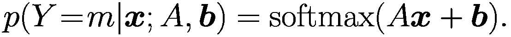(1.3)由于 softmax 函数可以将任何向量转换为概率向量，因此我们得到输出类别 *m* 的条件概率作为输入 ***x*** 的函数。函数！$$\displaystyle \begin{aligned} \text{LRM}({\boldsymbol{x}})=\operatorname{\mathrm{softmax}}(A{\boldsymbol{x}}+\boldsymbol{b}) {} \end{aligned} $$(1.4)被称为 *逻辑回归模型* [48]，其参数向量为 ***w*** = *vec*(*A*, *b*)。一般来说，将输入 ***x*** 映射到输出 *y* 或输出概率分布的函数称为 *模型**f**(*x*; *w*)。该模型使用 *训练数据**Tr* = {(***x***^([1]), *y*^([1])), …, (***x***^([*N*]), *y*^([*N*]))} 进行训练，其中 *示例* (***x***^([*i*]), *y*^([*i*])) 必须是独立同分布的 (*i.i.d.*)。任务是调整参数 ***w***，使得预测概率 *p*(*Y* = *m*|***x***; ***w***) 最大化。根据 *最大似然原理*，可以通过修改参数向量 ***w*** 来实现，使得完整训练数据具有最大概率 [24，第 31 页]![$$\displaystyle \begin{aligned} \max_{\boldsymbol{w}}p(y^{[1]}|{\boldsymbol{x}}^{[1]};{\boldsymbol{w}})*\cdots*p(y^{[N]}|{\boldsymbol{x}}^{[N]};{\boldsymbol{w}}). \end{aligned} $$](../images/528393_1_En_1_Chapter/528393_1_En_1_Chapter_TeX_Equ5.png)(1.5)通过对表达式取对数并乘以 -1.0 得到 *分类损失函数* *L*MC，也称为 *最大熵损失函数*。![$$\displaystyle \begin{aligned} L_{\text{MC}}({\boldsymbol{w}})=-\left[\log p(y^{[1]}|{\boldsymbol{x}}^{[1]};{\boldsymbol{w}})+\cdots+\log p(y^{[N]}|{\boldsymbol{x}}^{[N]};{\boldsymbol{w}})\right]. {} \end{aligned} $$](../images/528393_1_En_1_Chapter/528393_1_En_1_Chapter_TeX_Equ6.png)(1.6)为了优化损失函数，计算其梯度并通过随机梯度下降或其他优化器（参见图 2.4.1）进行最小化。

分类器的性能通过准确率、精确度、召回率、F1 值等在独立的*测试数据*上衡量。21，第 410 页及以下。由于词袋表示法忽略了重要的词序信息，因此使用逻辑回归分类器进行文档分类在当今不太常见。然而，这个模型仍然是大多数深度学习架构的组成部分。

## 1.4 非线性分类器

结果表明，逻辑回归分类器通过线性超平面将输入空间分割，而这些超平面无法解决更复杂的分类任务，例如 XOR 问题。47。一种替代方案是通过额外的*仿射变换**A*[1]***x*** + ***b***[1]生成一个内部*隐藏向量**h**，然后通过单调不减的非线性*激活函数**g**，并使用这个隐藏向量作为逻辑回归分类器的输入来预测随机变量*Y*！$$\displaystyle \begin{aligned} {\boldsymbol{h}} &amp;= g(A_1{\boldsymbol{x}}+\boldsymbol{b}_1) , {} \end{aligned} $$(1.7)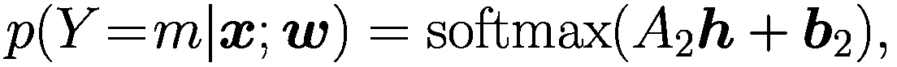(1.8)其中，该模型的参数可以收集在一个参数向量 ***w*** = *vec*(*A*[1], *b*[1], *A*[2], *b*[2])中。非线性激活函数 *g* 的形式相当任意，通常使用 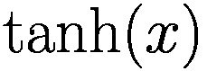 或 *修正线性单元*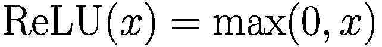。Fcl(***x***) = *g*(*A*[1]***x*** + ***b***[1]) 被称为*全连接层*。这个模型（图 1.1）能够以任意好的方式解决任何分类问题，只要 ***h*** 的长度足够大。21，第 192 页。通过在网络前添加更多的全连接层，我们得到一个*深度神经网络*，它比浅层网络需要的参数更少，可以逼近更复杂的函数。从历史上看，它被称为*多层感知器*（MLP）。Liang 等人[40]表明，对于一大类分段光滑函数，浅层网络逼近函数所需的隐藏向量的大小比深层网络在给定函数逼近程度下所需的神经元数量呈指数级大。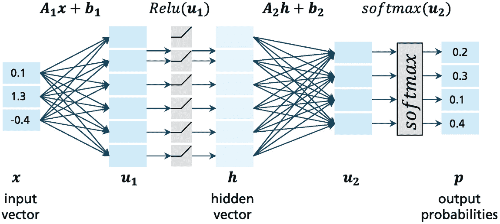

一个神经网络的示意图，其输入节点为 0.1、1.3 和负 0.4，连接到六个块 u 1、u 1 的 ReLU、隐藏向量，通过 A 2 h + b 2 到四个块 u 2、u 2 的 softmax，并以 4 个输出概率 0.2、0.3、0.1 和 0.4 结束。

图 1.1

用于分类的神经网络通过具有仿射变换和非线性激活函数（例如 ReLU）的层转换输入。最后一层通常是一个逻辑分类器

*支持向量机* [14] 采用不同的方法，试图在输入空间中两个类别的训练示例之间创建一个超平面。此外，这个超平面应该与示例保持较大的距离（*间隔*）。该模型减少了过拟合，并且通常具有很高的分类精度，即使输入变量的数量很高，例如在文档分类 [28] 中。它被扩展到不同的核损失标准，例如图核 [56]，这些核包括语法特征。除了 SVM 之外，还使用了许多其他分类器，例如随机森林 [24, p.588f] 和梯度提升树 [24, p.360]，它们是最受欢迎的分类器之一。

对于这些传统分类器，分析师通常需要手动构建输入特征。现代文本分析分类器能够自动创建相关特征（见第 2.1 节）。对于 NLP 模型的训练，存在三种主要范式：

+   *监督训练*基于由输入 ***x*** 和输出 ***y*** 组成的训练数据对，其中 ***x*** 例如是一个文档文本，而 ***y*** 通常是一个手动标注，例如情感。通过优化，模型的未知参数被调整以以最佳方式从输入预测输出。

+   *无监督训练*仅考虑一些数据 ***x*** 并从未标记数据中推导出一些内在知识，例如聚类、密度或潜在表示。

+   *自监督训练*选择观察到的数据向量的一部分作为输入 ***x*** 和输出 ***y***。关键思想是以监督方式从 ***x*** 预测 ***y***。例如，语言模型是一个自监督任务，试图从之前的标记 *v*[1], …, *v*[*t*] 预测下一个标记 *v*[*t*+1]。对于 NLP 模型，这种类型的训练被非常频繁地使用。

## 1.5 生成静态词嵌入

词袋表示法的一个问题是，标记的频率向量无法捕捉词语之间的关系，例如同义和同音，并且没有提供它们语义相似性的任何指示。一种替代方案是基于*分布语义*的思想，这种思想更能够表达词语和文档，由 Zellig Harris [58] 和 John Firth [18] 推广。根据 Firth 的说法，“一个词的特点是它所伴随的词语”。这表明在相同邻域中出现的词语往往具有相似的意义。

基于这一想法，每个词都可以用一个*d[*emb*]-维向量 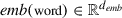italic e m b left parenthesis word right parenthesis element of double struck upper R Superscript d Super Subscript italic e m b) 来表征，即一个*词嵌入*。通常，*d[*emb*]的值选择在 100 到 1000 之间。这些嵌入必须被创建，使得在相似上下文中出现的词具有小的向量距离，例如欧几里得距离。然后，一个文档可以通过这样的嵌入序列来表示。结果发现，如果词的嵌入距离较低，通常这些词具有相似的意义。嵌入可以用作下游文本挖掘任务的输入，例如情感分析。Goldberg [20] 提供了一个关于静态词嵌入的优秀介绍。这些嵌入被称为*静态嵌入*，因为每个词都有一个独立的嵌入，与上下文无关。

有许多不同的方法可以无监督地生成词嵌入。Collobert 等人 [13] 表明，通过预测邻近词获得的词嵌入可以用来提高下游任务（如命名实体识别和语义角色标注）的性能。

**Word2vec** [45] 使用一个极其简单的模型预测中心词附近的词。如图 1.2 所示，它使用中心词的嵌入向量作为逻辑分类器 (1.3) 的输入，以推断大约五到七个位置附近词的概率。训练目标是高概率地预测训练集中的所有邻近词。为了训练，Word2Vec 对语料库中的所有词重复进行这种预测，并通过随机梯度下降优化逻辑分类器的参数以及嵌入的值，以提高邻近词的预测准确性。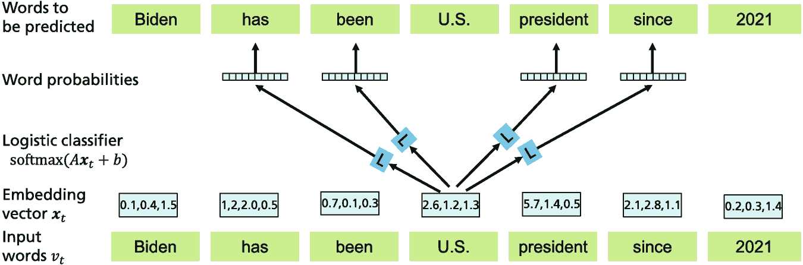

该架构的输入词为 Biden, has, been, U S, president, since, and 2021\. 这些词与嵌入向量相连接。通过逻辑分类器 SoftMax，词 U S 给出 4 个词的概率，指向 has, been, president, 和 since。

图 1.2

Word2vec 通过逻辑分类器*L*预测中心词周围的词语。*L*的输入是中心词的嵌入。通过大量文档的训练，*L*的参数以及嵌入都被学习到 [54, p. 2]。一个文本集合的词汇表包含*k*个不同的词语，例如*k* = 100,000。为了通过 softmax (1.2)预测第*i*个词语的概率，需要计算*k*个指数项 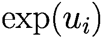。为了避免这种努力，这个分数被近似为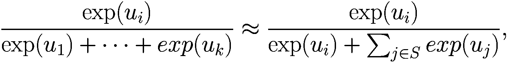(1.9)，其中*S*是随机选择的一些词语索引的小样本，例如 10 个。这种技术被称为*噪声对比估计* [21, p. 612]。有几种变体可用，它们被用于几乎所有的涉及 softmax 计算和许多类别的分类任务。由于随机梯度下降与噪声梯度一起工作，因此由 softmax 函数近似引入的额外噪声并不有害，甚至可以帮助模型逃离局部最小值。Word2Vec 的浅层架构在表示学习方面证明比以前的架构更有效率。

Word2Vec 嵌入已被用于许多下游任务，例如文档分类。此外，通过简单地搜索与目标词嵌入具有较小欧几里得距离的词语，可以检测到具有相似意义的词语。例如，“中子”的最近邻是“中子”，“质子”，“氘”，“正电子”和“衰变”。这样就可以揭示同义词。可以在两个维度上对嵌入进行投影，用于语料库内容的探索性分析。**GloVe**使用来自语料库的聚合全局词-词共现统计来生成类似的嵌入向量 [51]。

结果表明，嵌入之间的差异往往具有可解释性。例如，*emb*(Germany)−*emb*(Berlin)+*emb*(Paris)的结果在欧几里得距离上最近的邻居是*emb*(France)。这种性质被称为*类比*，对于许多关系的大多数例子都成立，如首都-国家、货币-国家等。 [45]。

**FastText** [8] 表示通过使用子词信息丰富了静态词嵌入。从每个单词中提取给定长度的字符 *n*-gram，例如，3–6。然后，为单词及其字符 *n*-gram 定义嵌入向量。为了训练嵌入，将中心词及其周围所有单词和字符 *n*-gram 的嵌入进行平均，并通过逻辑分类器预测中心词及其字符 *n*-gram 的概率。为了提高概率预测，通过随机梯度下降优化模型参数。这适用于训练语料库中的所有单词。训练后，可以使用单词的 *n*-gram 嵌入来重建未见过的单词。*Starspace* [68] 被引入作为 FastText 的一般化。它通过分析与之相关的文本并评估图结构，允许嵌入任意实体（如作者、产品）。另一种选择是 *球面嵌入*，其中无监督的词和段落嵌入被限制在超球面上 [44]。

## 1.6 循环神经网络

*循环神经网络*（Recurrent Neural Networks）是为了模拟长度可变的序列 *v*[1]，…，*v*[*T*]，例如文本文档的标记而开发的。考虑这样一个任务：根据前面的标记（*v*[1]，…，*v*[*t*]）预测下一个标记 *v*[*t*+1]。正如 Bengio 等人提出的 [6]，每个标记 *v*[*t*] 都由一个嵌入向量 ***x***[*t*] = *emb*(*v*[*t*]) 表示，它表示 *v*[*t*] 的含义。前面的标记由一个隐藏向量 ***h***[*t*] 描述，它描述了子序列（*v*[1]，…，*v*[*t*−1]）的状态。RNN 是一个函数 Rnn(***h***[*t*]，***x***[*t*])，通过以下公式预测下一个隐藏向量 ***h***[*t*+1]：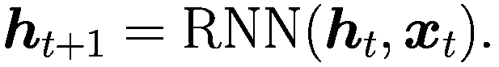(1.10)随后，一个具有参数 *H* 和 ***g*** 的 *逻辑分类器* (1.3) 使用 *h*[*t*+1] 中包含的信息预测下一个标记 *v*[*t*+1] 的概率向量，如下所示：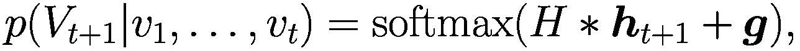(1.11)如图 1.3 所示。在这里，*V*[*t*] 是位置 *t* 处可能标记的随机变量。根据条件概率的定义，整个序列的联合概率可以分解为！$$\displaystyle \begin{aligned} p(v_1,\ldots,v_T) = p(V_T\mkern1.5mu{=}\mkern1.5mu v_T|v_1,\ldots,v_{T-1})* \cdots* p(V_2\mkern1.5mu{=}\mkern1.5mu v_2|v_1)*p(V_1\mkern1.5mu{=}\mkern1.5mu v_1). {} \end{aligned} $$(1.12)一个计算自然语言文本的联合概率或条件概率的模型被称为 *语言模型*，因为它可能涵盖了关于语言的所有信息。通常将按条件概率顺序预测下一个单词的语言模型称为 *自回归语言模型*。根据 (1.12)，观察到的标记（*v*[1]，…，*v*[*t*]）可以用作输入来预测下一个标记 *V*[*t*+1] 的概率。这些概率的乘积产生了观察到的标记序列（*v*[1]，…，*v*[*T*]）的正确联合概率。相同的模型 Rnn(***h***，***x***) 重复应用并生成一系列隐藏向量 ***h***[*t*]。一个 *简单的 RNN* 只包含一个 *全连接层*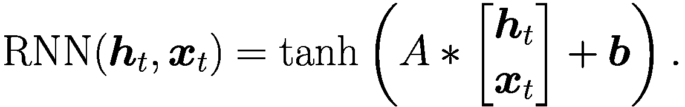(1.13)预测的单词 *v*[1]，…，*v*[*T*] 的概率取决于参数 ***w*** = *vec*(*H*，***g***，*A*，***b***，*emb*(*v*[1])，…，*emb*(*v*[*T*]))。为了提高这些概率，我们可能使用随机梯度下降优化器（Sect. 2.​4.​1）并调整 ***w*** 中的未知参数。请注意，这还包括估计新的标记嵌入 *emb*(*v*[*t*])。最近的一个概述可以在 [70，Ch. 8–9] 中找到。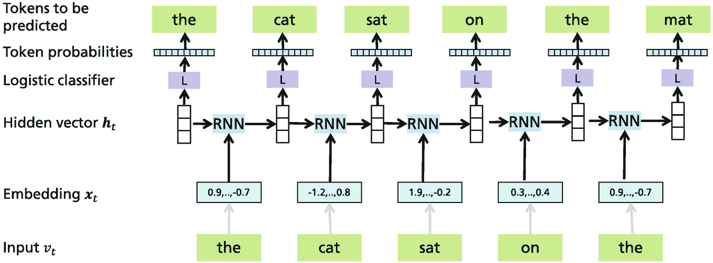

一种架构具有输入单词 the, cat, sat, on 和 the。这些与嵌入向量、隐藏向量、逻辑分类器、标记概率相连接，并以要预测的标记结束，这些标记是 the, cat, sat, on, the, mat。

图 1.3

RNN 从左侧开始，并使用逻辑分类器 *L* 依次预测下一个标记的概率，条件是使用前面的标记。隐藏向量 ***h***[*t*] 存储关于位置 *t* 之前出现的标记的信息

结果表明，这个模型在重建远程序列元素之间的关系方面存在困难，因为随着序列变长，梯度往往会消失或“爆炸”。因此，已经开发出了新的 RNN 类型，例如 *长短期记忆* (LSTM) [26] 和 *门控循环单元* (GRU) [11]，它们在序列中更好地捕捉长距离依赖关系。

除了预测序列中的下一个单词外，RNN 还成功应用于预测序列元素的属性，例如命名实体识别 [36] 和关系抽取 [38]。对于这些应用，已经开发出了 *双向 RNN*，它由一个正向语言模型和一个反向语言模型组成。*正向语言模型* 从文本的开始处开始，预测下一个标记，而 *反向语言模型* 从文本的末尾开始，预测上一个标记。双向 LSTM 也被称为 *biLSTMs*。此外，还提出了 *多层 RNN* [72]，其中一层中 RNN 单元的生成的隐藏向量被用作下一层 RNN 单元的输入，最后一层提供当前任务的预测。

*机器翻译* 从一种语言到另一种语言是 RNN 的重要应用 [5]。在这个过程中，一个输入句子首先被一个 *编码器* RNN 编码为一个隐藏向量 ***h***[*T*]。这个隐藏向量随后被第二个 *解码器* RNN 作为初始隐藏向量用来生成目标语言句子的单词。然而，RNN 仍然难以捕捉序列元素之间长距离的关系，因为 RNN 不涵盖远程序列元素之间的直接关系。

*注意* 首次在机器翻译的背景下使用，用于在长距离传递信息。它计算解码器 RNN 的隐藏向量和编码器 RNN 在不同位置的隐藏向量之间的相关性。这种相关性被用来构建一个 *上下文向量*，作为相关编码器隐藏向量的加权平均。然后，这个上下文向量被用来提高最终的翻译结果 [5]。结果翻译比原始 RNN 的翻译要好得多。我们将在后面的章节中看到，注意是一个构建更好的 NLP 模型的基本原理。

**ELMo** [52] 使用多层双向 LSTM 语言模型生成嵌入。该模型使用大量非标注文本语料库进行预训练，作为正向和反向语言模型。在微调期间，使用隐藏向量的平均值来预测基于标注训练集的词性。这些语言模型考虑了位置前后词语，因此为中央位置的词语提供了上下文表示。对于各种任务，如情感分析、问答和文本蕴含，ELMo 能够提高 Sota 性能。

## 1.7 卷积神经网络

*卷积神经网络* (*CNNs*) [37] 因其在图像领域的成功而广为人知。它们从称为 *滤波器核* 的小型二次参数排列开始，该核在图像的输入像素矩阵上移动。滤波器核的值与底层像素值相乘，生成一个输出值。对于输入像素矩阵的每个位置都重复此操作。在训练过程中，滤波器核的参数会自动调整，以便检测局部图像模式，如块或线条。网络的每一层，也称为 *卷积层*，由许多滤波器核组成，一个网络包含多个卷积层。间隔的 *最大池化* 层通过最大值进行局部像素聚合。卷积神经网络的最后一层通常是一个具有 softmax 分类器的全连接层。

他们的突破是 *AlexNet* [34]，它接收图像的 RGB 像素矩阵作为输入，并负责为图像分配内容类别。该模型赢得了 2012 年的 *ImageNet* 比赛，其中图像必须被分配到 1000 个类别之一，并展示了深度神经网络的优越性能。更早之前，Cireşan 等人的深度 CNN [12] 在多个图像分类基准测试中实现了 Sota 性能。一个非常成功的 CNN 是 *ResNet* [25]，它使用一种所谓的 *残差连接* 作为旁路。它可以绕过训练开始阶段的许多层，是训练具有数百层神经网络的密钥。它导致了具有比人类更高的准确率的图像分类器。

当循环神经网络被认为是最适合处理如文本这样的顺序输入时，一些基于 CNN 的架构被引入，它们在某些 NLP 任务上实现了高性能。Kim [32] 提出了一种相当浅的 CNN 用于句子分类。它包含一个嵌入层、一个卷积层、一个最大池化层和一个具有 softmax 输出的全连接层。*一维卷积*被应用于输入单词的嵌入，基本上结合了相邻单词中存储的信息，将它们视为 *n*-grams。嵌入通过具有可训练权重的移动平均进行处理。使用这种架构进行分类已被证明非常高效，其性能与更难训练的循环架构相似。

另一个有趣的卷积神经网络架构是 *wavenet* [49]，这是一个主要用于文本到语音合成的更深层次的网络。它由多个堆叠在一起的卷积层组成，其主要成分是 *扩张因果卷积*。因果意味着位置 *t* 的卷积只能利用先前的信息 ***x***[1]，…，***x***[*t*−1]。扩张意味着卷积可以跳过具有特定步长 *k* 的输入值，即在某些层中，位置 *t* 的特征是通过位置 *t*、*t* − *k*、*t* − 2*k*，… 的信息预测的。这个步长 *k* 在每一层连续加倍，产生大小为 *k*⁰、*k*¹、*k*²，… 的扩张。这样，可以包含非常长的时间跨度进行预测。这种模型架构已被证明在文本到语音合成方面取得了非常好的效果。

## 1.8 摘要

经典的自然语言处理有着悠久的历史，机器学习模型在该领域已经使用了数十年。它们都需要一些预处理步骤来从输入文本生成单词或标记。标记尤其有价值，因为它们形成了一个有限大小的字典，并允许任意单词通过组合来表示。因此，它们被大多数 PLM 所使用。早期的文档表示，如词袋模型，现在已经过时，因为它们忽略了序列信息。尽管如此，基于它们的分类器，如逻辑分类器和全连接层，是 PLM 的重要构建块。

静态词嵌入的概念引发了自然语言处理领域的革命，该领域基于上下文词嵌入。这些想法将在下一章中详细阐述。循环神经网络被用来实现第一个成功的语言模型，但被基于注意力的模型完全取代。用于图像处理的卷积神经网络在许多应用中仍然被采用。今天的预训练语言模型在图像数据上通常具有相似的性能，有时将 CNN 与 PLM 结合以利用它们各自的优势，如第七章所述。

**开放获取** 本章节根据 Creative Commons Attribution 4.0 International License（[`creativecommons.org/licenses/by/4.0/`](http://creativecommons.org/licenses/by/4.0/)）的条款进行许可，允许在任何媒介或格式中使用、分享、改编、分发和复制，只要您适当引用原始作者和来源，提供 Creative Commons 许可的链接，并指出是否进行了修改。

本章节中的图像或其他第三方材料包含在本章节的 Creative Commons 许可中，除非在材料引用行中另有说明。如果材料未包含在本章节的 Creative Commons 许可中，且您的使用意图不受法定法规允许或超出允许的使用范围，您将需要直接从版权持有人处获得许可。
