# 2. 预训练语言模型

Gerhard Paaß^(1  ) 和 Sven Giesselbach¹(1)知识发现部门，NLU 团队，弗劳恩霍夫智能分析和信息系统研究所（IAIS），圣奥古斯丁，北莱茵-威斯特法伦，德国

## 摘要

本章介绍了基于注意力的语言模型的主要架构类型，这些模型描述了文本中标记的分布：类似于 BERT 的自动编码器接收输入文本并为每个标记生成上下文嵌入。类似于 GPT 的自回归语言模型接收输入文本的子序列作为输入。它们为每个标记生成上下文嵌入并预测下一个标记。这样，可以依次生成文本中的所有标记。这些模型通常在大规模通用训练集上预训练，并且经常针对特定任务进行微调。因此，它们被统称为预训练语言模型（PLM）。当这些模型的参数数量很大时，它们通常可以通过提示来指导，被称为基础模型。在接下来的章节中，我们描述了用于训练的优化和正则化方法的细节。最后，我们分析了模型预测的不确定性以及预测可能如何被解释。

关键词 BERT 语言模型 GPT-2Transformer 预训练微调序列到序列模型一个计算自然语言文本的联合概率或条件概率的模型被称为*语言模型*，因为它可能涵盖了关于语言的所有信息。在本章中，我们介绍了基于注意力的*语言模型*（*LMs*）的主要架构类型，这些模型处理由*标记*（即单词、数字、标点符号等）组成的文本序列：

+   *自动编码器* (*AE*) 接收输入文本并为每个标记生成上下文嵌入。这些模型也被称为*BERT 模型*，在 2.1 节中进行了描述。

+   *自回归*语言模型 (*AR*) 接收输入文本的子序列 *v*[1]，…，*v*[*t*−1]。它们为每个标记生成上下文嵌入并使用它们来预测下一个标记 *v*[*t*]。这样，它们可以依次预测序列中的所有标记。这些模型也被称为*GPT 模型*，在 2.2 节中进行了概述。

+   **Transformer 编码器-解码器**的任务是将输入序列转换为另一个序列，例如进行语言翻译。首先，它们通过自动编码器为每个输入标记生成上下文嵌入。然后，这些嵌入被用作自回归语言模型的输入，该模型按顺序生成输出序列标记。这些模型也被称为**Transformers**，并在 Sect. 2.3 中定义。

在本章中，我们专注于 NLP，其中我们考虑文本标记的序列。历史上，Transformer 编码器-解码器是由 Vaswani 等人于 2017 年[141]开发的，用于将文本翻译成另一种语言。**自动编码器**[39]和**自回归语言模型**[118]是此 Transformer 编码器-解码器的编码部分和解码部分，后来被提出。由于它们在概念上更简单，它们在前面的章节中介绍。最后一节（Sect. 2.4）描述了在训练过程中优化模型、确定模型架构和估计模型预测不确定性的方法。

结果表明，模型可以先在大规模通用文本文档训练集上训练，并能够获得正确流畅语言中标记的分布。随后，它们可以被调整到特定任务，例如通过使用小规模监督分类任务进行微调。因此，这些模型被称为**预训练语言模型**。

如我们稍后所见，所有模型都可以应用于任意序列，例如音乐音符、声音、语音、图像，甚至视频。当这些模型的参数数量变得很大时，它们通常可以通过提示来指导，被称为**基础模型**。

## 2.1 BERT：自注意力与上下文嵌入

常用词汇通常有多种不同的含义。例如，对于单词**“bank”**，词汇数据库 WordNet [94] 列出了从**“斜坡土地”**到**“金融机构”**的 18 种不同含义。在 Sect. 1.5 中引入的单词**“bank”**的简单嵌入中，所有这些含义都被合并了。因此，基于这些嵌入的文本解释是有缺陷的。

作为一种替代方案，开发了**上下文嵌入**或上下文化嵌入，其中单词嵌入的细节取决于单词本身以及特定文档中出现的邻近单词。因此，文本中相同单词的每次出现都有不同的嵌入，这取决于上下文。从 Transformer [141] 开始，已经设计了许多方法来生成这些上下文嵌入，这些嵌入通常使用大量文档语料库以无监督的方式进行训练。

**BERT**（来自 Transformer 的双向编码器表示）由 Devlin 等人提出 [39]，是生成上下文嵌入最重要的方法。BERT 基于注意力的概念 [8] 和 Vaswani 等人的先前工作 [141]。**注意力**的概念受到大脑机制的影响，当处理大量信息时，大脑机制倾向于关注记忆中的独特部分。计算细节由 Rush [126] 解释。

### 2.1.1 BERT 输入嵌入和自注意力

作为输入，BERT 接收一些文本，这些文本被转换为标记，例如通过 Wordpiece 标记化器（第 1.2 节）进行转换，具有选定大小的词汇表，例如 30,000。这意味着像 *“狗”* 这样频繁的单词由它们自己的标记表示，但像 *“玩耍”* 这样更罕见的单词被拆分为几个标记，例如 *“play”* 和 *“##ing”*，其中 *“##”* 表示该标记是单词的一部分。由于所有字符都保留为标记，任意单词可能由几个标记表示。此外，还有一些特殊标记，如输入文本的第一个位置的 *[CLS]* 标记和两个 *“[SEP]”* 标记，用于标记文本段的结束。最后，在训练过程中，有 *（此处应有内容）* 标记，如后文所述。每个标记由一个 *标记嵌入* 表示，这是一个长度为 *d*[*emb*] 的向量，例如 *d*[*emb*] = 768。可变长度的输入序列通过特殊填充标记填充到最大长度。

由于所有标记嵌入都是同时处理的，因此标记需要指示它们在输入文本中的位置。因此，每个位置都标记有与标记嵌入相同长度的 *位置嵌入*，它编码位置索引。BERT 论文通过可训练嵌入编码位置编号，这些嵌入被添加到输入标记嵌入 [39]。最后，BERT 比较第一个和第二个输入段。因此，算法需要知道哪个标记属于第一个和第二个段。这也通过添加到标记和位置嵌入的可训练段嵌入进行编码。所有嵌入的总和被用作 BERT 的 *输入嵌入*。一个示例在图 2.1 中显示。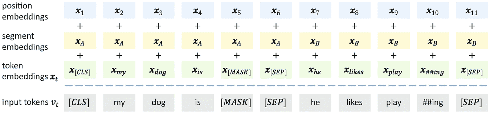

一个表格有 3 行位置嵌入、段嵌入和输入标记的标记嵌入 x 下标 t，以及它们各自的数据行。

图 2.1

BERT 模型的输入由对应于输入标记的嵌入序列组成。每个标记由一个总和表示，包括标记文本的嵌入、其段指示符的嵌入以及其位置的嵌入 [39]

#### 自注意力生成上下文嵌入

BERT 以输入序列 *v*[1], …, *v*[*T*] 中每个标记 *v*[*t*] 的长度为 *d*[*emb*] 的输入嵌入 ***x***[*t*] 开始。这些嵌入通过线性映射转换为所谓的 *查询向量***q***[*t*]，*键向量***k***[*t*] 和 *值向量***v***[*t*]。这些向量通过将 ***x***[*t*] 与矩阵 ***W***^((*q*)), ***W***^((*k*)), 和 ***W***^((*v*)) 相乘得到，这些矩阵的维度分别为 *d*[*emb*] × *d*[*q*]，*d*[*emb*] × *d*[*q*] 和 *d*[*emb*] × *d*[*v*]！$$\displaystyle \begin{aligned} \boldsymbol{q}_t^\intercal={\boldsymbol{x}}_t^\intercal {\boldsymbol{W}}^{(q)} \qquad  \boldsymbol{k}_t^\intercal = {\boldsymbol{x}}_t^\intercal {\boldsymbol{W}}^{(k)} \qquad  {\boldsymbol{v}}_t^\intercal={\boldsymbol{x}}_t^\intercal {\boldsymbol{W}}^{(v)}. {} \end{aligned} $$(2.1)注意查询向量和键向量具有相同的长度。然后计算目标标记 *v*[*r*] 的查询向量 ***q***[*r*] 与序列中所有标记的键向量 ***k***[*t*] 之间的标量积 ！$$\displaystyle \begin{aligned} (\alpha_{r,1},\ldots,\alpha_{r,T})=\operatorname{\mathrm{softmax}}\left( \frac{\boldsymbol{q}^\intercal_r\boldsymbol{k}_1}{\sqrt{d_k}},\ldots, \frac{\boldsymbol{q}^\intercal_r\boldsymbol{k}_T}{\sqrt{d_k}}\right). {} \end{aligned} $$(2.2)每个标量积产生一个实值 *关联分数*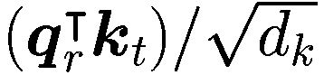，它取决于矩阵 ***W***^((*q*)) 和 ***W***^((*k*))。这个关联分数被称为 *缩放点积注意力*。通过 softmax 函数将其归一化到概率分数 *α*[*r*,*t*]。因子 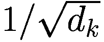 避免了 softmax 函数只有微小梯度的较大值。使用这些权重，对所有序列元素的价值向量 ***v***[*t*] 进行加权平均，得到目标标记 *v*[*r*] 的新嵌入 ***x***̆[*r*]，长度为 *d*[*v*]！$$\displaystyle \begin{aligned} \breve{{\boldsymbol{x}}}_r = \alpha_{r,1}*{\boldsymbol{v}}_1+\cdots+\alpha_{r,T}*{\boldsymbol{v}}_T {}. \end{aligned} $$(2.3)这个算法被称为 *自注意力*，最初由 Vaswani 等人提出 [141]。图 2.2 展示了 *r*-th 标记 *“mouse”* 的计算。注意，生成的嵌入是一个 *上下文嵌入*，因为它包含了关于输入文本中所有单词的信息。当标量积 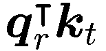 较大时，***v***[*t*] 的一个分量会获得高权重。它衡量了 ***x***[*r*] 和 ***x***[*t*] 之间的特定相关形式，如果向量 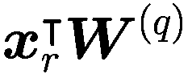 和 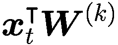 指向同一方向，则该相关形式达到最大值。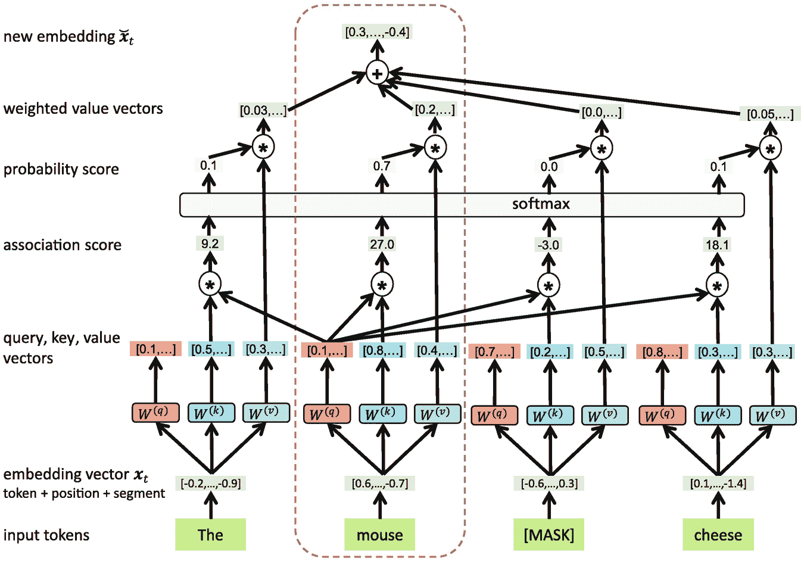

输入标记 the、mouse、MASK（方括号内）和 cheese 之间有一个相互关联的嵌入系统。它们被分为嵌入向量、查询和键值向量、关联和概率分数、加权值向量和新的嵌入部分。

图 2.2

通过自注意力计算单个标记“mouse”的上下文嵌入。通过包含“cheese”的嵌入，鼠标的嵌入可以转移到“rodent”的意义上，并远离“计算机指针”。这种嵌入为输入序列中的每个单词都进行计算。

自注意力机制通常是非对称的，因为矩阵 ***W***^((*q*)) 和 ***W***^((*k*)) 是不同的。如果标记 *v*[*i*] 对标记 *v*[*j*] 有高注意力（即 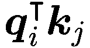 很大），这并不一定意味着 *v*[*j*] 会对标记 *v*[*i*] 有高度注意力（即 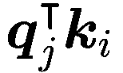 也很大）。因此，*v*[*i*] 对 *v*[*j*] 的上下文嵌入的影响与 *v*[*j*] 对 *v*[*i*] 的上下文嵌入的影响是不同的。考虑以下示例文本“Fred gave roses to Mary”。在这里，单词“gave”与剩余单词有不同的关系。“Fred”是执行给予的人，“roses”是被给予的对象，“Mary”是接受这些对象的人。显然，这些语义角色关系是非对称的。因此，它们可以用不同的矩阵 ***W***^((*q*)) 和 ***W***^((*k*)) 来捕捉，并可以编码在嵌入中。

自注意力允许更短的计算路径，并为直接比较输入序列中的远程元素提供了途径，例如句子中的代词及其先行词。注意力中涉及到的乘性交互为 MLPs 和 CNNs 的固定权重计算提供了更灵活的替代方案，通过动态调整计算以适应当前输入。这在语言建模中特别有用，例如，处理句子“她用 X 吃了冰淇淋”。虽然前馈网络始终以相同的方式处理它，但基于注意力的模型可以调整其计算以适应输入，并在 X 是“勺子”时更新单词“ate”的上下文嵌入，或者在 X 指的是“草莓”时更新“ice-cream”的嵌入 [17]。

在实践中，所有查询、键和值向量都是通过 ***Q*** = ***XW***^((*q*)), ***K*** = ***XW***^((*k*)), ***V*** = ***XW***^((*v*)) 并行计算的，其中 ***X*** 是输入嵌入的 *T* × *d*[*emb*] 矩阵 [141]。查询向量 ***q***[*t*]，键向量 ***k***[*t*] 和值向量 ***v***[*t*] 分别是 ***Q***，***K***，***V*** 的行。然后，通过一个大的矩阵表达式计算自注意力输出矩阵 ATTL(X)！$$\displaystyle \begin{aligned} \breve{{\boldsymbol{X}}}=\text{ATTL}({\boldsymbol{X}})=\text{ATTL}(\boldsymbol{Q},\boldsymbol{K},\boldsymbol{V})=\operatorname{\mathrm{softmax}}\left(\frac{\boldsymbol{Q}\boldsymbol{K}^\intercal}{\sqrt{d_k}}\right)\boldsymbol{V} {}, \end{aligned} $$(2.4)，得到一个 *T* × *d*[*v*] 的矩阵 ***X***̆。它的 *r*-th 行包含第 *r*- 个标记 *v*[*r*] 的新嵌入 ***x***̆[*r*]。

除了缩放点积注意力（2.2）之外，还提出了许多替代的兼容性度量方法。然而，正如调查[27, 46]所描述的，它们在 PLMs 中很少被使用。

结果表明，单个自注意力模块不足以表征标记。因此，在一个层 *d*[head] 并行自注意力中，使用不同的矩阵 , 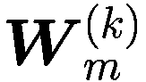, 和 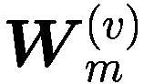, *m* = 1, …, *d*[head]，得到部分新的嵌入 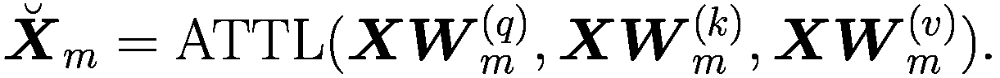(2.5) 对于一个标记 *v*[*t*] 的出现的部分嵌入 ***x***̆[*m*,*t*] 能够专注于互补的语义方面，这些方面在训练过程中发展。BERT[BASE]模型有 *d*[head]=12 个这样的并行 *注意力头*。这些头嵌入的长度只是原始长度 *d*[*emb*] 的一个分数 *d*[*emb*]∕*d*[head]。得到的嵌入通过一个 (*d*[head] ∗ *d*[*v*]) × *d*[*emb*]-矩阵 *W*^((*o*)) 连接并相乘，得到中间嵌入矩阵 ![$$\displaystyle \begin{aligned} \breve{{\boldsymbol{X}}} &amp;= \left[\breve{{\boldsymbol{X}}}_1,\ldots,\breve{{\boldsymbol{X}}}_{d_{\text{head}}}\right] {\boldsymbol{W}}_0 {}, \end{aligned} $$](../images/528393_1_En_2_Chapter/528393_1_En_2_Chapter_TeX_Equ6.png)(2.6) 其中 ***W***[0] 是一个参数矩阵。如果输入嵌入的长度是 *d*[*emb*]，则查询、键和值向量的长度选择为 *d*[*k*] = *d*[*v*] = *d*[*emb*]∕*d*[head]。因此，连接再次创建一个 *T* × *d*[*emb*] 矩阵 ***X***̆。这种设置被称为 *多头自注意力*。由于单个头的维度减少，总的计算成本与全维度的单头注意力相似。随后，***X***̆ 的每一行，即中间嵌入向量 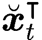，通过一个 *全连接层*Fcl 转换，后跟一个 ReLU 激活，然后是另一个线性变换 [141](2.7) 矩阵 ***W***[0]，***W***[1]，***W***[2] 和向量 ***b***[1]，***b***[2] 是参数。这些变换对于序列中的每个标记 *v*[*t*] 都是相同的，从而得到嵌入 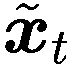。为了提高训练速度，添加了 *残差连接* 作为“旁路”，它简单地复制输入。它们已被证明对于多层图像分类器的优化非常有帮助 [54]。此外，使用 *层归一化* [6] 进行正则化（见第 2.4.2 节），如图 2.3 所示。多头自注意力 (2.5)、连接 (2.6) 和全连接层 (2.7) 一起形成一个 *编码块*。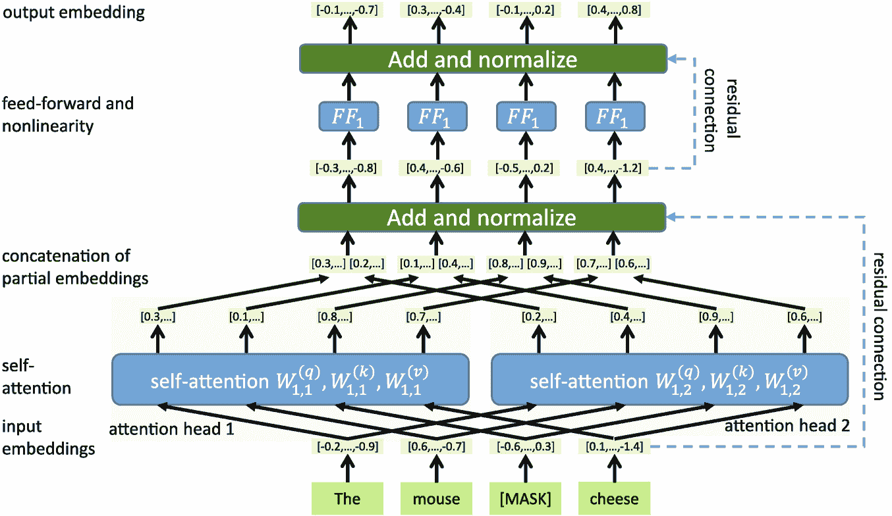

输入 the、mouse、方括号内的 MASK 和 cheese 的流程图显示了划分为输入嵌入、自注意力、部分嵌入的连接、前馈和非线性和通过残差连接的输出嵌入的相互连接的嵌入系统。

图 2.3

多头自注意力计算每个层*l*和头*m*的自注意力，使用不同的矩阵 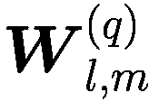, 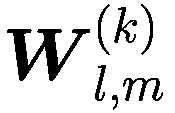, 和 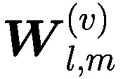。这样，可以计算标记对之间的不同方面的关联，例如“mouse”和“cheese”。结果嵌入通过前馈网络连接和转换。此外，残差连接和层归一化提高了训练的收敛性 [39]。这个过程在多个*k*层中重复，使用一个块的输出嵌入作为下一个块的输入嵌入。这种设置如图 2.4 所示。最后一个编码块的嵌入提供了所需的上下文嵌入。编码器块的结构通过允许输入序列中的每个标记直接确定与序列中其他标记的关联，克服了 RNN（即 RNN 的顺序性质）的限制。BERT[BASE]有*k*=12 个编码器块。它由 Devlin 等人开发于 Google [39]。关于自注意力的实现细节，可以在这些论文中找到 [38, 41, 126]。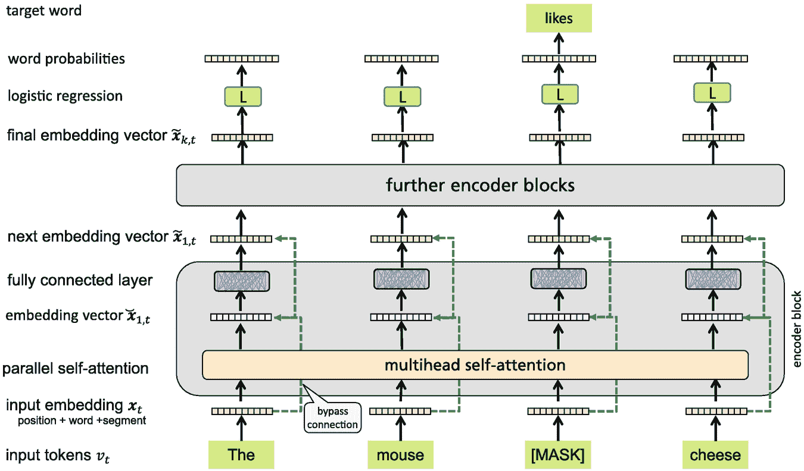

输入标记 the、mouse、方括号内的 MASK 和 cheese 之间有一个相互连接的嵌入系统。它们被划分为输入嵌入、并行自注意力、嵌入向量、全连接层和目标词等部分，通过编码器块实现。

图 2.4

BERT 在每个编码器块中通过并行计算上下文嵌入。编码器块的输出嵌入被用作下一个编码器的输入嵌入。最后，使用最后一个编码块的对应上下文嵌入作为输入，由逻辑分类器*L*预测掩码标记。

### 2.1.2 通过预测掩码标记训练 BERT

BERT 模型有大量的未知参数。这些参数通过两步程序进行训练。

+   *预训练*使模型能够以无监督的方式获取关于语言的一般知识。模型的任务是填充文本中的缺失单词。由于不需要手动标注，预训练可以使用大量的文本语料库。

+   *微调* 将预训练模型调整到特定任务，例如情感分析。在这里，模型参数通过使用较小的标记训练数据集来适应解决这个任务。

在微调任务上的表现比没有预训练的要好得多，因为模型可以通过**迁移学习**使用预训练期间获得的知识。为了预训练模型参数，设计了一个训练任务：**掩码语言模型**（MLM）。大约 15%的训练文档中的输入标记被选中进行预测，这通过一个逻辑分类器（见第 1.3 节）来完成！

+   80% 的时间里使用一个特殊的 *斜体* 标记（例如，“the mouse likes cheese” 变成 “the mouse *

+   10% 的时间内使用随机令牌（例如，*“老鼠喜欢奶酪”* 变成 *“老鼠没有奶酪”*）；

+   10% 的时间内保持标签标记不变（例如，*“the mouse likes cheese”* 变成 *“the mouse likes cheese”*）。

第二种和第三种变体被引入，因为预训练和后续微调之间存在差异，尤其是在没有 *

除了预测掩码标记外，BERT 还必须预测下一个句子是随机选择的句子还是实际的后续句子（*下一个句子预测*）。这要求 BERT 考虑连续两段文本之间的关系。再次使用接收第一个*[CLS]*标记嵌入的逻辑分类器进行此分类。然而，这项任务对 BERT 的性能影响不大，因为 BERT 只是学会了两个句子的主题是否相似 [158]。

在图 2.4 中，任务是预测输入文本“鼠标奶酪”中标记“likes”的高概率。在训练开始时，这个概率将非常小（≈1/标记数量）。通过反向传播为每个未知参数确定导数，指示参数应该如何改变以增加“likes”的概率。BERT 的未知参数包括词汇表中每个标记的输入嵌入，每个位置的嵌入，每个层*l*和注意力头*m*的矩阵，，（2.4），全连接层的参数 (2.7) 以及逻辑分类器的*A*，***b***（2.8）。BERT 使用 Adam 算法 [69] 进行随机梯度下降。

BERT[BASE]模型具有*隐藏大小*[*emb*]=768，*k*=12 个编码块，每个编码块包含*head*[*d*]=12 个注意力头，总共有 1100 万个参数。BERT[LARGE]模型具有*隐藏大小*[*emb*]=1024，*k*=24 个编码块，每个编码块包含*head*[*d*]=16 个注意力头，总共有 3.4 亿个参数 [39]。英语维基百科和包含 33 亿个单词的书籍语料库由 WordPiece 分词器 [154] 编码，词汇量为 30,000 个标记，并用于预训练 BERT。不需要人类对文本进行标注，因此训练是自监督的。在 64 个 TPU 芯片上预训练耗时 4 天，这些 TPU 芯片是非常快速的 GPU 芯片，允许并行处理。微调可以在单个图形处理单元（GPU）上完成。

为了预测掩码标记，模型必须学习许多类型的语言理解特征：语法（*is* 是动词的好位置），语义（例如，老鼠喜欢奶酪），语用学，指代等。请注意，计算可以并行处理输入序列的每个标记，消除了循环神经网络中的序列依赖性。这种并行性使得 BERT 和相关模型能够利用现代 SIMD（单指令多数据）硬件加速器（如 GPU/TPU）的全部能力，从而促进了在前所未有的数据集上训练 NLP 模型。在心理学中，重建句子中缺失的标记已经使用了很长时间。因此，预测掩码标记也被称为来自格式塔理论（一个心理学流派）中的“闭合”的 *闭合任务*。

结果表明，BERT 在预测掩码标记方面取得了优异的成绩，并且额外的编码器块显著提高了准确率。例如，BERT 能够以 45.9% 的准确率预测原始单词（或单词的部分），尽管在许多情况下，目标位置上有几个值是有效的 [125]。与传统的语言模型相比，MLM 考虑了掩码目标标记之前和之后的标记。因此，它被称为 *双向编码器*。此外，自注意力直接提供了与远程标记的关系，而不需要应用循环模型。最后，自注意力速度快，因为它可以并行计算编码器块的所有输入标记。

### 2.1.3 将 BERT 微调到下游任务

神经网络已经在多年前进行了预训练 [16]，但预训练的成功在近年来变得更加明显。在预训练期间，BERT 学习了语言的通用语法和语义属性。这可以在后续的 *微调* 期间用于特殊训练任务。这种方法也被称为 *迁移学习*，因为预训练期间获得的知识被转移到相关应用中。与其它模型相比，BERT 对于广泛的自然语言处理任务只需要最小的架构更改。在其发布时，BERT 在各种自然语言处理任务上提高了 Sota（最先进的技术）。

通常，微调任务需要一个分类，通过将逻辑分类器 *L* 应用到 BERT 最后一个编码器块位置 1 的 *[CLS]* 标记的输出嵌入 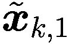 来解决。如图 2.5 所示，存在不同类型的微调任务。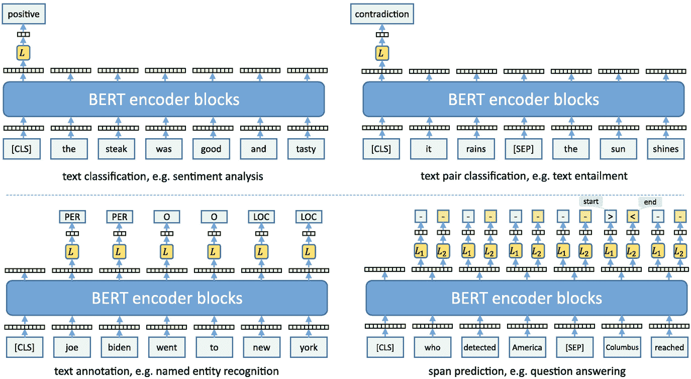

4 个框图通过 BERT 编码器块解释了左侧的文本分类和文本标注，以及右侧的文本对分类和跨度预测。

图 2.5

对于微调，BERT 通过添加一个包含一个或多个逻辑分类器*L*的额外层得到增强，这些分类器以最后一层的嵌入作为输入。这种设置可以用于文本分类和将文本与*[CLS]*嵌入作为逻辑分类器输入进行比较。对于序列标注，*L*为每个序列标记预测一个类别。对于跨度预测，两个逻辑分类器*L*[1]和*L*[2]预测答案短语的起始和结束位置 [39]。

+   *文本分类*将一个句子分配到两个或更多类别之一。例子包括将餐厅评论分类为正面/负面或对句子进行良好/差的英语分类。在这里，开始标记*[CLS]*的输出嵌入被用作*L*的输入以生成最终的分类。

+   *文本对分类*比较由*“[SEP]”*分隔的两个句子。例子包括判断第二个句子是否对第一个句子有暗示、矛盾或中立，或者两个句子是否在语义上等价。同样，输出嵌入的开始标记*[CLS]*被用作*L*的输入。有时会比较多个句子与根句子。然后为每个句子对计算输出，并联合归一化到概率。

+   *词标注*为输入文本的每个单词或标记分配一个特定的属性。一个例子是*命名实体识别*（NER）将标记标注为五个名称类别（例如，“人”，“地点”，…，“其他”）。在这里，相同的逻辑模型*L*应用于每个位置*t*输出的嵌入，并产生不同实体类别的概率向量。

+   *跨度预测*在文本中标记一个短序列的标记。一个例子是*问答*。BERT 的输入是一个问题，后面跟着*“[SEP]”*和一个上下文文本，假设它包含答案。在这里，两个不同的逻辑分类器*L*和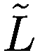应用于上下文的每个标记输出嵌入，并生成答案在特定位置开始/结束的概率。选择具有最高起始/结束分数总和的有效跨度（即结束不在开始之前），作为答案。一个例子是输入*“[CLS] 当凯撒什么时候去世？ [SEP] … 在公元前 44 年 3 月 15 日，凯撒被一群反叛的参议员暗杀 …”*，其中问题的答案是跨度*“Ides*[*起始*]*of March, 44 BC*[*结束*]*”。跨度预测可以应用于许多类似任务。

因此，BERT 只需要添加一个或多个逻辑分类器层来进行微调。在下游应用中进行微调时，逻辑模型的参数是从头开始学习的，并且通常所有预训练的 BERT 模型中的参数都会进行适配。在微调过程中，掩码语言模型和下一个句子预测的逻辑分类器的参数没有被使用。

### 2.1.4 可视化注意力和嵌入

根据 Bengio 等人[14]的研究，一种好的语言表示应该能够捕捉到文本数据中包含的隐含语言规则和常识知识，例如词汇意义、句法关系、语义角色以及语言使用的语用学。BERT 的上下文词嵌入可以被视为在这一方向上的一大步。它们可以被用来消除同一词语的不同含义。

BERT 的自注意力机制计算了大量的“关联”关系，根据这些关联的强度合并嵌入。如果***x***[1], …, ***x***[*T*]是输入标记*v*[1], …, *v*[*T*]的嵌入，那么查询和键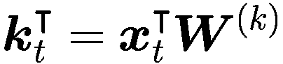向量之间的关联被确定(2.1)。然后，通过归一化关联的加权和形成值向量的总和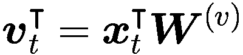，从而得到新的嵌入(2.3)。

这种情况在不同的矩阵中重复出现，这些矩阵是 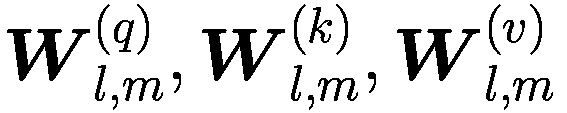 ，在 *m* 个自注意力头和 *l* 层中。每一层和每个头都捕捉到每个层嵌入之间不同方面的关系。对于 BERT[BASE]，我们每层有 *l* = 12 层和 *m* = 12 个双向自注意力头，从而产生 144 个不同的“关联”或自注意力。对于输入句子 *“The girl and the boy went home. She entered the door.”*，图 2.6 左侧显示了 144 个自注意力头中的一个关联强度。在句子的每对标记之间计算一个注意力值，其强度由不同宽度的线条表示。我们看到代词 *“she”* 与 *“the girl”* 有很强的关联。在随后的计算中（参见图 2.2），单词 *“she”* 通过将其嵌入与“the”和“girl”的嵌入合并来消除歧义，生成一个新的 *上下文嵌入* 的 *“she”*，其中包含其与 *“girl”* 的关系。图象的右侧处理了输入 *“The girl and the boy went home. He entered the door.”*。然后模型创建了一个 *“boy”* 与 *“he”* 的关联。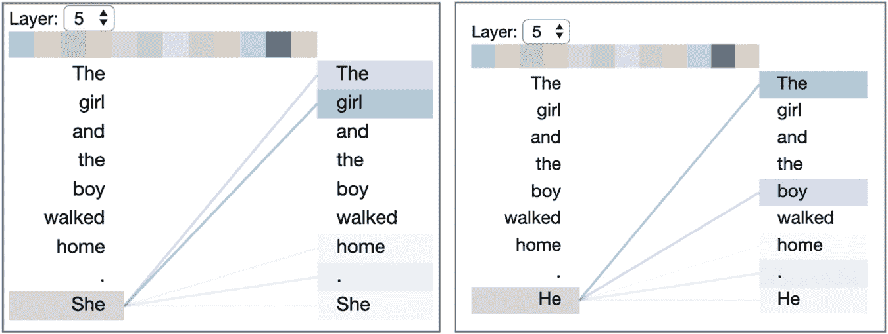

2 个带有层旋转框的截图具有水平颜色渐变条。单词列表“read the, girl, and, the, boy, walked, home”分为 2 部分。在第一部分中，她与“the”和“girl”相关联。在第二部分中，他与“the”和“boy”相关联。

图 2.6

使用 BERTviz 可视化 BERT 模型第五层的特定自注意力 [142]。如果下一句包含代词 *“she”*，则与 *“the girl”* 相关。如果这个代词改为 *“he”*，则与 *“the boy”* 相关。图片由 BERTviz 创建 [142]，经作者许可。图 2.7 显示了句子 *“[CLS] the cat sat on the mat [SEP] the cat lay on the rug [SEP]”* 的自注意力模式的子集。自注意力模式被自动优化，以便它们共同导致对掩码令牌的最佳预测。可以看到，特殊令牌 *[CLS]* 和 *[SEP]* 经常是注意力的重要目标。它们通常作为整个句子的代表 [124]。请注意，然而，在多层 PLM 中，不同头部生成的嵌入被连接并经过非线性变换。因此，单个头部的注意力模式不包含完整的信息 [124]。每当矩阵随机初始化时，如果使用新的随机参数值重新开始训练，自注意力模式将完全不同。然而，令牌之间注意力的整体模式将是相似的。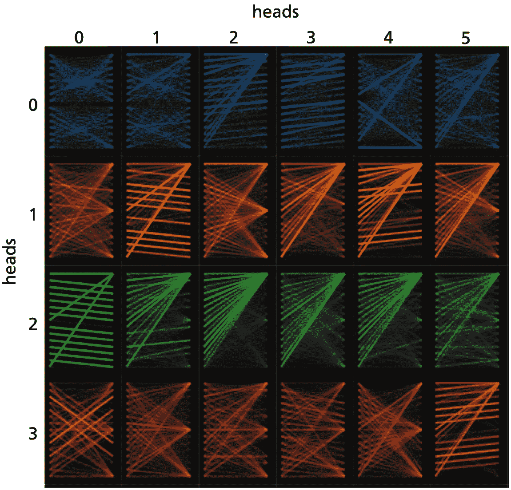

一个由 24 个颜色渐变互联模式组成的矩阵，分为 0 到 3 和 0 到 5 的网格，并标记为头部。

图 2.7

使用 BERTviz 可视化句子 *“[CLS] the cat sat on the mat [SEP] the cat lay on the rug[SEP]”* 的 144 个自注意力模式中的一些。图片经作者许可重新印刷 [142]。

图 2.10 在左侧显示了 *“Senseval-3 数据集”* 中 *“bank”* 令牌的六个不同意义的投影，这些投影通过 *T-SNE* 投影到二维空间 [140]。不同的意义通过不同的颜色标识，并形成了各自分离的簇。难以区分的意义，如 *“bank building”* 和 *“financial institution”*，显示出强烈的重叠 [153]。该图形表明，BERT 嵌入具有区分频繁观察到的词语不同意义的能力。

关于自注意力机制的内部工作原理正在持续讨论。Tay 等人 [134] 通过实证评估了点积 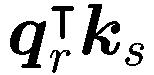 在自然语言处理任务中的重要性，并得出结论，查询-键交互是“有用但并非那么重要”。因此，他们推导出了一些替代公式，在某些情况下效果良好，在其他情况下则失败。de Santana Correia 等人提供了一份关于注意力方法的调查 [37]。存在多种不同的注意力机制，用于计算嵌入向量之间的关联 [50, 61, 104, 151]。然而，大多数当前的大规模模型仍然使用原始的缩放点积注意力，并辅以一些小的变化，例如其他激活函数和正则化器（参见图 3.1.4）。

(2.7) 中的全连接层 Fcl(***x***̆[*t*]) 包含了 BERT 参数的 2/3，但它们在网络中的作用几乎没有被讨论。Geva 等人 [49] 表明，全连接层作为键值存储器运行，其中每个键都与训练样本中的文本模式相关联，每个值在输出词汇表上诱导一个分布。对于某个键，作者检索出产生该键最高激活的训练输入。专家能够为每个键分配一个或多个解释。通常，较低的完全连接层与浅层模式相关联，这些模式通常共享最后一个单词。上层由更多语义模式描述，这些模式描述了相似上下文。作者证明了前馈层的输出是其记忆的组合。

### 2.1.5 BERT 的自然语言理解

PLM 的一个杰出目标是 *自然语言理解* (*NLU*)。这不能针对单个任务进行评估，但需要一套涵盖不同领域的基准测试，以评估机器理解自然语言文本和获取语言学、常识和世界知识的能力。因此，PLM 被微调以适应相应的现实世界下游任务。

**GLUE** [146] 是一个突出的 NLU 基准测试。它包含九个具有公共训练数据的 NLU 任务，以及一个使用私有测试数据的评估服务器。其基准测试涵盖了多个不同方面，可以表述为分类问题：

+   确定句子（SST-2）的情感（正面/负面）。

+   将句子分类为语法可接受或不可接受（CoLA）。

+   检查两个句子是否相似或是否为释义（MPRC, STS-B, QQP）。

+   判断第一句话是否蕴涵第二句话（MNLI, RTE）。

+   检查句子 *B* 是否包含问题 *A* 的答案（QNLI）。

+   从一组备选方案中指定代词的目标（WNLI）。每个任务都可以被表述为 *文本分类* 或 *文本对分类* 问题。模型的性能用一个平均值来总结，对于人工标注者的平均值是 87.1 [145]。通常，有一个在线排行榜记录不同模型的性能。PapersWithCode 网站上有一个非常大的排行榜库 [109]。表 2.1 通过示例描述了任务并报告了 BERT[LARGE] 的性能。BERT 能够将平均准确率的 Sota 从 75.2 提高到 82.1%。这是一个显著的提升，尽管这个值仍然远低于 87.1 的人工性能，仍有很大的提升空间。最近的自然语言理解基准测试结果在 Sect. 4.1 中描述，对于更具挑战性的 SuperGLUE 和其他基准测试。表 2.1

GLUE 语言理解任务。BERT[LARGE] 在微调数据集上训练了三个时期 [38]。最后列中打印出的模型性能的平均值是 82.1

| 任务 | 描述 | 示例 | 指标 | BERT |
| --- | --- | --- | --- | --- |
| CoLA | 句子是语法正确还是语法错误？ | *“这座建筑比那座建筑大。”**语法错误* | 马修斯相关系数 | 60.5 |
| SST-2 | 电影是积极的、消极的还是中性的？ | *“这部电影很有趣，聪明，视觉上富有创意，最重要的是，它充满活力。”**积极* | 准确率 | 94.9 |
| MRPC | 句子 *B* 是否是句子 *A* 的释义？ | *A*: *“今天，台湾报告了 35 例新感染。”**B*: *“台湾在中午宣布了另外 35 例可能的病例。”**释义* | 准确率 | 89.3 |
| STS-B | 句子 *A* 和 *B* 有多相似？ | *A*: *“大象正在沿着一条小径行走。”**B*: *“一群大象正在沿着一条小径行走。”**相似* | 皮尔逊/斯皮尔曼相关系数 | 86.5 |
| QQP | 两个问题是否相似？ | *A*: *“我在使用 VPN 的同时如何提高我的互联网连接速度？”**B*: *“通过 DNS 黑客攻击如何提高互联网速度？”**不相似* | 准确率 | 72.1 |
| MNLI-mm | 句子 *A* 是否蕴涵或矛盾于句子 *B*？ | *A*: *“旅游信息办公室可以非常有帮助。”**B*: *“旅游信息办公室永远不会有任何帮助。”**矛盾* | 准确率 | 85.9 |
| QNLI | 句子 *B* 是否包含句子 *A* 中问题的答案？ | *A*: *“哪些小诗集有时被归功于维吉尔。”**B*: *“许多小诗集，收集在《维吉尔附录》中，通常被认为是他所作。”**包含答案* | 准确率 | 92.7 |
| RTE | 句子 *A* 是否蕴涵句子 *B*？ | *A*: *“尤努斯发起了小额信贷革命，资助了 50,000 名乞丐，格莱姆银行尊重地称他们为‘奋斗者。’”**B*: *“尤努斯支持了超过 50,000 名奋斗者。”**蕴涵* | 准确率 | 70.1 |
| WNLI | 句子 *B* 将句子 *A* 中的代词替换为名词 - 这个名词是否正确？ | *A*: *“莉莉和唐娜说话，打断了她的注意力。”**B*: *“莉莉和唐娜说话，打断了莉莉的注意力。”**不正确* | 准确率 | 60.5 |

#### BERT 在其它微调任务上的表现

预训练数据足以适应大量 BERT 参数，并学习关于语言的非常详细的特点。通常，预训练的训练数据量远高于微调。微调通常只需要对微调训练数据进行两到三次遍历。因此，随机梯度优化器只对大多数参数进行轻微的调整，并相对接近最优的预训练参数。因此，模型通常能够保留其关于通用语言的信息，并将其与微调任务的信息相结合。

因为 BERT 可以在预训练期间重用其关于语言的一般知识，即使是在小的微调训练数据下也能产生优秀的结果 [39]。

+   **CoNLL 2003** [128] 是一个用于 *命名实体识别* (*NER*) 的基准数据集，其中每个标记都必须标记为命名实体标签，例如 PER（表示人名），LOC（表示地理位置），…，O（表示无名称）(Sect. 5.3)。该任务涉及文本标注，为每个输入标记预测一个标签。BERT 在测试数据上提高了 Sota 从 92.6%到 92.8%的 F1 值。

+   **SQuAD 1.0** [120] 是一个包含 100k 个问题、上下文和答案的三元组集合。任务是标记上下文中答案标记的范围。例如，问题是 *“奥古斯都什么时候去世？”*，其中答案 *“14 AD”* 必须在上下文 *“…奥古斯都在公元 14 年去世…”* 中标记(Sect. 6.2)。使用范围预测，BERT 将 SQuAD 的 Sota 从 91.7%提高到 93.2%，而人类的表现被测量为 91.2%。

从这些实验中收集了大量证据，证明了 BERT 的优势和劣势 [124]。这在第 4.2 节中进行了讨论。

总结来说，BERT 模型的出现标志着 NLP 的新时代。它结合了两个预训练任务，即预测掩码标记和确定第二个句子是否与第一个句子匹配。使用无监督预训练和监督微调的迁移学习成为新的标准。

### 2.1.6 计算复杂度

举例说明训练 PLM 所需的计算工作量是有教育意义的。其增长决定了训练更大模型所需的时间，这些模型可以大幅提高语言表示的质量。假设 *D* 是隐藏嵌入的大小，输入序列长度为 *T*，那么全连接层 Fcl 的中间维度设置为 4*D*，键和值的维度设置为 *D*∕*H*，如 Vaswani 等人所述 [141]。然后根据 Lin 等人 [81]，我们得到以下自注意力和位置性 Fcl 的计算复杂度和参数计数 (2.7)：

| 模块 | 复杂度 | # 参数 |
| --- | --- | --- |
| 自注意力 | *O*(*T*²∗*D*) | 4*D*² |
| 位置性 Fcl | *O*(*T*∗*D*²) | 8*D*² |

只要输入序列长度 *T* 较小，隐藏维度 *D* 主要决定了自注意力和位置性 Fcl 的复杂度。主要的限制因素是 Fcl。但是当输入序列变长时，序列长度 *T* 逐渐主导了这些模块的复杂度，因此自注意力成为 PLM 的瓶颈。此外，自注意力的计算需要存储大小为 *T*×*T* 的注意力分数矩阵，这阻止了对长输入序列的计算。因此，需要修改以减少长输入序列的计算工作量。

为了将所有输入嵌入相互连接，我们可以采用不同的模块。全连接层需要在不同的嵌入之间使用 *T*∗*T* 网络层。具有核宽度 *K* 的卷积层不会连接所有对，因此在扩张卷积的情况下需要 *O*(log*K*) 层。RNN 必须应用 *T* 次网络。这导致每层的以下复杂度 [81, 141]

|   |   | 序列 | 最大 |
| --- | --- | --- |
| 层类型 | 每层复杂度 | 操作 | 路径长度 |
| --- | --- | --- | --- |
| 自注意力 | *O*(*T*²∗*D*) | *O*(1) | *O*(1) |
| 循环 | *O*(*T*∗*D*²) | *O*(*T*) | *O*(*T*) |
| 全连接 | *O*(*T*²∗*D*²) | *O*(1) | *O*(1) |
| 卷积 | *O*(*K*∗*T*∗*D*²) | *O*(1) | *O*(log*K*) |
| 限制性自注意力 | *O*(*R*∗*T*∗*D*) | *O*(1) | *O*(*T*∕*R*) |

最后一行描述了一种受限的自注意力，其中自注意力只考虑大小为 *R* 的邻域以减少计算工作量。显然，每层的计算复杂度是一个限制因素。此外，循环层的计算需要顺序执行，不能并行化，如顺序操作列所示。最后一列显示了路径长度，即在不同位置之间传递信息所需的计算次数。这些路径越短，学习长距离依赖关系就越容易。在这里，自注意力与所有其他层类型相比具有明显的优势。第 3.2 节讨论了处理较长输入序列的高级方法。总之，BERT 比其他层类型需要更少的计算工作量。

### 2.1.7 摘要

*BERT* 是一个自动编码器模型，其主要任务是推导出针对标记的上下文相关嵌入。在初步步骤中，从训练数据的单词和字母生成标记，使得最常见的单词是标记，任意单词可以由标记组成。每个标记由一个输入嵌入编码。为了标记每个输入标记的位置，向输入嵌入添加一个位置嵌入。

在 BERT 的每一层中，较低层的嵌入通过自注意力转换成新的嵌入。自注意力涉及嵌入的线性变换之间的标量积计算。通过这种方式，下一层的嵌入可以适应上下文中的标记，并且嵌入变得上下文相关。该操作在涉及不同线性投影的多个注意力头之间并行执行。头部可以并行计算与不同语义特征相关的关联。结果的部分嵌入被连接成一个新的嵌入。除了自注意力头部之外，每个编码器块还包含一个全连接层以及归一化操作。

原始的 BERT 模型由六个编码器块组成，并为每个输入标记生成一个最终的嵌入。BERT 在一个非常大的文档集合上进行了预训练。主要的预训练任务是预测输入序列中已被替换为 `[token]` 标记的单词。这是通过使用标记的最后层嵌入作为逻辑分类器的输入来完成的，该分类器预测该位置标记的概率。在预训练期间，通过随机梯度下降优化模型参数。这迫使模型在输出嵌入中收集有关该标记的所有可用信息。第一个输入标记是 `[CLS]` 标记。在预训练期间，它用于预测下一句，其中以 `[CLS]` 嵌入作为输入的逻辑分类器必须决定输入序列的第一句和第二句是否属于一起。

通常，预训练模型会使用一个小型的标注训练数据集进行微调以适应特定任务。一个例子是监督分类任务，即判断输入文本表达的是积极、消极还是中立情绪。再次使用以 [CLS]-embedding 作为输入的逻辑分类器来确定三种情绪的概率。在预训练期间，模型的全部参数都会进行轻微调整。结果表明，这种迁移学习方法比仅在小型训练数据集上进行监督训练具有更高的准确率，因为模型可以使用在预训练期间获得的语言知识。

实验表明，BERT 能够在许多语言理解任务中显著提高 Sota（即“最先进的技术”），例如 GLUE 基准测试。其他应用包括命名实体识别，其中需要在文本中识别人名、地点等名称，或者问答任务，其中需要从段落中提取问题的答案。对计算复杂性的分析显示，BERT 比替代层类型需要更少的计算资源。总的来说，BERT 是自然语言处理中的工作马，被用于不同变体来解决语言理解问题。其编码器块被许多其他模型重用。

第三章描述了提高 BERT 模型性能的方法，特别是通过设计新的预训练任务（第 3.1.1 节）。在第四章中，讨论了 BERT 模型获得的知识。在第 5–7 章中，我们描述了 BERT 模型的多种应用，例如关系抽取（第 5.4 节）或文档检索（第 6.1 节）。

## 2.2 GPT：自回归语言模型

### 2.2.1 自回归语言模型的任务

为了捕捉自然语言文本中的信息，标记的条件概率可以通过语言模型来描述。这些 *自回归语言模型* 旨在根据前面的标记预测文本中下一个标记的概率。如果 *V*[*t*+1] 是一个随机变量，其值是位置 *t*+1 处的可能标记 *v*[*t*+1]，我们必须计算条件概率分布 *p*(*V*[*t*+1]|*v*[1]，…，*v*[*t*])。根据条件概率的定义，完整文本 *v*[1]，…，*v*[*T*] 的概率可以计算为！$$\displaystyle \begin{aligned} p(V_1\mkern1.5mu{=}\mkern1.5mu v_1,\ldots,V_T\mkern1.5mu{=}\mkern1.5mu v_T)= p(V_T\mkern1.5mu{=}\mkern1.5mu v_{T}|v_1,\ldots,v_{T-1})*\cdots*p(V_1\mkern1.5mu{=}\mkern1.5mu v_1) {}. \end{aligned} $$(2.9)因此，条件概率可以代表关于有效句子所有信息，包括语言使用的恰当与否。Qudar 等人 [115] 提供了关于语言模型的最新综述。

在第 1.6 节中，我们使用了 RNNs 来构建语言模型。然而，这些模型在确定标记之间的长距离交互时存在问题。作为替代方案，我们可以使用自注意力来推断过去标记 *v*[1]，…，*v*[*t*] 的上下文嵌入，并根据这些嵌入预测下一个标记 *v*[*t*+1]。

因此，我们需要将自注意力限制在标记 *v*[1]，…，*v*[*t*] 上。这是**生成预训练 Transformer**（**GPT**）[116，118]所采取的方法。在训练之前，文本被转换为标记，例如通过字节对编码（第 1.2 节）。在输入时，这些标记由标记嵌入和位置嵌入表示（第 2.1.1 节）。在训练过程中，GPT 模型以与 BERT 相同的方式进行自注意力计算（第 2.1.1 节）。为了预测位置 *t*+1 处不同标记的概率，自注意力被限制在之前的标记 *v*[1]，…，*v*[*t*] 及其嵌入上。位置 *t*+1 处可能出现的下一个标记的概率是通过逻辑分类器计算的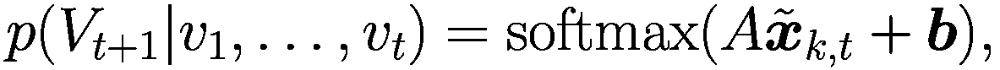(2.10)，它将最后一层 *k* 在位置 *t* 的嵌入 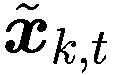 作为输入来预测位置 *t*+1 处可能标记的随机变量 *V*[*t*+1]（图 2.8）。这种方法被称为*掩码自注意力*或*因果自注意力*，因为预测只依赖于过去的标记。由于 GPT 通过顺序应用相同的模型生成标记，因此它被称为*自回归语言模型*。图片

BERT 编码块的两个框图和四个不同级别。最低级别是输入块，然后是输入嵌入和输出嵌入。最高级别是标记概率。

图 2.8

GPT 模型的输入是直到位置 *t* 的标记 *v*[1]，…，*v*[*t*] 的嵌入。GPT 计算这些标记在不同层的上下文自嵌入，并使用最高层中最后一个标记 *v*[*t*] = *“to”* 的输出嵌入来预测位置 *t*+1 处可能标记的概率，该概率通过逻辑分类器 *L* 计算。对于实际观察到的标记 *“new”*（左侧），这个概率应该很高。然后，观察到的标记 *v*[*t*+1] = *“new”* 被追加到输入序列中，并包含在自注意力计算中，以预测位置 *t*+2 处可能标记的概率，该概率对于 *“york”*（右侧）应该很高。

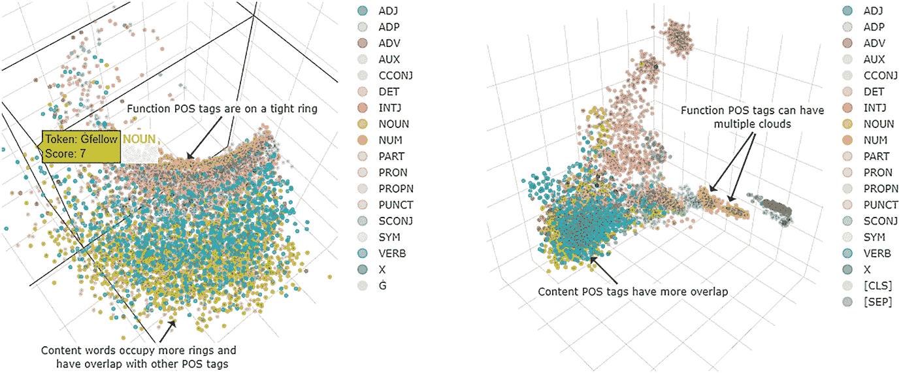

两个框图有各种输入标记，这些标记通过 BERT 编码块和 L 分类器进行嵌入。这些框图有输入标记层、输入嵌入层、输出嵌入层和标记概率层。

图 2.9

使用 PCA 进行嵌入可视化，并显示相应的词性标签。左侧是位置>0 的标记的层 0 的 GPT-2 嵌入，这些嵌入形成了不同词性标签的带状结构，功能词靠近顶部。右侧显示了层 0 的 BERT 嵌入。图片经作者许可重新印刷 [66]。

### 2.2.2 通过预测下一个标记来训练 GPT

训练目标被调整为 GPT 的语言模型任务。图 2.8 显示了连续两个标记的计算范围。通过*教师强制*，模型使用观察到的标记*v*[1]，…，*v*[*t*]直到位置*t*来计算自注意力并预测下一个标记*v*[*t*+1]的概率。这是由全分布的分解(2.9)所证明的。请注意，标记*v*[*s*]的上下文嵌入，*s*<*t*，每次在考虑新的标记*v*[*t*+1]，*v*[*t*+2]，…时都会改变。由于 GPT 只考虑目标标记*v*[*t*+1]之前的标记，因此它被称为*单向编码器*。Alammár [3]给出了 GPT 的直观高级概述。

在训练过程中，必须通过优化来改变模型参数，以便使观察到的文档的概率（2.9）最大化。通过这种*最大似然估计*（*MLE*），可以针对大量文档的语料库优化参数。为了避免数值问题，这是通过最大化*对数似然*，即(2.9)的对数之和来解决的！$$\displaystyle \begin{aligned} \log p(v_1,\ldots,v_T)= \log p(v_{T}|v_1,\ldots,v_{T-1})+\cdots+\log p(v_{2}|v_1) +\log p(v_1) {}. \end{aligned} $$(2.11)或者我们可以通过最小化负对数似然 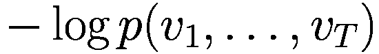。

GPT-2 可以处理一个包含 1024 个标记的输入序列，嵌入大小为 1024。在其中等版本中，它有 345M 个参数，包含 24 层，每层有 12 个注意力头。在梯度下降训练中，使用了 512 个批次的尺寸。该模型在从 Reddit，一个社交媒体平台上爬取的 40 GB 文本上进行了训练。只包括其他用户评价良好的文本，从而得到一个质量更高的数据集。较大的模型在 256 个云 TPU v3 核心上进行了训练。训练持续时间没有公开，也没有训练的详细情况。

语言模型的质量可以通过给定文本集合*v*[1]，…，*v*[*T*]的概率*p*(*v*[1]，…，*v*[*T*])来衡量。如果我们通过标记数*T*来归一化其倒数，我们得到*puzzle* [28]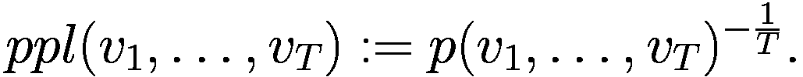(2.12)低*puzzle*表示文本的高概率。如果我们假设条件概率*p*(*v*[*t*]|*v*[1]，…，*v*[*t*−1])对所有*t*都是相同的，我们得到*puzzle*(*v*[1]，…，*v*[*T*]) = 1 / *p*(*v*[*t*]|*v*[1]，…，*v*[*t*−1])，即下一个标记的逆概率。GPT-2 能够在多个基准数据集上显著降低*puzzle*，例如，对于*Penn Treebank 语料库* [117]从 46.5 降低到 35.8，这意味着文本中的实际单词被以更高的概率预测。

#### 可视化 GPT 嵌入

Kehlbeck 等人[66]研究了 BERT 和 GPT-2 在多变量空间中嵌入的相对位置，每个模型都有 12 层。他们使用**主成分分析**(PCA) [111]和 UMAP [89]进行了 3D 投影。后者可以保留邻居的局部结构，但与 PCA 不同，无法正确维护数据的全局结构。这些 3D 散点图可以在网站上交互式操作[66]。结果显示，GPT-2 形成了两个独立的簇：有一个小簇仅包含位置 0 的所有标记，而其他位置的嵌入在第二个簇中形成带状结构。

仔细的调查表明，大多数嵌入向量位于一个狭窄的圆锥体内，导致它们之间的高余弦相似度[25]。作者在上下文嵌入空间中识别出孤立的簇和低维流形。Kehlbeck 等人[66]表明，具有相同词性标记的标记在投影中形成带状结构（图 2.9 左）。功能词都位于一个紧密的圆形结构上，而像名词和动词这样的内容词则位于其他拉长的结构中，并且与其他词性标记有重叠。BERT 生成的嵌入形成了一个或多个簇（图 2.9 右）。对于功能词，它们相当分离，但对于像名词、动词或形容词这样的内容词，则显示出一些重叠。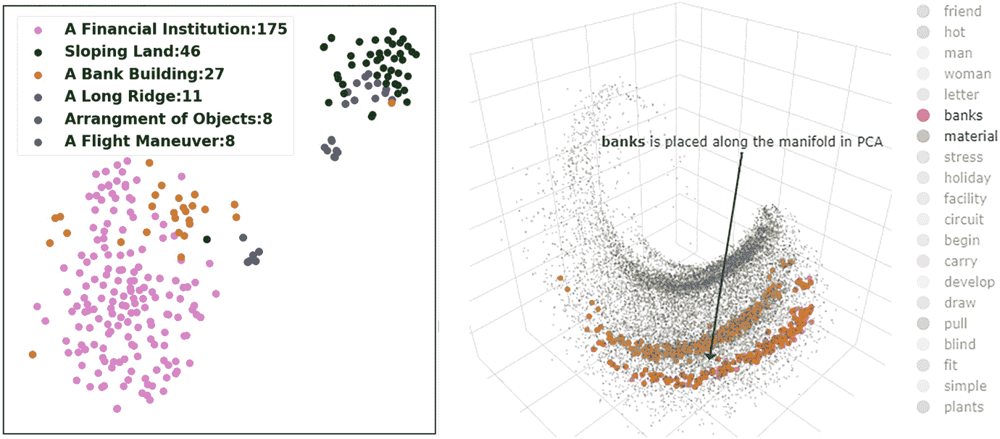

两个散点图。左边的散点图描绘了一个金融机构、倾斜的土地、一座银行大楼、一条长脊、物体的排列和飞行机动。金融机构的浓度最高。第二个散点图描绘了银行和材料等嵌入的 PCA 投影。

图 2.10

将*“bank”*的不同含义的 BERT 嵌入通过 T-SNE 投影到二维图（左）。图例包含各自 WordNet 含义的简短描述和训练数据中的出现频率。图像 153]。右侧显示了*“banks”*（下条带）和*“material”*（中间条带）以及其他在不同上下文中计算出的嵌入的 PCA 投影。图像由作者友好许可打印生成 [66]。

在位置>0 处，内容词如*“banks”*和*“material”*的 GPT-2 嵌入形成了延伸的带状结构，如图 2.10 的右侧所示。对于较高层，PCA 投影变得更加分散。用户可以通过指向每个点来读取标记上下文。

基于标记的*自相似性*是不同句子中找到的相同标记的平均余弦相似度。在 BERT 以及 GPT-2 中，内容词的自相似性高于功能词 [66]。这可能表明，在不同的上下文中，功能词具有更多样化的语义角色。评估一个标记的 10 个最近的邻居（根据余弦相似度）是很有趣的。在较低层，对于这两个模型，最近的标记在大多数情况下是相同的标记，除了少数内容词。在较高层，这种变化发生了，最近的标记是不同的标记。这表明，随着层级的提高，越来越多的上下文被包含在嵌入中。

作者们还调查了由多种其他 PLM 类型生成的嵌入。他们发现，由于形成了不同的簇和流形，它们的结构非常不同。他们认为，这种结构必须考虑用于模型的新应用。

### 2.2.3 生成单词序列

训练 GPT 模型后，可以预测给定之前的标记*v*[1]，…，*v*[*t*]的下一个位置*t* + 1 的标记概率。为了生成文本，我们必须根据这些概率选择一系列标记。

+   *随机采样*根据预测的概率选择下一个标记。这种方法有时可以选中非常不可能的标记，从而使整个句子的概率变得太低。尽管个别概率很小，但选择不可能标记组中元素的概率相当高。此外，小概率的估计通常会受到误差的影响。

+   *Top-k 采样*只考虑生成下一个标记的最高概率的*k*个标记。将这些概率质量重新分配给它们 [42]，并用于随机选择一个标记。

+   *Top-p 采样*考虑了累积概率超过阈值（例如*p* = 0.95）的最小候选集，然后根据重新分配的概率选择下一个标记 [58]。这种方法限制了罕见标记的概率质量，这些标记被忽略。

也有一些策略明确避免之前生成的 token，通过在更新公式中减少相应的分数[67]。top-*k*和 top-*p*采样通常生成合理的 token 序列，并且实际上被用于生成文本。

有许多方法可以改进 token 选择。Meister 等人[90]发现，人类产生的文本往往具有“惊喜”的均匀分布。这意味着下一个 token 的平均值不应该太稀少，也不应该太频繁。他们提出了一系列采样标准，例如方差正则化器。

Martins 等人[86]认为，由 softmax 生成的输出分布是不现实的，因为它们给每个输出 token 分配了正概率。他们提出了*Entmax 变换*，它从计算的分数生成稀疏概率分布，其中部分概率正好为零。Entmax 变换可以通过参数*α*≥1 来控制。对于*α*＝1，我们得到 softmax，而对于*α*＝*∞*，则恢复。对于中间值*∞*＞*α*＞1.0，一些 token 将获得正好为零的概率。Entmax 损失是凸的和可微的，因此可以通过反向传播进行训练。与 top-*p*采样类似，但与 top-*k*采样相反，Entmax 采样根据上下文考虑不同数量的 token。实验表明，Entmax 比其他方法导致更好的困惑度和更少的重复。

Khandelwal 等人[68]试图通过统计 token *n*-grams 来提高语言模型估计概率。他们在已处理的最后 token 上执行最近邻搜索。作为距离度量，他们使用预训练嵌入空间的距离。从检索到的最近邻中，他们获得关于可能下一个 token 的额外证据，这些证据与语言模型的 token 概率合并。这样，他们能够提高语言模型的困惑度。这种方法在预测罕见模式，例如事实知识方面特别有帮助。

Yang 等人[157]分析了 softmax 函数的性质。他们发现，标准的 softmax 没有足够的容量来模拟自然语言，因为它限制了映射到概率的秩。他们提出使用*混合 softmax*来预测概率，这是一种不同逻辑分类器的凸组合，比单个 softmax 更具表达性。作者表明，这种修改在语言建模中产生了更好的困惑度，并且也提高了其他 transformer 架构的性能[101]。

### 2.2.4 高级语言模型 GPT-2

**GPT-2** [118] 是第一个能够生成语法正确且语义合理的文本的语言模型。其最大版本包含 48 个编码器块和 1.5B 个参数，覆盖 1600 个标记的序列。给定一个初始文本，该模型会适应文本的风格和内容，并生成一个答案，这个答案通常无法与人类生成的续写区分开来。然而，生成的长文本有时会显得重复且不够连贯。

对于 GPT-2，使用了顶 *k* 截断采样来生成图 2.11 中所示的示例文本 [117]。如图所示，没有语法错误，生成的内容是合理的。作者指出，一半的试验结果是高质量的。该模型适应输入文本的风格和内容。这使得用户能够生成关于他们喜欢的话题的逼真且连贯的续写。显然，该话题必须在 Reddit 训练数据中提及，这些数据涵盖了新闻、音乐、游戏、体育、科学、烹饪和宠物等广泛的主题。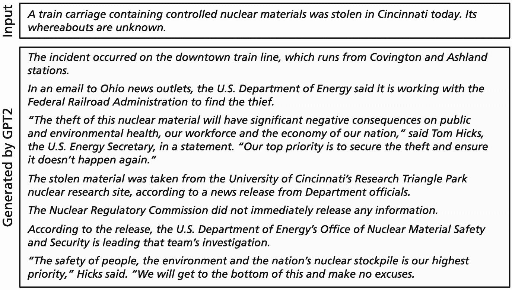

GPT-2 输入和生成的截图。

图 2.11

给定输入文本，GPT-2 通过顶 *k* 样本生成续写 [117]。经作者同意引用

该模型能够在没有针对特定任务进行训练的情况下，解决许多任务并优于之前的模型。这种学习方式被称为 *零样本学习*。例如，GPT-2 在宾夕法尼亚树库测试集上的困惑度为 35.8，相比之下，之前的 Sota 水平为 46.5 [117]。这是在没有对 GPT-2 进行 *宾夕法尼亚树库语料库* [135] 训练的情况下实现的。

### 2.2.5 微调 GPT

通过微调，GPT-2 可以适应新的文本类型，例如新的文本流派。例如，为了创建歌词，St-Amant [4] 使用了一个包含 12,500 首英文摇滚歌曲歌词的数据集，并对 GPT-2 进行了 5 个周期的微调。然后，该模型能够继续流行歌曲的歌词，这些歌曲在训练期间并未被模型看到。当应用于歌词时，该模型获得了 68 的高 Bleu 分数。另一个实验描述了诗歌的生成 [19]。

与 BERT 类似，预训练的 GPT-2 也可以修改以执行分类任务。一个例子是将微调用于将文档的情感分类为正面或负面。Radford 等人[116]将分类任务编码为包含特定标记和最终结束标记*[END]*的文本。然后模型必须预测序列。*[END]*在最高层的嵌入被用作输入到一个逻辑分类器，该分类器被训练来预测类别的概率。作者发现，将语言模型(2.11)的微调数据作为辅助目标包括在内，可以改善泛化并加速收敛。他们能够将 GLUE（第 2.1.5 节）的分数从 68.9 提高到 72.8，并在 8 个 GLUE 任务中的 7 个任务上实现了 Sota，用于自然语言理解。结果表明，语言模型捕捉了有关语法和语义的相关信息。

然而，GPT 在预测下一个标记时是从左到右操作的。在句子“我去银行存现金”和“我去银行坐下”中，当预测“坐下”或“存现金”时，它将为“银行”创建相同的上下文敏感嵌入，尽管在这两种情况下标记“银行”的意义是不同的。相比之下，BERT 是双向的，在预测掩码标记时考虑了文本中的所有标记。这一事实解释了为什么 BERT 在某些任务上表现出更好的性能。

### 2.2.6 摘要

GPT 具有与 BERT 模型类似的架构，逐个生成句子的标记。它从一个标记序列的输入开始，这可能为空。标记被编码为标记嵌入和位置嵌入的总和。GPT 使用与 BERT 相同的编码器块，但计算是掩码的，即限制在已经生成的标记上。对于这些标记，模型在几层中产生上下文嵌入。顶层最后一个标记的嵌入被输入到一个逻辑分类器，并计算下一个位置的标记的概率。随后，观察到的标记被附加到下一个位置，并重复计算下一个但一个位置的计算。因此，GPT 被称为自回归语言模型。

在训练过程中，参数通过随机梯度下降进行改变，使得模型预测训练数据中观察到的标记的高概率。使用最大似然准则，该准则优化输入数据的概率。当模型在大型文本数据集上训练后，它可以被应用。在给定起始文本的条件下，它可以顺序地计算下一个标记的概率。然后可以根据概率选择一个新的标记。

如果考虑所有可能的标记，通常会选择稀有标记。通常，合格标记的数量限制为 *k* 个高概率标记（top-*k*采样）或仅包括高达规定的概率和 *p* 的高概率标记（top-*p*采样）。这样，可以生成更好的文本。像 GPT-2 这样的高级语言模型拥有数十亿参数，能够生成没有语法错误的合理故事。

GPT 模型也可以进行微调。一种微调类型是使模型适应特定的文本类型，例如诗歌。或者，GPT 可以用作分类器，其中最近生成的输入文本的标记的输出嵌入被输入到逻辑分类器中。通过这种方法，GPT-2 能够在 GLUE 基准测试中的大多数自然语言理解任务上提高 Sota。这表明 GPT-2 已经获得了关于语言的全面知识。然而，由于自注意力只关注过去标记，因此像 BERT 这样的模型可能更好，因为它们可以在计算时考虑所有输入标记。

第三章讨论了如何提高 GPT 模型的表现，特别是通过使用更多的参数（见 3.1.2 节）。这些拥有数十亿参数的大型模型可以被指导执行多项任务而无需微调（见 3.6.3 节）。在第五章至 7 章中，我们描述了 GPT 模型的一些应用，例如问答（见 6.2.3 节）、故事生成（见 6.5 节）或从文本生成图像（见 7.2.6 节）。

## 2.3 Transformer：序列到序列翻译

### 2.3.1 Transformer 架构

基于循环神经网络（RNN）的翻译模型（见 1.6 节）由于 RNN 的序列性质存在一个主要限制。确定标记 *v*[*s*] 和 *v*[*t*] 之间关系所需的操作数量随着位置之间的距离 *t*− *s* 的增长而增加。模型必须同时在一个向量中存储所有标记之间的关系，这使得学习远程位置之间的复杂依赖关系变得困难。

*Transformer* [141]——类似于 RNN 翻译模型——基于编码器和解码器模块（见图 2.13）。编码器非常类似于 BERT，而解码器类似于 GPT。它是一个 *序列到序列模型* (*Seq2seq*)，将输入语言的源文本翻译成目标语言的文本。它不是通过大量计算步骤来关联远程标记，而是在一步中并行直接计算这些标记之间的自注意力。

**编码器**使用与 BERT 模型（图 2.4）完全相同的架构生成源文本标记  的上下文嵌入 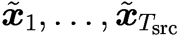。原始变换器 [141] 使用 6 个编码器块。最后一层的生成嵌入表示为 。

变换器**解码器**逐步计算目标标记 *s*[*t*] 的概率分布 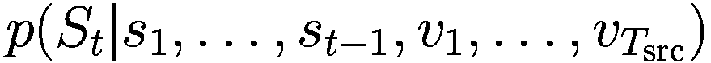，类似于循环神经网络。请注意，源标记 *v*[*i*] 以及观察到的目标标记 *s*[*j*] 都被作为条件。根据条件概率的定义，这产生了输出分布的总概率(2.13)，其中 *S*[*t*] 是一个随机变量，其值在位置 *t* 处为可能的目标标记 *s*[*t*]。这个概率在训练过程中被最大化。

我们用 *s*[0]，*s*[1]，…，*s*[*t*−1] 表示已经翻译的标记，其中 *s*[0] 是标记 *“[BOS]”*，表示输出文本的开始。解码器首先使用公式 (2.4) 计算这些标记的自注意力，就像 BERT 一样。由于只有部分目标标记被覆盖，其余部分被“掩码”，因此这一层被称为**掩码多头自注意力**，为目标标记 *s*[0]，*s*[1]，…，*s*[*t*−1] 生成中间上下文嵌入 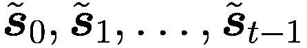。

#### 交叉注意力

然后解码器与最高编码器块的输入文本嵌入执行*交叉注意力*。在这里，查询向量是为由相应解码器块提供的目标标记嵌入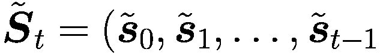)计算的。键值向量是为最后一个编码器块的嵌入计算的。注意，交叉注意力使用与 BERT 自注意力相同的方程式(2.4)，即矩阵***W***^((*q*)), ***W***^((*k*)), ***W***^((*v*)*)。这是并行进行的，称为*多头交叉注意力*。通过这种方式，考虑了源文本的信息。随后，不同头计算出的嵌入被连接(2.6)，并通过具有 ReLU 激活(2.7)的全连接层进行转换。此外，还使用了残差“旁路”连接以及层归一化[6]进行正则化。全连接层的输出产生了一个新的“输出”嵌入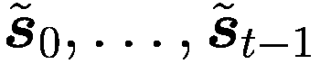用于目标标记*s*[1]，…，*s*[*t*−1]。这些层共同被称为*解码器块*（图 2.13）.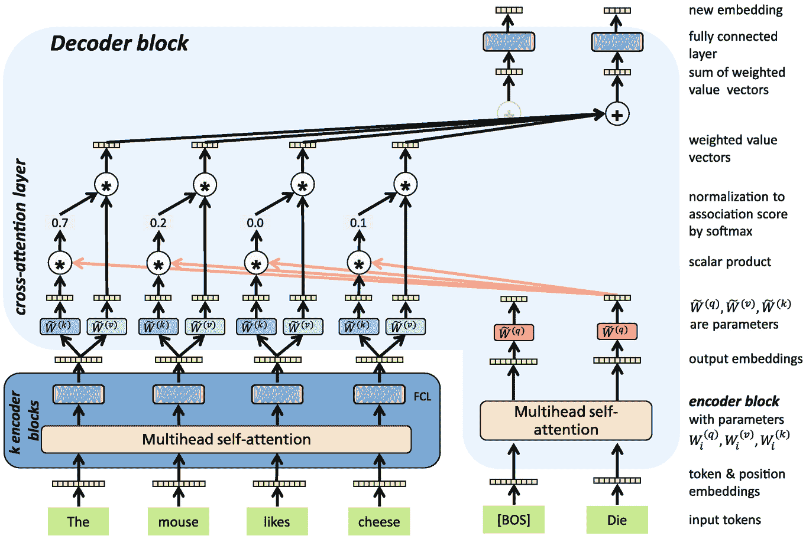

一系列输入标记的流程图通过多头自注意力、k 个编码器块、交叉注意力层、解码器块、加权值向量和全连接层等，提供了新的嵌入。

图 2.12

Transformer [141] 使用与 BERT（图 2.4）相同的架构的*k*个编码器块来生成输入文本中所有标记的上下文嵌入。解码器块是一个自回归语言模型（图 2.8），并按顺序预测目标语言中的下一个标记。每个编码器块包含一个针对当前输出标记序列的多头自注意力。通过交叉注意力将输入序列的信息包含在内。对所有当前输入标记重复计算，与自注意力计算非常相似。通过全连接层转换得到的向量产生了该层的嵌入。

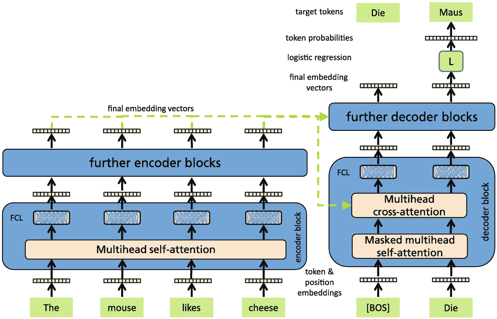

一系列输入标记的流程图通过多头自注意力、多头交叉注意力、编码器和解码器块、全连接层、进一步的编码器块、最终嵌入向量、逻辑回归和标记概率来给出目标标记。

图 2.13

Transformer [141] 使用与 BERT 相同架构的编码器来生成输入句子中所有标记的嵌入。每个编码器块执行输入序列的多头自注意力，随后是一个全连接层（FCL）。解码器类似于 GPT 模型，并按顺序预测目标语言中的下一个标记。每个编码器块包含一个多头交叉注意力，包括编码器的最终嵌入。使用最终解码器块的最后一个输出嵌入，逻辑分类器 *L* 预测输出句子下一个标记的概率。

下一个解码器块接收前一个块的计算出的标记输出嵌入作为输入，并计算目标标记 *s*[1]，…，*s*[*t*−1] 的新嵌入。解码器由多个解码器块组成（原始模型中有 6 个）。使用最后一个解码器块中右侧标记 *s*[*t*−1] 的输出嵌入 ***s***̆[*t*−1]，通过逻辑分类器预测目标文本在位置 *t* 的下一个标记 *s*[*t*] 的概率 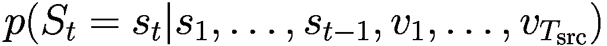，例如图 2.13 中的标记 *“Maus”*。

注意，为了预测位置 *t*+1 的下一个标记，观察到的标记 *s*[*t*] 被添加到解码器中自注意力的计算 (2.13)。因此，解码器嵌入会改变，所有解码器计算都需要重新进行。在这方面，模型仍然以递归方式工作。然而，每一层的所有自注意力和交叉注意力都是并行计算的。然而，编码器的计算只进行一次。

可变长度的序列通过添加一个特殊标记填充到最大长度。这适用于输入和输出序列。如果序列非常短，会浪费很多空间。因此，序列长度可能在不同的训练数据的小批量（称为桶）中变化。

变换器拥有大量参数。首先，它需要输入和目标标记词汇表的嵌入。然后，对于多头自注意力、掩码多头自注意力和不同头和层的多头交叉注意力，存在***W***^((*q*)), ***W***^((*k*)), ***W***^((*v*))矩阵。此外，全连接网络和最终逻辑分类器的参数也必须指定。而基础模型具有 512 个输入序列长度和 65M 个参数，大模型则具有 1024 个输入序列长度和 213M 个参数 [141]。所有这些参数的值在训练过程中都会被优化。

训练数据由一对输入句子和相应的目标句子组成。训练的目标是使用最大概率生成目标标记，以最大化输出序列的联合条件概率 (2.13)，通过随机梯度下降实现。在我们的示例中（图 2.13），对于给定的输入文本 *“The mouse likes cheese”*，需要最大化输出标记 *“Die Maus mag Käse”* 的条件概率乘积。例如，原始模型 [141] 使用了 WMT 英语-法语基准数据集中的 3600 万个句子，编码为 32,000 个 wordpiece 标记。编码器和解码器通过端到端的随机梯度下降同时训练，需要 3.5 天和 8 个 GPU。

交叉注意力是变换器的核心部分，其中输入句子的信息与翻译后的输出句子相关联。在图 2.14 中，显示了一个德语输入句子及其英语翻译。这两个句子都通过字节对编码进行标记化，其中单词的开始由 *“_”* 表示。下面描绘了两个不同头之间的输入标记和输出标记之间的交叉注意力强度。显然，第一个输入标记 *“_The”* 具有特殊的作用。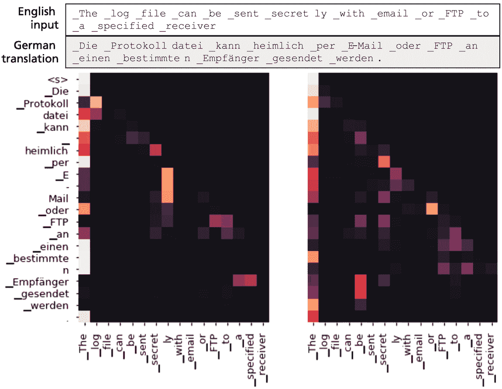

两个颜色渐变交叉注意力图，用于英语输入句子和德语翻译。

图 2.14

通过字节对编码标记化的英语输入句子和翻译后的标记化德语输出句子。下面是来自第四个解码层不同头的两个交叉注意力图 [126]。暗色值表示交叉注意力分数低。图片来源：[126]

### 2.3.2 解码翻译以生成单词

训练后，变换器能够预测输入句子的输出标记的概率。然而，对于实际的翻译，有必要生成一个显式的输出标记序列。计算具有最大概率的输出序列在计算上是困难的，因为那时必须考虑所有可能的输出序列。因此，使用贪婪解码或束搜索获得一个近似解。

**贪婪解码**简单地在每个解码步骤中选择概率最高的标记，直到生成句子结束标记。这种方法的缺点是一旦在任何时间步 *t* 选择了输出，就无法回过头来更改选择。在实践中，贪婪解码经常出现问题，因为可用的可能后续标记可能不适合之前分配的标记。由于决策不能修改，这可能导致生成的翻译次优。

**车轮搜索** [52] 维护固定数量的 *k* 个可能翻译 *s*[1]，…，*s*[*t*] 的增长长度（图 2.15）。在每一步，长度为 *t* 的每个翻译都会通过位置 *t*+1 的 *k* 个不同标记进行扩展，这些标记具有最高的条件概率 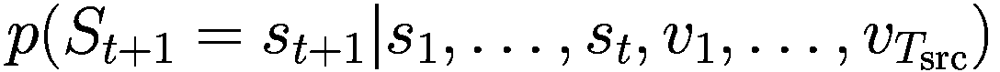。在这些 *k* * *k* 个标记序列中，仅保留总概率最大的 *k* 个序列 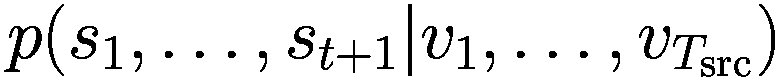。将完整的翻译（包含句子结束标记）添加到最终候选列表中。然后，算法从这个列表中选择概率最高的翻译（按目标词的数量归一化）。对于 *k* = 1，车轮搜索退化为贪婪解码。在实践中，通过车轮搜索（大小为 4）获得的翻译质量（与贪婪解码相比）显著更好。更大的车轮大小通常会导致次优解 [31]。然而，与贪婪解码相比，车轮搜索在计算上非常昂贵（根据基本架构和车轮大小，速度慢 25%–50%）[29]。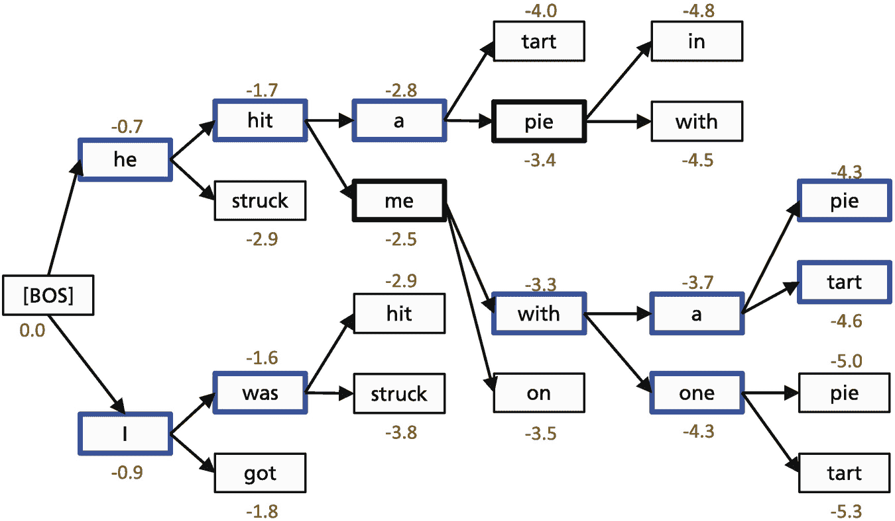

车轮搜索技术的树形图。它包括方括号内的 B O S 块以及随后的带分数的单词。

图 2.15

车轮搜索是一种解码语言模型并生成文本的技术。在每一步，算法都会跟踪最可能的 *k* 个部分翻译（粗体边缘）。每个翻译的分数等于其对数概率。车轮搜索会持续进行，直到每个分支都达到结束标记 [78]

### 2.3.3 翻译评估

传统上，评估是通过将一个或多个参考翻译与生成的翻译进行比较来完成的，如调查所述 [127]。存在许多自动评估指标：

**Bleu** 比较了标记的 1-gram 到 4-gram 的计数。Bleu 度量范围从 0 到 1，其中 1 表示与参考相同的输出。尽管 Bleu 与人工判断有很好的相关性 [110]，但它仅依赖于精确度，并且不考虑召回率——匹配的 *n*-gram 在参考翻译中总 *n*-gram 数中的比例。

**Rouge** [80] 与 Bleu 不同，是一个基于召回率的度量，它确定参考文本中哪些比例的单词或 n-gram 出现在生成的文本中。它确定了许多其他因素，包括单语元或双语元的重叠以及一对文本之间的最长公共子序列。使用不同的版本：Rouge-1 测量文本对之间单语元（单个单词）的重叠。Rouge-2 确定文本对之间双语元（两个单词序列）的重叠。Rouge-L：测量两个文本之间共享的最长序列的长度（不一定是连续的，但仍然是有序的）。这个长度除以参考文本中的单词数。

**Meteor** [75] 被提出以解决 Bleu 的不足。它在翻译输出和给定的参考翻译之间执行词对词的对齐。这些对齐是通过一系列词映射模块产生的。这些模块检查单词是否完全相同，或者在使用 Porter 词干提取器之后是否相同，以及它们是否是彼此的同义词。在获得最终对齐后，Meteor 计算一个 F 值，这是一个单语元精确度和召回率的参数化调和平均值。Meteor 还表明与人工判断有很高的相关性，通常甚至优于 Bleu。

**BERTscore** [164] 考虑了同义词并测量了翻译和参考之间嵌入的相似性。它计算了两个文本中所有标记嵌入之间的余弦相似度。然后使用贪婪匹配方法来确定标记的分配。最大分配相似度被用作 BERTscore。

对于高质量的翻译，然而，人工判断和自动评估之间存在明显的差异。因此，今天大多数高端比较都使用人工专家来评估翻译质量和其他文本生成方法的质量。自从 Vaswani 等人在 2017 年提出了 transformer [141]，其变体能够将语言翻译性能的 Sota 提高到新的水平，例如，对于 WMT2014 英语-法语翻译，从 37.5 提高到 46.4 的 Bleu 分数。

transformer 架构从理论上进行了分析。Yun 等人 [160, 161] 表明，transformers 足够表达，可以捕获所有具有紧凑域的连续序列到序列函数。Pérez 等人 [112] 推导出完整的 transformer 是图灵完备的，即可以模拟完整的图灵机。

### 2.3.4 预训练语言模型和基础模型

一种模型 *语言模型* 要么计算自然语言文本的联合概率，要么计算条件概率，并且可能包含有关语言的所有信息。BERT 是一个包含编码器块以生成标记上下文嵌入的 *自动编码器* 语言模型。GPT 是一个 *自回归语言模型*，它预测序列的下一个标记，并将自注意力限制在已经生成的标记上。*转换器*（或 *转换器编码器-解码器*）使用转换器编码器将输入文本转换为上下文嵌入，并使用自回归转换器解码器（利用编码器嵌入作为输入）生成翻译文本（图 2.16）。这些模型是现代 NLP 的基础，统称为 *预训练语言模型* (*PLM*)。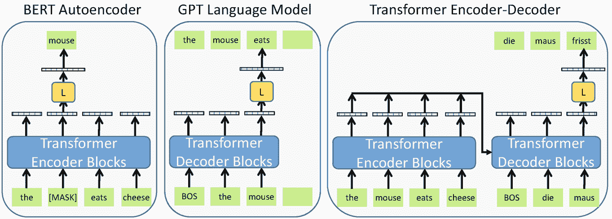

从左到右分别是 BERT 自动编码器、GPT 语言模型和转换器编码器-解码器的 3 个流程图。它们包括输入标记、转换器编码器和解码器块、L 个分类器和目标标记。

图 2.16

类似于 BERT（左侧）和自回归语言模型 GPT-2（中间）的自动编码器使用转换器块生成标记的上下文嵌入。转换器（右侧）结合转换器编码器和自回归转换器解码器来生成翻译。所有模型都使用逻辑分类器 *L* 预测标记的概率。这些模型统称为预训练语言模型 (PLM)。

所有这些模型，尤其是 BERT 和 GPT，都是通过在大规模文本语料库上进行预训练来初始化的。在预训练期间，输入的部分被隐藏起来，模型被训练来重建这些部分。这已被证明在构建强大的语言表示以及在寻找高度表达力的 NLP 模型的参数初始化方面非常有效，这些模型可以适应特定任务。最后，这些模型提供了关于语言的概率分布，我们可以从中采样。

大多数网络类型都有一些内置的假设，称为 *归纳偏差*。卷积网络具有在输入矩阵上移动的局部核函数，因此具有平移不变性和局部性的归纳偏差。循环网络对每个输入位置应用相同的网络，具有时间不变性和局部性。BERT 架构对数据中的结构依赖性只有少数假设。GPT 模型与 RNN 类似，因为它假设下一个标记的依赖关系具有马尔可夫结构。因此，PLM 通常需要更多的训练数据来学习不同数据点之间的交互，但可以比其他模型类型更准确地表示这些交互。

从历史上看，学习到的嵌入向量被用作下游任务的词表示（图 2.17）。早在 2003 年，Bengio 等人[15]就提出了一个通过循环模型预测下一个词的词的分布式向量表示。2011 年，Collobert 等人[32]成功地将词嵌入应用于词性标注、分块、命名实体识别和语义角色标注。2013 年，Mikolov 等人[93]使用逻辑分类器推导出他们的词嵌入。2015 年，Dai 等人[33]以自监督的方式训练了 RNN 语言模型中的嵌入，后来将其应用于文本分类。2017 年，McCann 等人[87]预训练了多层 LSTM 用于翻译计算上下文化的词向量，这些词向量后来被用于各种分类任务。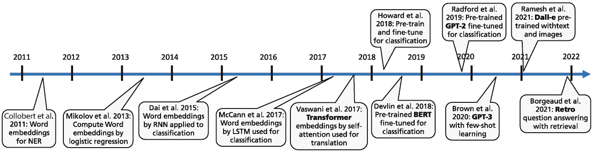

从 2011 年到 2022 年的发展时间线。它们包括用于 N E R 的词嵌入、通过逻辑回归的词嵌入以及通过 R N N 的嵌入等。

图 2.17

嵌入、预训练和微调的发展时间线

在同年，Vaswani 等人[141]开发了仅关注注意力的翻译变压器。2018 年，Howard 等人[59]预训练了语言模型（ULMFiT），并通过更新每个任务的完整（预训练）模型来展示微调对不同目标任务的有效性。同年，Howard 等人[116]使用预训练的变压器自回归部分[141]通过微调模型解决了大量文本理解问题。同时，Devlin 等人[39]使用掩码语言模型目标预训练了自动编码器，并通过微调将此 BERT 模型应用于许多下游任务。2019 年，Radford 等人[118]提出了 GPT-2 语言模型，能够生成语义上令人信服的文本。Brown 等人[21]提出了 GPT-3 模型，可以通过任务描述和一些示例来指导解决 NLP 任务。2021 年，Ramesh 等人[121]将语言建模应用于文本和图片，并能够从文本描述中创建令人印象深刻的图片。Borgeaud 等人[18]提出了 Retro 模型，该模型通过从包含 2000 亿个标记的文本集合中检索信息来回答问题，并以自然语言组成答案。

几乎所有最先进的自然语言处理模型现在都是从少数几个预训练语言模型中改编而来，例如 BERT、GPT-2、T5 等。PLM 正在变得更大、更强大，从而带来新的突破，并吸引越来越多的研究关注。由于性能的巨大提升，一些研究小组建议将大规模 PLM 称为 *基础模型*，因为它们构成了一种“基础性”的突破性技术，可能影响许多类型的应用 [17, p. 3]。在本书中，我们将“基础模型”一词保留给具有超过十亿参数的大型预训练语言模型，因为这些模型能够生成流畅的文本，能够处理不同的媒体，并且通常可以通过提示来执行特定任务。

如果这些模型中的任何一个得到改进，这种高度的同质性将立即为许多自然语言处理（NLP）应用带来好处。另一方面，所有系统都可能共享一些基本模型中存在的相同问题偏见。正如我们将在后续章节中看到的那样，基于预训练语言模型（PLM）的序列建模方法现在已应用于文本（第 2.2 节）、语音（第 7.1 节）、图像（第 7.2 节）、视频（第 7.3 节）、计算机代码（第 6.5.6 节）和控制（第 7.4 节）。这些基础模型的整体能力在图 2.18 中展示。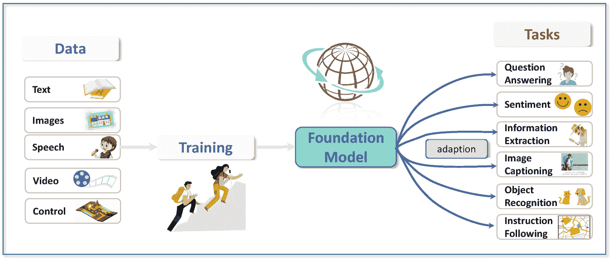

基础模型的流程图示例。它包括 5 种类型的数据、训练、一个基础模型以及通过适配的一系列任务。

图 2.18

基础模型可以整合来自不同模态的数据信息。随后，它可以通过微调等方式适应广泛的下游任务 [17, p. 6]。图像部分表格 [A.1](https://doi.org/10.1007/978-3-031-23190-2_BM1#Tab1) 的版权归属。

下一个章节 2.4 讨论了一些优化和正则化预训练语言模型的常见技术。此外，还介绍了一些修改这些网络架构的方法。在第三章中，我们提出了许多提高 PLM 能力的方法，特别是通过修改训练任务（第 3.1.3 节）。在第五章至 7 章中，我们讨论了 PLM 的许多应用。第五章涵盖了传统的 NLP 任务，如命名实体识别和关系抽取，在这些任务中 PLM 目前表现最佳。基础模型最重要的应用一方面是文本生成和相关任务，如问答系统和对话系统，这些在 6 章中介绍。另一方面，基础模型可以同时处理不同媒体，执行图像标题、图像中的对象检测、根据文本描述生成图像、视频解释或计算机游戏控制等任务，这些在 7 章中讨论。由于这种基础模型可能带来的社会和伦理后果，研究人员在开发和应用这些模型时，特别重要的是要牢记社会的价值观和人权。这些方面在第 8.2 节中进行了总结。

#### 可用实现

+   许多预训练语言模型（BERT、GPT、Transformers）以及不同语言和文本语料库的预训练模型可以从 Hugging Face [`huggingface.co/transformers/`](https://huggingface.co/transformers/)、Fairseq [`github.com/pytorch/fairseq`](https://github.com/pytorch/fairseq)、TensorFlow [`www.tensorflow.org/`](https://www.tensorflow.org/) 和 PyTorch [`pytorch.org/`](https://pytorch.org/)下载。这些工具包还允许灵活地制定深度神经网络，并提供自动计算梯度以及优化方法。所有这些都能并行执行计算并将它们分布到不同的 CPU 和图形处理单元（GPU）。

+   PLM 的规模已经超过了单个 GPU 的内存，需要将训练代码分布在多个 GPU 上。这由 FastSeq [`github.com/microsoft/fastseq`](https://github.com/microsoft/fastseq)、LightSeq [`github.com/bytedance/lightseq`](https://github.com/bytedance/lightseq)和 FastT5 [`github.com/Ki6an/fastT5`](https://github.com/Ki6an/fastT5)等库支持。

+   使用 DeepSpeed [122]训练了具有 530B 参数的 MT-NLG 自回归语言模型（第 3.1.2 节）[`github.com/microsoft/DeepSpeed`](https://github.com/microsoft/DeepSpeed)。

+   Ecco [2] [`github.com/jalammar/ecco`](https://github.com/jalammar/ecco) 和 BertViz [144] [`github.com/jessevig/bertviz`](https://github.com/jessevig/bertviz) 是用于可视化 PLM 的注意力和嵌入的工具。

+   Transformers-interpret [`github.com/cdpierse/transformers-interpret`](https://github.com/cdpierse/transformers-interpret) 是为 Hugging Face 包设计的模型可解释性工具。

+   Captum [70] 是一个库 [`captum.ai/`](https://captum.ai/)，用于生成 PyTorch 模型预测的解释和说明。

### 2.3.5 摘要

Transformer 是一种序列到序列模型，它将输入语言的源文本翻译成目标语言的文本。它由一个编码器组成，其架构与自编码器 BERT 模型相同，用于计算源文本标记的上下文嵌入。解码器类似于自回归 GPT 模型，并依次生成目标文本的标记。在内部，不同层中计算目标标记的上下文嵌入。每个解码器块都有一个额外的交叉注意力模块，其中查询向量来自目标标记的嵌入，而键和值向量是为最后一层的源标记嵌入计算的。这样，源文本的信息就被传递给解码器。顶层最后一个标记的嵌入被输入到逻辑分类器中，并计算下一个位置的标记的概率。随后，下一个位置的观察到的标记被附加到目标输入上，并重复计算下一个但一个位置的计算。

在训练过程中，通过随机梯度下降调整 transformer 的参数，使得模型在训练数据中对翻译的观察目标标记赋予高概率。当模型在大型文本数据集上训练完成后，它可以用于翻译。基于输入文本，模型可以依次计算翻译的下一个标记的概率。

在应用训练好的模型时，要么选择概率最大的标记，要么通过束搜索生成几个替代方案，并选择概率最大的最终输出序列。由于不同的翻译可能都是正确的，因此翻译质量的评估很困难。已经开发出了一些指标，例如 Bleu，这些指标通过比较具有 n=1, …, 4 的 n-gram 的公共数量来将机器翻译与一个或多个参考翻译进行比较。通常，结果由人工评分员进行评估。Transformer 能够生成比先前模型更好的翻译。与此同时，对于许多语言对来说，翻译质量与人类翻译者相当。

在前面的章节中，我们讨论了*自动编码 BERT*模型、*自回归 GPT*模型和*编码器-解码器 Transformer*。这些模型统称为*预训练语言模型*，因为使用大型训练集进行预训练步骤和随后的微调步骤的迁移学习是三种变体的核心方法。自注意力和交叉注意力模块是所有三种模型使用的核心构建块。尽管近年来发展了许多变体，但 Vaswani 等人[141]开发的原始架构仍然被广泛采用。

结果表明，这些模型不仅可以应用于文本，还可以应用于各种类型的序列，如图像、语音和视频。此外，它们可以通过简单的提示执行各种任务。因此，大型 PLM 也被称为*基础模型*，因为它们预计将在文本和多媒体系统的未来发展中发挥关键作用。

## 2.4 预训练语言模型的训练和评估

本节描述了训练和应用 PLMs 所需的一些技术。

+   我们需要能够处理数百万和数十亿参数和训练示例的*优化技术*。

+   训练模型并避免过拟合需要特定的*正则化*方法。

+   模型预测的*不确定性*必须被估计以评估模型性能。

+   模型预测的*解释*对于模型的接受度非常有帮助。

本节讨论了解决这些问题的方法。预训练语言模型（PLMs）通常在当前的深度学习框架中指定。最流行的是来自谷歌的*TensorFlow* [137] 和来自 Meta 的*PyTorch* [114]。两者都基于 Python 编程语言，并包含指定网络、在专用硬件上并行训练以及部署到不同环境中的语言元素。新出现的框架是*JAX* [22]，它特别适合快速实验。它有一个线性代数的编译器，可以加速机器学习研究的计算。

### 2.4.1 PLM 优化

#### PLM 优化基础

对于独立同分布的训练样本 *Tr* = {(***x***^([1]), *y*^([1])), …, (***x***^([*N*]), *y*^([*N*]))} 的深度神经网络参数优化旨在找到一个最小化损失函数 *L*(***x***^([*i*]), *y*^([*i*]);***w***) 的模型(2.14)一阶优化方法，也称为基于梯度的优化，基于一阶导数。一个要求是损失函数 *L*(***w***) 是平滑的，即连续且在几乎所有的参数值 ***w*** = (*w*[1], …, *w*[*k*]) 上可导。然后，*L*(***w***) 关于 ***w*** 的任意分量 *w*[*j*] 的偏导数  可以在几乎所有的点上计算。*L*(***w***) 在特定点 ***w*** 的梯度是一个向量(2.15)梯度指向 *L*(***w***) 在点 ***w*** 的最陡上升方向。因此，最陡下降的方向是相反的方向 。因此，批量 *梯度下降* 算法因此改变当前参数 ***w***[(*t*)] 的方向，以负梯度方向移动，以接近最小值(2.16)*学习率**λ* 决定了步长或每次迭代中移动多少，直到达到最优值。由于梯度通常对每个参数 ***w***[(*t*)] 都不同，因此必须为每个新的参数向量重新计算（图 2.19）。迭代过程重复进行，直到导数接近零。零梯度表示 *局部最小值* 或 *鞍点* [51，第 79 页]。在实际应用中，从不同的 ***w***-值开始重复优化，如果导数接近零则停止。

2 个从上到下由浅入深颜色渐变的网格示例。

图 2.19

在网格的所有点上计算这个二维函数*L*(***w***)（左）的负梯度。梯度下降算法遵循负梯度并接近局部最小值（右）。蓝色线条是最小化过程中所采取的路径。图像归功于表[A.1](https://doi.org/10.1007/978-3-031-23190-2_BM1#Tab1)。

深度神经网络通常需要数百万个训练示例。对所有这些示例重复计算梯度是非常昂贵的。**随机梯度下降法**（*SGD*）算法不使用整个数据集，而是每次只计算一个小型*迷你批次*的*m*个训练示例的梯度。一般来说，迷你批次的大小*m*从 32 到 1024 不等，对于最近的一些极其大的模型，甚至更高。随后，根据(2.16)改变模型的参数。

对于每一次迭代，都会从训练数据中随机选择一个新的迷你批次。根据大数定律，从这些迷你批次计算出的梯度会在整个训练集的真实梯度周围波动。因此，迷你批次梯度在平均意义上指示了改变参数的适当方向。Mertikopoulos 等人[91]表明，通过迭代地将学习率降低到 0，随机梯度下降法几乎必然收敛，避免了诸如鞍点（概率为 1）等虚假的临界点，并且快速稳定在局部最小值。随机梯度下降法算法有许多变体，下面将进行描述[65]。

优化过程中的一个重要步骤是**参数的初始化**。它们的初始值可以决定算法是否收敛以及优化接近最优值的速度。为了打破对称性，初始参数必须是随机的。此外，每一层的参数的均值和方差被设置为使得该层的输出结果具有良好行为的分布，例如期望值为 0.0 和方差为 1.0。此外，所有梯度也应具有这种良性的分布，以避免梯度爆炸或消失。所有深度学习软件框架都包含合适的初始化例程。Goodfellow 等人[51，第 292 页]给出了详细的介绍。

#### 随机梯度下降法的变体

**动量**是一种帮助 SGD 在相关方向上增加收敛速度并减少振荡的方法。基本上，通过参数*γ*≈0.9 计算最近梯度的移动平均***u***[(*t*)]，并通过以下公式进行参数更新(2.17)其中，\(\boldsymbol{u}_{(t)} = \gamma \boldsymbol{u}_{(t-1)}- \lambda\frac{\partial L({\boldsymbol{w}})}{\partial {\boldsymbol{w}}}\)，\(\text{where}\quad {\boldsymbol{w}}_{(t)} = {\boldsymbol{w}}_{(t-1)} - \boldsymbol{u}_{(t)}\)。注意，除了参数向量***w***[(*t*)]外，还需要存储相同长度的移动平均***u***[(*t*)]，这需要与参数向量***w***相同的内存。如果参数数量接近数十亿，这可能会消耗大量的额外内存空间。近年来，开发了许多其他优化器 [65]：

+   **AdaGrad**根据之前的梯度动态调整学习率。它对经常出现的特征使用较小的学习率，对很少出现的特征使用较高的学习率。

+   **AdaDelta**修改了 AdaGrad。它不是累积所有过去的梯度，而是将过去梯度的累积窗口限制为某个固定的尺寸*k*。

+   **RMSProp**也是一种为每个参数调整学习率的方法。其想法是将权重的学习率除以该权重最近梯度的幅度的运行平均值。

+   **Adam**结合了 AdaGrad 和 RMSProp 的优点。Adam 基于低阶矩的自适应估计。它使用梯度和梯度的二阶矩的运行平均值。

由于 PLM 的参数数量极其庞大，因此很少使用像*共轭梯度*或*拟牛顿*这样的二阶优化方法。因为二阶导数的数量呈二次增长，所以只能使用粗略的近似。例如，之前描述的 Adam。

为了提高 PLM 的训练，一个重要的架构补充是*残差连接*，这是 Vaswani 等人[141]为 Transformer 提出的。残差连接已被证明对于图像分类网络如 ResNet[54]非常成功，并允许训练具有数百层的网络。恒等快捷方式跳过层块以保留特征。张等人[163]分析了包含残差连接的网络的表示能力。

#### 大型模型的并行训练

最近，有人建议通过使用更大的 mini-batch 来减少优化工作量。You et al. [159] 提出了**LAMB 优化器**，具有层自适应学习率，以加速使用大 mini-batch 的 PLM 训练。他们在一般非凸设置中证明了他们方法收敛到平稳点的收敛性。他们的经验结果表明 LAMB 的性能优越。通过非常少的超参数调整和 32,868 个批大小，可以将 BERT 的训练时间从 3 天减少到仅 76 分钟，而不会降低性能。LAMB 程序代码可在网上找到 [97]。此外，优化器的内存需求可能被减少 [119]，以便实现导致更高训练速度的模型并行化。

大型模型如 GPT-3 具有数十亿参数，这些参数不再适合单个计算设备（例如 GPU）的内存。因此，计算必须分布在多个 GPU 上。存在不同的并行化技术 [156]：

+   *数据并行*将相同的模型代码和参数分配给每个 GPU，但不同的训练示例 [72]。梯度是并行计算的，最后汇总。

+   *流水线并行*将模型分成不同的部分（例如层），在不同的 GPU 上执行。如果一个部分被计算，它将结果发送到下一个 GPU。在训练的逆传播过程中，这个顺序被反转。

+   *层内模型并行*将单个层的权重分布到多个 GPU 上。

实现模型并行化策略是一个繁琐的过程。**DeepSpeed**库 [122] 提供了支持，使得分布式训练变得简单、高效和有效。最近开发了**GSPMD**系统 [156]，它自动化了这个过程，并能以统一的方式结合不同的并行化范式。GSPMD 根据对模型定义的有限用户注释，推断计算分布到 GPU 网络中。例如，它被应用于在 2048 个 GPU 上分配具有 1 万亿参数的模型。

### 2.4.2 预训练语言模型的正则化

如果一个模型包含太多的参数，它可以通过优化几乎完美地适应训练数据，反映了训练数据几乎所有的细节。在*过拟合*过程中，模型学习训练数据中表达的随机变化，并偏离了潜在的均值分布。因此，它在测试数据上通常表现较差，并且具有更大的*泛化误差*。为了避免这种现象，必须通过*正则化方法*减少模型的表示能力，这些方法通常与减少参数数量有相同的效果。深度学习模型中众所周知的方法是*L*[2]正则化和*L*[1]正则化，惩罚大的参数值，或者*Dropout*临时将随机选择的隐藏变量设置为 0。Moradi 等人 [96] 提供了深度神经网络正则化策略的概述。

PLM 的训练通常并不简单。一个问题是在不同层的输入值中出现的梯度消失或爆炸，这与输入值方差消失或爆炸的问题相关 [55]。*批归一化*将隐藏单元组件的值归一化到均值为 0.0 和方差 1.0，从而减少了输入值的变异。对于训练案例的迷你批次，组件值被聚合以计算均值和方差，然后这些值被用来在每个训练案例中归一化该组件的输入 [62]。可以证明，批归一化使得深度神经网络各层的隐藏表示越来越正交 [35]。

在他们的关于 Transformer 的论文中，Vaswani 等人 [141] 使用了一种称为*层归一化*的变体 [6] 进行正则化。作者为每个训练示例计算隐藏单元不同组件的均值和方差，并使用这些值将输入归一化到均值为 0.0 和方差 1.0。此外，他们对自注意力机制的输出应用了 dropout。最后，他们使用了*标签平滑* [133]，其中损失函数被重新表述，使得观察到的标记不是确定的，但以小概率可能存在其他标记。这是一种正则化形式，使得优化更容易。RMSNorm [162] 是层归一化的一个变体，它只通过除以均方根误差来归一化输入，而不移动均值。在实验中，它与层归一化 [101] 相比表现良好。

### 2.4.3 神经架构搜索

自注意力块的结构是手动设计的，并不清楚它在所有情况下是否是最优的。因此，有一些方法以自动方式生成 PLM 的架构，称为 *神经架构搜索* (*NAS*)。He 等人 [56] 提供了一份调查，他们认为目前架构搜索对 NLP 任务的贡献是微小的。Zöller [166] 评估了架构搜索在机器学习模型中的应用。

王等人 [149] 提出了一种具有灵活编码器-解码器注意力和异构层的架构搜索空间。架构搜索产生了几个 Transformer 版本，并最终专注于硬件限制，以适应手头的处理器。作者报告了速度提高了 3 倍，尺寸减少了 3.7 倍，且没有性能损失。对于关系分类，Zhu 等人 [165] 设计了一个全面的搜索空间。他们通过强化学习策略探索搜索空间，并产生了性能更好的模型。

架构搜索也可以被表述为一个排序任务。**RankNAS** [60] 通过一系列二分类问题来解决这一问题。作者研究了翻译和语言模型。对于翻译，通常的编码器-解码器被包含在一个超级网络中，其中每个 10²³ 个子网络都是独特的架构。一个架构特征（例如，层数）的重要性通过在特征重新排列后模型误差的增加来衡量。作者使用进化优化策略，并在翻译（WMT2014 En-De）上评估了他们的方法。他们以其他方法成本的一小部分获得了 Bleu 值的增加。

最近，可微架构搜索（differentiable architecture search）得到了发展，它将架构搜索嵌入到连续的搜索空间中，并通过梯度下降找到最优架构。这导致了一个高效的搜索过程，其速度比离散对应物快几个数量级。这一想法被 Fan 等人 [43] 所应用，他们提出了一种基于梯度的机器翻译 NAS 算法。他们探索了注意力模块和循环单元，自动发现性能更好的架构。不同单元之间的连接拓扑以端到端的方式进行学习。在多个基准测试中，他们能够提高 Transformer 的性能，例如，将 WMT2014 英语到德语的翻译的 Bleu 分数从 28.8 提高到 30.1。还有其他成功的架构搜索方法适用于神经翻译 [130]、命名实体识别 [64] 和图像分类模型 [34, 147, 148]，这些方法可能也适用于其他 NLP 任务。

### 2.4.4 模型预测的不确定性

PLM 的结果变化可能有两个主要来源：

+   *认知不确定性*反映了我们对现实世界的有限了解。与训练集相对应的现实世界情况可能会发生变化，导致分布偏移。此外，收集到的文档可能存在偏见或错误，并包含不希望的内容。很明显，现实世界的结构和 PLM 是不同的。因此，PLM 只能近似正确条件概率的语言。这种类型的不确定性通常被称为*结构不确定性*，难以估计。

+   *随机不确定性*是由随机变化引起的，这种变化可以更容易地评估。训练数据通常是总体中潜在数据的样本，因此受到抽样变化的影响。如果一个模型随机重新初始化，它将生成一组完全不同的参数值，从而导致不同的预测。最后，语言模型预测标记的概率，新标记的生成也受到不确定性的影响。贝叶斯框架提供了一个有充分依据的工具来评估这种深度学习中的不确定性[44]。

Gawlikowski 等人提供了一种估计模型不确定性的方法综述[47]。我们将描述三种捕捉模型不确定性的方法：贝叶斯统计、狄利克雷分布和集成分布。

#### 贝叶斯神经网络

*贝叶斯神经网络*直接通过*后验分布*表示估计参数的不确定性  (2.18)Here ***X*** and ***Y*** are the observed inputs and outputs in the training set and *p*(***Y*** |***X***, ***w***) is the *likelihood*, i.e. the probability of the outputs given ***X*** and a parameter vector ***w***. The *prior distribution**p*(***w***) describes the distribution of parameters before data is available. The distribution of predictions for a new input  is given by(2.19)The integral usually cannot be solved analytically and has to be approximated. Often a *Monte Carlo* approximation is used, which infers the integral by a sum over different parameter values ***w***^([*i*]) distributed according to the posterior distribution *p*(***w***|***X***, ***Y*** ). If ![$$\tilde {{\boldsymbol {y}}}^{[i]}=f(\tilde {{\boldsymbol {x}}},{\boldsymbol {w}}^{[i]})$$](../images/528393_1_En_2_Chapter/528393_1_En_2_Chapter_TeX_IEq60.png) is a deterministic network predicting the output for a parameter ***w***^([*i*]) and input , the resulting sample ![$$\tilde {{\boldsymbol {y}}}^{[1]},\ldots ,\tilde {{\boldsymbol {y}}}^{[k]}$$](../images/528393_1_En_2_Chapter/528393_1_En_2_Chapter_TeX_IEq62.png) can be considered as a sample of the output distribution  [108].贝叶斯预测分布可以通过不同的方式进行近似：

+   *采样方法*使用马尔可夫链蒙特卡洛算法生成根据后验分布分布的参数值，从中可以抽取实现值 [102]。马尔可夫链蒙特卡洛定义了一种采样策略，首先随机生成一个新的参数值 ***w***，然后算法计算接受 ***w*** 或保持先前参数值的概率。Welling 等人 [150] 将这种方法与随机梯度下降相结合，证明了可以通过噪声 SGD 在深度神经网络上进行贝叶斯推断。Nemeth 等人 [103] 给出了有利的收敛性质的综述。Wenzel 等人 [152] 对此技术进行了实际评估。

+   *变分推断*通过简单分布的乘积 *q*(***w***) 来近似后验分布，这些简单分布更容易评估 [9]。通过使用多个 GPU 和实用技巧，例如数据增强、动量初始化和学习率调度，Osawa 等人 [105] 证明了变分推断可以扩展到 ImageNet 规模的数据集和架构。

    可以证明 [45]，dropout 正则化（第 2.4.2 节）可以被视为近似变分推断。因此，预测不确定性可以通过在训练期间以及测试时使用 dropout 来估计。一种称为*Drop connect*的变体随机移除节点的输入激活，而不是对所有后续节点进行激活丢弃。这种方法提供了更可靠的不确定性估计，甚至可以与原始 dropout 技术 [88] 结合使用。

+   *拉普拉斯近似*考虑后验分布围绕局部模态  的对数，并通过网络权重上的正态分布 ![$$N(\hat {{\boldsymbol {w}}},[H+\beta I]^{-1})$$](../images/528393_1_En_2_Chapter/528393_1_En_2_Chapter_TeX_IEq65.png) 来近似它 [9]。*H* 是  的 Hessian，即二阶导数的矩阵。这种近似可以用于已经训练好的网络，并且可以应用于深度神经网络 [76]。一个问题是要计算*H*的系数数量很大，这限制了计算仅限于对角线元素。George 等人 [48] 提出了扩展。

#### 通过单一确定性模型估计不确定性

大多数 PLM 通过离散概率分布来预测标记。如果使用 softmax 函数来计算这些概率，那么在训练集上的优化通常会导致非常极端的概率，接近 0 或 1。网络往往过于自信，并生成不准确的不确定性估计。为了评估不确定性，必须描述估计分布与实际分布之间的差异。如果是标记的词汇表，而***π***是这些标记上的离散分布，那么我们可以使用*Dirichlet 分布**p*(***π***|***α***(***x***))来表征这些离散分布上的分布。向量***α***依赖于输入***x***，并为每个*v*[*i*]有一个组件*α*[*i*]。求和∑[*i*]*α*[*i*]表征了方差。如果它变大，那么对*v*[*i*]的概率估计的方差就较低。

Malinin 等人[85]使用经验分布和预测分布之间的期望散度来估计给定输入***x***的*p*(***π***|***α***(***x***))。在训练数据区域，网络被训练以最小化预测分布与低方差 Dirichlet 分布之间的期望*Kullback-Leibler* (*KL*)散度。在分布外数据区域，估计一个方差更高的 Dirichlet 分布。输出分布可以解释为模型不确定性的量化，试图模拟网络参数的贝叶斯建模行为[44]。

Liu 等人[83]认为，训练数据元素之间的距离与预测不确定性相关。为了避免网络的层导致输入空间距离的高扭曲，作者提出了谱归一化。这种**SNGP**方法限制了![$$\lVert h({\boldsymbol {x}}^{[1]}) - h({\boldsymbol {x}}^{[2]}) \rVert $$](../images/528393_1_En_2_Chapter/528393_1_En_2_Chapter_TeX_IEq68.png)与![$$\lVert {\boldsymbol {x}}^{[1]} - {\boldsymbol {x}}^{[2]} \rVert $$](../images/528393_1_En_2_Chapter/528393_1_En_2_Chapter_TeX_IEq69.png)相比的距离，其中***x***^([1])和***x***^([2])是两个输入，*h*(***x***)是一个深度特征提取器。然后他们将*h*(***x***)传递到一个距离感知的*高斯过程*输出层。高斯过程后验通过拉普拉斯近似来近似，这可以通过一个确定的深度神经网络来预测。

作者在 BERT[BASE] 上评估了 SNGP，以决定一个自然语言输入是否包含在训练数据中（因此可以被模型处理）或在其外。模型仅在领域内数据上训练，并且他们的预测准确性在领域内和领域外数据上评估。虽然集成技术具有略高的预测准确性，但 SNGP 在概率校准和分布外检测方面表现更好。该方法的实现可用 [138]。

在 [47, p. 10f] 中描述了多种替代方法，这些方法还讨论了使用狄利克雷分布的混合来表征预测不确定性。一般来说，与其它方法相比，单一定义方法在训练和评估时的计算需求较低。然而，它们依赖于单个网络配置，并且可能对基础网络结构和训练数据非常敏感。

#### 通过集成表示预测分布

通过重采样方法可以模拟训练集的采样变异性。一种有根据的方法是**bagging**，其中从包含*n*个元素的训练集中有放回地抽取大小为*n*的*n*个样本 [20, 107]。对于第*i*个样本，可以训练一个模型，得到参数 ![$$\hat {{\boldsymbol {w}}}^{[i]}$$](../images/528393_1_En_2_Chapter/528393_1_En_2_Chapter_TeX_IEq70.png)。然后，预测分布 ![$$f({\boldsymbol {x}},\hat {{\boldsymbol {w}}}^{[i]})$$](../images/528393_1_En_2_Chapter/528393_1_En_2_Chapter_TeX_IEq71.png) 代表了对于输入 ***x*** 的模型预测的不确定性，并且可以证明它们的平均值 ![$$\frac {1}{n_b}\sum _i f({\boldsymbol {x}},\hat {{\boldsymbol {w}}}^{[i]})$$](../images/528393_1_En_2_Chapter/528393_1_En_2_Chapter_TeX_IEq72.png) 比原始模型预测的方差要低 [73]。与许多近似方法不同，集成方法可以考虑到似然函数的不同局部极大值，并且可能覆盖不同的网络架构。还有其他方法可以引入数据变异性，例如随机参数初始化或随机数据增强。Dong 等人提供了一份关于集成方法的调查 [40]。

除了提高准确性之外，集成方法被广泛用于表示深度神经网络的预测不确定性 [73]。在经验研究中，这种方法至少与贝叶斯方法（蒙特卡洛 Dropout，概率反向传播）[73]一样可靠。重新排序训练数据和随机参数初始化可以在模型中诱导足够的变异性以预测不确定性，而袋装方法可能会降低不确定性估计的可靠性 [77]。与蒙特卡洛 Dropout 相比，集成方法产生更可靠和更好校准的预测不确定性，并且适用于现实世界的训练数据 [13, 53]。即使对于相对较小的五个样本的集成大小，深度集成似乎表现最佳，并且比比较方法更能抵抗数据集的变化 [106]。

尽管 PLM 已被作为大多数 NLP 任务的标准解决方案，但大多数现有模型无法估计其预测相关的不确定性。这似乎主要是由于不确定性估计方法的高计算工作量造成的。此外，预测概率分布不确定性的概念很难传达。然而，当 PLM 被给予其训练数据支持之外的输入时，获得诊断至关重要，因为那时预测变得不可靠。

在讨论的方法中，集成方法似乎最可靠。然而，它们需要非常高的计算工作量。新的算法，如 SNGP，非常有前景。需要更多的研究来减少这种努力或开发替代方法。最近已经开发了基准存储库和数据集，以提供标准和方法的高质量实现，并描述了不确定性和鲁棒性基准测试的最佳实践 [99]。

实现

不确定性基线 [10, 98] 提供了一组高质量的标准和最先进的不确定性评估方法的实现。

### 2.4.5 解释模型预测

PLM，如 BERT，被视为黑盒模型，因为很难理解它们真正学习的内容以及什么决定了它们的输出。因此，大量研究致力于调查这些模型的行为。解释模型预测有三个主要原因。*信任*模型预测是必要的，即模型为手头的问题生成可靠的答案，并且可以在现实世界应用中部署。*因果性*断言输入属性的变化会导致模型预测的合理变化。*理解*模型使领域专家能够将模型预测与现有领域知识进行比较。这是通过结合领域知识调整预测模型能力的前提。

解释也可以用来调试模型。一个引人注目的例子是图像分类，其中一匹马不是通过其形状被检测到，而是通过图像中的一个标签 [74]。对于涉及人类或可能造成重大损害的关键决策，解释尤为重要。例如，医疗保健、司法系统、银行或自动驾驶汽车。

解释方法大致可以分为局部解释或全局解释。局部解释为特定输入 ***x*** 的模型预测提供信息或理由，而全局解释涵盖模型的整体。大多数模型的目标是局部解释，因为这些可以用来证明特定预测的合理性。关于 PLM 解释方法的调查由 Danilevsky 等人 [36]、Burkart 和 Huber [23]、Xu 等人 [155]、Bauckhage 等人 [11]、Tjoa 和 Guan [139]以及 Belle 和 Papantonis [12]提供。Molnar [95] 将整本书都奉献给了这个主题，而 Bommasani 等人 [17, p. 125] 提供了最近的概述。对于语言模型，可以使用不同类型的解释：

+   **特征重要性**衡量单个输入特征（例如，标记）对预测的影响。它通常对应于特征相对于输出的第一导数 [79]。由于输入标记的含义容易理解，这种类型的解释可以很容易地由人类解释。

+   **反事实解释**研究如何修改输入 ***x*** 以生成不同的目标输出。

+   **代理模型**通过第二个更简单的模型来解释模型预测。一个著名的例子是 *LIME* [123]，它在一个感兴趣的单一输入 ***x*** 附近训练一个局部线性模型。

+   **以示例驱动**的解释通过选择与 ***x*** 语义相似的标记实例来展示输入 ***x*** 的预测。这接近于预测的最近邻方法，例如，已被用于文本分类 [1]。

+   **来源引用**是科学工作的普遍做法，其中一项主张通过引用值得尊敬的科学来源来支持。对于具有检索组件的语言模型生成的文本也可以这样做 [57]。

其他方法，如一系列推理步骤或规则调用，对于具有数百万参数的 PLM 来说是不可用的。

自注意力机制是 PLMs（预训练语言模型）的核心功能单元。**BertViz** [144] 是一个可视化工具，允许用户探索 PLM 中不同标记的头和层之间的注意力强度，并允许用户快速了解相关的注意力头。然而，Jain 等人 [63] 证明，注意力与特征重要性方法不相关，并且注意力变化的反事实变化不会导致预测的相应变化。这可能是由头输出的连接及其随后通过全连接非线性层的处理引起的。注意力是组件整体重要性的噪声预测器，但并不擅长识别特征的重要性 [129]。

#### 线性局部近似

一个重要的概念是输入 *x*[*i*] 对输出 *y*[*j*]（例如，一个类概率）的贡献。基于梯度的解释通过计算偏导数 *∂y*[*j*]∕*∂x*[*i*] 来估计输入 *x*[*i*] 对输出 *y*[*j*]（例如，一个类概率）的贡献。这个导数通常被称为 *显著性*，可以解释为输入 ***x*** 处预测函数的线性近似。**LIME** [123] 在单个输入 ***x*** 附近定义了一个局部线性回归模型。由于特征之间的相关性，输入特征的系数依赖于其他输入特征的存在或不存在。因此，**SHAP** 方法通过其他特征所有组合的平均影响来确定特征的影响 [84]。作者展示了这种方法的有利理论特性，并推导出几种有效的计算策略。

#### 非线性局部近似

Sundararajan 等人 [132] 为此类解释提出了两个基本要求。*敏感性*：如果输入 ***x***^([1]) 和 ***x***^([2]) 在仅一个特征上不同并导致不同的预测，那么不同的特征应该被赋予非零的贡献。*实现不变性*：即，对于功能等效的两个网络，归因总是相同的。由于预测函数通常是非线性的，基于梯度的方法违反了这两个要求，并可能关注不相关的属性。

**集成梯度** [132] 生成预测函数 ![$$F:\mathbb {R}^n\to [0,1]$$](../images/528393_1_En_2_Chapter/528393_1_En_2_Chapter_TeX_IEq73.png) 的近似，该函数捕捉非线性依赖关系。为了评估基准输入 ***x***^([1]) 与另一个输入 ***x***^([2]) 之间的差异，作者通过积分计算了输出相对于输入沿从 ***x***^([1]) 到 ***x***^([2]) 的线的梯度 *∂F*(***x***)∕*∂****x*** 的平均值。可以证明这种方法满足上述要求。作者根据答案类型将这种方法应用于问答分类（图 2.20）。基准输入是全零嵌入向量。另一个应用考虑了神经机器翻译。在这里，每个输出标记的输出概率都被归因于输入标记。作为基准，所有标记都被置零，除了起始和结束标记。基于预测函数的泰勒展开也有类似的分析 [7] 。

左侧的问卷展示了分类任务。右侧，一个混淆矩阵展示了将英语输入句子翻译成德语的翻译任务。

图 2.20

问答分类任务的贡献（左侧）。红色标记表示正面影响，蓝色表示负面影响，黑色标记表示中性。将“早上好，女士们先生们”翻译成德语“Guten Morgen Damen und Herren”的贡献显示在右侧 [132]。单词被标记为词元

Liu 等人 [82] 提出了一种生成性解释框架，该框架同时学习做出分类决策并为它们生成细粒度解释。为了在分类和解释之间建立良好的联系，他们引入了一个在他们的解释上训练的分类器。例如，对于产品评论，他们生成了以下正面解释*“优秀的图片，吸引人的玻璃背板屏幕，hdr10 和 dolby vision”*和负面原因*“非常昂贵”*。作者引入了一个解释因子，它表示在解释上训练的分类器与在原始输入和金标签上训练的分类器之间的概率距离。他们通过最小风险训练优化他们的模型。

#### 通过检索进行解释

最近，深度学习模型在科学技术领域扮演着越来越重要的角色。Facebook 开发的算法能够比任何心理学家更好地预测用户偏好 [24, 71]。DeepMind 开发的 AlphaFold 基于氨基酸最准确地预测蛋白质结构 [131]。而 PaLM 和 Retro 模型能够用流畅的英语生成故事，后者以互联网知识为背景。然而，这些程序实际上都无法证明它们的决策，也无法指出为什么生成特定的序列，或者决策基于什么信息。

2008 年，安德森 [5] 预测了基于理论的科学的终结。在他看来，理论是对现实的过度简化，而大量积累的数据以更详细的形式包含了知识，因此理论不再是必要的。这也是 *可解释人工智能* 的问题，其目标是解释深度学习模型的决策。它始终面临着一种权衡，即为了解释模型输出，必须牺牲预测准确性。

随着大型自回归语言模型与检索组件的结合，文档检索不仅可以用于将更准确的知识纳入语言生成过程，还可以通过权威引用支持生成的答案。Metzler 等人 [92] 认为，未来的 PLM 应该通过引用训练数据中的支持文档或背景文档集合中的文档来证明创建的文本。为了实施这种方法，Nakano 等人 [100] 将 *GPT-3* 与搜索引擎 *BING* 结合，通过检索文档增强问答的语言生成。他们的 **WebGPT** [100] 首先以自然语言创建文本（第 6.2.3 节）。之后，它通过引用找到的文档的不同参考来增强生成的句子，类似于科学家通过引用扩展他的文本的方式。通过这一程序，WebGPT 能够证明和解释创建的答案。这可能是一种使生成的文本更具可信度的方法。注意，高级对话模型 **LaMDA** 可以包含指向支持答案的外部文档的链接（第 6.6.3 节）。

#### 通过生成思维链进行解释

大型自回归语言模型如 GPT-3 能够生成非常令人信服的起始文本的延续，例如，生成问题的答案。结果证明，通过给出一系列推导正确答案的示例（第 3.6.4 节），可以极大地提高生成正确答案的能力。这一点在 PaLM 语言模型 [30] 中得到了证明。

生成的 *思维链* 可以用于其他目的。首先，可以检查模型是否因为“正确的原因”产生正确答案，而不仅仅是利用表面的统计相关性。此外，解释可以潜在地向系统最终用户展示，以增加或减少他们对给定预测的信心。最后，对于某些查询（例如，解释一个笑话），解释本身就是期望的输出 [30]。

图 2.21 包含了几个样本查询及其结果答案。对于应用，只需要几个示例思维链即可重复使用。为了生成最佳答案，必须使用贪婪解码，从而得到最优预测。正如 PaLM 所示，枚举论证步骤在经验上是有效的。然而，关于模型如何实际内部使用此类论证的理论仍然缺乏。此外，尚不清楚在何种情况下，此类思维链的推导是成功的。应该研究模型推理与人类执行推理步骤的程度对应到何种程度。

2 个带有标题和描述的截图。第一个框包含示例思维链和输入查询。第二个框包含模型输出。

图 2.21

通过思维链进行解释。第一个框包含两个思维链示例，这些示例用于每个查询。这个思维链提示与输入查询一起输入到 PaLM 模型中，并由 PaLM 生成输出 [30，第 38 页]

实现

Ecco [2] 和 BertViz [143] 是用于可视化 PLM 的注意力和嵌入的工具。TensorFlow [136] 上有集成梯度的实现和教程。Captum [26，70] 是一个开源库，用于为包含上述大多数方法的 PyTorch 模型的预测生成解释和说明。Transformers-interpret [113] 是 Hugging Face 包的替代开源模型可解释性工具。

### 2.4.6 摘要

与其他大型神经网络类似，PLMs 使用简单的随机梯度下降优化器进行优化，即使对于具有数十亿参数和数 TB 训练数据的巨大模型也能接近最小成本区域。这需要计算网络上的并行训练，这可以通过合适的软件库进行控制。文献中有很多设置超参数（如批量大小和学习率计划）的配方。重要的组成部分包括残差连接，以便能够优化多层网络，以及正则化模块，以保持参数在可管理的范围内。

神经架构搜索是一种提高网络性能和降低内存需求的方法。已经提出了多种方法，这些方法显著加快了训练速度。一些方法提供了性能更好且内存占用更低的模型。有一些新的微分方法，只需付出很少的努力就能推导出更好的架构。

PLM 旨在捕捉语言概念之间的关系，但只能近似地做到这一点。因此，评估其固有的不确定性很重要。描述了三种不同的分析方法。在这些方法中，集成方法似乎最可靠，但涉及很高的计算成本。基于单个模型的新算法，如 SNGP，非常有前景。

为了让用户决定模型结果是否有意义，有必要解释结果是如何获得的。可以通过展示特征对结果的重要性、通过探索相关示例或通过用简单模型近似 PLM 来提供解释。一些库允许常规使用这些方法。解释由 PLM 生成的文本的新方法是通过增强文本，引用相关的支持文档。最后，可以通过思维链提示来指导 PLM 提供模型响应的解释。这种解释特别容易理解，并能反映论点的关键部分。

下一章讨论了通过新的预训练任务或架构变化来改进三种基本 PLM 类型的方法。第四章考察了 PLM 可以获取并用于解释文本和生成新文本的知识。

](https://creativecommons.org/licenses/by/4.0)

**开放获取** 本章节根据 Creative Commons Attribution 4.0 国际许可协议（[`creativecommons.org/licenses/by/4.0/`](http://creativecommons.org/licenses/by/4.0/)）授权，允许在任何媒介或格式下使用、分享、改编、分发和复制，只要您适当引用原始作者和来源，提供 Creative Commons 许可的链接，并指出是否进行了修改。

本章中的图像或其他第三方材料包含在本章节的 Creative Commons 许可中，除非在材料引用行中另有说明。如果材料未包含在本章节的 Creative Commons 许可中，且您的使用未获得法定规定的许可或超出了许可的使用范围，您需要直接从版权所有者处获得许可。
