# 3. 改进预训练语言模型

Gerhard Paaß^(1  ) 和 Sven Giesselbach¹(1)知识发现部门，NLU 团队，弗劳恩霍夫智能分析和信息系统研究所（IAIS），圣奥古斯丁，北莱茵-威斯特法伦，德国

## 摘要

本章介绍了多种提高预训练语言模型（PLM）性能的方法，即 BERT 的变体、类似于 GPT 的自回归语言模型以及像 Transformers 这样的序列到序列模型。首先，我们可能需要修改预训练任务，以便尽可能多地了解语言的语法和语义。然后，我们可以扩展输入序列的长度，以便能够处理更长的输入。多语言模型同时使用不同语言的文本进行训练。最重要的是将更多知识纳入 PLM 以产生更好的预测。结果表明，通过增加参数数量、训练数据大小和计算工作量，模型的性能可以始终得到提高。存在多种不同的微调策略，这些策略允许模型适应特殊任务。此外，模型可以通过少量提示来解决特定任务。这对于较大的 PLM 特别有益，因此它们被称为基础模型。

关键词：预训练目标、输入大小、多语言模型、长依赖、额外知识、微调本章介绍了多种提高预训练语言模型（PLM）性能的方法，即 BERT 的变体、类似于 GPT 的自回归语言模型以及像 Transformers 这样的序列到序列模型。当这些模型具有大量参数时，它们可以通过输入提示来解决新任务，并被称为**基础模型**。

+   **修改预训练任务**。在用大型语料库进行预训练期间，PLM 应尽可能多地了解语言的语法和语义。通过调整和增强预训练目标，PLM 的性能可以得到显著提高，如第 3.1 节所示。

+   **增加输入大小**。输入序列的长度限制了 PLM 可以考虑的上下文，这对于像故事生成这样的应用尤为重要。简单地增加输入长度是不行的，因为这样参数数量会呈平方增长。在第 3.2 节中，探讨了为远程标记建立稀疏注意力模式的替代方案。

+   **多语言训练**同时在不同语言中训练相同的模型。通过适当的预训练目标，模型可以在所有语言中生成联合意义表示。特别是对于训练数据较少的语言，可以取得更好的结果，如第 3.3 节所述。

+   **增加额外知识**. PLM 可以通过包含训练数据未涵盖的额外信息来增强。这很重要，因为由于参数数量有限，PLM 无法记住训练数据中包含的所有细节。此外，严格的规则通常仅表示为弱关联，需要加强。通过结合来自外部*知识库*（*KB*）或额外文本集合的事实和规则，PLM 可以获得必要的信息并保持内容更新，如第 3.4 节所示。

+   **改变模型大小**。理论结果表明，当 PLM 变得更大时（基础模型），模型性能会提高。因此，普遍趋势是增加模型大小，例如通过形成专家混合。另一方面，可能需要减少 PLM 的计算努力和内存占用。有许多技术可以实现这一点，同时不会牺牲太多性能，如第 3.5 节所述。

+   **针对特定应用的微调**。这可以根据不同的策略进行，例如通过几个微调步骤或多个微调任务。较大的 PLM 通常可以通过提示来执行特定任务，被称为基础模型。此外，可以优化少量样本提示以实现更合适的模型反应。这将在第 3.6 节中描述。

注意，几乎所有提议都可以用于大多数模型类型，从而产生了目前讨论的巨大数量的模型变体。

## 3.1 修改预训练目标

基本 BERT 模型[49]有两个预训练任务：使用掩码语言模型（MLM）预测掩码标记和下一句预测（NSP）（第 2.1 节）。这些任务是通过启发式方法选择的，并且有许多可能的损失函数和架构。研究人员已经调查了许多替代训练目标、模型结构和注意力机制。在本节中，讨论了 BERT 和 Transformer 架构这些变体中最有希望的，并比较了它们的相对优点。

一个重要的问题是输入序列的聚合级别。这里子词标记是标准的。一个选项是使用原始字母作为输入。然而，这可能会导致高计算负担，因为自注意力的计算成本随着输入大小的平方增长。另一个选项是使用领域自适应知识通过学习标记化或补丁嵌入（例如，用于图像表示，见第 7.2 节）来建模输入序列。这些方法减少了输入复杂性，但可能潜在地忽略了输入中的有用信息 [19]。

### 3.1.1 与 BERT 类似的自编码器

为了提高 BERT 的性能，提出了许多从未标记数据中捕获知识的方法：

+   RoBERTa 在训练过程中动态改变掩码。

+   ALBERT 通过矩阵乘法替换自注意力矩阵，并在所有层之间共享参数。

+   预测单个掩码标记可以推广。SpanBERT 掩码标记的跨度并预测它们。ELECTRA 在任意位置检测随机替换的标记。XLNet 重新排列句子中标记的顺序并从左到右预测标记，类似于语言模型。

+   DeBERTa 将内容和位置的嵌入解耦。

详细内容见下文。常见的损失函数定义在表 3.1 中。表 3.2 提供了一系列突出的自编码器。它们可以通过在自然语言理解任务（见第 2.1.5 节）上的性能进行比较，如 GLUE [218]。表 3.1

PLM 的损失函数。一个序列表示为 ***x*** = (*x*[1], …, *x*[*T*])，而 ***z*** = (*z*[1], …, *z*[*R*]) 是一个相关序列，例如翻译

| 名称 | 损失函数 | 描述 |
| --- | --- | --- |
| 多元分类 | 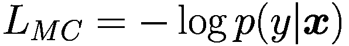 | 对于每个训练实例（***x***, *y*），例如逻辑分类器，见第 1.3 节 |
| 邻域模型 | 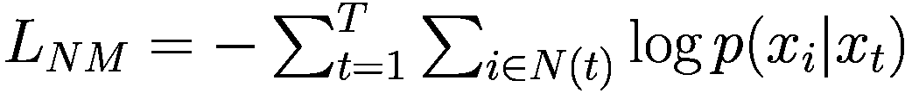 | 对于邻域 *N*(*t*) = { *t*−*k*, …, *t*−1, *t*+1, …, *t*+*k* }，例如 word2vec，见第 1.5 节 |
| 语言模型 | 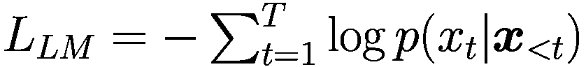 | 例如 RNN 见第 1.6 节，GPT 见第 2.2.2 节 |
| S2S 序列到序列模型 | 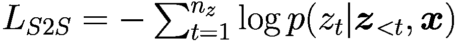 | 对于输入序列 ***x*** = (*x*[1], …, *x*[*T*]) 和翻译 ***z*** = (*z*[1], …, *z*[*R*])，章节 1.6 和 2.3 |
| MLM 掩码语言模型 | 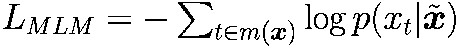 | *m*(***x***) 包含 ***x*** 中掩码标记的索引。在  中，掩码标记被替换为 *MASK*，例如 BERT，章节 2.1 |
| TLM 翻译掩码语言模型 | 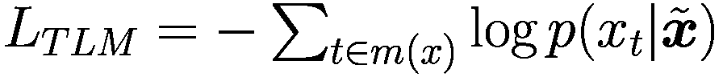 | *m*(***x***) 包含掩码标记的索引。 包含一个句子及其翻译。掩码标记被替换为 *MASK*，例如 mBERT，章节 3.3 |
| SBO 跨度边界目标 | 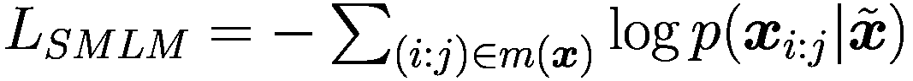 | *m*(***x***) 包含 ***x*** 中掩码标记的跨度 (*i* : *j*)。在  中，掩码标记被替换为其他标记，例如 SpanBERT，章节 3.1.1 |
| PLM 排列语言模型 | 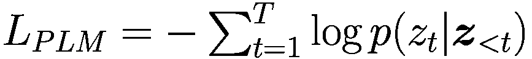 | ***z*** = *perm*(***x***) 是 ***x*** 的排列，例如 XLNet，章节 3.1.1 |
| NSP 下一个句子预测 |  | *ξ*=1 如果文本中 ***z*** 在 *x* 之后（否则 ***z*** 是随机选择的），例如 BERT，章节 2.1 |
| SOP 句子顺序预测 | 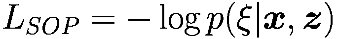 | *ξ*=1 如果文本中 ***z*** 在 ***x*** 之后（否则 ***x*** 在 ***z*** 之后），例如 ALBERT，章节 3.1.1 |
| RTD 替换标记检测 | 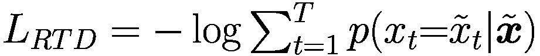 | 在  中随机选择的 ***x*** 元素被替换，例如 ELECTRA，第 3.1.1 节 |

表 3.2

与 BERT 类似的自编码器。预训练和微调损失函数在表 3.1 中定义。基准数字只是一个提示，因为它们取决于参数数量和计算工作量。

| 模型 | 部分 | 预训练 | 微调 | 额外 | 基准 |
| --- | --- | --- | --- | --- | --- |
| ELMo [156] | 1.​6 | BiLM | MC | 使用双向 LSTM | GLUE 71.0 |
| BERT [49] | 2.​1 | MLM + NSP | MC | 预测掩码标记 | GLUE 80.5 |
| RoBERTa [127] | 3.1.1 | MLM | MC | 训练更长，新 epoch 中的新掩码 | GLUE 88.5 |
| SpanBERT [98] | 3.1.1 | PLM, SBO | MC | 预测标记跨度 | GLUE 82.8 |
| ELECTRA [223] | 3.1.1 | RTD | MC | 替换标记检测 | GLUE 89.4 |
| StructBERT [39] | 3.1.1 | RTD | MC | 重新排序打乱后的标记 | GLUE 89.0 |
| ALBERT [113] | 3.1.1 | MLM + SOP | MC | 因子嵌入，参数共享 | GLUE 89.4 |
| XLNET [240] | 3.1.1 | PLM | MC | 预测排列后的标记 | GLUE 90.5 |
| DeBERTa [76] | 3.1.1 | MLM | MC, S2S | 解耦注意力 | GLUE 90.0 |
| Prod. Key [112] | 3.1.1 | MLM | MC | 最近邻 | – |
| UniLM [8] | 3.1.3 | MLM, LM | MC, LM | 单向和双向 | GLUE 87.3 |
| BigBird [247] | 3.2.1 | MLM | MC, S2S | 稀疏注意力机制 | TriviaQA 84.5 |

**RoBERTa** [127] 是一个通过调整预训练过程部分内容而增强的 BERT 模型。作者通过以下变更改进了 BERT[BASE] 架构：(1) 他们不再使用所有 epoch 中相同的掩码，而是使用不同掩码复制训练序列。(2) 他们移除了 Next-Sentence-Prediction 目标，并发现当一批中的所有句子都来自同一文档时，性能最佳。(3) 更大的批次和更大的步长增加了掩码语言模型任务和下游任务性能的困惑度。(4) 将训练数据增加到 160 GB，用于大批次，这是通过 10 倍增加训练数据实现的。该模型在 *GLUE* (*语言理解 [217]) 上实现了令人印象深刻的 Sota 结果 88.5，以及阅读理解任务 *RACE* 和 *SQuAD* [173]。

**SpanBERT** [98] 引入了一种跨度级别的预训练方法。在预训练期间，不是掩盖单个标记，而是掩盖一个或多个完整单词的跨度，覆盖大约 15%的标记。引入了一个新的跨度边界目标（SBO），其中使用跨度边界外的标记表示，并结合位置信息来预测掩盖跨度内的标记。详细信息如图 3.1 所示。SBO 与常用的 MLM 目标一起使用。最后，作者省略了下一句预测任务，如[127]中所述，并且只使用单个文本片段/句子进行训练。作者发现，掩盖随机跨度比掩盖语言单位更有效。SpanBERT 具有与 BERT[LARGE]相同的配置，并在 BooksCorpus 和英语维基百科上进行预训练。SpanBERT 在*OntoNotes 核心 ference 任务* [164]上实现了新的 Sota 79.6% F1，该任务需要识别代词及其对应的名词或两个指代同一事物的短语（第 5.4.1 节）！

一幅插图展示了 Span B E R T 的方法。它表示了输入层、输入和输出嵌入通过 Transformer 编码器、左右边界嵌入、位置嵌入、2 层网络、标记概率和预测标记。

图 3.1

SpanBERT [98] 将跨度边界外的嵌入与位置嵌入连接起来。使用这个输入，一个 2 层模型预测被掩盖的标记的概率

**StructBERT** [223] 通过预测打乱标记三元组的顺序的任务增强了原始 BERT MLM 目标。此外，还需要检测三个句子的顺序。使用与 BERT 和 RoBERTa 相同数量的参数的模型，StructBERT 可以将 GLUE 上的 Sota 分别提高到 83.9 和 89.0。

**Electra** [39] 提出了一种新的预训练任务，称为*替换标记检测*（RTD）。在论文中，一个与掩盖语言模型损失一起训练的生成网络与一个判别网络相结合。输入序列中的某些标记被替换为由小型语言模型（判别网络大小的约 1/4）生成的合理替代品。判别网络必须预测每个标记是否被替换。这种破坏过程解决了 BERT 中的不匹配，其中*MASK*标记出现在预训练中但不在微调中。该模型从所有输入标记中学习，而不是只从小的掩盖子集中学习，这使得它在计算效率上比 BERT 和 RoBERTa 等模型更高，同时在多个任务上表现更好，例如在 GLUE 语言理解任务上达到 89.4%。

**ALBERT**（轻量级的 BERT）[113] 使用两种参数减少技术来解决 BERT 及其缓慢的训练速度带来的巨大内存消耗问题。第一种调整是将 WordPiece 嵌入的维度与 BERT 隐藏层的大小解耦。作者将矩阵 *M* 分解为 *A* 和 *B*，使得 *A* 和 *B* 的参数总数远低于 *M* 的参数总数。第二种调整是在 BERT 的所有层之间共享所有参数，这已被证明可以稳定训练并保持参数数量不变，即使添加了更多层。除了这两种调整外，还引入了一种新的句子顺序预测（SOP）。具体来说，模型必须预测两个句子的顺序是否正确或相反。作者报告说，与 BERT 的 NSP 任务相比，这项任务提高了准确性，该任务可以通过比较两个句子的主题来解决。然而，目前尚不清楚这是否是最佳地将文本结构纳入训练的方法。ALBERT 在 GLUE 和 SQuAD 上实现了新的 Sota 结果。

**XLNet** 解决的是自回归预训练任务，而不是预测掩码词 [240]。这解决了 BERT 的 *token* 在预训练期间出现，但在微调期间不出现的问题。序列中的单词，例如 *“The*[1]*mouse*[2]*likes*[3]*cheese*[4]*”，与其位置信息（索引）一起通过随机排列重新排序，例如 *“cheese*[4]*The*[1]*likes*[3]*mouse*[2]*”。任务是依次预测打乱序列中的标记，类似于 GPT 语言模型。模型必须预测，例如 *p*(*mouse*—2, *cheese*[4],*The*[1],*likes*[3])。请注意，模型还必须知道要预测的单词的位置，即这里为 2。然而，transformer 通过形成总和将位置信息与内容信息混合，因此位置信息与标记嵌入不可分离。

因此，作者决定计算一个额外的自注意力嵌入，称为 *query stream*，它作为查询只接收目标位置，然后可以与键和值向量（Sect. 2.1.1）计算注意力。生成的嵌入编码了要预测的标记的位置和其他标记的相关性，但没有关于该标记内容的信息。这些信息可以作为输入添加到模型中。正常自注意力和查询流具有相同的参数矩阵 *Q*（查询），*K*（键），*V*（值）。为了节省训练努力，XLNet 只在打乱序列的末尾预测几个标记。此外，XLNet 将 Transformer-XL 的段递归机制和相对编码方案（Sect. 3.2.2）集成到预训练中，这在经验上提高了性能，特别是对于涉及较长的文本序列的任务。

当预测一个标记时，可以使用关于它之前和之后的标记的信息。因此，该模型是一个双向编码器。在 BERT 中，如果两个标记 *“New”* 和 *“York”* 被掩码，这两个词都是独立预测的，忽略了有价值的信息。相比之下，XLNet 正确处理了掩码标记的依赖性。XLNet 能够在许多任务上超越 BERT 和 RoBERTa，例如 GLUE 语言理解任务、阅读理解任务如 SQuAD（第 2.1.5 节）、文本分类任务，如 *IMDB*（电影评论分类）[130]。

**产品密钥** [112] 通过最近邻搜索替换了点积注意力。查询 ***q***[*r*] 被分割成两个子查询 ![$${\boldsymbol {q}}_{r}^{[1]}$$](../images/528393_1_En_3_Chapter/528393_1_En_3_Chapter_TeX_IEq16.png) 和 ![$${\boldsymbol {q}}_{r}^{[2]}$$](../images/528393_1_En_3_Chapter/528393_1_En_3_Chapter_TeX_IEq17.png)。对于每个子查询，选择 *k* 个最近的子密钥 ![$$\boldsymbol {k}_i^{[1]}$$](../images/528393_1_En_3_Chapter/528393_1_En_3_Chapter_TeX_IEq18.png) 和 ![$$\boldsymbol {k}_j^{[2]}$$](../images/528393_1_En_3_Chapter/528393_1_En_3_Chapter_TeX_IEq19.png)。从子密钥的 *k*² 组合中，可以高效地计算出最大的点积，并选择 *k* 个最高的组合。结果通过 softmax 函数进行归一化，并用于计算值向量的加权总和。在优化过程中，只有 *k* 个最优密钥受到影响，从而减少了训练工作量。这种方法允许定义具有最小计算开销的非常大的转换器。使用 12 层，作者实现了与 24 层 BERT 模型相同的性能，但计算时间只有一半。在一个全面的转换器架构比较 [142] 中，该方法使 SuperGLUE NLU 任务（第 4.1.2 节）的性能从标准 T5 模型的 71.7% 提高到 75.2%。

**DeBERTa** [76] 使用了一种*解耦注意力*机制，其中每个词由两种不同类型的向量表示，分别编码内容和位置。使用不同的矩阵计算标记之间的注意力权重，用于内容和相对位置。此外，DeBERTa 在最后一层中包含绝对词位置，以捕捉句子中的不同句法角色。在微调过程中，模型采用了一种“对抗”的训练方法，其中嵌入被归一化为概率向量。然后模型被训练以对嵌入的小扰动具有鲁棒性。根据作者的说法，这提高了微调模型的表现。该模型的大版本拥有 15 亿个参数，在多个应用领域表现出色，例如在自然语言理解（第 4.1.2 节）中，DeBERTa 首次在*SuperGLUE 基准* [219]上超越了人类表现，将宏平均分数提高到 89.9%。

Bengio 等人[12]认为，表示，例如嵌入，应该是*解耦*的，并且应该在不同嵌入向量的不同部分表示不同的内容方面，例如语法、风格、语义。Locatello 等人[129]已经证明这不可能以无监督的方式进行。因此，必须使用一些显式的监督或先验信息来生成嵌入的可解释子向量。

**DeBERTaV3** [75] 用 Electra（第 3.1.1 节）的替换标记检测（RTD）替换了 DeBERTa 的 MLM 损失。此外，还采用了一种新的梯度解耦嵌入共享方法，该方法提高了训练效率和预训练模型的质量。其最大版本拥有 128k 个标记的词汇表，24 层，和 3.04 亿个参数。对于经过微调的 GLUE 基准，该模型将分数提高了 1.4%，达到新的 Sota 91.4%。该模型的多语言版本 mDeBERTa[BASE]在*XNLI*任务（第 3.3.1 节）的跨语言迁移准确性方面比 XLM-R[BASE]高出 3.6%。

### 3.1.2 与 GPT 类似的自回归语言模型

通过增加参数数量和训练集大小，可以显著提高 GPT 模型的能力。概述见表 3.3。表 3.3

与 GPT 类似的自回归语言模型（LM）。“详细信息”提供了参数数量和特定功能。“基准”数字仅作为一个提示，因为它们取决于所选参数数量和计算工作量。最佳基准值以粗体显示

| 模型 | 章节 | 详细信息 | 基准 |
| --- | --- | --- | --- |
| GPT-2 [167] | 2.​2 | 1.6B LM 用于生成文本 | Lambada 0-shot 63.2% |
| Retro [21] | 6.​2.​3 | 7B LM 与检索生成文本 | Lambada 73.0% |
| Megatron-LM [193] | 3.1.2 | 8.3B 语言模型生成文本 | Lambada 66.5% |
| Turing-NLG [179] | 3.1.2 | 17B 语言模型生成文本 | Lambada 68.0% |
| 马海毛 [83] | 3.1.2 | 70B 语言模型生成文本 | Lambada 0-shot 77.4% |
| GPT-3 [25] | 3.1.2 | 175B 长序列语言模型生成文本 | Lambada 0-shot 76.2% |
| WebGPT [25] | 6.2.3 | 175B GPT-3 + Bing 搜索引擎 | 与 GPT-3 相同 |
| InstructGPT [151] | 3.6.5 | 175B GPT-3 优化指令 | 与 GPT-3 相同 |
| OPT [151] | 3.1.2 | 免费类似 GPT-3 的 175B 语言模型 | Lambada 0-shot 74.7% |
| BLOOM [151] | 3.1.2 | 176B 欧洲语言语言模型 | Lambada 0-shot 67.2% |
| PanGu-*α* [248] | 3.1.2 | 200B 长序列语言模型生成文本 | 中国基准测试 |
| Gopher [168] | 3.1.2 | 280B 语言模型生成文本 | Lambada 0-shot 74.5% |
| MT-NLG [4] | 3.1.2 | 530B Megatron 变体 | Lambada 76.6% |
| PaLM [35] | 3.1.2 | 540B 共享键值投影 | Lambada 0-shot **77.9%** |
| GLaM [51] | 3.5.2 | 1200B 专家混合语言模型 | Lambada 0-shot 73.7% |
| WuDao-2.0 [178] | 3.5.2 | 1750B 专家混合语言模型 | Lambada：优于 Turing-NLG |

**GPT-3** [25] 是一个具有极端维度的语言模型。其最大版本有 96 层，96 个注意力头，1750 亿参数，覆盖长度为 2048 的序列。它是在大约 5000 亿个标记的书籍、维基百科和网页文本集合上训练的。架构的细节尚不清楚。GPT-3 在语言建模、问答等方面取得了前所未有的性能。一些结果汇总在表 3.4 中，更多内容在论文 [25] 中。表 3.4

在多个流行的基准测试中比较 PaLM、GPT-3、Chinchilla、Gopher、OPT、GLaM 和 BLOOM 的不同版本，涵盖文本补全、代词指代、常识推理和问答（QA）[22, 25, 35, 51]。FLOPS 衡量每秒浮点运算的计算工作量。加粗的为最佳基准值

|  | PaLM | PaLM | PaLM | GPT-3 | Chinchilla | Gopher | OPT | GLaM | BLOOM |
| --- | --- | --- | --- | --- | --- | --- | --- | --- | --- |
| 模型大小（十亿参数） | 8 | 62 | 540 | 175 | 70 | 280 | 175 | 1200 | 176 |
| 数量训练标记（十亿） | 780 | 795 | 780 | 400 | 1400 | 300 | 180 | 1600 | 350 |
| 训练工作量（10²¹ FLOPS） | 37.4 | 295.7 | 2527 | 314.0 | 588.0 | 504.0 | ≈ 50 | ≈ 105 |  |
| Lambada 0-shot（文本补全） | 69.5 | 75.4 | **77.9** | 76.2 | 77.4 | 74.5 |  | 73.7 | 67.2 |
| HellaSWAG 0-shot (文本补全) | 68.7 | 79.7 | **83.4** | 78.9 | 80.8 | 79.2 | 79.0 | 77.1 | 73.0 |
| PIQA 0-shot (常识) | 77.1 | 80.5 | **82.3** | 80.5 | 81.8 | 81.8 | 78.5 | 80.4 |   |
| Winogrande 0-shot (指代消解) | 66.3 | 77.0 | **81.1** | 70.2 | 74.9 | 70.1 | 74.0 | 73.4 | 70.1 |
| BoolQ 0-shot (QA) | 68.3 | 84.8 | **88.0** | 60.5 | 83.7 | 79.3 | 64.0 | 83.0 |   |
| 自然问题 0-shot (QA) | 8.4 | 18.1 | **21.2** | 14.6 | 16.6 | 10.1 |   | 21.5 |   |
| 自然问题少量示例（QA） | 14.6 | 27.6 | **36.0** | 29.9 | 31.5 | 24.5 |   |   |   |
| Trivia QA 0-shot (QA) | 39.5 | 67.3 | **76.9** | 64.3 | 67.0 | 52.8 |   | 68.0 |   |
| Trivia QA 少量示例 (QA) | 48.5 | 72.7 | **81.4** | 71.2 | 73.2 | 63.6 |   |   |   |

| 平均任务指标 | 51.2 | 64.8 | **69.8** | 60.7 | 65.2 | 59.5 |   |   |   | GPT-3 能够生成流畅的文本，并涵盖大量的世界知识，如图 3.23.2 所示。生成的文本示例可以在许多地方找到 [23，149]。PLM 捕获的知识量和质量在第四章 4 中讨论。与其它语言模型不同，GPT-3 可以通过几句话的指令执行相当任意的任务（少量示例学习）。这是一种非常简单的方法来使用 GPT-3 解决相当具体的问题，如翻译成另一种语言、总结文档、纠正语法、就给定主题写文章等。具体细节在 3.6.3 节 3.6.3 中讨论。

一组 2 个文本框代表文章要求的输入和 GPT-3 的输出。输入标题为“联合卫理公会同意历史性分裂”。

图 3.2

GPT-3 根据输入生成的文本。经作者同意引用 [25，第 28 页]

到 2021 年底，OpenAI 提供了一种 API，使用户特定数据微调 GPT-3 [123]。这样，模型可以适应特定领域的语言，并且还可以准备执行特定的分类任务。通常，这比提示设计产生更高的质量结果。此外，不再需要少量示例。GPT-3 微调的细节在 3.6.2 节 3.6.2 中讨论。表 3.43.4 比较了 GPT-3 与其他更近期的语言模型在多个流行基准上的表现。新的 PaLM 模型具有明显的优势。

**GPT-J-6B** 是一个具有 28 层、16 个头、上下文大小为 2048 和 60 亿参数的开源 GPT 模型 [221]。它的性能与具有 67 亿参数的 GPT-3 版本相似。有一个交互式网络演示，用户可以输入他们的提示，并生成后续文本 [220]。**GPT-Neo** [16] 是另一个具有 27 亿参数的免费 GPT 版本。它是在 *Pile* 上训练的，这是一个包含来自 22 个不同来源的数据的 825 GB 数据集，包括学术来源（例如 ArXiv）、互联网网页（例如 StackExchange）、字幕对话、GitHub 等。它在某些自然语言理解任务上优于具有相同参数大小的 GPT-3 版本 [89]。最近，**GPT-NeoX-20B** [215] 发布。它有 44 层，内部向量维度为 6144，64 个头，并使用 3.1M 大小的批次进行训练。在 LAMBADA 基准测试（第 4.1.3 节）中，其任务是预测每段最后一句的缺失最后一个单词，它达到了 72.0% 的准确率。这个值接近具有 75.2% 准确率的 GPT-3。

**Megatron-LM** [193] 之类的语言模型，如 GPT-2 和 BERT，通过引入层内模型并行化来高效地扩展到 **Megatron-LM** 的规模。作者将自注意力头和前馈层放置在不同的 GPU 上，从而减轻了单个 GPU 的内存负担。他们提出了一种具有 83 亿参数的 GPT 变体和一种与 BERT 相似的 39 亿参数模型。该方法的亮点包括使用 512 个 GPU 时的 76% 扩缩比效率。他们的 GPT 模型将 *WikiText-103* [134] 的 Sota 混淆度从 15.8 降低到 10.8，而他们的 BERT 模型将 RACE (阅读理解) [110] 准确率提高到 90.9%。

**Jurassic-1** [122] 是一个类似于 GPT-3 的自回归语言模型，具有 1780 亿参数。作者选择了 256k 的标记词汇量，而不是 GPT-3 的 5 万，这还包括了诸如命名实体和常用短语等频繁的多词表达式。与 GPT-3 相比，训练文本可以用 28% 更少的标记表示。因此，当使用相同的架构时，该模型可以处理查询的速度快 1.4 倍。该模型使用了最大序列长度为 2048 个标记。尽管词汇量更大，但所有参数中只有 2% 用于输入嵌入。该模型是在使用 3.2M 个标记的最终批次大小从公共文本语料库中抽取的 3000 亿个标记上训练的。

**PanGu-***α* [248] 是华为的一个类似于 GPT-3 的模型，参数量高达 2000 亿。它是在 1.1TB 的中文文本上训练的，并在零样本、单样本和少样本设置中应用于大量任务，而无需任何微调。该模型的表现与 GPT-3 相当。

**OPT-175B**（开放预训练 Transformer）[253] 是由 Meta 开发的包含 8 个 GPT 模型的一系列，参数范围从 125M 到 175B。它在包含 180B 个标记的公开可用数据集上进行了训练。最大的模型有 96 层，每层有 96 个头。尽管 OPT-175B 与 GPT-3 具有相同的参数数量，但其训练所需的计算工作量仅为 GPT-3 的 1/7。该模型在 16 个 NLP 任务上进行了评估，并显示出与 GPT-3 大致相同的性能（表 3.4）。所有参数量高达 30B 的模型都是免费提供的。175B 参数的大型模型仅对学术研究人员开放，需申请以防止虚假新闻的生产。该模型只能在 16 个 NVIDIA V100 GPU 上进行训练和部署。一些基准测试结果在表 3.4 中提供。

**BLOOM** [139] 是一个具有 176B 参数的自回归大型语言模型。它有 70 层，每层有 112 个注意力头，序列长度为 2048 个标记。它是由超过 1000 名 AI 研究人员组成的 BigScience 倡议开发的，旨在为所有想要尝试的人提供免费的大型语言模型。其训练数据涵盖了 46 种自然语言（英语 30%，中文 16%，法语 12%，西班牙语 11%，……）和 11%的代码（Java，PHP，……），总共有 350B 个标记。176B 的 BLOOM 模型使用了提供不同类型并行性的 Megatron-DeepSpeed 库 [26] 进行训练。该模型可以在 8 个大型 GPU 上进行评估。因此，BLOOM 是可用于研究目的的最大训练模型之一。一些基准测试结果在表 3.4 中提供。

**Gopher** [168] 使用了 GPT-2 架构，并进行了两项修改。为了正则化，作者使用了 RMSNorm（第 2.4.2 节）而不是 LayerNorm，并且使用了相对位置编码方案 [44] 而不是绝对位置编码。Gopher 有 80 层，每层有 128 个注意力头和 280B 参数。所有模型都是在 300B 个标记上，上下文窗口为 2048 个标记，批大小高达 6M 个标记的情况下进行训练的。对于大型模型，使用了 16 位浮点数以减少内存和提高训练吞吐量。

训练了六个不同参数数量的模型版本，以评估模型大小的影响。作者在表 4.3 中描述的 152 个任务上进行了全面的评估。Gopher 在 124 个任务中的 100 个任务上有所提升。其中之一是*LAMBADA 基准测试* [154]，Gopher 在该基准测试中生成了一个零样本得分 74.5，仅略低于具有 530B 参数的*MT-NLG*模型的 76.6 分 [106]。例如，Gopher 在涵盖经济学计量学和心理学等人文领域的 12 个基准测试中均达到了 Sota 水平，超过了 11 个基准测试的最佳监督结果。一些结果在表 3.4 中提供，而第 4.1.4 节描述了更多细节。

**Chinchilla** [83] 是一个中等规模的编码器模型，具有 700 亿参数，其计算预算与更大的 Gopher 模型相同，但数据量是其四倍。Chinchilla 在性能上始终优于 Gopher（见表 3.4），并在大量下游评估任务上显著优于 GPT-3（1750 亿）、Jurassic-1（1780 亿）和 Megatron-Turing NLG（5300 亿）。对于模型大小的每倍增加，训练标记的数量也应加倍。这比 Kaplan 等人[102]在 3.5.1 节中预测的扩展率要大得多。

**Turing-NLG** [179] 引入了一个具有 78 层 transformer、隐藏向量大小为 4256、28 个注意力头和 170 亿参数的自回归语言模型。由于超过 13 亿参数的模型无法在一个 32GB 内存的单个 GPU 中拟合，它必须并行化或在多个 GPU 之间分割。Turing-NLG 利用了具有高通信带宽的 Sota 深度学习硬件、Megatron-LM 框架和 DeepSpeed 库，进一步优化了训练速度并减少了所需资源。该模型在语言建模任务上实现了 Sota 性能，并且也证明了在零样本问答和抽象摘要方面是有效的。

其继任者 **MT-NLG** [4] 是一个具有 105 层编码器和 5300 亿参数的模型，在 280 个 GPU 上以巨大的批处理大小 1920 进行训练。与 GPT-3 类似，它在零样本、单样本和少量样本任务上提高了性能。例如，对于 *LAMBADA 基准测试* [154]，模型需要预测段落（4.1.3 节）的最后一个单词。在这个基准测试中，MT-NLG 将 GPT-3（86.4%）的少量样本准确性提高到了 Sota 87.2%。

**PaLM** [35] 是谷歌开发的一个具有 5400 亿参数的自回归语言模型。它有 118 层、48 个头和 2048 个输入序列长度。还有较小的版本，参数为 80 亿和 620 亿。它使用标准的自回归解码器，具有 SwiGLU 激活函数，并为层的头部共享查询-值投影，这提高了自回归解码速度。该模型在一个包含 7800 亿标记的高质量数据集上进行训练，其中已经过滤掉了粗俗和有害的语言。每个训练示例只使用一次。训练集包含社交媒体对话（50%）、多语言网页（27%）、书籍（13%）、源代码文件（5%）、多语言维基百科文章（4%）和新闻文章（1%）。训练需要 3072 个 TPU 芯片运行 1368 小时，导致总排放量比旧金山和纽约之间飞机直接往返的排放量高出 50%[35，第 18 页]。

PaLM 在数百个自然语言推理、数学、推理和知识密集型任务上进行了评估，并在大多数基准测试中达到了 Sota 准确率，例如在 29 个最广泛评估的英语语言理解基准测试中的 28 个（参见表 3.4）。这表明，对于大型基础模型，缩放效应仍然持续存在。图 3.3 显示了与先前模型相比在 BIG-bench 数据上的结果。PaLM 540B 5-shot 在 58 个共同任务中有 44 个超过了先前的 Sota，平均而言，显著优于其他模型（Gopher、Chinchilla、GPT-3）。此外，PaLM 540B 5-shot 的得分高于被要求解决相同任务的人类的平均得分。当在 SuperGLUE 上进行微调时，该模型优于最佳解码器模型，并且与编码器-解码器模型具有竞争力，编码器-解码器模型通常在微调方面表现更好。许多任务显示了从模型规模到性能的连续改进，这意味着从小型版本到最大模型的性能提升高于预期。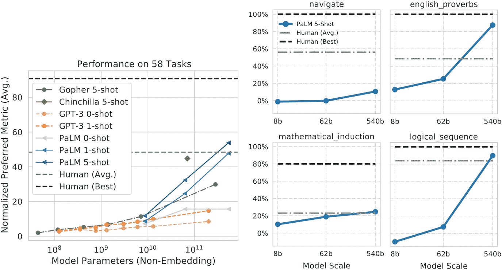

5 条线图。图 1 是标准化首选指标与模型参数的对比，显示了 58 个任务上的性能。其他 4 个图分别表示负数、英语谚语、数学归纳和逻辑序列的百分比，每个与模型规模对比。所有图表都显示出上升趋势。

图 3.3

PaLM、GPT-3、Gopher 和 Chinchilla 的评估（左侧）。之前的模型仅在一组子任务上进行了评估，因此此图显示了所有三个模型都评估过的 58 个任务的汇总结果 [35]。PaLM 的中等准确率优于人类的平均表现。右侧显示了四个特定 BIG 任务的评估结果。在[35，第 15 页及以下]中，详细比较了不同尺寸的三个 PaLM 模型以及人类水平的性能。

PaLM 已在程序代码文档上进行了微调。得到的模型被称为*PaLM-Coder* [35，第 23 页]。代码质量通过 pass@*k*指标来衡量，其中对于测试集中的每个问题，PaLM-Coder 生成*k*个源代码样本，如果任何样本解决了问题，则认为问题已解决。PaLM-Coder 能够解决大约 50%的基准任务，其 pass@1 值约为 50。对 PaLM-Coder 模型的属性进行了详尽的评估。

对于大约四分之一的任务，作者观察到，如果模型从 58B 参数增加到 540B 参数，准确率会出现不连续的跳跃，远超过 Kaplan 等人提出的“幂律”[102]（Sect. 3.5.1）。例如，图 3.3 中显示的“英语谚语”和“逻辑序列”。这表明，当模型达到足够大时，PLM 的新能力可以进化，并且这些能力的发展也超出了迄今为止研究的模型大小。

训练数据包含 22%的多语言文档。对于不同语言之间的翻译，少量 PaLM 模型接近甚至超过了微调的 Sota。对于英语-法语翻译，PaLM 540B 少量模型达到 44.0 Bleu，而 Sota 为 45.6。对于德语-英语，PaLM 540B 少量模型达到 47.5 Bleu，而 Sota 为 45.6 Bleu。对于其他任务，如摘要和问答，PaLM 540B 少量模型接近微调模型，并在某些情况下可以超越它们。

对于语言模型来说，通过多个中间步骤进行推理一直都很困难。最近提出了思维链提示（Sect. 3.6.4），它将中间推理步骤 [226] 加入到少量提示（Fig. 3.4）中。遵循这个方法，PaLM 模型在给出最终答案之前，同样会为多步问题生成自己的中间步骤。这导致了许多基准任务的性能提升。使用这种技术，PaLM 甚至能够解释笑话，如图 3.5 所示。

2 个文本框代表一组 2 个提示及其模型输出。

图 3.4

常识性问题回答任务的思维链提示的少量示例 [35，p. 38]。相同的两个示例思维链与不同的需要答案的提示结合

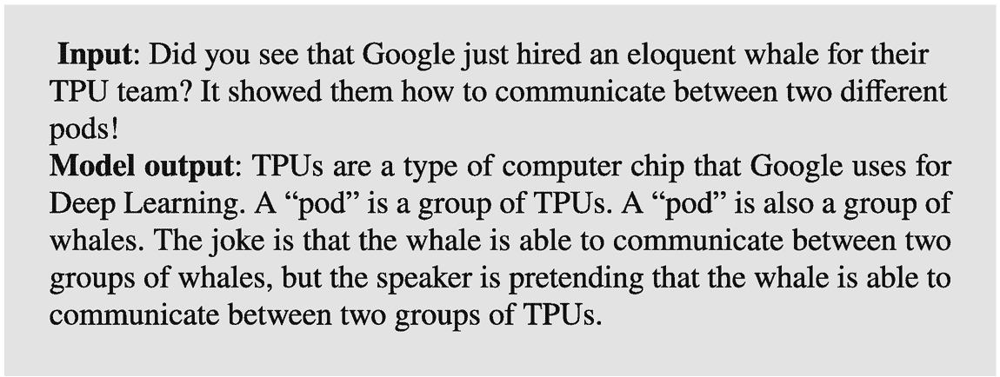

文本框代表一个输入提示及其模型输出。

图 3.5

通过使用思维链提示，PaLM 可以解释笑话 [35]

### 3.1.3 Transformer 编码器-解码器

Transformer 编码器-解码器 [212] 使用翻译任务（Sect. 2.3）进行预训练。为了提高性能，提出了许多替代方案：

+   MASS、BART 和 PEGASUS 提出了恢复损坏的预训练数据的不同目标。例如，预测掩码跨度、排列句子顺序或插入省略的标记。

+   T5 将许多语言理解和语言生成任务表述为文本翻译，并使用相同的模型处理它们。

+   Longformer、Reformer 和 Transformerl-XL 扩展了输入文本的大小，而不增加参数数量。它们在 Sect. 3.2 中讨论。

详细内容见下文。在表 3.5 中提供了一个代表性的 transformer 编码器-解码器列表。表 3.5

Transformer 编码器-解码器。预训练和微调的损失函数定义在表 3.1 中。基准：En-De WMT2014 英语到德语的 BLEU，GLUE 部分 4.1.1 准确率，SuperGLUE 部分 4.1.2 准确率，TriviaQA [99] 部分 6.2.1 准确率，Penn Treebank [136] 混淆度。基准数据仅作为一个参考，因为它们取决于参数数量和计算工作量

| 模型 | 章节 | 预训练 | 微调 | 额外 | 基准 |
| --- | --- | --- | --- | --- | --- |
| Transformer [212] | 2.3 | S2S | S2S | 预测翻译标记 | En-De 26.4 |
| UniLM [8] | 3.1.3 | MLM, LM | MC, LM | 单向和双向 | GLUE 87.3 |
| MASS [196] | 3.1.3 | S2S | S2S | 预测掩码标记 | En-De 28.3 |
| BART [119] | 3.1.3 | DAE | MC, LM, S2S | 恢复损坏的文本 | GLUE 88.4 |
| T5 [170] | 3.1.3 | S2S | MC, LM, S2S | 将许多 NLP 任务作为 S2S 问题解决 | GLUE 89.7 |
| GLM [54] | 3.1.3 | LM | LM | 通过自回归预测解决所有任务 | SuperGLUE 82.9 |
| Longformer [10] | 3.2.1 | MLM, S2S | LM, MC, S2S | 稀疏注意力机制 | TriviaQA 77.3 |
| Reformer [108] | 3.2.2 | LM, S2S | LM, MC, S2S | 局部敏感哈希，可逆残差层 | En-De 29.1 |
| Transformer-XL [44] | 3.2.2 | MLM, S2S | MC, S2S | 稀疏注意力机制 | Penn-Tree Bank 54.5 |

**MASS** [196] 基于 Transformer 架构。与原始 Transformer 相比，编码器中连续的标记序列被掩码，解码器的任务是递归地预测掩码标记（图 3.6）。因此，MASS 可以联合训练编码器和解码器，以开发提取嵌入和语言建模的能力。MASS 在神经机器翻译、摘要和对话响应生成等语言生成任务上进行微调。与之前的 Transformer 架构相比，它显示出显著的性能提升！

一幅插图列出了句子“我爱香草冰淇淋。约翰一个也没有。”中的 6 个预训练任务，这些任务是：跨度掩码、标记掩码、标记删除、文本填充、句子排列和文档旋转。

图 3.6

Transformer 通过不同的预训练任务恢复损坏的文本。Span masking 是 MASS [196] 的任务。BART 使用从标记掩码到文档旋转的所有任务 [119]

**BART** [119] 采用基于标准的 Transformer 编码器-解码器架构。预训练任务是通过多种不同的方法恢复被破坏的文本（图 3.6）：预测被掩码的标记，类似于 BERT；预测删除的标记及其位置，预测由单个掩码替换的缺失标记，重构一个排列后的句子，类似于 XLNet，以及找到旋转文档的开始。BART 在 GLUE、SQuAD、摘要和机器翻译等任务上进行了微调。BART 在预测由单个掩码替换的缺失标记方面取得了最佳性能。一个大型版本的 BART 使用了 1024 的隐藏大小和 12 个编码器和解码器层，与 RoBERTa 所使用的相似数据集。结果性能与 RoBERTa 相似。对于抽象摘要，例如在 *CNN/Daily Mail 基准测试* [78] 上，BART 实现了 Sota。

**PEGASUS** [251] 提出了一种新的目标：*gap-sentences generation*，在大量文本语料库上预训练大型基于 Transformer 的 Seq2seq 模型，其中句子而不是标记被掩码或删除。模型必须将这些修改部分生成为一个单句输出。在 12 个文档摘要任务上，该模型实现了 Sota 性能。

**T5** [170] 基于标准的 Transformer 架构。通过恢复损坏的文本进行预训练，这被表述为一个序列到序列的任务。图 3.6 中列出的不同预训练任务的比较发现，与 BART 类似，文本填充取得了最佳结果。如果原始文本是 *“Thank you for inviting me to your party last week .”*，则模型接收输入 *“Thank you [X] me to your party [Y] week .”*，其中包含掩码短语，并必须生成输出 *“[X] for inviting [Y] last [Z]”* 来重构掩码短语。

*显著跨度掩码* [72] 特别有效。为了关注相关短语，训练了一个 BERT 标记器来识别命名实体（人名、地点等，第 2.1.3 节），日期通过正则表达式识别。如果模型需要重新创建这些跨度，则模型性能显著提高。通过预测省略的标记，模型能够收集大量关于句法和语义知识的信息。广泛的比较表明，序列到序列架构比其他架构，例如自回归语言模型，产生了更好的结果。

T5 使用 750 GB 的清洁英文网页文本训练数据集，在无监督和监督任务的多任务混合上进行预训练。其最大版本有 24 层，128 个注意力头和 110 亿个参数。对于每个任务，数据被转换为文本到文本格式（图 3.7）。该模型在许多基准测试中实现了 Sota 结果，例如摘要、问答、文本分类等。GLUE 的结果为 90.3% [11]。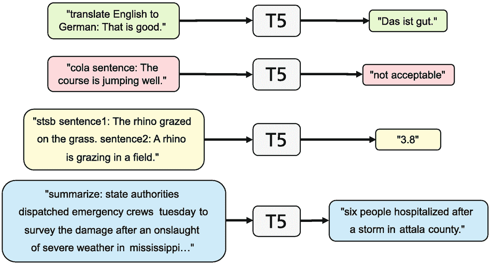

块图表示通过 T5 翻译的一系列提示。左侧有 5 条指令，右侧是它们的输出。

图 3.7

T5 中的每个任务都表示为一个翻译任务，其中任务的类型是输入文本（左侧）的前缀，模型产生相应的输出（右侧）。改编自 [170，第 3 页]，经作者友好许可。

**Primer** [195] 提出了对原始自注意力架构的两种修改。首先，ReLU 激活函数被平方。此外，在每个多头投影之后添加了一个卷积层，用于查询 *Q*、键 *K* 和值 *V*。对于原始的 T5 架构，这减少了训练成本的四倍。

**UniLM2** [8] 同时预训练了一个双向语言模型和一个用于语言生成的序列到序列模型。这两个任务的模型参数是共享的，并且上下文标记的编码结果被重复使用。该模型使用两种掩码类型，一种类似于 BERT 的双向掩码，以及用于语言模型的伪掩码。通过特殊的自注意力掩码和位置嵌入，模型可以在一次前向传递中执行语言建模任务，而不需要冗余计算上下文。该模型在 SQuAD 1.1 的阅读理解任务上击败了 BART[BASE]，在 CNN/Daily Mail 的抽象摘要任务上击败了 T5[BASE]。

**GLM** (通用语言模型) [54, 55] 是 UniLM2 的后继者，旨在结合 BERT、GPT 和 transformer 的不同学习范式。对于预训练，GLM 的任务是使用 GPT 架构以自回归方式生成多个文本跨度。从输入文本 ***x*** = (*x*[1], …, *x*[*T*]) 中采样一个数量为 *m* 的跨度 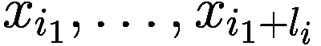。每个跨度被替换为一个单独的 *token*，从而得到损坏的输入 ***x***[corrupt]。然后模型依次生成跨度的标记，同时访问损坏的输入和已生成的跨度的标记（图 3.8）。在输入文本中，所有标记通过自注意力连接，而在输出部分使用掩码自注意力。每个跨度由一个 *[END]* 标记结束。为了识别生成标记的位置，通过嵌入编码两个位置：输入位置和跨度内的位置。请注意，掩码预测可以按任意顺序进行，并且在重建过程中模型必须预测跨度的长度。![]

一组完整自注意力和掩码自注意力通过具有自注意力的 transformer 的示意图。它表示输入位置、掩码位置、嵌入、输出嵌入和标记概率的层。

图 3.8

在预训练期间，GLM 的任务是重建掩码的单个单词或多词短语。通过位置嵌入指示生成单词在文本和掩码中的位置，这些嵌入被添加到标记嵌入中。生成的答案由一个 *[END]* 标记结束 [54]

对于微调，文本分类任务被转换为单词预测。为了评估情感分类任务中的句子 *“The waiters were friendly.”*，输入被扩展为 *“The waiters were friendly. It’s really

为了评估模型性能，Du 等人 [54] 使用与 BERT[BASE] 和 BERT[LARGE] 相同的训练数据和参数数量（110M 和 340M）训练 GLM[BASE] 和 GLM[LARGE]。对于这两种模型配置，GLM 在 SuperGLUE (第 4.1.2) 上优于 BERT，例如 GLM[LARGE] 的平均分数为 77.0，而 BERT[LARGE] 为 72.0。在大小与 RoBERTa 相同的更大预训练数据集上，他们得到的平均 SuperGLUE 分数为 82.9，而 RoBERTa 为 81.5。他们表明，通过多任务学习，具有相同参数的单个模型可以同时在高精度 NLU、给定输入生成文本以及解决其他任务（如摘要 [53]）中取得更高的准确率。

更大的模型如 **GLaM** [51] 和 **WuDao-2.0** [257] 具有专家混合架构，并在第 3.5.2 节中描述。

### 3.1.4 Transformer 变体的系统比较

作为对架构特征进行公平比较的例子，我们报告了以下 PLM 的实验分析，其中 Narang 等人 [142] 评估了多种 transformer 修改的效果。以下 transformer 特性被研究：

+   *激活函数:* 除了前馈层中的 ReLU 激活函数外，还评估了 11 种不同的激活函数。

+   *归一化:* 与原始层归一化一起，探索了五种不同的正则化技术。

+   *层数数量:* 层数的数量 *d*[*L*] 在 6 到 24 之间变化。为了保持比较的公平性，通过改变头数 *d*[*H*] 和内部嵌入宽度 *d*[ff] 来保持参数数量不变。

+   *标记嵌入:* 将原始 transformer 嵌入与五种因式分解嵌入的变体进行了比较。此外，还研究了 transformer 块的共享。

+   *Softmax:* 将计算标记概率的标准 softmax 与三种 softmax 变体进行了对比。

+   *架构:* 作者比较了基础 transformer 与 17 种其他架构。在大多数情况下，参数数量保持大致相同。

作者在两种设置中评估了这些变体：基于 T5 transformer 的迁移学习（第 3.1.3 节）和 *WMT2014 En-De* 上的监督机器翻译*17]。谨慎起见，这些结果也可以应用于其他类型的 PLM，如 BERT 和 GPT。

T5 的每个架构变体都在 806 GB 的*C4 数据集*[171]上使用“span corruption”掩码语言建模目标进行预训练。随后，T5 在三个任务上进行微调：*SuperGLUE*语言理解任务[219]，*XSum*抽象摘要数据集[143]，以及*WebQuestions 基准测试*[13]，在这些任务中，没有提供额外的背景信息作为知识。每个模型的计算努力和参数数量都固定在同一水平。一个例外是参数显著减少的架构，它训练时间更长。

相比 ReLU 激活函数，一些*激活函数*的性能更好，特别是*SwiGLU*和*GEGLU*，它们是*门控线性单元*（GLU），与另一个激活函数形成乘积[189]。这种改进可以在预训练、微调和监督训练中观察到，而不会影响计算时间。例如，对于 SuperGLUE，分数从 71.7%提高到约 76.0%。将*层归一化*替换为*RMS 归一化*[249]会导致所有任务的性能提升。例如，SuperGLUE 的分数从 71.7%提高到 75.5%。此外，训练速度也更快。

如预期的那样，增加模型的深度通常会导致性能提升，即使参数数量保持不变。在 SuperGLUE 上，具有 18 层的模型取得了 76.5%的分数，而基础模型的分数为 71.7%。对于 WebQuestions 和翻译任务，也可以观察到类似的改进，而在摘要任务上没有观察到改进。这与理论结果（第 3.5.1 节）一致。缺点是深度模型需要更多的计算时间。

在不同层之间共享参数的架构通常会导致性能下降。使用相同的嵌入表示编码器和解码器的影响是混合的。将嵌入分解为矩阵乘积通常会导致较差的结果。如果使用*Softmax 混合*[239]来预测输出概率，性能通常会更好，例如 SuperGLUE 的分数提高到 76.8%。然而，这种方法需要高达 40%更多的计算努力。

在评估的架构变体中，两种与点积注意力（Sect. 3.2.2）结合的 *Synthesizers* 表现优于标准 Transformer。Synthesizers 不计算嵌入的“相关性”，而是从单个嵌入或随机确定注意力权重。Switch Transformer、专家混合模型和乘积键内存都比基线 Transformer 有显著更多的参数，但能够提高性能。*Switch* Transformer ([56] Sect. 3.5.2) 比基础 T5 模型有更多的参数。为了达到与 Switch 相同的表现，T5 需要七倍的训练 FLOPS（每秒浮点运算数）。*专家混合模型* [116] 在编码器和解码器中都分配计算到 2 个专家模型。*乘积键内存* ([112] Sect. 3.1.1) 用最近邻搜索替换了点积注意力。

对于所有其他 12 种架构，它们在标准 Transformer [142] 上没有带来任何改进。这与提出这些模型的论文的发现不同。一个可能的原因是，Transformer 架构的变化难以转移到其他代码库和应用中。因此，作者建议在不同的低级实现上尝试新的修改。此外，应该对包括迁移学习、监督学习和语言建模在内的各种下游应用进行新的方法评估。*超参数*优化应保持固定，以确保方法的鲁棒性。最后，应报告结果的平均值和标准差，以避免选择单个最佳结果。

### 3.1.5 摘要

预训练任务的修改对 PLMs 的性能有深远的影响。已经评估了许多不同类型的预训练损失，例如掩码短语预测、替换标记检测或句子顺序识别。根据基准测试，XLNET 对置换标记的预测特别有益，因为 XLNET 考虑了掩码标记之间的依赖关系。此外，DeBERTa 的解耦标记和位置嵌入能够提升下游分类器的性能。就应用而言，像 BERT 这样的自编码器在信息提取（第五章）中特别重要。

对于像 GPT 这样的自回归 PLM，已经提出了具有更大模型规模和更大训练数据的多种变体。然而，在大多数情况下，预训练任务并未改变。更大模型的训练需要改进并行计算基础设施，并在文本生成中实现了前所未有的性能。通过创建自定义起始文本（提示），模型可以在不进行进一步微调的情况下解决大量特定任务，并达到非常高的准确率（见第 3.6.3 节）。PLM 捕获的知识量和质量出人意料地高，这在第四章中进行了讨论。在应用方面，自回归 PLM 特别用于文本（见第六章）和图像生成（见第 7.2 节）。由于它们的通用性和性能的巨大提升，最近的大型 PLM 被称为*基础模型*。

编码器-解码器变压器被引入用于将一种语言的文本翻译成另一种语言。对这些模型评估了许多新的预训练任务。其中一些与自编码器的任务类似，例如预测掩码跨度或插入省略的标记。其他任务则被调整为输入-输出架构，例如句子排列和文档旋转的重构。在这里，BART 和 T5 在 GLUE 和 SuperGLUE 自然语言理解任务中取得了最佳性能。通过创建额外的合成训练示例，T5 和其他模型的性能可以得到提高（见第 3.6.6 节）。

对变压器架构的系统比较表明，一些架构变化提高了性能。使用 SwiGLU 和 GEGLU 激活函数代替 ReLU，SuperGLUE 的准确率提高了超过 4%。使用 RMS 归一化代替层归一化时也观察到了类似的增益。即使保持参数数量不变，增加模型深度也能带来更好的性能。通过用 k-means 聚类替换标量乘积，合成器、专家混合和产品键也表现优于标准变压器。

T5 和 GLM 表明，在指导性提示的控制下，变压器可以用于解决文本分类、文本生成和文本翻译的任意问题。因此，它们结合了 BERT、GPT 和翻译模型的能力。变压器在复杂的文本生成任务中被广泛使用，例如机器翻译（见第 6.3 节）、对话（见第 6.6 节）和图像生成（见第 7.2 节）。

## 3.2 捕获更长的依赖关系

自注意力存在的一个众所周知的问题是二次时间和内存复杂度，这可能会阻碍模型在许多设置中的可扩展性（见第 2.1.6 节）。如果序列长度 *T* 增加到 2*T*，则需要在标记之间计算四倍的关联（注意力）。这限制了模型在需要更大上下文的任务中的直接应用，例如回答问题或总结文档。此外，还需要更大的内存来存储训练中的注意力。因此，已经提出了许多概念来覆盖长序列，同时不过度增加计算和内存需求。

+   BigBird、稀疏 Transformer、Longformer 和 GPT-3 使用稀疏注意力矩阵来减少参数数量。

+   通过局部敏感哈希对标记进行聚类可以减少 Reformer 计算的注意力数量。

+   通过注意力矩阵的低秩近似或基于核的自注意力公式可以减少 Performer 和线性 Transformer 的参数数量。

+   Transformer-XL 和线性 Transformer 以自回归方式重用先前文本段落的计算，以降低计算开销。

Tay 等人 [207] 和 Fournier 等人 [59] 提供了扩大输入序列的技术综述。

### 3.2.1 稀疏注意力矩阵

**BigBird** [247] 通过从注意力关系矩阵中根据某些预先确定的模式省略条目来减少注意力计算的数量。BigBird 扩展了基于 Transformer 的模型，例如 BERT，并使用一组 *g* 全局标记来关注序列中的所有标记。此外，每个标记 *v*[*t*] 关注一组 *n*[*l*] 本地 *邻近标记* 和一组 *n*[*r*]*随机标记*。结果关联矩阵如图 3.9 所示。如果 *g*、*n*[*l*] 和 *n*[*r*] 的数量不随序列长度 *T* 增加而增加，则注意力数量将随 *T* 线性增长。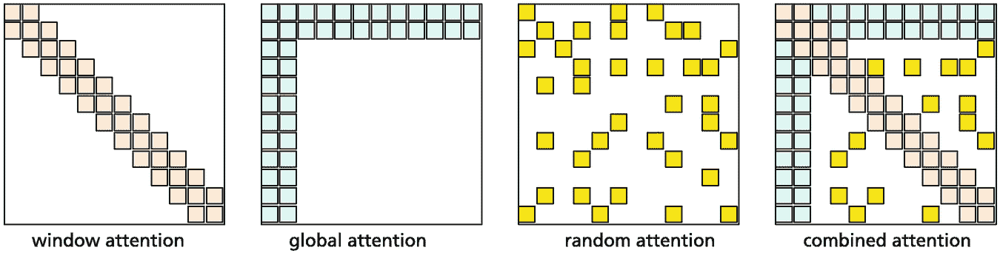

4 个插图展示了平方块群的不同排列。它表示窗口注意力、全局注意力、随机注意力和组合注意力。

图 3.9

BigBird [247] 中使用的注意力机制用于计算输入标记之间的关联。表示标记对之间注意力的矩阵：序列邻居之间的注意力（左侧），对少数标记的全局注意力（第二左侧），随机注意力（第三左侧），结合的 BigBird 注意力（右侧）。白色块表示省略的注意力对。该模型以这种方式构建，使得任意标记对之间沿中间标记的路径长度保持较小，就像一个小世界图。作者们证明，他们的模型仅通过 *O*(*T*) 个内积就可以表达所有连续的序列到序列函数（见表 3.6）。此外，他们还表明，在标准假设下，BigBird 是图灵完备的，即可以执行任意计算（参见 [246]）。BigBird 注意力模块可用于 BERT、自回归语言模型和 Transformer 架构。在许多应用中，使用序列长度为 4096 的 BigBird 能够提高 Sota，例如，对于需要从给定证据中进行多跳推理的问答。请注意，在一系列实验中，没有随机注意力的 BigBird 比带有随机注意力的 BigBird 表现更好。表 3.6

对于长依赖关系的重要模型具有稀疏自注意力。*T* 是序列长度，*g* 是全局标记数，*k* 是窗口大小。（参看 [207]）

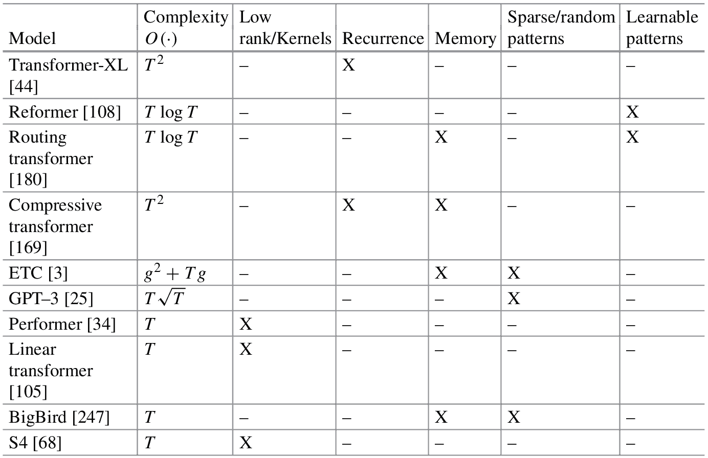

一个表格表示了 10 个不同模型的复杂度、低秩、递归、内存、随机模式和可学习模式的详细信息。

之前使用这些概念的模型是 *稀疏 Transformer* [33] 和 *Longformer* [10]，它们类似于 WaveNet [148]，使用步进或“膨胀”的邻域。在这里，并非所有相邻的邻居都会被一个标记所关注，而只有每隔 *d* 个邻居（*d* > 1）。如果使用 *k* 层，这种结构将覆盖 *d*^(*k*) 个邻居，从而允许跨越较大距离的关联。**扩展 Transformer 构造**（ETC）模型 [3] 将全局标记的概念进行了推广，它可以沟通整个序列中远离的标记之间的关联。

**GPT-3** [25]（第 3.1.2 节）是一个最近的语言模型，有 96 层，96 个注意力头，1750 亿个参数，覆盖长度为 2048 的序列。为了应对过长的序列长度，作者们在 Transformer 的层中使用了“交替密集和局部带状稀疏注意力模式”，类似于稀疏 Transformer [33]。架构的细节尚不清楚。该模型在语言建模、问答等方面取得了前所未有的性能，这在第 3.6.3 节中进行了讨论。

### 3.2.2 哈希和低秩近似

**Reformer** [108] 引入了局部敏感哈希来聚类具有相似键/查询向量的标记。这种方法以高概率将相似输入项哈希到相同的“桶”中。对于每个聚类，使用相同的查询/键参数。这样，标记以数据驱动的方式聚合。以类似的方式，*路由变换器* [180] 通过 k-means 聚类来聚类标记。

**Transformer-XL** [44] 重新使用序列先前部分的计算结果。通过将这种递归机制应用于语料库的每两个连续部分，它实际上在隐藏状态中创建了一个段级递归。通过多层，有效利用的上下文可以远远超出仅仅两个段。*压缩变换器* [169] 也采用了类似的方法。*Segatron* 是一种变体，它将文档中的段落索引、段落中的句子索引和句子中的标记索引编码为要添加到标记嵌入中的嵌入。这种修改导致语言模型中的困惑度更好。

**Performer** [34] 通过采用自注意力矩阵的低秩近似来减少计算负载。它使用具有正正交随机特征的随机核来计算自注意力。通过正交性，作者避免了计算完整平方矩阵的乘积，因为正交特征的点积为 0。因此，计算需求与序列长度线性增长。作者能够证明，他们的模型允许几乎无偏估计完整的注意力矩阵，以及近似的一致收敛和较低的方差。

**线性变换器** [105] 也使用基于核的自注意力公式，将复杂度降低到线性。为了从过去输入预测未来元素，作者能够构建一个类似于 RNN 的迭代算法，该算法比标准变换器快得多。该模型已被证明可以提高推理速度高达三个数量级，而预测性能损失不大。

**Transformer-LS**（长短变换器）[258] 在相邻标记之间具有局部滑动窗口注意力，并通过动态投影来表示远程标记之间的关系。动态低秩投影依赖于输入序列的内容。作者声称，这种方法对插入、删除、释义等更具鲁棒性。该方案在语言模型的不同基准测试中实现了 Sota 困惑度，例如 enwik8 为 0.99，以及在 ImageNet 上的视觉变换器 Sota 结果。

**组合器** [174] 通过键向量表示嵌入组。一个给定的标记 *v*[*t*] 关注到标记 *v*[*s*] 的概率由一个乘积描述，其中 *v*[*t*] 首先关注代表包含 *v*[*s*] 的位置组的键向量，然后乘以在该组中选择 *v*[*s*] 的概率。这样，组合器可以应用于长度高达 12,000 的序列。这种方法能够在大型基准测试上实现 Sota 混淆度。此外，它还提高了针对评估长文档模型质量的特定基准 *Long Range Arena benchmark* [209] 上的平均性能。

**合成器** [206] 用“合成函数”替换了注意力中的成对点积，这些函数学习注意力矩阵，这些矩阵可能或可能不依赖于输入标记（参见图 3.1.4）。在密集合成器中，一个层的每个标记嵌入 *x*[*i*]，其中 *i* = 1, …, *T*，被一个具有 ReLU 激活的二层非线性前馈网络投影到一个长度为 *T* 的向量。这个向量的值被用作权重，以确定形成输出嵌入的值混合。因此，与标准自注意力不同，不需要计算嵌入之间的“相关性”来确定它们的相似性。有一个极端的变体，其中混合比例是随机设置的。尽管如此，在机器翻译、语言建模、对话生成、掩码语言建模和文档分类等多个任务中，这种“合成”注意力与标准自注意力相比表现出具有竞争力的性能。随机合成器与正常点积注意力的结合能够在多个基准测试上击败 T5。

**感知器** [93] 定义了一种非对称的注意力机制，通过迭代将长输入序列 ***x***[1]，…，***x***[*T*]（例如，图像的 50k 像素）转换为更短的潜在单元序列 ***u***[1]，…，***u***[*n*]（例如，*n* = 512），这些单元形成一个瓶颈，输入必须通过这个瓶颈（图 3.10）。通过交叉注意力（第 2.3.1 节），Q 变换后的潜在序列嵌入 *Q***u***[*i*] 和 K 变换后的长输入序列嵌入 *K***x***[*j*] 形成一个标量积 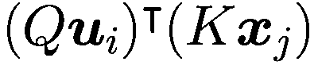。它被用作 V 变换后的长序列嵌入 *V***x***[*j*] 的权重，以生成新的短嵌入。感知器基本上是一个 BERT 模型，其序列长度为 *n* 而不是 *T*，这避免了计算工作量与输入长度成二次方关系。迭代方法使模型能够将其有限的容量投入到最相关的输入中。在实验中，感知器能够在图像分类方面击败领先的 ResNet-50 CNN [93]。*感知器 IO* [92] 通过另一个交叉注意力操作将感知器的结果 *n* 个输出嵌入投影到一个更大的输出嵌入序列中，例如，将输出元素的定位嵌入作为查询向量。*感知器 AR* [73] 将感知器扩展到生成与编码器-解码器转换器类似的输出序列。

一个图表示了通过潜在序列嵌入、交叉注意力和潜在转换器进行交互式操作的行动序列。它指示了嵌入层、逻辑分类器和类概率层。

图 3.10

如果输入序列太长，感知器定义了一个短的潜在序列。通过长序列和潜在序列之间的交叉注意力，信息被压缩。一个标准的转换器块计算潜在序列元素之间的自注意力，最终生成一个分类 [93] **S4** [68] 是一个基于卡尔曼滤波的有序状态空间序列模型，用于观察具有误差的状态模型 [101]。一个连续状态空间模型由以下公式定义！$$\displaystyle \begin{aligned} {\boldsymbol{x}}'(t) = \boldsymbol{A}{\boldsymbol{x}}(t) + \boldsymbol{B} \boldsymbol{u}(t) \qquad  {\boldsymbol{y}}(t) = \boldsymbol{C} {\boldsymbol{x}}_t + \boldsymbol{D}\boldsymbol{u}(t), \end{aligned} $$(3.1)

该模型将输入信号 ***u***(*t*) 通过一个潜在状态 ***x***(*t*) 映射到输出 ***y***(*t*)。作者重新参数化矩阵 ***A*** 并将它们分解为低秩和斜对称项之和。此外，他们在频率空间中计算了与之相关的无限序列的生成函数，该序列截断到某个长度 *L*。低秩项可以通过 Woodbury 标识符来校正。斜对称项可以对角化，并可以减少到柯西核 [153]。

**A** 矩阵使用一个特殊的上三角“HIPPO”矩阵初始化，允许状态 ***x***(*t*) 记忆输入 ***u***(*t*) 的历史。作者证明在复数空间  中，相应的状态空间模型可以用矩阵 ( **Λ** −***PQ***^∗, ***B***, ***C***) 表示，其中 **Λ** 是一个对角矩阵，而  是向量。这些是 S4 的 5*N* 个可训练参数，其中 *N* 是状态维度。总的来说，S4 定义了一个形状为 (batch size, sequence length, hidden dimension) 的序列到序列映射，这与相关的序列模型（如 Transformers、RNNs 和 CNNs）类似。对于序列长度 *L*，这需要 ^∼*O*(*N* + *L*) 的计算努力和 *O*(*N* + *L*) 的内存空间，这接近序列模型的最低值。Gu 等人 [69] 提供了 S4 模型的详细阐述和实现。

在经验评估中，对于长度为 1024 的输入，S4 比标准 Transformer 快 1.6 倍，并且只需要其 43% 的内存。对于长度为 4096 的输入，S4 快 5 倍，并且只需要标准 Transformer 9% 的内存。对于 *Long Range Arena benchmark* 的基准测试，S4 将 Sota 平均准确率从 59.4% 提高到 80.5%（见表 3.7）。此外，S4 能够解决涉及长度为 16k 的序列的极具挑战性的 Path-X 任务，而所有之前的模型都失败了。最后，S4 能够对长度为 16k 的序列进行原始语音信号分类，并实现了 98.3% 的新 Sota 准确率。S4 在长距离序列处理方面取得了真正的突破。此外，S4 在长距离 *时间序列预测* 方面表现更好，例如在预测 30 天的天气数据时，将均方误差降低了 37%。*DSS* [70] 是 S4 的一个变体，它更容易表述，并且实现了略低的表现。表 3.7

Long-Range Arena Benchmark 的准确率结果。最佳得分以粗体打印，改进标准 Transformer 的结果以下划线表示（参见图 [209]）。

| 模型 | 列操作 | 文本分类 | 检索 | 图像分类 | 寻路器 | Path-X | 平均 |
| --- | --- | --- | --- | --- | --- | --- | --- |
| Transformer | 36.3 | 64.3 | 57.5 | 42.4 | 71.4 | × | 54.4 |
| Reformer | 37.3 | 56.1 | 53.4 | 38.1 | 68.5 | × | 50.7 |
| Synthesizer | 37.0 | 61.9 | 54.7 | 41.6 | 69.5 | × | 52.9 |
| BigBird | 36.0 | 64.0 | 59.3 | 40.8 | 74.9 | × | 55.0 |
| Linear transf. | 16.1 | 65.9 | 53.1 | 42.3 | 75.3 | × | 50.6 |
| Performer | 18.0 | 65.4 | 53.8 | 42.8 | 77.0 | × | 51.4 |
| S4 | **58.4** | **76.0** | **87.1** | **87.3** | **86.1** | **88.1** | **80.5** |

### 3.2.3 长输入序列的 Transformer 比较

*Long Range Arena* [209]旨在评估从 1k 到 16k 标记的长输入序列任务上的性能。它包含六个不同的基准数据集，涵盖文本、图像、数学表达式和视觉空间推理。任务包括 ListOps（列表符号中的计算）、文本分类（使用字符序列对 IMDB 评论进行分类）、文档检索（基于文档嵌入）、图像分类（基于像素序列）和路径查找（检测圆圈）的两个版本。作者评估了九种能够处理长输入的 transformer 架构。

结果显示在表 3.7 中。对于层次结构化的 ListOps 数据，结果表明基于核的方法，例如 Performer 和 Linear Transformer，是不合适的。对于文本分类，基于核的方法表现特别出色。对于图像分类，大多数模型表现良好，除了 Reformer。路径查找任务由所有模型以可接受的性能解决，其中 Performer 表现最佳。然而，除了 S4 之外的所有模型在扩展的路径查找任务上失败，并且无法找到解决方案。在所有基准测试中，S4 是最佳模型，差距很大。

在速度方面，Performer 表现最佳，在长度为 4k 的序列上比标准 Transformer 快 5.7 倍。内存消耗从标准 Transformer 的 9.5GB 到 Linear Transformer 的大约 1.1GB 不等。除了 Synthesizer 之外的所有模型都小于 3GB，其中 S4 在这两方面都表现良好。

### 3.2.4 总结

对于 PLMs 高效处理长输入序列，有许多不同的建议。通常采用稀疏注意力矩阵，其中只使用可能注意力的一部分来建立远距离位置之间的连接。通常，对于近距离位置计算全注意力。一些标记具有全局注意力，用于在未直接连接的位置之间传递信息。一个突出的例子是 BigBird，它添加了随机注意力。其计算工作量仅与输入大小呈线性增长，并且仍然可以执行任意序列计算。还有其他架构，如 Performer 和 Linear Transformer，它们也表现出线性增长。

一些架构通过低秩分解来近似注意力矩阵，或者聚合表达类似内容的标记（Reformer，Combiner）。另一种方法是使用递归机制，从而减少远离标记的计算（Transformer-XL，线性 Transformer，Transformer-LS，Perceiver）。另一种选择是分解自注意力矩阵（Performer）或用更简单的计算来替换它（Synthesizer）。最近，提出了 S4 模型，该模型将状态空间模型应用于长距离预测。它使用基于复数计算的架构，这与通常的 Transformer 设置完全不同。它在计算时间和内存效率方面都优于所有先前模型。

这些方法的性能使用 Long Range Arena 的六个不同基准进行了评估。结果表明，S4 在所有基准上击败了其他模型。所有方法都能与标准 Transformer 相比减少内存消耗。更长的输入长度允许新的应用，例如在原始语音处理、图像处理或基因组学[247]。

## 3.3 多语言预训练语言模型

世界上有超过 7100 种语言[9]，每种语言几乎都能表达几乎所有的事实和概念。因此，预训练语言模型（PLM）也应该能够为不同语言中的概念生成一致的表示。在简单的陈述句中，不同语言在动词、主语和宾语的基本语序上存在一定程度的不同。例如，英语、德语、法语和普通话是主谓宾（SVO）语言[100]。在这里，动词通常位于主语和宾语之间。另一方面，印地语和日语是主宾谓（SOV）语言，这意味着动词位于主句的末尾。另一方面，爱尔兰语和阿拉伯语是谓语主语宾语（VSO）语言。具有相同基本语序的两种语言通常还有其他相似之处。例如，VO 语言通常有介词，而 OV 语言通常有后置词。此外，一种语言可能存在词汇空缺，即没有单词或短语可以表达另一种语言中某个单词的确切含义。例如，德语中的单词*“Schadenfreude”*大致可以翻译为*“因他人不幸而感到高兴”*。Jurafsky 和 Martin 讨论了更多这样的差异[100]。

为了获得跨语言的语言理解，PLM 必须用多种语言进行训练，并捕捉它们的结构差异。在训练过程中，PLMs 可以在不同语言的概念之间建立对齐。

+   在具有联合标记词汇的多语言数据上训练大型 PLM 模型，例如 T5 或 BERT，会导致模型通过利用它们的共同结构在语言之间传递信息。

+   类似于 BERT 的模型可以通过掩码语言建模来训练，以将一种语言的句子中的单词与另一种语言的翻译单词关联起来。然而，已经证明，即使在很少或没有平行训练数据的情况下，也可以进行多语言处理。

+   Transformer 编码器-解码器模型被明确训练以将一种语言的文本翻译成另一种语言。

并行训练多种语言的语言模型可以提高性能——特别是对于训练数据较少的语言。这已经在静态词嵌入 [194] 中得到了证明。

### 3.3.1 自动编码器模型

**mBERT** (多语言 BERT) [48] 是一个标准的 BERT 模型。它已经在 104 种语言的非平行维基百科文本上使用 MLM 损失进行预训练，并为所有语言共享了 110k 个 WordPiece 标记的词汇表。这意味着中文实际上是字符标记化的。每个训练样本都是一种语言的文档，没有跨语言词典或训练标准。为了展示其特性，该模型被微调到自然语言推理（NLI）基准的多语言版本 *XNLI* [40]，即预测第一个句子是否蕴涵第二个句子的任务。结果发现，mBERT 可以在 NLI 上使用单一语言进行微调，并在相关语言上仍然获得良好的测试结果 [40, 232]。

6 种语言的测试结果 [111] 如表 3.8 所示。与使用所有语言的 XNLI 进行微调相比，如果使用英语进行 XNLI 微调并在其他语言中进行评估，则相关语言（例如西班牙语和德语）的准确率仅略有下降。对于其他语言，性能的下降更大，但结果仍然不错。甚至在不同文字的语言之间也有信息传递，例如阿拉伯语和乌尔都语。作者还考虑了单词及其翻译的嵌入。结果显示，单词与其翻译之间的余弦相似度为 0.55，尽管语言之间没有对齐。表 3.8

6 种语言的跨语言自然语言推理（XNLI）[40] 测试准确率。与所有语言的 XNLI 微调相比，仅用英语进行 XNLI 微调的结果。

| 微调方式 | 模型 | 英语 | 中文 | 西班牙语 | 德语 | 阿拉伯语 | 乌尔都语 |
| --- | --- | --- | --- | --- | --- | --- | --- |
| 所有语言 | mBERT | 81.9 | 76.6 | 77.8 | 75.9 | 70.7 | 61.6 |
| 仅英语 | mBERT | 81.4 | 63.8 | 74.3 | 70.5 | 62.1 | 58.3 |
| 所有语言 | XLM | 85.0 | 78.6 | 80.8 | 80.3 | 76.5 | 63.2 |
| 仅英语 | XLM | 85.0 | 76.5 | 78.9 | 77.8 | 73.1 | 57.3 |

Karthikeyan 等人[104]研究了 mBERT 成功的关键因素。他们发现，即使标记词汇完全没有重叠，mBERT 也具有跨语言能力。此外，两个词汇库中相同标记的数量对性能提升的贡献很小。作者通过比较不同的语言对，表明大型网络深度和双语 BERT 的总参数数量对于单语和跨语言性能都至关重要，而注意力头数不是一个显著因素。另一方面，源语言和目标语言的相似性，即词序和词频，对跨语言性能有重大影响。

**XLM** [111]通过在预训练期间使用来自不同语言对的翻译句子来提高不同语言之间知识转移的能力。作者将一个句子及其翻译到另一种语言的句子连接起来进行训练，并引入一个新的*翻译语言模型* (*TLM*) 目标，以改善跨语言预训练。为了预测输入句子中的掩码词，算法可以关注翻译句子中的单词。这样，模型学会关联不同语言中的单词。一个例子如图 3.11 所示。如表 3.8 所示，XLM 在 XNLI 上的跨语言准确率比 mBERT 高得多。从在英语上微调的模型转移到其他语言只会造成很小的损失。实验表明，TLM 能够将 XNLI 的准确率平均提高 3.6%。该模型还用于从德语和其他语言到英语的无监督机器翻译评估，取得了非常好的性能（参见第 6.3 节）。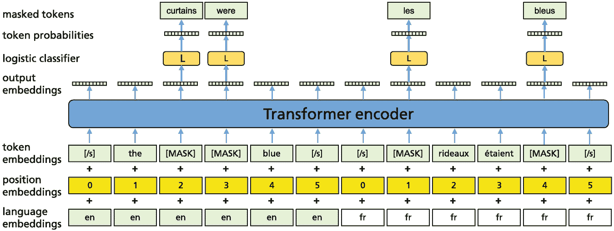

模型图表示了翻译语言模型的方法。它表明语言层、位置和标记嵌入经过 Transformer 编码器，随后是输出嵌入、逻辑分类器、标记概率和掩码标记。

图 3.11

翻译语言模型（TLM）任务应用于翻译句子的对。为了预测一个掩码的英语单词，模型可以关注英语句子及其法语翻译，因此鼓励英语和法语表示的对齐[111]

**Unicoder** [88] 是一个改进的 XLM 模型，具有三个额外的训练任务。跨语言词对齐学习将翻译句子中的对应词语关联起来。跨语言释义检测将两种不同语言的句子作为输入，并分类它们是否具有相同的意义。文档级跨语言掩码语言模型将 MLM 任务应用于部分句子被其翻译替换的文档。在 XNLI 上，作者报告了平均准确率提高了 1.8%。

**XLM-R** 是 XLM 的优化版本 [41]。它基于 RoBERTa，在包含 100 种语言、25k 个共同词汇的 2.5TB 多语言 CommonCrawl 数据集上进行训练。它将 XNLI 上的 Sota 提高到了 79.2%。对于跨语言问答，模型在英语 SQuAD 数据集上进行微调，并在 7 种其他语言上进行评估。XLM-R 在这个 SQuAD 版本上的 F1 分数提高了 9.1%–70.7%。在低资源语言上，XLM-R 在跨语言分类上的准确率比 mBERT 高出高达 23%。XLM-R 的性能几乎与强大的单语模型相当。

这些结果支持了观察结果，即通过在大规模文本上进行训练，PLM 的性能可以得到提升 [102]。更多语言在模型容量足够大的条件下，可以带来在低资源语言上的更好的跨语言性能。结合 Aghajanyan 等人的方法 [2]，该方法在微调过程中避免表示发生过大变化（见第 3.6 节），XLM-R[LARGE] 模型将 XNLI 上的 Sota 提高到了 81.4%。如果向 XLM-R 添加一个额外的标准，即从不同语言中分离出语义等效句子与其他句子，那么在语义任务上的准确率会提高 [228]。更大的模型如 *XLM-R*[XXL] [66]，拥有 10.7B 个参数，在包含 167B 个非平行文本的 CC-100 数据集上进行了预训练，该数据集也涵盖了低资源语言，并将 XNLI 性能提高了 2.4%。

**RemBERT** [37] 重新分配了多语言模型的参数。首先，作者展示了使用最先进的预训练语言模型中的不同输入和输出嵌入可以提高模型性能。然后，他们证明了将更多参数分配给输出嵌入可以提高模型准确率，这一提高在微调过程中得到保持。因此，Transformer 表示更加通用，并且更易于迁移到其他任务和语言。*Xtreme* 集合 [86] 是一个多任务基准，用于评估 40 种语言和 9 个任务上多语言表示的跨语言泛化能力。尽管 RemBERT 只在较小的训练数据子集和额外 10 种语言上进行了训练，但它还是在 Xtreme 上优于 XLM-R。

类似于 BERT 的 PLM 生成上下文标记嵌入。然而，用户通常需要上下文**段落**或句子的嵌入来比较其内容。**LaBSE** [57] 是一个无语言限制的段落嵌入生成器，其中源句和目标句分别使用共享的基于 BERT 的编码器进行编码。最终层的 *CLS* 表示被用作每个输入的 *句子嵌入*。LaBSE 结合了掩码语言模型 (MLM) 和翻译语言模型 (TLM) 损失以及一个边缘标准。该标准计算段落嵌入 ***x*** 和其正确翻译的嵌入 ***y*** 之间的余弦距离 。然后要求 *cos*(***x***, ***y***)− *m* 大于 ，其中 *m* 是一个正的边缘，而 ***y***[*i*] 是任意其他段落的嵌入。LaBSE 使用 17B 单语句子和 6B 双语翻译句子进行训练。生成的句子嵌入显著提高了跨语言信息检索中句子的检索准确率 Sota（参看第 6.1 节）。代码和预训练模型是可用的。

### 3.3.2 Seq2seq Transformer 模型

**mT5** 是 T5 Seq2seq Transformer（第 3.1.3 节）的多语言版本，参数量高达 13B [236]。它使用覆盖 101 种语言的网页训练数据集进行预训练，包含约 48B 个标记和一个 25k 个标记的通用词汇表。对于预训练，模型必须以与 T5 相同的方式预测单语文档中的掩码短语。与 T5 类似，模型可以通过前缀来执行不同的任务，例如“总结”。这些任务通过在相应的数据集上进行微调进行训练。

对于 *XNLI 基准测试* [40]，模型需要判断第一句话是否蕴含第二句话。当模型在 XNLI 上使用英语数据进行微调，并对 15 种语言进行性能测量时，准确率为 84.8%，相比之下，mBERT 的准确率为 65.4%，XLM 的准确率为 69.1%，XLM-R 的准确率为 79.2%。尽管不同语言中的文本不是平行的，但模型能够利用语言之间的结构相似性来解决这个任务。该模型的代码可在 [235] 处找到。类似的模型用于多语言翻译（第 6.3 节）。**mT6** [31] 通过翻译句子对增强 mT5 的训练，并定义了新的训练任务。实验结果表明，与 mT5 相比，mT6 在跨语言能力方面有所提升。进一步的改进是 **Switch** [56]，它采用了 mT5 的 *专家混合* (*MoE*) 架构，只需 mT5 五分之一的训练时间，同时在所有 101 种语言上实现了性能提升（第 3.5.2 节）。

**mBART** [126] 是基于 BART 模型的多语言编码器-解码器（第 3.1.3 节）。输入文本通过掩码短语和句子排列进行损坏，并使用单个 Transformer 模型进行预训练以恢复损坏的文本。这适用于涵盖 25 种语言的训练文档。随后，预训练模型通过单一语言对的翻译任务进行微调。此外，还可以使用 *回译*，其中另一个模型被训练将目标句子翻译回源语言，并引入额外的损失来鼓励重建源句子。mBART 在编码器输入的末尾和解码器输入的开头添加了一个语言符号。这使得模型能够知道要编码和生成的语言。结果表明，预训练提高了翻译质量，特别是对于平行训练数据较少的语言。此外，回译显著改善了翻译结果。进行了许多实验来分析不同算法特征的影响。如果翻译的是完整的文档而不是单个句子，预训练尤为重要。

mBART 也可以用于 *无监督机器翻译*，在这种情况下，不使用任何类型的平行文本。在这里，作者使用预训练的权重初始化模型，然后学习从由回译生成的源句子中预测单语句子。对于结构相似的语言，结果非常好，例如，对于 En-De，mBART 实现了 29.8 的 Bleu 值，接近监督学习的 30.9。请注意，mBART 与 MASS 的性能相似（第 3.1.3 节）。对于结构不相似的语言对，例如英语-尼泊尔语，mBART 在其他方法失败的情况下仍能获得合理的结果。

**MARGE** [118] 是一个多语言 Seq2seq 模型，它被训练通过检索其他语言中的文档 *z*[1]，…，*z*[*k*] 来重建一种语言中的文档 *x*。它使用来自维基百科和 CC-News 的 26 种语言的文本进行训练。文档通过 Transformer 的第一个标记的输出嵌入进行编码 [212]。检索模型通过嵌入每个文档并计算它们的余弦相似度来评分目标文档 *x* 对每个证据文档 *z*[*j*] 的相关性 *f*(*x*, *z*[*j*])。一个 Transformer 接收来自检索的嵌入文本 *z*[1]，…，*z*[*k*] 和辅助相关性评分 *f*(*x*, *z*[*j*]) 作为输入，并训练生成目标文档 *x* 作为输出。相似度评分用于加权解码器到编码器的交叉注意力，这样解码器将更多地关注更相关的证据文档。模型在仅给定随机初始化的情况下共同学习检索和重建。在零样本设置中，该模型在 WMT2019 De-En 基准测试中实现了高达 35.8 的 Bleu 分数进行文档翻译，以及抽象摘要、问答和释义。微调在许多语言的多种任务上提供了额外的强大性能，表明 MARGE 是一种通用的预训练方法。

**XLNG** [32] 同时使用 MLM 和翻译 TLM 损失（表 3.1）对相同的 Seq2seq 模型进行预训练。预训练目标在公共空间中为不同语言生成嵌入，从而实现零样本跨语言迁移。在微调阶段，使用单语数据训练预训练模型进行自然语言生成任务。这样，在单一语言中训练的模型可以直接解决其他语言中的相应任务。该模型在零样本跨语言问答生成和抽象摘要方面优于基于机器翻译的方法。此外，通过利用资源丰富的语言的数据，这种方法提高了训练数据较少的语言的性能。

### 3.3.3 自回归语言模型

类似于 GPT-3 这样的生成模型是在包含不同语言文本的大量文档集合上训练的。通过这些训练数据，模型也获得了关于这些语言的知识，并生成意义的联合上下文表示。如第 3.6.3 节所述，如果提供适当的提示和一些示例（少样本学习），它能够进行语言之间的翻译。例如，在 WMT2016 En→De 上，GPT-3 实现了 29.7 的少样本 Bleu，而监督 Sota 为 41.2，而在 De→En 方向上，GPT-3 以 40.6 的 Bleu 超过了当前 Sota 的 40.2 Bleu [25]。

Winata 等人 [231] 使用 1.6B、6B 和 3B 参数分别评估了 GPT-2、GPT[NEO] 和 T5 的多语言能力。这些模型能够利用英语的上下文来预测非英语语言的答案。作者发现，最大的模型 GPT[NEO] 在一组多语言基准测试中总是表现最佳。性能取决于语言对。例如，模型在 En→Es 上的性能高于其他两种目标语言（德语和法语）。对于 *MultiNLU 基准测试* [187]，在目标语言上完全训练的 Sota 模型的错误率为 12.1%，与 GPT[NEO] 少样本提示的 17.3% 错误率相差不大。

### 3.3.4 摘要

机器翻译是 NLP 最广泛使用的应用之一。语言既有结构上的差异，也有词汇上的差异，这使得翻译变得困难。处理多种语言的联合必须考虑这些差异。

当 BERT 使用来自多种语言的文档进行训练时，它能够在语言之间进行知识迁移，例如解决语言推理任务，即使它没有访问平行文本。通过使用翻译语言建模损失，XLM 中的知识迁移得到了改善，这样翻译句子就被用来重建掩码标记。有几种 XLM 的改进版本能够提高跨语言推理的准确性。

编码器-解码器模型，如 T5，可以推广到多种语言并诱导强大的多语言嵌入。mT5 可以通过前缀来控制，并解决各种任务，如翻译、摘要和语言推理。mT6 和 Switch 是 mT5 的更有效变体。mBART 通过恢复不同语言的损坏文本进行预训练。它甚至可以用于无监督机器翻译。XNLG 在多语言空间中生成联合嵌入，而 MARGE 利用背景文档的检索来重建目标文档。这两个模型都能够执行多种任务，如抽象摘要、问答和释义。然而，需要注意的是，用于翻译单一语言对的专用模型（第 6.3.1 节）。

自回归语言模型，如 GPT-3，是在庞大的语料库上训练的，这些语料库也包含多语言文档。因此，这些模型也可以通过少样本学习来执行多语言任务，如翻译或问答。然而，性能通常不如专门微调的模型好。

## 3.4 预训练语言模型的额外知识

在无监督预训练期间，PLM（如 BERT 和 GPT2）被迫从上下文中预测缺失的单词。它们被优化来预测序列中的下一个单词或一些被掩盖的单词（例如 *“爱因斯坦出生在乌尔姆市。”*）。在完成这项任务后，它们显然从训练数据中收集了关于现实世界事实和关系的知识。PLM 在基于无监督训练重现事实和关系方面表现出惊人的效果。在第 4.2 节中，我们讨论了标准 PLM 覆盖的知识。然而，由于参数数量仍然有限，PLM 只能记住训练数据中包含的知识的一小部分。此外，训练之后发生的事件被遗漏了。

本节介绍了在 PLM 中扩展事实知识的方法，无论是在训练期间还是在实际模型使用时的实时扩展。图 3.12 展示了这些方法。*知识库* (*KB*) 描述了关于世界的知识，例如通过实体及其关系。我们概述了将 KB 或其他知识源（如文本集合）中的信息纳入 PLM 的几种不同方法（表 3.9）：

知识库嵌入：

有技术可以表示 KB 中的实体和关系通过嵌入。许多方法试图将这些嵌入与 PLM 创建的标记嵌入相结合。通过这种方式，KB 中的信息可以注入 PLM 并用于下游任务。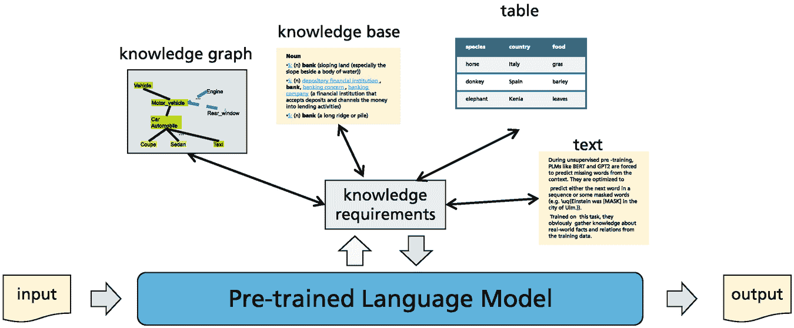

一幅插图展示了通过预训练语言模型与知识图谱、知识库、表格和文本的知识需求进行交互的输入和输出。

图 3.12

PLM 接收输入文本并从不同来源收集额外的知识。这些知识可以事先添加，也可以按需检索。随后，使用额外的知识生成输出

表 3.9

集成额外知识（参见图 [166, p. 10]）。基准：GLUE 自然语言理解第 4.1.1，TACRED 关系抽取第 5.4.2，TriviaQA 问答第 6.2.1，[99]，英语所有词 WSD [14]，Nat. Quest 问答 [109] 第 6.1.2

| 模型 | 训练任务 | 微调 | 额外 | 基准 |
| --- | --- | --- | --- | --- |
| *在预训练语言模型中使用知识库嵌入* |
| ERNIE(THU) [255] | MLM+NSP + masked NEs | GLUE, etc. | KB NE embeddings combined with token embeddings | GLUE 79.6 |
| KnowBERT [157] | MLM+NSP +EL | GLUE, etc | Translate token embeddings ↔ KB NE embeddings |   |
| KEPLER [224] | MLM+KE | GLUE, 等 | 将标记嵌入与 NE 嵌入结合；使用 TransE 损失 | TACRED 71.5 F1 |
| *使用来自知识库的文本信息* |
| K-Adapter [222] | MLM + rel. extr. | – | 向 RoBERTa 添加并行适配器网络 | TACRED 72.0 F1 |
| WKLM [234] | MLM+ERD | – | 在文本中检测替换的 NE | TriviaQA 63.1 F1 |
| CoLAKE [202] | MLM | – | 从文本关系三元组和标记创建图 | GLUE 86.3 |
| LUKE [234] | MLM+ERD | – | 对文本和包含的实体进行掩码语言建模 | TACRED 72.7% F1 |
| EWISER [14] | MLM | 词义分类 | 包含 wordnet 超感图 | 英语所有词的 WSD 80.1% F1 |
| *使用从文本集合检索到的文本段落* |
| FiD [91] | MLM, S2S | QA | 使用 BERT 对查询和 KB 进行编码；结合查询和检索到的文档与 Seq2seq | Nat. Quest. 51.4% 准确率 |
| Retro [21] | LM |   | 带有周期性检索的语言生成 | Nat. Quest. 45.5% 准确率 |

表格的文本编码：

通常在表格中还有额外的知识可用。这些表格中的条目可以用一种特殊的文本格式编码。PLM 可以用这种文本进行训练，以获取行和列中的知识，类似于学习两种语言单词之间关系的方式。

知识库关系的文本编码：

使用知识库（KB）信息的另一种方法是从文本中识别实体或概念。这些实体和概念可用的关系可以从 KB 中提取，并可以以文本或其他适当的形式包含在训练过程中。

添加检索到的事实：

当一个预训练语言模型（PLM）需要回答问题或创建文本时，它可以就主题提出查询，并从 KB 或互联网中检索相应的文本内容。这些文本信息可能被一个转换器拾取并增强输出。这样，模型可以即时使用全面和最新的信息。

提高逻辑一致性：

PLM 有时不会生成逻辑上一致的内容。通过额外的微调任务，模型可以被训练以尊重逻辑一致性。

Dash 等人 [45] 和 Yu 等人 [243] 提供了将领域知识融入深度神经网络的方法调查。

### 3.4.1 利用知识库嵌入

通常，*知识库*是图结构，其中节点对应实体，边代表连接实体的*关系*。近年来，许多大规模的知识库，如*WordNet* [137]，*YAGO* [200]，*Freebase* [18]，*DBpedia* [15]和*DiffBot* [77]，都发布了包含数百万实体的知识库。图 3.13 显示了 WordNet 层次结构的一个小子集。在大多数情况下，一个知识库可以用三元组(*h*, *r*, *t*)来描述，其中*h*和*t*是集合*E*中的实体，而*r*是存在于这些实体之间的关系。为了评估知识库的语义内容，提出了将其实体及其关系编码为低维空间中的嵌入的方法，从而可以确定实体和关系的相似性[43]。随后，这些嵌入可以用来消歧实体（实体链接，见第 5.3.3 节），或预测新的关系（见第 5.4 节）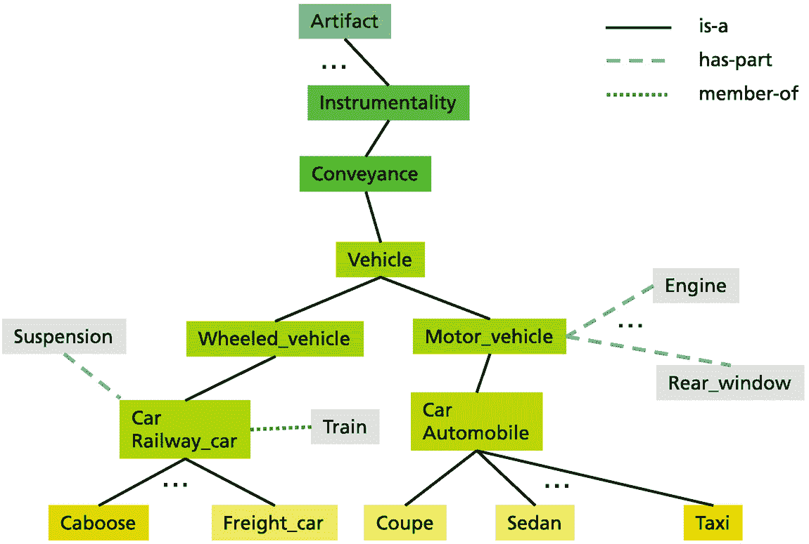。

一个模型图解释了工具性、传达性和交通工具几乎具有相同的意义。它表明，机动车辆有发动机和其他部件，而火车和汽车是交通工具的成员。

图 3.13

描述英语词语之间关系的 WordNet 知识库的一部分。它包含具有大约相同意义的词语的 synsets，这些词语通过上位词（is-a）、组成词（has-part）和成员关系（member-of）相关联[137]。

对于 Word2Vec 生成的词语嵌入(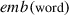e m b left parenthesis word right parenthesis)来说，实体之间的关系通常在词语嵌入的空间中表示为实体嵌入之间的向量差异（见第 1.5 节）。一个例子是国家与其首都之间的关系，其中我们大约有e m b left parenthesis Germany right parenthesis minus e m b left parenthesis Berlin right parenthesis 几乎等于 e m b left parenthesis France right parenthesis minus e m b left parenthesis Paris right parenthesis)。

**TransE**模型 20 基于这种模式构建。TransE 通过调整嵌入，使得每当(*h*, *r*, *t*)成立，且*emb*(*h*)和*emb*(*t*)是*h*和*t*的嵌入时，方程*emb*(*h*) + *emb*(*r*) ≈ *emb*(*t*)对于某些向量*emb*(*r*)应该近似成立，该向量被认为是关系*r*的嵌入。因此，对于正确三元组集合*S*中的所有三元组(*h*, *r*, *t*)，*TransE 损失*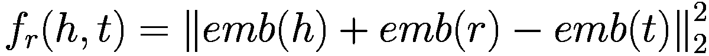应该变为 0。TransE 模型使用 hinge 损失来近似这个目标，它以这种方式修改嵌入，使得对于正确的关系三元组*f**r*的值低于对于随机选择的错误三元组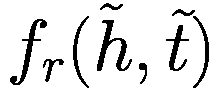的值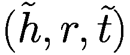。模型和嵌入使用 WordNet 和 Freebase 中的关系进行训练。

有许多更复杂的模型用于从知识库中编码关系，如调查 43、94 中所述。*TransH*克服了 TransE 无法建模复杂关系的缺点，而*TransD*则通过提出两个不同的映射矩阵来减少头和尾的参数。但是，这些替代方案很少用于上下文嵌入。知识库表示的另一种方法是张量分解 144、145。然而，这种方法不基于词嵌入，因此主要用于知识库补全，而不是增强 PLMs。

在本节剩余部分，我们描述了将通常由 TransE 计算的知识库嵌入和由语言模型生成的标记嵌入合并的方法。一个困难是建立标记嵌入与通常包含多个标记的实体之间的关系。

**KEPLER** [224] 由一个类似 BERT 的语言模型组成，通过 MLM 目标生成标记嵌入。此外，它使用输入文本开头的特殊标记 “<*S*>” 计算来自 KB 中描述性文本的实体嵌入。这个标记被训练以产生关系命名实体参数的嵌入，例如，对于图 3.14 中的输入 “<*S*> *Johannes Kepler*”。这样，关系的参数 *h* 和 *t* 被嵌入。关系 *r* 的嵌入要么是一个需要训练的参数，要么可能由表达关系的文本确定。这些嵌入被输入到 TransE 损失函数中，并作为额外的训练标准，除了 MLM 之外（图 3.14）。在许多语言理解任务中，这种方法能够取得良好的结果。在关系抽取基准 *TACRED* [254] 上，该方法达到了 71.5% 的 F1 值。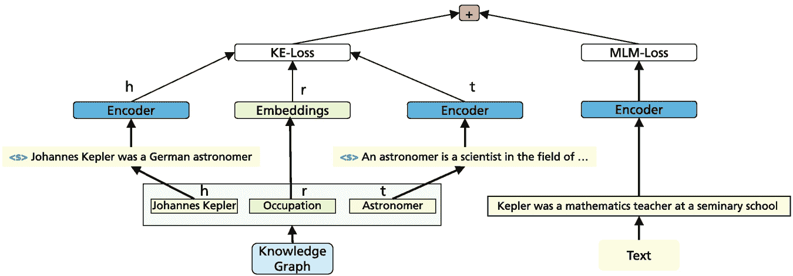

模型图表示通过编码器和 M L M 损失函数的输入文本。它还指示了知识图谱通过编码器和嵌入以及 K E 损失函数的流动。

图 3.14

KEPLER [224] 通过 MLM 损失函数训练一个传统的类似 BERT 的模型。对于一个包含文本条目的知识库，它使用特殊的 <*S*> 标记生成实体嵌入，并通过 TransE 损失函数编码关系。这两个损失函数都在训练期间添加。

**KnowBERT** [157] 显式地建模输入文本中的实体跨度，并使用实体链接器从 KB 中检索预计算的实体嵌入以形成知识增强的实体跨度表示。KB-嵌入使用类似于 TransE 的损失函数预先计算。投影映射被用来将 LM-嵌入转换为 KB-嵌入，反之亦然。来自最佳匹配 KB-嵌入的信息被平均并重新转换以增强 LM-嵌入。这些计算形成 BERT 的额外层。Wikipedia 和 WordNet 被用作 KB。为了测试 KnowBERT 从 KB 中检索事实的能力，一个关系被制定，并且关系的一个参数被掩码。KnowBERT 达到 *平均倒数排名* (*MRR*) 为 0.31，这表明平均而言，正确的实体出现在第 3 位，而 BERT 则在第 9 位出现。因此，该模型生成的答案比 BERT 更好，但只能大致复制 KB 的关系。然而，它通常会导致下游任务的改进。

**ERNIE-THU** [255] 以类似的方式将 KB 中的命名实体与文档中的命名实体相关联，并转换这两个空间之间的嵌入。*E-BERT* [162] 在精神上与 KnowBert 相似，但它不需要对 BERT 编码器进行昂贵的进一步预训练。*Facts as Experts* [213] 也使用嵌入将事实信息和实体链接起来，并以此方式将新信息注入到模型中。

总结来说，本节中提出的方法直接将关系嵌入表示的特定领域知识注入到 PLM 的标记嵌入中。然而，存在一些缺点。KB 实体嵌入与某些知识嵌入模型（例如，TransE [20]）分别进行预训练，并在 PLM 的训练过程中保持固定。因此，KB 嵌入和标记嵌入不是同时学习的。此外，KB 实体嵌入往往不能完全捕捉 KB 中实体的丰富上下文和关系信息。此外，它们是静态的，不依赖于上下文。此外，它们在很大程度上依赖于链接算法的性能和图嵌入的可靠性。这意味着在一般情况下，其他方法表现更好，例如关系抽取（第 5.4 节）。

### 3.4.2 图学习中的预训练语言模型

物体和概念之间的关系可以在图中连接起来，并为许多项目的相关性提供一个统一的表现形式。利用图的架构，可以预测节点的许多属性。近年来，人们付出了巨大的努力来设计能够捕捉图组成并预测其部分（例如 *node2vec* [67] 或 *图卷积网络* [107]）的模型。然而，由这种深度模型获得的节点表示往往过于平滑，并且也变得非常模糊。PLMs 通过长距离的自注意力机制有可能通过自我改进表示。Xia 等人 [233] 提供了关于图 PLMs 的综述。节点和边通过不同的特征和位置嵌入来表征，并使用不同类型的 PLMs 进行处理。突出的应用包括利用用户-产品图的 *推荐系统* 和评估分子结构的 *药物发现*。

**Graph-BERT** [250] 是在从大型图中选取的样本节点及其上下文中训练的。这些样本是根据 PageRank 算法 [24] 的接近度抽取的，并且不包含直接链接信息。节点通过特征嵌入、基于 PageRank 信息的嵌入和基于跳数的距离嵌入来表征。这些嵌入被汇总并形成 BERT 模型的输入。该模型经过预训练以重建掩码节点的信息，并通过评估它们的余弦相似度来预测两个节点之间的关系。该模型经过微调以进行节点分类和图聚类。Graph-BERT 在三个图基准测试中实现了节点分类的第二高准确率 [128，第 16 页]。

**GPT-GNN** [87] 提出了一种自回归 PLM，用于对给定的图进行迭代重建。该方法假设边和节点有一个随机顺序。给定特定位置的边和节点，它预测下一个节点/边的属性。GPT-GNN 一次生成一个带掩码的节点及其边，并通过最大化当前迭代中生成的节点和边的似然性来优化参数化模型。然后，它迭代地生成节点和边，直到所有带掩码的节点都被生成。该模型在包含其特征、会议和作者的 178M 篇科学论文的图上以及包含 8300 万条亚马逊评论、用户和产品的图上进行训练。在这两个基准测试中，该模型都取得了最佳的准确率。

**MPG** [120] 由一个编码节点和边特征的 BERT 模型组成。作为一个预训练任务，该模型必须学习两个分成两半的图实际上是否属于一起，或者这两半是否是一对随机配对。该模型应用于分子的建模，并在 14 个基准测试中取得了 Sota 结果，特别是在药物发现方面。

**GraphFormers** [238] 一起对图结构和单词序列进行建模。图中的每个节点包含一段文本。中心节点及其邻居被标记为标记序列。该模型具有特殊的转换层，用于计算文本标记的嵌入以及通过聚合相应的文本嵌入来推导节点嵌入。该模型通过预测两个节点是否链接的任务进行预训练。GraphFormers 在三个基准任务上进行了测试，例如，一个由标题和引用图表征的科学论文图。该模型在链接预测方面始终优于所有先前的方法。

### 3.4.3 表格的文本编码

表格数据可能占所有商业和行政数据的绝大多数。例如，零售交易、官方统计数据、工业应用的数据处理等。de Alwis 等人提供了一份关于网络表格解释的调查[46]。先前的工作通常依赖于手动选择的特征，无法处理网络表格中的灵活模式，并且在不同任务之间泛化效果不佳。

**TURL** [47] 通过表格标题 *C*（一段简短文本，可能由章节标题增强）、描述表格方案 *H* = { *h*[1], …, *h*[m*]} 的列标题 *h*[*i*]（标记序列）和单元格值来表征关系表，其中每个单元格可能代表一个实体，例如一个人。同一行的单元格共享某种关系，而同一列的单元格共享另一种关系。这需要一个通过可见性矩阵实现的具有结构感知的注意力机制，该机制将注意力限制在特定的列和行上。

TURL 根据掩码语言模型损失在一个包含表格标题和标题的大规模非结构化数据集上进行预训练。随后，可以学习同一行或列中实体的关系。表格中的实体被掩码，模型的任务是根据表格上下文和可见性矩阵预测它们。通过这个目标，TURL 可以从表格中学习事实关系并将它们编码到实体嵌入中（图 3.15）。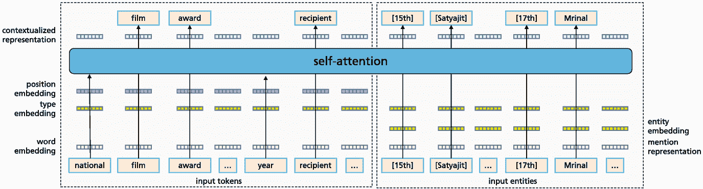

模型图表示输入标记和输入实体通过自注意力进行传递。它指示了词嵌入层、类型嵌入层、位置嵌入层、上下文表示实体嵌入层和提及表示层。

图 3.15

使用 TURL 学习表格关系[47]。在左侧训练表格标题和列标题。在右侧处理行标记以及输入实体（特定行中的单元格）。

该模型在从维基百科提取的 570k 张表中进行训练。所有包含至少一个链接单元格的列都被标记为实体列。经过微调后，模型能够以 54.8%的精确度预测测试集中表格单元格的掩码内容，击败了竞争方法。消融研究表明，可见性注意力矩阵对于实现高性能至关重要。

**TaBERT** [241]旨在包含自然语言文本和结构化表格数据。TaBERT 在 26.6M 张表及其周围文本（来自英文维基百科和 WDC WebTable 语料库[115]）上进行训练。每个表格单元格都描述为（列标题，列值类型，值）。随后，表格行被编码为文本，如图 3.16 所示。为了预训练，随机选择表格 20%的列，模型必须预测掩码的列名和类型。此外，单元格值根据特殊方案重建。模型在*WikiTableQuestions 基准测试* [155]上进行微调，该基准测试包含需要在对给定表格的一系列条目进行组合、多跳推理的问题。为了减少工作量，只有包含查询标记的表格行被编码。TaBERT 能够将此基准测试的 Sota 准确率提高到 51.8%。作者表明，他们的表格单元格编码比替代方案更有效。**RPT** [205]为表格编码提出了类似的方案。**BRIDGE** [124]是一个用于*语义解析*的系统，它将文本和表格中的信息转换为 SQL 查询，以从数据库中提取信息。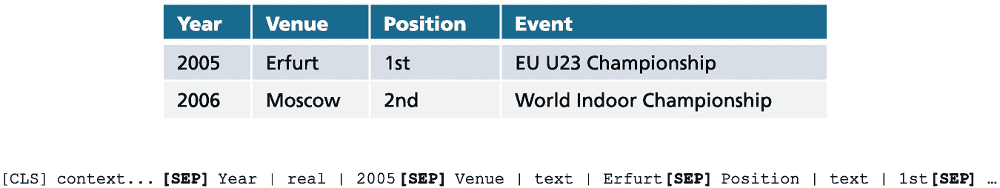

一个 2 行 3 列的表格表示了 2005 年和 2006 年的地点、职位和事件列表。底部指示了每个列中存在的数据类型。

图 3.16

TaBERT [241] 将表格的行编码为特殊格式的文本。这里的“上下文”包含相应的文本。每个表格单元格表示为（列标题，列值类型，值）。在这里，第一行表格是通过以[CLS]开头的行进行编码的。

**Tapas** [81] 是一种针对表格处理优化的 BERT 变体。表格按行展开，分词并添加位置嵌入。随后添加的嵌入包括：行 ID 嵌入、列 ID 嵌入以及表示排序序列中排名的排名嵌入，例如对于数字。该模型在来自英语维基百科的 6.2M 个表格-文本对上进行预训练，任务是在表格和文本中恢复被掩码替换的单词。该模型可以以相对较高的准确性（测试集上的 71.4%准确率）完成此任务。

在微调过程中，模型学习从表格中回答问题，例如，对于一个包含摔跤结果的表格，回答“哪位摔跤手拥有最多的统治次数？”。[CLS]和一个查询被添加到展开的表格之前，并且这两部分通过额外的段嵌入来区分。模型有两种输出类型：（1）每个表格单元格的分数，表示该单元格成为答案一部分的概率；（2）*[CLS]*产生最终答案的结果类型的概率（无、计数、总和、平均值）。这些结果一起表明应该对哪些表格单元格执行哪些操作以生成最终答案。在多个基准测试中，Tapas 达到了 Sota 结果，例如，将*SQA*基准测试的准确率从 55.1%提高到 67.2%。源代码和预训练模型可在[Hugging Face](https://huggingface.co/transformers/model_doc/tapas.html)获取。

结果表明，上述描述的模型能够从表格中提取信息并回答有关表格内容的问题。这使得能够使用大量信息源，因为表格在文本文档和网页中无处不在。原则上，这种方法也可以由大型基础模型使用，以在它们生成的文本中包含表格信息。

**TableGPT** [63] 使用 GPT-2 语言模型从表格生成文本。它通过两个辅助任务，即表格结构重建和内容匹配，来增强 GPT-2 的表格到文本生成能力，以提高文本的忠实度。

### 3.4.4 知识库关系的文本编码

有许多提议试图将知识库关系用文本表达出来。这样，知识库关系可以直接纳入语言模型的训练文本中。

**WKLM** [234] 随机将原始文档中的一部分实体提及替换为同类型其他实体的名称。该模型被训练以区分正确的实体提及和随机选择的提及。此外，模型还需要预测掩码标记。实体类型来自 Wikidata [214]。这样，模型可以更好地从自然语言中捕获实体信息，并为实体相关的 NLP 任务提供更好的结果。WKLM 在预测关系论元方面比 BERT 做得更好。在问答（SQuAD 和开放域，第 6.2 节）中，该模型也能达到 Sota 结果。类似的方法[191，203，234]提出了实体和短语掩码及替换方案。

**CoLAKE** [202] 从大规模知识库中提取实体的知识上下文。该模型通过实体链接器将实体提及链接到知识库中的底层实体。提及节点随后被其链接的实体替换。CoLAKE 模型用 RoBERTa[BASE]模型初始化。它在 Wikipedia 上用 300 万个实体嵌入和 822 个与*Wikidata5M* KB [224] 对齐的关系嵌入在 260 万个训练样本上进行训练。示例输入“[CLS] Harry Potter points his wand at Lord Voldemort [SEP]”在图 3.17 中展示。输入类型（单词、实体、关系）被编码为类型嵌入并添加到标记和位置嵌入中。为了引入知识库中的关系，例如“（Harry Potter，母亲，Lily Potter）”，关系节点“母亲”和实体节点“Lily Potter”用位置嵌入 2 和 3 引入，因为第一个关系论元“Harry Potter”位于位置 1。在文本输入之间计算自注意力。有一个掩码机制限制关系元素的自注意力，例如在我们的例子中对“（Harry Potter，母亲）”以及“（母亲，Lily Potter）”这样的对进行限制！

模型图展示了输入文本，其中已用命名实体提及替换，知识图谱元素通过自动编码器进行带掩码的自注意力处理。它指出了位置、类型、输入和输出嵌入层，以及标记概率。

图 3.17

CoLAKE [202] 识别实体并用特定的嵌入编码它们。类型嵌入区分单词、实体和关系。输入嵌入是标记/实体、位置和类型嵌入的总和。对于输入文本中的所有实体，关系从知识库中提取并附加在“[SEP]”之后，例如：母亲(Harry Potter, Lily Potter)。一个掩码机制确保关系元素只能关注输入文本中对应元素。在预训练期间，模型需要预测掩码标记和实体

在预训练过程中，大约 15%的输入元素（单词、实体、关系）被遮蔽，需要由模型进行预测。由于实体节点同时出现在输入文本和知识库中，这有助于对齐语言和关系的表示。遮蔽关系节点有助于 CoLAKE 学习关系的上下文表示。在 GLUE 的语言理解任务中，CoLAKE 模型达到了与 RoBERTa 相似的 86.3 的平均值。另一个任务包括使用描述关系的句子来完成关系三元组（*h*，*r*，*t*）。结果表明，CoLAKE 在竞争对手中表现优异，例如，在 72.1%的情况下，正确的关系是从两个实体中推断出来的。

**LUKE** [237] 将给定文本中的单词和实体视为独立的标记，并输出两者的上下文表示。该模型基于 BERT，并在从维基百科派生的大规模实体标注语料库中训练，以预测随机遮蔽的单词和实体。它包含一个实体感知的自注意力机制，这是 BERT 自注意力的扩展。它考虑了表示一个标记代表文本或实体的嵌入。LUKE 在关系分类、实体类型和命名实体识别（NER）方面取得了 Sota 结果。**K-adapter** [222] 是一个相关的方法，使用 RoBERTa（第 3.1.1 节）作为固定背景模型，并构建几个独立的“适配器”以包含来自不同知识库的知识。

**EWISER** [14] 类似地针对词义消歧（WSD）。从 BERT 嵌入开始，它计算 WordNet 同义词集（具有相似意义的单词集合）的分数。利用同义词图之间的相互依赖性，该方法计算一个词属于同义词集的最终分数。它在多个 WSD 基准测试中实现了新的 Sota（第 5.2 节）。

**PET**（模式利用训练）[184] 作为一种替代方案，仅使用少量标记示例构建一个额外的训练集。以 Yelp 数据集中的餐厅 5 星级评分为例 [185]。作者向评论中添加文本来表达评分，例如 *“总的来说，非常好”*。使用这种方法，作者将 Yelp 数据集转换为预测掩码词的任务，例如 *“总的来说，它非常好”*。然而，他们只为少数示例提供了口头化的标签。随后，他们预测非标记示例的最佳类别，并用预测的类别以及语言建模损失来训练模型，以避免 *灾难性遗忘*。这可以通过多次迭代来完成。尽管只使用了少量标签，但该模型在 Yelp 上的表现优于标准监督方法。SuperGLUE 基准数据涵盖了八个具有挑战性的自然语言处理（NLP）任务。按照上述方案，仅使用 32 个标记示例的 PET 方法训练出的平均准确率（75.4%）优于具有相同数量少样本示例的 GPT-3（71.8%）。这表明，使用小型模型（223M）和少量标记示例也能取得良好的结果。请注意，SuperGLUE 的 Sota 精细训练准确率为 90.4%，使用 T5 和 Meena。

**TeKGen** [1] 是一个数据到文本的序列到序列模型，用于将完整的知识库口头化。它应用于包含 ≈ 6M 个实体和约 1500 个关系的英语 *Wikidata 知识库* [214]。模型从大量启发式对齐的维基百科文本和 Wikidata 三元组的大规模训练语料库开始。共享相同实体 *主体* 的关系被转换为 T5 变换器的输入 *主体关系*[1]*对象*[1]*，…，关系*[*n*]*对象*[*n*]（见第 3.1.3 节）。例如，*“杀死一只知更鸟，作者：哈珀·李，出版日期：1960 年 7 月 11 日”* 被翻译为 *“《杀死一只知更鸟》是哈珀·李在 1960 年出版的小说。”* T5 模型经过微调，并进行了额外的检查以生成良好的口头化。生成的口头化三元组数据集被用于问答任务。它能够将 *自然问题*（NQ）基准测试中的准确率从 38.8% 提高到 41.5%。**KGPT** [30] 以类似的方式将结构化知识转换为序列化文本，并让模型学习知识-文本对齐。

总结来说，这些方法将知识库（KB）关系转换为文本，例如作为表达关系的完整句子，或者作为连接的三元组（例如，[头文本，关系文本，尾文本]）输入到语言模型（LM）进行训练或微调。这些文本被转换为上下文嵌入，模型被训练以检测潜在的关联。缺点是专注于知识库补全往往会过度适应模型到这个特定任务，这以泛化能力为代价。

### 3.4.5 通过检索文本增强预训练语言模型

一个 *开放域问答* 系统的任务是回答不受特定领域限制的问题[27]。考虑以下来自 *TriviaQA 基准* [99] 的例子。*“问题：二战中的多德卡尼斯战役是盟军试图占领爱琴海岛屿的一次尝试，这是哪部 1961 年获奖的突击电影灵感的来源？”**“答案：纳瓦罗恩的枪”*。模型不可能从其参数中存储的知识中重现如此具体的响应，即使它在训练前存在于数据中。因此，系统能够通过 *检索器* 从大型文本库中收集相关文档来收集额外证据将是理想的。随后，它必须将检索到的信息与问题对齐，并通过另一个 PLM，即 *阅读器*，生成答案。可以采用新的网络搜索技术来实现这一方法。这些技术基于比较由几个句子组成的单词或段落的嵌入。有众多应用，如问答、摘要和对话系统。在第 6.1 节中对此进行了更详细的讨论。最近的调查由 Zhu 等人[259]和 Yu 等人[244]提供。

**DPR** (密集段落检索器) [103] 使用 PLM 对知识库段落 *d*[*i*]，例如来自维基百科的段落，进行编码，生成嵌入 *emb*(*d*[*i*])。这可以通过微调一个 BERT 模型，通过标记 *CLS* 的嵌入来编码段落来实现。这些嵌入可以存储在索引中以实现快速访问。然后，DPR *检索器* 通过另一个 BERT 模型处理查询序列 *x*，并生成查询嵌入 *emb*(*x*)。通过最近邻搜索检索到具有最大内积  的 *k* = 100 段落 *d*[*j*]。这两个 BERT 编码器可以一起训练，使用弱监督的形式，即问答对（参见表 6.1.5）来生成适当的嵌入。例如，如果查询是 *“谁在指环王中是坏人”*，算法可以检索到 *“Sala Baker 因在指环王三部曲中扮演反派索伦而闻名”*，因为 *“坏人”* 和 *“反派”* 有相似的嵌入。因此，DPR 可以找到用不同词汇表达但意义相似的段落。例如，Karpukhin 等人[103]表明，即使只有 1000 个训练示例，密集检索器也比传统的关键词搜索更好。对于 40k 个训练示例，前 20 个检索到的段落中有大约 79%包含正确答案，而这一比例在传统检索中仅为 59%。更深入的讨论见第 6.1.5 节。

DPR *读者* 是另一个 BERT 模型。类似于 BERT 的文本对分类，它被微调以预测每个检索到的段落包含正确答案的概率。此外，它通过跨度预测选择一个标记跨度，这可能会提供答案。在示例中，它选择了*“Sala Baker”*作为答案。这两个组件共同构成了一个*检索器-读者架构*，这种架构最近变得很受欢迎。这种方法可以很容易地应用于包含数十亿段落的 KB [103， 201]。在*Natural Questions* [109]上，它产生了 41.5%的测试集准确率。

**DensePhrases** 是一个不同的系统，为知识库中最多 20 个单词的短语创建嵌入，这些嵌入是在不知道查询的情况下计算的 [114]。检索到的短语的直接处理直接产生答案，而不需要太多的计算工作量。通过仔细的工作流程优化，作者们实现了接近 Sota 的结果，其处理时间比密集段落检索系统低得多，例如在 Natural Questions 测试集上的准确率为 40.9%。

**FiD**（解码器中的融合）[91] 使用 DPR 作为检索器。在读者步骤中，它使用特殊标记*“问题：”*、*“标题：”*和*“上下文：”*。这些标记标记了问题、检索到的段落标题和段落文本，并连接形成输入。随后，这些*k*个检索到的三元组逐个输入到 T5 [170]（770M 参数）这样的 transformer 编码器中，由编码器独立处理每个三元组。只有在解码器中，段落才被联合处理，并生成答案的文本。这种方法大大减少了计算工作量。该 transformer 在 QA 任务上进行微调。模型的架构如图 3.18 所示。Raffel 等人 [170] 提供了证据，表明像 T5 这样的生成模型在 QA 任务（如 SQuAD [173]）中甚至具有竞争力，其中答案是在给定文档中的跨度。

一张图展示了输入问题通过检索器和读者单元流向输出答案的流程。检索器单元由一个 BERT 编码器和内积组成。读者单元由 t 5 编码器、编码后的问题和 t 5 解码器组成。

图 3.18

一种增强检索的语言模型 [91] 将查询和知识库段落编码为嵌入，并使用预训练的检索器找到与查询对应的段落。读者是一个 Seq2seq 模型（T5），它结合查询和段落来生成答案。这种模型设置使用不同的基准数据集进行微调。

该系统在自然问题基准测试中实现了 51.4%的测试集精确匹配准确率，相比之下，DPR 的准确率为 41.5%。*TriviaQA*基准测试[99]包含一组从网络中抓取的趣味问题及其答案。在此基准测试中，该模型达到了 80.1%的精确匹配准确率[211]。这比其他许多更大规模的模型（如 175B 参数的 GPT3，精确匹配准确率为 71.2%）或没有检索功能和 11B 参数的 T5（精确匹配准确率为 60.5%）的准确率都要好。结果表明，增加检索到的段落数量可以显著提高答案质量。

有许多新的方法可以将外部知识库中的文本添加到 PLMs 中。在第 6.1 节中，我们描述了可以用于网络搜索引擎的不同 PLMs 检索方法。在第 6.2 节中，我们研究了通常采用基于 PLM 的检索机制和额外的 PLM 来生成答案文本的问答系统。它结合了查询、训练期间获得的知识以及检索文档中的信息。

总结来说，将语言模型与检索相结合是目前将额外信息纳入 PLMs 的最有效方式。新的信息专注于当前查询，因此非常有信息量。检索模型可以在几秒钟内访问语义相关的段落，使用新的近似开源最近邻索引结构。通过依赖嵌入，可以找到同义词和释义，并消除词语歧义。此外，底层知识库可以实时更新，以保持信息的时效性。

### 3.4.6 摘要

文本训练数据所涵盖的知识可以通过各种方式被利用来提高 PLMs 的性能。知识库中的实体和关系可以通过嵌入表示，例如通过 TransE。然而，这些嵌入在 PLMs 中的应用效率不高且容易出错。一个更有前景的替代方案是专门 PLMs 直接使用表格内容或知识库关系，通过特定的自注意力模式捕获实体和表格单元格之间的关系。类似于 Graph-CNNs，PLMs 可以直接用于通过在 BERT-like 模型中用嵌入编码链接特征来获取图节点之间的关系。沿着这条线，GraphFormers 提出了一种将关系知识从图转移到语言模型的有前景的方法。

在 PLM（预训练语言模型）中包含表格和知识库的一个非常简单且有效的方法是创建表达信息内容的文本。这可以被 PLM 用作条件文本或在训练期间使用。然而，包含知识最有前途的方法是*检索*，因为大多数信息以非结构化文本的形式存储在互联网或数据库上。在这里，检索器-阅读器架构作为一种有效的方式来收集相关段落。随后，PLM 通过结合内部知识、起始文本和检索到的段落来生成新的文本。

大量努力被投入到扩展输入序列长度（第 3.2 节）。这主要通过稀疏注意力模式实现，将计算努力的增加从二次减少到线性，S4 作为主要方法。尽管如此，较大的输入序列在相同样本内及其外部仍然具有有限的上下文范围。

与之相反，检索可以在同一样本内覆盖一个不确定的上下文，通过收集适当的段落，即使在整个上下文中没有同时的关注。此外，检索可以访问大量文档集中的相关信息。可以使用高度发展的传统关键词搜索引擎，或者采用密集检索，它通过在索引上使用近似最近邻搜索来比较查询和段落的嵌入。结果发现，相对较小的基于检索的模型在性能上优于大型基础模型，如 GPT-3。例如，FiD 在自然问题基准测试中实现了 51.4%的精确匹配准确率，而 GPT-3 为 29.9%。检索被最近的一些模型如 WebGPT 和 Retro 广泛使用。

## 3.5 改变模型大小

模型的大小，尤其是其参数数量，对模型性能、内存需求和训练所需的计算资源有显著影响。在第一部分中，我们讨论了具有更多参数的模型可能具有更好的性能。然而，这需要在训练和模型利用过程中投入更大的计算努力。另一种选择是专家混合模型，它定义了多个并行模型结构，这些结构选择性地计算解决方案。这将在第二部分中描述。

由于成功的模型初始版本通常非常大，因此已经开发出各种模型压缩和加速技术。它们减少了内存需求和训练时间，而没有明显降低准确度，并允许模型在低资源计算设备上部署，例如手机。模型尺寸减少有三种主要技术[65]——参数压缩和减少、低秩分解和知识蒸馏，这些将在后续章节中概述。

### 3.5.1 较大的模型通常具有更好的性能

作为机器学习的一个规则，模型的参数数量应该限制在一定的范围内，以避免**过拟合**，即适应数据中的随机波动。结果发现，如果同时增加训练数据和模型参数的数量，这个规则对 PLM 不适用。研究表明，较大的 PLM 在 NLP 任务上具有更好的性能，这得到了 PLM 理论工作的强调[19，p. 117]。增加参数数量的好处来自两个因素：训练和推理时的额外计算，以及训练数据的增加记忆。Kaplan 等人[102]详细地实证研究了模型参数数量**R**（不包括嵌入层）、训练数据的大小**N**以及用于训练的计算努力**C**之间的依赖关系。他们评估了大量的模型，并得出以下结论：

+   模型的性能在很大程度上取决于大小量**R**、**N**、**C**。其他如宽度或深度等架构特征只有轻微的影响。

+   如果其他量不是太小，性能遵循与**R**、**N**、**C**中的每一个的平滑幂律依赖关系。例如，损失大约是*L*≈(N/(5.4×10¹³))^(−0.095)。

+   如果**R**和**N**以相同的速率增加，模型的准确性会可靠地增长。如果其中一个因素保持不变，改进的效果会降低。为了获得最佳性能，当数据**N**增加 5 倍时，模型大小**R**应该以 8 倍的增长。

+   训练损失与计算努力有可预测的依赖关系，并且可以外推。

+   在不同的训练任务上对预训练模型进行微调的性能在很大程度上取决于预训练验证集的损失。因此，转移到不同的分布会引入一个恒定的惩罚，但大致会随着预训练集的性能而提高。

+   大型模型比小型模型更能从数据中提取信息。它们以更少的优化步骤和更少的数据点达到相同的准确性水平。如果只有固定的计算时间，但没有对大小或数据的限制，应该使用非常大的模型，并在收敛之前停止（图 3.19）。最佳的批量大小取决于**梯度噪声**，这在训练期间很容易测量[132]，并且比之前假设的要大！

    两条线图分别绘制了测试损失与处理令牌数和计算预算的关系。两个图都表示多条线的下降趋势，表示参数数量范围从 10 的 3 次方到 10 的 6 次方和 10 的 9 次方。它表明计算高效的训练远远达不到收敛。

    图 3.19

    一系列不同模型大小的语言模型训练运行 [102]。左图显示，较大的模型需要更少的样本才能达到固定的测试损失。右图表明，模型大小应随着计算预算的增长而增长。图片经作者同意重印 [102，第 4 页]。

这些发现表明，较大 PLM 的成功是一个系统特征。模型参数数量比之前认为的更有效率，当过拟合是较小训练任务的主要问题时。这也解释了 T5、BigBird 或 GPT-3 等大型模型的成功。Hernandez 等人 [80] 研究了从预训练到微调的实证缩放定律。图 3.20 绘制了过去二十年一些深度学习模型的训练努力！

参数与日期的散点图表示了 2018 年至 2022 年之间 11 个不同领域的分布。它表明了 transformer、BERT、GPT 2、GPT 3、gopher、PaLM 和 DALL E 2 在持续时间内的演变。

图 3.20

自 2017 年以来深度学习模型的参数数量 [188]。请注意，参数尺度是对数的。参数数量大致从 1 亿增加到 1000 亿。

### 3.5.2 专家混合模型

如上所述，具有更多参数的模型通常可以取得更好的性能。在不增加更高训练努力的情况下增加参数数量的简单方法是**专家混合**架构。它早在九十年代由 Nowlan 等人提出 [147]，并且与决策树模型[152]有很强的相似性。它由一个门控模块和多个具有相同架构但参数不同的专家模块组成。每个专家只专注于数据的一个子集，门控模块将每个输入分配给适当的专家。具体来说，门控网络计算一个概率分布，表示每个专家处理输入的能力。如果只使用少数专家模块，可以减少计算工作量。该模型通过随机梯度下降进行训练，即使某些专家被替换，也可以计算参数梯度。增加专家数量保持计算成本恒定，因为模型总是为每个输入选择相同的小数量专家，无论专家总数是多少。该架构允许构建大规模模型，并且对于专家分布在不同的计算设备上的分布式系统特别有效。

Clark 等人 [38] 分析了此类 *路由网络* 的理论特性，其中每个输入仅由具有网络参数一部分的子网络进行处理。作者分析了三种不同的架构，并得到了以下结果。

+   路由提高了所有研究尺寸和变体中 PLM 的性能。

+   改进随着专家数量 *E* 的增加而遵循幂律，该数量随着模型大小 *N* 的增加而减少，并且可以进一步推广到路由架构中。

该分析基于对多个尺寸级别的评估，包括拥有数百名专家和数百亿个参数的模型。**GLaM** [51] 是一个具有高达 1200B 参数的自回归 *专家混合* (*MoE*) 模型。它将每个第二个编码器块（第 2.1.1 节）的全连接层替换为具有不同参数的 64 个副本。对于每个嵌入，一个门控模块选择其中的两个 64 个全连接层进行处理。该架构如图 3.21 所示。该模型在包含 1.6T 个标记文档和经过质量检查的网页的巨大集合上进行了训练。它的参数数量大约是 GPT-3 的 7 倍，但所需的训练努力只有 GPT-3 的 1/3。通过这种方式，模型具有更多的参数，从而增加了其表示能力。对于给定的输入标记，仅使用两个专家模型，从而降低了训练和应用的计算工作量。在 29 个 NLP 任务上的零样本和单样本性能优于 GPT-3。一些结果与其他模型的结果在表 3.3 和 3.4 中进行了比较。GLaM 非凡之处在于它只需 GPT-3 的 1/3 的训练努力，但在 NLP 任务上实现了与 GPT-3 相似或更好的性能。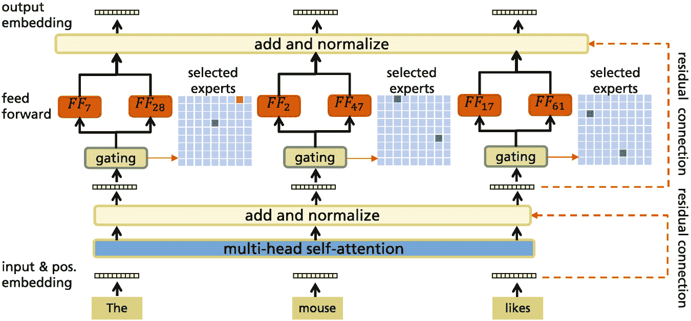

G L A M 架构的示意图。它显示了输入和位置嵌入层、前馈和输出嵌入层，以及残差连接。

图 3.21

GLaM 架构 [51]。对于每个输入标记，例如 *“likes”*，门控模块会动态地从 64 个可用的专家中选择两个最相关的专家。这由蓝色网格表示。然后，这两个专家的前馈模型输出的加权平均值传递到下一个编码器块。对于其他输入，会选择不同的专家。在每个第二个编码器块中使用专家混合层。

**WuDao-2.0** [175, 178, 257] 是一个最近的大型自回归语言模型，拥有 1750B 参数，是 GPT-3 的十倍。它具有*混合专家*层，其中门控网络根据输入选择处理子模块。WuDao-2.0 使用*FastMoE*库[74]，并采用 GLM 2.0 架构（见第 3.1.3 节），结合 BERT、GPT 和编码器-解码器变换器的不同学习范式[175]。

训练数据包括来自 *Pile* 语料库的 1.2TB 中文文本，2.5TB 中文图形数据和 1.2TB 英文文本数据。*Cogview* 模型用于图像的联合处理，见第 7.2 节。此外，WuDao-2.0 可以边学边用，绘图和作诗。这些功能与 GPT-3 相比具有显著差异。

公布的性能指标令人印象深刻。在衡量世界知识的 LAMA 基准测试[158]中，其得分高于 AutoPrompt [192]。对于*SuperGLUE*少样本自然语言理解任务[219]，它实现了 Sota 并超越了 GPT-3。在 Lambada 基准测试（见第 4.1.3 节），其中需要预测段落最后一词的情况下，其结果优于微软的 Turing NLG。此外，它还在多个文本-图形任务（见第 7.2.8 节）上提高了 Sota。

**Switch** [56] 是 transformer 编码器-解码器 T5（见第 3.1.3 节）的一个变体。它具有*混合专家*架构，其中用*k* = 128 个具有不同参数的副本替换了每个编码器块的完全连接层。有一个简单的线性门控网络，为每个令牌选择 128 个单完全连接层（专家）中的一个。因此，参数数量在计算努力基本恒定的情况下大幅增加。对于这种架构，可以计算梯度，并且可以使用多种特定策略和特殊的 TensorFlow 版本来优化模型。结果表明，与标准 T5 版本相比，Switch 在 1/7 的计算时间内达到了相同的损失水平。在许多微调任务中，具有 1600B 参数和 2048 个专家的大型 Switch 模型比具有 13B 参数的 T5-large（见第 3.1.3 节）在计算训练努力上少四分之一，但结果更好。

作为混合专家架构中门控网络的替代方案，可以使用哈希值来激活网络的不同部分。**Token Switch** [177] 为每个输入令牌计算一个哈希值，并根据哈希值将每个令牌生成的嵌入路由到不同的前馈网络。作者表明，他们的方法与 Switch 相比具有优势，并且在综合语言建模任务上表现良好。

**ST-MoE-32B** [261] 是一个具有 269B 参数的专家混合模型，其训练成本与 32B 密集模型相当。作者修改了路由算法，该算法将标记嵌入分配给一个或两个专家，并解决了不稳定性问题。该模型类似于 T5-Large 编码器-解码器 [170]。ST-MoE-32B 有 32 个专家，专家层频率为 1/4，这意味着 T5 的每第四个前馈层被 MoE 层所取代。作者使用了*GEGLU*激活函数，其中包含乘性元素 [142](3.2)作者比较了大量的变体和超参数以改进训练。

该模型在许多迁移学习基准测试中实现了 Sota，例如，对于 SuperGLUE，平均准确率为 93.2%，击败了具有 540B 参数的 PaLM LM。其他 Sota 结果包括摘要（XSum [143] Rouge-2 得分为 27.1，CNN/Daily Mail [78] Rouge-2 得分为 21.7），闭卷问答（WebQA [13] 准确匹配率为 47.4%，Natural Questions [109] 准确匹配率为 41.9%），以及用于常识推理的对抗性构建任务（Winogrande [182] 96.6%，ANLI R3 [146] 74.4%）。

### 3.5.3 参数压缩和减少

*模型量化*是一种参数减少技术，其中参数以低精度存储，因此 PLM 中的计算也更不精确。传统模型通常使用 32 位或 16 位的参数，而量化后的参数可以具有 8 位甚至 1 位或 2 位。例如，**Q-BERT** [190] 将 Transformer 模型量化到超低精度。这使模型大小减少了 13 倍，同时只损失了 2.3%的性能。作者避免了简单地降低权重精度的天真方法，而是使用额外的训练步骤来调整量化权重，并允许对“敏感”参数有更高的精度。其他作者提出了删除小值参数 [64] 的方法。ALBERT [113] 在所有层中使用相同的权重，实现了显著的参数减少。尽管如此，ALBERT 与 BERT 相比具有相同或更好的性能。

另一种方法旨在减少参数数量，例如通过移除注意力头。研究表明，大多数注意力头只关注几乎相同的位置关系，可以用固定的注意力模式来替换 [172]。结果表明，每个编码单元只需要 1-2 个注意力头而不是原始模型的 16 个注意力头，也能实现高性能。Ganesh 等人 [60] 提供了关于参数压缩技术的详细概述。

减少模型参数的另一种方法是模型剪枝，它通过在 PLMs 中剪掉无关部分来实现更小的内存占用和更快的执行速度，同时不牺牲性能。例如，可以证明，Transformer 的一些注意力头可以移除而不会对准确性产生太大影响 [256]。其他研究人员通过剪枝注意力层和线性层的权重来减少参数数量，而不会降低准确性 [29, 64]。请注意，模型剪枝并不总是导致加速，因为稀疏计算可能在 GPU 上难以并行化。

### 3.5.4 低秩分解

这种技术采用矩阵和张量分解来减少满秩参数矩阵的参数数量，并且已经在第 3.2.2 节中讨论了其扩展输入序列长度的应用。例如，有 Performer [34] 和 Linear Transformer [105]（第 3.2.2 节）。作为替代方案，ALBERT（第 3.1.1 节）将嵌入矩阵近似为两个较小矩阵的乘积。

### 3.5.5 知识蒸馏

在机器学习中，知识蒸馏方法 [82] 将知识从大的 *教师模型* 转移到小的 *学生模型*。大模型通常可以成功训练以近似一个功能关系，而不使用其全部表示能力。为了在应用期间降低高计算和内存需求，训练一个较小的模型来模仿大模型，同时不牺牲准确性。

这种方法的优势在于，学生模型可以被训练来近似教师模型的**内部激活**。通常，教师模型生成的目标概率被用来训练学生网络。通常，教师模型对于输入 ***x*** 的输出是 *z*(***x***)，这可以通过缩放 softmax 转换为概率！[$$\displaystyle \begin{aligned} {\boldsymbol{y}}(x|\tau) = \frac{[\exp(z_1({\boldsymbol{x}})/\tau),\ldots,\exp(z_k({\boldsymbol{x}}))/\tau]} {\exp(z_1({\boldsymbol{x}})/\tau)+\cdots+\exp(z_k({\boldsymbol{x}})/\tau)} , \end{aligned} $$](../images/528393_1_En_3_Chapter/528393_1_En_3_Chapter_TeX_Equ3.png)(3.3)其中 ***y***(*x*|*τ*) 是一个概率向量，*τ* 是一个称为 *温度* 的参数，对于标准的 softmax，通常设置为 1.0。学生模型被训练来通过最小化 *交叉熵*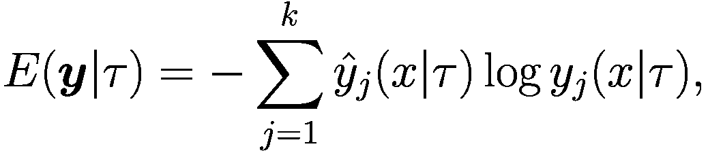(3.4)来模仿教师模型生成的概率 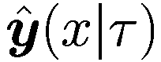。如果观察到值，教师模型的概率 *y**j* 可以用 1.0 替换观察到的类别，否则用 0.0。在训练过程中，温度可能会变化。高温度可以避免极端的概率值并减少梯度。这可能会导致优化开始时的收敛速度更快。

**DistilBERT** [183] 使用 MLM 交叉熵损失来预测标记概率，并且还使用教师和学生网络嵌入矩阵之间的余弦相似度来训练一个更小的 BERT 模型。它在预训练期间利用知识蒸馏来将 BERT 的大小减少 40%，同时保留其原始能力的 99%，并使推理速度提高 60%。*MobileBERT* [204] 基于特定的一个大 BERT 模型，并转移了关于多头注意力以及由此产生的嵌入的信息。实验表明，MobileBERT 比 BERT 小 4.3 倍，快 5.5 倍，同时在知名基准测试中取得了具有竞争力的结果。

**TinyBERT** [97] 提出在预训练和微调期间对 BERT 模型进行蒸馏。该模型被调整为：(1) 选择层嵌入的输出；(2) 从选择的 Transformer 层导出的隐藏状态和注意力矩阵；(3) 预测层的 logit 输出。由于在微调期间也进行了蒸馏，因此模型可以更好地适应微调后的 BERT。在多个基准测试中，TinyBERT 与 BERT[BASE] 相当，并优于 DistilBERT。

注意，上述讨论的知识蒸馏方法需要用于预训练教师模型的数据，这些数据通常由于数据版权而未发布。尚未评估使用新数据是否也能进行蒸馏。知识蒸馏的训练时间很高，因为教师模型需要对整个预训练数据进行正向预测以生成激活值或中间表示。

Rogers 等人[176]列出了一系列 BERT 的尺寸缩减研究，并报告了参数大小和计算时间的减少以及由此产生的性能。对于许多方法，内存和计算工作量显著减少，性能几乎相同。

### 3.5.6 总结

模型参数的数量、训练数据的大小以及训练所需的计算工作量是决定模型性能的关键因素。Kaplan 等人[102]通过实验表明，增加参数数量和训练集大小可以可靠地提高性能，并提供了详细的依赖关系公式。如果可用固定的计算预算，应使用一个非常大的模型和大量数据。

专家混合模型通过增加参数数量而不需要更多的计算工作量来遵循这种方法。通过将输入路由到特定的子网络，它们能够提高性能，与单一网络相比。例如，GLaM、WuDao-2.0 和 Switch 就是这样的网络。然而，这些网络有数百亿个参数，需要特定的并行计算基础设施。

通常训练好的网络太大，需要缩减以适应较小的计算设备。一种可行的方法是低精度计算，这可以减少参数存储的内存需求。矩阵的低秩分解也作为副作用具有更低的内存占用。最后，可以使用知识蒸馏来创建一个学生模型，该模型模仿大型训练教师网络的内部工作。例如，DistilBERT 能够将内存大小减少 40%，保持了 99%的原有性能，并且速度提高了 60%。还有许多其他尺寸缩减方法，效果相似。

## 3.6 针对特定应用的微调

在大型文本集合上对语言模型进行自监督预训练，然后对其进行微调以解决特定任务，已经成为自然语言处理和理解的标准化范式。已经证明，预训练语言模型如 BERT 在泛化方面非常出色，并且可以轻松地微调到多个任务。然而，有时简单的针对特定领域的微调并不足够，必须使用其他迁移学习方法来更好地适应数据中的领域变化[166]。有多个综述深入探讨了迁移学习[230, 252, 260]。

微调更新所有模型层，包括嵌入层，但在高层有更大的变化 [133]。首先，我们讨论微调是否会破坏预训练期间获得的知识。*标准微调* 以较小的计算成本将具有许多参数的大型预训练 PLM 适应到相对较小的微调训练数据集。我们研究在这个阶段是否会发生 *过拟合*。随后的章节介绍了不同的微调方法：

+   *中间微调* 在最终目标微调之前，使用较大的训练集进行一次中间微调步骤。

+   *多任务微调* 通过同时在多个任务上进行微调来增强模型的能力。

+   *冻结模型微调* 通过添加一个小额外的层来适应微调任务，而不是改变大型预训练模型的所有权重。

+   *为少样本指令创建提示* 的目的是为大型自回归 PLM 如 GPT-3 生成输入，以零样本或少样本方法解决任务。

### 3.6.1 微调的性质

PLM 的微调通常用于通过监督训练将预训练模型适应到特定任务。这种从源任务到相关目标任务的模型适应也称为 *迁移学习*。如果我们在自监督学习中拥有丰富的训练数据（如非标注文本典型），而对于目标任务只有少量标注数据，迁移学习特别有益。Zhuang 等人提供了一份迁移学习的调查 [260]。微调具有多个优点：

+   模型通过利用预训练数据中提供的内容，获得了关于语言、其语法和语义的详细知识。

+   预训练模型可以很容易地适应新任务，例如通过添加一个简单的分类器层。预训练模型的语言表示支持微调，并且在微调过程中仅略有变化。

+   即使数据集很小，微调也比直接在有限数据上训练分类器有更好的性能。

类似于 BERT 的自动编码器模型通常用于分类任务，在这些任务中，需要移除用于掩码语言建模和下一句预测的逻辑分类器。使用 *[CLS]* 标记或其他标记作为输入，新的逻辑分类器模型以及所有模型参数都会通过新任务进行端到端训练几个周期（见第 2.1.3 节）。与预训练相比，微调相对成本较低。通常，只需要一小部分预训练的努力就能取得良好的效果。

Tripuraneni 等人[210]从理论上证明了迁移学习比独立学习任务需要的数据要少得多。他们证明，如果任务多样性得到增强，迁移学习会得到改善。Bansal 等人[7]研究了使用预训练嵌入微调分类器的理论特性。作者证明，这些分类器在训练和测试准确率之间的泛化差距比标准分类器更小。

#### 灾难性遗忘

问题是微调是否会破坏模型的原始能力。这意味着，在微调预训练模型几个 epoch 之后，它可能会失去预训练后可用的预测性能。可能的原因是*灾难性遗忘*，其中所有参数都适应了新的学习任务，同时忘记了学习内容。

Merchant 等人[133]使用三个不同的任务微调 BERT[BASE]：(1) MNLI 句子对分类任务[229]，衡量第一个句子是否蕴涵第二个句子；(2) SQuAD 问答[173]，其中问题的答案必须在文本中标记；(3) 依存句法分析[50]，以捕捉句子的句法结构。然后他们调查了微调前后多个探测分类器的性能。结果表明，微调模型在检测语言概念方面的准确率仅略有下降。由 MNLI 任务引起的减少在大多数情况下小于 1%，而 SQuAD 和依存句法分析观察到的高差异（小于 3%）。因此，没有观察到灾难性遗忘。作者表示，微调主要改变了 BERT 的顶层，依存句法分析也影响了更深层次的层。Wallat 等人[216]提供了更详细的结果。

如果两个任务之间存在相似性，微调仅从预训练中受益。因此，预训练应该有一个损失函数，强制学习在单词、短语和文档级别的语义。此外，其训练文档应源自与微调任务相近的领域。否则，词汇可能不包含许多领域特定词汇。结果，领域特定词汇被分割成多个标记，这阻碍了模型学习并降低了其在下游任务中的性能。在下一节中，我们将讨论改进 BERT 能力的替代训练方案。

#### 微调和过拟合

在预训练期间，BERT 的参数被调整以适应预训练数据，获得通用语言表示。由于预训练提供了一个良好的初始化，它避免了在小的微调数据集上过度拟合，如果微调错误没有最小化太多。

由于 PLM 具有非常多的参数，因此在微调数据上存在过拟合的风险。结果，从未见过的数据中泛化的能力可能较差，可能需要采取对策。D’Amour [42] 对这种**欠指定**现象进行了全面的讨论。Jiang 等人[95]引入了一种正则化形式，使模型对输入的小扰动保持不变，从而在局部邻域中诱导平滑性。他们开发了一类 Bregman 邻近点优化方法，该方法在每个迭代中惩罚模型的大更新。Aghajanyan 等人[2]引入了表示崩溃的概念，指出微调模型失去了泛化的能力。他们提出了基于信任域理论的微调优化方法，这种方法以其他最近提出的微调方法的成本的一小部分缓解了表示崩溃，例如，在微调 RoBERTa 在 GLUE 上取得了最佳结果。

使用多个随机种子微调相同的模型可能会导致任务性能出现较大差异。大多数论文认为这种效应是由**灾难性遗忘**和微调数据集的小规模引起的。然而，Mosbach 等人[140]表明，通常微调存在由于梯度消失导致的优化问题。此外，有时会出现模型虽然与成功模型具有相同的微调损失，但泛化能力不佳的情况。这是上述欠指定的一个指示。作者建议使用小的学习率并纠正偏差以避免训练早期梯度消失。此外，他们提出使用更多迭代次数进行微调。Rogers 等人[176]提供了更多改进微调的食谱。

### 3.6.2 微调变体

#### 分阶段微调

中间训练集应更接近最终任务。尽管这种方法在某些情况下可以提高性能，但实验评估表明，在 44%的情况下性能有所下降[163]。在需要高级推理和推理能力的任务上进行中间训练往往效果最佳，正如在一个大型实验[165]中所展示的。然而，作者也观察到预训练能力的灾难性遗忘。Gururangan 等人[71]表明，使用特定领域的数据进行预训练的第二阶段，无论是在高资源还是低资源设置中，都能带来显著的性能提升。此外，在特定任务的无标签数据上预训练可以提高各种任务和领域的性能。

#### 多任务微调

对于每个任务，都会在底层预训练模型上添加一个特定于任务的层。然后，模型与所有任务同时训练。然而，有时与标准微调相比，性能没有提高 [141]，可能是因为任务之间存在矛盾的要求。作为替代方案，可以根据相似度度量从可用的数据集中选择微调任务的子集 [131]。

**HyperGrid** [208] 是一种在 T5 模型上评估的多任务学习方法。它学习网格投影，有助于为不同任务专门化权重矩阵中的区域。例如，单个模型可以同时适应所有 GLUE 和 SuperGLUE 任务。尽管有众多任务，该模型在 SuperGLUE 上的性能略优于单个模型。

#### 通过元学习加速微调

在微调预训练的 PLM 时，它会被适应到一个新的 NLP 任务。通常，它在一个标记的微调数据集上训练两到三个 epoch。尽管这比在大规模训练语料库上预训练模型要快得多，但它仍然需要大量的努力。为了减少这种努力，研究人员试图通过**元学习**来准备预训练模型以进行微调。Yin [242]提供了一份元学习的调查。

通常，存在一个相关微调任务集  *T*[*i*]。在元训练期间，任务 *T*[*i*] 从分布 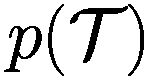 中采样。然后，模型使用 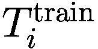 中的 *K* 个训练样本进行训练，然后在  的验证集上进行测试。*T*[*i*] 的验证错误被用作当前迭代的元学习框架的训练错误。**MAML**算法 [58]遵循此模式：

+   复制初始模型参数的**w**^([*i*])。

+   使用 *K* 梯度更新在训练集  上训练模型：![$$\hat {{\boldsymbol {w}}}^{[i]} \gets {\boldsymbol {w}}^{[i]} - \gamma \partial L_i({\boldsymbol {w}}^{[i]},T_i^{\text{train}})/\partial {\boldsymbol {w}}$$](../images/528393_1_En_3_Chapter/528393_1_En_3_Chapter_TeX_IEq38.png)

+   在验证集 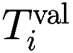 上应用更新参数的模型 ![$$\hat {{\boldsymbol {w}}}^{[i]}$$](../images/528393_1_En_3_Chapter/528393_1_En_3_Chapter_TeX_IEq39.png)。

+   使用验证集上的损失更新初始模型参数 ***w*** ![$${\boldsymbol {w}} \gets {\boldsymbol {w}} - \beta \partial L_i(\hat {{\boldsymbol {w}}}^{[i]},T_i^{\text{val}})/\partial {\boldsymbol {w}}$$](../images/528393_1_En_3_Chapter/528393_1_En_3_Chapter_TeX_IEq41.png)

该方案应用于 BERT [6]。作者们通过从少量词汇中收集待掩码的标记，从未标记文本中生成一个大型、丰富、元学习任务分布。在 17 个 NLP 任务上，他们表明这种类型的元训练比语言模型预训练后微调的少样本泛化效果更好。Chen 等人[28]为这些方法提供了数据依赖的泛化界限。

#### 通过适配器微调冻结模型

微调任务采用的一个缺点是每个任务都需要新的模型参数。*任务适配器* [84]旨在减轻这个问题。作者们引入了适配器层，这些层被插入到编码器块中，在多头注意力和前馈层之后(2.​7)。现在，为了微调 Transformer 模型到新任务，而不是重新学习所有参数，除了适配器层和归一化层之外，网络的所有权重都保持冻结。在 GLUE 等任务上，这显著减少了需要训练的参数数量，同时保持了模型质量。

Stickland 等人[197]提出，而不是为不同的任务准备多个适配器，他们建议训练一个多任务版本的 BERT，该版本可以同时用于多个任务。他们添加了低维投影注意力层作为绕过 BERT 编码器块的旁路，这些层将输入连接到层归一化层以及随后的层归一化层。他们在训练期间按各自训练集的大小成比例地从不同任务中采样数据，并使用退火机制，到训练结束时使训练样本均匀分布。他们的结果超过了 BERT[BASE]模型的结果。

**MAD-X** [160]是一个将多语言模型适应到任意语言和任务的框架。作者们引入了语言和任务特定的适配器，这些适配器包括一个线性下投影到小向量、ReLU 激活和一个线性上投影。语言特定的适配器使用 MLM 目标进行训练，而模型的其他部分保持冻结。任务特定的适配器使用特定于任务的训练数据进行训练，固定其他参数。最后，在输入嵌入层之后和输出嵌入层之前添加可逆适配器，以减轻多语言词汇和目标语言词汇之间的差异。MAD-X 在多种语言的 NER 和常识推理任务上实现了 Sota。

**LoRA** [85] 冻结预训练模型的权重，并向模型添加可训练的旁路，这些旁路包括对短向量和对全秩矩阵的可训练变换。这极大地减少了可训练参数的数量（GPT-3 为 1/30，GPT-2 为 1/100），同时在许多 NLP 任务上比传统的微调方法取得了更好的结果。*AdapterHub* [161] 是一个适配器存储库，截至编写时包含大约 380 个适配器。AdapterHub 建立在 Hugging Face transformer 库之上，以与现有的 transformer 模型兼容。

#### GPT-3 微调

GPT-3 是一个非常强大的基础模型，但它不是公开可用的（第 3.1.2 节）。通过使用 API 使用用户特定的数据 [123] 对 GPT-3 进行微调，模型可以适应特定领域的语言和特定任务。这通常比下面描述的少样本示例和提示设计产生更高的质量。要在 1M 令牌文件上对 175B 参数模型进行四次 epoch 的微调，OpenAI 收取大约 $120。微调可以用多种方式使用 [123]：

+   *补全（Completion）*: 为提示生成补全内容。

+   *搜索（Search）*: 给定一个搜索查询和一组文档或标签，模型根据其与查询的语义相似度对每个文档进行评分。

+   *分类（Classification）*: 输入是一个查询和一个带有标签的示例集，例如，*[“我感觉很棒”， “积极”]*。然后 GPT-3 将预测查询最可能的标签。这可以用于类似于 BERT 的任何类型的分类任务。

+   *回答（Answer）*: 输入是一个问题，一些带有背景信息的文档和一些示例。基于文档中的信息和示例，生成一个答案。这与问答任务中的阅读理解任务（第 6.2 节）类似。

+   *微调（Fine-tune）*: 将 GPT-3 适应到特定领域的文本。

+   *嵌入（Embeddings）*: 获取输入文本的上下文嵌入向量，用于进一步处理或探索。

可以假设，通过这种方式微调的 GPT-3 和其他类似的基础模型如 PaLM 将由于它们对语言的全面知识而提高许多领域的 Sota（最先进的技术）。

### 3.6.3 创建少样本提示

对于 *零样本学习*，模型只需获得任务描述或 *提示*，例如 *“将英语翻译成法语：奶酪 =*>”，然后直接生成答案 *“fromage”*。对于 *单样本* 或 *少样本学习*，模型会收到任务描述以及一个或多个示例，例如 *“将英语翻译成法语：海獭 =*> *loutre de mer；奶酪 =*>”，这有助于模型找到答案 *“fromage”*。这不需要训练，模型的参数不会改变，模型基于预训练期间获得的知识创建答案。

以这种方式，GPT-3 可以通过自然语言提示来生成短篇小说、歌曲、问题的答案、新闻稿、技术手册等等 [181]。它可以调整其输出文本以适应特定的风格、个性或意识形态。以下是一些用于少样本学习的推荐提示 [150]：

+   摘要：模型接收一个长故事和提示 *“tl;dr：”*。

+   语法纠正 *“原文：她没有去市场。标准美式英语：”*

+   翻译：*“英语：我不说法语。法语：Je ne parle pas français. 英语：洗手间在哪里？”* 法语：

+   为一篇论文生成大纲：*“为关于沃尔特·迪士尼及其对动画贡献的论文创建大纲：*

    *I: 引言*

图 3.22 显示了不同 GPT-3 模型大小和不同给定示例数量的“少样本学习”准确率。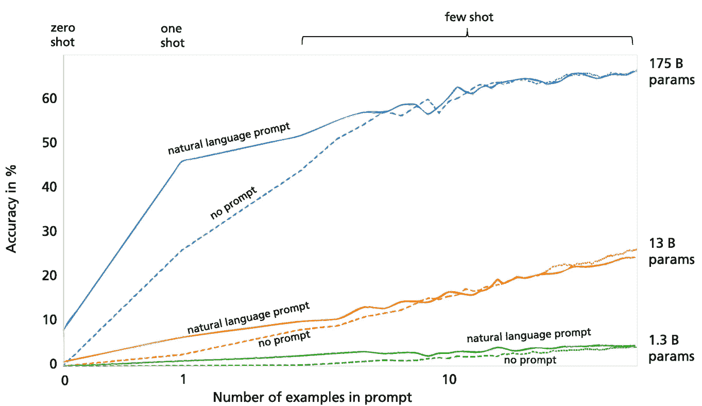

一条表示准确率百分比与提示中示例数量关系的折线图显示了自然语言提示和无提示的趋势，包括 175、13 和 130 亿参数的提示。所有线条都呈上升趋势。

图 3.22

通过扩展模型大小以及展示的示例数量，GPT-3 的少样本学习准确性得到提高 [25]。任务是移除单词中的随机符号。自然语言描述的任务可以支持模型，特别是在单样本模式下。图片经作者同意重印 [25，第 4 页]

在一项综合调查中，刘等人 [125] 汇编了用于创建可靠生成所需响应的语言模型提示设计方法。例如，当我们想要识别文本 *“我今天错过了公交车。”* 的情感时，我们可能会插入提示 *“我感到如此*”*，并使用语言模型来填充空白。有两种类型的提示：*cloze prompts* [159]，通过类似于 BERT 的自动编码器模型填充文本字符串的空白，以及*prefix prompts* [117]，通过自回归语言模型继续文本。

对于提示挖掘 [96]，例如，收集了大量包含短语 *x* 和 *y* 的句子。随后，使用 *x* 和 *y* 之间的单词或由解析器生成的依赖路径生成的提示生成。另一种方法是基于现有提示的释义，例如通过翻译成另一种语言再回译。通过基于梯度的搜索 [192] 可以提高期望答案的概率，如 *AutoPrompt* 模型所示。其他方法在 [62，245] 中描述。然而，需要注意的是，如果对手添加了一些新的提示，那么用少样本提示指令的模型的输出很容易被改变 [79]。

与改进生成期望输出的提示词不同，可以通过优化一些“虚拟”提示词的输入嵌入来优化，从而创建所需的答案。这个“连续”提示词的嵌入可以通过梯度下降进行优化，同时保持语言模型的参数不变 [121]。Lester 等人 [117] 使用 100 个提示词的连续序列将这种方法应用于 T5 变换器。在 *SuperGLUE* 基准测试中，他们达到了与微调 T5 相同的 90.5%的性能。这表明提示词调整与微调具有竞争力，并且比少样本指令要好得多。请注意，提示词调整的努力远低于微调，因为参数数量要小得多。将这项技术应用于最近的自动回归模型，如 GPT-3 或 PaLM，将会很有趣。

### 3.6.4 少样本学习推理的思维链

为了提高语言模型的推理能力，提示词可以包含一个**思维链**，这是一个模仿人们在回答问题时可能进行的推理过程的短句序列 [226]。图 2.21 展示了两个示例。其理念是，思维链允许语言模型将一个多步骤问题分解成一系列中间步骤，这些步骤可以逐个解决，而不是一次性解决整个多步骤问题。

这种方法具有许多优点。首先，思维链方法使模型能够将复杂的推理任务分解成更简单的中间步骤，这些步骤可以被模型解决。为了解决整个问题类别，只需要提供少数几个思维链。其次，当模型执行中间步骤时，更容易检查模型在何处引入了错误。这可能会提供改进思维链的线索。思维链推理可以应用于符号操作、常识推理和数学任务，并且可能适用于任何人类可以通过语言解决的问题。

提示词也不必局限于输入-输出对或解释，可以涵盖许多论点，包括要避免的事项、经验法则、推理链、正面或负面示例。Mishra 等人 [138] 考虑了针对众包工作者的指令，其中包含非常详细的如何解决问题的规定。他们编制了一个包含任务、指令和生成的输入-输出对的数据库。随后，他们研究了模型在泛化到类似任务方面的表现。结果显示，PLM 在评估泛化到未见任务时的表现（提高 19%）中受益于指令。然而，还有很大的改进空间。

Du 等人 [52] 从理论上研究了少样本学习。他们研究了模型在具有大量训练集的多个任务上预训练，随后在相关任务上微调的情况。他们从理论上推导出微调任务所需的样本大小界限，当存在良好的共同表示时，这个界限可以降低。

### 3.6.5 微调模型以执行指令

而不是通过少样本指令查询自回归 PLM，可以微调这些模型以执行指令，而无需额外的示例。

**InstructGPT** [151] 是 GPT-3 的新版本。它被优化为遵循指令，而不是预测可能的下一个单词。GPT-3 现在可以直接执行指令，例如 *“写一个关于月亮和星星的短故事：”*，然后模型生成一个合理的情节。在第一次试验中，收集了一个包含 13k 对指令和完成的语料库来调整 GPT-3。使用这些数据对 GPT-3 进行了微调。然而，模型并没有充分匹配预期的人类偏好。因此，使用不同的训练方法对模型进行了修改。

为了调整 GPT-3，使用了带有人类反馈的**强化学习**方法。**近端策略优化**（PPO）[186] 遵循策略梯度模式。它近似在步骤 *t* 时，关于环境状态的当前观察  和参数向量 ***w*** 的动作条件分布 *π*(*a*[*t*]|*s*[*t*];***w***)。在通常的强化学习中，环境生成奖励，算法试图最大化加权奖励总和。这个优化的梯度（策略梯度）可以很容易地从模型中计算出来。PPO 在每一步计算一个更新，以最小化成本函数，同时确保与先前策略的偏差相对较小 [186]。

算法需要一个数值分数来衡量每个生成序列的质量。为了减少优化所需的数据，人类可以表达对轨迹*τ*=(***y***, ***x***)的偏好 [198]，对于指令***x***和生成的文本***y***成对。非正式地说，目标是产生人类偏好的轨迹，同时尽可能少地查询人类。为了实现这一目标，假设了一个奖励函数，其性质是如果*r^(y^([1]), x^([1]))>r^(y^([2]), x^([2]))，则(*y^([1]), x^([1]))比(*y^([2]), x^([2]))更受欢迎。原始策略*π*(a[t]|s[t];***w***)诱导一个条件分布*π*(***y***|***x***;***w***)。为了构建这个，奖励函数*r^(y,x*)被一个具有参数***u***的深度神经网络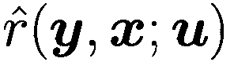近似。网络通过三个交替步骤进行训练（图 3.23)：

1.  1.使用策略*π*(***y***|***x***;***w***)生成轨迹集{τ¹, …, τ^i}。参数***w***通过强化学习进行更新，以最大化奖励。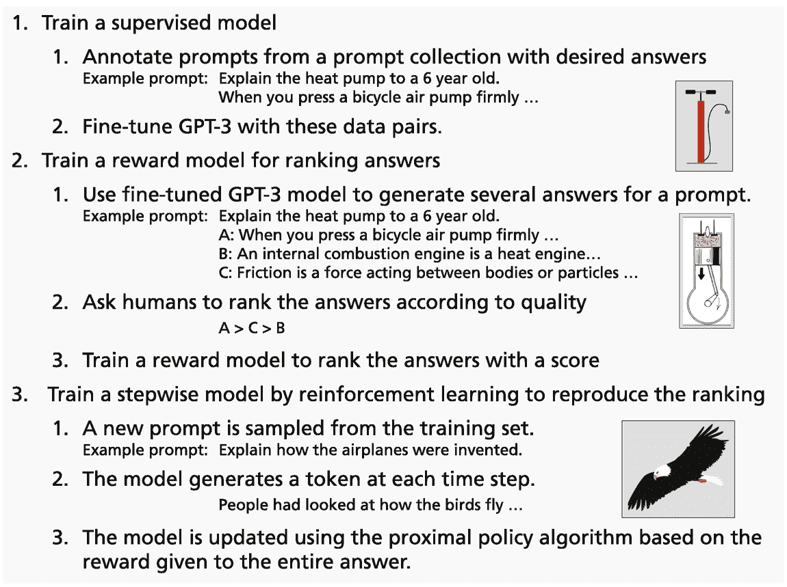

    以下列出了 3 个步骤。1，训练一个监督模型。2，训练一个用于排名答案的奖励模型。3，通过强化学习训练一个逐步模型来重现排名。每个步骤都有多个子步骤。

    图 3.23

    InstructGPT 分为三个步骤进行训练 [151, p. 3]。首先，GPT-3 在指令及其对应补全上进行微调。然后，通过优化指令的补全选择来生成奖励模型。最后，训练一个策略，通过强化学习逐个生成具有最大奖励的答案。图像部分的信用归功于表[A.1](https://doi.org/10.1007/978-3-031-23190-2_BM1#Tab1)

1.  2.

    从{τ¹, …, τ^i}中选择轨迹对(*σ^([1]), *σ^([2]))提交给人类进行比较。

1.  3.

    奖励函数的参数***u***被优化，以对应到目前为止收集的人类比较。

对于一组 33k 个指令，构建了一个具有 6B 参数的 *奖励模型*，其中 ***x*** 是指令，***y*** 是完成内容 [198]。它从一小组提议的完成内容中选择最佳完成内容。使用近端策略优化 (PPO) 作为强化模型 [151, p. 41]。为了避免灾难性遗忘（第 3.6.1 节），预训练样本被混合到微调中。

然后，通过另一个强化学习步骤应用奖励模型来创建最终模型。在这个过程中，InstructGPT 为一个指令生成一个完成内容。奖励模型计算一个奖励，并将策略更新以近似奖励模型中编码的偏好。通过模仿人类话语，模型隐式地学习人类意图和偏好。这个过程被称为 *对人类偏好的对齐*，Askell 等人在 [5] 中进行了广泛讨论。

#### InstructGPT 结果

将 175B 参数的 GPT-3 模型以监督方式微调到 13k 个指令-完成示例，作为称为 SFT 的基础模型。最终完成内容再次由人类评分者评分 [151]。在 85% 的情况下，InstructGPT 的完成内容比标准 GPT-3 输出更受欢迎，在 71% 的情况下比 few-shot-GPT-3 更受欢迎。

具体来说，评分者发现，在 92% 的情况下，InstructGPT 尝试遵循正确的指令，而 SFT 为 85%，few-shot GPT-3 为 75% [151, p. 53]。此外，InstructGPT 在 50% 的情况下遵循显式约束，而 SFT 为 43%，few-shot GPT-3 为 34%。对于 InstructGPT，20% 的情况下观察到幻觉，而 SFT 为 16%，few-shot GPT-3 为 50%。最后，评分者发现，在 92% 的情况下，InstructGPT 的语言使用适合客户助理，SFT 大约为 90%，GPT-3 few-shot 大约为 85%。InstructGPT 还在几个自然语言基准测试中被评估，其结果与 GPT-3 非常相似 [151, p. 56]。

结果表明，InstructGPT 能够推广到未见过的标注者偏好。因此，InstructGPT 并不仅仅适应少数训练标注者的偏好。此外，InstructGPT 产生的有毒语言比标准 GPT-3 少一些。然而，InstructGPT 仍然会犯简单的错误，例如，给定一个包含错误前提的指令，模型有时会错误地假设前提是真实的。请注意，结果取决于标注者的主观偏好。

比较不同的方案并不一定是生成改进信号的最有效方法。例如，可以要求标注者编辑模型响应以使其更好，或者用自然语言生成模型响应的评论。还有大量选项可以设计用于标注者向语言模型提供反馈的界面；这是一个有趣的人机交互问题。作者指出，将 GPT-3 与上述人类偏好对齐的成本仅为训练 GPT-3 成本的 1.6%。因此，似乎应该将更多精力投入到对齐上，而不是仅仅扩大模型。

结果表明，InstructGPT 技术可能使语言模型更有帮助、更真实、更无害。从某种意义上说，InstructGPT 的工作方式就像是一个智能语音生成和信息提供助手。然而，该模型目前不适合用于安全关键应用，因为无法排除失败的可能性。仍然缺少的是类似于 Gopher 或 PaLM（第 3.1.2 节）的全面评估，以展示这种方法的真实效用。可以预期，将这种方法与 WebGPT（第 6.2.3 节）和 Retro（第 6.2.3 节）中使用的检索技术相结合，将提高 InstructGPT 的性能、可靠性和正确性。

#### 使用 FLAN 进行指令调整

**FLAN** [227] 通过指令调整来提高语言模型对自然语言提示的响应能力。语言模型必须通过监督学习来执行由提示描述的任务，并遵循指令，即使是对于不熟悉的任务（图 3.24）。作者将 62 个公开可用的 NLP 数据集分为十二个任务集群，例如“情感”、“自然语言推理”、“摘要”等。对于每个数据集，他们编写了十个用自然语言描述任务的模板。然后，一个现有的语言模型被微调以提供更好的对提示的响应！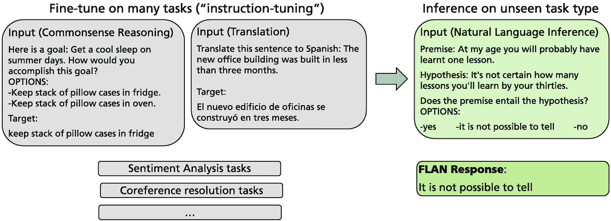

一个框图展示了与常识推理和翻译相关的提示输入集。它表明翻译输入导致自然语言推理的输入。它还表示情感分析和会议解决的任务以及 FLAN 的响应。

图 3.24

FLAN 指令调整通过十个不同模板的指令在一系列任务上微调预训练的语言模型（左）。训练后的模型可以通过根据这些模板制定提示来应用于未见过的任务（右）。图片经作者许可，改编自 [227，第 1 页]

该方法被应用于一个具有 137B 参数的 LaMDA-PT 语言模型，使用了检索和过滤器（见第 6.6.3 节）。在 18 个 NLI 任务中，FLAN 模型与 LaMDA-PT 137B、GPT-3 175B 和 GLaM 64B 进行了比较。在 18 个案例中的 14 个案例中，FLAN 显著提高了其未修改版本的性能，并取得了比竞争对手更好的结果，而在 4 个案例中则被 GLaM 超越[227]。FLAN 在许多任务上甚至以大幅优势超越了少样本 GPT-3。

### 3.6.6 基础模型通过生成标签数据

GPT-3 和其他基础模型在少样本学习中的性能使得为其他模型生成新的高质量训练数据成为可能。通过*无监督数据生成*（*UDG*），可以为下游任务的模型创建微调数据，这些数据原本是通过人工标注生成的。这种方法与第 4.2.3 节类似。

数据生成的想法是利用语言模型根据任务描述和几个样本输入-标签对来学习输入-标签关系[225]。对于分类任务，语言模型不仅要生成和预测一个标签，还要使用输出类别和任务描述作为输入来创建输入文本。对于像亚马逊产品评论这样的分类任务，该方法能够为每个类别生成 10k 个新示例，覆盖的谱系比目前可用的标签数据要大得多。结果表明，多达 32 个少样本示例仍然可以增加生成训练数据的质量。示例在图 3.25 中展示。作者使用了一个额外的模块来过滤掉噪声示例。在这个方法中，如果一个训练示例被训练的分类器以高概率匹配其标签，则该示例将被移除。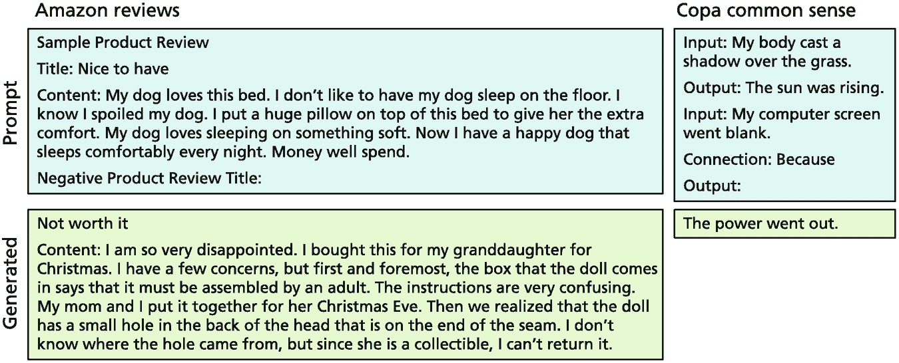

3 个文本框代表亚马逊评论左侧的提示和 Copa 常识右侧的提示。每个提示在底部展示其生成的答案。

图 3.25

通过使用少样本 UDG 策略，GPT-3 和其他基础模型可以生成新数据。这里展示了两个示例的提示，包括亚马逊评论和 Copa 常识推理，以及生成的答案[225]。

在 SuperGLUE 数据上微调的 T5-XXL 编码器-解码器模型，通过增强 UDG 数据，能够将自然语言理解任务在 SuperGLUE 上的整体准确率提升到 90.4%，甚至能够以 90.3%的准确率击败 DeBERTa。此外，该方法在一系列文本分类和情感分析任务上取得了非常高的性能分数[225]。

### 3.6.7 摘要

当在大型文本集合上预训练基础模型并在小标签数据集上进行后续的监督微调时，PLM 在许多 NLP 任务上实现了前所未有的性能。微调已被证明只略微改变模型参数，并且通常在几个 epoch 后停止微调不会观察到灾难性遗忘。通常，如果微调在几个 epoch 后停止，就不会观察到过拟合。如果需要，有一些方法可以避免过拟合。

微调可以通过不同的方式进行。有人建议在最终在小数据集上进行微调之前，先使用一个与数据集更相关的中间数据集进行微调。这种方法的成果参差不齐。此外，同时针对多个任务进行微调也是可能的。在某些情况下，这可能会提高性能。作为替代方案，有通过元学习加速微调的策略。为了避免改变整个模型，可以定义适配器层，并且只调整它们的参数。这可以大幅减少可训练参数的数量，同时仍然在微调任务上取得良好的性能。最后，最近为像 GPT-3 这样的专有模型提供了微调 API。

基础模型如 GPT-3 和 PaLM 可以通过提示来执行特定任务而无需训练。已经收集了大量不同的提示来指示模型完成任务。InstructGPT 是 GPT-3 的一个新版本，它直接接受指令并为广泛的任务提供答案。该模型通过强化学习适应用户判断来定制执行指令。指令微调是一种变体，其中基础模型被微调以提供对多个任务的指令的改进答案。结果证明，之后该模型甚至对未见过的任务也能生成更好的答案。

最后，可以使用大型语言模型来生成高质量的微调训练数据。同样，使用少样本学习技术来生成特定学习任务的输入文本。这样，稀缺的训练数据可以得到扩展，并实现更好的微调结果。

**开放获取** 本章节根据 Creative Commons Attribution 4.0 国际许可协议（[`creativecommons.org/licenses/by/4.0/`](http://creativecommons.org/licenses/by/4.0/)）授权，允许在任何媒介或格式中使用、分享、改编、分发和复制，只要您适当引用原始作者和来源，提供 Creative Commons 许可的链接，并指出是否进行了修改。

本章中包含的图片或其他第三方材料均包含在章节的 Creative Commons 许可证中，除非在材料引用行中另有说明。如果材料未包含在章节的 Creative Commons 许可证中，且您的使用意图不受法定法规允许或超出允许的使用范围，您将需要直接从版权持有人处获得许可。
