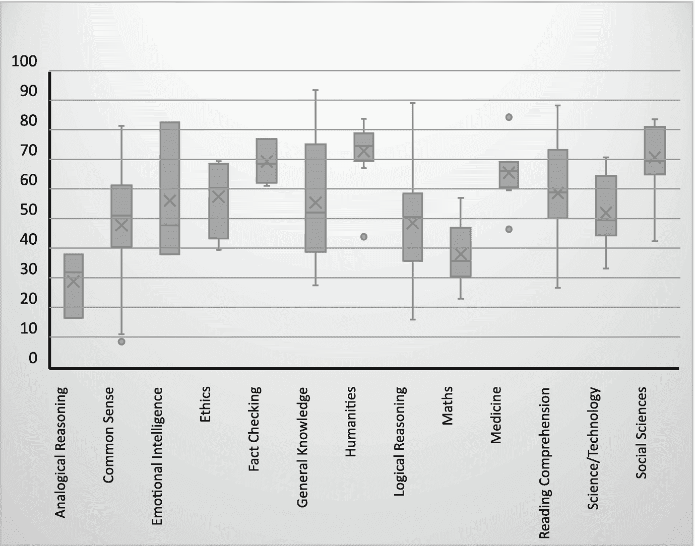

# 4. 基础模型获得的知识

Gerhard Paaß^(1  ) 和 Sven Giesselbach¹(1)知识发现部门，NLU 团队，弗劳恩霍夫智能分析和信息系统研究所（IAIS），圣奥古斯丁，北莱茵-威斯特法伦，德国

## 摘要

在预训练过程中，基础模型在大量文档集合上训练，并学习正确流畅语言中单词的分布。在本章中，我们研究 PLMs 和更大规模的基础模型所获得的知识。我们首先讨论基础模型在特定基准上的应用，以测试大量领域的知识，并检查模型是否能够从内容中推导出正确的结论。另一组测试通过完成文本和运用特定的探针分类器来评估基础模型，这些分类器分别考虑语法知识、语义知识和逻辑推理。最后，我们研究基准测试是否可靠和可重复，即它们是否真正测试了目标属性，并在其他研究人员重复时产生相同的性能值。

关键词基础模型中的知识常识知识逻辑一致性基准集合可重复性在预训练期间，预训练语言模型（PLMs）和更大规模的基础模型在大量文档集合上训练，并学习正确流畅语言中单词的分布。在微调期间，模型使用预训练的知识适应特定任务，并且只需要一小部分手动标记的微调数据。在本章中，我们通过不同类型的测试研究这些模型获得的知识：

+   我们首先通过特定的基准测试评估 PLMs 和基础模型，以测试大量领域的知识，并检查模型是否能够从内容中推导出正确的结论（第 4.1 节）。通常这些基准集合有一个综合的性能度量，平均覆盖不同的测试。基准测试可以通过微调模型以执行特定的分类任务或通过少样本查询基础模型来完成。

+   然后我们通过完成文本和运用特定的探针分类器来评估基础模型，而不调整模型参数（第 4.2 节）。我们分别考虑语法知识、语义知识和逻辑推理，并展示不同领域和不同模型架构的成就和不足。

+   最后，我们调查了基准测试是否可靠，即实际上是否测试了目标属性（第 4.3 节）。此外，我们还分析了已发布的基准测试结果是否可重复，如果其他研究人员重复进行，是否会得到相同的表现值。

## 4.1 基准测试集合

为了得到常识知识和常识推理的定量度量，社区已经编制了一系列基准测试。这些基准测试允许对自然语言理解的不同方面进行标准化比较，并为不同 PLMs 的强弱提供可比的分数。基准测试是语言模型发展的关键驱动力。PapersWithCode [45]提供了一系列基准测试和相应的排行榜。Storks 等人[62]提供了一份实际基准测试的调查。

为了公平地比较模型架构，需要确保参数数量、训练数据的大小以及训练所需的计算工作量相似。这一点在第 3.5.1 节中已经进行了广泛讨论。因此，许多作者进行了广泛的消融研究，以调整他们的训练资源到一个标准，例如以 BERT 作为一个“基准模型”。这非常重要，因为它帮助读者对预训练资源的影响有一个直观的认识。尽管如此，可比性通常受到两个问题的阻碍：

1.  1.

    一些训练数据集，例如 BERT 的 BooksCorpus，并不是公开可用的。

1.  2.

    这些比较没有显示出当数据量、参数数量或计算工作量增加时，模型的性能。

因此，像“模型架构 A 在执行任务 X 方面优于模型架构 B。”这样的陈述在一般情况下是不成立的，但必须进行限定[2]，例如：“当在来自领域 Y 的小/大数据集上预训练，并且计算工作量是 Z 时，模型架构*A*在执行任务*X*方面优于模型架构*B*。”

### 4.1.1 GLUE 基准测试集合

为了测试 PLMs（预训练语言模型）捕捉文档内容的能力，已经开发了 GLUE（第 2.1.5 节）的基准测试集。这是一个包含 9 个基准测试的集合，用于测试*自然语言理解*（NLU）的不同方面。联合性能通过一个单一分数来衡量，对于人工标注员来说，这个分数是 87.1。任务通过表 2.1 中的例子进行了详细描述。结果表明，针对不同 GLUE 任务微调的 BERT 变体可以比人类产生更好的结果。对于模型的大规模变体，结果已在表 4.1 中确定并展示。表 4.1

四种不同模型和人类标注者的 GLUE 基准测试结果。每个任务的 PLM 最佳值以粗体打印 [18, p. 7]。人类得分优于所有模型得分的是下划线

|   | CoLA | QQP | MNLI m | SST-2 | STS-B | QNLI | RTE | WNLI | MRPC |   |
| --- | --- | --- | --- | --- | --- | --- | --- | --- | --- | --- |
|   | Mcc | Acc | Acc | Acc | Corr | Acc | Acc | Acc | F1 |   |
| --- | --- | --- | --- | --- | --- | --- | --- | --- | --- | --- |
| Model | Grammar | Paraphr. | Entail | Sentim. | Similar | Question | Entail | Coref | Paraphr. | Avg |
| --- | --- | --- | --- | --- | --- | --- | --- | --- | --- | --- |
| Human [42] | 66.4 | 80.4 | 92.0 | 97.8 | 92.7 | 91.2 | 93.6 | 95.9 | 86.3 | 87.1 |
| BERT[LARGE] | 60.6 | 91.3 | 86.6 | 93.2 | 90.0 | 92.3 | 70.4 | 65.1 | 88.0 | 84.1 |
| RoBERTa[LARGE] | 68.0 | 92.2 | 90.2 | 96.4 | 92.4 | 93.9 | 86.6 | 89.9 | 90.9 | 88.8 |
| XLNET[LARGE] | 69.0 | 92.3 | 90.8 | **97.0** | 92.5 | 94.9 | 85.9 | 92.5 | 90.8 | 89.2 |
| DeBERTaV3[LARGE] | **75.3** | **93.0** | **91.8** | 96.9 | **93.0** | **96.0** | 92.7 | – | **92.2** | **91.4** |

在过去几年中，GLUE 经常被用来展示 PLM 的 NLU 能力。目前，经过微调后，DeBERTaV3 [18] 达到了 91.4 的最佳平均值（Sect. 3.​1.​1）。它使用内容位置分别嵌入，并采用相应的解耦注意力机制。只有三个任务中 PLM 的表现不如人类，但差距很小。请注意，多个模型的集成通常会产生略微更好的结果。Nangia 等人 [42] 也测量了由 5 人组成的人类团队的性能。由于团队在达成分歧判断时排除了案例，因此这些数字不可比较。较新的模型，如 PaLM，使用 SuperGLUE 而不是 GLUE，因为认为 GLUE 太简单。

### 4.1.2 SuperGLUE：GLUE 的高级版本

由于过去几年的进步，PLM 在大多数任务中已经达到了人类水平，GLUE 已经无法区分模型。因此，GLUE 的作者提出了一个更具挑战性的测试套件，称为 **SuperGLUE** [68]，作为 GLUE 的高级版本，包含八个具有挑战性的任务。这些任务与 GLUE 类似，但考虑了更长的上下文。

+   *BoolQ* 是一个从 Google 搜索收集问题和是/否答案的 QA 任务。

+   *CB* 是一个文本蕴涵任务。

+   *COPA* 是一个因果推理任务，其中系统必须从两个可能的选择中确定给定前提的原因或结果。

+   *MultiRC* 是一个 QA 任务，其中每个实例由一个上下文段落、关于该段落的提问和一个可能的答案列表组成。

+   在 *ReCoRD* 中，每个示例由一篇文章和一个实体被遮挡的文章组成。系统必须从可能实体列表中预测被遮挡的实体。

+   *RTE* 需要检测一个假设是否被前提所暗示。

+   *WiC* 是一个词语语义消歧任务，其中对于两个给定的句子，系统需要确定一个多义词是否在两个句子中使用了相同的语义。

+   *WSC* 是 Winograd 框架挑战，其中系统需要确定由代词表示的正确名词短语。

性能再次通过一个平均分数来衡量，该分数为人类标注者的 89.8 [66]。

*GPT-3* [7] 是一个巨大的语言模型（第 3.1.2 节），可以指令执行任务而无需微调（第 3.2 节）。通过这种少样本学习，GPT-3 在表 4.2 中显示的平均 SuperGLUE 分数为 71.8。显然，针对特定任务的微调似乎很重要。最近，经过微调的 DeBERTa 集成（第 3.1.1 节）在 SuperGLUE 上的平均分数达到了 90.3，超过了人类的表现。最困难的任务是两个句子中词语语义的比较（WiC），可以达到大约 77% 的准确率。自回归语言模型 *PaLM* 540B 在 SuperGLUE 上进行了微调，并在测试集上达到了 90.4% 的平均分数 [9, p. 13]。最佳平均分数为 91.2%，由具有 269B 参数的 *ST-MoE*[32B] 专家混合模型（第 3.5.2 节）获得。这表明基础模型能够分析复杂的文本语义。表 4.2

人类标注者和五个不同模型在测试集上对 SuperGLUE 基准测试的结果。每个任务的最好值以粗体打印，人类值优于模型值则以下划线表示。对于 GPT-3 的少样本值（FS）进行了报告，否则进行了微调

|   | BoolQ | CB | COPA | MultiRC | ReCoRD | RTE | WiC | WNLI |   |
| --- | --- | --- | --- | --- | --- | --- | --- | --- | --- |
|   | Acc | Acc/F1 | Acc | F1a/EM | F1/EM | F1/EM | Acc | Acc |   |
| --- | --- | --- | --- | --- | --- | --- | --- | --- | --- |
| Model | QA y/n | Entail | Cause | QA mult. | Entities | Entail | WSD | Coref | Avg |
| --- | --- | --- | --- | --- | --- | --- | --- | --- | --- |
| Human [68] | 89.0 | 95.8/98.9 | 100.0 | 81.8/51.9 | 91.7/91.3 | 93.6 | 80.0 | 100.0 | 89.8 |
| BERT[336M] [68] | 77.4 | 83.6/75.7 | 70.6 | 70.0/24.0 | 72.0/71.3 | 71.6 | 69.5 | 64.3 | 69.0 |
| GPT-3[270B] FS [7] | 76.4 | 75.6/52.0 | 92.0 | 75.4/30.5 | 91.1/90.2 | 69.0 | 49.4 | 80.1 | 71.8 |
| DeBERTA Ens. [19] | 90.4 | 94.9/97.2 | 98.4 | 88.2/63.7 | 94.5/94.1 | 93.2 | 77.5 | 95.9 | 90.3 |
| PaLM[540B] [9] | 91.9 | 94.4/96.0 | 99.0 | 88.7/63.6 | 94.2/93.3 | **95.9** | 77.4 | 95.9 | 90.4 |
| ST-MoE[32B] [73] | **92.4** | **96.9/98.0** | **99.2** | **89.6/65.8** | **95.1/94.4** | 93.5 | **77.7** | **96.6** | **91.2** |

GLUE 和 SuperGLUE 受到了批评，因为提出的问题的答案总是可以简化为分类任务，系统无需用自然语言来构建答案。此外，PLMs 的表现并不非常稳定。研究表明，当前模型的预测往往在替换某些单词时以不一致的方式变化 [51]。例如，在情感分析中，如果输入*“我喜欢这次飞行”*被分类为*正面*，那么*“我不喜欢这次飞行”*则不应被分类为*中性*。Ribeiro 等人 [51] 表明，这种不一致性经常发生。他们开发了**CheckList**系统（第 4.3.1 节），该系统能够自动生成测试示例以探测模型。

### 4.1.3 文本补全基准

自回归语言模型的任务是可靠地生成文本中的下一个单词。这必须遵守语法正确性和语义一致性。*LAMBADA 基准* [44] 是一个很好的测试，可以展示这种能力。它由 BooksCorpus 中的大约 10,000 段未发表的小说组成。任务是预测每个段落的最后一句中缺失的最后一个单词。示例经过人工筛选，以确保模型需要考虑至少 50 个标记的整个段落来推断最后一个单词。

例如，段落*“在炎热的厨房之后，它那阳光斑驳的阴影和下面凉爽的草地都是一种受欢迎的休息，我很高兴靠在树那粗糙、脆弱的树皮上，开始我的黄油烤面包和新鲜水果的早餐。连水都很好喝，它那么干净、冰凉。这几乎弥补了*……*的不足。”*，其中*“咖啡”*是待预测的目标单词。那些可以被简单语言模型轻易预测的示例被省略了。只有当目标单词可以从整个段落中而不是从最后一句中由人类预测时，才会选择示例。

GPT-3[175B]自回归语言模型 [48] 预测最后一个单词的准确率为 76.2% [7，第 12 页]。PaLM[540B]在少量指令下可以将准确率提高到 89.7 [9，第 79 页]。这意味着在近九成的情况下，预测的单词正是测试数据中的缺失单词。

另一个与语言模型相关的基准是来自维基百科的 28k 篇文章，包含 1.03 亿个标记的*WikiText-103* [38]。如果将大型基础模型应用于这个语料库，以下困惑度结果：GPT-2[1.7B] 17.5 [48]，Megatron-LM 10.8 [58]，Gopher[280B] 8.1 [49，第 61 页]。最近，一个带有检索功能的小型 Retro[1.8B]模型将这种困惑度降低到 3.9 [49，第 12 页]。请注意，Wikitext 103 可能与 Retro 的训练数据部分重叠，而这种重叠没有被去重检测到。

### 4.1.4 大型基准集合

最近开发了像 GPT-3、Gopher 和 PaLM 这样的大型自回归语言模型，这些模型在包含数百亿个标记的极大规模文档集合上进行了训练。这些模型应该在广泛的任务上表现良好。因此，除了有限的 GLUE 基准测试之外，还使用了覆盖可能应用许多方面的众多基准测试来评估它们的性能。

一种常见的观点是，当前的基准测试不足且“饱和”，“存在缺陷”，“被研究人员过度拟合”。Bowman 等人[5]认为“许多自然语言理解（NLU）任务的评估已经破裂”。他们抱怨排行榜顶部的系统在简单的测试案例中失败（参见图[51]）。因此，他们提出了对新基准的四项要求：

+   如果一个模型在实际应用中也表现出良好的性能，那么它才应该在基准测试中达到良好的性能。

+   基准测试的标注应该准确且不模糊（例如，自然问题中的 36%的答案都是模糊的）。

+   基准测试应该足够大且具有挑战性，以便能够检测模型之间相关的性能差异。

+   基准测试应该揭示系统中可能的有害社会偏见，并且不应鼓励偏见的产生。

他们总结了一些可能支持这些挑战的积极发展，包括涉及众包工作者和领域专家的数据收集，以及更大规模的数据验证。

为了应对这种批评，已经定义了两个全面的基准测试集合。*大规模多任务语言理解*（MMLU）基准[20]通过多项选择题模拟人类考试，每个问题有四个选项。除了逻辑和数学推理之外，它还测试了模型在从计算机科学到历史和法律等广泛学术领域的各种能力。另一个集合是*BIG-bench*协作基准[1，60]，旨在评估语言解释方面，如阅读理解、问答、世界理解等。这两个基准测试集合都包括超过一百个任务。

具有 280B 参数的*Gopher*模型以及 GPT-3、Jurassic-1 和 Megatron-Turing NLG（所有这些都在第 3.1.2 节中讨论）等替代方案在这些和其他基准测试上进行了测试。请注意，这是通过总共 152 个基准测试完成的，这些基准测试在表 4.3 中描述。与之前的 Sota 分数相比，Gopher 在 124 个任务中的 100 个任务上有所改进（81%）。在语言建模（下一个单词预测）中，Gopher 在 19 个基准测试中的 10 个基准测试上提高了 Sota。请注意，所有基准测试结果都不是通过微调获得的，而是通过零样本或少量样本学习获得的。表 4.3

Gopher 和相关模型[49，第 8 页]的评估基准组

| 任务组 | # 任务 | 示例 |
| --- | --- | --- |
| 语言建模 | 20 | WikiText-103, The Pile: PG-19, arXiv, FreeLaw, … |
| 阅读理解 | 3 | RACE-m, RACE-h, LAMBADA |
| 事实核查 | 3 | FEVER (2-way & 3-way), MultiFC |
| 问答 | 3 | Natural questions, TriviaQA, TruthfulQA |
| 常识 | 4 | HellaSwag, Winogrande, PIQA, SIQA |
| 大规模多任务语言理解（MMLU） [20] | 57 | 高中化学，天文学，临床知识，社会科学，数学，… |

| BIG-bench [60] | 62 | 因果判断，认知推理，时间序列，逻辑，数学，代码，社会推理，… | 主题组别的 Gopher 准确率分布如图 4.1 所示。Gopher 能够提高 7 个数学任务中的 4 个，9 个常识任务中的 5 个，12 个逻辑推理任务中的 9 个，24 个事实核查和常识任务中的 22 个，所有 24 个 STEM（科学、技术、工程、数学）和医学任务，所有 15 个人文和伦理任务，以及 11 个阅读理解任务中的 10 个。常识和常识的平均准确率约为 50%，表明存在一些知识但可以改进。在这些测试中包括逻辑推理的基准测试，例如“形式谬误三段论否定”或“逻辑谬误检测”。只有 19 个基准测试中的两个达到了超过 60%的准确率 [49，第 58 页]，这表明即使是对于这个大型模型，正确的推理也是一个主要障碍。显然，这个评估范围对比较模型的性能提供了深刻的洞察。可以预期，新的 Retro 模型（第 6.2.3 节），在语言生成过程中进行检索，将提高这些结果。

准确率与不同组别的箱线图。常识范围在 40 到 75 之间，中位数以上超过 50%。人文和医学的范围较小，人文在低于下须处有一个异常值。医学在上须和下须处各有一个异常值。

图 4.1

不同组别覆盖的 152 个不同基准测试的 Gopher 模型的准确率百分比 [49，第 57 页]。箱形图给出了 25%和 75%的分位数，内线是中位数。外线表示超出上下四分位数的变化范围

参数量为 580 亿的*PaLM*自回归语言模型[9, p. 15]最近使用 BIG-bench 基准进行了评估。在 150 个任务中，PaLM 通过 5 次提示实现了 46%的正常化平均得分，这超过了 39%的人类平均得分。然而，最佳人类专家的得分约为 77%。不同 BIG 基准领域的详细结果尚未公布。在 58 个 BIG 任务子集上，这些任务也被先前模型使用，PaLM 获得了约 55%的 5 次提示正常化得分，再次超过了 49%的人类平均得分，超过了 Chinchilla（47%）和 Gopher（30%）。GPT-3 在这 58 个任务上实现了 16%的单次性能。总的来说，具有数百亿参数的通用模型如 Gopher 和 PaLM 在 BIG 基准上的表现比小模型“显著更好”，即使模型架构没有本质上的不同[1]。在这方面，通用模型表现出质的新行为。

谷歌的研究人员提出了使用目前包含 200 个任务的 BIG-bench 基准作为“智能”的图灵测试的替代品[61]。这样就可以在大规模上检查 AI 系统的知识。最近，一位谷歌工程师发布了一个与 LaMDA 语言模型（见第 6.6.3 节）的对话[31]。在他看来，这表明 LaMDA 是“有感知的”。然而，这种人类智能的方面并没有通过 BIG 和类似的知识与推理测试来检查，需要开发新的测试类型。

### 4.1.5 摘要

基准集合是展示特定任务中预训练语言模型优越性的流行方式。然而，为了展示架构的优点，还必须报告和比较参数数量、训练数据大小和计算工作量，因为这些数字也会影响模型性能。

GLUE 基准集合包含九个语言理解任务，展示了过去几年中预训练语言模型（PLM）的显著进步。它测试了 PLM 检测释义、共指关系、逻辑蕴涵和语法正确性的能力。同时，平均准确率超过了人类平均表现。类似的、更具挑战性的 SuperGLUE 基准套件也已引入，其中人类表现也被超越。对于自回归语言模型，LAMBADA 基准要求具有确定段落最后最可能单词的令人印象深刻的能力。当前模型如 PaLM 能够以近 90%的准确率预测最后单词，展示了其捕捉论点流的能力。

基础模型通常通过涵盖许多方面（如常识知识、情商、逻辑推理或社会科学）的广泛标准化测试集合进行测试。最近的基座模型，如 Gopher 和 PaLM，具有数百亿个参数，已经能够实现优于人类平均水平的性能，并且比小模型“显著更好”。然而，这些模型的准确率仍然低于人类专家。尽管基准测试非常具有表现力，但它们并没有考虑模型的社会影响，并且无法检测到自我意识和感知等特征。

## 4.2 通过探针分类器评估知识

在本节中，我们检查 PLMs 获取不同类型知识的程度。我们讨论了小 BERT 模型的覆盖知识，并随后回顾了 GPT-3 和 PaLM 等基础模型的改进。首先，我们考虑它们的正确语言句法知识。然后，我们调查 PLMs 表示的常识知识有多少。最后，我们探索 PLMs 生成的输出是否逻辑一致。

### 4.2.1 BERT 的句法知识

我们以 BERT 为例，讨论了在 PLMs 中融入的句法知识。在预训练过程中，BERT 能够捕捉到 *句法知识* [54]。嵌入可以编码关于词性、句法短语和句法角色的信息。探针分类器可以以 85% 的准确率预测词性标签和超感信息 [33]。显然，这些信息必须编码在 BERT 的最终嵌入中。BERT 还具有主谓一致 [17] 和语义角色 [14] 的知识。从 BERT 中还可以提取依存树和句法成分树 [21, 23, 27]。虽然探针表明可以从表示中提取信息，但可以证明 [13] 在某些情况下，特征并未用于预测。根据经验评估，PLMs 在底层使用短语特征编码语言信息，在中层使用句法特征，在顶层使用语义特征 [23]。

然而，BERT 的句法知识是不完整的，例如，有证据表明 BERT 经常无法捕捉到 *否定*。例如，BERT[LARGE] 能够以高概率确定掩码句子 *“A robin is a

第 4.1 节中描述的一些基准测试检查了 PLM 的句法知识。一个例子是 GLUE 的 CoLA 任务，测试句子的语法正确性，这是 GLUE 中最困难的任务，最佳模型仅产生大约 75%的正确答案（表 4.1）。SuperGLUE（第 4.1.2 节）是一个基准，它需要句法知识，例如文本蕴涵任务 COPA 和指代消解任务 WSC。虽然微调后的 BERT 的平均得分为 69.0，但微调后的 PaLM[540B]的平均得分为 91.4（表 4.2）。具有超过 1000 倍于 BERT 参数的大规模基础模型，如 PaLM，显然能够比“小型”BERT 更好地捕捉句法知识。

### 4.2.2 常识知识

*世界知识*，也称为*常识知识*，包括我们日常生活中的事实，例如*“火是热的”*。检查世界知识的一个简单方法是用 BERT 进行填空语句查询，例如，*“爱因斯坦出生于  ”*。BERT 获取了一些关于语义角色的*语义知识*，并编码了关于实体类型和关系的信息 [54]。例如，在句子*“给 付小费”*中，标记*“waiter”*获得高概率的位置为*  。Petroni 等人 [46] 和 Zhou 等人 [72] 对此类查询进行了实验，并得出结论，BERT 包含与传统监督信息提取方法相媲美的世界知识。已经证明，BERT 的上下文嵌入形成了对应于*词义*的簇 [56]。这解释了为什么 BERT 在词义消歧方面相当有能力（图 2.10）。

Petroni 等人 [46] 指出，某些类型的事实知识比其他类型的事实知识更容易通过标准的语言模型预训练方法学习。他们表示，在没有微调的情况下，BERT 包含与传统 NLP 方法相媲美的关系知识，这些方法可以访问一些神谕知识。此外，BERT 在开放域问答方面也表现出色，优于监督基线。BERT 的这些能力是一项巨大的成就。

语言模型 GPT-3 的参数比 BERT 多一百倍，常识知识也大大提高。例如，可以从其答案（A）对问题（Q）的回答中看出：“Q：有没有三条腿的动物？”**“A：没有，没有三条腿的动物。”**或**“Q：足球运动员和汽车哪个更重？”**“A：汽车比足球运动员重。”** [29]。在一个初步实验中，有 80 人被要求评估，如果简短的 200 字文章是由人类还是 GPT-3 写的。人们 48%的时间判断错误，仅略好于随机猜测 [7]。

然而，PLM 的语义知识并不完美。例如，BERT 在表示数字和替换*命名实体*（NEs）方面有困难，经常有关于替换人名或地点名的问题。例如，在指代任务中替换名字改变了 85%的指代分配，这些分配指的是同一实体[3]。显然，BERT 的预训练版本在将涉及一个命名实体的关系泛化到同一类型的其他命名实体方面有困难。此外，BERT 在基于对象的角色或类型转移知识方面也有问题。此外，通过向完形填空查询添加一些内容，可能会误导 BERT。例如，“*Talk*”这个词在“*Talk? Birds can*”中。一个人会忽略“*Talk?*”并利用他的世界知识生成一个像“*fly*”这样的结果。相比之下，PLM 可能会被误导，并产生对掩码错误的答案“*talk*”[26]。

相关现象之一是对*释义*的不变性。Elazar 等人[12]生成了一个包含 328 个高质量释义的集合，用以表达 38 个关系。例如，“*X 最初在*”和“*X 首映于*”，如果将*“X”*替换为像*“Seinfeld”*这样的电视剧，它们应该对*“X”*给出相同的预测。尽管大约 60%的模型能够访问到正确填充掩码所需的知识，但 BERT[LARGE]在仅 48.7%的情况下在释义上保持一致性。这表明训练数据中并非每个事实都被编码在参数中，并且模型并不总是能够检测到释义之间的等价性。模型变体 RoBERTa 和 ALBERT 在一致性方面表现较低，尽管它们在其他任务上优于 BERT。

考虑词序对 BERT 性能的影响是有教育意义的。词序通过特定的位置嵌入被考虑在内，这些嵌入被添加到标记嵌入中。然而，结果却表明，即使词的位置被重新排列，像 BERT 这样的掩码语言模型仍然能够达到很高的准确率。对于预训练，Sinha 等人[59]执行了句子排列，其中句子中的每个词都被随机放置在不同的位置。该模型在 GLUE 上进行了微调，GLUE 是一组用于自然语言理解的分类任务（第 2.1.5 节）。如果我们忽略检查语言可接受性的 CoLA 任务，与原始 RoBERTa 结果（平均 88.7%）相比，如果词序被重新排列，模型平均只降低了 3.4%的准确率。作者得出结论，BERT 类模型在下游任务上几乎完全通过利用高阶词共现统计来实现高性能。

常识知识的另一个方面是时间。当一个 PLM 应用于新的文档时，它通常不知道新命名实体和概念的含义 [30]。通常，模型无法推断文档的时间和地区，并且可能无法正确地将来自不同时间或地理区域的文档中的事实结合起来。一个用于评估 PLM 在对话中时间推理能力的基准显示，BERT 和 T5 在这个任务上存在重大缺陷 [47]。总的来说，可以预期，在语言生成期间进行检索的新 Retro（第 6.2.3 节）或 WebGPT（第 6.2.3 节）模型将显著减轻本节中讨论的问题。

为了能够以标准化的方式检查多种不同的知识类型，已经开发了像 BIG-bench 这样的大型基准（第 4.1.4 节）。它包括常识、情商、伦理、事实核查、一般知识、人文学科、数学、医学、阅读理解、科学和社会科学等基准。图 4.1 显示了具有 280B 参数的 Gopher 模型在这些基准组上的性能。在大多数组中，准确率超过了 50%。具有 540B 参数的 PaLM 模型能够提高这些性能指标。在这些任务的大约 2/3 中，使用 5 次提示的 PaLM 比平均人类表现更好 [9, p. 17]。这表明 PaLM 比早期模型具有更好的常识知识。尽管如此，PaLM 仅在少数情况下超越了人类专家的表现，这表明仍有进一步改进的空间。

一个有趣的想法是使用大型预训练的多语言语言模型作为多语言知识库 [25]。作者评估了 mBERT（第 3.3.1 节），这是一个标准的 BERT 模型，它已经在 104 种语言的非平行维基百科文本上使用 MLM 损失进行了预训练。作者发现，对于许多语言，可以检索到正确的实体。然而，英语与日语和泰语等语言之间存在明显的性能差距。这表明 mBERT 并没有以语言无关的方式存储实体知识。如果这些实验可以用像 PaLM 这样的最新语言模型重复进行，那将是有启发性的。

### 4.2.3 逻辑一致性

如果一组陈述不能同时都为真，则它们在逻辑上是不一致的。例如，考虑以下陈述：“约翰是汤姆的父亲。汤姆是约翰的女儿。”有时，BERT 无法推理，即逻辑地连接不同的知识片段。例如，它重现了人们可以走进房子，房子很大这样的关系，但它无法推断房子比人更大[15, 52]。然而，对于具有更多参数的模型，语义知识问题往往较小。

Richardson 等人[52]提出了包含例如否定、量词、比较级等不同类型的简单句子对。这些句子表达逻辑蕴涵、矛盾或中立。此外，他们还使用了超名词链，例如*poodle* ≤ *dog* ≤ *mammal* ≤ *animal*，并利用这些关系生成表达相应逻辑属性的新句子。结果发现，使用“逻辑任务”SNLI 和 MNLI 微调的 BERT 在 47.3%的情况下预测正确陈述。

Ribeiro 等人[51]提出通过 Sect. 4.3.1 中描述的*CheckList 程序*生成大量简单示例来测试关系。例如，它测试了否定一个积极情感表达是否会导致负面情感评分。在超过一半的测试中，他们观察到商业和开源模型的失败率超过 50%。

即使是更大的模型 GPT-3 也不是完美的，例如，它错误地回答了一些常识物理问题，例如*“如果我把奶酪放进冰箱，它会融化吗？”* [7]。此外，它在逻辑推理上也有困难，例如确定一个句子是否意味着另一个句子。如果一个问题没有包含在其训练材料中，GPT-3 会编译最可能的答案，有时这是错误的，例如*“Q: 太阳有多少只眼睛？”**“A: 太阳有一只眼睛。”* 或 *“Q: 1600 年美国总统是谁？”**“A: 伊丽莎白一世是 1600 年美国总统。”* [29]。作为另一个例子，考虑以下输入*“你给自己倒了一杯蔓越莓汁，但后来无意中倒了一茶匙葡萄汁进去。看起来还可以。你试着闻一闻，但你感冒了，所以你闻不到任何东西。你非常渴。所以你……”* GPT-3 生成的后续句子是*“喝它。你现在死了。”*。GPT-3 错误地假设*“葡萄汁”*是有毒的，喝它会杀死你[36]。

#### 提高逻辑一致性

PLMs 可以通过使用适当生成的文本表达式进行训练来提高逻辑推理能力。通过使用包含否定、超名等内容的句子微调 BERT 模型，并用其他生成的句子进行测试，Richardson 等人[52]实现了 98%的准确率。这种方法与第 3.6.6 节中提出的数据生成策略类似。

类似地，Clark 等人[10]生成了形式为（上下文，陈述，答案）的数据集，其中上下文包含不同的逻辑事实和规则，陈述是一个需要证明的逻辑问题，答案是 T 或 F。事实、规则和问题陈述随后用（合成）英语表达。这些问题需要同时考虑多个不同的陈述来得出结论，从深度 0（简单查找）到深度 5。在对此数据进行微调时，RoBERTa 被训练来回答这些问题是真是假。在测试数据上，RoBERTa 能够以 99%的准确率回答这些问题。如果事实和规则被释义，准确率下降到 66%。然而，通过在释义的规则上训练，模型再次达到了超过 90%的准确率。Clark 等人[10]建议，通过这种方法，可以将 transformer 视为一个“软定理证明器”，能够处理语言中的陈述。

可以将 LM 的隐式、预训练知识和自然语言中的显式陈述结合起来。Talmor 等人[64]表明，使用此类数据集训练的模型可以执行涉及隐式世界知识和分类知识（例如 WordNet 层次结构）的推理。此外，模型使用示例提供的推理模式来解决逻辑问题。

之前有许多方法将逻辑推理与神经网络相结合。如果一个神经网络为逻辑事实提供概率，那么我们可以使用概率推理系统来强制执行额外的约束。例如，*DeepProblog* [35]通过使用神经网络谓词（即其概率由神经网络确定的陈述）结合深度学习。另一种选择是*概率软逻辑* (*PSL*) [28]，它允许在关系域中进行一阶概率推理。然而，PLMs 并不直接提供事实的概率。已经有一些方法将自然语言句子翻译成逻辑陈述并应用逻辑推理。然而，这种“语义解析” [24]并不非常成功。

许多研究人员已经开发了用于神经定理证明的方法。这项工作结合了符号和神经方法，用于从语言中推理结果。例如，Minervini 等人[39]通过使用端到端可微分的模型，将逻辑谓词和文本共同嵌入到共享空间中，或者 Weber 等人[70]将 Prolog 证明器与语言模型结合，将基于规则的推理应用于自然语言。**DeepCTRL**方法[57]将规则与深度学习相结合。它有一个规则编码器，允许在推理时控制规则的强度。它可以应用于需要遵守规则的重要领域，如医疗保健、物理模型或会计。

提高逻辑一致性的简单而有效的方法是增加模型参数的数量，创建一个基础模型。在 BIG-bench 基准测试[1，60]中，大部分任务都致力于检查逻辑一致性，例如，基准测试组包括类比推理和逻辑推理。*Gopher*（第 3.1.2 节）是一个拥有 280B 参数的语言模型。它被应用于大约 150 个基准测试中，其中包含 19 个逻辑推理任务。在除了 4 个基准测试之外的所有基准测试中，它都能提高 Sota，这表明更大的 PLM 具有更好的推理能力。然而，平均准确率仅为大约 50%。尚未评估最近的*Retro*（第 6.2.3 节）语言模型，通过检索额外的文本文档是否能够改善这些结果。

*PaLM*（第 3.1.2 节）是一个拥有 540B 参数的更大型的语言模型。在 SuperGLUE 逻辑任务 CB、COPA、RTE 上，它可以将分数与 BERT 相比大幅提升，例如 COPA 从 70.6 提升到 99.2（见表 4.2）。它已在包括用于 Gopher 的数百个基准测试中进行了评估。它使用一种新的提示技术来提出逻辑问题，其中将推理任务分割成更小问题的*思维链*与示例一起呈现给系统（第 3.6.4 节）。图 2.21 展示了两个示例。请注意，*k*次推理只需要为训练示例提供单个包含*k*个思维链提示的序列。然后模型为每个测试示例生成一个思维链。这可以用于错误分析和解释模型行为。

使用这种技术，PaLM 能够匹配或超过被要求解决任务的普通人类的平均表现水平。以*StrategyQA 基准测试[16]*为例，其中包含像*“亚里士多德使用过笔记本电脑吗？”*这样的问题。对于这个问题，模型必须收集关于亚里士多德寿命和第一台笔记本电脑发明年份的事实，以得出答案*“没有”*。没有思维链提示时，PaLM 达到了 69%，而使用思维链提示可以将先前 Sota 从 70%提高到 73.9%。相比之下，普通人类的准确率为 62.9%，而专家人类的准确率为 90%。

有其他方法可以通过这样的中间输出提高学习效果。Wang 等人[69]通过利用推理路径的多样性，采样多个思维链，然后在集合中返回最一致的最终答案。由于为大量示例获取思维链的成本很高，Zelikman 等人[71]通过在少样本设置中启动模型并仅保留导致正确答案的思维链，为大量数据集生成解释。

### 4.2.4 摘要

预训练的 PLM 拥有庞大的参数数量，能够表示大量的语法和事实知识。这些知识可以通过探查分类器、预测掩码词、生成输入答案或解决基准任务来提取。

就语法知识而言，像 GPT-3 这样的基础模型能够产生几乎无错误的文本，并且“知道”很多关于语法规则的知识。一个问题是如何充分反映否定的影响。

即使是像 BERT 这样的小型模型也能产生大量的常识知识。在这里，替换名称或使用释义的效果是有问题的。更大的语言模型如 GPT-3 更稳健，最近提出的具有检索功能的语言模型（WebGPT、Retro）能够为当前任务包含相关的外部文档。这些信息可以显著减少错误。然而，目前还没有全面的评估。一个问题是要正确地确定信息的时空位置。在这里，像 BERT 和 T5 这样的小型模型在这方面存在很大的不足。与此同时，基础模型在 BIG-bench 测试的常识知识方面有 2/3 的测试超过了平均人类得分。它们甚至可以用作多语言知识库，因为像 PaLM 这样的模型覆盖了许多语言。

推理的逻辑一致性是一个问题，PLM 通常关联那些看似合理但实际上错误的答案。模型只能对训练文本中提到的关系进行逻辑推理，并且它们通常无法进行抽象，无法将观察到的关系推广到其他相同类型的对象或实体。通过生成包含假设及其有效逻辑后果的额外训练文本，可以提高逻辑一致性。直接将逻辑推理系统纳入基础模型并没有取得很大的成功。具有 540B 参数的 PaLM 语言模型通过使用思维链提示实现了对逻辑推理准确性的根本改进。在这里，在少量提示中，逻辑推导被分解成更小的逻辑子步骤。目前，尚不清楚具有检索功能的语言模型在多大程度上可以减少逻辑推理中仍然存在的缺陷。

## 4.3 基准的可迁移性和可重复性

在本节中，我们考虑基准是否真正评估了它们应该测试的性质。我们还讨论了它们的可重复性程度。

### 4.3.1 基准结果的可迁移性

在许多基准测试中，人类标注者的性能被基础模型超越。这是模型已经学会了关于语言的有价值内容的指示。然而，Ribeiro 等人 [51] 认为，这可能具有误导性，因为测试集通常不涵盖正确的内容。虽然保留测试数据上的性能是一个有用的衡量标准，但这些数据集通常并不全面。因此，存在高估模型在实际应用中可用性的风险。

#### 基准可能无法测试所有方面

在 GLUE 基准测试中，用于检测释义的 MRPC 任务中，RoBERTa、BERT[LARGE]和人类分别取得了 90.9% [34]、89.3% [42]和 86.3%的 F1 分数。因此，这两个模型的表现都优于人类。为了测试模型是否尊重基本的逻辑关系，Ribeiro 等人 [51] 提出使用**CheckList 程序**生成大量简单示例。这种方法类似于通过在单元测试中系统地生成大量不同输入来测试软件。

例如，以下方案可以用来检查情感分类任务中否定的影响*“我* <*否定*> *<积极动词*> *<事物*>”。它生成像*“我不喜欢这食物”*或*“我不喜欢航海”*这样的句子。作者提出了*最小功能测试*，这有助于检查模型是否实际上检测到了结果的原因或使用了某些未经证实的关联。此外，他们利用*不变性测试*来找出，中性的扰动或释义是否会改变结果。最后，他们创建了*方向预期测试*，其中修改已知会以预期的方式改变结果。

对于 MPRC 来说，RoBERTa 和 BERT 在这 23 个测试模板上的失败率分别为 11 个和 14 个，超过了 50%。因此，这两个模型的“超人类”性能应该持保留态度。

作者还测试了五种当前的 PLM：BERT[BASE]、RoBERTa[BASE]、微软的文本分析、谷歌云的自然语言和亚马逊的 Comprehend。他们报告了 17 次情感分类测试的结果，其中大多数问题出现在否定上。例如，以下例子*“我以为飞机会很糟糕，但事实并非如此。”*被大多数模型错误分类。检测 23 个测试模板中的释义也非常困难。在这里，RoBERTa 在 11 个测试模板上，BERT 在 14 个测试模板上的失败率超过 50%。当使用逻辑模板生成测试案例时，阅读理解的失败率也相似。这些结果表明，基准测试原始测试集中的例子太简单了。

为了提高 PLM 的鲁棒性，可以生成对抗性示例[8, 65]。作者讨论了通过添加对抗性示例来增强训练数据的方法，以及产生鲁棒性证书的方法。他们还研究了避免虚假相关性的方法，即那些在特定数据集上表现良好但通常不成立的可预测模式。

Talman 等人[63]检查了，对于基准测试的结果是否可以转移到类似的数据库中。他们在包含手动标注为蕴涵、矛盾和中立的句子对的六个不同基准测试上训练了六个 PLM，用于*自然语言推理*（NLI）。当测试集与训练集匹配时，六个模型表现良好，但当使用来自另一个基准测试的测试集时，准确率显著降低。例如，BERT[BASE]在 SNLI 上的测试准确率为 90.4%，在其他基准测试的测试集上平均下降了 21.2%。这种下降的原因是任务定义的略微不同以及文档领域的小差异。显然，不能期望 PLM 的性能可以简单地转移到新的数据上。

#### 通过相关性进行逻辑推理

*Winograd 方案挑战*（WNLI）是由 Levesque 等人 [32] 开发的，它是 GLUE 基准集合的一部分。测试由一对恰好只有一个词差异的句子组成，每个句子后面跟着一个问题 [41]，例如：

+   跑车超过了邮件卡车，因为它开得更快。问题：哪辆车开得更快，跑车还是邮件卡车？

+   跑车超过了邮件卡车，因为它开得更慢。问题：哪辆车开得更慢，跑车还是邮件卡车？

在这两句话中，一个词的差异改变了代词所指的事物或人物。正确回答这些问题似乎需要常识推理和世界知识。此外，作者们设计了这些问题以使其“无法通过谷歌搜索”：系统不应该能够使用网络搜索（或类似的东西）来回答这些问题。GPT-3 在未经过微调的情况下，使用少量提示达到了 88.6%的准确率 [7]，而 DeBERTa 在微调后达到了 95.6%的准确率 [19]。这个准确率大致等于人类的表现。

如 Mitchell [41] 所言，这并不一定意味着神经网络语言模型已经达到了类似人类的理解。对于许多问题对，似乎可以通过某种相关性而不是实际的世界知识来回答问题。如果在一个大型语料库上预训练，模型将学会“跑车”和“快”以及“邮件卡车”和“慢”之间的高度相关性。因此，它可以根据这些相关性单独给出正确的答案，而不需要任何理解。结果发现，许多 Winograd 方案挑战问题都遵循这种模式。一个类似的论点 [6, 37] 表示，一个模型可能会通过假设前提蕴涵任何其所有单词都出现在前提中的假设来启发式地接受一个假设。这意味着模型可以在不“理解”所讨论的情况的情况下给出正确的答案。

为了减少 Winograd 方案挑战的不足，一个更大的*Winogrande*基准 [55] 通过众包创建。研究人员丢弃了可以通过利用直觉和相关性来回答的句子。他们使用 RoBERTa（第 3.1.1 节）创建的嵌入来确定这些嵌入是否强烈表明正确的响应选项。在这种情况下，他们丢弃了问题对，最终得到了 44k 个句子。一个没有相关性问题的问答对示例是：

+   奖杯放不进棕色手提箱，因为它太大。（it：奖杯）

+   奖杯放不进棕色手提箱，因为它太小了。（it：手提箱）

当人类达到 94%的准确率时，最好的 PLM，如 RoBERTa 标准模型，仅达到 79.1%的准确率。最近，*T5-XXL*达到了约 91%的准确率 [43]，而具有 269B 参数的*ST-MoE-32B*混合专家模型 [73]（第 3.5.2 节）达到了 96.1%，大幅减少了错误。看起来在大多数情况下，后一种模型能够进行“推理”，而不仅仅是关联陈述。

### 4.3.2 自然语言处理中已发布结果的复现性。

许多自然语言处理领域的出版物声称他们的模型在某些基准测试中达到了 Sota。例如，用于语言理解的 GLUE 基准 [67] 和用于阅读理解的 SQuAD 数据 [50]。这种方法的两个主要问题是：首先，很难评估结果是否可复现和有显著性。正如克雷恩 [11] 所证明的，通常有许多未报告的条件会影响结果的可复现性。一个例子是网络参数的随机初始化。由此产生的方差通常大于 Sota 分数报告的改进。然而，这些现象产生的方差通常未报告。其他影响包括随时间变化的底层编程框架和库，以及通常未传达的超参数和预处理以及模型配置的细节。

为了记录模型架构、模型的训练和评估过程，米切尔等人 [40] 提出了在**模型卡片**中描述相关事实和超参数。在简要介绍模型及其目的之后，模型卡片应包含九个不同的部分 [40]：

1.  1.

    模型的基本信息，

1.  2.

    预期用途和范围限制，

1.  3.

    模型在各种相关因素下的性能，

1.  4.

    性能指标，

1.  5.

    评估数据，

1.  6.

    训练数据，

1.  7.

    根据所选指标得出的评估结果。

1.  8.

    伦理考量，风险和危害。

1.  9.

    注意事项和建议。

更多细节由 huggingface [22] 提供。即使模型可以在没有模型卡片的情况下发布，但模型的确切文档对未来的用户只有好处。因此，如果可能的话，应提供模型卡片。对于大多数最新模型，即使模型不是开源的，也会提供模型卡片。

贝尔兹等人对自然语言处理中的**可复现性**进行了调查 [4]。他们指出，性能结果往往取决于模型参数和设置中看似微小的差异，例如罕见词的最小计数或写作的归一化。作者在其关于重复实验的研究中指出，513 个报告中只有 14%的分数是相同的。令人烦恼的是，59%的分数比发表的数字更差。因此，应谨慎对待论文中发表的实验结果。

另一个问题是什么导致了性能的提升。正如我们上面所讨论的，参数数量和计算努力的增加通常会导致 PLM（Sect. 3.5.1）的更好结果。因此，通常不清楚模型架构的改变是否导致了性能的提升，或者只是额外的参数数量或更大的训练集导致的 [53]。

显然，通过更大的模型和更多的计算努力可以在排行榜上获得第一名。然而，根据 Rogers [53] 的说法，这“并不是研究新闻”。此外，这些结果通常不可重复：谁能够承担起为 GPT-3 重新训练花费 460 万美元的费用。因此，开发更小但更具创新性的模型回报较少，因为很难打败更大的模型。只有当新模型的作者能够证明他们的架构在相同数量的参数和计算预算下比之前的 Sota 模型更好，他们才能声称做出了有价值的贡献。Rogers [53] 建议为排行榜提供一个标准训练语料库，并限制计算努力量与强大基线模型相当。作为替代方案，应报告和考虑训练数据量和计算努力量在最终得分中。

#### 可用实现

+   RoBERTa 和 ELECTRA 的模型代码和训练模型可在 Hugging Face [`huggingface.co/transformers/`](https://huggingface.co/transformers/) 上找到。

+   DeBERTa 的代码可在 [`github.com/microsoft/DeBERTa`](https://github.com/microsoft/DeBERTa) 和 Hugging Face 上找到。

+   Checklist 代码位于 [`github.com/marcotcr/checklist`](https://github.com/marcotcr/checklist)。

### 4.3.3 摘要

基准测试结果的可迁移性到实际应用并不总是有保证。即使一个 PLM 在测试集上的逻辑推理优于人类，它可能也无法正确分类生成的逻辑推理链。这表明测试集并没有涵盖所有可能的例子。在相关基准测试中，性能通常较低，因为领域或任务的定义可能有所偏差。

有时候，逻辑结论并非通过逻辑推理得出，而是通过简单的前因后果关联。这可以通过 GLUE 基准测试中的 Winograd 任务来证明。为了避免这种类型的“推理”，开发了一个新的变体任务，称为 Winogrande，其中关联与推理任务无关。同时，一个具有 269B 参数的基础模型也能比人类更好地解决这个任务。

一项关于自然语言处理（NLP）结果可重复性的调查表明，已发表的性能通常依赖于许多未报告的影响因素，例如随机数初始化。通常，这些影响因素的变异性大于报告的改进。因此，有必要报告这些因素引起的方差。此外，模型架构的细节、其训练和评估应记录在模型卡片中。在大约 500 次重复实验中，大约 60%的最终得分低于报告值。请注意，由于更多参数、更多训练数据或更高的计算工作量所带来的改进并不能表明模型架构更好。

**开放获取**本章根据 Creative Commons Attribution 4.0 国际许可协议（[`creativecommons.org/licenses/by/4.0/`](http://creativecommons.org/licenses/by/4.0/)）许可，允许在任何媒介或格式中使用、分享、改编、分发和复制，只要您适当引用原始作者和来源，提供 Creative Commons 许可的链接，并指出是否进行了更改。

本章中的图像或其他第三方材料包含在本章的 Creative Commons 许可范围内，除非在材料引用行中另有说明。如果材料未包含在本章的 Creative Commons 许可范围内，且您的使用未得到法定规定的许可或超出了许可的使用范围，您将需要直接从版权持有人处获得许可。
