# 5. 信息提取基础模型

Gerhard Paaß^(1  ) 和 Sven Giesselbach¹(1)知识发现部门，NLU 团队，弗劳恩霍夫智能分析和信息系统研究所（IAIS），圣奥古斯丁，北莱茵-威斯特法伦，德国

## 摘要

在本章中，我们考虑自动识别文本文档中的结构化信息的信息提取方法，并包含一系列任务。文本分类任务将文档分配到一个或多个预定义的内容类别或类别。这包括许多子任务，如语言识别、情感分析等。词义消歧任务为文档中的每个词分配一个预定义的含义。命名实体识别任务在文档中识别命名实体。实体是文本中提到的任何对象或概念，而命名实体是使用专有名称引用的实体。关系提取任务旨在识别从文本中提取的实体之间的关系。这包括许多子任务，如指代消解、实体链接和事件提取。最具有挑战性的是从文本中联合提取实体和关系。传统上，相对较小的预训练语言模型经过微调以完成这些任务，并取得了高性能，而较大的基础模型在少量提示下取得了高分，但通常没有进行基准测试。

关键词文本分类命名实体识别关系提取情感分析语言理解预训练语言模型（PLMs）在自然语言处理（NLP）中有大量应用，大致可以分为三个领域

+   *信息提取*（*IE*）自动识别文本文档中的结构化信息并分析语言特征（第五章）。

+   *自然语言生成*（*NLG*）自动生成新的自然语言文本，通常是对某些提示的响应（第六章）。

+   *多模态内容分析* 和生成将理解与生产内容整合到两个或多个模态中，如文本、语音、图像、视频等（第七章）。

这些应用在接下来的三个章节中进行了描述。在本章中，我们重点关注使用 PLMs 进行 **信息提取**。信息提取包括以下任务：

+   *文本分类* 将文档分配到一个或多个预定义的内容 *类别* 或类别（第 5.1 节）。请注意，许多子任务可以表述为分类问题，例如语言识别、情感分析等。（表 5.1）表 5.1

    基于文本分类的示例说明语言分析任务

    | 任务 | 描述 | 示例 |
    | --- | --- | --- |
    | 语言识别 | 确定文本的语言，Sect. 1.2。 | *莎士比亚生活在 400 年前**英语* |
    | 文档分类 | 为文档或文本分配内容类别（类别），例如经济，Sect. 5.1 | *道琼斯指数上涨 50 点**经济* |
    | 情感分析 | 根据文本中表达的情感对文本进行分类（例如积极、消极、中性），Sect. 5.1 | *今天我感觉真的很糟糕**消极* |
    | 仇恨言论检测 | 识别文本中是否包含仇恨言论，Sect. 5.1.1 | *移民侵占了我们的国家**仇恨言论* |
    | 假新闻检测 | 检测包含假新闻的文本，Sect. 6.5.5 | *麻疹疫苗接种导致脑膜炎**假新闻* |
    | 逻辑关系 | 确定第二文本相对于第一文本是否包含逻辑后果、矛盾或中性陈述，Sect. 2.1.5 | *约翰的轮胎没气了* ↔[*矛盾*]*约翰是无家可归的人* |
    | 文本蕴涵 | 第一文本是否意味着第二文本的真实性？Sect. 2.1.5 | *锻炼有益于健康。* →[*蕴涵*]*身体活动有良好的后果* |
    | 意义消歧 | 确定两个文本是否在语义上等价，Sect. 2.1.5 | *弗雷德累了。/弗雷德想睡觉**等价* |
    | 对话行为分类 | 确定对话中话语的类型（问题、陈述、行动请求等） | *狗在哪里？**问题* |

+   *词义消歧* (*WSD*) 将预定义的意义与文档中的每个词相关联。这对于*同音异义词*的解释尤为重要，即根据上下文具有几个不同意义的词（Sect. 5.2）。

+   *命名实体识别* (*NER*) 在文档中识别 *命名实体*。*实体* 是文本中提到的任何对象或概念。*命名实体* 是通过专有名称引用的实体。NER 还将每个实体关联到一个类型，例如人、地点、组织等。（Sect. 5.3）。

+   *关系抽取*旨在识别从文本中提取的*实体*之间的关系（见第 5.4 节）。这包括许多子任务，如指代消解、实体链接和事件抽取（见表 5.3）。

由于存在大量不同的方法，我们专注于在撰写时表现出高性能的代表性模型。传统上，相对较小的 PLM 对这些任务进行了微调并取得了高性能，而较大的基础模型通过少量提示获得高分，但通常没有进行基准测试。

我们概述了方法的内部逻辑和主要特征，考虑到必要的资源，例如计算和内存需求。对于标准模型，提供了早期章节中的描述链接。在“可用实现”标题下，您可以找到针对任务的可用代码和预训练模型的链接。代码的好来源是网站[30，35，74，79]。

## 5.1 文本分类

自动*文本分类*是自然语言处理中的一个常见任务，其中将一个*类别*（也称为*类别*或*标签*）分配给一个简短文本或文档。类别集合是预定义的，可能只包含两个类别（*二元分类*），或更多类别（*多类分类*）。每个文本都必须分配一个类别，这意味着类别是互斥的。典型任务包括电子邮件中的垃圾邮件检测、情感分析、新闻文章分类、仇恨言论检测、对话行为分类等。一些例子列在表 5.1 中。Kowsari 等人[44]、Li 等人[49]和 Minaee 等人[64]提供了关于文本分类的综述。

常常一个文档同时涵盖多个主题，例如关于足球场建设成本的新闻文章。在这种情况下，需要将多个类别分配给一个文档，在我们的例子中是*“足球”*和*“金融”*。这种类型的分类称为*多标签分类*。*极端多标签分类*是一种包含非常大量标签集（数千个标签）的变体。

有许多流行的基准用于评估涵盖两个或更多类别的文档分类方法的表现。通常，基准包含成千上万的训练和测试示例。表 5.2 描述了一些流行文本分类基准的特性。通常，文档是根据用户的主观意见进行分类的。一个例子是电影或餐厅的评论，这些可以分类为正面、负面或中性。然后，分类对应于*情感分析*任务。表 5.2

流行的文本分类基准

| 任务 | 描述 | 类别 |
| --- | --- | --- |
| *IMDB* [56] | 来自电影评分页面 IMDB 的评论。25k 个训练样本、25k 个测试样本和 50k 个未标记评论 | 两个类别：正面和负面 |
| *Yelp* [131] | Yelp 商店和餐厅的评价。560k 个训练样本和 38k 个文本评价 | 二元：正面/负面 多类：五星类别 |
| *DBpedia* [7] | 来自 DBpedia 本体学的 14 个非重叠类别。每个类别由 40k 个训练样本和 5k 个测试样本表示 | 14 个不同的类别：公司、艺术家、运动员、动物、专辑、电影等 |
| *ArXiv* [32] | 来自 arXiv 的 33k 篇科学文章，文档平均长度为 6300 字，长度超过 5000 字 | 11 个类别：人工智能、计算机视觉、群论等 |
| *SemEval-20 任务 12* [128] | 五种语言（英语、阿拉伯语、丹麦语、希腊语、土耳其语）的 14k 条 Twitter 推文 | 两个类别：攻击性或非攻击性 |
| *EURLex-4K* [53] | 包含 45,000 个训练示例的法律文档基准，平均长度为 727 字，每个示例平均有五个正确类别 | 4271 个非独家类别 |
| *Amazon670k 数据集* [60] | 亚马逊产品描述。490k 个训练样本和 153k 个测试样本。每份文档大约有 5.5 个类别 | 679k 个非独家类别：亚马逊目录中的产品，每个类别大约有 4 个样本 |

表 5.3

基于关系抽取的语言分析任务[4，第 10 页]。下划线表示模型标注的短语

| 任务 | 描述 | 示例 |
| --- | --- | --- |
| 共指消解 | 将指代同一对象的短语分组。 | *贝蒂*[(1)]*爱**她的*[(1)]*可爱小狗*[(2)]。 |
| 基于方面的情感分析 | 从文本中提取短语（方面），并确定它们的情感（正面、负面、中性）。 | *那块牛排*[*方面*]*太糟糕了*[*负面*]。 |
| 实体关系抽取 | 从文本中提取实体或概念之间的关系。 | *彼得是一名律师*。*职业(Peter, lawyer)* |
| 事件抽取 | 提取事件，即文本中实体或名词之间的 n 元关系。 | *在**中午*[*时间*]*恐怖分子*[*攻击者*]*在**巴黎*[*地点*]引爆了**炸弹*[*工具*]。 *冲突-攻击* |
| 语义角色标注 | 对于每个动词，确定短语相对于动词的角色。 | *玛丽*[*行为者*]*卖掉了*[*动词*]*那本书*[*主题*]*给**约翰*[*接收者*]。 |

20 世纪 90 年代早期用于文档分类的方法采用了经典的机器学习方法 [44]。在第一个预处理步骤中，从文档中提取了手动创建的特征。在第二个步骤中，使用这些特征训练了一个分类器，以重建手动分配的类别标签（见 1.3 节）。最后，这个分类器被应用于新的文档。通常，使用*词袋模型*来表示输入文档。流行的分类方法包括*朴素贝叶斯*、*逻辑分类器*、*支持向量机*以及基于树的如*随机森林*等方法。然而，所有这些方法都受到了词袋模型表示的局限性（见 1.3 节），它忽略了文档中单词的顺序。

在接下来的几节中，我们考虑了当前用于互斥以及“重叠”类别的分类模型。结果发现，大多数当前的最佳方法都是基于 PLMs。

### 5.1.1 具有互斥类别的多类分类

**BERT**的一个显著应用是用于分类任务的微调（见 2.1.2 节）。在这里，通过监督微调，将预训练的 BERT 适应到这个任务，使用最高层中*“[CLS]”*标记的上下文嵌入作为逻辑分类器的输入。这个分类器在自然语言理解任务（见 2.1.5 节）中极为成功。

**XLNet** [120] 通过重建一个排列后的标记序列（见 3.1.1 节）进行训练，因此能够捕捉到大量的语言知识。它在二进制 IMDB 分类任务上达到了 96.2%的准确率。这个性能被**ERNIE-Doc** [26] 超越，达到了 97.1%。ERNIE-Doc 是一个具有增强递归机制的 transformer，能够在同一层中考虑许多文本的前一段。该模型旨在减轻其他基于 transformer 的模型在长上下文（如 Longformer）中的问题，这些模型没有为每个段提供整个文档的上下文信息。当前 Sota 由一个更简单的模型 [101] 保持，该模型修改了众所周知的段落向量 [47] 和 Naive Bayes 加权的*n*-gram 词袋。它达到了 97.4%的准确率。

在具有 10 个类别的 IMDB 数据集上，当前最佳模型是**ALBERT-SEN** [23]。作者提出了一种评估句子对整个文档整体重要性的方法，其动机是不同的句子可能包含不同的极性，但整体极性取决于少数几个重要句子。他们的模型使用 ALBERT（见第 3.1.1 节）通过*[SEP]*和*[CLS]*标记表示来编码句子。他们将它们与类权重表示连接起来。然后，他们有一个文档编码器，为每个句子计算重要性权重，并创建句子的加权表示作为文档表示。最后，他们通过利用文档表示和类表示（这些表示也用于句子编码器）来计算情感分数。该模型达到了 54.8%的准确率。需要注意的是，在这个有 10 个类别的分类任务中，必须考虑到语言表达中的细微差别。

对于 Yelp 基准测试，**XLNet**在二进制版本中表现最佳，准确率为 98.4%，在具有 5 个类别的细粒度版本中达到了第二好的准确率，为 73.0%。该任务的领先模型是**HAHNN** [1]，准确率为 73.3%。HAHNN 结合了卷积层、门控循环单元和注意力机制。它基于非上下文 FastText [16] 嵌入作为词表示，并使用卷积层堆叠来获取上下文信息。随后是一个词编码器，它应用循环 GRU 单元来获取词表示，并使用注意力机制为输入词创建权重。然后，通过注意力加权平均形成句子表示。另一个 GRU 层被用来创建句子表示，然后通过注意力结合生成文档级别的表示。这为具有 softmax 激活的全连接层提供了输入，用于分类。

**BigBird** [127] 对于处理长文档的分类任务特别有价值，因为它可以处理长度为 4096 的输入序列（见第 3.2.1 节）。在 BERT 之后，第一个*[CLS]*的输出嵌入被输入到分类器中。对于较短的 IMDB 数据，与简单模型相比没有性能提升。在平均长度为 6300 和 11 个类别的*ArXiv 基准测试* [32] 中，BigBird 将 Sota 提升了大约 5 个百分点。

随着 Web 2.0 的出现以及用户能够与世界分享他们自己的内容的能力，有害内容如仇恨言论的泛滥也增加了。现在，这被机器人和学习模型所推动，它们可以自动以人类几乎无法管理的规模创建此类内容。*仇恨言论*通常被定义为个人或团体针对种族、肤色、国籍、性别、残疾、宗教或性取向等特征进行的敌对或贬低性交流 [36]。根据欧洲法律，仇恨言论是一种应受惩罚的刑事犯罪。

仇恨言论检测可以作为文本分类任务来解决。识别此类文本很困难，因为仇恨言论、讽刺、言论自由和艺术的界限模糊。Jahan 等人 [36] 和 Yin 等人 [123] 对自动仇恨言论检测进行了系统综述。鉴于这项任务的重要性，让我们更详细地看看当前的方法。

Roy 等人 [88] 采用了一种多语言方法。他们通过使用特殊的推文标记化来预处理 Twitter 中的文本。清洗后的文本、表情符号和分段的标签被不同的转换器编码并连接起来。一个最终的多层感知器生成分类。*HASOC 2019 推文数据集* [58] 的结果表明，来自表情符号和标签的额外信号提高了仇恨言论检测以及仇恨言论类型分类的性能。他们在英语、德语和印地语测试集上实现了 90.3%、81.9% 和 75.5% 的 F1 值。

Mathew 等人 [59] 认为，仇恨言论分类器的决策应该得到解释。他们提出了包含约 20k 篇帖子的 *HateXplain* 数据集。注释包含类别标签（仇恨、攻击性或正常）、被诽谤的目标群体以及导致分类的单词的跨度注释。总的来说，BERT 模型在解释仇恨言论分类决策方面取得了最佳结果。

最近的一项比赛是 SemEval-20 任务 12 [128]，其中 14,100 条 Twitter 推文被手动标记为攻击性或非攻击性。Wiedemann 等人 [110] 使用 **RoBERTa** 分类器（第 3.1.1 节）实现了 92.0% 的 F1 值并赢得了比赛。在随后的实验中，*ALBERT* 模型（第 3.1.1 节）将这一分数提高到 92.6%。总的来说，仇恨言论的自动分类可以通过高质量的 PLM 解决。

### 5.1.2 多标签分类

当一个文本可以同时属于多个类别时，就需要进行多标签分类。当可用的类别数量非常多时，这有时被称为 *极端多标签分类*。一个例子问题是将标签分配给维基百科文章，维基百科有近 500k 个标签。在多标签分类中通常返回每个类别的得分或概率。这可以用来对类别进行排序。假设只有一个类别是正确的传统度量，如准确率，不能应用。一种替代方法是测量由得分诱导的排序质量（参见图 6.1.2）。对于预测得分向量 ![$$\hat {y}_i\in [0,1]$$](../images/528393_1_En_5_Chapter/528393_1_En_5_Chapter_TeX_IEq10.png) 和真实标签向量 *y*[*i*] ∈ {0, 1} 的一个流行度量是 *k* 的精度，它计算在得分最高的 *k* 个类别中有多少个是正确的类别：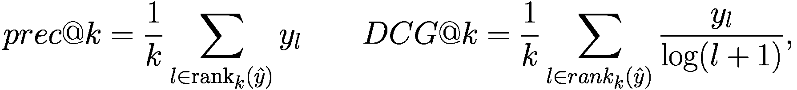(5.1)

其中 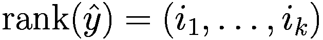 是按降序排列的 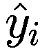 的 *k* 个最大值的索引向量 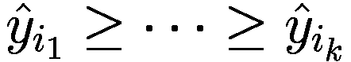 。第二个度量 *DCG@k* 是 *折算累积收益*，其中正确的分配 *y*[*l*] 通过  进行加权，并转换为排名 *l* [14]。这反映了排名较低的分配应该获得较低的权重。此外，还有一个归一化版本 *nDCG@k*，其中 *DCG@k* 被其最大可能值除以。

为每个类别单独训练分类器通常会产生非常高的准确率，但训练和预测时间非常糟糕。在最坏的情况下，这些分类器必须针对每个标签使用所有正实例和所有其他标签的实例作为负样本进行训练。为了减轻这种影响，**Parabel** [83] 基于树集成。首先，Parabel 通过平均属于一个标签的所有实例并归一化这个平均向量到 1 来创建标签表示。然后，递归地应用平衡的 2-means 聚类到标签空间，直到聚类标签树中的所有叶子节点包含少于*M*个标签，例如*M* = 100。对于树的每个内部节点和叶子节点，训练分类器以决定实例遵循的树路径。因此，基于标签表示有效地生成平衡的标签层次结构，使得具有相似输入的标签最终在叶子节点上聚集在一起。最多使用 3 棵这样的树作为集成。

最后，对于每个标签，都训练了 1-vs-All 分类器，作为标签联合概率分布的 MAP 估计。用于训练这些分类器的负样本来自同一叶子中的其他标签，因此使用了最相似或最易混淆的反例。在预测时，在树中执行束搜索，并且只为最可能的*k*个标签执行分类。Parabel 已应用于具有 7M 个标签的问题，并且可以在对数时间内进行预测。Parabel 在训练和预测方面比最先进的极端分类器快得多，同时几乎具有相同的精度。在 EURLex-4K 上，它实现了 81.5 的 prec@1 值，在 Amazon-670k 上实现了 43.9 的 prec@1 值，这比最佳方法的 45.4 要差，但它的预测时间仅为 1/1000。

**AttentionXML** [124] 是一种基于树的分类器，它使用上下文嵌入作为输入特征。通过在许多标签和标记之间建立注意力，AttentionXML 为每个标签表示不同的给定文本。AttentionXML 的架构包括一个词表示层、一个双向 LSTM 层、一个注意力层（从所有标签到编码输入的 BiLSTM，见 1.6）、最后是一个全连接层和一个输出层。

AttentionXML 首先构建一个类似于 Parabel 的深度树。然后，将树压缩成一个浅层且宽的树，这允许处理数百万个类别，特别是对于“尾部标签”，即训练集中只有少数示例的类别 [37]。该模型使用二元交叉熵损失函数。对于每个训练的树级别，该模型使用先前树级别的模型进行初始化。AttentionXML 使用通过微调的标签召回模型采样的负标签来训练标签排名。对于预测，使用树进行束搜索，因此只考虑父节点得分最高的树分支。

在 *EURLex-4K 基准测试* 中，AttentionXML 实现了 *prec@*1 = 87.1% 和 *prec@*5 = 61.9%。这意味着模型得分最高的预测在测试预测中正确率为 87.1%，而在五个最高得分预测中，正确率达到了 61.9%。请注意，*k* 的选择应根据训练集中每个文档的平均标签数量来确定。在包含 679k 个类别的 *Amazon670k 数据集* [60] 上，AttentionXML 实现了 *prec@*1 = 47.6% 和 *prec@*5 = 38.9%。这意味着大约 40% 的替代产品被正确识别。

**LightXML** [39] 使用 Transformer 编码器生成上下文词特征，并为每个类别以动态方式生成负例。首先，基于输入特征创建一组标签簇，以便每个标签属于一个簇。然后，使用类似 RoBERTa (Sect. 3.1.1) 的预训练模型将实例的输入文本编码为上下文嵌入。为了表示训练示例的输入文本，将最后五层中 *[CLS]* 标记的嵌入进行拼接。

一种特定的 *标签召回* 模型旨在使用 *[CLS]* 嵌入作为输入来预测标签簇。此外，*标签排名模型* 接收训练实例的 *[CLS]* 嵌入以及相应的标签。使用标签召回模型动态生成具有其他标签的负例。生成器和判别器的损失项在联合损失函数中结合，允许端到端训练。在 EURLex-4K 基准测试中，LightXML 实现了 *prec@*1 = 87.6% 和 *prec@*5 = 63.4%。在 Amazon670k 基准测试中，它达到了 *prec@*1 = 49.1% 和 *prec@*5 = 39.6%。这两个值略好于 AttentionXML 的值。该方法与 7 个其他多标签数据集上的 7 个替代模型相比也展示了 Sota 性能。

**重叠** [51] 将标签分组到重叠的簇中。例如，在产品分类中，标签“皮带”可以与车辆皮带（在“车辆配件”类别下）或男士皮带（在“服装”类别下）相关联。每个标签现在最多可以出现 *λ* 次，其中 *λ* 是该方法的超参数。作者使用平衡的 *k* 均值聚类初始化他们的分区，然后使用优化方法重新分配标签，以最大化精确率。在 Amazon670k 基准测试中，该模型达到了 *prec@*1 = 50.7% 和 *prec@*5 = 41.6% 的 Sota 值。还有基于树搜索的替代模型，它们能够提高召回率并减少工作量 [22]。

极端多标签分类与文本检索有很强的相似性，这在第 6.1 节中有详细说明。这一组文本应用在近年来取得了很大的进展。对于密集检索，查询和文档表示由 BERT 模型编码，并返回余弦相似度最大的文档。可能许多来自这一领域的方案都可以用于文本分类。

### 5.1.3 少样本和零样本分类

类似于 GPT-2、GPT-3、Gopher 和 PaLM 这样的大型自回归语言模型，通过预训练已经获得了大量关于事实和语言的信息。它们可以通过几个示例来指导对文本进行分类 [76]，如第 3.6.3 节所述。图 5.1 提供了一个通过情感对文本进行分类的示例提示 [91]。这意味着不需要额外的微调数据集，只需要一个包含几个示例的提示。同样，预训练的 Gopher 模型 [85]被应用于大约 150 个基准任务的综合集合，这些任务需要使用少量指令生成答案。与其他自回归模型类似，它可能为文档预测类别标签（第 2.2.5 节）。正如结果所示 [85, p. 56]，Gopher 通常能够优于在特定领域微调的传统 PLM。因此，如果有一个大型自回归 PLM，如 GPT-3、Gopher 或 GPT-Neo，指令分类似乎是一个可行的替代方案！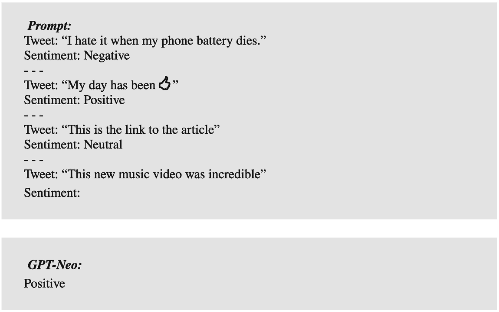

截图包含两个部分，标题分别为“提示”和“G P T Neo”。它包含用于对相应推文进行情感分析的文本输入，其中 G P T Neo 表示积极。

图 5.1

对 GPT-Neo 进行少量指令学习的情感分析查询，GPT-Neo 是具有 27 亿参数的 GPT 免费版本。该查询可以在 API [91] 上进行评估。

最近，*RAFT* [3] 基准测试被发布。RAFT 专门设计用于评估文本分类任务中的少样本性能。它涵盖了 11 个真实世界数据集，其中 8 个是二分类，两个包含三个类别，一个包含 77 个类别。每个任务都附带自然语言指令和 50 个标记的训练示例。一个基准示例是*“根据句子是否与不良药物反应相关进行标注。句子：未发现区域副作用。标注：不相关。…”*。提示包含少于 50 个示例。性能通过 11 个任务的平均 F1 值来衡量。在这些 RAFT 基准测试中，BART 的平均 F1 值为 38.2%，GPT-Neo（2.7B）达到 48.1%，AdaBoost 决策树 51.4%，GPT-3（175B）得分为 62.7%。人类平均 F1 值为 73.5%。

**PET** [90] 要求用户指定一个或多个将输入示例 *x* 转换为 *cloze 提示*（第 2.1.2 节）的模式，以便它可以由 BERT 等掩码语言模型处理。此外，用户必须描述所有输出类的含义。这是通过一个“verbalizer”来完成的，它将自然语言表达式分配给每个输出 *y*。可以为相同的数据指定多个 verbalizer。一个例子是*“我真的很喜欢这部电影。它很棒。”*和*“我真的很喜欢这部电影。问题：这是否是一部积极的影评？答案：…”*，针对文本*“我真的很喜欢这部电影”*。然后 PLM 被训练以最大化观察到的对 *p*(*y*|*x*)。PET 在 RAFT 上实现了平均 F1 值为 82.2%的新纪录，并且在 11 个任务中有 7 个任务的表现接近非专家人类。

基础模型也可以用于为文本分类任务生成新数据。例如，如果需要餐厅分类任务的输入，模型可以被提示为生成特定标签的新餐厅评论（第 3.6.6 节）。这样就可以创建用于微调模型的训练数据。

#### 可用实现

+   许多经典模型如 BigBird、XLNET、T5 的代码和训练参数可在 Hugging Face[`huggingface.co/transformers/`](https://huggingface.co/transformers/)找到。

+   LightXML 模型代码在此处[`github.com/kongds/LightXML`](https://github.com/kongds/LightXML)。

+   PET 的代码可在此处找到[`github.com/timoschick/pet`](https://github.com/timoschick/pet)。

### 5.1.4 摘要

对于文档分类，通常使用在大规模文档集上预训练的 PLM 来解决特定的分类任务。通常，特定标记（如*[CLS]*）的嵌入被用作逻辑分类器的输入。这种设置优于所有之前的词袋模型，如 SVM。像 XLNET 或 ALBERT 这样的专用 PLM 变体由于更有效的预训练而表现出更高的性能。对于较长的文档，像 BigBird 这样的合适模型能取得良好的结果。识别仇恨言论可以被视为一个分类任务，其中使用标准模型如 BERT 和 RoBERTa 可以取得良好的结果。

对于多标签分类的情况则不同，一个文档可能有多个正确的类别。在这种情况下，结合上下文嵌入的树形分类器显示出良好的结果。通过树形结构，可以选出少量候选类别，从而减少训练和执行时间。极端的多标签分类，如将产品描述与相关产品描述匹配，接近文档检索任务，并可以从该领域开发的技术中受益，例如 DPR 的密集检索。

大型预训练的自回归语言模型，如 GPT-3、Gopher 和 PaLM，可以通过少样本学习来指导解决分类任务。最近的方法达到了接近人类的性能。不久前，一个 API 已被发布，允许预训练 GPT-3 并将其适应特定的数据和特定的分类任务（见 3.6.2 节）。一个更简单的替代方案是 InstructGPT，它可以很容易地被指导执行分类，例如情感分析（见 3.6.5 节）。然而，由于模型需要处理训练数据，因此这种方法性能的正式评估尚不可用。

虽然 PLM 在一些要求较高的基准测试中取得了令人鼓舞的结果，但大多数这些模型都是不可解释的。例如，为什么一个模型会得出特定的分类结果？为什么一个模型在一个数据集上优于另一个模型，但在其他数据集上表现较差？尽管注意力和自注意力机制的机制为导致特定结果的相关性提供了一些洞察，但这些模型底层行为和动态的详细研究仍然不足（见 2.4.5 节）。对这些模型理论方面的深入了解将有助于更好地接受这些结果。

## 5.2 词义消歧

几乎在所有语言中，同一个词可能表达不同的概念。例如，单词*“set”*可能是一个动词、形容词或名词，可以解释为“一组事物”、“风景”、“数学概念”、“体育术语”等。WordNet [62] 词汇数据库列出了该词的 45 种不同词义。*词义消歧* (*WSD*) 的目的是区分这些不同的含义并为每个词标注其词义。它可以被视为一个分类任务，其中每个词都被分配到词义库存中的一个词义，例如 WordNet。PLMs 生成的上下文嵌入提供了一种识别这些含义的方法。Bevilacqua 等人 [13] 提供了 WSD 方法的最新综述。

WSD 可以用作多种目的。一个传统应用是搜索，在查询中区分同一个词的不同词义。*词汇替换* [13] 的目的是用一个几乎相同意义的词或短语替换文本中的一个词或短语。

### 5.2.1 词义库存

WSD 显然依赖于词义的界定，这些词义必须分配给单词。英语中 WSD 的主要词义库存是 *WordNet* [62]。它由专家制作的 *synsets* 组成，这些是表示独特概念的同义词集合。一个词可以属于多个 synsets，表示其不同的含义。WordNet 3.0 版本涵盖了 147,306 个单词（或短语）和 117,659 个 synsets。WordNet 还通过 *Open Multilingual WordNet* 项目 [17] 可用于英语以外的语言。*维基百科* 是另一个常用于 *实体链接* (Sect. 5.3.3) 的词义库存，其中代表维基百科页面的个人、概念或实体必须与文本中给定 *提及* 的实体链接。*BabelNet* [71] 是 WordNet、维基百科和几个其他词汇资源的混合体，如 Wiktionary [111] 和 OmegaWiki [75]。它是高度多语言的，覆盖了 500 多种语言。

WordNet 的词义库存通常过于细致。例如，名词 *“star”* 在 WordNet 中有八个含义。指代 *“天体”* 的两个含义仅区分星星是否可见于地球。这两种含义在西班牙语中都被翻译为 *“estrella”*，因此这种词义区分对这个翻译来说是无用的。已经证明，对于许多任务来说，更粗粒度的词义库存更好 [81]。

最好的 WSD 算法使用在大规模文档语料库上预训练的 PLMs。通过微调，它们被训练来从可用的词义库存中分配词义。在某些情况下，使用最近邻操作来测量嵌入之间的距离并确定最合适的词义。

### 5.2.2 模型

**GlossBERT** [33] 采用预训练的 BERT 编码器。其微调输入包括上下文句子（其中单词在特定意义上使用）和 *gloss*（定义单词意义的句子）。GlossBERT 被训练来预测 gloss 是否正确描述了目标单词的使用。*SemCor3.0* [61] 基准数据标注了 WordNet 意义。GlossBERT 在这些数据上实现了 77.0% 的 F1 新 Sota。

**EWISER** [12] 将 WSD 表达为一个简单的 *Word annotation* 任务（第 2.1.3 节），其中每个单词都分配一个意义标签。它从不同上下文中每个单词 *v*[*t*] 的平均 BERT 嵌入开始，并通过一个线性层和 *Swish* [86] 激活函数 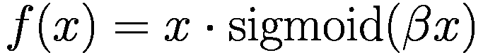 进行转换。对于每个单词和词性的组合，确定一个可能的单词意义和上义词集合 *S*(*v*[*t*])，类似于 [78]。然后该方法计算一个单词属于 *S*(*v*[*t*]) 中的某个同义词集的概率。通过这种方法，预测考虑了单词可能具有的 WordNet 意义。它在 WSD 基准数据的组合上实现了 80.1% 的新 Sota。这个值也是人类标注者之间一致性的估计上限 [69]，表明 WSD 与人类相当。论文列出了许多替代方法的成果。**BEM** 模型 [15] 是一个类似系统，具有可比的准确性。关于 PLMs（尤其是 BERT）如何捕捉词汇歧义的分析可以在 [52] 中找到。作者表明，BERT 的嵌入空间包含了足够的信息来区分词义。

**MuLaN** [9] 基于一个多语言 *synsets* 列表 ，包含不同语言中的同义词集。例如， 可能包含对应于 *“spring”* 的 *“fountain”* 意义的同义词集，该意义用不同的语言表达为 *“Quelle*[*DE*]*”*、*“spring*[*EN*]*”*、*“fountain*[*EN*]*”*、*“manantial*[*ES*]*”*、*“brollador*[*CAT*]*”*、*“source*[*FR*]*”*、*“fonte*[*IT*]*”* 和 *“sorgente*[*IT*]*”*。语义库 *WordNet* [62] 和 *BabelNet* [71] 被用来创建 。MuLaN 的任务是使用源语言（例如英语）的标注语料库 *L*[lab] 作为输入，对目标语言的未标注语料库 *U* 进行意义标注，该语料库标注了来自  的意义。这是通过以下步骤完成的：

+   *创建嵌入*：使用在 104 种语言上训练的多语言 mBERT (Sect. 3.​3.​1) 计算在 *L*[lab] 的上下文 *σ* 中每个单词 *w* 的嵌入 *emb*(*σ*, *w*)。如果 *w* 被分割成多个标记，则使用它们的平均值。如果 *w* 是复合词，则首先计算复合词中每个单词的标记的平均值，然后取单词的平均值作为 *w* 的表示。

+   *候选生成*：然后，对于来自 *L*[lab] 的上下文 *σ* 中具有嵌入 *emb*(*σ*, *w*) 的每个单词 *w*，使用 *FAISS* [40] 确定未标记语料库 *U* 中最近的 1000 个邻居。例如，我们从 *L*[lab] 中的上下文 *τ* = *“Mi hanno consigliato di andare a correre.”* 中选择文本跨度 *v* = *“correre”* 作为实例 *w* = *“running”* 来自句子 *σ* = *“I’ve seen her go running in the park.”* 的最接近候选 *emb*(*τ*, *v*)。

+   *同义词集兼容性*：随后，检查最近的候选词 *v* 是否包含在 *w* 的同义词集中。如果不是，则将其丢弃。

+   *向后兼容性*：最后，确定在 *L*[lab] 的上下文 *τ* 中 *emb*(*τ*, *v*) 的最近邻居。(*τ*, *v*) 只有在其最近邻居列表包含 *w* 时才被保留。

+   *数据集生成*：经过一系列额外的过滤步骤后，对目标语料库 *U* 中的单词进行最终标注。

作为带标签的语料库 *L*[lab]，使用 *SemCor* [63] 和 *WordNet Glos Corpus* (*WNG*) [46] 的并集，这些语料库都标注了词义。作为未标记语料库 *U*，使用维基百科进行意大利语、法语、西班牙语和德语的标注。在 *SemEval-13* [70] 和 *SemEval-15* [66] 上进行测试时，MuLaN 是标注四语言词义的最好系统，其 F1 值均超过 80%。MuLaN 的重要优势在于，它能够将高资源语言的词义标注转移到低资源语言。

**埃舍尔** [8] 将 WSD 重新表述为跨度预测问题。模型的输入是一个包含目标词及其所有可能词义的句子。输出是一个文本跨度，标识表达目标词最合适意义的释义。例如，考虑图 5.2 中的输入句子 *“<s> The bully had to <t> back down </t>. </s>

各种目标单词、转换器、用于跨度开始和结束的 2 个逻辑回归模型以及跨度块的流程图。

图 5.2

Escher [8] 将一个句子作为输入，其中目标词 *“back down”* 被括号 *“<t>”* 和 *“</t>”* 包围。通过跨度预测选择的句子指示了目标词最可能的意义。跨度开始的高概率由 *“[”* 表示，跨度结束的高概率由 *“]”* 表示。

与第 2.1.3 节类似，通过分别计算覆盖正确 gloss 的跨度中第一个和最后一个标记的概率来预测跨度。在示例中，句子 *“从某个位置后退。”* 被选为跨度，它描述了正确的意义。通过降低一个词最频繁意义的前验概率，该方法能够减少最频繁意义偏差。Escher 使用 BART[LARGE]（第 3.1.3 节）作为 PLM 架构，因为它对阅读理解有效。其最后一个解码层的输出用于表示输入标记，并计算开始和结束标记分布。在多个 SemEval 数据集 [66] 上，与竞争对手相比，Escher 的 F1 分数更高，这种差异在统计学上非常显著。对于名词和形容词，实现了最佳结果，F1 值超过 83%，而对于动词，F1 值仅为 69.3%。

**ConSec** [10] 通过考虑不仅上下文单词，还包括邻近单词分配的意义来确定一个标记的意义。它基于 DeBERTa 的扩展，DeBERTa 是一个性能优越的 BERT 变体（第 3.1.1 节）。ConSec 使用带有标注意义（glosses）的 WordNet 示例句子作为额外的训练数据。当应用于 *SemCor3.0* 基准测试 [61] 时，该方法实现了 83.2% 的 F1 值。

#### 可用实现

+   GlossBERT 和 EWISER 的代码以及训练好的模型可用于多种不同的语言 [`github.com/HSLCY/GlossBERT`](https://github.com/HSLCY/GlossBERT)[`github.com/SapienzaNLP/ewiser`](https://github.com/SapienzaNLP/ewiser)。

+   Escher 以及必要的训练数据可在 [`github.com/SapienzaNLP/esc`](https://github.com/SapienzaNLP/esc) 获取。

### 5.2.3 摘要

WSD 可以被处理为一个分类任务，其中每个词被分配到多个可能的意义类别。通常使用 WordNet 作为意义库存。GlossBERT 比较一个词的上下文嵌入与 WordNet 中示例句子（gloss）中该词的嵌入。EWISER 和 MULAN 直接在 WordNet 的同义词集中工作，并捕获可能的意义和上位的集合。它们能够用 F1 值超过 80% 的准确率对四种语言的意义进行标注。Escher 将 WSD 重新表述为一个跨度预测问题，将 F1 值提高到 83%。ConSec 考虑到附近标记的意义，实现了相似的性能。

随着 WSD 模型变得更好，需要更多要求的基准数据集，这些数据集可能可以通过对抗技术生成。此外，存在一种趋势，即 WSD 模型对领域变化的鲁棒性更强，可以处理来自社交媒体文档的文本。为了推进 WSD，有必要扩展标注的语义数据，特别是对于罕见语义。此外，可以构建需要大规模多语言 WSD 基准的多语言 WSD 系统。在 WSD 中存在一种趋势，即放弃固定的语义库存，并以其他方式区分语义，例如，在词汇替换任务中或通过在特定上下文中生成一个词的定义。

机会是将词义消歧（WSD）与实体链接（第 5.3.3 节）集成，其中模型需要将提及与知识库（如维基百科）中的条目关联起来。由于 WSD 系统现在工作得相当好，因此可以将它们与其他应用程序（如问答或对话系统）结合使用。必须测试是否显式包含 WSD 能够产生更好的结果。对于检索任务，基于嵌入的方法（第 6.1 节）已经取代了 WSD，这些方法提供了更好的命中率。

## 5.3 命名实体识别

*命名实体识别* (*NER*) 指的是标记文本中*提及*的*命名实体*的任务，例如人名、组织机构和地点。NER 的标注数据集存在于许多领域，例如新闻、科学和医学 [72]。通常这些数据集以 *IOB2 格式* 进行标注，例如，将人的第一个标记标注为 B-per，并将该实体的所有其他标记标注为 I-per。O 标签用于实体提及之外的所有标记。例如，“*U.N.*[*B-org*]*official*[*O*]*Peter*[*B-per*]*Ekeus*[*I-per*]*heads*[*O*]*for*[*O*]*Bagdad*[*B-loc*].*” NER 涉及预测每个标记的这些标签，即先前的例子中的后缀。因此，它可以被认为是一个分类任务，其中每个标记都分配一个标签。NER 的标准数据集是 CoNLL-2003 数据集 [89]，它包含带有对人物、组织机构、地点和杂项名称的标注的英语或德语新闻文本。NER 的调查由 Li 等人 [48]、Nasar 等人 [68] 和 Bose 等人 [18] 提供。

命名实体识别（NER）在具有高度专业词汇的领域中特别有用。例如，医疗保健或电动汽车领域，每年都会发布成千上万篇出版物。由于很少有专家理解这些术语，因此 NER 系统在识别专门主题的出版物方面特别有价值。当然，NER 类型必须适应每个领域。

在下一节中，我们介绍了普通 NER 的方法，其中每个单词可以有一个单一的实体类型。命名实体也可以嵌套，例如*“[[英国]*[*gpe*]*驻[法国]*[*gpe*]*[*设施*]*”*。这种情况将在第二节中讨论。更具挑战性的是将命名实体短语映射到知识库或本体中基础唯一的实体，例如，一个人。这被称为实体链接，并在第三节中讨论。

### 5.3.1 平坦命名实体识别

在*平坦命名实体识别*中，每个标记最多对应一个命名实体。**BERT**可以通过使用逻辑分类器（如图 2.5）预测每个标记的标签来微调到 NER，作为最后一层。对于这种设置，BERT[LARGE]在 CoNLL-2003 测试数据上达到了 92.8%的 F1 值。虽然人名和地点的 F1 值更高（≈95%），但杂项名称的 F1 值（78%）要低得多，因为这些实体构成一个定义模糊的类别。

**LUKE** [117] 将给定文本中的单词和实体视为独立对象，并输出标记和实体的上下文嵌入。该模型基于 RoBERTa，并在从维基百科中提取的大量实体标注语料库上训练，以预测随机遮蔽的单词和实体。通过这种方式，它获得了关于文本中实体之间关系的大量信息。它包含一个实体感知的自注意力机制，这是 BERT 自注意力机制的扩展，并考虑了指示一个标记是否代表文本或实体的嵌入。它在 CoNLL-2003 上产生了 94.3-F1 的 F1 值，接近 Sota。

**ACE** [106] 建立在加权求和 ∑[*i* ∈ *I*]*A*[*i*] ∗ *emb*(*v*[*i*]) 的假设之上，不同的标记 *v*[*i*] 的嵌入 *emb*(*v*[*i*]) 的加权求和比单个嵌入产生更好的结果。控制器从一个包含八个嵌入（例如 BERT[BASE]、GloVe、fastText 等）的集合中采样一个子集 *I*，并训练一个 NER 模型，返回一个准确度分数。在强化设置中，使用策略梯度算法([112])将准确度作为奖励信号来选择最优子集 *I*。作为 NER 模型，选择了一个带有最终 CRF 层的 BiLSTM 模型（第 1.6 节）。CRF（条件随机场）[100] 能够详细地模拟标签之间的概率关系。微调后的模型在 CoNLL-2003 上达到了 94.6%的 Sota F1 分数。

**KeBioLM** [126]是一个生物医学预训练语言模型，旨在通过包含额外的知识来提高 NER。作者从包含生物医学文献摘要的*PubMed 语料库*[73]中提取了 6600 万个实体，并将它们链接到包含超过 400 万个实体及其同义词以及关系的 UMLS 知识库。他们在 PubMed 数据上训练了一个 BERT 变体，并明确地为实体生成嵌入。通过 TransE 机制（第 3.4.1 节）包含关系信息。联合损失函数是掩码语言建模、实体检测和实体链接损失函数的混合。*JNLPBA 基准*包含 2000 篇与分子生物学相关的 PubMed 摘要。KeBioLM 在 JNLPBA 上达到了 82.0%的 F1 Sota。这表明在领域文本上进行预训练和包含额外知识可以提高 NER 结果。

*检索*是增强 PLM 可能用于 NER 的上下文的一种方法。Wang 等人[107]使用应被标记的输入文本查询搜索引擎。他们根据 RoBERTa 嵌入的相似性对返回的结果进行排序（第 3.4.5 节），并将排名靠前的结果和输入文本连接起来。这些结果被输入到一个 RoBERTa 变体中，以生成标记嵌入。由于模型可以利用对检索文本的注意力，生成的嵌入可能更具表达性。在 CoNLL 2003 上的结果表明，检索可以将 F1 值提高约 0.5%，并且可以与当前 Sota 模型结合使用。

### 5.3.2 嵌套命名实体识别

常见的命名实体具有内部结构。这类*嵌套实体*的例子是句子*“昨晚，中国[*gpe*]在[*gpe*]法国[*facility*]的大使馆[*gpe*]关闭了。”*在这种情况下，一个单独的标记可能包含多个实体标签，NER 任务必须以不同的方式制定。

**MRC** [50]将嵌套 NER 视为问答任务。例如，提取带有“位置”标签的实体被形式化为问题：“文本中提到了哪些位置？”这些问题使用反映注释指南的模板来制定。当为每种实体类型回答这些问题时，可以检测到重叠的命名实体。MRC 使用 BERT 的跨度预测方法（第 2.1.3 节）在标记序列中标记实体类型的开始和结束跨度。此外，MRC 预测每个实体的开始和结束，以允许存在相同类型的重叠实体。

在医学领域，嵌套实体很常见。*Genia 语料库* [43] 包含蛋白质、病毒、DNA、RNA 等实体的标注，其中 17%的实体是嵌套的。MRC 在 Genia 基准测试上达到了 83.8%的 F1 分数。ACE-2005 基准测试 [104] 包含了 22%重叠的多种嵌套实体，如人物、设施或车辆。MRC 在 ACE-2005 上达到了 86.9%的 F1 分数。一种类似的方法 [125] 也预测了不同实体的跨度，并在 ACE-2005 上获得了 85.4%的分数。Shen 等人[93]提出了一种名为“定位和标注”的两阶段算法，他们首先提取候选实体，然后在第二步中对其进行分类。他们使用 BERT 或其变体在 ACE-2005 的嵌套 NER 上获得了 86.7%的分数。

与使用在通用文档上预训练的 BERT 模型不同，**PubMedBERT** [102] 使用 PubMed 中 21GB 医学文本的 100M 参数专门预训练其 BERT 模型。PubMedBERT 在*BLURB 基准测试* [31] 上实现了 86.3%的 F1 分数。该模型在分类和关系抽取等其他任务上也取得了 Sota 分数，平均得分为 82.9%。这一结果强烈支持在特定领域数据上预训练。**BioELECTRA** [42] 是一个针对生物医学领域的特定领域语言编码器模型，它将 ELECTRA（第 3.1.1 节）应用于生物医学领域。ELECTRA 采用高效的“替换标记检测”技术进行预训练，这使得模型能够包含来自训练数据的大量信息。BioELECTRA 在 PubMed 和 PubMed Central 全文医学文章上进行了预训练。对于 NER，它在 BLURB 基准测试上达到了 86.7%的 F1 分数。该模型在其他 BLURB 任务上也获得了与 PubMedBERT 相似的 82.6%的分数。

#### 可用实现

+   BERT[LARGE]用于标记分类[`huggingface.co/transformers/model_doc/model_doc/bert.html`](https://huggingface.co/transformers/model_doc/model_doc/bert.html),

+   Luke [`huggingface.co/transformers/model_doc/model_doc/luke.html`](https://huggingface.co/transformers/model_doc/model_doc/luke.html)

+   ACE [`github.com/Alibaba-NLP/ACE`](https://github.com/Alibaba-NLP/ACE),

+   MRC [`github.com/ShannonAI/mrc-for-flat-nested-ner`](https://github.com/ShannonAI/mrc-for-flat-nested-ner)

+   定位和标注 [93] [`github.com/tricktreat/locate-and-label`](https://github.com/tricktreat/locate-and-label)

+   Bioelectra 用于嵌套 NER [`github.com/kamalkraj/BioELECTRA`](https://github.com/kamalkraj/BioELECTRA)

### 5.3.3 实体链接

在识别文本中的一个命名实体（*实体提及*）之后，人们通常希望对其进行消歧，即把提及分配给知识库或本体中的一个唯一实体。这涉及到统一一个实体名称的不同写法。为了将相应的事实和关系附加到同一实体上，链接名称的不同写法非常重要，例如，“乔·拜登被选为美国第 46 任总统”和“拜登总统出生于宾夕法尼亚州的斯克兰顿”。请注意，对于“穆阿迈尔·穆罕默德·阿卜杜勒-卡德尔·卡扎菲”这个名字，存在大约 35 种不同的写法，例如“卡扎菲”、“加达菲”和“加达菲”，以及不同名字版本。*实体链接*方法旨在解决这个问题。

实体链接对于知识库构建、聊天机器人、推荐系统和问答等任务非常有用，用于识别正确的对象或实体。它也是需要实体身份的模型（如 KnowBERT [80] 或 ERNIE [99]（第 3.4.1 节））预处理步骤所必需的。早期方法依赖于语义嵌入来匹配属于同一组的实体提及[82]。现代程序使用上下文嵌入来描述实体提及。Sevgili 等人[92]提供了一篇基于深度学习的实体链接方法的全面综述。他们概述了实体链接方法的通用解决方案架构，如图 5.3 所示，并比较了不同的方法。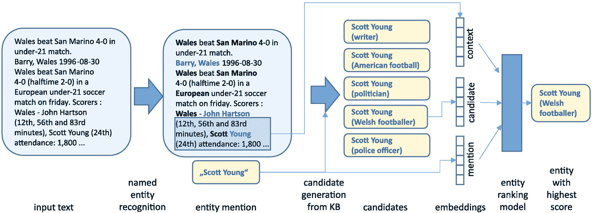

各种实体的框图包括以下步骤：输入文本、命名实体识别、实体提及、从知识库生成候选实体、候选实体、嵌入、实体排名模型和得分最高的实体。

图 5.3

实体链接包括三个步骤：实体识别，用于识别文本中的实体提及；候选生成，使用知识库生成可能的实体；以及实体排名，计算候选实体与提及之间的相似度分数。图像改编自[92]，经作者同意重印

**BLINK** [113] 遵循图 5.3 的方案。首先，通过命名实体识别（NER）从文本中提取实体提及及其类型。然后，它使用 BERT 模型计算提及上下文和 KB 中实体描述的嵌入。这也涉及到实体名称的归一化。使用高效的近似 *k* 近邻索引方案 FAISS [40] 对嵌入进行索引（见第 6.1.4 节）。FAISS 能够以很小的计算成本从 KB 中检索最佳匹配的实体候选者。这种方法与 DPR（见第 3.4.5 节）的密集检索方法相同。然后，使用一个交叉编码器仔细检查检索到的每个候选者，该编码器将输入上下文、提及和实体文本连接起来，并为每个候选实体分配一个分数。最后，选择得分最高的候选者。尽管没有显式计算实体嵌入，但该方法在 *TACKBP-2010 基准测试* [29] 上实现了 94.5% 的准确率，达到了 Sota。**EntQA** [130] 也选择了一个非常类似的方法，它也利用了检索器-阅读器架构，并在多个基准测试上取得了有竞争力的结果。

**类型** [25] 与大多数实体链接方法的常见解决方案架构不同，GENRE 使用编码器-解码器模型 BART（见第 3.1.3 节）来消歧实体。该模型在预训练期间必须恢复由多种不同方法损坏的文本，因此积累了大量关于语言的知识。该模型经过微调以生成消歧的命名实体。例如，句子 *“在 1503 年，达芬奇开始绘制蒙娜丽莎。”* 被翻译为 *“在 1503 年，达芬奇 开始绘制 蒙娜丽莎。”*，其中 *“达芬奇”* 和 *“蒙娜丽莎”* 是维基百科中相应文章的唯一标题。GENRE 使用约束的 BEAM 搜索进行解码，要么复制输入文本，要么生成独特的维基百科实体名称。此外，GENRE 可以通过将提及与相应的 KB 实体（例如维基百科文章）关联来执行提及检测和端到端实体链接。在六个不同的基准测试中，GENRE 实现了平均 F1 值为 88.8%，超过了得分为 77.0% 的 BLINK。此外，GENRE 的内存占用（2.1 GB）比 BLINK（30.1 GB）小。最后，该模型倾向于精确复制提及，这对于新的、未见过的命名实体是有帮助的。

**EntMask** [118] 与 LUKE（第 3.4.4 节）类似，学习预测被掩码的实体。为了区分新的提及，作者们使用基于单词的局部上下文信息和基于已区分实体的全局上下文信息。他们的模型被训练以联合生成单词和实体的嵌入，并且也基于 BERT[LARGE]。为了微调，对应维基百科超链接的 30%实体被随机掩码并需要预测，如图 5.4 所示。在应用过程中，模型为每个提及预测一个实体，并从未解决的提及中实际分配概率最高的提及作为“观察到的”。这样，这种分配可以影响剩余提及的预测，引入全局视角。在多个基准测试中，该方法在几个基准测试上略优于 GENRE，其他基准测试结果大致相似！

流程图以文本标记和具有标记类型的唯一 K B 实体为输入，与输入嵌入、具有自注意力的自动编码器、输出嵌入、2 层逻辑分类器和实体概率相连接，以给出正确的实体。

图 5.4

BERT[LARGE]可以微调以预测掩码的“实体标记”，同时考虑相应的文本。在应用过程中，依次分配概率最高的实体。这样，可以利用实体的联合概率 [118]

#### 可用实现

+   GENRE：来自 Facebook 的模型源代码和数据集 [`github.com/facebookresearch/GENRE`](https://github.com/facebookresearch/GENRE)

+   BLINK 可在[`github.com/facebookresearch/BLINK`](https://github.com/facebookresearch/BLINK)获取

+   EntMask 代码：[`github.com/studio-ousia/luke`](https://github.com/studio-ousia/luke).

### 5.3.4 摘要

众所周知，命名实体在理解文本的意义中起着至关重要的作用。每天都有成千上万的新的命名实体出现，需要特别努力来解释它们的含义。由于 PLM 中存在上下文嵌入，命名实体识别（NER）可以将 CoNLL 2003 基准测试的 F1 值从 85%提高到 94.6%，显著减少错误。标准方法是 BERT 的标记注释，它将每个标记标记为其对应的实体类型。通过将命名实体视为特殊标记（LUKE）、结合不同类型的嵌入（ACE）或使用基于嵌入的检索方法，可以实现更高的性能。经验评估表明，在领域文本上训练底层 PLM（例如来自医学领域的文本）极为重要。单个标记或复合词可以同时属于多个实体类型。为此，可以使用嵌套 NER 问答方法来标记标记跨度属于实体类型。再次强调，在领域文本上进行训练是至关重要的。

在第 5.4.4 节中介绍了联合实体和关系提取的方法。那里描述的方法也可以单独用于命名实体识别（NER），并承诺有高性能。一个例子是 REBEL，它使用 BART 编码器-解码器将输入句子翻译成覆盖实体和关系的独特表示。

实体链接旨在将实体提及映射到知识库中的底层唯一实体。一种方法利用检索器-阅读器架构从知识库中找到实体候选者（BLINK，EntQA）。随后，阅读器模块仔细审查候选者和提及，以得出最终分配。另一种方法是 GENRE 的编码器-解码器架构，它将实体提及翻译成唯一实体名称。最后，BERT 模型可以确定标记嵌入和实体嵌入之间的自注意力，并利用这一点来预测文本中包含的唯一实体。

大多数实体链接模型仍然依赖于外部知识，如维基百科，用于候选生成步骤。然而，在识别非名人时，这并不足够。在这种情况下，我们必须在网络上或社交媒体上进行搜索以找到信息。随着检索器-阅读器方法越来越受欢迎，这可能在将来成为可能。结果证明，命名实体识别（NER）和实体链接应该联合进行，即分配应考虑彼此以提高准确性。

## 5.4 关系提取

在识别句子中的相关实体之后，信息提取的一个关键部分通常是提取和分类这些实体之间的关系。这在例如我们想要自动填充数据库或知识图谱时非常有用。表 5.3 包含了本节讨论的基于关系抽取的语言分析任务示例。实例包括核实指代，即在同一文本中找到实体的不同提及，基于方面的情感分析，它将文本中的短语与关于它们的意见联系起来，或者语义角色标注，它识别句子中谓词的短语功能。由于实体链接将实体提及与本体中基础唯一的对象或人关联起来，它不同于关系抽取。Nasar 等人提供了一篇关于关系抽取先前工作的调查 [68]。

### 5.4.1 核实指代

关系抽取的第一种类型是 *核实指代*，其目标是建立文本中所有指代同一现实世界实体的实体提及之间的关系。例如，考虑以下句子 *“我投票给了拜登，因为他与我价值观最相符”，她说*，其中 *“我”*、*“我的”* 和 *“她”* 指的是说话者，而 *“拜登”* 和 *“他”* 指的是乔·拜登。由于相关短语子集的组合数量是组合数，核实指代分析是自然语言处理中最具挑战性的任务之一。Stylianou 等人提供了一篇关于核实指代调查的论文 [98]。

**SpanBERT** [41] 是 BERT 的一种版本，它在预训练过程中预测被掩码的连续子序列，因此积累了关于词语片段的知识（见第 3.1.1 节）。作者考虑了所有可能的文本片段，并识别出相关的指代片段。同时，对于每个片段 *x*，会检查其前面的片段 *y*，并通过评分函数估计这些片段是否指代同一实体。

这个评分函数定义为 *s*(*x*, *y*) = *s**m* + *s**m* + *s**c*。其中 *s**m* 和 *s**m* 测量 *x* 和 *y* 作为实体提及的可能性。*s**c* 确定 x 和 y 是否指向同一实体的可能性。作为跨度输入，评分函数获取两个跨度端点的输出嵌入以及跨度标记嵌入的摘要。*y* 是 *x* 的同指概率计算为 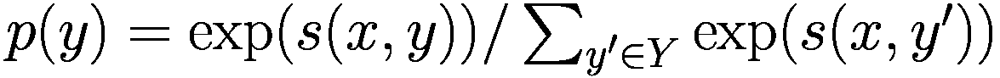。这样，提及同一实体的跨度子集就形成了。在方法的迭代过程中，跨度定义可能会被细化，并应用一个先行词剪枝机制来减少需要考虑的跨度数量。*OntoNotes* [109] 是一个包含 1.5M 个单词的语料库，包括各种文本类型的结构化信息，例如指代。在 OntoNotes 上微调后，Span-BERT 在测试集上实现了 79.6% 的 Sota F1 值。Dobrovolskii [27] 提出了一种变体，它在词级别进行其分析，从而降低了任务的复杂性。它将 OntoNotes 上的 Sota 提高到 81.0%。

**CorefQA** [114] 将指代消解问题作为问答问题来解决。第一阶段考虑所有长度不超过最大长度的跨度作为潜在的提及。作者使用 SpanBERT 模型计算所有标记的嵌入。为了减少提及的数量，一个结合跨度起始和结束嵌入的提案模块被预训练来预测相关提及。随后，每个提及依次被特殊标记包围，网络被训练来标记所有与 BERT 问答微调类似的核心跨度（Sect. 2.1.3）。为了减少计算量，只考虑一个方向的一小部分候选者。提及提案和提及聚类可以端到端训练。在核心指代基准 CoNLL 2012 [84] 上，这种方法将 Sota 提高到 83.1% 的 F1 值。Toshniwal 等人 [103] 通过同时跟踪少量有限数量的实体来扩展这种方法。这种方法即使在长文档中也能在指代消解中达到高精度。

#### 可用实现

+   在 GitHub 上用于关系抽取和指代消解的 SpanBERT [`github.com/facebookresearch/SpanBERT`](https://github.com/facebookresearch/SpanBERT)

+   CorefQA at GitHub [`github.com/ShannonAI/CorefQA`](https://github.com/ShannonAI/CorefQA)

### 5.4.2 句级关系抽取

可以提取各种类型的关系，例如，在句子 *“歌德在魏玛忍受了他的痛苦。”* 中，*“died-in”* 关系将一个人 (*“歌德”*) 与一个地点 (*“魏玛”*) 相关联。在本节中，我们假设实体已经通过 NER（第 5.3 节）从句子中提取出来。因此，NER 错误会增加关系提取的错误。

**SpanBERT** [41] 特别适合于关系提取，因为实体提及通常跨越多个标记，并且在预训练期间被 SpanBERT 掩码（第 3.1.1 节）。在微调模型时，模型接收一个句子和两个可能的关系论元跨度的输入，这些跨度被它们的 NER 标签替换。一个例子是 *“[CLS] [SUBJ-PER] 出生在 [OBJ-LOC] 密歇根，……”*。最终的 [CLS] 嵌入被输入到一个逻辑分类器，该分类器预测 42 个预定义的关系类型之一，包括“无关系”。*Re-TACRED* [97] 是一个包含 120k 个示例的大型关系提取数据集，涵盖了 41 种关系类型（例如，per:schools-attended 和 org:members）以及仔细检查的关系注释。SpanBERT 在 Re-TACRED 上表现良好，F1 值为 85.3% [95]。

**RoBERTa** (第 3.1.1 节) 可以用于生成关系提取的标记嵌入。周等人 [135] 评估了各种实体表示技术。他们使用 RoBERTa[LARGE] 通过最后一层的嵌入来编码输入文本。每个关系论元跨度的第一个标记的嵌入用于表示这些论元。这些嵌入被连接起来，并作为 softmax 分类器的输入。结果表明，使用特殊标记包围实体并添加其实体类型在 Re-TACRED 数据集上取得了最佳结果，F1 值为 91.1%。

**Relation-QA** [24] 将关系分类问题重新表述为一个问答问题。考虑句子 *s* = *“Sam Brown 出生于 1991 年。”* 中提取的实体 *“Sam Brown”* 和 *“1991”*。然后作者创建了两个查询，例如 *“Sam Brown 出生于什么时候？”* 和 *“谁在 1991 年出生？”*。他们微调 ALBERT（第 3.1.1 节）来通过标记包含所需实体的跨度来回答这些查询。如果没有返回跨度，则关系不存在。该方法在 TACRED 上实现了 74.8% 的 F1 值，这是一个带有许多注释问题的 ReTACRED 的旧版本。**最近** [55] 扩展了 SpanBERT 并训练了多个关系分类模型，即每个不同实体类型对都有一个分类器。这限制了可能的输出关系类型，有助于提高性能。在 TACRED 上，该方法实现了 75.2% 的 Sota F1 值。

### 5.4.3 文档级关系提取

尤其对于较大的文档，假设关系仅发生在句子内部这一假设过于严格。因此，一些模型在文档级别检查关系。当关系论据位于不同句子时，相应的实体通常仅通过共指提及来引用。因此，在本节中，我们假设实体已经被提取并分组为通过共指消解（Sect. 5.4.1）表示相同实体的簇。显然，共指消解的错误会增加最终的实体关系提取错误。

**SSAN** [115]（结构化自注意力网络）直接考虑了结构信息，如共指和实体提及的共现，对于 RoBERTa 等预训练语言模型。作者通过添加特定偏差修改了编码块中的自注意力计算，如果两个提及指向同一实体并且/或者位于同一句子中。这些偏差是通过在微调期间训练的“转换模型”从查询和键向量计算得出的。因此，键和查询之间的标量积根据相应的标记是否共指、位于同一句子中或不是而修改。通过平均池化实体提及的标记嵌入来获得实体嵌入。对于每个实体嵌入对 *emb*[*i*]，*emb*[*j*]，通过一个具有可训练参数矩阵 *W*[*r*] 的双线性变换  计算关系 *r* 的概率。

*DocRED* [121] 是一个大型基准，其中包含带有命名实体、共指和关系的文档，其论据可能位于不同的句子中。使用 RoBERTa[LARGE] 作为基础网络，作者在 DocRED 上实现了 65.9% 的 Sota F1。使用在 Semantic Scholar 上的科学论文训练的特殊 BERT 版本 SciBERT [11]，该算法在化学和生物文本的基准测试中也实现了 Sota 结果。

**ATLOP** [136] 通过特殊标记标记提及的开始和结束，并使用 BERT 对文档进行编码，从而为每个标记生成嵌入。提及开始的标记嵌入用作提及嵌入。通过池化共指提及来计算实体嵌入。关系的第一和第二个论据实体嵌入通过不同的全连接层转换为 ***x***[1] 和 ***x***[2]。随后，通过稀疏双线性变换 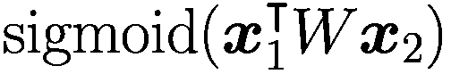 估计实体对的一个关系 *r* 的概率。使用可训练的概率阈值来决定关系是否成立。在 DocRED 基准测试中，该模型实现了 63.4% 的 F1 值。

### 5.4.4 联合实体和关系抽取

由于命名实体识别（NER）和关系抽取是紧密相关的任务，且关系抽取依赖于 NER 的结果，因此将这些任务联合建模是一个自然的选择。

**UniRE** [108] 在一个联合矩阵中编码实体和关系属性，该矩阵为每个文本标记有一个行和一个列。例如，命名实体（如 PER）在对角线上标记，而关系则位于非对角线上的矩阵条目。例如，如果 *“David Perkins”* 住在 *“California”*，则 *“David Perkins”* 标记的行和 *“California”* 标记的列上的矩阵条目将标记为 *PHY* *S* 关系。请注意，通过这种方式可以指定非对称关系。

输入中的所有单词都使用 BERT 编码器进行编码，然后使用双亲和模型为嵌入对 *h*[*i*] 和 *h*[*j*] 创建评分向量！$$\displaystyle \begin{aligned} p(y_{i,j}|s) = \operatorname{\mathrm{softmax}}\left( ({\boldsymbol{h}}_i^{first})^\intercal U_1 {\boldsymbol{h}}_j^{sec} + U_2 \lbrack{\boldsymbol{h}}_i^{first},{\boldsymbol{h}}_j^{sec}\rbrack +b \right), \end{aligned} $$(5.2)其中 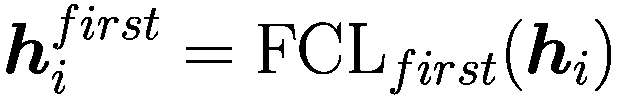 和 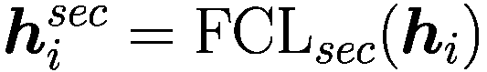 分别是第一和第二关系参数的完全连接层变换。softmax 函数为所有矩阵单元的实体和关系标签获得一个概率分布。该模型最小化三个损失，一个基于每个单元的实际标签，一个基于实体标签对角线应该是对称的知识，一个基于关系标签意味着相应的实体标签必须存在的实际情况。*ACE 2005* [104] 包含各种类型文本的实体、关系和事件标注。在 ACE 2005 UniRE 中，联合实体和关系提取的 F1 值为 66.0%，低于当前 Sota 的 70.5%。**PL-Marker** [122] 研究不同类型的提及编码。对于一个可能的关系，它用实心标记标记包围第一个参数跨度（主语）。可能的第二个参数跨度（宾语）在文本外部用*leviated tokens**Oi* 和 ∕*Oi* 标记。这些获得与文本中相应宾语跨度相同的位置嵌入。它们的注意力连接受到限制，即它们彼此可见，但不能看到文本标记和其他标记对。因此，根据主语跨度，宾语标记嵌入可以捕捉不同的方面。对于每个主语-宾语参数对，相应的嵌入被连接起来，并用作逻辑分类器的输入，以估计可能关系的概率（或“无关系”）。使用 ACE 2005 对预训练的 BERT 变体进行微调以预测关系。使用 105M 参数的 BERT[BASE]模型，该方法在 ACE05 基准测试上实现了 68.8%的 F1 值。如果使用 235M 参数的 ALBERT[XXLARGE] [45] 来计算嵌入，F1 分数将增长到 72.3%。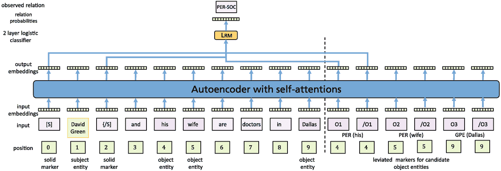

输入标记及其位置的流程图，与输入嵌入、具有自注意力的自动编码器、输出嵌入、2 层逻辑分类器以及关系概率相关联，以给出观察到的关系。

图 5.5

对于可能的关系，PL 标记模型通过特殊的“实心”标记标记第一个关系论元，并通过文本外的“轻化”标记标记可能的第二个论元。后者获得与相应标记相同的位臵，并且在注意力计算期间不影响正常标记的嵌入。标记嵌入被连接起来以计算相应关系的概率 [122]。

对于命名实体识别（NER），PL-Marker 模型采用类似的方法。对于输入中从标记 *v*[*i*] 开始并结束于标记 *v*[*j*]（*j*≥*i*）的每个可能跨度，创建轻化标记，这些标记不影响正常标记的嵌入。同样，跨度的起始和结束标记的嵌入以及轻化标记的嵌入被输入到一个逻辑分类器中，该分类器计算不同命名实体类型的概率。该模型使用高效的“打包”方法来减少计算工作量。在 CoNLL03 命名实体基准测试中，使用预训练的 RoBERTa[LARGE] 的 PL 标记实现了 94.0 的 F1 值，这远低于目前由 DeBERTa 保持的 96.1% 的当前 Sota。当关系提取使用 PL-MARKER NER 预测的实体类型和跨度时，联合方法的 F1 值下降到 70.5%，这是 ACE05 基准测试在联合 NER 和关系提取方面的 Sota。

**REBEL** [20] 使用编码器-解码器转换器 BART[LARGE]（第 3.1.3 节）进行联合实体和关系提取，该提取器输出输入文本中存在的每个关系 (*h*, *r*, *t*) 三联组。它将包含实体的原始输入句子及其之间的隐含关系翻译成一组三联组，这些三联组明确指出了那些关系。一个例子显示在图 5.6 中。文本中的每个关系都根据其第一个论元的位臵出现在输出中。一个实体可能是不同关系的组成部分，这些关系按照第二个论元的位臵进行排序。这定义了线性表示中关系的顺序。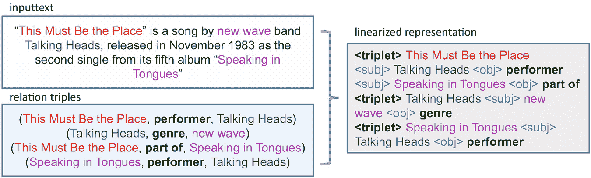

输入文本和关系三联组的框图给出了新潮乐队 talking heads 从专辑 speaking in tongues 中歌曲 titled this must be the place 的线性表示。

图 5.6

对于训练集，左侧的关系信息被线性化到右侧的表示中。因此，REBEL 模型学习将输入文本翻译成这种线性表示 [20]。

预训练的 BART[LARGE] 模型，参数量为 400M，首先在包含 220 种关系的维基百科和 WikiData 训练集上进行微调。然后，它在不同的基准数据集上进行了第二次微调。在 *DocRED 基准* [121] 上，它实现了 Sota，F 值为 47.1%。在 *纽约时报数据集* 上，它实现了 93.4% 的 Sota F1 性能。在 ReTACRED 基准上，它在不包含其他方法使用的实体类型标记的情况下，产生了 90.4% 的 F1。

#### 基于方面的情感分析

*基于方面的情感分析*，也称为方面级情感分析、基于特征的情感分析，或简称为方面情感分析，允许组织对其成员或客户反馈数据进行详细分析。这包括从分析餐厅顾客的反应到评估政治家对政治声明的态度。例如，“*服务员*[*1-方面*]非常友好*[*1-正面*]，但*牛排*[*2-方面*]烧得非常严重*[*2-负面*]。”* 注意，一个句子可能包含不同的方面，每个情感必须分配给一个方面。张等人提供了一篇关于基于方面情感分析的最近调查[129]。

**DeBERTa**（第 3.1.1 节）是一个强大的类似 BERT 的模型，它假设方面已经已知。它采用解耦注意力机制来计算单词和位置之间的单独注意力分数，解耦文本数据的语义（内容）和句法（位置）表示。目标是确定给定实体的每个方面的情感。输入包括一个文本和一个方面，例如 *x* = *“[CLS] …好的视频摄像头和键盘 …[SEP] 键盘 [SEP]”*，其中 *“键盘”* 是文本中的一个可能的方面跨度 [94]。*[CLS]* 的输出嵌入被用作逻辑分类器的输入，该分类器生成三个可能标签（正面、负面、中性）的概率。该模型在 *SemEval 2014 任务 4.2 基准* 上进行微调。它在餐厅和笔记本电脑数据上实现了 86.1% 的平均准确率。还有许多更复杂的方法，如 **LSA**（局部情感聚合）[119]，在这个基准上实现了 88.6% 的 Sota。

**GRACE** [54]旨在同时提取方面和标签。它由一个 BERT[BASE]模块组成，生成输入文本的标记嵌入，这些嵌入通过 IOB2 标签对每个标记进行微调以标记方面。这些信息被输入到 Transformer 解码器中，以预测每个标记的情感（正面、负面、中性）。这个解码器使用多头交叉注意力来包含来自第一个方面模块的信息。再次，对于最后一层的每个标记嵌入，使用逻辑分类器来计算情感的概率。为了使模型更鲁棒，在训练期间使用对输入标记嵌入的小扰动。请注意，由于解码器不是自回归的，因此不需要掩码交叉注意力。这样，模型能够在标注情感时考虑到方面术语之间的相互作用。该模型在 SemEval 2014 的笔记本电脑评论中实现了 87.9%的 F1 分数，在方面提取方面达到了 70.7%的 Sota F1 值。在餐厅评论中，它实现了 78.1%的 F1 分数，在推文基准测试中实现了 58.3%的联合情感提取，再次优于其他一些模型。

#### 语义角色标注

语义角色标注考虑句子中的谓词（例如动词），将词短语根据其句法角色进行分类，例如施事、目标或结果。它可以用来确定句子的意义。例如，考虑句子*“他们想做得更多。”*其中*“想”*是谓词，*“他们”*是施事，*“做得更多”*是宾语（想要的东西）。

**Crf2o** [133]是一个使用 RoBERTa 计算输入标记上下文嵌入的树结构条件随机场（treecrf）[28]。输入序列***x***=(*x*[1], …, *x*[*T*])可以排列成一个树***y***，并得到一个分数，即其子树的所有分数之和，s(***x***, ***y***)=∑[*t* ∈***y***]*s*(***x***, *t*)。类似于依存句法分析，这可以用来在语义角色标注中建模谓词的短语依赖[87]。要生成所有可能的子树需要*T*³操作，这非常低效。作者能够通过结构约束来减少这种努力。此外，他们还能够考虑树的两个分支之间的依赖关系，这产生了一个二阶树。在训练过程中，模型最大化输入的树结构训练数据的概率。*CoNLL05* [21]和*OntoNotes* [84]是两个广泛使用的语义角色标注基准。对于 CoNLL05，Crf2o 实现了 89.6%的 F1 值，对于 OntoNotes，它实现了 88.3%的 F1 值，这两者都构成了新的 Sota。请注意，这种技术也可以用于*依存句法分析* [132]，它通过树结构描述句子的句法结构。

#### 从预训练的 PLM 中提取知识图谱

王等人已经展示了一种从大型语言模型中提取知识的方法 [105]。他们的 **MaMa** 方法包括一个匹配阶段和一个映射阶段。匹配阶段从文本集合中利用语言模型的内部知识生成一组候选事实。类似于 TransE (第 3.4.1 节)，每个事实表示为一个关系三元组（头，关系，尾），或 (*h*, *r*, *t*)。语言模型用于生成对应于 *r* 或 *t* 的标记。作为条件，*r* 的值应该是连续的文本序列，并表达频繁的关系。

在映射阶段，三元组被映射到具有适当关系的相关三元组。例如，(Dylan, is, songwriter) 根据 Wikidata 架构映射到 (Bob Dylan.Q392, occupation.P106, Songwriter.Q753110)。这一阶段与第 5.3.3 节中讨论的实体链接相关。映射到现有的 KG 架构的原因是为了利用专家设计的优质架构。

生成的关系的子图如图 5.7 所示。与具有 27.1% F1 值的 Sota 信息提取系统 Stanford OpenIE [5] 相比，该方法产生了 29.7% 的 F1 值。作者报告称，性能随着模型大小的增加而提高，因为更大的模型可以存储更多的知识。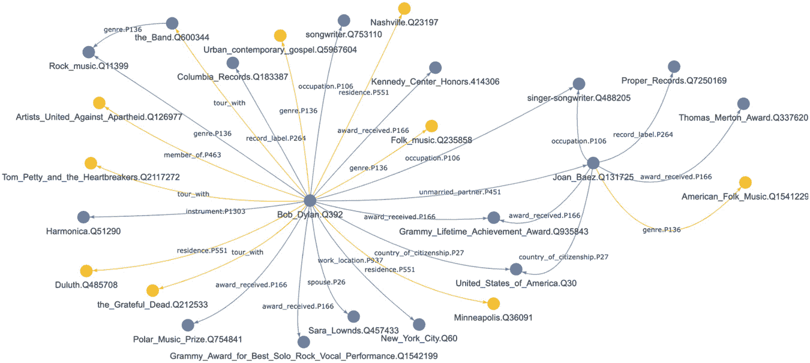

一个相互连接的网络将 Bob underscore Dylan dot Q 392 的中心节点与各种音乐流派、地点、奖项和其他艺术家连接起来。

图 5.7

使用 BERT[LARGE] 从维基百科页面中与 *“Bob Dylan”* 相邻的页面生成的开放知识图谱的快照子图 [105]。蓝色节点和箭头表示在 Wikidata 架构中映射的事实，而黄色节点和箭头表示在开放架构中未映射的事实。在 Wikidata 中新的正确事实以黄色可视化。图片来源：[105，第 6 页]，作者授权使用

##### ***可用实现***

+   PL-Marker 代码和模型在 [`github.com/thunlp/PL-Marker`](https://github.com/thunlp/PL-Marker) 公开提供。

+   REBEL 在 GitHub [`github.com/babelscape/rebel`](https://github.com/babelscape/rebel) 和 Hugging Face [`huggingface.co/Babelscape/rebel-large`](https://huggingface.co/Babelscape/rebel-large)

+   MaMa：源代码和预训练模型在 [`github.com/theblackcat102/language-models-are-knowledge-graphs-pytorch`](https://github.com/theblackcat102/language-models-are-knowledge-graphs-pytorch) 提供

### 5.4.5 远程监督

获取用于关系抽取的大量标注数据集是一项繁琐的任务，并且由于隐私问题通常很难。由于许多关系知识存储在知识库中，Mintz 等人[65]提出了*远监督*范式。其背后的理念是收集所有两个实体共现的文本提及，这些提及在知识库中存在关系。然后假设对于这个提及对，关系是成立的。由于并非所有这样的提及对都是正确的，许多方法旨在对抗这种“噪声”。一种方法是*多实例学习*，它放宽了原始假设，即所有文本提及对都代表关系，改为假设关系至少对一个对成立[2，137]，或者根据分数值指定一个比例，例如 10%。以实体“Barack Obama”和“Hawaii”为例，它们可能在知识库中存在关系“born_in”。通过搜索这两个实体的出现情况获得的句子可能是“Obama was born in Hawaii”以及“Obama was on family vacation in Hawaii”，其中只有前者代表关系，应该用于训练。

**KGPool** [67] 使用从知识库中获得的实体对，以及与之相关的属性。其理念是创建实体节点、它们出现的句子以及知识库中实体节点的属性（如描述、instance-of 和 alias 属性）的表示。所有这些信息都通过词和字符嵌入以及双向 LSTM 进行嵌入，并作为一个异构信息图连接起来。接下来使用三个图卷积网络层和读出层。通过在读出表示上使用自注意力机制，仅选择相关的属性节点，计算 softmax 分数，然后根据分数通过超参数进行过滤。创建一个动态掩码，将不那么重要的实体属性节点汇总。最后，将实体、句子和读出表示的所有中间表示分别连接起来，形成最终的实体、句子和读出表示。这些表示与关系表示一起通过一个具有 softmax 激活的全连接层传递，以计算每个关系的分数。*《纽约时报》数据集*是使用远监督进行关系抽取的标准基准。KGPool 实现了 Sota 精度@10 为 92.3%，这是如果使用匹配的“最佳”10 个结果时相关结果的分数。

### 5.4.6 使用布局信息进行关系抽取

要理解正式文本，通常除了文本本身外，还需要考虑文档布局。特别是在类似表单的文本中，单词和填充值的位非常重要。在第 7.2 节中，我们将描述如何通过一个或多个转换器同时处理文本和图像以从这两种媒体中提取意义。作为预期，我们将利用转换器处理多模态输入的能力，并通过二维位置特征额外包含布局信息。Stanisławek [96] 提供了布局分析进展的全面概述。在本子章节中，我们将重点关注键值提取的方法。在键值提取的任务中，分析文档以提取打印的值到感兴趣的书面键。示例应用包括自动处理发票，其中键是诸如发票日期或应付总额等属性。

**ReLIE** [57] 是从类似表单的文档中提取键值对的框架。候选生成步骤的目的是找到某个特定键的所有可能值候选，例如键 *“Date”* 对应的值 *“1/16/2018”*。通常这些值候选对应于基本类型，如数字、金额、日期等，可以通过基于规则的匹配器找到。然后训练一个基于转换器的评分模型，以识别从提取的值候选中有效的值。为此，学习键、值候选的位置以及邻近标记及其位置的嵌入。值候选及其每个邻居的位置使用它们各自边界框质心的二维笛卡尔坐标来描述。请注意，候选值的文本未进行编码以避免过拟合。所有嵌入通过自注意力在自动编码器中相互关联。然后通过余弦相似度比较字段嵌入和候选嵌入，并将得到的分数缩放到[0, 1]的范围内。该模型在发票的键值提取任务上实现了 87.8%的 f1 分数，在收据上为 83.3%。

**DocFormer** [6] 由一个 CNN 视觉骨干和一个仅编码器的 transformer 架构组成。文档的视觉嵌入通过 ResNet50 模型生成，并通过一个线性层投影到适当的嵌入大小。文本标记包含在一个边界框内，每个标记边界框的左上角和右下角位置通过两个不同的矩阵转换为嵌入。此外，还编码了边界框的高度、宽度和相邻边界框之间的距离。二维位置嵌入通过一维位置嵌入丰富了绝对位置。为视觉和文本特征分别训练了单独的空间嵌入。DocFormer 的注意力机制是原始注意力机制的修改版。为视觉和文本表示的标记计算了单独的注意力分数。除了键查询注意力外，查询和键标记的相对位置嵌入还被用来添加相对位置注意力以及视觉和文本嵌入的空间注意力。空间注意力权重在视觉和文本表示之间共享。

DocFormer 使用三种不同的预训练任务进行预训练：多模态掩码语言建模（MM-MLM）、学习重建（LTR）和文本描述图像（TDI）。在 MM-MLM 任务中，标记被掩码，模型应该重建这些标记。在 LTR 中，模型的任务是根据多模态表示重建文档的图像。使用平滑-L1 损失来计算原始图像和重建图像之间的差异。TDI 要求进行文本-图像匹配任务，其中模型必须预测对于随机样本，图像和文本是否对齐。*FUNSD 基准* [38] 考虑了 199 份扫描文档中的形式，其中标记必须被分配到语义键，例如“问题”或“答案”。在 FUNSD 中，DocFormer 达到了 84.6%的 F1 值，这在发表时是 Sota（当时最先进的）。

**LayoutLM3** [34] 使用了一种受视觉 Transformer（第 7.2.2 节）启发的图像嵌入方法。每个图像被分割成与视觉 Transformer 相似的 16×16 图像块，并线性转换为嵌入。如图 5.8 所示，单词和图像块由相同的自回归 Transformer 处理。为了预训练模型，使用掩码语言建模任务、掩码图像块和单词-图像块对齐预训练任务。在掩码图像块任务中，模型必须重建图像块。单词-图像块对齐任务必须使模型能够学习文本和视觉表示之间的对齐。模型应分类文本单词和图像块是否对齐，即两者都是未掩码的，或者未对齐，即图像块被掩码。*PubLayNet 基准测试* [134] 包含了超过 100 万份 PDF 文档的文档布局，与正确的文档结构相匹配。LayoutLM3 在边界框的平均平均精度方面达到了 94.5% 的 Sota。它在 FUNSD 关键值提取任务和其他基准测试中优于 DocFormer。*LayoutXLM* 是 LayoutLM2 的最新多语言版本 [116]。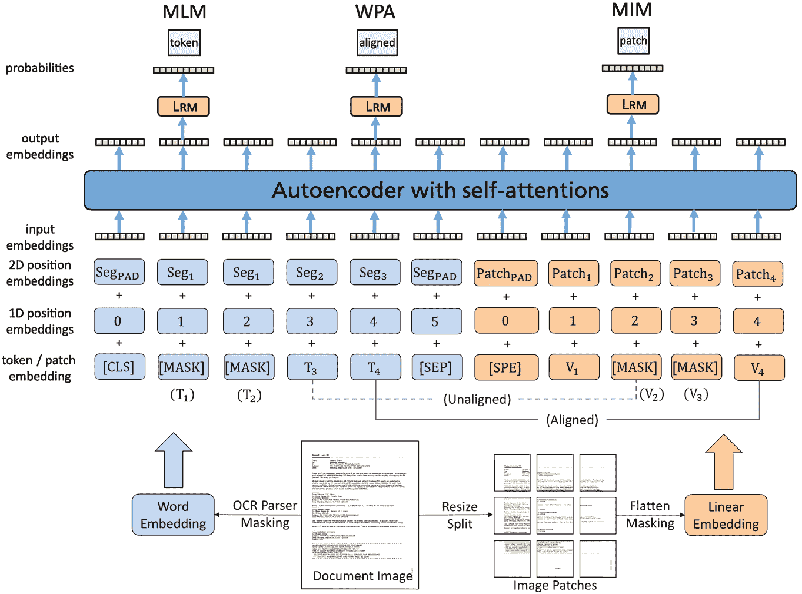

流程图通过单词和线性嵌入输入单词标记和图像块，链接到 1D 和 2D 位置嵌入、输入嵌入、带有自注意力的自动编码器、输出嵌入和逻辑分类器，以给出 M L M、W P A 和 M I M 的概率。

图 5.8

LayoutLMv3 以图像块和单词标记的线性投影作为输入，并将它们编码成上下文向量表示。LayoutLMv3 使用掩码语言建模（MLM）和掩码图像建模（MIM）的离散标记重建目标进行预训练。此外，LayoutLMv3 还使用单词-图像块对齐（WPA）目标进行预训练，通过预测文本单词的对应图像块是否被掩码来学习跨模态对齐。“Seg”表示段级位置。图像来源：[34，第 3 页]，经作者许可印刷

#### 可用实现

+   KGPool 在 [`github.com/nadgeri14/KGPool`](https://github.com/nadgeri14/KGPool)

### 5.4.7 摘要

关系抽取的任务是评估文本中特定实体表达的关系。例如，评估客户对某些产品特性的评价，这有助于改进产品或服务。鉴于大量文本内容，手动处理意见信息是不可行的。

对于简单的情况，关系论元是已知的，关系抽取可以作为一个简单的分类任务来解决，使用一些 BERT 变体，如 RoBERTa、DeBERTa 或 SpanBERT。然而，为了实际使用这些模型，我们必须在先前步骤中提取关系论元，这会导致总误差的增加。

同时抽取关系论元和相应的关系类型更具挑战性，因为这些任务相互依赖。UniRE 在联合矩阵中注释实体和关系，并在自注意力计算中引入相应的偏差。PL-marker 使用特殊标记标记第一个关系论元，并使用所谓的升位标记标记第二个论元。这些标记具有特定的注意力属性，能够提高在流行基准上的性能。GRACE 采用特定的编码器-解码器架构，其中编码器标记关系论元（方面），解码器为每个标记分配关系标签。REBEL 使用 BART 编码器-解码器将输入句子翻译为覆盖关系的唯一表示。

关系抽取模型已被调整以适应特定应用。GRACE 已被调整用于基于方面的情感分析，而 Crf2o 用于语义角色标注。后者使用上下文嵌入，并通过高效的 TreeCRF 确定谓语与相应短语之间的关系。最后，MaMa 可以用来从实体间提取的关系构建知识图谱。

通常，文档和网页的空间布局包含对关系论元抽取相关的信息。在这种情况下，可以利用文档图像中的视觉信息来得出有效的解释。这种视觉信息可以通过键和值的边界框位置来包含，也可以以图像补丁的形式包含，这些补丁将在后面的图像转换器中进行探索。

所有最近的关系抽取方法都是基于预训练语言模型（PLMs）。大多数模型在实验中使用了小的 BERT 变体。因此，可以假设更大的模型将直接提高性能。此外，像 GPT-3 这样的基础模型可能可以进行微调（见第 3.6.2 节）并且可能带来更高的准确率。一个相关的替代方案是 InstructGPT（见第 3.6.5 节），它可以通过问答轻松地被引导执行关系抽取，例如*“谁建造了自由女神像？”* [77, p. 29]。然而，似乎很难用一些测试数据来评估这种方法的表现。

**开放获取** 本章节根据 Creative Commons Attribution 4.0 International License（[`creativecommons.org/licenses/by/4.0/`](http://creativecommons.org/licenses/by/4.0/)）的条款进行许可，允许在任何媒介或格式中使用、分享、改编、分发和复制，只要您适当引用原始作者和来源，提供 Creative Commons 许可的链接，并指出是否进行了修改。

本章节中的图像或其他第三方材料包含在本章节的 Creative Commons 许可中，除非在材料引用行中另有说明。如果材料未包含在本章节的 Creative Commons 许可中，且您的使用意图不受法定法规允许或超出允许的使用范围，您将需要直接从版权持有人处获得许可。
