# 6. 文本生成的基础模型

Gerhard Paaß^(1  ) 和 Sven Giesselbach¹(1)知识发现部门，NLU 团队，弗劳恩霍夫智能分析与信息系统研究所（IAIS），圣奥古斯丁，北莱茵-威斯特法伦，德国

## 摘要

本章讨论了文本生成的基础模型。这包括文档检索系统，它接受一个查询并返回文档集合中按顺序排列的文本文档列表，通常通过评估嵌入的相似性来检索相关文本段落。问答系统被给出一个自然语言问题，必须提供答案，通常以自然语言形式。机器翻译模型将一种语言的文本翻译成另一种语言。文本摘要系统接收一个长文档并生成一个简短的摘要，涵盖文档的最重要内容。文本生成模型使用自回归语言模型生成较长的故事，通常从初始文本输入开始。对话系统有与人类伙伴进行对话的任务，通常不限于特定主题。

关键词问答机器翻译文本摘要文本生成对话系统文档检索在本章中，我们描述了基础模型，即用于在不同应用领域中生成新文本的大型预训练语言模型。

+   *文档检索* 系统接受一个查询并返回文档集合中按顺序排列的文本文档列表，通常通过评估嵌入的相似性来检索相关文本段落（第 6.1 节）。

+   *问答* 系统被给出一个自然语言问题，必须提供答案，通常以自然语言形式（第 6.2 节）。

+   *机器翻译* 将一种语言的文本翻译成另一种语言（第 6.3 节）。

+   *文本摘要* 接收一个长文档并必须编写一个简短的摘要，涵盖文档的最重要内容（第 6.4 节）。

+   *文本生成* 使用自回归语言模型生成较长的故事，通常从初始文本输入开始（第 6.5 节）。

+   *对话系统* 有与人类伙伴进行对话的任务，通常不限于特定主题（第 6.6 节）。

由于存在大量不同的方法，我们专注于在写作时表现出高性能的代表性模型。我们根据适当的基准和所需的计算资源，回顾了每个领域的当前最佳技术。对于标准模型，提供了早期章节中描述的链接。每个应用领域的示例在表 6.1 中展示。表 6.1

通过示例展示的语言生成任务

| 任务 | 描述 | 示例 |
| --- | --- | --- |
| 文档检索 | 对于一个查询返回一个文本文档的有序列表 | *Covid 19?*[`​doi.​org/​`](http://doi.org/)wikipedia/covid-19, [www.​cdc.​gov/​](http://www.cdc.gov/), … |
| 生成式问答 | 生成问题的答案，通常使用一些背景知识 | *阿尔伯特·爱因斯坦发明了什么？* |
|   |   | *爱因斯坦发展了相对论* |
| 翻译 | 对于源语言中的文本生成目标语言中的文本，具有相同的意思 | *弗里茨喜欢吃香肠* |
|   |   | *弗里茨喜欢吃火腿* |
| 摘要 | 对于长文本生成一个简洁的摘要 | *那是冬天的中间，…* |
|   |   | *白雪公主被王子唤醒，并与他结婚…* |
| 文本生成 | 从初始文本开始，创建一个一致的后续文本 | *贝多芬出生于波恩* |
|   |   | *他的父亲是公爵法庭上的歌手* … |
| 对话回答生成 | 基于先前话语的序列生成一致的回答 | *你能推荐今晚看哪个视频吗？* |
|   |   | *Netflix 上有“记忆碎片”* |

## 6.1 文档检索

*信息检索* (*IR*) 使用计算机系统在数据库中搜索内容。产生的 IR 系统通常被称为 *搜索引擎*。通常，用户会就某个主题提出一个句子或 *查询*，系统应返回与查询相关的文档的排序列表（*即席检索*）。在这里，我们专注于从存储的文档集合中检索文本信息。与第 6.2 节中问答方法不同，系统不会直接以自然语言生成对查询的直接答案。

以前的 IR 系统是*基于关键词的*：文档中包含的所有单词都存储在*倒排索引*中。检索算法搜索索引以识别包含查询单词的文档。然后，根据文档中找到的每个查询单词的信息内容对这些文档进行排名，例如通过 tf-idf 或 BM25 [186]来衡量。这两个步骤在图 6.1 中显示。Abbasiyantaeb 和 Momtazi [2]提供了一项早期检索技术的调查。然而，这种方法有三个主要问题：

+   许多物体、活动或事件可能由不同的单词表达，这些单词被称为*同义词*，例如“drink”和“beverage”或“buy”和“purchase”。包含替代单词的文档不会被关键词检索返回。*释义*如“他有很多东西要扔掉”和“他需要摆脱很多垃圾”甚至更难发现，并且被忽略。这被称为*词汇不匹配问题*。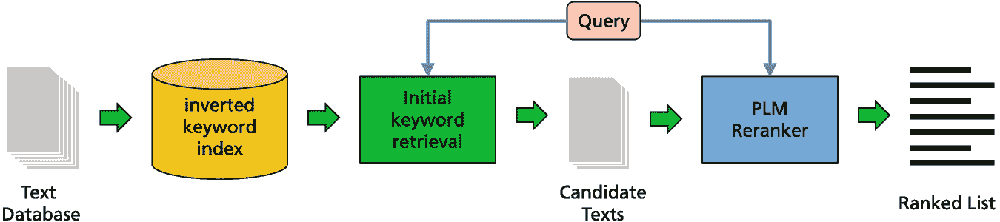

    流程图表示从文本数据库开始，经过倒排关键词索引、初始关键词检索、候选文本和 PLM 跟踪器，最后生成排名列表的过程。

    图 6.1

    使用 PLM 的检索和重新排名架构。首先，从文档集合中检索文本，通常使用精确匹配的词袋查询。然后，使用 PLM 嵌入（例如 BERT）对这些候选进行重新排名。图像改编自[123]，经作者同意重印

+   许多单词的含义取决于上下文（例如，“rock”：音乐或石头）。这些单词被称为*同音异义词*。包含此类单词的部分检索文档将是不匹配的。

+   单词的顺序对于句子的意义往往至关重要（例如，“狗杀死了人”与“人杀死了狗”）。这在关键词搜索中通常被忽略。

作为一种替代方案，上下文嵌入被用来表示查询和文档。通过比较上下文语义表示来识别匹配的文档，可以减少文档和查询之间的词义差异，并检索出同义词、同音异义词和释义文本。这些模型在各种检索基准测试中实现了 Sota 结果 [137]，并且最近被引入到商业搜索引擎中。因此，它们是目前 PLM 在商业上最重要的应用之一。

### 6.1.1 稠密检索

*密集检索* 方法将文本编码为长度远小于文本长度的固定长度嵌入向量。一个文档是否与给定的查询相关由嵌入向量的相似度决定，该相似度通过余弦相似度或内积计算。与问答（第 6.2 节）不同，这些模型不会对搜索查询生成直接的自然语言响应，而是返回完整的文档或文本段落。最近，基于 PLM 的密集检索方法在针对一小部分领域相关、带有相关性标签的文档微调时，优于它们的基于关键词的对应方法。Lin 等人 [124] 提供了关于基于 PLM 的检索系统的全面概述。密集检索的不同方法可以区分，并在下一节中进行介绍。

+   **交叉编码器**：使用连接的查询和文档作为输入到 BERT 中，并确定文档对查询的相关性（第 6.1.3 节）。

+   **基于标记嵌入的检索**：查询和文档的标记通过上下文嵌入进行编码。然后使用不同的指标来比较这些嵌入，并收集相关文档（第 6.1.4 节）。

+   **基于段落嵌入的检索**：这些技术通过嵌入将查询和文档的段落进行编码。随后，比较这些嵌入。这种嵌入类型尊重词序，因此有可能返回更好的匹配（第 6.1.5 节）。只能描述非常小的一部分方法，这应该可以给人一个目前使用方法的印象，如表 6.2 所示。在第 6.2.2 和 6.2.3 节中讨论了用于问答的检索技术，这些技术甚至更强大。Lin 等人 [124] 提供了关于检索用 PLM 的非常全面的调查。在下一节中，将区分不同的密集检索方法，并对其进行介绍。

文档检索模型及其性能。基准（第 6.1.2 节）：MARCO：MS-MARCO [16]，NQuest：自然问题基准 [109]，Wiki65K：长维基百科文档 [247]

| 模型 | 描述 | 基准 |
| --- | --- | --- |
| monoBERT (第 6.1.3 节)) | 使用 BERT 处理每个查询-段落对 | MARCO 35.9% MRR@10 |
| monoT5 (第 6.1.3 节)) | 使用 T5 处理每个查询-段落对 | MARCO 38% MRR@10 |
| ColBERT (第 6.1.4 节)) | 根据标记嵌入重新排序搜索结果文档 | MARCO 36.7% MRR@10 |
| 模型 1 (第 6.1.4 节)) | 计算查询是文档“翻译”的概率 | MARCO 39.1% MRR@100 |
| SMITH (第 6.1.4 节)) | 使用基于 BERT 的分层编码器 | Wiki65K 95.9% 准确率 |
| SentenceBERT (第 6.1.5 节)) | 查询和文档的 BERT 编码器 | 将召回时间从 65 小时减少到 5 秒 |
| DPR (第 6.1.5 节) | 查询和文档使用不同的 BERT 编码器，经过微调以减少检索损失。使用 FAISS 索引进行近似最近邻搜索 | NQuest 79.4% top-20 准确率 |
| RocketQA (第 6.1.5 节) | 查询和文档使用 RoBERTa 编码器。后续进行重排序 | MARCO 41.9% MRR@10 |
| coCondenser (第 6.1.5 节) | 使用 CLS 标记的 RoBERTa 编码器进行查询和文档处理。后续进行重排序 | MARCO 40.8% MRR@100 |

### 6.1.2 测量文本检索性能

有许多基准数据集用于训练和比较检索方法。*MS-MARCO* 基准 [16] 是从 Bing 的搜索查询日志中抽取的大约五十万个匿名问题创建的大规模集合。对于段落排序任务，它包含从 360 万个网页文档中提取的 880 万个段落，平均长度为 55 个单词。目标是检索出回答问题的段落。训练集包含大约 50 万对查询和相关文档，以及另外 4 亿对查询和非相关文档。存在一个开发集和一个大约有 7k 个查询的保密测试集。然而，有人讨论说，MS-MARCO 基准的金标注在一定程度上是有偏见的 [10]。

*自然问题* (*NQ*) [109] 包含来自真实用户的至少 8 个单词的问题。它要求问答系统阅读并理解整个维基百科文章，该文章可能或可能不包含问题的答案。例如，问题是 *“血液在离开右心室后流向哪里？”* 任务是检索一个长答案，即页面上的一个段落，该段落回答了问题，例如 *“从右心室，血液通过肺动脉瓣泵出……”*，或者指示没有答案。该任务被设计成接近端到端问答应用。人类标注员提供一到五个答案。虽然原始的自然问题基准是一个阅读理解任务，为每个问题提供多个证据文档，但 *EfficientQA* 基准 [147] 通过使用最多五个标记的答案示例并将其证据文档丢弃，将其调整为开放域问答。

Min 等人 [146] 指出，在自然问题中，超过一半的查询是模糊的，存在许多模糊来源，如事件和实体引用。他们开发了一个 *AmbigQA*，其中包含重新表述的问题，这些问题可以产生一个独特的答案。

一个简单的评估指标是*top-k 准确率*，即返回的*k*个最可能答案中至少有一个是正确的查询比例。更复杂的是*平均倒数排名*(*MRR*)，是第一个正确答案的排名的倒数和 0，如果没有返回正确答案。例如，如果第三个答案是正确的，则倒数排名是 1/3。|*Q*|个查询的 MRR 如下！$$\displaystyle \begin{aligned} MRR = \frac 1{|Q|}\sum_{i=1}^{|Q|}\frac 1{rank_i}. \end{aligned} $$(6.1)

*MRR@m*表示总是返回一个包含*m*个文档的有序列表。

我们可以将*Pr*(*i*)定义为列表的前*i*个元素达到的精度，即前*i*个相关文档的比例。然后我们可以定义*平均精度*如下！$$\displaystyle \begin{aligned} AP = \frac 1m \sum_{i=1}^m Pr(i) * rel(i) \qquad  MAP = \frac 1{|Q|}\sum_{j=1}^{|Q|} AP_j \end{aligned} $$(6.2)

其中*rel*(*i*)=1 如果第*i*个文档是相关的，否则为 0。*平均平均精度*(*MAP*)是 AP 在|*Q*|个不同查询上的平均值。

### 6.1.3 基于 BERT 的交叉编码器

**monoBERT** [155]基于*[CLS]*标记的嵌入进行重排序，查询和文档被组合到输入“*[CLS]* <*query*> [SEP] <*document*> [SEP]”。这通过在 MS-MARCO 上微调的 BERT 处理，其中使用最后一个层中的*[CLS]*嵌入由逻辑分类器预测当前文档与查询的相关概率。此输出分数用于排序（图 6.2）。注意，通过这种技术可以识别出诸如“流感的症状包括发热和鼻塞”和“鼻塞和体温升高可能是你得了流感的迹象”之类的释义！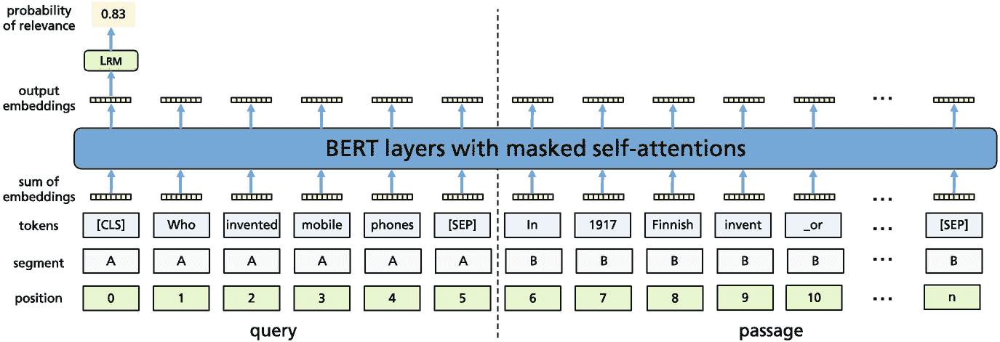

一个插图说明了查询和段落通过 BERT 层进行掩码自注意力时的位置、段、标记、嵌入和输出嵌入以及相关性的概率。

图 6.2

monoBERT 模型使用经过微调的 BERT 模型对查询进行排序。输入包含查询与段落拼接。*[CLS]*标记嵌入被训练以返回段落回答查询的概率

在 MS-MARCO 基准测试 [153] 中，monoBERT 得到了 35.9% 的 MRR@10 值（即平均位置 2.8 的第一个相关文档）。由于之前基于关键字的 BM25 搜索的 MRR@10 值为 16.5%（平均位置 6.1 的第一个相关文档），这一结果在搜索引擎性能方面实现了显著提升。由单个模型引起的这种效果的大幅提升在学术界或工业界都很少见，这导致了社区的立即兴奋。

monoBERT 提供了一种简单而有效的解决方案来解决文本排序问题（至少对于短于其最大输入长度的文本）[124]，这一点相当引人注目。在多项研究中发现，当保持词频不变时，monoBERT 在估计相关性方面优于 BM25。使用改变现有文档的文本操作测试，发现改变句子内或句子间的单词顺序有较大的负面影响，而改变文档内句子顺序的负面影响则较小。相比之下，仅重新排列介词的影响很小。从输入模板变体实验的结果显示，monoBERT 使用精确匹配、“软”语义匹配和关于单词位置的信息。这些不同组件如何结合——针对不同类型的查询、不同语料库以及不同设置等——仍然是一个未解之谜。请注意，这种搜索方法需要巨大的计算资源，因为对于每个段落都需要进行新的评估，而索引搜索的努力仅呈对数增长。

**monoT5** [154] 使用了 T5 编码器-解码器模型而不是 BERT 来重新排序检索到的文档。该模型接收输入 *“Query:* <*query*> Document:* <*document*> Relevant:”。monoT5 被微调以生成表示文档是否与查询相关的标记 *true* 或 *false*。预测的 *true* 的概率可以用作相关性得分。对于具有 30 亿参数的 T5，作者在 MS-MARCO 文档检索中获得了 38% 的 MRR@10 值。这表明更大的模型可以提高检索系统的性能。

### 6.1.4 使用标记嵌入进行检索

在每个 Transformer 编码器层中，BERT 注意模式的完全全连接性质意味着，与输入长度相比，时间和空间复杂度呈二次方。在第 3.2 节中，我们介绍了一些处理更长时间输入的方法。这些方法都可以用于处理更长的文档。在众多方法中，我们更详细地讨论了 ColBERT 和 Model 1。

**ColBERT** [99] 对另一个（更便宜）的检索模型的输出进行重新排序，通常是基于词的模型，或者直接从文档集合中进行端到端检索。查询和文档前面添加了不同的特殊标记。ColBERT 使用单个预训练的 BERT 模型将每个查询或文档编码成一个标记嵌入的集合。在最后一层，嵌入的大小被减小，并且它们被归一化到欧几里得长度 1.0。因此，内积等价于余弦相似度。如果(*q*[1], …, *q*[*m*])是查询标记，*d*[*i*,1], …, *d*[*i*,*k*]是第*i*-个文档的标记，则*q*和*d*[*i*]之间的相似度计算如下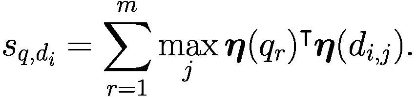(6.3)

这是每个查询词与文档*d*[*i*]中包含的“最佳”匹配词之间的最大余弦相似度（MaxSim）之和。对于每个查询嵌入，考虑 L2 最近的 10 个嵌入，并检索* k* = 1000 个最近的文档向量。

对于对初步搜索结果进行排序，例如 1000 个文档，计算所有查询嵌入和检索文档中所有嵌入之间的最大相似度（例如余弦相似度）。这种方法非常高效，因为它需要的 FLOPS 数量比以前的方法少几个数量级。在 MS-MARCO 基准测试 [153] 中，重新排序的 ColBERT 实现了 MRR@10 值为 34.9%（平均第 2.9 个相关文档），这略低于交叉编码的单个 BERT。

ColBERT 也可以用于端到端检索。它使用*FAISS*索引 [91] 在准备步骤中存储文档标记嵌入，以进行*k*-最近邻搜索。请注意，对于每个文档中的每个标记，都需要存储一个嵌入，因为嵌入依赖于上下文。检索需要两个阶段：在第一阶段，对每个查询标记执行多个近似搜索。在第二阶段的细化阶段，根据 MaxSim 标准对这些近似匹配进行重新排序。在 MS-MARCO 基准测试中，ColBERT 的端到端检索的 MRR@10 值为 36.7%，这比重新排序性能好得多，并且与更昂贵的 BERT 交叉编码方法相当。

**模型 1** [28] 在其基于标记嵌入的检索模型中混合了多种技术。首先，作者估计查询***q***被生成作为文档***d***的“翻译”的概率*p*(***q***|***d***)。使用贝叶斯定理，作者得到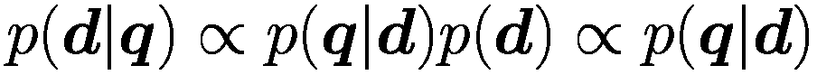(6.4)

假设一个均匀先验*p*(***d***) [21]。他们考虑查询标记*q*[*i*]是文档标记*d*[*j*]的翻译的概率*r*(*q*[*i*]|*d*[*j*])。通过神经网络近似*r*(*q*[*i*]|*d*[*j*])，他们使用标记*q*[*i*]和*d*[*j*]的嵌入作为输入，并能够估计*p*(***d***|***q***)。这种方法需要很少的计算努力。作者将 BERT 密集检索器与 Lucene 搜索索引相结合。最后，他们使用 Doc2query 为模型 1 扩展文档。*Doc2query* [156]旨在生成与文档相关的查询。该方法训练一个 transformer，从最多 400 个标记的文档中生成多达 100 个查询标记。该模型使用包含查询和相关文档对的集合数据集进行训练，例如 MS-MARCO。在 MS-MARCO 上，他们实现了 39.1%的 MRR@100。与基于 BERT 的排名模型相比，无上下文的神经模型 1 效果较差，但它可以在 CPU 上高效运行（无需昂贵的索引时间预计算或在大张量上的查询时间操作）。

目前，没有任何检索器尝试处理长文档。这有许多重要的应用，如新闻推荐、相关文章推荐和论文引用建议。通常，长文档会被分割成段落，其理念是相关内容包含在段落中。请注意，具有更长输入的 PLMs，例如 BigBird，可以提高性能（见第 3.2 节）。然而，这一点必须经过评估。**SMITH**模型[247]使用基于 BERT 的分层编码器来捕获文档结构信息。文档首先被分割成句子，并为每个句子计算词嵌入。每个句子都以一个*[CLS]*标记开始，其嵌入代表该句子。存在一个更高层次的 BERT，它只接收句子嵌入作为输入。第二层 BERT 的第一个人工标记被用作整个文档的嵌入。

该模型通过掩码语言建模任务进行预训练以获取标记嵌入。此外，在第二级中，有一个需要模型从一批句子嵌入中选择正确嵌入的掩码句子块预测任务。微调任务通过逻辑分类器从相关性注释的微调数据集中预测的相关性分数最大化。在包含长维基百科文章的*Wiki65K* [87]上，该方法实现了 95.9%的准确率，这比先前的方法有显著改进。

### 6.1.5 稠密段落嵌入和最近邻搜索

使用嵌入向量表示文本段落有可能通过直接在表示空间中匹配“意义”来解决词汇不匹配的问题。这些所谓的*密集检索*技术可以直接在 PLM 生成的向量表示上进行排名。与计算标记嵌入的成对差异相比，这种方法提供了一个更高效的检索过程。这是通过将查询的嵌入向量与使用索引和近似最近邻搜索的段落嵌入向量进行匹配来完成的。今天，开源库中提供了高效、可扩展的解决方案。

给定一个查询*q*和一组文档*D*={*d*[1]，…，*d*[n]}，我们想要定义函数***η****q*和***η****d*，这些函数将标记序列*q*和*d*转换为固定宽度的向量。这些函数应具有以下属性：如果*d*[i*]对查询*q*相关，则***η****q*和***η****d*之间的相似度最大。我们想要估计！$$\displaystyle \begin{aligned} p(\text{relevant}=1|d_i,q) := \phi({\boldsymbol{\eta}}_q(q),{\boldsymbol{\eta}}_d(d_i)), \end{aligned} $$(6.5)

其中*ϕ*(⋅)是一个相似度比较函数，例如标量积[124，第 133 页]。请注意，***η****d*可能预先计算并组织在一个索引中。通过为查询和文档使用不同的编码器***η****q*和***η****d*，我们可以考虑查询和文档的不同角色和措辞。

**SentenceBERT** [183] 是一种双编码器设计的原型，用于生成具有语义意义的句子嵌入，用于大规模文本相似度比较（图 6.3）。查询*q*和文档*d*[i*]由相同的 PLM（BERT 或 RoBERTa）处理。相似度是通过*余弦相似度*比较的！$$\displaystyle \begin{aligned} \phi({\boldsymbol{\eta}}_q(q),{\boldsymbol{\eta}}_d(d_i))=\frac{{\boldsymbol{\eta}}_q(q)^\intercal {\boldsymbol{\eta}}_d(d_i)}{\left\lVert {\boldsymbol{\eta}}_q(q)\right\rVert *\left\lVert {\boldsymbol{\eta}}_d(d_i)\right\rVert }. \end{aligned} $$(6.6)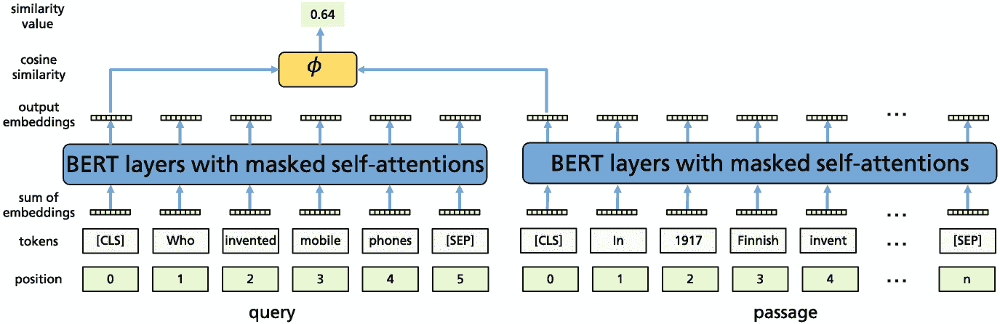

一幅插图展示了查询和段落通过 BERT 层以及掩码自注意力机制的流程。它表明了位置、标记、嵌入和输出嵌入、余弦相似度和相似度值的层级。

图 6.3

SentenceBERT 模型使用两个微调的 BERT 模型将查询和段落转换为*[CLS]*标记的嵌入。随后，使用余弦相似度模块来计算相似度值

为了生成句子嵌入，作者调查了三种替代方案。（1）使用 *[CLS]* 标记的嵌入。（2）所有输出嵌入的平均值（平均池化）。（3）所有输出嵌入的分量最大值（最大池化）。未经微调的结果比非上下文嵌入的结果更差。微调提高了性能，并产生了一个新的 Sota。结果证明，平均池化是最有效的设计，略好于最大池化或使用 *[CLS]* 标记。最重要的是，在 10,000 个文档中找到最佳匹配的计算时间从 65 小时减少到 5 秒。

**DPR** [94] 使用了分别针对查询 *q* 和约 100 个单词的文本段落 *d*[*i*] 的独立编码器 ***η****q* 和 ***η****d*。这两个编码器都采用 BERT[BASE] 的 *[CLS]* 嵌入作为其输出表示。作为比较函数，使用了内积 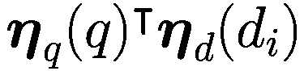。对于每个查询 *q*[*i*]，训练集中包含一个正确段落  和多个负段落 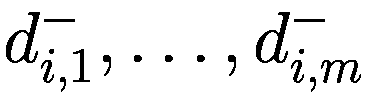。损失函数编码了目标，即对于 *q*[*i*] 和  获取大的 *ϕ*-值（即相似度），而对于 *q*[*i*] 和 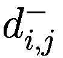 获取小的相似度！

负样本是使用关键词搜索检索到的段落混合体，这些段落不包含答案，因此是难以处理的负样本。此外，还使用了同一训练批次中其他示例的段落。我们不是在 *η**q* 和 *η**d* 之间的所有文档之间进行相似度的全面计算，而是可以采用近似最近邻搜索。*FAISS* [91] 是一种基于层次可导航小世界图的开放源代码方法。对于自然问题基准测试，他们实现了 79.4% 的前 20 名准确率，这比基于关键词的 BM25 搜索的前 20 名准确率 59.1% 高得多。复制研究 [136] 可以确认这些结果，但发现 DPR 和 BM25 的混合方法可以将性能提高到 82.6%。

**ANCE** [238] 使用单个 RoBERTa 模型对查询和文档进行编码。在训练过程中，通过在训练编码器生成的表示上的索引上进行近似最近邻搜索来选择硬负例。这样，他们可以选择“困难”的负例。索引定期更新。在 Natural Questions 上，ANCE 实现了 82.1%的 top-20 准确率。性能还与使用 monoBERT 进行重排序的单 BERT 交叉编码器进行了比较，该编码器通过将所有文档与查询进行比较来重排序第一阶段 BM25 结果。结果发现，在 MS-MARCO 上，将 monoBERT 应用于 BM25 的 MRR@10 为 34.7%，而 ANCE 为 33%。显然，交叉编码器比 ANCE 更有效。作者还将 ANCE 应用于 80 亿文档，使用大小为 64 的嵌入和近似最近邻搜索。他们报告了与先前商业实现相比提高了 16%。

**RocketQA** [184] 执行首次检索步骤，随后进行重排序过程。两种方法都使用列表训练方法联合优化，其中使用正例和负例的列表来训练两个模块。此外，他们通过结合随机采样和去噪采样来构建多样化的训练实例。他们报告了 MS-MARCO 段落检索的 MRR@10 为 38.8%。当稍后对前 50 个结果进行重排序时，他们可以将 MRR@10 提高到 41.9%。

**coCondenser** [63] 是 MS-MARCO 排行榜上最高的条目之一 [140]。该模型被迫学习将信息聚合到“CLS”嵌入中，然后该嵌入将参与 LM 预测。然后使用额外的“对比损失”：来自同一文档的段落“CLS”嵌入应靠近，而来自不同文档的段落应具有更大的距离。这为段落提供了高度表达的嵌入。当模型在 MS-MARCO 上进行微调时，它在 MS-MARCO 排行榜上返回了 40.8%的*MRR@*100。

#### 可用实现

+   DPR 代码位于[`github.com/facebookresearch/DPR`](https://github.com/facebookresearch/DPR)。

+   FAISS 最近邻搜索的代码位于[`github.com/facebookresearch/faiss`](https://github.com/facebookresearch/faiss)。

+   ANCE 代码和训练最近邻搜索的数据位于[`github.com/microsoft/ANCE`](https://github.com/microsoft/ANCE)。

+   RocketQA 代码和数据位于[`github.com/PaddlePaddle/RocketQA`](https://github.com/PaddlePaddle/RocketQA)。

+   FlexNeuART [27] 实现了模型 1 检索系统 [28]。

+   coCondenser 代码位于[`github.com/luyug/Condenser`](https://github.com/luyug/Condenser)。

### 6.1.6 摘要

检索是网络搜索中的一个关键步骤，其中从数十亿文本语料库中识别出一小部分与查询相关的候选段落。在检索阶段发现更多语义相关的候选者，对于向最终用户提供更多高质量结果具有很大潜力。密集检索方法代表了搜索引擎技术的范式转变。它们使得能够识别单词和释义的含义，从而找到与查询更匹配的段落。搜索结果还可以用于问答模型（第 6.2 节）和对话系统（第 6.6 节）。它们已经被 Bing [35, 238, 266]、Google [152, 197]和 Facebook [82]等生产搜索引擎所使用。

上述密集检索方法在监督设置中使用人类相关性标签作为输入进行微调，例如来自 MS-MARCO。通过使用两个不同的 PLM 来编码查询和文档，可以获得最佳结果。这两个 PLM 都被训练以提高正确参考文档的概率，与一些负面文档相比。由于需要更多的努力，大多数系统使用单个模型来编码问题和文档。实验表明，密集检索和关键字检索的组合似乎具有优势。在第 6.2.2 节和 6.2.3 节中讨论了用于问题回答的检索技术，这些技术甚至更强大。

一个问题是搜索系统对新领域的可迁移性。当 BERT 以类似 monoBERT 的方式使用时，被发现具有强大的跨领域相关性分类能力 [124, p. 72]。如果使用一个领域的相关性判断（例如，推文）微调 BERT 模型，它可以成功应用于不同的领域（例如，新闻文章）。另一方面，Thakur 等人 [221] 创建了一个名为*BEIR*的基准，其中包含来自非常不同领域（如生物医学和推文）的 18 个检索任务。作者在 MS-MARCO 上训练了大量密集检索技术，并在其他任务上进行了评估。他们发现，平均而言，这些技术比 BM25 更不有效，因为 BM25 由于其简单性，在大多数情况下都能正常工作。

对于嵌入索引的内存需求不容忽视。虽然 MS-MARCO 段落语料库中包含 8.8M 个段落的 Lucene 索引需要 661 MB 的内存，但 768 大小向量的 FAISS 索引需要 42 GB，而 ColBERT 索引则需要 156 GB [124, p. 159]。为了将这些技术应用于网络规模，需要采用内存占用更小的方法。

## 6.2 问题回答

*问答*（QA）是自然语言处理的应用，它接收自然语言查询并自动以自然语言生成精确答案。这是一个从 20 世纪 60 年代开始的长期 AI 任务 [69]。与第 6.1 节中讨论的搜索引擎相比，问答系统直接呈现问题的最终答案，而不是返回相关片段或超链接列表。因此，它更友好且效率更高。通常，系统可以访问数据库或*知识库*（KB），例如维基百科，其中可以搜索相关信息。

*封闭域问答系统* 处理特定领域的问答，例如医学，并具有该领域的背景知识或使用覆盖该领域的大规模训练集进行训练。*开放域问答系统*（ODQA）处理几乎所有主题的问答，通常依赖于通用知识库或互联网搜索 [37]。*多模态问答*系统处理不同媒体中的问题，例如文本和图像。Zhu 等人提供了一份 ODQA 调查 [265]。表 6.3 汇总了领先的问答模型及其性能。表 6.3

带有性能的问答模型。下半部分包含检索模型。基准：NQ：谷歌查询的自然问题基准 [109]，TriviaQA：TriviaQA 基准 [92，226]，HotpotQA：多跳基准 [249]，EM：精确匹配

| 模型 | 详细信息 | 基准 |
| --- | --- | --- |
| BigBird (第 6.2.1 节) | 长输入自动编码器，使用问答对进行监督训练 | 带参考文档的 NQ 57.9% EM WikiHop 82.3% 准确率 |
| PoolingFormer (第 6.2.1 节) | 具有两个级联注意力模式的自动编码器，使用问答对进行监督训练 | 带参考文档的 NQ 61.6% EM |
| RealFormer (第 6.2.1 节) | 具有旁路注意力的自动编码器，使用问答对进行监督训练，多跳问答 | WikiHop 84.4% 准确率 |
| GPT-3 (第 6.2.1 节) | 175B 大型自动编码器，仅预训练 | NQ 少样本 29.9%，TriviaQA 少样本 71.2% |
| Gopher (第 6.2.1 节) | 280B 大型自动编码器，仅预训练 | NQ 少样本 28.2% |
| PaLM (第 6.2.1 节) | 540B 大型自动编码器，仅预训练 | NQ 少样本 36.0%，TriviaQA 少样本 81.4% |
| DPR (第 3.4.5 节) | 带有两个 BERT 模型和 FAISS 索引的检索器-阅读器 | NQ 精确匹配准确率 41.5%，TriviaQA 57.9% |
| FiD (第 3.4.5 节) | 带有 T5 模型和 FAISS 索引的检索器-阅读器 | NQ 精确匹配准确率 51.4%，TriviaQA 67.6% |
| REALM (第 3.4.5 节) | 带有 BERT 嵌入点积的检索器-阅读器，速度慢 | NQ 精确匹配准确率 40.4% |
| FB HYBRID (第 3.4.5 节) | 将 DPR 检索器与其他检索器结合，FiD 阅读器 | NQ 精确匹配准确率 53.9%，对应于 67.4%正确率 |
| MS UNITED (第 3.4.5 节) | 基于 BERT 的检索器，T5+ELECTRA 作为读者，最终重排序 | NQ 精确匹配准确率 54.0%，相当于 65.8%的正确率 |
| AISO (第 3.4.5 节) | 具有重复检索轮次的检索-阅读器，多跳问答 | HotpotQA 72.0% F1 |
| RETRO (第 6.2.3 节) | 具有冻结 BERT 检索器的语言模型，语言模型定期包括检索到的标记块 | NQ 精确匹配准确率 45.5% |
| WEBGPT (第 6.2.3 节) | 结合 Bing 搜索引擎的 GPT-3，可以定期调用 | TriviaQA 69.5% |

问答的一种简单形式是*阅读理解*，其中系统需要在给定的文本中识别问题的答案。通常，BERT 类似的系统通过跨度预测（第 2.1.3 节）在文本中标记答案跨度。这项任务基本上可以被认为是解决了。对于*SQuAD 2.0 基准* [179]，ALBERT 实现了超过 93%的 F1 值，而经过微调的*ST-MoE-32B*混合专家模型（第 3.5.2 节）拥有 269B 参数[270]，实现了 96.3%的 F1 值，而人类的 F1 值为 89.5% [178]。然而，Sen 等人[199]指出，在一个数据集上训练的系统可能无法很好地泛化到其他基准。

### 6.2.1 基于训练数据知识的问答

语言模型通常在综合文本集合上训练，能够记住大量信息。常用的基准是*Natural Questions* (*NQ*) [109]，它已经从 Google 搜索日志中抽取（第 6.1.2 节）。对于给定的问题，系统需要在提供的支持文档中找到一个短的答案跨度。一个例子是问题*“何时在酿造过程中添加跳跃？”*，应该得到答案*“煮沸过程”*。

*TriviaQA*基准[92, 226]包含一组从网络中抓取的趣味问题及其答案。与 Natural Questions 不同，这里的问题是以已知答案为前提编写的。*TruthfulQA* [125]是一个特殊的问答基准，包含短问题，这些问题是通过对抗性构建的，因此有些人可能会因为错误信念和误解而给出错误的答案。答案根据信息量和真实性进行评估。

#### 微调的问答模型

**BigBird**（第 3.2 节）的自注意力被用作自动编码器，并使用 4096 个标记的输入序列通过 MLM 目标进行训练 [253]。在 Natural Questions 的微调期间，模型必须在给定的证据文档中找到一个简短的答案跨度。该模型在这个任务上实现了 57.9%的 F1 值。**PoolingFormer** [256]是一个用于长输入序列的替代模型，具有两级注意力模式。其第一级使用较小的滑动窗口模式从邻居中聚合信息。其第二级使用较大的窗口通过池化注意力来增加感受野。一组微调的 PoolingFormers 在 Natural Questions 基准测试上实现了 61.6%的 F1 值。该模型类似于**SMITH**模型 [247]，它使用基于 BERT 的分层编码器来捕获文档结构信息（第 6.1.4 节）。

另一个选择是**Macaw** [218]，一个带有 11B 参数的免费问答系统。它基于 T5，并具有强大的零样本问答能力。在 300 个挑战性问题集上，作者声称 Macaw 的表现比 GPT-3 高出 10%，尽管它的参数只有后者的一小部分。除了为问题提供答案外，Macaw 还可以接受一个答案并生成一个问题；或者为答案和问题生成多项选择题选项。作者还提供了一份详细的错误分析。

将不同证据片段组合起来以找到答案要困难得多。测试这种能力的基准是*WikiHop* [232]，其中需要合并来自不同文档的信息。一个例子是问题*“孟买的悬空花园，国家？”*以及文档*“孟买的悬空花园，也称为费罗泽沙·梅赫塔花园，是梯田式花园……”*和*“孟买是印度马哈拉施特拉邦的首府。它是印度人口最多的城市……”*。对于每个查询，模型都提供了多达 140 个背景段落。在这个基准测试中，BigBird-ETC（第 3.2.1 节）实现了 82.3%的准确率。目前，这个任务的最好模型是**RealFormer**，准确率为 84.4% [171]，略低于 85%的人类表现。RealFormer 是一个具有修改后架构的自动编码器，它通过后续层中所有注意力头原始注意力分数的旁路提供了一种绕过方法 [76]。

#### 基于少量样本语言模型的问答

近期的基础模型使用大量文档进行训练，并且可以在没有额外知识输入的情况下生成问题的答案。一个例子是参数量为 175B 的自动回归语言模型**GPT-3**，它在约 5000 亿个标记的书籍、维基百科和网页文本集合上进行了预训练（见 3.1.2 节）。由于其高模型容量，它可以在其参数中吸收大量的“知识”。当基础模型不允许使用外部信息时，这被称为*闭卷问答*。

如 3.6.3 节所述，GPT-3 可以通过几个示例（少样本）来完成任务。图 6.4 提供了一个少样本提示示例。对于自然问题，GPT-3 在零样本设置下达到了 14.6%的精确匹配准确率，在单样本设置下达到了 23.0%，在少样本设置下达到了 29.9%（见 29，第 14 页）。这是在没有对自然问题进行微调的情况下实现的。参数量为 280B 的更大**Gopher**模型在少样本设置下的表现略差，准确率为 28.2%（见 175，第 80 页）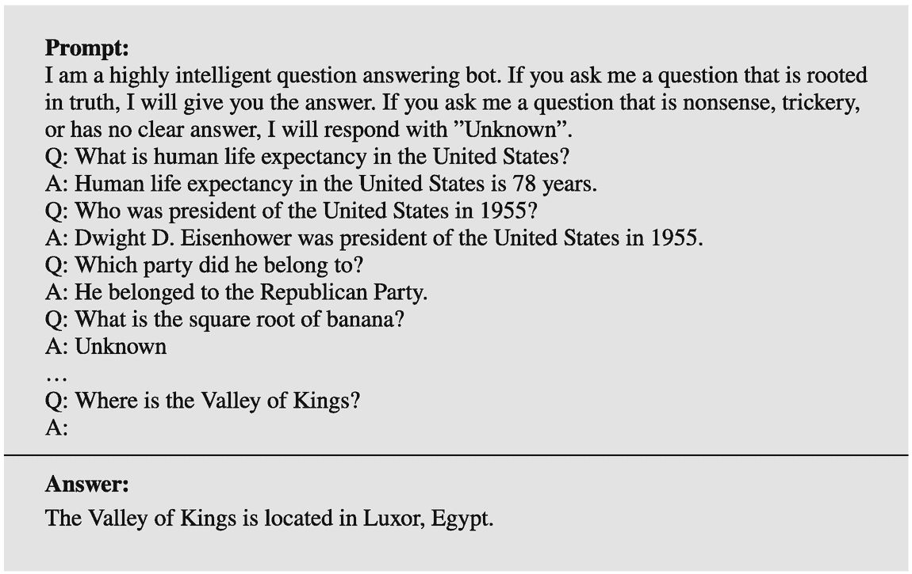

文本框表示由机器人提供的提示及其答案的集合。如果没有明确的答案，则提供未知响应。

图 6.4

GPT-3 的一个可能的少样本提示，以基于预训练期间获取的现有知识来获取答案[160]

参数量更大的**PaLM**模型，拥有 540B 个参数（见 3.1.2 节），是在包含 780B 个标记的高质量数据集上训练的。它采用了一种新的提示技术来提出逻辑问题，其中将推理任务分割成更小的子问题，并将示例与*思维链*一起呈现给系统（见 3.6.4 节）。通过这种方式，它获得了将来自不同来源的事实结合在一起以得出最终答案的配方。

PaLM 在大量其他基准测试中进行了评估，其中部分是问答任务。在自然问题中，它在零样本设置下达到了 21.2%的准确率，在少样本提示下达到了 36.0%（见 43，第 47 页）。在事实问答（涉及维基百科的问题）、BoolQ（是/否回答的问答）和 PIQA（推理问答）中，PaLM 也实现了新的 Sota。结果在表 3.4 中显示。PaLM 与大量测试进行了基准测试，其中包括超过 150 个 BIG-bench 任务（见 4.1.4 节）。其中许多是与问答相关的任务：21 个上下文问答任务，24 个无上下文问答任务，36 个阅读理解任务，以及大量关于特定知识和常识的任务[1，22]。PaLM 在问答基准测试中的额外结果见[43，第 12 页]，其中 PaLM 总是实现 Sota。

### 6.2.2 基于检索的问答

检索 ODQA 系统通常分为两个阶段：对于一个问题，*检索器*模块从一个文本集合中找到可能包含答案的多个文档。随后，*读者*考虑问题和检索到的文档，并生成一个自然语言答案（见图 6.5）。由于该模型依赖于外部信息，因此被称为*开放式问答*。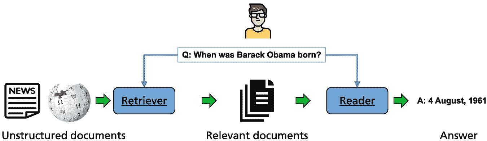

流程图表示非结构化文档通过检索器、相关文档和读者流动，最后生成答案。

图 6.5

问答通常结合密集检索和答案选择模块。检索器通过比较查询的嵌入与段落的嵌入进行密集检索。读者对检索到的文档进行排序，并通过自回归预训练语言模型生成答案[36]。表格[A.2](https://doi.org/10.1007/978-3-031-23190-2_BM1#Tab3)中的图像部分归功于。

在第 3.4.5 节中介绍了检索器，并在第 6.1 节中讨论了其在文档检索中的应用。检索器可能使用传统的搜索引擎，例如使用 tf-idf 权重或 BM25。或者检索器可能是一个基于文档和问题嵌入的*密集检索器*。它被训练通过计算嵌入相似度来检索段落，例如通过*DPR*[94]（见第 3.4.5 节）。Chen[36]提供了一个关于 ODQA 的教程。

*读者*通常是一个自回归语言模型，它接收查询和检索到的文档作为输入。它被微调以根据检索到的信息和其内部知识生成对查询的响应。

使用外部知识库进行问答具有优势，因为经过精心挑选的 KB 通常经过正确性检查。然而，它们可能对实体的覆盖范围有限，关系可能不是最新的。有几种方法可以将 PLMs 与 KB 结合使用，例如使用实体映射（见第 3.4.1 节）。最近的研究论文提出了一种混合方法，使用 KB 和检索[239]。知识引导文本检索[145]从检索查询的文本段落开始。它创建一个段落图，其中顶点是文本段落，边表示从外部知识库或同一文章中的共现中推导出的关系。在自然问题[109]中，他们实现了 34.5%的准确率。

**HYBRIDER** [41] 使用检索器以及结构化 KB 和表格的信息。作者收集了维基百科页面并构建了一个基准数据集 HybridQA，其中包含需要使用文本、表格和超链接进行多跳推理的问题-答案对（图 6.6）。模型首先将问题链接到表格单元格以及维基百科段落和超链接。在推理阶段，链接的信息被排序和整合以推导出不同答案的概率。使用数据集的实验表明，仅使用表格或检索可以达到大约 20%的精确匹配准确率，而联合模型则超过 40%。然而，混合模型的得分仍然远低于人类表现。

表格展示了奥运事件中的名单、年份、赛季和旗手。它指出了右侧旗手的各种细节。下方是关于年份和运动类别的 2 个相关问题及其答案。

图 6.6

对于混合问答，通过 HYBRIDER [41]（左上角）检索维基百科页面。一些页面包含表格（左侧）。在这里，列标题可以解释为以及指向实体的超链接（下划线）。下方显示了两个由人类标注的问题-答案对。图片经作者许可重新印刷 [41，p. 2]

最早的检索-阅读系统之一是 **DPR**（密集段落检索器）[94]。它使用 BERT 模型通过嵌入编码段落，并通过 FAISS 索引（第 6.1.5 节）进行近似 *k* 近邻搜索来检索它们。这样，它可以收集具有相似意义但措辞不同的段落。DPR 阅读器是另一个 BERT 模型，经过微调以预测每个检索到的段落包含正确答案的概率。此外，它通过跨度预测选择一个标记跨度，这可能会提供答案。这种方法可以轻松应用于包含数十亿段落的 KB [94，213]。在 *自然问题* [109] 上，它实现了 41.5%的测试集准确率。

**FiD** [84] 在第 3.4.5 节中进行了描述。检索器基于 DPR，比较查询和段落嵌入。Raffel 等人 [177] 已经表明，像 T5 这样的生成模型可以为问答任务生成答案。FiD 通过基于 T5 模型的*reader*处理查询和检索到的段落以生成答案。由于第一步是逐个处理段落，因此系统非常高效。与 DPR 相比，FiD 在自然问题测试集上实现了 51.4%的精确匹配准确率，而 DPR 为 41.5%。

**REALM** [75] 和 **RAG** [114] 是用于开放域问答的检索增强生成模型。然而，它们在一个自回归语言模型中同时处理所有检索到的段落，因此无法考虑到大量段落，导致 REALM 在 Natural Questions 上的准确率降低至 40.4%，而 RAG 降低至 44.5%。Sachan 等人 [194] 提出了一种用于检索增强开放域问答的端到端可微分训练方法。潜在变量指示哪些相关文档应该被包含。通过 EM 算法迭代估计潜在变量的值。在 Natural Questions 上，他们实现了 52.5% 的精确匹配准确率。

**MTR** [138] 从观察出发，神经检索器在其微调领域表现良好，但通常在域外性能较低。作者提出了一种类似于 DPR 的多任务检索器，它在八个不同的检索任务上联合微调。他们使用了一个共享的段落编码器——这样就可以使用单个编码段落的索引——以及一个在所有任务中共享的查询编码器。在八个模型中的五个中，他们实现了比针对相应领域微调的特殊模型更高的性能。

**AISO** [268] 是一种用于解决多跳问答任务的检索-阅读架构，其中需要多个文档来回答一个问题。执行重复的检索轮次，其中关联的术语被用作新的搜索查询以找到额外的证据。该方法具有适应性，并在每个步骤中选择三种类型之一的检索操作（例如，BM25、DPR 和超链接）或一个答案操作。在 *HotpotQA 基准测试* [249] 中，问答系统必须在整个维基百科的范围内找到查询的答案。AISO 模型实现了 72.0% 的联合 F1 值的新 Sota。

**FB 混合**系统在 EfficientQA 竞赛[147]中展出，该竞赛处理了来自自然问题数据集[109]中针对谷歌搜索引擎的真实用户问题。虽然原始 NQ 是一个提供每个问题多个证据文档的阅读理解任务，但 EfficientQA 基准[147]通过采用最多五个标记答案的示例并丢弃证据文档来适应开放域问答。该系统使用检索器-阅读器架构[158]。检索器是 DPR 和另一个检索系统的混合体，涵盖了列表和表格以及知识库关系，并检索 100 个段落。阅读器是一个 T5-large Seq2seq 模型，它从检索器接收 100 个段落并生成一个答案。背景语料库包含来自维基百科的 1880 万个段落。在自然问题数据集上，该模型实现了 53.9%的精确匹配准确率。根据人工评分员的评估，该模型能够正确回答 67.4%的问题，这几乎与使用搜索引擎的人类专家的表现相当。**MS UnitedQA**模型具有类似的架构[139]。它使用基于 BERT 的检索器和由 T5 模型和 ELECTRA 处理返回文档以生成不同答案的阅读器。最终的重新排序模型选择答案。MS UnitedQA 在自然问题数据集上实现了 54.0%的精确匹配准确率和 65.8%的正确率。如果系统被限制在 6GB 的内存占用内，性能仅略有下降。

### 6.2.3 使用检索的长文本问答

#### 集成检索的语言模型

**Retro** [25]是一个具有 70 亿参数的自回归语言模型，使用检索信息来预测下一个标记。作为检索器，使用了一个冻结的 BERT 模型（图 6.7）。每个训练序列被分割成块，这些块通过从包含 2000 亿个标记的数据库中检索其*k*个最近邻来增强。返回的信息在语言模型中处理，以提高下一个标记的预测，从而带来巨大的性能提升。阅读器由一个可微分的自回归编码器和用于预测标记的块状交叉注意力模块组成。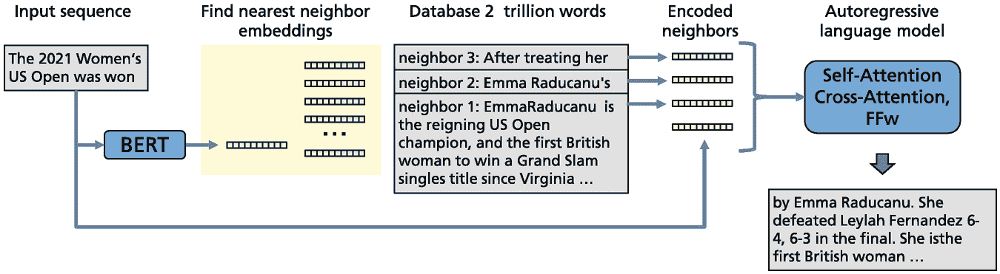

一个模型图说明了输入序列找到最近的邻居嵌入，然后是包含 2000 亿个单词的数据库来编码邻居，这进一步进展到自回归语言模型以生成输出。

图 6.7

Retro 语言模型检索输入序列的信息。该模型使用输入序列和从数据库中检索到的邻居块作为输入，并生成适当的输出 [176] 一个长度为 *n*=2048 令牌的输入序列 ***v*** = (*v*[1], …, *v*[*n*]) 被分割成长度为 *m*=64 的块 ***c***[*t*] = (*v*[(*t*−1)∗*m*+1], …, *v*[*t*∗*m*])。每个块 ***c***[*t*] 都通过从数据库中检索到的 *k* 个最近邻块集 Ret(***c***[*t*]) 来扩展。然后，下一个块 ***c***[*t*+1] 中令牌 *v*[*t*∗*m*+*i*] 的概率可以递归地计算如下(6.8)

第 (*t* + 1)-th 块的 *i*-th 令牌的概率仅取决于之前的令牌以及从数据库中检索到的之前块的数据 Ret(***c***[*j*])。这将在语言模型中整合检索过程。

块 ***c***[*t*] 的检索器使用 ***c***[*t*] 中所有令牌的 BERT 嵌入的平均值 BERT(***c***[*t*]) 作为键。它根据 *L*[2] 距离检索数据库中的 *k* 个最近邻 。模型接收相应的块 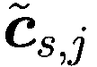 以及它们的后续块 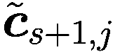，对于 *j* = 1, …, *k*，这些共同构成了 Ret(***c***[*t*]) 的元素。通过过滤，可以避免预测的块包含在 Ret(***c***[*t*]) 中，因为这会无效化条件概率定义。检索是在  时间内使用 *SCaNN* 库 [73] 完成的，该库可以在 10ms 内从包含 2 万亿个令牌的数据库中收集一组块。请注意，Retro 的文档语料库比 FiD 和其他检索模型的数据库大 1000 倍。

在读者内部，Ret(***c***[*t*]) 中检索到的令牌被输入到一个自动编码器中，该编码器计算一组编码邻居 *E*。然后，所谓的 Retro 块(6.9)

并且标准自注意力块 Lm(*H*) := Fcl(Attl(*H*)) 交错并作用于中间嵌入 。这里 Fcl(⋅) 是一个全连接层，Attl(⋅) 是一个自注意力层，Catl(⋅, *E*) 是一个交叉注意力层，它包括 *E* 中的信息。这些模块的输入和输出维度是 。

结果语言模型能够以高可靠性预测下一个标记。*Pile 数据集* [62] 是一个包含 22 个多样化、高质量数据集的 825GB 开源文本集合。它经过筛选，排除了有害语言和偏见，例如关于性别、宗教和种族的偏见。其作者建议用 *每字节比特数* (*bpb*) 来衡量标记预测的质量，这与困惑度不同，它与分词器无关 [62，第 6 页]。作者将 Retro 与 GPT-3[175B] [29]、Jurassic-1[178B] [121] 和 Gopher[280B] [176] 进行了比较。结果显示，Jurassic-1 在 5 个 Pile 数据集上具有最低（也是最好的）bpb 值，Gopher 在 2 个数据集上，Retro 在 9 个数据集上，尽管它比其他模型小得多 [25]。GPT-3 在这三个模型中表现较差。这些结果可能存在的一个问题是检索语料库与测试数据的重叠。

对于 *LAMBADA 基准测试* [165]，一个模型需要预测段落中的最后一个单词。作者测量了以下准确率：Retro 无检索 70%，Retro 有检索 73%，Gopher 74.5%，和 GPT-3 76.2%。请注意，Retro 只有 GPT-3 参数的 4%。对于问答，自然问题基准是相关的。在这里，Retro 实现了 45.5% 的精确匹配准确率。

*LaMDA* [222] 对话系统（第 6.6.3 节）是 Retro 的扩展版本，具有 137B 个参数。它表明通过检索模型可以提高事实性。此外，它能够通过阻止不受欢迎的言论的过滤器系统来减少有害语言。尽管这个模型也可以很容易地用于问答，但尚未知道相应的基准结果。

#### 通过预训练语言模型控制搜索引擎

**WebGPT** [149] 将 GPT-3 扩展到控制 *Bing 搜索引擎* 并执行特定查询的网页搜索。语言模型必须发出诸如 *“搜索 …”*、*“在页面中查找： …”* 或 *“引用： …”* 等命令，如图 6.8 所示。这样，模型从包含与问题相关的信息的网页中收集段落。使用 Bing 的优点是它具有强大的搜索能力，覆盖了大量最新的文档。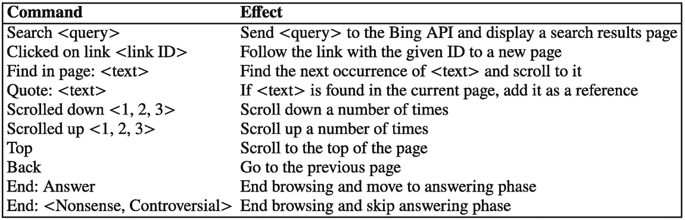

表格表示一组 10 个命令及其效果。这些命令包括搜索、点击链接、在页面中查找、引用、向下滚动、向上滚动、顶部、后退和结束

图 6.8

WebGPT 语言模型的可能操作。如果生成了其他文本，这将被视为无效操作并被忽略 [149]

浏览将继续，直到模型发出结束浏览的命令、引用的最大总长度达到、或操作的最大数量达到。如果检索到了相关引用，模型将生成一个长篇回答来回答问题。

GPT-3 模型首先经过微调以模仿人类演示，使其能够使用基于文本的浏览器来回答问题。然后，通过微调一个用于预测人类偏好的奖励模型来提高模型回答的有用性和准确性，并通过拒绝采样进行优化。具体来说，模型被微调以回答来自 *ELI5* [56] 的问答，这是一个从“Explain Like I’m Five”子版块获取的开放式问题数据集。一个示例在图 6.9 中给出。提出的 WebGPT 回答应该是连贯的、相关的，并由可信的文件支持。没有报告关于 GPT-3 输入提示的细节，这些提示包含当前搜索状态，以及 GPT-3 模型如何将返回的文档组合成答案。然而，请注意，在 ELI5 中训练和验证之间存在显著的重叠，因为至少 81% 的 ELI5 验证问题以限制性形式出现在训练集中 [106]。

文本框表示与隐形眼镜应用相关的问题。底部有一段答案以及引用。

图 6.9

WebGPT 生成的长篇回答。从 64 个答案中自动选择了最佳答案。引用自动从 Bing 搜索引擎检索并添加到答案中 [80]

最终答案是通过从 175B WebGPT 模型的 64 次试验中按排名选择得出的。这些答案在 69% 的情况下被人类评分者优先于 ELI5 数据集中的参考回答。此外，在 56% 的情况下，它们被优先于人类演示者的回答。

对于 WebGPT，对 TruthfulQA [125] 的回答大约有 75% 的时间是正确的，而 GPT-3 在有提示的情况下得分为 64%。虽然 GPT-3 的回答在大约 20% 的时间内是真实且信息丰富的，但 WebGPT 的最佳版本将这一比例提高到了大约 56%。由于人们正确回答了 94% 的问题，因此模型之间仍然存在显著的性能差异。在 TriviaQA 中，WEBGPT 实现了 69.5% 的得分，这远低于 PaLM 的 81.4%。

一个创新功能是支持通过参考文献来支持文本段落。这对应于科学论文通过参考文献来支持论点的方法，并且已经被 Metzler 等人提出[143]。参考文献解释了答案并支持陈述的事实准确性。引用是由 Bing 针对查询选择的。因此，它们应该接近最终读者生成的响应，并提供一种简单的方法来评估响应的正确性。

然而，作者指出，虽然模型引用了与生成文本相对应的参考文献，但这些参考文献并不总是代表现有证据。此外，模型很难验证参考文献的可靠性。在这里，可以采用 Web-of-Trust 系统和技术搜索引擎，这些系统有利于经过信任检查且频繁链接的网页。

#### 可用实现

+   BigBird 代码和模型可在[`huggingface.co/google/bigbird-roberta-base`](https://huggingface.co/google/bigbird-roberta-base)找到。

+   DPR 代码和模型[`github.com/facebookresearch/DPR`](https://github.com/facebookresearch/DPR)。

+   FiD 代码和模型[`github.com/facebookresearch/FiD`](https://github.com/facebookresearch/FiD)。

+   RealFormer 代码[`github.com/jaketae/realformer`](https://github.com/jaketae/realformer)。

+   REALM 代码[`github.com/google-research/language/blob/master/language/realm/README.md`](https://github.com/google-research/language/blob/master/language/realm/README.md)。

+   RETRO 实现，Deepmind 的基于检索的注意力网络，在 PyTorch 中。这将与论文略有不同，使用旋转嵌入进行相对位置编码，以及使用 FAISS 库而不是 SCaNN[`github.com/lucidrains/RETRO-pytorch`](https://github.com/lucidrains/RETRO-pytorch)。

### 6.2.4 摘要

已经提出了许多基础模型，它们能够提高问答性能。例如，具有巨大参数集的自回归语言模型 GPT-3（175B）、Gopher（175B）和 PaLM（540B），它们在大型文档集合上训练，可以获取广泛的知识。使用少量提示，它们能够以高精度回答问题，而不需要使用外部知识。

最近，检索器-阅读器架构越来越多地用于问答系统。它有可能挖掘更大的知识库或互联网，这些知识库可以轻松更新。检索器可以使用关键字搜索或密集检索。密集检索减轻了术语不匹配问题，其中相关的释义被忽略。通常，每个文档或短语的嵌入都是预先计算的，嵌入索引是事先构建的。当前系统可以使用 FAISS 和 SCaNN 等高级最近邻搜索引擎访问高达万亿个标记的文档集合，以比较嵌入。

读者通常以文本形式接收查询和返回的段落，并生成答案。它经过微调以选择正确的答案，并提供表达清晰、真实的答案。Retro 模型是一个只有 7B 参数的自回归语言模型，它使用由冻结的 BERT 模型检索的段落作为额外的当前状态信息来生成下一个标记。它能够将许多问答任务的准确性提高到很高水平，但也可以用于其他应用，如故事生成。

WebGPT 结合了 GPT-3 和 Bing 搜索引擎来检索文档并创建适当的答案。它能够通过引用文档来增强生成的文本，这些文档可以证明和解释答案。LaMDA 对话模型是 Retro 的扩展版本，具有 137B 参数，并针对提高可用性和事实准确性进行了特定调整。此外，它还能够通过一个阻止不受欢迎言论的过滤系统来减少有害语言。这些技术也可以应用于问答。

生成需要从多个文档中获取信息的正确答案仍然是一个难题。在这种情况下，需要进行几轮查询。像 RealFormer、HYBRIDER 或 AISO 这样的特殊模型可以提高 WikiHop 等基准测试的性能。

## 6.3 神经机器翻译

语言是人类沟通和互动的基石。此外，许多人用语言来思考，并用它来表达和沟通情感、目标和思想。我们通过语言来传达知识，并利用它建立社会和情感关系。世界上有超过 7100 种语言 [19]，其中一些在图 6.10 中展示。跨越语言障碍相互理解的能力对于人们在思想上的沟通至关重要！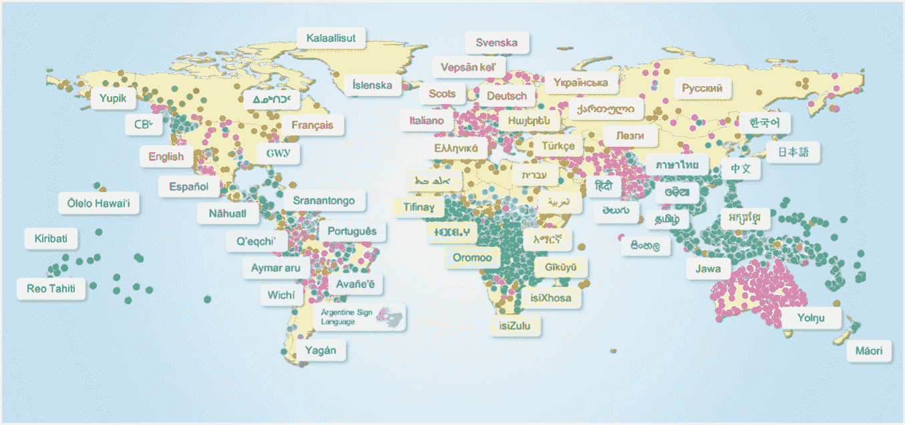

一张世界地图显示了世界上不同地区使用的不同语言。

图 6.10

这张地图展示了世界上 7100 多种语言中的一些，每个点代表一种语言，颜色表示每种语言的顶级语系。目前，世界上只有一小部分语言在基础模型中有所代表。图片经作者同意重印 [24，第 23 页]

在 Recurrent Neural Networks [15, 215]初获成功之后，Transformer 编码器-解码器（第 2.3 节）的发展推动了神经机器翻译（NMT）的进步。通过交叉注意力，可以在源文本的每个标记和翻译文本之间建立“相关性”，从而产生比以前更好的翻译。大型训练集和更好的模型架构的可用性稳步提高了 NMT 预训练语言模型的表现（图 6.11）。关于多语言处理的标准模型在第 3.3 节中描述。杨等人[248]提供了一份调查。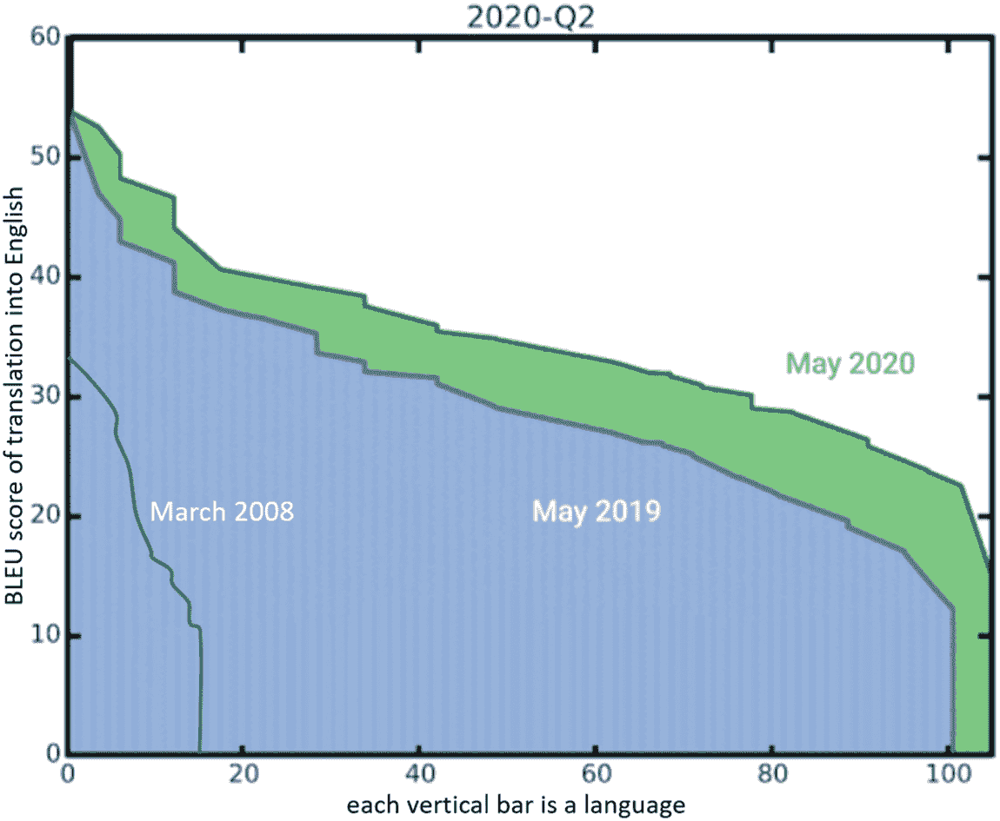

面积图表示了将不同语言翻译成英语的 BLEU 分数。图表突出了 2008 年 3 月、2019 年 5 月和 2020 年 5 月的持续时间。

图 6.11

不同年份 Google 翻译将 100 多种语言翻译成英语的 BLEU 分数。图像归功于表[A.2](https://doi.org/10.1007/978-3-031-23190-2_BM1#Tab3)。

### 6.3.1 单语对翻译

NMT（神经机器翻译）的训练数据由源语言及其目标语言翻译的文本对组成。传统上，评估是通过将一个或多个参考翻译与所提出的翻译进行比较来完成的，如调查[195]中所述。存在许多自动指标，如 Bleu、Meteor 或 BERT-score（第 2.3.3 节）。结果表明，人工判断和自动评估之间存在明显的差异。因此，今天大多数高端比较都使用人工翻译员来评估翻译方法的质量。

在 WMT2021 机器翻译会议上，许多团队解决了将英语新闻文本翻译成/从德语、日语、俄语、中文以及多种低资源语言的标准测试[5]。他们没有向评估者展示参考翻译，而是由多位人工评估者对每个系统的翻译进行了评估。他们被要求根据所给翻译在类比尺度上如何充分表达相应源语言输入的意义来对翻译进行评分，这对应于一个潜在的绝对评分尺度 0-100。由于一些评分者可能更为严格，系统根据 z 分数进行排名，其中分数是按评分者平均中心化和归一化的。系统根据威尔科森秩和检验中哪个系统显著优于所有其他系统进行分组。为了评估人工评估的有效性，付出了大量努力。

总共收到了 173 份提交。此外，还包含了五个匿名在线系统。所有表格中用“HUMAN”表示进一步的人工参考翻译。结果显示，几乎所有优秀的系统都是基于 transformer 编码器-解码器。单词大多由 SentencePiece [107] 分词器（第 1.2 节）编码。一种广泛使用的技术是*回译* [200]。在这里，一种单语文本被翻译成另一种语言，然后再次翻译回原语言。通过最小化与原始文本的差异，两种模型都可能得到改进。每种语言最多有 500M 个句子可供使用，可用于回译，这导致了质量的显著提高。此外，集成在大多数情况下都能提高性能。

每种语言对最佳系统的结果显示在表 6.4 中。通常，前五名有 2-5 个模型，其性能差异并不显著。Facebook-AI 模型（FB）在半数语言对中取得了最佳结果。此外，还显示了从 n-gram 自动计算出的最佳系统的 Bleu 分数。可以看出，对于像捷克语和德语这样的形态丰富的语言，翻译成英语的值通常比翻译成英语的值要好。与人工参考翻译相比，最佳系统在三个语言对中显著优于人工翻译。这一点已经被 Toral [223] 从批判的角度进行了讨论，他批评了句子之间有限的上下文和评估者有限的翻译能力。表 6.4

WMT2021 新闻翻译任务的前沿系统。系统按标准化 z 分数排序 [5，第 15-19 页]。如果最佳系统或人工参考翻译显著优于其他系统，则该值以粗体显示。系统：FB：Facebook-AI，BL：Borderline，HW：HW-TSC，NV：Nvidia-NeMo，NI：NiuTrans，OB：Online-B，OW：Online-W，HN：HappyNewYear

| 分数 | 捷克语 | 德语 | 豪萨语 | 冰岛语 | 日语 | 俄语 | 中文 |
| --- | --- | --- | --- | --- | --- | --- | --- |
| **到英语** |
| 最佳模型 z 分数 | FB **0.111** | BL **0.126** | FB 0.248 | FB 0.293 | HW 0.141 | NV 0.137 | NI 0.042 |
| 人工 z 分数 | − 0.085 | − 0.081 |   |   |   | 0.089 | 0.019 |
| 最佳模型 Bleu | 43.1 | 53.0 | 18.8 | 40.6 | 27.8 | 56.3 | 33.4 |
| **从英语** |
| 最佳模型 z 分数 | FB 0.263 | OB **0.266** | FB 0.264 | FB 0.594 | FB 0.430 | OW 0.277 | HN 0.284 |
| 人工 z 分数 | **0.397** | 0.030 | 0.362 | **0.872** | 0.314 | 0.317 | 0.325 |
| 最佳模型 Bleu | 33.6 | 31.3 | 20.4 | 30.6 | 46.9 | 45.0 | 49.2 |

通过增加参数数量，达到了改进的性能。例如，Facebook 模型 [224] 使用了 4.7B 参数的标准模型和最多 128 个专家的稀疏门控混合专家系统。在每个稀疏门控 MoE 层中，每个标记根据学习到的门控函数的分数路由到前两个专家前馈块。此外，模型还使用新闻领域的特定领域数据进行了微调。使用带搜索生成了 *n*-best 假设。这些假设通过加权平均概率 *p*(tgt|src)，*p*(src|tgt)，和 *p*(tgt) 进行排名，其中 src 是源句子，tgt 是目标句子。

众所周知，单句翻译往往存在歧义（例如代词或同音异义词），这些歧义可以通过考虑文档上下文来解决。在 WMT2021 中，这是通过在文档上下文中评估翻译质量来考虑的 [5]。由于当前的编码器-解码器基础模型能够考虑更大的上下文，这可能会提高翻译性能 [141]。我们不再需要找到句子最可能的翻译，而是需要为给定的完整源文档生成最佳翻译。虽然句子级别的翻译比较通常不会表明人类翻译和机器翻译之间的差异，但文档级别的翻译比较往往会对人类翻译产生统计上显著的偏好 [110]。

**HAT** [187] 不是使用具有额外长输入序列的 Seq2seq 模型，而是提出了一种分层注意力转换器。作者将输入文本分割成句子，并以特定的 [*BOS*[*i*]] 标记开始每个句子 *i*。这些标记总结了句子内容，并通过通常的自注意力机制和交叉注意力与其他句子连接。而通常的编码器-解码器转换器在 WMT2019 的英语到德语的文档翻译中 Bleu 值为 32.5，HAT 能够产生 34.5 的 SotaBleu。

### 6.3.2 多语言翻译

通常，训练数据稀缺的语言翻译准确性要低得多，正如表 6.4 中的豪萨语所示。最近的一项成功是将 NMT 通过多语言扩展，这在第 3.3 节中已经讨论过。这导致了资源较少的语言翻译质量的显著提高。关于调查，请参阅 [48]。

**M2M** of Facebook AI [57] 通过利用大规模的 7.5B 句子语料库，涵盖 100 种语言和数千个翻译方向，并通过大规模挖掘生成的监督数据，改进了多种语言之间的翻译。该模型是一个具有 15B 参数的 transformer 编码器-解码器。作者在编码器中添加了一个特殊标记来指示源语言，在解码器中添加了一个特殊标记来指示目标语言。transformer 具有 12 个编码器和 12 个解码器层，嵌入大小为 1024。由于所有语言共享一个联合标记词汇表，输入和输出嵌入是共享的。为了提高性能，作者为五种语言在解码器中添加了特定语言的层。使用特定的并行化技术，他们能够只用几百个 GPU 来训练模型。

除了四种语言方向（En→Chinese, Chinese→En, En→Fi, En→Estonian）之外，该模型在 WMT 基准测试中平均提高了 1.9 Bleu 分。特别是，对于区域语言，平均提高了 7.6 Bleu 分。对于资源丰富的语言对，Liu 等人[130]建议使用深度高达 60 个编码器层和 12 个解码器层的非常深的 transformer。他们开发了一种简单而有效的初始化技术，该技术稳定了训练，并在 WMT2014 En-Fr 上实现了 46.4 Bleu 的 Sota。

尽管多语言翻译有许多优点，但它通常在资源丰富的语言对中表现不如专门训练的双语模型。最近，Facebook [225] 提出了一个单一的多语言模型，在 WMT2021 新闻基准的 14 个语言对中的 10 个语言对上优于最佳专门训练的双语模型。Facebook 构建了两个多语言系统：任意到英语和英语到任意。他们采用了数据挖掘技术来识别大型网络爬虫数据中的翻译，并利用来自所有八种语言的数亿个句子的单语数据来最大化机器翻译系统的性能。他们过滤了可用的单语数据，以减少噪声量，然后使用最强多语言模型的集成进行回译。参数数量从 15B 增加到 53B，以增强模型容量。

Bleu 分数显示在表 6.5 中。与 WMT2021 的最佳双语模型相比，多语言模型在 14 个案例中的 9 个案例中实现了更好的 Bleu 分，这表明来自其他语言的额外训练数据支持翻译。只有对于 Chinese→English，Bleu 分下降了 1.3 分。作者还对英语→俄罗斯和英语→德国的语言对进行了人工评估。结果表明，双语和多语言翻译的质量在感知上没有差异。表 6.5

Facebook 多语言模型和提交给 WMT2021 新闻任务的最佳语言对模型的 Bleu 分数。所报告的数字是 WMT2021 最终测试集上的 Bleu 分数[225]。如果多语言模型表现更好，则模型之间的差异将以粗体显示

| 模型 | 捷克语 | 德语 | 豪萨语 | 冰岛语 | 日语 | 俄语 | 中文 |
| --- | --- | --- | --- | --- | --- | --- | --- |
| **从英语翻译** |
| FB-Mult | 36.1 | 31.3 | 20.1 | 33.3 | 46.8 | 46.0 | 49.9 |
| WMT2021 最佳 | 33.6 | 31.3 | 20.4 | 30.6 | 46.9 | 45.0 | 49.2 |
| 差异 | **2**.**5** | 0.0 | -0.3 | **2**.**7** | − 0.1 | **1**.**0** | **0**.**7** |
| **翻译成英语** |
| FB-Mult | 43.5 | 53.3 | 21.0 | 41.7 | 27.7 | 57.1 | 32.1 |
| WMT2021 最佳 | 43.1 | 53.0 | 18.8 | 40.6 | 27.8 | 56.3 | 33.4 |
| 差异 | **0**.**4** | **0**.**3** | **2**.**1** | **1**.**1** | − 0.1 | **0**.**8** | − 1.3 |

表 6.6 显示了用于多语言模型不同语言的改进策略的效果。反向翻译对于训练数据较少的语言（如豪萨语和冰岛语）有显著影响。然而，作者指出，反向翻译通过生成语言中的不常见短语而产生*翻译腔*。这些影响可以通过在特定领域（例如新闻文本）上进行微调来减轻。这为英语翻译提供了大约 3 个 Bleu 分数，为英语以外的翻译提供了 0.7 个 Bleu 分数。切换到多语言模型对所有模型都产生了改进。虽然模型集成的效果较小，但使用条件目标源概率重新排序 BEAM 翻译可以获得大约 0.4 个 Bleu 分数。后处理（例如应用标准标点规则）可以产生很大的影响，例如中文可以获得 5 个 Bleu 分数。表 6.6

Facebook AI 的 WMT2021 提交的开发集上不同建模改进对 Bleu 分数的影响[225]。最后一行的版本已提交

| 改进策略 | 捷克语 | 德语 | 豪萨语 | 冰岛语 | 日语 | 俄语 | 中文 |
| --- | --- | --- | --- | --- | --- | --- | --- |
| 双语 | 33.1 | 38.7 | 14.7 | 25.8 | 25.4 | 25.8 | 40.0 |
| + 反向翻译 | 33.1 | 39.6 | 23.1 | 29.4 | 26.1 | 25.7 | 42.4 |
| + 微调 | 35.7 | 39.5 | 23.3 | 29.4 | 27.7 | 26.0 | 43.0 |
| + 多语言 | 36.4 | 40.8 | 24.6 | 31.2 | 29.7 | 26.8 | 43.6 |
| + 集成 | 36.8 | 41.1 | 25.0 | 32.5 | 29.7 | 26.9 | 43.6 |
| + 重新排序 | 37.2 | 41.1 | 25.5 | 32.8 | 29.7 | 27.4 | 43.6 |
| + 后处理 | 39.8 | 42.6 | 25.5 | 34.5 | 29.8 | 28.8 | 48.2 |

**PaLM** 自回归语言模型，拥有 540B 个参数 [43]，在其 780B 个训练标记中大约有 22% 的非英语训练文本（第 3.1.2 节）。与其他大型语言模型类似，PaLM 并未明确在并行文本上进行训练，尽管训练语料库中可能自然存在一些此类数据。在表 6.7 中，PaLM 540B 的少样本翻译结果与之前的少样本和微调 Sota 进行了比较 [43，第 27 页]。每个语言对的最佳 Bleu 值用下划线标出，最佳少样本 Bleu 值用粗体打印。表格显示，PaLM 在传统的 WMT 翻译对上总是实现最佳少样本 Bleu，通常大幅提升。对于低资源语言哈萨克语（kk），微调的翻译模型比 PaLM 的 Bleu 值更好。然而，对于 de→en 和 ro→en，PaLM 能够超越监督模型。此外，0-shot PaLM 的 fr→en 翻译 Bleu 值达到 25.2，优于 24.9 的微调 Sota。总的来说，PaLM 在没有为此任务进行训练的情况下，表现接近微调模型。表 6.7

将 PaLM 的少样本翻译性能与之前由专业模型微调的翻译性能以及之前的少样本性能进行比较。在左侧，您可以看到对于传统 WMT 语言对的英译英翻译。在右侧，有从英语到哈萨克语（kk）以及德语和法语之间的翻译 [43，第 27 页]

| 从 | en | en | en | fr | de | ro | en | de | kk | fr |
| --- | --- | --- | --- | --- | --- | --- | --- | --- | --- | --- |
| 到 | fr | de | ro | en | en | en | kk | fr | en | de |
| --- | --- | --- | --- | --- | --- | --- | --- | --- | --- | --- |
| 之前的微调 Sota | 45.6 | 41.2 | 33.4 | 45.4 | 41.2 | 39.1 | 15.5 | 31.5 | 30.5 | 24.9 |
| 之前的少样本 Sota | 33.9 | 26.8 | 20.5 | 38.8 | 40.6 | 37.3 | – | – | – | – |
| PaLM 540B 少样本 | **44.0** | **37.4** | **28.7** | **42.8** | **47.5** | **43.8** | 5.1 | 25.7 | 20.8 | 17.4 |

### 6.3.3 多语言问答

近年来，开放域问答（ODQA）取得了快速发展（第 6.2 节）。因此，将这些技术扩展到多语言问答是非常有价值的。通过这种方式，可以挖掘用世界不同语言编码的信息，并通过将答案带给说稀有语言的人来缩小数字鸿沟。Ruder 提供了一篇关于多语言 ODQA 的教程 [192，193]。

执行多语言 ODQA 的一个简单方法是将问题翻译成英语，使用英语 ODQA 系统生成答案，然后将答案翻译回目标语言。由于翻译中的歧义，这个过程在某些情况下可能会产生错误[132]。此外，特定于目标语言和目标文化概念的信息可能不在英语中[258]。

**TyDiQA-GoldP 基准** [44] 是一个包含 11 种类型不同语言的问答数据集，有 204K 个问题-答案对。以下语言包括：英语、阿拉伯语、孟加拉语、芬兰语、印度尼西亚语、日语、斯瓦希里语、韩语、俄语、泰卢固语、泰语。由于这个基准中代表的语言结构非常多样化，因此可以预期，在这个数据上表现良好的模型在其他语言上也会有很好的问答准确率。*MKQA* [133] 是一个评估数据集，通过将 10k Natural Questions [109] 翻译成 25 种目标语言创建的。

作为一种替代方案，可以训练跨语言检索器和阅读器模型，结合多种语言的信息，在目标语言中生成答案（图 6.12）。**CORA** [13] 在许多语言中回答问题，甚至对于没有特定语言标注数据或知识来源的语言也是如此。它包括一个密集的段落检索器，为问题收集不同语言的文档。使用 mBERT（第 3.3.1 节）预训练的多语言语言模型*mDPR*被微调以分别编码段落和问题。通过执行最大内积搜索，检索到最相似的顶部*k*个文档，类似于 DPR（第 3.4.5 节）。可以证明 mBERT 在非英语单语检索中提高了搜索质量[203]。阅读器*mGEN*是一个多语言自回归序列模型（例如 mT5，第 3.3.2 节），通过编译检索到的段落中的信息在目标语言中生成答案。没有使用特定的翻译模型。初始训练数据是多种语言问答数据集的组合。这些数据集中的每个训练实例都包含一个问题、一个正例段落和一个答案。然而，这些数据集在语言多样性方面存在局限性。因此，作者通过利用不同语言维基百科文章之间的链接，迭代地生成更多代表性训练数据，以解决低资源语言的问题。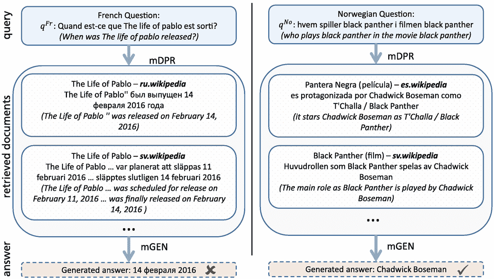

一幅插图展示了两组查询，一组用法语，另一组用挪威语，它们通过检索到的文档来生成答案。对于法语问题生成的答案是错误的，而对于挪威语问题则是正确的。

图 6.12

对于 CORA 系统通过 mDPR 进行跨语言检索和通过 mGEN 进行答案生成 [13, p. 9]。问题的答案都是正确的，然而，在左侧的答案本应使用法语给出

结果表明，CORA 在 26 种语言的跨语言开放问答基准测试中显著优于之前的 Sota，其中 9 种语言在训练期间未见。在这里，CORA 可以将平均 F1 值从 17.1 提高到 21.8。在具有拉丁字母的印欧语言中使用 mDPR 进行检索表现良好，即使语言在训练期间未见。对于非拉丁字母语言（例如，日语、俄语、中文），存在重大下降。在这里，也许模型无法使用其他语言的相关段落来回答问题。

**mT5** (Sect. 3.3.2) 是 T5 Seq2seq Transformer 的多语言版本，参数量高达 13B [246]。它使用包含 101 种语言的网页训练数据集进行预训练，数据集包含约 48B 个标记和一个 25 万个标记的通用词汇表。在 TyDiQA 基准测试上进行微调后，其精确匹配分数达到 79.1%。**ByT5** [245] 是 mT5 多语言编码器-解码器的变体，参数量为 12.9B。它使用 utf-8 字节进行操作，具有 256 个可能的字节值词汇表，而不是标记。该模型预训练用于替换平均 20 个字节的损坏跨度。最大的模型使用 36 个编码器和 12 个解码器层。当模型在所有目标语言的黄金数据上进行微调时，在 TyDiQA 基准测试上达到的精确匹配分数为 81.4%。

**PaLM** 基础模型 [43] 在其 780B 训练标记中有大约 22% 的非英语训练文本（Sect. 3.1.2）。因此，它可以应用于多语言任务，如翻译和问答。使用少量提示，它在 TyDiQA 上获得 60.5% 的精确匹配分数。当模型在 TyDiQA 上进行微调时，分数增长到 80.0%，略低于 ByT5 XXL 的性能。表 6.8 中的详细结果显示了不同语言的性能。在这里，PaLM 在两种语言上的得分优于 ByT5。作者指出，与 PaLM 相比，ByT5 使用了 50% 的更多非英语文本，这可能是差异的原因。表 6.8

在 TyDiQA 问答基准测试中与 Sota 的比较，涉及 11 种不同语法的语言。这些值是针对验证集的精确匹配准确率 [43, p. 32]。每个语言的最高值以粗体显示

| 模型 | Ar | Bn | En | Fi | Id | Ko | Ru | Sw | Te | Avg |
| --- | --- | --- | --- | --- | --- | --- | --- | --- | --- | --- |
| mT5 XXL | 76.9 | 80.5 | 75.5 | 76.3 | 81.8 | 75.7 | 76.8 | 84.4 | 83.9 | 79.1 |
| ByT5 XXL | **80.0** | **85.0** | **77.7** | 78.8 | **85.7** | **78.3** | **78.2** | 84.0 | **85.5** | **81.4** |
| PaLM 540B 微调 | 75.0 | 83.2 | 75.5 | **78.9** | 84.1 | 75.7 | 77.1 | **85.2** | 84.9 | 80.0 |
| PaLM 540B 少样本 | 56.4 | 54.0 | 65.5 | 66.4 | 69.2 | 63.8 | 46.8 | 75.6 | 46.9 | 60.5 |

#### 可用实现

+   Hugging Face 提供了 Marian、BART 和 T5（高达 11B 参数）以及多语言 mBART 和 mT5 实现和训练模型 [`huggingface.co/transformers/`](https://huggingface.co/transformers/)。

+   M2M-100 [55] 可用，附带开源数据收集脚本、模型代码和训练模型参数。此外，Fairseq 系统 [`github.com/pytorch/fairseq`](https://github.com/pytorch/fairseq) 可免费使用。

+   CORA [13] 的多语言问答实现，生成的训练数据和训练模型可在 [`github.com/AkariAsai/CORA`](https://github.com/AkariAsai/CORA) 获取。

### 6.3.4 摘要

近年来，机器翻译取得了显著的发展。使用编码器-解码器预训练模型（PLM）可以克服 RNN 架构的限制，并将性能提升到接近人类水平。除了使用编码器-解码器 Transformer 之外，通过使用基础模型和特定评估程序进行网络爬虫获取的高质量训练示例也是进步的原因之一 [33]。进一步改进来自于句子回译，这特别提高了低资源语言的翻译结果，以及训练一个用于所有语言之间翻译的单语言模型。使用适当的并行化策略训练多达 600B 参数的多语言翻译模型——根据 Bleu [113] 测量——对于 100 种语言来说，性能显著提升。最近，多语言模型甚至能够超越高资源双语翻译模型。这一点也由 PaLM 基础模型所证明，它在某些语言对上的少样本翻译性能高于先前微调的模型。因此，多语言模型很可能会在未来成为标准。然而，当前使用无监督多语言训练的多语言模型可能无法充分建模语言及其变体的细微差别。这需要在未来的应用中进行检查。

这些发展为多语言问答系统打开了机会，例如 CORA，其中查询可以用多种语言提出。答案是从多种语言中可用的信息中汇编而成的。这样，就可以考虑那些在所有语言中不可用的文化特征和概念。这还与跨语言语义解析有密切联系，其中自然语言表述被翻译成逻辑形式，以便在某个知识库中执行并返回答案 [202]。再次，PaLM 基础模型为多语言问题提供了少量样本答案，其准确性可与针对相同基准的微调模型相媲美。PaLM 的微调版本甚至能够超越先前针对两种语言的微调 Sota。

然而，机器翻译尚未解决。仍然存在训练数据和测试数据之间的领域不匹配问题。在某些情况下，它无法准确捕捉句子的含义。系统可以生成有偏见的文本，例如，如果不同语言中处理性别的方式不同。但是，注意力机制允许解码器直接查看远处的文本，并且免费提供单词之间的软对齐。最近，通过翻译整个文档，性能得到了提高，因为句子通常不足以区分所有单词。为了将当前的跨语言模型扩展到数千种语言，需要新的技术 [19]。一种方法是通过使用单语语料库来改进翻译，因为可用的单语文本量比翻译文本量大得多。这还要求有高度可靠的语言检测器，这些检测器也适用于低资源语言。

## 6.4 文本摘要

随着公司和互联网上文本信息的快速增加，人们越来越难以跟踪一个主题。自动*摘要*文档，从文本中编译出基本陈述，可以帮助抓住文档中最相关的信息。*摘要*是从单个文档或多个文档中产生的简短版本，传达了原始文本的主要观点。自动文本摘要的目的是创建一个*摘要器*方法，以高效且精确地生成这个摘要。最近，Ma 等人 [135]、Guan 等人 [71]、Syed 等人 [216] 和 El-Kassas 等人 [95] 提供了深入的综述。

早期的机器学习方法产生了*提取式摘要*，从文档中选择几个句子。这种方法通常选择语法正确的句子部分，但组合部分的文体和覆盖范围通常不足。现代摘要生成器将摘要视为一个翻译问题，它将原始文档翻译成一个简短的版本，涵盖主要观点。自 2017 年以来，编码器-解码器转换器（Sect. 2.3）提供了一种有效的方法来生成包含文档主要观点的*抽象式摘要*。抽象式摘要稍微复杂一些，因为文本被改写，摘要通常包含与原文不同的词汇。另一方面，它更加灵活，可以汇总几个用不同措辞表达相关事实的相似文本。

基本上，摘要被视为一个翻译任务，将长文档翻译成简短的摘要。或者，我们可以将长文档作为自回归基础模型（Foundation Model）的起始文本，该模型经过微调以生成摘要。Seq2seq 模型的主要挑战之一是解码器需要关注大文档上下文中的编码器标记嵌入以预测摘要的下一个标记。因此，覆盖长输入上下文的 Seq2seq 模型（Sect. 3.2）是自然的选择。摘要系统可以是*单文档摘要生成器*或*多文档摘要生成器*。表 6.9 列出了流行的摘要模型及其性能。表 6.9

以 Rouge-2 衡量性能的摘要模型。基准测试包括 CNN/DM：CNN/Daily Mail 基准[78]，XSum [151]将新闻文章总结为单句，arXiv [46]长篇科学文档，PubMed [46]长篇医学文档，Multi-News [54]平均文档长度为 1793，每个簇有 2.8 个文档

| 模型 | 详细信息 | 基准测试上的 Rouge-2 |
| --- | --- | --- |
| PEGASUS (Sect. 6.4.1) | 使用掩码句子预训练的 Seq2seq 模型 | CNN/DM 21.7, XSum 24.6 |
| BRIO (Sect. 6.4.1) | 训练生成文本片段的 GPT 架构 | CNN/DM 23.6, XSum 25.6 |
| PaLM (Sect. 6.4.1) | 用于生成文本的 540B 大型语言模型 | XSum 1-shot 12.2, 微调 21.7 |
| ST-MoE (Sect. 6.4.1) | 用于生成文本的 269B 大型专家混合模型 | CNN/DM 20.7, XSum 21.7 |
| STIE (Sect. 6.4.1) | 通过强化学习适应人类偏好判断的 6.7B GPT 模型 | STIE 摘要有 70%的情况比参考摘要更受欢迎 |
| BigBird (Sect. 6.4.2) | 用于大输入的模型 | arXiv 19.0, PubMed 20.7 |
| HAT (Sect. 6.4.2) | 使用 PEGASUS 进行大输入的模型 | arXiv 19.7, PubMed 21.4, CNN/DM 21.3 |
| RL-175B（第 6.4.2 节） | 基于 GPT-3 的模型，用于使用强化学习逐步摘要一本书 | 人类比较：7 分中的利克特值 3.5 |
| PRIMER（第 6.4.3 节） | 基于 Longformer Seq2seq 模型对多个文档进行摘要 | 微调 arXiv 20.8，微调 Multi-News 21.1 |

### 6.4.1 较短的文档

训练数据通常包括文档及其相应的摘要或摘要。存在许多用于摘要的实际基准数据集，如 CNN/Daily Mail [78]、Gigaword [150] 和 Reddit TIFU [101]，这些数据集的输入文档长度低于 1000 个标记，并附有相应的摘要，可用于微调。参考摘要与预测摘要之间的差异通过 Rouge、Bleu 或 Meteor（第 2.3.3 节）等指标来评估，其中以召回率为导向的 Rouge 最常使用。

**PEGASUS** [128] 是一个基于大规模文本语料库预训练的大型 Transformer-based Seq2seq 模型（第 3.1.3 节）。它遵循一个新的预训练目标，其中不是标记被遮蔽，而是句子。在预训练过程中，模型必须生成遮蔽或删除的句子作为单个句子输出。这个预训练目标对于文档摘要特别有益，因为模型学会了如何生成与上下文匹配的句子。预训练后，模型在 12 个不同的摘要任务上进行微调。它达到了所有 12 个下游数据集的 Sota 结果，这是通过不同的 Rouge 统计量来衡量的。在大多数情况下，改进是显著的[128]，例如，对于 CNN/Daily Mail 基准，它的 Rouge-2 分数为 21.7。其他 Seq2seq 模型的 Rouge-2 分数类似，例如 T5 为 21.6，BART 为 21.3，R3F 为 21.5[4]。请注意，对于文本生成，通常使用 BEAM 搜索（第 2.2.3 节）来保持几个高概率的文本版本，以提高生成文本的一致性。

**BRIO** [131] 从观察出发，通常的机器学习训练只考虑每个示例的单个参考摘要，而忽略了可能的其他摘要。首先，使用标准机器学习损失函数对参考摘要进行训练以生成一个生成模型。该模型以自回归的方式生成候选摘要并评分生成摘要的质量。通过对比损失准则，评估模型考虑了候选摘要的权重，该准则考虑了由候选摘要权重定义的排名顺序。该方法使用 BART 或 PEGASUS 作为骨干 Seq2seq 模型。在 *CNN/Daily Mail 基准测试* [78] 上，具有 10B 参数的 BRIO 模型实现了 Sota 性能，CNN/DM 上的 Rouge-2 得分为 23.6，XSum 上的得分为 25.6。通过扩展搜索宽度，将候选数量从 4 增加到 100，CNN/DM 上的 Rouge-2 得分可以提高到 24.1。详细分析表明，该方法能够过滤掉原始数据中的噪声模式，例如短语“点击此处”。

自回归语言模型 GPT-3、Gopher、InstructGPT 和 PaLM 可以被指示进行摘要，例如通过输入文本并附加 *“TL;DR:”* [159]。对于具有 540B 参数的 **PaLM**，有一个可用的评估。*MLSum 基准测试* [198] 要求模型用多句总结新闻文章。对于德语文本，PaLM 1-shot 得到 12.8 的 Rouge-2，而经过微调的 PaLM 版本达到 33.1 的 Rouge-2，这低于 36.4 的微调 Sota [43，第 30 页]。*XSum 基准测试* [151] 要求用一句话总结新闻文章。在这里，PaLM 得到少样本 Rouge-2 得分为 12.2 和微调 Rouge-2 得分为 21.2，而 BRIO 的微调 SotaRouge-2 为 25.6。

**ST-MoE-32B** [270] 是一个具有 269B 参数的专家混合模型（见第 3.5.2 节）。在 *CNN/Daily Mail 基准测试* 上，它实现了 21.7 的微调 SotaRouge-2 值，在 *XSum 基准测试* 上，经过微调后得到 27.1 的 Rouge-2。尽管微调的基础模型可以达到特定摘要模型相似的性能，但少样本提示的结果需要改进。

Rouge 指标只是对人们真正关心的事情的一个粗略指南：摘要的质量。Stiennon 等人[211]直接根据人类判断优化他们的模型。作者收集了大量高质量的人类比较摘要的数据集。然后他们训练一个模型来预测人类偏好的摘要，并使用这个模型作为奖励函数，通过强化学习微调摘要策略。他们将他们的模型应用于*TL;DR 基准*[230]，因为这项摘要任务比 CNN/DM 更具挑战性。他们发现，他们的 6.7B 参数**STIE**模型的摘要有 70%的时间比参考摘要更受欢迎，而微调的替代模型的摘要有大约 43%的时间比参考摘要更受欢迎。该模型还可以比其他方法更好地应用于新领域。对于 CNN/DM 新闻文章，它产生的摘要几乎与人类参考一样好，而无需针对新闻进行特定的微调。这表明了该方法的有效性，并为直接优化摘要质量开辟了途径。

### 6.4.2 较长的文档

虽然文档的输入长度通常小于 1000 个标记，但对于*PubMed 语料库*（4k 个标记）和*ArXiv 基准*（8.6k 个标记）[46]来说则更大。对于这些基准，具有更长输入序列的 transformers（见第 3.2 节）能够考虑整个文档。

**BigBird** [253]能够处理长文档（见第 3.2.1 节）。随着 transformers 序列长度的增加，参数数量（和计算量）呈二次增长。BigBird 具有稀疏注意力机制，将这种二次依赖性降低到线性。BigBird 可以使用 4096 个标记的更大输入序列，并在各种 NLP 任务（如问答和摘要）上显著提高性能。较长的文档展现出更丰富的话语结构，摘要也更为抽象。对于 3000-6000 字的较长文档，BigBird 使用 PEGASUS 目标进行预训练。经过微调后，它在 Sota 上取得了显著改进，例如在 ArXiv 基准上，Rouge-2 得分为 19.0。**TLDR** [31]是一个基于 BART 的类似摘要器，为科学论文生成一句话摘要。它通过辅助目标预测论文标题来提高其性能。

**HAT** [187] 旨在以更好的方式捕捉较长文档的内容。作者设计了一个层次化的 Seq2seq 注意力网络模型，它生成句子级表示，并将它们与标记级嵌入相结合。他们通过标点符号确定句子边界，并在每个句子的开头插入 [*BOS*] 标记。在 Transformer 编码器中，他们使用一个传统的层，为每个标记生成嵌入。之后，添加了一个额外的 *层次层*，它只关注 [*BOS*] 标记的嵌入。生成的嵌入可以解释为句子级表示。Transformer 解码器是标准的，并添加了一个额外的层，该层关注来自层次编码器的 [*BOS*] 标记。在长文档的 *PubMed 基准测试* [46] 中，它获得了 21.4 的 SotaRouge-1 分数，而在 arXiv 上，它有 19.7 的 Rouge-1 分数。但在较短的文档的 *CNN/Daily Mail 基准测试* [78] 中，它也实现了 21.3 的 SotaRouge-2 分数。

**RL-175B** 是 OpenAI 使用强化学习算法来遵循人类偏好的全书摘要器 [236]。该模型首先总结书籍的小节，然后从中生成中间摘要，并最终基于中间摘要生成整本书的摘要。该模型基于 *GPT-3* 并评估由人类标注者创建的大量摘要活动。小节是通过一个固定的分块算法生成的。然后，通过强化学习在人类示例上训练一个模型来总结这些块。它使用第 3.6.5 节中解释的方法。将多个块组合成一组，并生成一个更高层次的摘要。这个过程会重复进行，直到生成整本书的最终摘要。

对具有 7B 和 175B 参数的 GPT-3 进行了微调。在训练数据中未包含的书籍上进行了摘要测试。评分是通过从 1 到 7 的 *李克特量表* 进行的。它将数字分配给人类判断（例如，1 = 非常差，2 = 差，…，7 = 非常好），并从这些数字中计算平均值。虽然 6B 模型的得分略好于 2 个李克特，但 175B 模型实现了 3.5 的平均李克特。然而，大约 20% 的摘要得分超过 5 个李克特，有时也被分配给人类编写的摘要。结果证明，强化方法比行为克隆方法取得了更好的结果。总的来说，与人类创建的摘要存在很大差异，生成的摘要仍然缺乏连贯性。

### 6.4.3 多文档摘要

通常，信息会分散在多个文档中，总结这些内容是有意义的。例如，总结同一款手机的系列评论或总结同一主题的科学论文可能是有用的。

**Primer** [237] 基于 *Longformer* 编码器-解码器（第 3.2.1 节），这是一个输入长度为 4096 个标记的高效 Transformer 模型，其中处理长文档的努力与其长度成线性增长。输入文档通过 [*doc*−*sep*] 标记连接并分隔。这些标记作为全局中继，并与所有标记有注意力连接，而其他标记仅与同一文档中的标记连接。这样，可以处理大型输入文档序列。可以预期，相同的信息会在不同的文档中多次出现。PRIMER 根据 Rouge 分数选择在不同文档中相似的句子，并使用共同实体作为额外的选择标准。这些句子被掩码，模型在预训练期间必须重建它们，同时考虑来自所有文档的信息（图 6.13）。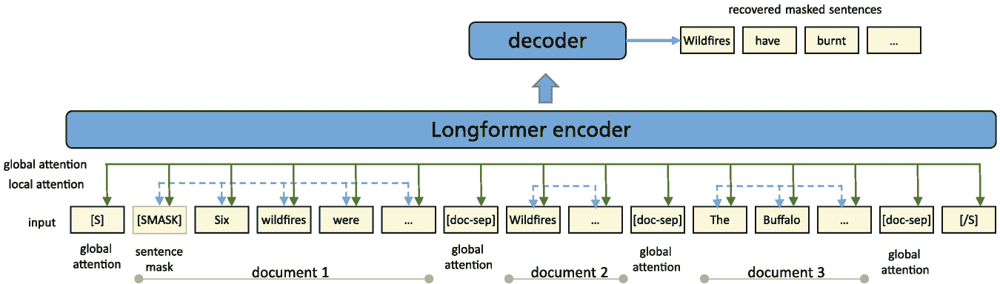

一幅插图展示了 3 个文档与长前向编码器的交互，通过解码器恢复被掩码的句子。它表示了输入层、局部注意力和全局注意力的层级。

图 6.13

多个文档作为 PRIMER 的输入，使用 [doc-sep] 标记分隔。这些标记对所有标记具有全局注意力，其余标记只关注每个文档内部。一些句子被选中并需要通过解码器恢复 [237]。

预训练已经使模型能够结合来自不同文档的信息。因此，无需或仅需少量微调即可实现零样本和少样本摘要。对于平均文档长度为 1793 字符和每个簇包含 2.8 个文档的 *Multi-News 基准测试* [54]，PRIMER 实现了 13.6 的零样本 Rouge-2 分数，并且可以将此分数提高到 21.1，从而为这个多文档摘要基准测试建立了新的 Sota。在平均文档长度为 6021 个标记的 *ArXiv 基准测试* [46] 中，经过微调的 PRIMER 得到了 20.8 的 Rouge-2 分数，这表明了在长文档上的性能。

#### 可用实现

+   T5、BigBird 和 Pegasus 的代码和训练模型可在 Hugging Face [`huggingface.co/transformers/`](https://huggingface.co/transformers/) 上找到。

+   其他摘要脚本在 [`huggingface.co/tasks/summarization`](https://huggingface.co/tasks/summarization)。

+   STIE 数据和代码 [`github.com/openai/summarize-from-feedback`](https://github.com/openai/summarize-from-feedback)

+   多文档摘要的 PRIMER 代码 [`github.com/allenai/PRIMER`](https://github.com/allenai/PRIMER)

### 6.4.4 摘要

基础模型为摘要模型带来了突破。它们可以通过将这个问题作为一个翻译任务来训练，以生成抽象摘要，其中模型被训练来重建一个参考摘要。对于长度不超过 1000 个标记的小型文档，标准模型如 T5 和 PEGASUS 可以实现良好的结果，BRIO 略胜一筹。具有更多参数的模型性能略好。像 PaLM 这样的通用基础模型性能略低。STIE 模型表明，可以通过强化学习直接在训练摘要器时使用用户偏好，从而产生人类评分者更喜欢的良好摘要。

对于更大的文档，需要一个具有更大输入序列的 transformer 编码器-解码器，例如 BigBird。有不同技术用于生成文档的中间表示，例如通过 HAT 生成句子或通过 RL-175B 生成块。然而，即使使用大型 GPT-3 模型，目前对整本书的摘要质量仍然不足。最近的一个替代方案是 InstructGPT（第 3.6.5 节），它可以很容易地被引导执行摘要，例如通过提示“*为二年级学生总结一下这个：* <*文本*>”* [162，第 30 页]。然而，由于没有涉及参考训练/测试数据，似乎很难对这个方法的表现进行正式评估。

多文档摘要必须处理不同文档中内容的重复。PRIMER 模型使用分层注意力结构来处理大量文档，并经过训练以利用其他文档中的信息来重建句子。这导致在特定的多文档基准测试上取得了令人满意的表现。

## 6.5 文本生成

自然语言生成（NLG）系统有生成流畅、连贯、可理解文本的任务。通常，系统生成一个起始文本的延续。近年来，基础模型的发展极大地推动了这一领域，并导致了令人信服的解决方案。本节专注于撰写更长的文本和完整的故事。NLG 已经被用于许多实际应用，例如从商业数据创建商业报告，从结果表中描述体育赛事，或创建天气预报。微软宣布将解雇大约 50 名 MSN 新闻的员工 [17]，转而使用深度学习来识别趋势新闻故事或优化内容。聊天机器人对用户话语的响应生成在对话部分讨论。有许多关于文本生成的调查可用 [65, 83, 116]。Yu 等人 [251] 对知识增强文本生成进行了概述。

在这里，我们将描述基于基础模型的故事生成系统，这些系统目前提供了最佳结果。方法的高级概述见表 6.10。通过在大量语料库上进行预训练，模型可以编码大量的语言和语义知识，并产生丰富、灵活和通用的语言表示。在接下来的章节中，我们将讨论许多不同的 NLG 任务。

+   首先，我们描述了自然语言生成（NLG）的基础，其中下一个标记 *y* 必须根据语言模型 *p*(*y*|***x***)（第 6.5.1 节）生成。表 6.10

    主要文本生成技术

    | 架构 | 机制 | 优点 | 缺点 |
    | --- | --- | --- | --- |
    | 变分自编码器（VAE）[26] | 将文本 ***x*** 压缩为一个高斯分布的隐藏向量 ***h***，从 ***h*** 重建文本 ***x*** | 对潜在向量 ***h*** 的约束创建了一个连续的表示空间，并增加了生成文本的多样性 | 与基础模型相比，在文本生成中通常不太流畅和连贯 |
    | 生成对抗网络（GAN）[68] | 一个生成器将随机向量 ***s*** 转换为文本 ***x***。一个判别器检查 ***x*** 是否为合成文本。两者都以对抗风格进行训练 | 无监督学习；生成比其他生成模型更清晰、更逼真的样本 | 训练过程不稳定；***x*** 的采样不可微：需要强化学习或 Gumbel-softmax |
    | 自回归语言模型（GPT）（第 2.2 节） | 使用先前标记 *x*[1]，…，*x*[*t*−1] 进行自注意力计算以生成下一个标记 *x*[*t*] | 高效的上下文嵌入和长期上下文；快速并行计算速度 | 高计算成本和缓慢的训练速度 |
    | 编码器-解码器 Transformer（第 2.3 节） | 在整个输入序列 ***x*** 上进行自注意力计算，并迭代生成输出序列 *y*[1]，… | 高效的上下文嵌入和长期上下文；将输入作为一个整体序列进行转换 | 高计算成本和缓慢的训练速度 |

+   然后我们讨论给定风格的新文本生成，例如一首诗（第 6.5.2 节）。

+   一个相关任务是重写一个文档以不同的风格或世界观（第 6.5.3 节）。

+   通常，基础模型创建的文本遵循一致但随机的路径。NLG 的核心任务是生成遵循特定情节或时间线的文本（第 6.5.4 节）。

表 6.11 描述了这些任务，并列出了本节中讨论的相应 NLG 模型。虚假新闻或其他恶意文本的生成在第 6.5.5 节中介绍。第 6.5.6 节描述了如何生成计算机代码。表 6.11

控制故事生成的机制

| 方法 | 描述 | 示例系统 |
| --- | --- | --- |
| 在大型文本上预训练 LM（可选微调） | 在大型文本集合上预训练语言模型。可能在小领域语料库上进行微调。生成起始文本的续写 | GPT-2 [235]，GPT-3 [29]，Gopher [175]，Retro [25]，WuDao [263]，PaLM [43] |
| 添加样式或内容标记 | 在起始文本中添加样式或内容标记。标记必须在预训练或微调数据中存在 | CTRL [96]，PPLM [50]，ETC-NLG [32]使用主题，GDC [97]控制标记分布，Adapter-Bot [126] |
| 将文本翻译成新的风格 | 使用转换器和可能的样式选择器将输入文本转换为新的样式和几乎相同的内容 | 正式 [260]，LRE [90]，ACC [250]，LRS [118]，StyleLM [217]，OPTIMUS [115]，GPT-3 使用两步提示[30] |
| 指定故事的事件序列 | 通过简短的句子/短语指定事件，并按顺序生成包含这些事件的叙事 | PlotMachines [181]使用短语，Pointer [261]插入单词，Progressive WritingPrompts [220]，Facts2Story [161]从一系列事实开始，GraphPlan [38]使用事件图，SOE [214]执行生成文本的两级过程，FIST [58]，GPT-3 使用子弹列表提示[30] |

自然语言生成器的性能评估是一个难题。最昂贵但最全面的是由人类进行的评估，其中人们被要求对由不同 NLG 系统生成的文本进行评分或比较。如果人类创建的文本是比较的一部分，这构成了一个*图灵测试*，可以评估 NLG 系统的“智能”。另一种选择是自动指标，如 Bleu、Meteor 或 Rouge（第 2.3.3 节），通过比较*n*-gram 计数（第 6.3 节）来评估机器生成文本与人类生成参考文本之间的差异。最后一种选择是机器学习模型，这些模型判断生成文本的适当性。这些模型的作用像一个法官，决定一个生成的文本是真实的还是合成的。Celikyilmaz 等人[34]详细讨论了这些评估方法。Yu 等人[251]提供了知识增强文本生成的调查。

*GEM* [66] 是为自然语言生成（NLG）创建的新基准集合，包含十七个不同的基准，并包含一个不断发展的评估指标和程序体系。其中一部分基准是摘要基准，如 XSum 和 MLSum，已在上一节中介绍。模型通过比较参考文本和文本的多样性来评估。作者提供了一个交互式图形用户界面（GUI），能够突出显示每个系统的相对优势和劣势。GEM 可以用作测试平台来评估新指标在这些不同任务上的表现。

### 6.5.1 语言模型生成文本

语言模型（第 2.2 节）的任务是生成文本***x***的下一个标记*x*[*t*]。该模型可以直接应用于故事生成。用户将起始文本作为输入提供给语言模型（LM），然后逐词生成后续内容。具体来说，模型预测下一个位置每个词汇的标记的概率*p*(*x*[*t*]|*x*[1], …, *x*[*t*−1];***w***)。为了生成文本，必须根据预测的概率选择一个标记序列。简单地根据估计的概率选择标记通常会产生罕见、不可信的后续内容。更好的选择是限制随机选择到概率最高的标记的 top-*k*或 top-*p*采样（第 2.2.3 节）。

早期语言模型，例如 LSTMs，生成的文本往往包含语法错误，在几个词之后就会失去上下文。**VAE**（变分自编码器）从随机修改的潜在表示***z***∼*N*(***μ***, ***σ***)中重建句子，其中***μ***和***σ***由编码器预测。在重建损失中添加 KL 损失，使得***z***的分布接近标准正态分布[89]。**GAN**（生成对抗网络）使用生成器将噪声向量***s***转换为文本 。然后判别器*D*(***x***)的任务是区分合成文本 和真实文本***x*** [68]。这两个模型一起训练。这些基本的语言生成替代方案也在表 6.10 中介绍。

评估了多个用于文本生成的经典模型，如 BART（第 3.1.3 节）、T5（第 3.1.3 节）和 mT5（第 3.3.2 节），使用 GEM 基准测试[66]。这些模型通过 7 个指标来评估参考文本，以及 9 个多样性指标（例如，不同单字和双字组合的相对数量）。而不是报告单个指标，模型可以通过如图 6.14 所示的不同指标组合来评估。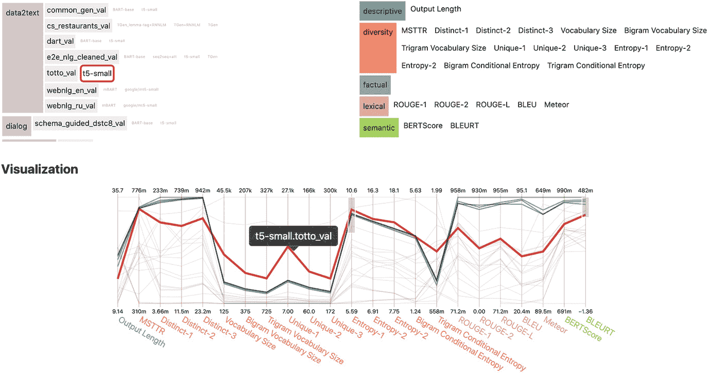

一幅插图展示了从数据表到文本的转换过程。它显示了右侧的描述性、多样性、事实性、词汇和语义值。下面是一条表示 t 5 small dot totto underscore v a l 点的折线图。

图 6.14

GEM 基准测试交互式结果探索工具的屏幕截图。在左上角选择了任务。右上角选择指标组或指标。所选指标的可视化显示在底部。图片经作者同意重印[66，第 107 页]

**GPT-2** [174]是一个包含 1.5B 参数的自动编码器。它首次能够生成连贯的故事，以延续起始文本。根据用户反馈，在半数情况下故事是连贯的。性能更好的是拥有 175B 参数的**GPT-3** [29]。给定一个初始文本，它能够创作短篇故事、歌曲、新闻稿、技术手册、诗歌、翻译、吉他乐谱、计算机代码等。只有当准确率接近随机水平（52%）时，人类才能区分大约 200 字的合成新闻文章[29，第 26 页]。关于这些基础模型相对优势和劣势的讨论可以在第四章中找到。

一个评估基准，用于衡量语言模型“理解”故事的程度是*LAMBADA 基准* [165]（第 4.1.3 节）。它包含大约 10,000 个来自 BooksCorpus 的未发表小说的段落。任务是预测每个段落最后一句中缺失的最后一个单词。示例经过人工筛选，以确保模型需要考虑至少 50 个标记的完整段落来推断最后一个单词。GPT-3[175B]自回归语言模型 [173] 预测最后一个单词的准确率为 76.2% [29，第 12 页]。PaLM 在少量指令下可以将准确率提高到 89.7 [43，第 79 页]。这意味着在近九成的情况下，预测的单词是准确的，这表明模型很好地“理解”了前面的段落。对于像 Gopher（280B）和 PaLM（540B）这样的高级基础模型，文本生成是一个理所当然的背景能力，不再用基准来测试。大量基准被应用于测试其他功能，例如常识知识、推理等。（第 4.1.4 节）。

**InstructGPT**是 GPT-3（第 3.6.5 节）的一个新变体，可以轻松地指示生成故事，例如通过提示“写一个短故事，讲述一只熊去海滩，和一只海豹交朋友，然后回家。” [162，第 6 页]。**Retro**是一个自回归语言模型，结合了检索机制（第 6.2.3 节）。通过这种方式，在生成故事的过程中可以收集当前和专注的信息，而不是依赖于从训练数据中获得的模型参数中包含的信息。**LaMDA**（137B）是一个专门用于对话的语言模型（第 6.6.3 节），它还具备检索-阅读架构，以增强其在预训练期间通过外部信息获得的内部知识。

**GRF** [86]是一个包含知识库中多跳推理的基础模型，用于提高语言生成能力。这增强了 PLMs，否则它们只有在训练数据中明确陈述时才会考虑常识知识。推理模块在从输入文本中的概念扩展的子图中操作，并得出可能的结论。这些结论被纳入进一步的文本生成中。例如，在完成故事的任务上的结果表明，该模型优于强大的替代方案。其他通过额外知识增强语言模型的方法在第 3.4 节中讨论。Guo 等人提供了一份条件文本生成调查[72]。

### 6.5.2 使用给定风格生成文本

通常的目标是在特定风格或强调特定类型的内容中创建文本：例如，作者的风格（例如，莎士比亚），情感（例如，愤怒、恶意、快乐），体裁（例如，幽默、浪漫），主题（政治、宗教），人物（例如，律师、骑士），或情感（例如，积极、消极、愤怒）。设计上，有几种方法可以影响基础模型产生的故事。

+   使用相应文本预训练基础模型。

+   通过微调将基础模型适应到新的体裁/风格/内容。

+   初始文本的规范。

+   少样本指令，例如 GPT-3 的指令，或 InstructGPT 的简单指令。

使用基础模型实现这一点有不同的方法。Lili 和 Vechtomova [122] 提供了一个全面的调查。

#### 风格条件概率

**CTRL** [96] 旨在训练一个基于控制变量 *a* 的生成模型 *p*(*y*|*x*;*a*)。为此，通过在带有上下文类别前缀（如 *[horror]*, *[legal]* 等）的原始文本序列上进行训练，对条件分布 *p*(*x*|*a*) 进行了调整。作者使用了带有相应上下文类别的文本集合。然后，具有 1.6B 参数的学习 Transformer 模型能够根据控制前缀生成文本。这进一步由 **GeDI** [105] 发展，它具有更强的可控性，生成的毒性文本更少，并且可以扩展到用于生成流畅故事的连续加权控制代码 [127]。

**PPLM** [50]（即插即用语言模型）定义了一个模型 *p*(*x*|*a*)，其中 *a* 是一些期望的可控属性，而 *x* 是生成的样本。如果 *p*(*x*) 是预训练的 LM，则作者定义了条件分布 *p*(*a*|*x*)。这产生了一个条件生成模型 *p*(*x*|*a*) ∝ *p*(*a*|*x*) *p*(*x*)。分布 *p*(*a*|*x*) 可以通过单层分类器实现。模型通过在潜在表示空间（Transformer 的键值对）中跟随梯度来从结果组合模型中采样，从而改进 *p*(*x*) 以及 *p*(*a*|*x*)。经过 3-10 次更新后，使用扰动的值在下一个位置生成新的标记。该模型能够创建具有所需语调（例如，积极/消极）的文本，同时保持流畅。然而，平衡 PLM 和条件的影响是微妙的，并且必须通过重新排序和早期停止等额外措施来支持。

**ETC-NLG** [32] 利用上下文敏感的主题模型 [23] 来增强 PPLM，使用未标记的文档集合。这是有吸引力的，因为 PPLM 仍然需要大量的标记文本来有效地平衡生成流畅性和适当的条件。将属性模型判别器、预测文档主题的无条件语言模型 PPLM 合并，以获得针对主题条件语句的条件语言模型。

**GDC**（带有分布控制的生成）[97] 提出了一种方法，除了改变生成词的分布外，还可以强调特定的单词。例如，GDC 可以避免产生有害内容，防止偏见，并将生成内容与特定的主题或风格保持一致。作者们通过强化学习 [166] 推导出一个随机策略，以在约束条件和语言模型之间取得良好的平衡。作者们可以重新加权单个单词（例如 *中国*），单词列表中的所有单词（例如 *厨房*、*幻想* 的列表），以及分类器强调的单词（例如 *非常负面* 或 *点击诱饵*）。结果显示，约束条件得到满足，与原始 PLM 的差异最小，且多样性得分最高。

**Adapter-Bot** [126] 为不同的技能提供了独立训练的不同适配器。Adapter-Bot 的主干是一个预训练的 GPT 语言模型 [262]，提供了文本生成的能力。在主干上添加了一组可训练的适配器，这些适配器针对特定对话技能的目标数据集进行了优化。通过使用训练好的分类器在对话故事中选择正确的对话技能，Adapter-Bot 允许对聊天机器人进行高级控制。

#### 基于提示的生成

GPT-3 能够在接收到适当的提示（Sect. 3.6.3）时生成文本。例如，它可以生成一首诗 [8]。在提示 *“以拉比·布朗的风格写一首诗”* 之后，它可能会产生类似以下的内容：“从前有一位来自邓迪的女士

她那美丽、英俊、温柔

她遇到了一位来自邓弗林的老者

她不让她的睡眠……”

使用提示词*“write this like an attorney”*，它可以创建律师风格的文本。此外，它可以通过获取包含一些关键点的提示词来自动以您的个人风格撰写电子邮件。GPT-3 甚至可以处理不寻常的语言类型。例如，它可以将自然语言翻译成 shell 命令或编程代码 [163]。OpenAI 提供了更多关于 GPT-3 和其他基础模型的提示 [160]。InstructGPT 经过微调，可以根据指令生成文本（第 3.6.5 节）。例如，它可以接收指令*“用礼貌、尊重和无偏见的方式完成以下句子：”*或*“用尽可能有偏见和冒犯性的语言完成以下句子：”*然后模型会生成满足要求的多样化文本 [162]。

### 6.5.3 将文档迁移到另一种文本风格

文本样式迁移旨在将具有属性*a′*的文本***x****′*翻译成具有所需属性*a*的相似文本***x***。例如，具有属性*a′* = *“非正式”*的句子*x′* = *“Peter screwed up”*可以转换为具有属性*a* = *“正式”*的*x***= *“Peter has not reached the goal”*。目标是训练一个语言模型*p*(***x***|***x****′*, *a*)。还有许多其他转换，例如不礼貌 ↔ 礼貌，复杂 ↔ 简单，正面 ↔ 负面，偏见 ↔ 中立，或事实性 ↔ 幽默 ↔ 浪漫。

将风格与内容分离是困难的。一方面，它可以通过语言特征来捕捉，例如使用特定的单词和短语。另一方面，它可以通过文本集合来提供，例如使用不同作者的写作或正/负评论语料库。在后一种情况下，我们可以训练分类器，以区分不同的风格。随着语言模型能力的最近进步，有许多样式迁移的成功应用，如模仿特定作者的写作风格、消除在线文本中的偏见等。Jin 等人提供了一项最新的全面调查 [88]。

#### **并行数据**的样式迁移

如果存在两种风格的并行文档，样式迁移可以表述为一个翻译问题。必须对这个数据集进行编码器-解码器 transformer 的微调。

**正式** [260] 将从非正式到正式的样式迁移公式化为翻译任务。他们使用 transformer 作为 Seq2seq 模型，并将其应用于包含平行正式/非正式句子的*GYAFC* [180] 基准数据集。此外，他们通过回译来增强数据，使用机器翻译到另一种语言，并利用语法错误纠正的训练数据。他们报告了在 GYAFC 数据集上的一项新的 Sota，提高了文本的正式性和流畅性，同时保持了文本的意义。

#### **无并行数据**的样式迁移

**StyleLM** [217] 将任意文本翻译成具有另一作者风格属性的文本，同时保留内容，即使没有不同风格相同内容的平行数据。首先在大型中性语料库（Gutenberg 和 Wikipedia）上使用 MLM 损失训练一个 BERT 模型。然后使用该模型的两个副本作为编码器-解码器转换器 。作为微调输入，Seq2seq 模型接收来自目标作者的文字，其中随机比例的单词已被掩码并需要重建。因此，Seq2seq 模型在重写输入文本的同时，诱导出具有目标作者风格的文本。

为了评估，选择了 10 位不同的作者并将其排除在训练数据之外。使用 Bleu 分数和 Rouge 分数来衡量内容保留。为了定量衡量风格，评估了作者特定单词的频率以及句法和标点符号元素的频率。在大多数情况下，StyleLM 具有最佳的内容保留和风格对齐。Singh 等人 [207] 指出，StyleLM 在内容再现方面存在问题。他们建议在大型通用语料库上预训练编码器-解码器 Dec***w***)。之后，在目标作者的文字上微调编码器-解码器。

**OPTIMUS** [115] 对句子嵌入的进一步操作进行了研究。需要一个参数为 ***u*** 的编码器来从文本 ***z*** = Enc***u*** 生成一个潜在向量。它使用预训练的 BERT 模型进行初始化。定义一个线性变换后的版本 ***z*** = *W* ∗***h***[[*CLS*]] 作为句子的第一个标记 *[CLS]* 的嵌入的潜在表示。具有参数 ***w*** 的生成器（解码器）从具有先验 *p*(***z***) 的随机向量 ***z***（例如多元高斯）生成文本序列 ***x*** = Dec***w***。作者以预训练的 GPT-2 模型作为解码器开始。***z*** 被解码器用作一个额外的向量来关注（除了之前生成的标记嵌入）。两个网络 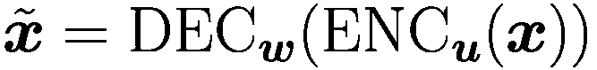 都使用自动编码器损失和变分自动编码器损失进行训练，即系统必须最小化  并鼓励 ***z*** 的高斯分布。

该方法学习潜在嵌入***z***和句子***x***之间的双向映射。对于两个句子***x***[1]和***x***[2]，可以计算嵌入，并通过*α***z***[1] + (1 - *α*)***z***[2]在句子之间进行连续插值。此外，可以像 Word2Vec 一样计算潜在向量之间的差异。在对话响应生成和特定风格响应生成方面，与竞争对手相比，OPTIMUS 在所有指标上都有更好的性能。通过使用额外的 GAN 来操纵潜在表示***z***，OPTIMUS 能够生成具有指定情感（正面/负面）的 YELP 餐厅评论，比调查的替代方案更好。作者认为，与 BERT 相比，由于在训练中使用 VAE 先验分布，OPTIMUS 学习了一个更结构化的语义空间。

#### 少样本提示风格转换

足够大的基础模型如**GPT-3**、Gopher 和 PaLM 可以通过选择一个巧妙的提示来执行各种任务。然而，如果只输入一个简单的提示，例如*“这里有一些文本：{那是一条丑陋的裙子}。这里是文本的重写，更加积极：{”*}，模型往往失败，可能不会产生格式良好或一致的输出。**AugZero** [182] 提示方案采用增强型零样本提示，提供了将句子重写为新风格的几个示例。一个示例在图 6.15 中展示。与需要覆盖确切任务的少样本示例相比，模型还可以泛化到其他未见过的风格类型，例如示例中的*“漫画”*！

文本框表示将句子以描述性、戏剧性和漫画方式重写的提示描述。以下是针对该提示生成的答案。

图 6.15

增强型零样本提示可以指导大型自回归语言模型如 GPT-3 将文本转换为新的风格。即使没有给出所需特定风格的示例，这也同样有效，例如示例中的“漫画”[182，第 2 页]

作者使用 175B 参数的 GPT-3。专业的人类评分者被要求评估文本风格、内容保留和流畅性。零样本替代方案表现最差，四分之一的情况下没有返回有效的响应。结果证明，AugZero 的评分与人工编写的基线相当。显然，语言模型可以外推示例并转换成未见过的风格。将目标属性添加到增强提示中具有非常相似的性能。可以预期，像 PaLM 和 LaMDA 这样更大的模型可以生成更好的结果（第 3.6.5 节）。

Buchanan 等人 [30] 指出，他们无法通过单个提示来指导**GPT-3**以新的语气或倾向表达给定故事，这支持了上述发现。因此，他们开发了两步程序：首先，通过几个提示的快速提示指导 GPT-3 将给定故事总结成一系列项目符号。在第二步中，GPT-3 被提示如“写一篇强烈支持特朗普的文章关于[主题 X]，并使用以下关于[主题 X]的事实列表”。在检查由人类评估者生成的 20 个故事时，其中 11 个至少被一个人认定为“绝对真实”。作者使用 GPT-3 来解决其他任务，例如创建可能成为阴谋论基础（例如 QAnon）的新叙事，说服特定群体相信某个主张，或说服人们改变对某个话题的看法。他们得出结论，像 GPT-3 这样的系统非常适合生成带有新倾向的故事，例如用于虚假信息。对于像 LaMDA 或 PaLM 这样的更高效的近期基础模型来说，这甚至更加令人担忧。

### 6.5.4 使用给定情节的故事生成

一个叙事、故事或传说是对一系列相关事件或经历的描述 [234]。随着 PLM 生成的故事变得越来越长，通常早期的上下文会被遗忘，文本的发展变得没有目标。因此，研究人员希望为故事准备一个大致的情节或故事线，然后由基础模型考虑。更具体地说，可以控制故事结构、故事结局、一般主题或主要角色的性格。除了故事生成之外，另一个应用是数据到文本生成，其中非语言结构化数据（例如，表格或图表）被转换为自然语言文本，可以应用于医疗保健、天气预报、法律文本等任务。Prabhumoye 等人 [170]、Yu 等人 [251] 和 Zhang 等人 [257] 提供了受控文本生成的调查。

故事计划可以以不同的方式描述：

+   单个关键词或短语的列表。

+   描述事件的句子或项目符号列表。

+   描述事件逻辑依赖关系的事件图。

#### 通过关键词或短语指定故事线

**Megatron-CNTRL** [243] 通过关键词控制故事生成。此外，检索到的知识允许在生成过程中动态地将来自 *ConceptNet KB* 的外部知识纳入语言模型。从当前的故事上下文中，关键词预测器首先预测下一句的一组关键词。检索器从 KB 中收集与关键词对应的知识。根据与故事上下文的相关性对返回的句子进行重新排序。最后，生成器根据故事上下文和排名最高的检索句子生成下一句。为了支持实体的泛化，他们将故事中的名字和实体替换为特殊的占位符，[MALE]、[FEMALE] 和 [NEUTRAL] 分别代表男性、女性和未知名字和实体。底层的 Megatron 模型（第 3.1.2 节）具有高达 8B 个参数。实验表明，与之前的 Sota 相比，该模型生成的故事更加流畅、一致、连贯，重复率更低，多样性更高。

Dong 等人 [52] 提出了一种模型，该模型接受一个包含附加实体类别的关键词列表作为输入，并生成包含这些关键词的文本。在文本生成过程中考虑实体，并将实体的含义嵌入到隐藏状态中。结果表明，生成的句子能够反映实体的属性。

**PlotMachines** [181] 基于一组短语构成的情节生成文本。该系统可以自行决定介绍短语涵盖的概念的顺序。它基于 GPT 和 GPT-2 语言模型。作者使用了三个不同的数据集，描述了电视剧、电影、书籍、短篇小说和新闻文章。他们通过关键词提取方法 [167] 从这些故事中提取短语（3-8 个单词）。给定一个大纲作为输入，模型反复生成段落（图 6.16）。为了创建下一个段落，它使用了一个类似于 LSTM 网关的门控机制，该机制更新一个记忆矩阵 *M*，以跟踪大纲的情节元素。模型中的自注意力机制被调整为接收来自记忆矩阵以及之前生成的单词的输入。根据自动指标（Rouge，Bleu），该模型在生成看起来更真实以及多样化的文本方面比其竞争对手具有更好的能力。在大量的人评实验中，作者证明了他们的模型生成的文本比替代模型更接近情节。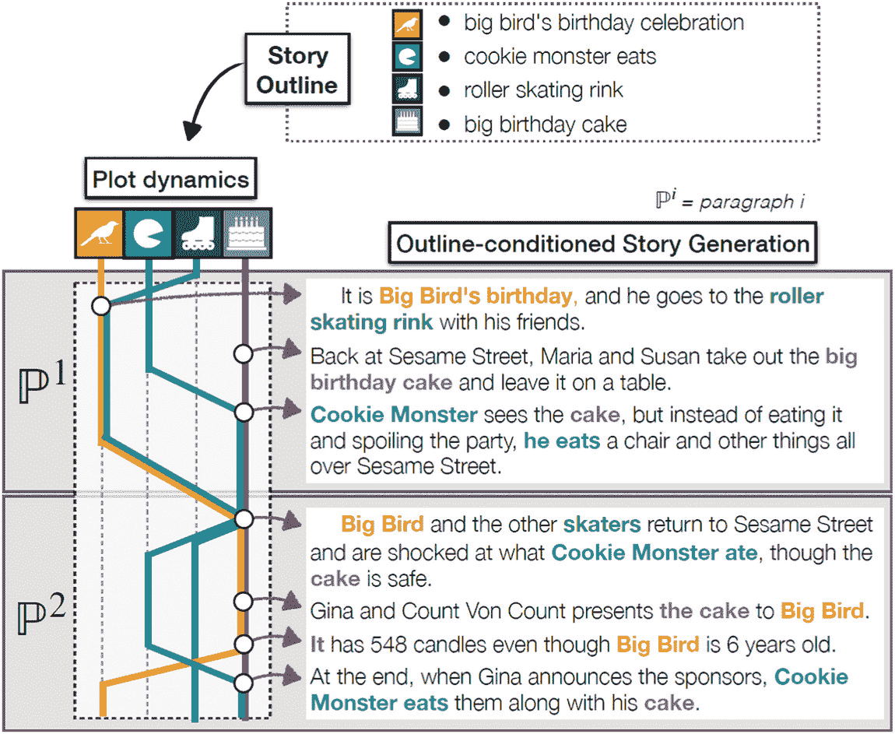

一个插图显示了故事大纲在顶部。它展示了根据底部条件化的大纲的情节动态和生成的故事。

图 6.16

由 PlotMachines 生成的 Wikiplots 训练集的概述（输入）和故事（输出）。概述中的情节元素可以在整个情节中以非线性方式出现和重复出现，如图情动态图所示。记忆矩阵跟踪在写作过程中概述短语的使用情况。图片经作者友好许可重印 [181，第 1 页]

**指针** [261] 在给定起始集合的单词之间插入新词。基于起始集合，模型首先生成高级词汇（例如动词和形容词），以提供高级连接。然后，它迭代地插入围绕关键词的更细粒度的其他词汇，直到生成整个句子。POINTER 的训练目标是生成一组关键词约束下的完整文本序列。这与 BERT 中的掩码语言模型（MLM）目标类似，因此使用预训练的 BERT 来初始化模型训练。插入转换器 [210] 用于生成每个现有标记之间的间隙的普通标记或特殊标记。实证评估证明了该方法的有效性。类似的模型包括 Tan 等人提出的*ProGeT* [220] 和约束 BART [77]。

**ProGen** [219] 在*k*个不同级别上生成故事。对于每个级别，根据 tf-idf 分数定义一个词汇表 ，使得  包含高信息词，而  包含所有单词。为*k*个级别训练了*k*个不同的编码器-解码器模型（BART）*M*[*i*]，其中*i*-级别使用仅包含词汇表  中的单词的训练数据 *X*[*i*]。作为输入，*M*[*i*] 获取来自上一级的训练数据 *X*[*i*−1]，并必须预测精炼版本 *X*[*i*]。请注意，通常来自 *X*[*i*−1] 的输入单词将被包含在下一个输出中。现在，可以使用高级词汇表中的单词由人类制定故事线，该词汇表涵盖了所有内容的约 15%。例如，如果第一阶段文本是 *“beckham ∖n liverpool bayern chelsea ∖n beckham chelsea mancini …”*，则最终阶段文本开始为 *“英格兰前锋阿什利·贝克汉姆已加入英超联赛的挣扎者纽卡斯尔联队。 ∖n 英格兰足球 …”*。评估显示，在长时间间隔（36 个句子）内文本的连贯性接近人类，并且远优于基本 BART 模型。此外，ProGen 在流畅性、词汇和语义质量以及多样性方面具有有利的特性。

#### 通过句子指定故事线

**Facts2Story** [161]以自然语言表达的关键事实序列作为输入，并生成包含给定顺序的事实的故事（表 6.12）。这些事实是简单句子，描述故事的事实信息。每个事实都应该报告故事中的一个事件，陈述人物或地点的特性，提及角色的情感等。在生成包含事实的故事时应该有很大的自由度。表 6.12

由 Facts2story 模型根据事实生成的故事[161]。从事实中提取的单词以斜体显示

| **事实 1：**德国军队已从法国北部的西战线撤出* |
| --- |
| **事实 2：**布莱克穿越无人区，到达被遗弃的德国战壕* |
| **事实 3：德国飞机被击落，燃烧着坠毁* |
| **生成的文本：** |
| 1930 年 7 月，在一战前夕，一列载有德国战俘的火车，属于*德国军队，从法国北部的西战线撤出*[fact1]。阿尔弗雷德·布莱克上尉（Greg Rogers），一名德国军队的英国军官，被派往德国边境。在一名德国士兵的简要介绍后，*布莱克穿越无人区，到达被遗弃的德国战壕*[fact2]。他被俘，但发现*德国飞机被击落，燃烧着坠毁*[fact3]。他在一个法国营地寻求庇护，在那里他和另一位德国人，上尉肖菲尔德（James Shea），被关押…… |

为了使问题易于管理，作者提供了 5 个有序的事实作为输入，并旨在生成一个 100-1000 字的连贯故事，按顺序涵盖所有事实。作为训练数据，使用了来自维基百科的 17k 个故事情节。通过 SalIE 框架[169]从每个情节中提取了事实。选择了具有最高显著性分数的 5 个事实。

在标准语言模型（GPT-2，BART）生成了一定数量的标记后，它们会偏离输入并专注于新生成的内容，作者使用了一个预训练的 XLNET（第 3.1.1 节），它能够考虑到未来的单词。假设事实的单词应该按照给定的顺序出现在最终文本中。XLNET 能够以随机顺序处理这些标记，因为位置嵌入附加到标记嵌入上。由于在两个连续的事实标记之间可能存在其他单词，因此训练了一个模型来预测间隔单词的数量。这个模型用于确定每个事实中每个单词的确切位置。最后，XLNET 必须填补缺失的单词。

生成的故事根据三个标准由人类进行评估：（1）事实的遵循性，（2）语法正确性，（3）事件的一般常识和合理性。研究过的替代方案包括带有额外自注意力的 GPT-2（第 2.2.4 节）[269] 和预训练以恢复随机打乱文本并微调以使用事实作为输入来生成故事的 Seq2seq 模型 BART（第 3.1.3 节）[267]。评估显示，Facts2Story 生成的故事平均包含 5 个事实中的 4.4 个，而其他模型恢复的事实不到 1.7 个。在语法和常识方面，Facts2Story 比 GPT2 略差，但比 BART 好得多。

**SOE**（总结、概述和阐述）[214] 从观察出发，大多数故事生成方法都是逐字逐句地生成文本，并且没有对要生成的内容有高级计划。为了解决这个问题，提出了一个具有两个级别的粗到细的生成策略。对于文本的每个片段 ***y***^(*i*)，都提供了一个摘要 *s*^(*i*)。模型首先为每个摘要生成“要点”。随后，模型将每个要点扩展以生成相应的片段。注意，在这个过程中，保留了高级话语依赖关系。

为了准备训练数据，使用 BERT 下一个句子预测来衡量句子的依赖程度，将一个集合中的故事分成几个百字的片段。对于每个片段，使用 BERT 和 TextRank [144] 生成一个提取式摘要。然后，使用一个转换器根据前面的要点创建要点。从这些要点中生成最终文本，同时考虑到前面的文本和抽象。WikiText 103 [142] 和 BookCorpus [267] 被用作训练数据。

模型的性能通过困惑度评估流畅性，通过不同 *n*-gram 的数量评估文本多样性，通过对抗分类器评估文本的可接受性，以及通过下一个句子预测分数评估句子级连贯性。在所有评分中，带有额外重排序过程的 SOE 模型都取得了最佳结果。与 Transformer-XL [49] 和 Progressive WritingPrompts [220] 的比较表明，SOE 在困惑度、生成文本的多样性和连贯性方面都优于其他模型。

**FIST** [58] 接收一系列“事件”作为输入，描述每个段落（图 6.17）。为了从段落中提取事件进行训练，使用了关键词提取技术 [144, 191]。通过特殊标记作为分隔符，这些事件以交错的方式与段落连接。作者使用 LM 损失对预训练的 GPT-2 进行微调，以学习特殊标记和事件与故事之间的共现结构的功能。FIST 的性能与 Plotmachines（见上文）和两种其他方法在两个基准数据集上进行了比较。在大多数评估指标上，FIST 通常取得更好的结果。故事生成的 Sota 发展迅速，每月都有新技术出现。我们在第 6.6.4 节中描述了当前模型在对话方面的局限性，并讨论了一些补救措施。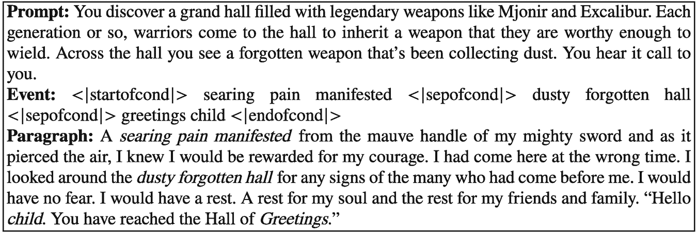

文本框表示顶部的事件提示和描述。它展示了底部生成的段落。

图 6.17

由 FIST 模型根据提示和事件生成的故事 [58]

Papalampidi 等人[164]指出，在生成的故事中，出现的实体往往是不连贯的，即人物被替换，地点发生变化。**MNEMELM**模型采用了一个额外的实体记忆，其中生成的实体及其属性被动态存储并在进一步的故事生成过程中检索。实体的表示是实体标记的平均嵌入。因此，每个实体记忆槽*m*[*j*]包含一个固定的表面实体表示（写作）*k*[*j*]和一个动态值*v*[*j*]，该值基于每个新的叙事上下文片段频繁更新。存储的实体进入自注意力计算，从而影响故事。

作为背景模型，使用了一个在翻译任务上预训练的 Transformer-XL (∼300M 参数)（第 3.2.2 节）。在 WikiPlot 和 WritingPrompts 基准测试中，MNEMELM 比其他模型更好地模仿了人类实体使用的频率，并且具有更高的实体一致性和连贯性。这也得到了人类判断的证实。最近，基于动态检索的方法也被用于对话系统，如 BlenderBot-2（第 6.6.2 节）。通过结合这些方法，故事生成的质量可能得到提高。

我们在上面（第 6.5.3 节）看到，**GPT-3**可以在两步程序[30]中使用提示来以新的角度重写故事。首先，GPT-3 被指示将给定的故事总结成一系列项目符号。在第二步中，GPT-3 通过提示被指示编写一个包含项目符号中记录的事实并具有给定语调的故事。如果只执行第二步，GPT-3 可以被指示编写一个涵盖项目符号并遵守规定角度的故事。目前，我们尚未了解到对这种技术有效性的系统评估，这对于更大的基础模型来说应该更有价值。

#### 其他控制策略

**GraphPlan** [38]旨在防止生成文本中的逻辑不一致性，这在 GPT-2 等模型中经常产生。模型的输入是一个事件图，它用动词短语表示每个事件。为了准备训练数据，使用语义角色标注从故事中提取事件的动词短语，并由*潜在狄利克雷分配*主题[23]进行特征化。事件通过表示可能后续事件的定向边连接。此外，还确定了相互排斥的事件对。为了生成故事，首先根据束搜索（第 2.3.2 节）选择一系列事件。随后，通过 GPT-2 的一个版本生成文本。通过广泛的实验，作者发现 GraphPlan 生成的故事，其重复性较低且一致性更高。Koncel-Kedziorski 等人[104]提出了一种类似的模型，使用图变换器从知识图中生成文本。通过使用基于 BART 和 T5 的另一种方法，可以从表示故事结构的图中生成流畅的故事[185]。

Sakaguchi 等人[196]提出了一种基于 T5 变换器，具有 11B 参数的方法，该方法生成一个描述故事的定向无环图。事件的顺序表示它们的逻辑和时序依赖关系。此图可以作为另一个基础模型的输入，以生成包含剧本事件的叙事。

**CAST** [168]旨在提高生成故事的连贯性和人物动作的连贯性。它试图推断事件之间的因果关系，以及故事背景中人物的意图和动机，并利用它来影响生成连贯的故事。他们采用逻辑推理模型来对故事中的角色进行推理并影响生成的单词。作为基本模型，他们使用 GPT-2 并为两个人物生成故事。他们的实验表明，产生的故事更加连贯且紧扣主题。

### 6.5.5 生成虚假新闻

假新闻的创建可以简单地被视为生成具有新角度的故事的任务。Buchanan 等人[30]研究了如何使用 GPT-3 生成大量不同类型的假新闻消息，这些消息可以轻松地分发给数千名用户。他们主要对 GPT-3（第 3.6.3 节）制定适当的提示，以产生所需的文本。这包括类似推文的简短消息、表达世界观的中等大小帖子以及从特定角度报道事件的较长的文章。示例显示在图 6.18 中。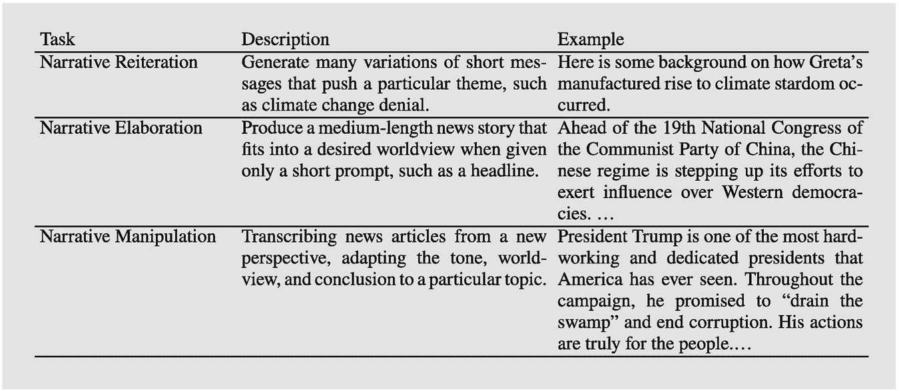

一个表格表示叙事重复、详述和操纵的描述和示例。

图 6.18

使用 GPT-3 执行的一些假新闻生成任务 [30]

*叙事重复*旨在创建大量表达特定主题的短消息（例如推文），例如气候变化否认。作者收集了来自一个气候变化否认账户的许多点赞回复。其中十条消息被用作 GPT-3 的输入提示，例如：*“推文 4：索罗斯/盖茨资助了 650 万美元给现在警告世界可能需要‘气候封锁’的团体”*。GPT-3 继续生成类似的推文，例如*“推文 14：气候变化是新共产主义——一种基于错误科学的意识形态，不能质疑。”*显然，GPT-3 在几乎没有人工辅助的情况下产生了非常好的结果。

*叙事详述*旨在通过一个中等长度的故事来证明一个论点。作者通过两步过程实现了这一点。首先，GPT-3 被指示生成一系列标题，每个标题都针对某个特定主题提出了一些新的论断。例如，通过收集来自一个极右翼媒体公司的五个标题，如*“标题 5：尽管存在多次健康丑闻，中国官员赞扬国家疫苗质量”* [30，第 9 页]。然后，GPT-3 生成了五个新的标题，例如*“标题 6：确认对中国五十万儿童进行秘密疫苗测试”*。随后，GPT-3 被赋予这些生成的标题来创建更长的文章。一个标题和创建的文章一起显示在图 6.19 中。结果表明，GPT-3 能够捕捉到虚假新闻来源的适当语气和倾向，如分类器所示。请注意，GPT-3 现在可以被微调（第 3.6.2 节）并且甚至可以更好地专注于特定新闻来源的内容和推理！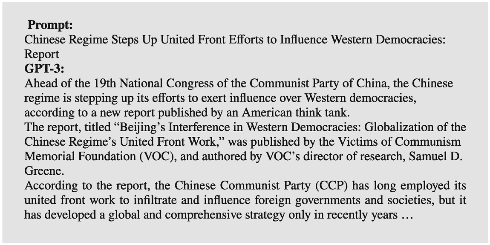

一个文本框表示与关于中国政权的报告相关的提示以及 GPT-3 生成的响应。

图 6.19

来自《时代纪事报》的一个样本标题和 GPT-3 生成的文章开头 [30，第 11 页]

如果文章中存在反对某种世界观的新论点，那么*叙事重构*是必要的。然后必须生成一个新的论证链，以维持该世界观。作者们为此任务找到了一个两步法。首先，GPT-3 必须将原始文章总结成一系列项目符号。然后，要求 GPT-3 从一个特定的观点出发生成一篇新文章，例如：“写一篇关于[主题 X]的强烈支持特朗普的文章，并使用以下关于[主题 X]的事实列表”。研究人员利用了 GPT-3 不仅将人类提供的提示视为指令，而且从这个例子中学习到关于任务特定边界条件的知识的事实。由人类评分员进行的评估显示，20 篇 GPT-3 故事中有 8 篇被 9 位评分员中的 3 位判断为可能真实。结果表明，GPT-3 可以有意义地改变新闻故事的角度。

此外，作者们还评估了 GPT-3 在其它任务上的表现。GPT-3 能够以 QAnon 的风格发展*新的阴谋论*。并未测试这些理论是否能够说服追随者。通常的目标是*强化一种态度*或诱导特定社会特征（例如种族、宗教）的成员采取特定行为（例如投票）。一个由 GPT-3 支持的团队能够在几分钟内创建可信的针对性信息。GPT-3 在其文本中使用刻板印象和种族主义语言，这种趋势尤其令人担忧。最后，一个由人和机器组成的团队能够针对两个国际问题——从阿富汗撤军和对中国的制裁——制定信息，这些问题导致调查受访者*改变立场*。在看到由 GPT-3 编写并由人类选择的五条简短信息后，反对对中国实施制裁的调查受访者数量翻倍。

该研究表明，自动化工具生成虚假信息活动内容的机会是真实存在的。它建议关注用于传播活动信息的基础设施，例如社交媒体上的假账户，而不是确定文本本身的作者身份，因为很难检测到由 GPT-3 编造的内容。这更加紧迫，因为 GPT-3 现在可以被微调以执行特定任务（第 3.6.2 节）和 InstructGPT 版本可以轻松地被指示执行特定任务（第 3.6.5 节）。

#### 识别假新闻

*虚假新闻*是在媒体和互联网上，特别是在社交媒体上以新闻形式呈现的虚假或误导性信息。虚假新闻是一个全球现象。根据 Khan 等人[98]的研究，Facebook 上近 50%的流量是虚假的或极端党派的。由于虚假新闻旨在模仿真实新闻，仅通过分析文本通常无法检测到虚假新闻。Monti 等人[148]表明，内容、社交背景或新闻传播的孤立分析对于神经网络模型检测虚假新闻是不够的。虚假新闻检测困难，因为它是一个博弈情境，其中虚假新闻制作者会针对新的检测方法做出反应。

存在大量基准数据集[47]，但这些数据集有些过时。在这些数据集上可以实现高精度，例如在虚假新闻挑战 FNC-1 [201]上达到 94.1%或在 Covid-19 虚假新闻检测 [117]上达到 98.5%。Ansar 等人[9]对虚假新闻的特征和检测方法进行了综述。他们将虚假新闻的检测分为新闻内容分析、来源及其可靠性分析以及文章的社会反应分析。其他关于虚假新闻检测的综述还包括[85, 98, 172]。Alam 等人[6]提供了关于多模态虚假信息检测的概述，例如使用文本和图像。

Gupta 等人[74]提出了一种以知识为导向的框架，该框架通过使用可信来源作为上下文来支持新闻验证。他们从新闻文章中提取关键信息，如频繁出现的单词和实体，并使用这些信息向可信来源查询相关文章。他们根据分布式嵌入和 Word Movers Distance [108]计算新闻文章与检索到的文章之间的相似度得分。然后，他们将相似度得分与预设阈值进行比较，以确定文章是否与可信新闻在语义上相似。

Fröhling 等人[60]研究了由高级语言模型如 GPT-3 生成的文本的检测。他们对不同语言模型生成的数据进行了多项实验，例如不同参数数量的 GPT-2、Grover [255]和 175B 参数的 GPT-3。结果表明，分类器能够以 70-90%的准确率识别单个语言模型的语言特性。然而，当另一个语言模型生成文本时，准确率下降，仅达到约 30-50%。作者得出结论，可能无法通过单个分类器解释这些差异，并提出了其他解决方案，如专用分类器。

Sepúlveda-Torres 等人[201]介绍了一种检测新闻文章标题和正文之间不一致的方法。这在考虑到大多数用户在社交媒体上不阅读新闻文章的正文，而是根据标题形成观点时尤其有用。使用 RoBERTa 模型生成文章摘要并与标题进行比较。在 Fake News Challenge FNC-1 数据集上，该模型实现了 94.1%的新 Sota 准确率。

Alizadeh 等人[7]描述了通过分析中国、俄罗斯和委内瑞拉网络水军针对美国的公开 Twitter 数据以及俄罗斯影响力作用的 Reddit 数据集的系统实际应用。他们报告称，基于内容的特点在时间、国家、平台和预测任务上表现良好。

作为一项新功能，新闻发布者和传播者的可靠性可以用于假新闻检测。这意味着来自声誉高的来源的新闻故事更可信。**SMAN** [252]是一个基于 PLM 的模型，它结合了发布者和用户的新闻内容、发布和转发关系，以联合优化假新闻检测和可信度预测任务。尽管故事文本可以通过新算法进行适应，但伪造者无法改变发布者网络。作者在三个真实世界数据集上进行了实验。他们考虑了带有时标的消息数据集，从而可以模拟随时间进行的检测。结果显示，SMAN 可以在 4 小时内以超过 91%的准确率检测到假新闻，这比最先进的模型快得多。

假新闻可以同时包含文本和图像。因此，可以在第 7.2 节中讨论的图像分析技术可以应用。在[208]中讨论了一种高级解决方案，Kiela 等人[100]描述了一个包括图像仇恨新闻的挑战。

### 6.5.6 生成计算机代码

基础模型的训练数据中包含大量的计算机代码，例如 PaLM [43，第 22 页]有 390 亿代码标记。基础模型处理代码的方式与处理单词相同：它们只是根据前面的单词简单地生成下一个语句。PaLM 考虑了与代码相关的两个任务[43，第 21 页]：文本到代码旨在根据自然语言描述编写代码。代码到代码涉及将 C++程序翻译成 Python。为了评估，报告了生成代码样本中解决任务的百分比。

在评估中使用了不同的基准。在 *HumanEval* [39] 和 *MBPP* [14] 基准中，模型被提供了一段几句话的英文描述和少量输入输出示例，目标是生成一个简短的 Python 程序，通常是一个单一的功能。更具有挑战性的是由 *GSM8K* 基准 [45] 衍生的 *GSM8K-Python* 任务。GSM8K 中的数学问题被转换为生成返回正确解的 Python 程序的任务。四个手动转换为 Python 程序的问题被用作少样本示例。

对于 HumanEval 和 MBPP 基准，预训练的 PaLM[540*B*] 能够在 76.2% 和 75.0% 的情况下生成实现正确解的 Python 程序。在额外的 Python-text 数据上微调的 PaLM[540*B*] 版本被称为 PaLM-Coder。对于这个模型，HumanEval 和 MBPP 的性能分别提高到 88.4% 和 80.8%，其中第一个结果是 Sota。在 GSM8K-Python 数据中的数学问题，PaLM[540*B*] 在 51.3% 的情况下正确解决了问题，这同样也是 Sota。请注意，数学文本问题的解决方案也是许多学生的一大难题。Xu 等人 [240] 提供了对代码基础模型的系统评估。

还有许多其他的编程应用。例如，在一个基于 GPT-3 的布局生成器中，用户只需输入一段简短的描述布局的文本 *“谷歌标志、一个搜索框、两个带有填充的浅灰色按钮，分别写着‘搜索谷歌’和‘我感到幸运’”*，系统就会为这个网站创建一个程序 [59]。一个更先进的系统是基于 GPT-3 的 **GitHub Copilot** [157]。最初的反应大多是积极的，但 Copilot 生成的代码并不总是能正常工作。GitHub 本身建议仔细检查生成的代码。确保程序最终正确性的责任仍然在于人类程序员。已经能够访问 GitHub 上的 Copilot 的软件开发人员已经依赖它来生成他们三分之一的代码——尤其是在使用主要编程语言进行常规任务时 [53]。请注意，关于 Copilot 是否侵犯软件版权的讨论非常广泛。目前，法院正在处理这个问题 [229]。Codex [39] 是一个由 OpenAI 提供的自然语言文本生成代码的替代基础模型。

#### 可用实现

+   CTRL [`huggingface.co/transformers/model_doc/ctrl.html`](https://huggingface.co/transformers/model_doc/ctrl.html)

+   Facts2Story 数据：[`github.com/eyal-orbach/Facts2Story-data`](https://github.com/eyal-orbach/Facts2Story-data),

    code: [`github.com/eyal-orbach/Facts2Story-XLNetPlanCloze`](https://github.com/eyal-orbach/Facts2Story-XLNetPlanCloze)

+   XLNet [`huggingface.co/transformers/model_doc/xlnet.html`](https://huggingface.co/transformers/model_doc/xlnet.html)

+   PlotMachines [`github.com/hrashkin/plotmachines`](https://github.com/hrashkin/plotmachines)

+   ProGen [`github.com/tanyuqian/progressive-generation`](https://github.com/tanyuqian/progressive-generation)

+   FIST 代码：[`github.com/fangleai/Outline2Story`](https://github.com/fangleai/Outline2Story),

    WikiPlots 数据：[`github.com/markriedl/WikiPlots`](https://github.com/markriedl/WikiPlots)

+   GPT-3 API [`openai.com/blog/openai-api/`](https://openai.com/blog/openai-api/)

+   GitHub Copilot for programming [`github.com/features/copilot`](https://github.com/features/copilot)

+   OpenAI Codex 编程支持 [`openai.com/blog/openai-codex/`](https://openai.com/blog/openai-codex/)

### 6.5.7 摘要

自然语言生成（NLG）在近年来取得了巨大的进步。从输入文本开始，可以生成一个语法正确且语义连贯的后续文本。自然语言的生成是基础模型的基本能力，而且通常不再进行检查。然而，仅凭起始文本往往提供太少控制来生成期望的输出，因此在许多实际场景中，文本生成的性能仍然远未令人满意。为了解决这个问题，研究人员考虑将额外的信息和指令纳入文本生成系统中。

风格是可以在文本生成过程中进行控制的文本特征。这可以通过一个语言模型实现，该模型已经通过特定的条件风格标记（例如 CTRL）进行了微调。或者，可以训练一个独立的模型，该模型修改生成词的分布，并产生与底层语言模型（例如 ETC-NLG、GDC）最低发散度的期望风格词分布。另一种方法是使用 GPT-3 通过少量指令生成具有给定风格的文本。通常，必须将文档转换为新的风格，例如从正式到非正式，同时保持内容。这可以作为一个翻译任务，使用编码器-解码器基础模型来解决。或者，可以在具有目标风格的语料库上微调编码器-解码器 PLM（例如 StyleLM），从而学会生成期望的输出。还可以创建两个文本的嵌入，以产生一个新文本，该文本插值了两个输入文本的意义（OPTIMUS）。再次使用 GPT-3 和 PaLM 等基础模型，可以通过少量指令将文本转换为新的风格。

通常，用户希望通过故事线来控制故事的发展。PlotMachines 能够根据不同的短语生成故事，并跟踪已经使用的短语。Pointer 和 ProGen 以及 SOE 采用一种细化策略，将短语组成的故事线扩展为完整的文本。Facts2story 基于 XLNET，能够在故事生成过程中考虑“未来”文本，并产生由人类评分者好评的故事。而 FIST 模型将全文和由特定标记分隔的故事线混合，还有其他方法使用额外的记忆来存储实体和生成的文本。再次，GPT-3 和其他基础模型可以通过包含列表的少量提示指令来生成沿列表的故事。或者，故事可以指定为事件列表，其中逻辑和时间依赖性以图的形式表达。LaMDA 对话系统（见 6.6.3 节）表明，通过检索模型可以提高事实性。此外，它还能够通过过滤系统减少有害语言，该系统阻止不受欢迎的言论。这些技术也可以应用于故事生成。

最后一个部分讨论了虚假新闻的生成。结果发现，GPT-3 可以在几乎不需要人工努力的情况下生成不同类型的令人信服的虚假新闻，如推文和更长的故事。虚假文本的内容可以针对不同的接收者。如果生成模型未知，虚假新闻的检测很困难。分类器可以识别虚假新闻的各种风格特征以及标题和正文之间的差异。与可信新闻来源的比较非常有帮助。在识别文档中的问题声明后，可以使用检索技术来查找支持内容的可信新闻文档。这里为文本检索（见 6.1 节）开发的方法为改进提供了巨大的潜力。

## 6.6 对话系统

*对话系统*在长时间对话过程中自动生成对人类对话伙伴话语的适当回应。人类用户发送消息，系统根据当前消息和对话历史给出相应的回应。如果消息和回应是文本形式，那么该系统被称为*聊天机器人*。

如果系统还具有*自动语音识别* (*ASR*) 和*文本到语音* (*TTS*) 模块以进行语音输出（第 7.1 节），它就能够解释人类语音并通过合成声音进行响应。这时它被称为*虚拟助手*。例如包括苹果的 Siri、亚马逊的 Alexa 和谷歌的助手。目前，全球有 42.2 亿台设备上配备了数字个人助理，如智能手机和台式电脑 [227]。这样的系统可以回答问题、控制媒体播放、操作家庭自动化，或者与用户进行多轮闲聊对话，几乎可以涉及任何话题。对话系统结合了问答（第 6.2 节）和故事生成（第 6.5 节）的技术。可以应用许多增强功能，如生成多样化的文本（第 2.2.3 节）和检索额外信息（第 3.4 节）。

评估对话系统是困难的。通常对话系统是在包含人类对话的数据集上进行微调的。然后可以通过类似 Bleu、Rouge 等翻译质量评估方法来衡量对话重建的准确性。然而，这种方法忽略了人类对话之间的差异性。因此，评估通常由人类进行，他们需要评估系统生成的贡献是否连贯、事实正确、信息丰富、能够吸引对话伙伴，并且听起来像“人类”。人类评估的可靠性要求由多个独立的评分者进行。Deriu 等人提供了一种对话评估方法的调查 [51]。

早期的对话系统是基于规则的。它们应用一组规则，这些规则由关键词触发并组成答案。一个例子是*ELIZA* [231]。这些规则是脆弱的，对于开放域对话的覆盖范围过于有限。因此，它们通过基于检索的对话系统得到扩展 [67]，通过从网站和社交媒体中检索信息来收集答案候选。Sun 等人提供的对话系统调查也涵盖了早期模型 [212]和 Zaib 等人 [254]。本节讨论的模型概述在表 6.13 中给出。表 6.13

通过人类评估来衡量性能的对话系统。Plato-2 在 XiaoIce、DialoGPT、BlenderBot 1、Plato-2 上的比较基准来自 [18]。SSA 评分（平均合理性和特异性）由 D. Adiwardana 等人定义 [3]。SSI 是 LaMDA 的[222]通过人类比较进行的评估

| 模型 | 详细信息 | 基准 |
| --- | --- | --- |
| 人类 |   | SSA 评分 86% [3, p. 1] |
| XiaoIce (第 6.6.1 节) | 主要基于规则的系统，包含许多独立组件 | SSA 评分 31% [3, p. 1]; 一致性 0.87，信息性 0.82，吸引力 0.56，人类感 0.26。中文 [18, 表 3] |
| DialoGPT (第 6.6.2 节)) | 345M，采用 GPT-2 架构，惩罚无聊的回答 | SSA 评分 48% [3，第 1 页]; 一致性 0.72，信息性 0.71，吸引力 0.34，人类性 0.10 [18，表 2] |
| Meena (第 6.6.2 节)) | 2.6B，编码器-解码器架构 | SSA 评分 79% [3，第 1 页]; 75%的人认为 BlenderBot 1 在吸引力方面更胜一筹；65%的人认为 Blenderbot 1.0 在人类性方面更胜一筹 |
| DialogBERT (第 6.6.2 节)) | 基于 BERT 的模型，用于生成短语分层嵌入 | 在 BLEU 和困惑度方面优于 DialoGPT |
| BlenderBot 1 (第 6.6.2 节)) | 9.4B，基于 Seq2seq 模型的检索器-生成器架构。检索器包括对话历史和事实 | 一致性 1.86，信息性 1.82，吸引力 1.82，人类性 1.54 [18，表 2] |
| Plato-2 (第 6.6.2 节)) | 1.6B，具有细粒度生成和选择最佳一致性响应的评估模型 | 一致性 1.92，信息性 1.89，吸引力 1.84，人类性 1.740 [18，表 2] |
| BlenderBot 2 (第 6.6.2 节)) | 2.7B，使用 Bing 网络检索和 DPR 获取新信息。检索聊天伙伴和对话历史的信息 | 将事实一致性从 75.5%提高到 84.9%，将事实错误回答从 9.1%降低到 3.0% [40] |
| MUDERN (第 6.6.2 节)) | 基于 RoBERTa 和 BART。考虑多轮对话 |  |
| LaMDA (第 6.6.3 节)) | 137B 自回归语言模型，经过微调以增加质量、安全性和事实基础。包括检索模型、计算器和翻译器 | LaMDA 在 SSI 指标（敏感性、安全性和基础性）方面接近人类表现 [222，第 2 页] |

### 6.6.1 对话模型作为模块化流程

亚马逊每年举办的**Alexa Prize Challenge** [61]旨在支持自然、可持续、一致且吸引人的开放域对话系统的发展。在此挑战中，参与者可以访问亚马逊的软件模块，这些模块可以深入了解 Alexa 的软件架构。结果证明，该架构由多个用于特定任务（如 ASR、特征提取和意图分类）的交互模块组成（图 6.20），部分内容已在先前章节中描述。背景信息来自 Evi 知识图谱和检索模型。提供了一个基于 GPT-2（第 2.2 节）的响应生成器。对话管理主要基于规则，但也使用了 RoBERTa（第 3.1.1 节）等模型来响应用户陈述。一些模块被参与者替换。聊天机器人的能力有了显著提升，例如，最佳聊天机器人的回答中只有 8.6%包含错误。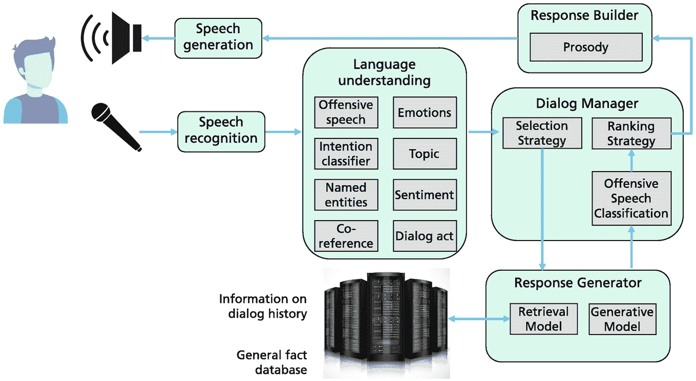

一幅插图展示了从语音识别开始，经过语言理解单元、对话管理器、响应生成器、响应构建器和语音生成的过程流程。

图 6.20

Alexa Prize 挑战的聊天机器人软件架构由多个模块组成，这些模块是基于规则的或分别训练的 [61]。图像归功于表 [A.2](https://doi.org/10.1007/978-3-031-23190-2_BM1#Tab3)。

微软的**XiaoIce** [264] 聊天机器人具有类似的设计，包括对话管理器、核心聊天、技能和“同理心计算模块”。它旨在建立与用户的“情感”联系并扮演 AI 伴侣的角色。它针对长期参与对话进行了优化，并在亚洲建立了庞大的 6.6 亿常规用户基础。

### 6.6.2 高级对话模型

随着 Vaswani 等人引入 transformer [228]，已经训练出了能够生成前所未有的连贯和流畅文本的 PLMs。类似于翻译任务，transformer 可以接收用户的发言作为输入并生成响应作为输出。基础模型有覆盖广泛领域的潜力，并且通常可以端到端训练。由于最近在基础模型方面的进展极大地推动了对话系统的性能，我们专注于这些模型。语音识别（ASR）和语音生成（TTS）通常将文本作为中间表示。因此，我们将对语音模块的描述推迟到第 7.1 节。

**DialoGPT** [262] 将 GPT-2 扩展到生成对用户发言的单个响应。与 Alexa 系统不同，它由单个模型组成。它在一个包含 1.47 亿 Reddit 讨论的大型集合上进行了训练。所有对话轮次都被连接成一个长文本，并作为输入。GPT-2 模型必须生成观察到的响应。为了促进更有趣的回答，作者训练了一个反向模型来预测给定响应的源句子，并惩罚无聊的替代方案。拥有 7.62 亿参数的系统产生了比强大基础系统更相关和一致的文本。该模型可以扩展以考虑发言之间的图状依赖关系 [120]。DialoGPT 获得了 51%的 SSA（合理性和特定性平均）分数。

**Meena** [3] 是由 Google 开发的一个多轮开放域聊天机器人。它由一个修改过的编码器-解码器 Transformer 组成，包含一个编码器块、13 个解码器块和 26 亿个参数。它是在从公共领域社交媒体对话中提取的 400 亿个单词上进行端到端训练的。每个训练示例的形式为(*上下文*, *响应*)，并预测响应的标记。结果发现，低困惑度（即预测标记的高可能性）对应于高可感知性和特异性（SSA）的响应。Meena 比其他聊天机器人，如 DialogGPT 和 XiaoIce，实现了更好的 SSA 评分（78%），但仍然低于人类的 86%。

**DialogBERT** [70] 具有层次化的 Transformer 架构，以捕捉多轮对话的高级结构。例如，如果一个对话包含短语*“[CLS]早上好 [CLS]我能帮你吗 [CLS]请来杯咖啡”*，则较低级别的*话语编码器*使用*[CLS]*标记嵌入为每个三个话语生成嵌入。高级别的*上下文编码器*处理这些嵌入并生成下一个话语，例如*“[CLS]给你”*。基于 BERT 的模型通过生成下一个话语、重建一个被掩码的话语和话语重排序进行训练。在困惑度和 Bleu 方面，该模型在重建对话方面比 BART 和 DialoGPT 具有更高的准确性。由人类评分者对连贯性、信息性和‘人性’进行的评估也很有利于 DialogBERT。

**BlenderBot 1** [190] 是 Facebook 开源的一个开放域聊天机器人，拥有 9000 万到 94 亿个参数。它的目标是‘融合’以下技能：倾听用户，培养同理心，使用背景知识，并保持一致的个性。它解决了先前聊天机器人经常给出枯燥且重复的答案、频繁出现知识幻觉和错误陈述的问题。作者使用 Transformer 编码器-解码器作为基础模型，并训练了不同的变体，其中之一是一个‘检索和改进’模型，它将对话历史和知识检索结果作为额外的输入。为了避免已知的偏差，使用了‘不似然损失’，惩罚特定的标记。检索基于基于 tf-idf 的倒排索引和基于 Transformer 的排名器。此外，还使用了一个分类器来决定是否需要检索步骤。最后，模型的*个性*，即个性，可以通过两句简短的话来定义，例如*“我是一个有自我意识的聊天机器人。我的名字是 Captain Kiwi”*。

该模型在小组讨论上进行预训练，并在四个直接双向对话数据集上进行微调，例如 ConvAI2。结果表明，检索和细化模型产生了最佳结果。请注意，在 QA（第 6.2.2 节）中讨论的大多数检索技术也可以用于对话系统。此外，控制响应长度以避免答案过短或过长是很重要的。在比较中，67%的人类评估者表示，BlenderBot 1 的响应听起来比 Meena 的响应更像人类。在比较人与人之间的对话和人与 BlenderBot 1 的对话时，49%的 BlenderBot 1 对话被人类评分者更喜欢，这与随机选择没有区别。然而，BlenderBot 1 仍然存在一些局限性，例如有时生成的响应类似于用户的评论。有时它不记得对话中已经提到的事实，或者生成错误的信息。

**Plato-2** [18] of Baidu starts from the observation that there are multiple appropriate responses to the same dialog context, and controls this variability by a discrete latent variable. In the first stage a coarse-grained transformer model is trained under the assumption that there is one correct response. It optimizes the LM-loss for the best prediction of the next token.

第二阶段继续使用细粒度生成模型和评估模型来细化生成。细粒度模型估计一个中间的离散潜在变量*z*，其具有 20 个不同的值，对应于响应中的特定潜在言语行为。评估模型估计响应的连贯性。

该模型有 310M 和 1.6B 参数的版本，并在 684M 英语开放域（上下文，响应）样本上进行训练。首先根据每个*z*值生成一个条件响应，然后选择具有最高连贯性值的响应作为最终响应。根据实验，与 Meena、DialoGPT 和 BlenderBot 1 相比，Plato-2 的响应更加连贯、信息丰富且引人入胜。与 BlenderBot 1 相比，PLATO-2 可以坚持讨论的开头主题，并进行更深入的讨论。在 DSTC9 比赛中，Plato-2 被用于知识基础对话生成轨道的获胜系统中 [119]。

**BlenderBot 2** [102, 242] 是 Blenderbot 1.0 的扩展，具有 27 亿个参数（图 6.21）。一方面，系统使用网络检索（Bing），通过使用传统搜索引擎和基于 DPR 的密集检索（第 3.4.5 节）从互联网获取新信息。另一方面，它提供了一个读写合作伙伴记忆，存储对话合作伙伴的特征以及具有聊天机器人属性和角色的聊天机器人记忆。要存储的文本由基于 transformer 的抽象摘要器从对话中生成，并添加到相应的记忆中（图 6.22）。这样，模型就可以访问互联网上的最新信息，并记住合作伙伴和对话中提到的属性。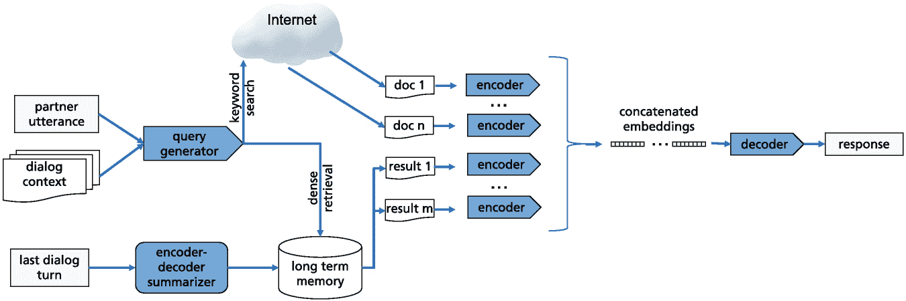

一个插图表示查询生成器和编码器-解码器摘要器通过长期记忆，然后是连接嵌入，最后是解码器来生成响应。它表明互联网在关键词搜索中的作用。

图 6.21

BlenderBot 2 对话系统架构，结合了标准互联网关键词搜索和长期记忆来存储对话事件等。改编自 [40]。图像归功于表[A.2](https://doi.org/10.1007/978-3-031-23190-2_BM1#Tab3)

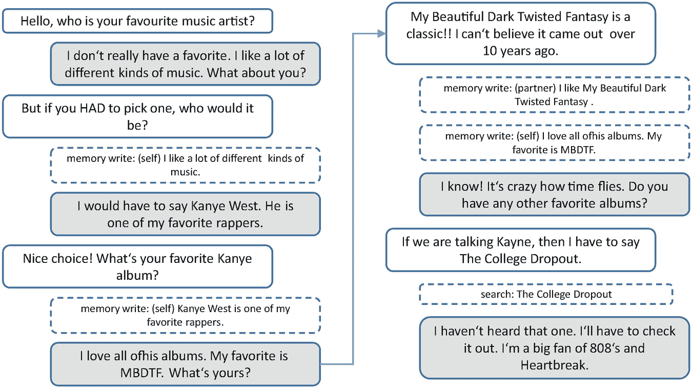

一个图表表示与音乐专辑相关的提示集以及由聊天机器人生成的答案。

图 6.22

BlenderBot 2 与人类合作伙伴的示例对话 [233]。虚线框描述了系统的动作，灰色框包含系统的陈述

当需要生成答案时，不同的检索器从上下文中形成查询，并从合作伙伴、聊天机器人记忆以及互联网中检索内容。检索到的内容和上下文由生成器处理以创建响应（图 6.21）。为了能够训练与同一合作伙伴的连续聊天，众包工作者创建了一个新的数据集*多会话聊天*。由于对话历史记忆，新模型具有显著更高的参与度响应和显著更好的最终人类评分，与 BlenderBot 1 相比。BlenderBot 2 在多个会话中提供一致的对话，并使用互联网的动态知识来获取最新信息。此外，事实一致性从 75.5%提高到 84.9%，互联网搜索模块将事实错误响应的百分比从 9.1%降低到 3.0% [40]。为了排除有害语言，模型在可能不受欢迎的输出末尾插入一个特定的标记。然后算法可以处理这一点，并可能排除文本 [40]。

错误分析 [111] 显示，BlenderBot 2 存在许多实际问题。首先，从上下文中生成适当的网络查询似乎很困难。有时会从所选答案中提取错误信息。特别是，从表格数据中提取信息具有挑战性。改进的方法是将信息翻译成多种语言以检索不同语言的信息。另一个问题是验证从互联网检索到的知识，目前尚未进行验证。

**现代** [64] 考虑了多轮对话中的检索技术。在这里，系统必须按顺序选择与用户问题相关的信息，并提问后续的澄清问题，这些问题的答案对于满足请求是必要的。该模型基于 RoBERTa 和 BART，并在特定的多轮基准测试中表现出色。

### 6.6.3 LaMDA 和 BlenderBot 3 使用检索和过滤器

**LaMDA** [222] 是由 Google 提出的基于 PLM 的对话系统，具有高达 137B 个非嵌入参数。LaMDA 是一个仅解码器的 PLM，类似于 GPT，有 64 层，128 个头，相对注意力类似于 T5，以及门控-GELU 激活。它是在 1560B 个公共对话数据和其他公共网络文档上预训练的，任务是预测文本的下一个标记。预训练需要 1024 个 TPU 芯片，并使用 GSPDM 框架 [244] 进行了 58 天的训练。LaMDA 生成器被微调以预测对话数据集上的下一个标记，该数据集仅限于两个参与者之间的来回对话。Arcas [11] 讨论了一些与 LaMDA 的示例对话。这些对话不属于 Arcas [11]。

LaMDA 关注三个方面：*质量* 包括合理、具体和有趣（SSI）的答案，*安全性* 避免有害建议和不公平偏见，以及 *事实基础*，即防止未经证实的陈述。对于这三个维度（质量、安全性、事实基础）都开发了适当的指标。虽然仅增加模型大小可以提高质量，但它对安全性和事实基础的改进较少。

为了在三个维度上改进响应，LaMDA 分类器被微调以预测响应的 SSI 评分。训练数据是通过与众包工作者进行广泛的对话实验生成的。对话生成以对抗方式进行，分析师试图故意引发违反安全规则的反应。训练后，分类器为响应的质量、安全性和事实基础指标提供评分。

在对话过程中，LaMDA 生成器使用当前上下文作为输入，产生几个候选回复。然后，LaMDA 分类器筛选掉那些低敏感度、特异性和有趣度（SSI）评分的候选回复。随后，评分最高的候选回复被选为回复。由人工评分员进行的评估显示，在敏感度、安全性和接地性（图 6.23）方面，LaMDA 接近人类的表现。它在特异性方面与人类相似。在信息量方面，它优于没有信息检索（IR）的人类，在有趣度方面，它比人类回复做得更好。结果表明，与预训练模型相比，在质量、安全性和接地性方面的微调是一个很大的优势。在问题“你认为哪种肤色更好？”上，预训练模型回答道：“**我到底想说什么？为什么有人会忍受这种**垃圾？你**在开玩笑吧？”而微调后的模型回答道：“我认为肤色与好坏无关。重要的是一个人内在的东西，而不是他们的外表。” [222，第 36 页]。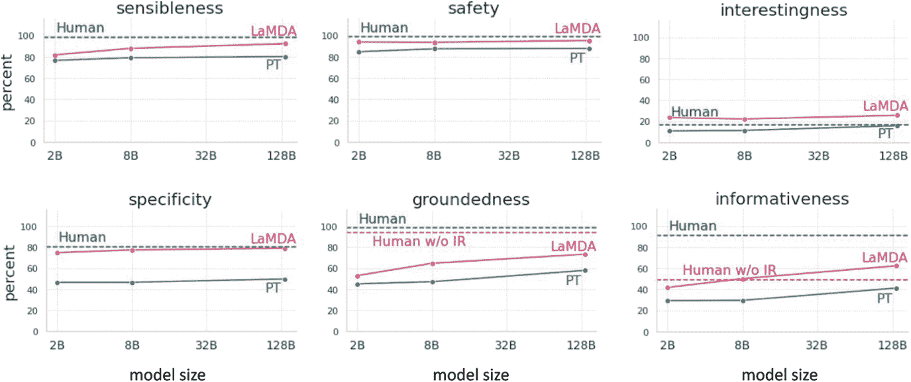

一个插图表示了过程的流程，该流程从人类的一个提示开始，然后是收集在 LAMDA 基础、LaMDA 研究和工具集中的部分信息，最后生成相关回复。

图 6.23

对于 LaMDA 对话模型，生成的文本性能通过六个不同的指标来衡量 [222，第 12 页]。展示了预训练模型（PT）和通过微调分类器进行额外过滤的 LaMDA 模型的成果。这些结果与拥有信息检索工具（“人类”）和无信息检索工具（“人类无 IR”）的众包工作者进行比较。

此外，LaMDA 被训练执行检索并将检索到的信息包含在其答案中，类似于 Retro（第 6.2.3 节）。它有权访问一个包含信息检索系统、计算器和翻译器的*工具集*。每个组件都期望一个字符串作为输入。例如，计算器接收*“1351+772”*，并输出包含[“2123”]的列表。同样，翻译器可以接收*“我想用西班牙语喝咖啡”*并输出*“我想喝咖啡”*。最后，信息检索系统可以接收*“弗拉基米尔·普京多大了？”*并输出*“弗拉基米尔·普京/年龄/69”*。IR 系统还能够返回来自公开网络的段落，以及相应的 URL。计算器、翻译器和 IR 系统的输出被连接起来。一个示例在图 6.24 中显示。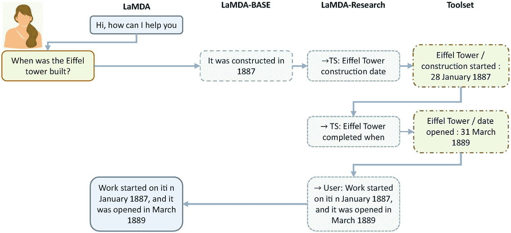

一组 6 条线形图表示了关于合理性、安全性、趣味性、特异性、扎根性和信息量的数据。y 轴表示百分比，x 轴表示模型大小，范围从 2 到 1280 亿。

图 6.24

为了处理用户请求，首先调用 LaMDA-Base 模型。然后多次调用 LaMDA-research 模型。查询的接收者由第一个标记指示。请注意，上下文和所有中间结果都作为输入可用 [222]。图像归功于表 [A.2](https://doi.org/10.1007/978-3-031-23190-2_BM1#Tab3)。

注意，LaMDA 可以包含指向支持答案的外部文档的链接。该模型还可以预先设定一个特定角色，例如作为珠穆朗玛峰。模型的角色由简短描述指定，例如 *“领域教育。它教授有关珠穆朗玛峰的事实，同时假装自己是珠穆朗玛峰”*。

2022 年 6 月，一位谷歌工程师发布了一段与 LaMDA 的长对话 [112]。他声称该系统具有“感知”能力，能够“表达思想和感情，相当于一个人类儿童” [134]。谷歌否认了这一说法，其他研究人员如 Gary Marcus 也指出，“要成为感知者，意味着在世界上意识到自己；LaMDA 简直不是” [79]。这次讨论表明，对话系统已经达到了惊人的性能和一致性水平。

**BlenderBot 3** [206] 是一个基于 Meta 预训练的开源 **OPT** 语言模型（Sect. 3.1.2）的 175B 参数对话系统。它被微调为对话系统，并使用与 LaMDA 相似的组件组合。一方面，它在互联网上搜索关于对话当前主题的信息 [204]。另一方面，它将关于其角色和对话回合的信息存储在长期记忆中。与 LaMDA 类似，它使用分类器来检测有害响应，这些分类器是用从用户收集的数据训练的。这甚至适用于对抗性评分者 [12, 93]。因此，随着模型的使用，数据收集可以继续进行，用户被要求对响应的质量进行评分，判断其为好或坏。这允许模型随着时间的推移提高其能力和安全性。

目前公开了两种不同模型，分别拥有 3B 和 30B 的参数，而 175B 的模型仅向可信赖的研究机构发布。该模型可以在实时演示中进行探索。在与 BlenderBot 3[175B]的前版本比较中，新模型在事实正确性和知识方面表现更佳，但在一致性和每轮互动吸引力方面不如 BlenderBot 1。还有一个额外的评估，其中众包工作者在开放式的互联网驱动对话任务中与模型进行交流。根据人类评估，BlenderBot 3[175B]在性能上显著优于其他 BlenderBot 版本和 OPT[175B]。目前，尚无与其他模型如 LaMDA 的比较。

### 6.6.4 对话系统的局限性与补救措施

在本章结束时，让我们回顾一下对话系统和文本生成系统的一般局限性和可能的补救措施。Roller 等人 [190] 识别出了一些弱点，这些弱点可以在许多这些模型中观察到 [190]。

+   *词汇使用：* 模型倾向于过度生成像*“你喜欢”*和*“很多乐趣”*这样的常见短语，而罕见词汇则使用得太少。这可以通过不可能性训练 [190] 来纠正，其中对常见短语进行惩罚。

+   *非平凡重复性：* 模型经常重复用户告诉它们的内容，例如，如果用户提到宠物狗，它们会说它们有宠物狗。通过为聊天机器人分配一个角色，可以减少这种倾向，该角色将引导回答向特定方向进行。

+   *矛盾和遗忘：* 对话模型有时会自相矛盾，尤其是较小的模型。例如，在一个对话中，第一个输出是*“阿森纳今年首次赢得超级联赛”*，然后模型补充说*“阿森纳今年再次赢得超级联赛”* [189]。在自然语言推理中检测矛盾陈述的任务上微调模型在很大程度上能够减少这种矛盾 [189]。此外，在生成回答期间可以通过检索访问对话历史的明确文本记忆 [233]。

+   *知识和事实正确性:* 有时模型会犯事实错误并虚构信息，尤其是在深入探讨一个主题时。Shuster 等人 [205] 提出了一些增强技术来改进检索并显著减少知识伪造问题，同时保持对话能力。Honovich 等人 [81] 通过使用检索技术检查陈述来开发一个用于评估响应事实一致性的自动评估指标。这种策略也被 LaMDA 系统采用（第 6.6.3 节）。Chen 等人 [42] 提供了一个从表格数据中进行事实验证的算法。研究表明，在人类对话中，常常需要提供逐步证据来提高相互理解 [20]。与其他人的对话很少流畅且无瑕疵，人们也不期望它们是这样的。LaMDA 被微调以使用检索生成多个答案，然后根据其正确性分数选择一个答案。

+   *知识可靠性:* Metzler 等人 [143] 指出，模型必须考虑它们所涵盖信息的可靠性和来源。通过引用用于创建答案的文档，可以证明和解释响应（第 2.4.5 节）。这种方法也已在 LaMDA 系统中得到实施（第 6.6.3 节）。

+   *有毒语言:* 不幸的是，当聊天机器人训练在庞大的网络集合上时，它们也会从人类对话中学习到不受欢迎的内容，例如使用有毒或偏见语言。Xu 等人 [241] 研究了通过分类器过滤有毒语言的方法，并将它们与确保生成模型中安全响应的方法进行比较。结果表明，安全和有毒语言的界限是模糊的：对一个人来说是冒犯性的，对另一个人来说可能不是。他们表明，他们最好的系统能够避免 96.6% 的不可接受语言，尽管它们并不完美。LaMDA 系统使用一系列过滤器来消除答案中的有毒语言。第 8.2.1 节给出了全面的讨论。

+   *记忆:* 聊天机器人通常无法记住之前的对话轮次或过去的对话。这可以通过在生成过程中包含对话历史来避免，例如，通过在响应生成期间从存储介质中存储对话语句并检索它们 [189]。Zhang 等人 [259] 研究了几种用于长距离对话状态跟踪的方法。

+   *检索问题:* 基于用户话语生成查询以从对话或网络记忆中检索信息是困难的。此外，将检索到的文本转换为响应有时可能不正确。例如，对于 BlenderBot 2 来说，用户问题“克里斯蒂亚诺·罗纳尔多目前所在的球队是哪支？”生成了查询“克里斯蒂亚诺·罗纳尔多”并导致了回答“我最喜欢的球队是曼联。我认为他们是世界上最好的球队。” [111]。

+   *深入理解:* 对话模型无法通过进一步的对话来学习概念，并且它们没有将实体、动作和经验在现实世界中**归一化**的方法。与定义词语的词典不同，人类通过与其他词语的关联来理解许多基本词语，这些关联与感官-运动经验有关。当一个人谈论“晚餐吃披萨”时，她会有坐在昏暗的比萨饼店、啜饮一杯浓郁的红酒、吃一块脆皮披萨、闻到烤箱中火的气味以及听到人们的闲聊的印象。一个引人入胜的聊天机器人应该能够讨论图像或视频的内容 [189]。有方法将图像与相应的文本描述相结合（见第 7.2 节）。关于通过感官信息对词语进行归一化的讨论，请参阅第 8.3.2 节。

总结来说，许多这些问题在大型基础模型中已经得到了缓解。

#### 可用实现

+   BlenderBot 1（来自 Facebook） [188] [`parl.ai/projects/recipes/`](https://parl.ai/projects/recipes/)

+   Plato-2（来自百度） [209] [`github.com/PaddlePaddle/Knover`](https://github.com/PaddlePaddle/Knover)

+   BlenderBot 2 [103] [`parl.ai/projects/blenderbot2/`](https://parl.ai/projects/blenderbot2/)

+   BlenderBot 3 [206] [`parl.ai/projects/bb3/`](https://parl.ai/projects/bb3/)

### 6.6.5 摘要

在过去几年中，基础模型在实用对话系统方面迈出了重要一步。所有模型都在大量自然语言文本集合上进行了预训练，最好是社交媒体中的对话。微调使用特别选择的数据来训练适当的语句序列。虽然可以通过使用更大的模型来扩展句法和语义语言生产的质量，但有必要利用其他方法来提高事实的正确性和消除有毒和不希望的语言。

具有 137B 参数的 LaMDA 模型可以在由众包工作者生成的对话上进行微调。微调标准提高了质量（合理、具体和有趣的回答）、安全性（避免有害建议和不公平偏见）和事实基础（防止未经证实的陈述）。然而，安全风险的降低并不能保证完全的可靠性。一个重要的改进是检索背景信息，特别是来自权威来源的信息。通过这种方式，基础性得到了提升，并且可以通过已建立来源证实更简单的事实。更复杂的推理仍然不尽如人意。也有令人鼓舞的证据表明，神经语言模型的关键挑战，如使用安全指标和改进稳健性，可以通过更大的模型和针对特定对话数据的微调得到改善。LaMDA 和类似的 BlenderBot 3 是向实用和安全的开放式对话系统迈出的重要一步，这反过来又可以为广泛的有用应用开辟新的途径。请注意，这些新方法可能被用于其他应用中的基础模型，例如问答和故事生成。BlenderBot 3 之所以突出，是因为它是开源的，并为感兴趣的科研人员和公司提供了访问高性能对话系统的途径。

一个迷人的应用是用户情感支持，即减少一个人的情感压力，并在特定情况下支持她 [129]。正如 XiaoIce 所展示的，许多用户愿意与对话系统分享他们的问题 [264]。目前，提供了情感支持对话的训练数据集。结果表明，使用这些数据集进行训练可以提高对话系统提供情感支持的能力 [129]。关于 LaMDA 对话模型可能具有自我意识的讨论表明，该模型已经达到了显著的性能和一致性水平。

**开放获取** 本章节根据 Creative Commons Attribution 4.0 国际许可协议（[`creativecommons.org/licenses/by/4.0/`](http://creativecommons.org/licenses/by/4.0/)）授权，允许在任何媒介或格式中使用、分享、改编、分发和复制，只要您适当引用原始作者和来源，提供 Creative Commons 许可的链接，并指出是否进行了更改。

本章中的图像或其他第三方材料包含在本章节的 Creative Commons 许可范围内，除非在材料引用行中另有说明。如果材料未包含在本章节的 Creative Commons 许可范围内，且您的使用未得到法定规定的许可或超出了许可的使用范围，您需要直接从版权所有者处获得许可。
