# 7. 基础模型在语音、图像、视频和控制中的应用

Gerhard Paaß^(1  ) 和 Sven Giesselbach¹(1)知识发现部门，NLU 团队，弗劳恩霍夫智能分析和信息系统研究所（IAIS），圣奥古斯丁，北莱茵-威斯特法伦，德国

## 摘要

基础模型不仅能够对自然语言的标记进行建模，还能对任意序列的标记元素进行建模。对于图像，正方形图像块可以表示为标记；对于视频，我们可以定义跨越多个帧的图像块管段。随后，经过验证的自注意力算法可以应用于这些标记。最重要的是，文本和图像等几种模态可以在同一序列中处理，例如，从文本生成图像，从视频生成文本描述。此外，这些模型可以扩展到非常大的网络和巨大的数据集。以下章节涵盖了以下多媒体类型。语音识别和文本生成语音模型描述了将口语语言转换为文本以及相反的过程。图像处理的任务是解释图像，通过标题描述它们，并根据文本描述生成新的图像。视频解释旨在识别视频中的动作并通过文本描述它们。此外，可以根据文本描述创建新的视频。动态系统轨迹表征了序列决策问题，这些问题可以模拟和控制。DNA 和蛋白质序列可以使用基础模型进行分析，以预测相应分子的结构和性质。

关键词语音识别文本生成图像描述文本到图像视频解释机器人控制 DNA

基础模型在自然语言任务中取得的惊人成果，使得多媒体处理社区开始研究它们在语音识别和计算机视觉问题中的应用。基础模型最重要的优点之一是它们可以建模输入序列元素之间的长依赖关系，并支持与循环网络相比的序列并行处理。与卷积网络不同，基础模型在建模依赖关系时需要最小的限制，并且能够定义高维量之间的映射。此外，基础模型的简单设计允许使用类似的处理块同时处理多个模态（例如，图像、视频、文本和语音）。此外，这些模型可以扩展到非常大的网络和巨大的数据集。基础模型的这些优势导致了多媒体任务上的全面进步。

我们将在五个领域描述多媒体应用，并回顾目前最佳的方法，考虑到必要的资源，例如计算和内存努力。

+   *语音*识别和语音合成模型（第 7.1 节）。

+   通过文本描述*图像*和从文本生成图像（第 7.2 节）。

+   *视频*解释和视频生成（第 7.3 节）。

+   *动态系统轨迹*描述了顺序决策问题，可以对其进行模拟和控制（第 7.4 节）。

+   可以使用基础模型分析*DNA 和蛋白质序列*以预测相应分子的结构和性质（第 7.5 节）。

此外，还有许多应用，其中同时处理多种媒体类型。有一长串更专业的媒体类型列表，其中已经使用了多模态 PLM：表格 [25]，文本布局 [61]，深度图像 [119]，场景图 [60]，SQL [18]，手语 [199]，点云 [197]，符号知识图 [4]，多模态知识图 [201]，抽象语法树 [202]，光流 [50]，等等。使用基础模型处理这些媒体类型的方法与下文所述的方法类似。

由于文献中存在大量不同的基础模型，我们专注于在撰写时具有高性能的代表性模型。我们概述了方法的内部逻辑和主要特征，考虑到所需的资源，例如计算和内存需求。对于标准 PLM，提供了早期章节中的描述链接。Xu 等人 [183] 编制了一份关于使用 transformers 的多模态学习的调查。在“可用实现”标题下，我们列出了该任务的可用代码和预训练模型链接。代码的好来源是网站 [`paperswithcode.com/`](https://paperswithcode.com/)，NLP 索引 [`index.quantumstat.com/`](https://index.quantumstat.com/) 和 GitHub [`github.com/github`](https://github.com/github)。使用 PLM 处理这些媒体类型的方法与下文所述的方法类似。

## 7.1 语音识别和生成

人类之间最有效和自然的方式是口语交流。因此，它也是与计算机系统交互的首选方式。在接下来的几节中，我们将描述自动语音识别和语音合成系统的先进模型。

### 7.1.1 自动语音识别基础

*自动语音识别* (*ASR*) 接收语音输入作为音频文件，并将其转换为自然语言文本。语音受到性别、社会风格、方言、说话方式和速度的强烈影响。人类语音和口音差异很大，这些语音模式上的差异是开发自动语音识别系统的主要障碍之一。另一个阻碍 ASR 发展的障碍是找到足够的训练数据集来训练 ASR 模型。目前，只有大约 7000 种世界语言中的少数几种有可用的训练数据。

自从 20 世纪 50 年代计算机问世以来，研究人员开始开发语音识别系统。1984 年，IBM 推出了第一个能够识别约 5000 个单独英语单词的语音识别系统，1993 年，推出了面向消费者的 ASR。主要技术包括 *n*-gram 模型、隐马尔可夫模型和神经网络 [102]。2010 年后，基于 RNN 的语音识别被广泛用于虚拟助手，如苹果的 Siri、亚马逊的 Alexa 和谷歌助手。同时，ASR 在大多数智能手机上使用，可以通过语音输入文本，即使没有互联网连接。

ASR 系统最重要的评估指标是 *词错误率*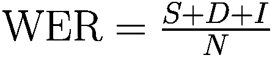，它衡量了与基准文本的偏差。其中 *S* 是替换的单词数量，*D* 是删除的数量，*I* 是插入的数量，与包含 *N* 个单词的基准文本相比。

传统 ASR 系统通常由独立的部分组成，如声学模型、发音模型和语言模型。这些部分分别训练，然后结合进行推理。通常，会使用预处理模块来降低音频记录中的信噪比。有不同类型的滤波器和方法可以应用于声音信号以减少相关的噪声。此外，说话者可能由多个麦克风录制，这可以定位说话者并极大地减少背景噪声（波束成形）[24]。

随后，特征提取模块的任务是生成与语音识别相关的特征，从信号中去除无关信息并减少输入大小。这通常涉及傅里叶变换的变体，提取波形频率。最常用的特征提取方法是 *梅尔频率倒谱系数* (MFCCs)、离散小波变换 (DWT) 和线性预测编码 (LPC) [101]。一个示例如图 7.1 所示。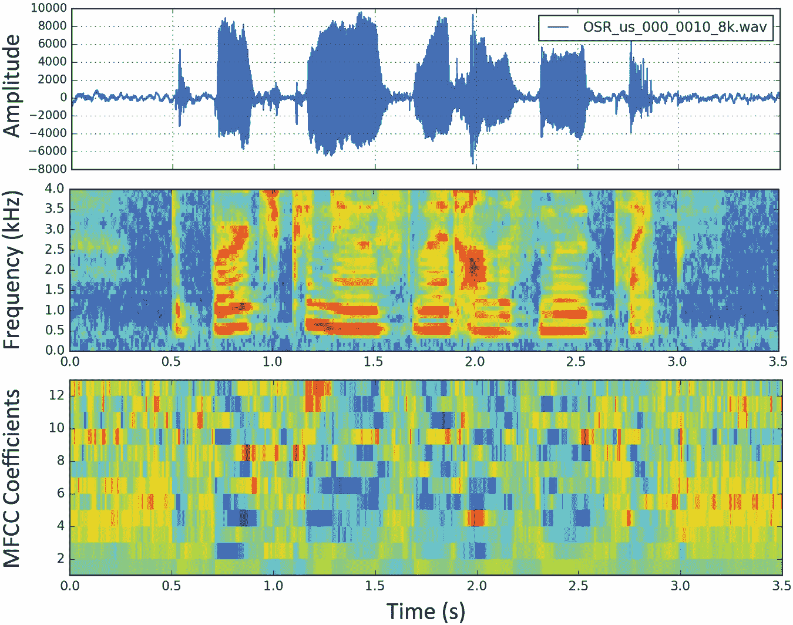

热图展示了 M F C C 系数、千赫兹频率和秒时间内的振幅与时间的关系。O S R us 0000010 8 k dot w a v 显示了振幅、频率和 M F C C 系数的波动，并用颜色突出显示。

图 7.1

音频信号（顶部）及其通过傅里叶变换提取的频率（中间）以及相应的 MFCCs（底部）。图像版权信息见表[A.3](https://doi.org/10.1007/978-3-031-23190-2_BM1#Tab4)

最终模块是一个分类器，它接收一个固定长度的向量，该向量表征给定时间槽内的信号。它估计下一个时间槽输出单词或音素的概率。早期的分类器只能处理单个说话者。开发了新的模型来识别多个说话者的语音。一个例子是一个 ASR 系统，在交换测试集上实现了 5.1%的单词错误率（WER）[181]。它由类似于 ResNet 和 LACE 的 CNN 模型以及用于建模声学的双向 LSTM 组成。Malik 等人提供了一项先前系统的调查[101]。Papastratis 提供了一项更近期 ASR 系统的调查[117]，讨论了 RNN、CNN 和 Transformer 模型。

### 7.1.2 基于 Transformer 的语音识别

基于自注意力的 PLM 是序列建模的好选择，因为它们能够捕捉长距离的交互，并且需要的计算量更少。概述见表 7.1。然而，PLM 在提取细粒度局部特征模式方面能力较弱。因此，PLM 和 CNN 的组合通常用于 ASR。目前最好的基于 LSTM 的 ASR 系统**ContextNet + NST** [121] 在 LibriSpeech（清洁）上实现了 1.7%的 WER。表 7.1

主要语音识别技术

| 模型 | 机制 | 性能 |
| --- | --- | --- |
| ContextNet + NST | 目前最好的基于 LSTM 的 ASR 系统 | Librispeech WER 1.7% |
| Conformer | 在 Transformer 块中使用 CNN 和自注意力，LSTM 作为语言模型 | Librispeech WER 1.9% |
| wav2vec 2.0 | 通过 CNN 编码语音，将输入离散化到 Transformer，预测掩码输入。针对语音识别进行微调 | Librispeech WER 1.5% |
| 结合 SSL | Conformer 模型 + 无监督 wav2vec 2.0，SpecAugment 生成噪声训练数据 | Librispeech WER 1.4% |
| SpeechStew | 与 Combined SSL 类似，在 7 个数据集上训练，针对语音识别微调 | Librispeech WER 1.7% 无语言模型 |

**Conformer** [59] 是一个卷积增强的 Transformer。Conformer 将一个卷积模块（第 1.7 节）和一个自注意力模块（第 2.3 节）作为编码块内部的层。卷积模块包含一个 1×1 点卷积，其扩展因子为 2，通过一个带有*门控线性单元*（GLU）激活层的通道数投影，该层允许选择对预测重要的特征。随后是一个*1-D 深度卷积*，为每个输入通道应用单个卷积滤波器。随后是一个批量归一化，然后是一个*Swish* [131] 激活层。

具有高达 17 个 conformer 块的模型具有高达 118M 个参数，并在 *LibriSpeech* [116] 数据集上进行训练，该数据集包含不同说话者朗读的有声读物。它为每个 10ms 的时间槽获得 80 个滤波器组特征向量（图 7.1）。作者使用 SpecAugment [120] 对输入信号的不同部分进行掩码，以正则化模型。此外，他们在 LibriSpeech 语料库上训练了一个 3 层 LSTM 语言模型，预测下一个单词。语言模型的输出与 transformer 的输出相结合，以强调语法和语义上正确的单词。与 LM 一起，Conformer 在 LibriSpeech（清洁）上实现了 1.9% 的 WER。没有 LM 时，WER 为 2.1%。

**S4** [58] 模型能够处理长达 16k 个元素的长时间输入序列（第 3.2.2 节）。它被应用于语音分类，并能够将 Sota 提高到 98.3%，同时处理原始语音信号。与先前 Sota 准确率 95.3% 相比，这是一个巨大的错误减少。预计该模型也将导致其他语音识别任务中的错误显著减少。

### 7.1.3 语音识别的自监督学习

语音识别的自监督学习有潜力通过额外的未标记数据来增强语音识别结果。可以证明，在大量未标记数据上进行的自训练会导致模型性能显著提高，而需要相对较少的微调数据 [184]。

**wav2vec 2.0** [10] 在没有转录本的情况下对语音数据进行无监督学习。类似于用于文本的 BERT 模型，它学习预测掩码声音“标记”。wav2vec 通过多层 CNN 对原始语音音频进行编码，为每个时间槽生成语音的潜在表示。连续的潜在表示通过量化模块离散化为标记 ***q***[*t*]。这种离散化是一个不连续的操作，阻碍了梯度反向传播。

一种解决方案是在采样结果的离散值和概率分布之间进行插值。这可以通过*Gumbel-Softmax 分布*[75]来实现。为了从概率*p*[1]，…，*p*[*k*]采样一个离散分布，我们可以抽取一个随机均匀变量*U*∼uniform(0, 1)，并计算*Z*=onehot(max[*i*]*p*[1]+⋯*p*[*i*−1]≤*U*)，其中*i*=1, …, *k*是离散索引，onehot(*j*)生成一个在位置*j*处为 1 的零向量。由于 max 函数，这种采样不可微分。一个替代公式是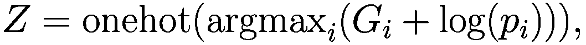(7.1)，其中*G*[*i*]∼Gumbel(0, 1)是从标准 Gumbel 分布中抽取的独立同分布样本。这把*Z*的采样重构为参数的确定性函数和一些具有固定分布的独立噪声。现在可以使用 softmax 函数作为 argmax 的微分近似：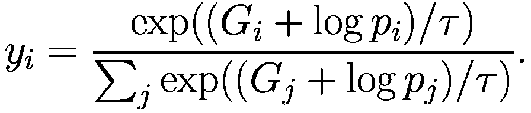(7.2)。

*τ*是温度参数，它控制新样本与离散向量之间的近似程度。这种近似在训练期间使用，在评估期间计算离散的 onehot 向量。wav2vec 通过这种方法计算离散向量***q***[*t*]。

10 个随机抽取的连续时间步的***q***[*t*]表示被掩码，需要通过类似于 BERT 的 Transformer 进行重建。自注意力机制捕捉了整个潜在表示序列的依赖关系。该模型在超过 1000 小时的标注和无标注语音数据上进行了预训练。预训练模型通过在上下文网络之上添加一个随机初始化的线性投影到*C*个类别（包括字符以及单词边界标记）进行微调，以适应跨越多个时间槽的字符。为了适应这种情况，使用了*连接主义时序分类*（CTC）损失[57]。微调使用了 5 小时的带有音素标注的音频数据。在 LibriSpeech 上，作者实现了 2.1%的词错误率（WER）。一个具有 300M 参数的类似模型，使用 53k 小时的未标注数据用于 wave2vec 和 1000 万小时的标注数据用于微调，在 LibriSpeech 上实现了 3.0%的词错误率[184]。在所有数据上训练可以将词错误率降低到 1.5%。

**联合 SSL** [196] 结合了 wave2vec 无监督预训练和 Conformer。ASR 网络是一个序列‘翻译器’，由一个最多包含 1B 参数的 Conformer 编码器和多层 LSTM 解码器组成。此外，作者使用了 Noisy Student 训练 (NST)，其中使用一个教师模型通过音频推理生成未标记数据的转录。经过过滤和平衡的教师标记数据随后用于训练下一代 ASR 模型。在 LibriSpeech 上，该模型实现了 1.4% 的 WER 的 Sota。

**w2v-BERT** [31] 一方面通过对比学习将连续语音信号离散化为有限集的判别性语音标记。另一方面，该模型通过解决一个带有离散标记作为输入的掩码预测任务来学习上下文化的语音表示。在预训练期间，这两个任务以端到端的方式同时优化。在微调期间，使用 LSTM 解码器聚合了预训练的 w2v-BERT 模型（1B 参数）的输出。在 Librispeech 基准测试中，它与领先系统的 WER 相似，为 1.4%。在 Librispeech 基准测试的 test-other 中，该模型实现了 2.5% 的 WER 的 Sota。此外，具有 600M 参数的模型在语音搜索任务上进行了微调，允许用户通过在手机或计算机上说话来使用 Google 搜索。它由平均持续时间为 5.5 秒的语音片段组成。该模型能够将错误率降低约 30%，达到 6.2。**SpeechStew** [21] 使用了带有 wav2vec 预训练的 Conformer 1B。它在 7 个可用的语音识别数据集上进行了预训练，没有任何领域相关的重新平衡或重新加权。在没有语言模型的情况下，它在 LibriSpeech 上实现了 1.7% 的 WER。

**TERA** [98] 是一个使用多目标辅助任务进行预训练的自监督语音模型，在大量未标记语音的大型训练集上预训练一个 transformer 编码器。输入可以是任何声学特征，例如 MFCC。该模型通过从修改后的样本中重建声学帧来学习，这些样本在三个属性上进行了随机改变：时间改变需要从损坏的时间步块中重建。通道改变需要从缺失的频率通道块中恢复信号。幅度改变涉及改变特征幅度的再生。通过重建这些数据变化，模型学习了一个更好的上下文表示。时间改变宽度设置为 85 毫秒的语音，大约是平均音素持续时间。与 BERT 相似的最大模型有 170M 参数。该模型在电话分类、说话人识别和语音识别方面具有强大的结果，例如在 TIMIT 基准测试中，电话错误率 (PER) 为 14.5%。

在一项全面的分析中，张等人 [195] 评估了自监督预训练对 ASR 的益处。他们使用 600M 到 8B 参数的 Conformer 模型进行预训练和自训练，这些模型在包含数千到数百万小时音频的极其大型和多样化的未标记数据集上进行了训练 (*BigSSL*)。他们仅使用 3%的标记数据就获得了与语音搜索基准的 Sota 相当的结果。在八个 ASR 基准测试中，他们在预训练后能够匹配或提高 Sota。在语言识别和情感检测等五个非 ASR 任务上，他们能够提高 Sota。对于大型数据集，预训练的收益较小但仍然显著。

许多应用受益于不仅理解词语，还包括其他信息，例如说话者在说话时的情绪、说话者是否戴着口罩，或者语音是否为合成语音。Shor [156] 提出了一种基于 Conformer 的大规模架构，拥有超过 600M 的参数，可以微调以检测这些附加特征，并实现了 Sota 性能。

#### 可用实现

+   Conformer: [`github.com/PaddlePaddle/PaddleSpeech`](https://github.com/PaddlePaddle/PaddleSpeech)

+   wav2vec: [`github.com/facebookresearch/fairseq`](https://github.com/facebookresearch/fairseq) 翻译、摘要、语言建模和其他文本生成任务的序列建模工具包。

+   Tera: [`github.com/s3prl/s3prl`](https://github.com/s3prl/s3prl)

+   Hugging Face 语音识别: [`huggingface.co/models?pipeline_tag=automatic-speech-recognition`](https://huggingface.co/models?pipeline_tag=automatic-speech-recognition)

+   TensorFlow SST: [`tfhub.dev/s?module-type=audio-stt`](https://tfhub.dev/s?module-type=audio-stt)

### 7.1.4 文本到语音

语音合成是指从文本、唇语等另一种模态生成语音。*文本到语音* (*TTS*) 系统旨在将自然语言文本转换为语音。*平均意见评分* (*MOS*) 是评估生成语音质量最常用的方法。MOS 定义为在主观质量评估测试中对给定刺激进行的单个评分的人评数的算术平均值。MOS 的范围从 0 到 5，其中真实人类语音在 4.5 到 4.8 之间。Tan 等人 [163] 提供了 TTS 系统的全面和最新的调查。

虽然早期的 TTS 系统只是简单地将预先录制的语音片段连接起来，但现代系统执行完整的语音合成。**WaveNet** [114] 是第一个成功模拟音频信号原始波形而不是声学特征的模型。它能够以每秒 16,000 个样本的速度生成新的类似语音的波形。WaveNet 的核心是一个自回归模型，由扩张卷积组成，其中每个样本依赖于前一个样本。在每一层中，包含的时间步数翻倍。WaveNet 能够将 MOS 值从 3.86 提高到 4.21。*Fast WaveNet* 通过缓存先前计算将二次时间复杂度降低到线性复杂度。

**Tacotron 2** 是一种直接从文本进行语音合成的神经网络架构。它由一个具有注意力的循环 LSTM 序列到序列特征预测网络组成，该网络从输入字符序列预测一系列梅尔频谱图帧，以及 WaveNet 的修改版本，该版本根据预测的梅尔频谱图帧生成时间域波形样本。Tacotron 2 实现了令人印象深刻的 MOS 值 4.53。

由于 TTS 执行与 NLP 类似的序列处理，因此自然地，PLMs 也被用于这个领域。基于 Transformer 的模型旨在缓解先前 TTS 方法（如 Tacotron 2）的两个问题：它们在训练和推理中的高计算成本，以及使用 LSTMs 建模长依赖关系的困难。

**Transformer TTS** [94] 将原始的 transformer 编码器-解码器 [168] 适配到语音合成。编码器接收音素作为输入，这些音素通过由 CNN 和全连接层组成的编码器预网络进行适配。标准的 transformer 编码器输出上下文音素嵌入（图 7.2）。解码器接收梅尔帧作为输入，这些输入通过具有两个全连接层的解码器预网络转换，以生成适当的嵌入。标准的解码器生成梅尔帧输出嵌入。这些嵌入随后通过两个不同的线性投影进一步处理，分别预测梅尔频谱图和停止标记。一个 5 层的 CNN 产生一个残差以细化梅尔频谱图的重建。WaveNet 语音合成器生成最终的音频输出。Transformer 的编码器和解码器都由 6 层和 8 个头组成。该模型比 Tacotron 2 快约 4.25 倍，并实现了接近人类质量的 MOS 值 4.39。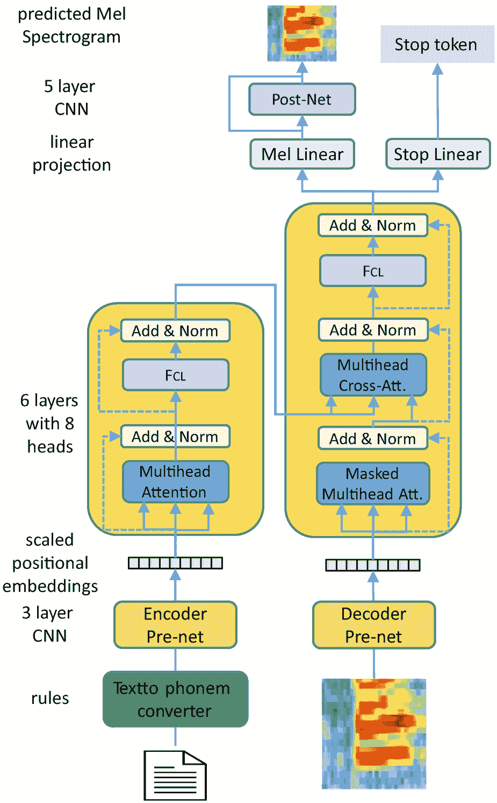

流程图说明了预测的梅尔频谱图、5 层 CNN、线性投影、6 层带有 8 个头的网络、缩放位置嵌入 3 层 CNN 和规则。从下到上依次是文本到音素转换器、编码器预网络、解码器预网络、后网络和停止标记。

图 7.2

使用 Transformer TTS 进行语音合成。编码器和解码器均包含 6 层，每层有 8 个注意力头和残差连接。生成的梅尔频谱图通过 WaveNet 语音合成器转换为最终的音频输出 [94]。图像归功于表[A.3](https://doi.org/10.1007/978-3-031-23190-2_BM1#Tab4)。

**FastSpeech 2** [138] 解决了由于语音的变化（如音调、时长、音量和韵律）而导致的输入文本可以对应多个可能的语音序列的问题。它通过 Transformer 编码器对输入音素进行编码以生成嵌入。然后，方差适配器将诸如时长、音调和能量等不同的方差信息添加到隐藏序列中。最后，梅尔频谱图解码器将适配后的隐藏序列并行转换为梅尔频谱图序列。编码器和梅尔频谱图解码器都包含包含 Transformer 块和 1D 卷积的层。方差适配器使用包含 1D 卷积、前馈层和具有 dropout 的正则化的层来预测时长、音调和能量。

变体 *Fastspeech 2s* 直接从文本生成波形，而不需要级联梅尔频谱图生成（声学模型）和波形生成（例如 wav2vec 这样的语音合成器）。最终的波形解码器由门控激活以及不同类型的 1D 卷积和扩张 1D 卷积组成，以覆盖更宽的时间范围。作者在波形解码器中采用对抗性训练，迫使它自行隐式恢复相位信息。

在他们的实验中，作者确定了以下 MOS 值：Tacotron 2：3.70，Transformer TTS：3.72，FastSpeech 2：3.83，FastSpeech 2s：3.71，以及人类语音：4.30。请注意，与人类语音的差异主要是由语音合成器引起的。此外，FastSpeech 2 和 FastSpeech 2s 在推理时间上比 Transformer TTS 快约 50 倍。

**AdaSpeech 2** [186] 将 TTS 系统适配到目标说话人。只需要目标说话人的声音录音，无需文本转录。作者将梅尔频谱图编码器应用于一个经过良好训练的 TTS 模型以进行语音重建，同时约束梅尔频谱图编码器的输出序列接近原始音素编码器的输出。梅尔编码器也由 4 个前馈 Transformer 块组成。请注意，原始系统无需重新训练，只需梅尔编码器。在针对目标说话人的微调过程中，梅尔解码器的参数被适配。该模型在转录 TTS 适配方面实现了与转录 TTS 相当的平均意见分数（MOS）语音质量。

最近亚马逊宣布，Alexa 将能够模仿其他人的声音 [17]。为了“让记忆持久”，例如，Alexa 可以用已故祖母的声音讲故事和播放音乐。亚马逊指出，模仿一个声音只需要大约一分钟的音频录音。

#### 可用实现

+   Tacotron 2: [`github.com/NVIDIA/tacotron2`](https://github.com/NVIDIA/tacotron2)

+   TransformerTTS: [`github.com/as-ideas/TransformerTTS`](https://github.com/as-ideas/TransformerTTS)

+   FastSpeech 2: [`github.com/ming024/FastSpeech2`](https://github.com/ming024/FastSpeech2)

+   AdaSpeech 2: [`github.com/rishikksh20/AdaSpeech2`](https://github.com/rishikksh20/AdaSpeech2)

+   Hugging Face TTS: [`huggingface.co/models?pipeline_tag=text-to-speech`](https://huggingface.co/models?pipeline_tag=text-to-speech)

+   Mozilla TTS 文本到语音：所有人都可以使用 [`github.com/mozilla/TTS`](https://github.com/mozilla/TTS)

+   TensorFlow TTS: [`tfhub.dev/s?module-type=audio-speech-synthesis`](https://tfhub.dev/s?module-type=audio-speech-synthesis)

### 7.1.5 语音到语音语言模型

**GSLM** [89] 是一个语言模型，它接收原始语音音频作为输入并直接生成输出。例如，它可以用来创建一个没有中间文本表示的对话系统。内部模型将传入的原始语音转换为离散的伪文本单元。为了创建不同长度的嵌入（50、100、200），使用了 CPC [113]、wave2vec 2.0 [10] 和 HuBERT [68] 作为离散化器。单元的选择很困难，因为没有声音单元的词汇表，而且声音单元长度可变，没有明显的分割。与 BERT 类似，HuBERT 使用带掩码的预测任务进行训练，输入为带掩码的连续音频信号。在实验中，HuBERT 在大多数情况下表现最佳，其次是 CPC。

自回归的“基于单元”的语言模型有 12 层，并在从 6k 小时 *LibriLight 语音数据* 生成的最多 3k 个单元的样本上进行训练 [139]。为了从单元生成语音，使用了修改版的 Tacotron-2 模型 [154]，它以伪文本单元作为输入并输出对数梅尔频谱图。为了生成波形，使用了预训练的声码器 *WaveGlow* [125]，它将对数梅尔频谱图转换为语音。

在第一次测试中，语音输入被编码成单元，这些单元被转换成语音。在这里，通过人类 MOS 意见评分来评估所产生语音的可懂度。当在*LJ Speech 数据*[74]上训练时，无监督模型实现了 MOS（平均意见评分）4.00 的分数，而 ASR 和 TTS 系统的组合实现了略高的 4.04 分[89]。在测试完整的语言模型生成时，模型实现了 4.01 的 MOS 分数，而 ASR 和语言模型的组合产生了 3.91 分的评分。根据作者的说法，生成的语音听起来像英语，具有可识别的音素和单词。示例表明，在语言和句法层面需要改进。对于声音转录，200 个单元是好的，而对于语言建模，似乎更少的单元更好。可以预期，随着额外训练数据的增加，质量可以得到提高。

### 7.1.6 音乐生成

基础模型也可以应用于其他序列数据，例如音乐。一方面，可以训练一个音乐语言模型，它能够根据训练数据生成新的音乐。另一方面，模型可以根据外部信息生成音乐，例如歌词或视频。Bilici [14]提供了一篇关于最近音乐生成模型的综述。

音乐生成的一个显著方法是**MuseNet**[123]，它采用稀疏 Transformer，这是 GPT-2 的一个变体。它在一个 4096 个 MIDI 字符的上下文中计算注意力模式。为了生成新的作品，可以选择一个作曲家并使用已知作品的起始音符。然后可以选择多达十种不同的乐器，系统将生成具有所需特性的音乐作品。专家的评分相当有利。同样，**音乐 Transformer**[71]生成钢琴曲。**主题 Transformer**[155]接收一个主题作为输入，并训练在生成结果中多次包含这个主题。

**点唱机**[36]采用多尺度向量量化变分自编码器模型（VQ-VAE）[113]将原始音频压缩成离散代码。这是基于自回归 Transformer 的，也适用于人声。使用了三个具有不同时间分辨率的独立 VQ-VAE 模型。训练好的模型可以根据艺术家和流派来引导音乐和声乐风格，以及根据未对齐的歌词来使唱歌更可控。该模型能够生成长达数分钟的作品，并且以自然的声音演唱。有许多样本可供参考[35]。

**CMT** [38] 为特定视频生成背景音乐。它的目标是匹配视频的节奏、时序和运动速度。CMT 从视频中提取这些特征，并允许全局控制音乐类型和乐器。该模型不需要配对的视频和音乐训练数据。实验表明，生成的背景音乐与输入视频的兼容性达到了令人满意的程度，同时音乐质量也非常出色。

#### 可用实现

+   CMT 可控音乐变换器 [`github.com/wzk1015/video-bgm-generation`](https://github.com/wzk1015/video-bgm-generation)

+   Jukebox：音乐生成器模型 [`github.com/openai/jukebox`](https://github.com/openai/jukebox)

### 7.1.7 摘要

语音识别在近年来取得了巨大的进步，基础模型现在已成为这一任务的成熟方法。它们与卷积神经网络块相结合，能够捕捉长距离的交互并减少处理时间。与自然语言处理类似，自监督学习也带来了巨大的性能提升。与自然语言处理中的标记不同，这里生成的是离散的声音表示。许多不同的模型遵循这一方案，并且它们能够提高在不同基准上的 Sota（State-of-the-Art）。

文本生成语音在近年来有了显著改进。WaveNet 是第一个以每秒 16,000 个样本生成类似语音波形模型。Transformer 可以用于将输入音素转换为梅尔频谱图，从而通过声码器生成语音音频。还有一些变体，如 FastSpeech 2s，它们可以直接将文本转换为音频信号。这些模型输出质量接近人类语音。一些模型能够调整它们的输出以适应个别说话者的声音。这很令人印象深刻，但如果以这种方式产生模仿某人声音的虚假陈述，这也可能是一个重大的安全问题。最近的长输入序列 S4 状态空间模型在分类语音信号时能够将错误减少 60%。可以预期，该模型也将导致其他语音识别任务中的错误显著减少。

语音识别和文本到语音可以与其他应用集成。SpeechBert [30] 是一个端到端语音问答（SQA）模型，通过单个 Transformer 编码器对音频和文本进行编码，该编码器在语音和文本语料库上预训练了 MLM（掩码语言模型），并在问答上进行微调。在智能手机上即时生成实时语音翻译，允许无缝进行外语交流 [78，81]。GSLM 是一个生成语言模型，它直接处理离散的声音标记。

音乐生成是一个相关的话题。自回归 PLM，例如 MuseNet 或 Music Transformer，可以根据与大型语料库的预训练生成音乐。在这里可以选择作曲家的风格和乐器。此外，音乐可以根据某些输入进行条件化，例如 Jukebox 模型的歌词文本或用于创作背景音乐的视频。

## 7.2 图像处理和生成

自然语言处理中的基础模型突破在计算机视觉社区中引发了极大的兴趣，以适应这些模型用于视觉和多模态学习任务。成功的关键因素有两个：自注意力机制和自监督。自注意力层生成考虑了标记（文本标记和/或视觉标记）之间关系的表示。自监督在训练大规模数据集时预测数据元素中被遮挡或修改的部分。它允许在不手动标注数据的情况下获得大量关于数据的知识，并且与 CNN 和 RNN 等其他模型相比，具有最小的归纳偏差。Khan 等人 [84] 和 Du 等人 [43] 提供了关于视觉和语言应用的基础模型的全面调查。Hafiz 等人 [62] 对注意力机制和机器视觉的深度学习进行了概述。最近有一篇关于视觉和语言研究的教程 [6]。本节讨论的模型的主要特性汇总在表 7.2 中。表 7.2

结合文本和图像的主要技术。**基准测试：** VQA：COCO 视觉问答数据集（Sect. 7.2.5） [56 ]; img-gen：MS-COCO 图像生成基准测试，带有微调；img-gen-0：MS-COCO 图像生成基准测试零样本；ImageNet：ImageNet 分类 top1 准确率；标题：MS-COCO 图像标题生成基准测试；FID：Fréchet Inception Distance 应尽可能小（Sect. 7.2.6） [64]。括号中的数字是参数数量

| 模型 | 方法 | 基准 |
| --- | --- | --- |
| Vision Transformer (ViT) Sect. 7.2.2 | 将从图像补丁生成的文本标记和图像标记连接起来。使用 BERT 自动编码器进行处理并执行分类（632M） | ImageNet Sota 准确率 90.5% |
| CLIP Sect. 7.2.4 | 使用视觉 Transformer 对图像进行编码，使用 GPT 自动编码器对文本进行编码。最大化图像和文本嵌入的相似度，预测它们是否属于一起 |   |
| VilBERT Sect. 7.2.5 | 使用 Faster R-CNN 提取边界框。图像区域和文本由两个 BERT 自动编码器编码，并执行交叉注意力。针对 VQA 进行微调 | VQA Sota 70.9% |
| OSCAR Sect. 7.2.5 | 使用 Faster R-CNN 提取边界框。一个 BERT 自动编码器将区域描述与文本关联。针对 7 个任务进行微调，例如图像标题生成 | 标题 Sota 41.7 Bleu-4 |
| VinVL Sect. 7.2.5 | 使用 ResNeXT 模型作为区域提取器，与 OSCAR 结合。针对图像标题生成进行微调 | 标题 40.4 Bleu-4 |
| DALL-E 章节 7.2.6 | 文本被编码为标记，图像通过变分自编码器（VAE）转换为图像标记。使用 GPT-3（12B）生成新的图像标记 | 图像生成-0 17.9 FID |
| GLIDE 章节 7.2.7 | 反转扩散以破坏图像。通过 U-Net 模型（3.8B）进行微小变化生成图像 | 图像生成-0 Sota 12.2 FID |
| XMC-GAN 章节 7.2.7 | 基于 GAN 的图像生成器，生成器创建图像，判别器区分伪造和真实图像 | 图像生成 Sota 9.3 FID |
| CogView 章节 7.2.7 | 向量化 VAE。GPT 模型（4B）使用文本标记和量化图像标记进行训练 | 图像生成在模糊图像上 Sota |
| LAFITE 章节 7.2.7 | 使用 CLIP 将文本转换为图像嵌入。训练以调节 StyleGAN2 的层[82]以生成图像 | 图像生成 Sota 8.1 FID 图像生成-0 16.9 FID |

表 7.2

| 模型 | 方法 | 基准 |
| --- | --- | --- |
| OFA 章节 7.2.8 | 使用文本、图像标记和带有边界框的对象。Seq2seq 模型（472M）预训练以关联标记和对象。文本指令控制 9 个不同的任务 | 图像生成 Sota 10.5 FID 标题 Sota 43.5 Bleu-4 |
| DALL-E 2 章节 7.2.7 | 通过 CLIP 从文本生成图像嵌入，通过扩散解码器转换为 1024×1024 图像 | 图像生成-0 Sota 10.4 FID |
| Imagen 章节 7.2.7 | 通过 T5-XXL 生成文本嵌入，通过扩散模型生成图像块，通过两个超分辨率扩散模型上采样到 1024×1024 | 图像生成-0 Sota 7.3 FID |
| Stable Diffusion 章节 7.2.7 | 使用 U-Net 和扩散生成图像 | ImageNet 条件 3.6 FID |

### 7.2.1 图像处理基础

图像处理可以解决各种任务，如图 7.3 所示。图像的主要内容可以通过分类图像中最重要的对象来描述。更具有挑战性的是图像中相关对象的识别和分类。这也需要通过边界框描述对象位置。为图像创建标题涉及识别图像中最重要的对象，它们如何相互关联，并使用自然语言句子来描述它们。与此相关的是检索与标题对应的图像。视觉问答需要解释问题并分析图像以生成自然语言的答案。一种变体是多模态验证，其中需要对关于图像的陈述的真实性进行评估。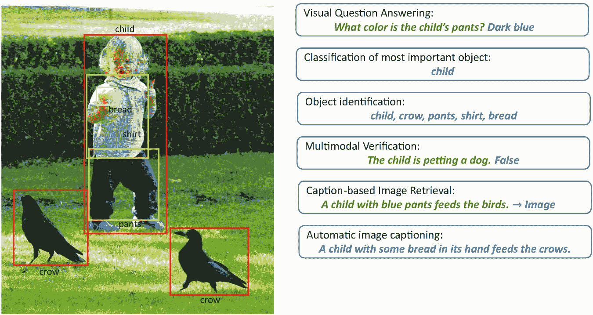

一张孩子的照片，孩子穿着衬衫和裤子，站在草地上，手里拿着面包。两只乌鸦站在孩子旁边。右边的图表解释了视觉问答、对象分类和识别、验证、基于标题的图像检索和自动图像标题。

图 7.3

图像分析可用于解决许多不同的任务。根据任务的不同，系统接收文本（绿色）和图像作为输入，并生成文本（蓝色）和图像作为输出。图像来源见表 [A.​3](https://doi.org/10.1007/978-3-031-23190-2_BM1#Tab4)

许多任务涉及创建新的图像。一个突出的例子是根据标题生成一个全新的图像。或者，可以填充缺失的图像区域。另一种变体是根据标题更改图像的风格，例如将照片转换为梵高的画风。这也可以应用于特定的图像区域。

变换器中图像表示的一个重要方面是将图像分割成小块。语言模型将文本分割成一系列标记，这些标记构成了变换器的输入。对于图像，也采用相同的方法，将其分割成小块。每个小块的内容可以用一个向量表示，这个向量构成了变换器的输入。小块的位置通过位置嵌入进行编码，该嵌入被添加到输入嵌入中。

图像块的嵌入可以简单地是其像素值的可学习线性变换。也可以使用其他变换，例如小的 CNN 模型或变分自编码器（见第 1.​7 节）。为了获得更鲁棒的表现，生成的向量通常会被离散化以消除局部噪声。此外，可以从标题或区域注释中使用的文本作为输入。通常，此文本会被转换为词汇表中的标记。

为了模拟图像元素与文本之间的交互，可以使用不同的变换器架构（见表 7.2）。*单流架构*将所有输入连接起来，并用单个变换器进行处理。这允许确定不同输入元素之间的交互，但需要处理长序列。双流或*多流架构*通过单独的 PLM 处理不同的模态或图像分辨率。在这种情况下，输入序列更短。已经提出了各种流之间的交互形式（例如，交叉注意力）。随后，可以通过相似度度量比较输出，或者通过其他 PLM 进行组合。

视觉的预训练任务遵循文本 Transformer 的模式。*掩码语言建模*（MLM）掩码输入标记的一部分，并要求模型从上下文中预测标记。如果有文本和图像标记，可以利用这两种模态的信息来完成此任务，并且模型学习文本和图像元素之间的关联。同样，可以掩码图像区域，并从文本和图像上下文中重建。在分类任务中，模型可以确定一个标题是否正确描述了图像或是一些随机文本。这样，可以训练文本和图像之间的相关性。另一个目标是通过对匹配的图像-文本对嵌入进行拉近，而对非匹配对进行推远，在相同的语义空间中学习联合图像和词表示。为此，图像到文本的*对比损失*通过嵌入之间的标量积来衡量嵌入的邻近度。

### 7.2.2 视觉 Transformer

**ViT**（视觉 Transformer）[42] 将纯 Transformer 编码器（第 2.3.1 节）应用于图像块。输入图像 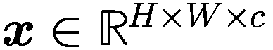 有 *H*×*W* 像素和 *c* 个颜色通道。它被分割成 *s*×*s* 像素的块，例如 *s* = 16。每个 *N* = *HW*∕*s*² 块包含 *s*²∗*c* 个数字，这些数字被线性映射到长度为 *d* 的向量，用作 Transformer 的输入。通常，会添加一维位置嵌入，因为二维位置没有带来显著的性能提升。使用了不同模型 ViT[Base]、ViT[Large]和 ViT[Huge]，它们分别有 12、24 和 32 层，以及 86M、307M 和 632M 个参数。

Transformer 编码器有一个由大小为 *d* 的向量组成的输入序列长度 *N*。每一层生成长度为 *d* 的 *N* 个嵌入。最后一个编码块中[CLS]标记的输出嵌入是逻辑分类器的输入，用于计算图像类别的概率。架构如图 7.4 所示.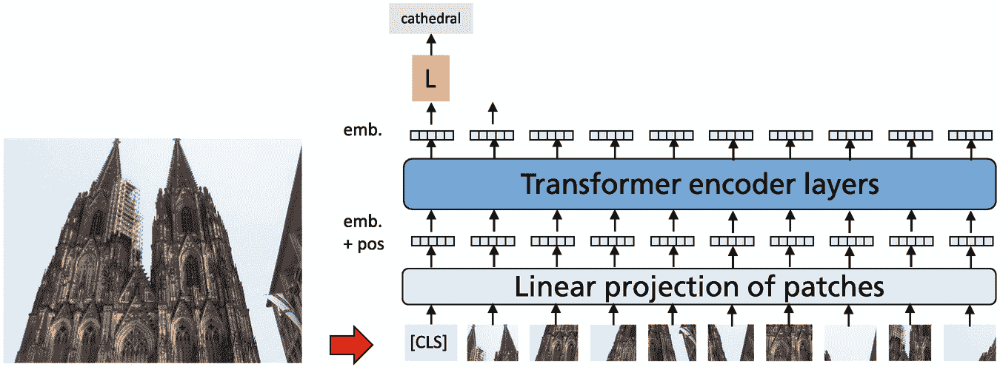

从底部视角拍摄的一座高楼的照片。图像处理步骤包括 C L S，这是一个用于总结整个块序列的特殊标记，块的线性投影。每个块被当作 N L P 中的一个单词，Transformer 编码器层，以及 L，即块序列的长度。

图 7.4

视觉 Transformer ViT 将图像分割成固定大小的正方形块。对于每个块，通过线性投影计算一个嵌入。标准的编码器计算上下文嵌入。使用[CLS]标记的嵌入通过逻辑分类器计算类别 [42]。图像经作者许可改编自 [42]，详见表[A.3](https://doi.org/10.1007/978-3-031-23190-2_BM1#Tab4)

值得注意的是，图像可以使用不同的输入图像分辨率进行训练。但块的大小始终相同，导致不同的输入长度。为了考虑新的分辨率，对位置嵌入执行 2D 插值。该模型通常在大数据集 JFT-300M [161]上预训练，以预测掩码输入。使用不同的分类器层进行小任务的微调。通常，在比预训练更高的分辨率上进行微调是有益的 [189]。模型在包含高达 3000 万张图像的数据集上进行了预训练。

最大的模型 ViT[Huge]的输入块大小为 14×14。它能够超越改进并预训练的 ResNet152 [63]，后者有 152 个 CNN 层和 EfficientNet [92]，在 ImageNet 上表现优异，并在将图像分类为 1000 个对象类别时达到了 90.5%的 Top-1 准确率 [118]。预训练使 ImageNet 测试集的绝对准确率提高了 13%。使用 2.5k TPUv3 天，它只需要 ResNet 所需计算努力的 25%（包括预训练）。它还提高了其他 5 个流行图像分类基准的 Sota。具有 16×16 输入块大小的较小 ViT[Large]也优于 ResNet152，只需 6.8%的 ResNet152 计算努力。

当 ViT 在类似 ImageNet 的中等数据集上训练时，该模型在参数数量可比的情况下，性能低于 ResNet（第 1.7 节）。似乎 CNN 具有更合适的归纳偏差，例如平移等变性和局部性，这些是 transformer 必须通过预训练来学习的。因此，只有预训练的 transformer 才能超越 CNN，但这需要更低的计算努力。Cao 等人 [20] 提出了一种方法，说明 ViT 如何在有限的数据下进行训练并取得良好的结果。Chefer 等人 [22] 提出了一种基于泰勒级数分解方法的新方法，以可视化导致特定图像分类的图像部分。

分析训练模型的内部结构是有益的。结果表明，训练的位置嵌入反映了输入图像的行和列结构，同一行/列中的块具有相似的嵌入。基于注意力权重，可以确定特定注意力头考虑的图像部分。一些注意力头考虑整个图像，而其他注意力头在底层具有一致的小注意力距离。这可能在 CNN 的早期卷积层中起到类似的作用 [130]。一项实验研究表明，变换器对严重遮挡具有高度鲁棒性 [108]。与 CNN 不同，CNN 通常基于纹理而不是形状来检测对象，ViT 在形状识别上与人类相当。图 7.5 显示了整个 ViT 模型对应于语义相关区域的注意力区域。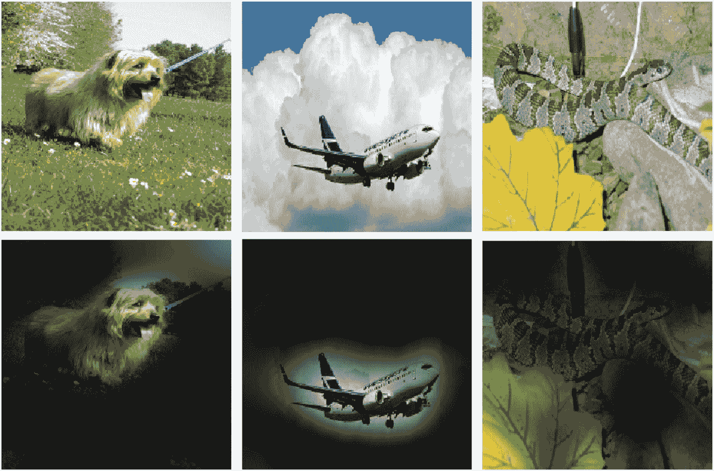

第一行中的 3 个面板照片清晰地展示了狗、飞行和蛇的景象。第二行中的 3 个面板照片以较暗的模式重复了相同的图片，并聚焦于狗、飞行和蛇。

图 7.5

输入图像显示在上行。下行描述了视觉变换器模型计算出的对输入空间进行分类的主要关注区域。图像经作者许可重印 [42，第 8 页]

许多研究人员已经研究了 ViT 的鲁棒性。在一系列实验中，Mao 等人 [103] 发现 ViT 倾向于使用包含纹理和噪声的局部特征，并在一定程度上忽略了形状和结构等全局上下文。作为回应，他们提出使用基于变分自动编码器（*VQ-VAE*）的向量量化器对连续输入特征进行离散化，以图像标记的形式使用 [113]。他们报告说，在几个 ImageNet 分类基准测试中，准确率提高了高达 12%。Ryoo 等人 [146] 提出了一种类似的自适应标记生成方法，用于 ViT。**BEiT** [11] 使用受 BERT（掩码图像建模）启发的自监督方法，并基于 VQ-VAE，优于监督预训练的 ViT。

### 7.2.3 图像生成

有许多用于各种图像增强任务的基础模型。图像**超分辨率**将低分辨率图像转换为高分辨率。**SwinIR** [96] 基于从小型图像块开始的分层表示，并在更深层次中逐渐合并相邻的图像块。对于训练，模型以小规模图像作为输入，该图像通过 CNN 层进行预处理。变换器块包含变换器和 CNN 层，并训练以重建高分辨率图像。SwinIR 在超分辨率、图像去噪和 JPEG 压缩伪影分辨率基准测试中实现了 Sota，同时只有 1200 万个参数。

**ColTran** [88] 通过使用具有列和行注意力的 Transformer 将灰度图像转换为全彩色图像。它首先通过条件 Transformer 预测一个只有 512 种粗略颜色的空间减少图像的颜色。两个随后的完全并行 Transformer 将粗略着色的低分辨率图像上采样到全彩色的全分辨率图像。该模型在 ImageNet 数据上实现了最佳 FID 分数（第 7.2.6 节）为 19.7，与不同的替代方案相比。颜色化的示例显示在图 7.6 中。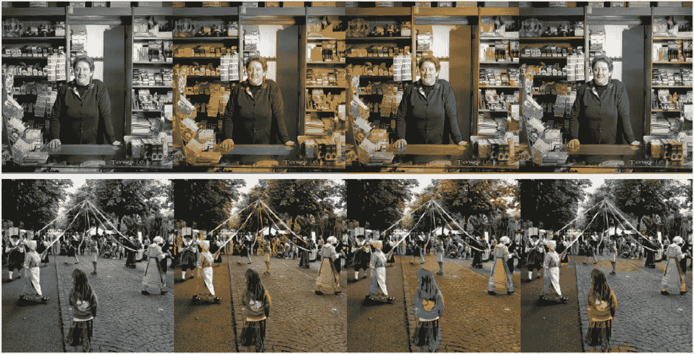

第一行中的 4 个照片面板代表一个人站在商店里，有 4 种不同的颜色变化和阴影。第二行中的 4 个照片面板代表一些人四处走动，一个人手持绳索，有 4 种不同的颜色变化和阴影。

图 7.6

由 ColTRan [88] 对灰度图像进行不同颜色化（左侧）。请注意，通常尊重语义约束，例如肤色和树叶的颜色。图像经作者许可重新印刷 [88，第 1 页]。

**Swin Transformer** [99] 通过从小型图像块开始，并在更深层的 Transformer 层中逐步合并相邻块，构建了一个图像的层次表示。通过在大小为 7 的非重叠窗口内局部计算自注意力，实现了线性计算复杂度，这些窗口将图像分割。在连续层之间，注意力窗口被移动，以便与先前自注意力层的相邻窗口重叠。最大的模型版本有 1970 万个参数，处理分辨率为 384×384 的图像。在 ImageNet 分类中，该模型达到了 87.3%的 top-1 准确率。在图像目标检测方面，Swin Transformer 也能提高先前最佳结果。

**VQ-GAN** [45] 使用 CNN 高效地学习一个包含丰富上下文视觉块的代码簿，然后学习它们的全局结构模型。这些块内的长距离相互作用需要一个表达丰富的 GPT-2 来建模视觉块的概率分布。图像块字典根据*感知损失* [41，194] 捕获感知上重要的局部结构。该损失通过基于块的图像判别器的对抗训练程序进行优化，该判别器旨在区分真实图像和重建图像。

一个具有 307M 参数的 GPT-2 模型经过预训练，用于生成图像语料库中编码图像的代码序列。每个图像被划分为 16×16 的块，序列长度为 1024。一个示例图像如图 7.7 所示。如果训练语料库包含类别信息 *c*，则可以生成特定类别的图像。类别信息也可以限制到特定的图像区域。虽然 VQ-VAE 在重建 ImageNet 照片时产生大约 10 的 FID，但 VQ-GAN 实现了更好的 1.7 的值。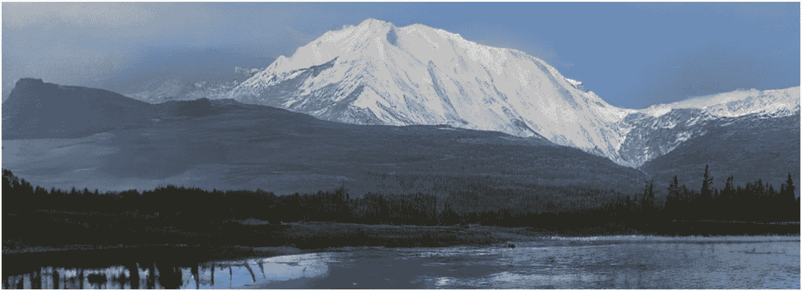

一张照片展示了湖边覆盖着雪的山丘和山峦。

图 7.7

VQ-GAN [45] 允许变压器合成具有 1280×460 像素的高分辨率图像。图像经作者许可重新印刷 [45，第 12873 页]

**StyleSwin** [191] 是 VQ-GAN 的一种进一步发展。它使用了上面讨论过的 *Swin 变换器* [99]。StyleSwin 在频谱域使用小波判别器来抑制块状伪影。具有 41M 参数的模型在多个已建立的基准测试中实现了 Sota 质量水平。示例图像如图 7.8 所示，具有一致的全球几何形状和高度保真的细节。在 CelebA-HQ 1024 基准测试中，StyleSwin 的 FID 为 4.4，优于包括 StyleGAN2 [82] 在内的所有先前模型。对于基于 LSUN 数据集生成教堂的任务，StyleSwin 的 FID 分数为 3.1，几乎与 FID 分数为 2.9 的最佳评分对抗 CIPS 模型 [7] 相当！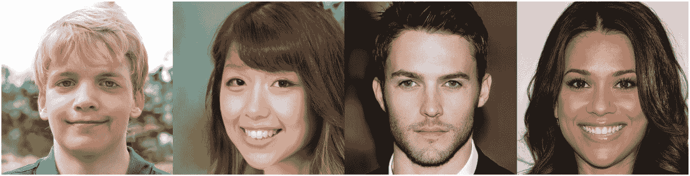

不同个体的 4 张面部照片。

图 7.8

StyleSwin [191] 在 FFHQ 1024×1024 数据（左侧）和 CelebA-HQ 1024×1024 数据（右侧）上生成的 1024×1024 分辨率的图像。最佳查看方式为放大查看。图像经作者许可重新印刷 [191，第 8 页]

**Data2vec** [9] 提出了一种新的自监督学习训练标准，该标准可应用于图像、文本和语音数据。它有两种模型：一种教师模型，处理整个输入，一种学生模型，在掩码一些数据的同时处理输入。

该模型采用标准的变压器架构，具有媒体特定的输入编码。图像通过类似于 ViT 的线性变换图像块进行编码。语音数据通过多层 1-D 卷积进行编码。文本数据编码为子词标记。学生模型的训练目标是教师网络平均顶部 *K* 编码块的平均值，该网络处理完整输入。这个目标必须由只接收掩码输入的学生模型预测。data2vec 的表示是连续的，并通过使用自注意力进行上下文化，这使得它们比其他方法使用的离散标记集更丰富。

根据此方案分别训练语音、图像和文本的独立模型。对于图像，Data2vec 模型在 ImageNet-1k 数据集上实现了 86.2%的新 Sota top-1 准确率，训练集受限。对于语音数据，模型在 Librispeech 测试-其他基准上达到了 5.5%的 WER。对于语言处理，Data2vec 在 GLUE 上的平均得分为 82.9，优于 RoBERTa。这表明该模型可以有效地处理多种模态。可以预期，该模型将被扩展以跨模态学习。

### 7.2.4 文本和图像的联合处理

一旦将变压器应用于文本和图像，联合处理这两种模态就成为一种明显的替代方案。为此需要三个步骤：

+   将图像和文本编码成嵌入，保留其语义；

+   设计强大的架构来模拟两种模态之间的交互。

+   开发有效的预训练任务。

在学习通用的视觉和语言特征后，这些 PLM 可以在各种下游视觉-语言任务上进行微调。

对于预训练大规模文本-图像对数据集（***v***，***u**），需要。每个对由一个文本标记序列***v***[1]，…，***v***[*T*]和一个图像特征或*视觉标记*序列***u***[1]，…，***u***[*R*]组成，例如图像块。这样，我们可以统一两种模态的输入表示，作为嵌入序列。一个示例数据集是*COCO 标题* [26]，它包含 328k 张自然环境中常见物体的 91 种类型的图像及其相应的图像标题（图 7.9）。其他数据集如*概念标题*（CC） [153]，*RedCaps* [34]和*Laion* [151]分别包含 3.1M、12M 和 4 亿张图像，以及标题或描述性文本。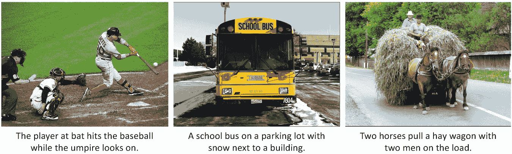

一系列 3 张照片。照片 1，击球手击打棒球，裁判在旁边观看。照片 2，一辆校车停在停车场，旁边有一座建筑物和雪。照片 3，两匹马拉着装满干草的马车，车上载着两名男子。

图 7.9

MS-COCO 数据集 [26]: 与数据集样本图像相似的照片。相应的标题表明了细节程度。图像来源见表[A.3](https://doi.org/10.1007/978-3-031-23190-2_BM1#Tab4)

预训练任务必须设计得使模型能够根据剩余的上下文文本和图像特征重建文本或图像的部分。对于 *跨模态 MLM*（掩码语言模型），模型必须根据其他未掩码的文本标记和视觉标记预测掩码标记或图像块。这里可以使用不同的掩码策略，例如全词掩码、掩码文本跨度或标记置换（第 3.1 节）。*掩码区域预测*旨在预测图像区域的内容。对象及其区域是手动或通过辅助模型标注的。然后模型需要预测该区域的对象（或对象分布）。通过这种方式，模型学习在图像中定位对象。

**CLIP** [126, 127] 是经过训练以预测一个分数，表示哪个图像标题对应哪个图像。给定一个包含（***v***[1], ***u***[1]），…，（***v***[*n*], ***u***[*n*]) 的标记化文本-图像对的批次，CLIP 需要预测在批次中实际发生的 *n*×*n* 种可能的（***v***[*i*], ***u***[*j*]) 配对中的哪一种。通过 **对比学习**，CLIP 通过联合训练图像编码器和文本编码器来最大化批次中 *n* 个真实配对的图像和文本嵌入的余弦相似度，同时最小化 *n*²−*n* 个不正确配对的嵌入的余弦相似度。这种带有正负例的对比训练已被证明优于其他方法。作为图像编码器，采用了大小为 14×14 的图像块 Vision Transformer (ViT)（第 7.2.2 节），它比基于 CNN 的 ResNet [63] 编码器表现更好。文本被 [SOS] 和 [EOS] 标记包围，并使用一个 12 层的自回归 GPT 模型来计算嵌入。最高层中的 [EOS] 嵌入被用作整个文本的表示。

CLIP 在 *WIT 数据* [127] 的 400M 图像-文本对上进行了训练，以将图像与最佳匹配的标题关联起来。此外，预测下一个标记被用作 GPT 模型的辅助损失项。该模型可用于检索与图像最匹配的文本，或与文本最优化对应的图像。

结果模型已经获得了关于文本和图像的全面知识。其 top-1 分类准确率达到 76.2%，甚至超过了在 ImageNet 零样本分类中原始 ResNet50 的 75.0%的 top-1 分类准确率，而无需使用 ResNet50 训练所用的任何 1.28M 个训练示例。因此，CLIP 可以被认为是一个“零样本分类器”。这一点也适用于 27 个其他图像分类基准中的 16 个。当在 CLIP 的特征之上拟合一个线性分类器时，它将 CLIP 在 ImageNet 测试集上的准确率提高了近 10% [126]。如果图像分布发生变化，例如变为草图，基于 CLIP 的分类器将更加鲁棒。零样本 CLIP 分类器通过大量提高有效鲁棒性，特别是在分布偏移方面。这表明，将字幕文本纳入视觉模型可以增强性能和鲁棒性。

**BriVL** [46]是一个针对中文的类似模型，它使用了一个存储在队列中的更大的负例集。它使用了一个包含 650M 个弱相关文本-图像对的巨大训练数据集，例如，一个生日蛋糕的图像的标题是*“生日快乐！许个愿”*。它在跨模态检索和视觉问答方面实现了 Sota 结果。

**ALIGN** [77]也使用文本和图像的单独编码器，并在顶部使用余弦相似度组合函数。作为图像编码器，使用了 EfficientNet CNN。BERT 被训练来为[CLS]标记生成文本嵌入。同样，对于真实的图像-文本对，相似度被最小化，而对于随机对，相似度被最大化。ALIGN 有 675M 个参数，并使用了一个包含 1.8B 个噪声图像对的巨大训练集。尽管数据有噪声，该模型在 ImageNet 顶级 1 分类上的准确率（85.5%）略高于 CLIP。

### 7.2.5 通过文本描述图像

自动生成图像的自然语言描述也称为**图像标注**或**图像标题**。这项任务具有挑战性，因为它需要视觉感知、识别、现实世界知识，以及将语言表达在图像空间中的**定位**。**符号定位**描述了词语如何获得其意义，例如通过将一个词与图像中的物体关联起来。除了确定和提取图像中的重要对象和细节之外，模型还必须推断对象和场景的语义关系（图 7.9）。

当前用于描述图像的最顶级模型工作在两个阶段：

+   一个**目标检测**模型被预先训练来将图像及其中的视觉对象编码为特征向量，

+   一个跨模态 PLM 被预先训练来关联文本和视觉特征并为图像生成标题。

与语言翻译类似，使用各种指标来评估生成的文本，例如 Bleu 或 Rouge（见第 2.3.3 节）。Hossain 等人 [67]、Oluwasammi 等人 [112] 和 Stefanini 等人 [159] 提供了图像描述技术调查。

**VilBERT** [100] 旨在学习能够联合建模图像和自然语言的表示。它使用预训练的目标检测网络（Faster R-CNN [137]）提取边界框及其视觉特征。这些图像区域特征以及文本输入到两个独立的变压器编码器（双流架构）。随后，应用具有双向交叉注意力的变压器层来学习跨模态关系。VilBERT 在概念描述数据上进行了预训练。

该模型在不同的任务上进行了微调和评估。*视觉问答* (*VQA*) 回答关于图像的自然语言问题。VQA 被视为一个有 3129 个可能答案的多标签分类任务。文本和图像部分的最终嵌入被输入到分类器中以估计类概率。在 COCO 测试集上，VilBERT 实现了 70.9%的新 Sota 准确率。*基于描述的图像检索*是从描述其内容的描述中识别图像的任务。该模型在 Flickr 数据集上进行了微调，召回率@1 为 58.2%，从而建立了新的 Sota。

**OSCAR** [95] 的策略是将图像中的相关对象与描述文本中的对应短语相连接。作者使用自注意力来学习这些对齐，这些对齐可以通过图像中检测到的附加对象标签作为参考点显著改进。Oscar 将每个输入图像-文本对表示为一个词-标签-图像三元组 (*w*;*q*;*v*)，其中 *w* 是描述文本的单词序列，*q* 包含在图像中检测到的文本对象标签的单词，而 *v* 是相应的区域图像集合。使用 CNN 模型（Faster R-CNN [137]）来发现 *q* 中的对象以及相应的区域 *v*。为了预训练变压器编码器，(*w*;*q*;*v*) 中的部分标记被掩码，模型学习预测掩码标记。此外，有时会随机更改 *q* 项。模型有额外任务来识别这些修改。使用 6.5 百万个文本-图像对的公共语料库，以序列长度 768 和 1024 训练了小型和大型模型版本。模型根据序列到序列目标进行微调。该模型在 COCO-captions 上实现了新的 Sota，Bleu-4 为 41.7%，Meteor 和 Rouge-L 以及几个其他描述基准。

**VinVL** [193] 在三个包含 2.5M 张图片的文本-图像语料库上进行了预训练，并能生成包含更丰富视觉对象和概念的视觉特征。VinVL 基于基于 CNN 的 ResNeXt-152 C4 架构[179]预训练了一个大规模的对象-属性检测模型。该模型不是通过单个名词来描述对象，而是通过大量属性和细节，这增强了联合图像-语言任务（图 7.10）的性能。该方法与 OSCAR 结合，在图像描述方面实现了改进的 Sota。**VIVO** [70] 是一个类似的 transformer 模型，用于用 6.4k 个不同的对象标签标记图像区域。VIVO 使用 COCO 图像-描述对进行微调，并学习生成描述句子，也使用在描述数据中未出现的对象标签。这是可能的，因为 VIVO 可以利用大量成对的图像-标签数据来学习图像的丰富描述。在测试集上，根据*CIDEr 指标* [69]，VIVO 生成的描述比人类更好，该指标计算生成文本和参考文本中按 tf-idf 加权的共同单词！

2 张相似的照片。照片 1，检测到的部分被标记为一个人、一套湿式潜水服、一条人臂、一条人腿、一块冲浪板和一块冲浪板。照片 2，检测并标记了额外的部分，如颜色、手、水花、水滴、滚动波浪和情感。

图 7.10

标准边界框对象描述（左）和详细注释，这些注释可以由 VinVL（右）生成，并包含视觉概念和属性信息[193]。图像归功于表[A.3](https://doi.org/10.1007/978-3-031-23190-2_BM1#Tab4)。**SimVLM** [171] 是一个 transformer 编码器-解码器，它使用 ResNet 的前三个块从图像中提取上下文化的补丁，并将图像标记与文本标记关联。然后解码器预测文本序列的后续内容，如图 7.11 所示。它在 1.8B 个有噪声的图像-文本对和 800GB 的文本文档上进行了训练。SimVLM 在*VQA v2 基准* [56]上实现了视觉问答的新 Sota，准确率为 80.3%。此外，它在 COCO 描述中相对于 Meteor（33.7）实现了视觉蕴涵、视觉推理和图像描述的 Sota。！

4 张照片。1，一张在昏暗餐厅里坐在桌子旁，桌上摆满了饮料的一群人。照片 2 有一个问题：这个人的职业是什么？外科医生。3，这道菜是美式早餐的一种。照片 4，有一个问题：在哪里可以观察到这种动物？大熊猫是中国的原生动物。

图 7.11

SimVLM 编码器-解码器模型接收一个图像（顶部）和一个文本（中部）作为输入，并生成一个输出文本（底部）[171]。图像块由 ResNet 的第一层进行编码。图像经作者许可重新印刷，见第 3 页 [171]。

**冻结**是一个训练用来将文本与图像关联的基础模型。它可以通过少样本学习来回答关于图像的问题 [166]。语言模型是一个在 C4 数据集上训练的 7B 参数预训练自回归模型，该数据集包含 807GB 的文本 [129]。视觉编码器基于 NF-ResNet-50 [16]，并提供一个表征图像的嵌入向量。在训练过程中，图像嵌入被用作生成文本的标记嵌入的前缀。使用 *概念性标题* 数据集，在冻结语言模型的同时训练视觉编码器。训练目标是生成图像的标题。

在推理过程中，将包含图像嵌入和标记嵌入的几个示例输入到语言模型中，该模型生成一个答案。例如，用 *“这是由 Zacharias Janssen 发明的。”* 来描述显微镜，用 *“这是由 Thomas Edison 发明的。”* 来描述灯泡。在输入飞机图像和 *“这是由”* 后，经过五个种子，模型生成输出 *“莱特兄弟”*。这样，可以即时定义图像的不同分类。这些样本展示了模型生成开放式输出并适应图像和文本的能力，以及利用它在语言预训练期间学习到的知识。该模型是一个概念证明，展示了为图像-文本任务生成少样本模型的方法。

### 7.2.6 从文本生成图像

通过在文本-图像对上训练，转换器可以获取生成与文本描述相对应的图像的知识。通过使用语言模型逐个产生下一个标记，可以预测视觉标记，然后将这些标记合成图像。然而，还有其他图像生成技术。

+   *变分自编码器* (*VAE*) 将输入图像压缩到一个小的潜在表示，并尽可能好地重建图像。一个额外的损失项确保潜在表示的分布遵循高斯分布 [79]。

+   *生成对抗网络* (*GAN*) 使用一个生成器将噪声向量 ***s*** 转换为图像 。然后，判别器 *D*(***x***) 的任务是将其输入分类为合成图像  或真实图像 ***x*** [53]。这两个网络交替使用对抗性损失进行训练。

Lee 等人 [91] 对文本驱动图像生成和操作的技术进行了综述。

有许多方法可以衡量生成图像的质量。*Inception Score* (*IS*) [150] 将基于 ImageNet 训练的 CNN-based *Inception 模型* [162] 应用到每个生成的图像上，以获得条件类别标签分布，这些分布应集中在少数类别上，即具有低熵。此外，对于测试数据，应生成许多不同的类别，这被定义为 IS 衡量。*Fréchet Inception Distance* (*FID*) [64] 是一个改进的度量，使用 ImageNet 分类器分布之间的 Fréchet 距离，它测量了考虑了沿图的位置和点顺序的分布相似性。*CLIP Similarity Score* (CLIPSIM) [72] 基于 CLIP 模型（第 7.2.4 节）。它使用 CLIP 生成图像和文本嵌入，并计算它们的余弦相似度。

**DALL-E** [133] 使用了具有 12B 参数的 *GPT-3* 自回归语言模型，从文本描述中生成新的图像。图像的标题文本被 BPE 编码成 256 个标记。然后，每个 256×256 的图像通过离散变分自动编码器压缩成 32×32 的图像标记网格。每个图像标记代表其 8×8 像素通过 8192 个可能值。标题标记与 32×32=1024 个图像标记连接，形成 GPT-3 的输入序列。

在第一阶段，通过训练图像标记生成连续的图像值。然后，通过使用 *Gumbel-softmax relaxation* [75]（第 7.1.3 节）进行训练，获得离散的图像标记。在第二阶段，训练了一个具有 64 个自注意力层和 12B 参数的 *Sparse Transformer* [27]，以顺序生成联合输入序列。对于图像标记，使用了特殊注意力掩码：行、列或卷积注意力掩码。该模型在来自互联网的 250M 个文本-图像对上进行了训练。

对于图像生成，作者使用预训练的对比模型重新排序从 Transformer 中抽取的样本，该模型根据图像与标题匹配的程度分配分数。图 7.12 展示了算法抽取的不同图像。在与先前的模型 DF-GAN [165] 的比较中，DALL-E 生成的图像在超过 90% 的时间中被选为最真实且与标题更匹配的图像。同样，X-LXMERT [28] 生成的图像看起来较差。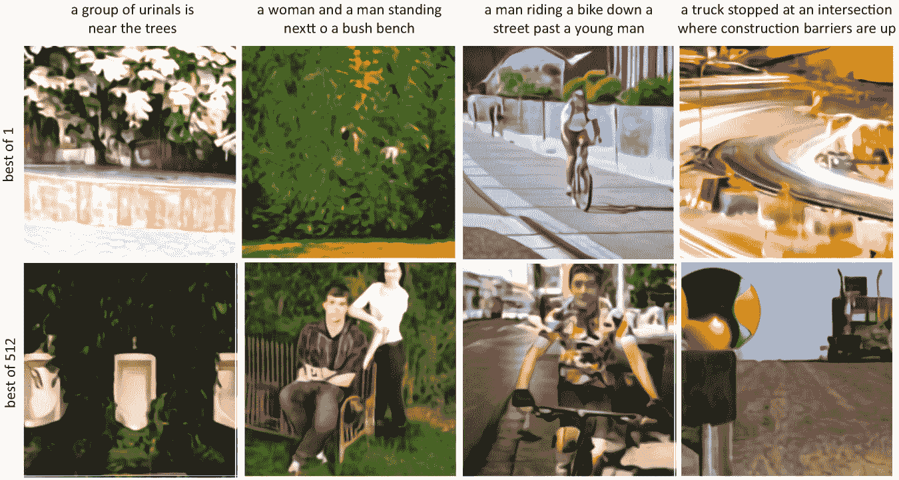

2 组 4 个面板的图片展示了 1 和 512 中的最佳图片。照片展示了一组树木附近的洗手间，一位女士和一位男士站在灌木丛的长椅旁，一位男士骑着自行车穿过街道，旁边是一位年轻人，还有一辆停在路口的卡车，那里设置了施工障碍物。

图 7.12

根据自然语言描述（顶部），DALL-E [133] 生成了一系列图像。中间行显示了与描述对应的 DALL-E 生成的图像。底部行显示了从自动选择的 512 个样本中选出的最佳图像。图像经作者许可重印 [133，第 6 页]

**GauGAN2** [122, 149] 将分割映射、修复和文本到图像生成结合在一个单一模型中。它是首批能够为室内、室外、风景和街景等多样化场景生成逼真输出的语义图像合成模型之一。最新版本还可以根据文本输入生成图像。GauGAN2 背后的模型是在 1000 万张高质量风景图像上训练的。该模型的详细信息尚不清楚。

**XMC-GAN** [192] 是一个基于 GAN 的文本到图像生成模型，包含用于合成图像的生成器以及训练用于区分真实和生成图像的判别器。它最大化对应对之间的互信息：(1) 描述场景的句子与（真实或生成的）图像；(2) 具有相同描述的生成图像和真实图像；(3) 图像（真实或生成的）区域及其相关的单词或短语。目标是使匹配对（文本到图像和真实图像到生成图像）具有高相似度得分，而使不匹配对具有低得分。

对于输入文本，模型从预训练的 BERT 模块计算全局句子嵌入 *emb*[*s*] 和单词嵌入 *emb*[*w*]。*emb*[*s*] 和来自标准高斯分布的随机噪声 *z* 连接形成 *全局条件*，该条件通过几个上采样块生成一个 16×16 特征图。全局条件还用作计算条件批量归一化层中的尺度参数和偏移参数的条件。单词嵌入 *emb*[*w*] 输入到“注意力自调制层”以生成精细的图像区域。在 MS-COCO 上，XMC-GAN 将 Sota FID-score（第 7.2.6 节）从 24.7 提高到 9.3，并且显著优于人类评估者。同样，人类评分者 77% 的时间更喜欢 XMC-GAN 生成的图像质量，74% 的人更喜欢其图像与文本的对齐，与三种其他 Sota 方法（CP-GAN、SD-GAN 和 OP-GAN）相比。

**Cogview** [40] 采用了一种 *向量量化变分自编码器* (*VQ-VAE*)。在第一阶段，使用一个离散自编码器将图像转换为一个离散的标记序列。在第二阶段，一个 GPT 模型学习根据 SentencePiece 文本标记的提示生成图像标记。为了生成图像标记，编码器将图像 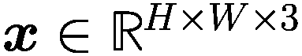 映射到 *h*×*w* 图像块，这些块被量化到一个可学习的嵌入集 {***u***[1], …, ***u***[*k*]} 中的附近嵌入，该嵌入集包含嵌入向量 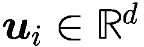 [113]。解码器将嵌入映射回图像，并选择嵌入以最小化输出图像与输入图像之间的差异。

CogView 的 GPT 模型有 48 层，隐藏大小为 2560，40 个注意力头和 4B 个参数。模型的输入形式为 *“[ROI1]* < *text tokens*>  *[BASE] [BOI1]* < *image tokens*>  *[EOI1]”*，并包含特殊标记。预训练任务是预测 30M 英文和中文文本-图像对的标记，从左到右。使用与 BigBird (Sect. 3.​2.​1) 类似的稀疏注意力模式。

如图 7.13 所示，CogView 在图像生成方面的性能与 DALL-E 类似。它在模糊的 MS COCO 数据集上实现了 Sota FID，超过了之前的基于 GAN 的模型和 DALL-E，尽管 DALL-E 的参数多出三倍。当由人类评估时，CogView 能够以很大的优势击败基于 GAN 的模型。然而，由于每个图像都是逐个标记生成的，因此使用 CogView 生成图像相当缓慢。此外，量化导致图像中存在一些模糊。

4 张照片。1 张美丽的年轻金发女郎在打电话。2，大本钟矗立在伦敦市上空。3，中国传统的自由女神像绘画。4，一头狮子的油画。

图 7.13

由 CogView [40] 生成的图像受文本输入控制（顶部）。图像风格可以受到输入文本的影响。从 60 张图像样本中选出的最佳图像。图像经作者许可重新印刷 [40, p. 1]

**LAFITE** [200] 是一种从文本生成图像的模型。图像生成基于 *StyleGAN2* [82]，通过调节卷积核的权重来创建各种图像属性 [177]。LAFITE 根据语言输入生成这些调节信号。它依赖于预训练的 CLIP 模型的多模态语义空间（第 7.2.4 节），从文本 ***x*** 生成图像嵌入 *emb*(***x***)，因此不需要额外的文本数据。这个图像嵌入通过 GAN 架构类似于 StyleGAN2 插入到图像生成模型中。在 MS-COCO 基准测试中，LAFITE 实现了零样本 FID 值 26.9，优于 DALL-E (27.5) 和 CogView (27.1)。当在 MS-COCO 上微调时，LAFITE 的 FID 分数为 8.1，优于 XMC-GAN (9.3) 和其他 GAN 模型。请注意，LAFITE 只有 75M 个可训练参数。

### 7.2.7 扩散模型恢复由噪声破坏的图像

**GLIDE** [109] 是一种基于 *扩散模型* 的图像生成技术。扩散模型描述了通过迭代的前向 *扩散过程* 系统性地和缓慢地破坏数据分布中的结构的过程，例如添加噪声 [157]。对于数据 ***x***^([0])，例如像素值的矩阵，我们可以应用高斯扩散分布 *q*(***x***^([*t*])|***x***^([*t*−1]))，其中添加了一个期望为 ***0*** 和协方差 *β****I*** 的高斯。这产生了一系列 ***x***^([0])，…，***x***^([*T*])，其中最终的分布 ***x***^([*T*]) 大约是一个具有单位协方差的高斯分布（对于二项分布也得到类似的结果）。

现在可以定义扩散过程的逆过程，即生成分布 ***x***^([*t*−1]) ∼ *p*(***x***^([*t*−1])|***x***^([*t*])). 费勒 [47] 已经证明，对于小的步长 *β*，条件分布 *p*(***x***^([*t*−1])|***x***^([*t*])) 将近似为高斯分布。因此，链 ***x***^([*T*])，…，***x***^([0]) 可以通过高斯分布生成！[$$\displaystyle \begin{aligned} {\boldsymbol{x}}^{[t-1]}\sim N(\boldsymbol{\mu}_{\boldsymbol{w}}({\boldsymbol{x}}^{[t]});\boldsymbol{S}_{\boldsymbol{w}}({\boldsymbol{x}}^{[t]})) \quad \text{and} \quad  {\boldsymbol{x}}^{[T]}\sim N(\boldsymbol{0};\boldsymbol{I})) {}. \end{aligned} $$](../images/528393_1_En_7_Chapter/528393_1_En_7_Chapter_TeX_Equ3.png)(7.3)

这个高斯分布完全由 ***x***^([*t*]) 的均值和协方差定义。

对于训练，通过 *q*(***x***^([*t*])|***x***^([*t*−1])) 从观察到的 ***x***^([0]) 生成带噪声的样本 ***x***^([*t*])。从这些样本中，可以通过优化负对数似然率的 *变分下界* [65] 来重建逆 *p*(***x***^([*t*−1])|***x***^([*t*]))。使用训练好的模型，可以从一个样本 ***x***^([*T*]) ∼ *N*(***0***, ***I***) 开始，并在一系列步骤 ***x***^([*T*−1]), …, ***x***^([0]) 中逐步减少噪声，其中![$$\displaystyle \begin{aligned} {\boldsymbol{x}}^{[t-1]}\sim p({\boldsymbol{x}}^{[t-1]}|{\boldsymbol{x}}^{[t]}) \approx N(\boldsymbol{\mu}_{\boldsymbol{w}}({\boldsymbol{x}}^{[t]});\boldsymbol{S}_{\boldsymbol{w}}({\boldsymbol{x}}^{[t]})) . \end{aligned} $$](../images/528393_1_En_7_Chapter/528393_1_En_7_Chapter_TeX_Equ4.png)(7.4)

*p*(***x***^([*t*−1])|***x***^([*t*])) 的分布可以基于图像类别进行估计 [37]。除了有限数量的图像类别外，甚至可以使用标题文本作为条件。首先将文本编码成 *k* 个令牌的序列，然后输入到 Transformer 模型中。Transformer 输出一个类别嵌入以及 *k* 个令牌嵌入，这些嵌入被用作额外的模型输入。这里估计了一个用于重建的正常噪声项 *𝜖****w***|∅)，以及一个基于标题 *c* 的噪声项 *𝜖****w***|*c*)。在 *无分类器重建* 过程中，这两个项被混合。

扩散模型由一个具有 2.3B 个参数的 *U-Net* 模型 [144] 近似，它将 64 像素图像下采样到较小分辨率，具有许多特征，然后进行上采样。还使用了一个额外的 1.5B 参数模型用于上采样到 256×256 分辨率。标题文本由一个具有 1.2B 参数的变压器模型处理，最终令牌嵌入用于替代类别嵌入。

在测试中，GLIDE 生成了具有逼真反射、纹理和阴影的高质量图像。该模型还可以结合多个概念（例如，龙、迷幻和仓鼠）并将属性如颜色附加到这些概念上。在 MS-COCO 基准测试中，256×256 图像的 DALL-E 实现了 28 的 FID 值，而 LAFITE 得到 26.9，GLIDE 得到 12.2。在人类评估中，GLIDE 的结果也明显更受欢迎。这很引人注目，因为 GLIDE 的参数远少于 DALL-E。图 7.14 展示了一些由 GLIDE 生成的图像。GLIDE 还可以根据文本提示恢复掩码图像块，例如 *“用黑白条纹系上”*。在大多数情况下，GLIDE 的结果比竞争对手模型更好，并且相应的图像块以逼真的光照、阴影和纹理恢复。最后，GLIDE 可以向图像添加阴影和反射，并将简单的线条草图转换为逼真的图像。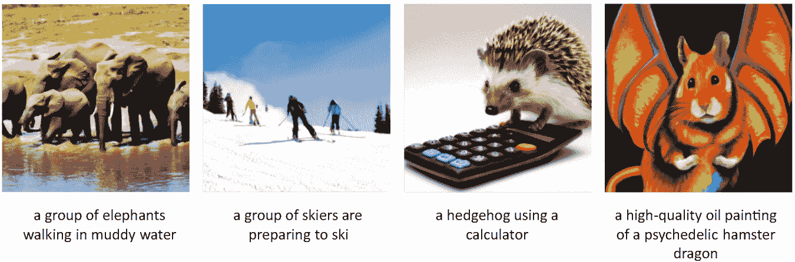

4 张照片。1，一群大象在泥水中行走。2，一群滑雪者准备滑雪。3，一只刺猬在使用计算器。4，一幅高质量的迷幻仓鼠龙油画。

图 7.14

根据下行的标题生成的 GLIDE [109] 图像。展示了 60 个样本中的最佳图像。图片经作者许可重新印刷 [109，第 7 页]

**DALL-E 2** [132] 是 DALL-E 的改进版本，可以从自然语言的描述句子中创建更逼真的艺术和图像。它分为两个步骤（图 7.15）：首先根据文本描述 *y* 生成一个基于 CLIP（第 7.2.4 节）图像嵌入 *z*[*i*] 的先验 *p*(*z*[*i*]|*y*)。然后，基于图像嵌入 *z*[*i*] 的扩散解码器生成图像 *x*。解码器 *p*(*x*|*z*[*i*], *y*) 反转 CLIP 图像编码器，是非确定性的，并且可以产生与给定图像嵌入相对应的多个图像。在训练先验和解码器期间，CLIP 模型被冻结。通过主成分分析将图像嵌入 *z*[*i*] 的维度从 1024 减少到 319，同时保留几乎所有信息。每个 319 维度被量化为 1024 个离散桶。对于编码器，对先验进行了自回归和扩散模型的实验。结果表明，扩散模型在计算上更高效，并产生更高质量的样本。示例如图 7.16 所示。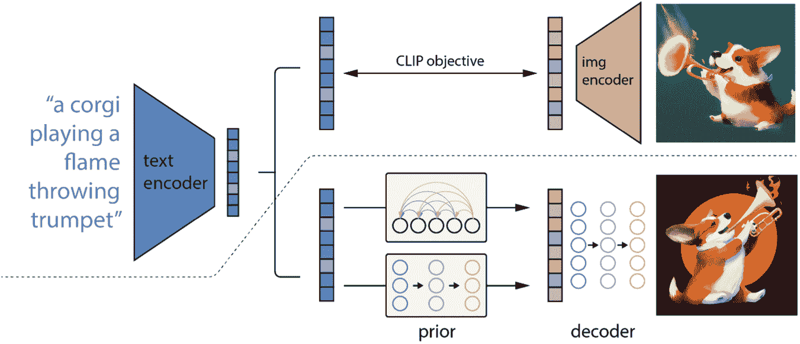

一个框图展示了柯基吹火焰喷射号角的场景，以及文本编码器、C L I P 目标、先验、图像编码器、解码器。编码器和解码器展示了一只狗嘴里拿着喇叭的照片，方向相反。

图 7.15

DALL-E 2 [132] 的高级概述。虚线以上展示了 CLIP 训练过程，最小化图像嵌入与对应文本之间的差异。虚线以下，展示了文本到图像的生成过程：首先将 CLIP 文本嵌入输入到一个自回归变压器（上方框）或扩散先验（下方框）以生成图像嵌入。这个嵌入被用作扩散解码器的输入，生成最终图像。图片经作者许可重新印刷 [132，第 3 页]

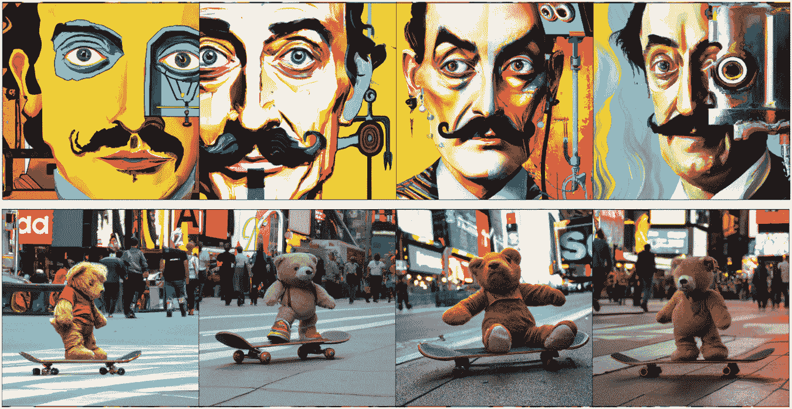

2 行 4 张照片的 2 个面板。第一行展示了名叫萨尔瓦多·达利的一个人在脸部不同部位画有机器人草图。第二行展示了一只熊在滑板上的不同位置。

图 7.16

从 DALL-E 2 中随机抽取的样本 [132]，用于提示 *“萨尔瓦多·达利的充满活力的肖像画，一半是机器人脸”*（上排），以及 *“时代广场上的滑板熊”*。图片经作者同意重新印刷 [132，第 25、27 页]

解码器基于图像表示进行条件化，可以生成保留图像语义和风格的图像变体，同时改变图像嵌入中缺失的非必要细节。CLIP 的共享嵌入空间允许以零样本方式通过语言引导图像操作和修改。例如，两个图像 *x*[1] 和 *x*[2] 可以混合，在 CLIP 的嵌入空间中插值它们之间出现的所有概念。对于 MSCOCO，结果发现 DALL-E 2 的零样本 FID 为 10.4，优于 GLIDE（12.2）。人类比较显示，DALL-E 2 和 GLIDE 在照片真实性和标题相似性方面相似，而 DALL-E 2 生成的图像具有更大的多样性。当需要将两个单独的物体（立方体）连接到两个单独的属性（颜色）时，DALL-E 2 比 GLIDE 遇到的挑战更多。现在，DALL-E 2 的公开访问已对用户开放，以便他们创建图像 [115]。

**Imagen** [148] 是由 Google 提出的一种文本到图像模型。它通过一个预训练的具有 4.6B 个冻结参数的 T5-XXL 编码器-解码器 Transformer 将输入文本编码为文本嵌入。条件文本到图像扩散模型 (7.3) 将文本嵌入映射到一个 64×64 的图像。随后，这些小图像通过两个超分辨率扩散模型（具有 600M 和 400M 个参数）在两步中上采样到 256×256 和 1024×1024（图 7.17）。这些模型在 860M 个图像-文本对上进行了训练。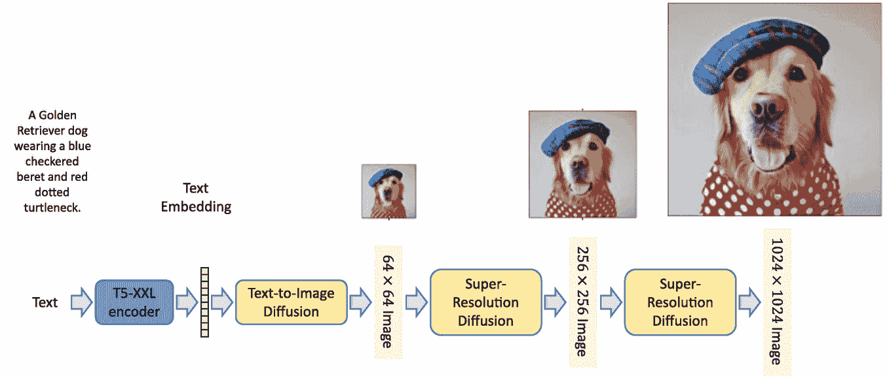

块图从一只穿着蓝色格子贝雷帽和红色圆点高领毛衣的金毛犬的文本开始。文本被输入到 T 5 X X L 编码器，然后是文本到图像的扩散，经过 2 步超分辨率扩散以生成 256×256 的图像和最终的 1024×1024 分辨率。

图 7.17

Imagen 通过预训练的 T5-XXL 文本编码器对输入文本进行编码。通过扩散模型 [148] 将得到的文本嵌入转换为 64×64 的图像。此图像通过两个超分辨率扩散模型上采样到 1024×1024 分辨率。图像经作者许可重新印刷 [148, p. 19]。Nichol 等人 [110] 提出了一些对去噪扩散概率模型的修改，这些模型可以以更快的速度采样并实现更好的对数似然，同时对样本质量的影响很小。它们提供的样本质量与 GANs 相同，但通过召回率测量的模式覆盖范围要好得多。该模型也被 Imagen 用于文本到图像的转换，使用池化嵌入向量作为输入。这个网络用于上采样，并扩展以提高内存效率、推理时间和收敛速度。图 7.18 显示了由 Imagen 为标题输入随机选择的图像。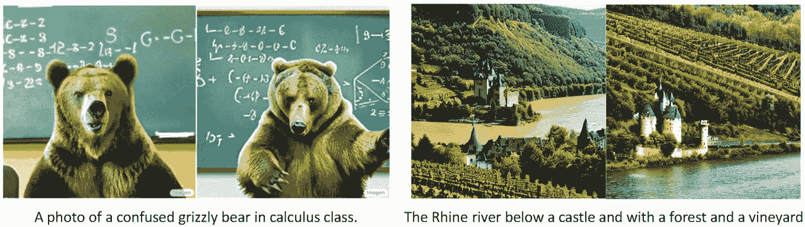

两对相似的照片。第一对，一只困惑的灰熊在微积分课堂上。第二对，城堡下的莱茵河，以及森林和葡萄园。

图 7.18

由 Imagen [148, p.6] (左) 和 Stable Diffusion [142] (右) 生成的图像，基于两个不同的文本标题。图像经作者许可重新印刷 [148, p. 6] 和 [158]，具体见表 [A.​3](https://doi.org/10.1007/978-3-031-23190-2_BM1#Tab4)。

Imagen 在 *COCO* 数据集上实现了 Sota 零样本 FID (Fréchet Inception Distance) 的值 7.3，这比 DALL-E 2 的 FID 更好，甚至比在 COCO 上训练的其他模型更好（见表 7.2）。人类评分员评估了 Imagen 在逼真度和与文本标题的一致性方面的表现。在逼真度方面，39.5% 的情况下人们更喜欢 Imagen 的图像而不是原始图像，这表明相对较高的逼真度。在标题相似度方面，Imagen 的得分与原始参考图像相当。在 *DrawBench* [147] 上，超过 60% 的情况下，由 Imagen 生成的图像比由 DALL-E 2、GLIDE、VQGAN+CLIP 或 Latent Diffusion 创建的图像更受欢迎。作者强调，未来他们将会增加语言模型的大小，因为这比增加扩散模型的大小能带来更大的收益。他们没有发布 Imagen 的代码或提供演示 API，因为这可能会被滥用，例如创建假图像。Gafni 等人 [48] 展示了如何将系统扩展以支持艺术家在图像创作过程中的需求。

**稳定扩散**是另一个具有目前 5.7B 参数的模型，用于使用扩散生成高达 1024×1024 像素的图像。一个示例如图 7.18 所示。它的工作原理与 DALLE-2 类似，使用去噪 U-Net 进行图像压缩和扩展[142]。对于训练，稳定扩散使用了来自免费可用的 LAION-5B 数据库的图像数据集[12]，包含约 58.5 亿个 CLIP 过滤的图像-文本对，是其前辈 LAION-400M 的十四倍。一个基于 ImageNet 类别的模型在图像生成上达到了 3.6 的 FID。该模型的变体使用 CLIP 模型通过每个训练实例的邻域返回具有相似视觉特征的图像进行图像搜索[15]。在图像生成过程中，模型包括检索到的图像。它可以应用于无条件图像合成、修复和随机超分辨率，并在显著降低计算成本的同时实现具有竞争力的性能。现在可以获取模型推理代码和模型权重，以运行检索增强的扩散模型[141]，并可下载。该模型被用户广泛使用，每天创建 170 万张图像。

### 7.2.8 多用途模型

**OFA**（一应俱全）[170]为一系列多模态任务提供了一个统一的模型。它可以处理文本和图像，形式为文本和视觉标记。OFA 具有编码器-解码器 transformer 架构（第 2.3.1 节），并在各种文本和图像数据集上进行预训练。与 T5 模型（第 3.1.3 节）类似，它接收一个文本指令以及一个图像，并生成适当的输出。

不同的模态在同一空间中表示，文本、图像和对象被离散化为统一的输出词汇表。一个 256×256 像素的图像表示为 16×16 图像块。每个 16×16 像素的图像块被“标记化”为离散的视觉标记，使得每个视觉标记与相应的块强相关[11]。此外，对象具有由标签及其边界框组成的特定表示。边界框的连续角坐标被统一离散化为整数作为位置标记（*x*[1];*y*[1];*x*[2];*y*[2]）。最后，统一词汇表用于所有语言和视觉标记，包括子词、图像代码和位置标记。

与 T5（第 3.1.3 节）类似，transformer 编码器-解码器由指令控制。它接收一个文本指令和一个输入图像，并生成相应的输出，包括文本响应和图像。图 7.19 展示了描述的多个任务示例。通常，OFA 模型在特定数据集上进行微调以解决各种任务！

三名成员踢足球的照片。一个框图解释了照片的处理步骤，包括视觉定位、基于视觉的标题、文本匹配和标题、视觉问答、目标检测、图像填充、图像生成、文本填充以及 OFA 编码器和解码器。

图 7.19

OFA [170, p. 3] 接收一条指令和一张输入图像。作为输出，它生成文本和（可选的）图像。对于每个八个指令（左侧）都展示了相应的示例输出（右侧）。图像版权信息见表[A.3](https://doi.org/10.1007/978-3-031-23190-2_BM1#Tab4)。

OFA 模型有一个 OFA[Base]变体，包含 6 个编码器和解码器层，隐藏大小为 768，以及 12 个注意力头。OFA[Large]变体有 12 个编码器和解码器层，隐藏大小为 1024，16 个注意力头和 472M 参数。

在预训练期间，模型必须解决由相应指令请求的三个任务（图 7.19）。第一个任务是图像填充，其中模型必须重建图像的中心部分。这要求模型学习图像部分之间的关系以及图像的生成。第二个任务是目标检测。该任务建立了图像部分与语言描述之间的对应关系。最后一个预训练任务是文本填充，以学习语言的结构。模型在公开可用的数据集上进行了预训练，这些数据集包含超过 50M 张图像和超过 160GB 的文本。图像被调整到 384×384 像素，固定块大小为 16×16 像素。对于每个块，通过 ResNet CNN 的前三个块计算一个特征向量。

在图 7.19 中显示的任务上对特定任务的数据集进行微调，例如用于图像标题的 MS COCO。此外，OFA 在多个 NLP 任务上进行微调，如用于自然语言理解的 GLUE 基准、用于抽象摘要的 Gigaword 基准以及用于图像分类的 ImageNet-1K 数据集。为了推理，作者应用了束搜索并开发了一种基于前缀树搜索策略。这种基于前缀树的搜索策略确保了 OFA 生成的输出被限制在适当的候选集内。

对于图像标题，模型在 MS COCO [26]上进行微调。Bleu-4 得分为 43.5，为 MS COCO 基准建立了新的 Sota。对于视觉问答，模型在 VQAv2 [56]和类似数据集上进行微调。基于前缀树的搜索策略确保了 OFA 生成的输出被限制在候选集内。它实现了 80.0%的新 Sota 准确率。

对于*视觉蕴涵任务*，模型需要确定图像是否蕴涵、矛盾或对文本中立。OFA 在*SNLI-VE* [178]上进行微调，并在测试集上达到了 90.2%的 Sota 准确率，比之前最佳模型高出 3.1%。为了理解指称表达式，模型需要定位由语言查询描述的图像区域。在这里，模型在*RefCOCO 基准* [187]和相关基准上进行微调，以 92.9%的文本准确率创造了新的 Sota，大幅超越了竞争对手。

对于图像生成，模型在 MS COCO [26]上进行微调。它达到了 10.5 的 Fréchet Inception Distance (FID)。这比 DALL-E [133]（27.5）或 GLIDE [109]（12.2）的分数要好，这些模型的参数（分别为 12B 和 3.5B）远多于 OFA 的 472M。在排行榜上，只有 LAFITE（第 7.2.6 节）的 FID 值更好，为 8.1。请注意，竞争模型从 60 到 512 个试验输出中选择结果，而 OFA 仅根据 FID 分数选择 24 张图像中的最佳图像。

对于 ImageNet 中的图像分类，OFA 没有使用额外的标记训练数据，其性能（84.9%的 top-1 准确率）与 EfficientNet-B7（84.3%）相似，而当前的最佳水平是 88.3%。令人惊讶的是，OFA 在仅语言基准测试中也取得了良好的结果，例如 GLUE 自然语言理解基准（第 4.1.1 节）和 Gigaword 摘要（第 6.4.1 节）。代码、演示和训练模型均可下载。

一种替代的多功能模型是**NÜWA**，它在第 7.3.4 节中进行了描述。它提供了逼真的文本到图像生成、图像编辑以及通过文本控制的图像区域编辑功能。此外，NÜWA 还能进行文本到视频的创建和预测下一个视频帧。

**WuDao-2.0** [140, 143, 198]是一个拥有 1075B 参数的巨大专家混合模型，并在第 3.5.2 节中进行了介绍。它基于 GLM 2.0 架构（第 3.1.3 节），结合了 BERT、GPT 和编码器-解码器 Transformer 的不同学习范式。对于图像建模，它使用 CogView 方法（第 7.2.6 节）。然而，实现细节不可用。训练数据包括 2.5TB 的图像数据和 2.5TB 的中英文文本数据（例如来自*Pile*语料库 [49]）。WuDao-2.0 可以应用于广泛的文本分析和生成任务，并在五个图像基准测试中达到了或超过了 Sota 水平，例如在图像数据中分类土地利用、图像生成和图形检索。

#### 可用实现

+   视觉 Transformer 代码、训练模型和笔记本[github.com/google-research/vision_transformer](https://github.com/google-research/vision_transformer)

+   OSCAR 代码和预训练模型[github.com/microsoft/Oscar](https://github.com/microsoft/Oscar)

+   VinVL 代码和预训练 Oscar-VinVL 模型[github.com/pzzhang/VinVL](https://github.com/pzzhang/VinVL).

+   DALL-E 代码和笔记本[github.com/openai/DALL-E](https://github.com/openai/DALL-E)

+   OFA 模型代码、预训练模型和在线演示[github.com/OFA-Sys/OFA](https://github.com/OFA-Sys/OFA)

+   GLIDE 代码、训练模型和笔记本[github.com/openai/glide-text2im](https://github.com/openai/glide-text2im)

+   稳定扩散[`github.com/CompVis/latent-diffusion`](https://github.com/CompVis/latent-diffusion)

### 7.2.9 摘要

最近，视觉 Transformer（ViT）作为卷积神经网络（CNNs）在图像识别任务中的竞争性替代品出现。在多个基准测试中，ViT 模型在准确性方面优于 CNNs，并且所需的计算工作量要小得多。

图像处理的基础模型接收图像块作为输入。这些图像块的嵌入通过不同的方法生成，例如通过图像像素的线性变换，通过 CNN 模型的前几层，通过变分自编码器（VAE），或者通过生成对抗网络（GANs）。扩散模型采取了完全不同的方法，通过添加噪声（GLIDE）来逆转图像退化的过程。已经证明，将图像块的表示离散化以减少噪声和低级纹理依赖性是有益的。

包含文本有两种替代方案。有时文本和图像标记由不同的 Transformer 处理。随后，最小化这两种类型嵌入之间的距离（CLIP）或通过交叉注意力（VilBERT）关联生成的嵌入。否则，文本和图像标记被连接起来，形成基础模型（自编码器、自回归或编码器-解码器）的输入。似乎最近的模型（DALL-E、CogView、OFA）更喜欢单流架构。用于预训练的任务有很多种。这包括掩码语言模型（MLM），其中需要重建掩码图像和语言标记，掩码区域分类（MRC）和掩码区域重建。句子-图像对齐（SIA）分类图像-文本对是否属于一起。

标题生成的构建一个句子，用流畅和正确的语言描述图像的特征（VilBERT、OSCAR、VinVL、SimVLM），这通常是根据人类评估的准确描述。长标题的生成尚未研究，可能更适合视频标题。有研究调查视觉-语言模型中的注意力模式[19]。

与过去一年中匹配标题的图像创作相比，质量有了巨大的飞跃。使用了各种架构：生成对抗网络（GAN）、扩散模型、VAEs。这些模型通常与 PLMs 结合使用。似乎纯 transformer 模型（如 OFA）具有优势，但像 DALL-E 2.0 这样的扩散模型正在获得动力。通常，会创建一个图像样本，并通过质量分数自动选择最佳图像。模型生成的图像通常分辨率为 256×256，并且已经覆盖了许多细节。预计明年将看到具有更高分辨率的模型，例如 1024×1024。

Cao 等人[19]研究了视觉和语言模型的内部机制。他们得出结论，深层层导致更紧密的多模态融合。通常，文本模态在做出决策时比图像特征更重要，因为模型在推理期间倾向于关注文本而不是图像。结果发现，有一组注意力头专门用于跨模态交互。存在一些注意力模式，它们将图像区域和文本单词对齐。最后，语言能力没有减少，因为预训练的视觉和语言模型编码了丰富的语言知识。

最近，已经提出了多种用途的模型，这些模型被训练来解决大量不同的语言、视觉和语言-视觉任务。一个例子是 OFA，它有 472M 个参数，比 DALL-E（12B）少得多。OFA 是一个具有图像和文本标记作为输入的 transformer 编码器-解码器，由类似于 T5 的文本指令控制。它在图像标题、图像生成、视觉问答、视觉蕴涵甚至纯语言任务上都实现了 Sota。与此相对比的是拥有 1750B 参数的巨大 WuDao 2.0 模型，它基于具有专家混合架构的编码器-解码器 GLM 模型。该模型声称在多个图像和文本任务上实现了 Sota 性能，但没有任何技术细节是已知的。

未来，预计这些文本-图像模型将被扩展到其他模态，如视频、语音和 3D。此外，将使用更多数据，并且它们将通过检索技术得到增强，以包括额外的外部和最新知识。文本-图像模型是向*符号接地*迈出的重要一步，这允许将符号（单词）与其现实世界的意义联系起来。

## 7.3 视频解释和生成

随着网络成为不断增长的通信工具，仅通过文本和图像表达内容通常是不够的。视频结合了三种能吸引我们注意力的元素，这是其他任何东西都无法比拟的：图像、运动和音频。因此，视频作为沟通手段的重要性越来越突出。YouTube 每月有 20 亿活跃用户，TikTok 有超过 10 亿用户，平均每天使用时间为 52 分钟。因此，视频的自动分析、解释和生成具有极高的价值。对于视觉数据，视频提供了最全面的自我监督。它们的多种模态，如图像、语音、ASR 文本和字幕，在时间上对齐，且不需要人工标注。大量多模态视频可能使基础模型获得视觉世界的模型。

### 7.3.1 视频处理基础

视频分析和理解比图像处理更具挑战性，因为视频具有额外的时序维度，通常需要同时处理来自图像、语音或字幕的图像、语音和文本。最近，基础模型已被用于视频理解。与 CNN 和 RNN 相比，transformers 的主要优势在于能够同时捕捉全局信息并在并行中进行计算。此外，transformers 简洁且可堆叠的架构使得在大数据集上进行训练成为可能。表 7.3 列出了视频基础模型的主要变体。Table 7.3

使用 PLMs 进行视频的主要技术。括号中的数字表示参数数量

| 模型 | 方法 | 基准 |
| --- | --- | --- |
| **视频到文本** |
| VideoBERT | 将视频分成 30 个片段，通过 CNN 生成嵌入。通过*k*-means 聚类嵌入。ASR 语音生成文本标记。将输入连接到 BERT | YouCook II 视频字幕 4.3 Bleu-4 |
| COOT | 图像、视频和文本在 3 个不同的层次级别上处理。每个级别都有单独的 transformers。在每个级别上特别关注合作（10.6M） | YouCook II 视频字幕 11.3 Bleu-4 |
| DeCEMBERT | 视频的 2D 和 3D 特征、区域字幕、ASR 文本。输入线性转换后输入到单个 BERT | YouCook II 视频字幕 11.9 Bleu-4 |
| VATT | 生成图像-时间补丁，为视频、音频和文本分别使用 BERT 模型。通过对比估计来减少嵌入距离 | Kinetics-400 动作识别 81.1% |
| Omnivore | 将图像、视频和 3D 视图转换为带有偏移窗口的 Swin transformer 输入 | Kinetics-400 动作识别 84.1%（无额外数据） |
| MeMViT | 使用过去视频帧的记忆进行注意力计算。记忆未进行训练。使用带有池化的记忆压缩模块 | 在 EPIC-KITCHENS-100 上的动作识别准确率 48.4% |
| CoVeR | 分别进行图像和时间聚合。并行微调图像和视频识别 | Kinetics-400 动作识别 87.2% |
| MTV | 通过多个视图进行时间聚合。每个视图使用不同的视觉 Transformer（1B） | Kinetics-400 动作识别 89.1% |
| 梅洛特 | 视频和 ASR 文本的联合处理。对文本和视频使用 MLM。重新排列打乱的视频帧 | 视觉问答 43.1% |
| 鹤 | 通过视觉 Transformer（80B）处理图像和视频。通过适配器和交叉注意力层将图像信息纳入语言模型（Chinchilla）。允许少量提示 | 在所有 8 个图像基准和所有 8 个视频基准上均达到 Sota |
| **文本到视频** |
| 视频 Transformer | 将视频分割为不同层中具有不同维度的 3D 块（373M） | 在 BAIR 机器人数据上的 AR 视频生成 FVD 分数为 94 |
| NÜWA | 图像、视频和文本数据表示为 3D 标记。通过 VQ-GAN 进行离散化。使用局部注意力计算。用于文本到图像、视频预测和文本到视频。更多应用 | 在 BAIR 机器人数据上的 AR 视频生成 FVD 分数为 86.9（Sota），在 Kinetics 上的文本到视频 FID-img 为 28.5 |
| Imagen 视频 | 基础视频生成模型 + 几个空间和时间视频超分辨率扩散模型 | 5.6B 参数模型的 FVD 分数约为 9.0 |

早期图像处理模型，例如 CNN 和 GAN，是逐像素分析图像。然而，由于视频的高计算和内存需求，这不再可能，必须对图像信息进行聚合。因此，开发了特殊的时空聚合模块来适应 Transformer 有限的序列长度。

+   一个简单的解决方案是聚合 30 个视频帧（VideoBERT）。

+   可以通过考虑 3D *视频补丁*来处理视频，这些补丁覆盖少量帧中的小像素区域。可以在不同的时间级别上聚合视频和文本，并计算不同级别之间的关联（COOT，MTV）。区域和时间聚合可以分开（CoVeR）。

+   此外，视频补丁还可以被处理以提取显著信息。一个例子是通过变分自动编码器（VQ-VAE）的视频量化，这已经被用于图像处理，例如 DALL-E 或 CogView（第 7.2.6 节）。图像补丁可以在时间上扩展以获得 3D 体素（VATT，Omnivore）。

+   视频可以被分割成短时间剪辑。先前的剪辑可以进入自注意力计算，但不需要更新先前的嵌入（MeMViT）。

为了进一步减少计算工作量，可以使用稀疏自注意力，其中注意力主要计算到附近的视频像素。

无监督训练可以类似于 BERT 进行。例如，可以根据邻近的视频和文本标记预测掩码视频标记[145]。同样，可以从邻近的文本和视频标记预测掩码文本标记。对比学习可以用来区分真实的文本-视频对和随机对。其他任务包括分类视频和某些文本是否属于一起，预测下一帧，或重建打乱的视频或文本标记的顺序。最近关于视频理解的调查由 Islam 等人[73]、Khurana 等人[85]和 Ruan 等人[145]提供。

视频的训练数据来源有很多。*Kinetics* [83]是一个包含 306k 个大规模、高质量数据集的集合，这些数据集由 10 秒的视频剪辑组成，专注于人类行为。Kinetics 400、600 和 700 的变体分别用 400、600 和 700 个类别进行标注。标注视频的示例帧如图 7.21 所示。*Moments in Time* [107]是一个包含 800k 个标记的 3 秒视频集合，涉及捕捉动态场景精髓的人物、动物、物体或自然现象。*Epic-Kitchens-100* [33]由 90k 个自拍摄像头视频组成，总时长 100 小时，在厨房中录制。每个视频都标记了一个“名词”和一个“动词”。通常报告三个准确度分数（“名词”、“动词”和“动作”）。动作分数评估正确的名词-动词对，是最重要的。*Something-Something V2* [55]由超过 220k 个短视频剪辑组成，展示了人类与日常物体的互动。不同类别的视频中出现了相似的对象和背景。这些数据挑战了一个模型从运动线索中区分类别的能力，与其他数据集不同。

### 7.3.2 视频字幕

*视频字幕*旨在自动生成视频的自然语言描述。视频字幕比图像字幕要困难得多，因为视频中的时空信息以及相应的语音识别文本引入了额外的复杂性。另一方面，像 YouTube 这样的大型视频集合在互联网上可用，可以用作训练材料。Perez-Martin 等人提供了一项最近的调查[124]。

**VideoBERT** [160] 将 BERT 模型应用于视频-文本对。视频被分割成 30 帧（1.5 秒）的片段，并通过 S3D CNN 进行时间卷积[180]处理，生成大小为 1024 的片段嵌入向量。片段嵌入通过*k*-means 聚类分成 20736 个簇，并量化为视频标记。语音通过 ASR 处理，并分割成句子。文本通过 WordPiece 进行标记化，词汇量为 30k 个标记。与句子时间周期对应的视频标记被收集到一个视频标记序列中。如图 7.20 所示，视频标记被附加到相应的文本标记上，并用特殊标记分隔。请注意，也可以进行仅文本和仅视频的训练！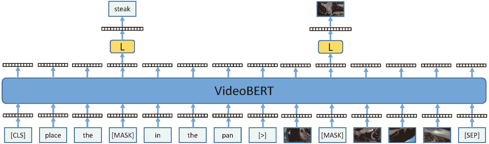

一个图表说明了序列中 CLS 标记和 MASK 标记的位置，随后是输入图像、掩码图像、3 个带有随机标记的掩码图像和 SEP 标记。视频通过在不同帧中展示适当的图像和文本来为 BERT 提供视频特征，以便更清晰地理解该概念。

图 7.20

由 ASR 生成的文本和相应的视频标记是 VideoBERT [160]的输入。两种模态都由特殊标记限定。必须预测掩码标记。图像归功于表[A.3](https://doi.org/10.1007/978-3-031-23190-2_BM1#Tab4)

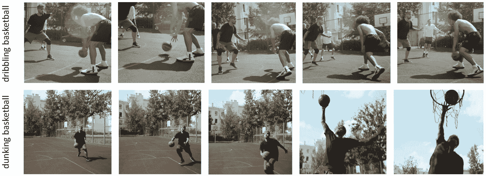

一系列 5 张照片，第一行和第二行展示了不同的帧位置。第 1 行代表运球篮球。第 2 行代表扣篮篮球。

图 7.21

两个带有描述的（左侧）视频与 Kinetics 数据集的视频（83）相似。展示了视频的代表帧。显然，有时单个帧不足以做出判断，例如区分“运球篮球”和“扣篮篮球”。图像归功于表[A.3](https://doi.org/10.1007/978-3-031-23190-2_BM1#Tab4)

BERT[LARGE]模型在包含 312k 个烹饪视频的数据集上进行了预训练，总时长为 966 天。文本通过 ASR 获得。训练任务包括掩码标记和帧预测，以及检测与视频匹配的文本。VideoBERT 在 YouCook II 数据集的视频标题生成任务上取得了 Sota，Bleu-4 得分为 4.3。

**COOT** [51] 通过嵌入向量以通用表示方式联合处理图像、视频和文本信息。在视频表示中，时间被添加为图像二维描述的第三个维度。COOT 模型在 3 个不同层次的数据上进行考虑：帧/词、片段/句子和视频/段落。对于每个层次，都存在一对处理输入的转换器。为了建模同层次的合作，COOT 使用一个特征聚合层来关注低级实体之间的时序交互。为了将信息聚合到句子层面，模型使用一个特殊的注意力公式，其中所有相应的嵌入都进入标量积。一个额外的损失项旨在减少句子和片段编码之间的差异。在最高层，一个上下文转换器将文本和视频嵌入连接起来。

该模型使用具有场景和较长片段字幕的视频进行训练。随后，该模型可以为新的视频创建字幕。对于 YouCook2 视频字幕基准数据集，该模型可以将 Sota 提升到 11.3 Bleu-4。此外，该模型还可以用于其他任务，例如在输入文本描述或视频场景时进行搜索。由于该模型仅包含 1060 万个参数，预计通过增加模型的大小可以显著提高性能。

**DeCEMBERT** [164] 旨在通过语音识别提取的 ASR 文本之外，通过*区域字幕*来增强视频。输入文本由 BPE 标记表示。每个视频秒由预训练的 Resnet-152 CNN [63] 提取的 2D 特征以及由 3D ResNeXT CNN [179] 提取的运动特征来表征，这些特征共同映射到嵌入向量。视频嵌入和语音识别文本表示被连接起来，形成一个单一序列，作为 12 层自动编码器的预训练和下游任务微调的输入。为了使视频与 ASR 字幕对齐，使用了一个约束注意力损失，鼓励模型从候选集中选择最佳匹配的 ASR 字幕。在 1.2M 个 YouTube 教学视频上的预训练过程中，通过掩码标记和分类（如果文本对应视频）学习文本和视频之间的关联。在 YouCook2 字幕任务中，该模型将 Sota 提升到 11.9 Bleu-4 分数。此外，DeCEMBERT 在视频检索和视频问答方面也取得了良好的结果。

### 7.3.3 视频中的动作识别

**VATT** [2] 使用互联网视频的原始 RGB 帧、音频波形和语音音频的 ASR 文本作为输入数据。大小为 *T*×*W*×*H* 的视频，其中 *T* 帧被划分为 ⌈*T*∕*t*⌉∗⌈*H*∕*h*⌉∗⌈*W*∕*w*⌉ 个补丁，其中每个补丁是 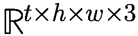 中的一个 *voxel*，并额外包含一个颜色维度。这是 ViT 图像补丁的扩展。位置编码是 ***e***[*i*,*j*,*k*] = ***e***[temp;*i*] + ***e***[horiz;*j*] + ***e***[vert;*k*]，其中每个加数都是一个长度为 *d* 的可学习向量。原始音频波形被划分为 *t*^(*′*) 段，每段都获得一个可学习的位置嵌入。对于文本，创建了一个词汇表，并将每个词映射到一个可学习嵌入。*DropToken* 程序随机移除视频或音频标记的一部分，以减少计算成本并提高正则化。

VATT 线性地将每个模态投影到长度为 *d* 的特征向量，并将其输入到单独的 BERT 编码器。该模型使用噪声对比估计来减少音频和视频嵌入投影之间的距离。正对是从视频中相同位置取出的，负对是从不同位置取出的。采用类似的准则来减少视频和文本嵌入的距离。训练数据包括从 *HowTo100M 数据* [105] 中提取的 32 帧/10 fps 的剪辑。最大的模型有 415M 个参数。在 Kinetics-400 的动作识别上，它实现了 Sota，top-1 准确率为 82.1%，top-5 准确率为 95.6%。

**Omnivore** [52] 是一个用于使用完全相同的模型参数对图像、视频和单视图 3D 数据进行分类的模型。单视图 3D 是一个包含额外深度通道的颜色图像。图像、视频和单视图 3D 模态被转换为嵌入，并输入到 Transformer 模型中。图像被划分为图像补丁，视频被划分为覆盖不同图像区域的空间时间管，单视图 3D 图像被转换为 RGB 补丁和深度补丁。补丁使用线性层投影到嵌入中。相同的线性层用于图像和视频 RGB 补丁。深度补丁应用单独的层。空间和时间维度使用单独的位置嵌入。

Omnivore 采用*Swin transformer*（第 7.2.3 节）作为基础模型，这是一个使用平移窗口的分层视觉 transformer。自注意力涉及来自空间和时间上邻近补丁的补丁嵌入。这些模型在 ImageNet-1K 数据集（1.2M 张图片）上进行图像分类训练，在 Kinetics-400 数据集（240k 个视频）上进行动作识别训练，以及在*SUN RGB-D 数据集*（5k）上进行单视图 3D 场景分类，使用特定于数据集的线性分类层将最终嵌入转换为分类。在 Kinetics-400 上没有额外数据的情况下，Omnivore 实现了 84.1%的动作识别准确率，这是第二好的。微调后的 Omnivore 在两个视频分类基准测试中得分最高。当使用 RGB 和 3D 通道时，Omnivore 在 NYU-v2 基准测试上再次实现了最佳性能。

**MeMViT** [173]旨在处理超过 5 秒的视频，与大多数当前模型不同。MeMViT 以在线方式处理视频，并在每个迭代中将 transformer 的关键和值向量作为记忆缓存。通过记忆，模型可以以较低的成本访问先前的上下文进行长期建模，因为记忆嵌入没有进行训练。当前视频片段的查询关注一个扩展的关键和值向量集，这些向量来自当前时间和过去。类似于 WaveNet [114]的扩张卷积，较高层关注更远的过去，从而产生一个显著更长的感受野。此外，一个具有可学习池化的记忆压缩模块对于减少内存占用有效。

视频被分割成一系列短小的 *T*×*H*×*W* 影片，并按顺序进行处理。类似于 MTV，使用了多个分辨率，从对较小补丁的精细建模到后续阶段对较大补丁的高级建模，其中嵌入的维度增加。阶段间的聚合是通过步长池化完成的。记忆表示被冻结，不会被优化所改变。该模型在 Kinetics-400 数据集上预训练（图 7.21）。在 AVA v2.2 数据集[54]上，MeMViT 实现了 35.4%的平均平均精度（mAP）。在动作预测数据集（EPIC-KITCHENS-100）上，它达到了 17.7%的召回率@5。在 EPIC-KITCHENS-100 的动作识别上，MeMViT 的准确率为 48.4%。

**CoVeR** [190] 评估了不同预训练策略对分类准确性的影响。作者使用一种特殊的 transformer 架构，该架构在同一视频帧的相关区域具有空间注意力层，在视频剪辑的相邻帧之间具有时间注意力层。CoVeR 首先在 3B 图像的*JFT-3B 基准* [189] 上预训练模型，这些图像带有大约 30k 个标签的类层次结构。在预训练期间，所有时间注意力层都被移除。在微调期间，它同时在多个动作识别和图像数据集（Kinetics 版本、ImageNet、Moment in Time、SomethingSomethingv2）上训练一个具有 24 层的单个模型，以构建视频数据的鲁棒空间和时间表示（图 7.22）。对于 Kinetics-400 动作识别任务，CoVeR 实现了 87.2%的准确率，对于 Moment in Time 动作分类，它达到了 46.1%的 Sota 准确率。![]

Times 前楼的照片已被转换成单帧视频。Bull 视频通过模型处理成 24 帧，该模型包含时间注意力层、空间注意力层、MLP 层、图像分类器和视频分类器。

图 7.22

在微调 CoVeR [190，第 5 页] 时，同时训练在多个图像和视频数据集上。由于有不同的类别定义，每个数据集都有自己的分类器。图像是单帧视频。因此，图像分类不受时间注意力的影响。图像归功于表[A.3](https://doi.org/10.1007/978-3-031-23190-2_BM1#Tab4)。

**MTV** [185] 通过输入视频的多个输入表示（视图）进行时间聚合。MTV 在多个时间段内从输入视频中提取标记。来自长时间间隔的视频标记捕获整体场景描述，而从短段中提取的视频标记捕获细粒度细节，例如一个人的手势。使用不同的 transformer 编码器来处理这些不同的视图，短段模型具有更高的容量。

通过横向连接将不同的编码器接口连接起来以融合跨视图信息。相邻视图之间计算跨视图注意力，类似于 transformer 中的多头跨注意力（Sect. 2.3.1）。请注意，这些融合操作仅针对特定层执行。所有视图的标记通过全局编码器聚合，该编码器执行最终的分类。

模型使用视觉转换器权重（第 7.2.2 节）初始化，并使用 32 帧、分辨率为 224×224 的视频进行训练。结果证明，跨视图注意力比融合来自不同视图信息的替代方案更好。此外，三个视图比更少的视图给出了更好的结果。具有超过十亿参数的最大模型在 kinetics-400 动作识别任务上达到了 Sota 准确率 89.1%。

**AV-ASR** [152] 将 PLM 应用于音频-视觉语音识别。通常，音频以 10 毫秒的步骤转换为 80 个对数梅尔滤波器组特征。视频被裁剪到接近嘴巴的区域，并转换为长度为 512 的视频嵌入。这两个嵌入被连接起来，并输入到具有 17 层的 Conformer 编码器（第 7.1.2 节）中。该模型在 LRS3-TED 基准测试 [1] 上的唇读任务上优于之前的 Sota，WER 为 19.3%。如果同时使用两种模态，WER 降至 1.6%。如果添加咿呀噪声，LRS3-TED 上仅音频 ASR 的 WER 增加到 6.1%，而同时使用两种模态的语音识别 WER 只有 2.9%。还有另一种方法通过生成与视频动作速度、情绪和节奏相匹配的视频背景音乐来关联视频和音频 [38]。

**芦荟** [39] 不仅想要简单地描述图像或视频，而是旨在解释或推理场景。该模型使用一个无监督的对象分割模块，将每张图像分割成对象表示。一个转换器接收问题和图像描述，包括对象表示。在多个 *视觉推理* 基准测试中，该模型必须回答复杂问题，例如解释性问题如 *“为什么发生了某事？”*，预测性问题如 *“接下来会发生什么？”*，以及反事实问题如 *“在未见过的情况下会发生什么，例如如果移除了某个对象？”*。该模型能够几乎在所有基准数据集上提高 Sota。

**梅洛特** [188] 是一个视觉和语言模型，它从包含数千帧及其 ASR 文本的视频中学习多模态世界表示。它使用图像编码器对每一帧进行编码，使用学习到的嵌入来嵌入标记，并使用与 RoBERTa 类似的 Transformer 共同处理这两种表示。第一个预训练任务使用对比损失来匹配语言转录嵌入和相应的视频嵌入。MLM 任务需要替换被掩码的语言标记。时间重排任务涉及重新排列打乱的视频帧。因此，梅洛特不仅学会了将图像与时间上对应的单词匹配，而且还能够对全局事件进行语境化，实现了时间常识知识。该模型在 600 万未标记的 YouTube 视频上进行了训练。梅洛特在包括短视频和长视频在内的 12 个下游基准测试中优于 Sota 方法。一个例子是在 MSRVTT-QA [182]上的视觉问答，达到了新的 Sota 水平 43.1%。一个用于复杂事件提取 [93] 的相关模型使用了类似的对比学习方法。

**火焰鸟** [3] 是一个视觉语言模型，它可以处理任意交错图像、视频和文本数据的序列。火焰鸟采用在大型和多样化的文本语料库上训练的 70B 参数预训练语言模型 *Chinchilla*（第 3.1.2 节）。语言模型的编码器块使用冻结的参数。使用这个子模型，火焰鸟具有强大的生成语言能力和访问存储在 Chinchilla 权重中的大量知识。类似于 *Frozen*（第 7.2.5 节），它可以通过少样本学习来指导回答图像上的问题 [166]。

对于图像和视频的处理，使用对比文本-图像方法进行预训练（图 7.23）。作者使用 ResNet [16] 的一个变体。视觉编码器使用对比目标在我们的图像和文本对数据集上进行预训练，使用来自 [127] 的两项对比损失。与 CLIP（第 7.2.4 节）类似，相似度是通过图像编码器的平均池化输出的点积和 BERT 模型的平均池化输出的点积来计算的。该模型从图像中提取语义空间方向特征，包括颜色、形状、性质、物体位置等。该模型单独进行预训练，并在 Flamingo 的主要训练期间冻结参数。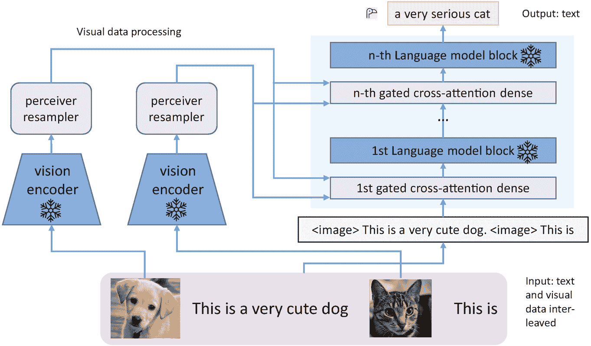

一个框图显示了输入测试和视觉数据在底部交错。图中有一只可爱的狗，接着是视觉编码器、感知器重采样器、视觉数据处理、第一个门控交叉注意力密集模型块和一只严肃的猫。输出文本由这些组件生成。

图 7.23

Flamingo [3] 接收一个包含图像、文本和视频序列的输入，这些元素以任意顺序排列（底部）。图像和视频通过类似于 CLIP 的冻结视觉编码器进行处理。可训练的感知重采样器将它们减少到有限数量的图像标记，这些标记通过可训练的交叉注意力层被包含到语言模型中。语言模型创建的输出是输入序列的自然延续。图像改编自 [3]，经作者友好许可，见表 [A.3](https://doi.org/10.1007/978-3-031-23190-2_BM1#Tab4)

训练了两个模块来接口这些冻结模型。第一个是一个 *感知重采样器*，它从视觉编码器接收时空特征，并输出一组固定大小的视觉标记（通常为 64）。这个输出是为单张图像以及视频独立于输入图像分辨率或输入视频帧数生成的。提取的视觉标记随后通过交叉注意力层被包含到语言模型中。这样，语言模型可以在每一层中包含视觉信息。冻结的语言和视觉模型有 70B 和 435M 个参数，而可训练的层有 10B 个参数，重采样器有 194M 个参数，总共有 80.6B 个参数。

对于训练，Flamingo 使用了包含 182GB 文本的多个数据集。这个集合通过进一步混合文本、图像和视频序列得到补充，总共有约 2.3B 张图像和 27M 个视频。

如图 7.24 所示，Flamingo 可以通过简单地预测混合图像-文本序列中的下一个文本标记来回答单张图像上的问题。在最简单的形式中，问题可以要求描述场景中的对象，如右上角的示例所示。更难的是对场景的解释，因为语言模型需要世界知识来决定图像的哪些方面是值得注意的。在这些例子中，Flamingo 至少可以进行一步隐式推理。一些对象在提示中没有命名（例如，大象），但它们的属性被直接查询。为了回答这些问题，模型需要推断所指的对象，然后回忆相关的知识来形成答案。这可能导致单个答案（例如卡车上的大象）或扩展对话，其中模型可以回答一系列关于图像的查询（例如，狗损坏沙发）。即使经过多次交互，Flamingo 仍然可以成功关注图像并回答需要解释图像的问题。作者观察到可以单独关注多张图像，简单比较和推理被适当处理。Flamingo 的对话能力可以使非专家最终用户在没有微调需求的情况下获得答案。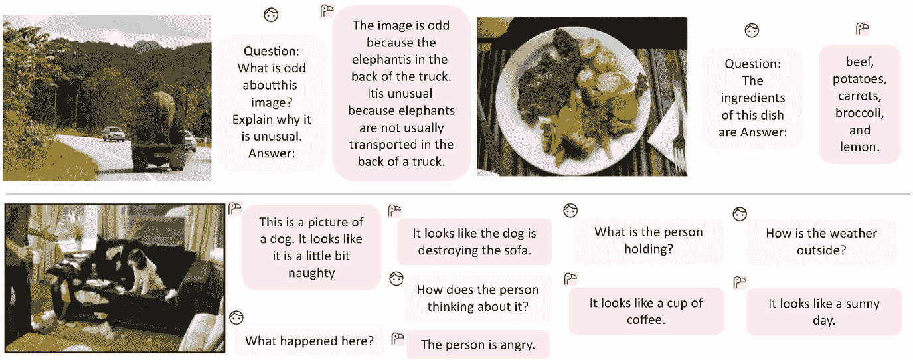

3 张照片，一头大象在卡车上旅行，一只狗损坏了一套沙发，一个人拿着咖啡杯。肉、蔬菜和美式食物放在盘子上。每个都有问题及答案，包括这个人手持的是什么，这道菜的成分，以及这张图片有什么奇怪之处。

图 7.24

火烈鸟能够通过文本解释图像并描述它们。灰色框是用户输入，粉色框是火烈鸟的输出。在上行中，火烈鸟回答有关图像的问题。在下行中，有一段关于照片的对话。图片改编自 [3，第 31 页] 和 [3，第 32 页]，经作者许可重新印刷。

同样地，火烈鸟可以回答关于视频的问题，如图 7.25 所示。然而，在这个任务中的表现并不像期望的那样稳定。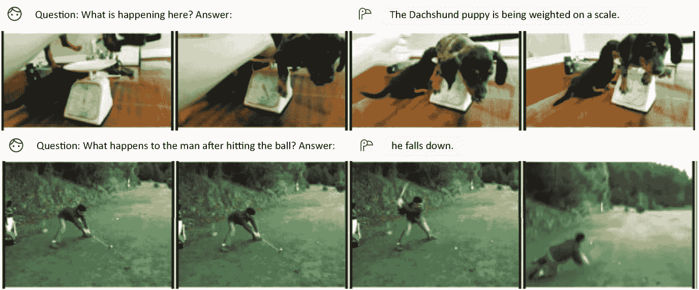

4 张照片，一台体重秤，一只狗爬在上面。问题是，这里发生了什么？答案是腊肠犬幼崽正在秤上称重。4 张照片显示一个人打高尔夫。问题是，击球后这个人发生了什么？答案是，他跌倒了。

图 7.25

火烈鸟回答视频中的问题。显示了几个视频帧。灰色框是用户输入，粉色框是火烈鸟的输出。图片改编自 [3，第 33 页]，经作者许可重新印刷。

火烈鸟能够对混合文本-视频-图像序列执行*少量样本提示*。示例如图 7.26 所示。这里提供了一些图像，并通过示例指定了提取答案所需的方式。在第一行，这相当于从图像中提取文本，而在第二行则需要计算相同类型的对象数量。这样，模型可以即时被指导执行大量任务，例如标题生成、视觉对话、分类或视觉问答。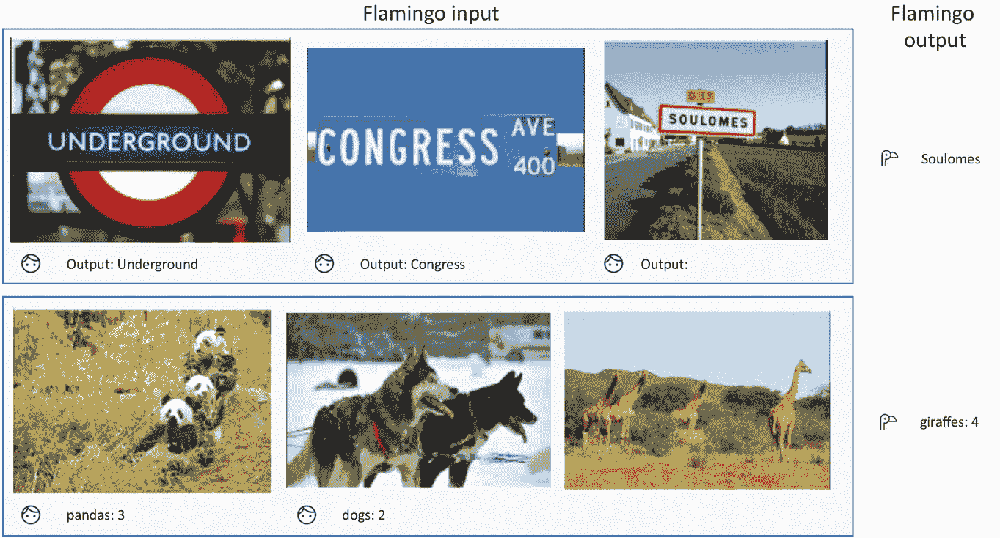

火烈鸟输出的 6 张照片结果，分别是地下、国会、索洛梅斯、熊猫 3、狗 2 和长颈鹿 4。

图 7.26

火烈鸟使用图像和文本混合进行少量样本查询 [3]。注意，在第二个示例中，火烈鸟没有计算树木，而是停留在动物上。通常的少量样本查询数量是 32。图片改编自 [3，第 2 页]，经作者许可重新印刷。

该模型在场景描述、视觉对话和视觉问答等 9 个图像-文本基准测试中进行了性能测试，其中包括 MS-COCO 标题。在 Flamingo 建立的 8 个混合媒体基准测试中，通过使用 16 或 32 个样本，以很大的优势实现了几样本 Sota。对于三个基准，得分甚至优于先前微调的 Sota。在 ImageNet top-1 分类中，Flamingo 达到了 76.0%，而微调的 Sota 为 91.0%。视频测试数组包含 9 个基准，其中八个需要自由文本答案，一个基准（Kinetics 700）需要进行分类。在所有八个自由形式基准测试中，Flamingo 可以增加几样本 Sota，通常增幅很大。在这些基准中的四个，Flamingo 甚至超过了微调的结果。这更加引人注目，因为 Flamingo 仅使用了 32 个任务特定示例，这比当前最先进的任务特定训练数据少约 1000 倍。

Flamingo 可以在特定基准上进行微调以提高性能。在微调过程中，冻结的模型部分不会改变。当在 9 个示例任务上微调时，Flamingo 可以在这些任务中的五个上提高微调的 Sota。这表明，通过微调模型的 10B 自由参数，在许多情况下可以将性能提升到新的水平。

### 7.3.4 从文本生成视频

根据文本描述创建视频是一个重要问题，例如用于教育或动态内容的说明。虽然有许多模型可以通过文本描述图像和视频，但关于相反方向的提议却不多。编码文本和视频的概念与视频标题相似。生成的视频质量可以通过比较实际生成视频的相似性来衡量。*FVD*（Fréchet 视频距离）是 Fréchet Inception 距离（FID）（第 7.2.6 节）的空间时间扩展，对视觉质量、时间一致性和样本多样性敏感。

**视频转换器** [172] 将一维转换器编码器-解码器推广到视频中。视频表示为 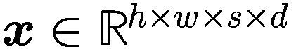，其中 *h* 和 *w* 表示空间高度和宽度中的标记数量，*s* 表示时间轴上的标记数量，而 *d* 是通道数（例如颜色）。视频在时间和空间上被划分为小的 3D 块。每个块分别应用自注意力。为了允许块之间直接的信息交换，每层之间的块大小是变化的。这些块包含 4 帧，空间分辨率为 32×32。自注意力在不同层和维度之间变化，从 1 到 32。最大的模型具有 2048 个隐藏大小、8 层和 373M 个参数。在 BAIR 机器人推动数据 [44] 上，该模型实现了 *FVD*（Fréchet 视频距离）得分为 94，这在发表时是 Sota。

**NÜWA** [175] 是一种最近推出的转换器编码器-解码器模型，它为从文本生成视频提供了解决方案。它使用所谓的 *3D 近邻注意力* 机制来捕捉空间和时间轴的局部特征。图像、视频和文本数据表示为标记 ，其中 *h* 和 *w* 表示空间高度和宽度中的标记数量，*s* 表示时间轴上的标记数量，而 *d* 是每个标记的维度。原始输入区域通过可训练的 VQ-GAN（第 7.2.3 节）转换为图像补丁的离散标记。这种基于 GAN 的量化模块比 CogView（第 7.2.6 节）使用的 VQ-VAE 提供了更好的图像质量。

该模型修改了注意力计算，并考虑了关于宽度、高度和时间范围的局部邻域，称为 3D 近邻自注意力。对于宽度、高度和时间，使用了三个不同的位置编码嵌入。每个 336×336 像素的视频帧被划分为 21×21 的补丁，每秒采样 2.5 帧的视频中的 10 帧。邻域在宽度、高度和时间上的大小为 3。该模型在三个任务上进行了预训练：从 Conceptual Captions 的 2.9M 个文本-图像对中进行文本到图像，从 Moments in Time 的 727k 个视频中预测视频，以及从 241k 个文本-视频对中进行文本到视频生成。

对于文本到图像的生成，NÜWA 在 MS COCO 数据集上进行微调。每个文本生成 60 张图像，并通过 CLIP（第 7.2.4 节）选择最佳图像。NÜWA 以 FID-0 为 12.9 的成绩优于 CogView，如图 7.27 所示，但不如 LAFITE（FID 8.1）和 OFA（FID 10.5）。对于文本到视频，NÜWA 在 Kinetics 数据集上进行微调。图 7.28 展示了两个生成示例的一些帧。NÜWA 在 FID-img 和 FID-vid 指标上取得了最佳性能，分别为 28.5 和 7.0。视频预测需要从起始帧生成视频的下一帧序列。在 BAIR Robot Pushing 数据集上，NÜWA 在此任务上实现了 86.9 的新 Sota FVD 分数。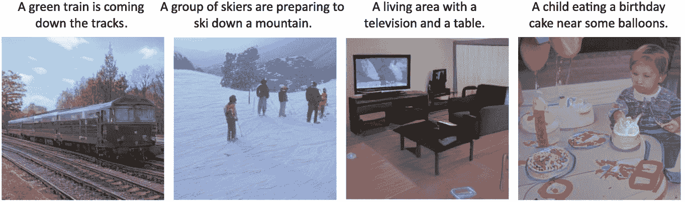

第一行的一系列照片代表英国短毛猫跳过沙发的视频剪辑。第二行的一系列 5 张照片代表咖啡正倒入杯子中。

图 7.27

NÜWA 从图像上方的文本生成的 256×256 图像 [175] 用于 MS COCO 基准测试。图像经作者许可重新印刷 [175，第 5 页]。

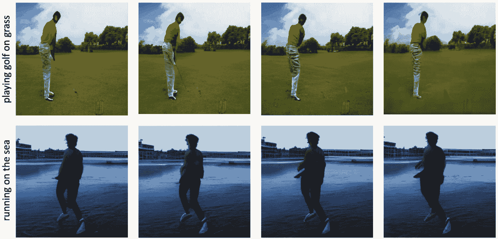

4 张照片。1，一列绿色的火车正在轨道上行驶。2，一群滑雪者正在准备下山滑雪。3，一个带有电视和桌子的生活区。4，一个孩子在一些气球附近吃生日蛋糕。

图 7.28

NÜWA 从文本（左侧）生成的两个视频的帧 [175] 用于 Kinetics 数据集上的文本到视频任务。请注意，模型从未见过像“在海边跑步”这样的输入文本。图像经作者许可重新印刷 [175，第 5 页]。

NÜWA 支持许多其他任务。对于图像编辑，它可以重建图像的部分区域。或者，它可以根据文本编辑标记的图像区域，例如 *“一匹马在草原上奔跑”*。带有文本注释的图像草图被转换为照片。这种模式也可以应用于视频，从而从一系列带有注释区域的图像生成视频。最后，它可以更改视频中的内容，例如修改图 7.29 下排所示潜水员的动作。此外，一系列带有文本注释的图像草图可以被转换为视频。更多示例在此处展示 [174]。**GODIVA** [176] 是同一作者基于 VQ-VAE 变分自编码器的一个类似先验方法。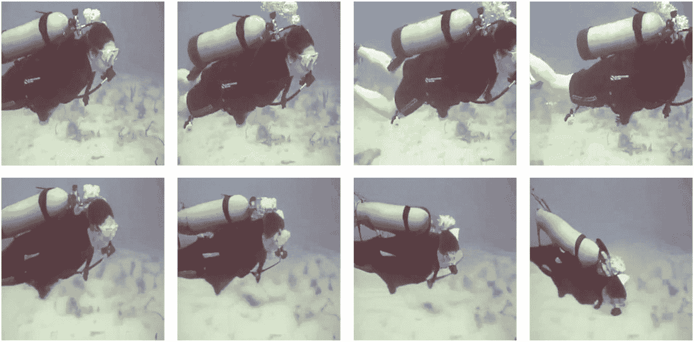

第一行的一系列 4 张照片代表一个人在草地上打高尔夫。第二行的一系列 4 张照片代表一个人在海边跑步。

图 7.29

NÜWA [175] 可以编辑视频。在上行中显示原始视频。在下行中，NÜWA 接收输入“潜水员正在向底部游去”并相应地修改视频。图片经作者同意重新印刷 [175，第 28 页] **Imagen Video** 是一个基于 Imagen（图 7.17）的最近的高清文本到视频模型。通过冻结的 T5 文本编码器-解码器和基础视频扩散模型生成低分辨率视频。然后通过一系列交替增加空间和时间分辨率的视频扩散模型进行增强 [66]，以构建每秒 24 帧、分辨率为 1280×768 的 128 个逼真视频帧。图 7.30 显示了 Imagen Video 通过文本提示生成的视频。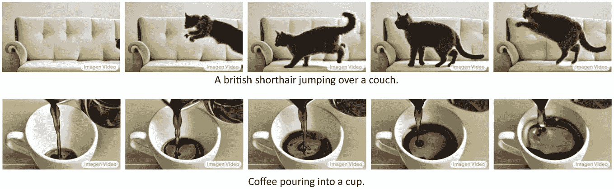

海底潜水员 10 张照片。照片从不同的角度拍摄。

图 7.30

由 Imagen video 从以下文本提示生成的视频（以下）。该模型产生多样化的、时间上连贯的视频，与给定的请求非常匹配。图片经作者同意重新印刷 [66，第 2 页]

#### 可用实现

+   VideoBERT 代码 [`github.com/ammesatyajit/VideoBERT`](https://github.com/ammesatyajit/VideoBERT)

+   COOT 代码 [`github.com/gingsi/coot-videotext`](https://github.com/gingsi/coot-videotext)

+   DeCEMBERT 代码 [`github.com/zinengtang/decembert`](https://github.com/zinengtang/decembert)

+   VATT 代码 [`github.com/google-research/google-research/tree/master/vatt`](https://github.com/google-research/google-research/tree/master/vatt)

+   Omnivore 代码 [`github.com/facebookresearch/omnivore`](https://github.com/facebookresearch/omnivore)

+   Video Transformer 代码 [`github.com/rakhimovv/lvt`](https://github.com/rakhimovv/lvt)

+   MTV 代码和模型 [`github.com/google-research/scenic`](https://github.com/google-research/scenic)

+   NÜWA 代码 [`github.com/lucidrains/nuwa-pytorch`](https://github.com/lucidrains/nuwa-pytorch)

### 7.3.5 摘要

处理视频需要整合不同模态，如图像、以视频字幕形式存在的文本，以及可能通过 ASR 转换为文本的语音。视频处理为图像处理引入了额外的时维。此外，深度信息和相机运动也可能很重要。自 2019 年以来，使用自监督预训练的大规模 Transformer 成为视频处理的流行模型。这些模型可以解决不同的任务，例如视频字幕、动作识别、视频问答、从文本生成视频、预测下一帧、视频检索、音频-视觉 ASR 等。

现有的跨模态基础模型主要关注（1）改进模型架构，（2）利用更多数据，（3）设计更好的预训练任务。由于输入长度的限制，视频必须分割成适当的标记。这从 VideoBERT 的 30 多个剪辑的聚合到固定视频补丁（VATT）再到具有不同维度的视频补丁（COOT、MTV、Video Transformer）不等。一些模型（VideoBERT、DeCEMBERT）使用 CNN 卷积来生成低级特征。更常见的是使用 VQ-VAE 自动编码器或基于 GAN 的 VQ-GAN 进行聚合。有时视频和文本分别使用 PLM 处理，然后合并（VATT）。或者，视频和文本标记被连接，并由单个 PLM（Omnivore、Merlot）处理。Transformer 在空间和时间维度上使用注意力，这通常被局部化以减少计算工作量。

不同模态的集成至关重要。文本和语言通过预训练任务相关联，其中必须使用来自另一模态的标记来预测掩码视频或文本标记。CoVeR 表明，当模型同时针对视频和图像任务进行微调时，性能可以得到提升。甚至可以将音频、文本和视频标记结合起来。

视频分析模型的性能经历了显著的发展。在 Kinetics-400 基准测试中，动作分类错误在 1 年内降至使用基础模型后的 10.9%，降幅为 33%。尽管取得了显著进展，但 Sota 方法仍无法提取/捕捉视频中存在的所有复杂时空信息。在理解视频中的视觉内容多样性和相关文本描述的结构方面，仍有大量工作要做。

从字幕生成视频还处于早期阶段，只能生成非常短的高分辨率视频。然而，与 GPT-3 或 Gopher 等基础模型相比，当前模型相对较小。因此，可以预期，具有更多参数的模型将看到相当大的性能提升，正如 Imagen Video 所展示的那样。

出现了一种趋势，即通用模型，如能够处理多种数据模态并解决多个任务的 Nüwa。使用不同媒体进行训练相互支持不同任务中的性能。拥有 80B 参数的 Flamingo 基于一个大型预训练语言模型和一个单独预训练的视觉编码器。它可以处理图像、文本和视频的混合序列。通过构建适配器模块和交叉注意力层，语言模型可以包含视觉模态的结果，并执行各种分析任务，如视觉问答、图像描述等。此外，它可以通过少量提示指令来解决许多任务，而无需特定的微调。

虽然 Flamingo 无法生成与标题对应的图像或视频，但它是在多模态基础模型方向上迈出的一步，这些模型有望成为多媒体处理的一般性工具。通过少量提示，它们可以解决成千上万的任务。在这个领域可以期待取得重大进展，因为可以结合为不同媒体独立开发的观点。进一步的发展方向包括更大的训练数据，尽管这些数据已经相当庞大。此外，多语言视频模型的发展是该领域当前研究状态的逻辑结果。

## 7.4 控制动态系统

基础模型可以处理多种类型的序列。这包括序列决策问题，其中智能体必须根据状态选择一个动作。随后，环境为智能体生成一个新的状态和一个奖励。这个过程重复多次，直到最终的总奖励已知。然后任务是选择基于状态的行动，使得总奖励最大化。这个目标可以表述为一个序列问题，并且可以使用预训练语言模型（PLM）来预测下一个最佳动作。

### 7.4.1 决策转换器

PLM 能够预测序列，例如文本或视频帧的标记。遵循这一模式，PLM 也能够模拟任意状态的演变。*强化学习*考虑一个在给定时间步长*t*的系统，其具有*状态**s*[*t*]，*动作**a*[*t*]，和*奖励**r*[*t*] = *R*(*s*[*t*]，*a*[*t*])。基于当前状态，智能体选择一个动作，而下一个状态和奖励由环境决定。强化学习的目标是学习一个*策略**a* = *π*(*s*[*t*])，该策略生成最大化预期总奖励 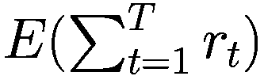 的动作。在在线强化学习中，可以访问环境，并且对于给定的 (*s*[*t*]，*r*[*t*]，*a*[*t*])，它返回下一个状态 (*s*[*t*+1]，*r*[*t*+1])。在离线强化学习中，只有从环境中观察到的有限轨迹集合。后者设置更困难，因为智能体不能再探索环境。

**决策转换器** [23] 在离线强化学习环境中运行。它不是直接使用回报 *r*[*t*]，而是考虑了 *奖励的前向和*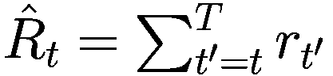。因此，轨迹被表示如下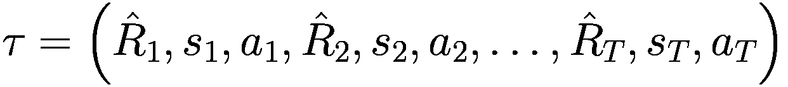(7.5)对于 (*s*[*t*], *r*[*t*], *a*[*t*]) 的输入标记嵌入是通过一个线性层计算的，每个模态不同（图 7.31）。如果状态是图像，则通过卷积编码器而不是线性层进行转换。随后，嵌入通过层归一化进行归一化。对于每个具有三个输入的时间步，学习并添加一个位置嵌入到该时间步的嵌入中。然后，嵌入通过一个自回归的 GPT 模型进行处理，该模型通过自回归建模来预测未来的动作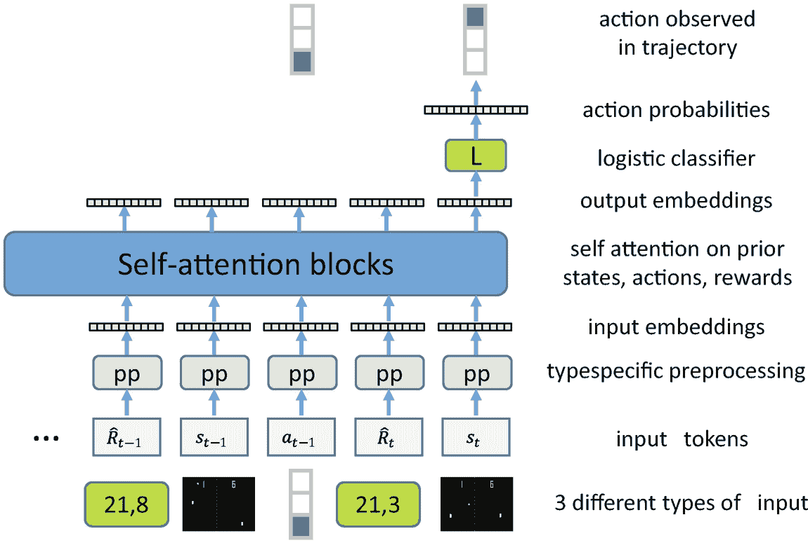

自回归语言模型接受 3 种不同类型的输入，输入标记、类型特定的预处理和输入嵌入。然后它移动到状态、动作、奖励、输出嵌入、逻辑分类器和动作概率。

图 7.31

决策转换器将自回归语言模型应用于奖励的前向和 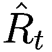、状态 *s*[*t*] 和动作 *a*[*t*]。在示例中，状态以视频帧的形式给出，例如对于 Pong 游戏。该模型在给定的奖励的前向和的条件下预测轨迹中的下一个动作 [23]

训练基于观察到的轨迹数据集。从这些轨迹中采样了长度为 *K* 的微批。然后，对于每个 *t* = 1, …, *K* 的 GPT 模型预测 *a*[*t*]，给定一个直到 *s*[*t*] 的轨迹。作为损失函数，对于离散动作使用了交叉熵损失，目标是增加时间 *t* 实际动作的概率。对于连续动作，例如速度，使用均方误差作为损失来最小化与观察到的控制值的平方差。没有必要预测状态或奖励的前向和。

对于应用于起始状态*s*[1]，基于期望的性能（甚至最大可能的回报）指定了一个目标前向奖励和。在执行生成的动作*a*[1]之后，目标回报会减少所获得的奖励，并确定下一个状态*s*[2]。这个过程会重复生成动作并将它们应用于获取下一个前向奖励和下一个状态，直到轨迹结束。请注意，实际的前向奖励和应该接近之前指定的期望性能。尽管模型仅在随机选择的子序列上进行训练，但它可以学会在测试时“合并”来自不同训练轨迹的子序列，以产生最优轨迹。显然，在训练过程中必须评估大量子序列，才能得到好的解决方案。

*Atari 基准测试*[13]具有离散动作，使用四个视频帧作为状态描述，并通过卷积编码器处理这些帧。仅使用了 1%的可用数据。在四个 Atari 任务（Breakout、Qbert、Pong 和 Seaquest）中，通常考虑的上下文长度为*K* = 30。除了 Qbert 之外，决策转换器与最先进的方法具有竞争力，并且对于两款游戏达到了最佳结果（Breakout、Seaquest）。最有效的替代方案是*CQL* [87] Q 学习器。

*D4RL 基准测试*模拟了由连续值动作控制的简单机器人（HalfCheetah、Hopper 和 Walker）。在这个基准测试中，决策转换器在大多数情况下比替代方法取得了更好的结果，并且具有最高的平均性能。再次，CQL 是最好的替代方案。

作者评估了在需要长时间传播奖励的环境中的方法性能。*开门基准测试*[104]有三个阶段：

+   在第一阶段，智能体被放置在一个带有钥匙的房间里；

+   然后，智能体被放置在一个空房间里；

+   最后，智能体被放置在一个带有门的房间里。

在第三个阶段，当智能体到达门口时，它会收到一个二元奖励，但前提是在第一阶段他拿起了钥匙。在这个基准测试中，决策转换器和相关方法明显优于 Q 学习方法，后者无法有效地在长期内传播奖励。

Reid 等人[136]修改了决策转换器的细节，从而提高了性能。Kumar 等人[86]通过理论分析表明，与简单地克隆专家的行为相比，决策转换器所执行的离线强化学习在长期任务上享有更好的保证。这在足够嘈杂的数据情况下尤其如此。

### 7.4.2 文本、图像和控制用 GATO 模型

**GATO** [134]是一个基础模型，它在大约 600 个不同的任务上进行了训练，包括文本生成、图像标题、用机械臂堆叠物理积木以及玩 Atari 游戏机。根据上下文，它独立决定生成哪些标记：文本、关节扭矩、按键或其输出变体，其可能性相对广泛。

根据模态，输入被标记化

+   文本通过 SentencePiece 编码，包含 32,000 个标记。

+   图像被转换为类似于视觉 transformer（第 7.2.2 节）的非重叠 16×16 图像补丁序列。

+   离散值，例如 Atari 按钮按压，按行主序顺序被转换为整数序列。标记化结果是一个位于[0, 1024]范围内的整数序列。

+   连续值，例如本体感觉输入（自我运动、力量和身体位置的感觉）或关节扭矩，在 1024 个箱子中进行预处理和离散化。然后，离散整数被移位到[32,000, 33,024]的范围。

属于文本、离散或连续值观测或任何时间步动作的标记被嵌入到一个学习向量嵌入空间中，使用查找表。基于它们在相应时间步内的局部标记位置，为所有标记添加学习位置编码。属于任何时间步图像补丁的标记使用单个 ResNet [63]块进行嵌入，以获得每个图像补丁的向量。此外，还添加了一个可学习的图像内位置编码向量（图 7.32）。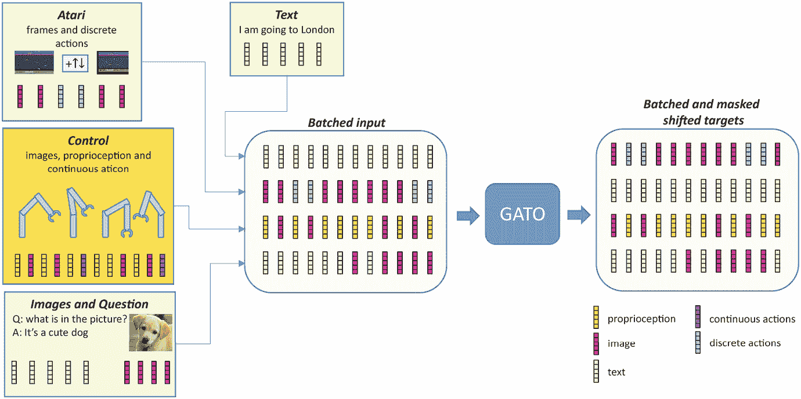

Atari 系统组件的框图，包括帧、动作、输入、连续动作以及批处理输入和掩码移位目标等技术特性。

图 7.32

来自不同任务和模态的数据被转换为序列，例如 Atari 游戏的帧和动作、文本标记序列、图像补丁标记、连续感觉输入和输出。在 Gato [134, 135]中，一个大型仅解码器 transformer 处理序列。在训练过程中，使用特定变量，例如动作，来计算损失。图像改编自 [135, 图 2]，见表[A.3](https://doi.org/10.1007/978-3-031-23190-2_BM1#Tab4)。

Gato 由一个 1.2B 参数的仅解码器 transformer 组成，具有 24 层，嵌入大小为 2048。与每个语言模型一样，所有标记都被预测，因此可以作为训练的目标。目前，仅使用文本标记、离散和连续值以及动作作为目标。通常，在训练过程中必须最大化观察到的目标标记的概率。

为了使 GATO 专注于特定任务，使用了一个来自同一源代理在相同任务上生成的轨迹的提示。GATO 在 596 个不同的控制任务上进行了训练，其中包括 Atari 基准测试[13]。作者只包含了至少产生 80%专家奖励的“良好”轨迹。此外，GATO 还在 8 个视觉和语言任务上进行了训练，例如使用 MS-COCO Captions [26]和 Conceptual Captions [153]进行图像描述，以及视觉问答数据集。此外，GATO 还在包含 3000 亿个文本标记的大型 MassiveText [128]数据上进行了训练。

GATO 的性能在不同应用中进行了评估。在 Atari 基准测试中，该模型在 51 个 Atari 游戏中达到了平均人类分数或更好，有 23 个。在一个机器人堆叠基准测试中，GATO 实现了与 BC-IMP 基线 [90] 相当的性能。该模型只有基本的对话和描述功能，这在模型尺寸较小的情况下并不令人惊讶。

Gato 模型是首次尝试同时使用相同的 Foundation Model 来解决文本、图像和控制任务。对于控制任务，它取得了令人尊重的结果，而对于文本和图像任务，它的表现则相当平庸。也许它可以从决策 Transformer 的奖励表示的前向求和中受益。实际的 Foundation Model 拥有数百亿个参数，需要相应的计算努力。如果 GATO 模型扩展到这个数量级，其性能预计将相应提高。

#### 可用实现

+   决策 Transformer 代码 [`sites.google.com/berkeley.edu/decision-transformer`](https://sites.google.com/berkeley.edu/decision-transformer)

### 7.4.3 摘要

预训练的语言模型可以应用于混合元素类型的序列。决策 Transformer 考虑在特定时间步长发生的奖励、状态和动作的序列，这些发生在顺序决策问题中，例如视频游戏、机器人控制和自动驾驶。它对这些数量的观察轨迹进行建模。而不是使用奖励作为输入，考虑的是轨迹末尾的奖励总和，这是要最大化的量。对于每种类型的输入，都会进行一些预处理以生成嵌入。决策 Transformer 被训练来预测 30 个时间步长的短子序列中的动作。

在应用过程中，可以设置所需的奖励前向求和作为条件。然后，模型能够将训练数据中不同子序列的信息拼接在一起，以获得接近最优的动作，达到最大奖励总和。这一点通过在各个基准测试中的大量实验得到了证明。

GATO 模型表明，同时使用 PLM 可以解决强化学习任务、文本任务和图像任务。该模型使用近 600 个控制基准、8 个图像任务和 300B 个文本标记进行训练。该模型只有基本的文本和图像描述能力，但在 Atari 基准测试中表现相对较好。这只是一个概念验证，可以通过增加模型大小和使用例如奖励的前向和等方法进行改进。

## 7.5 DNA 和蛋白质序列的解释

解码 DNA 语言是生物研究最重要的目标之一。遗传密码是通用的，解释了 DNA 如何被翻译成蛋白质。相比之下，调控密码，它决定了基因何时以及如何表达，在不同细胞类型和生物体之间是不同的。这与自然语言文本中的多义性和远距离语义关系相似。**DNABERT** [76] 将 DNA 序列标记为重叠的 3-gram，并训练一个标准的 BERT 模型来预测掩码标记（图 7.33）。在大量 DNA 序列上进行预训练后，它可以通过针对许多特定的 DNA 预测任务进行微调来提高 Sota。其中还包括分析序列基序（具有生物学相关性的 DNA 片段）和预测启动子区域（使基因受调控表达的核苷酸序列）。MoDNA [5] 和 GeneBERT [106] 具有类似的功能。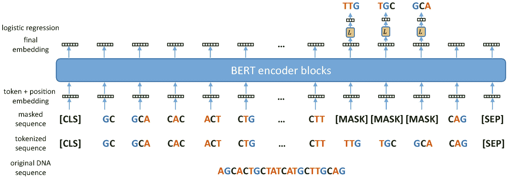

BERT 编码器块的示意图显示了该过程的最终结果，包括逻辑回归的最终嵌入、标记加位置嵌入、掩码序列、标记化序列和原始 DNA 序列。

图 7.33

DNABERT 将 DNA 序列标记为重叠的 3-gram，并训练一个标准的 BERT 模型来预测掩码标记 [76]。该模型可以微调到许多 DNA 解释任务。

蛋白质是由共价键连接的氨基酸线性链。氨基酸可以用一个包含 25 个字符的字母表来表示。这些字符串非常适合许多 NLP 方法 [111]。**AminoBERT** [29] 是一个语言模型，它根据蛋白质序列作为输入预测 3D 蛋白质结构。它还使用一种自然的方法来描述多肽几何形状，该几何形状在多肽整体水平上是旋转和平移不变的。平均而言，该模型在孤儿蛋白质和工程蛋白质类别上优于 AlphaFold2 [80] 和 RoseTTAFold [8]，在计算时间上实现了高达 106 倍的减少。

有许多其他模型具有类似的结果 [97]，例如，蛋白质语言模型**ESMFold**。它生成的嵌入可以用于下游任务，例如捕获蛋白质的结构特性。一个拥有 15B 参数的模型可以预测蛋白质的三维结构，达到单个原子的分辨率。

可用实现

+   DNABERT 代码和模型[`github.com/jerryji1993/DNABERT`](https://github.com/jerryji1993/DNABERT)

+   GeneBERT 代码和模型[`github.com/ZovcIfzm/GeneBERT/tree/main/GeneBERT`](https://github.com/ZovcIfzm/GeneBERT/tree/main/GeneBERT)

+   ProteinBERT 代码和模型[`github.com/nadavbra/protein_bert`](https://github.com/nadavbra/protein_bert)

+   AlphaFold 2 代码和模型[`github.com/deepmind/alphafold`](https://github.com/deepmind/alphafold)

+   RoseTTAFold 代码和模型[`github.com/RosettaCommons/RoseTTAFold`](https://github.com/RosettaCommons/RoseTTAFold)

+   ESMFold 代码和模型[`github.com/facebookresearch/esm`](https://github.com/facebookresearch/esm)

### 7.5.1 摘要

基础模型也可以应用于 DNA 和蛋白质序列，以推导序列元素的上下文嵌入。通过这种方法，模型能够积累大量关于这些序列的知识，并在各种下游任务中实现 Sota 性能，很大程度上超越了现有工具。这些模型可以帮助预测蛋白质的 3-D 结构。这对于其功能至关重要，并且可能在开发影响它的活性物质方面起到关键作用。

**开放获取**本章根据 Creative Commons Attribution 4.0 国际许可协议([`creativecommons.org/licenses/by/4.0/`](http://creativecommons.org/licenses/by/4.0/))进行许可，允许在任何媒介或格式中使用、分享、改编、分发和复制，只要您适当引用原始作者和来源，提供 Creative Commons 许可的链接，并指出是否进行了更改。

本章中的图像或其他第三方材料包含在本章的 Creative Commons 许可之下，除非在材料引用行中另有说明。如果材料未包含在本章的 Creative Commons 许可之下，且您的使用未得到法定规定的允许或超出了允许的使用范围，您需要直接从版权持有人处获得许可。
