# 1. 深度学习基础

纵观历史，人类一直在努力辨别何为真实、现实又意味着什么。从狩猎采集者到希腊哲学家，再到文艺复兴时期，我们对现实的解读随着时间推移而不断成熟。曾经被视为神秘主义的事物，如今已被大部分科学所理解和规范。就在不到十年前，我们还在试图理解宇宙的现实——至少我们曾这样以为。如今，随着人工智能的出现，我们看到新的现实形式每天都在身边涌现。这种由新一波人工智能所展现的新现实，正是通过`神经网络`和`深度学习`得以实现的。

深度学习与神经网络在计算机科学的边缘徘徊了超过 50 年，它们自身也带有某种神秘色彩。对许多人来说，深度学习的抽象概念和数学原理使其难以接近。主流科学界多年来一直回避深度学习和神经网络，在许多行业中它们仍被束之高阁。然而，跨越所有这些障碍，深度学习已成为 21 世纪人工智能和机器学习领域勇敢的新领导者。

本书将从基础层面探讨深度学习和神经网络的工作原理。我们将学习网络的内部机制以及驱动它们运行的关键。接着，我们会迅速转向理解如何配置神经网络，使其能够生成自己的内容和现实。在此基础上，我们将进一步探讨深度学习的多种内容生成形式，包括换脸、增强旧视频以及创造新的现实。

在本章中，我们将从深度学习的基础开始，学习如何为几种典型的机器学习任务构建神经网络。我们将了解深度学习如何执行数据的回归与分类，并深入理解其内部的学习过程。然后，我们将继续学习如何通过卷积来专门化网络，以提取数据中的特征。最后，我们将使用监督式深度学习构建一个完整的、可运行的图像分类器。

由于这是第一章，我们还将介绍一些先决条件和其他有用的内容，以更好地引导您成功阅读本书。以下是本章内容的概要：

*   先决条件

*   感知机

*   多层感知机

*   PyTorch 深度学习框架

*   回归

*   分类

本书将从数据科学、机器学习和深度学习的基础开始，但为了顺利学习，请确保您满足下一节中的大部分要求。

## 先决条件

虽然许多关于机器学习和深度学习的概念应该在高中阶段就有所涉及，但本书将远远超越深度学习的基础介绍。使用深度学习网络生成内容是一项可以学习的高级任务，但为了成功掌握，如果您满足以下大部分先决条件，将会很有帮助：

*   **对数学的兴趣**：您不需要数学学位，但应该对学习数学概念有兴趣。值得庆幸的是，大部分复杂的数学运算将由我们使用的代码库处理，但您仍然需要理解数学概念中的一些关键区别。深度学习和生成式建模会用到以下数学领域：

    *   **线性代数**，处理矩阵和方程组

    *   **统计学与概率论**，理解描述性统计的基本原理和基础概率论

    *   **微积分**，理解微分的基础知识及其如何用于理解变化率

*   **编程知识**：理想情况下，您曾使用过 Python 或其他编程语言进行编程。如果您完全没有编程知识，建议您先学习一门 Python 课程或阅读相关教材。作为编程知识的一部分，您可能还需要深入了解以下库：

    *   `NumPy`^(¹)：`NumPy`（发音为“numb pie”）是一个用于操作数组或数字张量的库。它及其应用的概念是机器学习和深度学习的基础。本书将介绍 `NumPy` 的各种用法，但建议您根据需要自行进一步学习。

    *   `PyTorch`^(²)：这将是本书中深度学习项目的基础。我们假设您对 `PyTorch` 知之甚少或一无所知，但您可能仍想自行了解更多这个令人印象深刻的库所提供的功能。

    *   `MatPlotLib` ^(³)：该模块将是本书中我们展示的大部分输出的基础。书中会有大量示例说明其用法，但额外的练习可能会有所帮助。

*   **数据科学和/或机器学习**：如果您之前学习过数据科学课程，了解机器学习中使用的统计方法以及处理数据时需要注意的方面，将会很有帮助。

*   **计算机**：本书中的所有示例均在云端开发，虽然也可以在移动计算设备上使用，但为了获得最佳效果，建议您使用计算机。

    *   附录 A 提供了在本地计算机上设置和使用代码示例的说明。如果您拥有配备高级 GPU 的机器，或者需要运行超过 12 小时的示例，这可能是一个需要考虑的因素。

*   **时间**：生成式建模可能非常耗时。本书中的某些示例可能需要数小时甚至数天才能运行完毕（如果您愿意尝试的话）。在大多数情况下，完整运行示例会让您收获更多，所以请保持耐心。

*   **开放的学习心态**：我们将尽力涵盖您使用本书练习所需的大部分材料。然而，要完全理解其中一些概念，您可能需要将学习延伸到本书之外。如果您的职业是数据科学和机器学习，或者您希望如此，您可能已经意识到您的学习之路将是持续不断的。

虽然强烈建议您具备上述先决条件中的一些背景知识，但如果您愿意在阅读本书的同时扩展自己的知识，也仍然可以继续学习。有许多文本、博客和视频资源可以帮助您填补知识空白。我要求您带来的主要先决条件是开放的心态和学习的意愿。

在下一节中，我们将深入探讨神经网络的基础——感知机。

## 感知器

虽然存在一些争议，但大多数人认为神经网络的灵感来源于大脑，或者更具体地说，来源于脑细胞或神经元。图 1-1 展示了生物神经元与一个名为`感知器`的数学模型之间的对比。弗兰克·罗森布拉特早在 1957 年就提出了基本的感知器模型。后来，马文·明斯基在其著作《感知器》中对这一模型进行了改进，形成了图中所示的版本。不幸的是，该书对感知器在除简单布尔逻辑问题（如 XOR）之外的应用提出了过度批评。正如我们后来所发现的，这些批评大多缺乏依据，但这场批评的余波常被认为是导致第一次人工智能寒冬的原因。

`人工智能寒冬`是指所有人工智能研发工作被停止或搁置的时期。这些寒冬通常由阻碍该领域发展的重大障碍引发。第一次寒冬是由明斯基对感知器的批评及其认为它只能解决 XOR 问题的观点所导致的。迄今为止，已经出现过两次人工智能寒冬。这些寒冬的具体时间存在争议，且可能因具体学科而异。

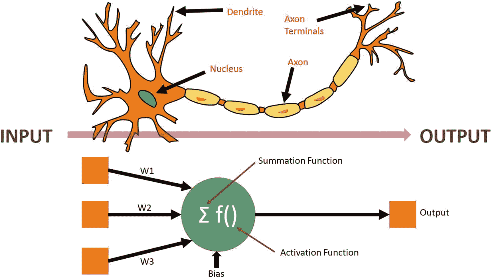

图 1-1

生物神经元与感知器的对比

或许正是这种与大脑的关联，导致了人们对感知器和深度学习的一些批评。这种关联也增添了神经网络的神秘感和不确定性。然而，感知器本身仅仅是一种连接模型，我们通常将这种学习方式称为连接主义。如果说感知器模型与神经元有什么关联，那也只是在连接方式上，仅此而已。实际的神经大脑功能要复杂得多，其运作方式与感知器截然不同。

如果我们回到图 1-1 和感知器模型，可以看到系统如何接收由方框表示的多个输入。这些输入会乘以一个我们称之为`权重`的值，用以衡量或调整输入到下一阶段的强度。不过在此之前，我们还有另一个称为`偏置`的输入，其值为 1.0，我们将其乘以另一个权重。偏置允许感知器对结果进行偏移。在所有输入和偏置都被加权/缩放后，它们会在求和函数中被累加求和。

求和函数的结果随后被传递到一个激活函数。激活函数的目的可能是进一步缩放、压缩或截断要输出的值。让我们通过练习 1-1 来看看如何在代码中建模一个简单的感知器。

### 练习 1-1. 编写感知器代码

| **输入** | **输出** |

| --- | --- |

| X1 | X2 | Y |

| 0 | 0 | 0 |

| 0 | 1 | 1 |

| 1 | 0 | 1 |

| 1 | 1 | 0 |

1.  从项目的 GitHub 站点打开 `GEN_1_XOR_perceptron.ipynb` 笔记本。如果不确定如何访问源代码，请查看附录 B。

2.  在笔记本的第一个代码块中，我们可以看到一些针对 `NumPy` 和 `Matplotlib` 的导入。`Matplotlib` 用于显示图表。

```python
import numpy as np
import matplotlib.pyplot as plt
```

3.  滚动到如下所示的 XOR 问题代码块。这是设置数据的地方；数据由我们想要训练感知器的 `X` 和 `Y` 值组成。`X` 值代表输入，`Y` 值表示期望的输出。我们通常将 `Y` 称为标签或期望输出。我们使用 `numpy np` 模块，通过 `np.array` 将输入列表创建为张量。在此代码块的底部，我们输出了这些张量的形状。

```python
X = np.array([[0,0],[0,1],[1,0],[1,1]])
Y = np.array([0,1,1,0])
print(X.shape)
print(Y.shape)
```

4.  我们用于这个初始测试问题的值来自如下所示的 XOR 真值表：

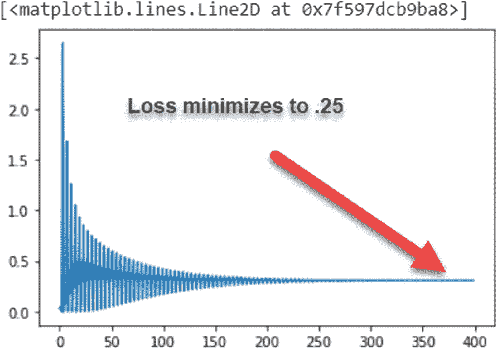

图 1-2

感知器 XOR 训练损失输出

5.  向下滚动并执行以下代码块。此代码块使用 `matplotlib plt` 模块输出同一真值表的 3D 表示。我们使用数组索引切片来显示 `X` 的第一列，然后是 `Y`，最后将 `X` 的最后一列作为第三维度。

```python
fig = plt.figure()
ax = fig.add_subplot(111, projection='3d')
ax.scatter(X[:,0], Y, X[:,1], c='r', marker='o')
```

6.  编写感知器代码的第一步是确定输入的数量，并为这些输入创建权重。我们将使用以下代码来完成。在这段代码中，你可以看到我们通过取 `X.shape[1]` 的第一个值（即 2）来获取输入数量。然后我们使用 `np.random.rand` 随机初始化权重，并为偏置增加一个输入。回想一下，偏置是感知器偏移函数的一种方式。

```python
no_of_inputs = X.shape[1]
weights = np.random.rand(no_of_inputs + 1)
print(weights.shape)
```

7.  将权重初始化为随机值后，我们就有了一个可工作的感知器。我们可以通过运行下一个代码块来测试这一点。在此代码块中，我们遍历名为 `X` 的 `inputs`，并使用 `np.dot` 函数通过点积进行乘法和加法运算。此计算的结果产生了感知器的求和值。此代码块的输出目前还没有任何意义，因为我们仍然需要训练权重。

```python
for i in range(len(X)):
    inputs = X[i]
    print(inputs)
    summation = np.dot(inputs, weights[1:]) + weights[0]
    print(summation)
```

8.  下一个代码块是训练感知器权重的训练代码。我们总是以迭代方式在数据上训练感知器或神经网络，这种数据循环称为一个`周期`。在每个周期或迭代中，我们将逐个或分批地将每个数据样本馈送到感知器或网络中。当每个样本被馈送时，我们将求和函数的输出与 `label` 或期望值 `Y` 进行比较。预测值与标签之间的差异称为`损失`。基于这个损失，我们可以根据一个稍后将详细回顾的公式来调整权重。整个训练代码如下所示：

```python
learning_rate = .1
epochs = 100
history = []
for _ in range(epochs):
    for inputs, label in zip(X, Y):
        prediction = summation = np.dot(inputs, weights[1:]) + weights[0]
        loss = label - prediction
        history.append(loss*loss)
        print(f"loss = {loss*loss}")
        weights[1:] += learning_rate * loss * inputs
        weights[0] += learning_rate * loss
```

9.  运行最后一个代码单元后，运行如下所示的最后一个代码单元，它会生成一个损失图，如图 1-2 所示。

```python
plt.plot(history)
```

这个练习的结果并不令人印象深刻。我们只能将最小化损失降低到 0.25。你可以随意继续运行该示例，增加更多周期或训练轮次；但结果不会有太大改善。这正是明斯基博士在其著作《感知器》中所指出的观点。单个感知器或单层感知器无法解决简单的 XOR 问题。然而，单个感知器能够解决一些更困难的问题。

在我们探索将感知器用于更困难的问题之前，让我们重新审视上一个示例中的学习代码行，并理解它们是如何工作的。为便于回顾，学习代码行总结如下：

```python
prediction = summation = np.dot(inputs, weights[1:]) + weights[0]
loss = label - prediction
...
weights[1:] += learning_rate * loss * inputs
weights[0] += learning_rate * loss
```

我们已经介绍了使用`np.dot`计算的求和/预测函数。损失通过计算`label`与`prediction`的差值得到。然后使用如下所示的更新函数更新权重：

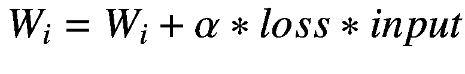

其中：

- `W[i]` = 与输入槽位匹配的权重

- `α` (alpha) = 学习率

- `loss` = `label`与`prediction`的差值

- `input` = 感知器中输入槽位的输入值

这个简单的方程用于在每次向感知器输入数据时更新权重。学习率用于缩放更新的幅度，通常取值为 0.01（即 1%）或更小。我们希望学习率将每次更新缩放至一个较小的值；否则，每次传递可能导致感知器过学习或欠学习。学习率是我们称之为`超参数`的一类变量中的第一个。

超参数是一类通常需要手动调整的变量。它们之所以被区分为超参数，是因为我们将内部权重称为`参数`。

单个感知器或单层感知器的问题在于它们只能解决线性函数。异或（XOR）问题不是一个线性函数。为了解决 XOR 问题，我们需要引入不止一层的感知器，这被称为`多层感知器`。不过，在此之前，让我们重新审视感知器，看看它能解决什么问题。

在下一个练习中，我们将研究一个更难的问题，该问题可以用感知器这样的线性方法解决。我们将要研究的问题是解决一个二维线性回归问题。就在 15 年前，这类问题用传统的回归方法还很难解决。我们将在后面的章节中详细介绍回归；现在，让我们直接进入练习 1-2。

**练习 1-2. 使用感知器进行线性回归**

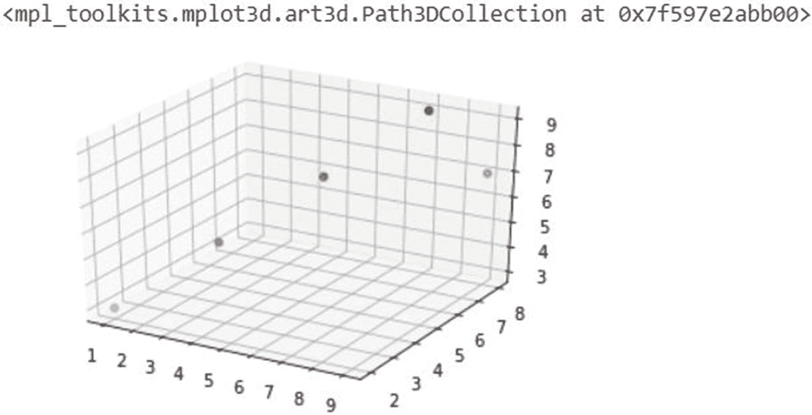

图 1-3

在 3D 图上绘制的输入点

1.  从项目的 GitHub 站点打开`GEN_1_perceptron_class.ipynb`笔记本。如果您不确定如何访问源代码，请查看附录 B。

2.  这次我们将运行线性回归问题的代码块来设置数据，如下所示：

```python
X = np.array([[1,2,3],[3,4,5],[5,6,7],[7,8,9],[9,8,7]])
Y = np.array([1,2,3,4,5])
print(X.shape)
print(Y.shape)
```

3.  下一个代码块在图表上渲染输入点：

```python
fig = plt.figure()
ax = fig.add_subplot(111, projection='3d')
ax.scatter(X[:,0], X[:,1], X[:,2], c='r', marker='o')
```

4.  在这种情况下，我们仅在如图 1-3 所示的 3D 图中显示输入点。我们在这个问题中的目标是训练感知器，使其能够学习如何将这些点映射到我们的输出标签`Y`。

5.  接下来，我们进入设置参数和超参数的代码部分。在这个练习中，我们调整了超参数`epochs`和`learning_rate`。我们将`learning_rate`降低到 0.01。这样做有效地使每次更新训练传递或 epoch 的效果减弱。然而，在这种情况下，感知器学习映射这些值的速度比 XOR 问题快得多，因此我们也将减少 epoch 的数量。

```python
no_of_inputs = X.shape[1]
epochs = 50
learning_rate = .01
weights = np.random.rand(no_of_inputs + 1)
print(weights.shape)
```

6.  对于这个练习，我们将引入一个激活函数。激活函数用于缩放输出，以便更好地输入或预测。在这个例子中，我们使用一个修正线性单元（ReLU）函数。这个函数有效地将小于或等于 0 的输出置为 0，否则就线性地传递输出。

```python
def relu_activation(sum):
    if sum > 0: return sum
    else: return 0
```

7.  接下来，我们将感知器的全部功能封装到一个 Python 类中，以实现更好的封装和复用。以下代码是我们之前所有感知器和设置代码的组合：


## 感知器

```python
class Perceptron(object):
    def __init__(self, no_of_inputs, activation):
        self.learning_rate = learning_rate
        self.weights = np.zeros(no_of_inputs + 1)
        self.activation = activation
    def predict(self, inputs):
        summation = np.dot(inputs, self.weights[1:]) + self.weights[0]
        return self.activation(summation)
    def train(self, training_inputs, training_labels, epochs=100, learning_rate=0.01):
        history = []
        for _ in range(epochs):
            for inputs, label in zip(training_inputs, training_labels):
                prediction = self.predict(inputs)
                loss = (label - prediction)
                loss2 = loss*loss
                history.append(loss2)
                print(f"loss = {loss2}")
                self.weights[1:] += self.learning_rate * loss * inputs
                self.weights[0] += self.learning_rate * loss
        return history
```

8. 我们可以用以下代码实例化并训练这个类：

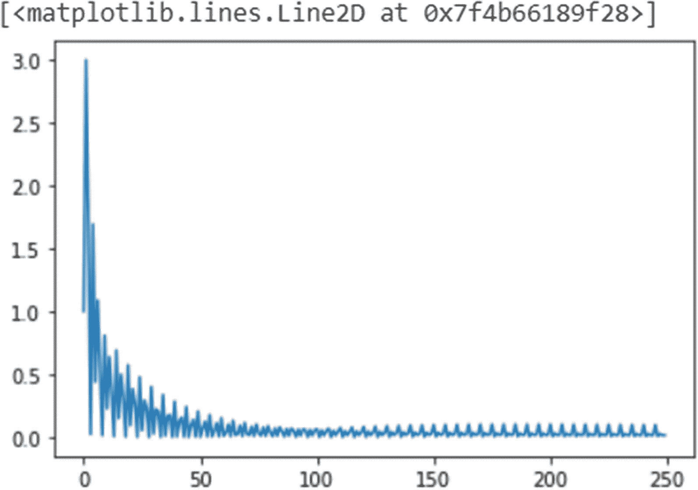

图 1-4

感知器在线性回归问题上的输出损失

9. 图 1-4 显示了训练函数调用产生的历史输出，这是运行最后一组单元格的结果。我们可以清楚地看到损失几乎降到了 0。这意味着我们的感知器能够根据给定的输入预测并映射结果。

```python
perceptron = Perceptron(no_of_inputs, relu_activation)
history = perceptron.train(X,Y, epochs=epochs)
```

你可以在图 1-4 中看到网络损失存在明显的波动。这种波动部分是由学习率过高以及我们向网络输入数据的方式引起的。我们将在本书后续内容中探讨如何解决此类问题。

这个练习的结果在将输入映射到预期输出方面要成功得多，即使面对的是一个通常更难的数学问题。我们刚刚见证的这类结果，正是感知器在第一次 AI 寒冬中得以存活的原因。直到这次寒冬之后，我们才发现将感知器堆叠成层可以做得更多，并最终解决 XOR 问题。我们将在下一节中深入探讨多层感知器。

## 多层感知机

从根本上说，将感知机堆叠成层的概念并不难理解。图 1-5 展示了一个三层多层感知机（MLP）。最顶层称为*输入层*，最后一层称为*输出层*，中间的各层称为*中间层*或*隐藏层*。

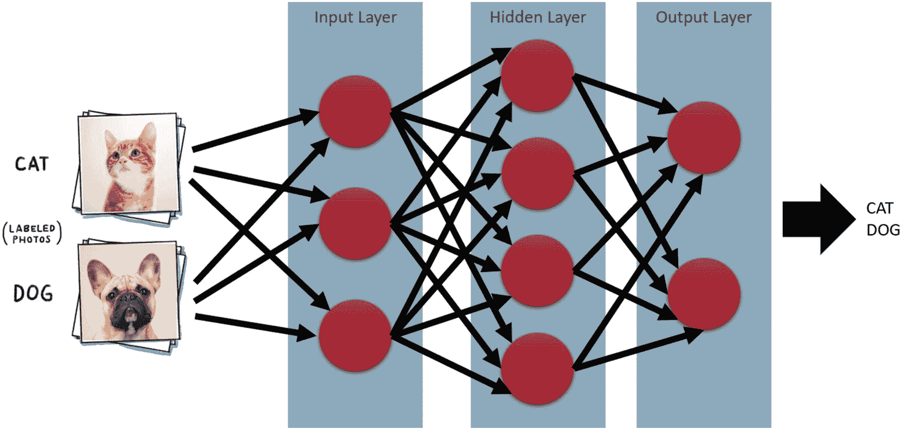

图 1-5

MLP 网络示例

图 1-5 展示了我们如何将猫和狗的图片输入网络，并让其对输出进行分类。我们稍后会讨论如何对输出进行分类。图中的每个节点或圆圈代表一个单独的感知机，每个感知机都与网络中的后续层全连接。我们称这类网络为*全连接顺序网络*。

通过网络进行前向传播的预测过程与我们的感知机相同，唯一的区别在于第一层的输出成为下一层的输入，以此类推。通过将输入传入网络来计算输出的过程称为*前向传播*或*预测*。从计算角度来看，通过使用点积函数，深度学习中的前向传播非常高效，这也是神经网络的一大优势。

如果你还记得上一节的内容，我们使用的 `np.dot` 函数对权重和输入进行了求和。该函数在 GPU 上经过优化，执行速度非常快。因此，即使我们有 100 万个输入（是的，这是可能的），也可以在 GPU 上通过一次操作完成计算。

`np.dot` 函数之所以能在 GPU 上得到优化，得益于计算机 3D 图形技术的发展。点积运算在图形处理中相当常见。从某种意义上说，游戏和图形引擎的发展对人工智能和深度学习起到了巨大的推动作用。

虽然前向传播或预测步骤可以快速运行，但其计算并不特别困难。不幸的是，与之相反的训练更新过程，即我们所说的*反向传播*，则不那么容易。当我们堆叠感知机时面临的问题是，之前应用的简单更新方程无法跨网络层工作。

在更新多层网络时，我们遇到的问题是如何确定损失需要应用于哪些层，以及该层中的哪个感知机。我们不能再简单地从预测中减去损失，然后将该值应用于单个权重。相反，我们需要计算每个权重对最终输出或预测结果的影响程度。

为了计算如何将损失应用于每个感知机、每个层中的每个权重，我们使用微积分。微积分使我们能够通过微分来确定要应用的损失量。我们使用微积分对前向传播函数或预测函数以及激活函数进行微分。通过针对权重对这些函数进行微分，我们可以确定每个权重对结果的影响程度。

### 反向传播

我们将通过网络的反向更新过程称为反向传播，因为我们是将误差或损失反向传播到每个权重。图 1-6 展示了误差或损失通过网络的反向传播过程。该图还展示了计算此误差量的公式。

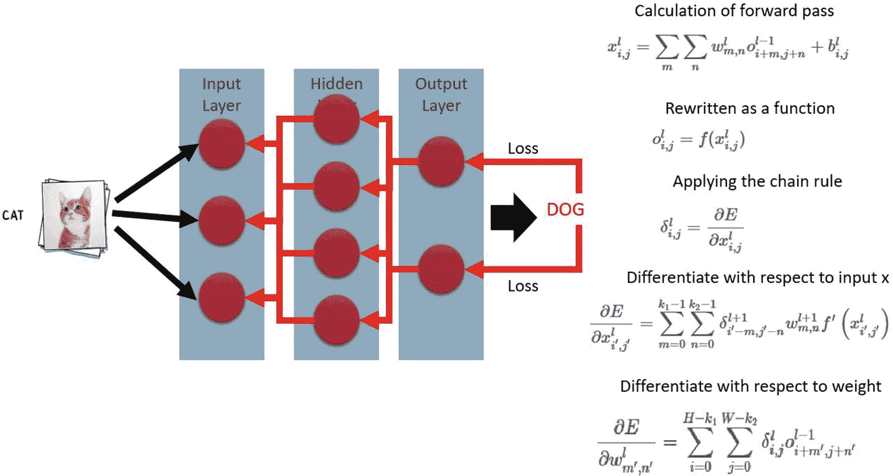

图 1-6

反向传播详解

图 1-6 中的第一个公式展示了通过网络的前向传播计算。进入下一个公式，我们将其写成一个参数化函数。接着，我们应用微积分中的链式法则，针对输入对前向方程进行微分。通过了解每个输入对变化的影响程度，我们可以再次进行微分，这次是针对权重。最后一个公式展示了我们如何计算网络中每个权重的变化量。

现在，我们无需担心管理数学运算或整理公式来实现这一过程。所有深度学习库都提供了自动微分机制来为我们完成这项工作。需要理解的关键点在于最后一个公式如何将损失推回网络中的每个权重。该公式的输出是一个梯度，描述了变化的方向和幅度。为了执行更新，我们反转这个梯度，并用学习率超参数对其进行缩放。

由于最终计算的输出是一个梯度，我们使用一种优化方法来最小化或减小这个梯度。我们称这种方法为*梯度下降*，因为它的目的是随着函数最小化损失/误差而减少梯度量。你可以通过图 1-7 来想象梯度下降的工作原理。

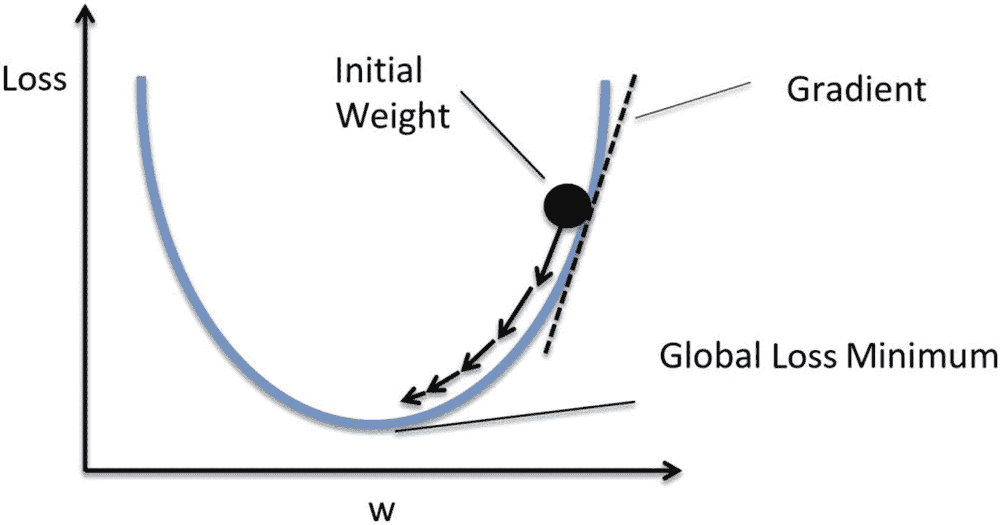

图 1-7

梯度下降详解

在图 1-7 中，梯度下降被用来修改权重的梯度，以最小化前向传播函数的全局损失。该图展示了一个简单的二维表示，但在大多数情况下，问题的维度空间可能达到数百或数千。这意味着，对于此类问题，全局最小优化的地形或表面可能包含许多局部最小值的山峰和山谷。

### 随机梯度下降

反向传播和梯度下降是 20 世纪 80 年代重新唤醒深度学习的发现。不过在当时，人们仍需手动完成计算。考虑到网络可能变得多么复杂或深入，这堪称一项令人印象深刻的壮举。

然而，随着时间的推移，单一的梯度下降（即在每个输入展示给网络后立即进行更新）效率低下，并且事实证明并非最优。我们发现，通过将数据分批处理，该过程可以更高效，且结果相差不大。我们将这种形式的梯度下降称为*批量梯度下降*（BGD）。

随着深度学习的成熟，后来发现一致的批次可能会使结果产生偏差，尤其是当相似的数据集聚集在一起时。例如，如果我们要对猫和狗进行分类，并且我们的数据集有 1000 张猫的图片和 1000 张狗的图片，那么将这些图片作为猫或狗的批次输入，与进行小幅更新是相悖的。将 100 张猫的图片作为一个批次输入网络，对于理解什么不该分类没有任何帮助。

相反，我们发现将输入数据随机分批，例如混合猫和狗的图片，效果要好得多。通过随机化数据，一个批次中可能包含任意数量的猫或狗图片，从而使网络能够更好地理解猫和狗之间的区别。

这种将数据随机分批输入网络的方法称为*随机梯度下降*（SGD）。SGD 现在是我们用于深度学习的一系列优化算法的基础。它将是本书中我们使用的许多网络的基础方法。在下一节中，我们将研究如何使用 PyTorch 在网络上执行带有随机梯度下降的反向传播。

### PyTorch 与深度学习

到目前为止，我们一直在使用纯 Python，并借助一位名为 NumPy 的朋友的帮助来构建一些简单的感知器。你现在可能已经意识到，通过网络反向传播损失的过程并不简单，需要一些额外的帮助。幸运的是，有许多深度学习库可供我们使用，但它们并非都同样出色。

在本书中，我们将使用 `PyTorch`，这是一个开源库，因其易用性、高性能和可定制性而变得非常流行。它目前是大多数学术和前沿人工智能研究人员的首选库。这将在本书后续尝试构建前沿生成模型时为我们带来好处。

`PyTorch` 可以让我们构建从最简单的两层多层感知器到数千层的复杂模型。在练习 1-3 中，我们将深入实践，在 `PyTorch` 中构建我们的第一个 MLP 网络，重新解决我们之前未能解决的 XOR 问题。

#### 练习 1-3. 在 PyTorch 上用 MLP 解决 XOR 问题

1. 从项目的 GitHub 站点打开 `GEN_1_mlp_pytorch.ipynb` 笔记本。如果你不确定如何访问源代码，请查看附录 B。

2. 运行第一个代码块，它会加载 NumPy 以及我们将要使用的几个 `PyTorch`（`torch`）模块。

```python
import numpy as np
import torch
import torch.nn as nn
from torch.autograd import Variable
import torch.nn.functional as F
import torch.optim as optim
```

3. 下一个代码块包含一个名为 `XorNet` 的类中的模型。在这个类中，我们使用 `nn` 模块通过 `nn.linear` 创建了两个神经网络层。我们将该层称为 `fc`；提醒一下，该层是全连接的。第一个 `fc1` 层接收 2 个输入并输出到 10 个神经元/感知器。第二个 `fc2` 层接收 10 个输入并输出到单个神经元。`forward` 函数展示了输入 `x` 如何被传递到第一个 `fc1` 层，并通过 `F.relu` 经过 ReLU 激活函数，然后再传递到第二个 `fc2` 层。

```python
class XorNet(nn.Module):
    def __init__(self):
        super().__init__()
        self.fc1 = nn.Linear(2,10)
        self.fc2 = nn.Linear(10,1)
    def forward(self, x):
        x = F.relu(self.fc1(x))
        x = self.fc2(x)
        return x
```

4. 下一个代码块是我们实例化 `XorNet` 模型的地方。之后，我们创建了一个均方误差（MSE）类型的损失函数。这个损失计算与我们之前看到的相同。之后，我们创建了一个 Adam 类型的优化器。Adam 优化器是 SGD 的改进版本，它提供了更好的权重更新缩放，从而使优化更加高效。

5. 接着，我们开始设置 XOR 问题的数据，并调整这些数据的封装方式，以便输入到 `PyTorch` 中。

```python
X = np.array([[0.,0.],[1.,1.],[0.,1.],[1.,0.]])
Y = np.array([0.,0.,1.,1.])
y_train_t = torch.from_numpy(Y).clone().reshape(-1, 1)
x_train_t = torch.from_numpy(X).clone()
history = []
```

6. 接下来，我们进入训练循环，这与我们之前看到的类似。不同之处在于我们在这里对数据进行批处理。由于我们只有四个样本，我们将所有数据作为一个批次。这些数据被输入模型进行前向传播或预测。之后，使用损失函数 `loss_fn` 根据 `y_batch` 中的期望值和预测值 `y_pred` 计算损失。然后我们使用 `optimizer.zero_grad()` 将优化器的梯度归零，这类似于重置。接着使用 `loss.backward()` 反向传播损失，最后使用 `optimizer.step()` 执行另一个优化步骤。

```python
for i in range(epochs):
    for batch_ind in range(4):
        x_batch = Variable(torch.Tensor(x_train_t.float()))
        y_batch = Variable(torch.Tensor(y_train_t.float()))
        y_pred = model(x_batch)
        loss = loss_fn(y_pred, y_batch)
        print(i, loss.data)
        optimizer.zero_grad()
        loss.backward()
        optimizer.step()
```

7. 随着模型训练，你会看到损失很快趋近于零。还记得我们之前使用单个感知器模型时，损失最小化到 0.25 吗？这是因为网络无法拟合 XOR 函数。通过添加一个包含 10 个神经元/感知器的第二层，我们现在能够解决 XOR 问题了。

8. 我们可以通过以下方式从 XOR 真值表中输入单个输入来测试模型的预测效果：

```python
v = Variable(torch.FloatTensor([1,0]))
model(v)
```

9. 在代码中，你可以看到我们需要将输入 1,0 转换为张量，然后通过 `Variable` 转换为 torch 变量。然后将该值输入模型，并显示预测结果。注意，预测的输出将恰好是 1.0。

通过向 MLP 模型添加一个包含 10 个神经元的第二层，我们能够使用 `PyTorch` 快速有效地解决 XOR 问题。`PyTorch` 凭借其神经网络抽象模块 `nn`，提供了快速构建模型的能力。在 `PyTorch` 中还有其他更底层的方法来构建网络，但在本书的大部分内容中，我们将坚持使用 `nn`。在下一节中，我们将探讨如何运用 `PyTorch` 网络进行回归分析。

## 理解回归

在本章中，我们一直使用一种称为*监督学习*的教学或学习形式。在监督学习中，我们的输入具有一个已知且预期的输出，称为*标签*。在数学上，我们通常将输入表示为 `X`，将标签表示为 `Y`，如熟悉的直线方程所示，如下所示：

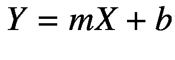

其中：

- `m` = 直线的斜率或权重

- `b` = 偏移量或偏置

同样，我们可以用以下公式对感知器的方程进行建模：

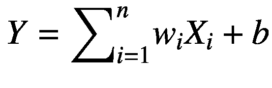

其中：

- `n` = 输入的数量

- `b` = 偏置

在监督学习场景中，我们得到输入 `X` 和预期结果或标签 `Y`。目标是找到方程的参数，无论是斜率和偏移量，还是权重和偏置，这些参数将产生预期的输出。通常，我们通过执行回归分析来解决这些问题。

回归分析是指我们迭代地修改模型的参数，直到为所有输入的集合找到一个一致的解。你可以将此分析视为映射到函数或求解函数。对于所有深度学习和机器学习，我们的目标通常只是求解一个方程或函数。当方程可微时，深度学习是一个出色的方程求解器。

由于我们使用微积分来寻找梯度，因此只要方程是可微的，我们就可以求解任何方程。这意味着方程需要在定义域内的每一点都是连续的，没有间断点或缺口。

求解或学习一个方程的目的是为了在后续推理中重用同一个方程，以处理其他未知输入并产生输出。因此，如果我们通过回归，根据一组已知的数据点和输出求解了直线方程，我们就可以重用该方程来绘制或推断新的数据点。

图 1-8 显示了数据点 `X` 和 `Y` 的散点图，以及一条穿过它们的回归线。图例中显示了该直线的方程。此图是使用 Microsoft Excel 创建的，并使用标准线性回归工具生成带有趋势线的图表。在 Excel 术语中，趋势线是使用回归计算得出的、最能拟合这些点的直线。

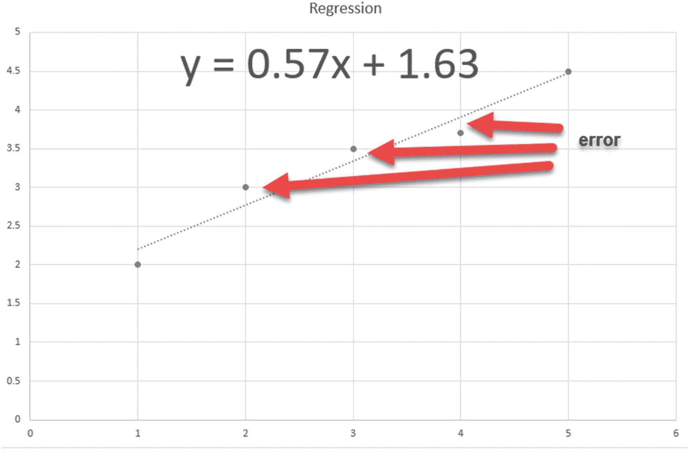


**图 1-8** Excel 生成的趋势线方程

图表中显示的直线可用于根据某个任意的 `X` 值进一步推断新的数据点。例如，如果我们想确定当 `X` 为 0 时 `Y` 的值是多少，结果将是 1.63，这恰好是直线的截距偏移量。这条直线预测的准确性取决于数据的数量和质量。

当我们运行一个深度学习模型时，本质上是在做同样的事情：求解某个适合输入数据的未知方程。在后续章节中，这个过程可能会变得模糊，但重要的是要理解，在所有情况下，我们都是在用深度学习求解一个函数或方程。

在数据科学中，我们通常将简单回归定义为寻找一个明确的值。你可能认为与回归相对的是*分类*。在分类中，我们不是寻找一个明确的值，而是寻找该值所属的类别。我们将在本章后面进一步探讨分类。不过现在，让我们进入另一个练习，展示如何使用深度学习网络执行更复杂的回归。在练习 1-4 中，我们将使用波士顿房价数据集来预测房屋价值。

### 练习 1-4. 使用 PyTorch 预测房价

1.  从项目的 GitHub 站点打开 `GEN_1_regression_pytorch.ipynb` 笔记本。如果你不确定如何访问源代码，请查看附录 B。

2.  在第一个单元格中，我们再次加载导入，这次添加了一个名为 `sklearn` 的新模块。我们将使用此模块下载波士顿房价数据，并将数据拆分为训练集和测试集。在大多数情况下，我们总是希望将数据拆分为训练/测试集，其中平均 80% 的原始数据将用于训练，剩余的 20% 用于之后测试模型。

    ```python
    from sklearn.datasets import load_boston
    from sklearn.model_selection import train_test_split
    import numpy as np
    import matplotlib.pyplot as plt
    import torch
    import torch.nn as nn
    ```

3.  接下来，我们将使用代码加载数据集，并将其拆分为输入 (`X`) 和标签 (`y`)。

    ```python
    boston = load_boston()
    X, y = (boston.data, boston.target)
    boston.data[:2]
    inputs = X.shape[1]
    ```

4.  数据已加载，现在我们将使用 `train_test_split` 函数将其拆分为训练集和测试集。注意我们如何将 `test_size` 设置为 .2，这意味着 20% 的数据将用于测试。

    ```python
    X_train, X_test, y_train, y_test = train_test_split(X, y, test_size=0.2, random_state=0)
    num_train = X_train.shape[0]
    X_train[:2], y_train[:2]
    num_train
    ```

5.  这次我们将创建一个包含四个层的顺序模型。第一层将数据集的大小作为输入，并输出到 50 个神经元。它继续到下一层，依次为 50 和 50，最后在输出层以一个神经元结束。然后我们创建损失函数和优化器函数。注意各层和输出层之间激活函数的区别。最后一层使用 `sigmoid` 函数，其输出值在 0 到 1 之间。

    ```python
    torch.set_default_dtype(torch.float64)
    net = nn.Sequential(
        nn.Linear(inputs, 50, bias=True), nn.ReLU(),
        nn.Linear(50, 50, bias=True), nn.ReLU(),
        nn.Linear(50, 50, bias=True), nn.Sigmoid(),
        nn.Linear(50, 1)
    )
    loss_fn = nn.MSELoss()
    optimizer = torch.optim.Adam(net.parameters(), lr=.001)
    ```

6.  接下来，我们可以继续准备用于训练的数据。在这个例子中，我们需要将标签从行顺序重塑为列顺序。在这段代码中，我们为训练和测试数据集都设置了张量。

    ```python
    num_epochs = 8000
    y_train_t = torch.from_numpy(y_train).clone().reshape(-1, 1)
    x_train_t = torch.from_numpy(X_train).clone()
    y_test_t = torch.from_numpy(y_test).clone().reshape(-1, 1)
    x_test_t = torch.from_numpy(X_test).clone()
    history = []
    ```

7.  现在我们可以进入训练循环代码，这部分现在应该相对熟悉了。

    ```python
    for i in range(num_epochs):
        y_pred = net(x_train_t)
        loss = loss_fn(y_train_t, y_pred)
        history.append(loss.data)
        loss.backward()
        optimizer.step()
        optimizer.zero_grad()
        test_loss = loss_fn(y_test_t, net(x_test_t))
        if i > 0 and i % 100 == 0:
            print(f'Epoch {i}, loss = {loss:.3f}, test loss {test_loss:.3f}')
    ```

8.  在训练代码块中，我们再次使用训练集输入 (`X`) 和标签 (`Y`) 来训练网络。与此同时，我们还通过将测试数据集传入网络来计算 `test_loss`。

9.  运行最后一段代码将向你展示损失或误差如何从大约 390 减少到大约 1 或 2。这个值代表了房价预测的偏差量。你还应该注意到，测试损失并没有与训练损失保持相同的速率。这是我们的网络过拟合的一个例子。

通过运行这个模型，你可以看到我们的训练数据集可能被优化得过于完美。然而，当我们用同一个模型测试测试数据集时，我们的结果显示出了更多的误差或损失。其原因是模型对训练数据过拟合了。数据的过拟合和欠拟合是我们将在下一节讨论的问题。

### 过拟合与欠拟合

我们在训练过程中保留测试集数据的原因，是为了判断模型的拟合程度。如果模型对训练数据拟合得过于完美，但在测试数据上表现不佳，这被称为*过拟合*。过拟合可能是网络“记住”了训练数据集的结果。

当网络过深或过大时，就可能发生这种数据记忆现象。虽然大型网络可以更快地学习并适应更大的数据输入，但这也是有代价的。这个代价通常表现为过拟合或记忆数据。因此，我们几乎总是希望将网络保持得尽可能小。

然而，与过拟合相反的问题是欠拟合。当网络过小，无法找到最优权重时就会发生欠拟合。我们最初使用单个感知器解决异或（XOR）问题的例子，就是网络欠拟合的绝佳案例。

为你的问题找到与输入数量相匹配的最优网络规模，需要达到一种平衡。为了找到这种平衡，你通常需要反复试验，通过增大或缩小网络来寻找最优规模。我们将在后续章节中探讨其他有助于减少过拟合和欠拟合的方法。

尝试回到之前的练习，将网络规模从 50 个神经元的层调整为更小的数字，比如 30 或 20。这应该会减少一些对训练数据的过拟合，但随后可能会出现相反的情况——欠拟合。看看你是否能平衡每一层的神经元数量，使得训练损失和测试损失更接近。

平衡网络规模可能是一项棘手的任务，也是我们将在本书中持续探讨的问题。在下一节中，我们将探讨一种称为*逻辑回归*的回归形式，即带有类别的回归。

## 对类别进行分类

在数据科学的许多应用中，例如机器学习和深度学习，我们可能希望输出一个类别而不是一个数值。我们在之前的例子中看到，如何构建一个网络，让它接收猫和狗的图片，然后学习将它们分类为猫或狗。这个过程被称为*分类*或带有类别的回归。

带有类别的回归类似于寻找一个方程，只不过在分类中我们使用一种称为*逻辑回归*的形式。逻辑回归是指我们寻找能够最好地分隔不同类别的方程。然后，我们可以利用这个学习到的方程将输入空间划分为不同的类别。

图 1-9 展示了一个逻辑回归函数分隔狗和猫类别的例子。在方程或决策边界的一侧是猫，另一侧是狗。这些图像的分类是通过它们属于每个类别的概率来完成的，而我们用来确定损失的度量标准称为*交叉熵损失*。

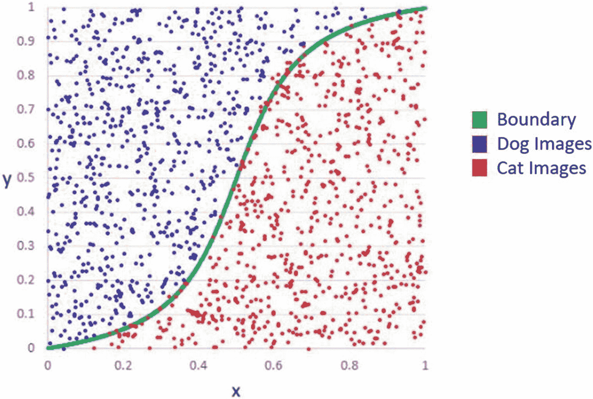

图 1-9

狗图像逻辑回归示例

要使用逻辑回归，我们网络的输出需要以概率或 0 到 1 之间的数值形式呈现。这意味着在执行分类时，最后一层的激活函数通常是 `sigmoid` 或类似函数。在此基础上，我们针对两个类别应用 `BinaryCrossEntropy`，或针对多个类别应用 `CrossEntropy` 损失。

对于单个输出，以下损失方程展示了确定单个类别损失的函数：

```
L = -y * log(y_pred)
```

其中：

- `y` = 标签值

- `y_pred` = 预测值

方程中间的圆点符号表示内积。要了解这对多个类别是如何工作的，我们首先需要理解在下一节中深度学习是如何对类别进行编码的。

### 独热编码

为了使交叉熵损失函数能够工作，我们需要将我们的类别编码成一种称为*独热编码*的形式。独热编码是指将一个类别值转换为一个与类别数量相同大小的数组，其中该类别值在其对应位置上表示为 1，而所有其他值均为 0。

图 1-10 展示了我们如何对 MNIST 数据集中的几个示例数字进行独热编码。对于每张图像，其类别都被独热编码，其中 1 代表该类别的索引位置。

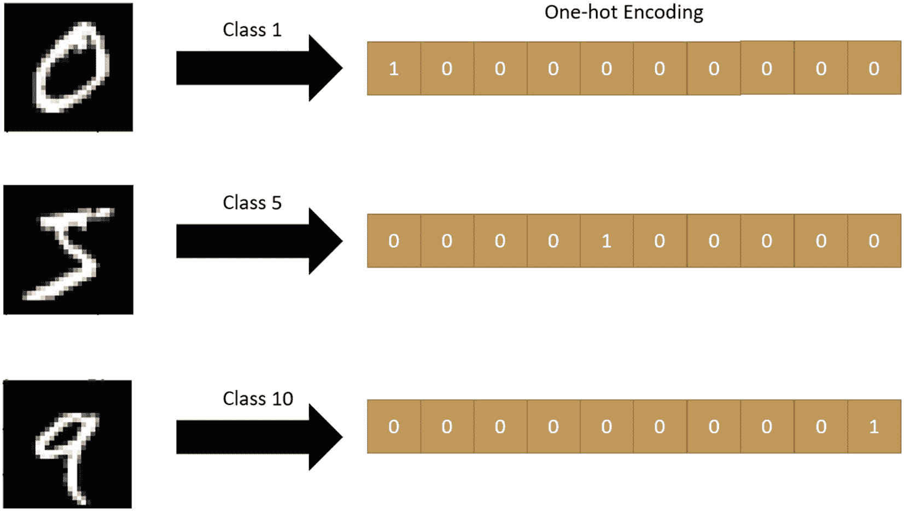

图 1-10

对 MNIST 数字进行独热编码

在分类场景中，我们随后将网络的输出缩减，以匹配独热编码的类别向量。这些向量会应用交叉熵损失方程。例如，考虑一个网络，它接收了一张来自类别 2 的图像，该类别被独热编码为 `[0,0,1,0,0,0,0,0,0,0]`。其输出或 `y_pred` 值最终可能类似于 `[.2,.3,.6,.4,.1,.8,.1,.1,.1,.1]`。这反过来会预测类别为 6，因为最大值 0.8 位于第六个位置。

使用交叉熵损失时，每个错误分类的值的损失应为 0，并且缺失分类的损失也会被计入。因此，每个输出神经元的误差都被考虑在内，并且每个神经元的损失都会通过网络反向传播。我们将在下一节中了解这是如何工作的。

## 对 MNIST 手写数字进行分类

在深度学习中，有几个标准的入门数据集，我们既可以从中学习，也可以用来测试新方法。随着深度学习的成熟，这些入门或测试数据集也变得更加复杂，但我们仍然可以使用一些经典标准来学习。

在接下来的练习中，我们将使用 MNIST 手写数字数据集，通过多层网络执行分类任务。每个数字是一张 28×28 像素的图像，这代表了我们网络的 784 个输入。由于有 10 个数字类别，我们的输出层也将输出到 10 个神经元。我们将在练习 1-5 中看到这是如何构建的。

### 练习 1-5. 使用 PyTorch 对 MNIST 进行分类

1.  从项目的 GitHub 站点打开 `GEN_1_classify_pytorch.ipynb` 笔记本。如果你不确定如何访问源代码，请查看附录 B。

2.  在这个示例中，我们将使用 `torchvision.datasets` 模块来加载 MNIST 数据集，因此导入语句会略有不同。

    ```python
    import os
    import torch
    import torch.nn as nn
    from torch.autograd import Variable
    import torchvision.datasets as dset
    import torchvision.transforms as transforms
    import torch.nn.functional as F
    import torch.optim as optim
    ```

3.  下一段代码将在根目录下设置一个数据文件夹并创建它。接下来的几行代码会将数据集下载到此文件夹。在此之前，我们使用 `transforms` 对象创建一个张量变换来转换数据。我们需要这样做，因为数据表示为值在 0-255 之间的灰度字节。变换代码将这些数据归一化到 0 和 1 之间的值。

    ```python
    root = './data'
    if not os.path.exists(root):
        os.mkdir(root)
    trans = transforms.Compose([transforms.ToTensor(),
                                transforms.Normalize((0.5,), (1.0,))])
    train_set = dset.MNIST(root=root, train=True,
                           transform=trans, download=True)
    test_set = dset.MNIST(root=root, train=False,
                          transform=trans, download=True)
    print(train_set)
    print(test_set)
    ```

4.  向下移动，下一个代码块使用 `DataLoader` 类创建数据批次。`DataLoader` 对数据进行批处理，以便更高效地提供给网络，并提供打乱数据的选项。在这个代码块中，我们创建了两个加载器，一个用于训练，另一个用于测试。

    ```python
    batch_size = 128
    train_loader = torch.utils.data.DataLoader(
        dataset=train_set,
        batch_size=batch_size,
        shuffle=True)
    test_loader = torch.utils.data.DataLoader(
        dataset=test_set,
        batch_size=batch_size,
        shuffle=False)
    print(len(train_loader))
    print(len(test_loader))
    ```

5.  下一步是创建一个新的 MLP 模型。该网络将接收一个 28×28 像素的数字作为输入，并将其传递到 500 个神经元，然后从 500 个传递到 256 个，最终传递到 10 个。请记住，10 个神经元的输出代表数据集中每个类别的一个输出。

    ```python
    class MLP(nn.Module):
        def __init__(self):
            super(MLP, self).__init__()
            self.fc1 = nn.Linear(28*28, 500)
            self.fc2 = nn.Linear(500, 256)
            self.fc3 = nn.Linear(256, 10)
        def forward(self, x):
            x = x.view(-1, 28*28)
            x = torch.relu(self.fc1(x))
            x = torch.relu(self.fc2(x))
            x = torch.sigmoid(self.fc3(x))
            return x
        def name(self):
            return "MLP"
    ```

6.  定义了 `MLP` 模型类后，我们可以实例化该类，并创建优化器和损失函数。注意，损失函数是 `CrossEntropyLoss` 类型，因为这是一个分类问题。

    ```python
    model = MLP()
    optimizer = optim.SGD(model.parameters(), lr=0.01, momentum=0.9)
    loss_fn = nn.CrossEntropyLoss()
    ```

7.  接下来是训练代码块，这与我们之前的几个练习非常相似。在这个示例中，由于我们使用了 `DataLoader`，有一些细微的差别需要注意。

```python
epochs = 10
history=[]
for epoch in range(epochs):
    avg_loss = 0
    for batch_idx, (x, y) in enumerate(train_loader):
        optimizer.zero_grad()
        x, y = Variable(x), Variable(y)
        y_pred = model(x)
        loss = loss_fn(y_pred, y)
        avg_loss = avg_loss * 0.9 + loss.data * 0.1
        history.append(avg_loss)
        loss.backward()
        optimizer.step()
        if (batch_idx+1) % 100 == 0 or (batch_idx+1) == len(train_loader):
            print(f'epoch: {epoch}, batch index:' +
                  f'{batch_idx+1}, train loss: {avg_loss:.6f}')
```

8.  在此阶段，向笔记本添加另一个代码块，并使用之前练习中的代码输出历史记录的图表。

9.  作为另一个扩展练习，你还可以添加代码来测试测试数据集，以查看模型对数据的拟合程度。

除了在测试集上进行验证，我们还可以使用模型对已知数字进行类别预测。这将使我们能够了解模型的表现如何。不过，我们暂时不必担心这些额外的步骤。我们将把这些繁重的工作和更彻底的数据可视化留到第 2 章，届时我们将开始探讨生成式建模的基础。

## 结论

深度学习与神经网络在学术界酝酿了数十年，直到最近，它们的真正力量才得以释放。释放这种力量需要多种因素的协同，例如改进的 GPU 处理能力、大数据和数据科学，以及对机器学习技术日益增长的兴趣。虽然这些因素支撑了深度学习科学的发展，但真正推动 AI 研究人员突破极限、激发想象力的，是生成式建模领域的发现。

在本章中，我们介绍了深度学习及其工作原理，从基本的感知机到 MLP 和深度学习网络。我们学习了如何使用监督学习来训练这些网络，以执行回归和分类任务。在本书的其余部分，我们将深入探讨一种称为*无监督*和/或*自监督学习*的学习形式，以及其他称为*对抗学习*的高级方法。

在下一章中，我们将探索使用自编码器进行无监督学习的基础知识，然后转向使用生成对抗网络进行对抗学习。

脚注 1 2 3