# 2. 释放生成式建模的力量

深度学习曾多年被束之高阁，常被视为伪科学或模糊科学。直到近十年，其爆发式增长才催生了新一波人工智能浪潮。人工智能已从使用监督学习发展到更高级的学习形式，包括无监督学习、自监督学习、对抗学习和强化学习。正是这些其他形式的学习，使得生成式建模领域得以蓬勃发展，并在众多领域取得进步。

深度学习的出现及其带来的创新架构，让我们得以更深入地理解人工智能学习的本质。过去我们难以实现能够自学习的人工智能，但借助深度学习，这已变得轻而易举。此外，各种新颖的学习形式也如雨后春笋般涌现。对抗学习在生成式建模中有着广泛应用，它的诞生反过来又推动了人工智能的爆发。

根据我们最新的定义，生成式建模是指构建一种人工智能或机器学习模型，使其能够利用多种学习方法，学习生成新颖且多样化的内容。这里的关键词是*生成*，切勿与过滤或转换内容相混淆。当我们构建生成模型时，它需要生成全新的内容，有时是完全随机的，但在许多情况下，我们可以有条件地控制内容的生成。

在本章中，我们将释放生成式建模的力量。我们将探索如何构建生成器的基础形式——*自编码器*。接着，我们将学习如何利用卷积从图像数据中更好地提取特征。在此基础上，我们将构建一个添加了卷积层以增强特征提取能力的自编码器。之后，我们将深入对抗学习的基础，探索生成对抗网络（GAN）。最后，我们将通过升级一个基础 GAN，使其使用深度卷积来结束本章。

在本章介绍生成式建模时，我们将探讨从无监督学习到对抗学习和 GAN 等其他学习形式的基础。以下是本章将探讨的主要主题：

-   使用自编码器进行无监督学习
-   使用卷积提取特征
-   卷积自编码器
-   生成对抗网络
-   深度卷积 GAN

在继续之前，请确保您已掌握第 1 章中介绍的关于使用 PyTorch 进行深度学习的所有必要知识。在下一节中，我们将开始探索无监督学习和自编码器。

## 使用自编码器进行无监督学习

监督学习，即带有标签的学习，是数据科学的基础，也是许多机器学习模型的基础。这是一种自然的学习形式，我们自己也经常用它来理解问题空间。当我们或其他动物这样做时，我们称之为*概念学习*。然而，概念学习的概念可能会与其他学习形式（如无监督学习）相融合。

无监督学习是一种自我或自监督学习形式，它允许机器通过理解数据的表示（无需标签）来学习某个概念。通过不使用标签，机器能够学习对象的表示，而不会受到标签偏差的影响。虽然在某些情况下，我们可能会使用标签来控制理解的某些方面，但重要的是要理解，在学习过程中并不使用标签。

为了训练机器/模型在没有标签的情况下学习某物的表示，我们构建了一个能够分解然后重新组合模型的机器。在深度学习中，这个过程被称为*编码*和*解码*，或*自编码*。自编码器是一种能够将数据编码或分解为某种较低级表示形式的机器。然后，它通过解码器从这种较低级形式重建数据。

图 2-1 展示了一个深度学习自编码器。左侧是输入，一个原始的 MNIST 数字被送入编码器。编码器将图像分解为某种潜在或隐藏形式。然后，解码器尽可能地将图像重建回原始状态，这不是通过使用标签，而是通过理解它重建图像的好坏程度。

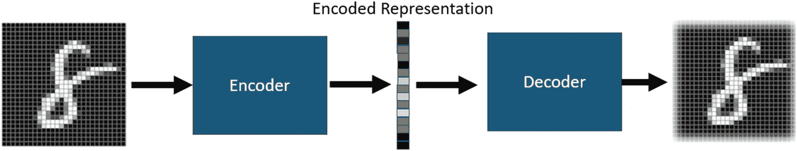

图 2-1

自编码器架构

自编码器通过其重建原始图像的好坏程度来学习和改进其模型。实际上，我们通过比较原始图像和重建图像之间的像素差异来衡量自编码器中的误差或损失。对于深度学习自编码器，我们将编码器和解码器这两个模型堆叠在一起。

在练习 2-1 中，我们将使用 MNIST 时尚数据集与自编码器。该数据集包含十类你可能穿着或携带的服装，从鞋子、靴子和手提包到毛衣、裤子和连衣裙。这些图像也很好地展示了自编码器如何学习重建过程。

练习 2-1. 时尚自编码器

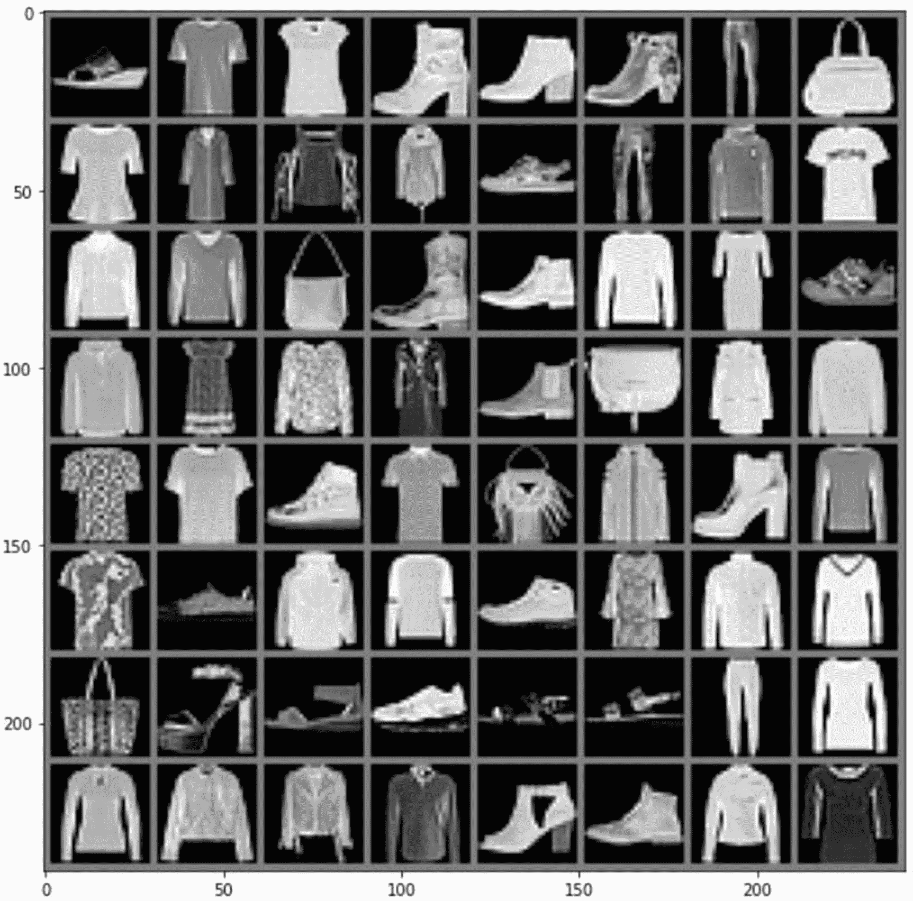

图 2-2

Fashion MNIST 数据集

1.  从项目的 GitHub 站点打开 `GEN_2_autoencoder.ipynb` 笔记本。如果您不确定如何访问源代码，请查看附录 B。

2.  运行第一个导入单元格，然后转到设置一些图像辅助函数的下一个单元格。第一个函数 `imshow` 用于将 PyTorch 张量图像渲染到 Matplotlib 图中。第二个函数 `to_img` 用于将张量转换为适当的大小和维度。

```
def imshow(img,size=10):
    img = img / 2 + 0.5
    npimg = img.numpy()
    plt.figure(figsize=(size, size))
    plt.imshow(np.transpose(npimg, (1, 2, 0)))
    plt.show()

def to_img(x):
    x = x.view(x.size(0), 1, 28, 28)
    return x
```

3.  下一个代码块包含熟悉的超参数：

```
epochs = 100
batch_size = 64
learning_rate = 1e-3
```

4.  下一个代码块下载数据，对其进行转换，并将其分批到 `DataLoader` 中。然后我们从 `DataLoader` 中提取一批图像，并使用图像工具函数 `imshow` 和 `make_grid` 来渲染图 2-2。`make_grid` 函数是 `torchvision.utils` 模块的一部分。


```python
img_transform = transforms.Compose([
    transforms.ToTensor(),
    transforms.Normalize([0.5], [0.5])
])
dataset = mnist('./data', download=True, transform=img_transform)
dataloader = DataLoader(dataset, batch_size=batch_size, shuffle=True)
dataiter = iter(dataloader)
images, labels = dataiter.next()
imshow(make_grid(images, nrow=8))
```

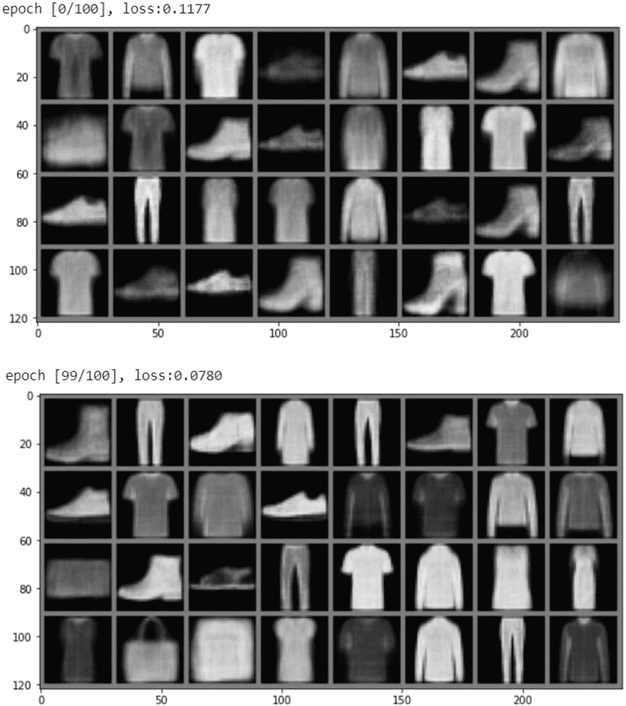

**图 2-3** 训练自编码器

1.  接下来，我们为自编码器创建一个类。在这个类中，我们构建两个模型：编码器和解码器。编码器将输入数据从大小为 784（28×28）的向量缩减到 128 个输入神经元，然后进一步缩减到 64、12，最后输出一个大小为 3 的向量。解码器接收来自编码器的大小为 3 的向量作为输入，然后将其逐步扩展至 12、64、128，最终输出 784 个值，解码器的完整输出应与输入图像匹配。在 `forward` 或预测函数中，我们可以看到编码器模型接收图像、对其进行编码，然后将输出传递给解码器，由解码器重建图像。

```python
class Autoencoder(nn.Module):
    def __init__(self):
        super(Autoencoder, self).__init__()
        self.encoder = nn.Sequential(
            nn.Linear(28 * 28, 128),
            nn.ReLU(True),
            nn.Linear(128, 64),
            nn.ReLU(True), nn.Linear(64, 12), nn.ReLU(True), nn.Linear(12, 3))
        self.decoder = nn.Sequential(
            nn.Linear(3, 12),
            nn.ReLU(True),
            nn.Linear(12, 64),
            nn.ReLU(True),
            nn.Linear(64, 128),
            nn.ReLU(True), nn.Linear(128, 28 * 28), nn.Tanh())

    def forward(self, x):
        x = self.encoder(x)
        x = self.decoder(x)
        return x
```

2.  在下一个单元格中，我们实例化模型，并构建损失函数和优化器。

```python
model = Autoencoder()
loss_fn = nn.MSELoss()
optimizer = torch.optim.Adam(
    model.parameters(), lr=learning_rate, weight_decay=1e-5)
```

3.  现在我们可以进入训练代码部分，所有神奇的事情都发生在这里。我们再次看到熟悉的双重循环，遍历 epochs 和数据。在循环内部，我们可以看到数据从 `dataloader` 中提取，但忽略了标签。我们将图像包装起来并输入模型，以输出 `y_pred` 或解码后的输出。然后，我们计算图像中每个像素的 MSE 损失。像素值的差异即为损失，我们将其反向传播到网络。其余代码重置梯度，然后将损失通过网络反向传播。

```python
for epoch in range(epochs):
    for data in dataloader:
        x_img, _ = data
        x_img = x_img.view(x_img.size(0), -1)
        x_img = Variable(x_img)
        # ===================forward=====================
        y_pred = model(x_img)
        loss = loss_fn(y_pred, x_img)
        # ===================backward====================
        optimizer.zero_grad()
        loss.backward()
        optimizer.step()
        # ===================log========================
        clear_output()
        print(f'epoch [{epoch}/{epochs}], loss:{loss.data:.4f}')
        pic = to_img(y_pred.cpu().data)
        imshow(make_grid(pic))
```

4.  当你运行训练代码单元格时，你会看到模型如何随时间逐步改进。图 2-3 展示了第一个训练周期与最后一个训练周期之间的差异。

至此，我们拥有了一个自编码器，它可以将某件衣物的图像编码为大小为 3 的向量表示。这种图像的潜在或隐藏表示也可以称为*编码*或*嵌入*。我们可以利用这种学习到的编码来表示使图像独一无二的特征，而最棒的是，机器可以自行学习这些特征。在第 3 章中，我们将探讨更多可视化这些编码的方法。

我们当前的重点是理解如何将图像分解为更低维的表示，然后通过无监督学习进行重建。也就是说，我们从未对图像进行标注，模型完全是通过理解图像的重建过程来学习的。这是一个极其强大的概念，我们在整个深度学习过程中都会用到它。

学习编码和解码数据的过程可以降低数据的维度，从而理解自然语言处理中单词之间的相似性。这一过程也已扩展到使用 Transformer 进行机器翻译和文本生成。自编码器通常是展示如何结合多种网络架构来解决某些任务的第一个示例。

尽管我们通过目前使用的网络取得了一些不错的结果，但我们还需要发现网络层的新改进，以便从数据中提取特征。在下一节中，我们将学习如何使用卷积滤波器从图像和其他数据中提取特征。


## 使用卷积提取特征

直到 2012 年，利用神经网络进行图像分析的方法，都是将图像展平为一维向量。我们在处理 MNIST 手写数字和 Fashion 数据集时已经多次这样做过。在这些案例中，我们将 28×28 像素的图像数据展平为包含 784 个像素的一维向量。图 2-4 展示了深度学习中将图像展平的过程。

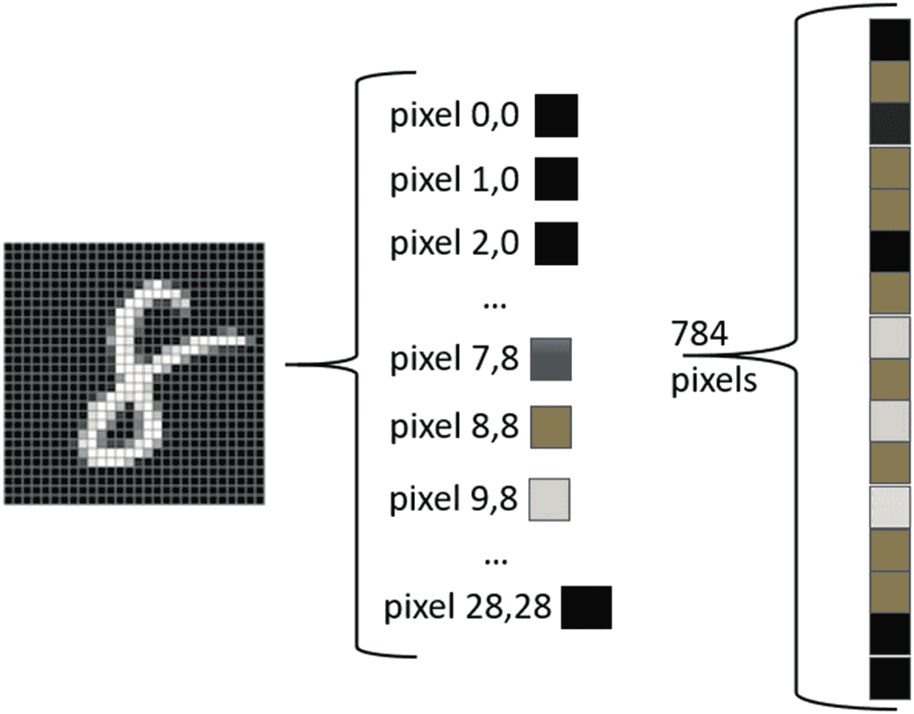

**图 2-4** 将图像展平为一维向量

在图 2-4 中，我们可以看到 28×28 像素的 MNIST 数字是如何被展平成一个单层的。这个单层输入随后被送入神经网络。由此，我们的网络能够较好地分类或重建表示，但并非完美。事实上，图像越复杂，这项任务就越困难。这也是深度学习的一个主要局限，因为它常常会遗漏明显的图像特征。

这一切在 2012 年发生了改变，当时由杰弗里·辛顿领导的一个团队以巨大优势赢得了 ImageNet 挑战赛。ImageNet 是一个包含 150 万张图像、涵盖 1000 个类别的带标签分类数据集。该挑战的目标是比其它模型更好地对这个数据集进行分类。辛顿的团队使用了一种新型网络，称为*卷积神经网络*（CNN）。

CNN 深度学习系统描述了一种网络层类型，它能够通过一种称为*卷积滤波*的过程，从数据中提取相似或相近的特征。在卷积滤波中，一个具有一定尺寸的补丁或核会在图像上滑动。当核在图像上移动时，它会使用一组训练好的权重来缩放图像的数值，作为一种滤波过程。

图 2-5 展示了卷积滤波过程。在图中，我们可以看到核补丁在图像上滑动。当滤波器在图像上滑动时，它会将核的权重与图像的像素值相乘。这起到了对图像进行滤波的效果。滤波后的输出显示在下一张图中。在这个例子中，该滤波器可能类似于一个边缘检测滤波器。

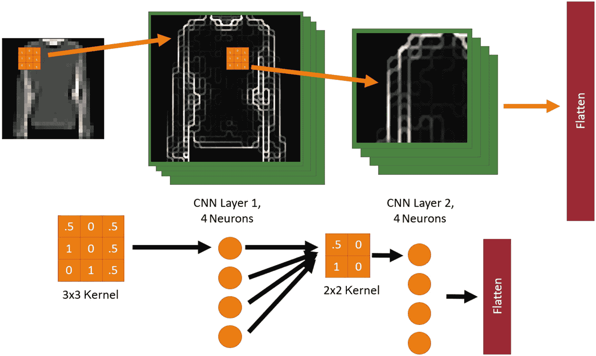

**图 2-5** 卷积滤波过程

在图 2-5 的底部，你可以看到一个带有权重的单一核滤波器，它就像一个网络层中的单个神经元/感知器，其中神经元中的每个权重都是核中的一个值。在图中，我们还可以看到如何依次应用连续的卷积层。这起到了从已提取的特征中进一步过滤提取特征的效果。

这种使用卷积层进行的连续滤波过程，能够识别图像中的关键特征，比如狗的耳朵或猫的眼睛。在图像或其他数据的所有特征都被提取之后，数据会再次被展平并送入线性网络层。

在练习 2-2 中，我们将重新审视练习 1-5，并探索使用 CNN 层会带来的差异。我们将添加几个二维卷积层用于图像特征提取。由此，我们可以与之前的练习进行比较，并直观感受特征提取能在多大程度上提升性能。

### 练习 2-2. 用于分类的卷积网络

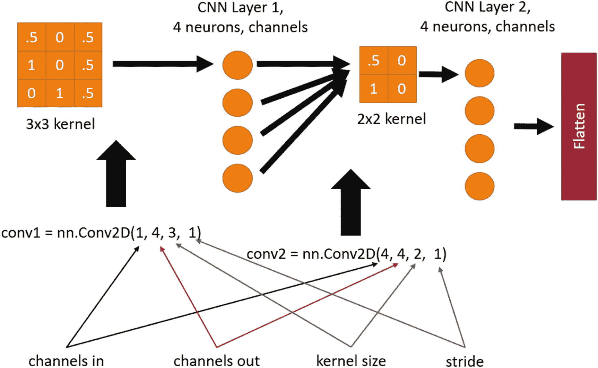

**图 2-6** PyTorch CNN 层配置

1. 从项目的 GitHub 站点打开 `GEN_2_classify_cnn.ipynb` 笔记本。如果不确定如何访问源代码，请查看附录 B。

2. 同时打开 `GEN_1_classify_pytorch.ipynb`。我们想要进行并排比较。

3. 除了神经网络模型之外，两个笔记本的代码几乎完全相同。因此，我们可以省略对大部分代码的审查。

4. 通过选择菜单“运行时” ➤ “全部运行”来运行两个笔记本。在审查练习的其余部分时，请保持两个笔记本都在运行。

5. 向下滚动到 CNN 笔记本中的 `ConvNet` 类并研究代码。在这个类的 `init` 函数内部，你会看到两个卷积层（`conv1` 和 `conv2`）、两个丢弃层（`dropout1` 和 `dropout2`）以及两个线性层（`fc1` 和 `fc2`）的实例化。然后我们在前向函数中看到这些层是如何连接起来的。同时注意丢弃层和线性层的位置。

```
class ConvNet(nn.Module):
    def __init__(self):
        super(ConvNet, self).__init__()
        self.conv1 = nn.Conv2d(1, 32, 3, 1)
        self.conv2 = nn.Conv2d(32, 64, 3, 1)
        self.dropout1 = nn.Dropout2d(0.25)
        self.dropout2 = nn.Dropout2d(0.5)
        self.fc1 = nn.Linear(9216, 128)
        self.fc2 = nn.Linear(128, 10)

    def forward(self, x):
        x = self.conv1(x)
        x = F.relu(x)
        x = self.conv2(x)
        x = F.relu(x)
        x = F.max_pool2d(x, 2)
        x = self.dropout1(x)
        x = torch.flatten(x, 1)
        x = self.fc1(x)
        x = F.relu(x)
        x = self.dropout2(x)
        x = self.fc2(x)
        output = F.log_softmax(x, dim=1)
        return output
```

6. 注意输入是如何定义到 `Conv2D` 层的。图 2-6 展示了 `Conv2D` 的每个输入是如何为该层配置和定义的。CNN 层消耗数据通道，通常像 MNIST 这样的黑白或灰度图像只有一个通道。对于彩色图像，我们会将图像分解为红、绿、蓝三个颜色通道，并带有各自的颜色值。我们稍后会进一步探讨通道。

7. 回头再看 `ConvNet` 类的代码，注意输入是一个单通道，它提取出 32 个输出通道。这被送入第二个 `Conv2D` 层，该层有 32 个输入通道和 64 个输出通道。这最后一个卷积层的输出，在展平后为第一个线性层创建了 9216 个输入。然后第二个线性层用 128 个神经元处理这些输入，并输出 10 个类别。

让两个示例都运行完成，你会注意到两件事。第一，我们之前的练习运行得快得多；第二，使用卷积后的结果要好十倍。卷积需要更多的参数，因此也需要更长的训练时间。通过使用 CUDA 或 GPU，可以显著减少这些训练时间。在后面的章节中，我们将在适用的情况下使用 GPU 处理。

在上一个练习中，我们还使用了一个名为 `Dropout` 的新层。丢弃层是一种特殊的层，它会在每次训练迭代中随机关闭一定百分比的神经元。被关闭的随机神经元数量在实例化时设置，通常为 0.2 到 0.5，即 20%到 50%。通过在每次训练过程中关闭随机神经元，网络被迫变得更加泛化，而不是特化。如果我们诊断网络过拟合或记忆数据点，丢弃层是我们首选的补救措施。（在第 1 章中，我们讨论了过拟合和欠拟合。）

图 2-7 展示了来自 TensorSpace.js Playground（网址为[`https://tensorspace.org/html/playground`](https://tensorspace.org/html/playground)）的可视化效果。这是一个极好的资源，可以用来观察和理解卷积及深度学习层的工作原理。

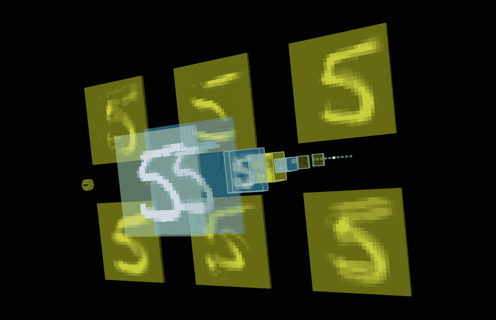

**图 2-7** TensorSpace.js Playground

卷积层可以帮助我们进行分类，同时在进行生成式建模时也能带来额外的好处。然而，当我们使用卷积生成内容时，必须应用与滤波相反的操作，称为*转置*。我们将在下一节中介绍如何在自编码器中使用带有转置的 CNN。


## 卷积自编码器

卷积不仅能帮助我们识别图像中的特征，还能反过来帮助我们生成特征。在之前的自编码器练习中，你可以清晰地看到图像是如何基于逐像素表示构建起来的。

请再次查看图 2-3，你会看到图像或特征周围存在模糊的轮廓；这是我们应用的生成类型的典型特征。毕竟，我们在第一个自编码器中所做的只是逐像素比较，因此我们最多只能期望得到像素值的平均值，这反过来导致了图像中的模糊区域。

为了提取并生成特征，我们将升级上次使用的普通自编码器，使其能够处理卷积操作。作为进一步的演示，我们还将把基础数据集升级为 CIFAR10。CIFAR 数据集由 28×28 的彩色图像组成，分为十个类别，从飞机到猫狗等。

图 2-8 展示了 CIFAR10 数据集中的一些示例图像及其对应的标签，该图由我们接下来的练习生成。在练习 2-3 中，我们将升级普通自编码器，使其使用卷积来提取和学习如何生成特征。

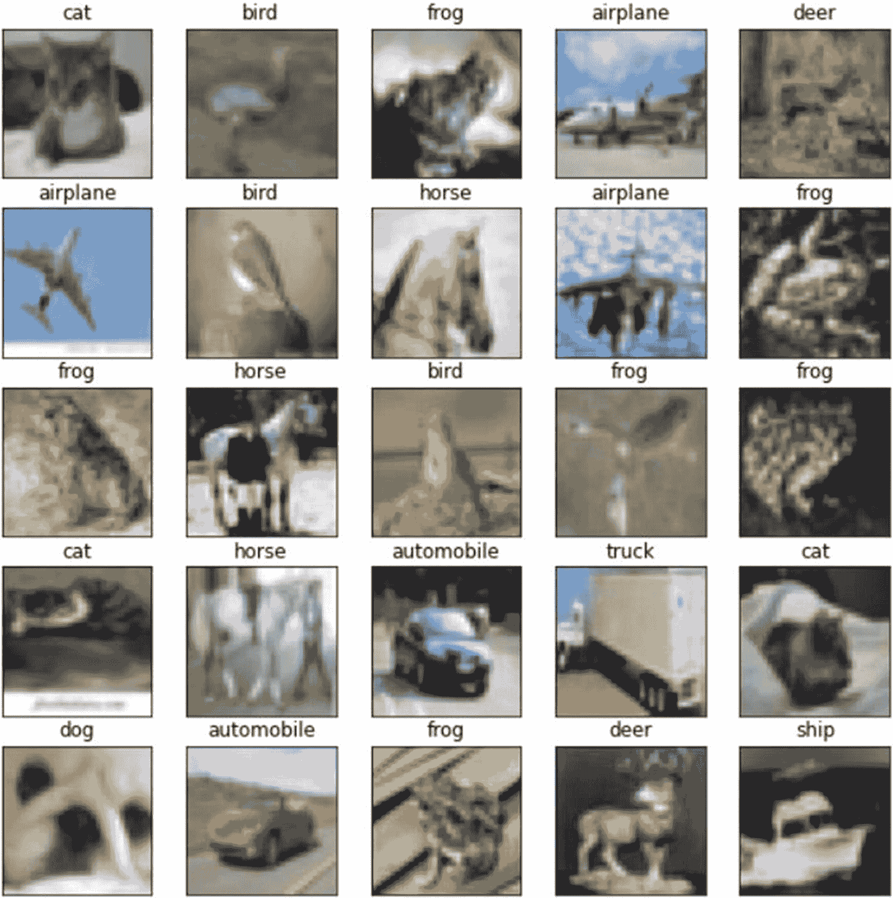

图 2-8

CIFAR10 数据集中的示例图像

### 练习 2-3. 在 CIFAR10 上实现卷积自编码器

1.  从项目的 GitHub 站点打开 `GEN_2_conv_autoencoder.ipynb` 笔记本。从菜单中选择“运行时” ➤ “全部运行”来运行整个工作表。如果不确定如何访问源代码，请查看附录 B。

2.  查看导入部分的顶部单元格，然后转到加载数据的单元格。在本练习中，我们从 `torchvision` 模块中拉取 CIFAR10 数据集。请注意，这里我们仅使用默认的张量进行数据转换。

```
    transform = transforms.ToTensor()
    train_data = datasets.CIFAR10(root='data', train=True,
    download=True, transform=transform)
    test_data = datasets.CIFAR10(root='data', train=False,
    download=True, transform=transform)
```

3.  接下来，我们设置超参数，并为测试集和训练集实例化 `DataLoader`。

```
    batch_size = 64
    epochs = 100
    learning_rate = 1e-3
    train_loader = torch.utils.data.DataLoader(train_data,
    batch_size=batch_size, shuffle=True)
    test_loader = torch.utils.data.DataLoader(test_data,
    batch_size=batch_size, shuffle=True)
```

4.  从这里开始，我们再次创建一些用于渲染图像集的图像显示函数。我们还为标签提供了文本，以便我们能够标记数据集图像。函数 `plot_images` 用于渲染一个带有标签的图像网格。在该函数的底部，有一些定时代码，这些代码需要在笔记本中用于训练期间的渲染。这些代码不会影响渲染，只是暂停训练代码足够长的时间，以便将图像输出到笔记本。

```
    def imshow(img):
    plt.imshow(np.transpose(img, (1, 2, 0)))  # 从张量图像转换
    # 指定图像类别
    classes = ['airplane', 'automobile', 'bird', 'cat', 'deer',
    'dog', 'frog', 'horse', 'ship', 'truck']
    def plot_images(images, labels, no):
    rows = int(math.sqrt(no))
    plt.ion()
    fig = plt.figure(figsize=(rows*2, rows*2))
    for idx in np.arange(no):
    ax = fig.add_subplot(rows, no/rows, idx+1, xticks=[], yticks=[])
    imshow(images[idx])
    ax.set_title(classes[labels[idx]])
    time.sleep(0.1)
    plt.pause(0.0001)
```

5.  创建好辅助函数后，我们可以使用以下代码生成图 2-8：

```
    dataiter = iter(train_loader)
    images, labels = dataiter.next()
    images = images.numpy() # 将图像转换为 numpy 以便显示
    plot_images(images,labels,25)
```

6.  接下来是 `ConvAutoencoder` 类，它是对我们之前 `Autoencoder` 的升级。在这个类中，我们可以看到线性层已被替换为 `Conv2d` 层。我们还可以看到新增了一种名为 `MaxPool2d` 或池化层的层类型。池化层用于收集相似特征，是网络训练中的一种效率提升手段。在解码器模型中，我们可以看到使用了 `ConvTranspose2d` 层。卷积转置层是卷积的逆操作，它们不是提取特征，而是生成学习到的特征。在解码器中，你可以看到两个 `ConvTranspose2d` 层，其输出连接到一个 sigmoid 激活函数。

```
    class ConvAutoencoder(nn.Module):
    def __init__(self):
    super(ConvAutoencoder, self).__init__()
    self.encoder = nn.Sequential(
    nn.Conv2d(3, 16, 3, padding=1),
    nn.ReLU(True),
    nn.MaxPool2d(2, 2),
    nn.Conv2d(16, 4, 3, padding=1),
    nn.ReLU(True),
    nn.MaxPool2d(2, 2)
    )
    self.decoder = nn.Sequential(
    nn.ConvTranspose2d(4, 16, 2, stride=2),
    nn.ReLU(True),
    nn.ConvTranspose2d(16, 3, 2, stride=2),
    nn.Sigmoid()
    )
    def forward(self, x):
    x = self.encoder(x)
    x = self.decoder(x)
    return x
    model = ConvAutoencoder()
    print(model)
```

7.  在训练之前，我们需要使用以下代码创建损失函数和优化器：

```
    loss_fn = nn.MSELoss()
    optimizer = torch.optim.Adam(model.parameters(), lr=learning_rate)
```

8.  最后，我们可以转到最后一个单元格 `training`。这段代码与我们之前的自编码器练习相同，但这里展示出来以供回顾：

```
    for epoch in range(epochs):
    train_loss = 0.0
    for data in train_loader:
    images, labels = data
    optimizer.zero_grad()
    generated = model(images)
    loss = loss_fn(generated, images)
    loss.backward()
    optimizer.step()
    train_loss += loss.item()*images.size(0)
    train_loss = train_loss/len(train_loader)
    clear_output()
    print(f'Epoch: {epoch+1} Training Loss: {train_loss:.3f}')
    plot_images(generated.detach(),labels,16)
```

随着代码的运行，你将看到类似图 2-9 的输出。图 2-9 展示了 `ConvAutoencoder` 的训练过程。请注意，现在的图像看起来更加块状而非模糊，图像更像是可识别特征的集合，而不是模糊的轮廓。由于输入图像的大小限制，我们在本练习中应用卷积的效果受到一定限制。在后面的章节和练习中，我们将看到 CNN 层的各种配置。

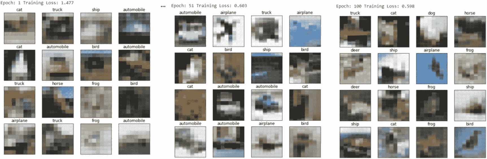

图 2-9

在 CIFAR10 上训练卷积自编码器

你可以看到，我们可能会接近卷积所能处理的细节极限，这更多与局部特征提取有关。局部特征提取限制了层只能以块为单位提取特征。在后面的章节中，我们将研究其他可以缓解此类问题的方法。

自编码器使用一种称为*无监督*的学习形式，因为模型不依赖图像标签来重建或再生图像。然而，模型仍然需要一个图像作为样本来进行编码和解码。接下来我们要探索的是，如何通过对抗学习从随机潜在空间中生成图像。


## 生成对抗网络

生成对抗网络出现的时间并不长。GAN 与自编码器类似，都包含两个模型，但 GAN 使用的是判别器和生成器，而非编码器和解码器。

图 2-10 展示了 GAN 的架构。我们常用一个比喻来描述 GAN 的过程：艺术品鉴定师与艺术品伪造者之间的互动。在这个场景中，艺术品伪造者致力于创作出足以乱真的赝品，让鉴定师误以为真。艺术品鉴定师通过观察真品来学习辨别真伪。而伪造者则通过不断创作艺术品，并让鉴定师检验，从而提升自己的技艺。

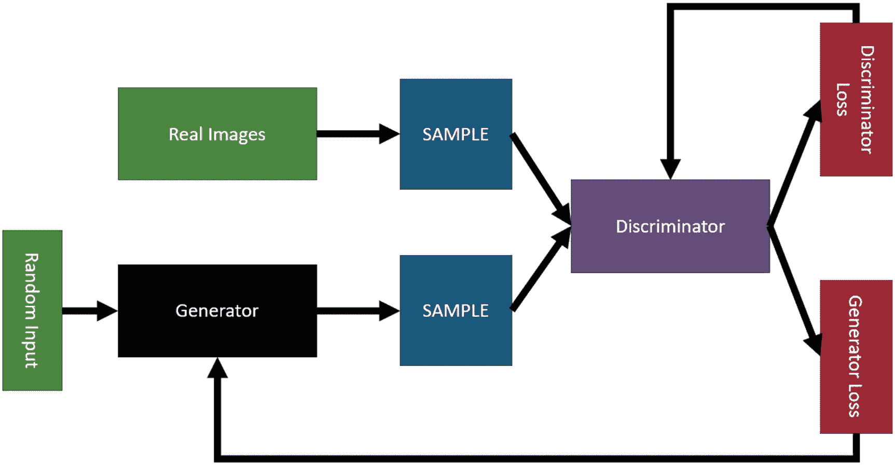

图 2-10

GAN 架构

在 GAN 中，艺术品伪造者就是生成器。生成器从一个我们定义为`Z`的随机潜在空间中生成图像或艺术品。图像生成后，会被展示给鉴定师（即判别器）。判别器通过观察真实图像样本以及生成器生成的假图像来学习。

判别器通过分析真实图像和假图像来确定损失。如果它认为一张真实图像是假的，就会向自身输出较高的损失。同样，如果生成器将一张假图像成功冒充为真，那么它就会向判别器返回较高的损失，而向自身（生成器）返回较低的损失。两个模型协同学习，各自在生成图像或判断图像真伪方面不断提升。

虽然 GAN 的架构看似过于复杂，但它实际上只是将自编码器的架构拆分开并反转过来：生成器相当于解码器，而判别器则类似于编码器。因此，判别器就像编码器，但它的输出不是编码，而是“真”或“假”。另一方面，生成器接收一个看似毫无意义的随机潜在数据空间，并学习创建新的图像，这些图像能够被判别器误认为是真实的。

在练习 2-4 中，我们将构建一个基础版（vanilla）GAN。通过这种基础形式的 GAN，我们将学习如何生成 MNIST 手写数据集中的数字。我们不会构建一个 GAN 类，而是为生成器和判别器分别创建两个类，并编写代码对它们进行独立训练。

### 练习 2-4. 构建基础版 GAN

1.  从项目的 GitHub 站点打开`GEN_2_vanilla_gan.ipynb`笔记本。从菜单中选择“运行时” ➤ “全部运行”来运行整个工作表。

2.  跳过工作表顶部的`imports`和`imshow`辅助函数，我们进入数据加载和转换代码。到目前为止，所有这些代码应该都是复习内容。

```
    transform = transforms.Compose([
    transforms.ToTensor(),
    transforms.Normalize((0.5,),(0.5,))
    ])
    to_image = transforms.ToPILImage()
    trainset = MNIST(root='./data/', train=True, download=True, transform=transform)
    train_loader = DataLoader(trainset, batch_size=100, shuffle=True)
    device = 'cuda'
```

3.  接下来，我们进入`Generator`类。生成器扮演的角色与自编码器中的解码器相同。生成器的关键区别在于其输入只是随机噪声。你可以将这些随机噪声想象成随机的思维向量。除此之外，代码与我们之前见过的解码器非常相似。这个随机向量的大小由输入中的`latent_dim`定义。你可能还会注意到使用了新的激活函数`LeakyReLU`。这个函数允许一定量的负值通过，而不是将值在 0 处截断。对于前向/预测函数，你可以看到输出被重塑为图像的`1,28,28`张量。

```
    class Generator(nn.Module):
    def __init__(self, latent_dim=128, output_dim=784):
    super(Generator, self).__init__()
    self.latent_dim = latent_dim
    self.output_dim = output_dim
    self.generator = nn.Sequential(
    nn.Linear(self.latent_dim, 256),
    nn.LeakyReLU(0.2),
    nn.Linear(256, 512),
    nn.LeakyReLU(0.2),
    nn.Linear(512, 1024),
    nn.LeakyReLU(0.2),
    nn.Linear(1024, self.output_dim),
    nn.Tanh()
    )
    def forward(self, x):
    x = self.generator(x)
    x = x.view(-1, 1, 28, 28)
    return x
```

4.  之后是判别器，它类似于自编码器中的编码器，区别在于输出只有两个类别：真或假。在前向/预测函数中，输入从 28×28 的图像重塑为大小为 784 的输入向量。除此之外，模型的架构类似于典型的分类器，而它本身也确实是一个分类器。事实上，一个训练有素的判别器在 GAN 之外的其他应用中，也能出色地用于将数据分类为真或假，例如，根据输入给 GAN 的数据，判断某个输入图像是否属于特定类型。因此，你可以用人脸数据训练一个判别器，它就能学会识别人脸的真伪。

```
    class Discriminator(nn.Module):
    def __init__(self, input_dim=784, output_dim=1):
    super(Discriminator, self).__init__()
    self.input_dim = input_dim
    self.output_dim = output_dim
    self.discriminator = nn.Sequential(
    nn.Linear(self.input_dim, 1024),
    nn.LeakyReLU(0.2),
    nn.Dropout(0.3),
    nn.Linear(1024, 512),
    nn.LeakyReLU(0.2),
    nn.Dropout(0.3),
    nn.Linear(512, 256),
    nn.LeakyReLU(0.2),
    nn.Dropout(0.3),
    nn.Linear(256, self.output_dim),
    nn.Sigmoid()
    )
    def forward(self, x):
    x = x.view(-1, 784)
    x = self.discriminator(x)
    return x
```

5.  构建好类之后，我们可以继续实例化它们，这次使用 GPU（`cuda`）支持以获得更高的训练性能。此外，我们还将创建优化器和损失函数。

```
    generator = Generator()
    discriminator = Discriminator()
    generator.to(device)
    discriminator.to(device)
    g_optim = optim.Adam(generator.parameters(), lr=2e-4)
    d_optim = optim.Adam(discriminator.parameters(), lr=2e-4)
    g_losses = []
    d_losses = []
    loss_fn = nn.BCELoss()
```

6.  我们还需要创建一些辅助函数。第一个函数`noise`生成我们输入到生成器中的随机噪声。第二个函数`make_ones`是一个辅助函数，用于将批次标记为真实（用 1 表示）。第三个函数`make_zeros`则相反，将图像批次标记为假（用 0 表示）。

```
    def noise(n, n_features=128):
    return Variable(torch.randn(n, n_features)).to(device)
    def make_ones(size):
    data = Variable(torch.ones(size, 1))
    return data.to(device)
    def make_zeros(size):
    data = Variable(torch.zeros(size, 1))
    return data.to(device)
```

7.  然后我们添加一个额外的辅助函数来训练判别器。回想一下，判别器是在真实图像和生成器生成的假图像上共同训练的。注意，我们将真实数据传入判别器，并用它来预测真实损失`loss_real`。然后，该损失通过判别器进行反向传播。之后，我们测试一组假图像，并将该损失反向传播到网络。最后，我们返回两个损失的总和。你还应该注意到使用了`make_ones`和`make_zeros`函数来将数据标记为真实（`1`）或虚假（`0`）。


```python
def train_discriminator(optimizer, real_data, fake_data):
    n = real_data.size(0)
    optimizer.zero_grad()
    prediction_real = discriminator(real_data)
    loss_real = loss_fn(prediction_real, make_ones(n))
    loss_real.backward()
    prediction_fake = discriminator(fake_data)
    loss_fake = loss_fn(prediction_fake, make_zeros(n))
    loss_fake.backward()
    optimizer.step()
    return loss_real + loss_fake
```

8.  我们还创建了一个辅助函数来训练生成器。在第二个训练函数中，我们只需将假/生成的图像传入判别器以评估损失。注意，这里使用了辅助函数 `make_ones` 将数据标记为真实数据。

```python
def train_generator(optimizer, fake_data):
    n = fake_data.size(0)
    optimizer.zero_grad()
    prediction = discriminator(fake_data)
    loss = loss_fn(prediction, make_ones(n))
    loss.backward()
    optimizer.step()
    return loss
```

9.  最后，我们来看训练代码，这与我们之前见过的略有不同。由于我们构建了两个辅助函数来独立训练生成器和判别器，这段代码会循环遍历并调用这些*函数*。注意，这里增加了一个由 `k` 限制的内部训练循环。这个内部循环可用于增加每个周期内训练判别器的迭代次数。我们可能希望或需要这样做，以更好地平衡训练。最好让 GAN 中的两个模型以相同的速率学习。

```python
epochs = 250
k = 1
test_noise = noise(64)
generator.train()
discriminator.train()
for epoch in range(epochs):
    g_loss = 0.0
    d_loss = 0.0
    for i, data in enumerate(train_loader):
        imgs, _ = data
        n = len(imgs)
        for j in range(k):
            fake_data = generator(noise(n)).detach()
            real_data = imgs.to(device)
            d_loss += train_discriminator(d_optim, real_data, fake_data)
        fake_data = generator(noise(n))
        g_loss += train_generator(g_optim, fake_data)
    img = generator(test_noise).cpu().detach()
    g_losses.append(g_loss/i)
    d_losses.append(d_loss/i)
    clear_output()
    print(f'Epoch {epoch+1}: g_loss: {g_loss/i:.8f} d_loss: {d_loss/i:.8f}')
    imshow(make_grid(img))
```

图 2-11 展示了训练开始时、大约第 150 个周期以及最终第 250 个周期时的输出生成情况。当你运行练习时，也会看到输出随时间更新。注意，图像一开始非常粗糙且随机，但随着训练进行，它们变得清晰可辨，如同手写数字。

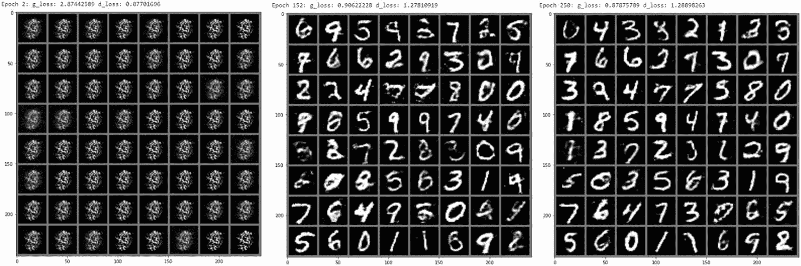

**图 2-11** 在 MNIST 上训练 GAN

理解 GAN 的另一个关键区别在于，图像完全是由随机噪声生成的。请记住，我们生成器的输入只是随机噪声。随着时间的推移，生成器学会了将这些噪声转换为逼真的数字。请记住，这些数字并非绘制而成，而是从无到有生成的。

一旦掌握了 GAN 的基础知识，你就能开始理解它生成任何内容的潜力。事实上，GAN 的应用和变体数量正与日俱增。在下一节中，我们将探讨对原始 GAN 的初步改进。

## 深度卷积生成对抗网络

深度卷积生成对抗网络（DCGAN）通过添加卷积层，是对原始 GAN 的初步改进。就像我们之前在自编码器中添加卷积一样，架构的变化几乎完全相同。这意味着编码器/判别器将进行卷积并提取特征，而解码器/生成器将进行转置卷积以构建特征。

DCGAN 在训练方面与其他特征几乎相同，唯一的例外是我们可能会改变随机噪声的输入大小。我们可以使用相同的代码基础，并在下一个练习中将其升级为 DCGAN。通过这次升级，我们还需要增加输入图像的尺寸。更大的图像允许进行更多的卷积应用，从而提取更多特征。

在练习 2-5 中，我们有三个真实训练数据集选项可供判别器使用。我们理想的数据集是 CelebA 数据集，这是一个名人面孔的集合。然而，CelebA 是一个繁忙的数据集，并不总是能够下载到。因此，我们还提供了其他几个选项，例如 CIFAR10 和 STL10。STL10 数据集与 CIFAR 相同，但图像尺寸更大。

**练习 2-5. 使用 DCGAN 生成人脸**

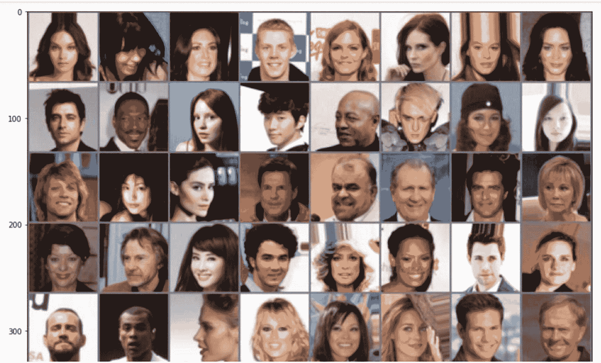

**图 2-12** CelebA 样本人脸

1.  从项目的 GitHub 站点打开 `GEN_2_DCGAN.ipynb` 笔记本。从菜单中选择“运行” ➤ “全部运行”以运行整个工作表。

2.  导入部分与上一个练习几乎相同，只有一个关键区别。我们将数据集导入抽象为 `DS`，以便我们可以轻松地在 CelebA、CIFAR10 或 STL10 之间切换数据源。如果你想使用不同的数据集，请更改导入的数据集。

```python
from torchvision.datasets import CelebA as DS  #其他选项 CIFAR10, STL10
```

3.  下一个主要变化是我们应用于输入数据集的变换。对于此数据的导入，我们将数据变换为此版本的 `image_size`（`64`）。然后我们使用 `CenterCrop` 裁剪图像，最后对其进行归一化。

```python
transform=transforms.Compose([
    transforms.Resize(image_size),
    transforms.CenterCrop(image_size),
    transforms.ToTensor(),
    transforms.Normalize((0.5, 0.5, 0.5), (0.5, 0.5, 0.5)),
])
```

4.  图 2-12 展示了数据加载输出的摘录，以及真实图像的输出。

5.  接下来，我们来看更新后的 `Generator` 类。我们可以看到输入已更新，包含了一个名为 `feature_maps` 的新输入。`feature_maps` 输入设置了我们在卷积层之间传递的通道数。你可以将此数字视为一个超参数，用于在其他数据集上进行调优。此外，还新增了一种名为 `BatchNorm2d` 的层类型。这种新层会在数据通过时对其进行重新归一化，这是一种限制损失梯度过大或过小的方法。

随着网络层数加深，损失梯度变得过小或过大的可能性会更高。这被称为*梯度消失*或*梯度爆炸*。通过在数据通过网络时对其进行归一化，我们可以将权重参数保持在接近零的值，从而避免梯度消失/爆炸。这样做的一个额外好处是提高了训练性能。


```python
class Generator(nn.Module):
    def __init__(self, latent_dim=100, feature_maps=64, channels=3):
        super(Generator, self).__init__()
        self.main = nn.Sequential(
            nn.ConvTranspose2d(latent_dim, feature_maps * 8, 4, 1, 0, bias=False),
            nn.BatchNorm2d(feature_maps * 8),
            nn.ReLU(True),
            nn.ConvTranspose2d(feature_maps * 8, feature_maps * 4, 4, 2, 1, bias=False),
            nn.BatchNorm2d(feature_maps * 4),
            nn.ReLU(True),
            nn.ConvTranspose2d(feature_maps * 4, feature_maps * 2, 4, 2, 1, bias=False),
            nn.BatchNorm2d(feature_maps * 2),
            nn.ReLU(True),
            nn.ConvTranspose2d(feature_maps * 2, feature_maps, 4, 2, 1, bias=False),
            nn.BatchNorm2d(feature_maps),
            nn.ReLU(True),
            nn.ConvTranspose2d(feature_maps, channels, 4, 2, 1, bias=False),
            nn.Tanh()
        )

    def forward(self, input):
        return self.main(input)
```

1.  从生成器出发，我们可以继续讨论更新后的判别器。在很大程度上，这将类似于我们之前练习中构建的分类器和编码器。请注意，在这个示例中，判别器更深且拥有更多层，我们之所以能做到这一点，是因为基础图像的尺寸是 64×64。输入网络的基础图像越大，我们就能使用越多的卷积层来提取特征。

```python
class Discriminator(nn.Module):
    def __init__(self, feature_maps=64, channels=3):
        super(Discriminator, self).__init__()
        self.main = nn.Sequential(
            nn.Conv2d(channels, feature_maps, 4, 2, 1, bias=False),
            nn.LeakyReLU(0.2, inplace=True),
            nn.Conv2d(feature_maps, feature_maps * 2, 4, 2, 1, bias=False),
            nn.BatchNorm2d(feature_maps * 2),
            nn.LeakyReLU(0.2, inplace=True),
            nn.Conv2d(feature_maps * 2, feature_maps * 4, 4, 2, 1, bias=False),
            nn.BatchNorm2d(feature_maps * 4),
            nn.LeakyReLU(0.2, inplace=True),
            nn.Conv2d(feature_maps * 4, feature_maps * 8, 4, 2, 1, bias=False),
            nn.BatchNorm2d(feature_maps * 8),
            nn.LeakyReLU(0.2, inplace=True),
            nn.Conv2d(feature_maps * 8, 1, 4, 1, 0, bias=False),
            nn.Sigmoid()
        )

    def forward(self, input):
        return self.main(input)
```

2.  其余代码与原始 GAN 的代码几乎相同，只有一个细微差别。在 DCGAN 中，我们使用一种略有不同的方法来构建输入噪声，如下所示：

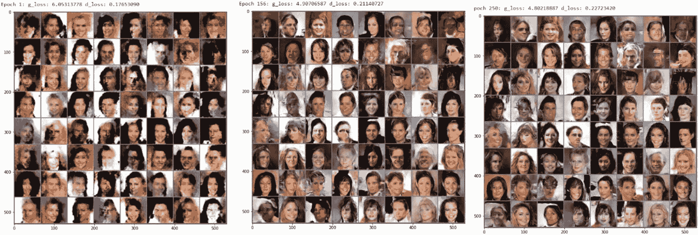

**图 2-13** DCGAN 的训练过程

3.  图 2-13 展示了 DCGAN 在人脸数据集上训练时的输出。你可能还会在训练代码中注意到，我们通过一个名为 `num_sumples` 的新超参数来限制批次或采样的数量。这个超参数控制着从 `train_loader` 中抽取多少个样本批次。样本越多，训练效果越好。然而，更多的样本也意味着训练速度会慢得多。因此，你可能需要调整这个参数以获得最佳结果。

```python
noise = torch.randn(n, latent_dim, 1, 1, device=device)
```

4.  请随意返回并更改 DS 数据集，将其替换为 CIFAR10 或 STL10，以观察不同的结果。结果比你预期的更好还是更差？它们能骗过你吗？

DCGAN 可能需要数千个 epoch 才能生成 100% 令人信服的图像。在 250 个 epoch 的阶段，你应该能够挑选出一些确实像真实人脸照片的生成图像。请务必注意 DCGAN 的训练方式，并观察输出中的差异。

除了建议的三个数据集之外，你还可以尝试任何其他真实图像来源来训练 DCGAN。你只需要确保 `DataLoader` 能够加载训练所需的图像数据，从而让你能够在任何其他三通道图像源上训练 DCGAN。

DCGAN 是我们将要研究的第一个 GAN 变体。它通过一个简单的架构变化，使我们能够更好地处理和生成图像。我们将在后续章节中研究的其他 GAN 变体，可能会在架构和方法上有所差异，从而对 GAN 进行改进。

## 结论

在本章中，我们研究了使用自编码器和 GAN 进行的一阶生成建模。我们学习了如何调整监督学习方法，以使用像 GAN 这样的无监督方法。编码器将内容编码到某个潜在隐藏空间，而 GAN 则从空/随机隐藏空间创建内容。这使得我们可以利用各种真实基础图像进行各种内容生成。

理想情况下，我们希望以某种方式控制随机输入，从而控制 GAN 生成的内容。如果我们能够学会控制生成器用于输出特定类型图像的随机想法，我们就能控制生成这些类型的图像。

在下一章中，我们将研究控制生成器的隐藏输入空间，以通过属性改变输出。这将使我们能够控制生成的是戴眼镜还是不戴眼镜的女性或男性面孔。

