# 3. 探索潜在空间

当你看到自编码器或生成对抗网络的结果时，很容易被人工智能和机器学习的神秘感所吸引。这些深度学习系统的结果可能看起来神奇，甚至显示出真正智能的迹象。不幸的是，事实远非如此，甚至挑战了我们对智能的认知。

随着我们对人工智能知识的进步，我们常常会提高系统展示智能的门槛。深度学习是许多人现在视为数学过程（机器学习）而非真正人工智能的系统之一。在本书中，我们不会争论深度学习是人工智能还是仅仅是机器学习。相反，我们将专注于理解深度学习的数学为何重要。

为了构建有效的生成器，我们需要理解深度学习系统不过是极好的函数求解器。虽然这可能会削弱它们的一些神秘感，但它将使我们能够理解如何操纵生成器为我们服务。

在本章中，我们将更深入地研究深度学习系统是如何学习的，以及它们究竟在学习什么。然后，我们将进一步理解变异性，以及深度学习如何学习数据的变异性。接着，我们利用这些知识构建一个变分自编码器（VAE）。然后，我们学习如何探索变异性来调整 VAE 生成器。扩展这些知识，我们将继续构建和理解条件 GAN（CGAN）。最后，我们使用 CGAN 来生成食物图片。

本章内容涵盖广泛，从一些数学理论到更复杂的示例。以下是本章将涵盖的主要主题的快速概览：

*   理解深度学习学习的内容
*   构建变分自编码器
*   使用 VAE 学习分布
*   变异性与探索潜在空间

建议你在阅读本章之前，先复习第 1 章和第 2 章的内容。复习概率统计和微积分的数学概念也可能对你有所帮助。不必觉得自己需要精通微积分，只需理解基本概念即可。在下一节中，我们将更深入地研究深度学习的数学原理。


## 理解深度学习的学习内容

深度学习的数学绝非易事，并且在许多方面，它曾是这项技术数十年间难以逾越的主要障碍。直到自动微分技术出现，深度学习才真正得以发展。在此之前，人们需要花费数小时来为最简单的网络调整数学计算。即使是我们前几章学过的那些最简单的网络，也可能需要数天甚至数周才能把数学逻辑理清。

如今，借助自动微分以及像 `PyTorch` 或 `TensorFlow` 这样的框架，我们可以在几分钟内构建出强大的网络。更重要的是，我们可以更快地教授和赋能人们使用深度学习。你不再需要博士学位就能训练网络，事实上，就连小学生进行深度学习实验也已是司空见惯。

不幸的是，好事总伴随着坏事。自动微分让我们可以将深度学习系统视为一个黑盒。这意味着我们可能缺乏对网络学习方式的微妙理解，从而可能忽略系统中明显的问题，更糟的是，可能会因为缺乏理解而长期挣扎于解决某些问题。

幸运的是，理解深度学习系统学习方式的数学原理可以大大简化。虽然向一个五岁孩子解释这些概念可能很困难，但任何能看懂图表和简单方程的人，很可能都能理解下一节中的概念。

### 深度学习函数逼近

理解深度学习作用的关键在于，要明白网络只是一个优秀的函数逼近器。事实上，简单来说，这就是深度学习系统所做的全部事情。它们只是很好地逼近已知或未知的函数。当我们思考神经网络如何进行分类时，这可能会有点令人困惑，所以让我们来看一个例子。

考虑图 3-1，它使用一个名为*逻辑回归*的函数将猫和狗的图片分为两组。在图中，我们可以看到代表函数输出的边界线。在这条函数线的一侧是猫的图片，另一侧是狗的图片。这将是一个学习未知函数的深度学习网络的例子。我们知道存在一个函数可以从视觉和数学上定义猫和狗之间的分类；只是我们不知道它具体是什么。

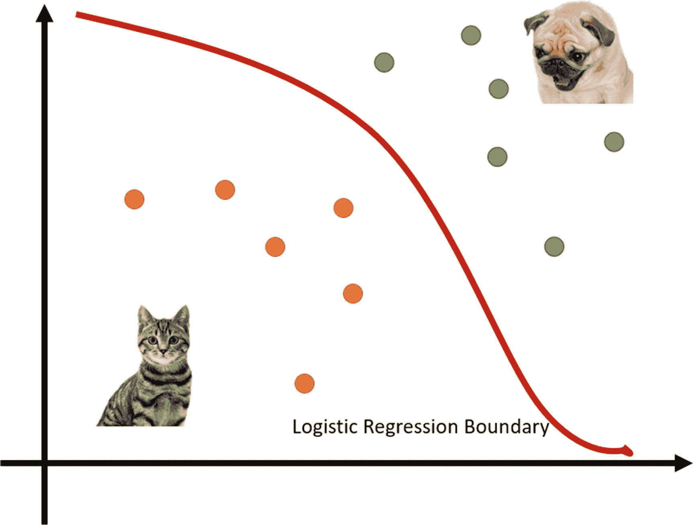

图 3-1 对猫和狗进行分类的逻辑回归

当一个网络学习对图像进行分类时，它学习的是将事物划分到不同类别的逻辑或一组逻辑回归函数。虽然我们知道存在一组函数定义了这些类别的边界，但在大多数情况下，我们并不关心具体的函数。相反，通过训练和学习，我们的深度学习系统会自行学习或逼近这个函数。

为了演示网络如何进行函数逼近，我们将进入另一个代码示例。练习 3-1 借鉴了之前的一个回归示例，我们不再使用数据，而是定义一个已知函数。使用已知函数将确切地展示我们的网络是如何学习的。

**练习 3-1. 深度学习函数逼近**

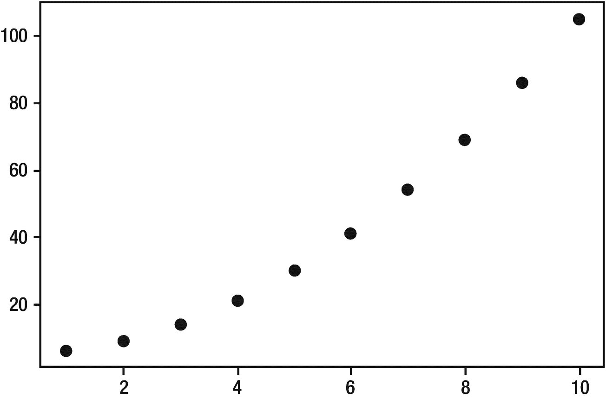

图 3-2 方程值的绘制输出

1. 从 GitHub 项目站点打开 `GEN_3_function_approx.ipynb` 笔记本。如果不确定如何操作，请查阅附录 B。

2. 通过选择 **运行时** ➤ **全部运行** 来运行整个笔记本。然后查看顶部的单元格，这些单元格定义了一个我们将要逼近的简单函数：

```
def function(X):
    return X * X + 5.
X = np.array([[1.],[2.],[3.],[4.],[5.],[6.],[7.],[8.],[9.],[10.]])
y = function(X)
inputs = X.shape[1]
y = y.reshape(-1, 1)
plt.plot(X, y, 'o', color='black')
```

3. 函数 `function` 定义了一个抛物线方程，我们将在此方程上训练我们的网络。在下一个单元格中，你可以看到我们如何设置硬编码的 `X` 输入值 1–10，并用它们来定义我们的学习输出 `y`。注意我们如何简单地将输入集 `X` 输入到函数中，以输出我们的标签或学习值，这些值被标记为 `y`。

4. 图 3-2 显示了使用一组样本输入（1–10）绘制的方程输出。这就是我们希望网络学习逼近的方程。

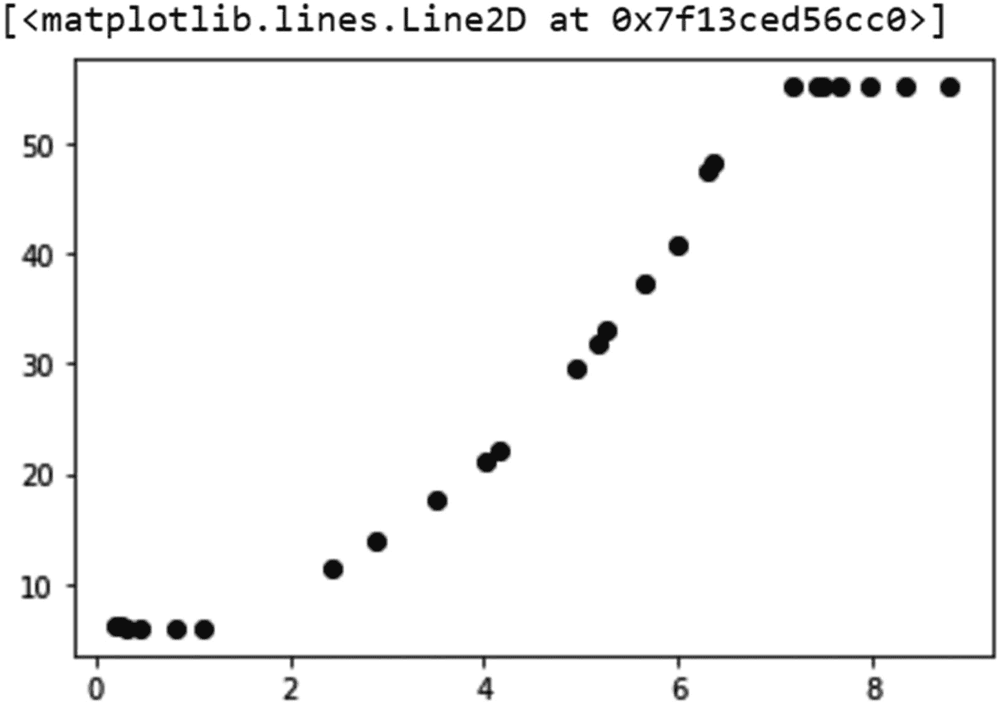

图 3-3 训练网络测试结果的绘制输出

5. 我们已经在之前的章节中回顾了剩余的大部分代码。现在我们的重点是识别细微的差异。注意我们仍然使用以下代码将输入数据拆分为训练集和测试集：

```
X_train, X_test, y_train, y_test = train_test_split(X, y, test_size=0.2, random_state=0)
num_train = X_train.shape[0]
X_train[:2], y_train[:2]
num_train
```

6. 只有 10 个输入点，将数据分别拆分为 8 个和 2 个点似乎是一个愚蠢的步骤。然而，即使在调整已知函数时，这也有助于验证我们的结果，所以我们仍然喜欢进行验证/测试拆分。

7. 这个笔记本中唯一其他的变化是我们在最后使用以下代码进行的另一个验证步骤：

```
X_a = torch.rand(25,1).clone() * 9
y_a = net(X_a)
y_a = y_a.detach().numpy()
plt.plot(X_a, y_a, 'o', color='black')
```

8. 这段代码使用 `torch.rand` 创建了 25 个随机值。由于这些值在 0–1 之间，我们将输出乘以 9，将值缩放到 0–9 之间。然后我们将这些值 `X_a` 输入到网络 `net` 中，并绘制出如图 3-3 所示的输出。

9. 注意在图 3-3 中，网络在逼近我们已知函数的中间值时表现得非常出色。然而，你可以看到网络在底部（接近 `X` 为 0 处）和顶部端点处表现不佳。你可以看到网络在逼近边界时遇到了更大的困难。但它仍然很好地匹配了函数的中间值。

我们刚刚演示了一个简单的网络如何学习逼近一个函数。然而，我们确实注意到网络在逼近边界时仍然存在困难，我们需要理解其中的原因。

部分问题在于我们用于训练网络的数据量有限。毕竟，我们只用了 10 个点。然而，与端点处的情况相比，通过中心点的函数逼近效果非常好。那么，这是为什么呢？

简单来说，一个深度学习系统可以在已知数据范围或方程极限内，很好地逼近一个已知或未知的方程。在我们上一个例子中，我们使用了 0–10 的数据值，边界为 0 和 10。然而，从图 3-3 中我们看到，函数逼近在输入 `X` 大约为 7 时开始失效。同样，在下边界，当 `X`<1 时，我们也能看到问题。

造成这些不一致的原因不在于数据，也不在于数据的极限，而在于微积分本身。还记得我们在第 2 章中关于使用微积分进行自动微分的讨论吗？现在的问题不在于微分的“自动”部分，而在于微分本身。

微积分帮助我们理解方程或函数的变化率。这对于从发射宇宙飞船到建造更好的建筑，当然也包括深度学习，都非常有用。理解为什么使用微积分来逼近深度学习中的函数也很重要，这将在下一节中介绍。


#### 微积分的局限性

如果你学过微积分，就会了解它的局限性。其中之一是，我们用微积分进行求导的所有函数都必须是连续的。图 3-4 展示了一些带有所谓*不连续点*区域的函数示例。这些区域中的函数会阻碍深度学习系统学习或逼近该函数。

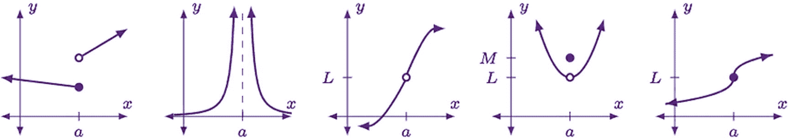

图 3-4

不连续函数的示例

在生成式建模中，你可以将不连续点视为数据中的间隙或真空。但不要将这里的“间隙”与空间或距离混淆。我们在此使用术语*间隙*，指的是函数中没有任何样本值的断裂处。而术语*空间*、*潜在空间*或*隐藏空间*则用于定义连续数据集中的未知区域。

通常，当我们在生成的输出中看到黑色区域时，这表示输入数据存在极限或不连续性问题。

理解连续数据与不连续数据之间的区别需要一些时间，有时这种区别可能并不明显。这里的关键要点是，函数逼近存在局限性，而这些局限性通常由数据本身决定，有时需要网络在不连续的数据上逼近一个连续函数。

现在，回到极限问题，让我们了解极限如何影响网络学习或逼近数据。在我们的练习示例中，网络的极限是 1 和 10。如果参考图 3-3，我们可以看到当 `X`<1 时，函数变得平坦，考虑到极限为 1，这是合理的。这意味着当 `X` 小于 0 时，我们的网络将函数逼近限制为 `y`=5。

然而，不太明显的是，为什么当极限为 10 时，我们的函数逼近在大于 7 的值上会失败。要理解这个问题出现的原因，我们需要了解深度学习如何利用微积分来逼近函数，这将在下一节中介绍。

#### 深度学习爬山法

任何深奥的数学概念核心，总有一个直观的解释来说明其“为什么”。不幸的是，大多数经典数学课程常常忽略了“为什么”的解释。相反，它们依赖于学生通过进行证明或死记硬背方程来自己发现其中的直觉。这对崭露头角的数学家来说效果很好，但往往会压垮其他人。因此，我们将始终更关注数学的“为什么”，而不是具体的“怎么做”。

微积分是我们在深度学习系统中用来平衡网络权重/参数的工具。回想一下，微积分通过理解系统的变化率来工作。在深度学习中，微积分使我们能够确定需要调整网络权重的变化量以及调整的位置。

微积分和梯度优化或梯度下降并不是我们用来寻找网络权重的唯一工具。它目前是最有效的，但深度学习系统已经并将继续使用其他机器学习方法。如果你有兴趣了解更多，可以搜索 *深度学习 PSO* 或 *深度学习 GA*。

图 3-4 展示了一个一维函数，其中有一个小球位于位置 1。我们可以将深度学习系统的目标视为引导这个球在函数上移动。更进一步，我们希望这个球能够尽可能紧密地跟随该函数。球能够跟随函数路径的效果越好，我们的网络预测或生成内容的效果就越好。

请注意，在图 3-4 中，我们移动球的量是通过自动微分和我们的优化方法计算得出的，再乘以学习率（`alpha`）。这在图中被标记为“梯度 X alpha”。梯度的量可以通过选择不同的优化方法和/或调整超参数来改变。调整优化器，无论是随机梯度下降还是 Adam，都是我们稍后会涉及的内容。

这就引出了 *alpha*，即学习率或学习参数。这个超参数允许我们控制网络在将球映射到函数时使用的调整程度。在图 3-5 和我们之前的例子中，我们应用了较高的学习率。正如你所见，这通过球移动到位置 2 然后到位置 3 的运动来体现。注意球在第三个位置是如何远高于函数线的。这就是导致我们前一个例子中出现问题的原因。

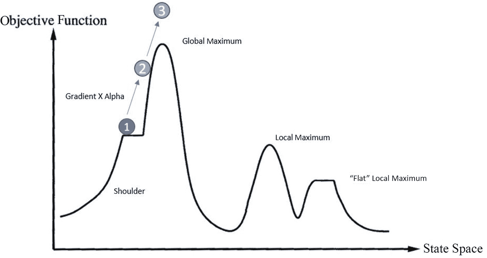

图 3-5

深度学习爬山法

在图 3-6 中，我们可以看到降低学习率如何使网络更好地逼近函数路径。你可以看到，随着边界的加入，让球保持在边界内也变得至关重要。当球弹跳到最大边界之外时，其值会被限制在最大值。这就是图 3-3 中最大值映射不佳的原因。

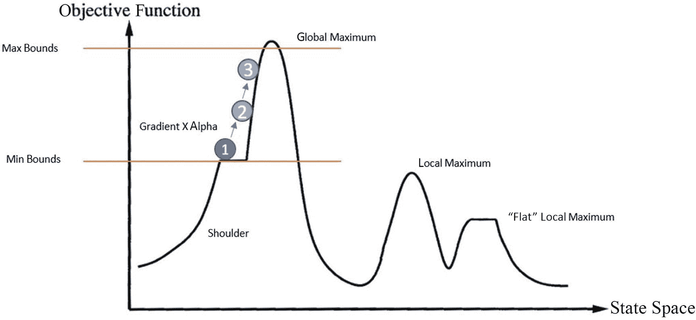

图 3-6

调整学习率

从中得出的主要结论是，在映射函数时，学习率通常是我们最敏感的超参数。学习率，即 *alpha*，几乎总是你为网络调整和理解的首要参数。`Alpha` 也是调整网络训练速度的关键。当 `alpha` 过大时，网络会超出函数范围。相反，将 `alpha` 保持得非常小可以让球很好地学习函数。然而，这可能会以巨大的计算性能为代价。


## 学习率与过拟合/欠拟合

考虑一个学习率为`.001`的情况，与值为`.00001`的情况进行比较。假设我们可以用较小的学习率在 10 分钟内训练一个网络。较小的学习率（小 100 倍）由于训练迭代次数的增加，很可能需要 100 倍的时间，将训练时间增加到 10 × 100 = 1000 分钟，即超过 16 小时。这一切都源于一个更小但不幸的是效率更低的学习率。

为了进一步演示这一关键概念，让我们看另一个例子。练习 3-2 展示了我们将如何调整`alpha`（学习率）以更好地逼近上一个练习中的函数。

### 练习 3-2：调整学习率以实现高效学习

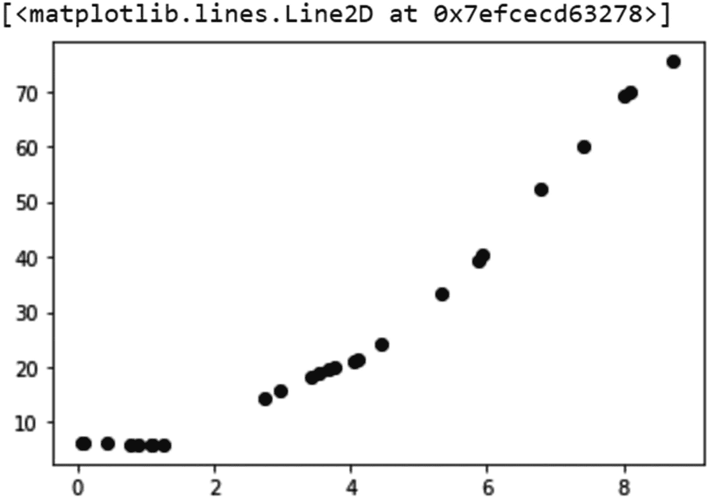

**图 3-7** 对函数`x2 + 5`的更好逼近？

1.  从 GitHub 项目站点打开`GEN_3_learning_rate.ipynb`笔记本。如果不确定如何操作，请查阅附录 B。
2.  通过选择“Runtime ➤ Run all”运行整个笔记本。注意，在定义优化器的地方（如下代码所示），我们设置了学习率`lr`。

    ```
    loss_fn = nn.MSELoss()
    optimizer = torch.optim.Adam(net.parameters(), lr = .001)
    ```

3.  在我们之前的`GEN_3_function_approx.ipynb`示例中，学习率是`.025`，这个值刚好能够正确映射函数。
4.  我们的目标是找到能让网络 100%或接近 100%映射函数的学习率。
5.  更改前面代码块中的学习率`lr`，然后通过选择“Runtime ➤ Run all”重新运行整个笔记本。
6.  看看你是否能调整`lr`值以匹配或逼近图 3-7。如果你将学习率设置得非常小会发生什么？
7.  如果你的网络在找到函数之前就完成了训练，这可以通过增加`epoch`数量轻松解决。将`num_epochs`改为更大的值，看看结果如何。

    ```
    num_epochs = 8000
    y_train_t = torch.from_numpy(y_train).clone().reshape(-1, 1)
    ```

8.  尝试找到能够训练网络匹配函数`x2 + 5`的最小`epoch`数量和最大学习率。
9.  如果你觉得更有挑战性，可以尝试改变每一层的神经元数量或改变网络本身。

当你完成上一个练习时，可能已经意识到网络本身和数据可能存在局限性。事实上，这正是练习中的情况。在这个特定示例中，网络试图过拟合数据。我们将在下一节中探讨如何解决过拟合和欠拟合问题。

### 过拟合与欠拟合

通常，当新手设计网络时，他们的第一个假设是神经元越多意味着结果越好。不幸的是，由于我们将在后续章节中理解的多种原因，情况很少如此。现在，我们想关注网络规模本身如何导致对函数的过拟合或欠拟合。

你可能经常听到深度学习从业者提到他们的网络对数据过拟合或欠拟合。他们真正的意思是网络对匹配或分类该数据的函数过拟合或欠拟合。

图 3-8 展示了我们之前的示例与函数`x2 + 5`的对比图，以查看我们实际匹配结果的程度。如你所见，我们匹配得并不好——事实上，考虑到我们网络的规模，匹配得相当差。然而，网络规模并非全部问题所在。网络规模和数据量几乎是相辅相成的。

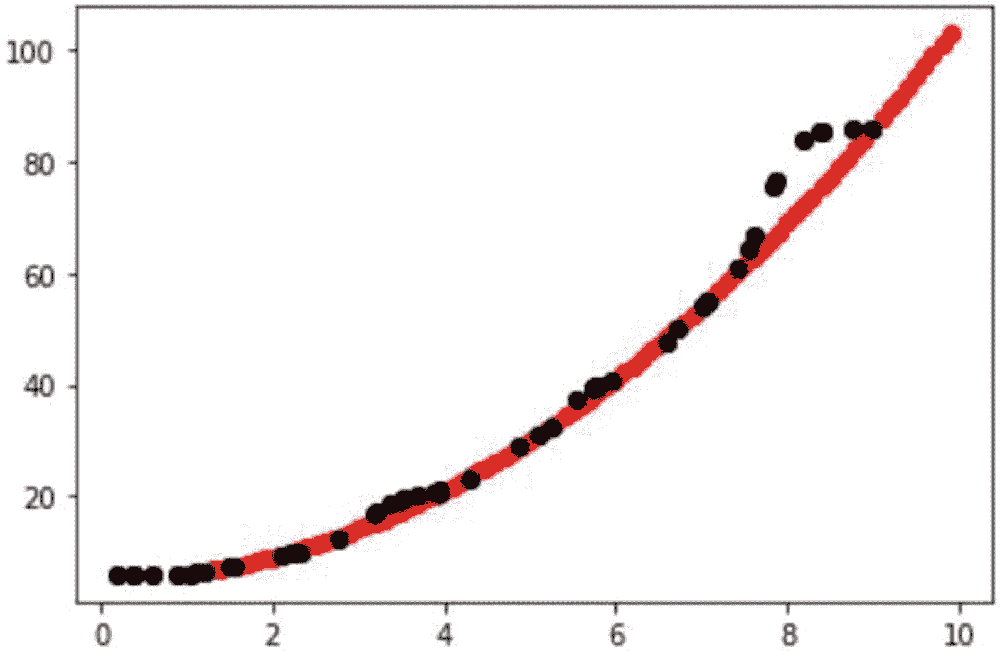

**图 3-8** 训练模型与真实函数`x2 + 5`的对比图

回想一下我们之前的练习以及我们逼近函数`x2 + 5`的尝试。最初几次尝试使用了从 1 到 10 的一组固定数量的数据点。我们将这些数据点输入函数以生成`y`输出。这生成了我们的可训练数据集，然后我们将其拆分为训练集和测试集。

图 3-9 展示了我们为训练和逼近函数而生成的 10 个数据点的图。在这些点中，我们移除了 20%（即 2 个点）用于测试。这减少了数据集中的点数，实质上缩小了训练数据之间的空间大小。

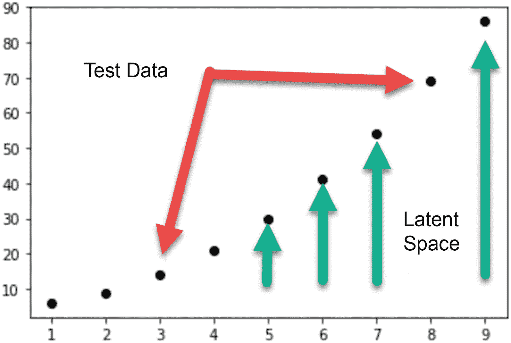

**图 3-9** 练习 3-1 和练习 3-2 中输入数据集的图

这意味着当我们的模型逼近函数`x2 + 5`时，数据之间存在大片区域。我们将这些区域称为*潜在空间*或*隐藏空间*。再次强调，这不应与数据中的间隙、鸿沟或真空混淆。数据中的这种隐藏空间代表了函数中缺少任何实际训练数据的区域。这意味着网络必须在这些数据点之间逼近值。

事实证明，生成建模的一个重要部分是理解如何从这种潜在空间中提取结果，正如我们将在本书中看到的那样。这与我们之前尝试从函数逼近练习中提取结果的方式并无不同。我们之前的假设可能是减少训练点的数量，但现在我们可以看到，这增加了潜在空间的大小，导致模型对函数过拟合。

当模型逼近一个函数但错误地填充或逼近潜在空间时，就会发生过拟合。在我们之前的函数逼近示例中，情况显然如此，这是由两个问题造成的。第一个问题是数据不足，导致网络估计了大面积的潜在空间。第二个问题是网络规模过大，拥有过强的能力来估计数据中的空间。因此，它基本上是在编造值，这可能成为一个问题。

当网络规模很大时，它拥有很大的能力，在这种情况下是过大的能力。大型网络可以记忆各种形式的数据，包括图像或视频。这对于针对特定数据的网络可能有用，但在生成建模以及大多数其他机器学习学科中，我们的目标始终是泛化。

泛化始终是我们构建模型时要追求的目标。这意味着我们输入模型的数据需要分布良好。分布良好的数据为我们提供了数据之间均匀的潜在空间。在我们之前的示例中，数据被分布到 10 个区间中，值从 1 到 10。然而，正如我们所看到的，我们的数据分布得不够好。


## 泛化与过拟合、欠拟合

泛化也意味着我们的网络应该只保持所需的大小，不多也不少。如果网络过大，它往往会过拟合，或用不正确的值填充潜在空间。同样，过小的网络会导致欠拟合。欠拟合通常是模型中潜在空间或间隙过大的结果。

图 3-10 展示了使用线性模型或近似直线来拟合`x² + 5`函数的经典欠拟合示例。此例中的欠拟合是由于模型复杂度不足造成的。然而，当网络没有获得足够的数据，或数据分布不均匀时，也可能发生欠拟合。

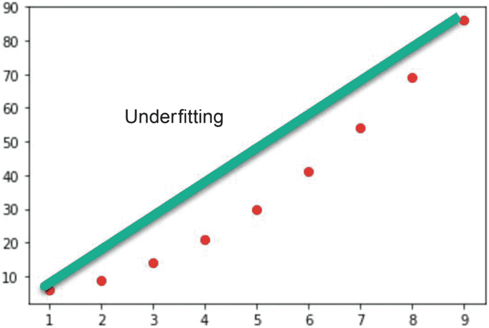

**图 3-10**  
线性模型试图拟合`x² + 5`函数

为了具体理解这一点，我们的下一个练习将专注于如何创建对一组函数数据过拟合和欠拟合的模型。我们将继续使用之前练习的基础，但这次会修改一些细节以更好地理解问题；参见练习 3-3。

### 练习 3-3：理解过拟合与欠拟合

1. 从 GitHub 项目站点打开`GEN_3_over_under.ipynb`笔记本。如果不确定如何操作，请查阅附录 B。

2. 通过选择 **Runtime** ➤ **Run all** 运行整个笔记本。注意我们在输出图之前的代码块中如何更改了输入（`X`, `y`），如下所示：

```
data_step = .1
X = np.reshape(np.arange(1,10, data_step), (-1, 1))
y = function(X)
inputs = X.shape[1]
plt.plot(X, y, 'o', color='red')
```

3. 在上一个代码块中，我们修改了 NumPy 调用，以便使用`np.arange`自动生成数组。`arange`函数接收起始值、结束值和步长作为输入。我们使用一个名为`data_step`的新超参数来设置潜在空间中的距离。使用`.1`的步长可以创建比之前多 10 倍的数据点，从而大大减少了潜在空间。

4. 接下来，注意在此示例中，学习率（`lr`）和训练轮数（`num_epochs`）这两个超参数是如何被修改的：

```
optimizer = torch.optim.Adam(net.parameters(), lr = .01)
num_epochs = 1000
```

5. 网络设计也通过移除一层并引入另一个名为`neurons`的超参数而发生了变化：

```
neurons = 20
torch.set_default_dtype(torch.float64)
net = nn.Sequential(
nn.Linear(inputs, neurons, bias = True), nn.ReLU(),
nn.Linear(neurons, neurons, bias = True), nn.Sigmoid(),
nn.Linear(neurons, 1)
)
```

6. `neurons`超参数允许我们快速调整网络大小，从而减少神经元数量以使网络过拟合或欠拟合。

7. 尝试仅调整`data_step`和`neurons`这两个超参数，观察它们对模型过拟合或欠拟合的影响。请记住，更大更复杂的模型通常需要更多的训练迭代次数（`num_epochs`）。这反过来意味着你可能也需要调整学习率`lr`。

8. 现在尝试找到能够以最少`num_epochs`最快学习该函数的最小网络（即最少的神经元数量）。请根据需要自由调整学习率（`lr`）和`data_step`。

9. 最后，将`data_step`设置为一个较高的值，例如 1.0，然后观察调整`neurons`会产生什么影响。你需要增加还是减少神经元数量？

上述练习的目的是演示我们的网络如何对映射到数据的函数进行过拟合和欠拟合。在这个简单的例子中，我们可以快速且明确地看到每个超参数的作用，从而理解网络如何过拟合或欠拟合。

随着本书的深入，我们使用更复杂的数据形式（如图像）时，过拟合和欠拟合往往变得不那么明显。幸运的是，有几个线索可以帮助我们识别这类问题，我们将在后续练习中逐步探索。

我们尚未涉及的一个关键要素是数据分布，它可能导致许多过拟合/欠拟合问题。在示例中，数据在某个值范围内是均匀分布的。但这在现实世界中很少见。

例如，假设你有一个包含 30,000 张动物图像的数据集（10,000 张猫、15,000 张狗和 5,000 张鸟），你想将其分类为猫、狗和鸟。问题在于你的数据分布不均匀。你有更多的狗图片，因此你的模型会高估或记住狗。相反，我们应该做的是将猫和狗的图像数量减少到 5,000 张，以匹配鸟的图像数量。你仍然可以争辩说，猫和狗在视觉上比鸟更相似，因此可能会影响你的结果。

在生成式建模中，我们以多种方式使用和理解数据的分布。事实上，这是许多方法的基础。在下一节中，我们将理解为什么数据分布对变分自编码器如此重要。


## 构建变分自编码器

在前面的示例练习中，我们探讨了网络如何执行函数逼近，并发现了离散区间内的潜在空间。我们发现，通过增加数据采样区间的数量，可以减少未知的潜在空间，并改进模型训练。这种技术对于简单的函数效果良好，但无法扩展到更复杂的问题。

理解问题和数据本身的更好方法是使用统计学。统计学使我们能够理解模型和数据中的潜在空间。反过来，统计学可以为我们提供模型的摘要或概览，以及我们生成新数据的方式。

统计学是数据科学、深度学习和生成式建模的基础。在数据科学中，我们使用统计学来决定使用哪些数据。对于深度学习，统计学用于衡量模型的效率，而生成式建模则利用统计学来理解模型正在学习什么。

现在，在我们深入探讨生成式建模的统计学和潜在空间的理解之前，先看一个实际运行的示例会很有帮助。这个示例的训练也需要一些时间，所以在训练的同时，你可以阅读下一节中的理论知识。

在下一个练习中，我们将深入构建一个变分自编码器（VAE）。VAE 在结构和功能上类似于自编码器，不同之处在于它学习编码部分的方式。回想一下，在 AE 中，模型学习如何对数据的潜在表示进行编码，然后再解码回原始数据。而在 VAE 中，模型学习的是潜在编码的分布方式。我们暂时不必担心理解分布部分，而是直接进入练习 3-4，看看代码是如何工作的。

### 练习 3-4：构建卷积变分自编码器

1. 由于我们之前已经介绍过接下来的几节数据处理代码，我们将直接跳转到定义 `ConvVAE` 类和 `__init__` 函数的单元格。

```
class ConvVAE(nn.Module):
    def __init__(self, image_channels=3, h_dim=1024, z_dim=32):
        super(ConvVAE, self).__init__()
        self.encoder = nn.Sequential(
            nn.Conv2d(image_channels, 32, kernel_size=4, stride=2),
            nn.ReLU(),
            nn.Conv2d(32, 64, kernel_size=4, stride=2),
            nn.ReLU(),
            nn.Conv2d(64, 128, kernel_size=4, stride=2),
            nn.ReLU(),
            nn.Conv2d(128, 256, kernel_size=4, stride=2),
            nn.ReLU(),
            Flatten()
        )
        self.fc1 = nn.Linear(h_dim, z_dim)
        self.fc2 = nn.Linear(h_dim, z_dim)
        self.fc3 = nn.Linear(z_dim, h_dim)
        self.decoder = nn.Sequential(
            UnFlatten(),
            nn.ConvTranspose2d(h_dim, 128, kernel_size=5, stride=2),
            nn.ReLU(),
            nn.ConvTranspose2d(128, 64, kernel_size=5, stride=2),
            nn.ReLU(),
            nn.ConvTranspose2d(64, 32, kernel_size=6, stride=2),
            nn.ReLU(),
            nn.ConvTranspose2d(32, image_channels, kernel_size=6, stride=2),
            nn.Sigmoid(),
        )
```

2. 这段代码类似于我们之前看过的卷积自编码器。关键区别在于使用了三个 `nn.Linear` 层，它们现在负责学习中间的编码分布。之前，我们定义了一个离散的数据大小作为学习表示。请耐心等待：我们稍后会详细讨论学习分布。

3. 跳过 `ConvVAE` 类中的其余函数，直接进入定义优化器的代码块。

```
optimizer = torch.optim.Adam(model.parameters(), lr=learning_rate)
def loss_fn(recon_x, x, mu, logvar):
    BCE = F.binary_cross_entropy(recon_x, x, size_average=False)
    KLD = -0.5 * torch.mean(1 + logvar - mu.pow(2) - logvar.exp())
    return BCE + KLD, BCE, KLD
```

4. 在前面的代码中，我们可以看到定义了一个专门的损失函数 `loss_fn`。该函数中的代码负责学习潜在编码分布。同样，细节将在后面介绍。

5. 最后，我们来到训练代码的最后一个块。这一部分与我们之前的练习几乎相同。然而，需要注意的一个关键区别是以 `images =` 开头的高亮行。这行代码将图像从 CPU 张量转换为 GPU 张量，区别在于内存的驻留位置和处理方式。在 GPU 上处理的张量可以将性能提升 100 倍以上。

```
for epoch in range(epochs):
    train_loss = 0.0
    for data in train_loader:
        images, labels = data
        optimizer.zero_grad()
        images = images.to(device)
        generated, mu, logvar = model(images)
        loss, bce, kld = loss_fn(generated, images, mu, logvar)
        loss.backward()
        optimizer.step()
        train_loss += loss.item()*images.size(0)
    train_loss = train_loss/len(train_loader)
    clear_output()
    print(f'Epoch: {epoch+1} Training Loss: {train_loss:.3f}')
    plot_images(generated.cpu().data,labels,16)
```

6. 在继续阅读下一节时，请保持笔记本的训练状态。务必定期回来查看模型的学习进展。如果你对结果不满意，可以通过运行最后一个单元格来继续训练模型。每次运行最后一个单元格都会为模型增加 100 次迭代训练。

1. 从 GitHub 项目站点打开 `GEN_3_conv_VAE.ipynb` 笔记本。

2. 通过选择 **运行时** ➤ **全部运行** 来运行整个笔记本。在第一个导入单元格下方，你会注意到一个检查设备类型的单元格，如下代码所示：

```
device = torch.device('cuda' if torch.cuda.is_available() else 'cpu')
device
```

3. 对于此笔记本以及所有未来的笔记本，我们将配置运行时以使用 GPU。图 3-11 显示了可通过菜单选择 **运行时** ➤ **更改运行时类型** 来访问的运行时类型。


图 3-11

在 Colab 笔记本上更改运行时类型

如果笔记本的运行时没有重置或过期，你可以持续增量训练模型。运行时可以在笔记本中手动重置，或者 Google 会在一段时间后自动使其过期。Google 建议运行时有效期为 12 小时，但似乎有几个因素会影响这一点。其中一些因素包括你正在运行的笔记本数量、它们是否使用 GPU 以及流量。

图 3-12 显示了模型在 100、200 和 500 个 epoch 后的训练结果。注意 VAE 如何在迭代中学习，并尝试找出输出中的相似点和差异点。事实上，这看起来几乎就像我们的模型在验光师那里试配不同度数的眼镜。每次训练迭代都在配一副更好的眼镜，从而使图像更清晰、更易分辨。

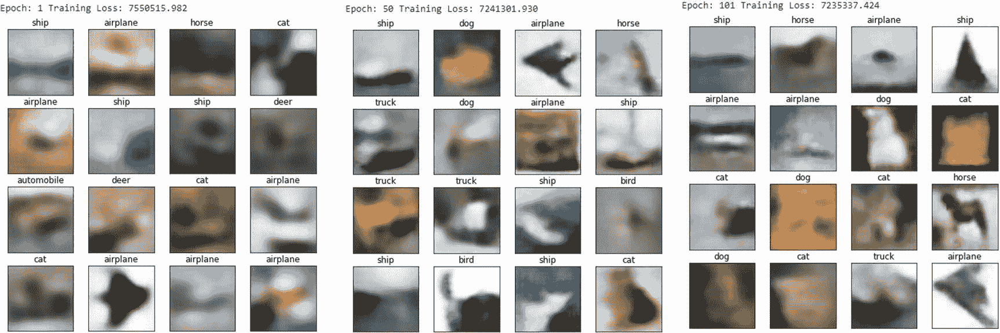

图 3-12

VAE 在 1、50 和 101 次迭代后的训练结果

现在我们已经了解了 VAE 的功能，我们将在下一节中理解内部模型的工作原理，并学习数据的分布或变异性。


## 使用 VAE 学习分布

在 VAE 中，模型的学习方式不仅仅是理解中间或潜在空间的编码，而是理解编码本身的分布。通过理解编码的分布或变异性，我们可以学习如何映射潜在编码并生成那些隐藏空间。

图 3-13 并排展示了 AE 和 VAE。在图中，`x` 代表输入，`x'` 代表生成的输出。同样地，`z` 代表我们数据的潜在编码或中间表示。在 VAE 中，有一个细微的差别：我们不学习编码本身，而是学习该编码的分布或变异性。然后，我们使用这些学习到的参数来采样一个 `z` 表示，并将其输入到解码器中。

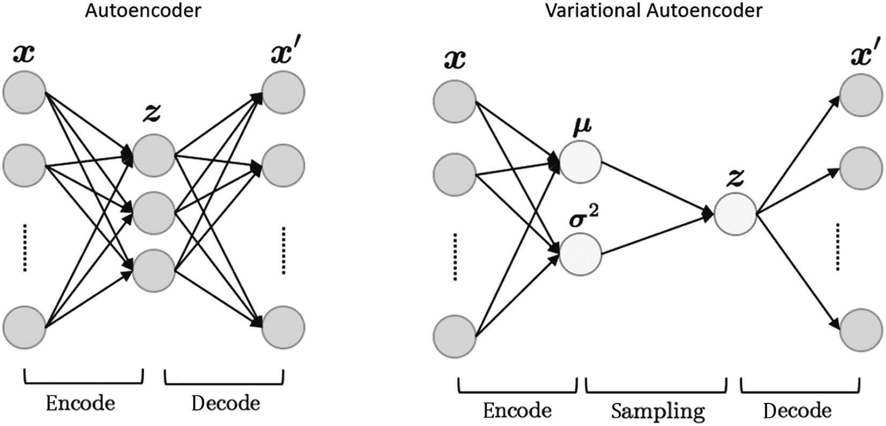

图 3-13  
AE 与 VAE 的对比

这个 VAE 模型学习到的参数是均值（`μ`）和标准差或方差平方（`σ²`）。如果你还记得统计学知识，这些正是我们用来定义正态分布的参数。我们通常默认使用正态分布，但重要的是要理解数据可以以多种方式分布。

图 3-14 展示了各种分布以及正态分布（或高斯分布）的示例。正态分布是我们通常假设大多数数据所呈现的形态。任何基本描述性统计的使用通常都会假设数据呈正态分布。

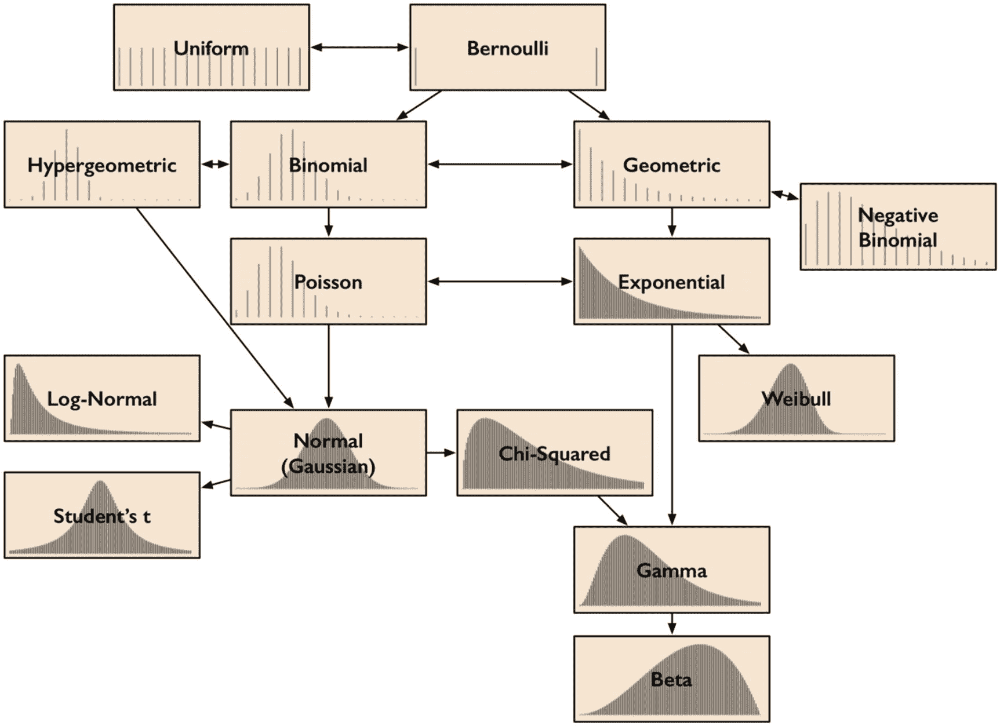

图 3-14  
各种分布的示例

如图 3-15 所示，正态分布由两个参数定义：均值（`μ`）和标准差（`σ2`）。在 VAE 中，我们让网络通过使用这些值来生成一个样本编码，从而学习分布的均值和标准差。然后，该样本编码被输入到解码器中，并输出生成的图像。

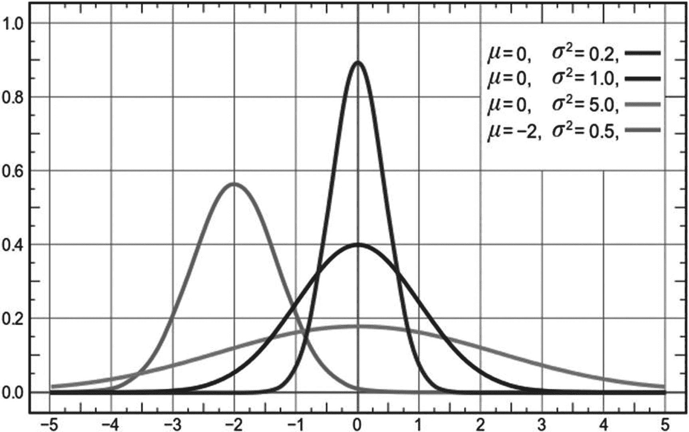

图 3-15  
由 `μ` 和 `σ2` 修改的正态分布示例

在图 3-15 中，我们可以看到 `μ` 和 `σ2` 的不同变化如何改变正态分布的形状，其中均值始终代表分布的中心，而标准差代表分布的离散程度或多样性。

通常，我们使用统计学来发现数据是如何分布的，或者它代表了什么样的变异性。使用 VAE，我们仍然在学习数据的参数是什么，只不过现在我们关注的数据空间变成了该数据的隐藏或潜在空间表示。与尝试学习一组训练图像的整个潜在空间相比，这具有三个优势。

首先，通过学习嵌入空间，数据量或数据的维度可以大大减少。这使得我们的 VAE 能够以更简单的形式学习特征的表示方式，从而让我们能够建模一个简单的正态分布。更复杂的数据形式可能需要 VAE 来建模更复杂的分布或分布集合。

第二个优势使我们能够从这个学习到的潜在空间映射或生成新的输出。我们只需要理解和控制这些分布参数，就能得到新颖的输出。

第三个优势（但可能不那么重要）是确认我们只需学习输入数据分布并将其转换为正态参数，就能生成输出。AE 和 VAE 之间的一个关键架构差异是发生在模型中间的采样操作。这个操作本质上将编码器和解码器模型解耦，为我们提供了更好的复用能力和进一步的生成式建模机会。

当然，为了更好地理解这一点，我们需要回到另一个代码练习中，看看这一切是如何结合在一起的。在下一个练习中，我们将深入 VAE 的内部，了解它如何学习编码空间的分布或变异性；请参见练习 3-5。

### 练习 3-5. 理解 VAE

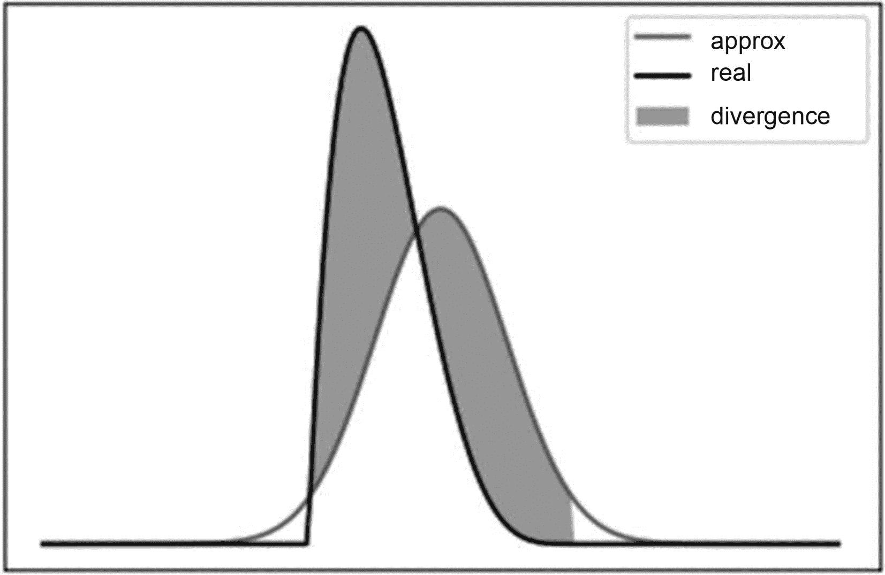

图 3-16  
展示两个正态分布之间的测量散度

1. 从 GitHub 项目站点打开 `GEN_3_conv_VAE_latent.ipynb` 笔记本。

2. 通过选择“运行时” ➤ “全部运行”来运行整个笔记本。

3. 跳转到类定义代码块以及此处显示的 `encode` 和 `decode` 函数：

```
def bottleneck(self, h):
    mu, logvar = self.fc1(h), self.fc2(h)
    z = self.reparameterize(mu, logvar)
    return z, mu, logvar
def encode(self, x):
    h = self.encoder(x)
    z, mu, logvar = self.bottleneck(h)
    return z, mu, logvar
def decode(self, z):
    z = self.fc3(z)
    z = self.decoder(z)
    return z
def forward(self, x):
    z, mu, logvar = self.encode(x)
    z = self.decode(z)
    return z, mu, logvar
```

4. 注意网络如何通过 `bottleneck` 函数限制生成 `mu` 和 `logvar`（方差参数）。然后使用这些参数从分布中采样一个 `z` 或编码表示。接着在 `forward` 函数中，我们可以看到 `encode` 如何用于生成这些参数以及采样的 `z`，而 `z` 被输入到解码器中，作为用于生成新输出的编码。

5. 接下来，我们再次向下滚动到 `loss_fn`，如下所示：

```
def loss_fn(recon_x, x, mu, logvar):
    BCE = F.binary_cross_entropy(recon_x, x, size_average=False)
    KLD = -0.5 * torch.mean(1 + logvar - mu.pow(2) - logvar.exp())
    return BCE + KLD, BCE, KLD
```

6. 在这种情况下，自定义损失函数使用两种方法来测量学习到的分布与观察到的分布之间的散度。第一种技术称为*二元交叉熵*（BCE），它测量原始输入图像与重建图像之间的差异。这与我们在普通 AE 中测量损失的方式并无不同。第二种技术称为 Kullback Leibler 散度（KLD），用于测量数据分布之间的实际差异。

7. 图 3-16 展示了如何使用 KLD 测量两个正态分布之间的差异。阴影区域代表两个分布之间的散度。我们使用 BCE 和 KLD 计算组合损失的目标是，通过损失函数最小化这种分布差异，从而学习均值和标准差的值。

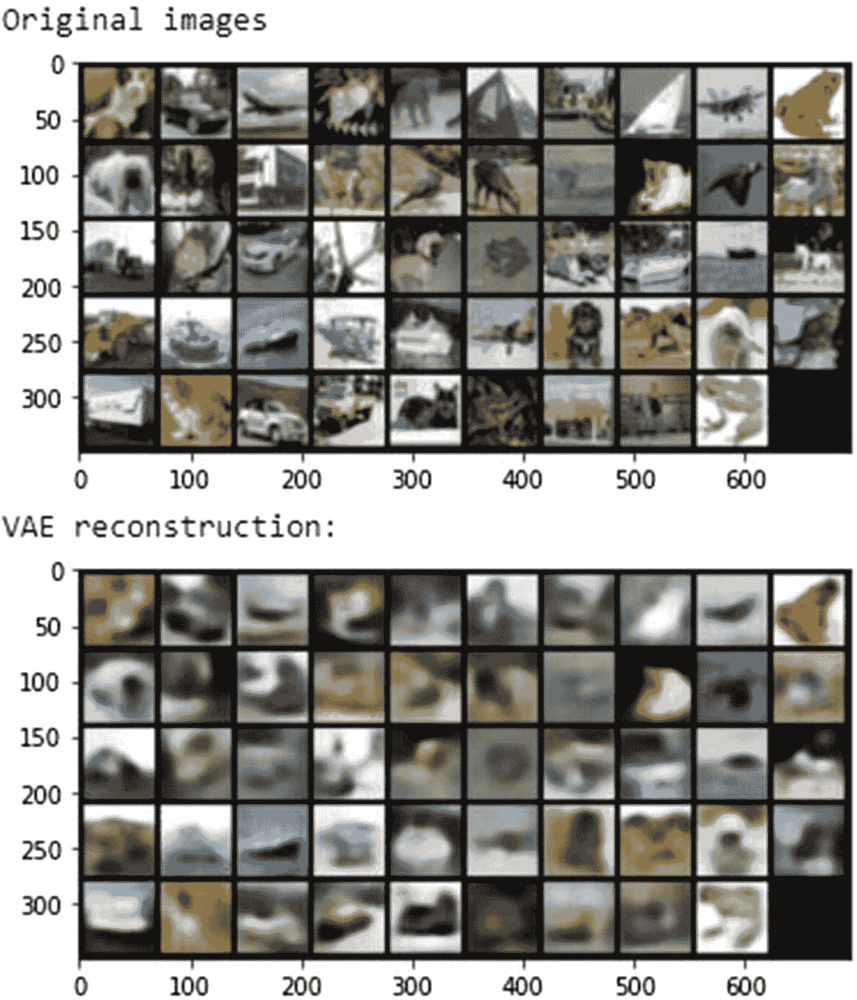

图 3-17  
输入图像与输出生成图像的对比

8. 让笔记本运行直到完成至少 100 个 epoch。你需要一个良好的模型来更好地理解下一部分。

9. 以下代码块负责生成图 3-17 中所示的示例输出对比。在该图中，我们看到了用于输入到 VAE 以生成输出图像的原始图像。请注意，考虑到 VAE 学习的只是映射输入图像的数据分布，输出效果相对不错。


```python
import numpy as np
import matplotlib.pyplot as plt
plt.ion()
import torchvision.utils
def to_img(x):
    x = x.clamp(0, 1)
    return x
def show_image(img):
    img = to_img(img)
    npimg = img.numpy()
    plt.imshow(np.transpose(npimg, (1, 2, 0)))
def visualize_output(images, model):
    with torch.no_grad():
        images = images.to(device)
        images, _, _ = model(images)
        images = images.cpu()
        images = to_img(images)
        np_imagegrid = torchvision.utils.make_grid(images[1:50], 10, 5).numpy()
        plt.imshow(np.transpose(np_imagegrid, (1, 2, 0)))
        plt.show()
images, labels = iter(train_loader).next()
## 首先可视化原始图像
print('原始图像')
show_image(torchvision.utils.make_grid(images[1:50],10, 5))
plt.show()
## 使用 VAE 重建并可视化图像
print('VAE 重建：')
visualize_output(images, model)
```

通过图 3-17 中的输出，你可以开始体会到学习图像中数据分布的力量。请注意，对于每一张输入图像，VAE 都在学习图像中数据/像素的分布方式。然后，它利用从学习到的均值和标准差中捕获的知识，创建一个正态分布，并从中随机采样。因此，VAE 重建中的每一张输出图像都是从学习到的分布中随机采样得到的。

学习数据如何分布，并将其映射到一个已知或未知函数的概念，是深度学习生成式建模的核心。在本书后续内容中，我们将反复使用这一概念。在下一节中，我们将探讨理解数据分布如何让我们能够操控输出。

### 变异性与探索潜在空间

借助训练好的 VAE 模型，我们可以开始探索模型所学习的潜在空间。本章一直在努力理解这个潜在空间的样子。现在，我们终于可以展开这个潜在空间，并直观地查看其内容了。

在 VAE 中可视化潜在空间编码的最佳方式是可视化输出或受控输出。我们可以通过几种方式做到这一点，在练习 3-6 中，我们将探索如何搜索已学习 VAE 的输出空间。

**练习 3-6. 理解 VAE**

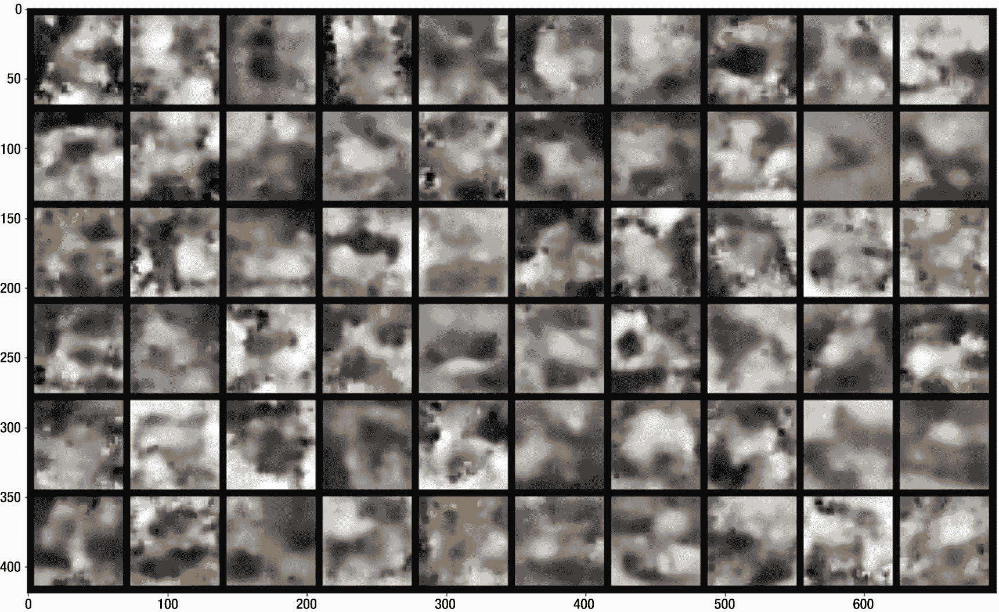

**图 3-18** 随机潜在空间生成的示例输出

1.  跳转到你最新的、已训练好的`GEN_3_conv_VAE_latent.ipynb`笔记本。如果需要重新训练该笔记本，请执行此操作；这可能需要大约一个小时。我们稍后会讨论如何保存和恢复模型，但现在如果需要，就重新训练。

2.  在该笔记本的底部有两个代码单元，它们允许我们跨潜在空间分布参数（均值和标准差）随机或受控地映射模型的输出。

```python
    with torch.no_grad():
    # 从正态分布中采样潜在向量
    latent = torch.randn(60, 1024, device=device)
    # 从潜在向量重建图像
    img_recon = model.decoder(latent)
    img_recon = img_recon.cpu()
    fig, ax = plt.subplots(figsize=(20, 20))
    show_image(torchvision.utils.make_grid(img_recon.data[:100],10,5))
    plt.show()
```

3.  上面显示的第一个代码块使用`torch.randn`函数生成样本潜在向量，生成了 60 个大小为 1024 的向量。我们从 VAE 中使用的潜在向量大小得到 1024；1024 比我们在探索自编码器时使用的潜在向量大得多，这是为了应对更复杂的训练数据集。其余代码使用`model.decoder`，将`latent`向量作为输入来生成一组新图像。

4.  图 3-18 显示了最后一个代码单元的示例输出。这里的输出实际上代表了完全随机的向量被输入到 VAE 的解码器部分以生成输出。如你所见，结果并不理想。

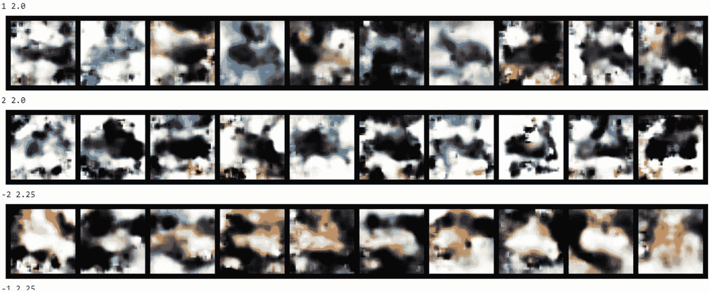

**图 3-19** 样本潜在空间参数的示例输出

1.  接下来的最后一个代码块演示了如何遍历正态分布参数，以生成并非随机样本，而是从已知分布创建的样本。这使我们能够理解模型中数据与潜在空间之间的视觉区域是什么样的。

```python
    for std in np.arange(.75, 1.5, .1):
    for mean in np.arange(-2, 3, 1):
    with torch.no_grad():
    # 从正态分布中采样潜在向量
    latent = torch.normal(mean, std, size=(10, 1024), device=device)
    # 从潜在向量重建图像
    img_recon = model.decoder(latent)
    img_recon = img_recon.cpu()
    fig, ax = plt.subplots(figsize=(20, 20))
    show_image(torchvision.utils.make_grid(img_recon.data[:100],10,5))
    ax.axis('off')
    print(mean, std)
    plt.show()
```

2.  现在，我们不再生成一整批随机图像，而是在每次更新`std`和`mean`时生成一组 10 张图像。这使我们能够确定这些参数的敏感度，以及它们如何直观地生成输出。

3.  图 3-19 显示了最后一个代码单元输出的一个片段。请注意`mean`和`std`的变化如何改变输出的外观。还要注意模型如何尝试复制它学到的特征。这种特征重建是我们的卷积层创建这些特征的结果。在某些情况下，你可能会看到属于特定类别（如猫或狗）的可识别特征。见图 3-19。

1.  既然你已经理解了 VAE 的工作原理，请尝试调整超参数`batch_size`、`learning_rate`和`epochs`。回想一下我们本章前面学到的内容。

2.  如果你觉得更有挑战性，可以尝试将隐藏潜在向量大小`h_dim`从 1024 改为其他数字。也可以尝试将`z_dim`超参数从 32 改为 64 或 16。这会产生什么影响？提示：可以找到这两个超参数的代码如下所示：

```python
class ConvVAE(nn.Module):
def __init__(self, image_channels=3, h_dim=1024, z_dim=32):
```

在前面的练习中，我们开始直观地探索模型中的潜在空间。这种技术为我们提供了关于模型训练效果以及训练目标的更多反馈。在本书中，我们将反复使用像前一个练习中使用的技术。

探索 VAE 中的潜在空间非常有用，并能提供多种见解。不幸的是，映射到分布参数仍然极大地限制了模型的学习能力。幸运的是，我们已经探索过的模型——GAN，已经学习了数据的潜在分布。我们将在下一章中进一步探讨 GAN 是如何做到这一点的。


## 结论

要构建可运行且实用的生成模型，我们需要理解深度学习网络是如何学习的。我们需要了解网络如何逼近函数，以及这对网络学习的内容有何影响。在此基础上，我们详细探讨了各种超参数如何影响网络的学习方式和学习内容，并进一步学习了如何在玩具示例上调整这些超参数。

接下来，我们从调整超参数转向理解它们如何让我们控制模型中的潜在空间或隐藏空间。学会控制潜在空间的大小使我们能够更好地训练模型。然后，我们进阶到构建变分自编码器，这种模型不仅通过理解潜在空间来学习，还通过理解映射到该潜在空间的分布参数来学习。

最后，基于将参数映射到潜在空间的知识，我们可以严格地根据这些参数构建输出。这使我们能够详细了解模型学到了什么，以及它对输入数据的敏感程度。虽然本章我们并未着手解决模型的问题，但未来我们一定会研究其他系统来改进它。

在下一章中，我们将重新审视生成对抗网络，并继续探索其众多变体。生成对抗网络可以通过多种技术轻松调整，以控制模型生成中的潜在空间，其中许多技术与分布学习相关。这将使我们能够以更可控的方式生成内容。

