# 4. 生成对抗网络，生成对抗网络，以及更多的生成对抗网络

生成建模已经存在了几十年，但该领域的许多研究是在生成对抗网络被发现之后才真正开始被认可的。关于生成对抗网络何时被发现以及由谁发现，存在一些争议。但有一点是确定的：2014 年，伊恩·古德费洛及其蒙特利尔大学的同事们，在重新发明对抗学习技术方面功不可没。

毕竟，生成对抗网络不过是从中间分开并翻转过来的自编码器。古德费洛将这一概念更进一步，在真正的对抗意义上引入了生成器（艺术伪造者）和判别器（艺术评论家）的概念，作为生成新颖内容的一种方式。这项技术在生成新内容方面非常成功，以至于现在有数百种基于这个简单模型的实现和变体。

在本章中，我们将重新审视生成对抗网络，并开始研究许多已被采纳为改进或变体的实现。我们首先通过改进深度卷积生成对抗网络来回顾生成对抗网络中的卷积。我们将了解如何通过引入 Wasserstein 生成对抗网络来改进损失或距离的度量。接下来，我们探讨离散数据可能对生成对抗网络产生的影响，以及如何使用边界搜索生成对抗网络来解决这个问题。然后，我们通过使用相对论生成对抗网络来优化损失度量，从而提升生成对抗网络的性能。接着，我们跳回使用条件生成对抗网络来理解和控制潜在空间。

生成对抗网络已经站在了生成建模的前沿。这是一种我们将在本书中不懈探索的技术。在本章中，我们首先探索几种基础的生成对抗网络，它们将为我们提供后续使用的技术。以下是本章将涵盖的主要主题的快速分解：

-   使用深度卷积生成对抗网络理解特征
-   展开生成对抗网络的数学原理
-   使用 Wasserstein 生成对抗网络解决距离问题
-   离散化边界搜索生成对抗网络
-   相对论与相对论生成对抗网络
-   使用条件生成对抗网络进行条件控制

本章代码量很大，包含许多示例。所有这些示例在适当的情况下都使用了更大的训练集，以更好地演示概念。较大的数据集可能需要数小时或数天来训练。虽然本章中的大多数练习可能在一小时内完成训练，但有些可能需要更长时间。在下一节中，我们将通过理解特征学习的重要性来开始探索生成对抗网络。

## 特征理解与深度卷积生成对抗网络

虽然我们在前一章已经探讨过深度卷积生成对抗网络，但我们未能详细说明究竟是什么让这个模型更好。正如我们已经学到的，卷积层可以促进二维图像中可见特征的提取。但我们没有足够详细地说明这为什么重要。

在数据科学中，我们通常将特征提取描述为识别数据集中已知或未知特征的过程。虽然数据科学使用统计建模来提取特征，但深度学习有多种方法可以自动完成此操作。卷积是允许我们的模型学习哪些特征对于表征对象是重要的方法之一。

卷积并不是提取特征的唯一方法；它是对于大多数图像分类和识别任务来说效果足够好的方法之一。常规卷积本身仅限于提取局部特征，例如眼睛或鼻子。我们将在后续章节中介绍的全局特征提取方法，可以识别鼻子，但也能关联到该特征需要位于双眼之间。

由于我们已经在第 2 章中介绍过深度卷积生成对抗网络，因此在本练习中，我们将专门关注模型使用卷积学习或提取了什么。通过能够理解模型如何学习以及学习了什么，我们就能推导出它生成了什么。在练习 4-1 中，我们重新审视深度卷积生成对抗网络，重点在于理解它提取的特征。

练习 4-1. 深度卷积生成对抗网络特征学习

1.  从 GitHub 项目站点打开 `GEN_4_DCGAN.ipynb` 笔记本。如果不确定如何操作，请查阅附录 B。

2.  通过选择 **运行时** ➤ **全部运行** 来运行整个笔记本。然后，查看 `imports` 单元格之后，找到第一个包含名为 `Hyperparameters` 的新类的单元格：

```
class Hyperparameters(object):
    def __init__(self, **kwargs):
        self.__dict__.update(kwargs)

hp = Hyperparameters(n_epochs=200,
                     batch_size=64,
                     lr=.0002,
                     b1=.5,
                     b2=0.999,
                     n_cpu=8,
                     latent_dim=100,
                     img_size=32,
                     channels=1,
                     sample_interval=400)
print(hp.lr)
```

3.  `Hyperparameters` 是一个字典辅助类，允许我们在一个地方定义所有超参数，可以通过字典或像所示那样的键值对列表进行初始化。然后，我们可以使用名称 `hp` 加上参数来引用超参数，如 `print(hp.lr)` 行所示。

4.  下一个代码块包含我们之前查看过的实用代码。之后是一个新的 `Generator` 定义。

```
class Generator(nn.Module):
    def __init__(self):
        super(Generator, self).__init__()
        self.init_size = hp.img_size // 4
        self.l1 = nn.Sequential(nn.Linear(hp.latent_dim, 128 * self.init_size ** 2))
        self.conv_blocks = nn.Sequential(
            nn.BatchNorm2d(128),
            nn.Upsample(scale_factor=2),
            nn.Conv2d(128, 128, 3, stride=1, padding=1),
            nn.BatchNorm2d(128, 0.8),
            nn.LeakyReLU(0.2, inplace=True),
            nn.Upsample(scale_factor=2),
            nn.Conv2d(128, 64, 3, stride=1, padding=1),
            nn.BatchNorm2d(64, 0.8),
            nn.LeakyReLU(0.2, inplace=True),
            nn.Conv2d(64, hp.channels, 3, stride=1, padding=1),
            nn.Tanh(),
        )

    def forward(self, z):
        out = self.l1(z)
        out = out.view(out.shape[0], 128, self.init_size, self.init_size)
        img = self.conv_blocks(out)
        return img
```

5.  这个类与我们之前生成器使用的类相似。有一些细微的差别使得这个类更加抽象和可重用。请注意，生成对抗网络中的原始生成器是从随机噪声中学习的，而判别器是从已建立的或*基准*事实中学习的。

6.  接下来，我们有 `Discriminator` 类，它展示了深度卷积生成对抗网络判别器的一个新版本。


```python
class Discriminator(nn.Module):
    def __init__(self):
        super(Discriminator, self).__init__()
        def discriminator_block(in_filters, out_filters, bn=True):
            block = [nn.Conv2d(in_filters, out_filters, 3, 2, 1),
                     nn.LeakyReLU(0.2, inplace=True), nn.Dropout2d(0.25)]
            if bn:
                block.append(nn.BatchNorm2d(out_filters, 0.8))
            return block
        self.model = nn.Sequential(
            *discriminator_block(hp.channels, 16, bn=False),
            *discriminator_block(16, 32),
            *discriminator_block(32, 64),
            *discriminator_block(64, 128),
        )
        # 下采样图像的高度和宽度
        ds_size = hp.img_size // 2 ** 4
        self.adv_layer = nn.Sequential(nn.Linear(128 * ds_size ** 2, 1), nn.Sigmoid())

    def forward(self, img):
        out = self.model(img)
        out = out.view(out.shape[0], -1)
        validity = self.adv_layer(out)
        return validity
```

7. 接下来是定义模型和创建损失函数的单元格。请注意，我们提供了使用 `cuda` 的选项，以及在使用 GPU 时模型的定义方式。

```python
loss_fn = torch.nn.BCELoss()
generator = Generator()
discriminator = Discriminator()
if cuda:
    generator.cuda()
    discriminator.cuda()
    loss_fn.cuda()
### 初始化权重
generator.apply(weights_init_normal)
discriminator.apply(weights_init_normal)
```

8. 向下滚动其余代码，直到定义所有训练过程的最后一个单元格。请注意，我们使用 0.0 或 1.0 来定义假图像和真图像的方式与之前略有不同。

```python
for epoch in range(hp.n_epochs):
    for i, (imgs, _) in enumerate(dataloader):
        valid = Variable(Tensor(imgs.shape[0], 1).fill_(1.0), requires_grad=False)
        fake = Variable(Tensor(imgs.shape[0], 1).fill_(0.0), requires_grad=False)
        real_imgs = Variable(imgs.type(Tensor))
        optimizer_G.zero_grad()
        z = Variable(Tensor(np.random.normal(0, 1, (imgs.shape[0], hp.latent_dim))))
        gen_imgs = generator(z)
        g_loss = loss_fn(discriminator(gen_imgs), valid)
        g_loss.backward()
        optimizer_G.step()
        optimizer_D.zero_grad()
        real_loss = loss_fn(discriminator(real_imgs), valid)
        fake_loss = loss_fn(discriminator(gen_imgs.detach()), fake)
        d_loss = (real_loss + fake_loss) / 2
        d_loss.backward()
        optimizer_D.step()
        batches_done = epoch * len(dataloader) + i
        if batches_done % hp.sample_interval == 0:
            clear_output()
            print(f"Epoch:{epoch}:It{i}:DLoss{d_loss.item()}:GLoss{g_loss.item()}")
            visualize_output(gen_imgs.data[:50],10, 10)
```

9. 随着笔记本的运行，观察图像是如何生成的。请特别注意图像生成过程中呈现的块状特征。这些近乎块状的特征是卷积特征提取过程的结果。如果你需要回顾使用 CNN 层进行图像特征提取的过程，请参考第 2 章。

图 4-1 展示了训练过程以及在训练中不同采样点生成的图像结果。请注意，这些图像看起来像是从不同图块拼接而成，或者用最贴切的说法是*提取的特征*。

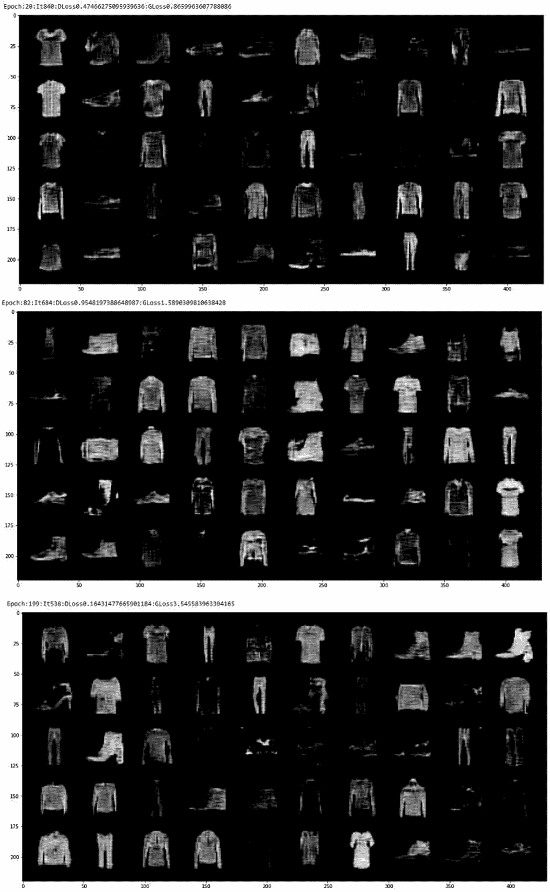

**图 4-1** DCGAN 在不同采样点生成的图像结果

由于具备特征提取能力，双卷积 GAN 相比原始的基础 GAN 有了显著改进。虽然视觉上结果令人印象深刻，但模型的局限性也显而易见——从学习到的特征图块中拼接图像的现象便可见一斑。

但这并不意味着卷积或生成建模中的特征提取概念存在局限。在使用卷积层或循环层等特征提取层时，我们需要考虑提取的细节和上下文。在卷积中，细节受限于最小卷积层的最小图块尺寸，而上下文始终是局部化的。

循环层是一种特殊的深度学习层，能够学习或提取数据中的序列信息。这类层通常用于时间序列数据或自然语言文本分析中的特征提取。理论上，它们也可用于从视频数据或数据序列中提取特征，但实践证明这并非高效方案。循环神经网络（RNN）计算成本高昂，如今已有其他解决方案用于执行同类特征提取。本书将不再进一步讨论 RNN。

由于卷积在生成建模中的应用存在一定局限性，我们将探讨其他能提供更优结果的方法。不过，最终结果往往取决于你试图模拟的输入数据。在下一节中，我们将重新深入 GAN 的数学原理，以理解哪些可能是更好的选择。


## 揭开 GAN 的数学原理

为了更好地理解生成对抗网络（GAN）的学习机制，掌握其背后的数学原理（或至少是数学直觉）至关重要。幸运的是，我们在第 3 章讨论变分自编码器（VAE）时，已经接触过其中一些数学基础。如果你还记得，VAE 通过理解和建模输入数据的分布来学习，然后从该学习到的分布中生成样本。

事实证明，GAN 的数学原理与 VAE 类似，它们都通过理解试图辨别或生成的分布来学习。然而，我们用于实现这一目标的数学推导方式略有不同。从底层理解 GAN 的工作原理，对于在后续训练中修复或解决问题至关重要。

我们将从 GAN 中使用的基本损失函数——二元交叉熵损失函数开始，如下所示：

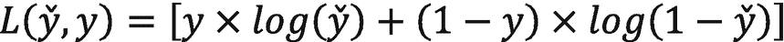

其中：

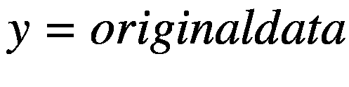

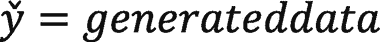

为了优化这个函数，我们首先来看如何确定判别器的损失。在训练判别器时，对于真实数据，我们假设 `y = 1`。相反，对于生成的数据，我们令 ；然后代入最后一个方程，得到判别器的损失如下：

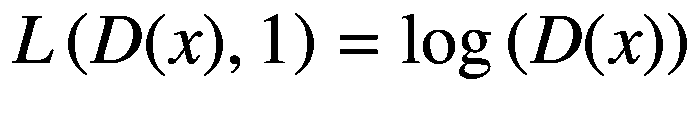

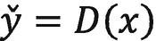

；然后代入最后一个方程，得到判别器的损失如下：

接着，对于生成器生成的输出，我们假设 `y = 0`（假数据），然后 ，其中 `z` 表示随机样本向量空间。将其代回损失方程，得到生成器的损失如下：


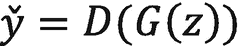

，其中

然后我们可以将两个方程的损失合并，并通过最大化来确定总的判别器损失，如下所示：

![$$ {L}^{(D)}=\mathit{\max}\left[\mathit{\log}\left(D(x)\right)+\mathit{\log}\left(1-D\left(G(z)\right)\right)\right] $$](images/502181_1_En_4_Chapter/502181_1_En_4_Chapter_TeX_Equf.png)

由于生成器与判别器相互对抗，它的任务是执行相反的操作，因此，我们通过以下公式计算生成器的最小损失：

![$$ {L}^{(G)}=\mathit{\min}\left[\mathit{\log}\left(D(x)\right)+\mathit{\log}\left(1-D\left(G(z)\right)\right)\right] $$](images/502181_1_En_4_Chapter/502181_1_En_4_Chapter_TeX_Equg.png)

为了简化这一视图，我们可以使用如下简写方程将这两个方程合并：

![$$ L={\displaystyle \begin{array}{c}\mathit{\min}\\ {}G\end{array}}{\displaystyle \begin{array}{c}\mathit{\max}\\ {}D\end{array}}\left[\mathit{\log}\left(D(x)\right)+\mathit{\log}\left(1-D\left(G(z)\right)\right)\right] $$](images/502181_1_En_4_Chapter/502181_1_En_4_Chapter_TeX_Equh.png)

现在，上述损失函数仅定义了单个像素或数据点上的损失量。为了覆盖整个图像或数据集，我们需要展开方程，使其与 Ian Goodfellow 及其同事在 GAN 论文中提出的原始 GAN 方程相匹配：

![$$ {\displaystyle \begin{array}{c}\mathit{\min}\\ {}G\end{array}}{\displaystyle \begin{array}{c}\mathit{\max}\\ {}D\end{array}}V\left(D,G\right)={\displaystyle \begin{array}{c}\mathit{\min}\\ {}G\end{array}}{\displaystyle \begin{array}{c}\mathit{\max}\\ {}D\end{array}}\left({E}_{xPdata(x)}\left[\mathit{\log}\left(D(x)\right)\right]+{E}_{zP(z)}\left[\mathit{\log}\left(1-D\left(G(z)\right)\right)\right]\right) $$](images/502181_1_En_4_Chapter/502181_1_En_4_Chapter_TeX_Equi.png)

其中：

`E[xPdata(x)]` 是真实数据的期望或分布。

`E[zP(z)]` 是假数据的期望分布。

这意味着我们试图优化期望的生成分布，使其与真实或实际的数据分布相匹配。同样，这与我们之前对 VAE 的探讨并无二致，其目标都是优化采样分布。我们经常会看到该方程被重写如下：

![$$ {E}_x\left[\mathit{\log}\left(D(x)\right)\right]+{E}_z\left[1-\mathit{\log}\left(D\left(G(z)\right)\right)\right] $$](images/502181_1_En_4_Chapter/502181_1_En_4_Chapter_TeX_Equj.png)

现在，问题变成了我们的生成器能够多好地学习建模真实数据分布。然而，在实践中，如果生成分布与真实分布之间的差异变得过大，生成器将会停滞，并遭受梯度消失问题。

图 4-2 展示了在训练过程中，期望的生成分布与判别器对真实分布的期望可能如何收敛或发散。随着判别器在识别真假图像方面变得更好，这可能会增加生成期望分布的发散程度。同样，如果生成器配置不当，它可能一开始就具有较差的期望，或者无法学习到期望的分布。

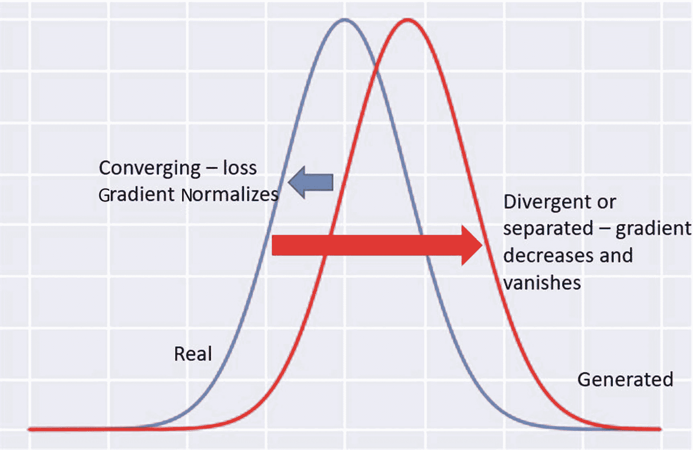

图 4-2

理解生成器与判别器的期望

如果期望的真实分布和生成分布变得过于多样或分离，且没有重叠，那么生成器将遭受梯度消失损失。梯度消失是一个问题，因为损失梯度变得非常小，以至于对训练模型没有影响。我们会看到生成器模型停滞不前，没有任何进展。

梯度消失背后的数学原理超出了本书的范围。然而，这里的直觉是，随着期望的真实分布和生成分布发散且没有重叠，这就会成为问题。从这个知识中，我们可以得出两个重要的概念。

首先，我们的生成器和判别器模型需要协同训练，任何一方都不能获得明显的优势。期望分布与生成分布匹配得越好，我们的模型训练效果就越好。一个在早期就能很好区分真假图像的判别器，会使生成器面临无法逾越的挑战。

其次，通过理解可能发生的问题，我们可以寻找更先进的解决方案来尝试解决生成器训练问题。幸运的是，GAN 的出现引入了数百种新方法来解决这些问题。

幸运的是，有几种方法可以使用不同的方法来衡量距离或解释该距离。我们将探讨的第一种方法称为 Wasserstein 距离，因此我们接下来要介绍的 GAN 被称为 Wasserstein GAN（WGAN）。


### 使用 WGAN 解决距离问题

解决生成器与判别器之间分布或期望数据分布的一种方法是让它不成问题。这听起来可能过于简化了一个复杂的问题，而事实也确实可能如此。然而，如果我们能找到另一种衡量两个期望分布之间差异的方法呢？

简单来说，Wasserstein 距离是一种衡量两个分布（无论是期望的还是真实的）之间差异的方法，它使用一个单一的标量距离，该距离由将一个分布转换为另一个分布所需的工作量来衡量。描述这一方法的常用思路是想象两堆泥土。两堆泥土质量/大小相等，但形状不同。Wasserstein 度量或距离就是将第一堆泥土转换为第二堆所需的工作量，如图 4-3 所示。

这意味着我们忽略两个分布之间的距离，这可以大大简化数学计算。由于我们不再担心距离问题，损失函数得以简化，进而成为真实与虚假之间的差异。这也意味着判别器不再能区分什么是真实或虚假，而只是进行评判。因此，我们现在将判别器称为*评论家*。

这种衡量两个分布之间距离的方法也被称为*推土机距离*。这个术语表示使用离散量将材料/泥土从一堆移动到另一堆所需的工作量。简单来说，你可以想象一辆卡车需要运输多少次才能将一堆泥土从一个位置移动到另一个位置。

所有这些数学计算将评论家和生成器的损失函数简化为以下形式：

评论家损失：`D(x) - D(G(z))`

生成器损失：`D(G(z))`

这里的另一个关键区别是生成器试图最大化函数，而在标准 GAN 中，生成器是最小化损失。

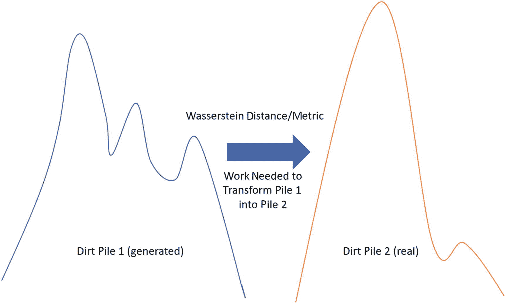

图 4-3

Wasserstein 距离解释

这些假设还导致了其他几个关键区别。首先，网络中的权重需要被限制在某个范围内，以避免评论家/判别器中的梯度消失或爆炸。其次，我们需要增加评论家的训练迭代次数，以便它能更快地逼近真实分布。

现在我们对这些概念的工作原理有了一些了解，让我们深入另一个代码示例，看看它在实践中是如何运作的。在练习 4-2 中，我们将研究一个基于 MNIST 时尚数据集训练的 WGAN 实现。学习这些基础训练数据集对于更好地理解 GAN 之间的差异非常重要。

练习 4-2. 探索 WGAN

1.  从 GitHub 项目站点打开 `GEN_4_WGAN.ipynb` 笔记本。如果不确定如何操作，请参考附录 B。

2.  通过选择“运行时” ➤ “全部运行”来运行整个笔记本。然后跳过 `imports` 单元格，找到第一个包含 `Hyperparameters` 类的单元格，并检查新的超参数 `n_critic` 和 `clip_value`：

```
class Hyperparameters(object):
    def __init__(self, **kwargs):
        self.__dict__.update(kwargs)
hp = Hyperparameters(n_epochs=200,
                     batch_size=64,
                     lr=0.00005,
                     n_cpu=8,
                     latent_dim=100,
                     img_size=32,
                     channels=1,
                     n_critic=25,
                     clip_value=.005,
                     sample_interval=400)
```

3.  新的超参数是 `n_critic` 和 `clip_value`。`n_critic` 定义了训练中评论家的迭代次数，`clip_value` 设置了评论家/判别器中权重的限制范围。

4.  你可以向下滚动到最后一个代码块，即训练块。本示例中的大部分代码我们已在之前的示例中介绍过，因此这里无需重复。

5.  我们将重点关注从判别器/评论家损失开始的训练代码内部块，如下所示：

```
valid = Variable(Tensor(imgs.shape[0], 1).fill_(1.0), requires_grad=False)
fake = Variable(Tensor(imgs.shape[0], 1).fill_(0.0), requires_grad=False)
real_imgs = Variable(imgs.type(Tensor))
optimizer_G.zero_grad()
z = Variable(Tensor(np.random.normal(0, 1,
                (imgs.shape[0], hp.latent_dim))))
fake_imgs = generator(z).detach()
d_loss = -torch.mean(discriminator(real_imgs)) + torch.mean(discriminator(fake_imgs))
d_loss.backward()
optimizer_D.step()
```

6.  顶部部分生成了我们之前见过的有效和虚假张量的真实标签。之后，我们看到从批次中提取的 `real_imgs` 以及从随机 `z` 生成的 `fake_imgs`。接着，评论家/判别器损失通过将 `fake_imgs` 传入判别器的均值减去 `real_imgs` 传入判别器的均值来计算。在标准 GAN 中，我们会使用二元交叉熵函数来衡量损失。

7.  接下来，我们将查看执行权重限制的代码。我们再次需要将权重限制在一个狭窄的窗口内，以避免梯度爆炸。

```
for p in discriminator.parameters():
    p.data.clamp_(-hp.clip_value, hp.clip_value)
```

8.  之后，我们开始控制生成器损失迭代的部分，以 `if` 语句开头：

```
if i % hp.n_critic == 0:
    optimizer_G.zero_grad()
    gen_imgs = generator(z)
    g_loss = -torch.mean(discriminator(gen_imgs))
    g_loss.backward()
    optimizer_G.step()
```

9.  `if` 语句控制生成器在每次评论家训练轮次后如何运行。之后，大部分代码是熟悉的，但请注意生成器损失 `g_loss` 计算的简化。

考虑到我们最近在运行更高级的 GAN（如 DCGAN）方面的探索，这个训练示例的输出可能会有些令人失望。很明显，WGAN 并不适合或不足以学习 MNIST 时尚数据集。如果我们使用不同的数据集，我们期望得到更好的结果。那么，MNIST 时尚数据集有什么问题呢？

时尚数据集的问题在于图像的构成过于多样化，难以轻松学习一个通用或广义的期望分布。换句话说，鞋子的图片与毛衣或裤子的图片差异太大。随着我们尝试训练的数据类别或领域增多，这个问题会变得更加复杂。

虽然我们可以通过特征提取（如我们在 DCGAN 中所做的那样）来解决学习多样化领域的问题，但理想情况下，我们希望通过研究如何管理或表征跨领域或类别的损失来解决问题的根本原因。在下一节中，我们将研究一种这样的方法。


## 离散化边界搜索生成对抗网络

我们可以将图像或其他数据中的视觉差异归类为不同类别。在 MNIST 时尚数据集中，有 10 个类别，它们既有相似之处，也存在关键差异。图 4-4 展示了时尚数据集中各类别数据之间的差异。

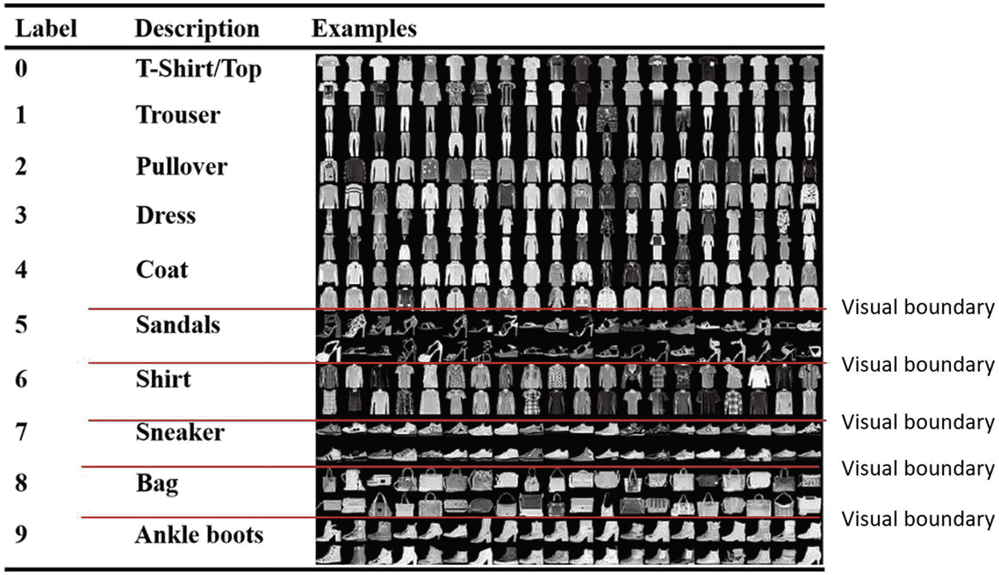

**图 4-4** 可视化时尚 MNIST 数据中的边界

在图 4-4 中，你可以清晰地看到某些类别在视觉上相似，而其他类别则不然。如果我们将训练数据集缩减为仅包含前五个类别（T 恤、裤子、套头衫、连衣裙和外套），那么我们的模型生成将会更简单。

在本例中，我们将对图像的视觉感知等同于期望分布。只要数据易于泛化，这种方法通常效果良好。如果我们观察图 4-4 中的凉鞋组，请注意每张图像的视觉细节。细节也可能意味着需要学习更复杂的期望分布。

这给我们的 GAN 带来问题的另一个原因在于深度学习网络通过微积分进行学习的方式。通过使用微积分，我们的输入数据应始终是连续的。也就是说，它必须展示那些易于泛化且可以在图像间转换的通用数据。以时尚 MNIST 数据集为例，我们可以清楚地看到，将凉鞋这样的图像转换为套头衫在许多情况下并非连续的转换。

我们可以通过重新审视损失计算方式来解决 GAN 中的这些缺陷。R Devon Hjelm 及其同事在一篇题为“边界搜索生成对抗网络”的论文中提出了一个想法。他们提出的想法是使用重要性权重来衡量期望分布的差异。

重要性权重或加权是一种方法，通过该方法，图像或数据集中更重要的特征会被赋予更大的权重或输出。这会产生隔离对特定类别或多个类别重要的特征的效果，从而使模型能够学习更离散或更多样化的类别数据集。

使用重要性采样可以推导出策略梯度解，从而更好地近似损失。重要性采样是一种用于估计重建分布所需的参数化参数的技术。策略梯度方法源于强化学习，是一种使用参数化解来优化损失的简单方法。

强化学习是一种通过奖励来训练模型（也称为*智能体*）进行学习的方法。与无监督学习类似，智能体可以通过试错探索自主学习。这种学习形式未来可能用于生成式建模解决方案，但本书不对此进行探讨。策略梯度方法是强化学习方法的一个子集，它试图通过梯度裁剪来收敛一个策略。

BGAN 与原始 GAN 之间的差异很微妙，最好通过运行一些代码并查看结果来探索。在练习 4-3 中，我们将这样做，并尝试在 MNIST 时尚数据集上再次使用 BGAN。

### 练习 4-3. 使用 BGAN 打破边界

1. 从 GitHub 项目站点打开 `GEN_4_Boundary_Seeking_GAN.ipynb` 笔记本。如果不确定如何操作，请参考附录 B。

2. 通过选择“运行时” ➤ “全部运行”来运行整个笔记本。然后跳过 `imports` 单元格，找到第一个包含 `Hyperparameters` 类的单元格，检查超参数，所有这些参数我们之前都见过。

3. 唯一的主要变化是损失的计算方式以及函数的定义方式，如下所示：

```
def boundary_seeking_loss(y_pred, y_true):
    """
    边界搜索损失。
    参考：https://wiseodd.github.io/techblog/2017/03/07/boundary-seeking-gan/
    """
    return 0.5 * torch.mean((torch.log(y_pred)
    - torch.log(1 - y_pred)) ** 2)
    d_loss_fn = torch.nn.BCELoss()
    generator = Generator()
    discriminator = Discriminator()
    if cuda:
        generator.cuda()
        discriminator.cuda()
        d_loss_fn.cuda()
```

4. 我们可以看到 `boundary_seeking_loss` 函数的定义以及用于计算该损失的公式。该公式如下所示：

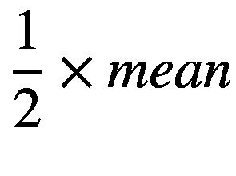

5. 这个公式成为生成器的损失。注意 `y_true` 或 `x` 并未在公式中使用。同样，这与策略梯度方法有关，该方法关注的是预测值而非实际值。

6. 向下滚动到训练代码块，我们可以看到这个新的损失公式是如何在生成器训练中使用的。

7. 高亮显示的行展示了训练循环中唯一的代码更改。通过这一行代码以及对损失计算的细微改动，我们可以显著改变结果。

```
## 生成器损失
gen_imgs = generator(z)
## 衡量欺骗判别器的能力
g_loss = boundary_seeking_loss(discriminator(gen_imgs), valid)
g_loss.backward()
optimizer_G.step()
## 判别器损失
optimizer_D.zero_grad()
real_loss = d_loss_fn(discriminator(real_imgs), valid)
fake_loss = d_loss_fn(discriminator(gen_imgs.detach()), fake)
d_loss = (real_loss + fake_loss) / 2
```

图 4-5 显示了仅训练几个周期后的结果，可以清晰地看到 BGAN 能够识别服装类别并开始生成它们。与最初难以找到共同点的 WGAN 不同，BGAN 几乎可以立即区分不同类别。

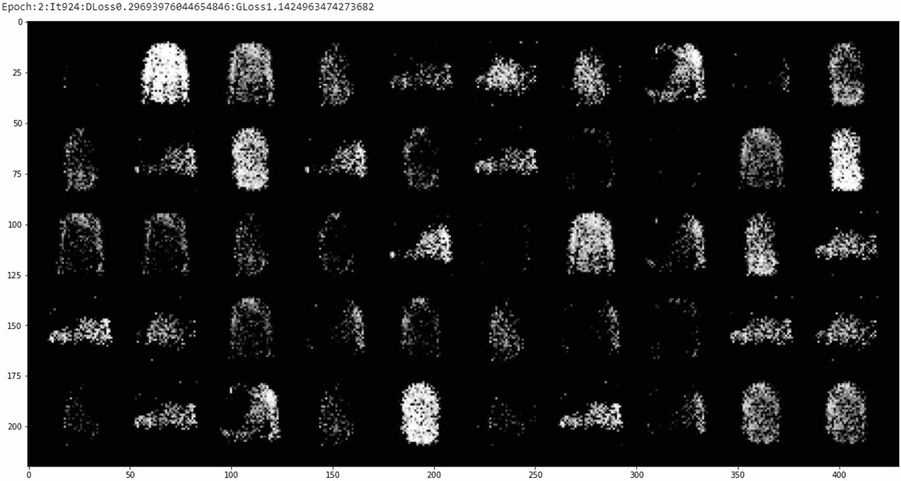

**图 4-5** 在时尚 MNIST 上运行 BGAN 的早期结果

然而，在完全训练 BGAN 之后，结果仍然不完全如我们所愿。这更多是由于类别多样性以及某些类别（如凉鞋）特有的细节量所致。事实上，如果你考虑最终的训练输出，你会注意到那些特殊类别（如凉鞋）的表示效果很差。

我们可以预期，通过更长时间的训练，最终会获得良好的结果，但正如你所见，这个模型仍然存在局限性。边界搜索 GAN 旨在处理具有离散边界的数据，也可能非常适合其他离散形式的数据，例如显示非连续数据的表格数据集。

到目前为止，我们已经看到，生成器和判别器的损失函数中涉及很多内容。在下一节中，我们将探讨另一种改进 GAN 中损失函数的方法。


## 相对论与相对论 GAN

我们研究了两种不同的方法来确定 GAN 中的损失。在普通或标准 GAN 中，损失是以绝对方式衡量的。在 WGAN 中，我们学习了如何使用推土机算法以更相对的方式确定损失。通过采用更相对的方法计算损失，WGAN 能够解决我们在标准 GAN 中之前看到的一些训练缺陷。

相对论 GAN 是另一种使用相对方法计算 GAN 中距离或损失的方法。在标准 GAN 中，判别器估计真实数据为真实的概率，而生成器的工作是增加假数据也被视为真实的概率。然而，RGAN 的作者还希望考虑到生成器，降低真实图像为真实的概率。

考虑到先验知识——它看到的一半数据总是假的，并且假数据变得更真实的概率——使得 GAN 能够利用先前观察到的观测结果来推断图像是真实的还是假的。结果是一个相对论判别器，它能够通过学习来考虑期望分布随时间的变化。

这改变了生成器的损失函数，使其类似于以下形式：

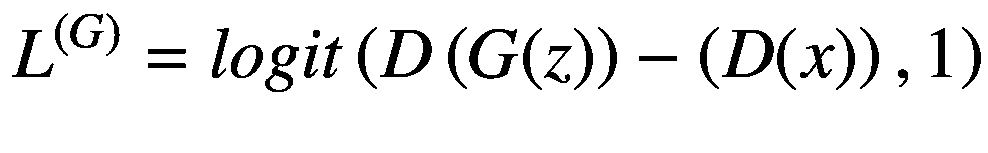

其中：

`logit` = 二元交叉熵 logit 损失函数 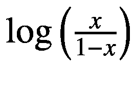。

`logit`函数通常被描述为几率函数，它返回给定期望概率下结果是真实或虚假的几率。

相对论判别器接收两种组合的损失版本，即真实和虚假，由以下公式给出：

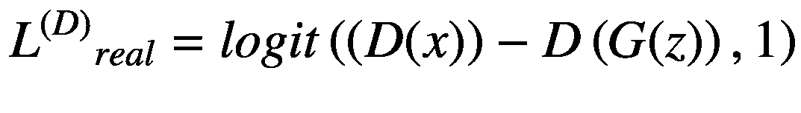

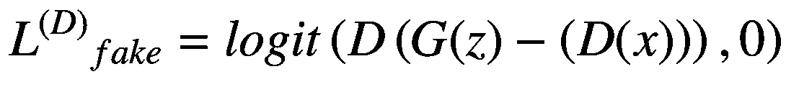

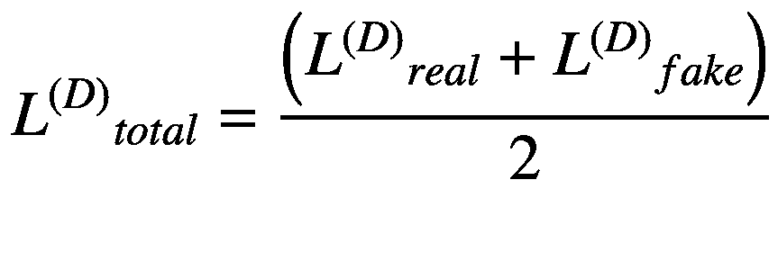

使用`logit`函数将输出从期望概率转换为期望几率。换句话说，不要猜测数据是真实还是虚假，而是猜测数据是真实或虚假的概率或几率。其思想是，根据过去对数据的观察，考虑答案与真实情况可能有多大的差距。

RGAN 的作者还提出了另一种方法，将计算出的几率与真实或预测数据的平均几率进行比较。他们将这种变体称为*相对论平均 GAN*（RaGAN）。

现在我们对损失的工作原理有了更好的理解，可以看看在 PyTorch 中的具体实现。在练习 4-4 中，我们将研究在 Fashion MNIST 数据集上训练的 RGAN 和 RaGAN。

### 练习 4-4. 关联相对论 GAN

1. 从 GitHub 项目站点打开`GEN_4_Relativistic_GAN.ipynb`笔记本。如果不确定如何操作，请参考附录 B。

2. 通过选择“运行时” ➤ “全部运行”来运行整个笔记本。然后跳过`imports`单元格，找到第一个包含`Hyperparameters class`的单元格，检查超参数，这些我们之前都见过。有一个名为`rel_avg_gan`的新超参数，它控制 GAN 是作为 RGAN 还是 RaGAN 运行。

3. 该 GAN 使用卷积进行额外的特征提取。生成器与之前看到的 DCGAN 类似，但判别器的构造不同，如下所示：

```
class Discriminator(nn.Module):
    def __init__(self):
        super(Discriminator, self).__init__()
        def discriminator_block(in_filters, out_filters, bn=True):
            block = [nn.Conv2d(in_filters, out_filters, 3, 2, 1), nn.LeakyReLU(0.2, inplace=True), nn.Dropout2d(0.25)]
            if bn:
                block.append(nn.BatchNorm2d(out_filters, 0.8))
            return block
        self.model = nn.Sequential(
            *discriminator_block(hp.channels, 16, bn=False),
            *discriminator_block(16, 32),
            *discriminator_block(32, 64),
            *discriminator_block(64, 128),
        )
        # 下采样图像的高度和宽度
        ds_size = hp.img_size // 2 ** 4
        self.adv_layer = nn.Sequential(nn.Linear(128 * ds_size ** 2, 1))
    def forward(self, img):
        out = self.model(img)
        out = out.view(out.shape[0], -1)
        validity = self.adv_layer(out)
        return validity
```

4. 注意我们如何定义一个名为`discriminator_block`的内部函数，它设置了卷积层。

5. 现在跳转到训练循环，看看内部代码如何使用我们更新的方程计算损失。

```
## 生成器
optimizer_G.zero_grad()
z = Variable(Tensor(np.random.normal(0, 1, (imgs.shape[0], hp.latent_dim))))
gen_imgs = generator(z)
real_pred = discriminator(real_imgs).detach()
fake_pred = discriminator(gen_imgs)
if hp.rel_avg_gan:
    g_loss = loss_fn(fake_pred - real_pred.mean(0, keepdim=True), valid)
else:
    g_loss = loss_fn(fake_pred - real_pred, valid)
g_loss.backward()
optimizer_G.step()

## 判别器
optimizer_D.zero_grad()
real_pred = discriminator(real_imgs)
fake_pred = discriminator(gen_imgs.detach())
if hp.rel_avg_gan:
    real_loss = loss_fn(real_pred - fake_pred.mean(0, keepdim=True), valid)
    fake_loss = loss_fn(fake_pred - real_pred.mean(0, keepdim=True), fake)
else:
    real_loss = loss_fn(real_pred - fake_pred, valid)
    fake_loss = loss_fn(fake_pred - real_pred, fake)
d_loss = (real_loss + fake_loss) / 2
d_loss.backward()
optimizer_D.step()
```

6. 让示例训练完成，然后返回并将`rel_avg_gan`超参数切换为 false 或 true。然后比较 RGAN 和 RaGAN 的结果。

图 4-6 显示了在 Fashion 数据集上训练 RGAN 的早期结果。如您所见，与我们之前的尝试相比，结果相当令人印象深刻。注意，我们在 DCGAN 中观察到的特征修补问题也已得到解决。您还可以看到服装物品上的精细细节，比如那些有问题的凉鞋。

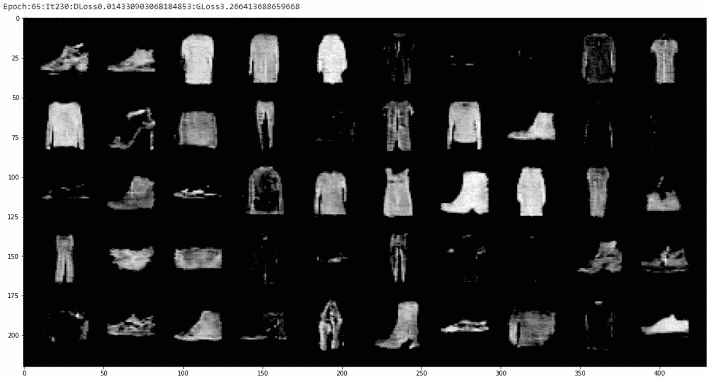

**图 4-6** RGAN 的早期训练结果

到目前为止，我们研究了 GAN 中的几种方法，使用各种损失函数以期改进结果。我们研究了在 WGAN 和 RGAN/RaGAN 中将损失函数的视角从绝对变为相对，以及如何使用边界搜索 GAN 更好地分类离散或越界数据。在下一节中，我们将研究 GAN 的另一种变体，它改进了领域识别和归因。


## 使用 CGAN 进行条件控制

正如我们所看到的，有几种变体可以处理 GAN 中的损失或期望损失。所有这些方法都期望 GAN 能够在没有辅助的情况下学习整个图像或其他数据。这要求 GAN 不仅要学习什么是假的或真的，还要学习数据的潜在域。

潜在域是相对于 GAN 或其他模型的一个隐藏域。GAN 需要自行学习这个域，才能为该域或类别生成逼真的图像。例如，考虑我们整章都在训练的 MNIST 时尚数据集。该数据集包含 10 个类别，其中一些类别比其他类别更独特，GAN 也必须学习这些类别。当我们比较查看更多样化和详细类别（如凉鞋）的结果时，我们看到了这导致了什么问题。

因此，我们可以给 GAN 的简单变通方法或辅助手段就是将标签与数据一起输入，这应该不足为奇。所以，我们不仅告诉 GAN 它有这个图像要学习，还告诉它属于哪个类别或域。通过这样做，我们不再需要改变损失函数，只需要改变通用损失函数的输入，如下所示：

![$$ L={\displaystyle \begin{array}{c}\mathit{\min}\\ {}G\end{array}}{\displaystyle \begin{array}{c}\mathit{\max}\\ {}D\end{array}}\left[\mathit{\log}\left(D\left(x, label\right)\right)+\mathit{\log}\left(1-D\left(G\left(z, label\right)\right)\right)\right] $$](images/502181_1_En_4_Chapter/502181_1_En_4_Chapter_TeX_Equp.png)

这里的主要变化是，我们现在将标签与数据一起输入到判别器和生成器中。通过将标签输入模型，我们减轻了模型自行学习域或类别的难度。相反，我们通过告诉它我们为其标记的类别来给予它一些帮助。

对于纯粹的 AI 或生成式建模，理想情况下，我们不希望必须为数据提供标签，因为这会带入我们人类自身的偏见。每当我们标记数据时，我们都在将人类偏见施加到该数据上。这就是为什么我们通常更倾向于向深度学习模型输入原始的、未标记的数据，让模型自行学习。在原始 GAN 中，我们基本上总是至少对数据进行真实/虚假的标记。

向 GAN 中添加标签将其升级为条件 GAN（CGAN）。我们称之为*条件*，因为我们向 CGAN 提供了域的条件或标签。出于我们的目的，我们将在练习 4-5 中研究 cDCGAN 或条件 DCGAN。

**练习 4-5. 关联相对论 GAN**

1. 从 GitHub 项目站点打开 `GEN_4_cDCGAN.ipynb` 笔记本。如果不确定如何操作，请查阅附录 B。

2. 通过选择 **运行时** ➤ **全部运行** 来运行整个笔记本。然后，查看导入单元格之后，找到第一个包含 `Hyperparameters` 类的单元格，并检查新值 `n_classes = 10`。这将设置作为标签输入到模型中的类别数量。

3. 向下滚动到 `Generator` 类定义，如下所示：

```
    class Generator(nn.Module):
    def __init__(self):
    super(Generator, self).__init__()
    self.label_emb = nn.Embedding(hp.n_classes, hp.n_classes)
    def block(in_feat, out_feat, normalize=True):
    layers = [nn.Linear(in_feat, out_feat)]
    if normalize:
    layers.append(nn.BatchNorm1d(out_feat, 0.8))
    layers.append(nn.LeakyReLU(0.2, inplace=True))
    return layers
    self.model = nn.Sequential(
    *block(hp.latent_dim + hp.n_classes, 128, normalize=False),
    *block(128, 256),
    *block(256, 512),
    *block(512, 1024),
    nn.Linear(1024, int(np.prod(img_shape))),
    nn.Tanh()
    )
    def forward(self, noise, labels):
    gen_input = torch.cat((self.label_emb(labels), noise), -1)
    img = self.model(gen_input)
    img = img.view(img.size(0), *img_shape)
    return img
```

4. 注意在 `forward` 函数中，标签是如何与随机噪声拼接在一起的。标签嵌入是使用一个称为*嵌入*层的特殊层来学习的。嵌入层类似于自编码器，只是其输出是中间学习到的嵌入。

5. 接下来，我们将跳转到 `Discriminator` 类定义，看看如何使用学习到的嵌入以相同的方式输入标签。

```
    class Discriminator(nn.Module):
    def __init__(self):
    super(Discriminator, self).__init__()
    self.label_embedding = nn.Embedding(hp.n_classes, hp.n_classes)
    self.model = nn.Sequential(
    nn.Linear(hp.n_classes + int(np.prod(img_shape)), 512),
    nn.LeakyReLU(0.2, inplace=True),
    nn.Linear(512, 512),
    nn.Dropout(0.4),
    nn.LeakyReLU(0.2, inplace=True),
    nn.Linear(512, 512),
    nn.Dropout(0.4),
    nn.LeakyReLU(0.2, inplace=True),
    nn.Linear(512, 1),
    )
```

6. 从这里开始，我们对代码的其余部分很熟悉，因此可以跳过到训练代码并查看特定部分。

```
    # 生成器
    z = Variable(FloatTensor(np.random.normal(0, 1, (batch_size, hp.latent_dim))))
    gen_labels = Variable(LongTensor(np.random.randint(0, hp.n_classes, batch_size)))
    gen_imgs = generator(z, gen_labels)
    validity = discriminator(gen_imgs, gen_labels)
    g_loss = loss_fn(validity, valid)
    # 判别器
    validity_real = discriminator(real_imgs, labels)
    d_real_loss = loss_fn(validity_real, valid)
    validity_fake = discriminator(gen_imgs.detach(), gen_labels)
    d_fake_loss = loss_fn(validity_fake, fake)
```

7. 这里唯一的主要变化是，我们现在将标签作为输入传递给判别器和生成器。

8. 当你让这个样本运行并观察结果时，它们是否符合你的预期？我们能否添加其他相对形式的损失，如 WGAN 或 RGAN/RaGAN？

```
def forward(self, img, labels):
d_in = torch.cat((img.view(img.size(0), -1), self.label_embedding(labels)), -1)
validity = self.model(d_in)
return validity
```

当这个样本完成时，不幸的是，很明显我们还有更多工作要做。然而，请注意这个模型如何能够从那些困难的类别（如凉鞋）中生成详细的图像。在某些情况下，现在那些困难的类别开始看起来比我们之前的尝试更逼真。

此时，你可以回过头来研究如何将 WGAN 或 RGAN/RaGAN 的损失与 CGAN 或 cDCGAN 结合起来。其中一些工作已经在你可以搜索到的许多其他 GAN 变体中完成了。不过，对我们来说，我们将继续前进，在后面的章节中研究围绕生成式建模的更高级技术。现在，让我们在下一节中总结本章的结论。

## 结论

正如我们在本章中所看到的，有几种 GAN 变体试图通过从不同角度看待损失来提高性能。从标准/原始 GAN 开始，我们看到了如何通过卷积和特征提取来提高性能。我们还研究了以相对方式处理损失的 Wasserstein 和相对论 GAN。然后，我们尝试使用边界和条件 GAN 来处理数据中的学习域或类别。

在本章中，我们还研究了损失方程以及它们在不同变体之间的差异。通过深入挖掘并研究这些方程，我们开始理解损失是如何以绝对或相对方式学习的，并研究了改进那些更难学习的域或类别的方法。

最终，我们希望从本章中学到的是，GAN 容易受到损失以及损失计算方式的影响。理解这一点使我们有能力选择可能与我们数据集相关的正确损失或一组损失方程。毕竟，如果你正在构建一个专门针对你的数据的 GAN，你总是希望尝试几种 GAN 变体，并选择最适合你需求的那一个。

在下一章中，我们将从理解 GAN 中的损失转向探索训练中的变体。


