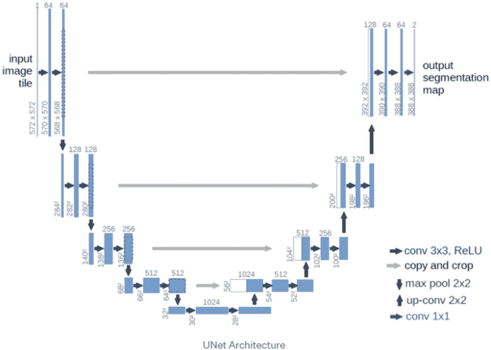
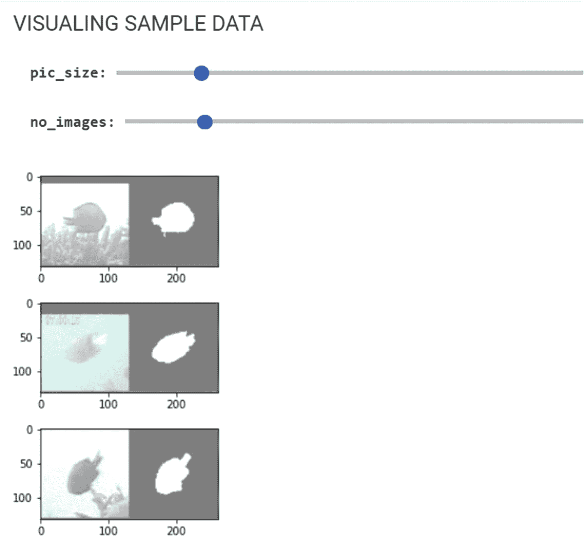
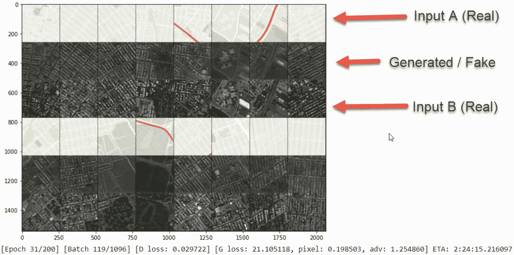
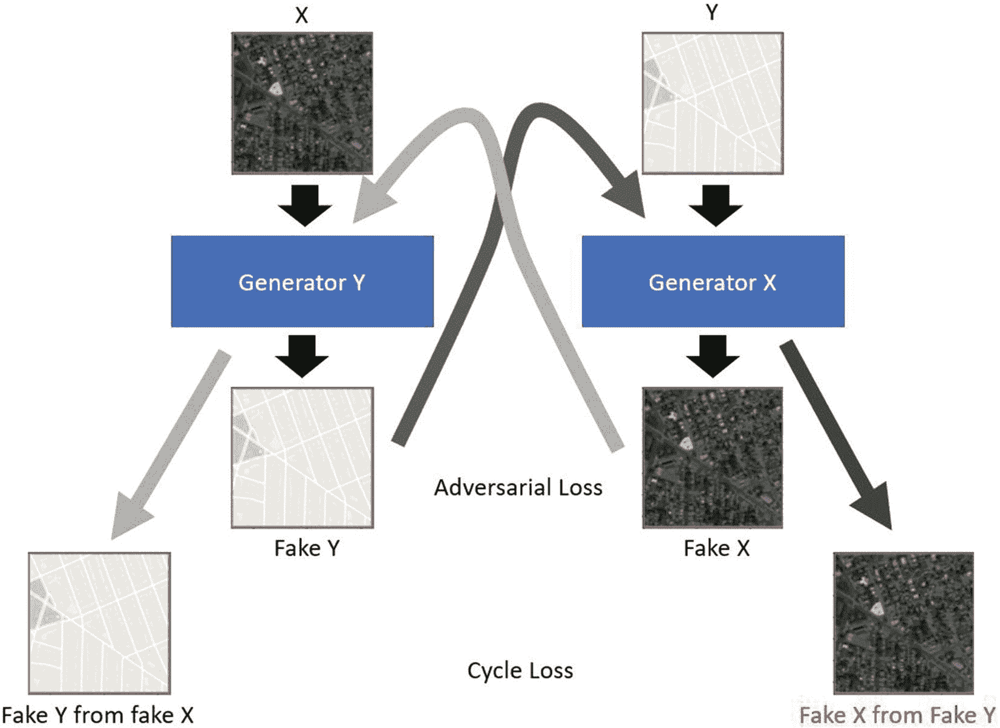
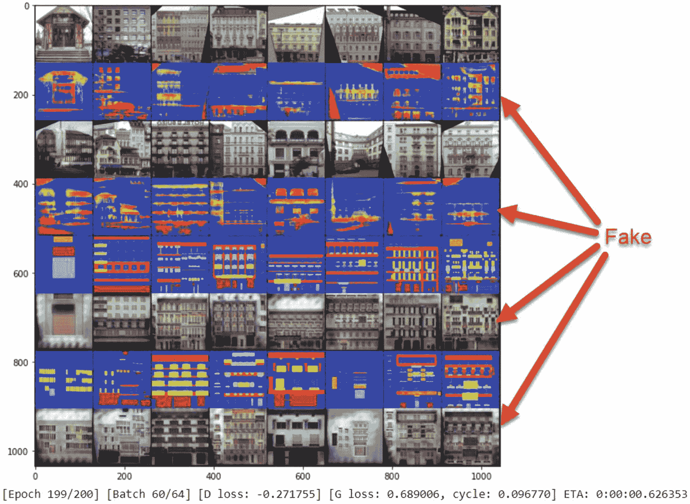
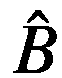
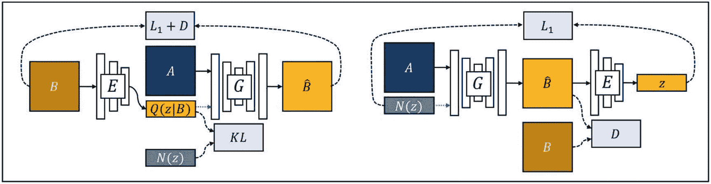
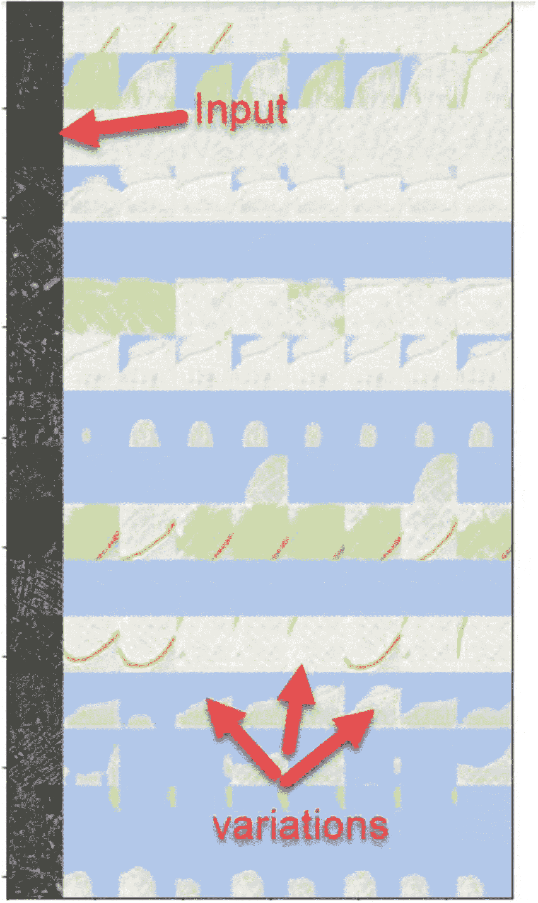
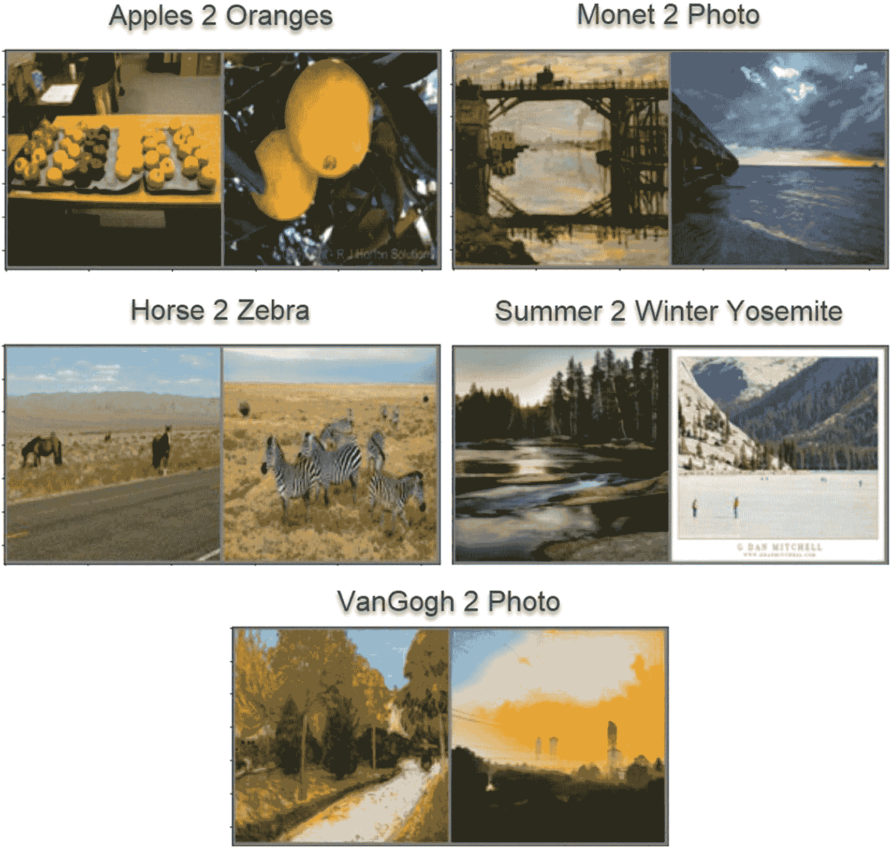
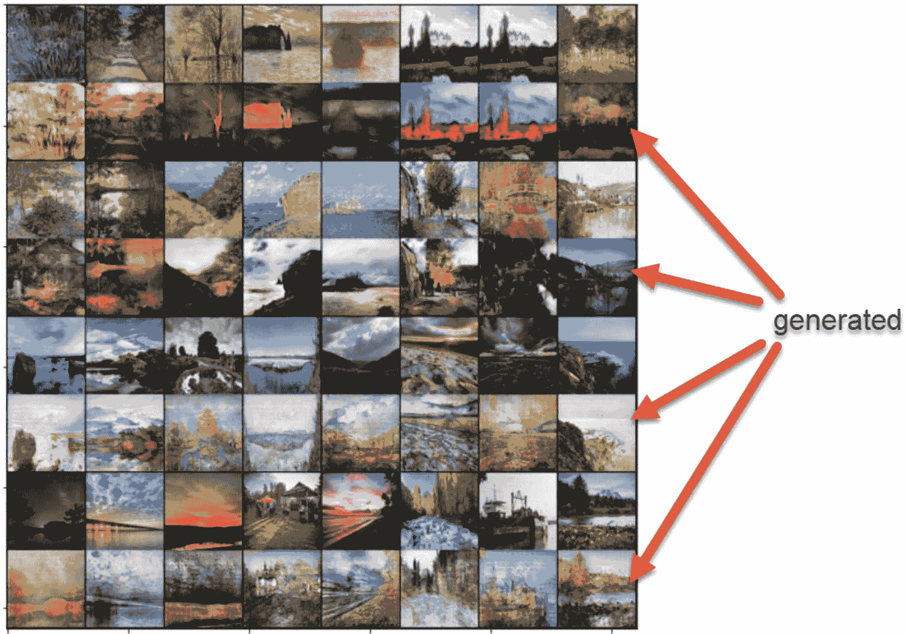

# 5. 图像到图像的内容生成

在相机尚未普及的旧日时光里，若发生特别恶劣的罪行，警方会派一名素描师去采访目击者。其目的是构建出罪犯的肖像或相似图像，以加速抓捕进程。

素描师的工作方式是询问目击者关于面部特征的问题，目击者通过回答“是”或“否”来帮助艺术家更准确地描绘。这个过程与生成对抗网络（GAN）的工作方式颇为相似：素描师扮演生成器，而目击者则扮演判别器。随着时间的推移，素描师不再仅仅依赖口头描述，而是携带视觉辅助工具来帮助目击者匹配特征。

沿用素描师的类比，我们意识到，仅凭简单的文本/标签描述，在识别我们想要生成的特征方面是有限的。现在，我们希望提供通过使用图像来展示生成器应关注的重要特征或特性的能力。

在本章中，我们将从使用属性控制重要特征生成，转向使用实际图像。在深入探讨生成对抗网络之前，我们将先研究如何利用基于 U 型网络（UNet）构建的图像分割来实现图像到图像的转换。我们将揭示 UNet 如何提取和学习特征。

接着，我们将介绍几个通过将一张图像转换为另一张图像来运作的生成对抗网络示例。我们从 Pix2Pix 开始，理解如何使用生成对抗网络进行图像转换。然后，我们将转向 DualGAN，探索双重架构如何增强学习能力。

使用图像到图像的配对来训练图像转换模型是成功的，但它们往往难以理解转换的多样性。也就是说，一张图像可能被转换成多种正确的变体。这与语言中一个短语可以翻译成多种不同说法的情况类似。我们将使用 BicycleGAN 来理解一张图像可能存在的多种转换方式。

最后，在本章结尾，我们将打破配对图像的要求，并介绍我们的第一个生成对抗网络——DiscoGAN，用于执行图像域转换。我们将研究几个有趣的新数据集，并训练模型来实现苹果与橙子、马与斑马，以及莫奈画作与照片之间的转换。

总而言之，本章将涵盖以下内容：

-   使用 UNet 进行图像分割
-   使用 Pix2Pix 进行图像转换
-   使用 DualGAN 实现双重效果
-   在 BicycleGAN 的潜在空间中探索
-   使用 DiscoGAN 发现域

能够生成包含相关特征的内容，使我们能够控制生成器生成我们定义的现实。在本章中，我们将迈出成为生成大师的下一步，并着眼于利用额外的图像特征来增强生成器的训练。在下一节中，我们将探讨从图像中提取特征的关键元素：UNet。

## 使用 UNet 进行图像分割

卷积网络层在提取图像中的局部特征方面表现出色，但它们重建这些相同特征的能力却不尽如人意。回想一下，我们在探索使用 CNN 的生成模型时已经多次看到这一点。这些模型通常无法很好地重建特征，生成的图像通常看起来不过是一块拼凑物。为了解决生成器中的此类问题，我们需要超越简单的 CNN。

UNet 是 CNN 和特征重建的一种扩展，如图 5-1 所示。该架构因其模型形状酷似字母*U*而得名。在内部，仍然使用卷积层，但图像不是通过卷积转置来重建，而是从实际学习到的特征映射中重建。



图 5-1 UNet 架构

回想一下，当在我们的模型中使用 CNN 时，我们经常会在重建图像时使用`ConvTranspose2D`层。这样做的问题在于，学习到的转置特征与原始特征不同。UNet 架构允许模型使用与分类或判别图像时相同的特征来重建或分割图像。

图像分割是理解如何提取和重建关键特征的关键前提。还记得那些素描师吗？他们后来发展到能够分割出面部的各个部分，并使用这些部分来重建新的面孔。当我们开始将图像配对或转换以进行生成时，这正是我们将要做的事情。

不过，在此之前，我们最好先退一步，从实践上理解 UNet 是如何工作的，以及如何用它来提取或分割图像。因此，在练习 5-1 中，我们将构建一个 UNet 模型来提取和分割鱼的图像。在进行这个练习时，我们将讨论架构的修改以及损失的计算方式。

**练习 5-1. 使用 UNet 进行图像分割**



图 5-2 可视化鱼类数据输入图像和掩码（分割区域）

1. 从 GitHub 项目站点打开`GEN_5_UNet.ipynb`笔记本。如果不确定如何操作，请参考附录 B。

2. 通过选择“运行时” ➤ “全部运行”来运行整个笔记本。然后，查看导入单元之后，找到包含`Hyperparameters`类的第一个单元。我们之前已经见过这个示例中的所有超参数。

3. 在超参数之后，下一个代码块提供了直接从 Dropbox 或其他在线资源下载数据集的功能。我们现在将使用专门为本章将要构建的图像到图像模型设计的数据集。

```
from io import BytesIO
from urllib.request import urlopen
from zipfile import ZipFile
zipurl = hp.dataset_url
with urlopen(zipurl) as zipresp:
    with ZipFile(BytesIO(zipresp.read())) as zfile:
        zfile.extractall(image_folder)
print(f"Downloaded & Extracted {zipurl}")
```

4. 在这个代码块之后是一个名为`FishDataset`的新类。随着我们转向更高级的数据，我们通常需要扩展`DataSet`以适应这些新数据集的加载。扩展`Dataset`使我们能够微调`Dataloader`加载数据的方式。在本章及后续章节中，我们将以这种方式扩展`Dataset`类。以下代码显示了该类的开头：


```python
import random
import re
from PIL import Image
from glob import glob

class FishDataset(Dataset):
    def __init__(self, root_dir, transform=None, target_transform=None):
        self.root_dir = os.path.abspath(root_dir)
        self.transform = transform
        self.target_transform = target_transform
        if not self._check_exists():
            raise RuntimeError('Dataset not found.')
        self.images = glob(os.path.join(root_dir, 'fish_image/*/*.png'))
        self.masks = [re.sub('fish', 'mask', image) for image in self.images]
        print(self.masks[0])
        self.labels = [int(re.search('.*fish_image/fish_(\d+)', image).group(1)) for image in self.images]
```

5.  继续向下滚动，找到可以可视化图 5-2 所示图像对的章节。我们现在使用的是**表单**，这是 Colab 的一项特殊功能，允许我们直接在笔记本中添加输入字段。然后，你可以使用这些字段根据调整后的变量来控制单元格的输出。在图中，你可以看到我们将用于训练的图像对样本。这是一张鱼的图像，以及同一张鱼的分割图像。

1.  双击图像可视化代码块以检查代码，你将看到魔法是如何发生的。在标记中，你可以识别出两个字段以及标题上的一个特殊标签`{ run: "auto" }`，该标签告诉单元格在修改任何控件时自动重新运行。尝试一下，并通过滑块调整图像大小和图像数量。

```python
#@title 可视化样本数据 { run: "auto" }
pic_size = 3 #@param {type:"integer"} {type:"slider", min:1, max:30, step:1}
no_images = 3 #@param {type:"integer"} {type:"slider", min:1, max:32, step:1}
```

2.  接下来跳过其他代码块，直到看到创建和设置模型的位置。我们回到创建单个`UNet`类型的模型，并将损失函数定义为二元交叉熵（`BCELoss`）。

```python
cuda = True if torch.cuda.is_available() else False
print("Using CUDA" if cuda else "Not using CUDA")
loss_fn = nn.BCELoss()
model = UNet()
if cuda:
    model.cuda()
    loss_fn.cuda()
```

3.  跳转到训练代码块，查看批次训练循环内部，如下所示：

```python
for batch_idx, (images, masks, _) in enumerate(train_loader):
    images = Variable(images.cuda())
    masks = Variable(masks.cuda())
    optimizer.zero_grad()
    outputs = model(images)
    predicted = outputs.round()
    loss = loss_fn(outputs, masks)
    loss.backward()
    optimizer.step()
```

4.  基于这段代码，你可以看到损失是根据模型输出与输入图像掩码之间的 BCE 差异计算的。因此，与自编码器（我们训练图像输出图像）不同，在这种情况下，我们训练图像输出图像掩码，从而要求模型学习从图像到掩码的映射。

现在，我们有意暂时不解释`UNet`模型，以展示此示例与自编码器之间的相似性。这里的关键区别在于，损失是基于配对的图像掩码而非原始图像计算的。这使得模型能够学习从图像到掩码的转换。在下一节中，我们将详细探讨`UNet`如何实现这一点。

### 揭示 UNet 的细节

简单来说，`UNet`是一种转换器，它允许将输入图像转换为输出，这与自编码器并无不同。`UNet`与自编码器之间的关键区别在于卷积块的使用方式及其连接方式。除此之外，该模型应该感觉像自编码器，但存在一些关键差异。

当然，为了更好地理解这一点，我们应该回到上一个练习中的代码，更详细地查看`UNet`模型。请参见练习 5-2。

**练习 5-2. 探索 UNET 模型**

1.  从 GitHub 项目站点打开`GEN_5_UNet.ipynb`笔记本。如果不确定如何操作，请查阅附录 B。

2.  如果尚未运行，请选择**运行时** ➤ **全部运行**来运行整个笔记本。

3.  向下滚动到定义`UNet`模型的位置，双击单元格以显示代码。我们将从查看`ConvBlock`类开始，这是一个用于封装卷积层的辅助类。其中包括权重的初始化。

```python
class ConvBlock(nn.Module):
    def __init__(self, in_channels, out_channels):
        super().__init__()
        self.conv = nn.Conv2d(in_channels, out_channels, 3, padding=1)
        init.xavier_uniform(self.conv.weight, gain=np.sqrt(2))
        self.batch_norm = nn.BatchNorm2d(out_channels)
        self.leaky_relu = nn.LeakyReLU(0.01)

    def forward(self, x):
        x = self.conv(x)
        x = self.batch_norm(x)
        x = self.leaky_relu(x)
        return x
```

4.  现在转到`UNet`类的开头，查看网络的初始化。注意我们如何定义三个`down`超级层：`down1`、`down2`和`down3`。这些层由`ConvBlock`组成，将通道从较低数量转换为较高数量。它们从 3 开始，然后是 32、64，最后到 128。

在中间层之后，还有三个超级层`up1`、`up2`和`up3`，用于将结果上采样回单个通道。从 128 开始，它们首先上采样到 256，然后到 128，最后到 64。这里的关键区别在于，上采样层不仅仅是向上移动单个值，而是将前一层的值组合起来。当我们查看`forward`函数时，这一点将变得更加明显。

```python
class UNet(nn.Module):
    def __init__(self):
        super().__init__()
        self.down1 = nn.Sequential(
            ConvBlock(3, 32),
            ConvBlock(32, 32)
        )
        self.down2 = nn.Sequential(
            ConvBlock(32, 64),
            ConvBlock(64, 64)
        )
        self.down3 = nn.Sequential(
            ConvBlock(64, 128),
            ConvBlock(128, 128)
        )
        self.middle = ConvBlock(128, 128)
        self.up3 = nn.Sequential(
            ConvBlock(256, 256),
            ConvBlock(256, 64)
        )
        self.up2 = nn.Sequential(
            ConvBlock(128, 128),
            ConvBlock(128, 32)
        )
        self.up1 = nn.Sequential(
            ConvBlock(64, 64),
            ConvBlock(64, 1)
        )
```

5.  在下面的`forward`函数中，你可以看到`UNet`的所有部分是如何组装起来的。从这段代码中，你可以看到前三个`down`层是如何按顺序连接在一起的：`down1` > `down2` > `down3` > `middle`。

```python
def forward(self, x):
    down1 = self.down1(x)
    out = F.max_pool2d(down1, 2)
    down2 = self.down2(out)
    out = F.max_pool2d(down2, 2)
    down3 = self.down3(out)
    out = F.max_pool2d(down3, 2)
    out = self.middle(out)
    out = Upsample(scale_factor=2)(out)
    out = torch.cat([down3, out], 1)
    out = self.up3(out)
    out = Upsample(scale_factor=2)(out)
    out = torch.cat([down2, out], 1)
    out = self.up2(out)
    out = Upsample(scale_factor=2)(out)
    out = torch.cat([down1, out], 1)
    out = self.up1(out)
    out = torch.sigmoid(out)
    return out
```


6. 在中间层之后，我们进入上采样阶段：将中间层的输出与`down3`通过`torch.cat`合并，然后传入`up3`。此过程持续进行，使得 `middle => out`，`(out, down3) -> up3 => out`，`(out, down2)-> up2 => out`，`(out, down1) -> up1 => out`。本质上，在向上传递的每一轮中，我们都会将结果与对应的下采样层合并。这自然会在上采样时复用下采样层中已训练好的特征。

7. 此时，请尝试修改一些超参数，观察这对模型输出有何影响。

8. 尝试修改 UNet 的架构。试着改变每个超级层作为输入或输出使用的通道数。务必考虑在通过上采样层时合并操作的影响。

虽然 U 型网络仍然通过将输入循环回模型来使用卷积提取特征，但我们可以训练出更好的生成器，使其利用相同的已学习特征提取方法。在本章的剩余部分，我们将探讨 UNet 如何增强我们的生成器，尤其是在图像到图像的生成任务中。下一节，我们将研究一组使用 UNet 进行图像到图像学习的新型 GAN。

## 使用 Pix2Pix 进行图像翻译

通过使用 UNet 进行图像分割或翻译，我们看到了模型如何学习从一种图像形式到另一种形式的转换。我们研究了 UNet 如何通过成对的训练图像来学习分割或掩码图像。Pix2Pix GAN 通过引入对抗训练，将这一过程向前推进了一步。

通过 GAN 引入对抗训练，我们可以增强在单个 UNet 模型中使用的损失函数，并进一步分离对损失的解释。这不仅使我们能够进行基于成对基础的训练比较来计算损失，还能使用第二个指标——判别器损失——来确保转换/生成的图像更接近其训练配对图像。参见练习 5-3。

**练习 5-3. 使用 Pix2Pix 进行图像翻译**

1. 从 GitHub 项目站点打开 `GEN_5_Pix2Pix.ipynb` 笔记本。如果不确定如何操作，请查阅附录 B。

2. 如果尚未运行，请选择 **运行时** ➤ **全部运行** 来运行整个笔记本。首先要注意的是，`Hyperparameter` 部分现在提供了使用 Colab 表单配置的替代训练数据集。对于图像到图像的示例，我们提供了三个数据集。`maps` 代表同一区域街道和卫星图像的地图瓦片配对。`facades` 数据集包含建筑外观照片，以及显示代表区域色块的立面配对图。第三个数据集 `cityscapes` 类似于 `facades`，但显示的是带有注释的街道配对视图，而非建筑。

3. 我们可以跳过这段代码的大部分主要部分，因为现在你可能已经熟悉了。向下滚动到生成器/判别器块定义处。这段代码的开头展示了两个用于辅助上采样和下采样的 UNet 类。

```
class UNetDown(nn.Module):
    def __init__(self, in_size, out_size, normalize=True, dropout=0.0):
        super(UNetDown, self).__init__()
        layers = [nn.Conv2d(in_size, out_size, 4, 2, 1, bias=False)]
        if normalize:
            layers.append(nn.InstanceNorm2d(out_size))
        layers.append(nn.LeakyReLU(0.2))
        if dropout:
            layers.append(nn.Dropout(dropout))
        self.model = nn.Sequential(*layers)
    def forward(self, x):
        return self.model(x)

class UNetUp(nn.Module):
    def __init__(self, in_size, out_size, dropout=0.0):
        super(UNetUp, self).__init__()
        layers = [
            nn.ConvTranspose2d(in_size, out_size, 4, 2, 1, bias=False),
            nn.InstanceNorm2d(out_size),
            nn.ReLU(inplace=True),
        ]
        if dropout:
            layers.append(nn.Dropout(dropout))
        self.model = nn.Sequential(*layers)
    def forward(self, x, skip_input):
        x = self.model(x)
        x = torch.cat((x, skip_input), 1)
        return x
```

4. 你可能会注意到 `UNetUp` 类中使用了 `ConvTranspose2D`，这是用于上采样部分的。请记住，对应的下采样超级层会如 `forward` 函数所示进行合并。

5. 然后我们可以向下滚动，查看 `GeneratorUNet` 模型中如何使用 UNet 超级层。

```
class GeneratorUNet(nn.Module):
    def __init__(self, in_channels=3, out_channels=3):
        super(GeneratorUNet, self).__init__()
        self.down1 = UNetDown(in_channels, 64, normalize=False)
        self.down2 = UNetDown(64, 128)
        self.down3 = UNetDown(128, 256)
        self.down4 = UNetDown(256, 512, dropout=0.5)
        self.down5 = UNetDown(512, 512, dropout=0.5)
        self.down6 = UNetDown(512, 512, dropout=0.5)
        self.down7 = UNetDown(512, 512, dropout=0.5)
        self.down8 = UNetDown(512, 512, normalize=False, dropout=0.5)
        self.up1 = UNetUp(512, 512, dropout=0.5)
        self.up2 = UNetUp(1024, 512, dropout=0.5)
        self.up3 = UNetUp(1024, 512, dropout=0.5)
        self.up4 = UNetUp(1024, 512, dropout=0.5)
        self.up5 = UNetUp(1024, 256)
        self.up6 = UNetUp(512, 128)
        self.up7 = UNetUp(256, 64)
        self.final = nn.Sequential(
            nn.Upsample(scale_factor=2),
            nn.ZeroPad2d((1, 0, 1, 0)),
            nn.Conv2d(128, out_channels, 4, padding=1),
            nn.Tanh(),
        )
```


4. 请注意，我们重复使用了多个具有 512 通道输入/输出的`UNetDown`层。我们可以通过模型的`forward`函数看到这种结构是如何组合的。注意，下采样层`d8`被复用为模型的输入，并实际上成为了中间层。

```
def forward(self, x):
    # 带有从编码器到解码器跳跃连接的 U-Net 生成器
    d1 = self.down1(x)
    d2 = self.down2(d1)
    d3 = self.down3(d2)
    d4 = self.down4(d3)
    d5 = self.down5(d4)
    d6 = self.down6(d5)
    d7 = self.down7(d6)
    d8 = self.down8(d7)
    u1 = self.up1(d8, d7)
    u2 = self.up2(u1, d6)
    u3 = self.up3(u2, d5)
    u4 = self.up4(u3, d4)
    u5 = self.up5(u4, d3)
    u6 = self.up6(u5, d2)
    u7 = self.up7(u6, d1)
    return self.final(u7)
```

5. `Discriminator`与我们之前见过的类似，但有一个关键区别。该判别器不是接收单个三通道图像，而是将图像对组合成六个通道作为输入。请注意这如何改变了判别器的`forward`函数。

```
def forward(self, img_A, img_B):
    # 按通道连接图像和条件图像以生成输入
    img_input = torch.cat((img_A, img_B), 1)
    return self.model(img_input)
```

6. 跳转到笔记本底部的`Training`代码块。我们可以看到训练循环中损失计算的一个变化。现在我们的判别器接收图像对。这改变了生成器损失，因为它需要同时考虑重建图像的损失和逐像素比较。请记住，逐像素比较损失是我们会在简单自编码器中使用的损失。生成器损失由判别器损失和经过缩放的逐像素损失组合而成，其中可以通过设置`hp.lambda_pixel`超参数来调整缩放比例。

```
### GAN 损失
fake_B = generator(real_A)
pred_fake = discriminator(fake_B, real_A)
loss_GAN = criterion_GAN(pred_fake, valid)
### 逐像素损失
loss_pixel = criterion_pixelwise(fake_B, real_B)
### 总损失
loss_G = loss_GAN + hp.lambda_pixel * loss_pixel
```

7. 最后，判别器损失的计算方式与其他 GAN 相同，唯一的区别在于输入的是图像对。

```
### 真实损失
pred_real = discriminator(real_B, real_A)
loss_real = criterion_GAN(pred_real, valid)
### 虚假损失
pred_fake = discriminator(fake_B.detach(), real_A)
loss_fake = criterion_GAN(pred_fake, fake)
### 总损失
loss_D = 0.5 * (loss_real + loss_fake)
```

```
dataset_name = "maps" #@param ["facades", "cityscapes", "maps"]
```

训练此练习将使用 Maps 数据集输出图 5-3。从图像中可以看到，第一行图像代表原始街道地图图像。其正下方是生成器生成的输出图像，再下方是训练好的配对图像。接下来的三行图像重复了此模式。



图 5-3

Pix2Pix GAN 的训练输出

如果你观察这些图像，会注意到生成的虚假图像具有相当多的细节。这是将逐像素比较添加到生成器损失中的结果。同样，如果我们将`lambda_pixel`的缩放比例从 100 降低到 10 或 25，那么我们会看到更少的细节。相反，将此值增加到 1000 会使输出图像更接近使用标准逐像素损失时的典型自编码器输出。

Pix2Pix GAN 是首批能够良好运行并产生有趣结果的图像翻译模型之一。Pix2Pix 和 UNet 被广泛用于需要分割和/或变换的各种成像应用中。在下一节中，我们将通过引入双 GAN（DualGAN）来扩展此图像翻译模型。

## 双 GAN：双重视角

按理说，如果我们能训练一个 GAN 来执行单向的图像到图像翻译（例如，从街道图像到卫星图像），那么我们也同样可以逆转这个过程。然后，我们或许还可以通过理解每对生成器/判别器的训练方式来考虑额外的损失指标。

使用双 GAN，我们通过一对生成器和判别器，利用图像配对来执行双向的图像到图像翻译。这使我们能够计算从一个域到另一个域再返回的训练图像的组合损失。这个过程被称为*循环一致性损失*。

循环一致性损失是一种我们将在下一章通过更多示例深入探讨的方法。在此之前，图 5-4 展示了如何基于图像配对计算循环损失。为了计算循环损失，第一组生成的图像被反馈到相反的生成器中，以便基于虚假图像生成新的 X/Y 图像。这种转换和再转换的过程被称为*循环一致性*。



图 5-4

计算对抗损失和循环损失

通过使用循环一致性，两个生成器同时进行训练，交替使用另一个生成器生成的图像作为真实输入。这使得两个生成器都与循环损失紧密耦合。

对于判别器，我们还使用 Wasserstein 梯度惩罚计算来增强损失计算方法。如果你还记得，Wasserstein GAN（WGAN）计算的是两组分布数据之间的相对距离。添加梯度惩罚是一种软化 WGAN 损失函数的方法。

当我们把所有这些结合起来，就得到了我们的第一个双 GAN 实例——双 GAN，我们将在练习 5-4 中演示。这个 GAN 使用两个生成器和两个判别器的组合来协同工作。这意味着配对判别器和生成器的损失计算是相互结合的。我们将在下一个练习中看到这一切是如何整合在一起的。

练习 5-4. 双 GAN：双重视角

1. 从 GitHub 项目站点打开`GEN_5_DualGAN.ipynb`笔记本。如果不确定如何操作，请查阅附录 B。

2. 如果尚未运行，请选择“运行时” ➤ “全部运行”来运行整个笔记本。向下滚动并打开`Hyperparameters`部分；然后查看定义的新变量，总结如下：

```
lambda_adv = 1,
lambda_cycle = 10,
lambda_gp = 10
```

3. `lambda_adv`超参数是对抗损失修正因子。`lambda_cycle`用于缩放循环损失，而`lambda_gp`是梯度惩罚损失，我们稍后会介绍。

4. 我们之前已经多次介绍过大部分代码，因此只需在向下滚动到训练代码块时，快速浏览其他代码部分即可。务必查看模型是如何构建的。我们首先来看生成器损失是如何计算的，如下所示：

```
### 将图像翻译到相反域
fake_A = G_BA(imgs_B)
fake_B = G_AB(imgs_A)
### 重建图像
recov_A = G_BA(fake_B)
recov_B = G_AB(fake_A)
### 对抗损失
G_adv = -torch.mean(D_A(fake_A)) - torch.mean(D_B(fake_B))
### 循环损失
G_cycle = cycle_loss(recov_A, imgs_A) + cycle_loss(recov_B, imgs_B)
### 总损失
G_loss = hp.lambda_adv * G_adv + hp.lambda_cycle * G_cycle
```


5.  我们有两个生成器，一个用于将图像从域 A 转换到域 B，另一个用于从域 B 转换到域 A，分别命名为`G_AB`和`G_BA`。请注意，我们如何将伪造/生成的图像传回相反的生成器，以创建`recov_A`和`recov_B`输出。重新转换后的图像用于计算循环一致性损失。在生成各种图像后，我们首先通过将伪造图像传入相应的判别器`D_A`或`D_B`来计算对抗性损失。接着，通过比较重新转换后的图像与原始图像来计算循环损失。由此，我们确定从生成器 A > B 和 B > A 的完整转换中存在多少误差。最后，通过求和并应用 lambda 缩放超参数来计算总的`G_loss`。

6.  接下来查看判别器部分及其损失计算，如下所示：

```
### 为改进的 Wasserstein 训练计算梯度惩罚
gp_A = compute_gradient_penalty(D_A, imgs_A.data, fake_A.data)
### 对抗性损失
D_A_loss = -torch.mean(D_A(imgs_A)) + torch.mean(D_A(fake_A)) + hp.lambda_gp * gp_A
### 为改进的 Wasserstein 训练计算梯度惩罚
gp_B = compute_gradient_penalty(D_B, imgs_B.data, fake_B.data)
### 对抗性损失
D_B_loss = -torch.mean(D_B(imgs_B)) + torch.mean(D_B(fake_B)) + hp.lambda_gp * gp_B
### 总损失
D_loss = D_A_loss + D_B_loss
D_loss.backward()
optimizer_D_A.step()
optimizer_D_B.step()
```

7.  对于判别器损失，我们使用了特殊的`compute_gradient_penalty`函数，稍后将详细介绍。该函数接收判别器（A 或 B）以及对应域（A 或 B）的真实图像和伪造图像。由此我们计算出两种形式的对抗性损失；`D_A_loss`/`D_B_loss`将常规对抗性损失与之前的梯度惩罚损失相结合，并再次通过`lambda_gp`进行缩放。最后，总损失由两个域 A/B 的损失合并而成。请注意代码末尾我们如何使用两个不同的优化器来训练判别器中的权重。这与生成器形成对比，生成器仅使用一个优化器。

8.  最后一步，我们将回到`compute_gradient_penalty`函数，如下所示：

```
def compute_gradient_penalty(D, real_samples, fake_samples):
    alpha = FloatTensor(np.random.random((real_samples.size(0), 1, 1, 1)))
    interpolates = (alpha * real_samples + ((1 - alpha) * fake_samples)).requires_grad_(True)
    validity = D(interpolates)
    fake = Variable(FloatTensor(np.ones(validity.shape)), requires_grad=False)
    # 获取关于插值点的梯度
    gradients = autograd.grad(
        outputs=validity,
        inputs=interpolates,
        grad_outputs=fake,
        create_graph=True,
        retain_graph=True,
        only_inputs=True,
    )[0]
    gradients = gradients.view(gradients.size(0), -1)
    gradient_penalty = ((gradients.norm(2, dim=1) - 1) ** 2).mean()
    return gradient_penalty
```

9.  该函数基于第 4 章中的 Wasserstein GP 损失。回顾一下，这转换了 Wasserstein 推土机方法，通过使用梯度惩罚而非裁剪函数来衡量分布之间的差异。

如图 5-5 所示，该 GAN 在跨两个域并返回的图像到图像转换学习方面非常高效。结果显示了从域 A 到域 B 再返回的域转换。仅经过几个周期，双 GAN 就能轻松完成域到域转换的学习。

从图像到图像的配对转换，我们可以开始考虑图像转换模型的其他可能性。在下一节中，我们将考虑第一个假设并非每张图像都有唯一正确转换的模型。



图 5-5

DualGAN 用于图像到图像转换的训练输出

## 驾驭 BicycleGAN 的潜在空间

图像配对转换的一个主要缺陷是假设每张图像只有一种正确的转换。但情况往往并非如此，一种语言中的一张图像或一个短语在另一个域中可能有多个正确的含义。

BicycleGAN 引入了这样一个假设：每个输入图像都有多个正确的转换，而不仅仅是一个。然而，为了实现这一壮举，这种形式的 GAN 使用了一位老朋友——变分自编码器，以更好地映射学习到的分布。

现在，该模型不再使用配对的生成器和判别器，而是使用一个生成器和一个 VAE 编码器，如图 5-6 所示。从图中，A 和 B 表示不同的图像域，其中表示 A 的输出。*G*表示生成器，*E*表示编码器，而*D*当然是判别器。函数*N*(*z*)和*Q*(*z*|*B*)是采样函数，其输出被传递到*KL*块。KL 代表 Kullback-Leibler，是衡量分布输出差异的另一种方法。



图 5-6

BicycleGAN 架构

*L1*和*L1+D*表示循环损失，即从转换到再返回的损失量。我们将在第 6 章中介绍循环损失的其他示例。

图 5-6 应能提供 BicycleGAN 工作原理的基本直觉，但我们当然也想深入代码并观察其运行。在练习 5-5 中，我们使用 BicycleGAN 从单个图像配对生成多个可能的转换。

练习 5-5. 驾驭潜在空间



图 5-7

训练 BicycleGAN 的示例输出

1.  从 GitHub 项目站点打开`GEN_5_BicycleGAN.ipynb`笔记本。如果不确定如何操作，请查阅附录 B。如果尚未运行，请通过选择“运行时”➤“全部运行”来运行整个笔记本。向下滚动并打开`Hyperparameters`部分，查看定义的新变量，总结如下：

```
lambda_pixel=10,
lambda_latent=.5,
lambda_kl=.01
```

2.  这些超参数都用于缩放各种损失输出。其中`pixel`表示逐像素损失，`latent`表示来自编码器的潜在空间编码损失，`kl`表示来自学习分布的 Kullback-Leibler 损失。

3.  向下滚动到模型部分，特别是`Encoder`模型，如下所示：

```
class Encoder(nn.Module):
    def __init__(self, latent_dim, input_shape):
        super(Encoder, self).__init__()
        resnet18_model = resnet18(pretrained=False)
        self.feature_extractor = nn.Sequential(*list(resnet18_model.children())[:-3])
        self.pooling = nn.AvgPool2d(kernel_size=8, stride=8, padding=0)
        # 输出是 mu 和 log(var)，用于 VAE 中的重参数化技巧
        self.fc_mu = nn.Linear(256, latent_dim)
        self.fc_logvar = nn.Linear(256, latent_dim)

    def forward(self, img):
        out = self.feature_extractor(img)
        out = self.pooling(out)
        out = out.view(out.size(0), -1)
        mu = self.fc_mu(out)
        logvar = self.fc_logvar(out)
        return mu, logvar
```

4.  关于`Encoder`类，有几点关键事项需要注意。首先，该编码器使用一个名为`resnet18`的现有模型作为特征提取器。我们将在第 6 章中了解更多关于 ResNet 模型的信息，以及如何重用预训练模型。使用预训练模型被称为*迁移学习*。

5.  接下来，我们将简要总结模型和优化器的创建方式：


```python
generator = Generator(hp.latent_dim, input_shape)
encoder = Encoder(hp.latent_dim, input_shape)
D_VAE = MultiDiscriminator(input_shape)
D_LR = MultiDiscriminator(input_shape)
optimizer_E = torch.optim.Adam(encoder.parameters(), lr=hp.lr, betas=(hp.b1, hp.b2))
optimizer_G = torch.optim.Adam(generator.parameters(), lr=hp.lr, betas=(hp.b1, hp.b2))
optimizer_D_VAE = torch.optim.Adam(D_VAE.parameters(), lr=hp.lr, betas=(hp.b1, hp.b2))
optimizer_D_LR = torch.optim.Adam(D_LR.parameters(), lr=hp.lr, betas=(hp.b1, hp.b2))
```

我们可以看到构建了四个模型，每个模型都有各自的优化器。请注意我们如何区分判别器损失模型：`D_VAE` 衡量编码器的准确率，而 `D_LR` 衡量生成器的准确率。

最后，除了模型配置之外，训练代码大部分应该是熟悉的。参考图 5-6 有助于解释代码。我们将重点介绍一个关键部分，如下所示：

```python
mu, logvar = encoder(real_B)
encoded_z = reparameterization(mu, logvar)
fake_B = generator(real_A, encoded_z)
### VAE 翻译图像的像素级损失
loss_pixel = mae_loss(fake_B, real_B)
### 编码 B 的 Kullback-Leibler 散度
loss_kl = 0.5 * torch.sum(torch.exp(logvar) + mu ** 2 - logvar - 1)
### 对抗性损失
loss_VAE_GAN = D_VAE.compute_loss(fake_B, valid)
```

这段代码中令人困惑或棘手的部分是编码器模型的输出；`mu` 和 `logvar`（方差）被用作 `reparameterization` 函数的输入。该函数只是转换这些值并从该空间重新采样。回想一下标准 VAE 中是如何完成此操作的。然后，这个编码后的值与一张真实图像一起被传入生成器。接着，我们使用像素级比较、`KL` 散度和判别器损失来衡量损失。请务必进一步查看损失计算代码的其余部分。

在笔记本的底部，您将看到训练输出，如图 5-7 所示。在输出中，您可以看到对于每张输入图像，都会输出多个变体。这些变体通过使用 VAE 编码器学习模型中使用的域分布来控制。

BicycleGAN 背后的概念对于我们思考翻译配对时的后续方向至关重要。然而，在准确性方面，该模型缺乏跨域映射的能力，如图 5-7 所示。更进一步，接下来我们将考虑如何在没有配对的情况下进行跨域翻译。

## 使用 DiscoGAN 发现域

图像或语言的翻译通常使用配对数据集完成。例如，对于语言，这通常是两种语言中可比的短语。在我们之前的图像案例中，同一图像的配对以某种形式进行了翻译。

当然，现在使用未配对的短语进行跨语言的准确翻译是不太可能的。然而，在这些类型的翻译任务中，通过未配对数据可以学习到的是域的本质或风格。

DiscoGAN 旨在捕获并允许在未配对图像之间进行风格翻译。它通过结合两个生成器上的对抗性损失、像素损失和循环损失来实现这一点。其效果允许将马翻译成斑马，或将苹果翻译成橙子，正如我们将在练习 5-6 中看到的那样。

### 练习 5-6. 使用 DiscoGAN 发现域



**图 5-8** 未配对图像到图像数据集示例

1. 从 GitHub 项目站点打开 `GEN_5_DiscoGAN.ipynb` 笔记本。如果不确定如何操作，请参考附录 B。

2. 这个 GAN 提供了多个示例数据集，我们将在此示例以及后续章节的更多示例中使用它们。图 5-8 显示了可用数据集的摘要以及匹配图像的外观。请务必选择您想要的数据集，然后运行整个笔记本。从菜单中选择 **运行 ➤ 全部运行**。

3. 请随意探索各种数据集，并熟悉它们在训练过程中的外观。这对于我们稍后探索再次使用这些数据集的其他示例练习来说，将是一个很好的实践。

4. 现在，这个示例中的大部分代码应该都是复习内容。因此，我们将只关注模型和优化器的创建，如下所示：



**图 5-9** 跨域训练示例，从梵高风格到莫奈风格

5. 同样，这个 GAN 中有两个生成器和两个判别器。虽然两个生成器共享一个优化器，但判别器使用各自的优化器。

6. 跳转到训练代码，特别是损失计算部分。我们将重点介绍生成器中循环损失的计算方式，如下所示：

```python
fake_B = G_AB(real_A)
loss_GAN_AB = adversarial_loss(D_B(fake_B), valid)
fake_A = G_BA(real_B)
loss_GAN_BA = adversarial_loss(D_A(fake_A), valid)
loss_GAN = (loss_GAN_AB + loss_GAN_BA) / 2
### 像素级翻译损失
loss_pixelwise = (pixelwise_loss(fake_A, real_A) + pixelwise_loss(fake_B, real_B)) / 2
loss_cycle_A = cycle_loss(G_BA(fake_B), real_A)
loss_cycle_B = cycle_loss(G_AB(fake_A), real_B)
loss_cycle = (loss_cycle_A + loss_cycle_B) / 2
### 总损失
loss_G = loss_GAN + loss_cycle + loss_pixelwise
```

7. 首先计算对抗性损失（`loss_GAN`），然后是像素级损失，最后是循环损失。所有三个损失合并为生成器总损失（`loss_G`）。

8. 让模型在各种数据集上训练。每次切换数据集后，请务必重置模型。否则，您将遇到奇怪的结果。

9. 您也可以选择连续训练多个数据集，从而让 GAN 学习多种域风格并将它们组合起来。图 5-9 展示了这样一个训练示例，该训练首先在 Monet 2 Photo 数据集上训练，然后切换到 VanGogh 2 Photo 数据集。

```python
G_AB = GeneratorUNet(input_shape)
G_BA = GeneratorUNet(input_shape)
D_A = Discriminator(input_shape)
D_B = Discriminator(input_shape)
optimizer_G = torch.optim.Adam(
itertools.chain(G_AB.parameters(), G_BA.parameters()), lr=hp.lr, betas=(hp.b1, hp.b2)
)
optimizer_D_A = torch.optim.Adam(D_A.parameters(), lr=hp.lr, betas=(hp.b1, hp.b2))
optimizer_D_B = torch.optim.Adam(D_B.parameters(), lr=hp.lr, betas=(hp.b1, hp.b2))
```

这个练习的输出很有趣，因为它展示了域风格翻译是如何生效的。在某些情况下，经过短时间的训练，艺术作品和照片看起来就相当可信。如您所见，DiscoGAN 是跨图像翻译域/风格的有效解决方案。

请务必使用多种变体或不同数据来探索和尝试前面的练习。可视化该模型如何跨域和交叉域进行训练可能会很有启发性，尤其是当您尝试调整模型中的一些超参数时。


## 结论

在本章中，我们探讨了如何将图像生成的带宽提升至图像转换/生成模型。我们首先通过用于图像分割的`UNet`编码结构来探索这一概念，并研究了鱼类图像的分割。随后，我们将`UNet`模型应用于基于`Pix2Pix`的图像到图像转换，并进一步升级到`DualGAN`——一种使用两个生成器和两个判别器的生成对抗网络。

在理解图像到图像转换的基础上，我们继续探索其他形式的图像或领域转换。首先研究了`BicycleGAN`，它基于每个输入存在多种转换的假设。接着我们转向`DiscoGAN`，用于执行非配对图像风格的领域迁移。

本章使用的技术已扩展到许多通常利用图像进行分析的领域。例如在医学领域，图像到图像转换和分割 GAN 为医疗诊断提供了卓越支持，甚至能够通过识别从乳腺癌到心脏问题等各种疾病的诊断标志物，超越该领域的医学专家。

在下一章中，我们将继续探索使用非配对图像进行领域转换，以及如何进一步控制此类输出变化。

