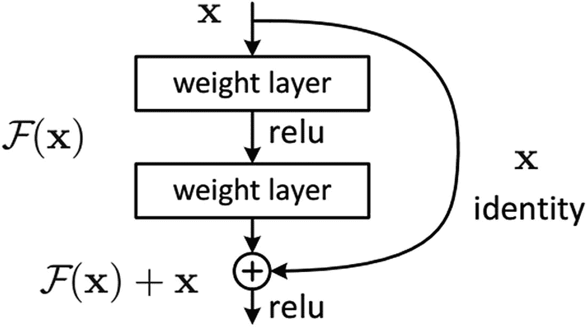
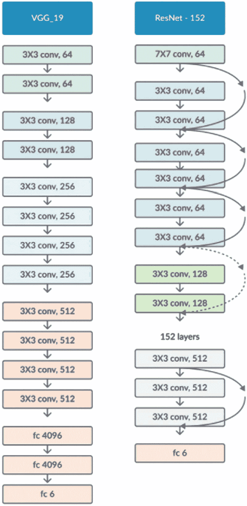
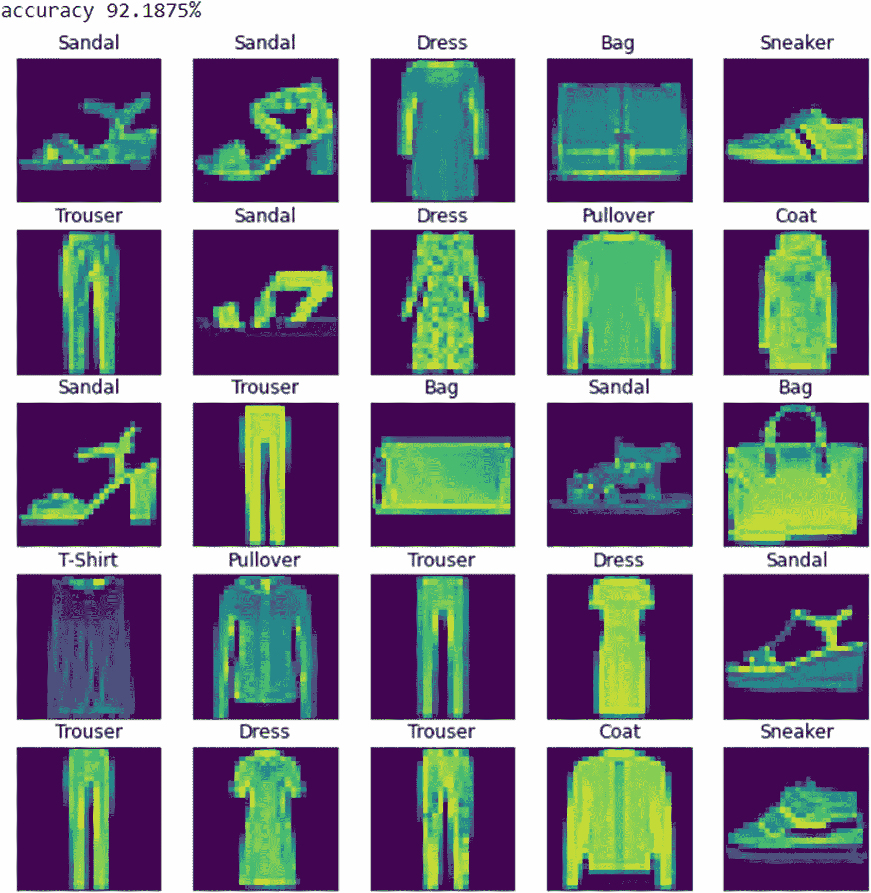
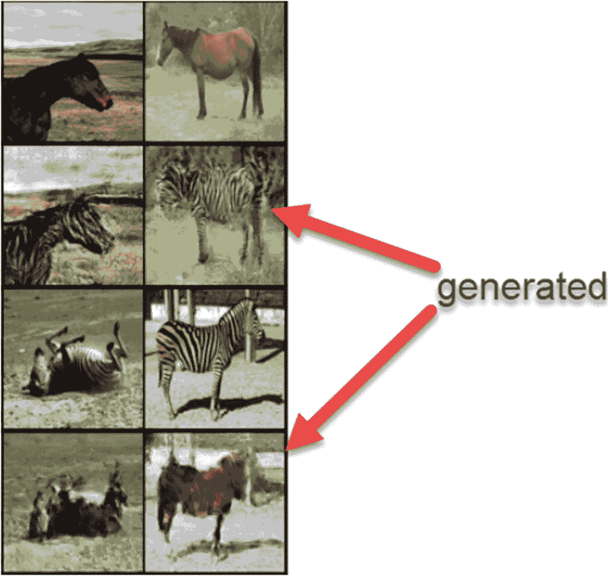
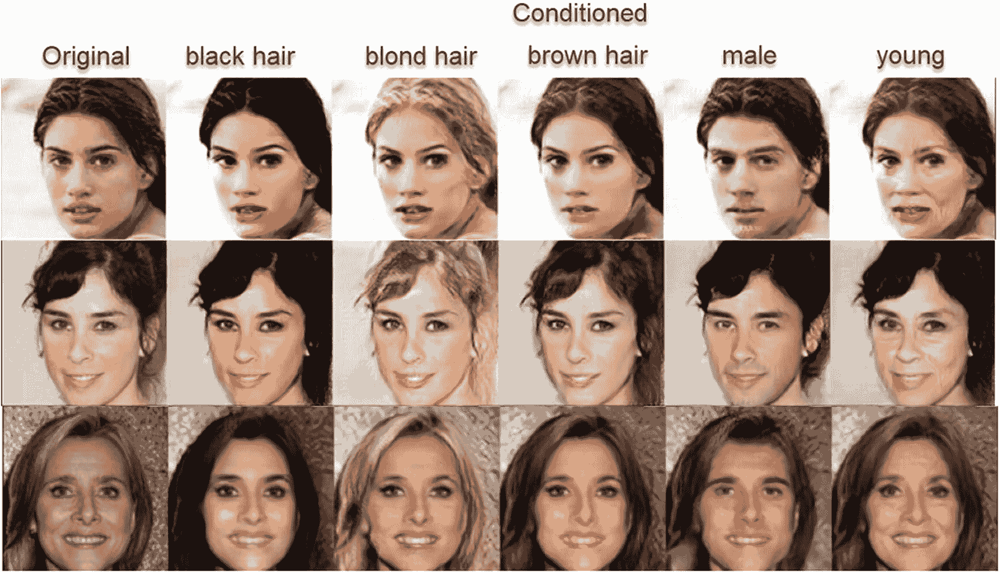
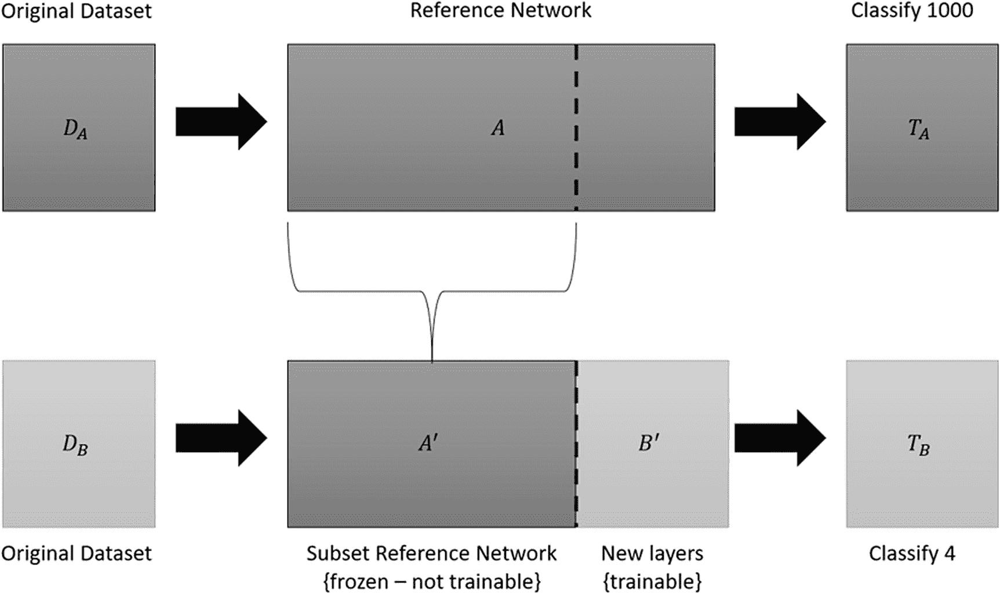
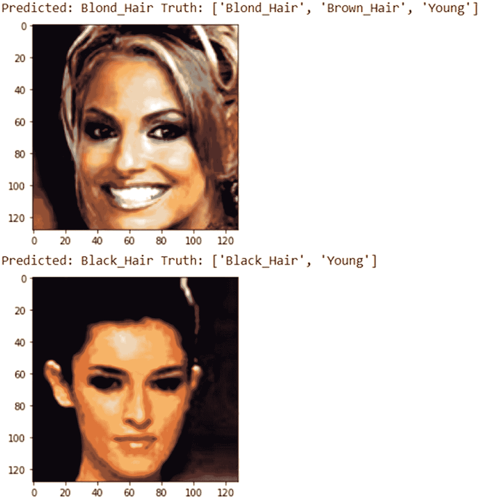
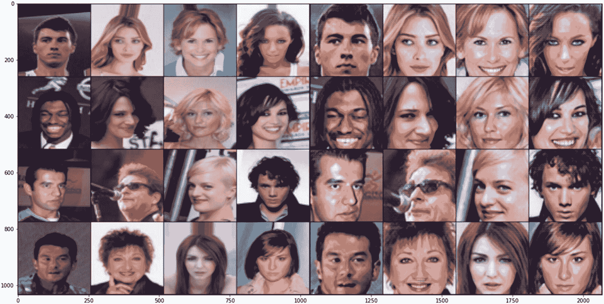

# 6. 残差网络生成对抗网络

生成对抗网络和对抗训练在概念上确实无限广阔，但在执行和实现中往往有所欠缺。正如我们在本书中反复看到的，失败通常源于生成器。而我们也已认识到，优秀 GAN 的关键在于优秀的生成器。

GAN 中的判别器本质上只是一个分类器，通常甚至是一个简单的二分类器。事实上，现在常见的做法是构建一个 GAN 来训练判别器/分类器。GAN 会在数据集上针对二分类任务进行训练，训练完成后生成器被丢弃。这样不仅能得到一个准确的分类器，而且分类器还具备鲁棒性。

通过对抗学习，分类器可以在生成器提供的更广阔训练空间中学习到更好的近似。生成器通过试图欺骗判别器/分类器，使其更好地学习和逼近，从而填补那些潜在空间。因此，在真实数据上训练的分类器也能学会识别同一数据的近似伪造版本。

事实证明，构建一个好的判别器远比创建好的生成器容易，这源于学习问题的本质。生成器需要精细地理解特征和目标分布，以便重现这些特征；而判别器只需分类特征之间的差异或距离。

我们之前已经看到卷积神经网络如何帮助提取这些特征，但发现这些特征在重建时往往表现为斑块或斑点。随后我们研究了`UNet`，它能够将学习到的特征转换回生成输出。正如我们在第 5 章所见，这可以产生更好的生成输出。

在本章中，我们将迈出特征提取机制的下一步演进：残差块和残差网络（`ResNet`）。我们将深入剖析并理解`ResNet`和残差块如何用于分类，学习这些模型如何绕过深度 CNN 网络中的深度层问题。

随着我们开发的模型不断使用更大、更复杂的特征提取器，我们将转向理解如何重用现有的预训练模型。重用预训练标准化模型被称为*迁移学习*，我们将通过一个使用预训练模型进行分类的简单示例来探索这一概念。

我们还将整合所有这些新知识，研究三种使用`ResNet`构建更好生成器的 GAN 变体。第一种是`CycleGAN`及其扩展的非配对图像到图像生成器。第二种是专门用于从名人面部图像中学习并有条件地生成面部的 GAN。

最后，我们将以超分辨率 GAN（`SRGAN`）作为本章的结尾，该 GAN 结合了从`ResNet`到预训练鲁棒特征提取器的多种模型优势。我们将使用`SRGAN`来提升一些名人面部图像的分辨率。

随着本书的深入，示例将变得愈发复杂，因此为节省篇幅，仅展示重要代码片段。在阅读本章时，打开代码文件可能会更有帮助。以下是本章将要涵盖的内容：

* 理解残差网络
* 使用`CycleGAN`再次循环
* 使用`StarGAN`生成面部
* 利用迁移学习实现最佳效果
* 使用`SRGAN`提升分辨率

我们将继续基于前几章的知识进行构建。如有需要，请务必复习卷积网络及特征提取/生成的相关内容。正如我们将在下一节中看到的，残差网络是卷积层的大规模使用者。


## 理解残差网络

正如我们在前几章和练习中所见，为了更有效地学习特征提取，我们常常需要增加网络的深度。然而，我们也了解到，网络层数越深，出现的问题就越多，例如由特征过度提取常导致的梯度爆炸或梯度消失。

当卷积网络层变得过深时，即使进行了归一化处理，仍然会产生难以映射的潜在曲面，从而引发特征过度提取。其结果是模型过度强调某些特征，而忽略了其他不那么常见的特征。

我们在许多使用多层卷积的生成对抗网络（GAN）中已经看到了大量特征过度提取的例子。这可以通过生成图像中的明亮区域来识别。

残差网络和残差块试图通过允许跳过某些层来克服这种特征过度效应，从而使模型能够忽略那些可能过度强调特征的层。残差网络通过在卷积过程之后，将残差输出从块的顶部传递到底部来实现这一点。

图 6-1 展示了一个单独的残差块。在图中，输入 `x` 进入第一个权重层，并绕过它到达底部的 `+` 节点。`F(x)` 表示使用权重层对 `x` 应用的卷积函数。在块的底部，你可以看到输出是 `F(x) + x`，其中 `x` 是来自块起始位置的残差。



图 6-1

一个单独的残差块

通过将残差输入从块的顶部传递到底部，我们有效地减少并归一化了对权重层的依赖。这反过来又减少了由特征过度提取引起的梯度爆炸/消失。这样做还有一个好处，就是能够显著增加网络深度。

图 6-2 展示了一个 19 层网络（参考 VGG19）与 ResNet152（一个使用 152 层的残差网络）的对比。在 ResNet 模型中，你可以看到残差卷积块之间的跳跃连接。想想 ResNet152 与简单的 VGG19 相比有多深。

牛津大学的视觉几何组（VGG）开发了一套使用卷积的标准化模型。在 VGG19 中有 19 层，其中 16 层是卷积层，3 层是线性扁平层。

我们可以通过再次查看 fashion MNIST 数据集，了解残差网络中的残差块如何用于一个简单的分类问题。这次我们将构建一个带有残差网络的简单模型来学习如何对时尚物品进行分类。请打开你的电脑，准备探索练习 6-1。



图 6-2

常规卷积网络与 ResNet 的对比

### 练习 6-1. 残差网络分类器

1.  从 GitHub 项目站点打开 `GEN_6_ResNet_classifier.ipynb` 笔记本。如果不确定如何操作，请查阅附录 B。

2.  通过选择“运行时” ➤ “全部运行”来运行整个笔记本。此笔记本的大部分代码应该很熟悉。因此，我们将只关注新的或重要的部分。

3.  你可以向下滚动到 RESNET 模型块，查看前两个辅助函数。第一个函数 `preprocess` 用于交换和设置张量。第二个是 `conv` 函数，它是创建卷积层的一个包装器。

```
    def preprocess(x):
    return x.view(-1, 1, 28, 28)
    def conv(in_size, out_size, pad=1):
    return nn.Conv2d(in_size, out_size, kernel_size=3, stride=2, padding=pad)
```

4.  紧接着下面是 `ResidualBlock` 类的定义。请记住，一个单独的残差块允许输入残差绕过训练层，然后通过跳跃连接在底部相加。

```
    class ResBlock(nn.Module):
    def __init__(self, in_size:int, hidden_size:int, out_size:int, pad:int):
    super().__init__()
    self.conv1 = conv(in_size, hidden_size, pad)
    self.conv2 = conv(hidden_size, out_size, pad)
    self.batchnorm1 = nn.BatchNorm2d(hidden_size)
    self.batchnorm2 = nn.BatchNorm2d(out_size)
    def convblock(self, x):
    x = nn.functional.relu(self.batchnorm1(self.conv1(x)))
    x = nn.functional.relu(self.batchnorm2(self.conv2(x)))
    return x
    def forward(self, x): return x + self.convblock(x) # 跳跃连接
```

5.  再下面是构建 `ResidualNetwork` 类的地方。注意这里有两个 `ResBlocks` 残差块按顺序连接，输出在最后/输出端经过批归一化和最大池化处理。

```
    class ResNet(nn.Module):
    def __init__(self, n_classes=10):
    super().__init__()
    self.res1 = ResBlock(1, 8, 16, 15)
    self.res2 = ResBlock(16, 32, 16, 15)
    self.conv = conv(16, n_classes)
    self.batchnorm = nn.BatchNorm2d(n_classes)
    self.maxpool = nn.AdaptiveMaxPool2d(1)
    def forward(self, x):
    x = preprocess(x)
    x = self.res1(x)
    x = self.res2(x)
    x = self.maxpool(self.batchnorm(self.conv(x)))
    return x.view(x.size(0), -1)
```

6.  接下来要关注的是各种重要的代码片段或行，如下所示。第一行显示了我们使用的损失函数。交叉熵损失是分类问题的标准选择。之后是一个名为 `accuracy` 的函数。`accuracy` 函数返回分类与一组输出匹配的准确率百分比。它的工作原理是获取最大预测值，并使用 `argmax` 找到索引。然后它将正确的输出与标签进行比较，返回一个介于 0.0 和 1.0 之间的值，即 0% 到 100%。

```
    loss_fn = nn.CrossEntropyLoss()
    def accuracy(pred, labels):
    preds = torch.argmax(pred, dim=1)
    return (preds == labels).float().mean()
```

7.  让模型训练直至完成，并注意模型训练时的输出。我们应该看到训练集和测试集的损失都在下降，并且两个数据集的准确率都在提高。如果模型训练良好，损失和准确率的两条曲线应该相互跟随。测试集和训练集之间的损失或准确率出现差异是过拟合或欠拟合的结果。

8.  撇开数字不谈，查看实际结果通常很有帮助，因此笔记本上的最后一个代码块提供了实际的视觉确认。在此代码块中，我们从 `testloader` 中采样一批图像/标签，然后将它们传入模型以输出预测结果 `preds`。然后我们需要使用 `torch.max` 将这些预测结果转换回标签/索引。之后，打印模型准确率（乘以 100），并绘制带有标签的图像。

```
    dataiter = iter(testloader)
    images, labels = dataiter.next()
    preds = model(images.cuda())
    values, indices = torch.max(preds, 1)
    print(f"accuracy {accuracy(preds, labels.cuda()).item()*100}%")
    plot_images(images.cpu().numpy(), indices.cpu().numpy(), 25)
```

9.  图 6-3 展示了一组带有预测标签的图像。虽然准确率超过 92%，但我们在输出图像中可以看到没有图像被错误标记。

在运行上一个练习时，你理想中注意到的一件事是这个模型训练得有多快。该模型最初设置为仅训练五个周期，在大多数情况下可以迅速达到 90% 的准确率。如果你训练这个模型更长时间，它应该能轻松超过该数据集 90% 的准确率。


## 残差网络与 CycleGAN

如你所见，残差网络为更深的网络提供了更高的稳定性，并能提升训练性能。进而，它们使得更深的网络能够学习到不会因过度特征提取而受损的特征集。

在掌握了这一强大的新工具后，我们可以重新审视它如何改进 GAN 的变体。接下来，我们将再次从 CycleGAN 开始，研究无配对图像到图像的翻译。



**图 6-3** 预测准确率与标注输出

### 再次循环：CycleGAN

循环一致性 GAN（CycleGAN）的主要损失机制是循环损失。回顾一下，我们在第 5 章中已经介绍过循环损失。循环一致性损失是通过将一个物品翻译成另一种形式，然后再翻译回原始形式来衡量的，其损失值取决于原始输出与两次翻译后输出的对比效果。

虽然 CycleGAN 以其主要的损失判定方法命名，但它也结合了其他损失方法作为保障。这种 GAN 变体在生成器上使用了三种损失：对抗性损失（即标准 GAN 损失）、循环损失和身份损失。

身份损失衡量的是图像上的颜色变化或色温变化。如果没有身份损失，生成的输出可能会呈现出与期望输出截然不同的色调。CycleGAN 不一定非要包含身份损失，但它能使输出更加统一。

由于我们已经介绍过这种 GAN 的变体（BicycleGAN 和 DiscoGAN），我们可以快速进入练习环节。练习 6-2 将与我们之前在第 5 章中看到的 DiscoGAN 练习类似。在进入练习时，我们还会进一步介绍一些变体，比如身份损失。

### 练习 6-2：使用 CycleGAN 进行循环与身份映射

1. 从 GitHub 项目站点打开`GEN_6_CycleGAN.ipynb`笔记本。如果不确定如何操作，请参考附录 B。

2. 该笔记本的大部分代码应该很熟悉，但我们仍将介绍其中显示的新增或不同的超参数。`n_residual_blocks`超参数允许我们控制生成器中使用的残差块数量，而`lambda_cyc`和`lambda_id`则分别控制循环损失和身份损失的缩放比例。

```
n_residual_blocks=9,
lambda_cyc=10.0,
lambda_id=5.0
```

3. 你还会注意到，该笔记本允许你在五个无配对图像到图像的数据集之间进行选择：莫奈风格转照片、梵高风格转照片、苹果转橙子、约塞米蒂的夏天转冬天，以及马转斑马。选择一个你感兴趣的数据集，然后通过选择**运行时** ➤ **全部运行**来运行整个笔记本。

4. 你可能会注意到，`GeneratorResNet`类由下采样层组成，这些层连接到由超参数设置的多个残差块，然后输出到上采样层以生成最终输出。以下是`init`函数的精简版本，展示了模型架构的组装方式。

5. 接下来，我们将查看损失函数、模型创建和优化器函数。请注意，生成器共享一个优化器，而判别器则使用独立的优化器。

```
def __init__(self, input_shape, num_residual_blocks):
    super(GeneratorResNet, self).__init__()
    channels = input_shape[0]
    out_features = 64
    model = [
        nn.ReflectionPad2d(channels),
        nn.Conv2d(channels, out_features, 7),
        nn.InstanceNorm2d(out_features),
        nn.ReLU(inplace=True),
    ]
    in_features = out_features
    # 下采样
    for _ in range(2):
        out_features *= 2
        model += [
            nn.Conv2d(in_features, out_features, 3, stride=2, padding=1),
            nn.InstanceNorm2d(out_features),
            nn.ReLU(inplace=True),
        ]
        in_features = out_features
    # 残差块
    for _ in range(num_residual_blocks):
        model += [ResidualBlock(out_features)]
    # 上采样
    for _ in range(2):
        out_features //= 2
        model += [
            nn.Upsample(scale_factor=2),
            nn.Conv2d(in_features, out_features, 3, stride=1, padding=1),
            nn.InstanceNorm2d(out_features),
            nn.ReLU(inplace=True),
        ]
        in_features = out_features
    # 输出层
    model += [n...
```

6. 在创建优化器之后，我们立即添加了一个名为*调度器*的新工具。调度器用于在训练过程中修改超参数。在本例中，我们使用调度器来修改训练期间的学习率。对于这个模型，我们随时间降低学习率，从而使模型能够先进行大幅调整，然后逐渐进行微调。


### 学习率更新调度器

```python
lr_scheduler_G = torch.optim.lr_scheduler.LambdaLR(
    optimizer_G, lr_lambda=LambdaLR(hp.n_epochs, hp.epoch, hp.decay_epoch).step
)
lr_scheduler_D_A = torch.optim.lr_scheduler.LambdaLR(
    optimizer_D_A, lr_lambda=LambdaLR(hp.n_epochs, hp.epoch, hp.decay_epoch).step
)
lr_scheduler_D_B = torch.optim.lr_scheduler.LambdaLR(
    optimizer_D_B, lr_lambda=LambdaLR(hp.n_epochs, hp.epoch, hp.decay_epoch).step
)
```

2. 跳转到训练代码部分，我们首先来看一下身份损失是如何计算的。

```python
### 损失函数
criterion_GAN = torch.nn.MSELoss()
criterion_cycle = torch.nn.L1Loss()
criterion_identity = torch.nn.L1Loss()
input_shape = (hp.channels, hp.img_size, hp.img_size)
### 初始化生成器和判别器
G_AB = GeneratorResNet(input_shape, hp.n_residual_blocks)
G_BA = GeneratorResNet(input_shape, hp.n_residual_blocks)
D_A = Discriminator(input_shape)
D_B = Discriminator(input_shape)
optimizer_G = torch.optim.Adam(
    itertools.chain(G_AB.parameters(), G_BA.parameters()), lr=hp.lr, betas=(hp.b1, hp.b2)
)
optimizer_D_A = torch.optim.Adam(D_A.parameters(), lr=hp.lr, betas=(hp.b1, hp.b2))
optimizer_D_B = torch.optim.Adam(D_B.parameters(), lr=hp.lr, betas=(hp.b1, hp.b2))
```

1. 接下来，GAN 或对抗损失与之前的许多示例类似：

```python
loss_id_A = criterion_identity(G_BA(real_A), real_A)
loss_id_B = criterion_identity(G_AB(real_B), real_B)
loss_identity = (loss_id_A + loss_id_B) / 2
```

1. 最后，循环损失与我们第 4 章中所做的类似，然后我们使用 lambda 缩放因子计算最终损失：

```python
fake_B = G_AB(real_A)
loss_GAN_AB = criterion_GAN(D_B(fake_B), valid)
fake_A = G_BA(real_B)
loss_GAN_BA = criterion_GAN(D_A(fake_A), valid)
loss_GAN = (loss_GAN_AB + loss_GAN_BA) / 2
```

```python
recov_A = G_BA(fake_B)
loss_cycle_A = criterion_cycle(recov_A, real_A)
recov_B = G_AB(fake_A)
loss_cycle_B = criterion_cycle(recov_B, real_B)
loss_cycle = (loss_cycle_A + loss_cycle_B) / 2
### 总损失
loss_G = loss_GAN + hp.lambda_cyc * loss_cycle + hp.lambda_id * loss_identity
```

在你选择的数据集上运行此示例时，可能会注意到出现了一些亮斑。这是由于特征过度提取造成的，并且应该会很快消失。如果发现该问题持续存在，可以增加超参数 `n_residual_blocks` 来增加生成器中残差块的数量。

增加残差生成器中的块数将减少特征过度提取的问题，但训练时间会更长。训练时间变长是由于网络中权重/参数数量增加所致。

图 6-4 展示了使用包含 9 个残差块的残差生成器，在“马到斑马”数据集上训练 CycleGAN 200 个 epoch 后的部分结果。结果并非最优，但可以看出生成器表现良好。当然，我们可以通过调整和超参数调优来改进这个训练示例。



**图 6-4** CycleGAN 的样本训练输出

使图像转换更自然的一种方法是增加残差块。你可以返回并尝试使用超参数增加残差块，并观察其对训练的影响。你可能还想切换数据集并重新训练，以观察数据域交换带来的效果。

`ResNet` 通过学习复制特征，为图像到图像转换的应用提供了一套有用的工具。正如我们所见，它也可以用于其他分类应用以及其他形式的图像转换。在下一节中，我们将研究一种新的条件式图像转换形式。

## 使用 StarGAN 创建人脸

到目前为止，我们研究了使用成对或非成对训练集进行的无条件图像到图像转换。通过我们对 GAN 的逐步学习，我们了解到一个有用的特性是能够对输出进行条件控制。这不仅为我们提供了对输出的控制，还提高了模型的训练性能。

StarGAN 就是为引入条件控制而设计的 GAN 之一。它之所以得名，是因为该 GAN 是在一个包含已标注属性的人脸名人图像的综合性数据集上进行条件训练的。该数据集名为 `CelebA`，已成为人脸训练数据集的标准。

`CelebA` 本身有几种不同的版本。我们将使用的版本是人脸居中在画面中的。除此之外，我们还将使用一个带注释的文本文件，该文件试图用 30 多个属性来描述图像，这些属性包括黑发、金发、男性、年轻等。

`StarGAN` 本身只是我们之前回顾过的条件 GAN（如 `cGAN`/`CGAN` 或 `cDCGAN`）的一种高级实现。StarGAN 令人难以置信的地方在于，它如何巧妙地利用残差网络来生成一些令人惊叹的输出。

图 6-5 展示了我们将在练习 6-3 中研究的 StarGAN 笔记本的输出。该 GAN 在以下类别上进行了条件训练：黑发、金发、棕发、男性和年轻。根据图中的输出，除了“年轻”属性可能稍差外，整体效果看起来不错。

由于我们之前已经回顾过条件 GAN，并且已经涵盖了图像到图像转换，因此我们可以继续学习练习 6-3。在这个练习中，我们将研究一个在部分属性和数据子集上训练的 StarGAN 实现。



**图 6-5** 训练 65 个 epoch 后的 StarGAN 输出

### 练习 6-3. 使用 StarGAN 进行人脸条件控制

1. 从 GitHub 项目站点打开 `GEN_6_StarGAN.ipynb` 笔记本。如果不确定如何操作，请查阅附录 B。继续操作，从菜单中选择 **运行** ➤ **全部运行** 来运行整个笔记本。

2. 此笔记本的大部分代码应该很熟悉，但我们将再次介绍其中显示的新颖或不同的超参数。`n_residual_blocks` 超参数允许我们控制生成器中使用的残差块数量，而 `lambda_cls` 和 `lambda_rec` 分别控制类别损失和重构损失的缩放比例。`lambda_gp` 超参数缩放影响对抗损失的梯度惩罚量。评论器数量（`n_critics`）是指在生成器训练之前，判别器训练的次数。

3. 我们使用的图像对齐 `CelebA` 数据集非常大，超过 200,000 张图像。因此，还有一个值得注意的额外超参数 `train_split`，它控制模型训练所使用的数据量。该值设置为图像数量的 `.2`，即 20%。这样做是为了减少训练时间，但可能会影响输出质量。

```python
n_critic=5,
residual_blocks=16,
lambda_cls = 1,
lambda_rec = 10,
lambda_gp = 10
```

4. 我们做的另一个重要修改是，在将人脸图像加载到数据集时，先放大然后裁剪。这是通过下面显示的一组变换来执行的，并且极大地提高了训练性能：

```python
train_split=.2
```

5. 接下来，我们将跳转到损失函数定义和模型代码的创建部分。在代码顶部，损失函数 `criterion_cls` 接收 `logit`（类别）和目标作为输入，然后将其通过带有 logits 的二元交叉熵损失函数。此输出除以 `size(0)`（即批量大小），从而对结果进行平均。


```python
train_transforms = [
    transforms.Resize(int(1.25 * hp.img_size), Image.BICUBIC),
    transforms.CenterCrop(hp.img_size),
    transforms.RandomHorizontalFlip(),
    transforms.ToTensor(),
    transforms.Normalize((0.5, 0.5, 0.5), (0.5, 0.5, 0.5)),
]
```

1.  跳转到训练代码部分，我们首先关注这里展示的判别器或对抗性损失。关键区别在于使用了`criterion_cls`损失函数增加了分类损失。

```python
def criterion_cls(logit, target):
    return F.binary_cross_entropy_with_logits(logit, target, size_average=False) / logit.size(0)

### 初始化生成器和判别器
generator = GeneratorResNet(img_shape=input_shape, res_blocks=hp.residual_blocks, c_dim=c_dim)
discriminator = Discriminator(img_shape=input_shape, c_dim=c_dim)
if cuda:
    generator = generator.cuda()
    discriminator = discriminator.cuda()
criterion_cycle.cuda()
generator.apply(weights_init_normal)
discriminator.apply(weights_init_normal)
```

1.  向下滚动一点到生成器损失部分，注意`n_critic`值如何在`if`语句中设置生成器的训练频率，从而控制我们对判别器和生成器应用损失的频率。如果你觉得其中一个模型超越了另一个，这是一个很有用的超参数可以调整。

2.  你还应该能看到生成器损失部分，如下所示。同样，损失计算与之前的练习类似，我们首先计算对抗性损失，然后是分类损失，最后是循环损失。使用 lambda 缩放因子将它们全部相加。

```python
### 真实图像
real_validity, pred_cls = discriminator(imgs)
### 伪造图像
fake_validity, _ = discriminator(fake_imgs.detach())
### 梯度惩罚
gradient_penalty = compute_gradient_penalty(discriminator, imgs.data, fake_imgs.data)
### 对抗性损失
loss_D_adv = -torch.mean(real_validity) + torch.mean(fake_validity) + hp.lambda_gp * gradient_penalty
### 分类损失
loss_D_cls = criterion_cls(pred_cls, labels)
### 总损失
loss_D = loss_D_adv + hp.lambda_cls * loss_D_cls
```

1.  这个练习的训练时间可能会很长。然而，这段时间是值得的，因为这个示例可以产生相当逼真的结果。请务必打开`images`文件夹中的`list_attr_celeba.txt`文件。从这个文件中，你可以看到可以在此示例上训练的属性列表；大约有 30 个属性。通过调整超参数列表`selected_attrs`来替换属性名称。

```python
### 翻译并重建图像
gen_imgs = generator(imgs, sampled_c)
recov_imgs = generator(gen_imgs, labels)
### 判别器评估翻译后的图像
fake_validity, pred_cls = discriminator(gen_imgs)
### 对抗性损失
loss_G_adv = -torch.mean(fake_validity)
### 分类损失
loss_G_cls = criterion_cls(pred_cls, sampled_c)
### 重建损失
loss_G_rec = criterion_cycle(recov_imgs, imgs)
### 总损失
loss_G = loss_G_adv + hp.lambda_cls * loss_G_cls + hp.lambda_rec * loss_G_rec
```

如图 6-5 所示，这个 GAN 可以产生一些令人印象深刻且有趣的结果。虽然可能需要一些时间，但训练这个 GAN 绝对是值得的。这是一个你可以扩展并应用于自己项目的示例。它确实非常出色。

在查看本章最后一个 GAN 之前，我们将在下一节中快速探讨如何使用现有的、成熟的参考模型。

## 最佳实践：迁移学习

到现在为止，你可能已经注意到我们的模型以及我们处理它们的方式中存在一种模式。这当然是故意的，它允许代码轻松地从一个练习切换到另一个练习。在深度学习中，我们可以共享代码，但也可以共享模型、代码的实现和/或训练好的权重。

当我们在 PyTorch 或其他框架中构建一个模型时，该模型会被编译成一个数学函数图。这个图可以保存到磁盘上的文件中，以便以后无需原始代码即可重用。此外，我们还可以保存模型的训练参数/权重以供以后重用。

保存模型和权重的灵活性不仅会在未来帮助我们，还允许共享各种参考网络。参考网络或模型通常是通过文献发表或竞赛，在特定任务上被确立为当时最先进的模型。

ImageNet 就是为许多参考网络开发的一个任务。ImageNet 是一个包含 200 多万张图像、定义有 1000 个类别的大型数据集。网络在 ImageNet 上根据分类准确率进行训练和测试，当时最准确的模型通常会被引入作为参考模型。

起初，使用像 ImageNet 这样多样化图像集训练的模型，并且仍然能够重用这些模型，可能看起来很奇怪，直到你考虑到深度学习模型是按层构建的，这些层可以被移除或添加，然后重新编译。移除和添加模型的层允许将其扩展到新的共享领域。

图 6-6 展示了我们如何移除模型的底层（即分类层），并用新层替换它们，同时冻结几个现有层，即模型的顶层。冻结这些层意味着我们固定了权重，不允许模型进一步训练这些层。底层和新层被设置为可训练的，允许模型学习新的分类任务。



图 6-6

迁移学习

因此，我们可以采用像图 6-2 中所示的 VGG19 这样的参考模型，并将其从输出 1000 个类别重新调整为输出 4 个类别的模型。这样做的好处是我们在新模型中重用了模型训练好的特征提取能力。由于我们只在新模型中训练几个新层，我们可以快速训练一个新模型来分类新的输出。

从一个模型到另一个模型重用学习到的特征提取能力是有限度的。请记住，一个训练用于分类猫和狗的模型可能无法很好地迁移到需要识别重型机械的模型。幸运的是，在 1000 类 ImageNet 数据集上训练的参考网络具有相当多样化的特征提取能力，可以适用于许多任务。

在练习 6-4 中，我们将研究如何重新调整参考 VGG19 模型的用途，使其对 CelebA 数据集进行分类。我们将使用上一个练习中 StarGAN 的注释，将其作为名人面孔的类别输出。由于我们重用了预训练的参考模型，我们的期望是模型能够快速学习。

**练习 6-4. 使用迁移学习进行特征重构**

1.  从 GitHub 项目站点打开`GEN_6_Transfer_Learning.ipynb`笔记本。如果不确定如何操作，请查阅附录 B。

2.  同样，此笔记本中的大部分代码应与之前的练习重复。花几秒钟查看代码，并观察超参数中的任何细微差异。

3.  主要的关注点将是我们加载参考 VGG19 模型、冻结它，然后用一个新的设计替换底层分类层，该设计将输出分类到我们选择的类别。


```python
classes = hp.selected_attrs
### 基于 VGG19 加载模型
model = torchvision.models.vgg19(pretrained=True)
### 冻结各层
for param in model.parameters():
    param.requires_grad = False
### 修改最后一层
number_features = model.classifier[6].in_features
features = list(model.classifier.children())[:-1] # 移除最后一层
features.extend([torch.nn.Linear(number_features, len(classes))])
model.classifier = torch.nn.Sequential(*features)
```

4.  没错，就是这么简单。现在我们有了一个新模型，它经过训练可以提取特征，我们可以将这些特征重新用于新的分类器。这个分类器能够处理我们选定的类别。

5.  向下滚动到底部附近的训练代码，注意我们是如何训练模型的。留意我们如何使用 `torch.max` 将标签从类别数组缩减为最大值。这意味着我们只训练模型输出单个类别的最大值。

```python
inputs, labels = data
inputs = inputs.cuda()
labels = labels.cuda()
optimizer.zero_grad()
with torch.set_grad_enabled(True):
    outputs = model(inputs)
    loss = loss_fn(outputs, torch.max(labels, 1)[1])
    loss.backward()
    optimizer.step()
```

6.  模型完成训练后，我们希望继续操作，并通过可视化方式在验证数据集上对其进行测试。我们通过以下代码实现这一点：



**图 6-7** 预测输出示例

1.  图 6-7 展示了模型输出的可视化样本。注意模型如何仅预测单个类别；这是有意为之，因为模型每次只训练输出一个类别。

```python
num_images = 6
was_training = model.training
model.eval()
with torch.no_grad():
    (inputs, labels) = next(iter(val_dataloader))
    inputs = inputs.cuda()
    outputs = model(inputs)
    preds = torch.where(outputs > .5, 1, 0)
    for i in range(len(inputs)):
        pred_label = [hp.selected_attrs[i] for i, label in enumerate(preds[i]) if label > 0]
        truth_label = [hp.selected_attrs[i] for i, label in enumerate(labels[i]) if label > 0]
        print(f"预测值: {(pred_label[0] if pred_label else None)} 真实值: {truth_label}")
        imshow(make_grid(inputs[i].cpu()), size=pic_size)
model.train(mode=was_training)
```

1.  这个模型训练速度很快，所以可以返回去尝试不同的类别，看看这对预测输出有什么影响。

现在，你并不总是需要冻结参考模型的所有层。事实上，你可以选择只冻结模型的一部分，允许某些层将学习到的特征提取调整到你的领域。我们通常不会冻结或解冻模型中的较低层。这些层是针对特定领域进行更精细调整的层。

迁移学习是一种极好的方法，可用于从分类到特征提取等各种应用中对模型进行再学习。在下一节中，我们将探索一种新的 GAN，它正是利用 VGG19 来进行特征提取。

## 使用 SRGAN 提高分辨率

在导演雷德利·斯科特 1982 年的电影《银翼杀手》中，有一个场景是哈里森·福特扮演的主角使用软件放大并增强静态图像。虽然这部电影设定在未来，但没过多久，这种技术就在电影和电视节目中反复出现。

这成了一种刻板印象，以至于喜剧演员甚至网络迷因都以此取乐，嘲笑这种所谓的应用，并解释说图像分析软件永远不可能那样工作。好吧，那都是在生成模型和深度学习出现之前的事了。

幸运的是，随着生成模型和深度学习的发展，我们现在可以做到这部近 40 年前的未来主义电影所设想的事情。通过生成模型，我们现在可以放大图像，同时提高图像分辨率。

能够做到这一点的 GAN 被称为*超分辨率*（SRGAN），它最初的设计目的仅仅是提高图像分辨率。通过一些细微的修改，我们不仅会看到这个 GAN 如何提高分辨率，还会看到它如何同时实现放大。

SRGAN 虽然有些简单，但它结合了几种技术的精华来实现其神奇效果。在 SRGAN 中，生成器与一个确定特征损失的特征提取器配对。这个特征提取器模型基于 VGG19 模型，但我们不是重新利用该模型，而是只移除最后一层。

通过移除 VGG19 模型的最后一层，我们将模型输出从 1000 个类别转换为最后一层中提取的特征。然后，这些提取的特征可以与真实图像进行比较，以确定生成过程中的进一步损失或误差。这需要添加新的分类层，这些层随后可以学习对提取的特征进行重新分类。

结合 ResNet，SRGAN 成为一个相对简单但功能强大的模型，我们将在下一个练习中看到这一点。这个模型一开始训练速度非常慢，所以请耐心等待，如果一段时间内看到输出效果不佳，不要惊慌。让我们进入练习 6-5，看看未来会带来什么。

**练习 6-5. 使用 SRGAN 提高分辨率**

1.  从 GitHub 项目站点打开 `GEN_6_SRGAN.ipynb` 笔记本。如果不确定如何操作，请查阅附录 B。

2.  这段代码的大部分内容会很熟悉，但请注意我们如何在该部分定义一个新的超参数。SRGAN 使用像 CelebA 这样的单一图像集，但会准备并将图像副本调整为我们想要的输出大小。为了设置图像增强的程度，我们使用 `hr_size` 来定义高分辨率图像集的大小。

```python
img_size=128,
hr_size=256,
```

3.  向下滚动到加载图像的 `ImageSet` 类数据加载器。在里面，注意我们如何使用第一个数据集创建两个图像集。一个图像集将是低分辨率的，另一个是高分辨率的。转换各个图像集的代码如下所示：

```python
self.lr_transform = transforms.Compose(
    [
        transforms.Resize((hr_height // 4, hr_height // 4), Image.BICUBIC),
        transforms.ToTensor(),
        transforms.Normalize(mean, std),
    ]
)
self.hr_transform = transforms.Compose(
    [
        transforms.Resize(int(1.5*hr_height), Image.BICUBIC),
        transforms.CenterCrop(hr_height),
        transforms.ToTensor(),
        transforms.Normalize(mean, std),
    ]
)
```

4.  注意高分辨率图像的转换 `self.hr_transform` 包含了我们在 StarGAN 中使用的放大功能以及中心裁剪，从而有效地放大了名人的脸部。`self.lr_transform` 通过 `hr_height // 4` 缩小图像，从而将图像尺寸减小到原来的四分之一。

5.  再次向下滚动到模型定义，查看此处显示的新模型类 `FeatureExtractor`。在这个模型中，我们可以看到如何使用预训练模型创建 VGG19 参考模型。然后，模型从第 18 层开始被切片，从而移除了最后的分类层。


```python
class FeatureExtractor(nn.Module):
    def __init__(self):
        super(FeatureExtractor, self).__init__()
        vgg19_model = vgg19(pretrained=True)
        self.feature_extractor = nn.Sequential(*list(vgg19_model.features.children())[:18])
    def forward(self, img):
        return self.feature_extractor(img)
```

6.  接下来，我们可以向下滚动一点，快速查看`generator`、`discriminator`和`feature_extractor`这三个模型是如何创建的。

```python
generator = GeneratorResNet()
discriminator = Discriminator(input_shape=(hp.channels, *hr_shape))
feature_extractor = FeatureExtractor()
### 将特征提取器设置为推理模式
feature_extractor.eval()
```

7.  向下滚动到训练代码块，查看生成器的损失是如何计算的。注意内容损失在最终损失确定中的使用方式。

```python
### 从低分辨率输入生成高分辨率图像
gen_hr = generator(imgs_lr)
### 对抗损失
loss_GAN = criterion_GAN(discriminator(gen_hr), valid)
### 内容损失
gen_features = feature_extractor(gen_hr)
real_features = feature_extractor(imgs_hr)
loss_content = criterion_content(gen_features, real_features.detach())
### 总损失
loss_G = loss_content + 1e-3 * loss_GAN
```

8.  这个模型训练可能需要一段时间，初始输出可能看起来像垃圾。请耐心等待，让模型训练几个周期，奇迹才会开始发生。

图 6-8 显示了训练数小时后的模型结果。最左侧的图像是原始的 64×64 低分辨率图像，右侧是 256×256 的高分辨率图像。虽然看起来只是放大了，但请注意，左侧图像是低分辨率的，同时被放大和升采样。



**图 6-8** SRGAN 的样本训练输出

生成式建模和 SRGAN 使我们能够做到以前只存在于科幻小说中的事情，而现在已成为现实。这必将受到生成式建模和像 SRGAN 这样的 GAN 爆发的塑造。无论结果如何，SRGAN 的可能性仍有待观察。

## 结论

ResNet 在 GAN 中的应用使得生成模型现在能够超越我们一些最疯狂的期望。我们在本章中研究的 GAN 当然可以直接使用，从进行性别转换到改变发色，生成一些逼真的内容。

在本书的这个阶段，我们开发的模型可以用于广泛的商业应用，从简单的图像增强到向客户展示不同发色或服装可能的样子。这些可能性是无穷无尽且强大的，并且每天都在变得更强。

随着我们继续阅读本书，我们将继续关注逼真度，但本章应该是一个里程碑。这很可能是你第一次能够生成非常逼真的假图像。想到这些可能性，既令人兴奋，又令人深思后感到恐惧。

凭借你在本书中学到的这些新技能，同样重要的是要记住，你正在成为一个新时代的巫师。虽然这个 AI 巫师群体没有既定的准则，但有几条尚未成文的规则。

在这些未成文或部分成文的规则中，有一条几乎在所有列表中位居榜首，那就是不要用我们构建的 AI 模型作恶。对许多人来说，这是黄金法则，从谷歌到微软的许多公司都曾因试图打破这条规则而引发广泛的员工异议。

因此，我希望你在本章及后续章节中获得的知识只用于善途。在构建模型时，请始终牢记这一点。虽然你无法预想到每一种应用，但请考虑他人可能作恶的方式并加以避免。

在下一章中，我们将通过一种名为*注意力*的新机制来探索增强生成模型的更多方法。注意力机制目前正在席卷深度学习领域，并渗透到从自然语言处理到 GAN 的各种应用中。

