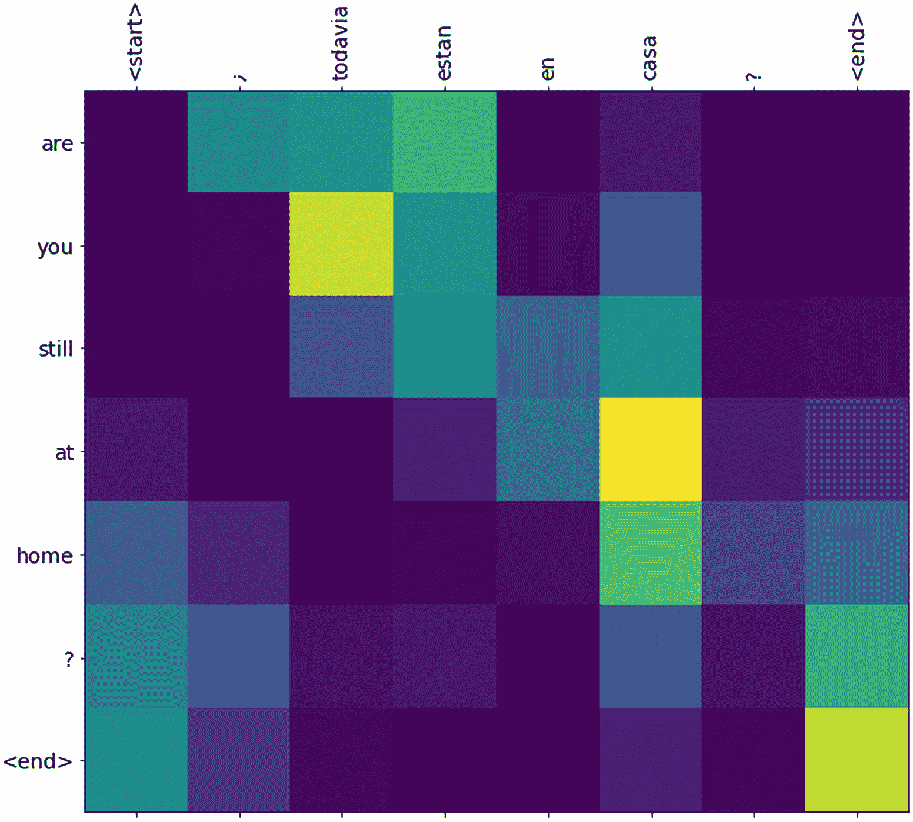
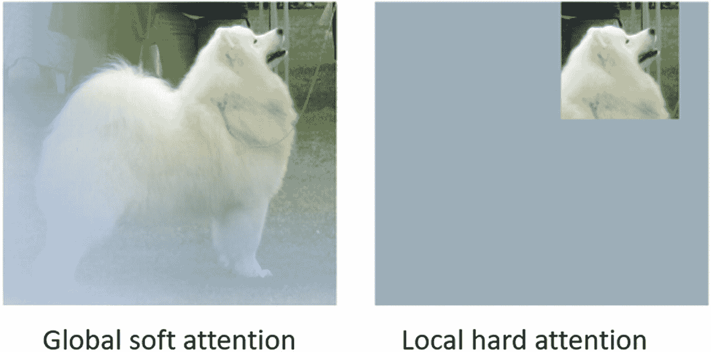
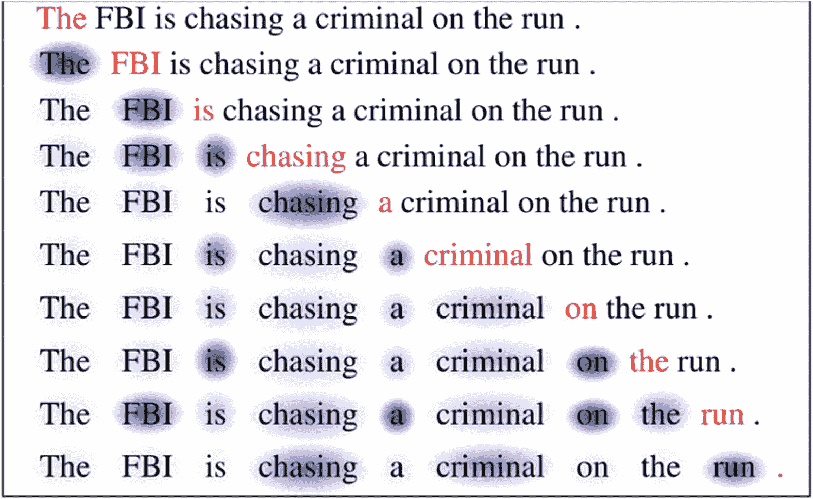
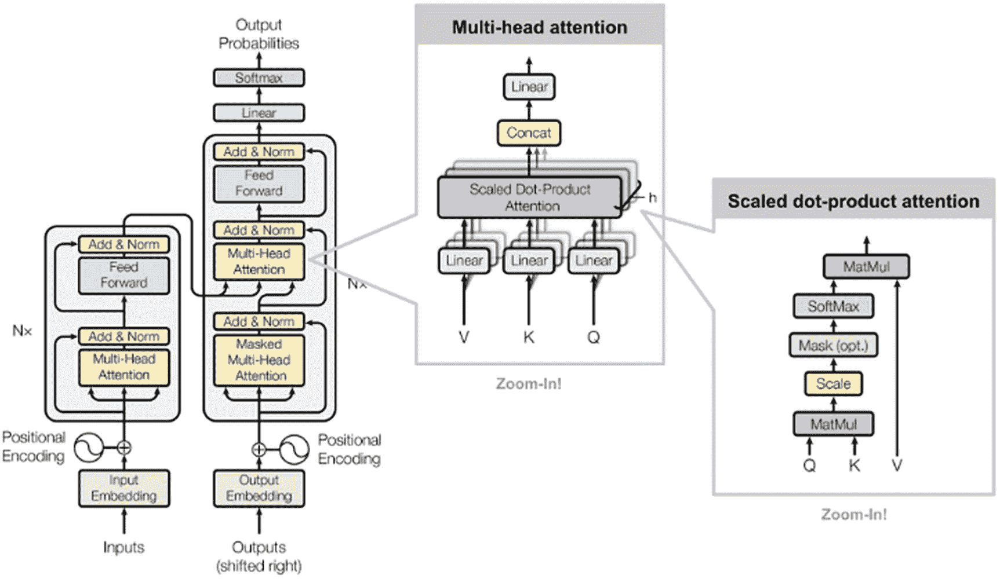
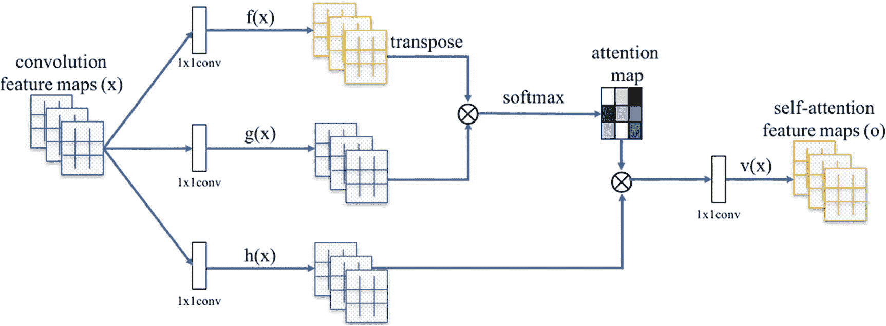
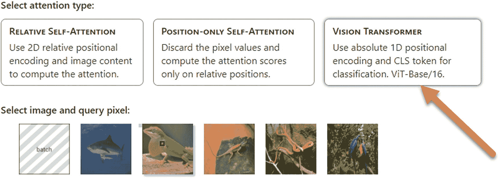
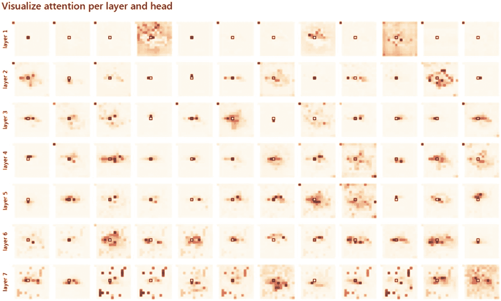
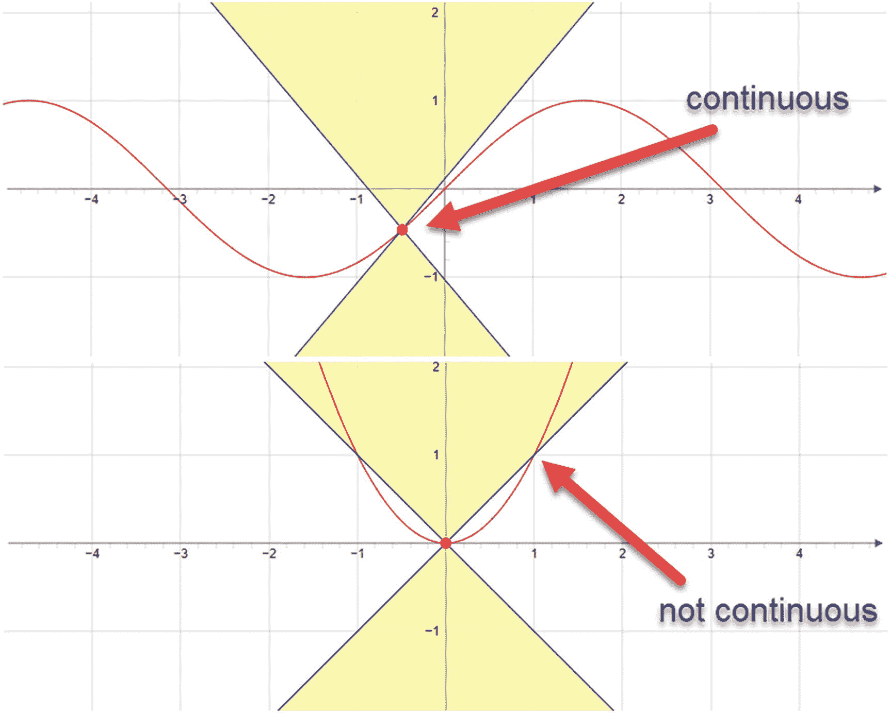
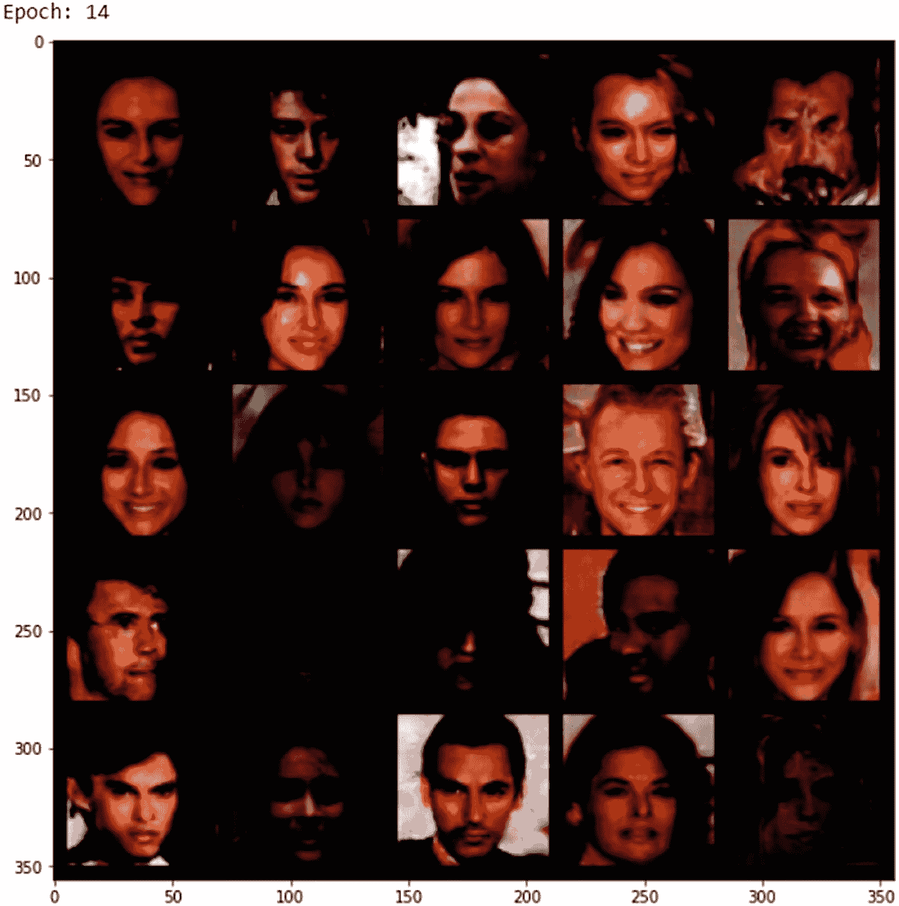
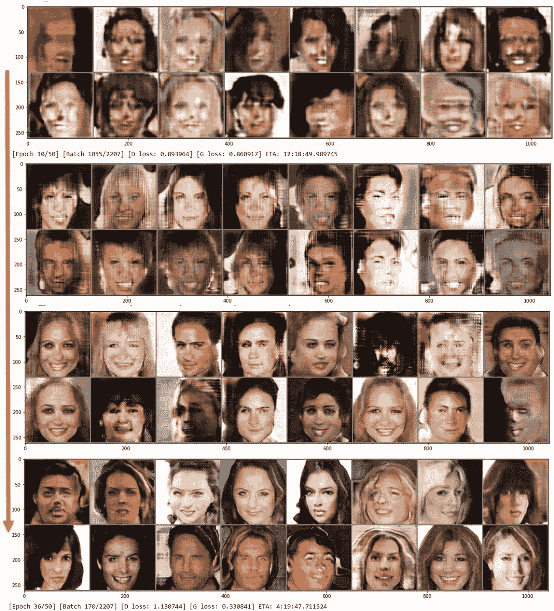

# 7. 注意力即一切！

*注意力*一词源自拉丁语 *attentionem*，意为关注或需要某人的专注。这是一个用来要求人们集中注意力的词，从军事教官到老师和家长都在使用。然而，这也是我们在数学和计算机科学中用来描述某物如何关注或关联到另一物的词。

2017 年，里程碑式的论文《注意力即一切》将这一概念向前推进了一步，将注意力机制应用于深度学习，以理解特征如何关注其他特征。该论文的作者展示了具有影响力的结果，这些结果自此改变了深度学习。

虽然原始论文中展示的工作注意力机制主要用于自然语言处理应用，但直到一年后，GAN 的创造者才在名为*自注意力 GAN*（SAGAN）的 GAN 中展示了有效的注意力机制。

在本章中，我们将仔细研究注意力机制的工作原理以及如何将其融入深度学习。我们首先了解各种类型的注意力及其使用方法。然后，通过代码示例了解基本注意力机制如何提取特征关系。最后，我们通过一个与卷积层配合使用的注意力可视化示例来结束本章。

引入自注意力机制会增加训练压力，在开始使用注意力之前，我们需要了解函数的一些基本属性。其中一个属性是 Lipschitz 连续性，它是 GAN 中平衡训练的基础。因此，我们将花一些时间来理解什么是 Lipschitz 以及如何使用它。

接下来，我们将构建一个在 CelebA 人脸数据集上训练的 SAGAN 示例，训练模型从零开始盲目生成真实人脸。最后，我们将通过构建一个带有残差网络和多个 Lipschitz 约束辅助工具的 SAGAN 模型来结束本章。

你一路努力走到这里，在本章中，我们构建和使用的模型将开始获得巨大的回报。我们现在构建或使用的模型能够产生前沿的结果，这应该使本章成为迄今为止最激动人心的一章。本章将涵盖以下内容：

*   注意力
*   用注意力增强卷积
*   GAN 中的 Lipschitz 连续性
*   构建自注意力 GAN
*   改进 SAGAN

与之前你努力完成的几章相比，本章可能会让你感觉像旋风一样。我们将花更多时间从核心上理解如何利用基本数学属性有效训练 GAN。我们还将深入探讨如何在特征映射中识别上下文和关系。


## 什么是注意力？

我们可以将“*注意力*”一词理解为：你或其他实体专注于特定任务或其他实体的程度。在军队中，你可能被要求“立正”（come to attention），意思是站直并目视前方；而亲密的朋友或亲戚可能会用这个词来请求你的陪伴和关注。

无论如何，我们都可以将注意力理解为一个实体关注或听从另一个实体指令的程度。简单来说，我们可以这样关联对象：A 关注 B，但 B 可能不关注 A。换句话说，A 听从 B 的指令，但 B 不听从 A 的指令。

图 7-1 展示了一个关于鼠标在网页表单上移动的热度注意力图。图中，颜色代表热度或注意力程度。红色区域代表我们注意力集中的热点区域，或者访问者鼠标悬停的区域。较冷的蓝色区域代表鼠标很少或没有关注。


图 7-1

鼠标移动注意力图

在数学和深度学习的各种应用中使用的注意力，通常与图 7-1 中的示例非常相似。事实上，我们将在本章后面看到其中一些注意力图。这些示例可能使用不同的渐变来表示注意力，但概念是相同的。

注意力的概念最初被应用于自然语言处理，作为一种在序列到序列翻译模型中关联词对的方法。众所周知的 `Seq2Seq` 模型，其概念与自编码器非常相似。它们通过从词对中学习来有效地翻译语言，这个想法与我们用于图像到图像翻译的 GAN 并无不同。

传统上，在 NLP 应用中，使用循环或门控网络层来识别单词之间的关系。这与卷积不同，循环网络依赖于一种递归方法来展开序列以训练网络层。这使得深度学习模型能够学习时间或语言上的序列。

不幸的是，循环网络的可扩展性不佳，尤其是当学习的序列规模增大时。事实上，原始论文中注意力机制承诺的主要改进之一就是提高了训练的可扩展性，特别是在应用于更长的序列时。

将注意力机制添加到 NLP 模型中，通常被封装在一种称为*变换器*（transformers）的升级版 `Seq2Seq` 模型类型中。因此，带有注意力机制的变换器彻底革新了自然语言模型，带来了前所未有的提升。你可能已经听说过这些模型被称为 `BERT`，或者更著名的 `GPT-2` 和 `GPT-3`。

图 7-2 展示了一组语言翻译文本的注意力图。图的左侧是英文单词，顶部是相同短语的西班牙语。图中较亮的区域表示单词之间相互关注的程度更高。暗色区域表示单词之间可能没有关联。



图 7-2

用于语言翻译的 NLP 注意力图

NLP 模型在生成文本翻译时，会利用注意力来权衡最可能的单词配对。这使得模型不仅能学习单词序列，还能学习单词之间如何链接或关联。这个概念已经有效地取代了 NLP 任务中对循环网络的依赖。

`GPT-2` 花了将近一年时间才向公众发布，原因是担心该模型能够生成看似可信但实则虚假的新闻文本。虽然本书不涉及 NLP 文本生成，但只需认识到这些模型共享许多相同的概念。在下一节中，我们将探讨注意力的类型以及它们之间的关系。

### 理解注意力的类型

我们通常认为“*注意力*”这个词是二元的，意思是你要么在专注，要么不在，尽管我们在日常生活中理解并使用着各种类型的专注。我们可能会用其他措辞来表示我们的注意力集中在某个特定问题上，无论是局部还是全局，甚至进一步专注于一组任务或项目中的特定元素，并理解它们彼此之间以及自身之间的关系。

在机器学习中，注意力是一种机制，我们可以用它来在不同上下文中关联特征与其他特征。我们可能需要考虑局部特征组如何相互关注，或者一个特征在全局上下文中如何表示。注意力可以是局部注意力或全局注意力，也可以是硬注意力或软注意力。

图 7-3 展示了应用于图像的两种注意力类型。在左侧，我们看到狗的头部是清晰的，身体其余部分仍然略微可见但不太清晰。这是一个全局注意力的例子，因为我们可以看到狗的头部与图像其余部分的关系。然而，它也是一个软注意力的例子，因为我们可以观察到图像中清晰度的逐渐丧失。



图 7-3

注意力类型作用于图像的示例

相反，图 7-3 的右侧展示了一个硬局部注意力的例子。它是“硬”的，因为我们只关注一个局部区域，完全忽略了图像的其余部分。同样，这种注意力也是局部的，因为我们不知道狗的头部在全局中相对于图像其他部分应该如何呈现。

卷积层是局部软或硬注意力机制的一个例子。当与池化层一起使用时，CNN 是硬聚焦的，因为它们移除了空间关系，从而使提取的特征输出变得块状。使用卷积残差块的 `ResNet` 模型是局部软注意力机制的一个例子。软化是由于残差在层间传递或跳跃而产生的。

自注意力（原始论文中提出的注意力类型）是一种进一步的类型，它使用全局软机制来学习特征自身或特征内部的重要性。这以特征/注意力图的形式产生输出，显示一个特征与另一个特征之间的关系。

图 7-4 展示了自注意力如何应用于句子中的单词。高亮（红色）文本显示了句子中的焦点词，以及它如何与句子中每组单词的其他单词相关联。单词周围的阴影越深，该单词与焦点词的相关性或关注度就越高。图 7-2 也展示了自注意力应用于注意力图上的一组单词的示例。



图 7-4

应用于文本的自注意力，展示句子中单词的关系

现在我们已经了解了注意力的基本类型，接下来需要在下一节中探讨如何应用注意力。


#### 应用注意力机制

注意力不仅形式多样，从局部硬性注意到全局软性注意，还可以通过多种机制来应用。表 7-1 展示了用于特征提取和/或关系建模的多种注意力机制示例。虽然我们可以更详细地审视每种方法，但我们的主要焦点将是最后一种——Transformer。

**表 7-1** 用于应用注意力的注意力机制

| 注意力机制 | 说明 | 参考文献 |
| --- | --- | --- |
| 基于内容 | 余弦相似度 | Graves2014 |
| 拼接或加性 | 对权重应用 Tanh 函数 | [Bahdanau2015](https://arxiv.org/pdf/1409.0473.pdf) |
| 基于位置 | 对权重进行 Softmax 对齐 | [Luong2015](https://arxiv.org/pdf/1508.04025.pdf) |
| 通用 | 直接应用于权重 | [Luong2015](https://arxiv.org/pdf/1508.04025.pdf) |
| 点积 | 注意力参数与点积结合 | [Luong2015](https://arxiv.org/pdf/1508.04025.pdf) |
| 缩放点积 | 与点积相同，但应用了缩放变量 | [Vaswani2017](http://papers.nips.cc/paper/7181-attention-is-all-you-need.pdf) |

图 7-5 展示了原始论文中提出的 Transformer 架构。在图中，你可以看到使用了两种形式的注意力：多头注意力和缩放点积注意力。两者结合，提供了我们之前讨论过的自注意力机制。



**图 7-5** 展示多头注意力的 Transformer 架构

多头注意力机制由 AAYN 论文的作者提出，其内部展开为图 7-5 插图中所示的缩放点积注意力形式。再次提醒，该论文的重点是训练 NLP 模型，因此图中所示的架构是针对 NLP Transformer 的，而非我们稍后将看到的 GAN 设计。然而，用于提取自注意力的多头注意力机制将是我们关注的重点。

请参考图 7-5 以及最右侧的放大图，该图突出显示了应用于三个输入 `Q`、`K` 和 `V` 的缩放点积注意力机制。这些字母分别缩写为 `Q`（代表 `querys`，是的，拼写有误）、`K`（代表 `keys`）和 `V`（代表 `values`）。首先将 `Q` 和 `K` 相乘，然后进行缩放，并通过一个 softmax 函数。此输出再与输入值相乘。

为了演示如何以这种方式计算自注意力，我们当然需要通过一个练习来查看一些代码。练习 7-1 除了展示计算步骤外，不做其他任何事情。所有输入和权重都是随机化的，你可以将其视为训练的初始阶段。让我们开始看看多头注意力是如何工作的。

**练习 7-1. 理解多头注意力**

1.  从 GitHub 项目站点打开 `GEN_7_Attention.ipynb` 笔记本。如果不确定如何操作，请参考附录 B。

2.  第一个单元格表示导入和一个示例随机输入，如下所示：

```
    import torch
    import numpy as np
    x = np.random.randint(0,3,(3,4))
    x = torch.tensor(x, dtype=torch.float32)
    print(x)
```

3.  同样，输入和权重都是随机化的，我们只关注计算步骤。这里是创建 `query`、`key` 和 `values` 随机权重的地方：

```
    w_key = np.random.randint(0,2,(4,3))
    w_query = np.random.randint(0,2,(4,3))
    w_value = np.random.randint(0,4,(4,3))
    w_key = torch.tensor(w_key, dtype=torch.float32)
    w_query = torch.tensor(w_query, dtype=torch.float32)
    w_value = torch.tensor(w_value, dtype=torch.float32)
    print(w_key)
    print(w_query)
    print(w_value)
```

4.  在真正的多头自注意力层中，这些权重会随着时间推移进行训练。

5.  接下来，我们将所有权重应用于输入 `x`，以推导出 `keys`、`querys` 和 `values`。

```
    keys = x @ w_key
    querys = x @ w_query
    values = x @ w_value
    print(keys)
    print(querys)
    print(values)
```

6.  之后，我们将 `querys` 乘以 `keys` 的转置，并计算 `attn_scores` 值。

```
    attn_scores = querys @ keys.T
    print(attn_scores)
```

7.  然后，我们对输出 `attn_scores` 应用 `softmax` 函数，得到 `attn_scores_softmax`。

```
    from torch.nn.functional import softmax
    attn_scores_softmax = softmax(attn_scores, dim=-1)
    print(attn_scores_softmax)
```

8.  最后，通过乘以 values 并求和结果来生成输出。

```
    weighted_values = values[:,None] * attn_scores_softmax.T[:,:,None]
    outputs = weighted_values.sum(dim=0)
    print(outputs)
```

你应从上述练习中掌握的核心内容是：通过一个简单示例，了解如何将多头注意力应用于输入 `x` 的功能性步骤。实际使用卷积实现多头注意力会更加复杂，这将在下一节中讨论。


## 用注意力增强卷积

注意力（自注意力）增强卷积的概念最早通过自注意力 GAN 论文引入。在该论文中，作者展示了如何利用多头自注意力机制来增强卷积层。

图 7-6 摘自原始 SAGAN 论文，展示了一个增强注意力层的工作原理。从左侧输入侧开始，卷积输出进入该机制并被分割成 1×1 卷积层。输出的 `f(x)` 代表 `keys` 头，`g(x)` 函数代表 `querys`，当然 `h(x)` 代表 `values`。



图 7-6

应用于卷积层的多头自注意力

回顾练习 7-1 中其余计算的应用方式，你就能从高层次理解多头自注意力是如何计算的。输出的自注意力特征图随后被传递到后续的卷积块中。在何处以及应用多少自注意力，取决于模型架构。在大多数情况下，你会将自注意力应用于模型的较低层和/或输出层。

代码清单 7-1 摘自 `GEN_7_SAGAN.ipynb` 示例中的 `Self_Attn` 层类。`Self_Attn` 类为卷积增强的自注意力提供了一个封装器。我们将在本章后面查看完整示例，但请注意 `query` 和 `key` 卷积层如何通过除以 8 来改变输入 `in_dim`，而值卷积保持不变。

```
self.query_conv = nn.Conv2d(in_channels = in_dim , out_channels = in_dim//8 , kernel_size= 1)
self.key_conv = nn.Conv2d(in_channels = in_dim , out_channels = in_dim//8 , kernel_size= 1)
self.value_conv = nn.Conv2d(in_channels = in_dim , out_channels = in_dim , kernel_size= 1)
```

代码清单 7-1

注意力卷积层

在 `Self_Attn` 类的 `forward` 函数内部，我们可以看到自注意力机制的应用位置。除了使用 `view` 进行张量操作以及使用 `torch.bmm`（代表批量矩阵乘法）之外，代码清单 7-2 中显示的代码与我们之前在练习 7-1 中介绍的内容类似。

```
### forward 函数内部
m_batchsize,C,width ,height = x.size()
proj_query  = self.query_conv(x).view(m_batchsize,-1,width*height).permute(0,2,1) # B X CX(N)
proj_key =  self.key_conv(x).view(m_batchsize,-1,width*height) # B X C x (*W*H)
energy =  torch.bmm(proj_query,proj_key) # 转置检查
attention = self.softmax(energy) # BX (N) X (N)
proj_value = self.value_conv(x).view(m_batchsize,-1,width*height) # B X C X N
out = torch.bmm(proj_value,attention.permute(0,2,1) )
out = out.view(m_batchsize,C,width,height)
out = self.gamma*out + x
return out,attention
```

代码清单 7-2

`Self_Attn` 类的 `forward` 函数内部

请注意，代码清单 7-2 中的 `forward` 函数有两个输出：经过注意力处理的输出 `out` 和计算出的 `attention` 图。虽然我们不会进一步投影这些输出，但可视化这些注意力图是可行的。我们可以通过练习 7-2 来了解如何可视化这些注意力图。

练习 7-2. 可视化自注意力图



图 7-7

控制可视化选项的界面

1.  在浏览器中打开 GitHub 项目站点上的 `https://epfml.github.io/attention-cnn/` 笔记本。

2.  该网站是作为 ICLR 2020 上发表的论文《论自注意力与卷积层之间的关系》的一部分而开发的。

3.  图 7-7 显示了可视化表格的起始部分，并提供了可视化三种类型注意力的选项。



图 7-8

每层和每个头生成的注意力图

1.  点击最右侧的 Vision Transformer，注意图像也会随之变化。

2.  将鼠标悬停在图像上，你会看到下方表格中的注意力图随着你划过每个像素而更新。

3.  图 7-8 展示了将像素悬停在鲨鱼图片上时得到的自注意力图示例。

1.  仔细观察这些图，在许多图中你会看到鲨鱼的轮廓，这代表了该像素如何关注鲨鱼身上的其他特征。

该网页和论文展示了模型每一层上的多头注意力。在某些情况下，你可能希望对模型中的每一层都应用注意力，而在其他情况下则可能不需要。

截至 2020 年，卷积的增强注意力正变得相当流行，这是有充分理由的。注意力机制是一个强大的工具，可以为通过卷积或其他方式提取的特征提供学习到的上下文信息。然而，我们总是需要平衡两方面的改进，以构建一个好的生成器。因此，在将注意力应用于 GAN 之前，我们想在下节中再次回顾训练平衡的重要性。

## GAN 中的 Lipschitz 连续性

在本书的大部分内容中，我们都讨论了平衡生成器和判别器训练的必要性。没有平衡，如果任何一方变得过于精确，另一方就永远没有机会变得更好。

举个例子，想象你正在训练成为一名冠军跑步运动员。你的训练对手很荣幸是地球上最快的人——尤塞恩·博尔特。你每天训练，并与尤塞恩比较你的进步。不幸的是，尤塞恩也在每天训练，并且进步和你一样多，甚至更多。由于你是在将自己的表现与博尔特的表现进行比较，你的收益以及你的表现开始下降。最终，你放弃了，决定在场边观看。

同样的原理也适用于常规 GAN。由于生成器是根据判别器来衡量其性能的，如果判别器变得非常擅长区分真假，那么反馈给生成器的损失就会减少。反过来，生成器用于训练的损失也会减少，导致梯度消失问题。

如果你正在训练一个 GAN，并注意到输出开始退化，这很可能是判别器变得过于优秀的迹象。当你的生成器似乎停止或不再改进时，则会发生相反的情况。这是判别器正在退化或已达到其最大潜力的迹象。

因此，平衡是训练 GAN 的关键，我们之前已经研究过一些方法来更好地管理这个问题。回想一下我们在第 4 章中讨论的各种衡量和比较分布的方法。我们介绍了 WGAN，这是一种使用推土机距离算法来确定损失，而不是像 KL 这样的散度函数的 GAN。

由于 GAN 中的平衡点是判别器，我们通常首先着眼于它来改善平衡和训练稳定性。我们可以通过审视判别器试图逼近的函数的一个抽象属性来实现这一点。这个属性被称为 Lipschitz 连续性，这将是我们在下一节中要介绍的内容。


### 什么是利普希茨连续性？

利普希茨连续性是一个函数的数学性质，它定义了具有一致连续性的子类。也就是说，如果一个函数在其整个图像上是一致连续的，那么它就是利普希茨连续的。这意味着图像上每一对点之间的斜率都必须位于某个值或常数之内。

图 7-9 展示了两个函数：`f(x) = sin(x)` 和 `f(x) = x²`。第一个函数是利普希茨连续的，因为展示变化连续性的边界线没有与图像相交。相反，第二个函数不是利普希茨连续的，因为当利普希茨常数等于 1.0 时，边界线与图像相交了。虽然我们可以增大这个常数/斜率，但出于稳定性的考虑，我们更倾向于将其保持在 1。



**图 7-9**  
连续与非连续利普希茨函数的示例

在 WGAN 中，通过使用推土机距离函数，判别器试图保持利普希茨连续性，因为该函数近似于一个连续函数。然而，请记住，由于我们的网络是在近似一个函数，它可能会推断出一个仍然破坏连续性的函数。

我们可以通过利普希茨约束或一种度量来控制函数的 LS 连续性，这种度量使用几种不同的形式来控制函数的变化程度。该约束被称为 *1-利普希茨约束*，因为我们力求将变化强制为常数 1。以下列出的形式是我们在采用某种形式的约束训练梯度时通常考虑的：

- **“软” 1-利普希茨约束**：梯度函数被强制平均等于或接近 1。因此，某些函数点的值可能很高，而其他点的值则很低。
- **“硬” 1-利普希茨约束**：这强制每个点的梯度都小于或等于 1。这通常适用于对抗训练。
- **“梯度” 1-利普希茨约束**：这强制梯度在几乎所有地方都接近 1。这通常不用于其他机器学习领域，但在基于 Wasserstein 距离进行训练时是必需的。

为了对梯度实施 1-利普希茨约束，我们通常使用两种方法：权重裁剪和谱归一化。权重裁剪，或对梯度进行惩罚，确保权重被裁剪，使得利普希茨常数小于 1。我们在前几章中一直使用清单 7-3 中所示的 `gradient_penalty` 函数进行权重裁剪。

```
#@title 辅助函数 - 计算梯度惩罚
def compute_gradient_penalty(D, real_samples, fake_samples, labels):
"""计算 WGAN GP 的梯度惩罚损失"""
### 用于在真实样本和虚假样本之间插值的随机权重项
alpha = FloatTensor(np.random.random((real_samples.size(0), 1, 1, 1)))
### 获取真实样本和虚假样本之间的随机插值
interpolates = (alpha * real_samples + ((1 - alpha) * fake_samples)).requires_grad_(True)
d_interpolates = D(interpolates, labels)
fake = Variable(FloatTensor(np.ones(d_interpolates.shape)), requires_grad=False)
### 获取关于插值的梯度
gradients = autograd.grad(
outputs=d_interpolates,
inputs=interpolates,
grad_outputs=fake,
create_graph=True,
retain_graph=True,
only_inputs=True,
)[0]
gradients = gradients.view(gradients.size(0), -1)
gradient_penalty = ((gradients.norm(2, dim=1) - 1) ** 2).mean()
return gradient_penalty
```

**清单 7-3**  
`gradient_penalty` 函数

以这种方式进行权重裁剪的问题在于，近似函数总是假设利普希茨常数小于 1。这意味着近似函数更加平缓，具有更平滑的山丘和山谷。这反过来可能会冲淡我们试图生成的复制输出中的重要细节。

谱归一化是一种依赖于对梯度张量进行奇异值分解的方法，它为每个元素生成一个 sigma 值。通过取张量的最大 sigma 值并将其除以所有值，我们可以确保最大值是 1，从而确认该函数是 1-利普希茨连续的。

清单 7-4 展示了 `SpectralNorm` 类的 `compute_weight` 函数，我们将在训练时将其用作约束梯度的方法。该函数使用 SVD 来确定 sigma 的值，然后将所有权重除以 sigma，以确保没有权重大于 1。

```
def compute_weight(self, module):
weight = getattr(module, self.name + '_orig')
u = getattr(module, self.name + '_u')
size = weight.size()
weight_mat = weight.contiguous().view(size[0], -1)
with torch.no_grad():
v = weight_mat.t() @ u
v = v / v.norm()
u = weight_mat @ v
u = u / u.norm()
sigma = u @ weight_mat @ v
weight_sn = weight / sigma
```

**清单 7-4**  
谱归一化 `compute_weight` 函数

在下一个练习中，我们将看到这两种方法如何帮助改进判别器训练以及 GAN 的平衡。虽然这两种方法可以像我们在前几章中看到的梯度惩罚那样单独使用，但练习 7-3 将演示两者的结合。

#### 练习 7-3. GAN 中的利普希茨连续性

1. 从 GitHub 项目站点打开 `GEN_7_Lipschitz_GAN.ipynb` 笔记本。运行整个笔记本。
2. 此代码示例与第 4 章的 `GEN_4_DCGAN.ipynb` 练习笔记本几乎相同。唯一的区别是这里添加了梯度惩罚损失和谱归一化。
3. 添加梯度惩罚损失和谱归一化相对容易。以下代码展示了一个判别器及其内部卷积块，其中 `SpectralNorm` 类包装了卷积层。

```
    class Discriminator(nn.Module):
    def __init__(self):
    super(Discriminator, self).__init__()
    def discriminator_block(in_filters, out_filters, bn=True):
    block = [SpectralNorm(nn.Conv2d(in_filters, out_filters, 3, 2, 1)),
    nn.LeakyReLU(0.2, inplace=True), nn.Dropout2d(0.25)]
    if bn:
    block.append(nn.BatchNorm2d(out_filters, 0.8))
    return block
```

4. 我们同样可以轻松地使用 `SpectralNorm` 类将谱归一化添加到生成器的卷积层。这里保持生成器简洁，以便专注于判别器。
5. 如果我们向下滚动到训练块，可以再次回顾如何通过以下方式将梯度惩罚损失应用于判别器损失：

```
    real_loss = loss_fn(discriminator(real_imgs), valid)
    fake_loss = loss_fn(discriminator(gen_imgs.detach()), fake)
    # 梯度惩罚
    gradient_penalty = compute_gradient_penalty(discriminator, real_imgs.data, gen_imgs.data)
    loss_D = real_loss + fake_loss + hp.lambda_gp * gradient_penalty
```

6. `lambda_gp` 是缩放超参数，用于调整将多少梯度惩罚应用于总损失计算。您可以通过在笔记本中向上滚动几个块来参考 `gradient_penalty` 函数。
7. 这个笔记本通常需要更长的时间才能稳定下来，因此输出在开始时可能看起来相当随机。只需认识到这是维持利普希茨连续性的一个后果。请耐心等待，让样本训练几个小时，以注意到生成的细节数量增加。

现在我们已经完成了对 GAN 中利普希茨连续性的探讨，我们将在下一节回到自注意力和自注意力 GAN 的工作中。


## 构建自注意力生成对抗网络

SAGAN 原论文的作者发现，即使尝试通过梯度惩罚和/或 Wasserstein 距离来平衡训练，自注意力机制仍会导致判别器失去 Lipschitz 连续性。因此，他们采用上一节刚刚介绍过的谱归一化形式实施了一种修复方案。

通过引入自注意力机制及其所需的约束条件（即谱归一化），作者成功将简单的 DCGAN 转换为 SAGAN。这进而为纯粹的盲样本生成（而非图像到图像的转换）带来了令人惊叹的成果。

在练习 7-4 中，我们将研究一个基础的 SAGAN 实现，该模型经过训练可从 CelebA 数据集生成人脸。请记住，这个生成器（GAN）完全是盲生成人脸，仅使用带有自注意力的卷积操作。当然，为了平衡训练，我们加入了一些谱归一化来避免情况失控。

### 练习 7-4. 构建并训练 SAGAN



**图 7-10** 训练练习 `GEN_7_DCGAN_SAGAN.ipynb` 的示例输出

1. 从 GitHub 项目站点打开 `GEN_7_DCGAN_SAGAN.ipynb` 笔记本。运行整个笔记本。

2. 此代码示例与第 4 章的 `GEN_4_DCGAN.ipynb` 练习笔记本几乎相同。这里的关键区别在于模型中增加了自注意力和谱归一化。

3. 向下滚动到 `Generator` 类定义，查看层配置和 `forward` 函数的起始部分，即可了解自注意力层是如何添加到模型中的，如下所示：

```
self.attn1 = Self_Attn( 512, 'relu')
self.attn2 = Self_Attn( 256, 'relu')
self.attn3 = Self_Attn( 128, 'relu')
self.attn4 = Self_Attn( 64,  'relu')
def forward(self, z):
    z = z.view(z.size(0), z.size(1), 1, 1)
    out=self.l1(z)
    out,_ = self.attn1(out)
    out=self.l2(out)
    out,_ = self.attn2(out)
    out=self.l3(out)
    out,p1 = self.attn3(out)
    out=self.l4(out)
    out,p2 = self.attn4(out)
    out=self.last(out)
    return out, p1, p2
```

4. 同样，自注意力也可以按如下方式添加到 `Discriminator` 类中：

```
self.attn1 = Self_Attn(64, 'relu')
self.attn2 = Self_Attn(128, 'relu')
self.attn3 = Self_Attn(256, 'relu')
self.attn4 = Self_Attn(512, 'relu')
def forward(self, x):
    out = self.l1(x)
    out,p0 = self.attn1(out)
    out = self.l2(out)
    out,p0 = self.attn2(out)
    out = self.l3(out)
    out,p1 = self.attn3(out)
    out=self.l4(out)
    out,p2 = self.attn4(out)
    out=self.last(out)
    return out.squeeze(), p1, p2
```

5. 该模型中的所有层都在其间使用了自注意力。不过，你可以通过简单地注释掉模型中不需要的注意力层来调整此行为。添加注意力层会因额外的计算以及平衡 Lipschitz 连续性的需求增加而降低训练性能。

6. 如果你愿意，可以注释掉部分或全部注意力层，以观察这对训练产生的影响。如果这样做，请务必调整模型的注意力输出（`p1`、`p2`）。

7. 最后，在训练模块中，我们可以看到所有这些是如何整合在一起计算损失的，如下所示：

```
d_out_real,dr1,dr2 = discriminator(real_images)
#hinge loss
d_loss_real = torch.nn.ReLU()(1.0 - d_out_real).mean()
z = tensor2var(torch.randn(real_images.size(0), hp.latent_dim))
fake_images,gf1,gf2 = generator(z)
d_out_fake,df1,df2 = discriminator(fake_images)
#hinge loss
d_loss_fake = torch.nn.ReLU()(1.0 + d_out_fake).mean()
### Backward + Optimize
d_loss = (d_loss_real + d_loss_fake) / 2
d_loss.backward()
optimizer_D.step()
```

8. 在此示例中，我们使用铰链损失，通过将输出传递给 `ReLU` 函数并取平均值来确定损失。这只是一种控制负损失的方法。请注意，判别器的注意力图输出并未被使用。

9. 图 7-10 显示了此练习训练数小时（第 14 个周期）后的输出。请注意输出的质量，并记住所有这些面孔都不是真实的人。这些面孔完全是盲生成的。

考虑到生成器在生成人脸时完全是盲操作的，上一个练习的输出相当令人印象深刻。这与我们在过去几章中看到的图像到图像模型形成了鲜明对比。

正如人们所说，从这里我们只能向上走，在下一章中，我们将改进这个示例，研究生成条件人脸，同时结合残差网络以获得更好的样本生成效果。


## 改进 SAGAN

`自注意力`为特征学习提供了另一个维度，即相对于卷积的全局特征定位，但正如我们所知，这并非没有副作用。这些副作用可以通过强制满足利普希茨连续性来最小化，但我们仍然存在其他问题，比如特征过度提取。

为了帮助缓解这些问题，我们将研究 SAGAN 的另一个示例，该示例在卷积中使用残差块进行跳跃连接，并增加了条件生成。正如我们之前所见，条件生成和判别可以通过定位子域来提高性能。

在练习 7-5 中，我们研究如何使用 ResNet 卷积模型、标签和条件来改进 SAGAN。我们将再次使用 CelebA 数据集，这次将标记的属性作为每张图片的类别。因此，我们希望我们的类别是唯一的，并且不能在图像之间共享。为此，我们将坚持使用基本发色（金色、黑色和棕色）作为类别，并且只加载具有这些属性的名人面孔。练习 7-5 改进了我们之前的工作，因为它还尝试生成 128×128 像素的人脸，这是迄今为止我们进行的最大规模的盲生成。

### 练习 7-5. 改进 SAGAN



图 7-11

训练名人 SAGAN 的示例输出

1.  从 GitHub 项目站点打开 `GEN_7_Celeb_SAGAN.ipynb` 笔记本。运行整个笔记本。

2.  此代码示例再次基于第 4 章的 `GEN_4_DCGAN.ipynb` 练习笔记本。大部分新代码仅存在于定义模型和辅助函数的几个代码块中。请注意，此笔记本在使用 GPU 运行时目前会占用 Google Colab 的所有内存。因此，在修改某些超参数（如批量大小或图像大小）时需要小心。

    增加任何模型的批量大小都会增加模型在处理前向传播时的内存需求。通过减小批量大小，可以降低内存需求，但这可能会降低训练性能质量并增加运行时间。

3.  跳转到模型部分和 `Generator` 类定义。注意 `SelfAttention` 类是如何在几个层之间使用的：

```
    ConvBlock(512, 512, n_class=n_class),
    ConvBlock(512, 256, n_class=n_class),
    SelfAttention(256),
    ConvBlock(256, 128, n_class=n_class),
    SelfAttention(128),
    ConvBlock(128, 64, n_class=n_class)])
```

4.  同样，我们可以在判别器结构中看到相同的结构：

```
    SelfAttention(128),
    conv(128, 256, downsample=False),
    SelfAttention(256),
    conv(256, 512),
    conv(512, 512),
    conv(512, 512))
```

5.  注意在生成器和判别器模型构建中 512 层的加倍。你可以尝试添加更多重复层或自注意力层。然而，当前配置已经使用了最大的 GPU 内存。虽然你可以将运行时切换到 CPU 并增加模型参数，但在 CPU 上训练这样的模型会非常耗时。

6.  此示例的另一个新特性是引入了调度器。调度器允许我们在运行时修改超参数（即那些可以修改的参数）。虽然你可以安排任何超参数进行更改，但在训练期间，最常见的修改对象是学习率。在优化器部分，我们创建了两个新的调度器，如下所示：

```
    scheduler_G = StepLR(optimizer_G, step_size=1, gamma=hp.lr_gamma)
    scheduler_D = StepLR(optimizer_D, step_size=1, gamma=hp.lr_gamma)
```

7.  这些调度器会随着时间的推移衰减学习率，方法是将当前学习率乘以 `lr_gamma` 超参数，该参数在示例中设置为 .999。在每次对生成器运行训练批次后，我们通过调用 `step` 函数来步进/衰减学习率，如下所示：

```
    scheduler_G.step()
    scheduler_D.step()
```

8.  接下来，我们将查看判别器损失计算。注意我们是如何使用铰链损失来计算对抗性假损失和真损失，然后通过附加梯度惩罚来计算总损失的。

```
    loss_D_fake = F.relu(1 + fake_validity).mean()
    loss_D_real = F.relu(1 - real_validity).mean()
    loss_D = loss_D_real + loss_D_fake  + hp.lambda_gp * gradient_penalty
```

9.  如图 7-11 所示，这个示例可能需要一段时间来训练，甚至才能产生一些有趣的结果。然而，一旦成功，输出可能会非常有趣，并且在某些方面具有艺术性。

这个练习和示例可能需要很长时间的训练才能获得极好的结果，但在此之前你得到的结果本身也可能令人着迷。花些时间观察这个示例的训练过程，你会得到既有有趣又有令人惊讶的输出作为回报。

作为额外内容，第 6 章的 StarGAN 笔记本已升级为使用自注意力和谱归一化。请务必也查看 `GEN_7_Self-attention_STARGAN.ipynb` 笔记本，以获取更多关于将自注意力与谱归一化结合使用的示例。

至此，我们关于自注意力、使用自注意力的 GAN 以及支持它们的机制的旋风式章节就结束了。

## 结论

在本章中，我们学习了注意力，以及如何从局部/全局和软/硬的角度来定义它。理解注意力不仅使我们能够更好地定义特征映射或关系，还能重新生成这些相同的关系。

然而，使用注意力的扩展特征映射也要求我们更好地理解判别器/生成器的训练平衡。为此，我们研究了一个重要的数学和抽象函数性质，称为利普希茨连续性。这个抽象术语定义了函数的均匀性或平滑程度。

因此，我们了解到，通过使用梯度惩罚损失或谱归一化来约束函数的利普希茨连续性，GAN 可以成为更平衡的训练器，从而使我们能够使用更好的特征提取策略，如自注意力。

最后，在本章中，我们首先将所有这些整合到一个 SAGAN 的实现中，该 SAGAN 在名人面孔上训练，目的是盲生成新面孔。然后，为了改进这个模型，我们添加了残差网络块用于特征跳跃，这是我们从上一章借鉴的改进，再次用于生成全新的面孔，这次分辨率更高，理想情况下细节更丰富。


