# 8. 高级生成器

人工智能和机器学习领域正日新月异地发展，各种新型的生成对抗网络（GAN）和生成器层出不穷。通过本书的学习，我们回顾了这些生成器的发展历程。我们深入研究了它们对生成任务的贡献细节和技术进步，也探讨了它们可能存在的不足之处。

本书的目标是为您提供扎实的基础知识，以便理解生成器的细微差别以及如何构建它们。使用像 Google Colab 这样的平台，可以让学生们更容易地学习复杂算法，而无需忍受自行安装依赖项的烦恼。这大大降低了新手接触生成器和深度学习的门槛。

不幸的是，随着人工智能/机器学习技术的飞速发展，我们遇到了收益递减的瓶颈：代码示例变得异常庞大，新变体或新功能层出不穷，以至于解释一种新型 GAN 就可能耗尽本书的剩余篇幅。因此，在本章及接下来的几章中，我们将采用更偏向功能性的方法，使用封装好的代码来运用生成器。

在本章中，我们将首次尝试使用封装好的开源代码，这些代码可以快速搭建，并用于训练或实际的生成任务。本章中我们将看到的所有示例都是生成器的进阶版本。虽然我们不会深入分析它们的代码，但会从宏观层面了解它们的工作原理。由于这些代码都是开源的，感兴趣的读者可以自行深入研究其内部机制。

本章将从渐进式生成对抗网络（ProGAN）开始。这是一种通过训练逐步构建图像分辨率来开发生成器的方法。接着，我们将介绍风格生成对抗网络（StyleGAN），这是一种受风格迁移启发、基于 ProGAN 构建的 GAN。我们还将探讨 StyleGAN2（即第二代版本），它在我们的老朋友 CelebA 数据集上训练后，能够产生一些非常出色的结果。

在云端笔记本上训练高级 GAN 并非理想之选，因此在本章的最后部分，我们将探讨如何使用其他生成器包进行生成。首先，我们将介绍 DeOldify，这是一种受新启发的生成器，被称为 NoGAN，能够为老照片和视频着色。然后，我们将以另一种非 GAN 的实现——ArtLine 来结束本章，它可以将照片转换为线条画。

本章融合了训练 ProGAN 和 StyleGAN2 等高级示例，以及使用 DeOldify 和 ArtLine 等酷炫生成器的内容。与之前的章节相比，我们将把代码视为一个黑盒，只关注让程序包运行起来所需的部分。以下是本章将涵盖的主要内容摘要：

-   渐进式增长的生成对抗网络
-   使用 StyleGAN 第二版进行风格化
-   使用新型 NoGAN——DeOldify
-   使用 ArtLine 展现艺术效果

如果您一直跟随本书的示例进行实践，那么现在您肯定已经是一位深度学习和 GAN 训练大师了。虽然在本章中我们仍会借鉴其中的一些技能，但我们将采用更偏向功能性的生成方法。不过在此之前，我们将在下一节中探讨渐进式 GAN 增长的基础知识。

## 渐进式增长的生成对抗网络

2016 年，英伟达的一个团队发表了一篇题为《渐进式增长生成对抗网络以提升质量、稳定性和多样性》的论文。该论文概述了一种渐进式增长 GAN 的流程，从非常低分辨率的图像开始，逐步提升到高分辨率。一个 ProGAN 可能从 4×4 像素的图像开始，最终生成 1024×1024 的高分辨率图像。

ProGAN 的概念源于解决我们在卷积中经常遇到的问题。正如我们在本书中反复看到的，卷积层越深，它们产生的噪声就越多。我们在探索用于特征提取和重建的深度 CNN 层的各个章节中都观察到了这一点。

我们已经看到了几种解决深度卷积问题的方法，包括批归一化、UNet、ResNet 以及带有谱归一化的自注意力机制。虽然这些方法本身已经取得了成功，但 ProGAN 的概念更进一步，将训练分解为多个渐进阶段。

毕竟，我们不能指望给小学生讲授微积分，那么我们又怎能期望一个未经训练的 GAN 在没有过往经验的情况下学会生成人脸呢？尽管我们通过数千次迭代输入数千张人脸来尝试训练这样的模型，但这种训练方式会变得效率低下。

正如我们现在所知，这种低效率发生在我们的模型变得过大过深，包含数十或数百个卷积层的时候。但是，如果我们要训练模型生成高分辨率图像，就必须创建如此庞大的模型。然而，ProGAN 并非从一开始就构建这些模型，而是通过训练逐步构建模型。

图 8-1 展示了在面部数据上训练 ProGAN 的渐进过程。该过程首先将真实的训练图像缩小到 4×4 像素，然后将它们输入到为该图像尺寸设计的 GAN 中。经过一段时间的训练后，通过添加用于更高分辨率的新层来增长 GAN，首先是 8×8，然后逐步增加到 16×16、32×32、64×64，以此类推，直到 1024×1024。

渐进式增长 GAN 的代价是，需要反复构建后续模型，且分辨率越来越高，从而增加了额外的训练时间。此外，训练此类模型需要额外的数据准备和存储空间。在使用像 Colab 这样的云端笔记本时，这些要求并不理想，因此我们将在练习中坚持使用一些更简单的示例。

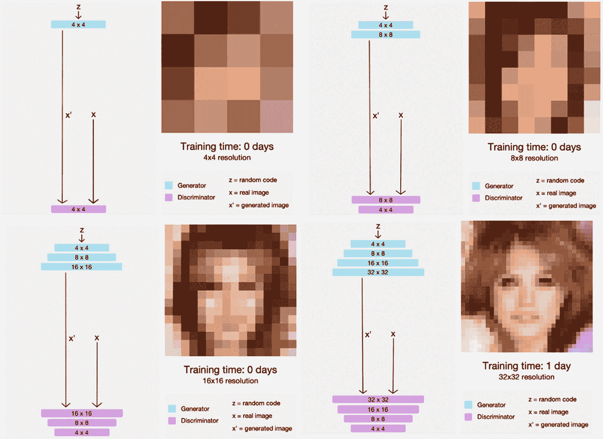

图 8-1

ProGAN 训练渐进过程

图 8-2 展示了原始作者提出的 ProGAN 中生成器和判别器的内部结构。在图中，您可以看到用于定义 GAN 从 4×4 到 16×16 初始渐进阶段的基础模块。随着模型继续构建到所需的任何分辨率，会使用图中所示的模板形成新的模块，其中 k 代表最终输出图像所需的像素分辨率。

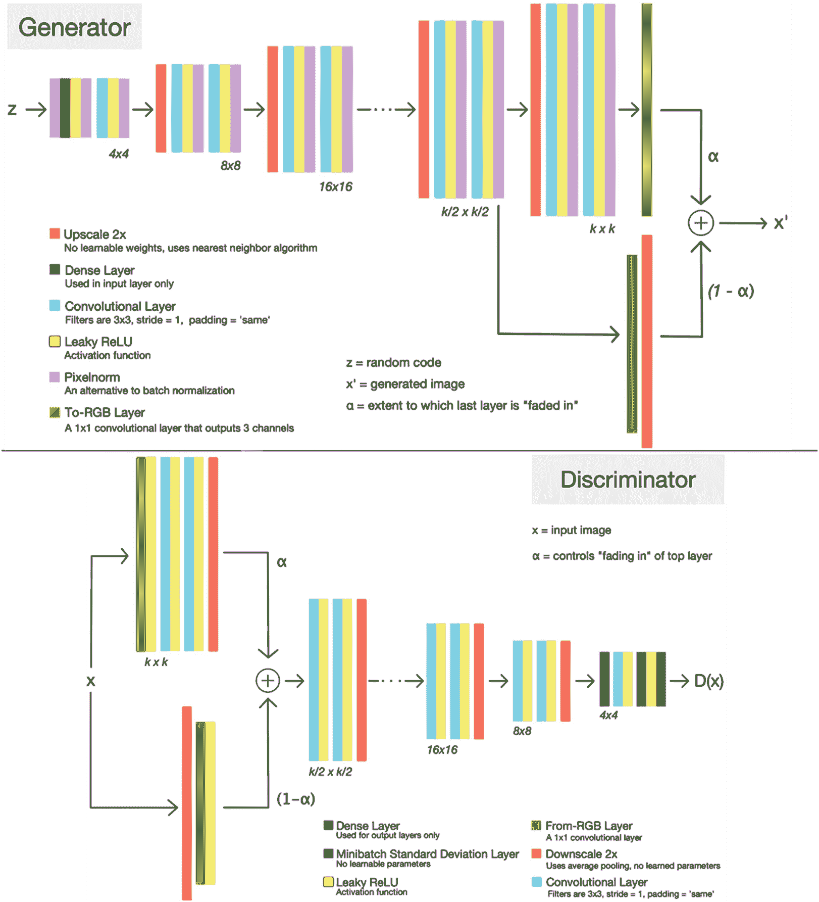

图 8-2

ProGAN 内部结构

在图 8-2 所示的生成器内部，有一种称为 Pixelnorm（像素归一化层）的新型层。像素归一化类似于批归一化，不同之处在于它将每个特征像素向量归一化到长度为 1，并将其传递回模块中的卷积层。这样做是为了避免我们在前几章中遇到的“特征叠加”或“噪声特征提取”问题。


### ProGAN 与 StyleGAN 版本 2

作者还提出了一种新的判别器层形式，称为**小批量标准差（MSD）层**，同样如图 8-2 所示。引入这种新层形式是为了给判别器增加一种手段，用于跟踪真实图像批次与伪造图像批次之间的统计信息，并将这些统计信息作为训练中的一个额外通道。

添加`MSD`层的结果是迫使生成器以匹配真实数据的方式变化其生成的样本。这会导致生成输出更加多样化，并减少生成器陷入尝试解决特定特征的可能性。在之前的许多 GAN 训练练习中，我们已经看到了非多样化输出的后果。

现在我们对 ProGAN 的高级工作原理有了很好的理解，可以看看如何在练习 8-1 中使用一个实现此类 GAN 的 Python 包。同样，这些 GAN 的训练成本可能很高，因此我们将看一个简单的训练集示例，以便初步体验。

#### 练习 8-1：使用 ProGAN

1.  从 GitHub 项目站点打开`GEN_8_ProGAN.ipynb`笔记本。如果不确定如何操作，请查阅附录 B。

2.  笔记本中的第一个单元格安装了`pro-gan-pth`包，该包来自 [`https://github.com/akanimax/pro_gan_pytorch`](https://github.com/akanimax/pro_gan_pytorch)，这是一个致力于此类 GAN 的开源项目：

    ```
    !pip install pro-gan-pth --quiet
    ```

3.  此示例中的`imports`和其他设置代码已被精简，对于读到本书这一部分的多数读者来说应该足够简单。我们将从如下所示的函数开始，介绍几个更有趣的部分：

    ```
    def check_output():
        print("rendering output loop - started")
        folder = './samples'
        while running:
            time.sleep(15)
            file = get_latest_file(folder)
            if file:
                clear_output()
                print(file)
                visualize_output(file,10,10)
    ```

4.  此函数用于在 ProGAN 代码训练时渲染输出。为了在笔记本中看到连续输出，我们将在训练单元格外部的一个独立进程中使用此函数。这样做是为了让输出能够实时渲染并在训练期间可见。

5.  接下来，我们向下滚动到创建并训练 ProGAN 的位置，代码如下：

    ```
    pro_gan = pg.ConditionalProGAN(num_classes=10, depth=depth,
                                   latent_size=latent_size, device=device)
    with io.capture_output() as captured:
        pro_gan.train(
            dataset=dataset,
            epochs=num_epochs,
            fade_in_percentage=fade_ins,
            batch_sizes=batch_sizes
        )
    ```

6.  此包的默认训练实现相当嘈杂，在笔记本中效果不佳。因此，我们使用`io.capture.output()`函数关闭输出，以抑制单元格的输出。

7.  从这里，我们可以通过实例化一个用于渲染的工作附加进程和一个用于训练的工作线程，来了解这段代码是如何全部运行的。

    ```
    t1 = threading.Thread(target=train_gan)
    p = multiprocessing.Process(target=check_output)
    start = time.time()
    p.start()
    t1.start()
    t1.join()
    ```

8.  同样，这段代码是为了让我们能够看到 GAN 训练过程中的输出。由于 GAN 是在另一个名为`t1`的线程中创建的，我们使用`t1.start`和`t1.join`来启动并等待线程完成。同样，`p`是为将运行渲染循环的进程创建的。但请注意，如果你终止单元格，渲染循环进程将继续运行，因此要停止该进程，你需要从菜单中选择运行时重启。

9.  从菜单中选择 **运行** ➤ **全部运行** 以开始训练，并在 ProGAN 训练时查看结果。

在前面的练习训练过程中，你看到了模型从 4×4 分辨率开始逐步提升。此示例的最终输出并不出色，因为它只升级到了三代，但请记住，随着模型的改进，更高分辨率在训练过程中会持续看起来更好。

当然，你可以尝试此 GAN 的其他变体，从训练其他样本数据到自行探索 Python 包的不同功能。如果你想进一步探索此 GAN，请查阅 GitHub 资源页面以获取更多文档。ProGAN 是下一节我们将要探讨的 GAN 下一个重要步骤的良好示范。

## 使用 StyleGAN 版本 2 进行样式化

最初的 StyleGAN 首次出现在 NVIDIA 团队的另一篇论文《一种基于样式的 GAN 生成器架构》中，该论文扩展了他们在 ProGAN 上的工作。这种形式的 GAN 是为了扩展生成器的生成能力，特别是不同特征的生成能力而开发的。

作者发现，他们可以将特征提取和复制隔离为三个不同的类别或粒度。这反过来又投射到 GAN 本身的架构中：在较低/顶层，提取较粗糙的特征，而较低的块则识别更详细的特征。作者定义了这些特征提取的粒度，如下所示：

- **粗粒度（小于 8² 像素）**：在低细节处识别，包括头发、面部朝向和大小等特征
- **中粒度（从 16² 到 32² 像素）**：通常由更精细的面部特征、闭眼和张嘴等特征定义
- **细粒度（64² 及以上像素）**：调整到眼睛、头发和肤色等细节特征

基于这种在层级别提取特征的概念，StyleGAN 通过提供两个新的主要增强功能扩展了模型。第一个是映射网络，提供了将特征向量输入映射到实际可见特征的能力。第二个是添加了样式模块，将这些特征映射转换为可见特征。

### 映射网络

映射网络提供了一种将编码向量表示转换为可见特征的非平凡方法。这些形式的网络工作方式类似于自编码器的编码器部分，但额外增加了识别可见特征的步骤。将编码映射到特征所产生的产物称为**特征纠缠**。

图 8-3 展示了映射网络，并详细说明了用于将特征映射到向量的八层分解，这些层将结果缩减到与输入相同的大小。在该图中，你可以看到结果（称为`W`）如何被馈送到 ProGAN 合成网络中进行生成。

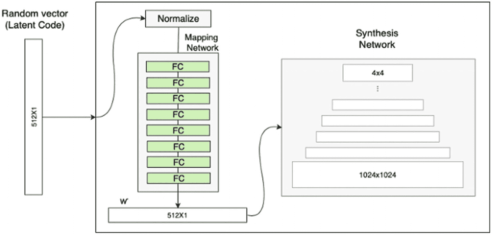

**图 8-3** StyleGAN 中的映射网络


### 风格模块

风格模块，即自适应实例归一化（AdaIN），将映射网络的向量输出 `W` 引入模型的生成层。在每个相应的渐进块中，每个上采样层和卷积层之间都会添加一个这样的模块。

图 8-4 展示了 AdaIN 模块的添加过程，以及将映射网络编码后的 `W` 作为每个模块直接输入的使用方式。在某些方面，这类似于残差网络，我们通过允许输入以某种形式绕过某些层来实现跨层跳跃。AdaIN 模块并非使用完整的输入，而是使用一个经过探索的映射输出作为 `W`；它们仅提供输入的缩放/归一化。

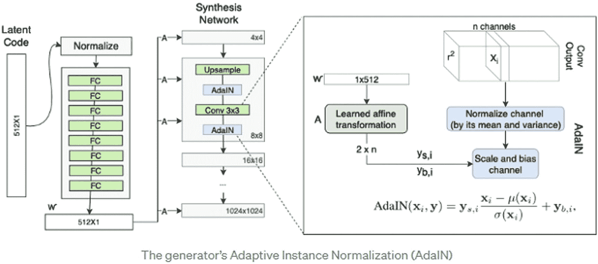

**图 8-4** 包含 AdaIN 模块的 StyleGAN 架构

在图 8-4 的放大示意图中，你可以看到编码后的向量是如何在层间对输出进行缩放和归一化的内部工作机制。这意味着 AdaIN 层不像 ResNet 那样是加法性的，而是定义了一个应用于输出的缩放归一化过程。

通过在层间对输出进行平移和缩放，AdaIN 模块有助于提升每个卷积层中相关滤波器的重要性，从而使生成器能够更好地理解哪些特征比其他特征更相关。将其视为一个内部强化循环也可能有所帮助，在这个循环中，映射层基于对更相关特征的理解来学习如何编码 `W` 向量。

#### 移除随机/传统输入

由于映射网络仅依赖于将随机输入简化为一个编码，作者决定摒弃对随机性的需求。相反，他们使用常量输入作为传入的初始向量。这通过最小化或控制输入生成器的随机输入，极大地减少了特征纠缠的问题。

当不同的特征（如头发的位置）可能被无意中映射到一起时，就会产生特征纠缠。在我们之前的训练练习中，你可能无数次注意到这一点，比如一缕缕头发可能出现在脸旁边，而不是在头顶上。

#### 随机变化（噪声输入）

在移除随机输入后，就需要向模型中添加某种形式的变异性。没有变异性，模型会变得过于专门化。添加噪声可以使模型保持更强的泛化能力。作者发现，他们可以通过在输入传入 AdaIN 层之前向每个通道添加随机噪声来引入输出的变异性。

在每个风格块中添加随机噪声的好处在于，它可以控制模型生成的细节，从而允许随机生成更精细的特征细节，例如雀斑、胡须、皱纹/酒窝。如果没有随机噪声，这些精细细节就会被更粗粒度的特征所掩盖。

#### 风格混合

使用 `W` 中间编码向量作为每个 AdaIN 块的直接输入的一个缺点是，模型特征之间存在紧密的相关性。为了打破这种相关性，会选择两组输入并通过映射网络，然后每个输出以 50/50 的概率随机传递给每个 AdaIN 块。

虽然这对 StyleGAN 使用的所有形式的训练数据并非都有益，但对于像 CelebA 这样的同质数据集，它确实有积极的效果。作者发现，他们可以将一个生成图像的特征与第二个生成图像的特征结合起来，生成第三个全新的组合图像。

YouTube 上有一个很好的视频演示了这种效果，网址是 [`https://youtu.be/kSLJriaOumA`](https://youtu.be/kSLJriaOumA)。该视频直观地展示了图像特征如何组合以生成新的独特组合图像。

#### W 的截断

正如我们在几章中看到的，真实数据中表示不佳的区域不容易生成。例如，在我们的 CelebA 数据集中，只有一小部分图像包含秃头的人。在之前的生成器中，这导致生成的秃头人物效果很差，因为样本的代表性不足。

为了适应训练中这个常见的缺陷，作者实现了对编码向量 `W` 的平均化处理。维护一个 `W` 的连续平均值，称为 `wavg`，然后将编码向量 `W` 转换为与该平均值的差值（delta）。

这里的思路是，生成最佳的平均图像，然后通过允许使用 `w_delta` 对图像进行修改来反向工作，这也提供了额外的特征控制能力。这反过来又允许仅通过改变 `w_delta` 来控制模型，这与我们使用变分自编码器在均值和方差之间进行映射的方式类似。

#### 超参数调优

StyleGAN 作者贡献巨大的最后一个主要元素是花费大量时间调整和优化模型的超参数。与他们之前 ProGAN 的工作相比，他们取得了显著的改进。学习率、训练轮次等超参数值在代码中都已进行了优化。

因此，我们即将看到的 StyleGAN 和 StyleGAN2 在人脸生成方面产生了令人难以置信的输出。如果你决定在自己的数据集上使用这个模型，你可能需要花时间相应地修改各种超参数。

### Frechet Inception Distance

生成模型的输出是通过一个称为 Frechet Inception Distance（FID）的指标来衡量的。该距离基于比较预训练的图像分类网络在真实图像和输出图像上的激活值。得分越低，表示生成的模型输出越好。

在图 8-5 中，展示了基于 ProGAN 的 StyleGAN（上方）与第二版 StyleGAN2（下方）的 FID 对比。FFHQ 代表 Flikr-Faces HQ，这是另一个用于训练生成器的人脸数据集。你可以看到，结果从第一个表格中 ProGAN 的 FID 得分 7-8，降低到 StyleGAN2 的略低于 3。

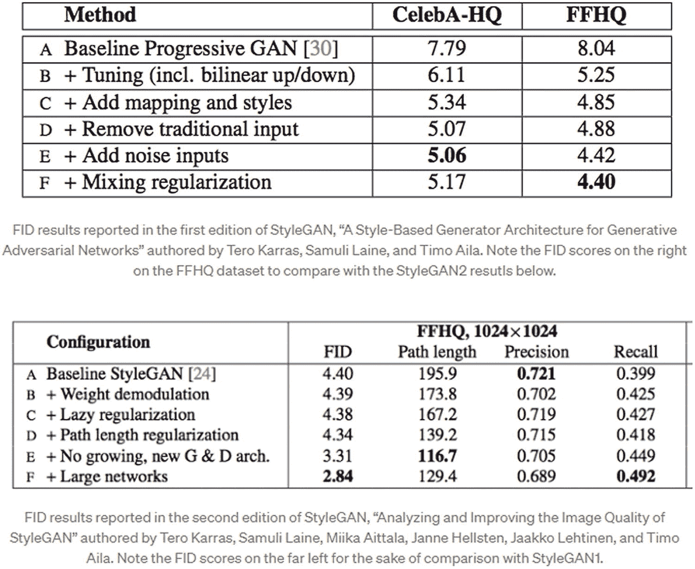

**图 8-5** StyleGAN 与 StyleGAN2 的 FID 得分对比

这些结果令人印象深刻，如果你想直观地了解 StyleGAN2 的表现有多出色，可以访问 `whichfaceisreal.com`，该网站直观地展示了这些生成的人脸有多么逼真。

虽然我们没有时间更详细地回顾 StyleGAN，因为涵盖所有这些特性的代码量很大，但我们将继续探讨当前人脸生成的黄金标准。这个标准目前由 StyleGAN2 设定，我们将在下一节中更详细地介绍它。

### StyleGAN2

尽管 NVIDIA 的团队本可以满足于 StyleGAN 的成果，但他们继续挑战可能性的极限，并因此推出了 StyleGAN2。这个版本进一步将 FID 得分从 4.40 降低到 2.84，并生成了迄今为止最逼真的一些人脸。

与上一节我们审视 StyleGAN 时类似，我们将回顾每个相对于图 8-5 提升了 FID 得分的特征组。我们从下一节中的第一个特征——权重解调开始。


### 权重解调

`AdaIN`层源于早期一个名为*神经风格迁移*的概念，该概念能够捕捉并迁移风格。然而，`StyleGAN2`的作者发现，诸如水滴或污渍之类的视觉伪影，会因风格的强化而通过图像传播。

相反，他们发现可以将`AdaIN`层移至卷积层内部，不再作为直接输入，而是作为归一化层融入其中。

将风格归一化融入卷积层本身的好处在于实现了计算的并行化，从而使模型训练速度提升高达 40%，并进一步消除了水滴或污渍等视觉伪影。

### 路径长度正则化

这为损失函数引入了一个新的归一化项，以更好地平滑或均匀化潜在空间。我们在本书中多次看到，在生成模型中归一化或均匀化潜在空间的重要性。这是理解如何生成能够产生一致输出的模型的关键概念。

平滑潜在空间使得图像能够更容易地映射到该空间并从该空间映射出来，在已知的投影中，这不仅能实现更可控的图像生成，还能将图像投影回潜在空间编码。理解从潜在空间到生成图像的这种关系，使得能够沿着潜在空间的路径生成图像。

平滑和理解潜在空间的能力为从动画到年龄增长等更多应用提供了可能。这些应用已通过`StyleGAN2`在风格和特征间的动画生成中成功展示。

### 惰性正则化

应用路径长度正则化可能是一个计算成本高昂的过程，且并非每次训练迭代都能带来收益。因此，在`StyleGAN2`中，`PLR`仅每`n`次迭代应用一次，其中`n`通常设置为`16`，但也可调整。

### 无需渐进式增长

正如我们所看到的，渐进式增长 GAN 成功地从`4×4`像素构建出高达`1024×1024`像素的大尺度图像。然而，`ProGAN`通常会出现对某些特征（如鼻子、眼睛和嘴巴）的强烈位置偏好。

为了绕过这些问题，同时仍能实现生成器模型的渐进式发展，我们转向另一篇近期论文：Animesh Karnewar 和 Oliver Wang 的《生成对抗网络的多尺度梯度》。该论文提出了使用单一架构实现多尺度梯度的概念。

图 8-6 展示了多尺度梯度 GAN（`MSG-GAN`）的架构，请勿将其与食品添加剂混淆。在`MSG-GAN`中，模型被设计为基于我们在`ProGAN`中看到的相同渐进过程，逐步构建生成输出。

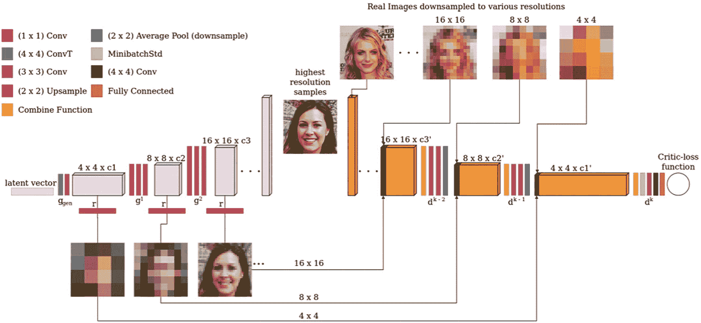

**图 8-6**  
`MSG-GAN`架构

`StyleGAN`的作者采用了这种渐进模型，并通过输入/输出跳跃连接实现，这与我们在`ResNet`中看到的类似。图 8-7 展示了`MSG-GAN`、输入/输出跳跃连接和`ResNet`三种模型架构差异的对比。

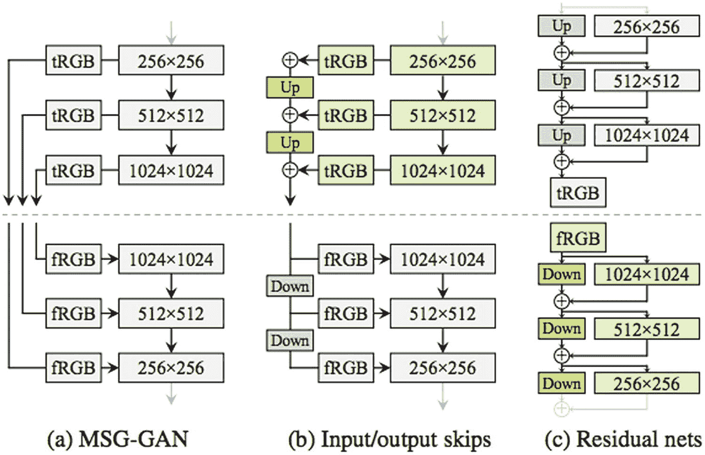

**图 8-7**  
渐进式架构对比

`StyleGAN2`中使用的跳跃连接架构可以执行与`ProGAN`相同的特征粒度渐进式增长，使模型能够更专注于更高层级的进展（例如`1024×1024`分辨率），而非通过常规的渐进式发展。当使用大型网络进行扩展时，这种增强效果会进一步放大，我们将在下一节看到。

### 大型网络

通过对`ResNet`的探索，我们看到了一个典型的只有 10 层或更少卷积层的浅层模型，如何通过跳跃连接的魔力，增加到拥有超过 100 层的生成器。与`ResNet`类似，`StyleGAN2`也可以通过采用输入/输出跳跃连接，从超大型网络中获益。

图 8-8 比较了`StyleGAN`和`StyleGAN2`各自的特征贡献。请记住，`StyleGAN`使用基本的渐进式增长架构，而`StyleGAN2`使用`MSG`输入/输出跳跃连接，使模型能够更专注于我们通常在更高层级（如`1024×1024`）生成的精细细节。x 轴表示渐进层级，y 轴表示生成目标尺寸输出时的准确率百分比。

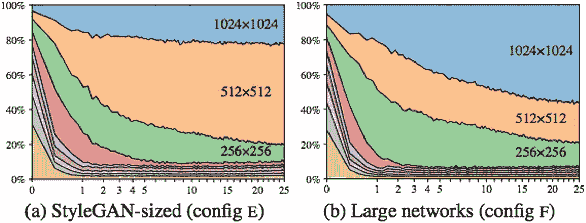

**图 8-8**  
特征对各自输出的贡献对比

通过构建大型网络，模型生成器可以更加强调从较高层级发展而来的特征。如图 8-9 所示，与常规的`StyleGAN`相比，大型网络中`1024×1024`的特征得到了更显著的强调。

现在我们已经理解了`StyleGAN`和`StyleGAN2`的所有特性，我们可以继续使用一个已有的包来训练一个版本。在练习 8-2 中，我们将使用我们的老朋友`CelebA`数据集来训练一个`PyTorch`版本的`StyleGAN2`。让我们进入下一个练习，训练一个`StyleGAN2`来为我们服务。

**练习 8-2. 训练 STYLEGAN2**

1.  从 GitHub 项目站点打开`GEN_8_StyleGAN2.ipynb`笔记本。如果不确定如何操作，请查阅附录 B。

2.  这个模型训练可能需要相当长的时间，但结果是值得的，同样，生成的已保存模型也值得保留。考虑到这一点，对于这个笔记本，我们将使用附录 C 中讨论的功能，这些功能允许我们连接到 Google Drive 并永久保存模型。笔记本顶部的单元格提供了连接到你的 Google Drive 的功能。

3.  接下来，我们将使用以下代码安装用于`StyleGAN2`的`PyPi`包`stylegan2_pytorch`：

```
!pip install stylegan2_pytorch --quiet
```

4.  接下来的代码块会下载`CelebA`的图像，并将它们解压到你的 Google Drive 上一个名为`stylegan2`的文件夹中。

5.  现在，当你下载`CelebA`数据集时，它将被保存到你的 Google Drive 中。这意味着后续运行此笔记本时，可以直接引用已保存的文件夹，而无需重新下载数据。同样，关于设置将数据和模型保存到 Google Drive 以及从中加载的详细信息，请参阅附录 C。

6.  最后，我们可以使用以下代码直接针对保存的图像文件夹运行模型。注意变量`image_folder`前的`$`符号。我们使用`$`将 Python 代码中的变量替换到 shell 中。

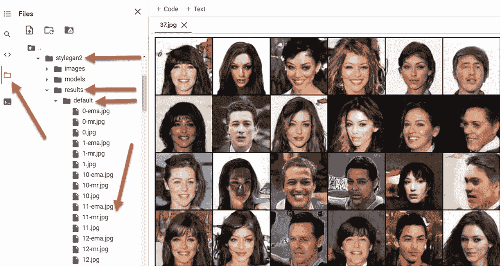

**图 8-9a**  
训练过程中检查生成的输出

7.  当你运行最后一个单元格时，模型将被设置好并开始从保存的图像文件夹中摄取真实图像。在运行代码时，输出会被保存到你的 Google Drive 中`stylegan2`文件夹下的`results`子文件夹中。除了生成的输出，当前训练点的模型也会被保存到另一个名为`models`的文件夹中。关于如何加载/保存模型，请参阅附录 C。

8.  你可以随时通过左侧的文件夹图标打开文件文件夹来查看生成的输出。然后向下导航到`gdrive/MyDrive/stylegan2/results/default`文件夹，如图 8-9a 所示。

```
!stylegan2_pytorch --data $image_folder
```


在`Figure 8-9a`中，你可以看到 10%训练的结果。注意与我们之前的示例相比，人脸生成质量的关键差异。某些图像中仍然存在不悦目的视觉伪影，但总体而言，图像和人脸的细节非常精致。

`StyleGAN`和`StyleGAN2`确实改进了整体生成模型，并增加了若干功能以提供出色的特征提取和图像隔离能力，以至于连我们人类都难以分辨真假。我们将在第 10 章中探讨识别假图像和深度伪造的方法。

上一个练习中包含了另外两个数据集：`cars_all`和`foods`。`cars_all`数据集包含 60,000 张新款车型的照片，从外部和内部的不同角度拍摄。`foods`数据集包含 80,000 张各种菜肴的照片，盛放在盘子、碗或其他餐具中。`Figure 8-9b`展示了两个数据集训练至 100%完成度的示例，这在`Colab`上大约需要两到三天，并且可能需要多次重启。

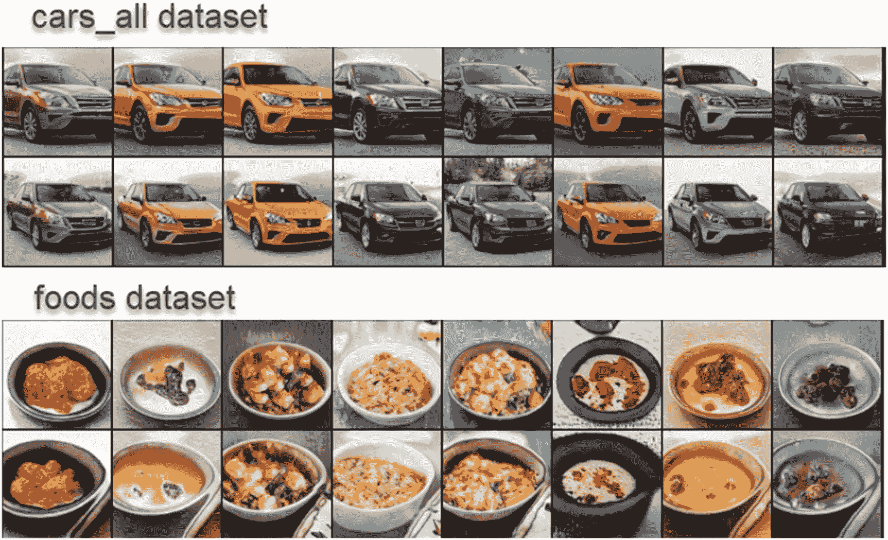

Figure 8-9b

`StyleGAN2`在`cars_all`和`foods`数据集上训练至 100%的输出

我们使用`StyleGAN2`进行的最后一个实验以`CelebA`数据集作为参考，并与我们之前使用各种`GAN`的工作进行比较。将`StyleGAN2`应用于其他数据集已经产生了非常有趣的结果，从伪造的动漫/卡通角色到年龄增长等。`stylegan2_pytorch`包是您未来可能进行的任何生成工作的良好基础。不过，现在我们将继续本章内容，进入下一节的`NoGAN`。

## `DeOldify`与新型`NoGAN`

正如本章开头所见，生成建模正在快速发展，其入门门槛也随之提高。许多人可能认为构建更新更好的生成器超出了学术界或专门研究实验室以外任何人的能力范围。幸运的是，事实远非如此，事实上，研究机构之外每天都有新的进展。

一位做出贡献的典型人物是`Jason Antic`，他自称是一名程序员，曾在`Fast.ai`学习过一门高级人工智能课程。他在学习课程后对人工智能如此着迷，以至于减少了工作时间，将所有时间投入到构建新的生成器上。`Antic`后来开发了一个名为`DeOldify`的著名`GAN`，能够为旧照片着色和增强。

`DeOldify`的第一个版本基于渐进式自注意力`GAN`开发，提供了从艺术风格到普通风格的着色选项。`DeOldify`迅速大获成功，许多人注意到一个普通程序员如何在短时间内取得如此成就。`Antic`现在全职从事该项目，并与他在`Fast.ai`的旧导师合作。

通过使用典型`GAN`技术开发`DeOldify`的工作，`Antic`最终得出结论，常规训练存在缺陷。他发现，在训练的大部分时间里分别训练生成器和判别器，然后在模型开发的后期阶段将它们结合起来，可以获得更好的结果。

实际过程是：首先训练生成器创建图像，并使用特征损失进行训练。当生成器达到所需的最小特征损失后，生成的图像作为二元分类器（真实或伪造）与判别器进行对抗训练。然后，当判别器训练充分后，使用典型的`GAN`训练方法将两个模型结合起来。

`Antic`将这种新型`GAN`命名为`NoGAN`，因为大部分训练是在隔离的模块中完成的。通过这种训练形式，`Antic`还发现了模型学习的一个有趣特性。他观察到，在训练的某个时刻，存在一个从优秀输出到特征扭曲输出的拐点。为了找到这个拐点，他需要严格测试多种模型变体和训练点。

通过观察这个拐点并确定模型何时达到最优，`Antic`会回过头来重新训练另一个模型。他的工作成果令人印象深刻，我们将在本节的两个练习中看到。在练习 8-3 中，我们将使用`DeOldify`打包模型为一些老旧的历史黑白照片着色。

### 练习 8-3：使用`DeOldify`为图像着色

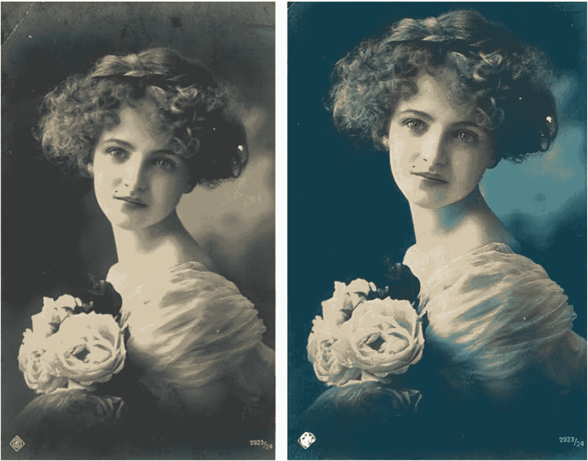

Figure 8-10

着色并增强后的图像

1.  从`GitHub`项目站点打开`GEN_8_DeOldify_Image.ipynb`笔记本。如果不确定如何操作，请参考附录 B。

2.  此笔记本需要下载、安装并重启，然后我们才能使用`DeOldify`的神奇功能。这意味着您需要逐个运行顶部的单元格，直到完成`DeOldify`所需的安装，如下所示：

```
!pip install -r colab_requirements.txt
```

3.  由于我们直接从`DeOldify`的`GitHub`仓库拉取代码，因此需要安装该包的各种依赖项。在上一段代码块中安装依赖项后，您可能需要重置笔记本的运行时。从菜单中选择`Runtime` ➤ `Restart runtime`。

4.  安装`DeOldify`后，您可以继续执行熟悉的代码块，以下载本书中一直使用的测试/训练图像，此处不再赘述。在本示例中，我们使用历史黑白图像，但您也可以使用自己的任何图像。


5. 我们使用 Python 代码调用 DeOldify，并在`Import`部分导入所需的各种库。请注意使用了`fastai`导入，因为这是该包使用的主要库。

```
import fastai
from deoldify.visualize import *
import warnings
warnings.filterwarnings("ignore", category=UserWarning, message=".*?Your .*? set is empty.*?")
```

6. 接下来，我们将向下查看下载预训练模型和水印的部分。水印用于标识图像是由人工智能生成的。

```
!mkdir 'models'
!wget https://data.deepai.org/deoldify/ColorizeArtistic_gen.pth -O ./models/ColorizeArtistic_gen.pth
!wget https://media.githubusercontent.com/media/jantic/DeOldify/master/resource_images/watermark.png -O ./resource_images/watermark.png
```

7. 然后，我们只需一行代码即可从该包中实例化一个`colorizer`，如下所示：

```
colorizer = get_image_colorizer(artistic=True)
```

8. 创建好`colorizer`后，我们可以继续使用以下代码在 Colab 表单中使用它：

```
#@title COLORIZE IMAGES  { run: "auto" }
import glob
from PIL import Image
import ipywidgets as widgets
from IPython.display import display
from IPython.display import clear_output
files = sorted(glob.glob("%s/*.jpg" % image_folder))
file_idx = 27 #@param {type:"slider", min:0, max:35, step:1}
show_image_in_notebook(files[file_idx])
image = colorizer.plot_transformed_image(files[file_idx])
show_image_in_notebook(image)
```

9. 使用该表单，您可以滑动浏览各种图像，查看它们着色后的效果。图 8-10 显示了原始图像与 DeOldify 着色版本的对比输出。

遗憾的是，如果您阅读的是印刷版书籍，将无法看到着色的完整效果。要全面了解并享受快速为照片着色的乐趣，您需要运行笔记本练习。结果令人印象深刻，您一定会成为亲戚中的红人，他们会请您为老照片着色。

您会注意到图像右下角有一个水印。在图 8-10 中，这个水印被之前的一个水印遮挡了。您在其他图像上清晰可见的艺术调色板水印，表示该图像是由人工智能生成的。越来越多的 AI 开发者/研究人员达成共识，所有生成的内容都应带有此水印。

### 为视频着色与增强

DeOldify 不仅能为图像着色，还能处理视频。用于视频着色的特定模型变体称为*简单视频*，它自身进行了一些改进。虽然视频模型基于 SAGAN/NoGAN 训练，但通过跨帧优化来防止输出闪烁，从而得到改进。

在接下来的练习中，我们将设置 DeOldify 视频模型，以处理我们想要着色的老电影。在很大程度上，这个示例将类似于我们之前练习中使用的图像（艺术）模型。为视频着色会非常有趣，可以看到帧是如何在输出中插值的，我们将在练习 8-4 中看到这一点。

**练习 8-4. 使用 DEOLDIFY 为视频着色**

1. 从 GitHub 项目站点打开 `GEN_8_DeOldify_Video.ipynb` 笔记本。如果不确定如何操作，请查阅附录 B。

2. 在使用 DeOldify 的神奇功能之前，这个笔记本同样需要下载、安装和重启。这意味着在安装 `requirements.txt` 文件后，您可能需要重启笔记本的运行时，如下代码块所示：

```
!pip install -r colab_requirements.txt
```

3. 请记住，您可以通过菜单选择“运行时” ➤ “重新启动运行时”来重启运行时。请注意，运行时重启与笔记本的恢复出厂设置不同。我们通常只在希望重置所有内容（包括文件和安装）时才使用恢复出厂设置。

4. 接下来的几个代码块都与我们之前的练习和其他示例类似。请注意，这次我们加载的是用于老电影黑白视频数据集的 `video-bw`。其中几个片段来自无声电影时代；其他片段可能带有音频。DeOldify 会从文件中剥离音频，并在着色后重新添加，因此有声电影也可以被着色。

5. 接下来，我们可以使用以下代码块创建视频着色器：

```
colorizer = get_video_colorizer()
```

6. 关键区别在于调用了辅助函数来创建视频着色器。

7. 然后，我们可以向下移动到最后一个代码块，看看着色器是如何再次在 Colab 表单中设置以便于使用的：

```
#@title IMAGE SELECTION  { run: "auto" }
import glob
import ipywidgets as widgets
from IPython.display import display
from IPython.display import clear_output
files = sorted(glob.glob("%s/*.mp4" % video_folder))
file_idx = 4 #@param {type:"slider", min:0, max:12, step:1}
show_video_in_notebook(files[file_idx])
video = colorizer.colorize_from_file_name(files[file_idx])
show_video_in_notebook(video)
```

8. 同样，在运行完之前所有的笔记本单元格后，您可以使用该表单滚动浏览视频集合并查看输出。

9. 您也可以随意使用自己选择的老视频，并用 DeOldify 为它们着色/增强。

图 8-11 展示了一个简单视频输出帧的示例。在示例帧中，我们可以看到一些瑕疵，比如女士的裙子和马的腿没有正确着色。当皮肤出现类似变色时，Antic 将这些缺陷命名为*僵尸皮肤*。

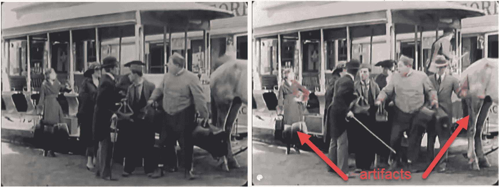

图 8-11 着色视频的示例帧

*僵尸皮肤*描述的是灰色或着色不正确的皮肤，通常是特征提取不佳的结果。在图 8-12 中，我们可以观察到马的腿上出现了这种类似僵尸的皮肤效果，看起来是灰色的。在视频中，这种效果更为明显，因为场景光照可能快速变化，导致这些各种瑕疵。同样，可视化这些结果的最佳方式是运行笔记本并滚动浏览各种示例视频。

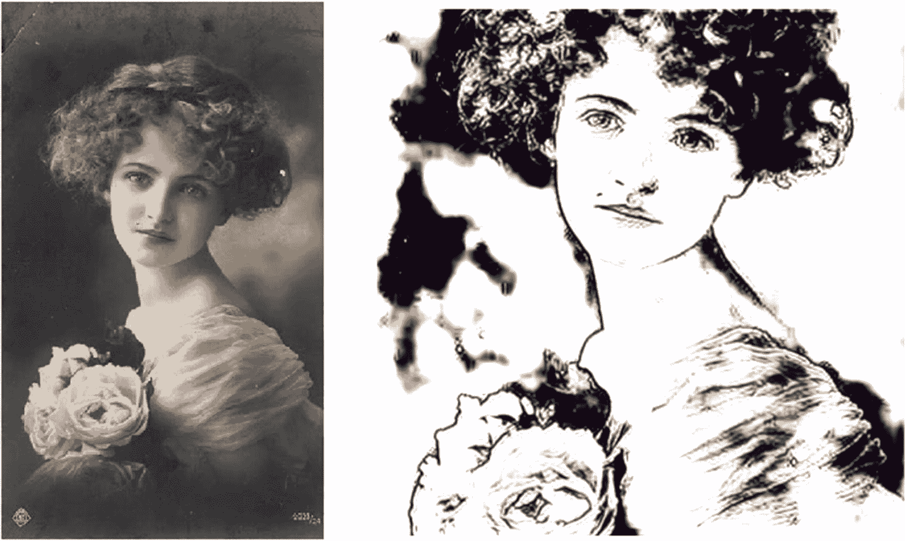

图 8-12 ArtLine 的示例输出

DeOldify 是一个很好的例子，展示了生成式建模如何变得对研究机构之外的人也可用。它展示了一位敏锐的程序员如何独立扩展模型，以产生一些重要且令人兴奋的结果。我们当然可以期待未来有更多像 DeOldify 这样的项目，在下一节中，我们将探讨另一个类似的计划，名为 ArtLine。


## 用 ArtLine 展现艺术风格

`ArtLine` 是另一个旨在将照片转换为线条艺术画作，并将其转化为卡通版本的项目。该项目遵循了 `Antic` 在构建 `DeOldify` 时使用的许多相同发现。这两个项目都基于 `Fast.ai` 团队开发的许多改进/实用工具。

从技术上讲，`ArtLine` 与 `DeOldify` 类似，都基于一个自注意力生成对抗网络（self-attention GAN），该网络会逐步调整大小以达到所需分辨率。它同样以 NoGAN 的方式进行训练，其中初始生成器特征损失由预训练的 VGG 模型确定，这与我们在第 6 章的示例中所做的非常相似。然而，与 `DeOldify` 不同的是，`ArtLine` 不使用判别器来微调特征提取，因此它从未作为 GAN 进行训练。

正如我们将看到的，`ArtLine` 的结果在人像和面部方面表现良好，但在其他类型的照片上效果稍逊。不过，看看这种 NoGAN 形式在各种图像上的表现可能会很有趣，我们将在练习 8-5 中看到这一点。我们将再次使用直接从仓库中拉取的项目源代码，并在笔记本中运行它。

### 练习 8-5. 用 ArtLine 展现艺术风格

1. 从 GitHub 项目站点打开 `GEN_8_ArtLine.ipynb` 笔记本。如果不确定如何操作，请查阅附录 B。

2. 在使用 `ArtLine` 展现艺术风格之前，此笔记本同样需要下载、安装并重启。因此，在安装 `requirements.txt` 文件后，您可能需要重启运行时，如下面的代码块所示：

3. 如果在笔记本的后续部分遇到错误，请确保已通过从菜单中选择 **运行时 ➤ 重启运行时** 来重启运行时。

4. 此笔记本的 `imports` 块对各种组件进行了广泛的安装。与 `DeOldify` 不同，该项目有一些要求需要在类中描述特征损失。

5. 向下滚动到 `FeatureLoss` 类，查看模型如何确定特征之间的损失。`ArtLine` 模型使用此类来评估模型内部的特征训练。

```
class FeatureLoss(nn.Module):
    def __init__(self, m_feat, layer_ids, layer_wgts):
        super().__init__()
        self.m_feat = m_feat
        self.loss_features = [self.m_feat[i] for i in layer_ids]
        self.hooks = hook_outputs(self.loss_features, detach=False)
        self.wgts = layer_wgts
        self.metric_names = ['pixel',] + [f'feat_{i}' for i in range(len(layer_ids))] + [f'gram_{i}' for i in range(len(layer_ids))]
    def make_features(self, x, clone=False):
        self.m_feat(x)
        return [(o.clone() if clone else o) for o in self.hooks.stored]
    def forward(self, input, target):
        out_feat = self.make_features(target, clone=True)
        in_feat = self.make_features(input)
        self.feat_losses = [base_loss(input,target)]
        self.feat_losses += [base_loss(f_in, f_out)*w for f_in, f_out, w in zip(in_feat, out_feat, self.wgts)]
        self.feat_losses += [base_loss(gram_matrix(f_in), gram_matrix(f_out))*w**2 * 5e3 for f_in, f_out, w in zip(in_feat, out_feat, self.wgts)]
        self.metrics = dict(zip(self.metric_names, self.feat_losses))
        return sum(self.feat_losses)
    def __del__(self): self.hooks.remove()
```

6. 在此类内部，您可以调整一个超参数，该参数将特征损失缩放回模型中。该常量显示为 `5e3`，您可以更改此值以确定其对最终输出的影响。

7. 接下来，我们可以看到如何使用以下代码下载预训练的 `ArtLine` 模型：

```
MODEL_URL = "https://www.dropbox.com/s/starqc9qd2e1lg1/ArtLine_650.pkl?dl=1"
urllib.request.urlretrieve(MODEL_URL, "ArtLine_650.pkl")
path = Path(".")
learn=load_learner(path, 'ArtLine_650.pkl')
```

8. 为了使用该模型，我们再次设置了一个表单，允许您浏览各种图像。对于此示例，我们有两个数据集：我们在上一个练习中使用的 `historic-bw` 数据集，以及一个包含有趣照片的新数据集。

```
#@title ARTLINE IMAGES  { run: "auto" }
import glob
files = sorted(glob.glob("%s/*.jpg" % image_folder))
file_idx = 7 #@param {type:"slider", min:0, max:25, step:1}
img = PIL.Image.open(files[file_idx]).convert("RGB")
img_t = T.ToTensor()(img)
img_fast = Image(img_t)
show_image(img_fast, figsize=(8,8), interpolation='nearest');
p,img_hr,b = learn.predict(img_fast)
Image(img_hr).show(figsize=(8,8))
```

9. 运行代码将产生如图 8-12 所示的输出，这是我们之前用 `DeOldify` 着色过的同一张旧照片。如果您浏览任一数据集中的其他各种照片，您可能会注意到历史数据集中对比度较高的图像转换效果更好。

```
!pip install -r colab_requirements.txt
```

`ArtLine` 的模型还有另一种变体，允许您将图像转换为彩色卡通。该模型效果很好，并且可以以与我们刚刚完成的练习类似的方式进行设置。我们将其留给您自行探索，并享受将图像转换为卡通的乐趣。

像 `ArtLine` 和 `DeOldify` 这样的项目是近期由对开发各种应用（从艺术创作到为旧照片着色和增强）的生成式建模感兴趣的开发者发起的。这些项目将如何成熟并影响各个社区还有待观察，但很可能许多其他开发者也会效仿。

## 结论

正如我们在本章中所看到的，生成式建模已经超越了典型的 GAN 架构。它已经发展出其他变体，从使用渐进式架构的模型到完全不使用 GAN 训练的模型。这一全新的应用开发领域在短期和长期内将如何演变，仍有待观察。

然而，有一件事是肯定的，那就是这些增强型且令人印象深刻的生成器正变得越来越易于使用。未来，这必将对多个行业的各种应用产生影响。我们现在需要克服的主要障碍是将生成式建模应用于其他领域数据源。

然而，作为生成式建模者，理解如何利用这项技术也同样重要。在下一章中，我们将把我们学到的所有生成式建模知识应用到许多深度伪造中最令人恐惧的应用中。


