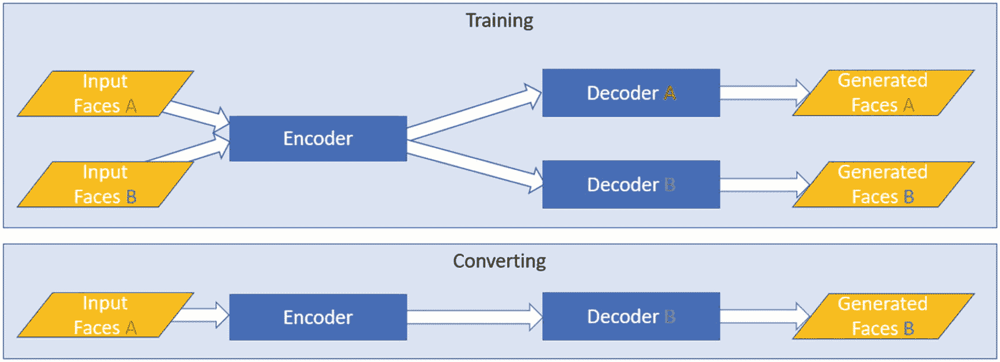
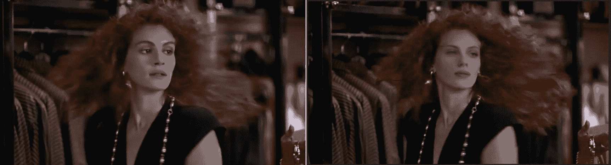
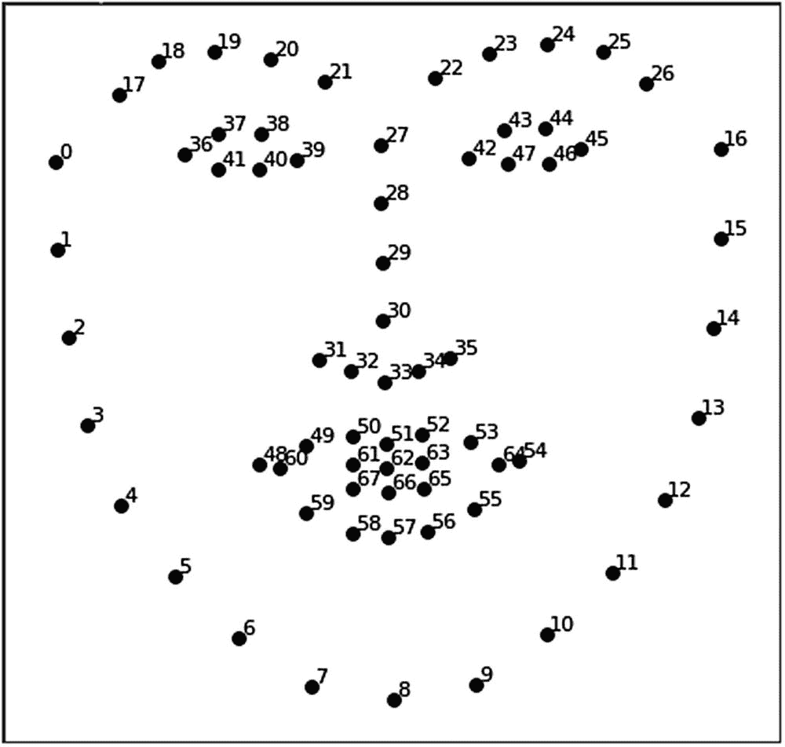
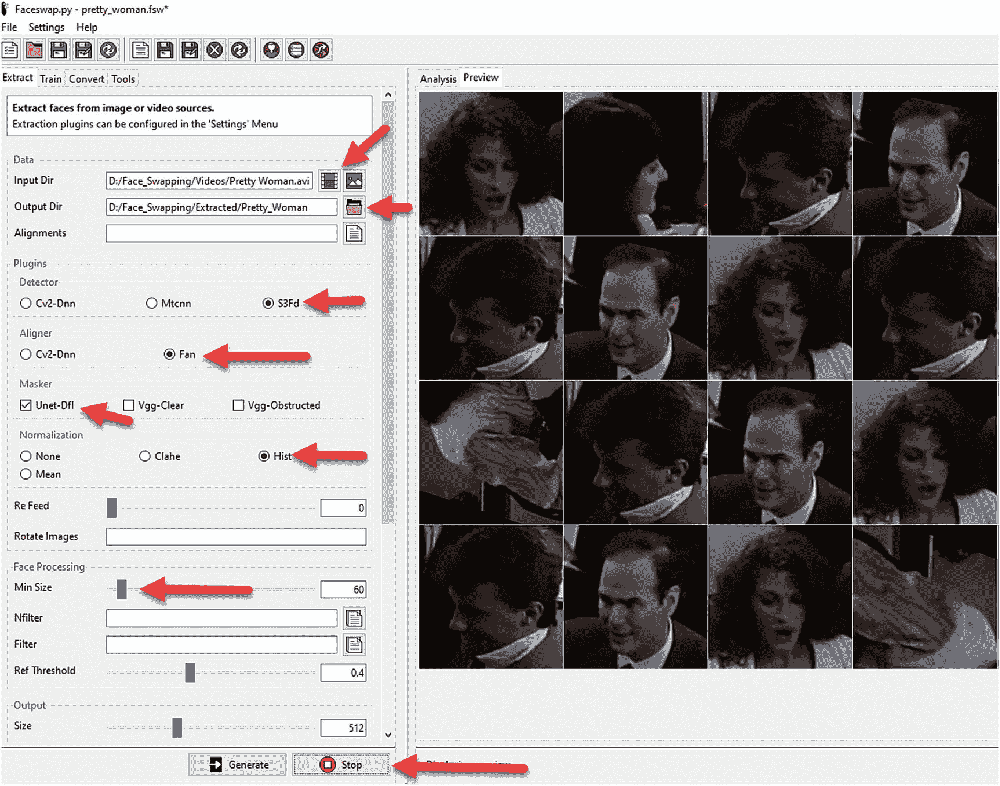
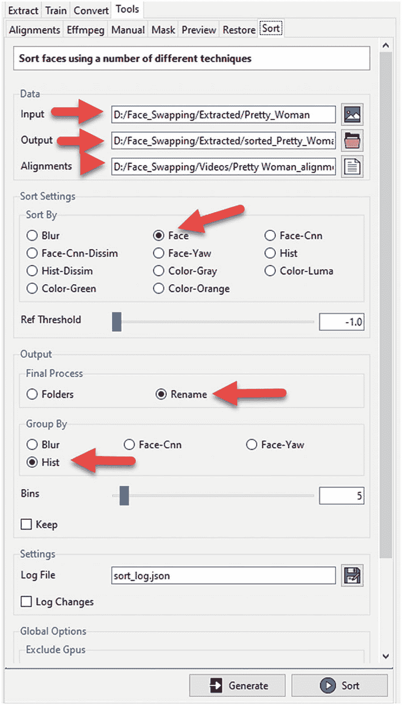
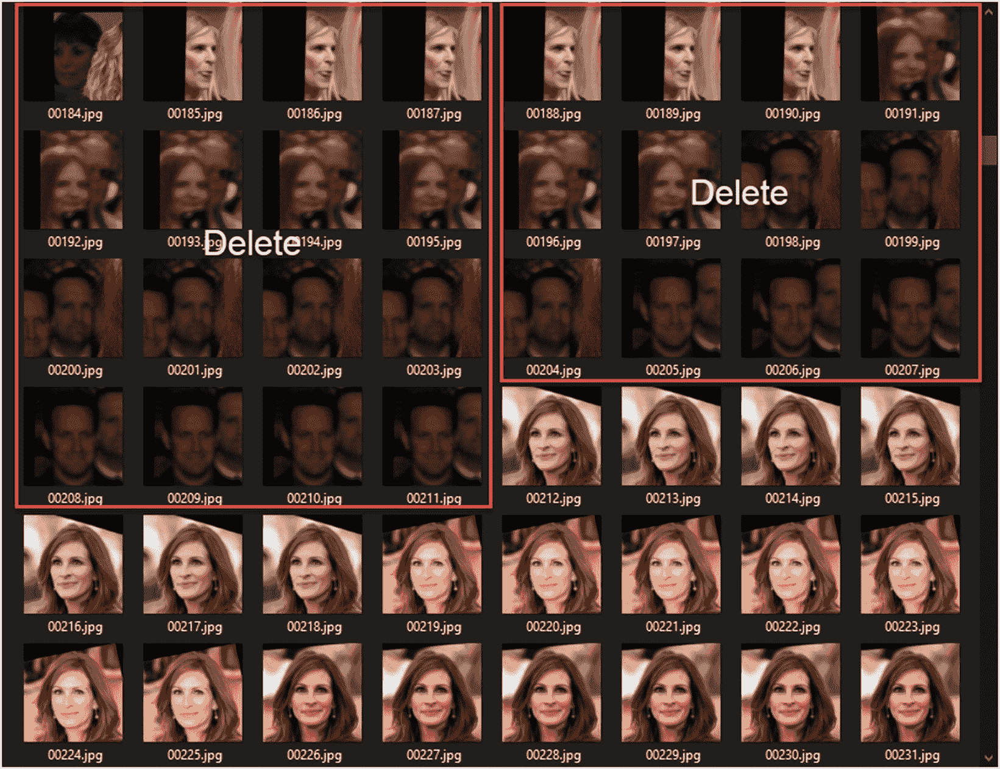
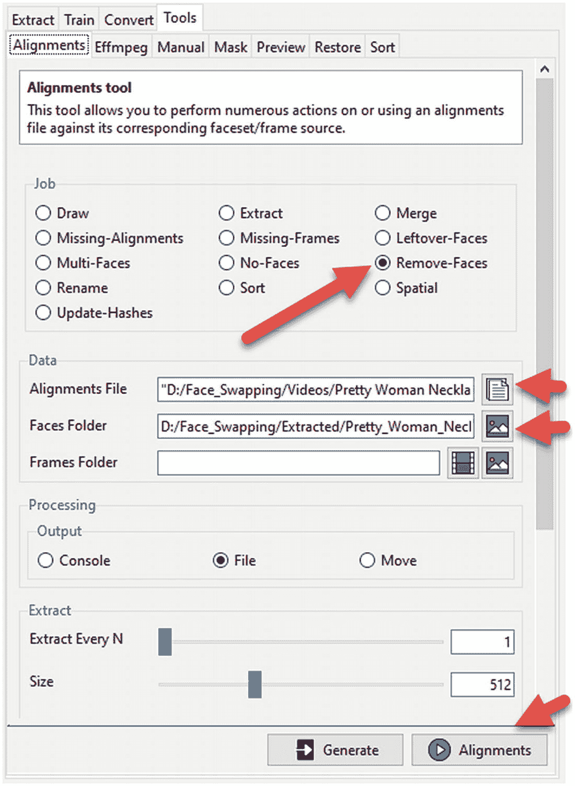
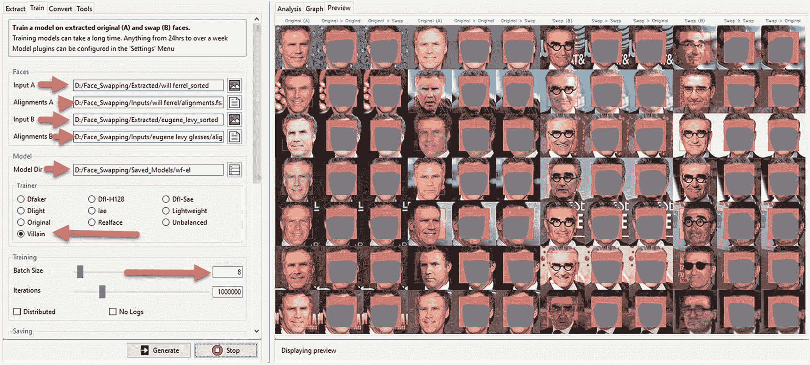
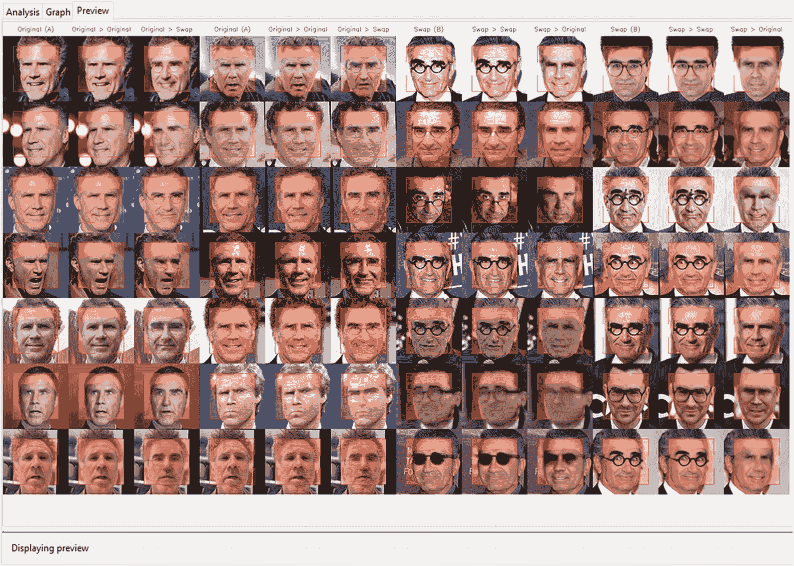
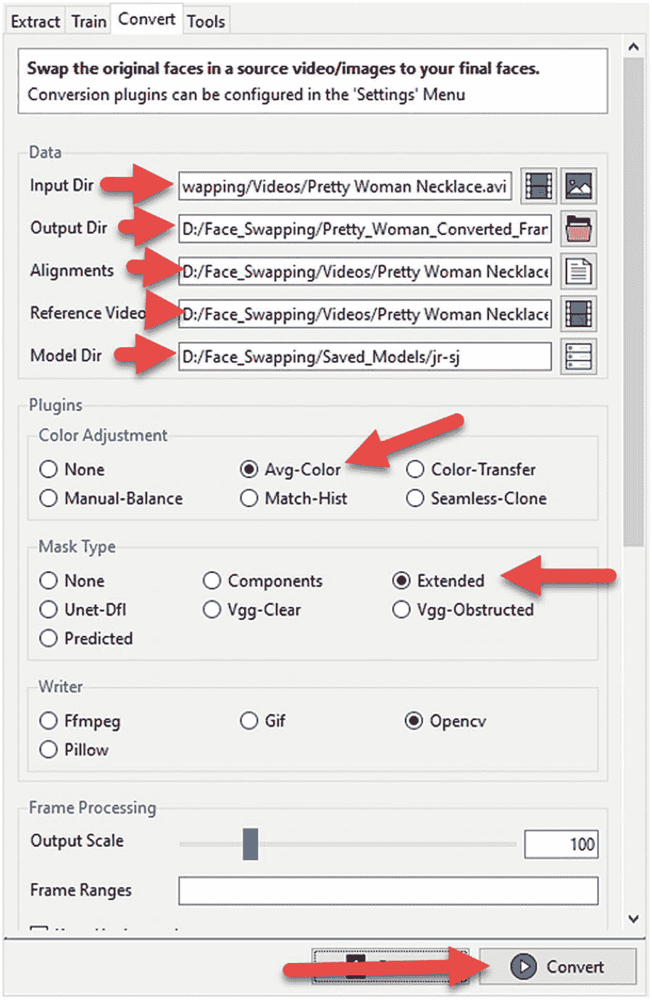

# 深度伪造与换脸技术

生成式建模最具争议的应用莫过于制造虚假人脸或将其用于换脸技术。这种技术俗称*深度伪造*，已成为假新闻及各类相关阴谋论的温床。许多人因恐惧而误解，认为这项技术毫无价值且违背伦理，这也给生成式建模带来了负面形象。

深度伪造已被用于制作各种名人恶搞表情包和 YouTube 视频，通过替换经典角色中的面孔达到幽默效果。该技术也曾被用来让政治人物在各类喜剧乃至并不有趣的演示中"傀儡化"表演。

当然，深度伪造也存在阴暗面：各类色情图片/视频中，无名（通常为女性）演员的面孔被替换成名人。这是目前最违背伦理的应用，因为名人的面孔未经同意就被使用，并被置于极具争议的处境中。

然而，深度伪造的力量也开始渗透好莱坞，通过提供新的视觉效果技术，让年长或年轻明星的外貌通过深度伪造或更广义的生成式建模进行修改。目前该技术最常见的应用是面部老化或年轻化处理，这已被多部大片采用。

深度伪造技术将如何被使用/滥用仍有待观察，但已证明的是生成式建模将对未来生活产生深远影响。例如，在媒体中替换面孔或其他形态可能成为常态。想象一下，只因偏爱某位演员就能替换电影主角，甚至改变整部电影的风格。正如本书所述，只要有足够的数据和耐心，替换或生成任何内容都是可能的。

若未演示换脸技术的应用，我们便无法撰写一本关于生成式建模的全面著作。理解深度伪造的原理与方法，将助你推演甚至构建其他形式的替换技术，同时赋予你以合乎伦理且友好的方式推广该技术的工具。

本章我们将探讨换脸技术的应用场景，以及如何将其应用于照片、视频和个人网络摄像头。我们将研究几款可用于换脸的工具，并完整演示制作深度伪造视频的工作流程。

接着我们将训练一个换脸模型，使其能够用另一张面孔替换目标对象的面部。之后，我们将使用软件对你选择的深度伪造视频中的面孔进行转换。最后，我们将整合整个流程，制作属于你自己的短深度伪造片段。

换脸技术需要投入一定精力才能获得良好效果，但正如所有值得尝试的事情一样，最终成果会带来满足感与成就感。我们还将看到，这展示了将生成式建模应用于实际问题的多个方面。这也是我们为本书收尾的绝佳方式。以下是本章要点：

- 介绍换脸工具
- 收集换脸数据
- 理解深度伪造工作流程
- 训练换脸模型
- 制作深度伪造视频

与之前章节不同，本章不会严格依赖 Google Colab 完成所有练习。我们将使用几款专为桌面端设计的 GUI 工具。这不仅能让换脸工作流程更易理解，还能为你提供更优质的长期工作环境。虽然本章使用的软件包支持在 Colab 运行，但有迹象表明谷歌可能因滥用问题而禁止此类应用自由运行。

请谨记：换脸技术存在大量滥用可能，我们演示深度伪造制作方法的目的在于促进你未来合乎伦理的使用。当前许多应用和操作系统已采用面部识别作为身份验证手段，而换脸技术正构成潜在安全风险。正如下一节所述，这项技术虽刚起步，但已提供了众多精密的工具。


## 人脸交换工具介绍

你可能会惊讶地发现，深度伪造和人脸交换技术最早可追溯到 20 世纪 90 年代，当时数字视频处理技术首次成为可能。自那时起，这项技术在学术界、电影制作领域蓬勃发展，而近年来，随着商业化和开源化进程，业余爱好者社区也得以参与其中。

从使用滤镜和其他更具艺术性手法的全功能数字视频软件，到应用深度学习生成建模的技术，存在多种多样的技术和应用可以执行某种形式的人脸交换。就我们的目的而言，我们将专注于那些在某个方面使用或应用深度学习的社区驱动项目。

以下列表列出了我们在执行人脸交换和生成深度伪造时可能考虑的主要候选工具。这份列表绝非详尽无遗，并且未来几年很可能会继续增长。不过，目前它代表了一些较为流行的社区驱动方法，我们可以使用以下工具：

- **Deep Fake Lab** (`https://github.com/iperov/DeepFaceLab`)：该工具被宣传为顶级的人脸交换和深度伪造工具，据称 90%的相关内容都是使用它开发的。该工具提供图形界面和命令行版本，为管理人脸交换工作流程提供了丰富的选项。正因如此，它已成为最受欢迎的工具，网上有多个视频演示其用法。它也是争议较大的工具之一，因为它源自俄罗斯，且常常避免提及或推广正确的伦理规范。
    - *基础技术*：使用各种 CNN 自编码器执行人脸交换/映射。基于 TensorFlow 开发。

- **Faceswap** (`https://github.com/deepfakes/faceswap#overview`)：这个使用频率较低的工具提供图形界面和命令行版本，用于执行人脸交换工作流程。它提供了大量选项和各种插件来控制工作流程，但不如 DFL 那么复杂。该工具的突出之处在于其图形界面（包括安装过程）的易用性，以及在使用时直接强调伦理问题。基于这些原因，它将成为我们在本章中演示所选用的工具。
    - *基础技术*：用于人脸到人脸转换的各种形式的 CNN 自编码器模型。基于 TensorFlow 开发。

- **Faceswap-GAN** (`https://github.com/shaoanlu/faceswap-GAN`)：这是一个较老、维护较少的工具，但它很好地演示了如何将 GAN 与 CNN 自编码器结合使用来执行人脸交换，类似于前面提到的更流行的工具。

- **CelebAMask-HQ** (`https://github.com/switchablenorms/CelebAMask-HQ`)：该工具基于 MaskGAN，与 CycleGAN 类似，是一种能够编辑和提取人脸特征的模型。正如我们将看到的，遮罩和编辑特征只是人脸交换工作流程的一部分。这使得该工具无法执行完整的人脸交换，但可用于增强其他工具的功能。

- **StarGAN 第二版** (`https://github.com/clovaai/stargan-v2`)：这是一个从 StarGAN 扩展而来的模型，可用于修改或交换人脸，以匹配各种学习到的属性。该工具可用于执行完整的人脸交换，或仅交换属性，就像我们在第 6 章中使用 StarGAN 第一版时所做的那样。

- **FSGAN** (`https://github.com/YuvalNirkin/fsgan`)：该工具被描述为一个与主体无关的人脸交换和再现工具。它是少数几个使用 PyTorch 开发的工具之一，并且也提供了 Google Colab 版本。它能执行不错的人脸交换，但需要对人脸交换过程有深入的了解。对于任何希望提升技能、使用 GAN 进行人脸交换的人来说，这是一个不错的高级工具。

从上述列表中需要注意的一点是，用于执行人脸交换的两个主要应用程序（DFL 和 Faceswap）都使用了相对低技术含量的 CNN 自编码器方法。正如我们在前几章中看到的，自编码器可以产生有效的结果，并且训练速度相对较快。它们需要调整的超参数也更少，这使得它们总体上对业余用户来说更加稳健。

图 9-1 展示了 Faceswap 工具在训练和实际转换过程中使用的底层架构。在该工具中，我们可以看到模型编码器接收两个输入图像，分别标记为人脸 A 和人脸 B。人脸 A 代表你想要替换掉的目标人脸，而人脸 B 是你想要替换上去的人脸。

在这个架构中，你可以看到编码器分叉为两个解码器，每个解码器对应一组人脸。这种配置类似于我们之前使用配对和非配对转换探索图像到图像模型的方式。使用 Faceswap 时，我们采用非配对转换来训练模型学习将一张人脸映射到另一张人脸所需的转换。

然后，如图 9-1 所示，当进入转换阶段时，只需将相应的输入人脸（A）输入，然后使用人脸 B 的解码器进行转换。结果就是转换后的人脸 B，然后可以用它来替换原始人脸。



图 9-1：Faceswap 编码器-双解码器架构

图 9-2 展示了使用 Faceswap 将朱莉娅·罗伯茨的脸替换为斯嘉丽·约翰逊的脸的结果。这些结果是使用 Villian 模型获得的，该模型是一个常用于生成高质量深度伪造的第三方插件。图 9-2 展示了在电影《风月俏佳人》中交换这位明星面孔的前后对比。



图 9-2：在电影《风月俏佳人》中将朱莉娅·罗伯茨的脸交换为斯嘉丽·约翰逊的脸

我们将在本章后面的各种练习中学习如何创建图 9-2 所示的深度伪造。不过，现在我们要重申，在创建此类内容时，始终将伦理道德放在首位的重要性。因此，Faceswap 网站有一份出色的宣言，涵盖了此类工具的使用和伦理问题，现重申如下：

- FaceSwap 并非用于制作不当内容。
- FaceSwap 并非用于未经同意或意图隐藏其使用而更改人脸。
- FaceSwap 并非用于任何非法、不道德或可疑的目的。
- FaceSwap 的存在是为了实验和探索人工智能技术，用于社会或政治评论，用于电影制作，以及用于任何数量的道德和合理用途。

在使用这项技术时，请始终牢记这些准则。存在多种方式可能因滥用而损害他人声誉，并可能导致严重的法律后果。除此之外，滥用深度伪造技术还可能损害你未来的就业机会或从事人工智能生成建模工作的希望。请注意你制作的内容以及你呈现它们的方式。

只要你尊重这项技术，对人脸进行交换可以成为一种令人着迷的追求，你可能会沉浸其中数天、数周甚至数月。在电影或图片中交换名人的面孔，看看“如果……会怎样”的可能性，会很有趣。网上有很多优秀的例子，有好有坏，展示了这项技术的幽默和值得尊敬的使用方式。

无论你是将这项技术用于个人用途，还是创建自己的在线 YouTube 频道，人脸交换工作流程在各种工具集中都是通用的。在下一节中，我们将开始探讨如何为执行人脸交换工作流程收集数据。


## 收集换脸数据

为任何 AI/ML 任务（无论是生成式建模还是图像分类）收集所需数据，本身就可能是一项艰巨的工作。幸运的是，正如我们在本书中展示的那样，网上有许多可用于各种任务的示例数据集。然而，在某些时候，你需要为自己想要开展的项目收集自己的数据。

因此，在本节中，我们将介绍一些在 Colab 上开发的工具，这些工具有助于收集进行人脸替换和生成深度伪造所需的数据。这些工具依赖于第三方社区包，而这些包的状态和版本经常变化。虽然希望这些工具在未来能继续良好运行，但你可能需要寻找替代方案。

像我们稍后将在本节中使用的 YouTube-Downloader 这类工具，常常饱受争议。这些下载器允许我们直接从 YouTube 下载视频。然而，YouTube 并不热衷于允许用户未经同意下载视频，因此这些工具可能会经常更改其 API 以破坏此类软件。GitHub 甚至曾试图禁止托管此类工具，但并未成功。

要进行良好的人脸替换，我们首先需要的当然是一组优质的人脸图像。然而，与我们之前使用 CelebA 数据集的经验不同，我们想要的是两个人的特定人脸。一组人脸将代表我们的目标人脸 A，第二组人脸则是我们想要替换上去的人脸 B。

收集这些人脸图像的另一个要求是，我们希望它们具有不同的姿势和光照条件。为了简单起见，我们还要避免选择眼镜、胡须和妆容变化过大的人脸。我们通常不需要担心发型，因为替换的重点往往只是脸部。

在接下来的练习中，我们将介绍一个能够快速提供特定名人脸部图像集合的工具。这个工具叫做 Bing Image Downloader，它是一个 Python 包，允许你进行图像搜索并获取结果。打开浏览器，让我们进入练习 9-1。

### 练习 9-1. 下载名人脸部图像

1. 从 GitHub 项目站点打开`GEN_9_Faces.ipynb`笔记本。如果不确定如何操作，请参考附录 B。

2. 笔记本中的第一个单元格使用以下代码安装包和依赖项：

```
%%bash
git clone https://github.com/gurugaurav/bing_image_downloader
cd bing_image_downloader
pip install .
```

3. 单元格顶部的`%%bash`允许所有后续命令直接在服务器运行时的 Bash shell 中执行。

4. 之后，我们有一个代码块，它定义了一个表单，用于轻松选择一些名人和要提取的人脸数量：

```
#@title 下载图像 { run: "auto" }
search = "julia roberts" #@param ["will ferrel", "ben stiller", "owen wilson", "eugene levy glasses","julia roberts","scarlett johansson"]
image_cnt = 1001 #@param {type:"slider", min:1, max:10000, step:100}
```

5. `search`变量定义了我们将用于在 Bing 中查找人脸的搜索字符串。`image_cnt`是一个由滑块控制的数值，表示要下载的人脸数量。你通常需要 500 到 1000 张优质人脸，以便后续训练你的人脸替换模型。

6. 紧接着，下一段代码负责将所有图像下载到指定文件夹：

```
from pathlib import Path
from bing_image_downloader import downloader
folder = Path("dataset")
downloader.download(search, limit=image_cnt, output_dir=folder, adult_filter_off=False, force_replace=True)
output_folder = folder / search.replace(" ", "\ ")
filter = output_folder / "*.jpg"
zip_file = search.replace(" ", "_") + ".zip"
print(filter,zip_file)
```

7. 上述代码下载 1000 张图像可能需要一些时间。请耐心等待，直到所有文件都下载到指定文件夹中。

8. 之后，使用 Bash 的`zip`命令将这些文件打包成 ZIP 文件。注意在预定义变量前使用了`$`，这允许我们将 Python 变量替换到 shell 命令中。

```
!zip $zip_file $filter
```

9. 然后，我们可以使用最后一个单元格中的代码下载 ZIP 文件。运行此单元格会将 ZIP 文件下载到你的机器上。

```
from google.colab import files
files.download(zip_file)
```

你应该为表单中建议的名人运行上述练习，或者随意添加你自己的名人。我们在这里选择的人脸/人物将取决于我们稍后决定进行深度伪造的视频。如果你不确定要下载哪些人脸，请跳到下一节下载主题视频，这可能会帮助你决定搜索哪些名人。


#### 为深度伪造下载 YouTube 视频

你可能决定只对单张图片进行换脸，但在大多数情况下，你很可能希望用视频来创建深度伪造。你可以访问许多免费和付费视频资源，但最简单也是最好的资源当然是 YouTube。通过从 YouTube 下载视频，你通常还可以选择内容的格式。

当你决定将哪种类型的视频作为深度伪造的主题时，通常需要考虑一些细节，如下列表所述：

- **简短**：选择时长通常少于 30 秒的视频。如果你确实想对更长的视频进行深度伪造，那么最好使用 YouTube 以外的来源。
- **易于识别的面部**：确保选择面部突出且可识别的视频。如果个人的面部在多个帧中都是焦点，效果会更好。
- **更少的面孔**：至少在你熟练掌握 FS/深度伪造工作流程之前，避免使用人群拥挤的场景。视频帧中面孔越多，后续的工作量就越大。Faceswap 有一些有用的工具可以帮助管理这一点，但通常使用更少的面孔效果更好。
- **知名度**：你通常会根据知名度来选择视频的主题。原因在于你需要最初的大约 1000 张面孔用于训练。后续训练 Faceswap 模型将取决于你在前一步骤中提取的面孔质量。因此，选择足够知名的名人有助于获得一组多样化的优质训练图像。

随着你对 FS 越来越有经验，你可能会想要打破部分或全部这些规则。你可能只想使用自己的家庭视频与名人进行换脸，以供个人娱乐。此时，这些细节完全由你决定，这里介绍的方法仅作为指南使用。

在我们流程的下一步中，我们将使用另一个第三方工具 YouTube-Downloader 来自动化从 YouTube 下载和打包视频的过程。练习 9-2 提供了几个示例视频选项，但你以后可以轻松替换为你自己的选择。再次打开浏览器，进入 Colab 下载一组主题视频。

### 练习 9-2. 下载 YouTube 主题视频

1.  从 GitHub 项目站点打开 `GEN_9_Video_DL.ipynb` 笔记本。如果不确定如何操作，请查阅附录 B。

2.  笔记本中的第一个单元格使用以下代码安装 `youtube-dl` 包及其依赖项：

```
!pip install --upgrade youtube-dl
```

3.  安装包后，我们设置一个表单来选择主题视频，并使用以下代码下载它们：

```
#@title SELECT VIDEO
video = "Anchorman" #@param ["Elf", "Zoolander", "Schitts Creek","Pretty Woman","Avengers","Anchorman"]
from __future__ import unicode_literals
import youtube_dl
videos = { "Elf" : { "url" : 'https://www.youtube.com/watch?v=3Eto6DU_2oI'},
"Zoolander" : { "url" : "https://www.youtube.com/watch?v=KeX9BXnD6D4"},
"Schitts Creek" : { "url" : "https://www.youtube.com/watch?v=hg1Uk60rBsc"},
"Pretty Woman" : { "url" : "https://www.youtube.com/watch?v=1_TZEsUhXRs"},
"Avengers" : { "url" : "https://www.youtube.com/watch?v=JyyGJk51n-0"},
"Anchorman" : { "url" : "https://www.youtube.com/watch?v=88zGzznpnis"},
}
video_url = videos[video]['url']
download_options = {}
download = youtube_dl.YoutubeDL(download_options)
info_dict = download.extract_info(video_url, download=False)
formats = info_dict.get('formats',None)
for f in formats:
if f.get('format_note',None) == '480p':
url = f.get('url',None)
print(url)
```

4.  此单元格运行完毕后，确认 URL 已打印到单元格下方的输出窗口中。如果没有打印出 URL，则说明该视频格式不支持我们首选的 480p。另一种方法是选择其他视频或修改格式。

5.  接下来，我们将导入 OpenCV2（一个图像和视频库），以便使用我们首选的编解码器将下载的内容转换回视频。此步骤设置视频捕获并进行初始帧计数。

```
import cv2
input_movie = cv2.VideoCapture(url)
length = int(input_movie.get(cv2.CAP_PROP_FRAME_COUNT))
print(length)
```

6.  从这里开始，我们希望使用我们选择的编解码器将从 YouTube 捕获的视频帧渲染回视频。编解码器是一种视频加密形式，有众多选项可供选择。你可以使用默认选择的编解码器，或者注释掉该行并选择其他合适的编解码器。如果下载视频后无法在桌面上播放，你可能需要更换编解码器并重新渲染视频：

```
from google.colab.patches import cv2_imshow
from IPython.display import clear_output
import time
frame_width = int(input_movie.get(cv2.CAP_PROP_FRAME_WIDTH))
frame_height = int(input_movie.get(cv2.CAP_PROP_FRAME_HEIGHT))
print(frame_width, frame_height)
frame_number = 0
frame_limit = 1000
### Define the codec and create VideoWriter object
#fourcc = cv2.VideoWriter_fourcc(*'FFV1')
fourcc = cv2.VideoWriter_fourcc(*'XVID')
#fourcc = cv2.VideoWriter_fourcc(*'DIVX')
#fourcc = cv2.VideoWriter_fourcc(*'DIV3')
#fourcc = cv2.VideoWriter_fourcc('F','M','P','4')
#fourcc = cv2.VideoWriter_fourcc('D','I','V','X')
#fourcc = cv2.VideoWriter_fourcc('D','I','V','3')
#fourcc = cv2.VideoWriter_fourcc('F','F','V','1')
filename = f"{video}.avi"
out = cv2.VideoWriter(filename,fourcc, 20.0, (frame_width,frame_height))
while True:
ret, frame = input_movie.read()
frame_number += 1
if not ret or frame_number > frame_limit:
break
out.write(frame)
if frame_number < 10:
cv2_imshow(frame)
input_movie.release()
out.release()
cv2.destroyAllWindows()
```

7.  `cv2.VideoWriter` 构造写入器以执行捕获帧的渲染。我们通过变量 `frame_limit` 限制渲染的帧数，当前设置为 1000。当然，你可以根据需要更改此值。当此写入器处理时，它还会输出视频的前 10 帧以供检查。

8.  接下来，我们使用与上一个练习相同的代码块下载渲染后的视频：

```
from google.colab import files
files.download(filename)
```

9.  当笔记本中的所有单元格都运行完毕后，你应该会在机器的首选下载文件夹中下载到一个视频。请务必观看视频以确认其格式正确且涵盖了正确的主题。请注意，我们之后有很多机会裁剪掉视频中可能不需要的部分。所以，不必过于担心多余的内容，但要确保你偏好的主题清晰可见且在画面中持续数秒。

在你将主题视频和两组名人面孔作为 zip 文件下载到一个文件夹后，将这些文件解压到新文件夹中。确保每个文件夹中只有一组名人图像，并且视频也放在单独的文件夹中。当我们进入下一节的 FS 工作流程时，我们将讨论其他组织技巧。


## 理解深度伪造工作流程

使用像 `Faceswap` 或 `DFL` 这样的好工具来构建深度伪造视频或其他内容相对简单。通常需要遵循一个明确的工作流程来准备、标记和对齐 `FS` 中使用的素材。对于 `Faceswap`，基本工作流程如下所示：

1.  **提取**：下载的名人图像和视频需要经过面部提取和对齐处理。这需要在图像文件夹或视频上运行 `Faceswap` 软件，首先从图像中提取每张人脸。提取人脸时，会将其正确对齐，然后放入一个新文件夹，并将人脸的描述信息添加到对齐文件中。

2.  **排序**：提取人脸后，我们继续将这些人脸排序到新文件夹中。`Faceswap` 有一个工具可以根据相似度对人脸进行排序，并生成一个分类整齐的人脸文件夹。通过对图像进行排序，我们可以为下一步的修剪做准备。

3.  **修剪**：人脸排序后，我们可以检查图像，并移除任何与主要对象不匹配的图像。该软件不够智能，无法提取出正确的人脸，它通常会提取图像或视频帧中的所有面孔。因此，我们需要逐一检查并移除那些不需要或不想要的面孔。

4.  **重新对齐**：初始提取生成的对齐文件对于后续的训练和转换至关重要。在修剪步骤中移除不需要的面孔后，我们需要清理对齐文件，删除所有不需要的引用。此步骤可以使用软件内的一个工具快速完成，我们稍后会看到。

5.  **重复**：你需要对名人对象 A 和 B 以及期望输出的视频重复上述四个步骤。

6.  **训练**：在提取、排序和修剪完两位名人对象的面孔后，我们可以继续训练 A/B 面孔。只要你选择了正确的选项，`Faceswap` 会让这一步变得特别简单。

7.  **转换**：当所有内容都清理干净并且我们拥有一个训练良好的模型后，我们可以继续将视频转换为深度伪造内容。如果视频长度较短，这一步执行起来很快。

8.  **重建**：最后，当转换过程完成时，我们需要将深度伪造图像转换回视频。该软件也有一个工具可以执行此操作，正如我们提供了另一个 `Colab` 笔记本工具来执行此操作一样。

在我们开始使用 `Faceswap` 运行工作流程之前，你需要从 GitHub 网站 [`https://github.com/deepfakes/faceswap/releases`](https://github.com/deepfakes/faceswap/releases) 下载 GUI 客户端，那里免费提供 Windows 和 Linux 版本。请务必下载适用于你操作系统的版本，然后通过安装程序运行它。

在 Windows/Linux 上安装 `Faceswap` 应该很简单，它包含了所有必需的依赖项，并为你的显卡设置任何所需的 GPU `Cuda` 支持。如果你曾经尝试在 Windows 上安装像 `PyTorch` 或 `TensorFlow` 这样的 Python 框架，你就会知道这个过程有多么困难和复杂。幸运的是，`Faceswap` 安装程序为我们处理了这一切。

安装好软件后，我们可以在下一节中进入流程的第一步。我们将把 `FS` 和深度伪造过程中的每一步都当作一个练习。

### 提取人脸

提取和识别人脸的过程是明确定义的，并且已经使用了多年。在此步骤中，我们的目标是将各种图像和帧中的每张人脸提取到单独的文件中，且只包含对齐后的人脸。在此过程中，每张人脸都会被记录到一个描述其方向和特征点的对齐文件中。

图 9-3 显示了从一张人脸中提取并记录到对齐文件中的 68 个特征点。该文件对于流程中的每一步都至关重要，因为它定义了每张人脸的重要特征。实际的对齐文件是二进制的，没有像 `Faceswap` 这样的工具是无法直接编辑的。



图 9-3

对齐文件中描述的 68 个人脸特征点

在练习 9-3 中，我们首先从之前下载的一个视频中提取人脸，但同样的过程也适用于包含名人对象图像的文件夹。此过程的输出将是提取的人脸文件夹和对齐文件。启动 `Faceswap` 软件并开始练习。

练习 9-3. 提取人脸



图 9-4

从《风月俏佳人》视频片段中提取人脸

1.  软件启动后，请确保你看到的是 `Extract` 选项卡，如图 9-4 所示。

2.  在 `Input Dir` 字段中选择包含输入内容的文件夹或文件。在此示例中，我们使用下载的视频。

3.  选择一个空的输出文件夹，用于放置提取的人脸，并将其路径填入 `Output Dir` 字段。

4.  选择用于识别图像的 `Detector` 类型。`S3Fd` 是目前最适合提取的，我们将使用它。如果你想了解更多关于各种选项的信息，请查看 [`https://forum.faceswap.dev/`](https://forum.faceswap.dev/) 上的 `Faceswap` 论坛。

5.  下一个选项 `Aligner`，允许你选择用于对齐图像的插件。同样，我们将使用当前最好的 `Fan`。

6.  接下来是 `Masking`，这是移除人脸周围不需要的内容并确保人脸特征可见的过程。对于遮罩器，我们将使用 `Unet-Dfl` 模型。

7.  像往常一样，我们希望对提取的图像进行归一化处理，以便后续更好地训练。`Hist` 是推荐的归一化方法，并且似乎对所有模型的训练效果都很好。

8.  我们要设置的最后一个选项是 `Face Processing`。除了我们要提取的人脸最小尺寸之外，这组选项是高级选项。根据你的内容，你可能希望将此数字调整为一个非零值，该值代表你想要提取的最小人脸尺寸。根据最终制作需求，你可能需要针对不同的内容调整此值。

9.  最后，我们可以通过单击窗口底部的 `Convert` 按钮开始转换。单击 `Convert` 后，你将在底部窗口中看到日志输出，然后在右侧你将看到正在提取的各种人脸。当过程完成时，你的原始输入文件夹中应该会有一个装满人脸的文件夹和一个新的对齐文件。

你需要对目标视频以及你想要替换的两位名人来源运行提取过程。完成所有内容的提取后，我们可以进入下一节关于排序的内容。


#### 排序与修剪人脸

我们在上一步中提取的人脸并非全部有用，甚至可能包含错误的主体。如果你转换了一个包含多个演员的视频片段，这种情况尤其常见。因此，我们需要从提取的文件夹中移除不需要的人脸，然后重建对齐文件。

为此，我们需要手动进入提取文件夹，删除不需要的图像。由于这些图像通常混杂在一起，一个有效的方法是先使用软件内置的工具，按相似度对这些图像进行排序。

在练习 9-4 中，我们将运行排序工具，按相似度对图像进行排序，然后从文件夹中移除那些不需要的人脸。这是一个相当简单的过程，你需要为每个提取的人脸集执行此操作。接下来，让我们从提取文件夹中对图像进行排序开始。

**练习 9-4. 排序与移除人脸**



*图 9-5 – 使用“工具/排序”功能对人脸排序*

1. 在软件运行状态下，打开 `Tools` 选项卡，然后打开 `Sort` 选项卡，如图 9-5 所示。



*图 9-6 – 从朱莉娅·罗伯茨提取的名人图像中排序输出的示例*

2. 在 `Data` 组下，我们需要再次填写 `Input`、`Output` 和 `Alignments` 文件的位置。输入文件夹是提取图像的位置。输出文件夹是你希望存放排序后图像的新文件夹，而对齐文件则位于原始输入文件夹的源目录中。

3. 在 `Sort Settings` 和 `Sort By` 组框中，选择 `Face` 作为排序方法。

4. 对于 `Output/Final Process` 组，保持默认的 `Rename` 选项。这将根据排序顺序重命名图像。

5. 然后，在 `Group By` 下，我们将使用默认但首选的 `Hist` 方法。

6. 最后，点击窗口底部的 `Sort` 按钮，几分钟后，你会收到通知，告知输出文件夹中已包含排序后的人脸。

7. 找到并打开输出文件夹，如图 9-6 所示，其中的人脸已按相似度排序。

8. 在文件夹的一端，你会看到可能不想用于训练或交换的人脸和垃圾图像。请删除这些图像。你可能还想移除异常的人脸，例如名人戴着太阳镜，或者有不同寻常的胡须或妆容。你可能会注意到一些重复的图像，这没问题，但并非理想情况。

移除不需要的人脸后，我们现在需要使用软件中的另一个工具来移动并清理对齐文件，我们将在下一节中看到。

#### 重新对齐对齐文件

对齐文件用于识别图像中人脸的 68 个映射点，并且在定义图像中哪张脸是目标时被大量使用。通常，你可能会提取包含多张人脸的图像，而对齐文件有助于软件识别使用哪一张。当我们稍后应用转换时，它还有助于遮罩人脸，以便更好地将一张脸映射到另一张脸。

从文件夹中移除不需要的人脸后，我们需要重建对齐文件。具体来说，我们需要从对齐文件中移除那些我们从排序文件夹中删除的人脸。否则，当我们进行训练时，软件会报错缺少图像。

从对齐文件中移除人脸的过程相当简单，它作为软件 `Tools` 选项卡中的一个工具提供。你需要清理每个你排序过并从提取文件夹中移除图像的对齐文件。返回 Faceswap 软件，我们将在练习 9-5 中逐步完成移除人脸的过程。

**练习 9-5. 从对齐文件中移除人脸**



*图 9-7 – 从对齐文件中移除人脸*

1. 在软件运行状态下，打开 `Tools` 选项卡，然后打开 `Alignments` 选项卡，如图 9-7 所示。

2. 在 `Job` 组框中，选择 `Remove-Faces` 选项。如你所见，你可以对对齐文件执行多种操作。有关如何使用这些工具的更多信息，请查阅 Faceswap 仓库或论坛。

3. 接下来，在 `Data` 组框中，选择源对齐文件，并在 `Faces Folder` 字段中选择你提取、排序并移除了人脸的文件夹。

4. 其余选项保持默认，但请确保它们的设置与图 9-7 一致。

5. 最后，点击 `Alignments` 按钮开始移除过程。如果遇到错误，请确保你选择了正确的人脸文件夹和对齐文件，然后重试。有时，你可能只需要再次运行对齐过程即可无错误地解决。

请务必为你处理的每组提取图像和视频清理所有对齐文件。如果忘记执行此操作，当我们进入下一节的训练环节时，将会遇到更严重的错误。


## 训练换脸模型

至此，你应该已经准备好了两组用于训练的名人面部数据，分别称为 A 组和 B 组。虽然可以直接针对你想要换脸的视频中的人脸进行训练，但通常不推荐这样做，因为这些面部往往过于相似。请记住，在生成式建模中，我们希望数据具有一定的多样性，这意味着最好使用外部图像。

考虑到 Faceswap 中使用的基本模型架构是双自编码器，你可能会对所需的训练时间感到惊讶。训练一些更复杂的模型（如 `Villan`）可能需要一周甚至更长时间。根据你的硬件配置，你还可以尝试其他各种模型，包括轻量级版本。不过，你可能已经意识到，模型架构的质量和规模将是决定生成结果的主要因素。

在下一个练习中，我们将学习如何训练换脸模型。在第 6 章和第 7 章中，我们使用 GAN 探索图像到图像的成对和不成对翻译时，已经做过各种类似的训练。Faceswap 软件使设置训练的过程相对简单，但可能需要一些时间才能掌握哪种模型适合你的硬件以及你最终想要的结果。我们将继续上一个练习的进度，在练习 9-6 中开始训练一个模型。

### 练习 9-6. 训练换脸模型



**图 9-8** 训练换脸模型

1. 打开软件后，选择 `Train` 选项卡，如图 9-8 所示。



**图 9-9** 使用 `Villan` 模型训练后期阶段

2. 我们要做的第一件事是将 `Input A` 和 `Input B` 字段设置为存放已提取、排序和裁剪好的人脸的文件夹。图 9-8 展示了一个示例，其中 `Input A` 是威尔·法瑞尔，`Input B` 是戴着眼镜的尤金·利维。我们特意移除了威尔·法瑞尔留着小胡子的图像（他在电影《王牌播音员》中的经典造型）。同时，也移除了尤金·利维不戴眼镜的人脸。决定移除哪组人脸取决于你想要转换的源视频。如果我们想转换尤金·利维在《富家穷路》中的图像，我们可能不会使用他著名的眼镜造型。

3. 接下来，我们需要设置 `Alignment A` 和 `Alignment B` 文件源。同样，这些文件通常位于原始输入文件夹中。

4. 下一步是在 `Model Dir` 字段中设置模型，最好为此新建一个文件夹。随着训练的进行，训练好的模型将保存在这个文件夹中。

5. 接下来，我们需要从 `Trainer` 组框中选择要使用的模型。选中的 `Villan` 模型被认为是最好的，但训练时也需要最强的计算能力。如果你的电脑没有支持的 GPU，那么最好从 `Lightweight` 或 `Original` 模型开始。

6. 根据你选择的模型，你可能需要调整一些超参数，例如 `Training` 组框下的“Batch size”。当使用消耗大量 GPU 内存的 `Villian` 模型时，你可能需要将批处理大小从默认的 16 减小。你可以通过主菜单访问设置来修改其他超参数。

7. 完成基本必填字段的填写后，你可以点击窗口底部的 `Train` 按钮开始训练。训练开始时，你会看到如图 9-8 所示，在人脸上使用了遮罩，以表示模型正在训练进行翻译的区域。你还会注意到，从 `Input A` 到 `Input B` 的各种模型交换，以及反向交换也会显示出来。在模型训练期间，你还会在日志窗口中看到每次 A-B 和 B-A 翻译的损失值输出。

8. 如前所述，准确训练一个模型可能需要大量时间。在模型训练时，你可以通过点击训练窗口中 `Preview` 选项卡旁边的 `Graph` 选项卡来查看损失进度。

9. 你可以随时点击 `Stop` 按钮停止训练，然后继续测试转换效果。通常，你会希望模型能够显示准确的翻译结果，如图 9-9 所示，该图显示了训练的后期状态，然后再继续创建深度伪造视频。

当你对训练好的模型感到满意时，就可以继续将你的目标视频转换为深度伪造视频了。当然，你不必等待模型完全训练完毕，但要知道，部分训练的模型可能会产生较差的结果。拥有一个完全训练好的换脸模型的好处是，它可以用于包含同一主体的多个视频。不过请记住，你需要考虑到演员化妆、留胡须或戴眼镜等超出其正常外观的情况。

有了充分训练的模型，我们就可以进入下一节，学习如何生成完整的深度伪造视频。


## 创建深度伪造视频

要获得可信且精准的深度伪造视频，关键在于上一步中训练模型的性能。同时，从待转换视频中提取并清理好人脸也至关重要。在继续操作前，请确保已对目标转换视频中的人脸完成提取、排序和修剪。

假设一切准备就绪，我们就可以进入下一个练习：将目标视频转换为深度伪造视频。同样，Faceswap 让这一过程变得极其简单。如果你拥有支持 GPU 的环境，一个 30 秒的视频可以在不到 5 分钟内完成转换。回到软件中，我们开始制作你的第一个深度伪造视频；参见练习 9-7。

### 练习 9-7. 转换视频以交换人脸



图 9-10

将视频转换为深度伪造帧的界面

1. 打开软件后，选择 `Convert` 选项卡，如图 9-10 所示。

2. 有多个选项可用于修改转换结果。在本练习中，我们将只使用基本设置，但你可以从 Faceswap 仓库或论坛了解更多关于各种选项的信息。

3. 按照惯例，我们从窗口顶部的 `Data` 分组框开始。你需要将 `Input Dir` 选项设置为要转换的实际目标视频。然后将 `Output Dir` 选项设置为一个新文件夹，视频帧将写入该文件夹。Faceswap 默认不会创建输出视频，帧的合成将在最后阶段完成。

4. 接下来，我们可以在 `Alignments` 字段中设置对齐文件。此外，`Reference Video` 输入将与 `Input Dir` 视频相同。然后，通过选择你用于训练的模型文件夹来完成这第一部分的输入。

5. 通常，你可以将 `Color Adjustment` 部分保留为默认设置。但是，如果你注意到转换后图像的人脸周围存在颜色差异，可能需要进一步调整这些选项。

6. `Mask Type` 设置定义了用于需要转换的人脸周围区域的遮罩。不同的遮罩会根据模型插件的多个因素来改变该区域。如果你注意到转换输出中的人脸没有完全转换，很可能需要调整转换过程中使用的遮罩。你可能还需要选择并定义用于提取过程的不同遮罩。这些是高级设置，同样在 Faceswap 网站上有最佳文档说明。

7. 你可以保留其他默认设置，如图 9-10 所示。准备就绪后，点击窗口底部的 `Convert` 按钮即可开始转换过程。

视频转换完成后，你可以打开 `Output Dir` 文件夹，检查转换效果。如果对转换结果不满意，请先返回并进一步训练模型，或尝试不同类型的模型。你可能还需要了解一些关于遮罩和颜色归一化的更精细选项。同样，请查阅 Faceswap 文档、论坛网站和其他资源寻求帮助。

当你对转换结果满意后，我们可以进入下一节，从转换后的帧创建最终的深度伪造视频，这是最后一步。

#### 编码视频

创建深度伪造视频的最后一步是获取所有转换后的视频帧，并将它们合成为一个视频。Faceswap 有一个工具可以将帧转换为视频，但它依赖于参考视频来提取编解码器和其他属性。然而，在创建深度伪造视频时，很多时候你可能只想使用部分帧来重建视频。

幸运的是，正如我们在 YouTube-Downloader 练习中已经看到的，Python 和 OpenCV 使得仅用帧来构建新视频变得非常容易。因此，设置并使用另一个 Colab 笔记本，利用我们选择的帧和编解码器轻松创建视频，是一件简单的事情。

在本章的最后一个练习中，我们将回到 Colab，使用一个 Python 工具来创建深度伪造视频。如果你不想使用笔记本，并且已经设置了合适的 Python 环境，你也可以将代码复制到本地文件，并直接从你的机器上运行。无论哪种方式，使用这个笔记本的灵活性应该能让你轻松快速地构建深度伪造视频；参见练习 9-8。

### 练习 9-8. 创建深度伪造视频

1. 从 GitHub 项目站点打开 `GEN_9_Make_Video.ipynb` 笔记本。如果不确定如何操作，请查阅附录 B。

2. 打开窗口左侧的文件夹/文件选项卡，创建一个名为 `images` 的新文件夹。使用新文件夹旁边的省略号菜单，点击 `Upload` 选项打开文件浏览器视图。

3. 找到并打开上一个练习中转换后的帧所在的 `Output Dir` 文件夹。使用文件浏览器选择一些你想要转换为视频的帧。当所有图像都被选中后，点击浏览器中的 `Open` 上传图像。等待所有图像上传完毕后再继续。

4. 返回笔记本单元格，现在你可以通过选择菜单中的 `Runtime ➤ Run all` 来运行整个笔记本。

5. 第一个代码块（如下所示）从文件夹中提取所有图像，并将它们放入一个数组/列表中，以供后续处理：

```
import cv2
import numpy as np
import glob
img_array = []
for filename in sorted(glob.glob('/content/images/*.png')):
    print(filename)
    img = cv2.imread(filename)
    height, width, layers = img.shape
    size = (width,height)
    img_array.append(img)
```

6. 注意使用了 `glob` 和 `sorted` 函数来加载所有图像并对其进行排序。

7. 向下移动到下一个单元格，我们可以看到 Python 配合 OpenCV 创建新视频文件是多么容易。同样，如果你需要修改用于创建视频的编解码器，请取消注释/注释掉相应的行，如下代码所示：

```
movie = 'deepfakes.mp4'
#codecs
### Define the codec and create VideoWriter object
#fourcc = cv2.VideoWriter_fourcc(*'FFV1')
#fourcc = cv2.VideoWriter_fourcc(*'XVID')
#fourcc = cv2.VideoWriter_fourcc(*'DIVX')
#fourcc = cv2.VideoWriter_fourcc(*'DIV3')
fourcc = cv2.VideoWriter_fourcc('F','M','P','4')
#fourcc = cv2.VideoWriter_fourcc('D','I','V','X')
#fourcc = cv2.VideoWriter_fourcc('D','I','V','3')
#fourcc = cv2.VideoWriter_fourcc('F','F','V','1')
out = cv2.VideoWriter(movie,fourcc, 15, size)
for i in range(len(img_array)):
    out.write(img_array[i])
out.release()
```

8. 在视频创建代码中，你还可以看到调用 `cv2.VideoWriter` 函数来定义电影名称、编解码器类型、每秒播放帧数和视频尺寸。

9. 最后，在最后一个代码块中，视频将使用与本章前面相同的模式进行下载。电影构建并下载完成后，请检查它，并决定你是否满意，或者是否需要回到起点重新开始。


当你的视频完成编码并可以播放后（假设你使用了正确的编解码器），你就能享受看到第一个完整深度伪造作品的满足感。你可能会发现，在初次尝试后，效果并不理想。如前所述，你可以通过`FS`工作流程、训练和转换过程进行大量修改。

此时，你可以继续创建各种其他深度伪造作品，或改进你已尝试过的作品。你也可以尝试不同或更复杂的变体。或许可以尝试在视频中处理多个主体，这需要在同一个输出视频上运行多次转换。还有一些更高级的工作流程也能处理多个主体，但我们留给你自己去探索。

你也可以继续探索本章前面介绍的其他用于换脸和创建深度伪造的软件选项。只需注意，无论你使用哪种软件，在创建伪造视频时仍需遵守道德标准。无论如何，你都有很多选择可以自行探索。

## 结论

生成式建模中最具争议且被滥用的形式，莫过于换脸应用和深度伪造的创建。在许多方面，对这一生成子集的道德滥用常常给整个技术蒙上污点。这项技术也存在被用于制造虚假信息和假新闻的潜在风险。正因如此，在进行换脸操作时遵循道德准则至关重要。

尽管这项技术将如何发展仍有待观察，但对于从事这一技艺的人来说，已经存在一定程度的滥用恐惧。当然，我们创造更优质换脸技术的能力很可能会提升。毕竟，当前换脸工作流程所使用的模型，远不如本书中使用的许多生成式模型先进。

然而，这项技术也存在许多超越人脸领域的拓展机会。想象一下，能够改变人物衣着、背景甚至电影风格的工作流程。也许有一天，我们会看到像《星球大战》这样的电影被转换成西部片，或者著名的西部片被改编成太空歌剧。

如果我们大多数人能以合乎道德的方式发展换脸和深度伪造技术，它们很可能会持续存在。如果这项技艺继续被滥用于制作虚假色情内容和假新闻，我们可能会面临政府对这类工具的管控和立法。更糟糕的可能是生成式建模本身声誉的败坏。

在本书的下一章也是最后一章中，我们将退后一步，探讨如何识别由生成式建模创建的内容。由于深度伪造的安全隐患及其被滥用于制造假新闻的潜在风险，这一领域备受关注。因此，理解如何识别生成的伪造品，将是我们旅程中完美的最后一步。

