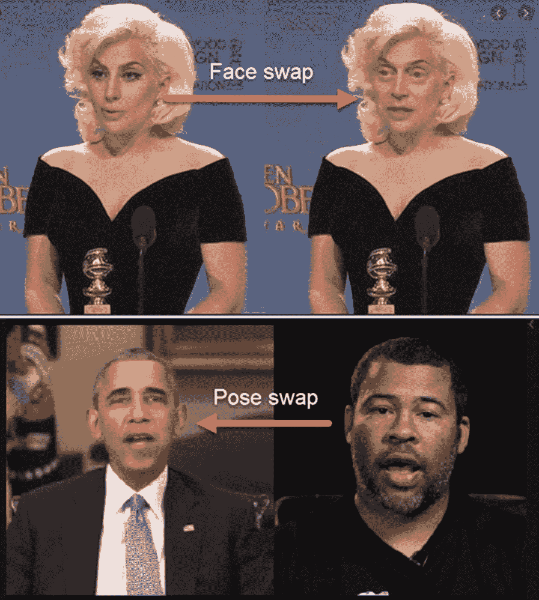
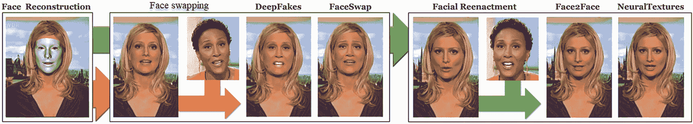
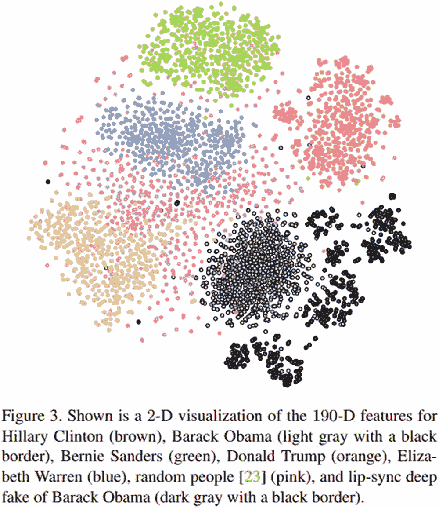
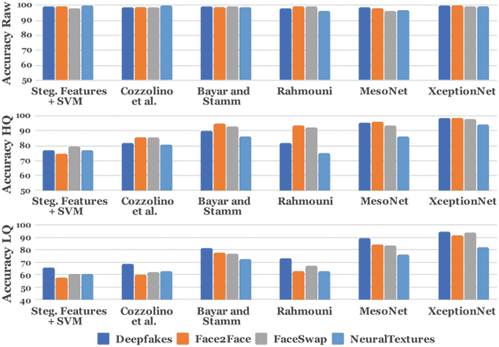
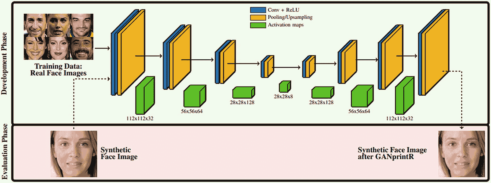
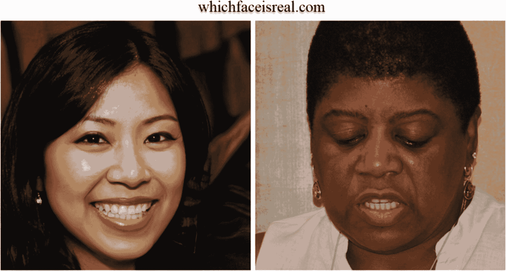
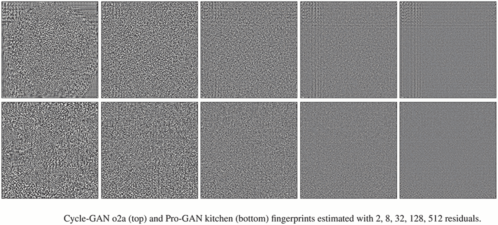
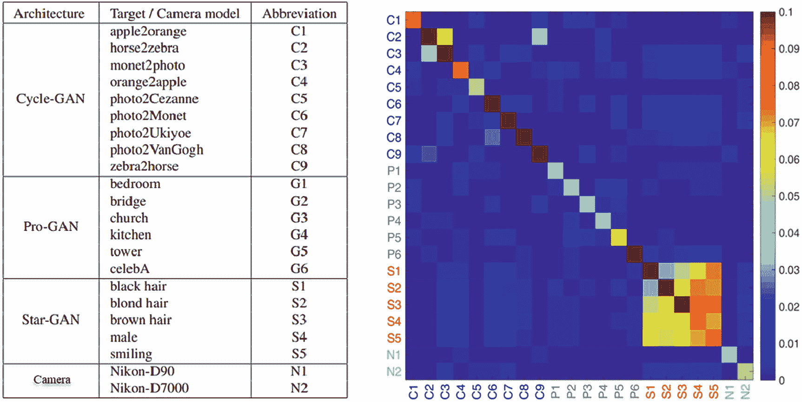

# 10. 破解深度伪造

在本书中，我们探讨了多种生成内容的策略，这些内容可以匹配甚至超越我们所知的现实。虽然大部分时间我们都在探索人脸领域和创建逼真的人脸，但同样的技术也可以应用于我们认为合适的任何其他领域。然而，或许正是生成逼真人脸的能力让如此多的人感到恐惧。

毕竟，人脸是我们沟通和传达情感的核心与灵魂。能够创建真实人脸或进行换脸，为各种形式的滥用打开了可能性的大门。正如我们在第 9 章中讨论的那样，这是一个始终存在的危险，我们需要在伦理和理解方面认真对待。

在加拿大海军中，所有舰艇都配备一名潜水员，这些人员接受从建造到拆除等各类爆破训练。这门课程内容极其广泛，据说如果你通过了，你会成为爆破专家；如果你没通过，你会成为恐怖分子。当然这并非事实，但之所以这么说，是因为未通过课程的人学会了如何制造炸弹，但很可能没学会如何拆除它。

我们或许可以将同样的类比应用于构建深度伪造和换脸的生成式建模者，但他们未能理解检测这些伪造品的原理。正如我们在前一章中看到的，创建深度伪造相对容易，你并不需要真正理解生成器的细节。现在，如果你未能掌握生成式建模，你不太可能被归类为恐怖分子，所以这可能与你无关。

然而，如果你确实理解生成器及其失败方式，或者更确切地说，理解它们成功的方式，你也能发现它们的缺陷。毕竟，在本书的大部分内容中，我们都在寻找更好的方法来欺骗判别器，以至于它能骗过我们自己。现在是时候转换思路，利用我们已获得的知识来寻找检测伪造品的方法了。

理解伪造内容检测不仅能为我们提供一套新工具，还能带来新的机遇。未来很可能充斥着各种需要各级监管的伪造内容。从政府到私营企业，很可能会演变出一个全新的机器学习开发/工程职位。

在本章中，我们将探讨如何检测伪造内容，特别是深度伪造。我们首先会研究使用生成式建模操纵内容/人脸的各种方法。接着，我们将探讨用于判断内容是否伪造的策略，以及如何应用这些策略来确定什么是真实的。最后，我们将介绍几种用于识别当前伪造品的有用工具和方法。

虽然我们没有时间像之前那样深入探讨检测伪造品和深度伪造的各种策略与技术，但本章应为感兴趣的读者提供一个良好的基础，以便进一步研究这个主题。以下是本章将涵盖的重点内容：

- 理解人脸操纵方法

- 破解伪造品的技巧

- 识别深度伪造中的伪造品

伪造品和深度伪造检测领域才刚刚兴起，未来几年很可能会显著成熟。本章旨在对一个快速扩展的领域进行高层次介绍，该领域将发展出先进的方法和工具。在下一节中，我们将探讨用于检测伪造品的方法和策略，这些将是那些工具的基础。

## 理解面部操控方法

在面部操控领域，我们通常将技术分为两大类。一类是身份到身份的转换，即将一个人的面部替换为另一个人的。另一种形式是将一个身份的姿态转换为另一个身份的姿态，称为*面部重现*。

我们已经在第 9 章中探讨了名为换脸的身份到身份转换方法，并利用它构建了一个深度伪造。虽然我们使用了深度学习双自编码器来投射面部变换，但实际上还存在其他基于图形学的方法。以下是高级身份转换方法的总结：

*   **FaceSwap**：不要将其与软件包 `Faceswap` 混淆。`FaceSwap` 是一种基于图形学的方法，类似于从目标图像中提取面部，使用面部特征点将其投影到 3D 模型上，然后捕获替换后的面部。这种方法目前被电影工业用于各种换脸及其他操控。

*   **Deepfakes**：其工作原理是首先从源身份和目标身份中提取面部。训练一个深度学习网络将面部 A 转换为面部 B，反之亦然。然后，可以使用训练好的模型，通过网络来解释任何所需的姿态变化，从而将面部 A 与面部 B 进行交换。同样，我们在第 9 章中详细介绍了整个过程。

面部重现是面部操控的第二类，其工作原理是保留目标身份，但用另一个源（例如一个正在说话的人）的姿态进行替换。这种方法常被归入深度伪造的范畴，但为了我们的目的，我们将其定义为*面部重现*，而不是换脸。

图 10-1 使用一些广为人知的流行示例展示了换脸与面部重现（或姿态交换）之间的区别。图的上半部分展示了将 Lady Gaga 的面部与演员史蒂夫·布西密的头部进行换脸。这次交换是使用`Faceswap`通过 Villain 模型完成的。

图 10-1

换脸与姿态交换的区别

在图 10-1 的下半部分，使用了巴拉克·奥巴马总统的肖像，但他的动作和行为（姿态）被喜剧演员乔丹·皮尔所取代。该图像取自一个完整视频，该视频展示了姿态交换的全部威力。在视频中，这位喜剧演员以总统的身份发表各种虚假言论。

目前，姿态交换的实现采用了两种不同的策略，这与我们在换脸中看到的情况类似。有一种基于图形学的方法和一种深度学习方法可用于交换目标的姿态。以下是每种方法的更多细节：

*   **Face2Face**：这是一种类似于`FaceSwap`的基于图形学的方法，但它使用两个输入视频流，从中提取关键帧并用作混合目标。这次不是从特征点提取面部，而是提取姿态。然后，将姿态转换为用于混合目标面部的 3D 特征图。

*   **NeuralTextures**：此方法使用典型的生成对抗网络，类似于`Pix2Pix`或其他图像到图像的转换模型，将姿态从一张图像转换到另一张图像。有许多开源项目示例展示了这项技术，但目前最顶尖的是`Avatarify`。使用`Avatarify`，在合适的硬件支持下，你可以实时转换你的姿态，或者转换蒙娜丽莎、阿尔伯特·爱因斯坦等人的面部。如果你需要回忆这种方法的工作原理，请回顾第 6 章和第 7 章，我们在那里训练了基于成对和不成对图像的模型，用于图像到图像的转换。

图 10-2 摘自论文《FaceForensics++：学习检测被操控的面部图像》，该论文是展示各种面部检测技术的优秀来源。作者们甚至慷慨地在他们的 GitHub 仓库[`https://github.com/ondyari/FaceForensics/`](https://github.com/ondyari/FaceForensics/)中提供了免费的面部操控图像和视频资源。

图 10-2

FaceForensics++ 对面部操控方法的分解比较

需要注意的是，`FaceForensics++`论文的作者将换脸称为*deepfakes*，如图 10-2 所示。我们现在也做出同样的区分，并从此将换脸伪造称为*deepfakes*，而将更广泛的深度伪造定义留给面部操控内容这一类别。

进一步参考

利用视觉伪影揭露深度伪造和面部操控：

[`https://ieeexplore.ieee.org/abstract/document/8638330`](https://ieeexplore.ieee.org/abstract/document/8638330)

深度伪造：对人脸识别的新威胁？评估与检测：

[`https://arxiv.org/abs/1812.08685`](https://arxiv.org/abs/1812.08685)

深度伪造对品牌意味着什么？

[`https://www.thedrum.com/opinion/2020/01/10/what-do-deepfakes-mean-brands`](https://www.thedrum.com/opinion/2020/01/10/what-do-deepfakes-mean-brands)

既然我们对面部操控技术的范围有了更清晰的理解，我们就可以继续学习如何识别此类伪造。在下一节中，我们将介绍当前用于识别深度伪造的各种方法。

### 破解伪造的技术

近年来，关于开发破解和识别深度伪造方法的研究蓬勃发展，这无疑是由对日益强大的生成模型的担忧所推动的。正如我们在本书中所见，早期的生成器很容易被识别，不足为虑。但近年来情况完全改变了，现在人类几乎不可能仅凭一瞥就分辨出真假。

然而，或许对我们和生成建模领域来说更幸运的是，同样的人工智能可以用于对抗自身。毕竟，正如我们在本书中所见，我们常常在判别器和生成器的训练之间挣扎平衡；我们可能经常需要削弱判别器，以便生成器能够产生出色的结果。

在破解伪造方面，我们希望构建最佳的判别器，能够利用各种特征检测方法来识别伪造。当然，这并不意味着一个优秀的评论家不能被用于对抗训练一个更好的生成器。事实上，有很多研究正是这样做的。这场军备竞赛将如何展开还有待观察，但现在让我们先考虑用于识别伪造的方法。

我们可以将当前用于识别伪造的方法分为三类，正如 Ruben Tolosana 等人在《深度伪造及其超越：面部操控与伪造检测综述》中所定义的那样。这篇优秀的论文梳理了当前用于识别伪造的方法类别，总结如下：

*   手工特征

*   基于学习的特征

*   伪影

关于每一类，需要记住的重要一点是，它们定义了广泛的技术，这些技术可能结合了 AI/ML 以及通过像`OpenCV`这样的图形学包进行的特征提取技术。我们将在下一节开始，更详细地回顾每一类方法。

#### 手工特征

在许多深度伪造视频或图像中，特征重建往往存在明显缺陷。如果这些缺陷特别明显，人类创作者可能会用图形软件将其修掉。不过，这些缺陷通常并不那么明显，会作为伪造痕迹残留下来。

要发现这些痕迹、错位特征和构造特征，可以通过多种技术来实现，这些技术旨在根据相似性对已知特征进行分类。例如，一个人在说话时可能会以某种方式倾斜头部，或者只张开特定距离的嘴巴。这些特征因人而异，难以有效模仿或迁移。

我们可以通过使用 `OpenCV` 等软件手工构建特征，来测量头部倾斜程度、眼球运动、嘴唇运动等，从而发现某人说话方式的这些隐藏特征。然后，我们可以使用相似性特征图来比较这些测量结果，以识别与个人身份相符的面部或面部姿态。

图 10-3 摘自 Shruti Agarwal 和 Hany Farid 的论文《保护世界领导人免受深度伪造侵害》，作者在论文中分析了使用手工特征识别深度伪造的方法。该图展示了使用几种手工特征编码对多位知名演讲者进行的比较。从图中可以明显区分出真实的巴拉克·奥巴马和经过唇形同步处理的乔丹·皮尔版本。

图 10-3

展示使用手工特征识别演讲者身份

虽然使用手工特征成功展示了不同演讲者之间的明显差异，但它仍然引入了人为偏见。理想情况下，我们希望消除人为偏见，让模型自行学习需要比较哪些特征。这就是我们将在下一节中探讨的方法。

#### 基于学习的特征

就像我们在 GAN 的对抗训练中开发的判别器一样，我们可以利用卷积神经网络进一步扩展这一概念，以识别和学习标记伪造的特征。正如 `FaceForensics++` 论文所展示的，已有多种架构被用于学习伪造特征标记。

图 10-4 是摘自 `FaceForensics++` 论文的另一张图片，展示了用于识别伪造的各种架构之间的差异，包括使用手工特征（`Steg. Features + SWM`）。准确率是在原始图像以及高、低质量版本上测量的。在所有情况下，`XceptionNet` 架构都是明显的赢家，我们将在本章后面介绍它。

图 10-4

伪造检测中特征提取方法和模型的比较

使用 CNN 构建特征学习模型的过程通常类似于 GAN 中的判别器。正如我们所看到的，卷积层是大多数对抗/GAN 模型中特征提取的主要方法，模型的输出通常是一个二元分类结果，用于识别图像是伪造的还是真实的。

在 Joao C. Neves 等人的论文《GANprintR：改进的伪造与面部操纵检测技术现状评估》中，作者使用了一种技术，即重用各种 CNN 架构（如 `ExceptionNet`）作为放置在自编码器中的学习解码器。

图 10-5 是摘自 `GANprintR` 论文的一张图片，描述了用于去除可能将图像识别为伪造的特征的自编码器架构。该模型的训练方法是，将真实人脸输入模型，然后用一个 `XceptionNet` 或其他识别伪造的 CNN 模型对其进行解码。

图 10-5

旨在逆转伪造中特征异常的自编码器

通过训练真实图像来识别和去除伪造标记，其结果再次提升了伪造图像的质量。然后，可以将伪造图像和内容输入模型，以类似方式去除合成图像中的伪造标记。这只是当前面部操纵领域军备竞赛的又一个例子。

当然，正如我们在本书中反复看到的，面部或主要目标之外通常还有其他特征可以清晰地证明伪造的证据。在下一节中，我们将探讨如何利用这些伪影来识别合成图像。

#### 伪影

除了了解特定特征被正确伪造或翻译的程度外，始终存在其他伪影暴露伪造品的可能性。回想一下我们之前查看的网站 [`https://www.whichfaceisreal.com/`](https://www.whichfaceisreal.com/)，该网站展示了真实人脸与使用 `StyleGAN` 生成的人脸之间的对比。

图 10-6 摘自 `whichfaceisreal.com` 网站，展示了 `StyleGAN` 生成合成人脸图像的能力。仅观察人脸本身，很难判断哪张是真实的，哪张是伪造的。通常的技巧是发现图像中的伪影或背景细节的缺失。

图 10-6

你能识别出真实的人脸吗？

开发能够识别图像中这些伪影的方法，也可以为全合成或部分合成图像的识别提供基础。在 Francesco Marra 等人（2019 年 IEEE 多媒体信息处理与检索会议 [MIPR]，IEEE Xplore，2019 年 4 月 25 日，[`https://ieeexplore.ieee.org/document/8695364`](https://ieeexplore.ieee.org/document/8695364)）的论文《Do GANs leave artificial fingerprints?》中，作者研究了使用 `CycleGAN`、`ProGAN` 等模型生成合成图像时留下的伪影。

图 10-7 展示了作者能够从照片标记中识别出的 `CycleGAN` 和 `ProGAN` 的指纹示例。每张照片或图像都可以使用光响应非均匀性（`PRNU`）模式进行分析，以确定图像是否被篡改以及如何被篡改。

图 10-7

在不同残差下识别的 GAN 指纹对比

基于对模型中图像指纹的研究，我们可以了解图像的哪些部分可能被篡改。观察图 10-7，你还可以直观地看到 GAN 的架构如何影响这种指纹特征。不同的架构和特征提取生成技术会产生不同的指纹。

作者进一步比较了各种 GAN 架构以及使用物理相机拍摄的真实图像。他们的发现如图 10-8 所示：通过比较指纹的相关性，根据 GAN 的类型和图像源集，可以轻松区分出留下的标记。

图 10-8

应用于 GAN/相机及训练数据的指纹相关性示例

请注意，图 10-8 中的表格和相关性图存在一处错误：相应的 `ProGAN` 模型需要从图中的 `G1...` 映射为 `P1...`。该比较展示了指纹之间的平均相关性，对角线上的数值较大，表明相同指纹的相似模型比较结果。

同样，从图 10-8 中可以看出，`StarGAN` 训练所复制的属性变体之间匹配得非常好。我们还可以看到 `CycleGAN` 很容易被识别，但 `ProGAN` 的辨别难度则更大。遗憾的是，其他模型并未测试自注意力机制或 `StyleGAN` 与 `StyleGAN2`，而这些测试很可能会得出一些非常有趣的结果。

无论如何，我们可以确定的是，基于 GAN 的类型及其训练方式，会留下可识别的伪影。这一点你可能已经有所察觉，尤其是如果你已经完成了本书中的几个练习。很明显，GAN 的架构可能会在生成的伪造图像中留下难以察觉的伪影。

我们将本章中提到的所有论文留给你自行查阅，最后，我们将通过介绍一些可用于识别各种伪造变体的工具包来结束本章。

## 识别深度伪造中的赝品

正如我们在上一节中所见，有多种策略和方法可用于识别深度伪造和人脸篡改。我们已经了解了可以使用的几大类方法，但在本节中，我们将重点介绍可用于识别真实性的具体工具包。

为简化起见，我们将关注之前归类为特征学习器的方法——那些利用 CNN 架构和其他层类型来学习可能识别合成图像特征的方法。根据 FaceForensics++论文，目前这类方法中表现最佳的是`XceptionNet`，但我们也会探讨其他方法。

以下是一些较为知名的开源工具包摘要，可用于识别深度伪造及其他形式的合成图像。这些工具包采用了多种方法，包括基于`PyTorch`的特征学习器和基于`OpenCV`的特征提取器。所有代码均使用 Python 编写，因此您可以自行查阅源代码：

- **MesoNet-Pytorch** ([`https://github.com/HongguLiu/MesoNet-Pytorch`](https://github.com/HongguLiu/MesoNet-Pytorch))：这是一个基于 CNN 架构的模型，通过使用伪造图像进行训练来学习特征。使用此模型需要从 FaceForensics++网站获取多样化的伪造图像数据集。

- **Deepfake-Detection** ([`https://github.com/HongguLiu/Deepfake-Detection`](https://github.com/HongguLiu/Deepfake-Detection))：该工具包与上一个仓库出自同一团队和作者。此实现通过引入新的模型变体以及实用的模型训练与测试方法，扩展了模型和训练架构。

- **Pytorch-Xception** ([`https://github.com/hoya012/pytorch-Xception`](https://github.com/hoya012/pytorch-Xception))：这是在 Jupyter notebook 中使用`PyTorch`实现的`Xception`模型。该示例可轻松转换为 Google Colab，并利用提供的示例在云端进行训练和测试。`Xception`模型是目前识别深度伪造的黄金标准。

- **DeepFakeDetection** ([`https://github.com/cc-hpc-itwm/DeepFakeDetection`](https://github.com/cc-hpc-itwm/DeepFakeDetection))：该工具包采用基于`OpenCV`的手工特征提取方法，用于识别生成图像中的不一致特征。项目中的示例基于 Jupyter Notebook 开发，如果您愿意，可以轻松转换为 Google Colab。此方法的额外优势在于无需模型训练，这在您缺乏优质伪造数据源时可能非常有用。

这些工具包都相对易于使用和部署，但在某些情况下需要大量的训练数据。再次强调，FaceForensics++仓库页面是获取这些训练数据的优质来源，其中包含多种多样的伪造合成内容。

当前深度伪造检测领域还有一个趋势，即结合多种技术和模型变体来提供整体伪造评分。该评分可以更广泛地近似判断图像中的人脸或其他内容是否被伪造。同时，这些方法如何反向应用（即生成更逼真的伪造图像）仍有待观察。

归根结底，制造伪造与识别伪造之间的军备竞赛才刚刚开始，哪种方法或技术能最终胜出，可能数年之内都难见分晓。然而，与军事军备竞赛不同，这场竞赛必将催生大量新技术和新策略，使生成式建模变得更加主流和多样化。理想情况下，这种多样性可以应用于各行各业。

## 结论

深度伪造的军备竞赛只是生成式建模领域爆发式增长的开始。尽管我们仍在努力理解如何更好地创建合成内容，但无论应用场景是生成或篡改人脸还是其他内容，识别此类伪造的需求很可能始终存在。

我们在本章中发现，目前可用的最佳方法是名为`XceptionNet`的对抗性评判器实现。该模型采用 CNN 架构构建，类似于 GAN 中的判别器。然而，与使用真实和伪造图像训练此类模型不同，这里仅使用伪造图像进行训练。

我们还看到，随着我们识别伪造能力的提升，我们反过来也为评判自身制造的伪造提供了新方法。目前已有采用`XceptionNet`等架构的对抗性模型，用于进一步改进伪造内容。正是这种技术博弈的循环特性，使得生成式建模既令人兴奋，又令人不安。

在不久的将来，或许会出现一个时刻，识别伪造内容几乎变得不可能——生成器会利用`XceptionNet`等各种对抗模型，使合成图像比现实更逼真。届时，我们可能无法分辨何为真实图像、何为伪造图像。

当那一天到来时（很可能如此），世界对领导人言论、新闻乃至互联网图片的反应将永远改变。我们还能相信任何视频或图像是真实的吗？这将对严重依赖图像内容的媒介（如照片识别、法律诉讼及其他机构）产生怎样的影响？

确实，我们正处于数字世界乃至某种程度上的物理世界新变革的前沿。这个世界曾由数字和虚拟媒体主导，如今可能不得不回归依赖物理互动——亲自见证一场音乐会或政治事件将比信任新闻或其他媒体更为重要。

正如您现在可能意识到的，深度伪造领域只是生成式建模为我们提供的众多可能性中的一小部分。它很可能继续占据前沿地位，并主导生成器增长与使用的方式和原因。除非其他生成器应用能证明其在主流领域的实用性，否则这种情况不太可能改变。

我希望通过本书的学习之旅，您已经掌握了生成器在各种应用中的使用技巧和理解。虽然目前大多数应用仍集中在图像或影像领域（如地图绘制或艺术/设计），但生成式建模（GM）绝不会局限于创建合成图像内容。

> *“使我们明智的不是对过去的回忆，而是对未来的责任。”——*[*乔治·萧伯纳*](https://www.brainyquote.com/authors/george-bernard-shaw-quotes)

乔治·萧伯纳这句伟大的名言应能指引您踏上开发和使用生成器及伪造内容的旅程。请记住，您的未来与您如何以及计划如何使用这项技术的责任紧密相连。合乎道德地使用这项技术对您的未来至关重要。

生成式建模在全球所有行业的应用可能性是无限的，或许包括音乐、文本及其他形式的内容。您现在已具备进入内容生成可能应用的多个领域的技能。希望您能明智地运用新掌握的技能，并因理解这种将在未来几年彻底改变我们世界的人工智能形式而获得新的成功。