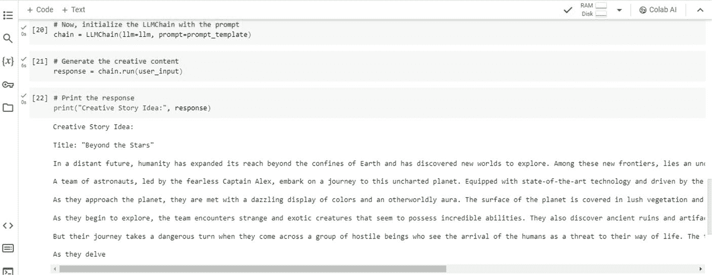

# 现在，使用提示模板初始化 LLMChain

```python
chain = LLMChain(llm=llm, prompt=prompt_template)
```

#### 生成创意内容

```python
response = chain.run(user_input)
```

#### 打印响应

```python
print("创意故事构想：", response)
```

图 1-1 展示了我在 Google Colab 中运行此代码后得到的输出。你可以使用本章附带的 GitHub 代码自行测试。



## 第 1 章 LangChain 与 LLM 简介

***图 1-1.** 运行代码后的输出*

### 代码说明

以下是对代码的说明：

- 首先，我们安装所需的模块：`OpenAI` 和 `LangChain`。请确保下载本代码中使用的确切版本；否则，代码很可能无法正常运行。

**注意**：要检查已下载的版本，请分别使用以下命令查看 `openai` 和 `langchain` 库的版本。

```bash
!pip show openai
!pip show langchain
```

- 然后，我们从 `LangChain` 导入必要的类：`OpenAI`、`LLMChain` 和 `PromptTemplate`。
- 使用 API 密钥初始化 `OpenAI` 模型。请参考第 2 章中的“步骤 1：获取 OpenAI API 密钥”部分来获取 OpenAI 密钥。
- 定义一个用于生成故事创意的提示模板，使用 `user_input` 作为输入变量。
- 将 `user_input` 的值设置为 `"环保家用电器"`。
- 使用已初始化的 `OpenAI` 模型和提示模板创建 `LLMChain` 实例。
- 通过调用 `LLMChain` 的 `run` 方法并传入 `user_input` 来生成创意故事构想。
- 打印生成的故事构想，并标注为 `"创意产品构想："`。

此示例展示了使用 LangChain 将 LLM 集成到应用程序中是多么简单，并希望能让你初步了解该框架抽象和简化流程的能力。

现在，我们已经简要了解了 LangChain，接下来让我们探讨什么是 LLM，以及它们为何重要。

## 什么是 LLM，它们为何重要？

正如学习目标中所述，你需要充分理解 GPT-4、PaLM 和 Gemini 等 LLM 的能力，才能开发出强大的生成式 AI 应用程序。

LLM 就像一个几乎阅读了互联网上所有内容的机器人，包括书籍、文章和网站。同时，它们可以就任何话题进行写作或聊天。这些“超级阅读机器人”使计算机能够理解和生成与人类极为相似的文本。

然而，LLM 的能力远不止于简单的对话。它们正在通过以下方式改变各个领域：

- **无缝翻译语言**，打破沟通障碍
- **编写故事**和创意内容，挖掘人工创造力的源泉
- **总结长篇文本**，快速高效地浓缩信息
- **生成代码**，帮助开发者自动化日常编码任务

如今，LLM 已经变得非常强大，你可以轻松地在多个领域开发高度智能的生成式 AI 应用程序，从增强客户服务自动化到支持写作和设计等创意工作。

## LLM 示例

以下是一些突出的 LLM 示例，我们将在第 4 章中更深入地探讨它们。

- **GPT-4**：GPT-4 由 OpenAI 开发，你可以用它生成文章、创作诗歌，甚至制作


