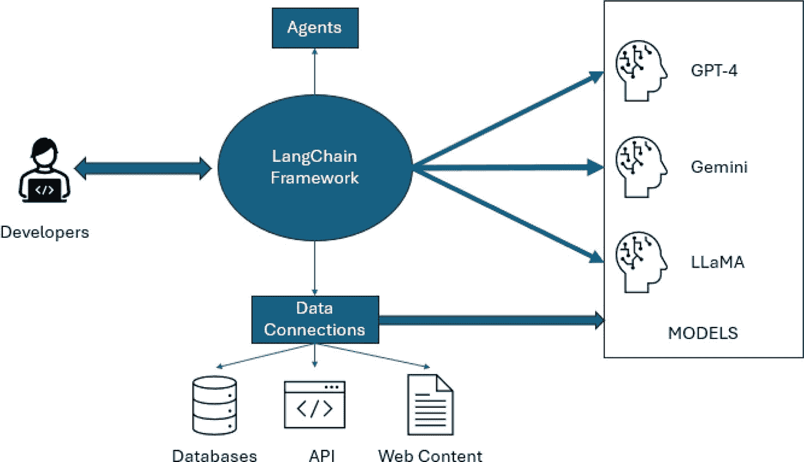
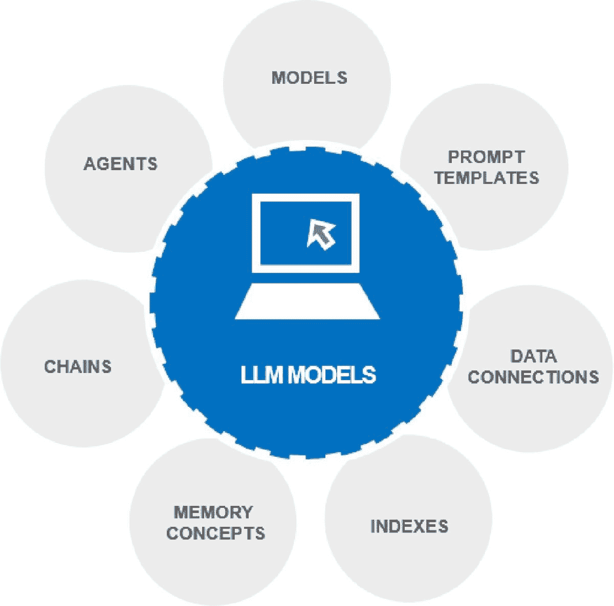

# 第 1 章 LangChain 与 LLM 简介

以及通过自然语言指令进行错误修复。

- 你可以与多种编程语言、框架和库进行集成。

- 最后，你只需将生成的代码片段无缝整合到你的项目结构中即可。

## LangChain 的优势

无论你需要生成代码、创建文档、重构代码库还是进行调试，LangChain 都能为你提供帮助。它是满足你所有编码需求的一站式解决方案。

但更重要的是，你无需成为编程天才也能使用 LangChain。LLM 还将帮助你根据你独特的编码风格和项目需求调整代码。你可以对其进行定制和微调，使其无缝融入你的开发工作流程。

## 这些特性为何重要

你可以利用 RAG（检索增强生成）和智能代理应用等高级特性，构建更精准、更智能、更自主的生成式 AI 应用。它们能让你获得以下好处：

- **提升准确性与可靠性**：通过集成实时数据，你的生成式 AI 应用能够提供更准确且与上下文相关的响应。

- **自动化复杂工作流程**：智能代理应用减少了流程中的人工干预需求，从而实现更高效的资源分配和更好的可扩展性。

- **适应用户需求与偏好**：你的应用可以根据用户交互和反馈动态调整，提供随时间不断优化的个性化体验。

LangChain 强大的框架配备了这些高级特性，树立了新的标准，你可以利用它构建一些令人惊叹的生成式 AI 应用。它是一个不可或缺的工具，你应该善加利用。

## 将 LLM 与 LangChain 集成

现在我们已经快速了解了 LLM 和 LangChain 的能力，是时候更深入地探讨 LangChain 如何作为开发者与大型语言模型（LLM）之间的关键桥梁来实现这一切了。

*图 1-2. LangChain 框架概览*

图 1-2 直观地展示了 LangChain 框架的结构和工作流程。它说明了在创建 AI 驱动应用的过程中，LangChain 框架的核心组件如何相互交互：

- **LangChain 组件**：图表的中心是 LangChain 组件，它作为我们框架中的核心枢纽。通过其接口使用该组件，将简化与各种 LLM 交互的复杂性。

- **开发者**：在图表左侧，你会看到开发者的表示。你将通过一组定义明确的 API 或直接代码集成与 LangChain 组件进行交互。你将使用该组件来提供具体需求、提示和指令，以指导 LLM 的行为。

- **LLM（GPT-4、PaLM、Gemini）**：右侧展示的是 LangChain 可以利用的 LLM，它们可以执行从文本生成到复杂推理的各种任务。

- **模型**：模型组件通过 LangChain 库中提供的统一 API，抽象了不同 LLM 的复杂性。这种抽象允许你与多个 LLM 协同工作，而无需担心底层的复杂细节。

- **数据连接**：数据连接帮助 LangChain 获取互联网或数据库中的最新或最相关信息，使 LLM 的响应更加有用和准确。

- **智能代理**：LangChain 智能代理代表了创新工具，它们使你的应用能够基于 AI 驱动的逻辑自主执行任务、做出决策并与外部系统交互。利用这些代理，你可以开发出能够在各种环境中独立运行的应用。

图中的每个箭头都展示了数据与控制的流动，突显了如何利用 LangChain 构建复杂且具备上下文感知能力的应用程序。这一流程展示了从开发者输入到大语言模型输出的每个组件如何协同工作，以创建响应迅速且智能的生成式 AI 应用。

## 与多个大语言模型的简化集成

如图 1-2，LangChain 模型所示，这些强大的大语言模型经过抽象化处理，可帮助您轻松管理每个模型 API 相关的复杂性。以下示例说明了它如何简化与多个大语言模型的集成。

### 示例场景：构建内容生成平台

假设您正在构建一个使用大语言模型生成文章、摘要和报告的内容生成平台。如果您计划直接与每个大语言模型 API（例如 `gpt-3`、`gpt-4` 和 `PaLM`）集成，则必须解决多个集成点的问题。每个模型都需要其独特的设置，这会使您的代码库复杂化，并显著增加维护工作量。

### LangChain 的简化解决方案

LangChain 通过统一接口抽象了这些复杂性，为您提供了解决方案。该接口具有以下几个关键优势。

-   它允许您**轻松切换不同的大语言模型**，甚至无需更改前端或业务逻辑即可同时使用多个模型。这是因为底层的 API 调用、数据格式化和响应处理均由 LangChain 管理。

-   它使您的内容生成平台能够**利用不同大语言模型的优势**来处理各种内容类型。您的代码质量和效率将随之提高，使您能够轻松适应更复杂的用例。例如，您可以使用 `gpt-4` 进行复杂的文章叙事创作，并使用 `PaLM` 利用其分析能力生成详细的报告。

-   **提高代码质量和效率**：统一接口不仅简化了开发过程，还增强了应用程序的可维护性和可扩展性。它降低了出错的可能性，并减少了用于调试和测试的时间。

-   **适应复杂用例**：您的内容平台可以通过轻松适应更复杂的场景来促进创新。

## 探索 LangChain 的核心组件

现在您已经更清楚地了解了 LangChain 如何简化与多个大语言模型的集成，这正是探索图 1-3 所示核心组件的最佳时机。

*图 1-3. LangChain 大语言模型应用的构建模块*

### 模型

任何大语言模型应用的核心都是模型。您将学习如何在应用程序中连接像 `GPT-4` 这样的强大语言模型来创建大语言模型应用。当然，您可以使用默认的大语言模型 API 来实现这一点，但正如我们之前讨论的，LangChain 标准化了流程，使您无需重写代码即可轻松切换不同的大语言模型。

## 提示模板

我将教您创建动态提示的艺术，这些提示能让您的语言模型有效理解并响应查询。它们通过指定当前任务及其上下文来引导语言模型。通过精心设计提示，您可以从模型中获得更准确、更相关的响应，从而根据您的特定需求定制输出。

### 数据连接

数据连接组件允许您通过将大语言模型连接到各种数据源（如文档、PDF 甚至向量数据库）来为其提供正确的信息。我们将探索索引和嵌入等技术，以使您的数据检索对语言模型而言既直接又高效。