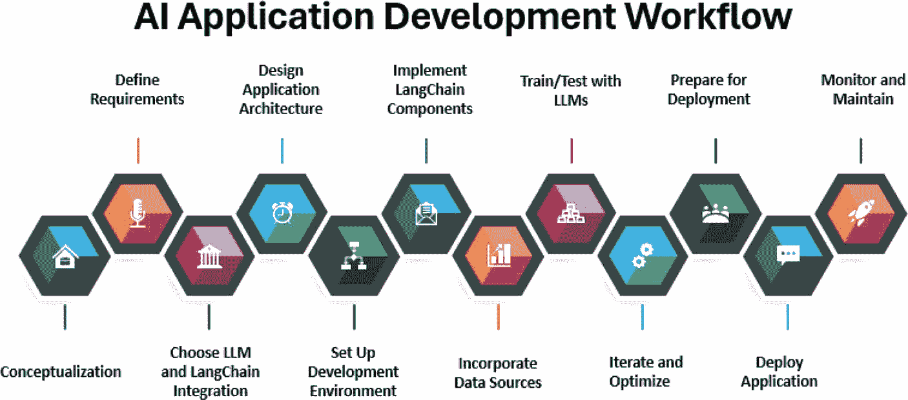

# 第 1 章：LangChain 与大语言模型入门

### 链

链让事情变得更加有趣。您可以使用链来链接一系列操作或模型，以执行复杂的多步骤任务。此功能对于处理应用程序中的复杂流程以及基于一系列交互做出明智决策至关重要。

### 智能体

最后，我们来到了智能体。这些是 LangChain 中的高级单元，它整合了之前的所有组件。智能体能够自主执行任务、做出决策并与外部系统交互。它们利用 API、数据库和自定义脚本进行任务推理，并基于复杂的逻辑执行操作。

## 循序渐进构建知识

鉴于智能体的强大功能和能力，您可能会忍不住想直接跳到智能体部分，但我认为对其他组件的基础理解至关重要。这就是为什么我会以系统且全面的方式带您了解 LangChain，确保您在进入下一部分之前，先掌握每个组件。

在此过程中，我们将查看代码示例和解释。

## 大语言模型应用开发工作流

既然我们已经了解了为什么 LangChain 在开发大语言模型应用时能成为游戏规则的改变者，现在是时候快速了解一下大语言模型应用开发工作流了。您可以根据需要对其进行自定义。

**图 1-4.** *大语言模型应用开发工作流*

此工作流展示了从构思到部署的各个阶段，确保您拥有创建大语言模型应用的清晰路线图。

### 概念化

每一个伟大的应用都始于一个概念。在此阶段（见图 1-4），您需要确定您的生成式 AI 应用将要解决的问题。这可能涉及从自动化日常任务到从复杂数据集中提取和分析洞察等各个方面。

就像在传统的 SDLC（软件开发生命周期）中一样，重要的是要明确定义项目的成功标准。然而，这里的成功指标是针对大语言模型性能指标（如准确性、相关性和响应时间）量身定制的。

**小练习：** 写下三个您认为可以通过大语言模型得到增强或实现的创新应用。在您的开发社区论坛中分享您的想法，或与同行讨论以探索其可行性。

### 定义需求

一旦您对生成式 AI 应用的目标有了清晰的想法，下一步就是明确说明应用程序的具体需求，例如所需的大语言模型类型、数据源、用户交互以及特定的 AI 功能（如情感分析或实体识别）。

### 选择大语言模型与 LangChain 集成

此阶段类似于传统 SDLC 中的技术栈决策，不同之处在于，您将专注于根据应用程序需求选择合适的大语言模型（例如`GPT-4`或`PaLM`），而不是选择数据库、编程语言和框架等技术栈组件。您还应决定 LangChain 如何与这些模型交互，以确保可扩展性和易于模型维护。

### 设计应用架构

然后，我们进入设计应用架构阶段（见图 1-4），在此阶段您将过渡到...

