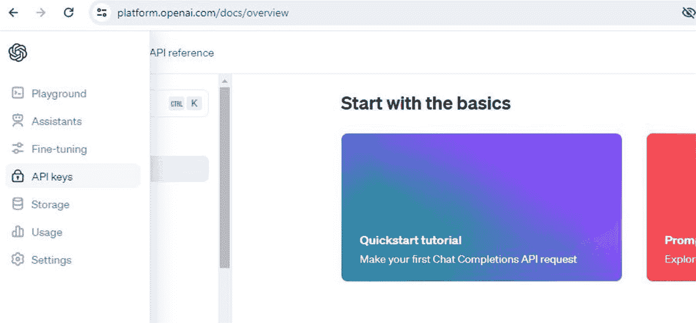
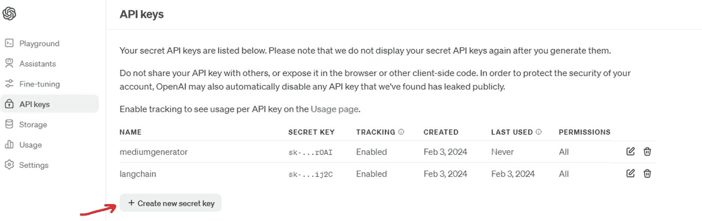

# 除非提供示例和任务上下文，否则大语言模型（LLM）只会给出通用回复。通过采用提示工程，你可以从 LLM 中提取出期望的回复，尽管这可能需要大量的实验和专业知识。

**LangChain 解决方案**：你可以使用 LangChain 的提示工具和模板来简化和优化提示创建过程，从而减少大量试错的需要，以获得更好、更可靠的结果。

## 第 2 章 将 LLM API 与 LangChain 集成

### 案例研究 1：内容生成平台

让我们考虑一个构建内容生成平台的案例研究。

**场景** 设想一个平台，它使用 LLM 根据用户输入生成文章。直接与 LLM API 集成会带来多重挑战，包括内容质量不一致以及难以处理多样化的用户请求。

**直接使用 LLM API 的挑战**

以下是直接调用 LLM API 时的一些问题：

- **内容质量：** 该平台难以持续生成与用户输入相符的高质量内容，通常需要多次调用 LLM API 才能获得可用的结果。

- **用户特定定制：** 针对不同主题和风格的大量用户请求进行内容定制，被证明是复杂且资源密集型的。

- **可扩展性：** 随着平台的发展，管理和扩展 LLM API 集成变得困难。

**LangChain 解决方案**

以下是实施 LangChain 如何帮助解决这些问题：

- **改进内容定制：** 你可以使用 LangChain 的模型和提示模板，更精确地根据用户需求定制内容，从而提高生成文章的质量和相关性。

- **简化流程：** 通过数据连接和记忆概念，你可以更深入地理解用户偏好，减少过多的 API 调用，并实现更个性化的内容创作。

- **增强可扩展性：** LangChain 的架构允许你轻松集成额外的 LLM 并扩展服务，以满足不断增长的需求，而不会使运营成本过高。

### 简化数据集成

将多样化的数据源直接与 LLM 集成以构建上下文丰富的应用程序，需要大量的工程工作和复杂性。

**LangChain 解决方案**：你可以使用 LangChain 的数据连接组件来简化多样化数据源的集成，使应用程序能够无缝地融入相关的上下文信息。它帮助你创建复杂的、具有上下文感知能力的 LLM 应用程序，减少了通常与此类集成相关的工程工作和复杂性。

### 在直接使用 LLM API 与 LangChain 之间做出选择

正如我在前一节中提到的，LangChain 是初学者开发者的首选方法。直接使用 LLM 和 LangChain 方法各有其优势和权衡。

本节面向高级程序员，或那些有特定项目需求、技术限制和开发目标的人。让我们评估一下这两种选择。

**直接使用 LLM API**

这里，我们讨论何时应优先选择直接调用 LLM API：

- **简单项目**：如果你的项目规模较小，且只涉及单个 LLM，那么你可能不需要 LangChain 提供的复杂抽象。请注意，即使在这些情况下，LangChain 也提供了更友好的用户体验。

- **最大控制与定制**：当直接使用 LLM 提供商的 API 时，你将能对 API 请求进行更精细的控制。如果你的应用需要定制化，或使用 LangChain 不支持的特定于提供商的功能，那么对 LLM API 的精细控制会非常有用。

- **学习与教育目的**：你还能深入了解 LLM 如何运作、处理请求以及解析响应的具体细节。这对于教育或研究型项目非常有益。

**权衡**

然而，这并非没有代价。让我们看看其中一些：

-   在集成多个 LLM 提供商时，你将面临挑战。

-   为应对 LLM API 的变更或弃用而维护代码，可能会非常繁重。

-   你将无法享受到使用`LangChain`中提供的提示工程或响应解析等常见任务的样板模板所带来的好处。

## 使用 LangChain

让我们讨论一下何时应该优先选择`LangChain`：

-   **快速开发与原型设计**：如果你想快速构建应用原型，又不想处理每个 LLM API 的复杂细节，`LangChain`提供了一套高级工具和模板，可以加速开发。

-   **灵活性与可扩展性**：如果你的项目预计会随时间扩展或演变，并且你需要切换 LLM 提供商或尝试不同模型，那么`LangChain`的抽象层将带来显著优势。管理 LLM 的修改和更新会更容易，无需为了集成 LLM 而进行重大的代码重构。

-   **需要高级功能的复杂应用**：你可以使用`LangChain`的高级功能，如提示链、记忆概念和数据连接，这些在开发复杂的企业级生成式 AI 应用时至关重要。直接进行 API 调用时无法获得这些功能。

-   **多 LLM 集成**：`LangChain`在集成多个 LLM 提供商时特别有用。你无需处理与不同 LLM API 交互所涉及的复杂性，因为你可以直接使用`LangChain`的接口。

-   **成本优化**：对于确实需要多个 LLM 的项目，`LangChain`允许在提供商之间轻松切换。这对于成本管理尤其有用，因为你可以在开发和测试阶段使用低成本或开源的 LLM，而在生产环境中使用商业提供商。

-   **活跃的社区与生态系统**：`LangChain`拥有一个充满活力的社区和广泛的工具、插件及资源生态系统。你可以利用这个支持网络来显著加速开发和问题解决。

## 权衡取舍

让我们探讨一下使用`LangChain`时的一些权衡：

-   在尝试访问特定 LLM API 提供的所有功能时，你可能会遇到潜在的限制。

-   由于`LangChain`引入了额外的抽象层，增加了开销或复杂性，调试可能会变得困难。

-   你将不得不依赖`LangChain`更新其代码以支持新的 LLM 功能或模型。

最终，你需要根据项目的规模、复杂性和具体需求，在直接调用 LLM API 和使用`LangChain`之间做出选择。

## 准备你的开发环境

好了，我认为现在是时候动手实践了。像任何其他开发项目一样，首先要设置好你的开发环境。

### 步骤 1：获取 OpenAI API 密钥

要开始使用 OpenAI 的 LLM 开发应用程序，你首先需要从 OpenAI 获取一个 API 密钥。具体操作如下。

#### 创建/登录账户

首先，你需要创建一个 OpenAI API 账户。这将使你能够访问它们强大的语言模型，我们将在本书中全程使用这些模型。要开始，请访问`openai.com/api`并点击“注册”按钮。如果你已有账户，直接登录即可。

注册过程可能会要求你使用手机号码验证账户，具体取决于你所在的位置。只需按照屏幕上的指示操作即可。

#### 账单信息

注册或登录后，你需要设置账单信息。在撰写本文时，OpenAI 为前几个月提供免费额度，这样你可以不花一分钱进行实践练习。

#### API 密钥

**注意**：达到免费额度限制后，你需要提供信用卡来支付任何额外费用。





要获取你的 API 密钥，请导航到账户设置下的“查看 API 密钥”部分。

点击“创建新的密钥”，复制生成的密钥，并将其存放在安全的地方。

**注意**：请像对待珍贵物品一样对待这个密钥，因为如果你丢失了它，你将不得不创建一个新的，并且再也无法访问旧的密钥。


### 步骤 2：设置 Python 开发环境

现在，让我们转到 Python 开发环境。我假设你使用的是 Jupyter Notebook，但你可以随意使用你喜欢的设置，比如 Visual Studio Code 或 PyCharm。

#### Google Colaboratory

我将在这里使用 Google Colaboratory，网址是`https://colab.research.google.com/`。

通过选择“文件” ➤ “新建笔记本”来创建一个新笔记本，并为文件指定一个合适的名称。

#### 安装 OpenAI 库

首先，我们需要安装 OpenAI Python 库。你可以通过输入以下命令并在笔记本中点击箭头图标来运行它：

```
!pip install openai
```

**注意**：你也可以使用`poetry`来管理依赖项。与直接使用`pip`相比，`poetry`提供了更好的依赖管理、项目隔离和可重复性。

成功安装后，你将看到如下所示的一条成功消息：

#### 配置 API 密钥

安装完成后，你可以导入该库并将你的 API 密钥设置为环境变量。这是保护敏感凭据安全的最佳实践：

```
import os
import openai

# 将 API 密钥设置为环境变量
os.environ["OPENAI_API_KEY"] = "your_api_key_here"

# 确认 API 密钥设置正确
openai.api_key = os.getenv("OPENAI_API_KEY")
```

将`"your_api_key_here"`替换为你之前复制的实际 API 密钥。别担心；我们稍后会把这个密钥安全地保存在环境变量中。

#### 测试设置

现在，通过向 OpenAI API 发送一个简单请求来测试你的设置：

```
client = openai.Client()  # 创建一个客户端
response = client.completions.create(
    model="davinci-002",  # 或任何当前可用的 text-davinci 模型
    prompt="What is machine learning model?.",
    max_tokens=300
)
print(response.choices[0].text)
```

这段代码将向 OpenAI API 发送一个请求，要求解释什么是机器学习模型。`model`参数指定了我们想要使用的语言模型（本例中为`davinci-002`），`max_tokens`参数限制了响应的长度。

**注意**：请访问 OpenAI 的模型概览页面，以确保你选择的模型是最新的且未被弃用。其次，由于未使用最新版本的 OpenAI，你也可能会遇到问题。

如果一切设置正确，你应该会在笔记本中看到打印出的响应，其中提供了机器学习模型的定义。

#### 使用环境变量保护 API 密钥

你必须始终保持 API 密钥的机密性，并遵循安全最佳实践来保护它。以下是一些建议：

a) 设置环境变量

你可以将 OpenAI API 密钥作为环境变量存储在开发机器或服务器上。

在 macOS/Linux 上：

```
export OPENAI_API_KEY=your_api_key_here
```

在 Windows 上：

```
set OPENAI_API_KEY=your_api_key_here
```

b) 在 Python 代码中检索 API 密钥：

```
import os
import openai

# 从环境变量中获取 API 密钥
api_key = os.getenv('OPENAI_API_KEY')
```