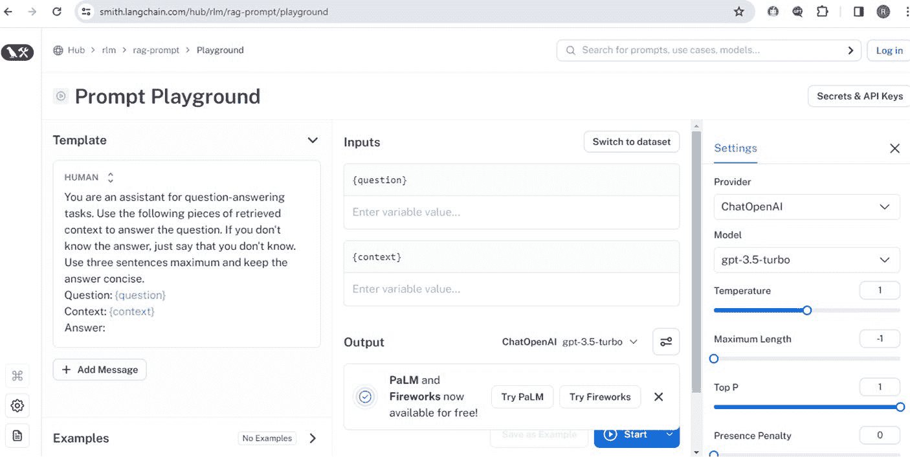

# 无论是否发生错误，始终执行的代码

`print("操作已完成。")`

## 诊断和解决常见问题

以下是一些诊断和解决常见问题的技巧：

**API 连接问题**：检查你的互联网连接，验证 API 端点，并查看 API 提供商是否有关于停机或维护的任何公告。

**身份验证错误**：确保你的 API 密钥已正确设置在环境变量中，或已传递给 API 客户端。如有必要，请从提供商的仪表板重新生成 API 密钥。

**速率限制**：使用指数退避实现重试逻辑。这意味着如果请求因速率限制而失败，请等待一段预设时间，然后重试，每次尝试都增加等待时间。

**无效请求错误**：你应该检查 API 文档，确保使用了正确的参数和数据格式。在你的代码中，添加输入验证以尽早捕获错误。

**模型特定限制**：确保你了解所使用的 LLM 的特定限制，例如令牌限制。一种解决方案是，如有必要，将较大的请求分解为较小的请求。

**日志记录和监控**：实施日志记录以捕获有关错误和异常的详细信息。这些数据对于故障排除非常宝贵。考虑使用监控工具来跟踪 API 交互随时间推移的性能和健康状况。

希望这能帮助你使用 LLM 构建弹性的 AI 应用程序。请记住，你的目标不仅是在错误发生时处理它们，还要通过仔细的规划和测试来预防它们。

## 开发游乐场

下面我提供了一些建议，供你在受控的交互式环境中练习使用 LangChain 和 LLM。

### LangChain 游乐场

LangChain 有一个游乐场，你可以在其中自由试验 LangChain 的功能，而无需在你的终端进行任何设置。如图 3-1 所示，它是一个基于 Web 的界面，你可以在浏览器中直接编写、执行和测试提示。

***图 3-1.** LangChain 游乐场*

你还可以探索 LangChain 的 GitHub 仓库和类似资源进行练习。

### OpenAI API 游乐场

链接：[`platform.openai.com/playground`](https://platform.openai.com/playground)

OpenAI 的游乐场提供了一个直观的界面，让你可以直接通过 Web 浏览器与 OpenAI 的模型进行交互。你可以试验不同的提示、设置和模型，包括最新版本的 GPT。

我建议你使用游乐场来了解不同的提示和参数如何影响 GPT 模型的输出。它将帮助你学习如何在项目中实现 LangChain 时构建交互方式。

### Hugging Face Spaces

链接：[`huggingface.co/spaces`](https://huggingface.co/spaces)

Hugging Face Spaces 托管了各种机器学习模型，包括 LLM。你可以与预构建的应用程序交互，或部署自己的应用程序并开始试验。

搜索使用 LangChain 的 Spaces，并开始与这些应用程序交互，以了解如何将 LLM 与 Web 应用程序结合。你还可以考虑在 Spaces 上部署你自己的基于 LangChain 的项目，以从社区获得反馈。

### Colab 笔记本

链接：[`colab.research.google.com`](https://colab.research.google.com)

Google Colab 提供了一个免费的 Jupyter 笔记本环境，无需设置，完全在云端运行。你可以使用它来编写和执行 Python 代码，并且它与 GitHub 和其他外部数据集集成。

使用它来创建或搜索现有的演示 LangChain 和 LLM 交互的笔记本。

### Kaggle 笔记本

链接：[`www.kaggle.com/code`](https://www.kaggle.com/code)

Kaggle 提供了一个基于云的 Jupyter 笔记本环境，类似于 Google Colab。它与 Kaggle 的比赛和数据集集成，但你可以将其用于任何数据科学或机器学习项目。

使用 Kaggle 来探索以 LLM 实验为特色的笔记本。其庞大的数据集仓库也可以成为为你的 LangChain 实验提供真实世界数据的宝贵资源。

## 通过实验最大化学习

我建议你通过持续的练习和实验来继续学习。以下是一些建议。

### 自由实验

-   不要害怕尝试不同的模型、提示和配置。
-   请记住，学习什么不起作用与找到什么起作用同样重要。

### 记录你的发现

-   对你的实验进行详细记录，特别是那些能带来有趣结果的提示结构和参数。
-   使用结构化格式记录你的发现，例如电子表格或专用的实验工具。
-   包括每个实验所使用的模型、提示、参数和结果信息。

### 分享与协作

-   利用 GitHub、Kaggle 和 Hugging Face 等平台分享你的工作并与他人协作。
-   创建清晰且文档完善的仓库或笔记本，以展示你的实验和发现。
-   通过参与讨论、寻求反馈以及对他人的工作提供见解来与社区互动。

## 复习题

以下问题旨在帮助你综合本章所学知识，并将其应用于更广泛的背景和未来的项目中。

1.  使用 LangChain 的模型 I/O 进行 LLM 集成的主要优势是什么？
    A. 它简化了计算需求。
    B. 它允许直接访问互联网。
    C. 它简化了将 LLM 集成到应用程序中的过程。
    D. 它提高了服务器维护的成本效益。

2.  你在本章中学会了构建哪些类型的应用程序？
    A. 数据库管理系统
    B. 问答和对话应用程序
    C. 财务预测工具
    D. 电子商务平台

3.  为 LangChain 和 OpenAI 设置开发环境推荐使用哪种工具？
    A. Microsoft Excel
    B. Google Colaboratory
    C. Adobe Photoshop
    D. AutoCAD

4.  在应用程序开发中，有效错误处理的关键策略是什么？
    A. 忽略次要错误
    B. 硬编码所有响应
    C. 使用 `try` 和 `except` 块
    D. 限制用户输入

5.  在 LLM 应用程序开发的背景下，持续学习涉及什么？
    A. 定期更新你的个人博客
    B. 参与交互式平台和资源
    C. 仅参加年度技术会议
    D. 阅读小说以提升创造力

6.  你从 LangChain 导入哪个模块来与 OpenAI 的语言模型交互？
    A. `langchain.graphics`
    B. `langchain.llms`
    C. `langchain.audio`
    D. `langchain.visuals`

## 答案

1.  C. 它简化了将 LLM 集成到应用程序中的过程。
2.  B. 问答和对话应用程序。
3.  B. Google Colaboratory。
4.  C. 使用 `try` 和 `except` 块。
5.  B. 参与交互式平台和资源。
6.  B. `langchain.llms`

### 附加复习

-   描述 LangChain 的模型 I/O 如何有益于将 LLM 集成到你的应用程序中。哪些特定功能使其比直接 API 调用更具优势？
-   解释为使用 LangChain 和 OpenAI 设置开发环境的过程。你需要配置哪些关键组件？
-   讨论你在本章中学会构建的应用程序类型。问答应用程序与对话应用程序在开发和功能方面有何不同？
-   你在本章中学到了哪些有效的错误处理策略？这些策略如何提高 LLM 应用程序的健壮性？
-   反思持续学习在 LLM 应用程序开发领域的重要性。参与交互式平台和资源如何提升你的技能并让你了解最新发展？

## 关键要点

本章的旅程仅仅是个开始。当你继续前进时，请记住，你在此获得的技能和概念将成为构建更复杂、更多样化应用程序的基础。

**熟悉框架**：你学习了 LangChain 的模型 I/O 如何简化将 OpenAI 等 LLM 集成到你的应用程序中，从而增强功能和用户体验。

**LLM 的多样性**：你探索了 LangChain 中可用的各种 LLM，包括用于通用查询和对话交互的专用模型。

**开发设置**：你设置了一个功能性的开发环境，准备了所有必要的工具，并对配置 LangChain 和 OpenAI API 充满信心。

**构建应用程序**：你使用 Python 构建并部署了两种关键类型的应用程序——问答应用程序和对话应用程序，展示了你的实际应用技能。

**掌握故障排除**：你学习了有效的错误处理和故障排除策略，确保你的应用程序平稳可靠地运行。

**持续学习**：我希望到现在为止，你已经参与了交互式学习资源，以不断提高你的技能并适应 LLM 技术和应用程序构建的新发展。

LangChain 模块化和标准化的方法提供了一个灵活且可扩展的框架，将继续帮助你在 AI 开发工作中取得进展。在接下来的章节中，我将向你展示 LangChain 带来的更多激动人心的可能性。

## 术语表

**API 密钥**：用于向 API 验证用户、开发者或调用程序的唯一标识符。它对于跟踪 API 使用情况和确保对服务的安全访问至关重要。

**聊天模型**：一种旨在以对话格式生成响应的 LLM，模拟人类与 AI 之间的对话。

**补全**：在 LLM 的上下文中，补全是指模型响应用户提供的提示或输入而生成的文本。

**Hugging Face Spaces**：一个用于托管和共享机器学习项目（包括涉及 LLM 的项目）的在线平台。它允许开发者创建和共享交互式 ML 演示。

**模型 I/O（输入/输出）**：指向机器学习模型发送输入和从其接收输出的过程。在 LangChain 的上下文中，它涉及如何将提示发送给 LLM 以及如何处理它们的响应。

**提示模板**：用于创建发送给 LLM 的提示的预定义结构或格式，有助于与模型进行一致且有效的通信。

**Streamlit**：一个开源的 Python 库，用于为机器学习和数据科学项目创建和共享美观的自定义 Web 应用程序。

本术语表可作为快速参考，帮助你理解使用 LLM 和 LangChain 开发应用程序所涉及的概念和技术。

## 延伸阅读

以下资源可以帮助加深你对本章所涵盖主题的理解：

**"Design Patterns for Large Language Models" – Arxiv 论文**：探讨了在应用程序开发中有效利用 LLM 的各种策略和模式。[`arxiv.org/abs/2004.13214`](https://arxiv.org/abs/2004.13214)

**OpenAI API 文档**：OpenAI API 的官方文档，提供了关于使用不同模型（包括 GPT-3 和 Codex）的详细信息。[`platform.openai.com/docs`](https://platform.openai.com/docs)

**LangChain GitHub 仓库**：LangChain 代码、文档和示例的来源，对于希望将 LLM 集成到其项目中的开发者来说非常宝贵。[`github.com/LangChain/langchain`](https://github.com/LangChain/langchain)

**OpenAI 博客上的 "Prompt Engineering for GPT-3"**：讨论了设计有效提示以从 GPT-3 获得所需响应的策略，这是使用 LLM 开发应用程序的关键技能。[`www.openai.com/blog/prompt-engineering/`](https://www.openai.com/blog/prompt-engineering/)

**Hugging Face 论坛**：一个关于机器学习的社区论坛，重点关注 NLP 和 Transformer 模型。非常适合了解最新研究和实际应用。[`discuss.huggingface.co/`](https://discuss.huggingface.co/)

**Reddit 上的 r/MachineLearning**：一个专注于机器学习的子版块，从业者和研究人员在此分享新闻、讨论项目，并就 AI 和 NLP 相关的广泛主题寻求建议。

这些资源将帮助你扩展在 LLM 和应用程序开发方面的知识和技能，从理论基础到实际实施策略。

[`medium.com/@swethag04/build-a-q-a-app-for-a-webpage-431b7b8220e6`](https://medium.com/@swethag04/build-a-q-a-app-for-a-webpage-431b7b8220e6)

[`colab.research.google.com/drive/19a_v8tBN4fwELxTn04zN1NHQWb0BtMBl?usp=sharing`](https://colab.research.google.com/drive/19a_v8tBN4fwELxTn04zN1NHQWb0BtMBl?usp=sharing)

