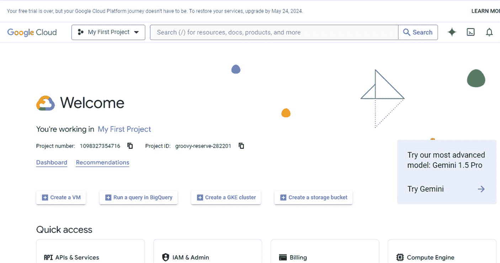
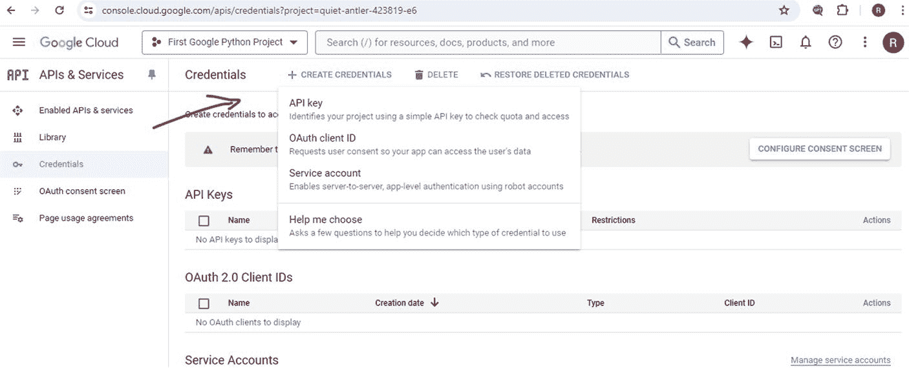
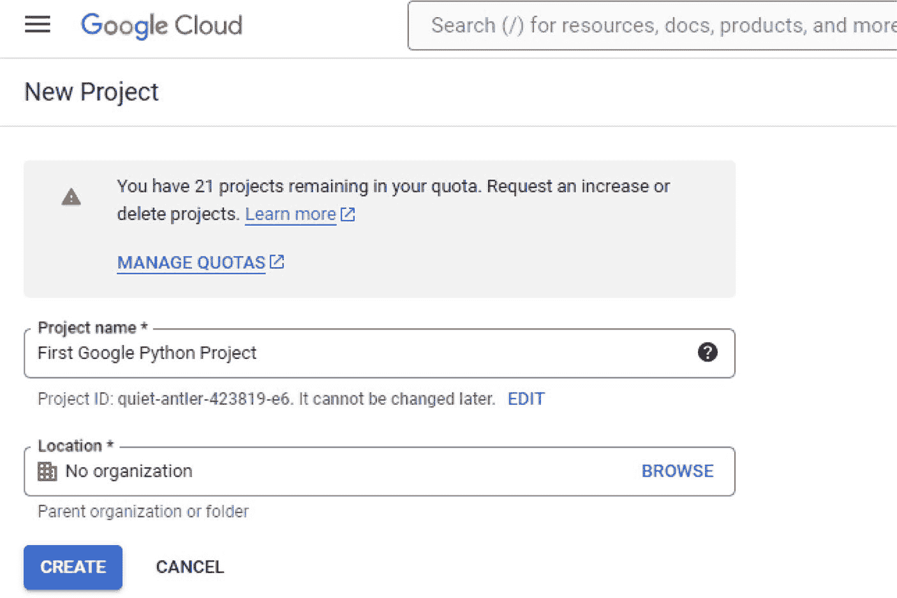
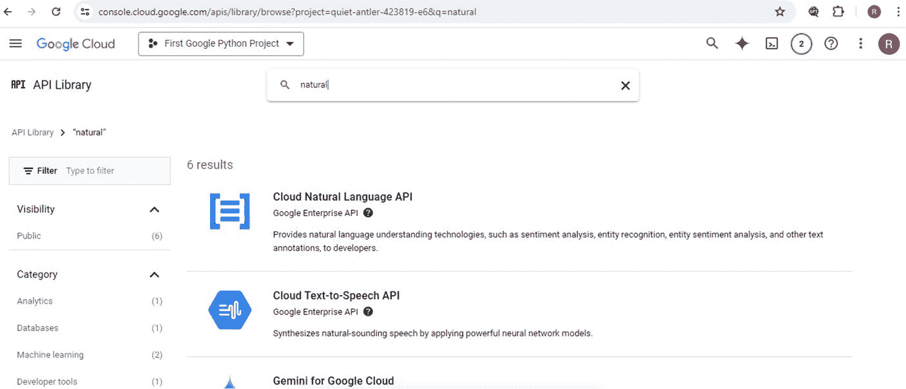
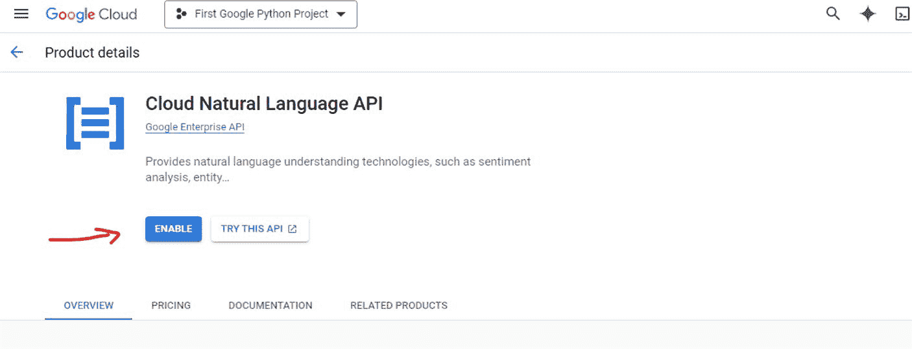
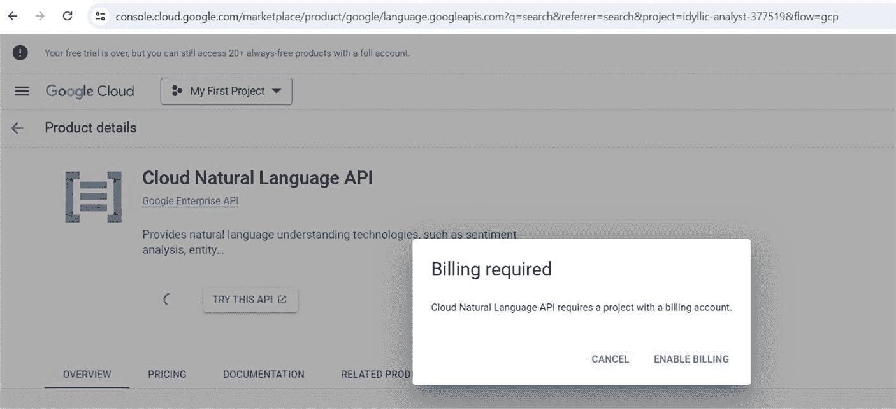
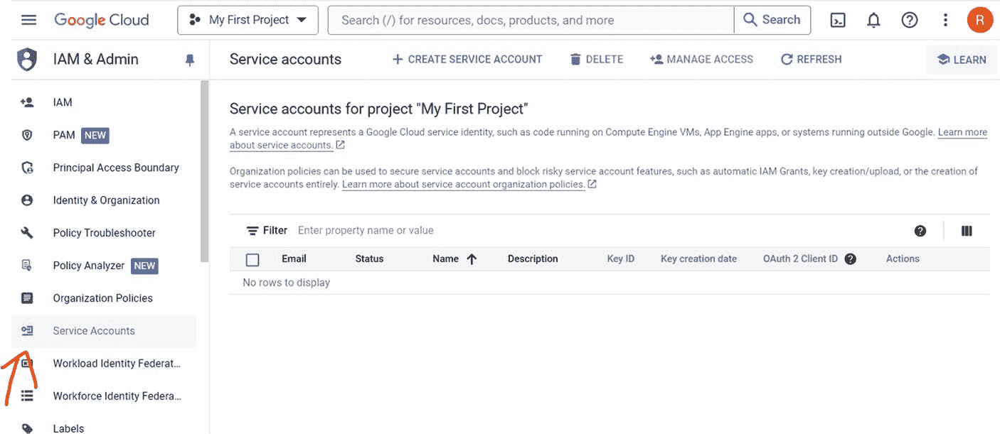
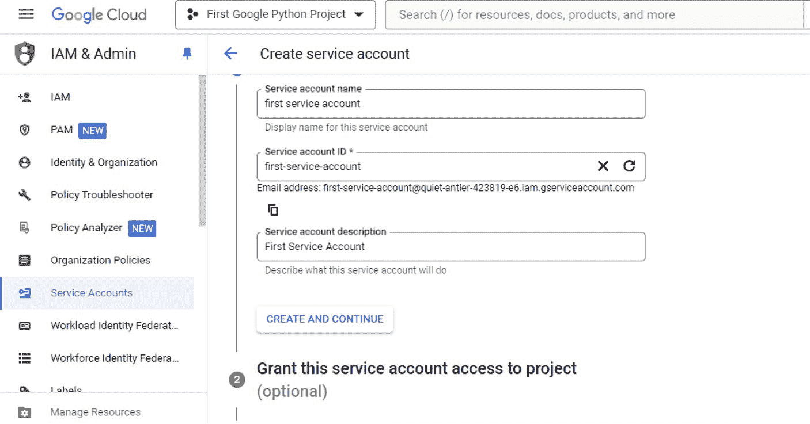
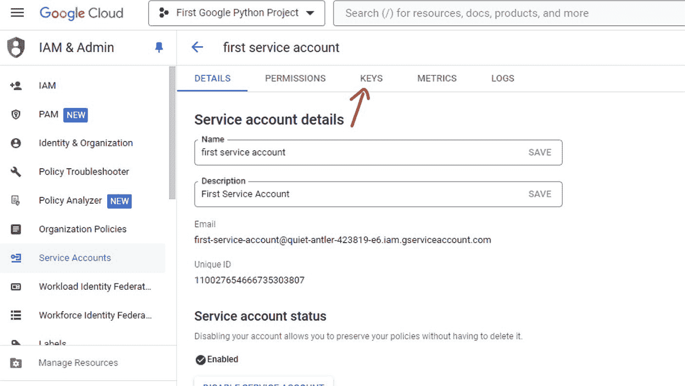

# 使用示例

`prompt = "一部显示客户支持聊天机器人应用界面的手机"`

`image_urls = generate_image(prompt)`

```
if image_urls:
    for url in image_urls:
        print(url)
else:
    print("Failed to generate image.")
```

## 第 4 章：探索大型语言模型（LLM）

- 在此示例中，您提供想要生成的图像的文本描述。您可以定义 `generate_image` 函数来接收以下参数：
- `prompt`：您想要生成的图像的文本描述。
- `num_images`：要生成的图像数量（默认为 1）。
- `size`：生成图像的尺寸（默认为 `"1024x1024"`）。
- 在 `generate_image` 函数内部，您将使用 `openai.Image.create()` 向 OpenAI API 发起请求，并传递 `prompt`、`num_images` 和 `size` 参数。
- 如果请求成功，您将从响应数据中提取图像 URL，并以列表形式返回。
- 如果在 API 请求期间发生异常，您将打印一条错误消息并返回 `None`。
- 如果 `image_urls` 列表不为空，您可以遍历每个 URL 并打印它。否则，您可以打印一条失败消息。

图 4-1 展示了一张生成的图像。


**图 4-1.** DALL-E 生成图像示例

OpenAI 还提供用于语音识别（`Whisper`）、文本转语音（`TTS`）的模型，甚至还有文本审核模型，您可以用它们来构建负责任的生成式 AI 应用。

## Google 的 AI 模型概览

在探索了 OpenAI 模型之后，现在让我们来探索 Google 同样令人印象深刻的一系列 LLM 模型。您会发现，无论您是想处理自然语言处理任务还是解决计算机视觉问题，Google 都能满足您的需求。

### 语言与聊天模型

您决定先从语言和聊天模型开始。

#### Gemini 1.0 Pro

您的研究表明，Gemini 1.0 Pro 同样擅长理解和生成类似人类的文本。它可能是您以高精度处理文本补全、摘要、问答和语言翻译任务的首选模型。鉴于其对复杂语言模式的深刻理解，您决定将 Gemini 1.0 Pro 视为构建复杂文本应用的一个合适候选。

一些实际用例包括内容创作和整理，例如生成高质量的文章、报告和创意写作作品；用于个性化客户服务和推荐的客户支持机器人；用于全球沟通的语言翻译服务；以及交互式教育学习工具。



### 代码示例：调用 Google Cloud Natural Language API 进行文本生成

让我们换个方向，创建我们的第一个 Google 生成式 AI 应用。

前往 Google Cloud 控制台（见图 4-2）创建您的 Google 项目。

**图 4-2.** Google 控制台页面

#### 第 0 步：创建您的 API 密钥

前往 **API 和服务**，点击左侧菜单中的 **凭据**，然后选择创建凭据 ➤ API 密钥（见图 4-3）。



**图 4-3.** 创建您的 API 密钥

#### 第 1 步：创建一个 Google Cloud 项目

前往 Google Cloud 控制台。现在的 URL 是 `https://console.cloud.google.com/welcome?pli=1`。和往常一样，这些链接可能会发生变化。

创建一个新项目。

点击页面顶部的项目下拉菜单。

点击“新建项目”。

输入项目名称和其他详细信息。

点击“创建”。见图 4-4。



**图 4-4.** 创建您的第一个 Google 项目

#### 第 2 步：启用 Google Cloud Natural Language API

导航到 API 和服务仪表板。

从左侧菜单中，选择“API 和服务” ➤ “仪表板”。

启用 API。

点击“+ 启用 API 和服务”。

搜索“Natural Language API”（见图 4-5）。





**图 4-5.** 输入搜索以查找 API

点击“Cloud Natural Language API”结果。

点击“启用”。见图 4-6。

**图 4-6.** 启用 Cloud Natural Language API

请注意，您可能需要创建一个结算账户才能使用该 API。当出现如图 4-7 所示的弹出窗口时，请按照步骤操作。





**图 4-7.** 启用结算

#### 第 3 步：创建一个服务账号

导航到服务账号页面。见图 4-8。

**图 4-8.** 创建服务账号

从左侧菜单中，前往“IAM 与管理” ➤ “服务账号”。

创建一个新的服务账号（见图 4-9）。

点击顶部的“创建服务账号”。

输入服务账号的名称和 ID，以及可选的描述。



点击“创建并继续”。

授予此服务账号对项目的访问权限。

为服务账号选择一个角色。如需完全访问权限，您可以选择“Owner”；如需更受限的访问权限，您可以选择“Cloud Natural Language API User”。

点击“继续”。

可选：授予用户对此服务账号的访问权限。

您可以跳过此步骤，然后点击“完成”。

**图 4-9.** 授予对项目的访问权限

#### 第 4 步：创建并下载 JSON 密钥文件

导航到服务账号页面。

从左侧菜单中，前往“IAM 与管理” ➤ “服务账号”。

选择服务账号。

找到您创建的服务账号并点击它。

点击“密钥”选项卡。

点击“添加密钥” ➤ “创建新密钥”。



**图 4-10.** 下载 JSON 密钥文件

选择“JSON”并点击“创建”。

JSON 密钥文件将下载到您的计算机。请安全保存此文件，因为它包含敏感信息。

#### 第 5 步：设置环境变量

通过指向您下载的 JSON 密钥文件的路径来设置 `GOOGLE_APPLICATION_CREDENTIALS` 环境变量。

您可以在终端或 Python 脚本中设置此环境变量，如下所示。

**示例（终端）**

```
export GOOGLE_APPLICATION_CREDENTIALS="path/to/your/service-account-file.json"
```

**示例（Python 脚本）**

```
import os
os.environ["GOOGLE_APPLICATION_CREDENTIALS"] = "path/to/your/service-account-file.json"
```

### 完整的 Python 脚本示例

以下是使用 Google Cloud Natural Language API 分析文本的完整 Python 脚本。

首先，让我们安装必要的库：

```
!pip install google-cloud-language==2.13.3
!pip install google-cloud-vision==3.7.2
!pip install google-cloud-translate==3.11.3
```

```
# 导入必要的类
from google.cloud import language_v1
import os

# 设置身份验证
os.environ["GOOGLE_APPLICATION_CREDENTIALS"] = "path/to/your/service-account-file.json"

def analyze_text(text):
    # 初始化 LanguageServiceClient
    client = language_v1.LanguageServiceClient()

    # 创建一个包含待分析文本的文档对象
    document = language_v1.Document(content=text, type_=language_v1.Document.Type.PLAIN_TEXT)

    # 使用客户端分析文档的情感
    response = client.analyze_sentiment(document=document)

    # 从响应中提取情感分数和强度
    sentiment = response.document_sentiment
```


