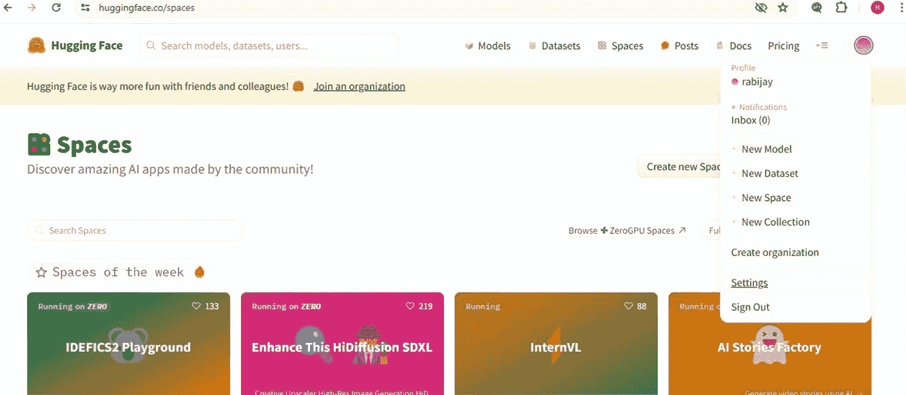
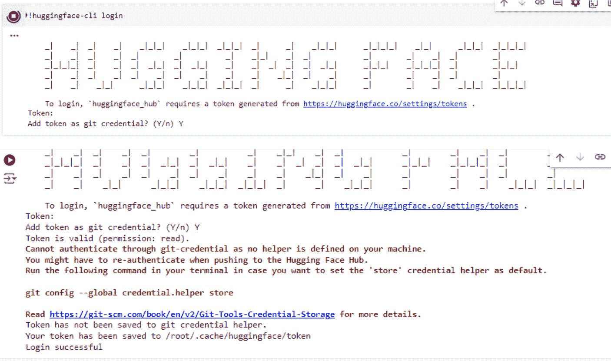

# `llm_chain = prompt | claude; # LLMChain(prompt=prompt, llm=claude)`

```
if __name__ == "__main__":
    human = "{text}"
    prompt = ChatPromptTemplate.from_messages([("system", system), ("human", human)])
    chain = prompt | claude;
    response = chain.invoke(
        {
            "text": "Give me fun fact about Claude",
        }
    )
    print(response)
```

让我们逐步解析这段代码：

1.  首先，您需要安装并导入必要的模块：`os` 用于访问环境变量，`langchain.llms` 中的 `Anthropic` 用于与 Claude 模型交互，以及 `langchain` 中的 `PromptTemplate` 和 `LLMChain` 用于构建提示词和链。
2.  您从环境变量 `ANTHROPIC_API_KEY` 中检索 Anthropic API 密钥。在运行代码之前，请确保使用您的实际 API 密钥设置此环境变量。
3.  您定义了 `prompt_template`，这是一个用作提示词模板的字符串。在此示例中，提示词要求 AI 助手提供一个关于 AI 的有趣事实。
4.  您使用 `prompt_template` 创建了一个名为 `prompt` 的 `PromptTemplate` 实例。由于此示例中没有输入变量，我们向 `input_variables` 传递了一个空列表 `[]`。
5.  您创建了一个名为 `Claude` 的 `Anthropic` 类实例，指定模型名称为 `"claude-v1"` 并提供 `anthropic_api_key`。
6.  您创建了一个名为 `llm_chain` 的 `LLMChain` 实例，将 `prompt` 和 `Claude` 实例作为参数传递。此链将提示词与 Claude 模型连接起来。
7.  在 `if __name__ == "__main__":` 代码块中，您使用 `run()` 方法运行 `llm_chain`，该方法根据提供的提示词从 Claude 模型生成响应。
8.  最后，您打印生成的响应。

如您所见，仅需几行代码，您就可以利用 Claude 3 模型的能力生成令人惊叹的 AI 驱动内容。

## Cohere AI 模型概览

接下来，您将了解 Cohere 提供的 AI 模型。我发现它们的分类方式与其他模型略有不同。它们有两种类型的模型，即生成式模型和表示式模型。

您观察到 Cohere 的生成式模型，即 `Command`、`Command-R` 和 `Command-light`，在根据输入提示生成文本方面表现出令人印象深刻的能力。旗舰模型 `Command` 被认为在从内容创作到聊天机器人开发等任务中表现出色。

`Command-R` 模型专注于对话交互和长上下文任务，在教育资源和代码文档等应用中显示出潜力。`Command-light` 模型是另一个针对速度和效率进行优化的模型，您认为它非常适合生成产品描述或快速客户服务响应等任务。

接着，您转向 Cohere 的表示式模型，并开始研究 `Embed-english`、`Embed-multilingual`、`Rerank-english` 和 `Rerank-multilingual`。您发现这些模型擅长将文本转换为数值表示（即嵌入），这些嵌入能够捕捉输入的上下文含义。`Embed-english` 和 `Embed-multilingual` 在驱动语义搜索引擎、内容推荐系统和文本分类任务方面显示出潜力。`Rerank-english` 和 `Rerank-multilingual` 以通过第二阶段排序提高搜索相关性而闻名，您认为它们对于客户支持工单路由或多语言知识库搜索等应用非常有用。

虽然 Cohere 的模型确实令人印象深刻，但您意识到这只是拼图的一部分，因此在下一节尝试其模型后，您决定继续进行研究。

### 实践示例：使用 Cohere 的 Command 模型（代码片段）

首先，您需要获取一个 Cohere API 密钥，可以通过访问其网站并在 [`dashboard.cohere.com/welcome/register`](https://dashboard.cohere.com/welcome/register) 注册来获取。

填写要求提供个人资料详情的表单，然后进入“API Keys”页面，如下所示。Cohere 提供两种类型的密钥：一种是生产密钥，另一种是试用密钥。继续操作，复制试用密钥。

在此示例中，您导入 Cohere 库并使用您的 API 密钥创建一个 `Client` 实例。

然后，您向 `Command` 模型提供一个提示词，并指定要生成的最大 token 数量和温度（该参数控制生成文本的创造性）。

生成的文本存储在响应的 `generations` 属性中，您可以访问并打印该属性。

如您所见，仅需几行代码，您就可以释放 Cohere 生成式模型的力量，并开始创建令人惊叹的 AI 驱动应用程序。

以下是一个简单的示例，展示如何使用 Cohere 的 `Command` 模型生成文本：

```
!pip install langchain==0.2.0
!pip install langchain_community==0.2.0
!pip install cohere==5.5.0

import os
from langchain_core.prompts import PromptTemplate, ChatPromptTemplate
from langchain_cohere import ChatCohere

# 设置您的 Cohere API 密钥
os.environ["COHERE_API_KEY"] = "YOUR_COHERE_API_KEY"

prompt_template = """ 您是一个旨在生成创意商业推介的 AI 助手。请继续
以下推介：

推介：推出一款革命性的新产品，它将
改变人们工作和协作的方式。我们的创新
解决方案将尖端技术与直观
设计相结合，为各种规模的团队创造无缝体验。
凭借实时协作、智能
任务自动化和集成分析等功能，我们的产品
赋能团队更快地实现更多目标。想象一个世界，在那里
沟通毫不费力，生产力最大化，并且
成功是必然的。这就是我们正在构建的世界
"""

if __name__ == "__main__":
    # 初始化 Cohere 模型
    cohere = ChatCohere(temperature=0, api_key=COHERE_API_KEY, model_name="command-r")
    system = ( prompt_template )
    human = "{text}"
```


#### 创建提示模板

`prompt = ChatPromptTemplate.from_messages([("system", system), ("human", human)])`

`chain = prompt | cohere;`

`response = chain.invoke({"text": "Give me fun fact about Cohere"})`

`print("Cohere Generated Pitch:")`
`print(response)`

## Meta AI 模型

接下来，你的模型探索之旅将带你了解 Meta AI 的一系列模型。你首先接触到的是 `LLaMA`，即**大型语言模型 Meta AI**，这是一个基础模型，拥有多种规模（参数从 7B 到 65B 不等），在语言理解、文本生成和问答等任务中表现出色。

你还发现了 `OPT`，即**开放预训练变换器**，这是另一个在语言建模和生成方面表现出色的开源模型系列。此外还有 `NLLB`，即**不让任何语言掉队**，这是一个多语言模型，能够在超过 200 种语言之间进行翻译。

但你意识到 Meta AI 的产品并不仅限于语言模型。他们还开发了 `RoBERTa`，这是 `BERT` 的优化版本，在从文本分类到情感分析等一系列自然语言理解任务上性能更佳。`DPR`，即**密集段落检索**，是一个基于检索的模型，能高效处理文档检索和问答任务。而 `M2M-100` 则是一个真正的多语言能手，能够在 100 种语言的任意组合之间进行翻译。

第 4 章 探索大型语言模型 (LLMs) 你意识到这些模型的潜在应用场景广阔且令人兴奋，并记录了一些明确的用例，例如使用 `LLaMA` 进行自动化内容创作、由 `M2M-100` 驱动的全球电子商务平台，以及通过 `RoBERTa` 增强的个性化学习体验。

接着，你将进入音频和高效文本分类的世界，探索 `WaVE` 和 `FastText`。`WaVE` 是波形到向量的缩写，它将音频波形转换为固定维度的向量表示，为音频分类、检索和相似性分析开辟了新的可能性。而 `FastText` 则是一个轻量级库，有助于快速进行文本分类和表示学习。

你记录了一些用例，例如语音激活系统、音乐推荐引擎以及社交媒体上的实时情感分析，以备将来参考。

### 使用 Hugging Face 调用 LLaMA 模型

在调用 Hugging Face 仓库中的模型之前，请注意这些模型大多是私有的或受限的。这意味着你需要向 Hugging Face 提供访问令牌以进行身份验证并获取模型访问权限。

#### 向 Hugging Face 传递访问令牌

以下是在加载分词器和模型时传递访问令牌的方法：

```
!pip install langchain==0.2.0
!pip install transformers
!pip install torch
!pip install fasttext
```



第 4 章 探索大型语言模型 (LLMs)

```
from transformers import LlamaTokenizer, LlamaForCausalLM

model_name = "MetaAI/llama-7b"
access_token = "your_access_token"

tokenizer = LlamaTokenizer.from_pretrained(model_name, use_auth_token=access_token)
model = LlamaForCausalLM.from_pretrained(model_name, use_auth_token=access_token)
```

请务必将 `"your_access_token"` 替换为你实际的 Hugging Face 访问令牌。你可以按照以下步骤获取访问令牌：

1. 在 [`huggingface.co/`](https://huggingface.co/) 注册或登录你的 Hugging Face 账户。
2. 点击右上角的个人资料图片，选择“设置”，进入你的个人资料设置页面。



第 4 章 探索大型语言模型 (LLMs)

3. 在设置页面中，导航到“访问令牌”选项卡。
4. 点击“新建令牌”按钮创建一个新的访问令牌。为其命名并选择所需的权限。对于此示例，`READ` 权限就足够了。
5. 复制生成的访问令牌，并按照上述方式在你的代码中使用它。

或者，你也可以使用 `huggingface-cli` 命令行工具登录。打开终端并运行以下命令：

```
huggingface-cli login
```


此命令将提示您输入 Hugging Face 用户名和密码。登录后，您的访问令牌将被保存，您可以在代码中使用它，而无需显式提供。图 4-11 展示了使用 `huggingface-cli` 命令行工具时的效果。

**图 4-11.** Hugging Face CLI 命令行工具

请记住保护好您的访问令牌，避免公开分享，因为它可以访问您的 Hugging Face 账户和仓库。

通过提供访问令牌或使用 `huggingface-cli` 登录，您应该能够成功加载私有或受限的模型仓库。

### 代码解释

以下是对代码的解释。

首先，您必须导入必要的库和模块，例如 PyTorch、LangChain 和 Hugging Face 的 Transformers。接下来，您需要使用访问令牌向 Hugging Face 进行身份验证。正如我们之前讨论的，如果您想从 Hugging Face 平台访问某些模型（如 LLaMA），则需要此身份验证步骤。请注意，您还需要签署协议才能使用这些模型。

接着，您加载预训练模型和分词器。在此示例中，您使用的是 `"Meta-Llama-3-8B"` 模型。分词器有助于将文本分解为模型可以理解的令牌。您将模型配置为使用 `float16` 数据类型以提高内存效率，并自动利用可用的 GPU。

现在，我们来谈谈自定义停止条件。这个可选步骤允许您定义模型何时应停止生成文本。在这里，您创建了一个 `StopOnTokens` 类，用于检查生成的文本是否到达序列结束令牌。这有助于防止模型生成无限量的文本。

准备好模型和停止条件后，您将创建一个用于文本生成的 Hugging Face 管道。您可以指定参数，例如要生成的最大新令牌数、停止条件、采样方法以及用于控制输出随机性的温度参数。

为了将管道与 LangChain 无缝集成，您可以使用 `HuggingFacePipeline` 类对其进行封装。这允许您在 LangChain 框架内将管道用作语言模型 (LLM)。

最后，您就可以与模型进行交互了！您提供一个提示，询问人工智能的潜在益处和风险。

LLM 处理该提示并生成响应，然后将其打印出来。

**注意** 此代码可能需要很长时间才能完成。

### 使用 Hugging Face 平台的 LLaMA 模型的代码

以下是代码：

```
!pip install langchain==0.2.0

!pip install transformers==4.40.2

!pip install accelerate==0.30.1

!pip install langchain-community==0.2.0

import torch

from langchain import HuggingFacePipeline

from transformers import (

AutoModelForCausalLM,

AutoTokenizer,

pipeline,

StoppingCriteria,

StoppingCriteriaList,

logging

)

from huggingface_hub import login

logging.set_verbosity_error() # 抑制警告

# 1. 向 Hugging Face 进行身份验证（如果需要）

login(token="Your access token")

# 2. 加载模型和分词器

model_id = "meta-llama/Meta-Llama-3-8B"

tokenizer = AutoTokenizer.from_pretrained(model_id)

model = AutoModelForCausalLM.from_pretrained(

model_id,

torch_dtype=torch.float16, # 使用 float16 以提高内存效率

device_map="auto", # 自动使用可用的 GPU

)

# 3. 自定义停止条件（可选，但推荐）

class StopOnTokens(StoppingCriteria):

def __call__(self, input_ids: torch.LongTensor, scores: torch.FloatTensor, **kwargs) -> bool:

for stop_id in [tokenizer.eos_token_id]:

if input_ids[0][-1] == stop_id:

return True

return False

stopping_criteria = StoppingCriteriaList([StopOnTokens()])

# 4. 创建 Hugging Face 管道

pipe = pipeline(

"text-generation",

model=model,

tokenizer=tokenizer,

max_new_tokens=256,

stopping_criteria=stopping_criteria,

do_sample=True,
```


