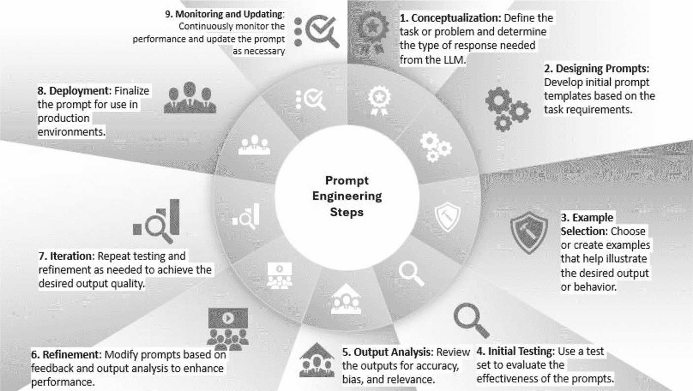

# 详尽的文档与富有洞见的博客文章

这些内容解释了如何使用他们的模型。[`txt.cohere.com/tag/research/`](https://txt.cohere.com/tag/research/)

[cohere.com/tag/research/](https://txt.cohere.com/tag/research/)

**ArXiv.org**：对于对人工智能和大语言模型领域最新研究论文感兴趣的人来说，ArXiv.org 是一个宝贵的资源。[`ArXiv.org`](https://arxiv.org)

## 第五章：掌握创意内容的提示词

在本章中，我将向你展示在 LangChain 框架内使用提示工程的有力工具和技术。你将学习如何设计和优化提示词，使其能够有效地与大语言模型沟通，从而获得针对你特定应用需求的精确且可靠的输出。

## 提示工程的重要性

提示工程正成为一项变革性技术，因为它能帮助你释放大语言模型的全部潜力。作为一名提示工程师，你的工作是精心创建指令，引导大语言模型产生你想要的输出。这是你和模型之间一个动态的、反复迭代的过程。你通过清晰、简洁的提示词设定方向，而大语言模型则利用其广博的知识生成与你确切愿景相匹配的内容。

© Rabi Jay 2024  
R. Jay, *《使用 LangChain 和 Python 构建生成式 AI 应用》*,  
[`doi.org/10.1007/979-8-8688-0882-1_5`](https://doi.org/10.1007/979-8-8688-0882-1_5#DOI)

### 为什么需要提示工程？

以下是提示工程至关重要的几个原因：

- **知识获取**：这些大语言模型在包含大量信息的海量数据集上进行了训练，但要提取出满足你确切需求的知识，你需要精确的提示词。
- **职业机遇**：精通提示工程的开发者备受追捧。公司正在积极寻找能够利用语言模型的力量来创造创新解决方案的人才。
- **成本效益**：通过提示工程，你无需庞大的基础设施或资源。你可以利用现有模型进行创新，而无需从头开发，从而节省时间和金钱。
- **处理多种模型**：过去，你会为不同的任务使用不同的模型。如果你想总结文本，你会用一个模型；如果你需要做问答任务，你会用另一个模型。但随着大语言模型的兴起，单个模型就能处理各种任务。关键在于？你需要告诉模型针对每个特定任务该如何表现。
- **处理不同格式**：你可以利用提示工程对各种格式的大语言模型输出进行精确控制。你可以引导模型以所需的结构生成响应，例如 JSON、Python 函数或结构化列表。

### 对可扩展性的需求

首先，让我们在不使用提示模板的情况下调用大语言模型。想象一下，你想获取某个特定历史主题（比如世界大战）的事实。你会这样做：

```
result = LLM("2021 年科技股上涨的主要原因是什么")
print(result)
```

然后你会得到一个关于科技股上涨的有趣事实，比如：

> “2021 年的科技股上涨是由低利率、经济复苏、强劲的盈利增长、数字化程度提高、投资者热情、政府刺激措施以及技术进步共同推动的。”

但是，如果你想换个花样，获取关于 2021 年零售业增长的事实呢？你可以使用 f-string 字面量，并在外部定义 `topic` 变量，像这样：

```
topic = "2021 年零售业增长"
prompt = f"""
请提供影响{topic}的主要因素的简明摘要。
在你的回答中至少包含三个关键点。
将你的答案格式化为项目符号列表。
"""
result = LLM(prompt)
print(result)
```

虽然这可行，但当你开始构建更复杂的应用或链时，它的可扩展性并不好。这时，提示模板就派上用场了！



### 提示工程步骤

下面是一个流程图，展示了在你的项目中实施提示工程的一种方法，其中包含了从概念化到执行的各个步骤。

#### 目标是什么？

首先，你应该清楚自己想要实现什么。问问自己：“我需要 AI 完成什么任务？”无论是生成笑话、总结复杂文章，还是其他任何任务，拥有一个明确的目标是起点。

#### 创建提示词时需要考虑的事项

首先，除了向大语言模型提供信息外，你还应该关注可能出现的潜在问题，并相应地引导大语言模型走向正确的方向。例如，在生成虚构故事时，你可以加入指令，要求避免使用老套的情节，并在整个故事中保持一致的基调和风格。

你的提示词可以成就或毁掉语言模型的性能。可以把提示模板想象成一段带有空白区域的文本，等待用户输入来填充。另一种思考方式是，将其视为将字符串转换为可以传入值的函数参数的一种手段。

如果最初的几次尝试没有产生你期望的确切结果，请不要气馁。像任何其他技能一样，掌握它需要练习和耐心。每一次迭代，你都会学到宝贵的经验并改进你的方法。

你还应该注意偏见并努力减轻它们。语言模型可能会从它们训练所用的数据中继承偏见。减少偏见的一种方法是精心设计提示词，并提供多样化和包容性的示例。

#### 编写你的提示词

接下来，你需要勾勒一个提纲。你首先需要起草一个初始提示词。保持简单直接。例如，如果你需要一份摘要，你的提示词可以这样开头：“为一名高中生总结以下文章。”

在编写提示词时，你必须同时考虑系统提示词和用户提示词：

- **系统提示词**：你应该首先使用系统提示词来定义 AI 的角色和整体预期行为。这为所有后续交互设定了上下文。例如：
  ```
  系统：你是一位擅长向高中生解释复杂主题的专家级教育者。
  ```

- **用户提示词**：然后，你应该使用用户提示词来指定实际任务。保持简单直接。例如：
  ```
  用户：为一名高中生总结以下文章：[文章文本]
  ```

通过结合系统提示词和用户提示词，你可以创建更具可控性和上下文感知能力的交互：

```
messages = [
    {"role": "system", "content": "你是一位擅长向高中生解释复杂主题的专家级教育者。"},
    {"role": "user", "content": "为一名高中生总结以下文章：[文章文本]"}
]
result = LLM(messages)
print(result)
```

这种方法有助于为大语言模型提供一个清晰的结构来遵循。

#### 选择你的示例

在这里，你通过示例来帮助 AI 理解你期望的风格、语气和格式。提供高质量的示例至关重要，因为 AI 会从你提供的示例中学习，所以要明智地选择。如果你追求简洁，就选择简短精炼的示例。

#### 测试你的提示词

准备好提示词和示例后，就该进行测试了。将你的提示词输入 AI，并分析其响应的好坏。密切关注生成输出的质量、相关性和连贯性。它们是否达到了目标，还是需要一些微调？

#### 审查输出


### 评估与优化提示词

#### 评估响应质量

不仅要评估 LLM 响应的准确性，还要评估其整体质量。考虑公平性、连贯性以及与所提供示例的一致性等因素。问问自己：“我会为展示这些结果感到自豪吗？它们是否与我提供的示例相似？”这种评估将帮助你识别需要改进的领域。

#### 微调提示词

基于评估中获得的见解，你需要微调提示词。如果 LLM 的输出缺乏所需的语气或清晰度，请相应调整。也许你需要提供更具体的指令，或调整示例以更好地符合你的目标。

