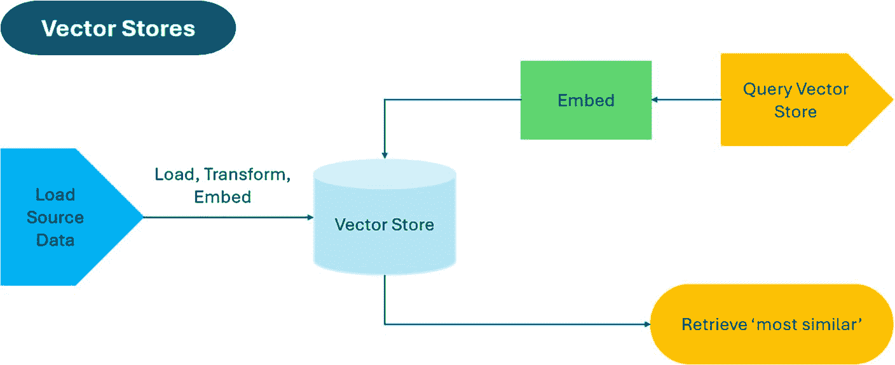

# 第 7 章 使用检索增强生成（RAG）构建高级问答与搜索应用

在本例中，你将使用 `RecursiveCharacterTextSplitter` 的 `from_tiktoken_encoder()` 方法。你需要指定所使用的语言模型（此处为 `"gpt-3.5-turbo"`），并将所需的 `chunk_size` 设置为 500 个词元。同时，你还可以添加 50 个词元的 `chunk_overlap`，以便在文本块之间提供一定的上下文关联。

接着，你可以使用 `split_text()` 方法，该方法会根据指定的参数将 `returns_policy` 文章分割成多个文本块。它能确保每个文本块都在词元限制范围内，并递归地分割任何过大的文本块，直至其符合要求。

分割完成后，你可以打印生成的文本块数量，并展示第一个文本块，以便初步了解输出结果。

通过这种方法，你可以高效地处理公司的知识库文章，并为训练客户支持聊天机器人做好准备。`RecursiveCharacterTextSplitter` 负责处理繁重的工作，确保每个文本块都与语言模型的词元限制兼容。

### 动手尝试

语言模型的选择以及 `chunk_size` 和 `chunk_overlap` 参数均可根据你的具体需求进行调整。你可以尝试不同的数值，以找到文本块大小与上下文保留之间的最佳平衡点。

## 向量存储

在本节中，我们将更详细地讨论向量存储，包括它们是什么以及为何如此重要。

