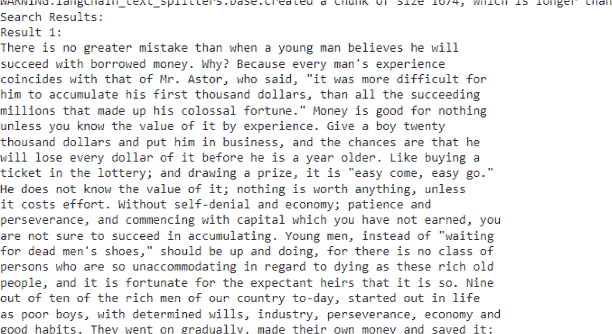

# 第 7 章 使用检索增强生成（RAG）构建高级问答与搜索应用

为了生成嵌入向量，你必须创建一个 `OpenAIEmbeddings` 类的实例：

```python
# 创建 OpenAI 嵌入向量的实例
underlying_embeddings = OpenAIEmbeddings()
```

然后，你必须创建一个 `LocalFileStore` 类的实例，并指定缓存嵌入向量的存储目录：

```python
# 创建用于缓存嵌入向量的本地文件存储
store = LocalFileStore("./cache/")
```

这是最重要的一步，你需要创建一个 `CacheBackedEmbeddings` 类的实例，并封装之前用 OpenAI 创建的底层嵌入向量。你将嵌入向量存储在本地文件存储中进行缓存。使用 `namespace` 参数，并将其指向底层嵌入向量的模型名称：

```python
# 创建一个 CacheBackedEmbeddings 实例
cached_embedder = CacheBackedEmbeddings.from_bytes_store(
    underlying_embeddings, store, namespace=underlying_embeddings.model
)
```

## 构建信息检索系统

现在，你必须加载文档：

```python
# 加载文档
raw_documents = TextLoader("./sample_data/The Art of Money Getting.txt").load()
```

加载完成后，使用文本分割器将文档分割成块：

```python
# 将文档分割成块
text_splitter = CharacterTextSplitter(chunk_size=1000, chunk_overlap=0)
documents = text_splitter.split_documents(raw_documents)
```

在这里，你使用 FAISS 向量存储创建向量存储，并传入文档块和缓存嵌入器：

```python
# 创建向量存储
db = FAISS.from_documents(documents, cached_embedder)
```

下面，你定义了搜索查询：

```python
# 执行相似性搜索
query = "What advice does the author give about getting rich?"
```

然后，你使用该查询执行相似性搜索，并检索最相关的三个块：

```python
results = db.similarity_search(query, k=3)
```

最后，你将遍历搜索结果并打印每个结果，包括其内容和分隔线：

```python
# 打印搜索结果
print("Search Results:")
for i, doc in enumerate(results):
    print(f"Result {i+1}:")
    print(doc.page_content)
    print("---")
```



以下是我得到的结果示例：

**恭喜！** 你已经成功使用 LangChain 和 OpenAI 嵌入向量加载了文档，将其分割成块，生成了嵌入向量，创建了向量存储，并执行了相似性搜索，以根据给定查询找到相关信息。

## 自己试试吧！

请记住，缓存嵌入向量是一种强大的技术，可以节省你的时间和计算资源。所以，请大胆尝试不同的嵌入器、存储机制和命名空间。

尽情探索缓存嵌入向量的世界，看看它们如何简化你的开发流程。

### 异步调用向量存储

让我们讨论一下为什么异步调用向量存储是有帮助的。你看，向量存储通常作为需要一些输入/输出（IO）操作的独立服务运行。如果你同步调用这些操作，就会浪费宝贵的时间等待外部服务的响应。

这就是异步操作可以提供帮助的地方，因为你可以让代码在等待向量存储响应时继续执行其他任务。好消息是，你只需在方法名前加上 `a` 前缀，就可以异步调用所有方法。

首先，你需要安装 Qdrant，这是一个完全支持异步操作的向量存储。你需要安装 `qdrant-client` 包。可以通过运行以下命令来安装：

```bash
!pip install qdrant-client
```

安装好包之后，你可以从 `langchain_community.vectorstores` 中导入 `Qdrant` 类：

```python
from langchain_community.vectorstores import Qdrant
```

然后，你必须通过调用 `afrom_documents` 方法异步创建一个向量存储：

```python
db = await Qdrant.afrom_documents(documents, embeddings, "http://localhost:6333")
```

在这里，`documents` 是你的文档集合，`embeddings` 是你正在使用的嵌入模型，`"http://localhost:6333"` 是你的 Qdrant 服务器的 URL。请注意，你可以使用以下 docker 语句在你的本地机器上安装 Qdrant 服务器：

```bash
docker run -p 6333:6333 qdrant/qdrant
```

你需要安装 docker 才能运行此命令。此命令将拉取 Qdrant Docker 镜像，并在你的本地机器上启动一个 Qdrant 服务器，将其暴露在 6333 端口。你也可以使用由 Qdrant 云或其他云提供商提供的托管 Qdrant 服务器。

创建好向量存储后，你可以异步执行相似性搜索。假设你有一个查询，并希望找到最相似的文档。你可以这样做：

```python
query = "What advice did the author give about money"
docs = await db.asimilarity_search(query)
print(docs[0].page_content)
```

`asimilarity_search` 方法接收你的查询，并返回一个最相似文档的列表。你可以使用 `docs[0].page_content` 访问第一个文档的内容。

你也可以直接使用向量嵌入来执行相似性搜索。看看这个：

```python
embedding_vector = embeddings.embed_query(query)
docs = await db.asimilarity_search_by_vector(embedding_vector)
```

在这种情况下，你首先使用嵌入模型的 `embed_query` 方法嵌入你的查询。然后，将生成的 `embedding_vector` 传递给 `asimilarity_search_by_vector` 方法，以找到最相似的文档。

## 检索器

我们已经讨论了如何从向量存储中检索查询的答案。让我们更详细地讨论一下检索器。

你可以使用检索器传入一个非结构化查询，并返回一个相关文档列表作为输出。它可以帮助你根据问题或查询快速获取所需的信息。


