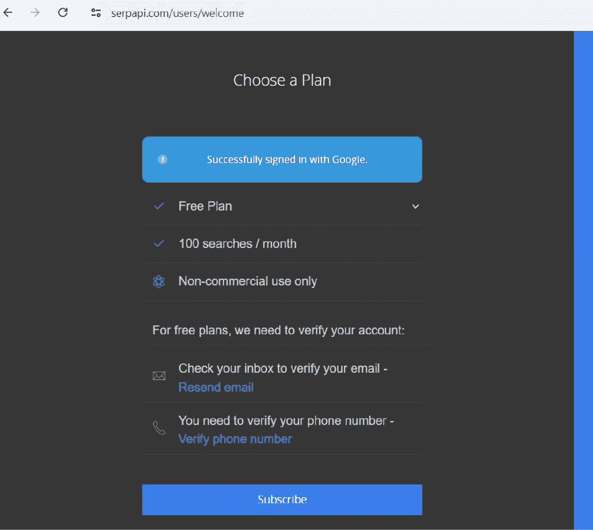

# 使用查询运行代理

```python
query = "一家软件公司计划开发一款新的移动应用。他们估计初始开发成本为 20 万美元，该应用每月将产生 1.5 万美元的收入。公司想知道，假设每月维护成本为 5000 美元，需要多少个月才能收回投资。你能帮忙计算盈亏平衡点吗？"

response = agent.run(query)
print(response)
```

### 获取 SerpAPI 密钥

要获取 SerpAPI 的 API 密钥，请按照以下步骤操作：

访问 SerpAPI 网站（[`serpapi.com/`](https://serpapi.com/)），点击页面右上角的“注册”按钮。填写所需信息，例如您的姓名、电子邮件地址和所需密码，以创建账户。创建账户后，使用您的凭据登录 SerpAPI 仪表板。请确保同时确认您的电子邮件账户和电话号码。

登录后，您将进入仪表板页面。在此页面上找到“API 密钥”部分。在“API 密钥”部分，您将找到您的个人 API 密钥。它是一串字符，用于验证您的 API 请求。复制该 API 密钥并安全存储。避免公开分享，因为它允许访问您的 SerpAPI 账户和资源。



## 第 8 章：您的第一个代理应用

在此示例中，您使用一组工具（`SerpAPI` 和 `LLM-Math`）以及一个语言模型（`OpenAI`）初始化了 `Agent`。当给定一个查询时，`Agent` 会分析该查询，确定要使用哪些工具，并通过组合所选工具的结果动态生成响应。

`Agent` 可以处理多部分问题，并根据提供全面答案所需的信息调整其方法。它能够理解您的需求，并找到最有效的方式来满足这些需求。

### 代码解释

现在让我们逐步讲解代码。

**安装依赖项**

- `!pip install serpapi`：首先，您必须安装 `serpapi` 库，该库用于与 SerpAPI 搜索引擎交互。

- `!pip install google-search-results`：然后，您必须安装 `google-search-results` 库，该库提供了与 Google 搜索 API 交互的另一种方式。

**导入必要的模块**

- `os`：导入 `os` 模块以与操作系统交互。

- `dotenv`：此模块用于从 `.env` 文件加载环境变量。

- `openai`：此模块是 OpenAI API 客户端库。

- 从 `langchain.agents` 导入 `load_tools` 和 `initialize_agent`：使用 `langchain.agents` 中的 `load_tools` 和 `initialize_agent` 函数来加载工具并初始化代理。

- 从 `langchain.llms` 导入 `OpenAI`：此类代表 OpenAI 语言模型。

**加载环境变量**

- `load_dotenv()`：使用 `load_dotenv` 函数从 `.env` 文件加载环境变量。

- `OPENAI_API_KEY = os.getenv("OPENAI_API_KEY")`：此行从环境变量中检索 OpenAI API 密钥。

- `os.environ["OPENAI_API_KEY"] = "Your OpenAI API Key"`：此行在环境变量中设置 OpenAI API 密钥。

- `os.environ["SERPAPI_API_KEY"] = "Your SERPAPI key"`：此行在环境变量中设置 SerpAPI API 密钥。

**初始化 OpenAI 客户端**

- `openai.api_key = OPENAI_API_KEY`：此行设置 OpenAI 客户端的 OpenAI API 密钥。

- `openai.api_key = os.getenv("OPENAI_API_KEY")`：此行确认 OpenAI API 密钥设置正确。

- `SERPAPI_API_KEY = os.getenv("SERPAPI_API_KEY")`：此行从环境变量中检索 SerpAPI API 密钥。

**初始化语言模型 (LLM)**

- `llm = OpenAI(openai_api_key=OPENAI_API_KEY, temperature=0)`：使用提供的 API 密钥初始化 OpenAI 语言模型，并将温度设置为零以获得确定性响应。

**加载必要的工具**

- `tools = load_tools(["serpapi", "llm-math"], llm=llm)`：使用此行，您可以通过 `load_tools` 函数加载 SerpAPI 和 LLM-Math 工具，并传递已初始化的语言模型。

**初始化代理**

- `agent = initialize_agent(tools, llm, agent="zero-shot-react-description", verbose=True)`：然后，您必须使用加载的工具、语言模型和 `"zero-shot-react-description"` 代理类型来初始化代理。`verbose=True` 参数启用详细输出。

**使用查询运行代理**

- `query = "一家软件公司计划开发一款新的移动应用。他们估计初始开发成本为 20 万美元，该应用每月将产生 1.5 万美元的收入。公司想知道，假设每月维护成本为 5000 美元，需要多少个月才能收回投资。你能帮忙计算盈亏平衡点吗？"`：此行定义要向代理提出的查询。

- `response = agent.run(query)`：然后，您使用提供的查询运行代理并存储响应。

- `print(response)`：最后，您打印代理的响应。

### 运行代码后的结果

现在让我们分析结果以了解代理的工作原理。以下是代码运行时的结果：

```
进入新的 AgentExecutor 链...

为了计算盈亏平衡点，我需要找到盈亏平衡分析的公式。我将搜索此信息。

操作：搜索
操作输入："盈亏平衡分析公式"

观察结果：盈亏平衡点是总收入等于总成本的点。盈亏平衡分析的基本公式是：盈亏平衡点 = 固定成本 ÷ (每单位收入 - 每单位变动成本)

在这种情况下，我们有：
- 固定成本：初始开发成本 200,000 美元
- 每单位收入：每月收入 15,000 美元
- 每单位变动成本：每月维护成本 5,000 美元

因此，公式为：
盈亏平衡点（月数）= 200,000 美元 ÷ (15,000 美元 - 5,000 美元) = 200,000 美元 ÷ 10,000 美元

要计算以月为单位的盈亏平衡点，请将初始开发成本除以每月收入与每月维护成本之间的差额。

思考：搜索结果提供了我计算盈亏平衡点所需的公式。我有初始开发成本、每月收入和每月维护成本。我现在可以计算以月为单位的盈亏平衡点。

操作：计算器
操作输入：200000 / (15000 - 5000)

观察结果：答案：20.0

思考：使用盈亏平衡分析公式和给定的信息，我计算出该公司需要 20 个月才能收回其在移动应用上的投资。

最终答案：给定初始开发成本 200,000 美元、每月收入 15,000 美元和每月维护成本 5,000 美元，该软件公司需要 20 个月才能收回其在新移动应用上的投资。

> 链结束。
```

给定初始开发成本 200,000 美元、每月收入 15,000 美元和每月维护成本 5,000 美元，该软件公司需要 20 个月才能收回其在新移动应用上的投资。

### 解读结果

让我们分析代理为解决业务查询所采取的步骤：

"一家软件公司计划开发一款新的移动应用。他们估计初始开发成本为 20 万美元，该应用每月将产生 1.5 万美元的收入。公司想知道，假设每月维护成本为 5000 美元，需要多少个月才能收回投资。你能帮忙计算盈亏平衡点吗？"

1. 代理首先认识到它需要找到盈亏平衡分析的公式来计算盈亏平衡点。它决定使用"搜索"工具来获取此信息。

2. 搜索结果提供了盈亏平衡分析的基本公式，该公式涉及将固定成本除以每单位收入与每单位变动成本之间的差额。

3. 代理从查询中识别出继续计算盈亏平衡期所需的信息：

   - 初始开发成本（200,000 美元）作为固定成本

   - 每月收入（15,000 美元）作为每单位收入

   - 每月维护成本（5,000 美元）作为每单位变动成本

4. 一旦获得公式，代理足够聪明地使用计算器应用盈亏平衡分析公式，将初始开发成本除以每月收入与每月维护成本之间的差额：`200,000 美元 / (15,000 美元 – 5,000 美元)`。

5. 计算器返回结果 20，表明需要 20 个月才能实现盈亏平衡。

6. 代理提供最终答案，说明给定初始开发成本、每月收入和每月维护成本，该软件公司需要 20 个月才能收回其在新移动应用上的投资。

此示例展示了代理如何处理需要信息检索（搜索盈亏平衡分析公式）和数学计算（将公式应用于给定值）的业务相关查询。

代理的思考过程和操作在详细输出中透明可见。它展示了代理解决问题的逐步方法。

因此，总结一下：

- 链最适合步骤预定义的固定操作序列。

- 代理更适合需要动态决策和适应性的复杂和开放式任务。

## 关键要点

在本章中，我们探讨了代理的巨大潜力，以及它们如何改变我们构建智能应用的方式。我们首先了解了什么是代理、它们的主要特征，以及它们与传统链的区别。您了解到代理是能够感知、推理和行动以实现特定目标的自主实体，这使它们非常适合处理复杂和动态的任务。

我们甚至逐步了解了代理的思考过程，发现了它们如何根据收到的查询选择工具、做出决策和采取行动。我们还讨论了一些代理如何在各个领域使用的示例，例如内容生成、任务自动化和智能搜索。

更重要的是，我们亲自动手构建了第一个端到端的工作代理应用。我们一起设置了环境、加载了语言模型、定义了工具，并创建了提示来指导代理的行为。

## 复习题

让我们测试一下您对本章内容的理解。

1. LangChain 代理的一个关键特征是什么？

   A. 它们只能执行预定义的任务序列。

   B. 它们需要持续的人工干预才能运行。

   C. 它们可以自主做出决策并采取行动。

   D. 它们仅限于处理文本数据。

2. 以下哪项最能描述 LangChain 代理的思考过程？

   A. 接收输入，生成随机输出

   B. 感知信息、推理并采取行动

   C. 遵循硬编码规则，不做调整

   D. 仅通过预定义提示与用户交互

3. 在代理中使用动态工具选择的一个优势是什么？

   A. 它减少了对上下文感知的需求。

   B. 它确保代理始终对所有任务使用相同的工具。

   C. 它允许代理根据查询选择最佳工具。

   D. 它限制了代理处理多个任务的能力。

4. 内存集成如何增强代理的对话能力？

   A. 通过将对话历史存储在数据库中

   B. 通过使代理能够回忆并基于先前的交互进行构建

   C. 通过将代理的响应限制为预定义答案

   D. 通过允许代理自动忘记旧对话

5. 以下哪项不是 LangChain 代理的实际应用？

   A. 自动化客户支持

   B. 为营销生成内容

   C. 执行重复性数据输入任务

   D. 创建静态 HTML 网页

6. 在开发 LangChain 代理时设置环境变量的目的是什么？

   A. 将敏感信息硬编码到脚本中

   B. 配置代理的外观和用户界面

   C. 安全存储 API 密钥和其他凭据

   D. 定义代理的对话主题

7. LangChain 框架如何简化智能代理的开发？

   A. 通过为所有任务提供单一模型

   B. 通过抽象直接 API 调用的复杂性

   C. 通过不需要外部库或依赖项

   D. 通过限制可用的自定义选项

8. LangChain 中代理和链之间的一个重要区别是什么？

   A. 链可以适应新信息，而代理不能。

   B. 代理遵循固定的步骤序列，而链是目标导向的。

   C. 链需要为每一步进行手动干预，而代理自主运行。

   D. 代理可以做出动态决策，而链遵循预定义序列。

9. 在 LangChain 的上下文中，"上下文感知"指的是什么？

   A. 代理无需任何人工输入即可运行的能力

   B. 代理理解和整合查询上下文的能力

   C. 代理需要互联网连接的必要性

   D. 代理遵循的预定义规则集

10. LangChain 中哪个工具有助于管理代理的对话历史？

    A. `ChatOpenAI`

    B. `ConversationBufferMemory`

    C. `LLMChain`

    D. `PromptTemplate`

## 答案

以下是上述问题的答案：

1. C

2. B

3. C

4. B

5. D

6. C

7. B

8. D

9. B

10. B

## 延伸阅读

这些参考资料将帮助您加深对 LangChain 代理的理解，并为构建和优化您的 AI 应用提供实用见解：

1. **理解 LangChain 中的代理**

   - LangChain 代理文档：本节深入解释了什么是代理、它们如何运作，以及可以应用的各种用例。

   - [`python.langchain.com/v0.1/docs/modules/agents/`](https://python.langchain.com/v0.1/docs/modules/agents/)

2. **动态工具选择与集成**

   - LangChain 工具集成指南：了解如何动态选择并集成代理可用于执行任务的各种工具。

   - [`python.langchain.com/v0.2/docs/integrations/tools/`](https://python.langchain.com/v0.2/docs/integrations/tools/)

3. **在代理中实现内存**

   - LangChain 内存模块：探索 LangChain 中可用的不同内存选项，例如 `ConversationBufferMemory`，以及如何将它们集成到您的代理中。

   - [`python.langchain.com/v0.1/docs/modules/memory/`](https://python.langchain.com/v0.1/docs/modules/memory/)

4. **构建端到端代理应用**

   - LangChain 构建代理教程：按照逐步指南，从头开始构建一个完整的代理应用，包括设置环境、加载语言模型和定义工具。

   - [`python.langchain.com/v0.2/docs/tutorials/agents/`](https://python.langchain.com/v0.2/docs/tutorials/agents/)

5. **高级用例和应用**

   - LangChain 用例：通过详细的示例和代码片段，发现代理的实际用例，例如任务自动化、内容生成和智能搜索。

   - [`js.langchain.com/v0.1/docs/use_cases/autonomous_agents/`](https://js.langchain.com/v0.1/docs/use_cases/autonomous_agents/)