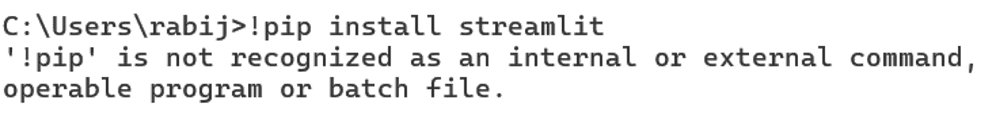
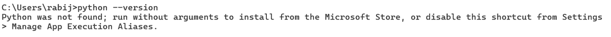
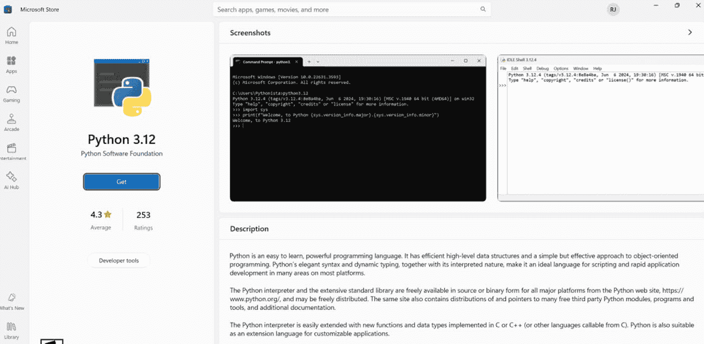
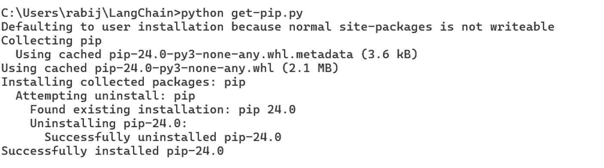
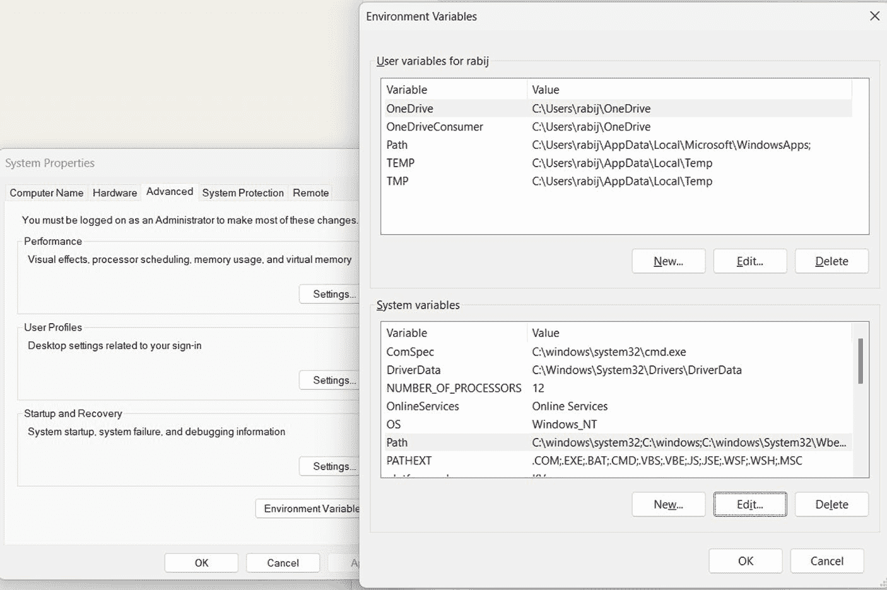
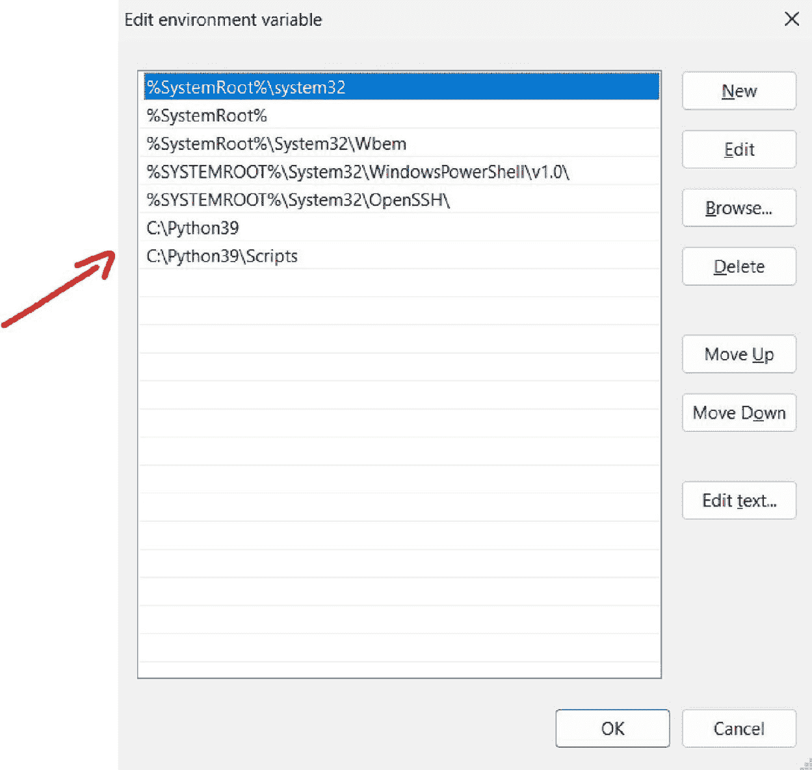

# 使用 Streamlit 构建和部署类 ChatGPT 应用

在本章中，我们将使用两个强大的工具，即 LangChain 和 Streamlit，来开发一个基于 LangChain 的类 ChatGPT UI 应用程序。

具体来说，我们将从 Jupyter Notebook 过渡到 Web 应用程序，以创建不仅功能完善，而且具有时尚 Web 界面、可投入生产环境的用户友好型应用。以下是你要做的工作的预览：

1. 设置开发环境
2. 使用 LangChain 构建核心问答功能
3. 使用 Streamlit 创建 Web 界面
4. 测试和完善你的应用程序

© Rabi Jay 2024  
R. Jay, *Generative AI Apps with LangChain and Python*,  
[`doi.org/10.1007/979-8-8688-0882-1_11`](https://doi.org/10.1007/979-8-8688-0882-1_11#DOI)

  


## 设置开发环境

让我们设置开发环境，以便在桌面环境中运行 Streamlit。

### 安装 Streamlit 库

确保你的 Python 环境中已安装 Streamlit。你可以通过在终端或命令提示符中运行以下命令来安装：

```
pip install streamlit
```

如果你尚未安装 `pip`，可能会看到类似以下的错误消息：

如果你已经安装了 Streamlit，可以跳过此步骤。

### 安装 Python

如果你的桌面环境中尚未安装 Python，可能会收到如下所示的错误：

该错误消息表明命令提示符无法识别 `python` 命令。这通常意味着要么未安装 Python，要么 Python 安装目录未添加到系统的 `PATH` 环境变量中。



要解决此问题，你可以尝试以下步骤：

1. **检查是否安装了 Python。**  
   - 打开一个新的命令提示符窗口。  
   - 输入 `python --version` 并按回车键。  
   - 如果 Python 安装正确，它将显示版本号。如果没有，你需要先安装 Python。  
   - 如下所示，从 Microsoft Store 安装 Python：

2. **安装 pip。**  
   - 如果你已安装 Python 但缺少 `pip`，可以从官方 pip 网站下载 `get-pip.py` 脚本：[`bootstrap.pypa.io/get-pip.py`](https://bootstrap.pypa.io/get-pip.py)。  
   - 将 `get-pip.py` 文件保存到计算机上的某个位置，例如 `C:\Users\abc\get-pip.py`。

   

   - 打开命令提示符窗口，使用 `cd` 命令导航到保存 `get-pip.py` 文件的目录。  
   - 运行以下命令来安装 `pip`：

   ```
   python get-pip.py
   ```

3. **将 Python 和 pip 添加到系统 PATH 中**，如下图所示。  
   - 打开“开始”菜单，搜索“环境变量”。  
   - 点击“编辑系统环境变量”。  
   - 在“系统属性”窗口中，点击“环境变量”按钮。  
   - 在“系统变量”下，向下滚动找到“Path”变量，然后点击“编辑”。  
   - 点击“新建”，添加 Python 安装目录的路径，通常为 `C:\Python39` 或类似路径。

   

   - 再次点击“新建”，添加 Python 安装目录中 Scripts 目录的路径，通常为 `C:\Python39\Scripts`。  
   - 点击“确定”保存更改。

   

4. **验证安装。**  
   - 打开一个新的命令提示符窗口。  
   - 输入 `pip --version` 并按回车键。  
   - 如果 `pip` 已安装且可访问，它将显示版本号。

完成这些步骤后，你应该能够在命令提示符中成功运行 `pip install streamlit` 命令。

如果仍然遇到问题，请确保你拥有安装软件包的必要权限，并且网络连接稳定。此外，你可以尝试右键单击命令提示符图标并选择“以管理员身份运行”，以管理员身份运行命令提示符。

### 安装所需依赖项

接下来，在运行代码之前，你必须确保已安装所需的依赖项（`streamlit`、`openai`、`langchain`、`pinecone`）。你可以使用 `pip` 安装它们：

```
pip install streamlit openai langchain pinecone-client langchain_community
```

完成这些更改并确保依赖项已安装后，你应该能够在桌面上运行代码。

如果仍然遇到问题，请确保已安装所需依赖项的最新版本。你可以使用以下命令更新它们：

```
pip install --upgrade langchain langchain_openai langchain_community openai streamlit pinecone-client
```

此外，请确保你安装了兼容版本的 Python（Python 3.7 或更高版本）。

## 构建 Streamlit LangChain UI 应用

现在你已在桌面上设置了开发环境，是时候开始真正的工作了，即构建实际的 Streamlit LangChain UI 应用。

### Streamlit 应用的组件

一个典型的 Streamlit 应用包含 `app.py` 文件，这是一个 Python 脚本，包含构建 Streamlit 应用程序的代码。它定义了 Streamlit 应用的结构、布局和功能。在我们的例子中，`app.py` 文件被命名为 `LangChainUI.py`。`LangChainUI.py` 文件是主入口点，你可以在其中导入必要的库，定义用户界面组件，并指定应用程序的逻辑和交互。

要运行此 Streamlit 应用程序，请在终端或命令提示符中使用 `streamlit run LangChainUI.py` 命令。

Streamlit 提供了广泛的组件和功能，你可以使用它们来构建交互式 Web 应用程序，包括小部件、图表、表格、地图等。`LangChainUI.py` 文件是定义和组织这些组件以创建所需应用程序的核心位置。

### 构建应用的步骤

以下是构建应用时涉及的一些步骤：

1. **首先，导入必要的库：**

   ```python
   import os
   import streamlit as st
   from langchain.chains import LLMChain
   from langchain.prompts import ChatPromptTemplate, HumanMessagePromptTemplate
   from langchain.chat_models import ChatOpenAI
   ```

   这些行导入了必要的库：`os` 用于环境变量，`streamlit` 用于 Web 界面，以及来自 `langchain` 的各种组件用于与语言模型交互。

2. **接下来，你必须设置 API 密钥：**

   ```python
   os.environ["OPENAI_API_KEY"] = "your_openai_api_key_here"
   ```

   这将 OpenAI API 密钥设置为环境变量，`ChatOpenAI` 模型将使用该密钥。

3. **Streamlit UI 设置：**

   ```python
   st.title("ChatGPT-like Q&A App")
   user_query = st.text_input("Enter your question:")
   ```

   在这里，你创建了应用的标题和用户问题的输入框。

4. **聊天历史初始化：**

   ```python
   if 'chat_history' not in st.session_state:
       st.session_state['chat_history'] = []
   ```

   然后，如果会话状态中不存在聊天历史，则初始化一个空的聊天历史。

5. **显示聊天历史：**

   ```python
   for chat in st.session_state['chat_history']:
       st.write(f"Q: {chat['question']}")
       st.write(f"A: {chat['answer']}")
       st.write("---")
   ```

   然后，你循环显示存储在聊天历史中的所有先前问题和答案。

6. **处理用户输入：**

   ```python
   if user_query and st.button("Submit"):
   ```

   你检查是否存在用户查询，并且是否点击了提交按钮。

7. **创建并使用语言模型：**

   ```python
   llm = ChatOpenAI(temperature=0.7, model_name='gpt-3.5-turbo')
   prompt = ChatPromptTemplate.from_messages([
       HumanMessagePromptTemplate.from_template("{query}")
   ])
   chain = LLMChain(llm=llm, prompt=prompt)
   response = chain.run(query=user_query)
   ```

   接下来，你创建一个 `ChatOpenAI` 模型的实例，设置一个提示模板，创建一个 `LLMChain`，并生成对用户查询的响应。

8. **更新并显示响应：**

   ```python
   st.session_state['chat_history'].append({"question": user_query, "answer": response})
   st.write("Answer:")
   st.write(response)
   ```

   你将新的问答对添加到聊天历史中，并显示响应。

9. **后备消息：**

   ```python
   else:
       st.write("Please enter a question and click Submit.")
   ```

   随后，如果未输入问题或未点击提交按钮，则显示一条消息。

最后，你创建了一个简单的基于 Web 的聊天界面，该界面使用 OpenAI GPT 模型生成对用户查询的响应，维护聊天历史，并显示所有交互。

### 代码中的缩进错误

有时，你可能会因为代码缩进不正确而收到错误。要解决此问题，请确保代码块的缩进在整个代码中保持一致。在 Python 中，缩进用于定义代码块，每个缩进级别应保持一致（通常每级 4 个空格）。

以下是代码应如何正确缩进的示例：


