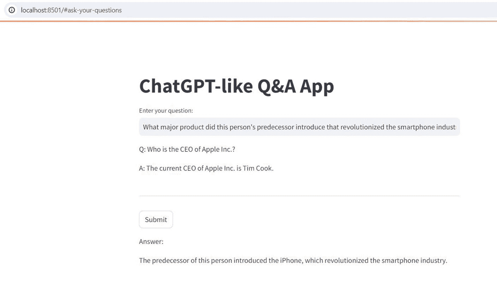

# 之前的代码...

```
if 'my-index' not in pc.list_indexes().indexes:
    pc.create_index(
        name='my-index',
        dimension=1536,
        metric='cosine'
    )
# 其余代码...
```

请确保 `pc.create_index()` 函数调用及其参数在 `if` 语句下正确缩进。缩进应与 `if` 语句的层级保持一致。

检查整个代码块的缩进，确保其前后一致。同一代码块内的每一行应具有相同的缩进级别。

修正缩进后，保存更改，并再次使用 Streamlit 运行 Python 脚本。

## 第 11 章 使用 Streamlit 构建和部署类 ChatGPT 应用

### 运行你的 Streamlit 应用

要运行你的 Streamlit 应用，请按照以下步骤操作：

- 打开终端或命令提示符。
- 使用 `cd` 命令导航到 `LangChainUI.py` 文件所在的目录。例如：

```
cd /path/to/your/app/directory
```

- 进入正确目录后，运行以下命令：

```
streamlit run LangChainUI.py
```

- 此命令将启动 Streamlit 服务器并运行你的 `LangChainUI.py` 文件。
- Streamlit 会提供一个 URL（通常为 `http://localhost:8501`），你可以在网页浏览器中打开该 URL 来查看并与你的 Streamlit 应用进行交互。

### 在网页浏览器中查看你的 Streamlit 应用

- 运行 `streamlit run LangChainUI.py` 命令后，Streamlit 会在命令提示符中显示一条消息，表明你的应用正在运行。
- 它会提供一个 URL（通常为 `http://localhost:8501`），你可以复制并粘贴到网页浏览器中，以查看并与你的 Streamlit 应用进行交互。
- 点击该 URL，或将其复制并粘贴到你常用的网页浏览器中。

### 与你的 Streamlit 应用进行交互

- 一旦你的 Streamlit 应用在网页浏览器中加载完成，你就可以根据 `LangChainUI.py` 文件中定义的组件和功能与之进行交互。
- 当你对 `LangChainUI.py` 文件进行更改时，Streamlit 会自动实时更新应用，从而实现快速迭代和开发。

### 停止 Streamlit 服务器（需要时）

- 要停止 Streamlit 服务器并退出应用，请返回你运行 `streamlit run LangChainUI.py` 命令的命令提示符。
- 按下 `Ctrl+C` 中断服务器并终止 Streamlit 应用。



### 测试应用

提出一个问题，你可能会看到类似这样的回答：

我问了第一个问题——“苹果公司的 CEO 是谁？”——答案很直接（截至 2024 年，蒂姆·库克是苹果公司的 CEO）。

第二个问题直接引用了第一个问题的答案，但没有明确提及人名。它还需要应用知道：(a) 所指的“这个人”是蒂姆·库克，(b) 蒂姆·库克的前任是史蒂夫·乔布斯，以及 (c) 所讨论的产品是 iPhone。

如果应用的记忆功能正常，它应该能够：

1. 正确回答第一个问题（蒂姆·库克）。
2. 理解第二个问题中的“这个人”指的是蒂姆·库克。
3. 回忆起蒂姆·库克的前任是史蒂夫·乔布斯。
4. 识别出 iPhone 是史蒂夫·乔布斯推出的革命性产品。

对第二个问题的正确回答将表明，应用在两个问题之间保持了上下文，并且能够将两者的信息联系起来，提供连贯的答案。

### 部署 LangChain 应用

我们来讨论部署 LangChain 应用的步骤。

#### 在系统上安装 Git

首先，你需要确保系统上已安装 Git：

1. **安装 Git**：以下是安装步骤。
   a. 访问 Git 官方网站：[`git-scm.com/download/win`](https://git-scm.com/download/win)
   b. 下载适用于 Windows 的安装程序。
   c. 运行安装程序并按照安装向导操作。除非你有特定需求，否则请使用默认设置。


