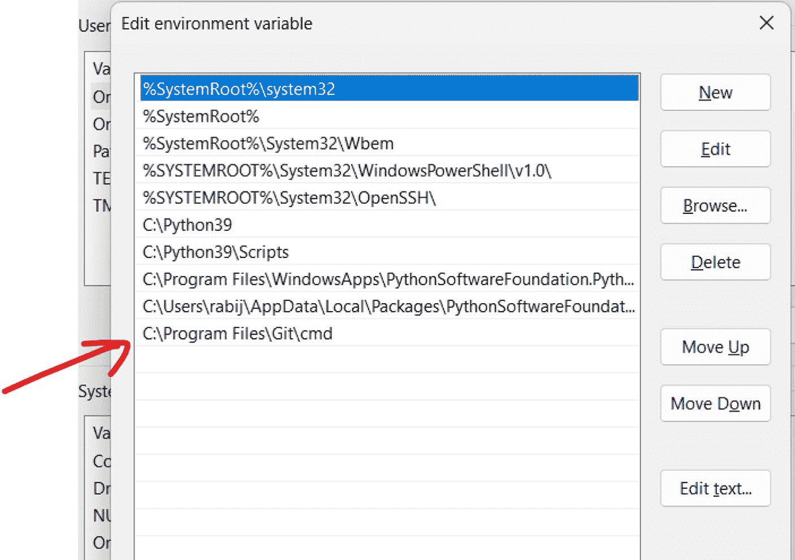
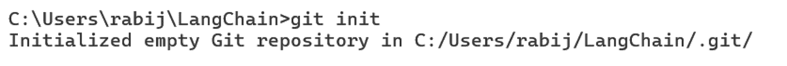

# 第 11 章 使用 Streamlit 构建和部署类 ChatGPT 应用

## 2. 将 Git 添加到 PATH 环境变量

安装完成后，Git 应会自动添加到系统的 PATH 环境变量中。但若未自动添加，可手动操作。

a. 右键点击“此电脑”或“我的电脑”，选择“属性”。
b. 点击“高级系统设置”。
c. 点击“环境变量”。
d. 在“系统变量”下找到并选中“Path”变量，然后点击“编辑”。



e. 点击“新建”，并添加 Git 的安装路径。通常为 `C:\Program Files\Git\cmd`。
f. 点击“确定”关闭所有对话框。

## 3. 重启命令提示符

安装 Git 或修改`PATH`后，需关闭并重新打开命令提示符，以使更改生效。

## 4. 验证安装

打开新的命令提示符，输入 `git –version`。




若一切设置正确，将显示已安装的 Git 版本，如下图所示。

## 5. 尝试 Git Init

现在，你应该能在项目目录中成功运行 `git init` 而不会出现任何错误。

#### 设置身份信息

Git 使用你的身份信息将提交与作者关联。你需要使用姓名和电子邮件地址配置 Git。具体操作如下：

##### 1. 设置电子邮件地址

运行以下命令，将 `your.email@example.com` 替换为你的实际电子邮件地址。

```
git config --global user.email your.email@example.com
```

##### 2. 设置姓名

运行此命令，将“Your Name”替换为你的实际姓名。

```
git config --global user.name "Your Name"
```

##### 3. 验证设置

可通过运行 `git config –list` 检查设置。

这将显示所有 Git 配置，包括刚设置的电子邮件和姓名。

##### 4. 再次尝试提交

设置电子邮件和姓名后，再次尝试提交命令。

```
git commit -m "Streamlit 问答应用的初始提交"
```

#### 重要说明

- `--global` 标志会为计算机上的所有 Git 仓库设置此配置。若需为不同项目使用不同设置，可省略 `--global`，并在特定仓库内运行这些命令。
- 若计划将提交推送到 GitHub，请确保使用的电子邮件地址与 GitHub 账户关联。
- 若担心隐私问题，GitHub 提供了隐藏电子邮件地址的选项。你可以在 Git 配置中使用 GitHub 提供的无回复电子邮件地址。

完成这些步骤后，你应该能够成功提交更改，而不会出现任何与身份相关的错误。请记住，这是一次性设置，除非你日后需要更改 Git 身份。

## 将 OpenAI 密钥设置为环境变量

你还应为本地开发设置环境变量，以保护 API 密钥等敏感信息的安全。以下是更详细的操作说明：

### 1. 针对 Windows 系统

#### a. 临时设置（仅当前会话有效）

- 打开命令提示符。
- 输入：`set OPENAI_API_KEY=your_api_key_here`

#### b. 永久设置

- 在开始菜单中搜索“环境变量”。
- 点击“编辑系统环境变量”。
- 点击“环境变量”。
- 在“用户变量”下点击“新建”。
- 变量名：`OPENAI_API_KEY`
- 变量值：`your_api_key_here`
- 点击“确定”保存。

### 2. 针对 macOS/Linux 系统

#### a. 临时设置（仅当前会话有效）

- 打开终端。
- 输入：`export OPENAI_API_KEY=your_api_key_here`

#### b. 永久设置

- 打开你的 Shell 配置文件（例如 `~/.bash_profile`、`~/.zshrc`）。
- 添加一行：`export OPENAI_API_KEY=your_api_key_here`
- 保存文件，然后重启终端或运行 `source ~/.bash_profile`（或相应文件）。


