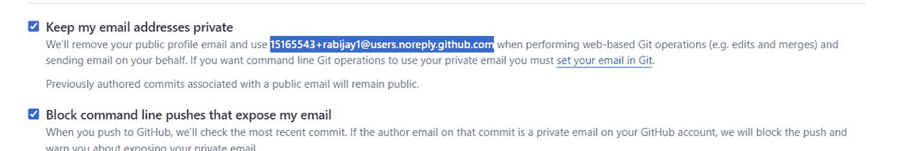

# 第 11 章 使用 Streamlit 构建和部署类 ChatGPT 应用

### 3. 使用`.env`文件

a. 在项目目录中创建一个名为`.env`的文件。

b. 在文件中添加以下内容：

```
OPENAI_API_KEY=your_api_key_here
```

c. 安装`python-dotenv`包：`pip install python-dotenv`

d. 在 Python 代码中加载环境变量：

```python
from dotenv import load_dotenv
import os

load_dotenv()
openai_api_key = os.getenv("OPENAI_API_KEY")
```

### 4. 在代码中访问环境变量

设置好环境变量后，你可以像这样在 Python 代码中访问它：

```python
import os
openai_api_key = os.getenv("OPENAI_API_KEY")
```

### 5. 使用环境变量的好处

- **安全性**：你的 API 密钥不会硬编码在源代码中。
- **灵活性**：无需修改代码即可轻松更改。
- **可移植性**：适用于不同环境（开发、预发布、生产）。

### 6. 最佳实践

- 切勿将`.env`文件提交到版本控制。
- 将`.env`添加到你的`.gitignore`文件中。
- 为其他开发者提供一个包含占位值的`.env.example`文件。

通过将 API 密钥设置为环境变量，你可以在本地开发时避免敏感信息泄露的风险。

请注意，在部署应用程序时，你将使用部署平台的密钥管理系统（如 Streamlit Cloud 的密钥管理功能）来安全地存储和访问生产环境中的 API 密钥。

### 解决仓库中的敏感信息问题

如果你发现仓库中仍存在敏感信息问题，可以按照以下步骤操作：

1. `.env`文件
   - 创建一个名为`.env.txt`的文件，但实际应为`.env`（不带`.txt`扩展名）。

2. 从 Git 跟踪中移除`.env`文件：
   ```
   git rm --cached .env.txt
   git rm --cached .env
   ```

3. 如有需要，将`.env.txt`重命名为`.env`：
   ```
   ren .env.txt .env
   ```

4. 更新`.gitignore`。确保你的`.gitignore`文件包含：
   ```
   .env
   *.pyc
   __pycache__/
   ```

5. 从其他文件中移除 API 密钥：
   - 打开`LangChainUI.py`，将硬编码的 API 密钥替换为：
     ```python
     import os
     from dotenv import load_dotenv
     load_dotenv()
     openai_api_key = os.getenv("OPENAI_API_KEY")
     ```

6. 提交这些更改：
   ```
   git add .gitignore
   git add LangChainUI.py "LangChainUI - Copy.py"
   git commit -m "移除 API 密钥并更新.gitignore"
   ```

7. 强制推送更改：
   ```
   git push -u origin main --force
   ```

8. 清理 Git 历史。如果 API 密钥仍存在于 Git 历史中，你可能需要清理它：
   ```
   git filter-branch --force --index-filter "git rm --cached --ignore-unmatch .env.txt .env LangChainUI.py 'LangChainUI - Copy.py'" --prune-empty --tag-name-filter cat -- --all
   ```

然后再次强制推送：
```
git push origin --force --all
```

请记住，清理 Git 历史后，任何克隆过你仓库的人都需要重新克隆或执行强制拉取。

这些步骤应该能从你的仓库中移除 API 密钥，并防止其被推送到 GitHub。你应始终谨慎处理敏感信息，并在推送前仔细检查你的提交。

### 防止电子邮件隐私相关问题

有时，你可能会收到与隐私相关的错误消息，提示 GitHub 因电子邮件隐私限制而阻止推送。

GitHub 可能正在通过不允许将包含私人电子邮件地址的提交推送到公共仓库来保护你的隐私。以下是解决此问题的方法：

1. 配置 Git 使用 GitHub 提供的无回复电子邮件地址：
   a. 登录你的 GitHub 账户。
   b. 进入设置 ➤ 电子邮件。
   c. 查找类似“保持我的电子邮件地址私密。在执行基于 Web 的 Git 操作以及代表你发送电子邮件时，我们将使用`yourusername@users.noreply.github.com`”的段落。
   d. 复制此电子邮件地址（它应该类似于`yourusername@users.noreply.github.com`）。




