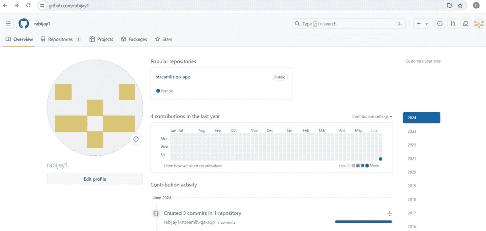
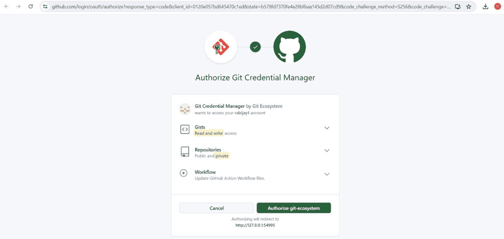
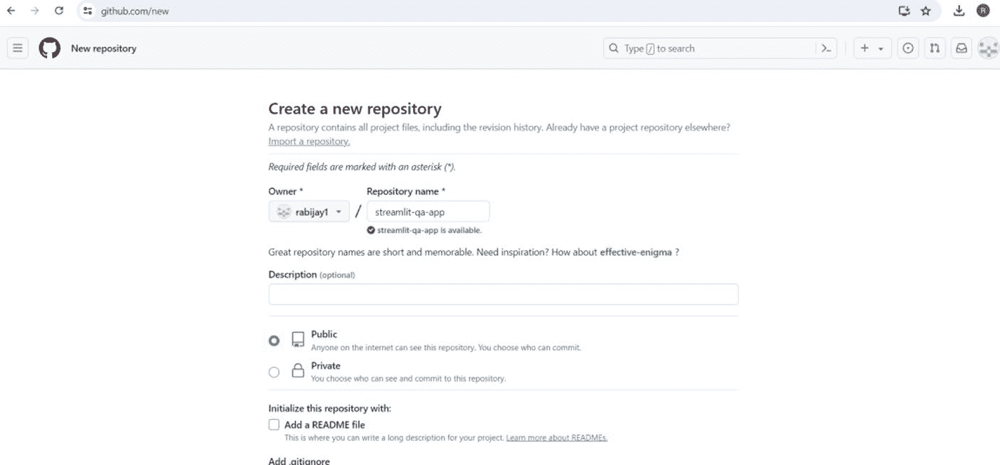

# 第 11 章 使用 Streamlit 构建和部署类 ChatGPT 应用

2. 在 Git 配置中设置此邮箱。打开命令提示符并运行：

`git config --global user.email yourusername@users.noreply.github.com`

将 `yourusername@users.noreply.github.com` 替换为你在 GitHub 设置中找到的实际无回复邮箱地址。

3. 修改上一次提交以使用新邮箱：

`git commit --amend --reset-author`

这将打开你的默认文本编辑器。直接保存并关闭编辑器，无需做任何更改。

4. 再次强制推送：

`git push origin --force --all`

或者，如果你不介意公开提交邮箱：

1. 前往 GitHub 设置 ➤ 邮箱。
2. 取消勾选“保持我的邮箱地址私密”复选框，如下所示。
3. 确保你的公开提交邮箱设置为你愿意公开的邮箱。

完成上述任一更改后，再次尝试推送你的更改。这应该能解决邮箱隐私限制问题。

请记住，如果你选择使用无回复邮箱，则需要在所有 Git 提交中使用此邮箱，以避免将来出现此问题。如果你在共享机器或多个项目上工作，你可能希望按仓库级别而非全局级别进行设置。

`git config user.email yourusername@users.noreply.github.com`

在每个希望使用无回复邮箱的仓库中运行此命令。

## 在 GitHub 中部署应用

以下是在 GitHub 中部署应用的步骤：

1. 首先，如果尚未创建，请在 GitHub 上创建一个新仓库。假设你将其命名为 `streamlit-qa-app`。
2. 现在，根据你的信息修改以下命令：

```
git remote add origin https://github.com/你的实际用户名/streamlit-qa-app.git
git branch -M main
git push -u origin main
```

以下是每条命令的作用：

- 第一条命令添加一个名为 `origin` 的远程仓库，指向你的 GitHub 仓库。
- 第二条命令将当前分支重命名为 `main`（如果尚未命名为此）。
- 第三条命令将你的本地 `main` 分支推送到 `origin` 远程仓库，并设置跟踪该远程分支。



运行这些命令后，你的本地仓库将连接到你的 GitHub 仓库，并且你的代码将被推送到 GitHub，如下所示。

请记住，每个仓库只需运行一次 `git remote add` 命令。对于后续推送，你可以直接使用：

```
git remote add origin https://github.com/<你的用户名>/streamlit-qa-app.git
git branch -M main
git push -u origin main
```

### 授予 GitHub 访问权限

请记住，作为将应用部署到 GitHub 的一部分，你可能需要向 GitHub 授予适当的权限。





在你看不到仓库或无法访问仓库的情况下，应按照以下步骤解决问题：

1. 验证仓库是否存在：
   - 前往 [`github.com/<你的用户名>/streamlit-qa-app`](https://github.com/rabijay1/streamlit-qa-app)。
   - 如果看到 404 错误，说明仓库不存在。

2. 如果仓库不存在：
   - 前往 GitHub 并创建一个名为 `streamlit-qa-app` 的新仓库。
   - 确保它位于你的账户下（你的用户名）。
   - 如果你要推送现有仓库，请不要使用 README、`.gitignore` 或许可证初始化仓库。

3. 检查你的远程 URL。运行此命令以验证远程 URL：

`git remote -v`

它应显示：

```
origin https://github.com/你的用户名/streamlit-qa-app.git (fetch)
origin https://github.com/你的用户名/streamlit-qa-app.git (push)
```

4. 如果 URL 不正确，请使用以下命令更新：

`git remote set-url origin https://github.com/你的用户名/streamlit-qa-app.git`

5. 如果看到此错误，请确保你已登录。


`message`: “请在浏览器中完成身份验证。”

