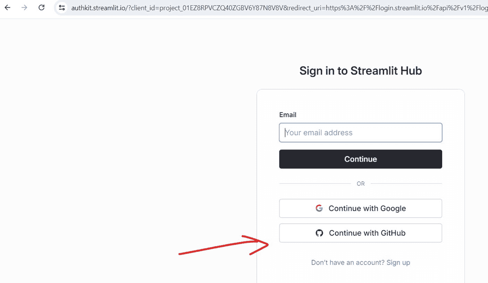
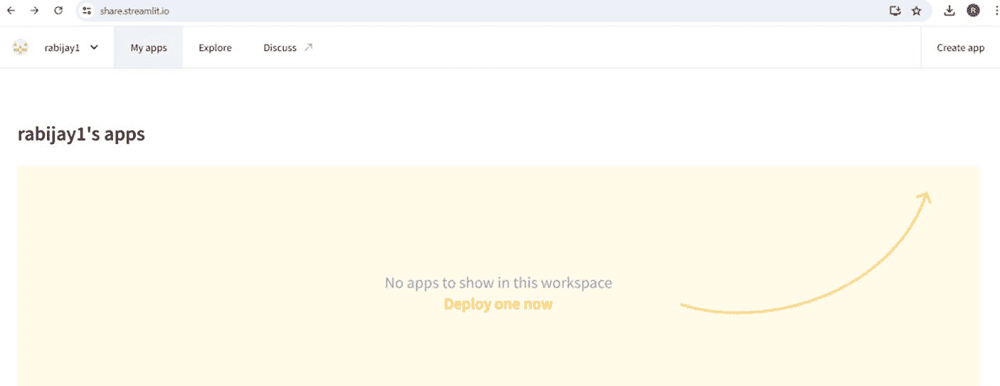

# 第 11 章 使用 Streamlit 构建和部署类 ChatGPT 应用

6.  检查你的 GitHub 账户：

    - 确保你使用的是正确的 GitHub 账户（`your_user_name`）。

    - 确认你拥有推送到此仓库的必要权限。

7.  再次尝试推送：

    ```
    git push -u origin main
    ```

8.  创建新的个人访问令牌：

    - 前往 GitHub 设置 ➤ 开发者设置 ➤ 个人访问令牌。

    - 生成一个具有`repo`权限的新令牌。

    - 推送时使用此令牌作为密码。

9.  使用 HTTPS 替代 SSH。如果你正在使用 SSH URL，请尝试改用 HTTPS URL：

    ```
    git remote set-url origin https://github.com/your_user_name/streamlit-qa-app.git
    ```

10. 检查你的网络连接和防火墙设置。

## 在 Streamlit Cloud 中部署

我们来讨论使用 Streamlit Cloud 进行部署的步骤：





1.  前往[`streamlit.io/cloud`](https://streamlit.io/cloud)并使用你的 GitHub 账户登录，如下所示。

2.  点击“New app”。

3.  选择你的 GitHub 仓库、分支（通常为“main”）以及主 Python 文件（例如`LangChainUI.py`）。

4.  点击“Deploy”。

恭喜你，如果一切顺利，你应该已经成功将应用部署到 Streamlit Cloud，供他人访问。

## 其他云部署选项

我们来谈谈将应用部署到云端的其他方式：

1.  **LangServe**：这是一个专为部署 LangChain 应用设计的工具。它能为你的链和代理提供便捷的 API 创建功能，以及用于测试端点的用户界面。

    使用 LangServe 时，通常需要：

    - 通过`pip install langserve`安装它

    - 在 Python 文件中定义你的链或代理

    - 创建一个 FastAPI 应用，并将你的链添加为路由

    - 使用`uvicorn your_app:app --reload`运行你的服务器

    如果你正在围绕 LangChain 组件构建 API，LangServe 尤其有用。它能让你轻松地将链和代理暴露为 API 端点，这在将 LangChain 应用集成到更大系统或应用中时非常方便。

2.  **Heroku**：这通常是我快速部署的首选。它用户友好，且与 Python 应用配合良好。以下是简要步骤：

    - 首先，注册一个 Heroku 账户。

    - 安装 Heroku CLI。

    - 在项目目录中创建一个`Procfile`，内容为：`web: streamlit run your_app.py`。

    - 运行`heroku create your-app-name`。

    - 使用`git push heroku main`推送代码。

3.  **AWS Elastic Beanstalk**：如果你在寻找更强大的方案，这是一个可靠的选择。它稍微复杂一些，但扩展性很好。你需要：

    - 设置一个 AWS 账户

    - 安装 AWS CLI 和 EB CLI

    - 使用`eb init`初始化你的 EB 环境

    - 使用`eb create`创建一个环境

    - 使用`eb deploy`进行部署

4.  **Google Cloud Run**：如果你熟悉容器，这是个不错的选择。要点如下：

    - 为你的应用创建一个`Dockerfile`。

    - 构建你的容器镜像。

    - 将其推送到 Google Container Registry。

    - 使用 Google Cloud Console 或`gcloud` CLI 部署到 Cloud Run。

5.  **DigitalOcean App Platform**：我喜欢它的简洁性。在复杂度上，它介于 Heroku 和 AWS 之间：

    - 将你的 GitHub 仓库连接到 DigitalOcean。

    - 选择你的项目和分支。

    - 选择你的资源计划。

    - 点击部署！

6.  **Streamlit Cloud**：你刚刚已经使用 Streamlit Cloud 完成了部署。

## 请记住

每个选项都有其优缺点。Heroku 和 Streamlit Cloud 非常适合快速上手。AWS 和 Google Cloud 提供更多控制和可扩展性，但学习曲线更陡峭。DigitalOcean 则介于两者之间。

我的建议是？从 Heroku 或 Streamlit 这类简单的方案开始。