# 1. 深度学习与 GPU 加速简介

## 1.1 简介

通过使用具有多层的人工神经网络来分析和解释数据中的复杂模式，深度学习已经成为一种变革性技术。正如在几篇备受推崇的出版物中所讨论的，该领域由于计算能力的增强和大数据集的获取而取得了显著进展。关键进展，如卷积神经网络和循环神经网络，在图像处理、语音识别和自然语言理解方面取得了突破。这些架构能够有效地处理结构化和序列数据，这对于现代人工智能应用的成功至关重要。

深度学习模型的架构灵感来源于人脑，其中相互连接的神经元以分层的方式处理信息。神经计算的基本原理，包括随机梯度下降和反向传播等优化技术，已在成熟的文献中得到了广泛研究。这些方法允许网络迭代地调整其参数，最小化错误并提高性能。此外，ReLU 和 softmax 等激活函数在确定神经元激活和分类任务中起着至关重要的作用，使深度学习模型能够做出精确而有意义的预测。

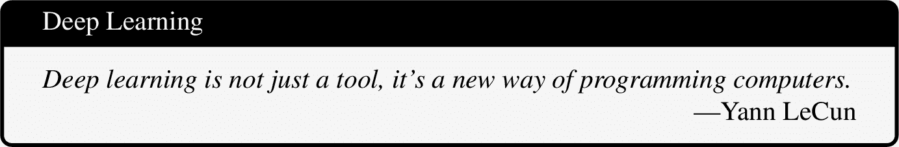

深度学习的影响跨越多个行业，包括医疗保健、自主系统和机器人技术。基础书籍的研究强调了它在医学成像、疾病预测以及自动驾驶汽车中的实时决策中的作用。此外，它与强化学习的结合促进了自适应机器人和智能自动化的进步。专用硬件，如 GPU 和 TPU 的持续发展，进一步加速了深度学习研究，巩固了其在人工智能未来中的驱动力量地位。

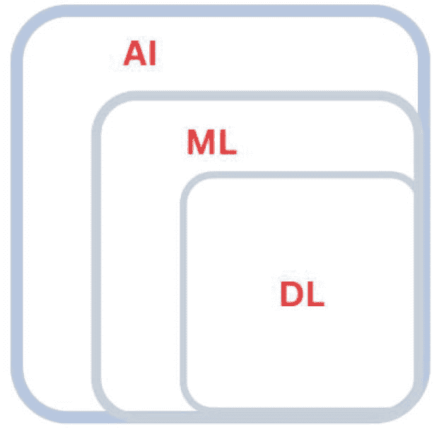

图 1.1

一个由三个嵌套的正方形组成的图，表示人工智能（AI）、机器学习（ML）和深度学习（DL）之间的关系。最大的正方形标有“AI”，代表人工智能，中间的正方形标有“ML”，代表机器学习，最小的正方形标有“DL”，代表深度学习。这说明了深度学习是机器学习的一个子集，而机器学习又是人工智能的一个子集。

深度学习模型在处理复杂抽象时高度灵活且以目标为导向。虽然大多数深度学习架构基于人工神经网络（ANNs），尤其是卷积神经网络（CNNs），但其他方法也做出了重大贡献。深度信念网络、生成模型、命题逻辑框架和玻尔兹曼机各自在增强深度学习系统功能方面发挥作用（图 1.1）。深度学习已经彻底改变了人工智能和计算机视觉，实现了超越传统方法的最新对象检测技术。正如权威文献中广泛讨论的那样，深度学习算法能够准确识别和定位图像中的对象，其应用范围从人脸和行人检测到骨骼追踪。这些进步是通过深度神经网络架构实现的，这些架构能够高效地处理大量数据。

除了计算机视觉之外，深度学习通过增强医学成像、疾病诊断和预测分析，对医疗保健产生了深远的影响。领先文献强调了它分析大型数据集中复杂模式的能力如何提高了患者护理和治疗计划。此外，由深度学习驱动的大数据分析通过揭示隐藏模式、预测市场趋势和优化决策过程，改变了行业。随着其融入各个领域，深度学习继续成为智能自动化和数据驱动创新的驱动力。

深度学习是一个快速发展的领域，它整合了各行业、商业智能和医疗保健方面的进步。正如基础文献所强调的，它与优化技术、网络物理系统和人工智能紧密相连，形成一个相互关联的技术生态系统。新兴趋势，如超自动化、人工智能安全、人机增强和自主系统，展示了深度学习在现代创新中日益扩大的作用。这些发展凸显了它在塑造智能自动化、预测分析和决策系统方面的日益重要性，这些系统应用于各种应用。

尽管之前对深度学习在常识推理方面的局限性的怀疑，但领先的研究强调其通过混合、跨学科和协作方法持续进化。学者们认识到主动学习、终身学习和多模态方法对于增强机器智能的重要性。深度学习在医疗诊断、自主系统和关于隐私和安全的道德 AI 框架中的应用预计将推动未来的进步。

权威文本还讨论了深度学习如何促进开放域对话系统、多任务学习和机器人技术，为更复杂的 AI 驱动解决方案铺平了道路。该领域的未来在于其解决复杂推理挑战的能力，同时保持道德考量，确保其在技术、工业和社会领域的广泛影响。

### 1.1.1 历史背景

深度学习是人工智能中机器学习的一个专门分支，经过数十年的研究和创新而发展起来。基础文本强调了其起源于 1943 年，当时早期神经网络模型被开发出来以模拟人类认知过程。深度学习的发展历程被一系列重大里程碑所标记，包括人工神经网络的引入、感知器模型以及多层学习算法的进步。这些发展奠定了现代深度学习技术的基础，使机器能够处理大量数据并学习复杂模式。

深度学习的历史突破在权威资料中得到了广泛记录，强调了诸如反向传播、循环神经网络（RNNs）和卷积神经网络（CNNs）的发展等关键贡献。2006 年深度信念网络的引入以及大规模数据集如 ImageNet 的兴起进一步加速了深度学习研究。2014 年提出的生成对抗网络（GANs）和 2017-2019 年间基于 transformer 的模型的兴起彻底改变了自然语言处理（NLP）和图像生成。

在 2020 年至 2025 年之间，深度学习在 AI 驱动应用中继续取得突破性进展。BERT 和 GPT 等 transformer 架构的广泛应用重新定义了 NLP，使得高度复杂的聊天机器人、自动翻译和内容生成成为可能。多模态 AI 系统的引入使得模型能够整合文本、视觉和语音处理，显著提高了人机交互。强化学习的进步导致了更多自主系统的出现，特别是在机器人和自我学习 AI 代理方面。此外，基于深度学习的药物发现和个性化医疗的突破改变了医疗保健，提供了精确的诊断和治疗解决方案。

随着深度学习的扩展，研究重点转向提高模型效率、解决伦理问题并使人工智能系统更具可解释性。人工智能监管框架的出现确保了负责任的人工智能部署，而节能深度学习模型的创新降低了计算成本。到 2025 年，深度学习继续是人工智能的主导力量，影响着行业、研究和社会进步，并在可解释性、适应性和实际应用方面持续改进。

### 1.1.2 深度学习应用

深度学习通过使机器能够处理大量数据、识别复杂模式和做出智能决策，已经彻底改变了众多领域。正如在权威书籍中广泛讨论的那样，其应用跨越了多个领域，改变了行业并提升了技术进步。

深度学习最显著的应用之一是计算机视觉，其中卷积神经网络（CNNs）推动了目标检测、图像分类和面部识别。这些技术在自动驾驶汽车、安全监控和医学成像中得到广泛应用。在医疗保健领域，深度学习使疾病诊断、医学图像分析和药物发现成为可能，显著提高了患者预后。先进的深度神经网络通过精确的图像分析帮助检测癌症、视网膜疾病和神经性疾病。

深度学习在自然语言处理（NLP）中也发挥了关键作用，基于转换器的模型改善了机器翻译、情感分析和自动文本生成。这导致了复杂人工智能助手的开发、实时语言翻译和智能客户支持系统的出现。在自主系统和机器人领域，深度强化学习促进了自动驾驶汽车、无人机导航和机器人流程自动化，使机器能够学习和适应动态环境。

另一个关键领域是金融和商业智能，其中深度学习算法增强了欺诈检测、算法交易和风险评估。这些模型分析大量的金融数据集以预测市场趋势、检测异常并优化投资策略。在网络安全领域，深度学习通过实时识别复杂的攻击模式，提高了威胁检测、恶意软件分析和入侵预防。

在 2020 年至 2025 年之间，深度学习继续其快速演变，扩展到多模态人工智能系统，这些系统集成了视觉、文本和语音处理，以实现更无缝的人机交互。在医学领域，由深度学习驱动的个性化治疗方案和人工智能驱动的药物发现平台取得了显著进展，加速了新药的开发。自动驾驶交通也取得了实质性进展，深度学习模型优化了自动驾驶汽车的实时决策，减少了事故，并改善了城市流动性。

在生成式人工智能中，深度学习模型变得更加复杂，能够生成高度逼真的图像、视频和模拟。元宇宙和增强现实（AR）应用利用深度学习提供沉浸式体验，创建逼真的虚拟形象、手势识别和交互式数字环境。气候科学和环境可持续性也从深度学习中受益，由人工智能驱动的气候模型改善了天气预报、灾害响应策略和碳足迹减少。深度学习在可解释性和效率方面取得了显著进步，解决了与道德人工智能、偏见减少和能源消耗相关的担忧。人工智能治理和监管框架已经发展，以确保负责任的人工智能部署，促进自动化系统中的信任和问责制。正如基础文献所强调的，深度学习仍然是技术进步的驱动力，持续扩大其应用范围并重塑全球产业。图 1.2 展示了少数利用深度学习实现的突出行业。

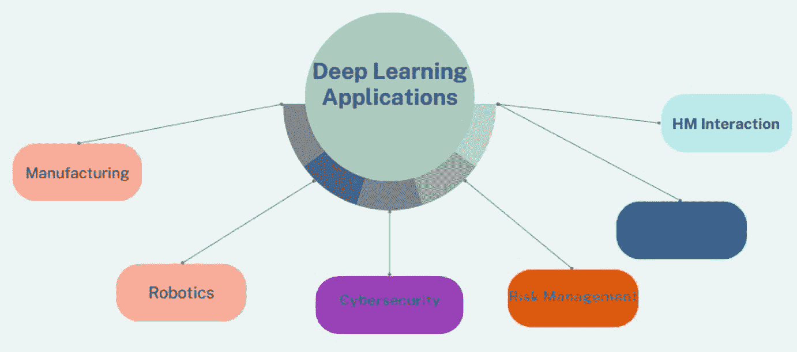

图 1.2

展示深度学习各种应用的图。中心圆圈标注为“深度学习应用”，连接到六个周边区域：制造、机器人技术、网络安全、风险管理、可持续性和人机交互。每个区域用不同的颜色表示

### 1.1.3 深度学习架构

#### 1.1.3.1 深度神经网络

深度神经网络是浅层神经网络的扩展，其特点是存在多个隐藏层。隐藏层中的每个神经元都与几个其他神经元相连，每个连接都分配了一个权重。这些权重决定了某个神经元的激活对另一个神经元的影响程度，这在从数据中学习模式中起着至关重要的作用。

深度学习中“深度”一词源于存在多个隐藏层，这增强了网络捕捉数据中复杂关系和层次特征的能力。深度神经网络的有效性在很大程度上取决于隐藏层数量的适当选择，这取决于问题的复杂性和数据集的大小。增加深度可以提高性能，但也需要仔细调整以避免过拟合。

图 1.3 展示了一个深度神经网络（DNN）架构，包括输入层、多个隐藏层和输出层。每个神经元用一个彩色节点表示，不同的颜色区分了不同的层。每一层的神经元均匀分布，并与下一层完全连接，这些连接通过边来可视化。布局确保了清晰的排列，描绘了从输入到输出的数据层次流动。层标签和标题进一步增强了可解释性，使该图成为深度神经网络结构的直观表示。

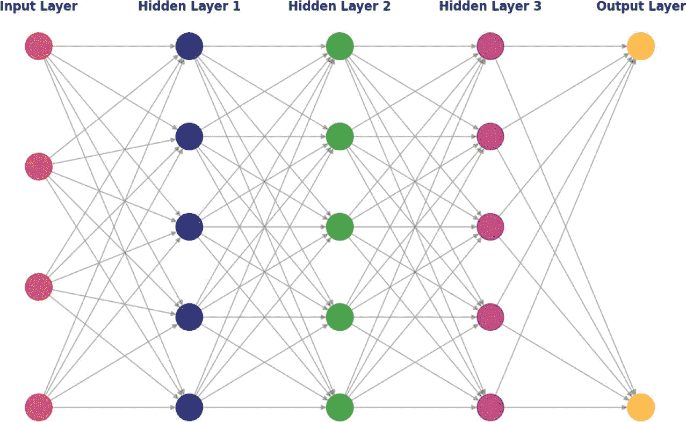

图 1.3

一个具有五层的神经网络图。左侧的输入层有三个红色节点。随后是三个隐藏层：第一个有三个蓝色节点，第二个有三个绿色节点，第三个有三个紫色节点。右侧的输出层有一个黄色节点。箭头指示相邻层之间节点的连接，说明了信息在网络中的流动。

### 1.1.4 线性回归作为单层神经网络

图 1.4 展示了线性回归作为一个单层神经网络，其中每个输入特征在输入层中用一个神经元表示，所有输入都直接连接到一个输出神经元。输出神经元与第二个输入神经元使用基于网格的布局对齐，确保了清晰度和更好的可视化。连接表示了输入特征如何以全连接的方式影响输出，强调了神经网络框架中线性回归的基本结构。

线性回归，尽管早于计算神经科学，但为人工神经元提供了一个基础模型，正如麦克洛奇和皮茨所探讨的那样。生物神经元，神经系统的基本单元，通过大脑、脊髓和周围神经的电化学信号传输信息。在结构上，它包括树突（输入端）、一个细胞核（CPU）、一个轴突（输出线）和轴突末端（输出连接），这些结构通过突触促进通信。神经元根据其功能和位置的不同，形状和大小各异，形成相互连接的网络。它们被分类为感觉神经元和运动神经元，如图 1.5 所示，突出了它们在信号传输和响应机制中的作用。此实现从零开始构建一个简单的前馈神经网络，使用 NumPy 进行回归。该网络由一个具有一个特征的输入层、一个使用 ReLU 激活的十个神经元的隐藏层和一个使用线性激活函数的单个神经元的输出层组成。均方误差（MSE）损失函数用于衡量模型的性能，并应用梯度下降进行参数优化。

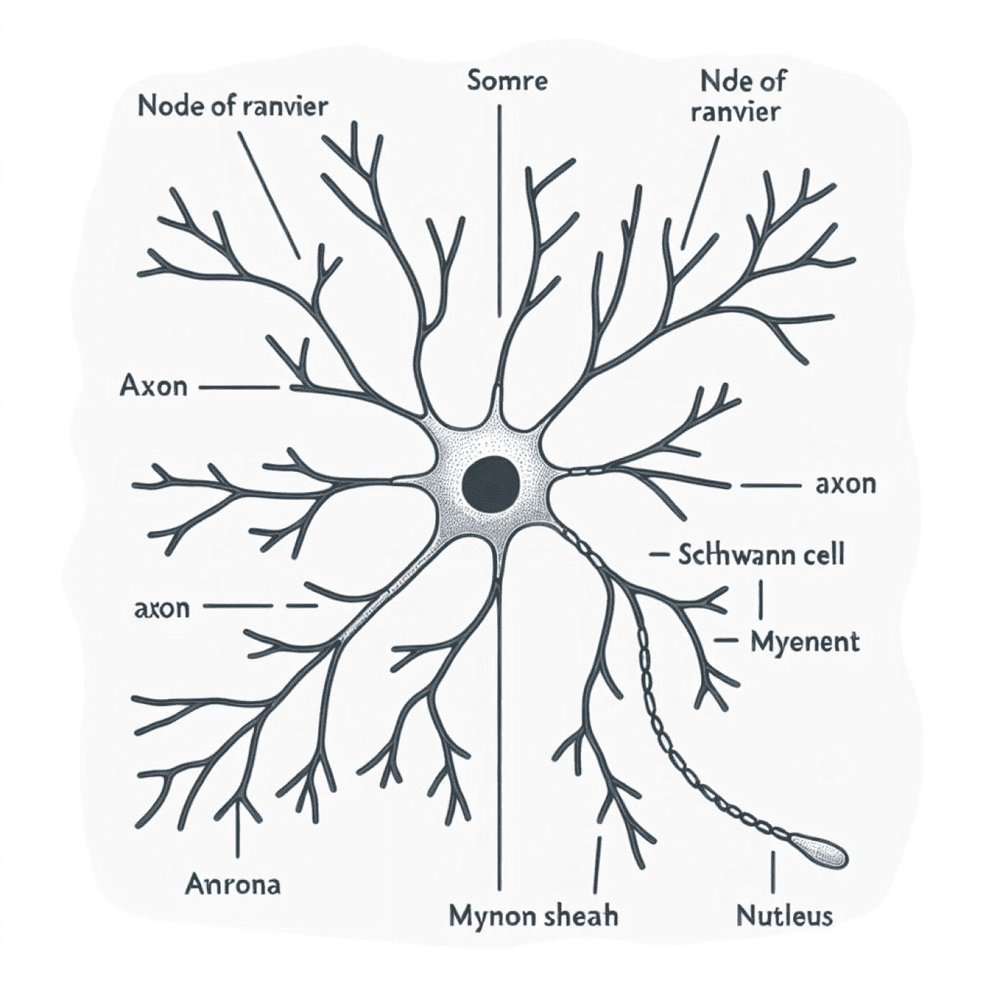

图 1.5

一张标注了各个部分的神经元图。中央细胞体标记为“Somre”，有分支的树突。轴突上标有两个“Node of ranvier”标签，轴突从细胞体延伸出来。轴突在多个地方也被标注。沿轴突标注了“Schwann cell”和“Myenent”，在末端是“Nutleus”。标签包括像“Anrona”和“Mynon sheah”这样的拼写错误。

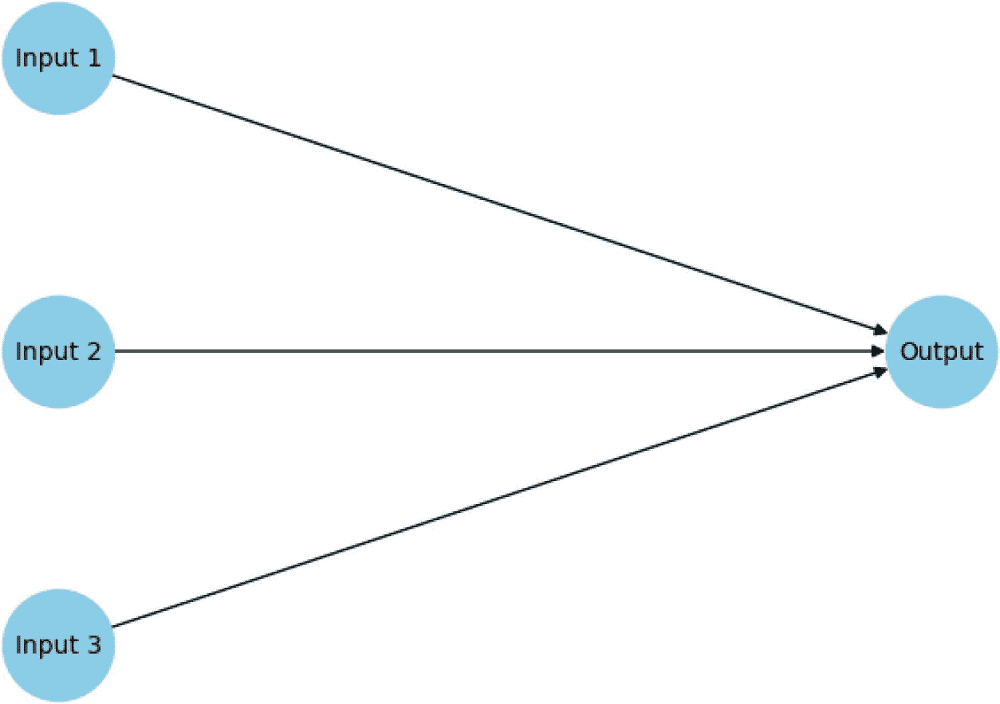

图 1.4

一张显示三个输入合并成一个输出的图。输入 1、输入 2 和输入 3 在左侧用圆圈表示，每个圆圈都有一个箭头指向右侧标记为输出的圆圈，表示合并过程

合成数据集是为了模拟现实世界的回归数据而生成的。目标变量遵循函数$$y = 4 + 3X + noise$$，其中添加了噪声以引入随机性。这有助于神经网络学习一个可推广的模式，而不仅仅是简单地记住输入输出映射。

前向传递通过矩阵乘法计算激活。输入通过隐藏层传递，其中 ReLU 激活函数引入非线性。转换后的值然后移动到输出层，该层提供连续的数值预测。均方误差损失函数量化了预测与实际值之间的偏差程度。

反向传递应用梯度下降进行权重和偏置更新。梯度通过反向传播计算，这确定了每个参数对误差的贡献程度。然后，权重和偏置在最小化损失的方向上调整。学习率控制这些更新的步长。

模型训练了 500 个时期，每个步骤都记录损失。周期性更新将损失打印出来以跟踪改进。训练后，学习到的回归函数与损失曲线一起可视化，该曲线显示了误差随时间的变化。最终训练好的神经网络成功模拟了输入和输出之间的关系，展示了深度学习技术如何应用于回归问题。


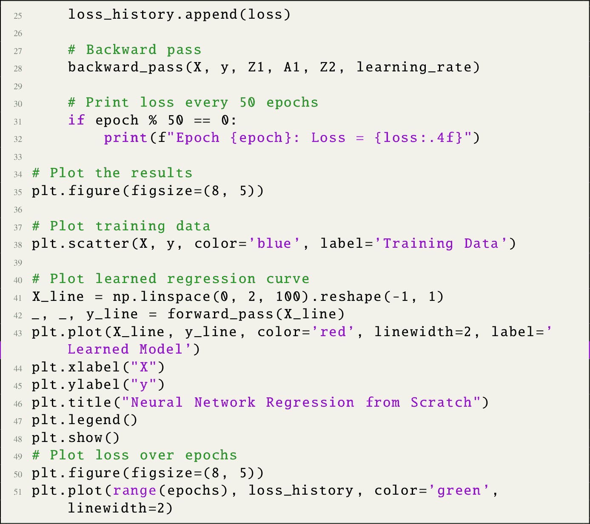

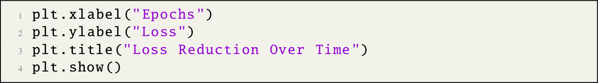

输出图像提供了对图 1.6 和 1.7 中给出的神经网络回归模型性能的洞察。第一幅图像展示了训练好的模型如何很好地拟合给定的数据集，其中蓝色散点代表实际训练数据，红色线条描绘了学习的回归函数。如果红色线条紧密跟随蓝色点的分布，则表明模型已成功捕捉到潜在的模式。第二幅图像展示了 epoch 中的损失减少，显示了均方误差（MSE）随着训练的进行而降低。x 轴代表训练迭代次数，而 y 轴代表预测误差。绿色损失曲线的稳定下降表明模型正在有效地学习，随着时间的推移，其权重正在优化以最小化预测误差。

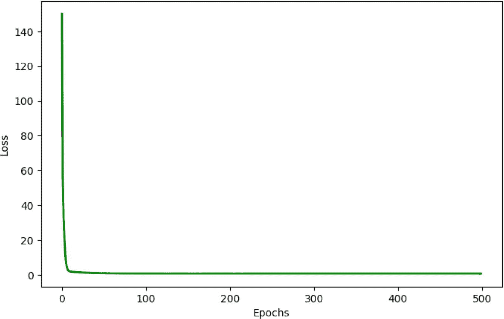

图 1.7

一条折线图显示了在 500 个 epoch 中损失的下降。垂直轴表示损失，范围从 0 到 140，而水平轴表示 epoch 从 0 到 500。绿色线条在开始时较高，然后急剧下降，随着 epoch 的增加逐渐平缓至零，表明模型收敛。

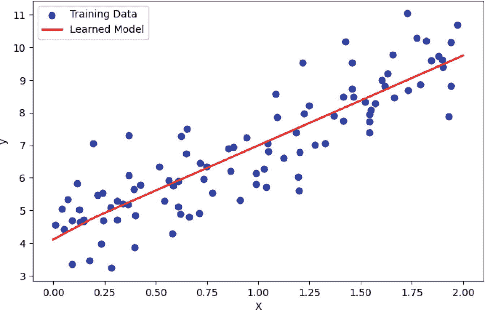

图 1.6

一个散点图显示了训练数据作为蓝色点，学习模型作为红色线条。x 轴范围从 0.00 到 2.00，y 轴范围从 3 到 11。红色线条代表拟合数据的线性回归模型，表明 x 和 y 之间存在正相关。图例将蓝色点标识为“Training Data”，红色线条标识为“Learned Model”。

## 1.2 卷积神经网络（CNNs）

图像数据本质上是一个二维像素网格的结构，每个像素代表一个或多个数值，具体取决于图像是单色还是彩色。传统方法通常通过将图像展平为一维向量，在将其输入到全连接的多层感知器（MLPs）之前忽略了这种空间结构。然而，这种方法忽略了像素之间的关键空间关系，限制了模型高效学习有意义模式的能力。

为了解决这一限制，卷积神经网络（CNNs）由 LeCun 在 1995 年提出。CNNs 专门设计用来利用图像数据的空间局部性，显著提高了计算机视觉任务中的性能。它们在 ImageNet 数据集上的成功显著地展示了这一点，CNNs 在那里超越了传统的架构。CNNs 的有效性源于它们能够在保持计算效率的同时学习层次化的特征表示，这得益于生物启发和数学原理，如群论。

除了图像处理之外，卷积神经网络（CNNs）在众多领域都得到了应用，包括音频处理、自然语言处理和时间序列分析。此外，CNNs 的变体也被应用于图结构数据和推荐系统中。

### 1.2.1 从密集层到卷积网络的演变

传统的模型，如多层感知器（MLPs），非常适合表格数据，其中信息以行（实例）和列（特征）的形式结构化。在这种情况下，我们可能会期望特征之间存在复杂的相互作用，但我们并不假设它们之间有任何固有的结构。然而，当处理高维感知数据，如图像时，由于它们巨大的参数需求，全连接网络变得不切实际。

考虑一个图像分类任务，例如区分猫和狗。如果我们使用一百万像素的图像，每个输入将有一百万个特征。即使将这个数量减少到 1000 个神经元的隐藏层，一个全连接的网络仍然需要大量的参数，使得训练变得计算上不可行。虽然将图像分辨率降低到 10 万个像素可能会有所帮助，但一个全连接的架构仍然需要数十亿个参数，这需要一个不切实际的庞大数据集才能进行有效的训练。

尽管存在这些挑战，人类和现代机器学习系统都可以准确地区分猫和狗。这是因为图像包含固有的空间结构，可以利用这些结构而不是将每个像素视为一个独立特征。卷积神经网络（CNNs）通过有效地捕捉图像中的空间层次和局部模式来应对这一挑战。通过利用自然图像结构的已知属性，CNNs 显著降低了计算复杂度，提高了泛化能力，并增强了学习效率，使它们成为图像相关任务中全连接架构的有力替代品。

### 1.2.2 在多层感知器（MLPs）中引入空间结构

在神经网络的情况下，多层感知器（MLP）可以用来处理二维图像数据，其中输入和隐藏表示都结构化为矩阵。在计算上，这些表示被视为二维张量，保留了它们的空间关系。这个框架强调了在整个网络层中保持空间完整性的重要性。

令 $$$ x_{i,j} $$$ 和 $$$ h_{i,j} $$$ 分别表示输入图像和隐藏表示中位置 $$$ (i,j) $$$ 的像素值。在传统的 MLP 中，每个隐藏单元通过权重矩阵与所有输入像素相连。然而，为了更好地捕捉空间依赖性，我们转向四阶权重张量 $$$ W $$$. 通过引入偏置项 $$$ b $$$, 变换形式上表示为 $$$\displaystyle \begin{aligned} h_{i,j} = \sum_{k,l} W_{i-k, j-l} x_{k,l} + b. \end{aligned} $$$ (1.1)

这种从权重矩阵到四阶张量的修改主要是系数的重新索引，其中权重现在表示为 $$$ W_{i-k, j-l} $$$. 索引 $$$ k $$$ 和 $$$ l $$$ 覆盖了整个图像的正负偏移。因此，每个隐藏单元的值是通过在 $$$ x $$$ 中对周围的像素进行求和得到的，中心在 $$$ (i,j) $$$，并乘以 $$$ W $$$. 

然而，这种参数化提出了一个巨大的挑战。例如，将一个 $$$ 1000 \times 1000 $$$ 的图像（1 兆像素）映射到相同大小的隐藏表示将需要大量的参数，远远超出现代计算能力。这种计算负担促使需要更高效的架构，例如卷积神经网络（CNNs），它们利用空间结构同时显著减少可学习的参数数量。

### 1.2.3 平移不变性

为了引入平移不变性，我们应用了这样一个原则：输入 $$$ x $$ 的平移应该导致隐藏表示 $$$ h $$ 的等效平移。只有当权重张量 $$$ W $$ 和偏置项 $$$ b $$ 不依赖于绝对位置 $$$ (i,j) $$ 时，这个条件才得到满足。因此，我们重新定义它们为 $$$ W_{k,l} $$$, 并一个常数偏置 $$$ b $$$, 从而得到 $$$ h_{i,j} $$ 的简化表达式：$$$\displaystyle \begin{aligned} h_{i,j} = \sum_{k,l} W_{k,l} x_{i-k, j-l} + b. \end{aligned} $$$ (1.2)

这个公式表示了一个卷积操作。在这里，每个位于 $$$ x $$ 中、位于 $$$ (i,j) $$$ 邻域内的像素都通过 $$$ W $$ 中相应的系数加权，以计算 $$$ h_{i,j} $$$. 与全连接情况不同，其中参数数量取决于图像大小，这种卷积方法显著减少了参数数量到 $$$ k \times l $$$, 使模型更具有计算效率。

这种权重共享策略的引入导致了早期卷积架构的发展，例如时间延迟神经网络（TDNNs），它们利用这一概念提高了模式识别任务中的学习效率和鲁棒性。

### 1.2.4 局部性

接下来，我们考虑第二个关键原则：局部性。如前所述，确定位置 $$$ (i,j) $$$ 的值的有意义信息应主要来自其直接周围环境。这个假设意味着，超过一定范围 $$$ k $$$ 或 $$$ l $$$, 权重 $$$ W_{k,l} $$$ 应该设置为 0。因此，我们可以将卷积操作重写为 $$\displaystyle \begin{aligned} {} h_{i,j} = \sum_{|k| \leq K, |l| \leq L} W_{k,l} x_{i-k, j-l} + b. \end{aligned} $$ (1.3)

这种修改将参数数量从 $$$ m² $$$ 减少到 $$$ (2K+1)(2L+1) $$$，其中 $$$ K $$$ 和 $$$ L $$$ 通常远小于 $$$ m $$$. 因此，我们实现了可学习参数数量的巨大减少——通常减少四个数量级。这种精炼的结构是卷积层的本质，是卷积神经网络（CNNs）的核心组件。在深度学习社区中，权重矩阵 $$$ W $$$ 通常被称为卷积核、滤波器，或简单地称为层的可学习参数。

之前，为图像处理网络构建单个全连接层需要数十亿个参数。现在，使用卷积层，我们只需要几百个参数，同时保留输入和隐藏表示维度。然而，这种复杂性的降低是以牺牲为代价的：学习到的特征变得对平移不变，并且每一层只能捕获局部信息。大多数机器学习模型依赖于归纳偏差，当这些偏差与实际参数相一致时。

### 1.2.5 卷积

让我们简要回顾卷积的数学定义。在数学分析中，两个函数 $$$ f $$$ 和 $$$ g $$$ 的卷积定义为 $$\displaystyle \begin{aligned} (f * g)(t) = \int_{-\infty}^{\infty} f(\tau) g(t - \tau) d\tau. \end{aligned} $$ (1.4)

这个操作测量当其中一个函数翻转并平移 $$$ t $$$, 与另一个函数的交集。当处理离散函数时，积分转换为求和。具体来说，对于由 $$$ i $$$ 索引的平方可和的无限维向量，离散卷积由 $$\displaystyle \begin{aligned} (f * g)_i = \sum_{j} f_j g_{i-j}. \end{aligned} $$ (1.5) 给出。

对于二维张量，这个求和扩展到索引 $$$ k $$$ 和 $$$ l $$$, 结果为 $$\displaystyle \begin{aligned} {} h_{i,j} = \sum_{k,l} W_{k,l} x_{i-k, j-l}. \end{aligned} $$ (1.6)

这个公式与方程(1.3)非常相似，但有一个关键的区别：我们不是使用 $$$ x_{i-k, j-l} $$$，而是使用差分操作。然而，这种区别在很大程度上是符号上的，因为我们总是可以调整公式以匹配方程(1.3)和(1.6)。值得注意的是，我们在方程(1.3)中的原始定义更准确地描述了互相关而不是卷积。这一区别将在下一节进一步探讨。

这个 Python 脚本比较了全连接神经网络(FCNN)和卷积神经网络(CNN)处理灰度图像的方式。它首先使用 NumPy 生成一个随机的 10 $$$\times $$$ 10 图像，其中像素值介于 0 和 1 之间。然后，该图像被转换为 PyTorch 张量，并重新塑形以包括批量和通道维度，使其适合深度学习模型。

FCNN 模型由一个单一的完全连接层(nn.Linear)组成，在应用转换之前将图像展平成一个一维向量。这种方法忽略了像素之间的空间关系，将每个像素独立处理。相比之下，CNN 模型使用一个 3 $$$\times $$$ 3 的卷积层(nn.Conv2d)并带有填充，使其能够捕捉局部模式并保留图像的空间结构。

最后，该脚本将原始图像与两个模型的输出一起可视化。FCNN 的输出看起来是分散的，因为它没有保持空间结构，而 CNN 的输出则保持了空间一致性，突出了其提取有意义图像特征的能力。这种比较强调了为什么 CNN 在图像相关任务中更受欢迎，因为它们有效地利用了局部像素依赖性，这与图 1.8 中所示的 FCNN 不同。

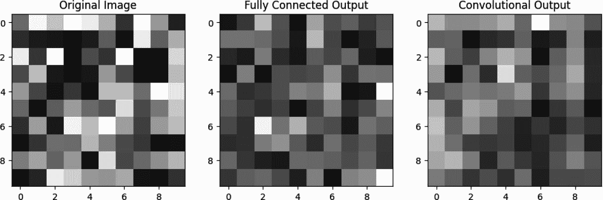

图 1.8

三张灰度图像并排显示。第一张图像标记为“原始图像”，显示一个 10 $$$\times $$$ 10 的灰度变化网格。第二张图像，标记为“全连接输出”，展示了一个类似的 10 $$$\times $$$ 10 网格，但灰度模式略有改变。第三张图像，“卷积输出”，也具有一个 10 $$$\times $$$ 10 的网格，具有独特的灰度变化。每个图像的 x 轴和 y 轴上都有从 0 到 9 的轴标签。

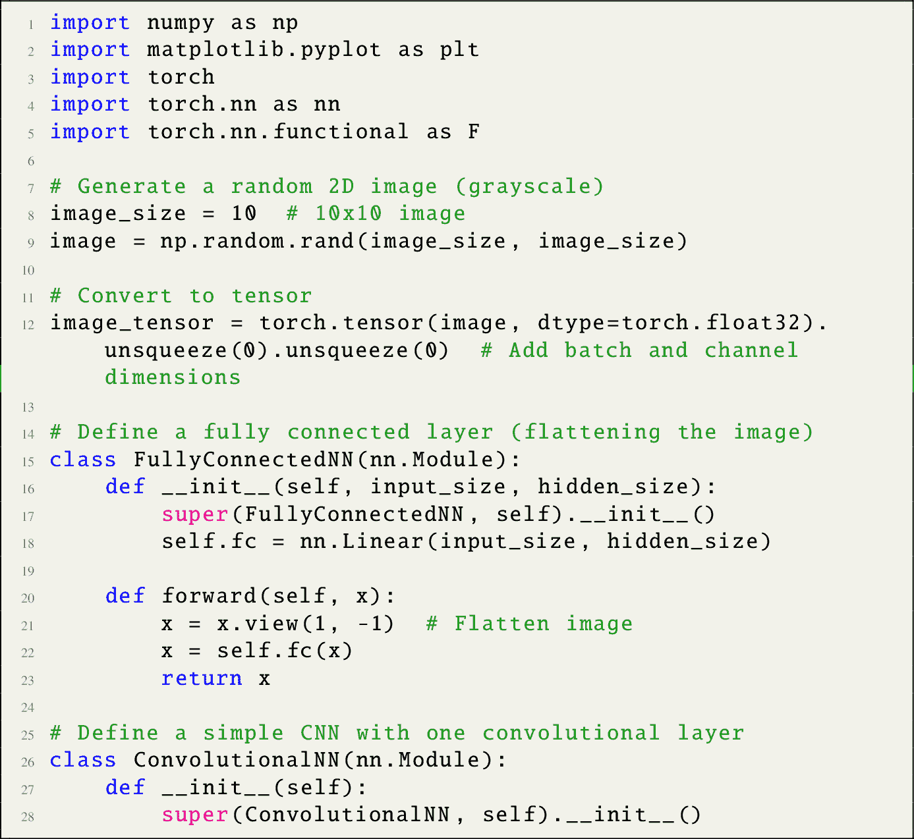


## 1.3 循环神经网络（RNNs）

循环神经网络（RNNs）是一类专门设计用于处理序列数据的神经网络。与传统的前馈网络不同，RNNs 引入了一种记忆机制，允许信息在时间步长之间持续存在，这使得它们在语音识别、时间序列预测和自然语言处理等任务中非常有效。图 1.9 通过显示多个时间步的隐藏状态、输入和输出来说明信息如何随时间流动。它突出了序列依赖性和定义 RNN 结构的循环连接。

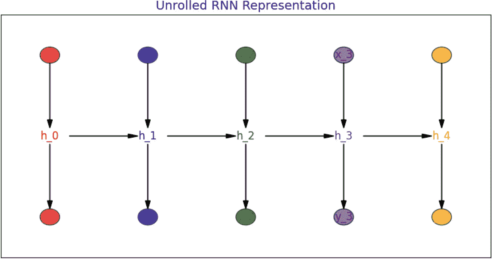

图 1.9

一个具有三层神经网络的图示。输入层由标记为 X0_0 到 X2_2 的节点组成。隐藏层有标记为 H0_0 到 H2_3 的节点，通过表示数据流的箭头连接。输出层包含节点 Y_0 和 Y_1。蓝色箭头表示层内的连接，红色箭头显示隐藏节点之间的连接，绿色箭头表示到输出层的连接

## 1.4 RNNs 的数学表示

标准的 RNN 在每个时间步 $$$ t $$$ 处理序列输入 $$$ x_t $$$, 并维护一个捕获过去信息的隐藏状态 $$$ h_t $$$. 隐藏状态的更新方程由以下公式给出：$$$\displaystyle \begin{aligned} h_t = f(W_h h_{t-1} + W_x x_t + b) \end{aligned} $$$(1.7) 其中

+   $$$ h_t $$$ 是时间步 $$$ t $$$ 的隐藏状态，包含先前输入的信息。

+   $$$ h_{t-1} $$$ 是前一时间步的隐藏状态。

+   $$$ x_t $$$ 是时间步 $$$ t $$$ 的输入。

+   $$$ W_h $$$ 和 $$$ W_x $$$ 是权重矩阵。

+   $$$ b $$$ 是偏置项。

+   $$$ f $$$ 是激活函数（通常是 tanh 或 ReLU）。

每一时间步的输出计算如下：$$$\displaystyle \begin{aligned} y_t = W_y h_t + b_y \end{aligned} $$$ (1.8) 其中 $$$ W_y $$$ 是将隐藏状态映射到输出的权重矩阵，而 $$$ b_y $$$ 是输出偏置。典型的 RNN 架构在图 1.10 中展示。

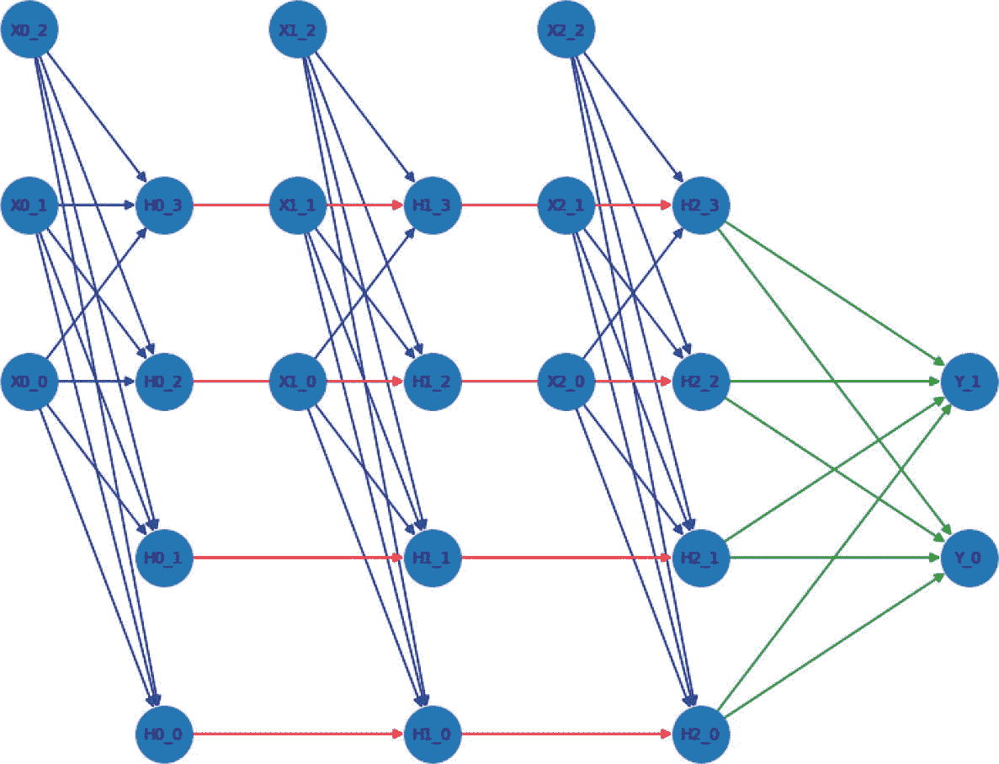

图 1.10

标题为“展开的 RNN 表示”的图，展示了表示展开循环神经网络的一系列节点。节点标注了输入 $$$x_0$$$ 到 $$$x_4$$$, 隐藏状态 $$$h_0$$$ 到 $$$h_4$$$, 和输出 $$$y_0$$$ 到 $$$y_4$$$. 箭头指示数据从输入通过隐藏状态到输出的流动，说明了 RNN 的时间序列处理。

## 1.5 展开 RNN

RNN 在多个时间步处理输入序列，可以通过展开它们来可视化。对于一个输入序列 $$$ x_1, x_2, x_3, \dots , x_T $$$，网络可以表示为：$$$\displaystyle \begin{aligned} h_1 = f(W_h h_0 + W_x x_1 + b) \end{aligned} $$$ (1.9) $$$\displaystyle \begin{aligned} h_2 = f(W_h h_1 + W_x x_2 + b) \end{aligned} $$$ (1.10) $$$\displaystyle \begin{aligned} \vdots \end{aligned} $$$ (1.11) $$$\displaystyle \begin{aligned} h_T = f(W_h h_{T-1} + W_x x_T + b) \end{aligned} $$$ (1.12) 其中 $$$ h_0 $$$ 通常初始化为零向量。

## 1.6 RNN 的挑战

### 1.6.1 梯度消失和爆炸

在时间反向传播（BPTT）过程中，长序列的梯度往往会消失（变得非常小）或爆炸（变得过大）。消失梯度问题使得网络难以从遥远的过去输入中学习依赖关系。这个问题在数学上表示为 $$$\displaystyle \begin{aligned} \frac{\partial L}{\partial W_h} = \sum_{t=1}^{T} \left( \frac{\partial L}{\partial h_t} \prod_{k=t}^{1} W_h f'(h_k) \right) \end{aligned} $$$ (1.13)

如果 $$$ W_h $$$ 的特征值小于 1，梯度会指数级缩小，导致梯度消失。

### 1.6.2 长短期记忆（LSTM）

LSTM 通过引入记忆单元 \( C_t \) 和门控机制来调节信息的流动。关键方程如下：

## 1.7 RNNs 的应用

+   **自然语言处理（NLP）**：机器翻译、文本生成和情感分析

+   **语音识别**：将口语转换为文本

+   **时间序列预测**：股市预测和天气预报

+   **视频分析**：动作识别和手势检测

## 1.8 深度学习中的 GPU 加速

### 1.8.1 GPU 加速简介

GPU 加速指的是使用图形处理单元（GPU）进行计算，其效率高于传统的中央处理单元（CPU）。GPU 设计用于处理需要高数学计算水平的并行任务，使其成为深度学习、科学模拟和数据分析等领域的理想选择。

### 1.8.2 GPU 加速的类型

#### 1.8.2.1 通用型 GPU (GPGPU)

初始设计用于渲染图形的 GPGPUs 已经发展到处理各种非图形任务。它们利用 GPU 的并行处理能力进行通用计算。这种演变是由人工智能、科学模拟和金融建模等领域对高性能计算需求不断增加所驱动的。

GPGPUs 在架构上与传统 CPU 不同。虽然 CPU 优化于顺序任务执行，但 GPGPUs 擅长同时处理数千个并行线程。这种并行性对于涉及大规模矩阵运算、图像处理和深度学习算法的工作负载特别有益。

GPGPU 计算的一个重大突破是引入了如 NVIDIA 的 CUDA 和 OpenCL 等编程框架。这些框架允许开发者利用 GPU 处理能力进行广泛的图形处理以外的应用。通过编写专门的代码，程序员可以将计算密集型任务卸载到 GPU 上，与基于 CPU 的方法相比，显著缩短执行时间。

从医疗保健到金融等各个行业都采用了 GPGPU 来加速数据处理和分析。例如，在医学成像中，GPGPU 使复杂扫描的实时渲染成为可能，增强了诊断能力。在金融领域，它们用于需要快速数据处理和决策的高频交易算法。

尽管具有优势，GPGPU 也存在挑战。有效利用需要了解并行编程，并且并非所有应用程序都能轻松适应以从 GPU 加速中受益。此外，功耗和散热仍然是大规模部署的关注点。

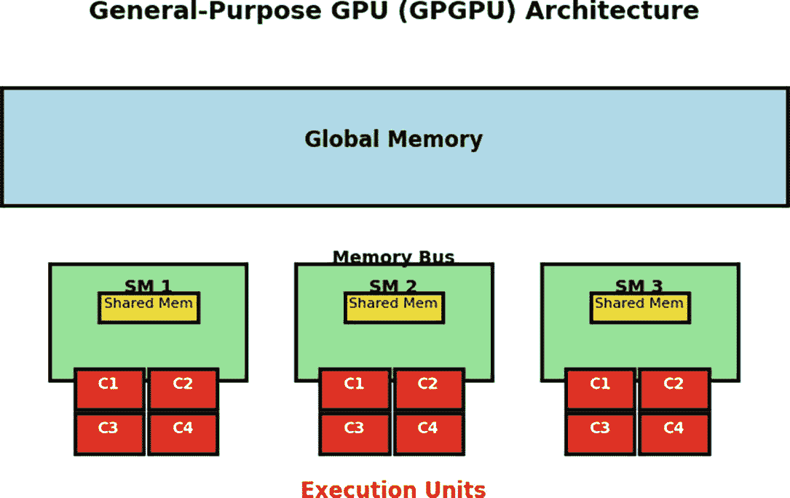

图 1.11

通用型 GPU (GPGPU) 架构图。顶部是一个标注为“全局内存”的大矩形。在其下方，有三个标注为“SM 1”、“SM 2”和“SM 3”的小部分代表流式多处理器，每个包含一个“共享内存”块。在每个 SM 下有四个标注为“C1”、“C2”、“C3”和“C4”的红块，代表执行单元。一个“内存总线”连接全局内存到 SM。

#### 1.8.2.2 通用型 GPU (GPGPU)

最初设计用于渲染图形，GPGPU 已发展到处理各种非图形任务。图 1.11 展示了 GPGPU 的架构。它们利用 GPU 的并行处理能力进行通用计算。这种演变是由人工智能、科学模拟和金融建模等领域对高性能计算需求的增加所驱动的。

GPGPU 与传统 CPU 在架构上有所不同。虽然 CPU 优化于顺序任务执行，但 GPGPU 在处理数千个并行线程方面表现出色。这种并行性对于涉及大规模矩阵运算、图像处理和深度学习算法的工作负载特别有益。

GPGPU 计算的一个重大突破是编程框架的引入，如 NVIDIA 的 CUDA 和 OpenCL。这些框架允许开发者利用 GPU 力量进行图形处理以外的广泛应用。通过编写专用代码，程序员可以将计算密集型任务卸载到 GPU，与基于 CPU 的方法相比，显著缩短执行时间。

从医疗保健到金融等各个行业都采用了 GPGPU 来加速数据处理和分析。例如，在医学成像中，GPGPU 使复杂扫描的实时渲染成为可能，增强了诊断能力。在金融领域，它们用于需要快速数据处理和决策的高频交易算法。

尽管具有优势，GPGPU 也存在挑战。有效利用需要了解并行编程，并且并非所有应用程序都能轻松适应以从 GPU 加速中受益。此外，功耗和散热仍然是大规模部署的关注点。

总之，通用 GPU 通过扩展传统 GPU 在非图形领域的功能，彻底改变了计算。它们处理大规模并行工作负载的能力使它们在现代高性能计算环境中变得不可或缺，推动多个行业的创新。

#### 1.8.2.3 专用 GPU

**专用 GPU**，如图 1.11 所示，是具有自身内存和处理能力的独立硬件组件，提供显著更高的性能，尤其是在深度学习训练等复杂计算方面。这些 GPU 通常用于游戏、专业渲染和科学计算。它们专用的 VRAM 使其能够高效地处理大量数据集，避免与集成解决方案中共享内存相关的瓶颈（图 1.12）。

专用 GPU 的一个关键优势是它们能够处理如 AI 模型训练、视频编辑和实时 3D 渲染等密集型工作负载。这些 GPU 拥有高级功能，如光线追踪、用于深度学习的张量核心和高内存带宽，对于高性能应用至关重要。

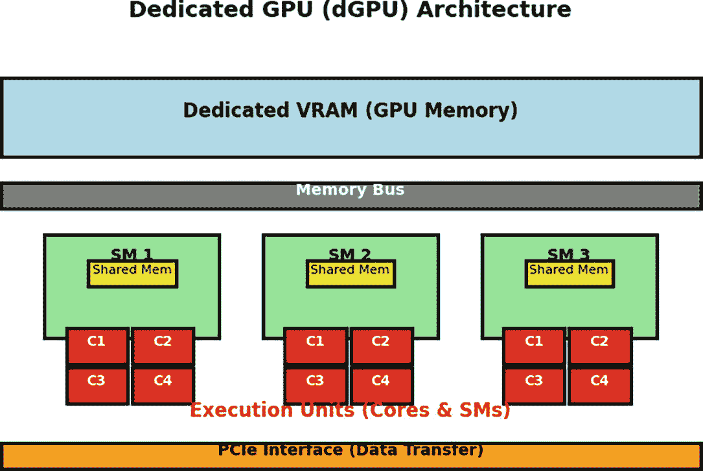

图 1.12

专用 GPU 架构图。顶部是“专用 VRAM（GPU 内存）”，通过“内存总线”连接。下面是三个标记为 SM 1、SM 2 和 SM 3 的块，每个块包含“共享内存”和四个标记为 C1、C2、C3 和 C4 的核心。这些代表执行单元。底部是“PCIe 接口（数据传输）”用于通信

然而，与集成 GPU 相比，专用 GPU 消耗更多电力并产生更多热量。这需要强大的冷却解决方案，使它们更适合桌面和高端笔记本电脑，而不是超便携设备。

#### 1.8.2.4 集成 GPU

集成显卡与 CPU 集成在同一芯片上，共享内存和资源，这限制了它们的性能，但为对性能要求不高的应用提供了一个经济实惠的选项。这些显卡通常出现在笔记本电脑、超极本和预算型台式机中，在这些设备中，电源效率和空间限制比原始性能更为重要。集成显卡非常适合日常计算任务，如网页浏览、媒体播放和办公应用。此外，现代集成显卡已经得到了显著提升，使得休闲游戏和基本内容创作成为可能。然而，对于需要高图形性能的任务，如 3D 渲染和深度学习，专用显卡仍然是首选选择（图 1.13）。

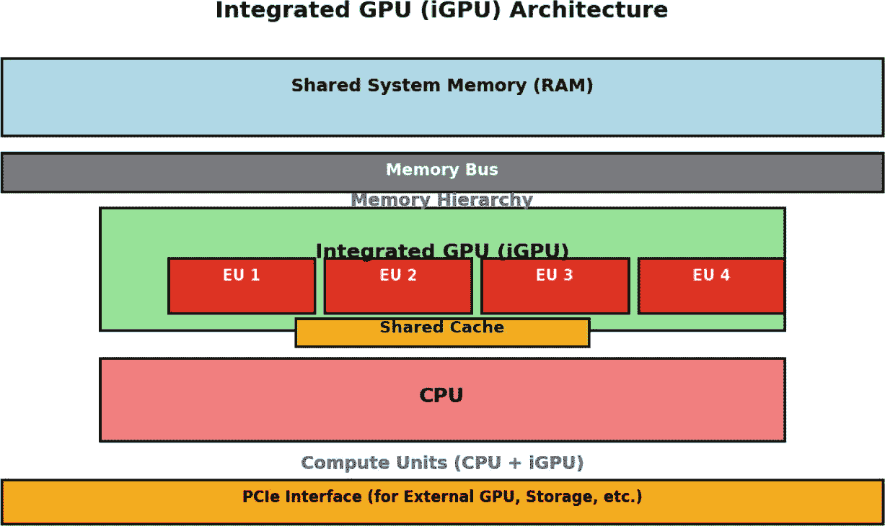

图 1.13

一张展示集成显卡（iGPU）架构的图。顶部是共享系统内存（RAM），随后是内存总线。下面是内存层次结构，包括包含四个执行单元（EU 1 到 EU 4）和共享缓存的集成显卡。CPU 位于 iGPU 下方。底部，计算单元（CPU + iGPU）连接到 PCIe 接口，用于外部显卡和存储连接。

## 1.9 训练深度学习模型

深度学习已经彻底改变了机器学习的许多领域，其最基本的应用之一是图像分类。深度学习的一个典型入门问题是分类 MNIST 数据集中的手写数字——这是一个广泛用于训练和测试图像识别模型的基准数据集。该数据集包含 60,000 张训练图像和 10,000 张测试图像的手写数字（0–9），每个代表一个 28 * 28 灰度图像。目标是开发一个神经网络模型，能够准确识别和分类这些数字，模仿人类解读手写数字的方式。

### 1.9.1 图像分类问题

传统编程依赖于明确定义程序遵循的规则和条件，以产生正确的输出。这种方法对于许多规则可以明确陈述的结构化问题效果良好。然而，图像分类提出了独特的挑战：它要求程序能够正确识别和分类它以前从未见过的图像。鉴于图像的巨大变化——如光照、方向、书写风格和扭曲的差异——程序员几乎不可能手动定义一套全面的规则，以适用于所有可能的情况。因此，传统编程技术在处理图像分类任务时遇到了困难。

传统编程依赖于明确定义程序遵循的规则和条件，以产生正确的输出。这种方法对于许多规则可以明确陈述的结构化问题效果良好。然而，图像分类提出了独特的挑战：它要求程序能够正确识别和分类它以前从未见过的图像。

由于图像的巨大可变性，如光照、方向、书写风格和扭曲的差异，程序员几乎不可能手动建立一套完整的规则，以涵盖每种情况。因此，传统编程方法在有效处理图像分类任务方面显得不足。

图 1.14 提供了关于考虑中的 MNIST 数据集的详细信息。

### 1.9.2 探索 MNIST 数据

探索 MNIST 数据集涉及理解其结构，该结构包括 70,000 个手写数字的灰度图像。这些图像分为 60,000 个训练图像和 10,000 个验证图像。每个图像为 28x28 像素，表示为数值数组。这个数据集被广泛用于基准测试深度学习模型。

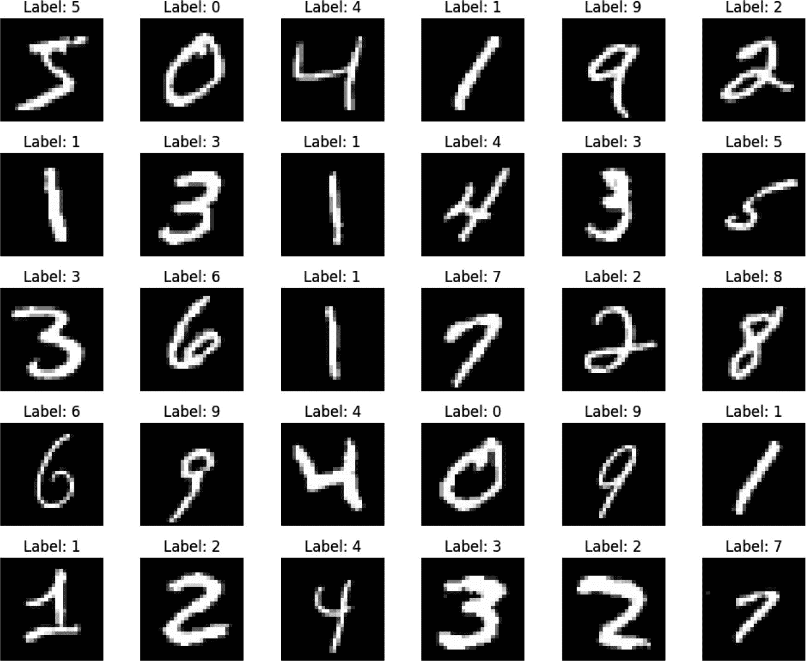

图 1.14

一张 25 个图像的网格，展示了从 0 到 9 的手写数字，每个数字都标有相应的编号。数字在黑色背景上呈现白色，展示了各种书写风格。每个图像上方的标签指示它所代表的数字，例如第一张图像的“标签：5”，第二张图像的“标签：0”，以此类推，突出了手写数字表示的多样性。

### 1.9.3 数据工程和数据集拆分

组织和准备数据以供深度学习使用的过程称为数据工程。理解训练数据和验证数据之间的区别对于构建鲁棒模型至关重要，并且可以从像 Jason Brownlee 这样的专家那里获得更多见解，他深入探讨了这些概念。本节介绍了 TorchVision，这是一个强大的库，用于处理标准数据集，如 MNIST。它简化了深度学习应用中的数据加载和预处理。MNIST 数据集包含 70,000 张手写数字的灰度图像，自动分为 60,000 张训练图像和 10,000 张测试图像。为了模型评估，测试集被重新用作验证集。理解将数据划分为训练、验证和测试集对于构建可靠的深度学习模型至关重要。

### 1.9.4 张量

张量是一个 n 维数组，它推广了向量（1D 数组）和矩阵（2D 数组）。张量是深度学习的基础，因为现代神经网络被设计成高效地处理它们。一个 3D 张量可以表示像素数据，其中维度对应于宽度、高度和颜色通道（RGB）。由于与图形处理中的矩阵计算相似，GPU 在处理张量方面非常高效。为了在深度学习中使用图像，它们必须被转换为张量。TorchVision 提供了 ToTensor 函数，该函数将 PIL 图像转换为神经网络使用的张量表示。

### 1.9.5 转换

TorchVision 中的转换是用于在训练之前修改数据集的函数。Compose 函数被用来按顺序应用多个转换。在这里，我们定义 trans 使用 transforms.ToTensor()，它将图像转换为张量。而不是手动转换单个图像，我们将 trans 分配给数据集的 transform 属性：

这样确保了当访问数据集时，每个图像都会自动转换为张量。

#### 1.9.5.1 DataLoader

**DataLoader**定义了数据如何输入深度学习模型。而不是一次性传递整个数据集（这计算成本高昂），使用数据的小批量。例如，批大小为**32**时，模型一次处理 32 张图像。

+   **训练数据**：使用**打乱**来随机化数据选择，防止偏差

+   **验证数据**：不需要打乱顺序，因为在验证过程中模型没有学习

选择一个最优的批大小（例如，**32 或 64**）可以在效率和性能之间取得平衡，减少内存限制同时确保有效的训练。

### 1.9.6 创建模型

#### 1.9.6.1 隐藏层

隐藏层通过添加更多神经元来处理中间表示，从而增强学习效果。与输入层类似，隐藏层的`nn.Linear`函数需要了解输入的形状。由于前一层的每个神经元计算一个值，因此隐藏层的输入数量等于前一层的神经元数量。模型的结构如下：

```py
layers = [
nn.Flatten(),
nn.Linear(input_size, 512),  # Input Layer
nn.ReLU(),  # Activation for Input
nn.Linear(512, 512),  # Hidden Layer
nn.ReLU()  # Activation for Hidden Layer
]
```

#### 1.9.6.2 输出层

输出层由**10 个神经元**组成，对应 MNIST 中的 10 个可能的数字类别。模型为表示预测类别的神经元分配更高的值。与之前的层不同，输出层不使用 ReLU 激活函数；相反，在下一步将应用损失函数。

```py
n_classes = 10
layers = [
nn.Flatten(),
nn.Linear(input_size, 512),
nn.ReLU(),
nn.Linear(512, 512),
nn.ReLU(),
nn.Linear(512, n_classes)  # Output Layer
]
```

这种架构通过利用多层来提取和细化输入图像中的有意义特征，从而实现有效的分类。

### 1.9.7 编译模型

为了优化神经网络，我们使用 Adam 优化器，该优化器动态调整学习率以改善收敛。模型参数如下传递给优化器：

```py
optimizer = Adam(model.parameters())
```

### 1.9.8 计算准确率

虽然损失函数有助于训练模型，但其数值可能难以解释。因此，准确率经常被用作评估模型性能的附加指标。

为了计算准确率，我们比较正确分类的图像数量与总预测数量的比例。由于数据集是分批处理的，因此准确率是按批计算的，并累积以确定整体性能。

总预测数量等于数据集大小，用符号$$ N $$表示，其中$$ n $$代表批大小：

```py
train_N = len(train_loader.dataset)
valid_N = len(valid_loader.dataset)
```

然后我们定义一个函数来计算每个批次的准确率。通过将所有批次的准确率相加，我们获得模型的总体准确率。

### 1.9.9 训练函数

我们为指定数量的 epoch 定义一个训练循环。在每个 epoch 中，模型在数据集上训练，并在单独的验证集上验证。

```py
epochs = 5
for epoch in range(epochs):
print('Epoch: {}'.format(epoch))
train()
validate()
```

在每个 epoch 之后，显示训练和验证的损失以及相应的准确率：

```py
Epoch: 0
Train - Loss: 376.3699 Accuracy: 0.9384
Valid - Loss: 29.9293 Accuracy: 0.9702
Epoch: 1
Train - Loss: 160.3221 Accuracy: 0.9743
Valid - Loss: 22.7215 Accuracy: 0.9774
Epoch: 2
Train - Loss: 109.3101 Accuracy: 0.9814
Valid - Loss: 25.3002 Accuracy: 0.9761
Epoch: 3
Train - Loss: 84.9273 Accuracy: 0.9857
Valid - Loss: 23.7691 Accuracy: 0.9786
Epoch: 4
Train - Loss: 67.8038 Accuracy: 0.9887
Valid - Loss: 24.5771 Accuracy: 0.9797
```

准确率接近 100%时，我们通过在原始样本上做出预测来验证模型性能：

```py
prediction = model(x_0_gpu)
prediction
```

模型输出十个值，每个值代表十个数字中的一个的置信度分数。这些值对应于索引位置，其中最高值表示预测类别。

```py
tensor([[-21.6704, -15.0402, -17.4163,  11.6820, -19.4316,
19.0983, -16.9925,
-19.2463, -17.1571,  -8.8139]], device='cuda:0',
grad_fn=)
```

为了提取预测类别，我们使用`argmax`函数：

```py
prediction.argmax(dim=1, keepdim=True)
tensor([[5]], device='cuda:0')
```

最后，我们将模型的预测与实际标签进行比较：

```py
y_0
5
```

该模型表现异常出色，在训练和验证阶段都达到了近 100%的准确率。这证实了其准确分类手写数字的能力。下一步是推理阶段，其中训练好的模型被用来分类新的、未见过的图像。MNIST 在计算机视觉领域具有历史意义，并且仍然是评估机器学习模型的有价值基准。如果一个模型在 MNIST 上表现不佳，那么它在更复杂的数据集上成功的可能性也不大。这突出了 MNIST 不仅作为学习工具的重要性，而且作为现代深度学习架构的调试资源的价值。

## 1.10 概述

本章介绍了深度学习的基础概念及其与 GPU 加速的结合。它从对深度学习架构的概述开始，包括深度神经网络及其数学基础。线性回归被作为一个基本的神经网络模型提出，为更复杂的架构奠定了基础。然后章节探讨了卷积神经网络（CNN），强调了空间结构、平移不变性和局部性。接下来讨论了循环神经网络（RNN），包括它们的数学表示和诸如梯度消失等挑战，这些问题通过 LSTM 单元得到解决。RNN 在序列建模中的应用被突出显示。章节接着转向 GPU 加速，解释了其类型和在加快深度学习计算中的重要性。它涵盖了设置 GPU 环境和框架如 TensorFlow 的过程。最后，章节通过使用 MNIST 数据集训练深度学习模型的过程进行说明，包括数据预处理、模型创建、编译和评估。

练习

1.  定义深度学习并解释其在现代人工智能应用中的重要性。

1.  描述深度神经网络的架构。它与传统的机器学习模型有何不同？

1.  解释如何将线性回归解释为单层神经网络。提供数学证明。

1.  讨论从密集层到卷积神经网络（CNN）的演变。CNN 提供了哪些优势？

1.  解释 CNN 中的空间结构、平移不变性和局部性的概念。这些属性如何提高模型性能？

1.  描述循环神经网络（RNN）的架构和功能。它们的关键应用是什么？

1.  训练 RNN 时面临哪些挑战？解释 LSTM 单元如何帮助克服这些挑战。

1.  讨论 GPU 加速在深度学习中的作用。为什么在训练深度模型时 GPU 比 CPU 更受欢迎？

1.  解释在深度学习框架中使用的不同类型的 GPU 加速技术。

1.  概述使用 MNIST 数据集训练深度学习模型的步骤。包括数据预处理、模型创建和评估。
