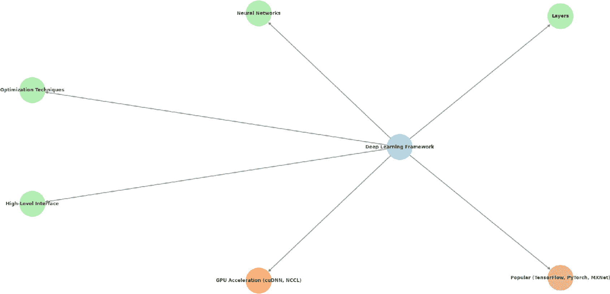
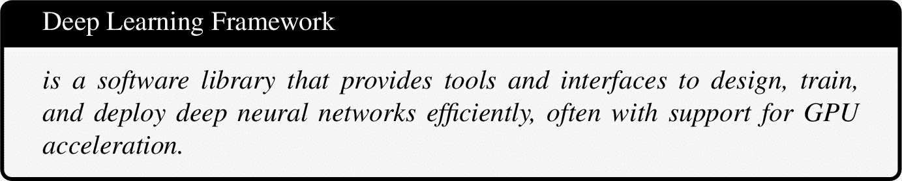
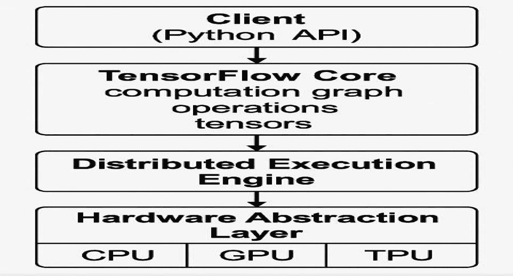

# 2. GPU 架构、优化和部署

## 2.1 深度学习框架

### 2.1.1 什么是深度学习框架？

想象一下，你想要教一个机器人识别照片中的猫。你可以从头开始编写所有指令，但这会花费很长时间，并且非常复杂。这就是深度学习框架发挥作用的地方。

深度学习框架就像工具包，帮助你构建智能机器而不需要从头开始。它们为你提供了预制构建块，就像乐高积木，这样你可以更轻松地设计、训练和改进 AI 系统。

深度学习框架是一个旨在帮助研究人员和数据科学家构建、训练和评估深度学习模型的软件包。这些框架通过抽象化深度学习、神经网络和机器学习所使用的底层算法，简化了训练模型的过程。各种框架在图 2.1 中给出。

通过高级编程接口，深度学习框架提供了必要的构建块，如层、激活函数、损失函数和优化技术。这使得用户可以专注于设计模型和进行实验，而无需担心底层数学和计算细节。



图 2.1

一幅展示深度学习框架组件的图。中心节点标记为“深度学习框架”，连接到五个节点：“神经网络”、“层”、“优化技术”、“高级接口”和“GPU 加速（cuDNN、NCCL）”。还有一个标记为“流行（TensorFlow、PyTorch、MXNet）”的节点也连接到中心节点。每个节点都有不同的颜色编码，突出框架的不同方面。



流行的深度学习框架，如 `PyTorch`、`TensorFlow`、`MXNet` 等，针对与 GPU 加速库（如 `cuDNN` 和 `NCCL`）一起工作进行了优化，使得高性能的多 GPU 训练成为可能，并加快了模型训练和推理的速度。

### 2.1.2 为什么使用深度学习框架？

使用深度学习框架有以下几个优点：

+   你不必自己编写每个细节，而是使用现成的组件来加速开发并减少错误。

+   这些框架能够处理大量数据，并以高性能执行复杂任务，如语音识别、图像分析和语言翻译。

+   无论您是初学者还是有经验的专家，这些框架都支持广泛的应用，从简单的原型到前沿的 AI 系统。

+   它们提供了用于定义网络层、类型（如 CNN 和 RNN）和常见模型架构的预构建库。

+   这些框架支持广泛的应用，包括计算机视觉、语音处理和自然语言处理。

+   它们通过 Python、C、C++和 Scala 等流行编程语言提供熟悉的接口，使它们对广大用户群体可访问。

+   许多框架通过 NVIDIA 深度学习库（如`cuDNN`、`NCCL`和`cuBLAS`）进行了优化，确保高效的 GPU 加速深度学习训练。

### 2.1.3.3 流行框架

#### 2.1.3.1 TensorFlow

由 Google 开发的 TensorFlow 以其可扩展性、生产就绪能力和对高级和低级 API 的支持而闻名。它在移动和嵌入式设备部署方面表现出色。图 2.2 给出了 TensorFlow 架构的概述。

使用 TensorFlow 的步骤

1.  **安装 TensorFlow**：在您的终端或命令提示符中使用`pip install tensorflow`安装 TensorFlow 的最新版本。

1.  **导入库**：在您的 Python 脚本或笔记本中添加`import tensorflow as tf`以开始使用 TensorFlow。

1.  **准备数据**：加载并预处理您的数据集。TensorFlow 支持 NumPy 数组、Pandas DataFrames 以及通过`tf.data`和`tf.keras.datasets`提供的内置数据集。

1.  **构建模型**：使用高级 Keras API (`tf.keras`) 定义一个具有`Dense`、`Conv2D`或`LSTM`等层的神经网络架构。

1.  **编译模型**：使用`model.compile()`方法指定损失函数、优化器和评估指标。

1.  **训练模型**：使用`model.fit()`将模型拟合到您的训练数据，并在多个 epoch 上监控性能。

1.  **评估和预测**：使用`model.evaluate()`在新数据上测试，并使用`model.predict()`进行预测。

1.  **保存和部署**：使用`model.save()`保存您的模型，并根据需要将其部署到移动、嵌入式或云平台。



图 2.2

给出的 TensorFlow 架构中提到了客户端、核心、执行引擎和抽象层等各个层。抽象层由 CPU、GPU 和 TPU 三个部分组成。

#### 2.1.3.2 PyTorch

PyTorch 是由 Facebook 的人工智能研究实验室开发的开源深度学习框架。它以其动态计算图而闻名，允许在运行时构建网络结构。这种灵活性使得开发者能够即时进行更改并更直观地检查他们的模型。因此，PyTorch 特别适合研究和实验，因为它简化了测试和调试的过程。PyTorch 提供了一种既自然又与标准 Python 编程紧密对齐的语法，具有易于学习和高度灵活的特点，因此在学术界和开发者中都非常受欢迎。

使用 PyTorch 的步骤

1.  **安装 PyTorch：** 访问 [`pytorch.org/get-started/locally/`](https://pytorch.org/get-started/locally/) 并根据您的系统和 CUDA 支持情况，遵循说明使用 pip 或 conda 安装 PyTorch。

1.  **导入 PyTorch：** 使用 `import torch` 在您的 Python 脚本或笔记本中访问 PyTorch 功能。

1.  **创建张量：** 张量是 PyTorch 中的核心数据结构。使用 `torch.tensor()`、`torch.zeros()`、`torch.ones()` 等，来创建张量。

1.  **执行操作：** PyTorch 支持广泛的张量操作，例如加法、乘法、重塑等。

1.  **定义模型：** 使用 **torch.nn.Module** 来定义神经网络模型。创建一个继承自 **nn.Module** 的类，并在 **__init__** 中定义层，在 **forward()** 中定义前向传递。

1.  **设置损失函数和优化器：** 选择一个损失函数（例如，**nn.CrossEntropyLoss**）和一个优化器（例如，**torch.optim.SGD**）来训练你的模型。

1.  **训练模型：** 通过循环遍历时代，将数据输入到模型中，计算损失，使用 **loss.backward()** 进行反向传播，并使用 `optimizer.step()` 更新权重。

1.  **评估模型：** 使用验证/测试数据来评估模型性能。在评估期间使用 **torch.no_grad()** 禁用梯度计算。

1.  **保存和加载模型：** 使用 **torch.save()** 保存模型，使用 **torch.load()** 加载模型。

#### 2.1.3.3 JAX

JAX 是由 Google 开发的高性能数值计算库，旨在无缝结合 Python 和 NumPy 的灵活性以及自动微分和硬件加速的强大功能。在其核心，JAX 通过提供 **jax.numpy** 的熟悉 API 来扩展 NumPy，使用户能够编写看起来和感觉像标准 NumPy 的代码，但增加了额外的功能。其最突出的特性之一是自动微分，它使用 **grad** 和 **jacrev** 等工具为任意 Python 函数提供梯度计算，使其非常适合机器学习和科学计算。JAX 还利用 XLA（加速线性代数）来编译和优化代码，以便在 CPU、GPU 和 TPUs 上执行，显著提高性能。通过 **@jit** 等装饰器，用户可以将即时编译应用于函数，以加快执行速度，而 **vmap** 和 **pmap** 提供了强大的机制，用于跨设备进行向量化和平行化。JAX 推崇函数式编程风格，强调不可变性和纯函数，这与现代机器学习框架如 Flax 和 Haiku 非常契合。其在研究和开发中的日益流行源于其高效的扩展能力、支持复杂模型以及与尖端硬件无缝集成的能力，使其成为机器学习和科学计算社区许多人的首选选择。

使用 JAX 的步骤

1.  **安装 JAX**：访问 [`github.com/google/jax`](https://github.com/google/jax) 或遵循官方安装指南。使用 pip 安装 JAX 及其依赖项。对于仅 CPU 的支持，运行 `pip install jax jaxlib`；对于 GPU 支持，安装与 CUDA 兼容的 `jaxlib` 适当版本。

1.  **导入 JAX 模块**：使用 `import jax`、`import jax.numpy as jnp` 以及其他相关模块如 `jax.random` 来访问 JAX 功能。

1.  **使用 jax.numpy 创建数组**：JAX 使用 `jax.numpy` 作为 NumPy 的替代品。您可以使用 `jnp.array()`、`jnp.zeros()` 和 `jnp.ones()` 等函数创建数组。

1.  **使用自动微分**：对于标量输出函数，使用 `jax.grad()` 计算梯度。对于更复杂的导数，使用 `jax.jacfwd()` 和 `jax.jacrev()`。

1.  **应用 JIT 编译**：使用 `@jax.jit` 装饰器编译函数，以便使用 XLA（加速线性代数）进行更快执行。

1.  **使用 vmap 向量化**：使用 `jax.vmap()` 自动向量化跨数组维度的函数，以实现高效的批量计算。

1.  **使用 pmap 并行化**：对于多设备并行（例如，跨 GPU 或 TPUs），使用 `jax.pmap()` 来分配计算。

1.  **与 ML 框架集成**：使用 Flax 或 Haiku 等库在 JAX 上构建和训练神经网络，利用其函数式编程风格和性能。

1.  **调试和性能分析**：使用 `jax.debug.print()` 和性能分析工具来监控性能并有效地调试 JAX 程序。

### 2.1.4 流行框架的比较

本小节给出了第 2.1.3 小节中描述的流行框架的比较，即 PyTorch、TensorFlow 和 JAX，突出显示每个框架的独特优势和设计理念，如表 2.1 所示。PyTorch 以其动态计算图和直观的界面而闻名，这使得它成为研究人员和开发人员进行快速实验的热门选择。TensorFlow 通过其静态图方法和包括 Keras 和 TensorFlow Lite 在内的广泛生态系统，非常适合可扩展的生产环境和跨平台的部署。JAX 因其函数式编程风格和高性能数值计算而突出，利用 XLA 在 CPU、GPU 和 TPU 上进行高效的执行。这些框架共同提供了多样化的功能，允许开发人员根据他们特定的机器学习需求和流程偏好选择最合适的工具。

表 2.1

PyTorch、TensorFlow 和 JAX 的比较

| 功能 | PyTorch | TensorFlow | JAX |
| --- | --- | --- | --- |
| 来源 | Facebook | Google | Google |
| 主要用途 | 深度学习 | 深度学习 | 高性能数值计算和机器学习研究 |
| 微分支持 | Autograd | TensorFlow GradientTape | Autograd |
| 硬件加速 | CPU, GPU | CPU, GPU, TPU | CPU, GPU, TPU (通过 XLA) |
| 编程风格 | 命令式 | 声明式 | 函数式 |
| 生态系统 | 拥有 torchvision、torchaudio 等库的丰富生态系统 | 包括 Keras、TensorFlow Extended (TFX)、TensorFlow Lite 等在内的广泛生态系统 | 拥有 Flax、Haiku、Objax 等库的日益增长的生态系统 |
| 性能 | 高性能，尤其是在动态计算图方面 | 使用静态计算图的高性能 | 使用 XLA 编译和优化的高性能 |

## 2.2 设置 GPU 支持

在优化像 PyTorch、TensorFlow 和 JAX 这样的机器学习框架的性能时，设置 GPU 支持至关重要。GPU 被设计用来高效地处理并行计算，这使得它们非常适合训练深度学习模型。首先，用户必须确保他们的系统有一个兼容的 NVIDIA GPU，并且已经安装了适当的驱动程序。接下来，安装 CUDA（计算统一设备架构）和 cuDNN（CUDA 深度神经网络库）是必不可少的，因为这些提供了 GPU 加速所需的底层 API。每个框架都有特定的安装说明来启用 GPU 支持，PyTorch 和 TensorFlow 提供了针对不同 CUDA 版本的 pip 或 conda 包。同时，JAX 需要安装具有 GPU 支持的匹配版本的 `jaxlib`。

在设置计算环境之后，一个重要的下一步是验证硬件加速器（如 GPU）的可用性。大多数机器学习框架提供检测和有效利用这些设备的功能。确保计算在 GPU 上运行可以显著提高性能，尤其是在训练深度学习模型时。监控设备内存使用和计算位置也是建议的，以有效地使用资源。在具有多个 GPU 的系统中，许多框架支持分布式或并行计算技术以进一步加快处理速度。适当的硬件配置可以加速模型训练，并使扩展到更大的数据集和更复杂的架构成为可能，这是任何严肃的数据驱动应用程序的基础方面。

### 2.2.1 NVIDIA GPU 驱动程序要求

安装正确的 NVIDIA GPU 驱动程序对于启用 PyTorch、TensorFlow 和 JAX 等机器学习框架的 GPU 加速至关重要。这些驱动程序作为操作系统和 GPU 硬件之间的接口，允许框架利用 GPU 进行计算。驱动程序版本必须与安装的 CUDA 版本兼容。NVIDIA 定期更新其驱动程序以支持新的 CUDA 版本，并提高性能和稳定性。

在安装之前，用户应检查他们的 GPU 型号和操作系统，从官方 NVIDIA 网站下载适当的驱动程序。在 Linux 系统上，建议使用包管理器或 NVIDIA 的 runfile 安装程序，而 Windows 用户可以使用 NVIDIA 提供的可执行安装程序。安装后，重新启动系统，并使用如 `nvidia-smi` 等工具验证驱动程序的安装，这些工具会显示驱动程序版本、GPU 状态和 CUDA 兼容性。确保正确的驱动程序设置是成功进行深度学习工作流程中 GPU 加速的基础步骤。

### 2.2.2 安装 CUDA 和 cuDNN

要启用机器学习框架的 GPU 加速，安装 CUDA 和 cuDNN 是至关重要的。CUDA 是由 NVIDIA 开发的并行计算平台和 API 模型，而 cuDNN 是用于深度神经网络的 GPU 加速库。首先，访问官方 NVIDIA 网站下载与您的 GPU 和操作系统匹配的 CUDA 和 cuDNN 的适当版本。仔细遵循安装说明，确保环境变量（如 `PATH` 和 `LD_LIBRARY_PATH`，在 Linux 上）或系统路径（在 Windows 上）正确配置。安装后，通过运行示例程序或使用框架特定的命令来检查 GPU 可用性，以验证设置。

### 2.2.3 验证 GPU 可用性

在设置计算环境之后，验证硬件加速器（如 GPU）的可用性是下一步的重要步骤。大多数机器学习框架都提供了内置函数来有效地检测和利用这些设备。确保计算被分配到 GPU 上可以显著提高性能，尤其是在模型训练期间。监控内存使用和设备放置也是确保最佳资源利用的关键。在具有多个 GPU 的系统上，许多框架支持分布式或并行执行，以进一步提高计算效率。适当的硬件配置可以加快模型开发，并使其能够扩展到更大的数据集和更复杂的架构，这是任何现代机器学习工作流程中的基本步骤。

### 2.2.4 管理 GPU 内存使用和可见性

一种常见的策略是按需分配 GPU 内存，而不是同时保留所有可用内存。这有助于多个应用程序或模型更有效地共享 GPU。一些框架允许内存增长，使得内存使用可以根据需要扩展，而不是在执行开始时预分配所有资源。

另一个有用的功能是设置内存限制或逻辑分区。这在多用户或多模型环境中尤为重要，在这些环境中，GPU 资源必须公平共享或在不同进程间隔离。

除了框架级别的工具之外，外部实用程序如`nvidia-smi`提供了对 GPU 使用的实时监控，包括内存消耗、利用率百分比和活动进程。例如：

```py
$ nvidia-smi
```

此命令行工具对于诊断瓶颈或验证计算是否正确运行在 GPU 上非常有价值。

环境变量如`CUDA_VISIBLE_DEVICES`也可以用来限制应用程序可见的 GPU，帮助在多 GPU 系统中手动管理 GPU 分配：

```py
$ CUDA_VISIBLE_DEVICES=0 python your_script.py
```

总体而言，仔细管理 GPU 内存和可见性可以更好地利用资源，减少崩溃，并提高大规模训练和实验的可扩展性。

## 2.3 TensorFlow 中的 GPU 加速

GPU 加速在扩展深度学习任务中起着至关重要的作用，TensorFlow 提供了强大的支持，以利用 GPU 硬件来提升性能。默认情况下，TensorFlow 会自动检测可用的 GPU 并尝试使用它们进行计算。这使得模型运行速度比 CPU 执行快得多，尤其是在涉及大型矩阵计算和深度神经网络的操作中。

TensorFlow 支持许多 GPU 配置，包括单 GPU 和多 GPU 环境。当可用 GPU 时，TensorFlow 会将操作放置在 GPU 设备上，除非明确指定其他操作。用户可以手动检查或控制设备放置，但 TensorFlow 的自动放置通常可以优化性能。

高效的 GPU 使用还要求适当的内存管理。TensorFlow 允许开发者配置 GPU 上内存的分配方式。例如，内存增长可以让 TensorFlow 逐步分配 GPU 内存，避免预先保留整个内存块的需求。这在多个应用程序或用户共享同一 GPU 的环境中特别有用。

TensorFlow 为多 GPU 设置提供了高级分布式训练策略，例如 `tf.distribute.Strategy`，它可以在多个 GPU 或甚至多台机器之间实现无缝训练。这些策略抽象了并行执行的复杂性，同时保持了高可扩展性和效率。

### 2.3.1 GPU 兼容张量和操作

要充分利用 GPU 加速，机器学习框架中的张量和操作必须与 GPU 设备兼容。兼容 GPU 的张量是位于 GPU 内存中的数据结构，允许高速计算和并行处理。大多数现代框架，包括 TensorFlow、PyTorch 和 JAX，都会自动管理张量在可用硬件上的放置，但它们也提供了在需要时进行手动控制的功能。

当涉及的张量放置在 GPU 设备上时，矩阵乘法、卷积和反向传播等操作针对 GPU 进行了优化。这些操作通常通过 cuDNN 或 CUDA 等低级库来支持，这些库是框架内部用于实现高性能的。

在实践中，用户必须确保

+   当需要时，张量必须显式创建或移动到 GPU。

+   操作中所有参与的张量都位于同一设备上，以避免在 CPU 和 GPU 之间进行不必要的传输开销。

+   选定的操作支持在 GPU 硬件上运行，因为某些操作可能默认使用 CPU。

框架提供了检查和控制设备放置的实用函数。例如，TensorFlow 允许开发者指定设备上下文，而 PyTorch 使用类似 `.to(‘cuda’)` 的方法将张量传输到 GPU。未能正确放置张量和操作可能会导致由于设备不匹配而导致的性能不佳或运行时错误。

通过确保张量和相应的操作与 GPU 执行兼容，开发者可以显著提高训练速度和计算效率。

### 2.3.2 自动与手动设备放置比较

现代机器学习框架为将计算分配给设备（如 CPU 和 GPU）提供了两种主要策略：自动和手动设备放置。理解这些方法之间的差异对于开发高效且可移植的模型至关重要。

**自动设备放置**允许框架根据可用性和兼容性为每个操作选择最合适的设备。这种方法通过抽象硬件管理来简化开发。大多数框架默认使用自动放置，确保操作在可用时在 GPU 上执行，并在必要时回退到 CPU。这对于初学者或在快速原型设计场景中特别有用。

**手动设备放置**，另一方面，则让开发者对操作和张量所在的位置拥有明确控制权。这在性能关键的应用、多 GPU 环境或开发者希望优化内存使用和执行流程的情况下非常有用。手动放置通常涉及指定设备作用域或使用 API 调用将张量和操作移动到特定设备。

虽然自动放置对于大多数通用用例来说已经足够，但在需要精细控制时，手动放置非常有价值。例如，将某些模型部分放置在不同的 GPU 上可以提高并行性，或者将频繁使用的数据保留在同一个设备上可以减少通信开销。

总结来说，自动设备放置强调易用性和可移植性，而手动放置提供精确性和优化能力。对这两种方法的平衡理解使开发者能够设计可扩展且高效的机器学习工作流程。

### 2.3.3 启用混合精度训练

混合精度训练是一种优化技术，它结合了 16 位和 32 位浮点计算来加速深度学习模型训练并减少内存消耗。许多神经网络操作不需要完整的 32 位精度，而在适当的情况下使用 16 位精度可以加快计算速度并提高吞吐量，尤其是在配备了专用硬件（如张量核心）的现代 GPU 上。大多数机器学习框架都提供了内置的混合精度训练支持，它自动管理操作和变量的精度，以保持性能而不牺牲模型精度。虽然启用混合精度训练通常只需要进行最小的代码更改，但确保底层硬件支持半精度操作并使用损失缩放等技术保持数值稳定性是至关重要的。总的来说，混合精度训练是一种强大的策略，可以提高训练速度和内存效率，尤其是在处理大型模型或数据集时特别有价值。

### 2.3.4 使用 MirroredStrategy 进行多 GPU 训练

MirroredStrategy 是 TensorFlow 提供的一个高级 API，用于在单台机器上的多个 GPU 之间启用同步训练。它通过在每个可用的 GPU 上创建模型的一个副本（称为副本）并在训练期间同步模型权重来实现。每个副本并行处理输入数据的一部分，并在更新模型参数之前，将梯度聚合到所有副本中。这种方法有助于加速训练，同时确保所有 GPU 都平等地参与到学习过程中。使用 MirroredStrategy 需要最小程度的代码更改，并允许开发者高效地扩展他们的模型，无需手动设备放置或自定义并行化逻辑。它适用于那些可以从分布式计算中受益的大型模型或数据集，在性能和易用性之间提供了平衡。

## 2.4 多 GPU 训练策略

多 GPU 训练策略旨在通过在多个 GPU 之间分配计算来减少训练时间，并处理更大的模型或数据集。这些策略被广泛分为 **数据并行**、**模型并行** 和 **混合并行**。

### 2.4.1 数据并行

在数据并行中，整个模型被复制到所有 GPU 上，每个 GPU 处理不同的输入数据的小批量。设 $$D = \{x_1, x_2, \dots , x_n\}$$ 为大小为 *n* 的数据集，并设有 *k* 个可用的 GPU。数据集被分为 *k* 个分区，每个分区的大小大约为 $$n/k$$。每个 GPU $$G_i$$（其中 $$i = 1,\dots ,k$$）计算其数据分区上的梯度 $$\nabla _i \mathcal {L}(\theta )$$，并在同步步骤中聚合梯度：$$\displaystyle \begin{aligned} \nabla \mathcal{L}(\theta) = \frac{1}{k} \sum_{i=1}^{k} \nabla_i \mathcal{L}(\theta) \end{aligned} $$ (2.1)

然后使用这个聚合的梯度来更新模型参数 $$\theta$$。像 TensorFlow 的 **MirroredStrategy** 和 PyTorch 的 **DistributedDataParallel (DDP)** 这样的框架通过 all-reduce 操作有效地管理这种同步。

### 2.4.2 模型并行

在模型并行中，模型被分割到多个 GPU 上，每个 GPU 负责计算模型层的一个子集。当模型太大而无法适应单个 GPU 时，这很有用。考虑一个神经网络 $$\displaystyle \begin{aligned} f(x) = f_k \circ f_{k-1} \circ \dots \circ f_1(x)\end{aligned} $$ (2.2)

其中每个子函数 $$$f_i$$$ 代表一组层。在模型并行中，每个函数 $$$f_i$$$ 被分配到不同的 GPU 上。在正向传播过程中，数据按顺序流经 GPU，而在反向传播过程中，梯度以相反的顺序传播。

### 2.4.3 混合并行

混合并行结合了 *数据并行* 和 *模型并行*，以利用每种策略的优势，尤其是在训练极其大的模型（例如，Transformer、GPT 类架构）时，单独使用任何一种策略都不足以满足需求。

假设训练数据集为 $$$D = \{x_1, x_2, \dots , x_N\}$$$, 并且我们有 $$$\displaystyle \begin{aligned} K = D_p \times M_p\end{aligned}$$$

GPU，其中

+   $$$D_p$$$ 是数据并行组的数量（即模型的副本）。

+   $$$M_p$$$ 是每个副本内的模型并行分区数量。

每个数据并行组处理数据的一个不相交子集。令 $$$D_i$$$ 为数据并行组 *i* 的本地数据集（$$$\i = 1, \dots , D_p$$$），其中 $$$\displaystyle \begin{aligned} D = \bigcup_{i=1}^{D_p} D_i, \quad D_i \cap D_j = \emptyset \quad \text{for } i \neq j \end{aligned} $$$（2.3）

每个副本包含一个模型 $$$f(x)$$$，该模型分布在 $$$M_p$$$ 个 GPU 上。如果模型表示为层序列：$$$\displaystyle \begin{aligned} f(x) = f_L \circ f_{L-1} \circ \dots \circ f_1(x) \end{aligned} $$$（2.4）

层被分配到设备上，使得 GPU $$$G_{i,j}$$$（其中 *i* 表示数据并行组，而 $$$j = 1, \dots , M_p$$$ 表示模型分区）持有子模型 $$$f^{(j)}$$$，使得 $$$\displaystyle \begin{aligned} f(x) = f^{(M_p)} \circ f^{(M_p - 1)} \circ \dots \circ f^{(1)}(x) \end{aligned} $$$（2.5）

前向传播

在每个数据并行组内，输入 $$$x \in D_i$$$ 依次通过所有的 $$$M_p$$$ 个 GPU：$$$\displaystyle \begin{aligned} z_1 = f^{(1)}(x), \quad z_2 = f^{(2)}(z_1), \dots, \quad \hat{y} = f^{(M_p)}(z_{M_p - 1}) \end{aligned}$$$

反向传播

梯度以相反的顺序计算，并通过模型分区向后传递：$$$\displaystyle \begin{aligned} \frac{\partial \mathcal{L}}{\partial z_{M_p}} \rightarrow \frac{\partial \mathcal{L}}{\partial z_{M_p - 1}} \rightarrow \dots \rightarrow \frac{\partial \mathcal{L}}{\partial x} \end{aligned} $$$（2.6）

梯度同步

在每次反向传播后，通过 all-reduce 同步 $$$D_p$$$ 个副本之间的梯度：$$$\displaystyle \begin{aligned} \nabla \mathcal{L}(\theta) = \frac{1}{D_p} \sum_{i=1}^{D_p} \nabla_i \mathcal{L}(\theta) \end{aligned} $$$（2.7）

### 2.4.4 多 GPU 策略的比较

表 2.2 比较了三种常见的多 GPU 训练策略——数据并行、模型并行和混合并行——在三个关键维度上的表现：模型大小适用性、扩展效率和通信开销。数据并行最适合小型到中型模型，因为整个模型在每个 GPU 上都有副本。它提供了高扩展效率，尤其是在数据集很大时，但由于每个训练步骤后设备间的梯度同步，它也带来了中等的通信开销。

表 2.2

多 GPU 训练策略的比较

| 策略 | 模型大小适用性 | 扩展效率 | 通信开销 |
| --- | --- | --- | --- |
| 数据并行 | 小到中等 | 高 | 中等（由于梯度同步） |
| 模型并行 | 非常大 | 中等 | 高（由于层间数据传输） |
| 混合并行性 | 极大 | 高 | 非常高（需要仔细调整） |

相比之下，模型并行性更适合无法适应单个 GPU 内存的大型模型。在这里，模型的各个部分被分布到不同的 GPU 上。尽管这种策略减少了内存限制，但它在正向和反向传播过程中需要在设备之间传输中间激活值，因此引入了较高的通信开销。由于其同步需求和层间计算负载的不平衡，其扩展效率通常低于数据并行性。

混合并行性结合了数据并行性和模型并行性的方面，使其非常适合像 GPT-3 或大型视觉变换器这样的极大规模模型。虽然它通过利用这两种策略实现了高扩展效率，但它也遭受了高通信开销，并需要仔细的协调和调整。这种策略通常用于大规模分布式训练环境，通常涉及专门的框架和硬件。总的来说，并行策略的选择取决于模型大小、资源可用性和性能与复杂度之间的期望权衡。

## 2.5 GPU 内存优化技术

高效利用 GPU 内存对于训练深度学习模型至关重要，尤其是在处理大型架构、高分辨率数据或有限的硬件资源时。如果没有适当的优化，训练可能会因内存不足（OOM）错误而失败。已经开发出各种技术来应对这一挑战，在内存消耗和计算效率之间取得平衡。

### 2.5.1 梯度检查点（重新计算）

梯度检查点通过以存储为代价来减少内存使用。在正向传播过程中，不是存储整个计算图，而是只保存选定的“检查点”。中间激活值在反向传播过程中根据需要丢弃并重新计算。

令 $$f(x) = f_n \circ f_{n-1} \circ \dots \circ f_1(x)$$ 表示具有 *n* 层的深度神经网络。通常，所有中间输出 $$z_i = f_i(z_{i-1})$$ 都会被存储起来，以便通过反向传播计算梯度：$$\displaystyle \begin{aligned} \frac{\partial \mathcal{L}}{\partial z_i} = \frac{\partial \mathcal{L}}{\partial z_{i+1}} \cdot \frac{\partial z_{i+1}}{\partial z_i} \end{aligned}$$

使用检查点时，只有选定层（例如，每 *k* 层）的输出被存储，其他层在反向传播过程中重新计算。这降低了内存复杂度，在某些策略（如陈等人提出的“以亚线性内存成本训练深度网络”）中，从 $$\mathcal {O}(n)$$ 降低到大约 $$\mathcal {O}(\sqrt {n})$$。

### 2.5.2 混合精度训练

混合精度训练使用 16 位（FP16）浮点数而不是标准的 32 位（FP32），以减少内存占用并加速计算。然而，某些操作（例如，损失累积）必须保持更高的精度，以避免数值不稳定性。

例如，权重 $$$\mathbf {W} \in \mathbb {R}^{m \times n}$$$ 和激活 $$$\mathbf {X} \in \mathbb {R}^{n \times b}$$$（其中 *b* 是批量大小）可以用 FP16 表示。输出 $$$\displaystyle \begin{aligned} \mathbf{Y} = \mathbf{W} \cdot \mathbf{X} \end{aligned}$$$

使用专门的张量核心进行计算，并使用动态损失缩放因子 *s* 的缩放损失 $$$\mathcal {L} = \hat {\mathcal {L}} / s$$$ 以防止下溢：$$$\displaystyle \begin{aligned} \frac{\partial \mathcal{L}}{\partial \theta} = \frac{1}{s} \cdot \frac{\partial \hat{\mathcal{L}}}{\partial \theta} \end{aligned}$$$

### 2.5.3 层级内存重用

在顺序模型中，一旦不再需要，早期层的内存就可以释放。某些框架通过重用中间输出（这些输出在其生命周期中不重叠）的缓冲区来实现内存重用。这种技术对 ResNet 和 Transformer 块等前馈架构有益，其中中间输出可以在反向传播开始之前被释放或重用。

### 2.5.4 内存增长和垃圾回收

类似于 TensorFlow 这样的框架允许启用内存增长，这避免了预分配整个 GPU 内存块。这可以通过以下方式启用：

```py
tf.config.experimental.set_memory_growth(gpu, True)
```

在某些框架中，还可以显式触发垃圾回收，以在训练期间回收未使用的内存，尤其是在使用动态计算图时。

表 2.3

GPU 内存优化技术比较

|   |   | 节省内存 |
| --- | --- | --- |
| 技术 | 描述 | 潜在影响 |
| --- | --- | --- |
| 梯度检查点 | 在反向传播期间重新计算中间激活 | 高 |
| 混合精度训练 | 使用 FP16 进行权重和激活，具有缩放损失 | 中等到高 |
| 层级内存重用 | 在层执行期间释放/重用缓冲区 | 中等 |
| 内存增长控制 | 按需分配内存，避免完全预分配 | 低到中等 |
| 垃圾回收 | 手动或自动释放未使用的张量 | 低 |

### 2.5.5 GPU 内存优化技术比较

GPU 内存优化是一个多方面的挑战，涉及在速度、精度和硬件限制之间进行仔细的权衡。梯度检查点、混合精度训练和内存高效执行策略的组合，使得在有限的资源上训练更深层和更复杂的模型成为可能。表 2.3 给出了各种 GPU 优化技术的比较。

### 2.5.6 推理加速的 TensorRT 集成

TensorRT 是由 NVIDIA 开发的高性能深度学习推理引擎，专门设计用于优化和加速在 NVIDIA GPU 上部署训练好的神经网络模型。它通过一系列图级别和内核级别的优化将训练模型转换为优化的运行时引擎。

TensorRT 优化管道的核心是诸如

+   **层融合**：将一系列操作（例如，卷积 + 批标准化 + ReLU）合并为一个单独的内核，以减少内存带宽和执行开销。

+   **精度校准**：以最小的精度损失将浮点运算从 FP32 转换为 FP16 或 INT8。例如，一个 FP32 乘法

    其中 $w_q$, $x_q$, 和 $y_q$ 是量化整数，$S_w$, $S_x$, 和 $S_y$ 是校准期间确定的缩放因子。

+   **内核自动调整**：基准测试内核的替代实现（例如，GEMM，卷积），并为目标硬件选择最快的实现。

+   **动态张量内存优化**：通过在具有非重叠生命周期的层之间重用内存缓冲区，在推理过程中减少内存占用。

表 2.4

使用不同精度模式使用 TensorRT 的示例性能提升

| 模型 | 精度 | 延迟（ms） | 吞吐量（FPS） |
| --- | --- | --- | --- |
| ResNet-50（TensorFlow） | FP32 | 12.3 | 80 |
| ResNet-50（TensorRT） | FP16 | 6.1 | 160 |
| ResNet-50（TensorRT） | INT8 | 3.8 | 230 |

TensorRT 支持从 TensorFlow、PyTorch、ONNX 和 Keras 等流行框架导入模型。转换过程通常涉及将模型导出为 ONNX 格式，并使用 TensorRT 的解析器生成优化的引擎。运行时引擎针对目标 GPU 进行定制，以实现快速推理和最小延迟。

推理性能比较（示意）

TensorRT 在延迟敏感的应用中特别有利，如自动驾驶、实时视频分析和嵌入式系统，在这些应用中，推理速度和内存效率至关重要。通过将 TensorRT 集成到部署管道中，开发者可以在不重新训练原始模型的情况下，实现推理性能的 3-5 倍加速。

## 2.6 部署考虑事项

将深度学习模型部署到生产环境需要仔细规划，以确保性能、可扩展性和可维护性。部署策略的选择通常受限于延迟、计算能力、内存占用、可移植性和平台支持等因素。两种常见的部署目标是边缘设备和容器化环境。

### 2.6.1 边缘设备

边缘部署是指在本地硬件上运行机器学习模型，例如手机、嵌入式系统、无人机、物联网设备或自动驾驶汽车。这种配置提供了降低延迟、离线推理和改善数据隐私等优势。然而，边缘设备通常受限于有限的内存、处理能力和能源可用性。

为边缘部署优化模型涉及诸如模型剪枝、量化（例如，将权重从 FP32 转换为 INT8）以及使用 TensorRT、TensorFlow Lite 或 ONNX Runtime 等推理引擎等技术。框架通常支持针对特定硬件的后端（例如，GPU、DSP 或 NPU 加速器），以确保高效执行。

### 2.6.2 容器和虚拟环境

容器化提供了一种轻量级且一致的方式来打包和部署机器学习模型，使其能够在不同的系统上运行。Docker 和 Kubernetes 等工具有助于将运行时环境封装到可移植的容器中，包括依赖项、库和配置。这确保了可重复性，简化了扩展，并促进了生产管道中的持续部署。

虚拟环境（例如，conda、venv）常用于在开发过程中隔离依赖关系并避免项目冲突。虽然虚拟环境适合实验和研究，但容器更适合可扩展的云或分布式基础设施部署。将容器与编排工具结合使用，可以通过 REST API、gRPC 端点或批量推理管道实现稳健的模型服务。

## 2.7 基准测试和性能调优

基准测试和性能调优对于开发高效的机器学习工作流程至关重要，尤其是在利用 GPU 资源时。这些过程有助于识别性能瓶颈、量化改进并指导训练和推理工作负载的设计决策。本节概述了优化基于 GPU 的深度学习的关键指标、挑战和工具。

### 2.7.1 测量加速和内存利用率

GPU 优化技术的性能提升通常从训练速度、推理延迟、吞吐量（例如，每秒样本数）和内存使用等方面进行衡量。加速比被量化为基线时间与优化时间的比率：$$$\displaystyle \begin{aligned} \text{Speedup} = \frac{T_{\text{baseline}}}{T_{\text{optimized}}} \end{aligned} $$$(2.8) 内存利用率被跟踪以确保硬件使用高效且不超过容量。峰值 GPU 内存使用量、内存带宽和内存分配模式等指标有助于评估可扩展性。TensorFlow Profiler 和 PyTorch 的`torch.cuda.memory_summary()`等框架特定的分析器提供了对分配行为的洞察。

### 2.7.2 GPU 工作流程中的常见瓶颈

尽管 GPU 具有强大的计算能力，但性能可能受到各种瓶颈的限制。这些包括数据输入/输出（I/O）延迟、低效的张量操作、次优的内存访问模式以及内核启动开销。其他原因包括 CPU-GPU 同步延迟和过度内存分配导致的碎片化。识别这些问题通常需要在对模型执行过程中的主机（CPU）和设备（GPU）活动进行细粒度分析。

### 2.7.3 在框架间比较训练时间

由于计算图、内存管理和后端优化的差异，训练性能在 TensorFlow、PyTorch 和 JAX 等框架之间可能存在显著差异。例如，JAX 利用 XLA 编译进行激进的运算融合，而 PyTorch 提供即时执行和 CUDA 图支持。为了公平比较，基准测试必须标准化：使用这些控制措施，实践者可以分析框架特定的行为，并选择最适合其应用需求的框架。

+   模型架构和数据集

+   批处理大小和训练轮数

+   硬件配置（GPU 型号、RAM、存储）

+   精度（FP32、FP16、INT8）

使用这些控制措施，实践者可以分析框架特定的行为，并选择最适合其应用需求的框架。

## 2.8 摘要

本章重点介绍使用 GPU 进行深度学习的实际方面，从对 TensorFlow 和 PyTorch 等流行深度学习框架的概述开始。它解释了为什么框架是必不可少的，并比较了它们对 GPU 的支持功能。然后，本章指导读者设置 GPU 环境，包括驱动程序安装、CUDA 和 cuDNN 设置以及内存管理。它探讨了 TensorFlow 中的 GPU 加速，包括设备放置、混合精度训练和 MirroredStrategy 使用的多 GPU 策略。讨论了各种并行技术——数据、模型和混合——以实现跨 GPU 的训练扩展。介绍了梯度检查点、层间重用和 TensorRT 集成等内存优化方法，以提高效率。部署考虑因素包括边缘设备和容器化环境。本章以基准测试实践、识别瓶颈和跨框架比较性能结束，以确保最佳 GPU 利用率。

练习

1.  深度学习框架是什么，为什么它们对于 GPU 加速模型开发是必不可少的？比较至少两个流行的框架。

1.  描述设置深度学习 GPU 支持的步骤。包括驱动程序安装、CUDA、cuDNN 和内存管理。

1.  解释 TensorFlow 如何利用 GPU 加速。讨论 GPU 兼容张量、设备放置和混合精度训练。

1.  比较和对比多 GPU 训练策略中的数据并行、模型并行和混合并行。

1.  讨论各种 GPU 内存优化技术，如梯度检查点、逐层内存重用和内存增长控制。

1.  什么是 TensorRT，它如何为基于 GPU 的深度学习系统的推理加速做出贡献？

1.  解释在边缘设备和容器化环境中部署基于 GPU 加速的模型的考虑因素。

1.  如何使用基准测试和性能调优来评估深度学习工作流程中的 GPU 效率？

1.  描述在训练过程中管理 GPU 内存的挑战，以及如何通过软件和架构策略来缓解这些挑战。

1.  提供使用 GPU 加速的不同深度学习框架在训练时间和性能方面的比较分析。
