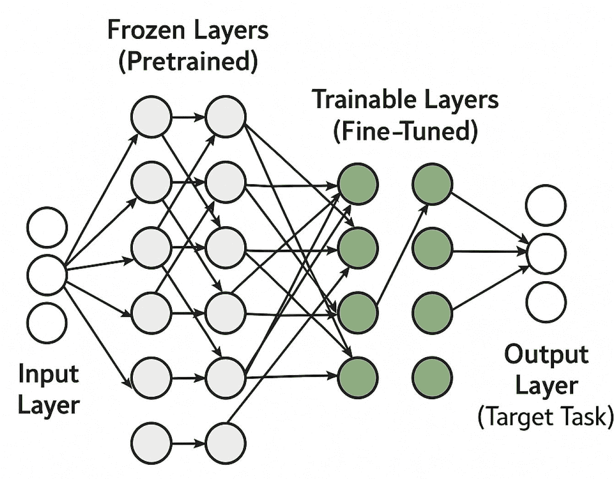
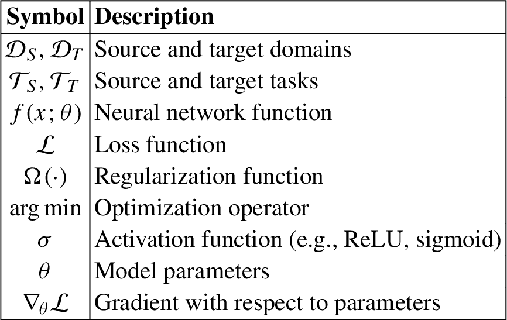
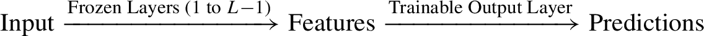
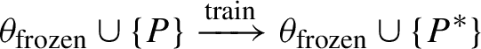

# 3. 高性能 GPU 工作负载的深度学习架构

## 3.1 基于 GPU 加速的迁移学习

从零开始开发了几种卷积神经网络后，很明显这些模型可以从数据中学习相关特征。然而，仍有相当大的改进空间。可以通过对模型配置进行广泛的实验来追求改进，例如修改层数、调整学习率或改变每层的神经元数量。然而，这种试错方法通常既费时又费力。

与从头开始构建模型相比，一种实用的替代方法是应用*迁移学习*。这种技术涉及利用预训练模型——那些已经从大规模数据集中学习到有意义模式（权重）的模型——并将它们适应到新的但相关的问题。迁移学习提供了两个显著的优势：它允许使用已知在类似任务上表现良好的既定神经网络架构。它允许重用学习到的表示，通常在相对有限的自定义数据上实现高性能。这种方法显著减少了开发时间，同时提高了模型的有效性，使其成为现代深度学习工作流程中广泛采用的战略。

当与*GPU 加速*结合使用时，迁移学习的优势进一步放大。由于能够在大型矩阵运算上执行并行计算，预训练模型在 GPU 上可以显著更快地进行微调。迁移学习与 GPU 硬件加速之间的这种协同作用加速了训练过程，并使研究人员能够高效地处理更大的数据集和更复杂的模型。因此，从时间和计算成本的角度来看，部署深度学习解决方案变得更加可行。

### 3.1.1 动机和需求

现代深度学习模型在具有数百万精心标注示例的任务上通常表现出色。然而，构建这样的大型数据集成本高昂、耗时且在特定领域往往不可行。迁移学习通过重用从数据丰富的源任务中学习到的表示（权重）来启动数据稀缺的目标任务的学习，从而解决了这一限制。引入先验知识减少了达到有竞争力准确率所需的有标签数据和计算预算。这使得最先进的视觉和语言模型对较小的组织、研究小组和边缘部署系统变得可访问，这些组织或系统负担不起大量的标注工作或长时间的训练周期。迁移学习的一般模型如图 3.1 所示。

图 3.1

迁移学习的一般模型包括输入层、冻结层、可训练层和输出层。显示了从输入层到输出层无权重的流动。

### 3.1.2 迁移学习的数学模型

让我们定义我们数学模型中使用的符号如下：

迁移学习利用源域和任务的知识来提高目标域和任务的学习，尤其是在标记数据稀缺的情况下。

让我们定义源域和目标域以及任务如下：

+   **源域:** $$$ \mathcal {D}_S = \{ \mathcal {X}_S, P_S(X) \} $$$

+   **源任务:** $$$ \mathcal {T}_S = \{ \mathcal {Y}_S, f_S(\cdot ) \} $$$

+   **目标域:** $$$ \mathcal {D}_T = \{ \mathcal {X}_T, P_T(X) \} $$$

+   **目标任务:** $$$ \mathcal {T}_T = \{ \mathcal {Y}_T, f_T(\cdot ) \} $$$

迁移学习的目标是利用从 $$$ f_S(\cdot ) $$$ 获取的知识在 $$$ \mathcal {D}_T $$$ 上学习预测函数 $$$ f_T(\cdot ) $$$，即使当 $$$\displaystyle \begin{aligned} \mathcal{D}_S \ne \mathcal{D}_T \quad \text{或} \quad \mathcal{T}_S \ne \mathcal{T}_T \end{aligned} $$$ (3.1)

深度神经网络可以表示为 $$$\displaystyle \begin{aligned} f(x; \theta) = f_n \circ f_{n-1} \circ \dots \circ f_1(x) \end{aligned} $$$ (3.2) 其中

+   $$$ x \in \mathbb {R}^d $$$ 是输入向量，

+   $$$ f_i(x) = \sigma (W_i x + b_i) $$$ 是第 $$$ i $$$ 层的激活，

+   $$$ \theta = \{ W_i, b_i \}_{i=1}^{n} $$$ 是模型参数。

在迁移学习中，我们通常冻结第 $$$ 1 $$$ 层到第 $$$ k $$$ 层，并微调第 $$$ k+1 $$$ 层到第 $$$ n $$$ 层。

我们的目标是在目标任务上最小化特定任务的损失：$$$\displaystyle \begin{aligned} \min_{\theta_T} \mathcal{L}_T(f_T(x; \theta_T), y_T) + \lambda \cdot \Omega(\theta_T) \end{aligned} $$$ (3.3) 其中

+   $$$ \mathcal {L}_T $$$ 是损失函数（例如，交叉熵），

+   $$ \Omega (\theta _T) $$ 是正则化项（例如，$$ \|\theta _T\|_2² $$），

+   $$ \lambda $$ 是正则化权重。

深度学习计算涉及高维线性代数，非常适合在 GPU 上并行执行。常见操作包括 $$\displaystyle \begin{aligned} Z = WX + b \end{aligned} $$（3.4）其中

+   $$ W \in \mathbb {R}^{m \times d} $$ 是权重矩阵，

+   $$ X \in \mathbb {R}^{d \times n} $$ 是输入矩阵（输入批次），

+   $$ b \in \mathbb {R}^{m} $$ 是偏置向量，

+   $$ Z \in \mathbb {R}^{m \times n} $$ 是激活输入。

通过并行执行矩阵乘法和激活操作，GPU 通过库如`cuBLAS`和`cuDNN`加速训练。

1.  使用在 ImageNet 上预训练的 ResNet-50：$$ f_S(x; \theta _S) $$

1.  应用到数据有限医学影像数据集：$$ \mathcal {D}_T $$

1.  冻结基层（特征提取器），微调最终层：$$$\displaystyle \begin{aligned} \hat{y} = \text{softmax}(W_T h + b_T) \end{aligned}$$$

    其中 $$ h = f_k(x; \theta _S) $$ 是冻结基的输出。

1.  使用交叉熵损失：$$$\displaystyle \begin{aligned} \mathcal{L} = -\sum_{i=1}^C y_i \log(\hat{y}_i) \end{aligned}$$$

### 3.1.3 与 GPU 的相关性

神经网络的正向和反向传播涉及大规模矩阵运算，如 $$\displaystyle \begin{aligned} Z = W X + b \end{aligned} $$（3.5）其中 $$ W \in \mathbb {R}^{m \times d} $$，$$ X \in \mathbb {R}^{d \times n} $$，和 $$ b \in \mathbb {R}^m $$。这些操作计算密集，并且由于矩阵乘法和激活函数的高度并行性，从 GPU 加速中受益显著。

使用支持 GPU 的库（例如，cuDNN，cuBLAS），训练和微调过程比仅使用 CPU 的环境快 10$$$\times$$$到 100$$$\times$$$。这允许快速适应新领域的大型模型，数据量最小。

## 3.2 微调预训练模型时的 GPU 优势

微调是一种机器学习技术，它通过选择性地更新参数来调整预训练模型以执行特定任务或解决特定用例。它属于更广泛的概念迁移学习，该学习利用模型已经获得的知识来解决新的、相关的问题。在深度学习中，微调特别有价值，因为从头开始训练具有数百万或数十亿参数的模型可能既昂贵又耗时。相反，开发者可以改进现有的模型——例如，用于自然语言处理的大型语言模型（LLMs）或用于计算机视觉的卷积神经网络（CNNs）和视觉变换器（ViTs）——以更有效地实现特定任务的性能。这种方法显著减少了创建针对利基应用的专用模型所需的计算资源和标记数据。例如，它可以调整模型的行为，如改变聊天机器人的语气或增强具有特定艺术风格的图像生成模型。微调还允许组织将专有或特定领域的数据集成到模型的训练中，提高其独特需求的关联性和准确性。微调是定制强大预训练模型的一种实用策略，使高级人工智能更加易于访问和适应。

### 3.2.1 微调与训练的比较

虽然微调是一种模型训练方法，但它与通常所说的机器学习中的“训练”有显著区别。为了避免混淆，从零开始训练模型的第一阶段通常被称为**预训练**，尤其是在与微调对比时。表 3.1 展示了预训练与微调之间的概念差异。

### 3.2.2 微调技术

微调通过选择性地更新参数来调整预训练模型以适应新任务。这种方法允许模型保留通用知识，同时学习特定领域的特征。以下技术通常用于有效地微调深度学习模型：

表 3.1

预训练与微调之间的差异

| 方面 | 预训练 | 微调 |
| --- | --- | --- |
| 定义 | 在大型数据集上对模型进行初始训练以学习通用特征或表示 | 在较小的、特定任务的较小数据集上对预训练模型进行进一步训练 |
| 数据需求 | 需要大规模数据集，通常是未标记的 | 需要较小、通常是标记的特定任务数据集 |
| 学习状态 | 模型从随机权重（无先验知识）开始 | 模型从预训练中学习的权重开始 |
| 目的 | 学习可以转移到许多任务中的通用知识 | 将模型适应到特定的用例或领域 |
| 训练成本 | 由于大型数据集和长时间训练，计算成本高 | 训练时间短，数据有限，成本较低 |
| 过拟合风险 | 由于数据集大，不太可能过拟合 | 如果数据集小且模型没有适当正则化，风险较高 |
| 典型用例 | 基础模型开发、通用 LLM、ViT 等视觉模型 | 针对特定任务的适应，如特定领域的聊天机器人、定制图像分类器 |

+   **初始化新模型：**

    +   特征提取器（编码器）使用预训练模型的参数进行初始化。

    +   输出层（解码器/分类器）是随机初始化的，因为标签空间通常与原始任务不同。

+   **从局部最小值开始：** 由于模型开始时有一组已学习的参数，它开始接近损失景观中的局部最小值，从而加速收敛。

+   **使用较小的学习率：** 微调通常使用较小的学习率，以对预训练权重进行细微、可控的更新。这有助于保留在初始训练期间获得的有用知识。

+   **训练几个周期：** 由于模型已经学习了一般表示，它通常只需要在目标数据集上进行几个额外的训练周期。

+   **正则化搜索空间：** 可以使用权重衰减、dropout 或冻结早期层等技术来防止过拟合并约束优化过程，尤其是在训练数据有限的情况下。

#### 3.2.2.1 冻结底层

在深度神经网络中，学习在层之间分层发生。底层（靠近输入）通常学习低级、通用特征，如边缘、纹理和简单形状。这些特征在很大程度上与数据集无关，构成了视觉理解的基础构建块。相比之下，上层（靠近输出）捕获高级、特定任务的模式，如物体部分或语义类别，这些在任务和数据集之间差异很大。

从概念上讲，架构看起来像：

在微调过程中，一种常见的策略是冻结预训练模型的底层，即防止其权重被更新，而仅在新的数据集上重新训练顶层。这项技术确保了低级通用特征保持完整，保留了模型之前获得的知识。同时，上层被重新训练或重新初始化以适应新任务的具体特征和标签空间。底层冻结提供了几个好处。它显著减少了可训练参数的数量，从而加快了收敛速度并降低了计算成本。此外，它是一种有效的正则化方法，有助于在使用小任务特定数据集时避免过拟合。当新任务与模型训练的原任务密切相关时，这种策略是有益的，它允许高效地迁移学习到的表示。

预训练模型通常是在大规模数据集上开发的——最常见的是在图像分类任务中——在这些任务中，有大量的标记数据可用。这些模型在早期层学习了一般化的特征表示，例如边缘、纹理和形状，这些特征并不特定于任何单个数据集。一旦训练完成，学到的权重就作为一系列下游任务的强大初始化点，例如目标检测、分割或特定领域的分类问题。

通过用预训练权重初始化新模型，微调可以在训练期间实现更快的收敛，因为模型是从一个知情状态而不是从随机初始化开始的。这不仅减少了训练周期和计算成本，还可以提高性能，尤其是在下游任务训练数据有限的情况下。因此，预训练和微调的结合使得在不同计算机视觉应用之间实现高效和有效的迁移学习成为可能。

#### 3.2.2.2 参数高效微调（PEFT）

参数高效微调（PEFT）技术通过只更新一小部分参数来实现与完整模型微调相当的性能，从而提供了一个有吸引力的替代方案。这种选择性的训练减少了计算开销和存储需求，使其适合在资源受限的环境中部署大型语言模型（LLMs）。此外，PEFT 有助于缓解灾难性遗忘的问题——这是全微调过程中常见的问题——当模型在新的任务上训练时，会丢失之前获得的知识。

PEFT 方法在低数据场景中表现出优异的性能，在这些场景中，完整的微调可能导致过拟合或不稳定收敛。此外，这些方法更有效地泛化到域外任务，增强了模型在实际应用中的鲁棒性。PEFT 通过关注最小但影响深远的参数更新，实现了高效的适应，同时保留了预训练模型的核心能力。

低秩适应（LoRA）

通过更新所有权重来训练大型语言模型（LLMs）在计算上可能是不可行的，尤其是由于 GPU 内存限制。在各种参数高效微调（PEFT）方法中，**低秩适应（LoRA）**已成为最有效的技术之一。LoRA 显著减少了可训练参数的数量，使得 LLMs 在最小资源使用的情况下也能进行定制。

为了说明，考虑一个简化的场景，其中 LLM 包含一个单一的权重矩阵 $$$ W $$$. 在标准微调过程中，优化器通过反向传播根据损失函数计算梯度估计 $$$ \Delta W $$$, 权重更新由以下公式给出：$$$\displaystyle \begin{aligned} W_{\text{updated}} = W + \Delta W \end{aligned} $$$(3.6)

如果 $$$ W $$ 含有，例如，七十亿个参数，那么 $$$ \Delta W $$ 也包含七十亿个元素，导致高内存和计算需求。LoRA 通过将 $$$ \Delta W $$ 表示为两个远小矩阵的低秩乘积来解决这一问题。具体来说，它学习矩阵 $$$ A \in \mathbb {R}^{d \times r} $$$ 和 $$$ B \in \mathbb {R}^{r \times k} $$$，使得$$$\displaystyle \begin{aligned} \Delta W \approx A B \end{aligned} $$$(3.7)

在这里，$$ r \ll \min (d, k) $$ 是一个控制性能和内存节省之间权衡的秩超参数。LoRA 不是直接更新 $$$ W $$$, 而是在保持 $$$ W $$ 冻结的同时将 $$$ AB $$ 注入前向传递：$$$\displaystyle \begin{aligned} W_{\text{updated}} = W + A B \end{aligned} $$$(3.8)

这种分解显著减少了需要训练的参数数量，同时保持了模型的表达能力。该技术在资源有限的环境中和适应新任务时特别有效，使其成为现代 LLMs PEFT 方法的基石。

#### 3.2.2.3 提示调整

提示微调是一种参数高效的微调技术，旨在通过学习一组称为*软提示*的可训练向量来适应大型语言模型（LLMs）。与全微调不同，全微调会更新所有模型权重，提示微调保持预训练模型的参数冻结，并通过监督学习优化提示嵌入。这些软提示向量通常数量在 20 到 100 之间，被添加到输入嵌入序列之前，以指导模型以特定任务的方式行为。这种技术在计算资源有限或需要快速适应多个任务时特别有用。

从数学上考虑，考虑一个标记序列的输入$$ X = [x_1, x_2, \ldots , x_n] $$，对应的嵌入为$$ E_X = [e_1, e_2, \ldots , e_n] $$，其中$$ e_i \in \mathbb {R}^d $$。在提示微调中，引入了一组可学习的提示向量$$ P = [p_1, p_2, \ldots , p_m] $$，其中每个$$ p_j \in \mathbb {R}^d $$，这些软提示被添加到输入嵌入之前：$$\displaystyle \begin{aligned} \tilde{X} = [p_1, p_2, \ldots, p_m, e_1, e_2, \ldots, e_n] \end{aligned} $$（3.9）模型$$ \mathcal {M} $$以$$ \tilde {X} $$作为输入，在训练过程中，仅更新$$ P $$中的参数：

（3.10）其中，$$ \theta _{\text{frozen}} $$表示 LLM 的冻结参数，$$ P^* $$表示优化的软提示向量。

提示微调相较于其他 PEFT 方法具有几个优势。它需要显著更少的可训练参数，减少了内存和计算成本。这使得它在多任务或多领域设置中特别有利，在这些设置中，部署单独的全微调模型将是不切实际的。此外，由于核心模型保持不变，提示微调允许无缝的任务切换和更快的实验，同时仍然实现有竞争力的性能，尤其是在低资源和域外泛化场景中。

### 3.2.3 GPU 在微调中的作用

图形处理单元（GPUs）在微调深度学习模型中发挥着至关重要的作用，因为它们能够高效地执行高度并行的计算。微调涉及通过正向和反向传播更新预训练模型的权重，这严重依赖于矩阵乘法和张量运算。

这些计算密集型操作从 GPU 的并行架构中受益显著。与 CPU 相比，GPU 可以同时处理大量数据批次，大大加快训练过程。此外，GPU 提供高带宽内存（如 GDDR6 或 HBM），这对于处理 BERT、GPT 或 ResNet 等模型在微调期间的大参数大小和中间激活至关重要。

通过利用 GPU，数据科学家和研究人员可以在传统硬件上所需时间的一小部分内进行微调。TensorFlow 和 PyTorch 等深度学习框架经过优化，可以在 GPU 上高效运行，进一步简化流程，并使模型能够有效适应特定领域或任务。

微调是通过在较小的、特定任务的训练数据集上继续训练来调整预训练模型$$$\mathcal {M}_{\theta }$$$的过程。模型参数$$$\theta $$$

### 3.2.4 前向传播

给定输入$$$\mathbf{x} \in \mathbb {R}^n$$$, 模型使用当前参数$$$\theta $$$

### 3.2.5 损失函数

损失$$$\mathcal {L}$$$是在预测输出$$$\hat {y}$$$和真实标签*y*之间计算的：$$$\displaystyle \begin{aligned} \mathcal{L}(\theta) = \ell(\hat{y}, y) = \ell(\mathcal{M}_{\theta}(x), y) \end{aligned} $$$ (3.12)

常见的损失函数包括回归中的均方误差（MSE）或分类中的交叉熵损失。

### 3.2.6 反向传播和梯度更新

计算损失相对于模型参数的梯度：$$$\displaystyle \begin{aligned} \nabla_{\theta} \mathcal{L} = \frac{\partial \mathcal{L}}{\partial \theta} \end{aligned} $$$ (3.13)

使用随机梯度下降（SGD）或其变体（如 Adam），模型参数更新如下：$$$\displaystyle \begin{aligned} \theta_{t+1} = \theta_{t} - \eta \cdot \nabla_{\theta} \mathcal{L} \end{aligned} $$$ (3.14) 其中$$$\eta $$$

### 3.2.7 一个例子

假设一个具有一个输入神经元和一个输出神经元的预训练线性模型：$$$\displaystyle \begin{aligned} \hat{y} = w \cdot x + b \end{aligned}$$$ 给定：$$$\displaystyle \begin{aligned} w = 0.5,\quad b = 0.1,\quad \text{输入 } x = 2.0,\quad \text{真实标签 } y = 1.5 \end{aligned}$$$

### 3.2.8 前向传播

$$$\displaystyle \begin{aligned} \hat{y} = 0.5 \cdot 2.0 + 0.1 = 1.0 + 0.1 = 1.1 \end{aligned}$$$

### 3.2.9 损失计算（均方误差）

$$$\displaystyle \begin{aligned} \mathcal{L} = \frac{1}{2}(y - \hat{y})² = \frac{1}{2}(1.5 - 1.1)² = \frac{1}{2}(0.4)² = 0.08 \end{aligned}$$$

### 3.2.10 反向传播（梯度计算）

$$\displaystyle \begin{aligned} \frac{\partial \mathcal{L}}{\partial \hat{y}} = \hat{y} - y = 1.1 - 1.5 = -0.4 \end{aligned}$$ $$\displaystyle \begin{aligned} \frac{\partial \mathcal{L}}{\partial w} = \frac{\partial \mathcal{L}}{\partial \hat{y}} \cdot \frac{\partial \hat{y}}{\partial w} = -0.4 \cdot x = -0.4 \cdot 2.0 = -0.8 \end{aligned}$$ $$\displaystyle \begin{aligned} \frac{\partial \mathcal{L}}{\partial b} = \frac{\partial \mathcal{L}}{\partial \hat{y}} \cdot \frac{\partial \hat{y}}{\partial b} = -0.4 \cdot 1 = -0.4 \end{aligned}$$

### 3.2.11 参数更新（使用 SGD，$$$\eta = 0.1$$$）

$$\displaystyle \begin{aligned} w_{\text{new}} = w - \eta \cdot \frac{\partial \mathcal{L}}{\partial w} = 0.5 - 0.1 \cdot (-0.8) = 0.5 + 0.08 = 0.58 \end{aligned}$$ $$\displaystyle \begin{aligned} b_{\text{new}} = b - \eta \cdot \frac{\partial \mathcal{L}}{\partial b} = 0.1 - 0.1 \cdot (-0.4) = 0.1 + 0.04 = 0.14 \end{aligned}$$

## 3.3 计算机视觉中的微调

在计算机视觉（CV）中，知识迁移是指利用在大规模、标记数据集（如 ImageNet）上预训练的模型，用于具有小得多数据集的新任务。这种方法在图像分类中效率很高，因为标记数据相对便宜且丰富。核心思想是，在大数据集上通过深度模型学习到的表示和特征可以很好地泛化到其他相关任务。一旦模型学会了检测基本模式，如边缘、纹理和形状，这些特征就可以被重用（迁移）用于其他视觉问题，如目标检测、分割或专门的分类任务——通常数据集比原始训练集小 10-100 倍。这个过程显著降低了在定制应用中训练高性能模型所需的数据和计算需求。微调或特征提取技术通常用于适应这些预训练模型以适应新任务或领域的特定特征。

## 3.4 深度网络调优中的 GPU 加速

深度神经网络调优，特别是对于像 CNN、RNN 和 Transformer 这样的大规模模型，需要密集的矩阵运算、梯度传播和迭代优化。这些计算高度可并行化，使得 GPU（图形处理单元）对于加速训练和微调过程至关重要。具有数千个并行核心的 GPU 非常适合高效执行大规模张量运算。

例如，在 CPU 上对预训练的 ResNet-50 模型进行微调以进行高分辨率医学图像分类可能会非常耗时。高性能的 GPU，如 NVIDIA A100 或 RTX 4090，可以显著减少每个 epoch 的训练时间，从而实现更快的实验和模型收敛。

通过将计算密集型操作（如前向传播、反向传播和权重更新）卸载到专用硬件来实现 GPU 加速。深度学习框架如 PyTorch 和 TensorFlow 通过 CUDA 和 cuDNN 抽象化此功能，它们处理内存分配、内核执行和设备级优化。混合精度训练和批量并行等高级技术通过减少内存消耗和提高吞吐量进一步提高了效率。这些优化共同使得能够跨不同领域可扩展和有效地调整深度学习模型。

## 3.5 GPU 加速的向量搜索索引方法

随着大规模嵌入模型和向量数据库的增长，近似最近邻（ANN）搜索已成为关键的计算组件。GPU 加速的索引方法通过显著提高索引构建时间和查询吞吐量，为传统的 CPU 密集型解决方案提供了一种强大的替代方案。RAPIDS cuVS 库支持多种 GPU 优化的索引类型，包括 IVF-Flat、IVF-PQ 和 CAGRA，每种都提供了在准确性、性能和内存使用之间的权衡。

### 3.5.1 IVF-Flat

IVF-Flat（逆文件与平面量化）使用 k-means 将嵌入空间划分为`n_lists`个聚类，并在 GPU 内存中存储精确向量。在搜索过程中，查询最近的`n_probes`个聚类，并在这些分区内部计算精确距离，确保在足够探针的情况下具有高召回率。

+   **索引参数：**

    +   `n_lists`—聚类数量（索引粒度）

    +   `n_probes`—每次查询搜索的聚类数量

+   **优势：** 高召回率，快速基于 GPU 的距离计算，当索引适合 GPU 内存时适用

### 3.5.2 IVF-PQ

IVF-PQ（逆文件与产品量化）通过使用向量量化进行有损压缩扩展了 IVF-Flat。这允许通过参数减少内存占用，在 GPU 上对大规模数据集进行索引：

+   `pq_dim`: 降维后的向量维度

+   `pq_bits`：每维度的位数（通常为 4-8）

压缩存储和近似距离计算使 IVF-PQ 成为最内存高效的 cuVS 索引。通过细化可以进一步提高准确性，其中检索更大的候选集并使用存储在主机内存中的原始向量重新排序。

### 3.5.3 CAGRA

CAGRA（CUDA 加速图检索算法）代表了一种最先进的基于 GPU 的图结构近似最近邻（ANN）方法。它构建了一个固定度 k-NN 图，优化了单次查询或小批量性能。与 HNSW 等分层方法不同，CAGRA 将图子结构映射到 GPU 线程块，以确保并行性。

+   `graph_degree`：搜索图中每个节点的度

+   `intermediate_graph_degree`：控制初始 k-NN 图的质量

+   `itopk_size`、`search_width`、`iterations`：搜索时权衡速度与召回率的参数

CAGRA 通过一致的 GPU 利用实现了低延迟的 ANN 搜索，非常适合具有实时或交互性要求的场景。

每种向量搜索索引技术根据应用需求具有独特的优势和权衡。本章讨论了主要 GPU 加速算法的操作原理，例如 IVF-Flat、IVF-PQ 和 CAGRA，以及影响存储效率、索引构建时间、召回率和查询性能的关键可调参数。在所有用例中，GPU 的利用显著提高了索引速度和搜索吞吐量。

NVIDIA 开发的 RAPIDS cuVS 库是开源的，可在 GitHub 上访问。它提供了全面的文档、可复现的基准测试和示例工作流程，以促进快速采用。cuVS 还可以无缝集成到流行的向量搜索平台如 FAISS 和 Milvus，使实际系统中的灵活部署成为可能。有关持续更新和社区支持，请参阅 RAPIDS AI 频道和文档资源。

### 3.5.4 深度网络调优的 GPU 架构

微调深度神经网络涉及计算密集型操作，如前向传播、反向传播和梯度下降，这些操作高度可并行化。GPU 采用成千上万的较小核心组织成流式多处理器（SM），能够在大量数据批次上同时执行矩阵运算和张量计算。这种并行性显著减少了训练时间并提高了微调期间的吞吐量。此外，GPU 通过专门的张量核心支持混合精度训练，加速矩阵乘法同时节省内存和计算资源。

在架构上，GPU 特有高带宽内存（HBM）、共享内存块和 L2 缓存，以支持快速的数据访问和模型参数的存储。微调流水线得益于优化的软件堆栈，如 CUDA、cuDNN 以及深度学习框架如 PyTorch 和 TensorFlow，这些框架抽象了底层操作，以实现无缝的 GPU 利用。这些框架使得高效的内存管理、自动内核调度和并行优化策略成为可能。因此，GPU 架构是实现可扩展和高效调优的推动力，也是在大规模实际应用中部署时间敏感型模型的关键基础。

## 3.6 微调中的 GPU 优势

在 GPU 上微调预训练模型提供了多个实际和技术的优势，这些优势显著增强了模型开发工作流程：

+   **更快的训练时间：** GPU 可以并行处理数千个操作，显著减少了反向传播和梯度更新的时间。这对于具有数百万或数十亿参数的大规模模型尤其有益。

+   **支持大批量大小：** 由于其高内存带宽和容量，GPU 允许使用更大的批量大小，这可以提高训练稳定性和收敛速度。

+   **高效资源利用：** 微调通常使用的数据集比预训练小。GPU 允许快速迭代这些数据集，从而实现更快的实验和超参数调整，而无需进行完整重新训练的开销。

+   **优化框架集成：** 深度学习框架如 PyTorch、TensorFlow 和 JAX 提供了开箱即用的 GPU 加速操作。这包括自动微分、内存管理和对混合精度训练的支持，以减少内存使用。

+   **可扩展性：** GPU 架构支持多 GPU 和分布式训练设置，当需要时，允许扩展微调工作负载以适应更大的模型或数据集。

+   **能效：** 虽然 GPU 消耗大量电力，但它们在并行计算方面比 CPU 更节能。这降低了每次训练周期的整体能源成本，尤其是在需要多次重复训练时。

这些优势使 GPU 成为初始模型训练和微调任务中的必备工具，在这些任务中，速度、效率和可扩展性至关重要。这在实际部署中尤为重要，例如，为特定领域（如医疗保健、金融、法律或对话式 AI）定制基础模型。

GPU 架构通过大幅减少每次训练迭代所需的时间和能量，实现了对大型神经网络的实时、可扩展的微调。

## 3.7 概述

本章探讨了 GPU 如何提升高级深度学习架构的性能。它从迁移学习开始，解释了其数学模型以及 GPU 如何加速模型适应。讨论了微调预训练模型，突出了 GPU 在速度和效率方面的优势。计算机视觉中的应用展示了 GPU 驱动的调优的实际益处。本章还涵盖了深度网络优化和向量搜索索引方法（如 IVF-Flat、IVF-PQ 和 CAGRA）的 GPU 加速。它解释了 GPU 如何支持生成模型，如 GAN，提高训练稳定性和输出质量。介绍了 Transformer 模型，并关注了 GPU/TPU 训练策略。还讨论了高效的变体，如 DistilBERT 和 Longformer。介绍了包括批量大小调整、正则化和混合精度训练在内的优化技术。总体而言，本章强调了 GPU 在扩展和精炼深度学习系统中的核心作用。

练习

1.  定义 CUDA 编程模型，并解释它如何支持深度学习应用的异构计算。

1.  描述 SIMT（单指令，多线程）架构。它与传统的 CPU 执行模型有何不同？

1.  讨论 GPU 架构中的各种内存类型。理解内存层次结构如何提高深度学习性能？

1.  解释分块矩阵乘法的概念及其在优化 GPU 上深度学习操作中的作用。

1.  阐述线程级和指令级优化的区别。提供每个如何提高性能的例子。

1.  在 CUDA 的上下文中，异步执行是什么？如何通过重叠计算和通信来提高 GPU 利用率？

1.  描述使用 NVIDIA Nsight 或 nvprof 等分析工具的使用。这些工具如何帮助识别 GPU 性能瓶颈？

1.  讨论梯度检查点。为什么在内存受限的 GPU 上训练大型模型时它很重要？

1.  解释混合精度训练的优势。张量核心如何支持现代 GPU 中的这种方法？

1.  评估优化 GPU 编程中矩阵乘法内核的影响。实现高吞吐量的最佳实践是什么？
