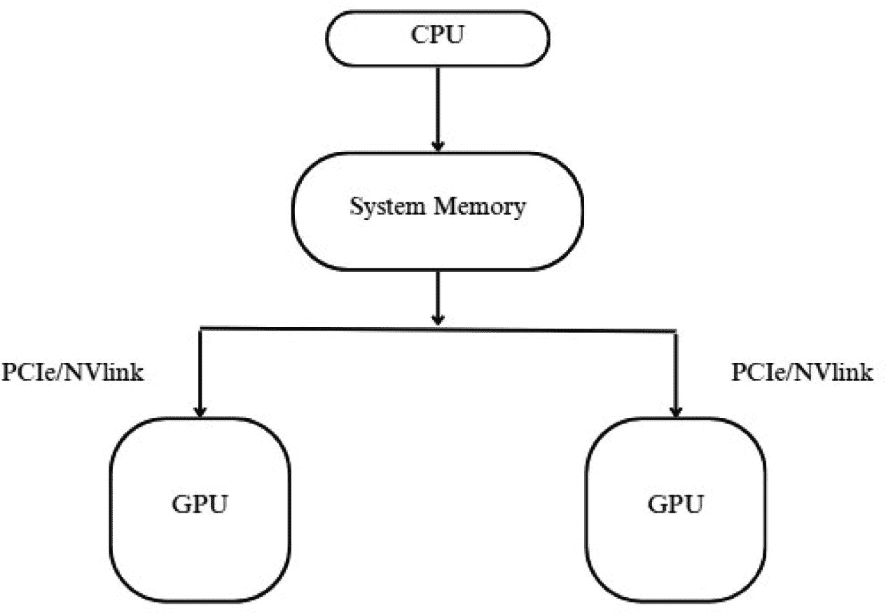
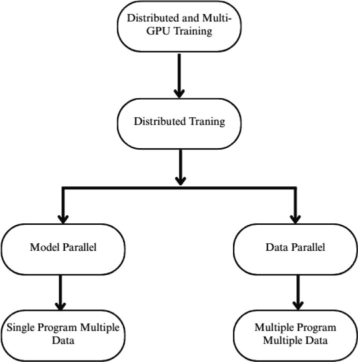
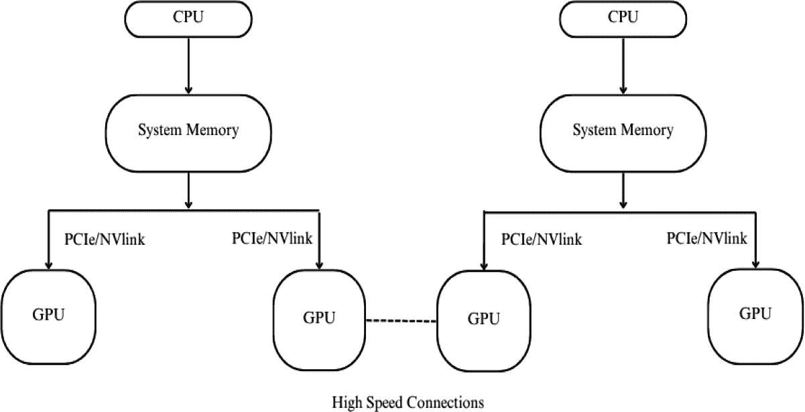

# 5. 分布式和多 GPU 训练策略

## 5.1 分布式深度学习

随着深度学习模型在复杂性和规模上的不断增长，训练它们所需的计算需求已经超过了单 GPU 系统的能力。在自然语言处理（例如，GPT-3）、计算机视觉（例如，EfficientNet、ViT）和生成学习（例如，扩散模型）等领域的最先进模型需要大量的内存和处理能力。分布式深度学习通过允许将数据和模型参数分配到多个 GPU 甚至多台机器上，提供了一种可行的解决方案，从而实现了更快的训练时间、更大的批大小以及处理更复杂架构的能力。

在研究和工业应用中减少训练时间与创新能力速度和成本效率直接相关。在实践中，传统上需要单 GPU 几天才能完成的任务，通常可以通过分布式策略在几小时甚至几分钟内完成。此外，分布式训练促进了迭代实验，使团队能够探索更广泛的超参数、架构和损失函数集。

除了性能之外，对于不适合单个 GPU 内存的模型，分布式训练是必不可少的。模型并行化和梯度检查点等技术允许通过智能地将这些大型模型分配到资源上来进行训练。简而言之，分布式深度学习不再是奢侈品，而是现代机器学习工作流程的必需品。

### 5.1.1 单个 GPU 的限制

虽然单个 GPU 为训练深度学习模型提供了一个强大的计算引擎，但在需要扩展时，它也伴随着显著的限制。首先，内存是最直接的限制因素。流行的 GPU，如 NVIDIA 的 RTX 3090 或 A100，提供 24-80 GB 的内存，这对于训练具有数十亿参数的模型或使用高分辨率大图像以及深度批处理流程来说是不够的。内存溢出会导致内存不足（OOM）错误，或者需要降低批大小或输入维度的低效解决方案，这会降低模型性能和训练稳定性。

其次，单个 GPU 的训练往往较慢，尤其是在处理大型数据集时。这增加了收敛时间，并限制了一个人实际能够承担的训练迭代次数。缓慢的训练阻碍了快速实验，这是现代人工智能研究和开发的基础。此外，无法扩展到多个设备意味着云或 HPC 环境中的计算资源未被充分利用，降低了整体吞吐量。

另一个关注点是容错性和可重复性。单 GPU 训练流程对硬件故障的抵抗力较弱。如果在训练过程中进程崩溃，通常没有定期检查点就无法轻松恢复。此外，当数据加载、增强和批量处理没有针对大规模操作进行优化时，保持运行性能的一致性也很困难。

在单节点多 GPU 配置中，多个 GPU 安装在同一台物理机器内，共享系统的 CPU 和内存资源，如图 5.1 所示。这些 GPU 通过高速互连，如 PCI Express (PCIe) 或 NVIDIA NVLink 连接，NVLink 提供了更高的带宽和更低的延迟——这对于同步模型参数和梯度特别有益。这种架构非常适合数据并行，其中每个 GPU 存储模型的一个相同副本，并并行处理一个单独的小批量。在反向传播之后，使用集体操作（如 AllReduce）聚合梯度，由 NVIDIA 集体通信库（NCCL）高效管理。由于设计简单且通信开销相对较低，单节点多 GPU 设置通常是扩展深度学习工作负载的首选起点。

在多节点多 GPU 训练中，工作负载被分配到多台机器上，每台机器配备一个或多个 GPU。当单个系统无法提供足够的内存容量或计算能力来处理模型或数据集时，这种方法变得不可或缺。与受益于高速本地互连的节点内通信不同，节点间训练依赖于网络基础设施，如高速以太网或 InfiniBand。虽然这些网络能够实现可扩展性，但它们引入了额外的复杂性，包括机器同步、分布式数据分片以及更高通信延迟的管理。此类系统的效率受到网络拓扑和互连技术的强烈影响，因为这些决定了梯度聚合和参数同步可用的带宽和延迟。

图 5.1

单节点多 GPU 架构中，CPU 通过系统内存协调数据处理。每个 GPU 通过 PCIe 或 NVLink 连接到 CPU。GPU 在工作负载的不同部分并行工作，NVLink 提供的互连速度比 PCIe 更快。

GPU 互连拓扑——包括环形、树形和网状配置——在分布式训练的可扩展性和效率中起着决定性作用。例如，环形 AllReduce 算法因其简单性和可预测的通信模式而被广泛采用于数据并行设置中的梯度聚合。然而，随着参与 GPU 数量的增加，通信开销可能会成为性能瓶颈。重叠通信与计算、流水线数据传输和应用梯度压缩等优化技术经常被采用以减轻这些影响。

现代深度学习框架提供了对多 GPU 和多节点配置的强大、内置支持。在 PyTorch 中，Data Parallel、Distributed Data Parallel 和 torchrun 实用工具简化了跨设备的可扩展训练。TensorFlow 通过 MirroredStrategy 和 MultiWorkerMirroredStrategy 提供类似的功能，抽象化了分布式执行的大部分复杂性。除此之外，如 Horovod 和 Deep Speed 等专用库扩展了这些功能，实现了混合并行、内存高效优化器以及针对大规模工作负载的增强通信性能。

## 5.2 单节点多 GPU 训练

单节点多 GPU 训练通常是扩展深度学习工作负载最易访问的方法。在这种配置中，所有 GPU 都位于单个主机系统中，并共享相同的内存总线和 CPU 环境。这种架构消除了分布式存储、节点间同步和网络延迟的复杂性，使其非常适合早期实验、快速原型设计和中等规模的生产工作负载。

训练过程通常遵循数据并行范式，其中完整模型副本放置在每个 GPU 上，并且小批量数据被分配到各个设备上。在正向和反向传播之后，在更新模型参数之前必须同步梯度更新。高效的梯度同步对于防止瓶颈并确保 GPU 间的收敛一致性至关重要。

### 5.2.1 NCCL 和 CUDA 感知的集体操作

为了实现高效的节点内通信，NVIDIA 集体通信库（NCCL）是深度学习框架的标准选择。NCCL 为集体操作如 AllReduce、Broadcast、AllGather 和 ReduceScatter 提供了高度优化的原语。在分布式训练期间，这些操作对于同步 GPU 间的梯度和参数至关重要。

NCCL 是为了利用硬件特定的特性，如 NVLink 和 GPUDirect RDMA，以实现低延迟、高吞吐量的通信而设计的。它支持基于环形和树形算法的集体操作，根据 GPU 的数量及其互连拓扑结构动态优化通信模式。借助 PyTorch 的“DistributedDataParallel”或 TensorFlow 的“tf.distribute”等框架，NCCL 显著提高了吞吐量，同时减少了通信中 CPU 的参与，使得计算和数据传输可以重叠。

CUDA 感知集体操作通过允许直接 GPU 到 GPU 的内存交换，而不通过主机内存进行中转，从而进一步提高了效率。这使其能够与 cuDNN 和 cuBLAS 操作无缝集成，使得端到端 GPU 训练管道更加高效和可扩展。

### 5.2.2 GPU 拓扑和 PCIe/NVLink 考虑因素

单个节点中 GPU 的物理排列和互连方式对通信效率有深远影响。常见的拓扑包括线性（链）、网格和全连接 NVLink 配置。配备 NVIDIA 的 NVLink 的系统提供比标准 PCIe 接口更高的带宽（最新型号的聚合带宽高达 600 GB/s）和更低的延迟。NVLink 对于具有高同步频率或大型模型状态传输的工作负载特别有益。

相比之下，基于 PCIe 的系统可能会表现出非均匀内存访问（NUMA）特性，其中数据传输速度取决于 GPU 的放置和插座配置。使用“nvidia-smi topo –matrix”或 NVIDIA 的系统管理接口等工具理解系统的 GPU 拓扑可以帮助优化 GPU 放置和调整线程亲和力。

此外，高端深度学习服务器，如 NVIDIA DGX 系列，专门设计有优化的 NVLink 拓扑，以确保 GPU 之间的全对全连接，从而为深度学习训练提供卓越的扩展性。当此类系统不可用时，基于软件的拓扑感知调度和手动亲和力调整可以部分缓解标准 PCIe 基于机器的互连限制。

### 5.2.3 多节点多 GPU 训练

随着深度学习应用的进一步扩展，计算多个节点（每个节点有一个或多个 GPU）的集群的需求变得至关重要。多节点多 GPU 训练允许从业者处理超出单个服务器限制的巨大模型和数据集。它扩展了物理机器的扩展性，同时保持模型参数、梯度和优化器状态的同步。图 5.2 展示了单个节点 GPU 使用高速网络连接的方式。

图 5.3

分布式和多 GPU 训练策略的流程图。它说明了关键方法，如数据并行，其中每个 GPU 处理数据的一个子集并同步梯度；模型并行，其中模型的不同部分分布在多个 GPU 上；混合并行，结合了这两种策略；以及用于集中更新梯度的参数服务器架构。这些策略使跨多个设备和节点进行可扩展和高效的训练成为可能。

图 5.2

多节点多 GPU 架构，其中每个节点都有自己的 CPU、系统内存和通过 PCIe 或 NVLink 连接的多个 GPU。节点通过高速互连（如 InfiniBand 或高带宽以太网）相互通信，使跨大型 GPU 集群的分布式训练成为可能。

在这种配置中，每个节点将其计算和内存资源贡献给全局训练任务。由于延迟增加、分布式数据管理、同步协议和容错机制，这些节点之间的协调变得复杂。像 PyTorch（通过“torch.distributed”和“torchrun”）和 TensorFlow（通过“MultiWorkerMirroredStrategy”）这样的框架提供了管理多节点分布式训练的抽象。此外，Horovod、DeepSpeed 和 Ray Train 库通过内置的节点间通信和优化支持，实现了无缝扩展。

图 5.3 展示了在多个 GPU 或分布式系统上高效训练深度学习模型。在数据并行中，数据集被分配到 GPU 或节点之间，每个节点运行一个完整的模型副本；然后使用如 AllReduce 等方法同步梯度，以确保一致的更新。模型并行将模型的不同部分分布在多个 GPU 上，使得无法适应单个 GPU 内存的大型模型得以训练。混合并行合并了这两种方法以优化性能和内存利用率。此外，参数服务器架构允许工作节点计算梯度并将它们发送到集中服务器进行更新和重新分配模型参数。这些策略对于扩展工作负载、减少训练时间以及管理超出单设备容量的数据集或模型至关重要。

#### 5.2.3.1 网络互连：以太网与 InfiniBand

网络互连在多节点训练的性能和效率中起着关键作用。两种常见的互连类型是

+   **以太网：** 最广泛可用的互连，通常提供 1 Gbps 到 100 Gbps 的带宽。虽然以太网具有成本效益且易于部署，但其较高的延迟和较低的吞吐量使其对于高度同步的训练工作负载（尤其是涉及频繁梯度交换和参数更新的工作负载）来说不是最佳选择。

+   **InfiniBand:** 一种在 HPC 和 AI 集群中广泛使用的高性能网络互连。它支持比以太网显著更高的带宽（现代 HDR/NDR 标准下高达 400 Gbps）和更低的延迟。InfiniBand 还支持 RDMA（远程直接内存访问），允许数据在节点之间直接移动，无需 CPU 参与，从而减少通信开销。

互连选择会影响收敛时间、扩展效率和网络竞争。对于大规模训练（尤其是在数据中心和云集群中），由于其卓越的通信特性，InfiniBand 通常更受欢迎。

表 5.1 给出了单节点与多节点 GPU 之间的重要比较。

表 5.1

单节点多 GPU 与多节点多 GPU 训练比较

| 方面 | 单节点多 GPU | 多节点多 GPU |
| --- | --- | --- |
| 硬件配置 | 所有 GPU 都安装在同一个物理机器上。 | GPU 分布在多个互连机器（节点）上。 |
| 通信开销 | 由于高速节点间互连（例如，NVLink、PCIe）的低延迟。 | 由于网络通信（以太网或 InfiniBand）的高延迟。 |
| 可扩展性 | 受限于单台机器中 GPU 的最大数量。 | 通过添加更多节点，可扩展到数百或数千个 GPU。 |
| 成本和维护 | 成本较低，维护简单；只需管理一个系统。 | 成本较高，复杂度较高；需要维护多台机器和网络。 |
| 用例 | 适用于适合单台机器内存和带宽的小到中等规模模型。 | 对于非常大的模型或数据集，需要使用，这些数据集超出了单机容量。 |
| 示例应用 | 中等数据集上的图像分类、目标检测。 | 大规模 NLP 模型、大规模推荐系统、科学模拟。 |

#### 5.2.3.2 分布式存储和 I/O 限制

多节点训练系统还需要高效的存储解决方案来管理大型数据集、模型检查点、日志和辅助数据。由于

+   **带宽瓶颈：** 多个节点同时读写操作可能会饱和网络附加存储（NAS）或共享文件系统的带宽。

+   **高延迟**：远程 I/O 操作引入的延迟可能会在数据加载未并行化或未有效缓存的情况下阻碍训练。

+   **文件系统限制**：在高度并发负载下，分布式文件系统如 NFS 可能无法提供最佳吞吐量和可靠性。

## 5.3 分布式环境中的资源管理

在分布式深度学习环境中，资源管理对于实现高性能、效率和可扩展性至关重要。随着深度学习模型在规模和复杂性上的增长，训练它们需要跨多个 GPU、CPU、内存池、存储系统和互连进行协调。这些资源的分配不当或管理不善可能导致性能严重下降、延迟增加以及昂贵硬件的低利用率。

分布式资源管理中的一个关键挑战是硬件异构性。分布式集群通常由具有不同能力的节点组成——不同的 GPU 代际、内存大小和网络互连。资源调度器必须了解这些差异，以确保平衡的工作负载分配并避免瓶颈。另一个常见问题是资源竞争。当多个作业竞争共享带宽、存储 I/O 或互连时，拥塞可能会阻碍数据管道和训练吞吐量。可扩展性也提出了另一个挑战；随着节点和 GPU 数量的增加，保持高效的同步、梯度通信和平衡利用变得更加困难。此外，分布式环境天生更容易受到故障的影响——节点故障、磁盘错误或 GPU 崩溃可能会中断训练，使容错和恢复机制变得至关重要。

Kubernetes、SLURM 和 Ray 等编排工具在工业和研究领域被广泛采用，以解决这些挑战。Kubernetes 提供容器化部署、自动缩放和健康检查，而 Kubeflow 和 Volcano 等附加组件扩展了其在 AI 工作负载方面的功能。SLURM 作为高性能计算（HPC）中一个长期存在的调度器，提供了对 GPU 和 CPU 分配、作业排队和多用户公平性的精细控制。另一方面，Ray 提供动态任务调度和资源感知作业放置，使其适用于需要灵活性和低延迟扩展的深度学习任务。

在分布式配置中，使用各种技术来优化资源利用率。数据并行和模型并行有助于将计算和内存负载分配到多个 GPU 上，从而提高吞吐量和内存效率。在内存受限的环境中，梯度累积通过跨较小的 mini-batch 累积梯度，使得有效的批量大小更大。混合精度训练——使用 FP16 而不是 FP32——显著降低了内存使用并加快了训练速度，尤其是在 NVIDIA Tensor Core 支持的 GPU 上。如优先队列和公平算法之类的作业调度策略有助于平衡对延迟敏感的任务与长时间运行的训练作业。抢占和周期性检查点也使得从中断中恢复成为可能，并允许根据变化的集群优先级动态重新分配作业。

监控和性能分析工具对于跟踪系统健康和检测瓶颈是必不可少的。像 NVIDIA 的 DCGM 和“nvidia-smi”这样的实用程序提供了对 GPU 利用率、热度和功耗的洞察。对于训练级别的监控，TensorBoard 和 Weights & Biases 等框架提供了 GPU 使用、训练进度和内存消耗的实时可视化。可以使用 Prometheus 和 Grafana 收集和可视化跨节点的系统级指标。对于细粒度的性能调试，PyTorch 和 TensorFlow 中的分析器能够详细检查内核执行、数据加载时间和跨设备通信模式。

### 5.3.1 多 GPU 配置中的 GPU 内存优化

在多 GPU 训练配置中，有效的内存使用至关重要，尤其是在处理大型模型或高分辨率数据时，这些数据将可用 GPU 内存的极限推向了极限。内存瓶颈可能会阻止扩展并阻碍实验，即使使用像 NVIDIA A100 或 H100 这样的强大 GPU 也是如此。已经开发出各种技术来优化 GPU 内存消耗，同时不牺牲训练性能或收敛性。

#### 5.3.1.1 梯度累积和检查点

梯度累积是一种技术，即使在可用的 GPU 内存无法一次性容纳整个批量时，也能实现使用大批量的实用训练。不是在一次前向-反向传递中处理一个大批量，而是将批量分成较小的 mini-batch，并在多个迭代中累积梯度。一旦处理了所需的 mini-batch 数量，优化器就像整个大批量在一步中处理一样更新模型参数。这种方法降低了峰值内存使用，同时保持了较大批量训练的好处，如改进的梯度估计和训练稳定性。

检查点，也称为激活检查点或梯度检查点，是另一种节省内存的策略。在标准反向传播中，所有中间激活都在正向传递期间存储，以便在反向传递期间重用。这导致内存消耗很高，尤其是在深度模型中。检查点通过选择性地存储仅一部分激活，并在反向传递期间根据需要重新计算其他激活来解决此问题。虽然这种技术由于重新计算而引入了额外的计算开销，但它显著减少了内存使用，使得在现有硬件上训练更深的或更复杂的模型成为可能。

#### 5.3.1.2 张量分片和内存重用

张量分片涉及将模型参数、优化器状态或梯度分布在多个 GPU 上，而不是在每个设备上复制它们。这种技术也称为模型并行或零冗余优化（ZeRO），可以显著减少内存重复并允许每个 GPU 仅处理总内存占用的一小部分。DeepSpeed 和 FairScale 等库通过智能地在 GPU 之间分配内存负载，实现了这些方法，以将模型训练扩展到数百亿个参数。

另一方面，内存重用侧重于减少内存碎片化并最大化 GPU 内存内内存块的重复使用。深度学习框架，如 PyTorch 和 TensorFlow，包括内部内存分配器，用于在训练期间管理动态内存分配。然而，诸如重用缓冲区、融合操作或就地计算等自定义策略可以进一步减少冗余内存使用。这些优化在将大规模数据处理与密集的模型计算相结合时尤其有价值，即使是很小的低效也可能导致内存不足错误。

具体累积、检查点、张量分片和内存重用是多 GPU 训练环境中管理 GPU 内存的强大工具。通过整合这些策略，研究人员和从业者可以训练更大的模型，尝试更深的架构，并更好地利用现有硬件，而不会牺牲性能或可扩展性。

### 5.3.2 调度和负载均衡

高效的调度和负载均衡是分布式深度学习系统性能和可扩展性的基础。随着训练工作负载分布在多个 GPU 或节点上，确保工作负载均匀分布、最优资源利用和最小化空闲时间变得至关重要。管理不善的负载分布可能导致性能瓶颈、资源利用率低下和训练时间增加。调度策略必须具有适应性、硬件感知能力，并能够处理具有不同计算需求的静态和动态工作负载。

#### 5.3.2.1 批大小和动态分配

批处理大小是训练深度学习模型的关键参数，它直接影响到计算负载和内存使用。在多 GPU 环境中，数据并行涉及将每个训练批次分割成更小的迷你批次，分配给单个 GPU。这些分割必须平衡以实现最佳性能，确保所有 GPU 处理相等的工作量。不均匀的批次大小可能导致某些 GPU 提前完成并闲置，等待其他 GPU 完成，从而降低整体吞吐量。

动态分配机制试图通过根据每个 GPU 观察到的计算性能、内存利用率和当前负载在运行时调整批次分布来解决这个问题。这些策略允许速度较快的 GPU 承担略高的工作量份额，而较慢或内存受限的 GPU 处理更小的迷你批次。这种动态平衡提高了整体效率，并更好地利用异构硬件。此外，自适应批次大小可以与强化学习或基于配置文件的反馈循环结合使用，根据系统行为实时调整训练负载。

#### 5.3.2.2 拖沓者和同步挑战

在同步训练设置中，所有 GPU 必须在进行下一迭代之前完成其分配的迷你批次计算。这引入了一个称为“拖沓者效应”的挑战，其中较慢的 GPU 由于硬件限制、竞争或临时负载峰值而延迟整个训练过程。这些拖沓者会大大降低整体训练速度，尤其是随着 GPU 数量的增加。

在这种情况下，同步成为一个关键的瓶颈。如梯度聚合（例如，AllReduce）之类的集体操作需要在设备之间进行协调，最慢的参与者决定了同步的速度。可以采用各种策略来减轻这种情况，例如在计算和通信之间重叠、异步训练、流水线和推测执行。一些系统可能使用梯度陈旧度容忍度，允许较快的节点在不等待每个迭代中的每个拖沓者的情况下继续进行。

硬件感知的调度和 GPU 亲和力调整可以通过将计算密集型工作负载放置在高吞吐量设备上或为较慢的 GPU 优先处理较轻的任务来减少拖沓者的影响。分析工具和实时遥测可以帮助识别和动态重新分配工作负载，以最小化由慢速设备引入的延迟。

### 5.3.3 通信开销

在分布式深度学习中，特别是在多 GPU 和多节点训练环境中，通信开销在确定整体系统性能方面至关重要。随着模型并行化和工作负载的分布，频繁同步梯度、参数和优化器状态变得必要。这些同步步骤通常占用了总训练时间的大部分，尤其是在扩展到大量 GPU 时。管理和最小化通信开销对于实现高效的训练吞吐量和可扩展性至关重要。

#### 5.3.3.1 AllReduce 算法

AllReduce 操作是数据并行训练的核心，其中每个 GPU 为其小批量计算梯度，然后需要将梯度与其他梯度聚合，以便更新模型参数。AllReduce 将所有设备的值合并，并将结果分配给每个设备。存在各种 AllReduce 算法，每种算法根据网络拓扑、GPU 数量和交换数据的大小提供不同的权衡。

最常见的策略之一是环形 AllReduce，其中 GPU 以逻辑环的形式排列，每个 GPU 以流水线方式发送和接收部分数据。环形 AllReduce 在带宽上是最优的，并且随着 GPU 数量的增加而具有良好的可扩展性，但它的性能会随着通信步骤与设备数量的线性增加而下降。基于树的 AllReduce 算法通过分层减少和广播将通信步骤减少到对数规模，这使得它们在大集群中更有效率。分层 AllReduce 通过在每个节点（节点内）和节点之间（节点间）减少梯度，减少了节点间通信流量。如 NVIDIA NCCL、Intel oneCCL 和 Horovod 等库通过硬件特定的优化实现这些算法，以提高性能。

#### 5.3.3.2 延迟与带宽优化

通信开销可以通过两个基本因素来表征：延迟和带宽。延迟是指启动数据传输所需的时间，而带宽定义了每单位时间内可以传输多少数据。在深度学习工作负载中，小张量传输对延迟敏感，而大梯度张量对带宽敏感。优化一个往往以牺牲另一个为代价，因此平衡的方法是必要的。

通过在反向传播仍在进行时重叠通信和计算，可以降低延迟。使用 CUDA 流和非阻塞通信原语，框架可以在完整的反向传播完成之前启动集体操作。对于带宽受限的工作负载，如 8 位量化或梯度稀疏化等技术可以显著减少传输的数据量，尽管需要仔细考虑收敛稳定性。

硬件级优化，如 NVLink 用于节点内通信和具有 RDMA 支持的 InfiniBand 用于节点间传输，大大提高了带宽并减少了 CPU 的参与。工作负载的通信感知放置、拓扑感知的集体算法以及梯度张量的自适应分块也是平衡延迟和带宽的实际技术。

## 5.4 框架级支持和配置

随着分布式深度学习成为训练大规模模型的规范，现代机器学习框架已经发展到提供内置的多 GPU 和多节点训练支持。这些框架抽象了低级通信和同步的复杂性，并提供了灵活的配置接口和编排工具，以部署可扩展和容错的训练管道。其中，PyTorch 由于其模块化架构、动态计算图和广泛的分布式计算支持而成为领先的平台。本节探讨了 PyTorch 分布式训练生态系统的关键组件，包括其核心 API、编排工具以及高效和健壮的大规模训练的推荐实践。

### 5.4.1 PyTorch 分布式训练

PyTorch 为分布式训练提供了广泛的支持，提供了灵活的 API 和工具，使研究人员和工程师能够通过最小化代码更改来扩展跨多个 GPU 和节点的深度学习工作负载。其模块化设计、易用性和活跃的社区使 PyTorch 成为研究和生产环境中的热门选择。无论是运行在单个节点上的多个 GPU，还是扩展到大型集群，PyTorch 的分布式训练模块简化了同步、并行和通信管理。

#### 5.4.1.1 分布式数据并行（DDP）

“DistributedDataParallel” (DDP) 模块是跨多个 GPU 训练 PyTorch 模型的推荐且性能最佳的方式。DDP 通过在每个 GPU 上复制模型，并在反向传播期间使用高性能的集体操作（例如，AllReduce）同步梯度来工作。每个进程独立对其本地数据分片进行正向和反向传播，DDP 通过在每次迭代后聚合梯度来确保模型更新的一致性。

与在单个进程中运行并因梯度收集而遭受 CPU 开销的较老“DataParallel”模块相比，DDP（Distributed DataParallel）在多个进程中运行（通常每个 GPU 一个进程），从而实现更好的扩展性和减少 GPU 间的竞争。PyTorch 与 NCCL、Gloo 和 MPI 等通信后端紧密集成，DDP 利用这些后端进行高效的梯度同步。使用“torch.distributed.init_process_group”和“torch.nn.parallel.DistributedDataParallel”包装器进行适当的初始化，可以实现与现有模型训练循环的无缝集成。

#### 5.4.1.2 TorchElastic 和 TorchRun

PyTorch 提供了像 TorchElastic 和 TorchRun 这样的工具，用于大规模和容错集群训练。TorchElastic 实现了弹性容错训练，其中 worker 在执行过程中可以添加或删除，而无需重新启动作业。这在资源可用性可能波动的抢占式环境中（例如，云 spot 实例）特别有用。

TorchRun，最近 PyTorch 版本中引入的 CLI 实用工具，简化了分布式作业的启动，取代了“python -m torch.distributed.launch”，并支持静态和弹性训练配置。它管理分布式进程的生命周期，自动设置环境变量如“RANK”和“WORLD_SIZE”，并支持通过 SSH 跨多个节点启动。TorchRun 还与 TorchElastic 集成，允许它恢复失败的 worker 并将它们重新加入训练作业。

TorchElastic 和 TorchRun 为生产规模的分布式训练提供了强大的工具，使得在多样化的计算基础设施上实现灵活的作业管理、弹性和易于部署成为可能。

#### 5.4.1.3 最佳实践和调试技巧

尽管 PyTorch 使得分布式训练变得容易，但要实现最佳性能和正确性，需要遵循最佳实践。一个重要的实践是使用“torch.multiprocessing.spawn”或像 TorchRun 这样的作业启动器为每个 GPU 使用单独的进程。每个进程应使用“CUDA_VISIBLE_DEVICES”或“torch.cuda.set_device()”来固定单个 GPU，以避免设备竞争。

正确的随机数生成和同步也是至关重要的。为了可重现性，每个进程必须使用“torch.manual_seed()”设置相同的种子，并通过使用“torch.utils.data.distributed.DistributedSampler”同步数据洗牌，这确保每个 GPU 看到数据集的不同分片。

调试分布式应用程序可能具有挑战性。PyTorch Profiler 等分析器和外部监控器（例如，NVIDIA NSight，nvidia-smi）有助于识别性能瓶颈。在开发过程中，记录每个进程的 rank、使用基于 rank 的命名保存检查点以及将错误隔离到特定 rank 是常用的策略。

虽然 NCCL 针对 NVIDIA 硬件上的多 GPU 训练进行了优化，但在仅 CPU 或异构环境中，Gloo 可能更受欢迎。选择正确的后端和配置环境变量如“NCCL_SOCKET_IFNAME”可以显著影响性能和稳定性。

### 5.4.2 TensorFlow 多工作器策略

TensorFlow 通过其高级“tf.distribute”API 提供了对分布式训练的强大支持，简化了在多个 GPU 或机器上部署模型。在其各种策略中，“MultiWorkerMirroredStrategy”专门设计用于在多个工作器（节点）上训练，每个工作器可能包含各种 GPU。这种策略抽象了通信、同步和变量共享的底层复杂性，允许开发者通过最小的代码更改扩展他们的模型。

#### 5.4.2.1 MirroredStrategy 与 MultiWorkerMirroredStrategy

“MirroredStrategy” 和 “MultiWorkerMirroredStrategy” 是 TensorFlow 中最广泛使用的并行训练策略之一。 “MirroredStrategy” 旨在用于单机多 GPU 训练。它在每个 GPU 上创建模型副本，并使用集体操作（如 AllReduce）同步更新。由于 PCIe 或 NVLink 等低延迟、高带宽的互连，这种策略在单个节点内非常高效。

相比之下，“MultiWorkerMirroredStrategy”是为多节点环境设计的，其中训练分布在多个机器（工作节点）上。每个工作节点运行相同的模型和数据集分片，TensorFlow 使用集体通信库（如 NCCL 或 gRPC）协调它们之间的通信。这种策略的关键优势是其节点间的可扩展性，这对于单机无法处理的超大规模训练任务至关重要。尽管它们的 API 相似，“MultiWorkerMirroredStrategy”需要额外的配置，包括指定集群拓扑和任务角色的环境变量。

#### 5.4.2.2 集群设置和角色配置

为了成功部署“MultiWorkerMirroredStrategy”，正确配置集群至关重要。TensorFlow 使用“TF_CONFIG”环境变量指定训练集群布局。该变量定义了训练作业中每个节点的角色——主要是“chief”、“worker”，以及可选的“evaluator”。“chief”工作节点通常负责模型检查点、日志记录和协调，而“worker”节点则并行执行实际训练。

每个节点都必须有自己的“TF_CONFIG”设置，该设置指示集群中所有节点的 IP 地址和端口号。“TF_CONFIG”中的“task”字段定义了节点在集群中的角色和索引。正确的配置确保所有节点一致地初始化其通信层并开始同步训练。“TF_CONFIG”配置错误可能导致死锁、无响应的工作节点或不一致的模型更新，使其成为分布式 TensorFlow 训练中最关键的组件之一。

#### 5.4.2.3 使用 TensorBoard 进行监控

监控分布式训练进度对于调试、性能调整和实验跟踪至关重要。TensorFlow 与其官方的可视化和监控工具 TensorBoard 无缝集成。在“MultiWorkerMirroredStrategy”的分布式训练中，每个工作节点都可以将日志写入一个共享目录，通常位于所有节点都可以访问的网络文件系统上。主工作节点通常配置为处理摘要写入，但所有工作节点都可以根据用例做出贡献。

一旦启用日志记录，TensorBoard 将可视化关键指标，如训练和验证损失、准确率、学习率计划以及硬件利用率。它还支持分析数据管道、GPU 使用和设备间通信瓶颈的剖析工具。对于多工作进程设置，TensorBoard 可以帮助识别训练过程中的不平衡、落后者或意外的停滞，使其成为分布式深度学习工作流程的关键组件。

### 5.4.3 Horovod 和 DeepSpeed

除了 PyTorch 和 TensorFlow 提供的原生分布式训练功能之外，Horovod 和 DeepSpeed 等库还提供了高级功能和对大规模训练的性能优化。这些框架旨在减少通信开销，最大化 GPU 利用率，并简化跨数千个 GPU 和节点的模型扩展。Horovod 特别关注与现有训练脚本的无缝集成，而 DeepSpeed 提供了一套针对极端规模模型训练的内存和计算效率优化。

#### 5.4.3.1 Horovod 概述和集成

Horovod，最初由 Uber 开发，是一个与框架无关的分布式深度学习库。它支持 PyTorch、TensorFlow 和 MXNet，并使用高效的集体通信库（如 NCCL 和 MPI）抽象化分布式通信。Horovod 通过仅需要修改现有模型几行代码，简化了扩展训练工作负载的过程。它引入了单个优化器包装器的概念，该包装器使用 AllReduce 操作处理跨工作进程的梯度平均。

Horovod 的一个关键优势是它能够以最小的样板代码支持跨多个 GPU 和节点的数据并行。Horovod 使用“horovodrun”或“mpirun”来启动和协调集群中的训练进程，而不是手动启动多个训练进程。内部，它处理进程排名分配、环境设置和梯度同步。

Horovod 还与 Keras 和 Hugging Face Transformers 等流行工具兼容。它提供弹性训练的实用工具，允许作业根据硬件可用性动态扩展。它与 TensorBoard 和时序跟踪工具的集成有助于开发者监控性能和调试训练瓶颈。Horovod 支持梯度压缩技术，如 FP16 训练和稀疏化，以减少开销，同时不牺牲模型质量，适用于通信是瓶颈的环境。

#### 5.4.3.2 DeepSpeed 中的零冗余优化器

微软开发的 DeepSpeed 是一个高性能库，旨在使用具有数十亿甚至数万亿参数的通用硬件训练大型模型。其核心创新之一是零冗余优化器（ZeRO），通过在多个 GPU 之间分区优化器状态、梯度和模型参数，而不是在每个设备上复制它们，从而在训练过程中最小化内存使用。这允许在相同的硬件上训练显著更大的模型，通过减少内存占用而不牺牲收敛或训练速度。

ZeRO 分阶段实现。ZeRO 第一阶段分区优化器状态，第二阶段进一步分区梯度，第三阶段额外分区模型参数。这种分层方法允许用户根据其硬件约束和模型大小选择内存优化的级别。当与激活检查点和卸载技术（例如，将优化器状态或激活移动到 CPU 或 NVMe 存储）结合使用时，DeepSpeed 可以实现超过 10 倍的内存节省。

DeepSpeed 还集成了高级功能，如与 NVIDIA 的 Apex 或原生 AMP 的混合精度训练、用于大批次的梯度累积、深度网络的管道并行以及使用 Megatron-DeepSpeed 对模型并行性的支持。它与 PyTorch 完全兼容，并支持静态和动态训练图。

## 5.5 云和 HPC 考虑因素

随着现代深度学习模型计算需求的增加，研究人员和实践者越来越多地依赖于云平台和高性能计算（HPC）环境提供的可扩展和弹性基础设施。这两个环境都提供强大的计算资源，包括多 GPU 节点、高速互连和大规模存储解决方案。然而，每个平台都有自己的设置、成本、编排和优化考虑因素。

### 5.5.1 在 AWS/GCP/Azure 上分布式训练

公共云平台，如亚马逊网络服务（AWS）、谷歌云平台（GCP）和微软 Azure，因其适用于训练和部署大规模深度学习模型而变得流行。这些平台提供按需访问 GPU 实例（如 NVIDIA A100、V100 或 H100）、预配置的机器镜像和可扩展的存储选项，使它们非常适合实验、原型设计和生产部署。

#### 5.5.1.1 在云中设置 GPU 集群

要在云中执行分布式训练，用户可以配置具有 GPU 加速器的虚拟机（VM）实例并将它们配置成集群。每个云提供商都提供特定的机器类型，例如 AWS 的“p4d”或 GCP 的“a2-highgpu”，具有不同的 GPU 数量和内存容量。一旦配置了实例，就可以使用 SSH、Docker、Kubernetes 或 Ansible 等工具配置环境、安装框架（例如 PyTorch 或 TensorFlow）并初始化节点之间的通信。

为了实现高效的节点间通信，用户必须确保适当的网络设置，包括安全组配置、防火墙规则和内部 IP 地址。云服务提供商通常支持专门的互连，如 AWS Elastic Fabric Adapter (EFA) 或 GCP 的放置组，用于紧密耦合的虚拟机实例的低延迟、高带宽通信。

#### 5.5.1.2 管理服务：SageMaker、Vertex AI 等。

云服务提供商提供管理机器学习平台，以简化分布式训练作业的设置和管理。AWS SageMaker、Google Vertex AI 和 Azure Machine Learning 允许用户以最少的基础设施管理运行分布式训练作业。这些平台支持流行的框架、自动扩展、日志记录、监控和成本优化。

表 5.2

分布式训练平台比较

|   |   |   | 编排 | GPU |
| --- | --- | --- | --- | --- |
| 平台 | 成本 | 延迟 | 工具 | 可用性 |
| --- | --- | --- | --- | --- |
| AWS (Amazon Web Services) | 按使用付费；对于 GPU 密集型工作负载可能较高。 | 同一区域内较低；跨区域较高。 | Amazon SageMaker、AWS ParallelCluster、EKS (Kubernetes)。 | 广泛范围：NVIDIA V100、A100、H100 等。 |
| GCP (Google Cloud Platform) | 具有持续使用折扣的竞争性定价。 | 区域内非常低；跨区域提供全球 VPC 对等连接。 | Vertex AI、AI 平台、Kubernetes 引擎 (GKE)。 | NVIDIA T4、V100、A100；TPUs 也可用。 |
| Azure (Microsoft) | 灵活的预留和按需定价；长期使用有折扣。 | 可用区内部署较低；Azure 核心网络用于全球。 | Azure Machine Learning、AKS (Azure Kubernetes Service)。 | NVIDIA V100、A100、H100。 |
| HPC (本地或超级计算机) | 高前期资本成本；如果充分利用，每项作业成本较低。 | 使用 InfiniBand 或定制互连具有极低延迟。 | Slurm、PBS、自定义 MPI 设置。 | 依赖于集群；通常有大量顶级 GPU（A100、H100）。 |

例如，SageMaker 支持使用“data_parallel”和“model_parallel”模式进行分布式训练，并与 Spot 实例集成以降低成本。Vertex AI 支持 TensorFlow、PyTorch、XGBoost 和 scikit-learn，具有自动超参数调整、实验跟踪和 TPU 支持。这些管理服务还支持使用预构建或自定义 Docker 镜像进行容器化执行，使它们适用于各种深度学习用例。表 5.2 给出了分布式训练平台的比较。

### 5.5.2 在 HPC 基础设施上运行

与云平台相比，高性能计算系统通常部署在学术或政府研究机构中，并针对大规模、紧密耦合的计算进行优化。这些系统提供高性能互连（例如，InfiniBand）、大型 GPU 集群，以及访问作业调度器和共享文件系统。

#### 5.5.2.1 使用 SLURM 和 MPI

HPC 环境中的作业调度通常由 SLURM（Simple Linux Utility for Resource Management）等系统处理，它分配计算资源并管理作业队列。深度学习作业可以作为定义节点数量、GPU 分配、内存需求和执行命令的 SLURM 脚本提交。MPI（Message Passing Interface）通常与 SLURM 一起使用，以管理节点之间的分布式通信。

类似于 Horovod 和 PyTorch DDP 的框架通过“srun”或“mpirun”等启动实用程序与 MPI 和 SLURM 集成，使用户能够无缝执行分布式训练作业。此外，许多 HPC 中心为 PyTorch、TensorFlow、CUDA 和 NCCL 提供优化模块，简化了设置过程。

#### 5.5.2.2 GPU 节点配置和排队系统

使用 HPC 环境的一个主要区别是依赖于排队资源分配。用户必须将作业提交到队列中，并等待满足其请求配置的可用节点。这个过程需要仔细的作业规划，并在训练开始之前引入延迟。然而，好处包括访问高性能 GPU 节点、多节点通信布线和高吞吐量并行文件系统（例如 Lustre 或 GPFS）。

在作业提交脚本中，配置 GPU 节点涉及指定作业资源约束，例如节点数量、每节点的 GPU 数量、运行时间限制和内存需求。用户还可以指定大型实验管道的作业优先级和依赖关系。高级调度策略确保用户和项目之间公平且高效地共享资源。

## 5.6 监控、剖析和调试工具

创建高效的高性能计算和深度学习系统需要在正确性、执行速度和可扩展性之间保持持续的平衡。随着模型复杂性的增加和工作负载扩展到多个设备或节点，性能监控和剖析的重要性变得更加明显。如果没有这些实践，开发者可能会面临 GPU 利用率低、数据传输效率低下或微妙的同步错误，这些错误会无声地降低吞吐量。监控工具提供了系统行为的实时视图，剖析工具揭示了单个操作的执行特性，而调试辅助工具有助于定位和纠正逻辑或性能错误。在 GPU 加速计算中，执行路径涉及内核、内存传输和多线程 CPU 进程，这意味着即使是微小的低效也可能累积成显著的减速。本节将探讨四个广泛使用的工具——NVIDIA Nsight、NVProf、TensorBoard 和 PyTorch 剖析器——并通过强调分布式训练中的常见陷阱来结束。

### 5.6.1 NVIDIA Nsight 和 NVProf

NVIDIA Nsight 是为 CUDA 启用软件构建的全面的性能分析和调试工具套件。它包括几个专门组件，每个组件都专注于不同层面的性能分析。Nsight Systems 提供了一个系统级的视角，在交互式时间线上显示 CPU 和 GPU 活动。这种视图使开发者能够发现瓶颈，如由于延迟数据馈送或同步效率低下导致的空闲 GPU 间隔。Nsight Compute 针对内核级性能，提供如线程占用、指令吞吐量和内存访问效率等细粒度测量。对于图形工作负载，Nsight Graphics 提供了对 OpenGL 和 Vulkan 等 API 的深入调试，但在通用 CUDA 开发中作用较小。

NVProf，即 NVIDIA 视觉分析器，虽然比 Nsight 早，但因其轻量级的分析能力而仍然在使用中。尽管官方已经弃用，但在只需要快速、基于命令行的性能检查的环境中，它仍然发挥着良好的作用。NVProf 可以生成简洁的执行摘要，详细说明内核计时、内存传输持续时间和 API 调用成本——当没有图形界面或不需要图形界面时，这些信息非常有用。

一个常见的优化工作流程从 Nsight Systems 开始，以收集整体性能跟踪。这一高级遍历突出了 GPU 活动和 CPU 调度不匹配的地方。一旦找到热点，Nsight Compute 可以深入内核执行细节，揭示如未归一化内存访问或过度的寄存器压力等问题。NVProf 在这个工作流程中作为一个快速、低开销的迭代测试替代方案，特别是在早期开发阶段。通过结合这些工具，开发者可以系统地从全局性能模式转移到目标内核优化，确保资源得到充分利用。

### 5.6.2 TensorBoard 和 PyTorch 分析器

虽然 Nsight 和 NVProf 主要在硬件层面运行，但模型开发者也需要对训练进度、算法效率和框架特定的执行行为有所了解。TensorBoard 最初是为 TensorFlow 设计的，已经发展成为一个通用的监控平台，可以无缝集成到 PyTorch 中。它提供了对训练指标如损失曲线、准确率趋势、学习率计划和自定义标量值的实时可视化。这种持续的反馈循环对于诊断缓慢收敛、梯度不稳定或异常的优化模式非常有价值。

PyTorch Profiler 通过记录详细的执行跟踪，这些跟踪可以直接在 TensorBoard 中探索。启用性能分析后，开发者可以检查单个操作的计时，检测导致计算速度不均衡的层，并观察在整个训练周期中内存的分配和释放。其多步跟踪能力允许选择性地分析前向传递、反向传递和优化器更新——这在分布式设置中特别有用，因为在分布式设置中，通信延迟可能成为主要的瓶颈。

有效集成 TensorBoard 和 PyTorch Profiler 需要仔细规划以限制开销。通常情况下，性能分析是在短时间间隔内进行的，而不是整个训练过程。生成的日志可以在 TensorBoard 中打开，其中高级摘要和详细的执行时间线提供了对性能的全面视图。这些工具共同帮助将观察到的训练指标与底层计算模式联系起来，从而实现针对性的性能提升。

### 5.6.3 分布式训练中的常见陷阱

在多个 GPU 或节点上扩展训练会引入在单设备场景中不会遇到的问题。一个常见问题是工作负载不平衡：由于数据分区不均、处理速度差异或不平衡的模型分割，一些设备比其他设备更早完成计算。在同步训练中，较快的设备必须等待较慢的设备，导致宝贵的计算资源闲置并降低吞吐量。

另一个常见的瓶颈来自通信开销。在数据并行训练中，梯度聚合发生在每个迭代的末尾。如果网络带宽不足或通信模式效率低下，这一步骤可能会严重限制性能。例如，梯度压缩、重叠通信与计算，或使用 NVLink 或 InfiniBand 等高速互连技术可以降低这种成本。然而，这些方法的成功取决于模型架构和硬件环境。

同步错误又增加了一层复杂性。竞争条件、延迟的参数更新或节点之间的不一致可能会无声地损害训练质量，这些问题因其通常仅在大型规模或特定时间条件下出现而难以调试。仔细的日志记录、性能分析和内置的分布式调试工具对于识别和解决这些错误至关重要。

在分布式环境中，内存使用也需要密切注意。大批次的批量大小可能会对可用的 GPU 内存造成压力，尤其是如果参数复制在设备之间不必要地重复，或者检查点效率低下。内存碎片化和缓冲区重用不良可能会导致长时间运行时内存不足失败。定期分析内存分配模式和执行时间可以帮助在这些问题干扰训练之前检测到它们。

实践者可以通过结合低级分析工具 Nsight 或 NVProf、高级监控 TensorBoard 和 PyTorch Profiler 以及主动处理分布式训练陷阱，来实现可扩展、高度优化的训练管道。这种整体方法最大化了计算效率和开发生产力，使迭代更快，更有效地使用可用资源。

#### 5.6.3.1 静默故障

静默故障指的是在计算或通信中发生错误，但没有产生明确的崩溃、警告或其他明显指示，但仍然导致性能下降或结果不正确。在分布式训练环境中，这些故障可能源于硬件故障、驱动程序不匹配或微小的数值不稳定性，这些在正常执行过程中可能无法检测到。例如，暂时性的网络中断可能会导致一个节点丢失梯度更新，导致模型在没有开发者意识到根本原因的情况下收敛到一个次优解。这些问题是隐秘的，因为它们可能会浪费大量的计算资源并产生误导性的评估指标。缓解策略包括执行严格的验证检查、定期比较多个训练运行的结果，以及在训练的各个阶段包含合理性测试以验证模型输出。

#### 5.6.3.2 错误同步

同步是分布式训练的基本要求，确保多个设备和节点上的操作按正确的顺序进行。当同步机制实施不当——无论是由于放置不当的屏障、缺失的集体通信调用，还是忽略的事件等待——可能会出现诸如竞态条件、过时的参数更新或不一致模型状态等不良影响。例如，在所有节点上的前向传递完成之前启动反向传递可能会导致梯度不匹配，而权重更新后未能同步可能会允许某些工作器继续使用过时的参数进行训练。避免这些陷阱需要精确放置同步原语和能够暴露详细执行时间线的分析工具。

#### 5.6.3.3 资源未充分利用

在分布式训练中实现最佳性能不仅仅是正确性的问题——资源利用同样起着至关重要的作用。当可用的硬件，如 GPU 或高速互连，在执行过程中闲置或未充分利用时，就会发生资源利用率不足。这可能在工作负载分布不均、CPU 未能高效地向 GPU 提供数据，或通信模式未能充分利用可用带宽时发生。常见原因包括数据分区不平衡、同步等待时间过长以及数据预处理管道中的 I/O 瓶颈。解决这些低效问题需要针对性的分析以识别空闲时段、优化输入管道以实现更高的吞吐量，并在可能的情况下重叠计算与通信。充分利用和平衡的资源对于实现分布式训练承诺的性能提升至关重要。

## 5.7 未来方向和研究机遇

随着深度学习和高性能计算的不断演进，分布式训练的格局正在迅速扩展。新的范式、硬件进步和算法创新为研究人员和从业者开辟了未知的机遇。本节概述了几个具有重大影响潜力的方向：联邦学习和去中心化学习、节能的多 GPU 训练以及 AI 模型训练在百亿级计算水平上的部署。

### 5.7.1 联邦学习和去中心化学习

联邦学习和去中心化学习代表了从传统范式——将所有训练数据聚集在中央位置的转变。相反，模型在分布式设备或节点上本地训练，仅在网络上共享模型更新或参数。这种方法解决了日益增长的数据隐私、法规遵从性和数据移动高成本的问题。在联邦学习中，中央服务器协调模型聚合，而去中心化学习通过依赖对等协议消除了对单个协调点的需求。该领域的研究机遇包括开发通信高效的聚合算法、确保对非独立同分布（non-IID）数据的鲁棒性，以及设计安全的协议以防止对抗性更新。此外，集成针对联邦设置的硬件感知优化可能允许训练利用异构设备，从边缘传感器到数据中心 GPU，而不会影响性能或准确性。

### 5.7.2 节能的多 GPU 训练

随着模型大小和数据集体积的不断增长，训练的能量成本已成为一个越来越重要的考虑因素。多 GPU 系统虽然能够提供高吞吐量，但也可能是电力消耗的大户——尤其是在大规模集群中连续运行时。节能训练策略旨在在保持或提高训练速度的同时，最大限度地减少电力消耗。技术包括动态电压和频率缩放（DVFS）、自适应批量大小、混合精度训练以及考虑热力和电力限制的工作负载调度。另一个有前景的方向是使用异步执行模型来减少空闲 GPU 时间，并结合分析工具来识别和消除不必要的计算。还有空间整合可再生能源和实时工作负载调度，以使训练作业与低成本或低碳电力的时段相匹配。这一领域的研究不仅对降低运营成本有影响，而且对于使大规模人工智能开发更具可持续性也具有重要意义。

### 5.7.3 极大规模系统上的 AI 模型训练

极大规模计算——每秒能够执行超过 $$$10^{18}$$$ 次浮点运算的系统——将从根本上重新定义人工智能训练的极限。在这个规模上的训练既带来了机遇也带来了挑战。一方面，极大规模系统提供了前所未有的计算资源，这可能使训练万亿参数模型或并行执行大规模超参数搜索成为可能。另一方面，这些系统需要能够高效扩展到数百万核心和数千个 GPU 的算法和框架，同时缓解通信瓶颈并确保容错性。关键研究方向包括设计避免通信的优化算法、实施分层并行策略以及开发允许在硬件故障面前无缝继续训练的弹性机制。此外，迫切需要软件抽象，使人工智能研究人员能够在不要求深入了解底层高性能计算编程模型的情况下利用极大规模硬件。人工智能与极大规模计算的融合可能在下一代科学发现和工业创新中发挥决定性作用。

## 5.8 摘要

本章全面探讨了分布式和多 GPU 训练策略，从超越单 GPU 限制的理由开始，介绍了分布式深度学习的核心概念。它考察了单节点和多节点多 GPU 架构，说明了如何利用数据并行性和模型并行性来加速训练并适应更大的模型。讨论深入到资源管理挑战，包括 GPU 内存优化、调度、负载均衡以及减少通信开销的技术。它还回顾了分布式训练的框架级支持，突出了 PyTorch 的分布式 API、TensorFlow 的 MultiWorker 策略以及 Horovod 和 DeepSpeed 等工具，然后讨论了 AWS、GCP 和 Azure 等云平台以及高性能计算（HPC）系统的部署考虑因素。此外，本章强调了监控、分析和调试在确保高效大规模训练中的作用。它调查了包括 NVIDIA Nsight、NVProf、TensorBoard 和 PyTorch Profiler 在内的工具。它考察了常见的陷阱，如静默故障、错误同步、资源利用率低以及避免这些陷阱的策略。本章最后概述了从联邦学习和去中心化学习以保护隐私到节能多 GPU 训练和在 exascale 系统上开发 AI 模型的未来研究方向。关键要点、实用的设置清单以及精选的推荐工具和框架为读者提供了实施稳健分布式训练工作流程的行动指南。

练习

1.  解释从单 GPU 设置迁移到分布式或多 GPU 训练策略的主要动机。

1.  在分布式深度学习中区分数据并行性和模型并行性，包括每个何时会使用的一个示例。

1.  描述单节点多 GPU 和多节点多 GPU 设置的架构差异。

1.  分布式训练中常见的三个资源管理挑战是什么，以及如何解决每个挑战？

1.  比较 PyTorch 的分布式 API 和 TensorFlow 的 MultiWorker 策略的分布式训练能力。

1.  识别使用 Horovod 或 DeepSpeed 等库在大型训练中的两个优点。

1.  列出分布式训练中的三个常见陷阱，并提出防止这些陷阱的策略。

1.  监控和分析工具如 NVIDIA Nsight、NVProf 和 TensorBoard 如何有助于提高分布式训练效率？

1.  讨论节能多 GPU 训练的重要性及其对 AI 研究的潜在影响。

1.  概述在 exascale 系统上执行 AI 模型训练的潜在好处和挑战。
