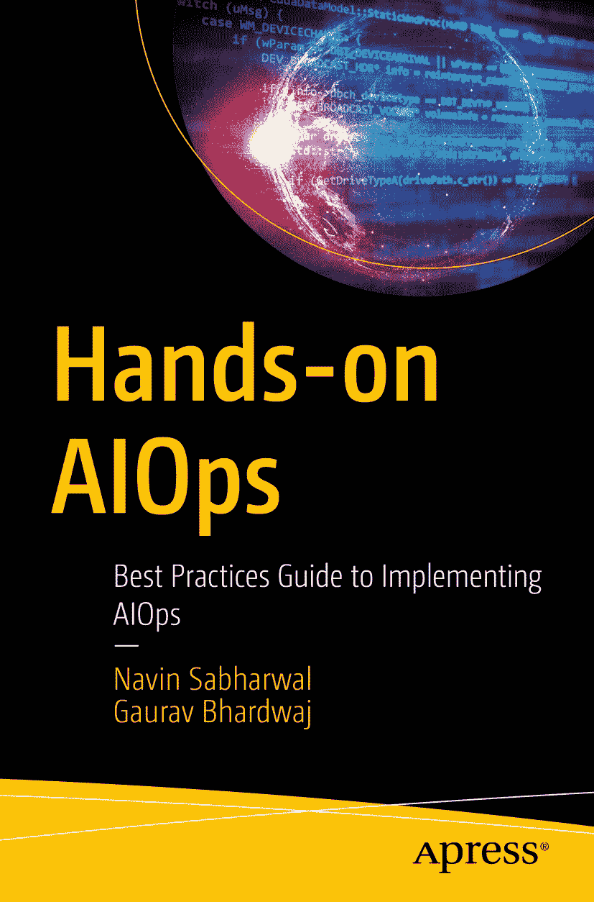

ISBN 978-1-4842-8266-3 e-ISBN 978-1-4842-8267-0 [`doi.org/10.1007/978-1-4842-8267-0`](https://doi.org/10.1007/978-1-4842-8267-0) © Navin Sabharwal 和 Gaurav Bhardwaj 2022 Apress 标准版权声明 本出版物中使用的通用描述性名称、注册商标、商标、服务标记等，即使未作特别声明，也不意味着这些名称不受相关保护性法律和法规的约束，因此可自由用于一般用途。出版商、作者和编辑可以合理假定，本书中的建议和信息在出版之日是真实准确的。出版商、作者或编辑均不对本书所含材料或可能存在的任何错误或遗漏提供任何明示或暗示的担保。

本 Apress 印记由注册公司 APress Media, LLC（Springer Nature 的一部分）出版。

注册公司地址为：美国纽约州纽约市新广场 1 号，邮编 10004。

*谨以此书献给家人、朋友、导师以及从始至终赐予力量与技能的至高神明。*

