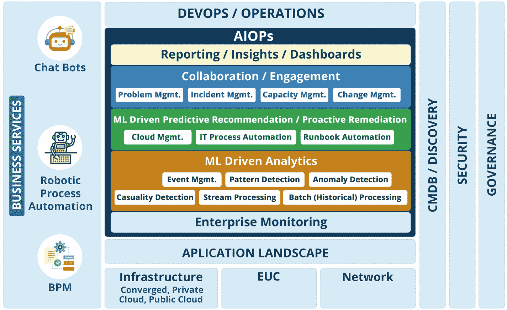
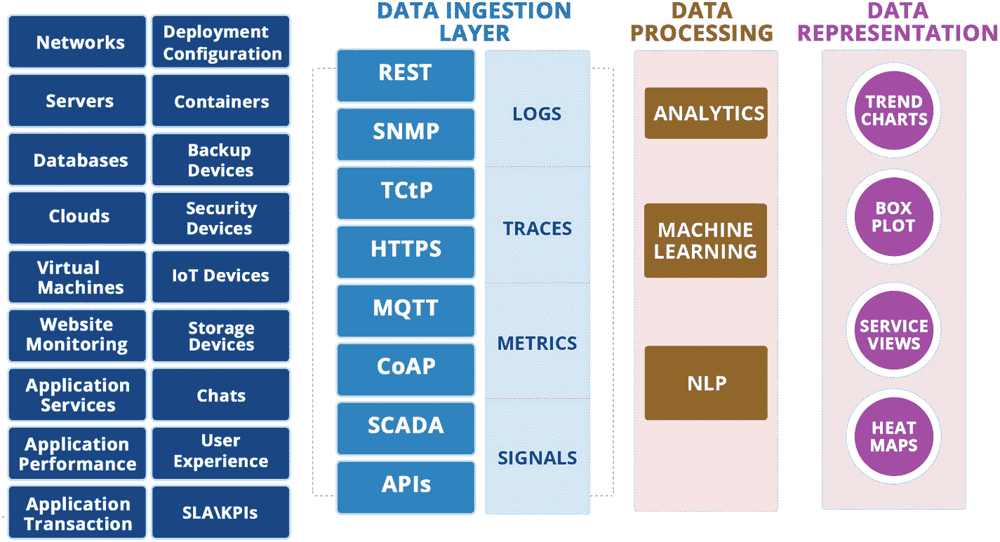
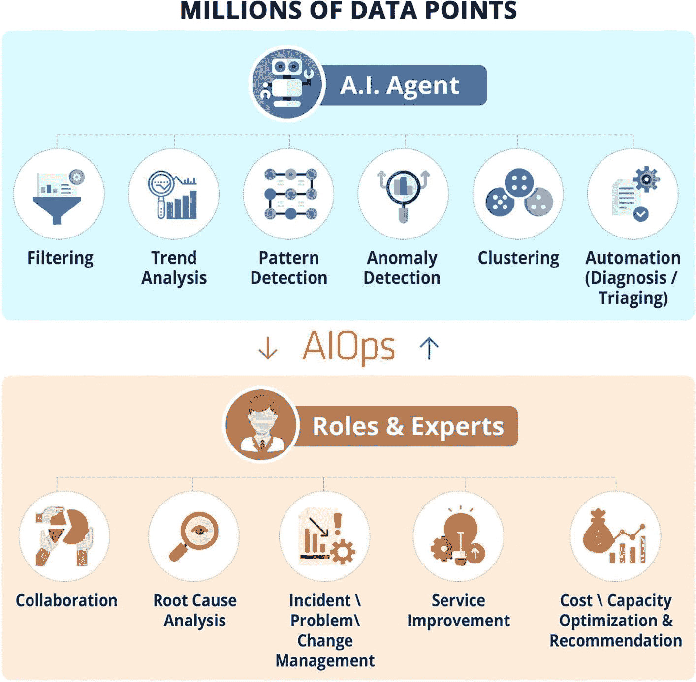
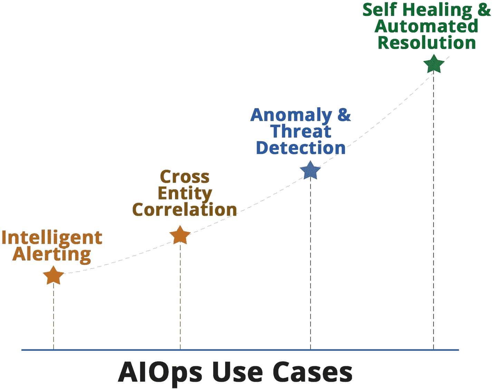
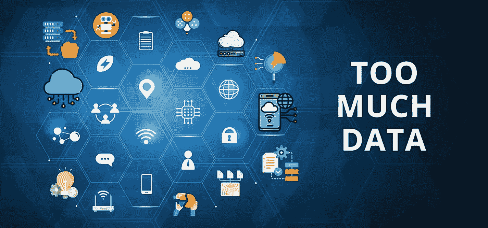
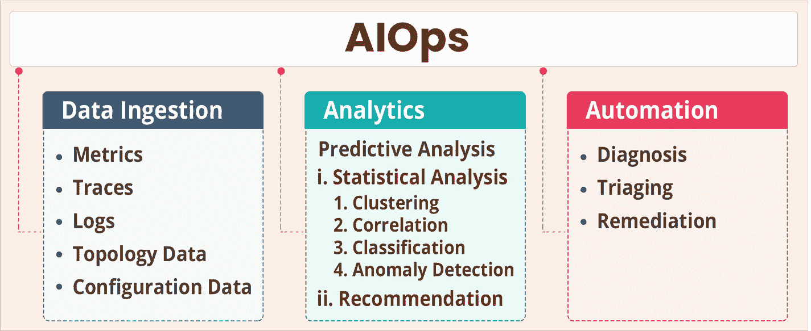

# 1. 什么是 AIOps？

本章介绍用于 IT 运维的人工智能（简称 `AIOps`）。在当今快速转型的应用和基础设施格局以及云原生技术广泛采用的背景下，组织发现难以提供能够扩展并满足业务需求的 7×24 小时运维服务——如今的企业希望基于客户和市场反馈实现更高的可用性和敏捷性。本章还详细介绍了 `AIOps` 带来的优势，以及它如何支持企业的数字化转型之旅。

## AIOps 简介

`AIOps` 是运维领域的一个流行术语，由 Gartner 在 2016 年提出。如前所述，它意味着将人工智能应用于 IT 运维。`AIOps` 指的是一种变革性的运维方法，它利用人工智能和机器学习技术，在监控、可观测性、事件关联、服务管理和自动化等多个运维领域发挥作用。随着应用和平台多样性的指数级增长，包括向微服务和云架构的迁移，运维过程中产生了海量数据。运维团队被这海量数据以及环境中应用、平台和基础设施的多样性所淹没。如今，大多数企业都在快速迁移和采用云、微服务架构等新技术，因此基础设施和平台的变化速度前所未有。IT 运维面临的挑战是既要维持稳态运维而不中断，又要支持这种敏捷性和迁移，并将新服务纳入运维。这些中断和变化给运维团队带来了巨大压力。过去行之有效的流程和系统已不再适用，而应用和基础设施快速变化的新数字化世界带来了新的挑战。因此，`AIOps` 在过去几年中逐渐演变为解决新模式运维挑战的潜在方案。

从监控和可观测性系统产生的海量数据是输入到基于 `AIOps` 系统的数据源之一，然后利用人工智能和机器学习技术来理解这些数据，并从关键事件中过滤掉噪音。这使得过去许多依赖人工判断和隐性知识的手动任务得以自动化。通过分析技术，可以高效地识别出可能导致业务运营中断的根本原因事件，从而立即通知相关解决团队。如果没有 `AIOps`，在技术快速变革的情况下，这个过程将难以运行；依赖旧系统和隐性知识意味着运维不具备可扩展性和可预测性。

所有这一切都得益于人工智能和机器学习技术的出现和成熟，它们是 `AIOps` 的基础。

人工智能已经改变了系统开发和业务流程运行的方式。人工智能无处不在，从手机中的图像处理，到亚马逊上根据你的偏好提供新产品推荐的推荐引擎。手机上的面部识别和图像美化是人们每天都在使用的应用实例，他们甚至不知道是人工智能在为这些应用提供动力。自然语言处理的进步改变了我们与应用交互的方式。如今，像 Alexa、Siri 和 Cortana 这样的语音助手正在改变我们与内容沟通的方式。

信息技术已经利用这些技术来解决构建推荐系统、预测系统、图像识别、语音识别、文本提取和自然语言理解系统等领域的各种业务问题。

然而，在利用人工智能解决 IT 问题方面，企业和科技公司尚未完全拥抱这一技术。

最后，IT 团队曾用于为消费者和企业提供令人兴奋的新应用的人工智能技术，现在正被用于监控和管理 IT 技术本身。因此，一类使用算法来运行 IT 运维的新系统诞生了。

`AIOps` 是 Gartner 创造的一个术语，用于描述将 AI 技术应用于 IT 运维数据源以提供额外洞察的总体趋势。`AIOps` 本质上是一个或一组用于分析、组合和收集数据的功能。

根据 Gartner 的说法，“到 2023 年，40% 的 DevOps 团队将通过用于 IT 运维的人工智能（`AIOps`）平台能力来增强应用和基础设施监控工具。” `AIOps` 平台是那些“利用大数据、现代机器学习和其他高级分析技术，通过主动、个性化和动态的洞察，直接或间接增强 IT 运维功能”的平台。

图 1-1 定义了 `AIOps` 中包含的 IT 运维各个领域。这些领域包括监控、事件分析、预测和推荐系统、协作与参与、以及报告和仪表盘技术。

一张展示 `AIOps` 中信息技术各层的图表。中间是一个标记为 `Devops/operation` 的图表。左侧是三个图标：聊天框、机器人流程自动化和 `BPM`，标题为业务服务。右侧是 `CMDB/发现`、安全性和治理三个层。

**图 1-1** IT 运维领域中的 `AIOps`

`AIOps` 涵盖了信息技术的各个层面。从网络到终端，IT 中的一切都可以利用 `AIOps` 技术来获得其带来的好处。

企业监控为 `AIOps` 系统提供实时数据流，以便使用各种技术执行基于机器学习的关联和分析，检测模式和异常，并进行因果影响分析。这是最重要的阶段之一，因为该分析需要考虑实时流数据和历史数据，以提供预测性建议或主动修复措施，然后通过 IT 流程或运行手册自动化工具来执行这些建议。解决建议通过无需人工干预地解决问题，帮助组织实现端到端自动化。

报告和仪表盘层为不同的 IT 团队和利益相关者提供视图，以便协作管理事件、容量、变更和问题，通过提供由洞察驱动的 KPI 和 SLA，并引入预测分析元素，使运维更加主动，从而进一步支持业务。

`AIOps` 系统利用配置管理数据库（`CMDB`）来提高关联质量和预测与建议的准确性，但由于基础设施环境不断变化，组织通常难以维护 `CMDB` 和发现数据的准确性。在云计算环境下，使用传统工具和流程几乎不可能更新 `CMDB`。`AIOps` 系统通过自动填充 `CMDB` 中缺失的所需数据来解决这个问题。这个运转良好的 `AIOps` 引擎必须在组织治理框架下定义的安全策略内工作。在集成或设置 `AIOps` 引擎的每一层时，都应考虑各种合规需求，如 GDPR、数据分类等。一旦 `AIOps` 系统启动并运行，它会利用一段时间内的数据学习模式、异常和行为。逐渐地，基于成熟度，`AIOps` 系统会被其他技术或业务单元（如 `ChatOps`、机器人流程自动化、业务流程自动化等）所使用。可以根据 `AIOps` 系统的建议触发更复杂的业务流程工作流或聊天响应。

## AIOps 概述

就像软件工程中的持续集成和持续部署整合了应用程序的开发、测试和部署活动，并共享反馈以进行改进一样，`AIOps` 也提供了各种运维组件之间的无缝集成，并为持续服务改进提供反馈。

`AIOps` 的基本定义是：它涉及使用人工智能和机器学习来支持所有主要的 IT 运维。如图 1-2 所示，在事件关联方面，`AIOps` 包含三个层次。

该图描绘了 `AIOps` 的三个层次。数据调查有 4 个子层：日志、追踪、指标和信号，每个子层又有 2 个子层。数据处理有 3 个子层：分析、机器学习和自然语言处理。数据表示有 4 个子层：趋势图、箱线图、服务视图和热力图。左侧有 18 个应用程序。

**图 1-2** 使用 `AIOps` 进行事件关联设计

### 数据摄取层

基础设施中存在许多异构实体，全面的监控环境由多种工具和解决方案组成，用于监控这些实体。数据摄取层是来自不同应用程序、平台和基础设施层的数据通过各种集成机制被摄取的地方。典型被摄取的数据形式包括事件、日志、指标和追踪。常用的数据摄取机制包括表述性状态转移（`REST`）、简单网络管理协议（`SNMP`）和应用程序编程接口（`API`）集成。

### 数据处理层

数据处理层是 `AIOps` 系统的核心；正是在这里，人工智能和机器学习技术被用于处理数据并生成洞察。一旦数据被摄取到 `AIOps` 系统中，数据处理层就会使用机器学习和深度学习技术来发现数据中的异常。它还使用指标数据来预测可能导致事件并中断业务服务的问题。就事件管理而言，该层构成了 `AIOps` 的核心。

### 数据表示层

数据表示层充当仪表板层，数据处理层的结果通过直观的仪表板以各种格式在此显示。用于解决问题的可操作数据也会被转发到外部系统（如 `ITSM`），以便解决团队能够根据这些数据采取行动并解决问题。

这里的目标是利用 IT 系统生成的海量数据，并使用人工智能和机器学习来理解这些数据，从而得出分析和洞察，并利用它们使 IT 系统运行得更快、更好、更经济，并且对故障更具弹性。

`AIOps` 帮助人类弥补其在满足 IT 运维需求能力方面存在的差距。它并不会取代运维岗位上的人员，而是增强他们的能力，以便借助 `AIOps` 提供更好的按时服务。

人类与人工智能协同工作，能够提供任何一方都无法单独提供的服务水平。图 1-3 定义了人工智能和人类代理如何协作以提供更好的 IT 运维服务，以及哪些功能属于哪一方。这种庞大且不断增长的事件量使得人类无法进行分析并编写静态规则和策略。分析过程中的挑战会级联到各种 IT 服务，例如容量规划、问题管理、事件管理等，这些服务会使用分析输出。在 `AIOps` 模型中，人工智能和人类在提供 IT 运维服务方面紧密相连，密不可分。`AIOps` 承担了数据预处理、过滤和分析等大部分耗时且复杂的任务，从而为专家提供关键洞察，以便他们做出明智的决策。

数百万数据点的两个层次。人工智能代理层有六项服务：过滤、趋势分析、模式检测、异常检测、聚类和自动化。`AIOps` 服务层有五项服务：协作、根因分析、变更管理、服务改进以及容量优化与建议。

**图 1-3** `AIOps` 驱动的人工智能与人类之间的协作

通过应用由人工智能/机器学习驱动的数据分析和启发式方法，工程师可以借助 `AIOps` 被动地处理事件，`AIOps` 会为他们指明正确的方向，并提供过去此类解决方案的相关数据。`AIOps` 也被主动用于通过分析性能和容量数据来确定如何优化应用程序性能和基础设施性能。

作为开发生命周期一部分的应用程序监控和 `AIOps`，将帮助开发团队主动发现应用程序或部署基础设施的可用性和性能问题，并在应用程序发布到生产环境之前解决这些问题。

采用 `AIOps` 可以通过确保容量的最佳利用，同时避免停机，帮助企业节省资金。如果出现问题，工程师能够比使用传统工具更快地恢复系统。

`AIOps` 有助于自动化那些不需要 IT 操作员参与的日常任务，同时为开发人员提供上下文信息，以缩短平均解决时间（`MTTR`）并改善客户体验。尽管主动性是 `AIOps` 的核心，但它同样适用于被动场景。

## AIOps 核心用例与功能

企业正在使用 AIOps 解决不同的用例。图 1-4 展示了 AIOps 中最常见的用例。组织从智能告警开始，在此阶段可以进行基本的根因分析，然后转向关联分析，以便识别不同系统之间的根因。随着组织在成熟度曲线上不断上升，会配置诸如异常检测等功能，使运维从被动响应转变为主动预防。处于成熟度曲线顶端的企业已经能够部署自愈和自动修复技术，从而完全自动化“检测到修复”的周期。

一条水平线标记为“AIOps 用例”。四条垂直虚线穿过水平线，代表四个组织阶段：智能告警、跨实体关联、异常与威胁检测、自愈与自动修复，并有一条沿垂直线向上延伸的成熟度曲线。

**图 1-4** AIOps 关键用例

DevOps 和基础设施运维团队已部署了许多监控工具来获取可观测性数据，但如今他们被大量事件淹没。组织已部署了各种监控工具，例如 `Nagios`、`Zabbix`、`ELK`、`Prometheus`、`BMC` 堆栈、`Microfocus` 堆栈、`SolarWinds`、`Zenoss`、`Datadog`、`Appdynamics`、`Dynatrace` 等。除了这些工具，企业还使用云原生监控工具（如 `Azure Monitor` 和 `AWS CloudWatch`）来监控云原生 PaaS 系统。所有这些监控系统都在从可观测性的角度收集海量数据。许多组织正在监控从网络到应用程序的整个技术栈。然而，即使进行了所有这些投资并使用了多种工具，组织仍然难以获得洞察和可操作的情报。工程师被虚假告警和过多的工单所淹没。

在 DevOps 模型中，如果没有 AIOps 等技术，DevOps 团队可能会被告警和值班支持压垮。引入 AIOps 可以确保只有可操作的告警被转化为事件，并标记给正确的团队进行解决。在非生产系统上部署 AIOps 有助于发现开发和配置问题，并促进开发团队与运维团队之间更好的协作。AIOps 在确保业务服务不受影响，以及确保正确的团队和资源被调配用于解决问题方面发挥着重要作用。

许多 IT 团队没有足够的能力来应对不断变化的技术需求。随着云计算的普及，整个 IT 格局正在快速变化，混合云和云原生技术在企业中被广泛使用。

在这些核心基础设施和应用程序架构正在转型的情况下，运维工程师没有足够的时间来评估告警并找到问题的根因。在这种情况下，组织面临着不可用和停机的风险。

传统的 IT 监控和管理解决方案无法跟上技术的变化和监控的深度，这导致了海量监控数据的产生（见图 1-5）。不断变化的技术格局意味着日志数据和追踪数据正以不断增长的规模产生，并且不可能在监控系统中定义所有规则。AIOps 通过摄取和分析所有这些数据来理解它们，并创建有意义且相关的告警，从而帮助运维团队专注于他们的核心工作——提供高可用性并达成服务等级协议（SLA）目标。

该图描绘了一个标记为“数据过多”的表示层，包含 25 个图标，其中一些图标是云、位置、WiFi、电池、消息、锁、WiFi 路由器和网页浏览器。

**图 1-5** 数据爆炸对传统 IT 运维的影响

图 1-6 展示了 AIOps 工具能够提供的核心功能。

一张带有标题“AIOps”的图表。它有三个表格，分别标记为“数据摄取”、“分析”和“自动化”。“数据摄取”进一步分为 5 个工具：指标、追踪、日志、拓扑和配置。“分析”包含预测分析，有两个子分类。“自动化”包含 3 个工具：诊断、分类和修复。

**图 1-6** AIOps 工具核心功能

**数据摄取：** 来自各种监控工具（包括指标、追踪和日志）的数据被摄取、存储和索引，以供进一步处理。此外，来自配置管理系统和拓扑数据的数据也被存储在 AIOps 引擎中，以便基于 CMDB 和拓扑关系提供关联分析。

**基于机器学习的分析：** AIOps 使用不同类型的方法来分析这些数据，以发现模式和异常。AIOps 平台使用基于规则和机器学习的方法来理解摄取的数据。我们将在本书中讨论的一些技术包括：使用聚类、关联和分类进行统计分析；检测事件数据中异常的异常检测；基于模式预测近期可能发生情况的预测分析；以及基于拓扑和 CMDB 的关联分析。其理念是将所有这些事件数据转化为可能存在的因果告警，这些告警是问题的根因，以便运维团队能够专注于这些告警并及时解决事件。

**自动诊断与修复：** 目前大多数 AIOps 工具专注于分析功能并交付该功能。自动化并非大多数 AIOps 工具集的一部分。然而，有一些工具（如 `DRYiCE iAutomate`）将前述技术也应用于诊断和修复，其中引擎将可能的原因作为输入，提供修复方案，并自动执行修复。这实现了自动修复，并提供了完整的端到端工作流。接下来，让我们详细讨论 AIOps 的优势。

## AIOps 的优势

已部署 AIOps 解决方案的企业体验到了变革性的优势。其中一些优势如下：

- **更高的系统可用性**：这是 AIOps 的关键原因和优势之一，可确保持续的服务和不间断的业务。事实证明，AIOps 是一个潜在的颠覆者，可在当今运行容器化应用的混合基础设施中确保最大可用性。

- **减少人为错误**：由于基础设施和应用环境的复杂性不断增加且变化速度加快，大多数中断都是由人为错误引起的。这是采用 AIOps 系统的另一个杠杆，因为 AIOps 自动化了大部分重复性和日常性任务。

- **更好的平均修复时间 SLA 合规性**：这是任何 IT 运营的目标，也是业务部门的真实期望。AIOps 系统与 ITSM 功能的集成使其成为可能，它通过揭示有用的见解、发现问题的模式，并支持与自动化解决方案协作以快速解决问题。所有这些都意味着平均修复时间得以缩短，并帮助 IT 运营团队不仅满足而且超越当前的 SLA。

- **更好的事件自动检测**：这是 AIOps 的另一个关键优势。AIOps 系统通过减少因创建误报事件而产生的噪音，消除了大量浪费。AIOps 系统会对事件进行彻底分析，以确定是否创建具有适当严重级别的事件。这节省了 IT 运营团队在追逐误报时浪费的时间。

- **预测和预防中断**：AIOps 可实现主动运营，并成为衡量运营绩效的重要 KPI。AIOps 系统会生成智能建议，帮助 IT 运营实现这一目标。

- **成本优化**：IT 仍被许多组织视为成本。一个成熟的 AIOps 系统能大幅降低运营成本。通过将工作卸载给算法，并释放人力资源，使其将时间和精力投入到增值项目上，组织能够更好地利用其宝贵的人力资源。

- **更好的环境可见性**：AIOps 不仅使 IT 运营能够识别需要改进的领域，还使企业能够发现新的机会或做出战略决策。由于 AIOps 系统触及所有 IT 职能，它最适合过滤噪音，并向利益相关者提供所管理 IT 资产的相关可见性。

- **降低运营风险**：风险管理是 IT 运营中的一个关键领域，但 AIOps 系统负责任务的自动执行、减少人为错误，并使用 AI 驱动的工具增强分析能力，从而大大降低了运营风险，无论这些风险是与安全、灾难恢复（DR）相关，还是与事件管理、变更管理和问题管理等日常运营任务相关。

- **自动化优势**：自动化是一个过程，但当它在孤岛中运行时，常常会失败或无法交付预期的结果。另一方面，AIOps 系统通过提供端到端的自动化服务，实现了核心 IT 功能的集成。

- **更高的 IT 运营成熟度**：AIOps 的持续反馈提供了对流程、工具和基础设施中差距与挑战的可见性。这引导 IT 运营从被动状态走向成熟的主动状态。

- **更好的可见性、治理和控制**：组织通常会实施各种事件管理和报告工具来进行运营治理和控制，但由于基础设施的动态特性以及运营团队无法保持系统更新，这些工具常常失败。另一方面，AIOps 系统可以使用算法自动检测并吸收此类变化，并提供治理和控制所需的可见性。

- **更轻松地迁移到 SRE 和 DevOps 模式**：AIOps 系统为 IT 流程和工具带来了自动化和成熟度，从而使运营团队能够采用 SRE 和 DevOps 模式。

- **更高效地利用基础设施容量**：AIOps 系统提供了更高效、更精细的容量利用率可见性，使容量管理员能够更好、更快地进行需求预测和成本效益分析。

- **更快地交付新服务**：AIOps 系统消除了浪费，提升了运营团队的技能，并带来了流程和工具的成熟度。这使得 IT 团队能够支持新的计划和服务。

## 总结

在本章中，我们介绍了运营团队面临的挑战，以及 AIOps 如何帮助组织克服这些挑战。我们探讨了 AIOps 及其各个组件，以及每个组件提供的功能。我们还列出了组织在部署 AIOps 时可以预期的优势。在下一章中，我们将探讨 AIOps 的架构和方法论。