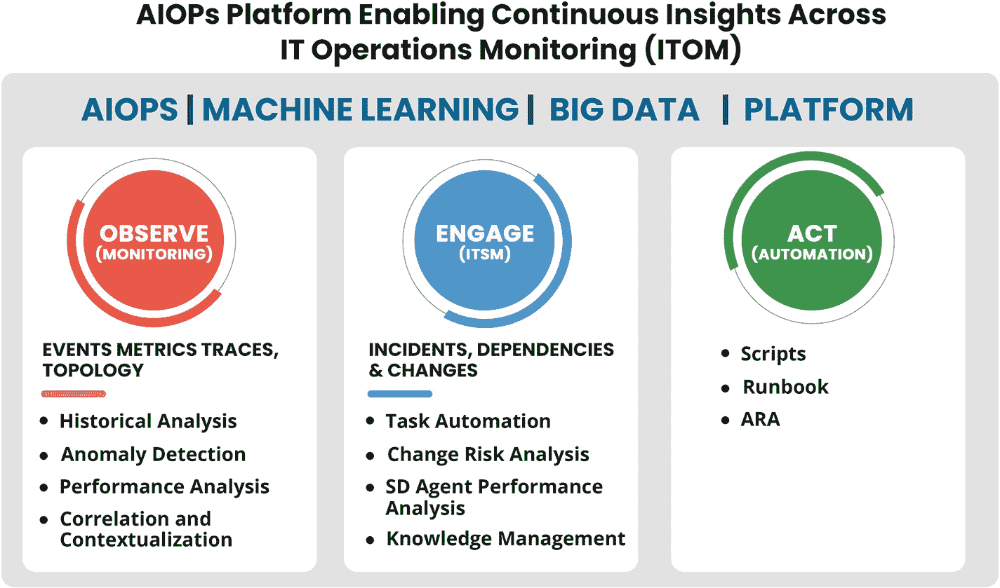
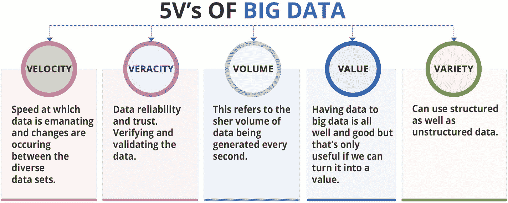
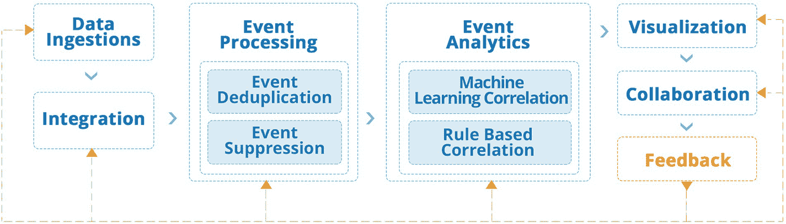
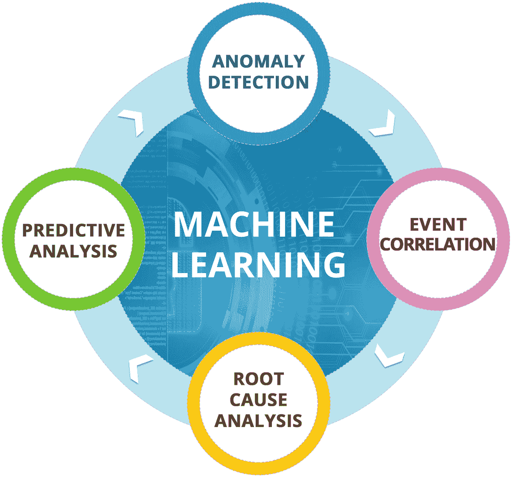
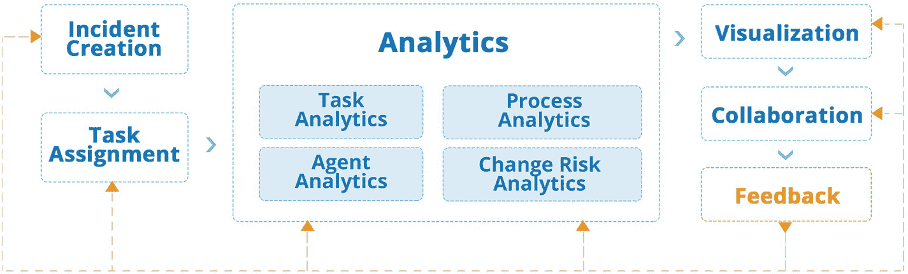
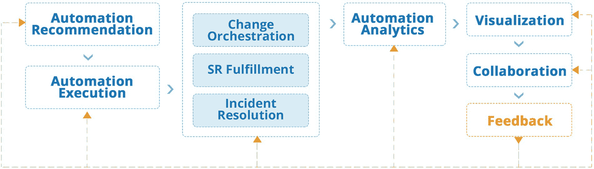
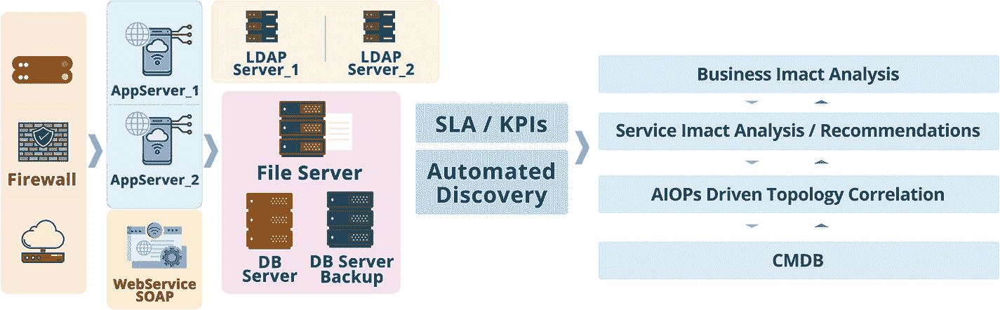

# 2. AIOps 架构与方法论

在本章中，您将了解 AIOps 架构中的技术和组件，以及其实施方法论和挑战。本章将探讨 AIOps 在可观测性、参与和行动阶段的关键特性，以及机器学习在 IT 运营中的作用。

## AIOps 架构

AIOps 系统主要由 IT 运营的三个核心服务组成，即企业监控、IT 服务管理和自动化。AIOps 架构提供了在这三项服务之间无缝集成的技术和方法，并交付一个完整的 AIOps 系统。图 2-1 定义了 AIOps 平台及其在 Gartner 定义的 IT 运营价值链中三个核心服务的各种流程和功能中的适用性。让我们深入探讨并理解 AIOps 架构。

一个 AIOps 平台包含三个核心服务：可观测（监控）、参与（ITSM）和行动（自动化）。可观测服务包含事件、指标、追踪和拓扑，有四个要点。参与服务包含事件、依赖关系和变更，有四个要点。行动服务包含脚本、运行手册和 ARA。

**图 2-1** AIOps 架构

## 核心平台

AIOps 系统旨在摄取快速生成的海量数据点，并需要结合历史数据快速分析以交付价值。大数据技术与机器学习算法相结合提供了解决方案，并构成了 AIOps 系统的核心。

### 大数据

AIOps 平台从多个来源摄取数据，因此该平台需要构建在大数据技术之上。传统系统构建在关系型系统之上；然而，对于 AIOps，有多个数据源和大量数据需要处理，才能得出有意义的见解。大数据被定义为具有五个“V”特征的数据类型，即容量、速度、多样性、真实性和价值，如图 2-2 所示。

大数据的 5V 流程图有五个子分支及其定义。这些分支是：速度：数据产生的速度，真实性：数据的可靠性和可信度，容量：指数据的绝对数量，价值：拥有数据对于大数据来说固然很好，多样性：也可以使用结构化和非结构化数据。

**图 2-2** 大数据定义

#### 数据量

`数据量`是大数据的核心特征。大数据系统处理的数据量远大于关系型数据库管理系统（`RDBMS`）所处理的数据量。由于 AIOps 将来自不同系统的数据整合到数据仓库中，如果没有以大数据技术平台为核心，数据量将变得难以管理。

#### 速度

大数据技术的第二个`V`是`速度`，它描述了数据被发送处理的速度。由于 AIOps 处理的是需要快速实时处理的事件数据，因此速度是 AIOps 处理数据时的一个重要参数。数据需要以近乎实时的间隔进行处理，以便人类或机器代理能够立即做出响应。来自多个来源的数据以高速发送到 AIOps 系统，这需要合适的平台架构来大规模、快速地处理这些数据。

#### 多样性

大数据的第三个`V`是`多样性`。在 AIOps 中，需要处理多种多样的数据。存在多种监控和管理系统以及数据，例如事件、日志、指标、工单等，这些数据格式各异，都需要在 AIOps 中进行处理。

#### 真实性

第四个`V`是`真实性`，这意味着数据应该是高质量的。你应该拥有正确的数据，并避免数据缺失等陷阱。发送到 AIOps 系统的数据需要准确、完整且干净，以便 AIOps 平台能够根据用例进行处理。

#### 价值

`价值`意味着数据应具有商业价值。AIOps 数据极具价值，因为它能转化为更高的可用性和可见性，并且构成了自动化的支柱，以降低成本并为客户提供更好的服务。

### 机器学习

除了大数据，AIOps 的另一个核心组件是机器学习。人工智能和机器学习技术是 AIOps 的核心。传统系统已被用于监控和事件关联；然而，它们是基于规则的，并未利用机器学习技术来高效、有效地获取洞察，并提供通过利用机器学习技术才能实现的特性和高级用例。

AIOps 平台利用机器学习的能力来分析来自不同系统的数据，并检测被监控实体与事件之间的关系，以便发现模式和异常。我们将在后续章节中详细讨论 AIOps 的机器学习方面。

然后，这些数据被用于提供洞察和分析，并得出根本原因告警。AIOps 平台结合了配置管理数据库（`CMDB`）、基于规则的关联以及无监督和有监督的机器学习，以实现找出根本原因的最终目标，并尝试提供预测性洞察以发现可能稍后才会浮出水面的隐藏问题。其核心主题是提高系统可用性、更好的洞察和治理，以及更高的客户满意度评分。

让我们了解 AIOps 如何改进 IT 运维。

## AIOps 的三个关键领域

AIOps 贯穿 IT 运维的三个关键领域，即：观察、参与和行动。

传统上，观察领域的某些方面属于监控范畴，而现在随着端到端可见性成为焦点，它已成熟为“可观测性”。

第二个关键领域是参与，它是价值流的一部分，与 IT 服务管理及其功能相关，例如服务台、指挥中心和解决小组，以及 IT 服务管理（`ITSM`）流程，如事件管理、变更管理、问题管理、配置管理、容量规划和持续服务改进。

第三个领域是行动，它定义了技术职能，即技术团队解决事件、完成服务请求并协调 IT 系统中的变更。

现在，我们将深入探讨每个领域，并了解 AIOps 如何影响它们。

### 观察

与传统的监控和事件管理工具不同，可观测性使用机器学习驱动的功能，并确保在满足企业监控需求时不留盲点或空白，无论组织运行的是传统物理或虚拟基础设施上的单体应用，还是云原生或微服务架构上的现代应用。此阶段主要执行四个流程，如图 2-3 所示。

使用 AIOps 实现可观测性的四个流程示意图：数据摄取与集成；事件处理；事件分析；以及可视化、协作与反馈。事件处理有两个分支：事件去重和抑制。事件分析有两个分支：机器学习和基于规则的关联。

图 2-3

使用 AIOps 实现可观测性

#### 数据摄取

AIOps 中的数据摄取是第一个重要步骤，所有监控和管理数据都被摄取到 AIOps 系统中，以便系统能够获取所有数据进行分析。有时在实施 AIOps 项目时，会发现基本的监控数据尚未到位，而组织却坚持推进 AIOps；在这种情况下，关于 AIOps 如何工作以及机器学习算法如何完全依赖数据的基本讨论将有助于解决问题。设置正确的监控组件可以作为项目下的一个独立子项目进行，同时 AIOps 继续集成并推进其数据源集成计划。当所有数据可用时，算法会进行训练和调整以反映新数据。

对于事件管理，需要以下数据：

*   `事件`：这些是从各种来源生成的事件，包括操作系统、网络设备、云计算平台、应用程序、数据库和中间件平台。所有这些平台都会生成事件，并通过监控工具捕获，然后转发到 AIOps 系统。

*   `指标`：这些是性能指标，包括基础设施指标，如 CPU 利用率、内存和磁盘性能参数、网络利用率和响应时间指标。这些还包括应用程序指标，如应用程序的响应时间、页面加载时间、查询完成时间等。指标会定期收集，例如每五分钟一次，这些数据用于了解系统在一段时间内的行为。这些数据也称为`性能指标`。

*   `日志`：许多系统维护日志文件并在日志中提供数据。可以配置和调整日志收集以记录某些类型的信息。这些日志文件被发送到 AIOps 系统以查找模式。

*   `追踪`：应用程序使用追踪机制来提供从用户浏览器到后端服务器的完整应用程序事务信息；这些信息通过各种机制记录，包括广泛使用的格式，如`OpenTracing`。追踪数据提供了端到端事务的信息，并显示了事务每个步骤的路径和耗时。任何组件中的错误或性能问题都可以通过使用追踪数据进行诊断。

除了上述实时数据，AIOps 工具还需要发现和配置数据，以便基于拓扑和关系的关联能够有效工作。这种数据摄取可能是定期进行的，而不是实时的。

#### 集成

要实现数据摄取，AIOps 平台中必须存在可用的集成功能。AIOps 平台应同时支持推送和拉取两种集成模式。在推送模式下，监控工具或转发器可以将数据转发至 AIOps 引擎。在拉取模式下，AIOps 工具具备从各种监控系统中拉取数据的能力。

集成的另一个方面涉及实时与周期性数据上传：事件、指标日志和追踪数据需要实时集成，因为运维团队需要立即采取行动。发现数据和 `CMDB` 数据则可以周期性集成到 AIOps 系统，例如，作为批处理任务在每天或每周末执行，或在 `CMDB` 任务同步完成后立即执行。这有助于保持 AIOps 数据在拓扑和关系方面的最新性。然而，在云计算和软件定义环境中，`CMDB` 数据的发现是实时的，并且在通过基础设施即代码进行资源调配和解除调配时，集成也是实时完成的。

用于集成各种监控和管理系统的适配器是 AIOps 系统的一部分。需要对这些适配器进行配置，以便将来自不同系统的数据汇集到一个统一的大数据存储库中，用于数据分析和推理。

#### 事件抑制

通过集成和数据摄取，来自各种监控和管理工具的所有数据都被摄入到 AIOps 解决方案中。这些海量数据需要经过清理以减少噪音。第一步是事件抑制，即从系统中抑制或消除不需要的告警。需要注意的是，任何对后续处理有用或能为 AIOps 引擎提供信息的数据，都不应在抑制过程中被丢弃。抑制的一个例子可能是事件和日志源中的信息性事件。这些事件仅用于提供信息，并不表示系统中存在潜在问题。摄入的日志文件中可能存在的另一种数据是成功执行记录；这些数据同样仅用于信息参考，与发现系统问题无关。在其他系统中，警告类事件也可能在事件抑制阶段被丢弃；这一决定需要由领域专家做出。

如果没有事件抑制，AIOps 系统将被大量后续处理和分析不需要的数据所淹没。

#### 事件去重

事件被抑制后，下一步是事件去重。去重是 AIOps 数据处理中的一个重要步骤。在此步骤中，重复的事件会被合并并去重。例如，如果一个系统宕机，监控工具可能每分钟都会发送一次此数据；这些数据包含相同的信息，但时间戳不同。AIOps 系统会接收此数据，增加原始事件的计数器，然后更新时间戳，以反映该系统和该特定事件最后一次发生的时间。这为 AIOps 系统以及工程师提供了所需信息，即哪些系统从何时开始宕机，以及最后一个数据点的时间戳是什么。去重确保了事件控制台不会被多个事件塞满，同时相关信息仍然可用。

去重保留了系统中持续存在的连续事件所发送的信息，这些信息供 AIOps 系统处理使用；然而，这些信息不会多次显示，而是在控制台和数据库中进行聚合。

如果没有事件去重，事件控制台将会被大量重复显示相同事件的信息所充斥。

#### 基于规则的关联

AIOps 系统使用机器学习技术来分析数据。传统系统则使用基于规则的关联来解读和分析数据。在 AIOps 系统中，基于规则的关联仍然扮演着重要角色，并且组织中可能存在一些需要通过基于规则的配置（而非使用概率性机器学习模型）来实施的策略。例如，可以设置一条规则，根据系统是开发环境还是生产环境来提升事件的严重级别。这通过查询 `CMDB` 以查找设备类型，然后根据系统分类应用一条规则或策略来升级或降级事件的严重级别来实现。AIOps 系统中还需要其他重要规则，例如“维护窗口”，在该窗口期间，任何维护或补丁活动产生的告警都会被抑制。这减少了系统中的噪音，并防止事件控制台显示因重启或关机进行维护活动而产生的告警。

基于规则的关联还有一个子类型，称为**基于拓扑的关联**。系统之间的拓扑和关系既用于基于规则的关联，也用于基于机器学习的关联。在基于规则的系统中，系统的拓扑及其关系被用来抑制或关联事件。例如，如果一个交换机宕机，那么该交换机之后的所有服务器或基础设施对于监控系统来说都将不可达。基于拓扑的关联会标记这些事件，将所有基础设施事件与交换机宕机事件关联起来，并将该交换机标记为所有这些事件的潜在根本原因。

#### 基于机器学习的关联

AIOps 工具提供的基于机器学习的关联正是其被称为 AIOps 的原因。我们讨论的其他功能在传统平台中也可用，但基于机器学习的能力才是将 AIOps 产品与其他事件管理和事件关联引擎区分开来的关键。图 2-4 展示了 AIOps 引擎执行的各种类型的关联。

一张说明机器学习执行的各种关联类型的插图。围绕机器学习顺时针循环的关联类型是：异常检测、事件关联、根本原因分析和预测分析。

图 2-4

AIOps 驱动的关联引擎

在本节中，我们将从异常检测开始，更深入地探讨每一种类型。

#### 异常检测

`异常检测`是一个识别数据中意外事件或罕见事件的过程。`异常检测`也被称为*离群点检测*，因为它涉及检测离群点或罕见事件。

离群点或异常事件与正常事件不同。`异常检测`算法试图从正常事件中识别出这些事件，并将其标记为异常。通常，异常事件可能指向系统中的某些问题。`异常检测`技术已被应用于多种场景，例如信用卡和银行交易中的欺诈检测、用于检测网络安全攻击的安全系统等。借助`AIOps`，相同的技术和算法现在正被应用于 IT 运维数据。

异常不仅仅指罕见或离群事件；在`AIOps`系统中，对于指标数据（例如网络或系统利用率参数）也会检测异常。在指标数据中，异常表现为利用率或活动的突发峰值，这些可能指向某些根本原因，并由`AIOps`系统标记出来。

`异常检测`技术使用无监督、有监督以及半监督机器学习，将事件标记为异常，并在指标数据出现违反正常行为的情况时进行标记。

`异常检测`相比传统的基于规则的系统具有优势。`异常检测`算法能够检测数据中的季节性变化，并在考虑季节性变化因素后，仅标记系统的异常行为。指标数据具有高度的季节性，因为 IT 基础设施上运行的应用程序负载和任务通常遵循一天中的时段规律。某些每月运行的任务也会增加系统利用率，但这并非异常。

`AIOps`系统中可以使用多种可用算法进行`异常检测`。`AIOps`团队可以根据数据类型和环境，利用这些算法来微调实现方案。

因此，使用`异常检测`的`AIOps`系统能够更好地减少事件数据或指标数据中的噪音：一方面，它基于数据的季节性标记正确的事件；另一方面，它能发现基于规则的系统可能遗漏的异常模式。这些功能共同帮助运维团队深入了解其环境中的状况，使他们能够采取被动和主动的措施来修复问题或防止问题发生。

#### 事件关联

现代数字应用都是相互关联的。即使是传统应用也已采用分布式架构开发，其中 Web 服务器、应用服务器和数据库服务器协同工作以完成应用功能。基础设施本身也分布在网络拓扑中，包含路由器、交换机和防火墙，将来自不同位置用户的流量路由到托管应用的主数据中心。

分布式应用和基础设施通过多种工具进行监控。因此，一个环境会收到来自网络监控工具、服务器监控、数据库和平台监控的告警，而应用本身也会记录事件和追踪信息。所有这些数据都需要进行关联，以便消除噪音，并自动标记和识别出因果事件（导致问题的事件）。在未部署`AIOps`工具的场景下，这项活动由不同领域的专家团队通过一个被称为*运维桥接*或*重大事件桥接*的电话会议共同完成，他们分析所有系统和数据，以集体识别分布式系统中潜在的问题根源。你可以想象遍历所有数据并得出结论的复杂性和耗时。

`事件关联`还会从配置管理和变更管理系统中获取信息，从而将这些系统变更与监控工具生成的事件关联起来。这有助于进行根因分析，因为许多事件和问题都是在进行配置更改或修补现有系统后出现的。变更和配置管理数据需要提供给`AIOps`引擎，以便与来自监控系统的事件和性能数据进行关联。事实上，领域专家首先会查找近期是否对系统进行了任何可能导致事件的变更。

基于机器学习的`事件关联`通过跨各种参数关联相关告警，自动将相关告警分组，从而帮助解决这个问题，使解决团队能在单一位置获取所有信息。`事件关联`利用发现和`CMDB`系统中可用的拓扑和关系信息，同时使用时间戳和历史数据对事件进行分组，并为运维团队提供洞察。

随着时间的推移和足够的有监督学习数据，`事件关联`引擎会变得更加准确。`事件关联`引擎将数据输入到“根因分析”中。我们将在下一节更详细地介绍根因分析。没有`事件关联`，就无法进行根因分析或预测性分析。因此，`事件关联`是迈向根因分析和预测性分析的第一步。

#### 根因分析

`根因分析`是 AIOps 最重要的模块；这也是运维工作实现最大价值的地方。在事件关联部分，我们已经看到现代分布式应用和基础设施是如何分布的，事件是如何从各种监控和管理系统产生的，以及这如何影响运维团队手动处理海量数据并试图找到问题根因的能力。随着运维工作面临如此复杂性，如果没有事件关联系统的辅助，进行`根因分析`正变得不可能。无论组织采用基于规则的方法还是基于 AIOps 的方法，如果不利用技术，就不可能进行`根因分析`、问题修复并满足与业务约定的服务水平。

手动或通过事件关联和自动化分析来识别根因，需要来自不同 IT 领域的多个团队共同协作，分析情况，并就问题可能是什么得出结论。这还需要协作工具，以便不同的利益相关者能够在一个共同的平台上，有效地进行“`根因分析`”。基于 AIOps 的`根因分析`会审视所有输入到 AIOps 系统的数据，并为团队提供洞察，以便更快、更好地识别根因。由于机器学习技术本质上是概率性的，因此在 AIOps 术语中，`根因分析`也被称为*可能原因分析*；因此，它可能会为一个根因抛出多个可能的原因，并附带一个置信度分数。分配给事件的置信度分数越高，AIOps 引擎认为该事件是根因的概率就越高。基于可能的原因，运维团队可以进行深入分析，找到最终的根因，并在系统中将其标记为根因。

`根因分析`利用异常检测、事件关联技术以及监督学习反馈来得出根因。`根因分析`同时利用监督和非监督技术来得出这个结果。

由于 IT 数据量庞大且依赖于环境，反馈循环是`根因分析`的一个重要方面。运维团队的大脑中存在着大量的隐性知识，这些知识可能没有文档记录，仅以非正式知识的形式存在。当运维团队协作并从系统生成的多种可能原因中标记出根因时，AIOps 系统会从人类操作员那里学习并更新其模型。因此，系统可以存储运维团队采取的行动，并能从以前的事件中回忆出根因。我们将在反馈部分更详细地讨论这一点；然而，重要的是要理解`根因分析`依赖于人类反馈，没有这一点，`根因分析`的准确性可能会达到一个天花板。

自动化`根因分析`的好处很多。由于系统通过标记可能原因并消除系统噪音，使人类操作员的工作更轻松，因此平均响应时间和平均解决时间会有显著改善。结合知识管理和来自操作员的反馈循环，`根因分析`随着使用时间的推移，会创建一个强大且高度准确的系统。

使用机器学习技术进行`根因分析`存在某些局限性。由于这是基于概率的，因此无法保证识别出的根因就是实际的根因。`根因分析`的另一个局限性是，与可以仅使用数据完成的异常检测和预测分析不同，根因依赖于人类反馈。如果没有运维团队的参与，`根因分析`的准确性将保持在较低水平。因此，人为因素、反馈以及 AIOps 引擎的训练既是重要参数，也是局限性。仅使用非监督学习进行`根因分析`是无效的，因为它只能标记异常，但该异常是否真的导致系统降级或事件，AIOps 引擎可能无法准确标记。`根因分析`的另一个局限性在于 IT 领域事件的性质；一个事件可能是独特的，并且在该事件期间生成的事件组合也是独特的，该事件过去可能从未发生过，因此 AIOps 引擎中没有可以用来得出结论的先例或数据。因此，对于当前 AIOps 系统来说，包含前所未见新事件的新型或新事件是一个挑战。

因此，我们不能期望当前一代的 AIOps 系统在没有领域专家和人类操作员训练的情况下，就能精确地定位根因。有些场景下，客户期望 AIOps 引擎能像魔法棒一样，自动开始寻找根因并修复问题；然而，深度学习和机器学习系统依赖于标记数据和训练，没有这种训练，系统就无法提供准确的结果。

由于`根因分析`是整个 AIOps 堆栈中最重要且最复杂的杠杆，因此必须对其实现和持续运维有效性给予最高度的关注。作为未来的方向，AIOps 工具可以使用多种算法和算法集成来进行`根因分析`，即使在训练数据有限的情况下也能提供更好的准确性。

`根因分析`为自动化提供输入；如果没有将这个流程步骤训练好并生成准确的结果，端到端的自动化和修复就不可能实现。一旦根因被识别，它就会输入到自动化引擎中，以自动解决问题，并将组织推向具有自愈能力的最成熟级别。

### 预测性分析

预测性分析为 IT 运维引入了预测元素。客户一直期望 IT 运维系统具备预测能力，但这一需求始终未能实现。`AIOps`将预测性分析能力引入 IT 运维，满足了运维团队这一长期未获满足的需求。

顾名思义，预测性分析是指基于提供给`AIOps`系统的数据，提前预测事物的能力。在 IT 运维领域，预测性分析有多种应用场景，下面我们来了解其中一些。

预测性分析的一个重要应用领域是性能管理和容量规划。由于`AIOps`系统能够获取指标数据，`AIOps`引擎可以预测这些系统未来的利用率。围绕访问应用程序的用户数据以及相关的系统利用率，可以基于场景进行预测，例如将有多少用户访问应用程序，以及需要多少基础设施来支持这些用户。回归技术可用于考虑系统当前的性能和工作负载，并预测基础设施未来的利用率。能够提前预测利用率，有助于 IT 运维团队更好地规划基础设施容量，并实例化新的虚拟机或云实例以满足预测的需求。在基于微服务的应用程序中，新的 Pod 会自动启动以满足基础设施上增长的需求。

预测性分析使用回归技术，该技术可以考虑数据的季节性并提供准确的结果。例如，在月初或月末执行的备份或数据处理作业，可能会导致应用程序出现性能问题和错误。利用预测性分析技术，可以确保`AIOps`系统能够预测利用率，运维团队可以采取适当措施，通过启动额外实例或垂直扩展容量来增加该时段的容量，从而避免性能问题和事件发生。

另一个基于指标的用例是关于趋势发现，`AIOps`引擎能够识别趋势以及趋势末端关联的事件。基于这种关联，它可以提前预测系统故障等情况。例如，应用程序中的内存泄漏问题会导致机器的内存利用率持续上升，从而形成一种趋势。在消耗完所有可用内存后，系统开始消耗磁盘空间，并将内存分页到物理磁盘。一段时间后，应用程序开始变慢并最终崩溃，引发一系列事件。预测性分析引擎可以检测到这种模式，并在观察到趋势时，`AIOps`系统可以警告运维团队即将发生的故障。

另一个类似的例子是存在缺陷的数据库连接代码，其中数据库连接未被释放，一段时间后阻塞了整个数据库，应用程序开始收到连接失败警报。当绘制数据库连接相关的指标时，会形成一个上升趋势，`AIOps`系统可以解读此趋势，从而预先警告运维团队。

与`AIOps`领域的其他要素一样，预测性分析也基于概率，因此可能并非 100%准确。IT 运维领域的预测性分析通过观察事件和指标来预测可能的结果，然后向运维团队发出警报。

客户有时会将`AIOps`工具视为魔法棒，期望它们能预测并防止所有类型的故障。以当前的技术水平，这是不可能的，因为并非所有故障都是可预测的。只有那些具有可通过趋势或故障前一系列事件解读的底层模式的事件，才能被`AIOps`引擎解读。我们必须认识到系统的局限性，并将其配置到最佳能力，而不是期待奇迹。许多故障本质上是不可预测且随机发生的。设备和系统会在没有任何预兆的情况下随机故障，以当前的技术水平，准确预测它们的故障是不可能的。

预测性分析可以基于单个变量而简单实现，也可以基于多个变量及其之间的相关性来得出预测。预测性分析系统可以在其模型中考虑数据的季节性，从而得出高准确度的预测。

预测性分析使运维工作更具主动性，并提高了系统的可用性，因为问题在影响应用程序的可用性或响应时间之前就已得到修复。

#### 可视化

可视化是`AIOps`工具中的重要参数。从运维角度来看，`AIOps`工具需要多种类型的视图和仪表盘。

最重要的可视化是事件控制台。`AIOps`工具需要拥有一个直观且易于使用的事件控制台。事件控制台是一个网格视图，其中包含所有需要运维团队处理或分析的所有警报。

以下是事件控制台中包含的重要信息：

- 事件 ID/警报 ID

- 描述

- 首次发生时间

- 最近发生时间

- 事件发生次数

- 与警报相关的任何事件单

- 事件严重级别

- 是否为可能原因

- 状态（打开或已清除）

- 历史事件/警报及其关联的操作和状态变更

事件控制台通常根据事件的严重级别以及是否标记为可能原因，使用颜色编码。关联在一起的事件会显示在整合的控制台中，使运维团队能够在一个控制台中查看与某个可能原因相关的所有关联事件，并分析根本原因。

除了事件控制台，`AIOps`控制台还提供其他仪表盘，用于显示聚合和整合的信息，如下所示：

- 事件趋势、模式；事件趋势的图形化展示

- 整个环境中的顶级事件

- 导致事件的主要应用程序或基础设施元素

- 事件洪泛信息

- 指标的性能数据图

- CMDB 视图/拓扑视图

- 关于事件、警报和性能指标的历史数据

除了上述视图，`AIOps`引擎还可能提供关于`AIOps`引擎自身性能的视图和信息。

因此，`AIOps`引擎中的可视化包括事件控制台、用于实时数据的仪表盘，以及用于历史数据分析的报告，这些报告驱动着协作流程，这将是接下来要讨论的内容。

#### 协作

IT 运维团队通过协作来定位根本原因并商讨解决方案。IT 运维中的指挥中心功能，正是各团队通过电话会议进行协作的场所。电话会议是一种通过 Microsoft Teams 和电话等通信渠道进行的在线实时通话，多个团队在此互动协作，查看事件和故障，并尝试分析、定位当前问题的根本原因。当影响应用程序或基础设施的 P1（优先级 1）故障发生时，必须开启 P1 电话会议，让来自不同技术领域的相关利益方共同参与。

在 AIOps 中，同样的流程也在运行，但存在一些差异。越来越多的团队正在利用 AIOps 工具内置的 ChatOps 功能，不同团队成员不仅可以在此交流，还能运行脚本以诊断和解决问题。

AIOps 的另一个变化是，整个团队无需再查看不同的控制台和事件，而是可以访问 AIOps 事件控制台，其中汇集了经过关联的事件以及由 AIOps 系统标记的可能原因，供团队使用。

受影响系统或正在调查的系统之间的拓扑和关系视图，也可从 AIOps 控制台获取；因此，团队无需再登录多个系统来获取全局信息。

这加速了根本原因分析、问题识别和问题解决的整个流程。

AIOps 协作的另一个重要方面是，这不再仅仅是人与人之间的协作。人工智能系统是整个协作过程的一方，它将信息存储在其记录中，作为学习工具，并用于未来涉及相同事件集或相同可能原因的故障处理。AIOps 工具可以调出历史记录，帮助运维团队参考过去协作分析中积累的知识。因此，历史知识不会丢失，而是被积累起来供未来使用。

#### 反馈

反馈是我们“观察”流程的最后一步，但或许也是最重要的一步。正如你在前文所学，根本原因或可能原因分析是 AIOps 最重要的用例之一，而根本原因分析的基础，是运维团队对其准确性和置信度分数的持续反馈。AIOps 引擎识别的每一个根本原因都会被分析，并由运维团队在系统中提供反馈。因此，AIOps 引擎提供的错误根本原因会被标记为错误，正确的则被标记为正确。这些数据输入有助于 AI 引擎理解环境并改进其模型。这些数据就是训练 AIOps 监督学习系统所需的标记数据。一旦 AIOps 引擎积累了足够的数据，能够判断哪些事件是根本原因、哪些不是，它就能基于此学习成果更好地分析和解读下一组事件。因此，反馈是驱动系统持续学习的动力。这使得 AI 系统能够学习并提高其准确性和置信度分数，达到一个可以基于这些数据启动自动化的准确度水平。

通常，在运行 AIOps 系统并提供正确反馈几个月后，系统的准确性和置信度分数会达到一个水平，此时可以针对高置信度的可能原因告警，从 AIOps 引擎启动自动化，从而实现从检测问题到通过自动化采取纠正措施的整个流程，无需人工干预。至此，AIOps 系统的“观察”阶段结束。现在，让我们进入 AIOps 的另一个核心功能：“参与”。

## 参与

“参与”领域与 ITSM 及其功能相关。它是 AIOps 领域的重要组成部分，因为它主要处理流程及其由各职能部门的执行情况，以及围绕流程和人员的指标。“参与”部分处理服务管理数据，因此是 ITSM 重要功能（如事件管理、问题管理、变更管理、配置管理、服务级别协议、可用性和容量管理）中所有操作的存储库。图 2-5 对此进行了说明。

一张 AIOps 驱动的四项服务管理数据的示意图：事件创建和任务分配；任务分析和坐席分析；流程分析和变更风险分析；以及可视化、协作和反馈。任务、坐席、流程和变更风险均带有“分析”标题。

图 2-5

AIOps 驱动的 IT 服务管理

持续服务改进是 ITSM 中的一个重要生命周期阶段，而这也是 AIOps 中执行大部分分析的地方。在“观察”阶段，主要数据包括事件、指标、日志和追踪，但在这里，主要数据是围绕各个流程中正在进行的活动。“观察”阶段的工作流更多是机器对机器；而这里的工作流则涉及人的因素。

“观察”阶段的数据大多是实时的，但在“参与”阶段，则是实时分析与按需分析的混合。

让我们深入探讨这一点，并理解其要素和阶段。

### 事件创建

“参与”阶段始于“观察”阶段在 ITSM 系统中创建事件。在可能原因分析生成一个合格的告警后，该告警会被发送到 ITSM 系统以创建事件。事件创建需要在 ITSM 系统中填充各种字段，以确保信息完整，并帮助解决团队解决事件。AIOps 观察工具与 ITSM 工具集成，可自动在 ITSM 系统中创建事件，并利用“观察”模块中可用的信息自动填充 ITSM 中的字段。这包括告警的描述以及“观察”部分先前定义的其他相关信息。

如果告警从“观察”模块中被清除，AIOps 引擎会自动更新 ITSM 中的事件，并将其标记为已清除，以便事件可以关闭。如果该告警触发了新的事件，它会持续用新信息更新 ITSM 模块中的事件，从而提醒运维团队。

在某些场景下，即使问题已解决，“观察”控制台中的事件也不会自动清除。在这些场景中，存在一种双向集成：当事件关闭时，ITSM 系统会清除告警，以便事件控制台能够准确反映被监控系统的状态。

### 任务分配

在传统系统中，任务由技术主管根据资源的可用性和完成特定任务所需的技能分配给工程师。在基于现代 AIOps 的系统中，任务分配通过 ITSM 系统内部或外部的自动化流程完成。任务分配引擎会考虑资源在特定班次的可用性、其技能水平、解决特定任务或事件所需的技术，以及该资源已有的工作量。基于这些参数，工单会被分配给个人进行处理，并更新进度直至关闭。

任务分配使用基于规则的系统而非机器学习系统来完成，因为它需要将技能与任务匹配，并将资源的经验水平与工作量或可用性相匹配，这些查找操作可以通过基于规则的系统完成，而无需利用机器学习技术。

然而，基于自然语言处理和文本提取的系统可用于从事件中提取信息，并概率性地将其映射到正确的技能，从而辅助任务分配引擎。利用文本提取的机器学习能力有助于将任务自动映射到正确的技能，而不是使用基于正则表达式的方法来查找关键词。是否为此使用机器学习完全取决于环境的规模、大小和复杂性。对于较小的环境，基于规则的系统就能完美运行，可能无需利用机器学习。然而，更大、更复杂的运维则需要这种能力来高效运行。

### 任务分析

分配给个人的任务需要进行分析；因此，系统中的每个任务都在生成数据。对系统中的任务进行统计分析，可以深入了解流程和人员的表现。可以从任务量数据以及每个步骤所花费时间等效率数据方面对任务进行分析。分析任务为在组织中运行六西格玛或精益项目提供了重要见解。

这也用于评估分配引擎的准确性，以查看任务是否被正确分配。如果任务未被正确分配，任务将在不同团队之间不断流转，这可能表明分配引擎存在问题。

### 坐席分析

与任务分析类似，ITSM 中的另一个重要杠杆是处理这些任务的坐席或资源。坐席分析根据准确性、解决问题所需时间、个人绩效以及与基线相比的绩效等参数，分析人类坐席和自动化坐席的表现。这可以标记出技能或资源可用性方面的任何问题。这些数据也有助于分析分配引擎是否在正确分配任务。

### 变更分析

变更，包括补丁、更新、升级、配置变更以及将新软件发布到生产环境，都是事件的潜在来源。之前能正常工作的东西在变更后可能停止工作。因此，分析基础设施和应用程序环境中正在发生的变更非常重要。

变更分析包括可以通过使用拓扑和配置信息来评估变更影响的领域。变更分析还包括对因变更导致的基础设施和平台风险的概率分析。这可能涉及分析关于拓扑、各组件之间关系、所涉及变更的规模和复杂性，以及与这些变更相关的历史数据，从而得出特定变更的风险评分。来自技术评估人员和变更业务审批人员的反馈分数也是分析变更并规划其执行的重要输入，同时需考虑其带来的风险。

### 流程分析

我们讨论了分析 ITSM 中的关键基础流程，包括事件管理和变更管理。然而，ITSM 中的所有流程都需要分析，特别是围绕为每个流程定义的 KPI。

例如，变更管理有与在一定时间内实施的变更、导致中断和事件的变更等相关的 KPI。类似地，事件管理有关于事件响应时间和解决时间的 KPI，以及其他流程 KPI，例如识别根本原因所花费的时间等。

服务水平管理流程有与 SLA 相关的 KPI，这些 KPI 可能与基于优先级的问题的响应和解决有关。例如，所有 P1 事件应在 5 分钟内响应，并在 30 分钟内解决，月度周期内的 SLA 为 90%。这意味着 90% 的 P1 事件应在规定时间内得到响应和解决，此计算按月进行，并在每月初重置。

所有这些流程数据都被输入到 AIOps 分析引擎中，以对这些数据进行统计分析，并用于流程改进目的。您还可以在此处使用 AIOps 机器学习技术（如回归）来根据历史数据预测未来的指标；回归技术将考虑季节性变化和过去的数据，以得出未来的预测值。

这些数据有助于更好地规划资源，并为流程改进计划提供信息。

#### 可视化

由于 ITSM 系统中的大部分数据都涉及人员、流程和技术方面，因此拥有适当级别的可视化和仪表盘技术来理解这些数据并走上持续服务改进之路至关重要。

有各种利益相关者需要访问这些数据，他们的需求各不相同；因此，可视化层需要具备基于角色的访问和基于角色的视图，以便于运维团队使用。

有服务交付经理、事件经理、指挥中心负责人、流程分析师、顾问和负责人。还有服务水平经理以及变更和配置经理，他们分别负责与客户签订的 SLA 和维护 CMDB。所有这些角色都需要对相关数据有适当级别的洞察和可视化，以便能够管理各自的流程。

业务所有者和应用程序所有者也需要可视化，并且在外包合作的情况下，客户和服务提供商也需要相应的视图。

AIOps 中正确的仪表盘和可视化工具对于获取所有必需的数据和洞察（包括由机器学习算法生成的洞察）至关重要，以便以更高的效率和成熟度来运行运维。

#### 协作

与观察阶段一样，协作在参与阶段也至关重要。在观察阶段，团队间的协作通过协作桥或使用 ChatOps 进行，以找出问题的根本原因。而在参与阶段，协作则发生在不同利益相关者之间，共同解决问题。因此，各类利益相关者通过工单协作，推动问题最终解决。与观察阶段需要多个团队共同分析问题不同，参与阶段的协作人员范围有限，有时仅局限于特定技术领域；甚至有时只有一个人在处理工单以解决问题。

协作同样存在于服务请求和变更执行任务中；不过，这些任务大多通过基于规则的系统进行编排，每个任务的完成会按顺序分配给需要执行该工作的人员。在变更管理中，由于复杂且重大的变更可能涉及多个团队，因此需要更高程度的协作；变更管理流程通过基于规则的方法来管理这些协作，系统会在变更的不同阶段将所需的利益相关者聚集在一起。

如果负责执行任务的人员未能在规定时间内完成，系统会指派或引入技能更高的资源来协助并按时完成任务。这一切都通过一个基于规则的引擎完成，该引擎会持续监控任务完成时间，并在设定时间到期后自动升级处理。

协作还体现在可视化或仪表盘层面，不同利益相关者可以在此共同查看数据、进行分析，并做出需要多个团队或利益相关者提供输入的决策。

尽管主要基于规则，但 ChatOps 的某些方面也可用于参与阶段，团队可以利用 ChatOps 实时协作处理事件、问题和变更。这些数据也会被存储，用于知识管理。

知识管理是参与阶段的关键领域，因为 ITSM 系统是 IT 服务管理中大部分信息的主要存储库。在解决事件、执行变更和服务请求时，自然语言处理和文本提取等 AIOps 技术可用于快速查找相关信息。AIOps 系统可以利用信息检索和搜索技术，快速轻松地找到相关信息，从而使运维团队能够更快地解决事件。

#### 反馈

参与阶段的反馈通过多种机制和流程产生。在事件管理流程中，事件关闭会触发反馈，由受影响的用户填写；同样，重新打开的事件也是一种分析反馈机制。关于失败变更、必须中止的变更以及已完全执行但导致事件的变更的反馈，都是重要的输入。

用户提出的服务请求在完成后也会触发反馈，并作为分析输入，用于评估流程的运行状况。

所有这些数据都会被输入系统，在可视化层进行展示，并利用分析技术进行分析。

这里的反馈并非作为算法的输入，而主要用于数据分析，以辅助决策，从而改进整体流程。

参与阶段的 ITSM 系统负责编排整个流程，流程的每一步都会被记录和更新；然而，实际执行的操作属于“行动”阶段，我们将在接下来讨论。

## 行动

行动阶段是任务的实际技术执行阶段，包括事件解决、服务请求履行、变更执行等。图 2-6 展示了这一阶段的可视化效果。

四类 AIOps 驱动的 IT 自动化示意图：自动化推荐与执行；变更编排、服务请求履行、事件解决；自动化分析；以及可视化、协作与反馈。

**图 2-6** AIOps 驱动的 IT 自动化

因此，运维团队执行的所有技术任务都属于这一阶段。

AIOps 旅程的完成依赖于行动层；正是在这里，事件得到解决，系统恢复正常状态。即使没有这一层，AIOps 也能带来收益，因为大多数诊断和分析活动都涵盖在观察和参与阶段；然而，将 AIOps 扩展到行动层会成倍增加收益，因为组织不仅能够快速发现问题，还能在无需人工干预的情况下自动解决问题。

要使行动层发挥作用，必须确保观察层已实施并经过微调。如果 AIOps 引擎无法检测异常和可能原因并触发操作，行动层就不可能解决问题。

因此，行动层与参与层和观察层集成，以获取数据输入，然后根据这些数据输入在技术环境中采取解决或其他操作。观察层使用前述的 AIOps 技术来查找可能原因，然后在 ITSM 系统或参与层中创建事件；行动层的自动化可以从参与层获取这些事件，然后自动解决事件。要自动解决事件，它需要知道如何解决事件，还需要理解事件以及发生事件的基础设施。我们将从最简单但非常有效的自动化推荐技术开始，探讨 AIOps 中使用的各种技术。

### 自动化推荐

解决事件的第一步是推荐哪种自动化能够解决特定问题。这可以通过基于规则的方法或机器学习方法来实现。在基于规则的方法中，每种可能原因类型都与一个自动化操作映射，该操作被触发以解决该可能原因。在机器学习 AIOps 方法中，这种关系不是固定的，而是概率性的。

自然语言处理和文本提取等多种技术被用于找到解决问题的正确自动化操作，然后将其作为针对观察层识别出的可能原因的解决方案进行推荐。

在 AIOps 领域，自动化操作通常是静态的；然而，也有一些较新的技术使用先进的机器学习技术，将多个可链接的 runbook 组合在一起以解决问题，从而利用机器学习动态创建新的自动化操作。像 `DryICE iAutomate` 这样的工具提供了这些高级功能，以及开箱即用的 runbook 和预训练模型，显著增强了自动化推荐能力。

自动化推荐会为自动化操作提供一个置信度评分。低风险任务可以自动映射以执行推荐，而高风险执行任务则可以采取人工介入的方式，即由人工操作员在推荐发送执行之前进行验证。

#### 自动化执行

自动化执行是指实际执行上一步骤中生成的建议。因此，一旦将可能的原因与某个自动化操作关联起来，就会触发该自动化来解决问题。

执行层可以构建在 AIOps 平台内部，也可以利用环境中现有的自动化工具。自动化执行引擎会向 AIOps 工具反馈执行成功或失败的结果。

自动化可以通过多种工具触发，包括 runbook 自动化工具、配置管理工具、预配置工具、基础设施即代码工具、机器人流程自动化和 DevOps 工具。大多数组织都拥有多种自动化工具，相关的工具可以集成起来，作为自动化执行臂，接收来自自动化建议引擎的指令。

自动化任务可以是简单的任务，例如运行 `PowerShell` 或 shell 脚本来重启或重新启动服务，也可以包含更复杂的任务，这些任务涉及复杂的工作流程，甚至包括启动新的实例和基础设施。

如今，大多数 AIOps 平台仅在“观察”层运行，其工具集中并不包含自动化执行或建议功能；然而，也有一些工具，例如 `DryICE iAutomate`，它提供了自动化建议和执行功能，并捆绑了开箱即用的工作流程，使组织能够快速跨越式发展，达到更高的成熟度。

在 AIOps 平台之外，还有无数场景可以利用 AIOps 方法作为触发现有自动化的手段。大多数组织都有 `Python` 或 `PowerShell` 脚本，可以自动执行常规的修复工作流程，例如重启虚拟机。预计这类预定义的自动化将成为您智能自动化组合中的重要组成部分，并通过 AIOps 解决方案复用自动化资产，以提升 AIOps 分析和自动化开发两者的价值。

自动化执行可以涵盖不同类型的用例，包括事件解决、服务请求履行和变更编排。其中一些用例更适用于概率性场景，而另一些则可以使用基于规则的流程工作流。

在触发低置信度的建议时应格外小心，否则自动化失败可能导致更多问题。在这种情况下，谨慎的做法是使用其他技术，例如诊断 runbook。低置信度的自动化还可以强制实施“执行者-检查者”流程，即系统的操作在系统内执行之前，先由人工操作员进行评估。在某些情况下，基于规则的系统与基于置信度的建议相结合效果最佳，因此需要根据环境和相关风险做出明智的决策。

#### 事件解决

事件解决是自动化执行的一种类型。这是一个与“观察”阶段紧密集成的领域。因此，“观察”阶段的输出（即可能的原因）成为自动化评估的输入，如果存在针对该特定根本原因的自动化操作，则可以自动触发，或采用人工介入的方式来解决该问题。

事件解决是一个可以有效利用机器学习技术来推荐自动化的领域，并且会比基于规则的系统提供更好的结果。

事件解决是 AIOps 中概率性机器学习技术发挥作用的主要领域。

#### 服务请求履行

服务请求履行是指用户请求特定服务的领域，这些请求作为服务请求记录在 ITSM 系统中。然后，服务请求作为一系列任务被履行，这些任务可以自动执行，由人工代理执行，或者由自动化和人工操作共同执行。

由于服务请求任务本质上大多是确定性的，并且对于如何执行这些任务没有歧义，因此机器学习技术的作用有限。

服务请求通过一系列称为任务的逐步流程来履行。在执行的每个阶段，请求者都会收到关于其请求进度的最新通知，并且在任务完成时，请求者会收到履行完成的通知以及访问已履行交付物的方式。

服务请求可以针对软件系统，也可以针对需要交付的硬件；例如，为新员工提供一台笔记本电脑就是一个服务请求，它实际上经历了一个物理履行流程，因此无法完全自动化。这里的自动化是指将服务请求系统与采购和订购系统集成，以便请求可以自动转发给第三方合作伙伴或供应商，他们通过运送笔记本电脑/硬件来履行请求。

软件部署任务则通过软件交付平台为服务请求实现完全自动化，这包括在笔记本电脑上部署诸如 `Microsoft Office` 之类的最终用户应用程序。

服务请求由请求者从服务目录中发起。服务目录类似于购物车，您可以在其中从像 `Amazon` 这样的在线市场订购商品和服务。

机器学习在该领域的角色主要体现在认知虚拟助手方面，它可以为用户提供直观的聊天或语音界面，而不是网页门户或目录。这使得用户更容易使用自然语言进行交流，找到正确的目录项，然后通过聊天界面完成订购。认知虚拟助手集成在“交互”层，并在用户确认后发起请求。请求者也可以使用虚拟代理来跟踪请求履行的进度。

认知虚拟助手在内部使用自然语言处理和自然语言理解，结合各种机器学习和深度学习技术，来解读用户的意图并提供适当的响应。

认知虚拟助手的主要用例在于服务请求领域；然而，类似的功能和用例同样适用于事件管理和变更管理。

#### 变更编排

与服务请求履行类似，变更会被精细规划，并包含一系列由不同团队执行的任务。

在变更审查环节中，还有一些额外任务，由技术和业务利益相关者组成的变更咨询委员会会对变更的各个方面进行审查并批准。

还有其他步骤，例如审查变更测试计划、回滚计划等，在每个阶段，不同的利益相关者都可能参与变更的审查和分析。

一旦所有内容都经过审查，并且变更已准备好按计划执行，变更就会由参与技术执行的各个团队以逐步的方式执行。

因此，变更编排是一个精心编排的过程，在每个阶段都包含明确定义的步骤和任务，并且基于规则的系统长期以来一直被用于运行此过程。由于变更编排任务本质上大多是确定性的，并且对于如何执行这些任务没有歧义，因此机器学习技术的作用有限。

在变更编排中，有少数几个领域可以使用机器学习或分析技术。

变更调度和冲突便是这样一个领域。当安排一个变更时，它会涉及构成变更一部分的基础设施、平台和应用组件；该变更也会安排在特定日期的特定时间。可以使用分析技术来找出是否有项目因变更而受到影响，以及是否存在影响连接设备或系统的冲突或重叠变更。通过将拓扑和配置数据与变更计划叠加，可以分析这些数据，变更咨询委员会可以利用这些信息更好地分析变更及其影响，并且在发生冲突时可能导致变更的重新安排。

另一个领域是变更风险分析；我们知道，每个变更都会给应用和基础设施带来风险，并可能导致停机。预测分析技术可用于根据所涉及的组件、变更的复杂性以及以往此类变更的风险分析数据来找出变更的风险。来自 `AIOps` 的此预测分析组件对于此类分析非常有用，并能向变更咨询委员会和技术执行团队提供这些额外信息。

认知虚拟助手内部使用自然语言处理和自然语言理解，也可以在变更管理流程中用于技术和流程团队之间的协作，并利用认知虚拟代理直观的 `NLP` 功能查找有关变更的信息。

我们在 `Engage` 部分的变更分析章节中也涵盖了其中一些要素。

#### 自动化分析

自动化分析是执行领域中的一个重要方面。尽管大多数分析都与 `Engage` 阶段相关，但自动化执行会生成其自身需要分析的有价值数据。

自动化生成的一些数据用于进一步提高自动化系统的准确性和效率。其他数据则用于报告和分析自动化在组织中的当前运行状态。

通常，以下是一些重要的自动化关键绩效指标（KPI）：

*   自动化覆盖率

*   自动化成功率

*   自动化失败率

*   高使用率用例

*   低使用率用例

*   失败原因分析

*   低自动化领域

#### 可视化

就像我们在 `Engage` 阶段介绍的可视化和仪表板一样，自动化阶段也会将其数据记录到系统中。我们提到了几个对自动化团队来说需要跟踪的重要参数，这些参数需要使用仪表板技术进行可视化，以提供自动化运行情况的概览，并对这些数据运行一定程度的分析，以进行持续的服务改进。

#### 协作

自动化中的协作主要通过 `Engage` 阶段实现，因为所有活动都记录在 IT 服务管理系统中。因此，参与事件、服务请求和变更编排的各个团队和人员之间的协作是在 `Engage` 阶段使用 `ITSM` 工具完成的。

然而，借助 `AIOps ChatOps`，认知虚拟代理成为各个团队协作的核心，他们可以与正确的利益相关者互动，并从 `ITSM` 系统中获取 `Act` 阶段所需的数据。因此，在 `Act` 阶段的实际活动中，实时协作是通过 `ChatOps` 完成的，人类与其他团队以及机器进行交互，以分析数据并做出适当的决策。

#### 反馈

这些信息可在 `AIOps` 系统中获取，用于分析自动化执行的效率。来自自动解决方案的反馈是 `AIOps` 系统的重要输入。自动化脚本的成功与失败是机器学习算法的重要学习数据。这些数据有助于系统提高其准确性评分，并改变各种自动化引擎和脚本的置信度评分。

操作员会确认 `AIOps` 算法建议的操作，因此人工输入为 `AIOps` 算法提供了训练，使其能够改进模型并根据人类反馈更改置信度评分。

随着时间的推移，`AIOps` 引擎通过从人类操作员的行动中学习，能够更好地适应其运行的环境。各种解决方案的置信度评分会变得足够高，从而可以将其转移到完全自主模式，对于某些用例不再需要人工参与。这实现了 `AIOps` 的承诺，即通过利用 `AIOps` 技术的自动修复能力，将运维转变为 `NoOps`。完全自动化用例库的扩展及其成功率在很大程度上受到应用蓝图知识及其相关性或业务影响级别（`BIL`）的影响，这就是应用发现变得重要的原因，我们接下来将对此进行讨论。

## 应用发现与洞察

为了管理业务交易的关键绩效指标（`KPI`）并保证业务流程的服务水平协议（`SLA`），企业还需要强大的全栈分析能力。

这些分析需要自动将业务交易（例如订单、发票等）映射到其应用服务（Web 服务器、应用服务器、数据库等）以及支持性基础设施（计算、网络和存储），如图 2-7 所示。

一个包含四层的流程图，展示了从业务交易到应用服务（如 `App server 1`、`2` 和 Web 服务）再到支持性基础设施（如 `L D A P server 1`、`2` 和文件服务器）的映射，并包含一些全栈分析，如业务影响、服务影响、驱动拓扑关联和 `C D M B`。

图 2-7

用于业务和服务影响分析的 `AIOps`

这必须在分布式、混合 IT 环境中实时完成。否则，他们将被迫进行广泛而复杂的故障排除工作，以三角定位数十万甚至数百万个数据点。所需的时间可能会对关键流程（如电子商务、订单到现金等）的正常运行时间和性能产生负面影响。

## 建立关联：数据关联的价值

应用经济时代已经到来，各类企业都在积极应对。在这个数字化转型的时代，企业依靠应用程序来服务客户并改善运营。企业需要快速引入新应用、采用新技术，以变得更加敏捷、高效和响应迅速。

作为这些努力的一部分，企业正在采用基于云的解决方案、以软件为中心的微服务架构，以及虚拟化和容器技术。但这些新架构和新技术也带来了自身的挑战。

如今，一些企业应用托管在公有云上，而企业对这些云环境往往没有或只有非常有限的可见性。

应用程序越来越多地部署在虚拟机上而非物理服务器上，这增加了更多的复杂性。

容器通常与虚拟机共存，或存在于虚拟机内部。容器的使用——以及容器本身的数量——正在企业 IT 环境中迅速激增。

由于这种环境与以往截然不同，大约十年前创建的应用性能工具已不再适用。那些只考虑应用程序而不考虑底层基础设施的工具存在不足。这些工具必须收集并关联应用程序本身及其底层基础设施的信息。这应包括应用服务器性能、事件、日志、事务等数据。应用交付所涉及的计算、网络和存储资源也需要纳入考量。

## 总结

在本章中，我们涵盖了`AIOps`的不同层级，即观察、参与和行动。我们深入探讨了`AIOps`的三大核心基础支柱，以及事件关联、预测分析、异常检测和根因分析等核心分析技术。通过提供实际案例，我们详细介绍了观察、参与和行动层中的每个功能，以便揭开`AIOps`及其功能的神秘面纱，并将其与运维团队当前的实际工作联系起来。在下一章中，我们将介绍组织在部署`AIOps`时面临的挑战。