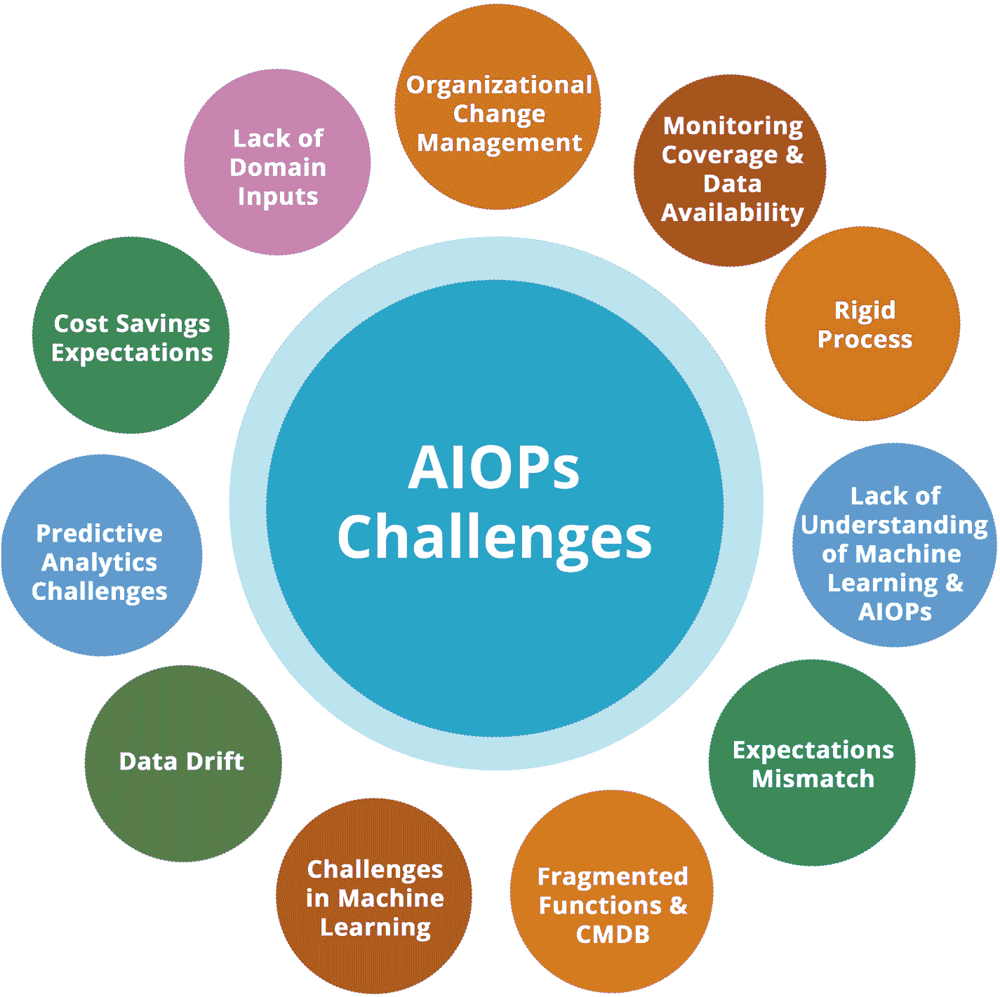

# 3. AIOps 挑战

尽管 IT 团队对实施`AIOps`技术持乐观态度并全力推进，但仍存在一些挑战阻碍了这些技术的价值实现和落地。本章将更详细地解释这些挑战，以便组织在实施`AIOps`时能够提前规划。图 3-1 列出了我们将在`AIOps`旅程中进一步探讨的关键挑战。

一张展示`AIOps`的 11 个关键挑战的图片，这些挑战包括：组织变革管理、监控覆盖范围与数据可用性、僵化的流程、期望错位、功能碎片化与`CMDB`、机器学习、数据漂移、预测分析、成本节约预期、对机器学习及领域输入缺乏理解。

**图 3-1** AIOps 挑战

### 组织变革管理

`AIOps`是一个变革性主题，贯穿`ITSM`、监控和运行手册自动化等多个流程。它也涉及多个团队，包括指挥中心、服务台、解决团队、自动化、`SRE`和`DevOps`。要成功部署并实现价值，你需要在组织层面进行有效的变革管理，并获得管理层的支持与赞助，以推动这一跨职能变革。组织层级和职能划分会阻碍`AIOps`的成功有效部署；因此，重要的是让组织变革管理者参与进来，通过各个利益相关方推进项目，并争取管理层对项目的支持。

通常，上述团队被组织在不同的职能层级中，他们通过既定的流程和政策，在需要时基于特定倡议进行协作。`AIOps`是一种颠覆性的变革，会极大地影响所有这些团队。

为了让项目顺利启动并取得成功，必须将其作为一项具有组织级重要性的计划来推动，并在最高层级进行监控和治理。

团队结构、流程、政策和沟通媒介都需要改变，以全面采用`AIOps`，并通过在整个价值流中部署这些技术来实现最大收益。

将`AIOps`仅仅视为一种可以叠加在现有技术和流程之上而无需重新设计的技术变革，这种期望需要降低。组织应该认识到，他们正在转向一种不同的 IT 运维系统和方法，这需要对当前的结构、团队和流程进行改变。因此，这需要以流程导向、系统化且不干扰现有运维的方式进行处理，并为受此组织级变革影响的人员提供清晰的指导。

## 监控覆盖范围与数据可用性

有些组织已经建立了监控和可观测性体系，他们可以顺利部署`AIOps`技术并收获其带来的好处。然而，也有一些组织的基础监控覆盖范围并不完整，许多基础设施和应用组件没有得到有效监控。因此，由于缺乏数据，部署`AIOps`将无法为这些应用或基础设施元素提供可能的原因或根因。毕竟，机器学习系统依赖于数据的可用性和准确性。还存在其他挑战，例如覆盖范围可能完整，但监控参数配置不正确，无法为`AIOps`算法的有效运行提供完整准确的数据。

如果没有监控和可观测性数据，期望`AIOps`来解决基本的监控或可观测性问题，将导致该计划失败，而`AIOps`则会无端受到指责——无论从技术还是流程角度来看，这都不是`AIOps`的错。

在开启`AIOps`之旅之前，IT 运维需要能够从监控、可观测性、`ITSM`和自动化的角度，衡量其系统和流程的成熟度及覆盖范围。这可以通过内部完成，也可以聘请精通该领域的顾问，他们能从外部视角评估组织的现状，并将系统和流程与该领域的领先公司进行比较。这项工作将形成一个成熟度提升路径，其中可能需要运行一些项目和计划，为组织采用`AIOps`做好准备。例如，如果监控不全面，可能会启动一个单独的项目来纠正这一问题并提供全面覆盖，作为引入`AIOps`的预备步骤。

## 僵化的流程

有些组织的事件管理流程和规程僵化且难以改变。这些流程是基于当时现有技术创建的，这意味着它们不适用于概率模型，并且是为每种事件类型硬性设定的。部署 AIOps 需要改变流程，以适应基于概率的决策，而非基于规则的决策。有时，组织最终部署了 AIOps 工具，却仍采用基于规则的逻辑而非机器学习，从而将其降级为非 AI 的传统事件关联系统。

有些组织希望采用 AIOps，但不愿改变当前基于十年前技术建立且基本保持不变的流程。AIOps 需要思维模式的转变——你可能无法用所有数据对系统进行细粒度测试，也无法定义能复现所有真实场景或 100% 可预测的测试用例。AIOps 系统并非一个静态的基于规则的系统，不会在输入相同数据时给出相同结果。该系统会持续学习，因此模型会根据 AIOps 系统摄入的数据以及人类向系统提供的学习内容不断变化。

期望 AIOps 以与传统系统相同的方式工作，会让人对 AI 系统产生错误的预期。基于 AI 的系统依赖于数据和概率，因此结果可能因组织而异、因基础设施而异，并且会随着每个组织产生的独特数据而随时间变化。

对系统进行微调可确保持续维持并提升 AIOps 系统的置信度分数和准确性。

## 对机器学习与 AIOps 缺乏理解

部分组织可能缺乏机器学习和 AIOps 方面的专业知识和经验，因而难以理解并接受这项技术转型所能带来的益处。在这种情况下，有必要通过网络研讨会、培训以及概念验证等方式，让利益相关者接触新技术，使其了解新的方法和技术。

在推进 AIOps 项目时，对 AIOps 工作原理缺乏理解是需要考虑的最重要方面之一。

通常，监控和管理团队是其自身领域的专家，并且长期使用满足其需求的技术。这些团队通常由监控与可观测性领域的主题专家，以及网络、云计算、存储、安全、数据中心等不同技术领域的专家组成；然而，这些团队可能不具备 AI 和机器学习方面的专业知识，因为此前运行 IT 运维并不需要这些。

因此，在充分利用 AIOps 系统所需的能力和专业知识方面存在差距。使用 AIOps 系统并不需要具备 AI 或机器学习的深厚专业知识；但确实需要接触并掌握 AI 和机器学习的入门级技能，以便理解 AIOps 系统试图做什么，以及如何充分发挥其潜力。

我们真诚希望本出版物能够弥合这一差距，让监控和管理领域的主题专家接触到足够多的 AI 和机器学习知识，使其能够成功实施并运行基于 AIOps 的系统。

## 期望错位

有时会出现期望错位的情况：AIOps 工具供应商在未了解企业流程、系统、功能和技术限制的瓶颈时，就承诺价值实现。这些工具可能提供强大的功能，但若不改变流程和职能，就无法实现收益。一个典型的例子是开发团队与运维团队之间的协作式 ChatOps。如果组织处于孤岛状态，且未建立 DevOps 流程，那么部署用于 ChatOps 和协作的 AIOps 功能将无助于弥合差距。这需要在项目的其他环节处理，并且组织需要先拥抱 DevOps，团队才能有效利用工具的功能。

期望错位源于我们之前提到的某些方面。例如，对 AIOps 以及 AI 和机器学习普遍缺乏理解，会导致期望错位，因为团队可能期望 AIOps 成为能解决所有问题的魔法棒。或者，运维团队可能希望 AIOps 系统仅仅复制其基于规则的系统的特性和功能，这同样会导致工具能力与期望之间的错位。

安全与合规团队对即将部署的新 AIOps 系统可能还有另一个期望：系统提供的洞察要 100% 准确。对于一个基于概率而非规则运行的机器学习系统来说，这是一个错误的期望。

让所有利益相关者都参与到项目中来至关重要，这样可以根据 AIOps 是什么以及它为 IT 运维带来了什么，来调整和管理不同利益相关者的期望，从而避免对 AIOps 领域、技术或流程的理解出现偏差。

## 碎片化的功能与 CMDB

当从业务流程到应用、基础设施和网络的整个资产体系都能向 AIOps 平台提供数据时，AIOps 才能发挥最佳效果。如果不同技术领域的监控系统和团队各自为政，且不愿加入新的集成流程和职能，就会带来挑战。AIOps 可以轻松处理监控系统的碎片化问题；然而，不同的配置管理系统以及配置管理数据库的缺失，会在事件关联时引发问题。

如果能为机器学习算法提供更多且正确的数据，AIOps 系统将发挥最佳效果。获取准确的拓扑信息能极大提升 AIOps 系统精确定位问题并提供根因分析的能力。没有这些数据，系统就如同盲人摸象，只能基于时间戳数据和统计技术来尝试关联各种事件，这可能导致准确性不足。

系统并不一定需要完整的 CMDB；但将拓扑信息纳入 AIOps 系统，能显著改善事件关联和根因分析。

如果难以获取整个环境的拓扑或配置信息，可以从关键应用和基础设施入手，然后逐步将覆盖范围扩展到其他领域。

## 机器学习面临的挑战

`AIOps` 结合了基于规则、基于机器学习和基于拓扑的系统，而来自不同监控和管理系统的数据及其配置在每个环境中都相当独特。这给机器学习模型带来了挑战，因为模型需要理解不同的事件并提供自动化的分析告警。根据每个独特的环境来微调模型可能会成为一个繁琐的过程。

当提供准确且完整的数据时，机器学习的效果最佳，但如果监控系统配置不正确，或者事件和日志提供的数据不完整或不正确，这就会成为一个挑战。

机器学习中其他值得关注的领域在于可解释性，即很难明确指出机器学习系统做出某个决策的原因。较新的 `AIOps` 系统内置了可解释性功能，以便用户可以深入探究，找出 `AIOps` 系统推荐特定根因或标记特定异常的原因。

机器学习系统也容易发生数据漂移，监控系统或环境的变化会对 `AIOps` 系统产生影响；因此，拥有拓扑信息有助于克服这些问题。

## 数据漂移

所有机器学习模型都面临数据漂移的挑战。如果采用 `AIOps` 的组织同时在进行多个转型项目（如云迁移），这个问题会更加突出。由于来自系统的监控工具和数据正在发生剧烈变化，数据会发生漂移，基于现有历史数据的模型准确性将会降低。需要通过流程和分析来谨慎处理 `AIOps` 中的数据漂移，以确保模型在当前数据下保持准确。

由于转型项目导致数据剧烈漂移，事件、症状和指标都会发生变化。这意味着转型前的数据是无效的，不能与新数据合并用于生成异常、动态基线或容量预测。

必须谨慎地更改数据源或数据本身，因为这会使当前已部署的模型过时。

运行 `AIOps` 系统的专家应对数据及其如何影响机器学习模型有基本的了解。我们希望，通过阅读这本实践指南并完成一些动手练习，读者能够更好地理解数据变化与生成模型之间的关系，并运用这些知识确保 `AIOps` 系统得到有效利用。

## 预测性分析的挑战

对于任何机器学习或深度学习系统来说，预测性分析都是一个充满挑战的领域；它永远无法达到 100% 的准确率。准确预测系统何时会失效是不现实的，因为失效带有偶然性，因此不可能以预期的精度进行预测。

如前所述，`AIOps` 系统使用预测性分析，这些系统基于概率工作，可能会产生误报（将不正确的事件标记为可能的根因）或漏报（将真正有影响的事件标记为非关键）。

这与这些算法在其他领域的运作方式类似，例如，当一笔真实的信用卡交易被拒绝并标记为欺诈，或者欺诈交易通过分析引擎并被批准。

预测性分析的其他挑战涉及数据的季节性，现代机器学习技术可以处理这一点；然而，长期季节性数据可能无法获取，因此系统在收集到足够的数据之前无法学习季节性。例如，要能够生成基于季节性的年度预测，你需要多年的数据。

## 成本节约预期

客户通常对成本节约抱有期望；然而，仅仅部署事件管理 `AIOps` 所能带来的成本节约是有限的。它可能对用户体验和客户满意度产生显著影响，但如果没有自动化，成本影响可能无法达到客户的预期。因此，像 `iAutomate` 这样提供自动化能力的工具会与事件关联平台一起部署，通过自动化从告警检测到问题修复的整个价值流，来实现显著的成本节约。

通过利用 `AIOps`，组织将在运维方面达到更高的成熟度，系统中的噪音会减少，资源将能够处理更大的工作量，并改进向业务承诺的 `SLA`。

部署这些技术后，平均响应时间和平均解决时间将会缩短。

系统的可用性将更高，业务用户和最终用户的满意度也将提升。

这些都是 `AIOps` 带来的可衡量、可感知的益处。然而，要降低成本，还有其他因素在起作用。例如，组织可能人手不足，或者已经应用了所有成本杠杆，只配备了按承诺服务水平工作的最低限度团队。在这些情况下，可能不会实现成本降低。

`AIOps` 系统也需要持续付费和维护。这将导致组织为提升成熟度水平并向客户提供更好服务而产生额外成本。因利用这些系统而可能产生的任何资源节约，都需要首先与设置和持续管理这些系统所需的投资和运营费用进行对冲。

因此，组织在设定成本和节约预期之前，应制定业务计划，并审视所有成本和节约。

## 缺乏领域输入

`AIOps` 需要来自操作特定环境的技术专家的领域输入。这可以是对 `AIOps` 平台输出提供反馈，也可以是文档和知识库的形式。缺乏技术专家的支持会导致 `AIOps` 引擎没有监督训练，这意味着 `AIOps` 引擎将退而求其次，依赖无监督学习来提供结果。没有领域专家的反馈循环，机器学习模型的持续学习就无法进行，系统的准确性也就无法达到其潜力。

在让领域专家参与这一转型之旅方面存在各种挑战。可能是单纯缺乏对 `AIOps` 系统运作方式的理解，或者是偏好于当前的操作模式，继续沿用人们几十年来习惯的流程。

组织变革管理和 `AIOps` 流程建立阶段应获得所有领域专家的支持，以便每个人都为项目做出贡献，并能共同看到成功。

尽早识别利益相关者，为协作设定 `KPI`，并激励团队为项目成功而努力，是组织可以采取的一些措施，以确保 `AIOps` 项目成功。

## 总结

在本章中，我们涵盖了组织在部署 `AIOps` 时面临的挑战以及如何缓解这些挑战。对于任何实施 `AIOps` 的组织来说，事先了解这些挑战并规划缓解措施，以成功实施 `AIOps` 项目至关重要。在下一章中，你将看到 `AIOps` 如何使 `SRE` 和 `DevOps` 团队高效工作，以及 `AIOps` 如何与 `SRE` 和 `DevOps` 原则保持一致。

