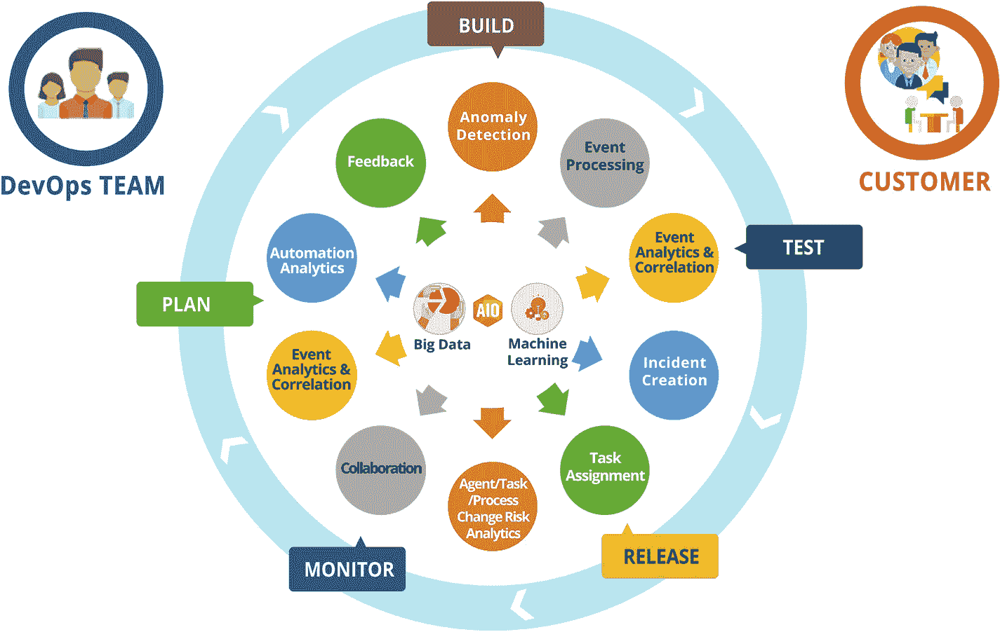
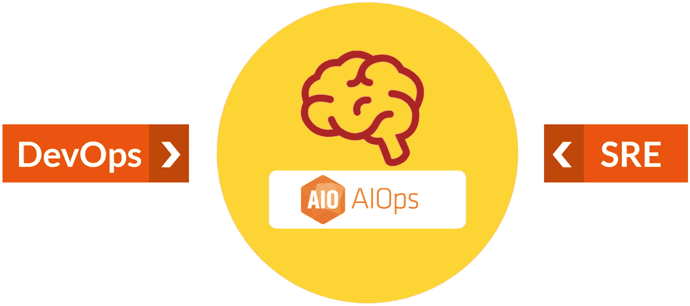

# 4. AIOps 支持 SRE 与 DevOps

正如 AIOps 正在颠覆 IT 运维的技术和流程一样，IT 运维领域也在发生着其他变革性的变化。

`DevOps` 作为一种运动已获得发展势头，如今已横跨开发、基础设施和运维领域。随着云基础设施和云原生应用成为常态，`DevOps` 正在扩展其覆盖范围，将端到端的工作流程（从开发到部署）都纳入其中。`AIOps` 支持 `DevOps` 模式，并促进开发和运维团队之间的协作。

同样，另一个与之密切相关但在运维方面略有不同的运动是站点可靠性工程（`SRE`），其重点在于管理和运营应用与平台，并关注可靠性、可用性和自动化。

本章将解释 `AIOps`、`DevOps` 和 `SRE` 模式如何相辅相成，以及如何通过使用 `AIOps` 技术来支撑 `DevOps` 和 `SRE` 服务。

让我们从 `SRE` 模式和 `DevOps` 的概述开始。

## SRE 与 DevOps 概述

`AIOps` 并非唯一改变 IT 运行方式的学科。`DevOps`、`Agile` 和 `SRE` 是其他正在改变 IT 运维的学科。`Agile` 和 `DevOps` 推动了组织中的文化转变，其中敏捷性和交付速度，加上开发与运维之间的协作，为采用这些方法的企带来了益处。同样，`AIOps` 正在改变开发和运维团队之间利用数据和分析进行协作的方式，并提供以前无法获得的洞察和知识。通过 `ChatOps` 和知识管理，`AIOps` 为开发和运维团队的协作提供了技术基础。`AIOps` 和 `DevOps` 共同将组织推向更高水平的自动化和成熟度。

`AIOps` 提供了能够将数据、数据分析和机器智能结合起来的技术的访问途径，通过收集和分析数据来做出明智的决策并执行自动化操作。图 4-1 展示了从计划到部署的 `DevOps` 流程，以及我们在前几章讨论过的各种 `AIOps` 功能。

一张展示 AIOps 大数据和机器学习功能的图片，这些功能围绕构建、测试、发布、监控和计划流程。左侧图标标记为 DevOps 团队，右侧图标标记为客户。

图 4-1 AIOps 与 DevOps，强强联合

`AIOps` 和 `DevOps` 应在整个企业中采用，以发挥其优势；将它们部署在部门孤岛中不会使组织在成熟度阶梯上向上移动。尽管 `DevOps` 实施通常遵循逐步实施的方法，但 `AIOps` 需要监控和管理空间中的所有数据，以便更好地关联数据并提供洞察和分析。

`AIOps` 消除了噪音，从而有助于使 `DevOps` 更加高效。有了 `AIOps`，系统中的误报会减少，这减少了 `DevOps` 团队分析系统中误报的无效工作。在 `AIOps` 模式下，`DevOps` 团队会收到来自各个系统的单一告警，而不是多个告警，同时还会收到可能的根本原因，这样他们就可以集中精力解决问题，而不是试图解读和分析因应用或基础设施问题而产生的众多告警。

因此，`AIOps` 支持 `DevOps`，并帮助 `DevOps` 团队实现 Dev 和 Ops 之间更大协作的愿景。`AIOps` 通过一个平台帮助打破 Dev 和 Ops 之间的界限，并通过消除浪费、帮助团队集中精力将 `DevOps` 流程提升到更高的成熟度水平，并提供更高的可用性和敏捷性，从而使 Dev 和 Ops 团队的工作都变得更加轻松。`AIOps` 是支撑 `SRE` 和 `DevOps` 的基础。因此，`DevOps` 和 `SRE` 模式可以从 `AIOps` 提供的机器学习能力中获益，如图 4-2 所示。

一张图片，显示一个带有“大脑”标签的阴影圆圈，标记为 AIOps。左侧有一个阴影框，标记为 DevOps，指向圆圈。右侧有一个阴影框，标记为 SRE，指向圆圈。

图 4-2 AIOps 在 SRE 与 DevOps 之间协作

在当今世界，如此多的关键业务任务已经数字化，IT 团队必须在确保零停机时间的同时应对持续的变化。

在现代数字化 IT 运维世界中，`DevOps` 团队协同工作，各自负责自己的微服务。`DevOps` 团队由 `SRE` 团队或嵌入 `DevOps` 团队的个人提供支持，其主要 `SRE` 角色是维护应用的高可用性。站点可靠性工程师通过分析运维数据流，向 `DevOps` 团队提供洞察，以改进应用的架构和代码。

`SRE` 面临的挑战是在不同系统之间提高稳定性、可靠性和可用性，而应用团队则以快速的速度交付新功能。为了实现目标，站点可靠性工程师必须比故障提前一步，并快速解决事件。然而，缺乏 `AIOps` 工具会导致团队被噪音淹没，难以隔离根本原因并提供即时分析和建议。

手动分析告警数据正变得越来越不可能。获取大量告警数据并使用 `Excel` 和其他 `BI` 工具来分析数据将不再可行，因为监控和管理数据量巨大且格式多样。`SRE` 团队能够消除噪音并专注于作为事件根本原因的告警至关重要。

由于团队分布在不同地点，协作也成为一个挑战。拥有不同微服务（这些微服务组合在一起创建应用）所有权的 `SRE` 和 `DevOps` 团队如何解决事件？他们从哪里获取数据、可视化工具和协作工具来运行运维？`AIOps` 通过为 `DevOps` 和 `SRE` 团队提供高效运行运维所需的工具和技术来提供帮助，为他们提供可视化、仪表板、拓扑和配置数据，以及与当前问题相关的告警。因此，`AIOps` 提供了一个独特的解决方案来应对运维挑战。

因此，`SRE` 团队正在采用 `AIOps` 工具来帮助应对这些挑战，包括采用 `AIOps` 进行事件分析和修复。

以下是企业在评估其 `SRE` 运维以确定对 `AIOps` 需求时应提出的几个问题：

- 您是否为 `DevOps` 和 `SRE` 团队配备了有效的协作工具？
- 您的组织是否使用自动化和工具来提高弹性？
- 您的 `SRE` 团队能否管理好 `SLA` 和错误预算？
- 您的 `SRE` 团队收到的是正确的告警，还是被误报所淹没？
- 您的 `SRE` 能否通过自动化机制快速找到根本原因？
- 您是否在使用 `ChatOps` 并在运行运维的同时生成知识？
- 您的 `SRE` 是否使用自动化进行事件解决和配置更改？

根据环境复杂性、流程成熟度以及在工具和解决方案上的投资，不同组织定义和实施的 `SRE` 原则可能有所不同。在下一节中，我们将讨论与 `AIOps` 相关的、可供组织广泛采用的最佳实践和 `SRE` 原则，以及 `AIOps` 如何支持 `SRE` 模式的关键原则。

## SRE 原则与 AIOps

站点可靠性工程近年来已发展成为一个备受关注的领域和技能。由于众多架构选择导致应用和基础设施复杂性不断增加，可用性和韧性在架构和运维中都至关重要。SRE 模型建立在以下原则之上；你将看到 AIOps 如何赋能其中大部分原则。

### 原则一：拥抱风险

拥抱风险意味着权衡提升可靠性的成本及其对客户满意度的影响。没有任何服务能够做到 100% 可靠。可靠性也存在成本权衡；超过某个临界点后，增加更多可靠性可能意味着成本翻倍，甚至成倍增长。例如，支持 99.95% 的可用性与支持 99.999% 相比，成本差异可能高达数倍。因此，必须在可靠性目标与其相关成本之间取得平衡。

SRE 围绕可用性和响应时间制定的服务等级协议，结合错误预算，支撑了这一原则，使其能够在 SLA 范围内自由管理可用性。当错误预算不足时，SRE 有权拒绝应用或基础设施的变更。此外，SRE 的重点是尽快让服务恢复运行，这可能涉及在快速决策中承担一定风险。

AIOps 通过为 SRE 提供所有必要数据来测量 SLI 和 SLO，并将其汇总到 SLA 下，从而支持这一原则。AIOps 工具利用自动化机制，使 SRE 能够快速解决可用性问题。AIOps 模型和分析并非确定性，而是概率性的，因此带有不确定性因素，永远无法达到 100% 准确，这与 SRE 模型的精神是一致的。

### 原则二：服务等级目标

可观测性数据构成了服务等级指标的基础，这些指标提供关于可用性、响应时间等方面的数据。这些指标随后被汇总到服务等级目标（SLO）中。服务等级目标设定在客户会对服务感到不满的临界点。对于不同类型的业务需求和用户，服务等级指标和目标也会有所不同。例如，对于关键任务应用或互联网规模的应用（如搜索和电子邮件），我们期望 100% 的可用性。然而，对于不那么关键的系统（如工时表应用），我们的期望可能就不同。同样，我们对邮件或搜索引擎应用与 ERP 应用的响应时间要求也不同。服务等级目标会考虑业务和客户背景，并将其应用于服务等级指标之上，从而得出 SRE 团队愿意接受的目标或指标。例如，99.95% 的可用性。

服务等级目标是有时间范围的。例如，一个目标可能是每月达到 99.95% 的可用性。

SLO 也为错误预算留出了空间。每当发生故障或性能降级影响服务时，错误预算就会减少。因此，在前面的例子中，0.05% 就是可用的错误预算。

没有 AIOps，很难实现细粒度的 SLI 和 SLO 并对其进行精确测量。使用基础监控和各自为政的碎片化监控工具，计算并得出应用可用性或业务流程可用性极其困难。因此，AIOps 对于提供应用或业务流程可用性和响应时间的正确数据至关重要，从而使 SRE 能够获得细粒度且正确的数据，以制定合适的 SLI 和 SLO。

### 原则三：消除琐事

消除琐事意味着减少团队必须执行的重复性工作。

这对 SRE 来说是一个极其重要的原则；它使 SRE 模型区别于其他没有指标来衡量和消除琐事的运维模型。SRE 承担着消除琐事的目标，为此有两个重要要素。一是能够衡量系统中的琐事，二是能够快速消除琐事，以便团队可以专注于更有价值的工作。

SRE 通过自动化那些不需要每次交易都进行人工判断的常规和标准工作来消除琐事。诸如健康检查、例行检查、报告、自动化监控以及对已知错误的自动修复等，都是 SRE 致力于自动化的工作。

SRE 消除琐事的另一种方式是创建指南或标准操作流程，从而丰富知识库，使其在需要时能够被快速搜索和使用。

AIOps 在此以多种方式提供了帮助。尽管没有太多 AIOps 产品支持基于算法或机器学习的自动化系统，但有一些新兴产品，如 `iAutomate`，使用机器学习技术来管理自动化工作。AIOps 产品提供了这样的能力：SRE 团队可以使用算法来估算琐事的数量，并通过分析来跟踪自动化及其收益，从而识别、自动化并报告琐事。这些工具还内置了自动化功能，SRE 可以轻松使用这些功能快速消除琐事，而无需从头开始创建自动化。

### 原则四：监控

监控或可观测性是获取系统和应用数据的关键。没有监控和可观测性，就无法衡量应用和业务流程的可用性、性能及响应时间。监控通过关注事件、指标、日志和链路追踪，提供可供分析的有意义数据，并用于采取主动或被动的措施，以实现更高的可用性。

监控和可观测性工具为 AIOps 工具提供原始数据，后者可利用这些输入，应用算法和机器学习技术，对这些数据提供更深入、可操作的洞察。

针对可靠性最常关注的指标是以下四个黄金信号：

- *延迟*：服务响应请求所需的时间
- *流量*：服务当前承受的负载量
- *错误率*：服务请求失败的频率
- *饱和度*：服务资源还能持续多久

AIOps 工具会分析所有这些黄金信号，以提供预测，判断近期内是否有组件会发生故障。这能消除噪音，筛选出可操作的告警和支持数据，使团队能够专注于正确的告警，而无需浪费时间查找根本原因。高级统计技术用于创建因果图，以显示哪个组件故障导致了系统故障。模式匹配技术用于在日志文件中查找相关信息，然后提供给站点可靠性工程师进行更深入的分析。

AIOps 工具通过在正确的时间向 SRE 团队提供正确的信息，使其无需翻阅多条记录就能得出根本原因的结论，从而极大地增强了 SRE 职能。AIOps 创建的仪表盘提供拓扑、告警和知识文章，以便 SRE 能够与开发团队协作。

使用 AIOps，SRE 和 DevOps 团队能够利用拓扑和发现数据可视化应用的整个架构。然后，这些数据会与从各个层和组件生成的事件叠加。这为整个应用全景提供了鸟瞰视图，使 SRE 更容易在运维和架构转型决策中使用这些数据和可视化信息。

AIOps 工具还通过从基础设施监控工具获取数据，并将其与应用监控工具的真实用户监控数据叠加，帮助 SRE 团队从基础设施角度理解应用。这有助于 SRE 团队缩小根本原因的范围，该原因可能位于用户终端层面，也可能在网络、基础设施或软件代码中。AIOps 工具提供的可见性帮助 SRE 更快地找到根本原因。

使用机器学习技术进行的根本原因分析有助于加快响应和解决时间，并帮助 SRE 团队维持高可用性水平和管理其 SLA。这带来了运维团队生产力的提升和更高的客户满意度评分。

### 原则五：自动化

自动化意味着创建无需人工干预即可完成重复性任务的方法。这有助于解放团队，使其专注于更高价值的工作。

此原则是消除琐事原则的延伸，旨在消除所有为团队带来重复性工作的事项。自动化有助于实现消除琐事的目标。

SRE 致力于多种自动化手段：

- *事件响应*：SRE 响应已经或可能影响 SLO 的事件。这是 SRE 的一项重要职能。SRE 通过使用脚本和为简单场景创建自动化来自动化事件响应。他们还可以利用工具部署开箱即用的事件响应自动化方案。
- *部署*：SRE 团队也会自动化监控及其他应用的部署，具体取决于该职能在组织中的结构。
- *测试*：这是 SRE 工作的重要组成部分，SRE 使用基础设施和应用的自动化测试来发现弹性问题。SRE 使用各种方法和工具。
- *沟通*：这是任何运维工作的基本要素。SRE 使用 ChatOps 工具就问题、开发工作以及事件和其他行动进行协作和沟通，并利用 Slack 等工具进行实时沟通。

AIOps 工具有助于自动化监控、根本原因或可能原因分析以及事件修复。AIOps 工具还提供嵌入式或集成的 ChatOps，以促进 SRE 成员和开发团队之间的实时沟通，双方可以访问共享的通用仪表盘和告警数据，从而更好地分析情况并采取适当的补救措施。

### 原则六：发布工程

发布工程意味着以一致、稳定、可重复的方式构建和部署软件。前述 SRE 原则也应用于软件发布。

作为发布工程一部分的一些活动如下：

- *配置管理*：定义基线配置，确保发布根据既定流程更改配置，并跟踪配置变更。它还涉及为系统定义“期望状态配置”，以确保不偏离批准的配置。
- *测试*：实施持续测试和自动化测试，确保发布满足需求和完成标准。
- *CI/CD 与快速部署*：在可能的情况下，利用持续集成、持续交付和持续部署的 DevOps 原则来自动化发布流程。这能够以自动化方式实现一致、可重复的发布，并通过为团队提供系统和流程来非常频繁地响应业务需求或修复错误，从而提高敏捷性。

由于当前的 AIOps 工具更侧重于运维方面，它们在开发过程中被用于确保发布在开发过程中涵盖了必要的运维方面。

AIOps 工具通过分析摄入到工具中的日志数据，帮助识别配置漂移以及未经批准的基础设施或应用变更。这些工具通过提供开发生命周期中应用和基础设施的可用性与性能洞察，促进持续测试和部署。当 SRE 和 DevOps 团队使用持续部署并频繁部署到生产环境时，AIOps 工具通过提供部署前后的对比来支持快速部署。没有 AIOps，这些流程将是手动的且容易出错；AIOps 帮助 SRE 专注于可用性、弹性和性能的核心方面，同时承担了提供正确数据的繁重工作。

### 原则七：简洁性

简洁性意味着开发出最不复杂但仍能按预期运行的系统。简洁性和可靠性的目标相辅相成。一个更简单的系统更容易监控、修复和改进。

## AIOps 赋能 SRE 与 DevOps 的可视性

SRE 倡导端到端的可靠性方法；构建模型是深入了解内部组件的好方法。SRE 倡导一种整体、端到端的可靠性方法。

AIOps 工具通过确保从可观测性角度将所有内容集成并整合到一个仪表盘中，为架构带来了简洁性。AIOps 将所有监控工具连接起来，并将自动化方面整合其中。使用 AIOps 简化了运维，并通过协作工具将开发团队和运维团队整合在一起。

### 文化

DevOps 是一种在软件开发团队与基础设施运维团队之间建立紧密协作关系的文化和思维方式。这种文化建立在以下支柱之上：

- *持续协作与沟通*：`AIOps` 为 DevOps 和 SRE 团队提供了协作与沟通的工具，并通过 `ChatOps` 实现实时协作。
- *渐进式变革*：`AIOps` 深深融入 DevOps 和 SRE 的整体文化中，其模型会随着应用、基础设施和数据的变化而逐步演进。
- *共享端到端责任*：`AIOps` 工具通过在开发和运维生命周期中实现更好的协调，并促进协作与沟通，从而支持共享的端到端责任。
- *早期问题解决*：`AIOps` 利用自动化根因分析以及智能运行手册自动化执行，能够快速解决事件。

### 流程自动化

流程自动化是 DevOps 和 SRE 团队的关键目标。通过 `AIOps` 工具可以实现日常工作的自动化和消除繁琐劳动，因为自动化的根因分析、主动问题管理的输入以及告警的自动解决，能够释放团队的时间，使其专注于更高层次的活动。

### 关键绩效指标（KPI）的衡量

衡量系统的各项指标有助于了解哪些方面运行良好，哪些方面可以改进。`AIOps` 工具提供深入的报告和分析，并帮助创建服务等级目标、服务等级指标以及服务等级协议。

### 共享

`AIOps` 工具通过整合可观测性工具的数据，并向开发和运维团队提供洞察，从而实现在整个价值流中的共享。`AIOps` 通过提供知识管理能力来促进知识共享，团队可以利用 `AIOps` 引擎进行协作、创建和共享内容。`AIOps` 使 SRE 团队能够更快、更好地交付，是构建 SRE 流程和团队的基础技术。

## 总结

在本章中，我们介绍了 SRE 模型，以及 `AIOps` 如何帮助 SRE 团队兑现其承诺。我们还探讨了 `AIOps` 如何促进开发与运维团队之间的真正协作。我们了解了 `AIOps` 工具提供的各种功能，以及它们如何支持并赋能 SRE 和 DevOps 原则。在下一章中，我们将介绍人工智能、机器学习和深度学习的基础知识。