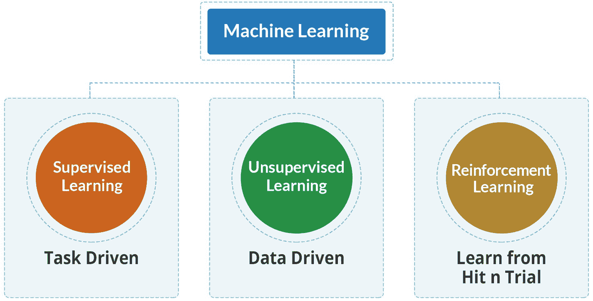
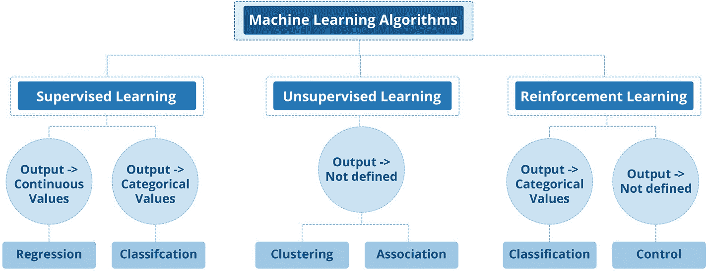
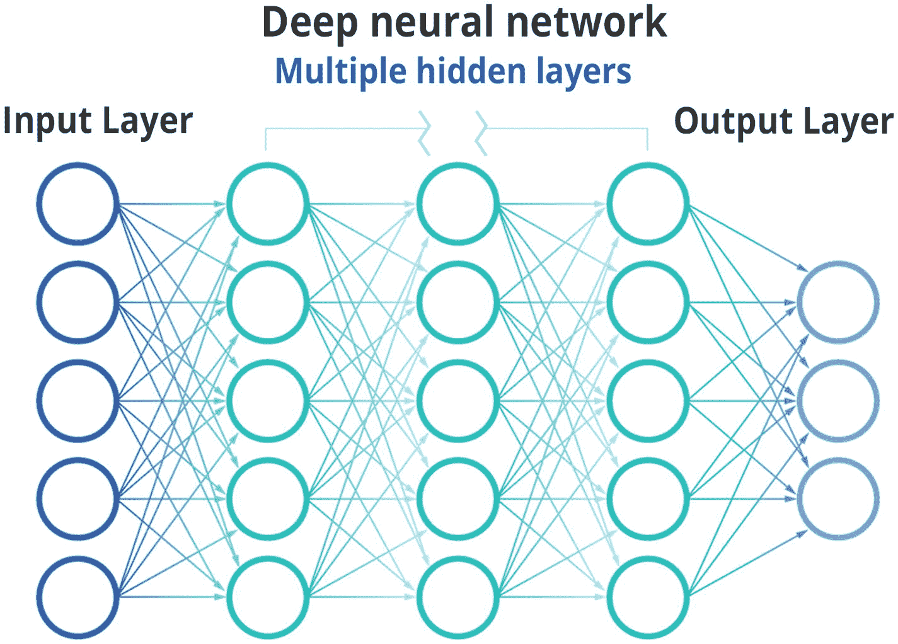
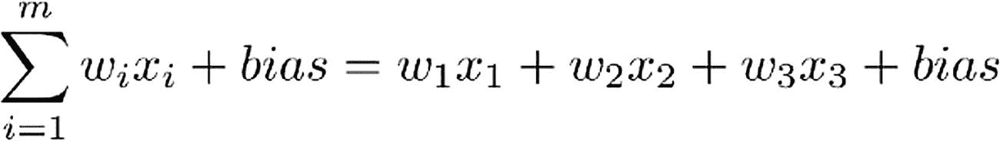

# 5. 机器学习与人工智能基础

在前面的章节中，你已经了解了`AIOps`、其架构及其组件，在接下来的几章中，你将更深入地探索`AIOps`。不过，在开始为`AIOps`实现算法之前，你需要学习一些关于机器学习和人工智能的基本知识。本章将介绍人工智能、机器学习和深度学习的基础知识，然后继续讨论`AIOps`中使用的特定技术。

## 什么是人工智能与机器学习？

人工智能、机器学习和深度学习这几个术语经常被互换使用。本章将逐一介绍这些术语，并详细说明这些技术之间的差异与重叠之处。

我们大多数人或多或少都接触过人工智能。如今，人工智能被广泛应用于我们日常使用的大多数应用中。从购物网站上的推荐，到通过谷歌等搜索引擎找到最相关的文章，一切都涉及人工智能。我们都使用过语音识别技术，例如 Alexa、Siri 等语音助手。所有这些都由人工智能驱动。曾经是科幻小说的东西，如今已成为我们日常生活的一部分；人工智能在短时间内取得了长足的进步。

让我们从理解人工智能开始。*人工智能*这个术语用于定义由人类创造并由人类编程的智能。人工智能系统模仿人类的智能和推理能力来做出决策和解决问题。就像人类智能存在于人脑中一样，人工智能以算法、数据和模型的形式存在于机器中。

人工智能已被用于在国际象棋和围棋等游戏中击败人类。人工智能还在解决各种应用中的问题，并创造以前无法实现的新用例。如今，人工智能被应用于包括军事和监控应用、医疗保健和诊断在内的多个领域。甚至法律和治理领域也未能免受人工智能的影响。因此，人工智能作为一种技术，几乎在所有领域都找到了应用。

人工智能作为一个术语，自 20 世纪 50 年代以来逐渐流行起来。它涵盖了每一种具有人工创造智能元素的技术。机器学习在 20 世纪 80 年代蓬勃发展，而随着更多计算能力的可用，深度学习从 2010 年开始受到关注。我们将在本章中对这些技术逐一进行解释。

人工智能在过去十年中呈爆炸式增长，这主要归功于 GPU 等新型硬件技术，它们使处理速度更快、成本更低。更强大的处理系统正以更低的成本被制造出来，这使得人工智能算法和技术的实施成为可能。从理论上讲，这些技术已经存在了很长时间；然而，大规模执行这些模型所需的技术基础设施此前并不存在。

## 机器学习为何重要

人工智能广义上分为通用人工智能和狭义人工智能。通用人工智能作为一个概念，目前仍属于科幻范畴。通用人工智能是一种拥有我们人类所有感官（如视觉、听觉、触觉、嗅觉和味觉）的机器，甚至可能超越人类感官，去感知和体验超出人类能力范围的事物。这些通用人工智能机器会像人类一样行动，并拥有超越人类的能力。通用人工智能中的*通用*一词意味着，正如人类具有高度通用性，能够完成多种任务并学习多种事物一样，机器也应具备同样的能力。

相比之下，*狭义人工智能*由那些能够像人类一样甚至更好地执行特定任务的技术组成。当前的技术和实现状态都集中在狭义人工智能上。可以将狭义人工智能视为一个专家，它能快速且准确地执行一种类型的任务，但无法学习其他性质不同的任务。狭义人工智能的例子包括能够理解自然语言的系统、能够翻译语言的系统、能够识别物体的系统等。这些系统是为执行特定任务而创建和优化的。

还有第三个术语，称为“超级人工智能”，它在科幻作品中广泛使用，用来描绘一种达到关键智能阈值的人工智能，它能够在越来越短的时间框架内自我优化，并达到超级智能的水平。因此，超级智能能够通过递归地自我编码并在每次迭代中改进，从而快速自我转化和优化。随着超级智能在每次迭代中自我改进，它会变得更快、更强大，因此后续每个周期所需的时间更少。据推测，如果这样的系统成为现实，它可能能够在数小时内自我编码数百万次，并消耗地球上所有可用的计算能力来创造一个超级智能，因为每一步后续步骤所需的时间都会更少。

广义上，人工智能系统具有以下三个关键特性：

- *意向性*：人工智能系统有意基于数据的实时分析或历史分析做出决策。例如，一个用于相关性的算法可以将网站访问分类为正常用户访问或拒绝服务攻击。

- *智能性*：人工智能系统通过使用机器学习和深度学习技术，从数据中理解环境并得出概率性结论，从而具备智能。一个例子是对问题进行根本原因分析。这些系统试图模仿人类的智能和决策，但从技术上讲，我们距离在人工智能系统中达到人类智能水平仍然非常遥远。然而，在某些特定任务（如自然语言理解）中，一些人工智能系统提供的准确率已与普通人类的准确率相当。

- *适应性*：人工智能系统在编译信息和做出决策时，具备学习和适应的能力。人工智能系统能够随着数据的变化而适应。因此，人工智能系统不是从静态规则中学习，而是高度适应并从变化的数据中学习。例如，预测业务中的中断或服务影响，就涉及适应不断变化的环境和新数据的能力。

## 机器学习的类型

人工智能是一个相当广泛且复杂的领域，包含多个专门化的子领域。让我们更详细地了解机器学习和深度学习。

### 机器学习

机器学习是一种技术，它包括解析数据、从提供给算法的数据中学习，然后应用所学知识做出决策的算法。与传统编程不同（传统编程中，人们必须根据环境的快照和程序员推导出的特定逻辑，手动创建程序和规则），机器学习算法会自动从数据中推导出逻辑并创建所需的规则。

机器学习算法在我们今天使用的大多数应用程序中都在发挥作用。一个简单的例子是推荐系统，它根据对我们过去偏好的分析，以及与我们统计上相似的其他用户的偏好，推荐一部电影、一首歌或一件商品供我们购买。

顾名思义，机器学习算法不是静态的；它们会随着输入系统的新数据不断学习，并且随着数据量的增加，它们在任务上的表现会逐渐变得更好。

*机器学习*这个术语最早由阿瑟·塞缪尔于 1952 年提出；其经典且更实用的定义由汤姆·米切尔于 1997 年给出，该定义指出：“如果一个主体或程序在某一类任务 T 上的性能（由性能指标 P 衡量）随着经验 E 的增加而提高，则称该主体或程序从经验 E 中学习。”

机器学习有三种不同类型，即监督学习、无监督学习和强化学习，如图 5-1 所示。

一个以“机器学习”为标题的模型树状图。它有三个分支：监督学习、无监督学习和强化学习。监督学习被标记为任务驱动。无监督学习被标记为数据驱动。强化学习被标记为从试错中学习。

### 监督（归纳）学习

在监督学习中，用户为特定任务向机器学习算法提供训练数据，供其分析学习。训练数据既包含输入（称为*特征*），也包含正确输出（称为*标签*）。一个简单的例子是某个事件及其描述、时间戳、发生次数、发生的设备，以及它是关键告警还是噪音。一旦系统获得足够的数据样本，它就能学会区分告警和噪音。训练数据越多，系统的准确率就越高。

随后，该模型被应用于未见过的数据作为输入，供算法预测响应。该模型对于算法寻找所提供参数之间的关联，并在数据集中的特征之间建立因果关系至关重要。训练结束时，算法会形成一份关于数据运作方式以及输入与输出之间关系的草案。

对于机器学习算法，带标签的数据集被分为训练数据和测试数据。训练数据集用于训练算法，之后测试数据集被输入模型以衡量其预测的准确性。随后，模型会逐步进行微调，以达到更高的准确率。

训练数据的数量和质量对于决定输出的准确性都至关重要。根据最佳实践，数据集应按照 70:30 的比例划分为训练集和测试集。如果数据集中存在类别分布不均的情况，则称为*不平衡*训练数据集，这意味着某个特定类别/标签的记录非常多，而另一个类别/标签的记录非常少。不平衡的数据集会导致决策边界不完善，从而造成预测不准确。从 AIOps 的角度来看，训练数据集应使用正确的带标签参数来代表实际的生产或运营特征。

提高预测准确性的另一个重要因素是移除不相关的特征，因为它们会对学习过程产生负面影响。特征是构成数据的一部分的各种输入；重要的是，训练中只应提供相关的特征。训练数据中的错误、不足或不相关数据都会导致模型出错。

从 AIOps 的角度来看，最常用的监督机器学习算法如下：

-   *回归*：回归用于预测一个连续的数值。例如，在任何特定时间间隔内，找出 CPU 的使用率百分比、网站点击次数、数据库容量（GB）等。

-   *分类*：如果期望从一组有限的类别中获取一个离散值，则使用分类。我们已经见过一个将事件分类为告警或噪音的例子。根据预测输出是属于两个类别之一还是多个类别之一，分类用例被标记为二分类问题或多分类问题。

以下是监督机器学习算法：

-   回归

-   逻辑回归

-   分类

-   朴素贝叶斯分类器

-   K-NN（K-最近邻）

-   决策树

-   支持向量机

了解了监督机器学习技术后，让我们探索另一种关键的机器学习技术：无监督学习。

### 无监督学习

在任何组织中实施 AIOps 的一大挑战是获取干净的带标签数据。在这种情况下，无监督机器学习为 AIOps 之旅提供了起点。与监督学习不同，它不需要任何“正确答案”作为标签。相反，这些算法从数百万个未标记的数据点中探索固有的模式和关系，以发现数据中隐藏的相关性和模式。无监督学习算法可以通过动态改变隐藏的相关性来适应数据。它允许模型自行工作，发现以前未被检测到的模式和信息。由于没有训练数据，完全由算法自行解读和理解数据，因此它在计算上比监督学习更密集。由于没有提供训练，也没有专家输入给算法，它的准确性也低于监督学习。有时，无监督学习用于进行初步分析，然后在获得更多见解后将数据输入监督学习算法。尽管无监督学习不使用标签，但人类仍然需要分析生成的输出以理解数据并微调模型，以便产生预期的结果。

以下是 AIOps 中最常用的一些无监督机器学习算法。

*聚类*通过分割来识别数据集中的异常，聚类基于数据集中特征和模式之间的相似性和差异性。多个聚类有助于运维团队诊断问题和异常。聚类将整个数据集划分为彼此更相似的子集，从而无需任何训练就能洞察数据。聚类会将相似的事件聚集在一起，然后可用于进一步分析数据，并选择需要用于 AIOps 的适当机制和算法。

*关联*基于从数据集中推导出的相关性来发现实体之间的关系。例如，服务器上一个长时间运行的数据库作业可能与高 CPU 使用率相关，并可能导致网站点击或事务的响应时间变长。

从 AIOps 的角度来看，数据点应暴露给无监督学习，以利用聚类和关联算法进行根因分析。作为最佳实践，所有事件和告警都应输入无监督学习算法，以确定噪音。

降维是一种在给定数据集中特征数量过多时使用的学习技术。它在保持数据完整性的同时，将数据输入的数量减少到可管理的大小。通常，该技术用于数据预处理阶段。这确保了噪声特征或与当前任务不相关的特征被减少。

以下是无监督学习的类型：

-   聚类

    -   独占（划分）

    -   凝聚

    -   重叠

    -   概率

以下是最常用的聚类算法：

-   *层次聚类*：顾名思义，这种聚类算法使用聚类的“层次结构”将数据分解成簇，并形成一种称为*树状图*的树形结构。从 AIOps 的角度来看，它有助于在没有 CMDB 的情况下自动检测服务模型，并对其执行服务影响分析。您可以遵循自上而下的方法（分裂）或自下而上的方法（凝聚）来将数据点分组到簇中。在分裂方法中，所有数据点都被假定为一个大簇（如应用服务）的一部分，然后根据终止逻辑，它们被分成更小的簇（如技术服务）。在凝聚方法中，每个数据点被假定为一个簇，然后通过迭代合并来创建更大的簇。

#### 聚类算法

*   *基于质心的聚类*：这类算法是创建聚类并将数据点分配到其中的最简单、最有效的方法之一。在此算法中，我们首先需要找到“K”个质心，然后根据与质心的距离（或邻近度）对数据集进行分组。`K-means`是一种流行的基于质心的聚类算法，我们将在第 8 章中详细探讨它，用于 IT 运维中 AIOps 实施过程中的异常检测、噪声检测和根因分析。

*   *基于密度的聚类*：基于质心和基于层次的聚类技术都基于数据点之间的距离（或邻近度），而没有考虑特定位置（或时间戳）上数据点的密度。这一局限性由基于密度的聚类算法解决，并且这些技术在从数据集中检测离群点和噪声方面比`K-means`算法表现更好。

接下来，我们将讨论强化学习，这是另一种用于特定场景的技术。

## 强化学习

监督学习和无监督学习算法都依赖于数据集进行学习。但你也可以从对你行为的反馈中学习，无论这种反馈是奖励还是惩罚。强化学习利用了这种方法，并由一系列行动的反馈驱动。它通过试错法不断改进和学习。强化学习算法基于涉及奖励和惩罚的训练。因此，对于每一个成功的行动，智能体都会获得奖励；而对于每一个不成功的步骤，则会受到惩罚。强化学习策略决定了智能体应该做什么。它还涉及调整短期和长期的奖励与惩罚，以防止智能体为了短期奖励而错失长期更大的回报。除了智能体、奖励与惩罚以及策略之外，另一个重要元素是智能体运行的环境。因此，在智能体的每一步，智能体及其环境的状态都会被反馈到系统中，以计算下一步要采取的行动。强化学习为一些在传统游戏和视频游戏中击败人类玩家的 AI 系统提供了动力。

图 5-2 总结了我们在机器学习中讨论过的算法。

一个带有标题“机器学习算法”的模型树状图有三个分支：监督学习、无监督学习和强化学习。每个学习分支有两个子分支及其输出。这些子分支分别是回归、分类、聚类、关联、分类和控制。

## 监督学习与无监督学习的区别

在监督学习中，目标是通过利用从训练数据中学到的知识来预测新数据的结果。在此模型中，结果对应的类别是已知的，因此你可以从一组可能的结果中知道最终结果是什么。对于无监督学习算法，目标是从可用数据中获取洞察，算法会根据提供的数据自行决定特征。无监督学习的输出及其类别是未知的。

监督学习模型适用于我们知道类别并且有足够的训练数据来训练机器学习算法的数据。监督学习算法广泛用于价格预测、预测、情感分析以及其他分类和回归任务。无监督机器学习则广泛用于推荐引擎、异常检测等场景。

监督学习算法更准确，因为训练数据是由领域专家整理、验证和提供的；而无监督算法则不那么准确，需要人工干预来解释结果。训练监督学习算法需要花费时间和精力来创建训练数据，而对于无监督学习，则无需创建训练数据。

在了解了所有三种学习技术之后，让我们来理解如何从可用于实现这些技术的各种选项中进行选择。

## 选择机器学习方法

选择正确的机器学习方法类型取决于多种因素。

*   *目标*：目标是更详细地理解数据及其相关性和特征吗？目标是将相似的数据聚类在一起进行分析吗？还是对离散或连续变量进行概率预测？根据应用的最终目标，你需要在监督学习和无监督机器学习之间做出选择。

*   *数据*：是否有可用的训练数据和标记数据？这些数据能否被提供？如果可以，那么你可以选择监督学习；否则，在没有训练数据的情况下，你需要选择无监督机器学习技术。

到目前为止，在 AIOps 中讨论的机器学习技术可能需要处理大量文本数据，而不仅仅是指标。自然语言处理（NLP）使得使用机器学习技术分析文本数据成为可能，接下来将对此进行讨论。

## 自然语言处理

NLP 是 AI 领域内的关键研究领域之一，它处理自然语言文本中包含（或者说隐藏）的信息。NLP 利用语言语义和语法来确定上下文以及通过文本传达的真实含义和情感。

NLP 使 AIOps 系统能够从组织内可用的各种规则手册和知识文章中挖掘知识，并搜索供应商仓库或在线社区中的最新信息。个人几乎不可能在有限的时间窗口内扫描和吸收成千上万份文档中的知识，并据此执行特定的任务或操作。从 NLP 获得的知识极大地有助于改进强化学习算法、高效执行自动化解决方案，以及在处理故障时为 SRE 和 DevOps 提供建议和指导。

聊天机器人曾经被视为可选实体，如今已成为企业（尤其是服务行业）的必备品。得益于新兴技术，最终用户获得了自助服务能力，这让他们感到更有主动权。借助 NLP，聊天机器人可以进行类似人类的有意义对话，而不仅仅是给出预定义的有限回复。这成为 AIOps 系统中的一个巨大差异化优势。让我们更详细地了解自然语言处理过程。

### 什么是自然语言处理？

人类的自然语言是复杂的；它有着多种可能表达相同含义的变体。它有时模棱两可，依赖于对象或情境的上下文，并且极其多样化。因此，当我们试图让机器解读或破译语言时，它本身就带来了一系列挑战。我们在这里没有使用*理解*这个词，因为机器可能不像我们那样理解语言。因此，破译和解读我们试图传达的内容更为恰当。

`NLP` 是人工智能领域的一个分支，它使计算机能够理解人类语言。`NLP` 分析句子的语法结构和单词的个体含义；它使用机器学习和深度学习算法以及其他特定的 `NLP` 技术，从提供的输入中提取含义。因此，`NLP` 是让机器破译人类语言的技术，机器可以使用自然的人类语言而非软件代码来接收输入。

`NLP` 技术广泛应用于各种场景；然而，它最显著的形式是虚拟助手，如苹果 Siri、谷歌助手、微软小娜和亚马逊 Alexa。你还会在许多应用程序和网站中发现认知虚拟助手，你可以用人类语言输入查询，系统能够破译它并返回答案。所有这些系统都在幕后使用 `NLP` 技术。

除了聊天机器人和虚拟助手，还有许多其他应用使用 `NLP`。当你在搜索引擎中输入术语时的文本推荐或下一个单词建议、使用谷歌翻译服务时的语言翻译、电子邮件中的垃圾邮件过滤、帖子或推特动态的情感分析——所有这些用例都使用了 `NLP` 技术。

简而言之，`NLP` 的目标是让复杂、模棱两可且极其多样化的人类语言变得易于机器理解。

`NLP` 和机器学习都是人工智能的子集。为了创建 `NLP` 算法，需要使用机器学习技术。由于它本身就是一个领域，`NLP` 在人工智能技术中被单独列为一个领域。有完全致力于 `NLP` 的技术、算法和系统。

`NLP` 应用两种技术来帮助计算机理解文本：句法分析和语义分析。

### 句法分析

句法分析（或解析）使用基本语法规则分析文本，以识别句子结构、单词的组织方式以及单词之间的相互关系。它的一些主要子任务包括：

*   *分词* 将文本分解成称为标记的更小部分，以使文本更易于处理。这是 `NLP` 中将文本分解为标记的第一步，以便 `NLP` 引擎可以进一步处理。

*   *词性标注* 将分词生成的标记标注为名词、形容词、动词、副词等。这有助于 `NLP` 引擎推断单词在特定上下文中的含义。例如，单词 *Saw* 可以表示过去的“看见”，也可以是指向物体 `Saw` 的名词。

*   *停用词移除* 移除频繁出现但不增加任何语义价值的单词，例如 *我*、*他们*、*有*、*喜欢*、*你的* 等。

### 词干提取与词形还原

*   *词干提取* 通过移除后缀将单词转换为词根形式。例如，*Studying* 将被转换为 *Study*。它指的是一种粗略的启发式过程，大多数情况下通过修剪单词末尾来找到正确的词根，但资源消耗较少且速度快。

*   *词形还原* 也使用词汇和词的形态分析将单词转换为词根，旨在去除屈折词尾并返回单词的基本形式或词典形式。例如，它将屈折词替换为其基本形式，因此 *Saw* 被转换为 *See*。词形还原更准确，但资源消耗更大且更复杂。

*   *指代消解* 处理解决代词（如 *他*）或名词（如 *CEO*）所指对象的问题。

### 语义分析

语义分析侧重于捕捉文本的含义。它遵循两步过程。首先，它试图提取每个单词的含义，然后查看单词的组合以破译它们在特定上下文中的含义。

*   *词义消歧*：处理确定句子中使用的单词的真实含义或意义的问题。这也会影响指代消解的输出。

*   *关系抽取*：关系抽取分析文本数据，并试图找出各种实体之间的关系。实体可以是各种名词，如人物、地点、地理区域、物体等。

`NLP` 工具和技术在 `AIOps` 领域高度适用。聊天机器人或认知虚拟代理是 `AIOps` 中由 `NLP` 技术驱动的模块之一。在认知虚拟助手中，有多种 `NLP` 服务和技术被组合在一起以提供认知虚拟助手。在了解了 `NLP` 技术之后，让我们讨论一下它在 `AIOps` 中的用例。

## NLP AIOps 用例

`NLP` 在 `AIOps` 系统中扮演着至关重要的角色，用于理解告警消息（`SNMP` 陷阱、电子邮件、事件 ID 等）、事件、用户聊天消息、日志内容以及许多其他传达问题或反馈的来源中的文本数据。`NLP` 使得 `AIOps` 系统能够解释此类文本，并据此采取适当的行动。让我们探讨一下 `NLP` 在 `AIOps` 中的一些用例。

### 情感分析

情感分析识别文本中的情感，并将数据分类为正面、负面或中性。

在使用工单数据或聊天数据时，情感分析是一个关键用例。对于每一条工单反馈以及每一次与客服人员发起和结束的对话，你可以利用情感分析来了解用户对所提供服务的感受。这在认知虚拟助手对话中也很有用，因为认知虚拟代理可以根据用户的情感来调整其回复。例如，如果用户很生气，认知虚拟代理可以用“对造成的不便深表歉意”这样的安抚性语句开始对话，使对话更自然、更像人类，而不是可能忽略情感的机械式对话。

### 语言翻译

许多 IT 运营支持多个地理区域和语言，IT 服务管理员和服务台客服人员很难全天候覆盖所有语言。因此，语言翻译服务对于服务台客服人员来说非常有用，他们可以翻译工单数据或对话数据，并利用这些数据来定位用户的问题并解决它。语言翻译既用于认知虚拟助手，也用于用户与客服人员的沟通。翻译服务在分析可能以不同语言提供的工单数据时也很有用。

### 文本提取

文本提取使你能够从文本中提取预定义的信息。IT 团队通常处理各种知识管理存储库中的大量数据。在 IT 服务管理系统中，已知错误数据库（`KEDBs`）中也有数据。技术文档中也有大量数据，为根本原因分析、故障排除和解决方案提供信息。所有这些信息对于运营团队来说都变得难以招架。`AIOps` 系统从这些存储库中提取相关信息，并向管理员和服务台客服人员呈现正确的信息，以便他们能够进行故障排除和解决问题，或完成服务请求和变更。

#### 主题分类

主题分类功能帮助 AIOps 引擎将各个存储库中的非结构化文本整理到不同类别中。大多数情况下，信息分散在多个系统中，任何最初创建的目录结构或分类结构都会变得难以管理。相关类别和主题的内容会分散到各个存储库中，手动维护主题和相关文档变得不可能。AIOps 引擎可帮助您将这些非结构化数据组织到不同类别中。此功能还可用于在 IT 服务管理中将工单标记到不同类别。

以上涵盖了 NLP 技术及其用例的概述，现在我们将转向 AIOps 中使用的最后一种也是最复杂的技术，即深度学习。

## 深度学习

我们在前面的章节中介绍了机器学习及其分支。如前所述，深度学习是机器学习的一个子集，或者说是一种让机器从数据中学习的特殊方式。深度学习的功能方式与机器学习类似；然而，用于实现最终结果的技术以及深度学习提供的能力略有不同。

尽管机器学习和深度学习经常互换使用，但两者在学习方法上在技术上是不同的。

深度学习是机器学习的一个子领域，它将算法按层结构组织，以创建一个“人工神经网络”，该网络能够自主学习并做出智能决策。

深度学习模型的设计目的是以类似于人类得出结论的方式分析数据。深度学习算法使用一种称为`人工神经网络`的分层结构来处理数据并学习数据中的各种特征。

人工神经网络在理论上已经存在了很长时间；然而，只有在计算技术进步到能够提供运行这些模型所需的计算资源之后，人工神经网络的应用才成为可能。因此，神经网络和深度学习在过去十年中变得实用，并创造了奇迹般的解决方案。谷歌创建了`AlphaGo`，它在围棋比赛中击败了所有人类冠军，这证明了计算智能的到来，它可以应用于需要数十亿次计算才能解决的游戏。

人工神经网络的灵感来源于动物和人类大脑中的生物神经网络。生物神经网络通过观察和学习数据来逐步学习，没有任何特定任务的程序指导它们。人类在看过少量猫和狗的样本后就能识别出猫和狗；然而，机器需要更多的数据来学习，但它确实能学会区分它们，并在学习后能够将它们归类到正确的物种下。

人工神经网络是使用神经元层创建的。不同的层称为`隐藏层`，当信号从输入层通过各个隐藏层传递到输出层时，它们会对输入执行不同的转换，最终得出结果，如图 5-3 所示。

深度神经网络的三层示意图。这些层分别是输入层、多个隐藏层和输出层。输入层有 5 个垂直排列的圆圈。多个隐藏层有 3 组垂直排列的圆圈。每组有 5 个圆圈。输出层有 3 个垂直排列的圆圈。

图 5-3

深度学习神经网络

对于复杂的用例，神经网络可以拥有数量庞大的神经元和连接，连接数可达数百万。

神经网络和深度学习正被用于各种用例，例如 NLP、机器翻译、图像识别、电子游戏、垃圾邮件过滤、搜索引擎等。

神经网络在基本层面上包括输入、权重、偏置（阈值）和输出。然后，当训练数据被输入系统时，神经网络使用反向传播来平衡权重，以找出哪些神经元在映射到正确输出时导致了错误。在神经网络通过多次迭代对所有数据进行训练后，每个神经元的权重会被配置成一种方式，使得作为输出的集体响应是准确的。

阈值是神经网络中的一个重要参数；如果生成的值高于阈值，它会导致节点被激活，然后将数据发送到下一层。因此，一层中一个神经元的输出会影响它所连接的下一层神经元的输入，从而影响其输出。包含多个神经元的隐藏层有自己的激活函数，并根据阈值将信息不断传递到下一层。

其思想是，每一层都会发现输入中的一个特征，而下一层会逐步发现更低层次的特征，就像人类大脑的工作方式一样，先找到一个更高层次的对象，然后发现该对象是什么及其特征。

神经网络的一般方程如下，其中 `w` 是权重，`x` 是特征：

一个通用方程，表示为从 i 等于 0 到 m 的 sigma，w 下标 i x 下标 i 加上偏置等于 w 下标 1 x 下标 1 加上 w 下标 2 x 下标 2 加上 w 下标 3 x 下标 3 加上偏置。

神经网络使用反向传播，它允许神经元中的权重根据它们对输出所贡献的误差进行调整。这使得权重和模型能够逐步达到更高的准确率并收敛，从而可以部署到它正在训练的用例中。

尽管深度学习模型需要更高的计算资源和数据，但模型的灵活性及其学习复杂特征的能力使其成为各种用例的有力选择。深度学习通常部署在复杂度更高、数据量更大、并且有可用于训练深度学习模型的数据的用例中。

## 总结

本章涵盖了机器学习、深度学习、自然语言处理的基础知识，以及其中一些能力如何在 AIOps 领域中使用。我们介绍了各种技术，包括监督和无监督机器学习以及 NLP。这些技术构成了 AIOps 平台的基础。在下一章中，我们将探讨具体的 AIOps 用例，以及如何在这些用例中使用这些技术。我们将从下一章中最常见的去重用例开始。
