# 6. AIOps 用例：去重

在前面的章节中，您了解了各种机器学习技术及其一般用法。在本章中，您将看到 AIOps 中一个特定的去重用例的实现，以及它在运营和业务中使用的实际场景。


## 环境搭建

在本节中，你将学习如何搭建环境以运行演示各种 AIOps 用例的示例代码。你有三种搭建环境的选择。

- 从 [`https://www.python.org/downloads/`](https://www.python.org/downloads/) 下载 Python，并通过安装程序直接安装 Python。其他软件包需要在 Python 基础上显式安装。
- 使用 Anaconda，它是一个 Python 发行版，专为大数据处理、预测分析和科学计算需求而设计。Anaconda 发行版是执行 Python 编码最简单的方式，它适用于 Linux、Windows 和 macOS。可以从 [`https://www.anaconda.com/distribution/`](https://www.anaconda.com/distribution/) 下载。
- 使用云服务。这是所有选项中最简单的一种，但需要互联网连接才能使用。诸如 Microsoft Azure Notebooks 和 Google Collaboratory 等云提供商很受欢迎，可通过以下链接访问：
  - Microsoft Azure Notebooks：[`https://notebooks.azure.com/`](https://notebooks.azure.com/)
  - Google Collaboratory：[`https://colab.research.google.com`](https://colab.research.google.com)

我们将使用第二个选项，并使用 Anaconda 发行版搭建环境。

## 软件安装

从 [`https://www.anaconda.com/distribution/`](https://www.anaconda.com/distribution/) 下载 Anaconda Python 发行版，如图 6-1 所示。

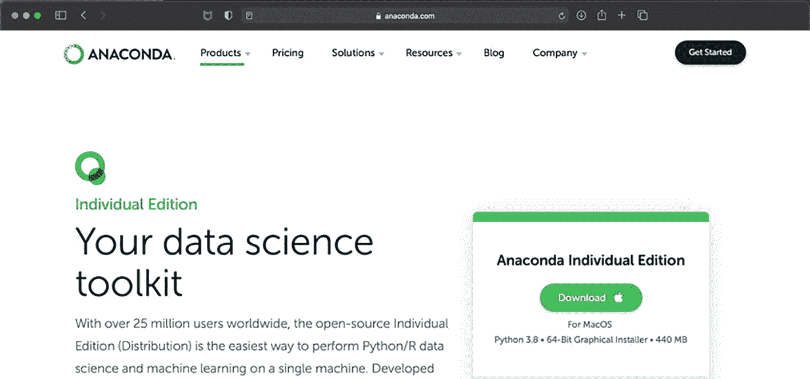

一个下载 Anaconda 的仪表盘，包含选项、产品、定价、解决方案、资源、博客和公司。在选项套件下方，有一段文字写着“你的数据科学工具包”。

图 6-1

下载 Anaconda

下载文件后，启动安装程序以开始安装过程。

1. 点击“继续”。
2. 在“自述”步骤，点击“继续”。
3. 接受协议，然后点击“继续”。
4. 选择安装位置，然后点击“继续”。
5. 它将在计算机上占用约 500MB 的空间。点击“安装”。
6. 一旦 Anaconda 应用程序安装完成，点击“关闭”并进入下一步以启动应用程序。

## 启动应用程序

安装 Anaconda Jupyter 后，打开命令行终端并输入 `jupyter notebook`。

这将启动 Jupyter 服务器，监听 8888 端口。通常，会有一个默认浏览器的弹出窗口自动打开，或者你可以通过打开任意网页浏览器并访问 URL `http://localhost:8888/` 来登录应用程序，如图 6-2 所示。

点击“新建” ➤ “Python 3” 以创建一个空白笔记本。

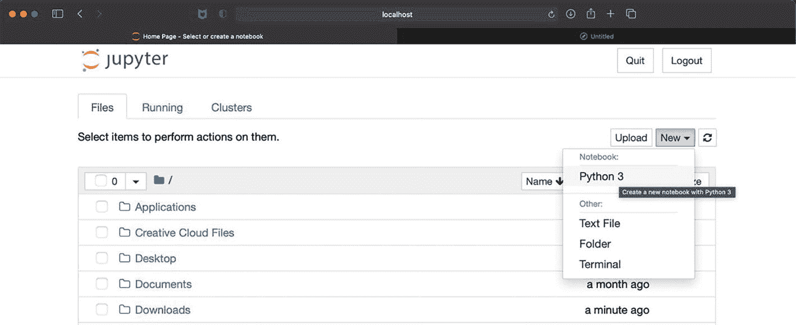

一个 Jupyter 笔记本的弹出窗口，左侧有文件、运行和集群选项。文件选项下包含一些项目，如应用程序、Creative Cloud 文件、桌面、文档和下载。右侧是 Python 3 的菜单栏，包含文本文件、文件夹和终端选项。

图 6-2

Jupyter Notebook 用户界面

一个空白笔记本将在新窗口中启动。你只需在单元格中输入命令，然后点击“运行”按钮来执行它们。为了测试环境是否正常工作，在单元格中输入 `print("Hello World")` 语句并执行。

本书使用 Python Notebooks 来演示 AIOps 的去重、动态基线设定和异常检测用例；这些 Notebooks 可在 [`https://github.com/dryice-devops/AIOps.git`](https://github.com/dryice-devops/AIOps.git) 获取。你可以下载源代码以跟随本章的练习进行操作。

现在，环境已准备好，可以为多个 AIOps 用例开发和测试算法模型。在进入模型开发之前，让我们先了解一些将用于分析和衡量模型性能的术语。

## 模型性能分析

在实践中，需要创建多个模型来进行预测，量化其预测的准确性非常重要，以便选择性能最佳的模型用于生产环境。

在监督式机器学习模型中，一组实际数据点被分为训练数据和测试数据。模型通过训练数据学习并进行预测，这些预测结果会与训练数据和测试数据进行验证。实际值与预测值之间的差值称为*误差*。目标是选择误差最小的模型。

有多种方法可以分析误差并衡量预测的准确性。以下是最常用的方法。

### 均方误差/均方根误差

在这种方法中，首先通过从预测结果值中减去实际结果值来计算每个数据点的误差。这些误差需要相加，以计算从特定模型获得的总误差。但不同数据点的误差可能为正或负，将它们相加会相互抵消，从而得出错误的结果。为了解决这个问题，在均方误差（MSE）中，对计算出的误差进行平方，以确保正负误差值不会相互抵消，然后对所有平方误差值取平均值，以确定整体准确性。

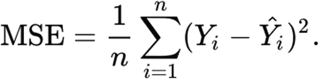

MSE 的公式等于 1 除以 n 乘以从 i 等于 1 到小写 n 的求和，括号内为 Y 下标 i 减去 Y 帽下标 i 的平方。

- 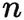 小写 n。 -> 数据点数量
- 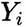 大写 Y 下标小写 i。 -> 特定测试数据点的实际值
- 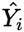 大写 Y 帽下标小写 i。 -> 特定测试数据点的预测值

MSE 还有另一种变体，即对 MSE 取平方根，以提供均方根误差（RMSE）值。MSE/RMSE 越低，预测的准确性越高，模型越好。

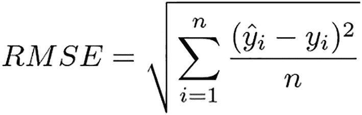

RMSE 的公式等于根号下从 i 等于 1 到小写 n 的求和，括号内为 y 帽下标 i 减去 y 下标 i 的平方，再除以 n。

MSE 和 RMSE 都使用“均值”作为基线，这是这些方法最大的问题，因为均值对异常值具有固有的敏感性。简单来说，假设有四个数据点提供给模型 A 和模型 B。表 6-1 列出了每个模型在每个数据点上获得的误差。

表 6-1

机器学习模型中的样本数据和误差

| 数据点 | 模型 A 的误差 | 模型 B 的误差 |
| --- | --- | --- |
| D1 | 0.45 | 0 |
| D2 | 0.27 | 0 |
| D3 | 0.6 | 0 |
| D4（异常值） | 0.95 | 1.5 |

模型 B 看起来是更好的模型，因为它除了在一个数据点（该点是异常值并产生了高误差）外，其他预测的准确率达到了 100%。另一方面，模型 A 几乎在每个数据点上都产生了小误差。

但如果考虑两个模型的误差均值，那么模型 A 的误差均值将低于模型 B，这会导致对模型准确性的错误解读。


#### 平均绝对误差

与均方误差类似，平均绝对误差（MAE）方法首先计算实际结果值与预测结果值之间的差值作为误差，但 MAE 不计算误差的平方，而是考虑误差的绝对值。最后，对所有绝对误差值取平均值，以确定整体精度。

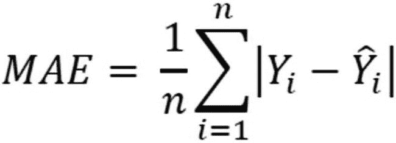

公式为 `MAE = 1/n * Σ|Yi - ŷi|`，其中 `i` 从 `1` 到 `n`。

#### 平均绝对百分比误差

MAE、MSE 和 RMSE 的最大挑战之一是，它们提供的绝对值可用于比较多个模型的精度。但由于没有定义用于比较该绝对值的尺度，因此无法验证单个模型的有效性。这些方法的输出可以取任何值，且没有定义范围。

MAPE 不计算绝对误差，而是通过首先计算每个数据点的误差值除以实际值，然后取其平均值，以百分比形式衡量精度。

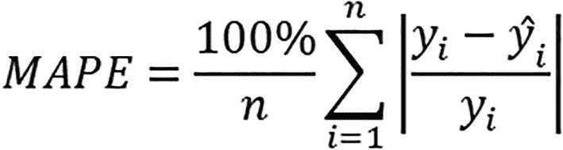

公式为 `MAPE = (100% / n) * Σ|(Yi - ŷi) / Yi|`，其中 `i` 从 `1` 到 `n`。

MAPE 是一个有用的指标，也是最常用的计算精度的方法之一，因为其输出介于 0 到 100 之间，可以直观地分析模型性能。当数据点值中没有极端值、异常值或零值时，其效果最佳。

#### 均方根对数误差

RMSE 面临的挑战之一是异常值对整体 RMSE 输出值的影响。为了最小化（有时甚至消除）这些异常值的影响，存在另一种称为 RMSLE 的方法，它是 RMSE 的一种变体，利用对数性质计算预测值与实际值之间的相对误差，而非绝对误差。

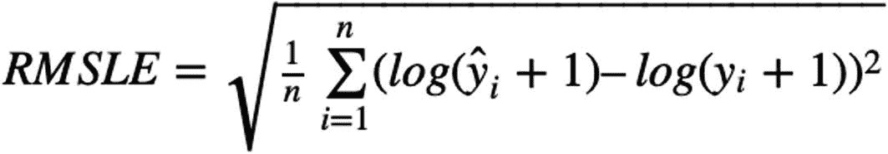

公式为 `RMSLE = sqrt((1/n) * Σ(log(ŷi + 1) - log(Yi + 1))²)`，其中 `i` 从 `1` 到 `n`。

在实际值与预测值存在巨大差异的情况下，误差会变得很大，导致 RMSE 产生巨大惩罚，但 RMSLE 能很好地处理这种情况。另外需要注意的是，当预测值或实际值为零时，零的对数未定义。因此，在预测值和实际值上都加 1，以避免这种情况。

#### 决定系数 - R² 分数

在统计学中，R² 被定义为“因变量中可由自变量预测的变异比例”。它在一个方便的 0–100% 尺度上衡量模型与因变量之间关系的强度。

*   0% 表示模型无法解释响应变量围绕其均值的任何变异。
*   100% 表示模型解释了响应变量围绕其均值的所有变异。

在拟合线性回归模型后，确定模型对数据的拟合程度非常重要。通常，R² 越大，回归模型对观测值的拟合效果越好；然而，其中存在一些注意事项，这超出了本书的讨论范围。

在了解了衡量模型精度的各种方法之后，我们现在将进入第一个 AIOps 用例，即事件去重。

## 去重

去重是事件管理功能最基础的功能之一，通过处理来自监控底层基础设施和应用程序的多个工具的数百万个事件来减少噪音。考虑一个简单常见的场景：一个批处理作业被触发，导致 CPU 利用率超过 70% 的警告阈值；15 分钟内，备份启动，将 CPU 利用率推高至 90%，并生成一个严重事件。监控系统每次轮询该系统时，此事件都会重复出现；一旦计划作业结束，CPU 利用率将恢复正常。然而，在此期间，它生成了四个具有不同时间戳的事件。但本质上，所有这些事件都代表了服务器上 CPU 利用率高的同一个问题。存在大量此类操作场景，既有简单的也有复杂的，都会生成重复事件。如图 6-3 所示，去重功能通过将新事件与系统中现有事件进行比较来验证其唯一性，从而管理这种复杂性；如果找到匹配项，则丢弃该事件，同时增加原始告警的计数器，并根据最新生成的事件更新时间戳。这有助于确保事件控制台不会被同一事件多次充斥。

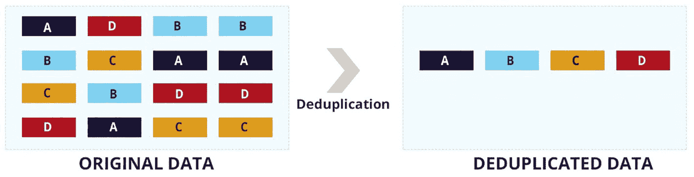

原始数据到去重数据的去重管理功能示意图。原始数据有 4 个垂直层，包含字母：A B C D、D C B A、B A D C 和 B A D C。去重后的数据有 4 个字母：A、B、C 和 D。中间有一个向右的箭头，标记为“去重”。

**图 6-3** 去重功能

为了实现去重功能，需要定义一个唯一键，用于定义唯一的问题及其上下文。该唯一键使用事件中的信息（例如主机名、来源、服务、位置、类别等）动态创建。可以配置规则或算法，将此唯一键与系统中的所有事件进行匹配，并执行去重功能。请注意，此 AIOps 功能不需要机器学习，只需使用基于规则的去重系统即可完成。

让我们观察去重功能的实际实现。此实现将从输入文件中读取告警。

在我们的代码中，我们将使用 `Pandas`（一个强大的 Python 库，用于分析和处理告警）以及 `SQLite DB`（一个轻量级的基于磁盘的数据库，用于在处理后存储告警）。与客户端-服务器数据库管理系统不同，`SQLite` 不需要单独安装服务器进程，并允许使用 SQL 查询语言的非标准变体访问数据库。`SQLite` 作为嵌入式数据库，在 Web 浏览器等软件的本地/客户端存储中很受欢迎。`SQLite` 将整个数据库（定义、表、索引和数据本身）作为单个跨平台文件存储在主机上。

从输入文件读取告警后，将动态创建一个唯一键 `EMUniqueKey`，以确定问题的唯一性并执行去重功能。在代码末尾，我们将确定代码中有多少告警是真实告警，有多少是重复告警。

在此代码中，我们将使用表 6-2 中提到的 Python 库。

**表 6-2** 机器学习中的样本数据和错误


| 库名称 | 用途 |
| --- | --- |
| `matplotlib` | 这是一个数据可视化库，包含多种用于创建分析图表和图形的函数。它支持多个平台，因此可在多种操作系统和图形后端上运行。 |
| `Pandas` | 广泛用于数据操作任务。它基于两个核心 Python 库构建——`matplotlib` 用于数据可视化，`NumPy` 用于执行数学运算。 |
| `sqlite3` | 该库为 SQLite 数据库提供了 API 2.0 接口。 |

打开一个新的 Jupyter notebook，或加载从 GitHub 下载的已有 notebook。从 [`https://github.com/dryice-devops/AIOps/blob/main/Ch-6_Deduplication.ipynb`](https://github.com/dryice-devops/AIOps/blob/main/Ch-6_Deduplication.ipynb) 下载该 notebook。

让我们从导入所需的库开始。

```
import pandas as pd
import sqlite3
from matplotlib import pyplot as plt
```

现在从文件中读取数据，并执行描述性分析以理解数据。

```
raw_events = pd.read_excel("Alert-Bank.xlsx")
```

让我们找出数据集中有多少行和列。

```
raw_events.shape
```

在输出中，如图 6-4 所示，告警库中共有 1,051 个样本事件，每个事件有九个列作为事件槽位。


Out open box parenthesis 2 close box parenthesis colon open parenthesis 1051 comma 9 close parenthesis.

**图 6-4** 输入文件中的数据点数量

让我们列出所有列及其数据类型和每列中非空值的数量。

```
raw_events.info()
```

根据图 6-5 所示的输出，共有 1,051 个非空值，这意味着任何列中都没有空值。如果列中包含空值，则需要在进一步处理之前对其进行处理。通常，如果空值数量较少，则可以完全删除包含空值的行，否则可以用均值或中位数替换空值。

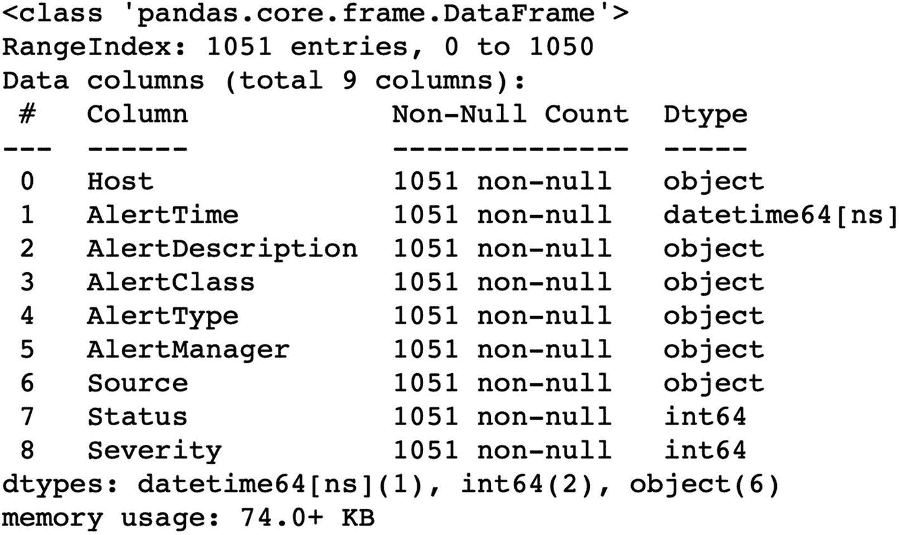

一个包含 4 列 9 行的去重函数表格。列名为：hashtag、column、Non Null count 和 Dtype。column 行的条目为：Host、alert time、alert description、alert class、alert type、alert manager、source、status 和 severity。下方有 dtypes：`datetime64ns`、`int64(2)`、`object(6)` memory usage: 74.0 plus KB。

**图 6-5** 去重函数

接下来，理解这些槽位中包含的值很重要，为此，我们执行 `head()` 命令来检查前五行数据的值，并结合 `transpose()` 以便更好地理解和查看数据。在输出片段中，如表 6-3 所示，我们可以看到告警库中三个事件的所有五个字段。

**表 6-3** 显示样本事件的输出片段

| 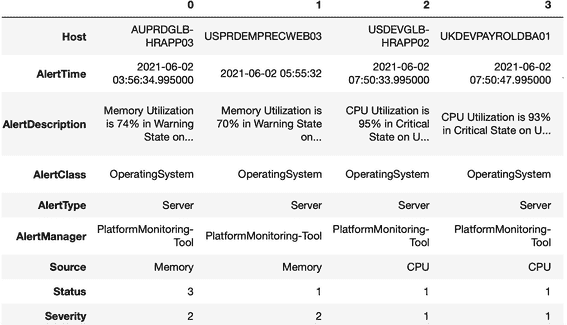一个包含 4 列 9 行的输出去重表格。列名为 0、1、2 和 3。9 行的标题为：Host、Alert time、Alert description、Alert class、alert class、alert type、Alert manager、Source、Status 和 Severity。 |

```
raw_events.head().transpose()
```

基于输出，我们可以观察到每个事件包含以下详细信息：

*   *Host*：指明事件产生的配置项（CI）。
*   *AlertTime*：指明事件在 CI 上产生时的时间戳。
*   *AlertDescription*：指明导致事件产生的问题的详细信息。
*   *AlertClass*：指明事件所属的类别，例如操作系统。
*   *AlertType*：指明事件所属的类型，例如服务器。
*   *AlertManager*：指明捕获问题并生成事件的管理器。通常是底层的监控工具，如 Nagios、Zabbix 等。
*   *Source*：指明检测到问题的来源，例如 CPU、内存等。
*   *Status*：指明事件状态，是一个数值。
*   *Severity*：指明事件严重级别，同样是一个数值。

在本示例中，我们为 `Status` 字段和 `Severity` 字段中的不同值分配了唯一代码。事件状态可以分配不同的值，如表 6-4 所示；事件严重级别也可以分配不同的值，如表 6-5 所示。这些映射在不同工具中差异很大。

**表 6-5** 事件严重级别代码说明

| 严重级别值 | 含义 |
| --- | --- |
| 1 | 事件严重级别为严重 |
| 2 | 事件严重级别为警告 |
| 3 | 事件严重级别为信息 |

**表 6-4** 事件状态代码说明

| 状态值 | 含义 |
| --- | --- |
| 1 | 事件状态为打开 |
| 2 | 事件状态为确认 |
| 3 | 事件状态为已解决 |

让我们列出数据集中 `Status` 列的唯一值。

```
raw_events['Status'].unique()
```

根据图 6-6 中的输出，输入文件中存在三种类型的事件严重级别。


Out open box parenthesis 9 close box parenthesis colon array open parenthesis open box parenthesis 3 comma 1 comma 2 close box parenthesis close parenthesis.

**图 6-6** 去重函数

基于所做的分析，我们可以得出结论：每个事件都有一个特定的 `AlertTime`，该事件产生于 `Host` 中提到的设备，事件来源记录在 `Source` 中，属于由 `AlertClass` 和 `AlertType` 定义的特定类别。该事件由 `AlertManager` 中提到的监控工具捕获，并具有特定的严重级别 `Severity` 和枚举值 `Status`。问题详情在 `AlertDescription` 中提供。

为了进行去重示例，我们将去重键命名为 `EMUniqueKey`，并将其创建为 `Host`、`Source`、`AlertType`、`AlertManager` 和 `AlertClass` 字段的组合，用分隔符 `::` 连接，如图 6-7 所示。然后将其添加到数据集中每个事件中。

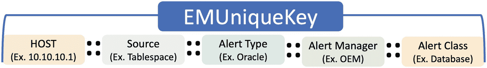

E M Unique key: Host (Ex. 10.10.10.1) separator Source (Ex. Tablespace) separator Alert type (Ex. Oracle) separator Alert Manager (Ex. O E M) separator Alert Class (Ex. database). The separator is 4 dots in a square pattern.

**图 6-7** 唯一键组成

```
raw_events['EMUniqueKey'] = raw_events['Host'].str.strip() + "::" \
+ raw_events['Source'].str.strip() + "::" \
+ raw_events['AlertType'].str.strip() + "::" \
+ raw_events['AlertManager'].str.strip() + "::" \
+ raw_events['AlertClass'].str.strip()
raw_events['EMUniqueKey'] = raw_events['EMUniqueKey'].str.lower()
raw_events = raw_events.sort_values(by="AlertTime")
raw_events["AlertTime"] = raw_events["AlertTime"].astype(str)
```

`EMUniqueKey` 是一个通用标识符，用于唯一标识底层问题，为执行去重提供所需的上下文。

让我们观察在数据集中添加唯一标识符后的数据。

```
raw_events.head().transpose()
```

如表 6-6 的输出所示，我们在数据集中为每个事件添加了一个名为 `EMUniqueKey` 的新字段。

**表 6-6** 添加唯一标识符后的更新数据集

| 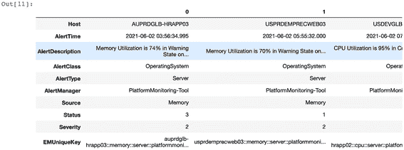一个包含 3 列 10 行的输出去重表格。列名为 0、1、2 和 3。行的标题为：Host、Alert time、Alert description、Alert class、alert class、alert type、Alert manager、Source、Status、Severity 和 E M Unique Key。 |

现在，我们已经准备好对给定数据集执行去重函数。


好的，作为高级文档工程师和翻译员，我将严格遵循您提供的注意事项和示例格式，将给定的英文文本翻译成中文。


在继续之前，有一点需要特别说明：我们可以在代码中使用数组，通过索引（`0`、`1`、`2`等）来读取和处理事件字段，但如果后续需要添加新字段，这种方式会限制可扩展性。为了避免可扩展性问题，我们将使用字典数据类型，这样我们就可以使用事件字段名而不是索引，如下面的函数所示：

```
def transform_dictionary(cursor, row):
key_value = {}
for idx, col in enumerate(cursor.description):
key_value[col[0]] = row[idx]
return key_value
```

现在，值将以键值对的形式存储，我们可以直接通过字段名引用任何事件字段。

让我们定义一个类，其中包含一些用于 SQLite 的关键函数。首先，使用初始化函数 `_init` 创建与数据库的连接。

```
class Database:
### 创建数据库连接以存储和处理事件。
def __init__(self):
self._con = sqlite3.connect('de_duplicationv5.db')
self._con.row_factory = transform_dictionary
self.cur = self.con.cursor()
self.createTable()
def getConn(self):
return self.con
```

函数 `getConn` 将创建一个与数据库的连接。

接下来，在数据库中创建所需的表。虽然我们只需要一个 `dedup` 表来存储最终去重后的事件，但我们还将创建一个 `archive` 表来存储重复的事件。`archive` 表将用于量化去重功能的收益。

```
def createTable(self):
self.cur.execute('''CREATE TABLE if not exists dedup
(AlertTime date, EMUniqueKey text, Host text, \
AlertDescription text, AlertClass text, AlertType text, \
AlertManager text, Source text, Status text, \
Severity text, Count real)''')
self.cur.execute('''CREATE TABLE if not exists archive
(AlertTime date, EMUniqueKey text, Host text,
AlertDescription text, AlertClass text, AlertType text,\
AlertManager text, Source text, Status text, \
Severity text)''')
```

读取事件后，需要根据事件是新事件还是重复事件，将其插入到 `dedup` 表或 `archive` 表中。函数 `insert` 将接收需要插入的表名和事件值。在插入事件之前，会为该事件动态生成 `EMUniqueKey`。

```
def insert(self, table, values):
columns = []
val = []
value = []
for EMUniqueKey in values:
columns.append(EMUniqueKey)
val.append("?")
value.append(values[EMUniqueKey])
query = "Insert into {} ({}) values ({})".format\
(table, ",".join(columns), ",".join(val) )
self.cur.execute(query, tuple(value))
```

我们需要函数 `execute` 来执行数据库查询，以及函数 `update` 来更新 `dedup` 表中事件的计数、严重性和状态，以处理系统中已存在且处于打开状态的事件的重复出现。

```
def execute(self, query):
self.cur.execute(query)
def update(self, query, values):
### print(query)
return self.cur.execute(query, values)
```

最后，我们需要一些辅助函数来获取记录、提交事务和关闭连接。

```
def fetchOne(self, query):
self.cur.execute(query)
return self.cur.fetchone()
def fetchAll(self, query):
self.cur.execute(query)
return self.cur.fetchall()
def commit(self):
self._con.commit()
def close(self):
self._con.close()
```

现在，让我们开始从事件库中迭代地读取和处理事件数据。在 AIOps 解决方案中，此处理是作为实时流处理的一部分进行的，而不是批处理。

```
db = Database()
for item in raw_events.iterrows():
#读取事件
data = dict(item[1])
print("输入数据", data)
dedupData = db.fetchOne("Select * from dedup where EMUniqueKey='{}' \
and Status != 3".format(data["EMUniqueKey"]))
if dedupData:
#增加计数并将当前行添加到归档中
count = dedupData['Count'] + 1
query = "Update dedup set Count=?, AlertDescription=?, \
Severity=?, Status=? where EMUniqueKey=? and Status=?"
db.update(query, (count, data['AlertDescription'], \
data["Severity"], data["Status"], data["EMUniqueKey"], dedupData['Status']) )
db.insert("archive", data)
db.commit()
else:
#插入到去重表中
data['count'] = 1
db.insert("dedup", data)
db.commit()
```

在上面的代码中，首先使用事件槽动态生成 `EMUniqueKey`，并将其存储在 `data` 变量（数据帧）中。然后检查 `dedup` 表，看是否存在具有相同 `EMUniqueKey` 的未关闭事件。如果在 `dedup` 表中找到任何匹配的事件，则意味着新事件是一个重复事件。因此，`dedup` 表中的原始事件会使用新事件的描述、严重性和状态进行更新，并且旧事件的计数字段会增加 1。

这个重复事件现在被存储在归档中，以供后续分析。如果在 `dedup` 表中没有找到匹配的事件，那么新传入的事件代表一个新问题，并作为新条目存储在 `dedup` 表中。

处理完告警库中的所有事件后，让我们看看去重功能过滤掉了多少噪音（重复事件）。我们将比较 `archive` 表和 `dedup` 表中的事件，然后使用 Python 库 `matplotlib` 绘制饼图进行分析。

```
df_dedup = pd.read_sql("select * from dedup" , Database().getConn())
df_archive = pd.read_sql("select * from archive", Database().getConn())
fig, ax = plt.subplots()
source = ["实际-问题", "重复事件-噪音"]
colors = ['green','yellow']
values = [len(df_dedup), len(df_archive)]
ax.pie(values, labels=source, colors=colors, autopct='%.1f%%', shadow=True)
plt.show()
```

根据图 6-8 中的饼图，去重功能过滤掉了 70.6% 的重复事件，只留下 29.4% 的实际事件给 IT 运维团队。这在保留通过新重复事件传递的有用信息的同时，显著减少了需要处理的事件量。

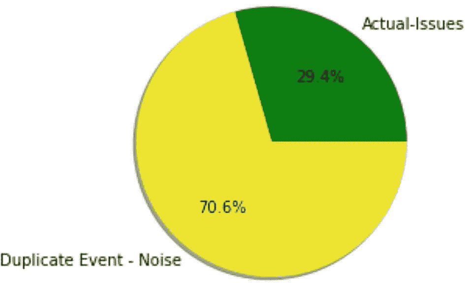

一个显示百分比值的饼图。实际事件：29.4。重复事件噪音：70.6。

**图 6-8** 去重功能噪音消除

让我们观察一下数据中哪些 CI 是最大的噪音制造者，如图 6-6 所示。

```
df_dedup = df_dedup.sort_values(by="Count", ascending=False)
df_dedup[:10].plot(kind="bar", by="Count", x="Host")
plt.title("去重次数最多的前 10 个主机", y=1.02);
```

图 6-9 显示了在环境中产生最多事件的前 10 个 CI，这些问题管理团队和容量管理团队需要对其进行分析。

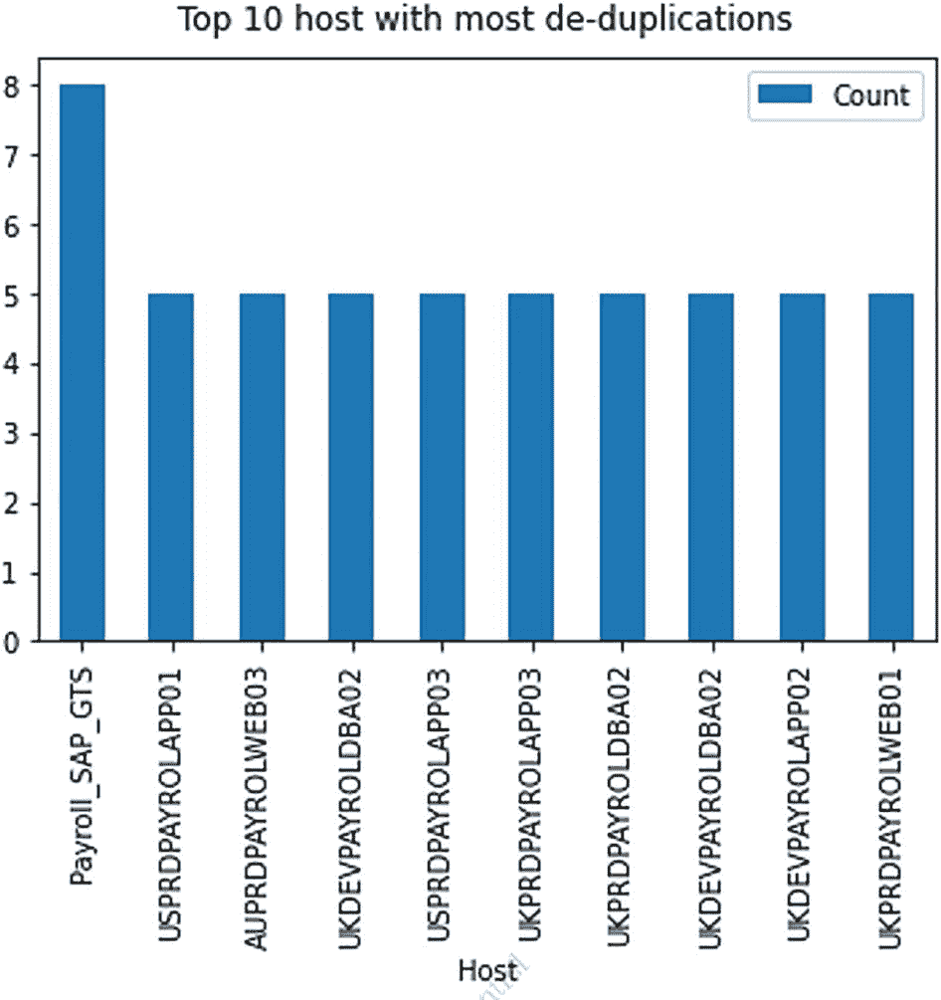

一个数量与主机的柱状图，主机分别为：Payroll_SAP_GTS、USPRDPAYROLAPP01、AUPRDPAYROLWEB03、UKDEVPAYROLDBA02、USPRDPAYROLAPP03、UKPRDPAYROLAPP03、UKPRDPAYROLDBA02、UKDEVPAYROLDBA02、UKDEVPAYROLAPP02 和 UKPRDPAYROLWEB01。横轴上的值分别为：8、5、5、5、5、5、5、5、5 和 5。

**图 6-9** 前 10 个噪音最大的主机

至此，我们完成了 AIOps 中的第一个用例：去重。

## 总结

在本章中，我们介绍了如何使用 Anaconda 设置环境以运行用例。我们介绍了第一个用例，即去重。这个用例没有使用任何机器学习，而是依赖于基于规则的关联来对事件进行去重。在下一章中，我们将介绍 AIOps 中的另一个重要用例：自动基线化。

