# 7. AIOps 用例：自动基线化

我们将继续讨论 AIOps 的具体用例，在本章中，我们将解释并实现自动基线化，这是 AIOps 中最重要且最常用的功能之一。


## 自动化基线化概述

在传统监控工具中，基线是静态且基于规则的，并设定在预定水平。例如，CPU 利用率基线可设为 95%。当服务器 CPU 利用率超过此阈值时，便会触发事件。然而，这种方法面临的挑战在于基线或阈值不能是静态的。设想一个场景：某个应用程序在本地时间凌晨 2 点运行一个 CPU 密集型数据处理任务，导致 CPU 利用率达到 99%，直到任务在凌晨 2:30 结束。这是该应用程序的常规行为，但由于静态基线阈值，仍会生成一个事件。但此警报无需任何干预，因为一旦任务完成且 CPU 利用率恢复正常，它会自动关闭。由于这种静态阈值基线化，运维中会产生许多此类误报事件。

自动化基线化在此类场景中大有裨益，因为它考虑了系统的动态行为。它通过分析历史性能数据来检测真正需要关注的性能问题，并通过调整基线阈值来消除噪音。在上述场景中，系统会自动提高阈值，并且在凌晨 2:30 之前不会生成事件。然而，如果同一台机器在上午 9 点出现 CPU 峰值，则会生成一个事件。

需要注意的是，在微服务架构中，动态基线阈值的工作方式会略有不同，因为底层基础设施会根据利用率或负载的增加而自动扩展。在进行动态基线化时，需要考虑应用程序架构和基础设施利用率的这些方面。

运维中的噪音会导致以下低效问题：

-   增加运维需要管理的事件数量，进而增加运维团队的时间和精力。
-   用误报事件充斥运维控制台，导致遗漏重要的、可操作的有效事件。
-   导致自动化诊断和修复失败。由于事件本身是虚假的，自动化解决方案会被不必要地触发。

自动化基线化可以减少噪音及相关低效问题。自动化基线化可以通过利用监督式机器学习技术来实现，该技术从历史数据中学习，并根据数据的日、周、月、年季节性规律预测动态阈值。从 AIOps 的角度来看，有三种核心算法是实现自动化基线化的关键。本章将从回归算法开始，探讨这些方法。

## 回归

这类算法用于确定多个变量之间的关系，并预测目标变量的值。例如，基于对营销支出的历史分析，预测下个月的销售收入。线性回归主要属于统计学领域，但被机器学习广泛用于预测建模，并在多个领域有广泛应用，例如预测股票价格、产品的销售价格比、房价等。回归算法有多种变体，但线性回归算法是机器学习中最常用的回归算法之一。图 7-1 列出了一些重要的线性回归算法，我们将在下一节讨论线性回归。

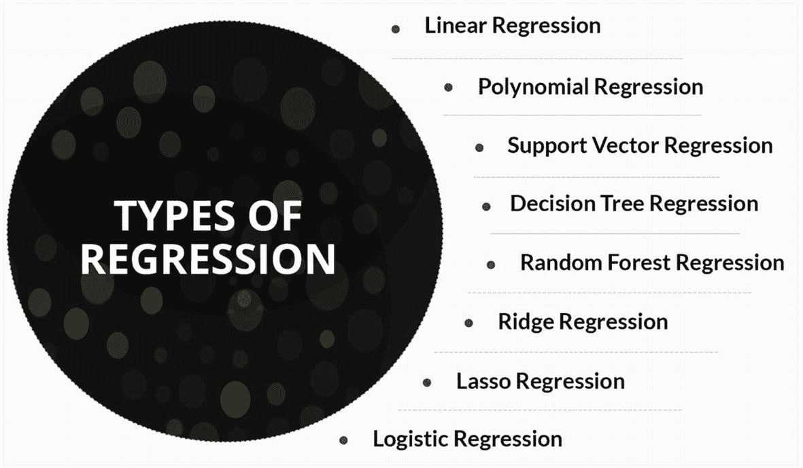

一个圆形被标记为回归类型。右侧给出的回归类型如下：线性回归、多项式回归、支持向量回归、决策树回归、随机森林回归、岭回归、套索回归和逻辑回归。

图 7-1

回归算法

### 线性回归

该算法适用于数据集中的输入和输出变量呈现线性关系，且输出变量为连续值（例如 CPU 的百分比利用率）的情况。

在线性回归中，从数据集中选取的输入变量（称为*自变量*或*特征*）用于预测输出变量（称为*因变量*或*目标值*）的值。从数学上讲，线性回归模型通过一条最佳拟合直线（称为*回归线*）建立因变量（`Y`）与一个或多个自变量（`Xi`）之间的关系，并由方程 `Y = a + bXi + e` 表示，其中 `a` 是截距，`b` 是直线的斜率，`e` 是预测值与实际值之间的误差。当存在多个自变量时，称为*多元线性回归*。

让我们首先理解只有一个自变量的简单线性回归。

在图 7-2 的图表中，有一组呈现线性关系的实际数据点，一条假想的直线穿过这些数据点的中间位置。

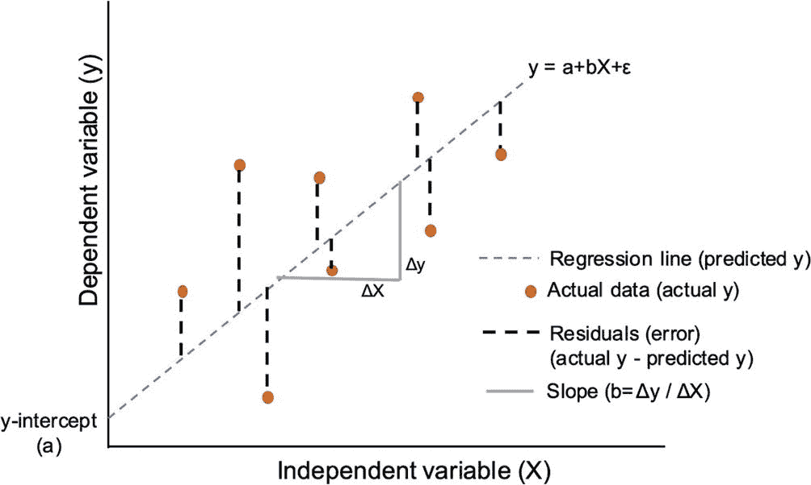

因变量 `y` 与自变量 `X` 的关系图。八条垂直线，顶端带点的回归线表示实际数据，连接在 `y` 截距 `a` 与 `y` 等于 `a` 加 `bX` 加 epsilon 之间的倾斜线的顶部和底部。两条水平线和垂直线，delta `X` 和 delta `y` 与回归线构成一个三角形。

图 7-2

简单线性回归

这条假想的直线就是回归线，它由预测的数据点组成。每个实际数据点与这条直线之间的距离称为*误差*。可以画出多条穿过这些数据点的直线，因此算法通过计算所有点的距离来找到使误差最小化的最佳直线。无论哪条直线产生的误差最小，它就成为回归线并提供最佳预测。从 AIOps 的角度来看，线性回归提供了相关性预测能力，但它并不显示因果关系。

现在让我们了解如何实现线性回归，以根据服务器的内存利用率（MB）和 CPU 利用率（百分比）来预测数据库响应时间（秒）。这里我们有两个自变量，即 CPU 和内存，因此我们将使用多元线性回归模型，根据 CPU 和内存的具体利用率值来预测数据库响应时间。

你可以从 [`https://github.com/dryice-devops/AIOps/blob/main/Ch-7_AutomatedBaselinig-Regression.ipynb`](https://github.com/dryice-devops/AIOps/blob/main/Ch-7_AutomatedBaselinig-Regression.ipynb) 下载代码。

让我们首先从文件 [`https://github.com/dryice-devops/AIOps/blob/main/data.xlsx`](https://github.com/dryice-devops/AIOps/blob/main/data.xlsx) 中导出参数 CPU 利用率、内存利用率和数据库响应时间的数据，该文件如表 7-1 所示。

表 7-1

CPU 和内存利用率与数据库响应时间的映射关系

| -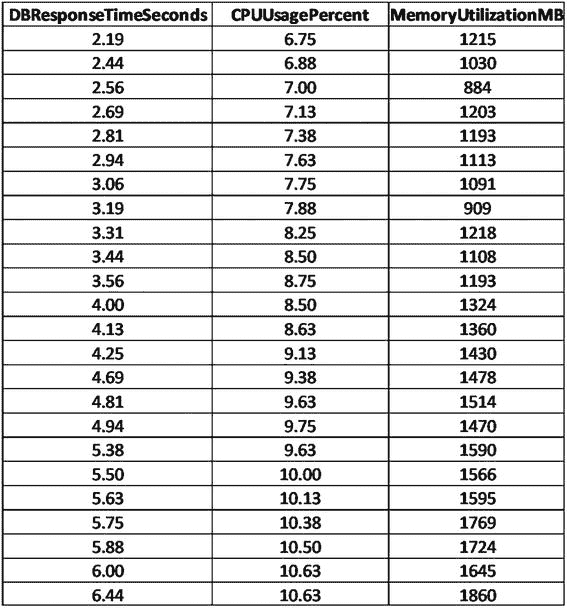一个 CPU 和内存利用率映射表，包含三列，标题分别为数据库响应时间、CPU 使用率和内存利用率（MB）。 |

除了 `Pandas` 和 `Matplotlib`，我们还将使用下面列出的其他 Python 库：

-   `NumPy`：这是 Python 开发中最广泛使用的库，用于执行矩阵、线性代数和傅里叶变换等数学运算。
-   `Seaborn`：这是另一个基于 `Matplotlib` 库的数据可视化库，主要用于生成信息丰富的统计图形。


*   `Sklearn`：这是机器学习相关开发中最重要且广泛使用的库之一，因为它包含了用于建模和预测的各种工具。

让我们从导入所需的库和函数开始编写代码，如下所示：

```python
import pandas as pd
import matplotlib.pyplot as plt
import numpy as np
import seaborn as sns
from sklearn.model_selection import train_test_split
from sklearn.linear_model import LinearRegression
from sklearn.metrics import mean_absolute_error
from sklearn.metrics import r2_score
from sklearn.metrics import mean_squared_error
percentmatplotlib inline
import matplotlib as mpl
import matplotlib.pyplot as plt
```

现在，从输入文件中读取性能数据，并观察数据集中的前五个值。

```python
df = pd.read_excel("data.xlsx")
df.head()
```

图 7-3 展示了 CPU 和内存利用率的样本值以及相应的数据库响应时间。

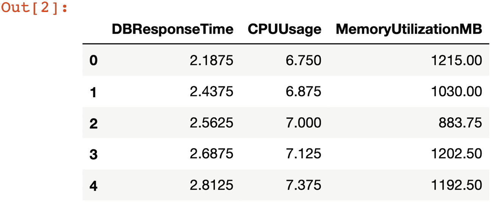

一个用于 CPU 和内存样本值的表格包含三列，列标题分别为 DB 响应时间、CPU 使用率和内存利用率 MB。

**图 7-3** CPU 和内存利用率与 DB 响应时间的映射

在数据集中，我们将参数 `DBResponseTime`、`CPUUsage` 和 `MemoryUtilizationMB` 的利用率值作为三个不同的列。让我们找出数据集中用于分析和预测的数据点数量。

```python
df.shape
```

如图 7-4 所示，数据集中共有 24 行，为三个自变量和因变量分别提供了值。


`(24, 3)`

**图 7-4** 数据集中的数据点数量

线性回归算法适用性的一个重要条件是输入和输出数据点之间必须存在线性关系。让我们首先通过绘制 DB 响应时间与 CPU 使用率之间的关系图来验证数据是否满足此条件。

```python
sns.jointplot(x=df['DBResponseTime'], y=df['CPUUsage'], \
data=df, kind='reg')
```

根据图 7-5 中的图表，CPU 利用率与 DB 响应时间之间存在线性关系。

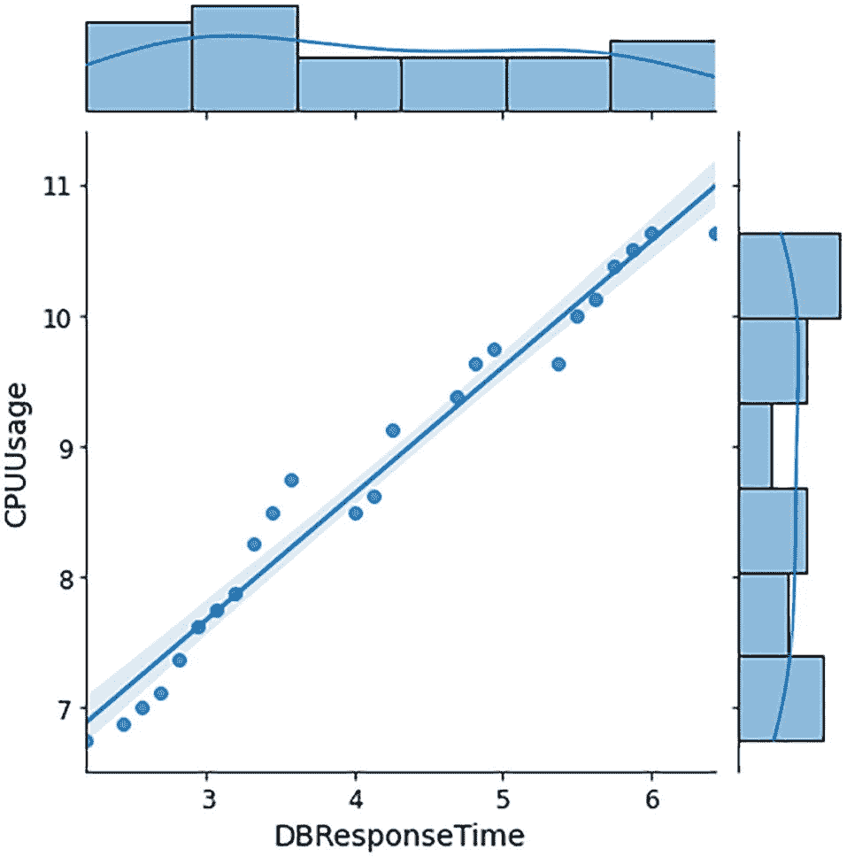

一张 CPU 使用率与 DB 响应时间的对比图，图中绘制了一条带有散点的直线。散点图呈现出紧密的分布模式，在直线两侧大约 (2.2, 6.8) 到 (6.5, 11) 的区间内呈上升趋势。顶部和右侧窗口中分别绘制了带有曲线的垂直和水平条形图。

**图 7-5** CPU 利用率对 DB 响应时间的影响

类似地，让我们验证 DB 响应时间与内存使用率之间的线性关系。

```python
sns.jointplot(x=df['DBResponseTime'], y=df['MemoryUtilizationMB'], \
data=df, kind='reg')
```

图 7-6 也显示 DB 响应时间与内存使用率之间存在线性关系，这满足了应用线性回归算法的条件。

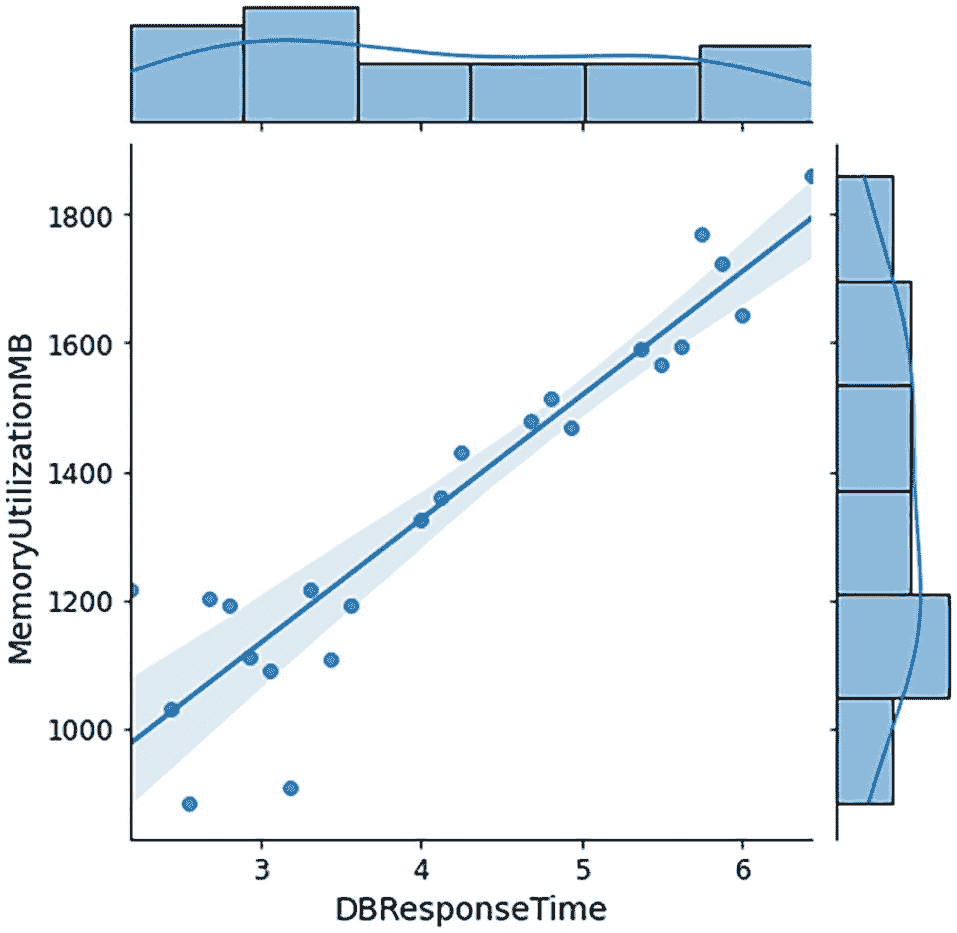

一张内存利用率 MB 与 DB 响应时间的对比图，图中绘制了一条带有散点的直线。散点图呈现出紧密的分布模式，在直线两侧大约 (2.2, 980) 到 (6.5, 1800) 的区间内呈上升趋势。顶部和右侧窗口中分别绘制了带有曲线的垂直和水平条形图。

**图 7-6** 内存利用率对 DB 响应时间的影响

接下来，你需要将自变量（CPU 和内存使用率）的数据点提取到 `X` 中，将因变量（DB 响应时间）的数据点提取到 `Y` 中。

```python
X = df[['MemoryUtilizationMB','CPUUsage']]
Y = df['DBResponseTime']
```

正如在监督学习中讨论的那样，整个带标签的数据集需要被分割成用于学习目的的训练数据和用于验证模型学习准确性或质量的测试数据。现在，需要将这些数据分割成测试数据和训练数据。在我们的示例中，我们考虑使用 80% 比 20% 的比例来分割测试数据和训练数据。

```python
x_train, x_test, y_train, y_test = train_test_split(X, Y, \
test_size = 0.2, random_state = 42)
```

在此阶段，我们将从 `Sklearn` 库中调用 `LinearRegression`，并将训练数据应用（称为 *fit 方法*）到这个线性回归模型中，以创建方程并从中学习。

```python
LR = LinearRegression()
#### fitting the training data
LR.fit(x_train,y_train)
```

现在可以使用这个模型来预测测试数据上的值。

```python
y_prediction =  LR.predict(x_test)
y_prediction
```

基于测试数据中的 CPU 和内存利用率值，我们的模型预测了 DB 响应时间值，如图 7-7 的输出所示。

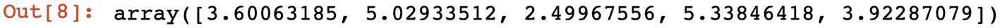

`array([3.60063185, 5.02933512, 2.49967556, 5.33846418, 3.92287079])`

**图 7-7** 测试数据集上的预测数据库响应时间

让我们将机器学习模型的预测值与测试数据集上的实际观测值进行比较。

```python
indices = np.arange(len(y_prediction))
width = 0.20
#### Plotting
plt.bar(indices, y_prediction, width=width)
#### Offsetting by width to shift the bars to the right
plt.bar(indices + width, y_test, width=width)
plt.xticks(ticks=indices)
plt.ylabel("DB Response Time")
plt.xlabel("Test Dataset ")
plt.title("Predicted vs. Actual")
valuesType=['Predicted','Actual']
plt.legend(valuesType,loc=2)
plt.show()
```

如图 7-8 的输出所示，预测值非常接近实际观测值。这表明模型表现良好。

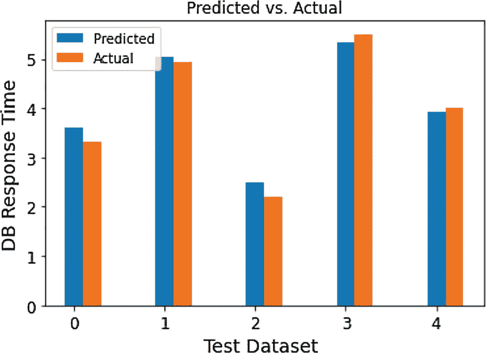

一张预测值与实际值的双柱状图，其中垂直轴代表 DB 响应时间，水平轴代表测试数据集。测试数据集上的值如下：预测值：3.6、5、2.3、5.2 和 3.9。实际值：3.3、4.9、2、5.4 和 4。所有值均为近似值。

**图 7-8** 测试数据上 DB 响应时间预测的准确性分析

让我们通过计算模型的 R2 分数来评估其性能。

```python
score=r2_score(y_test,y_prediction)
print("r2 score is ", score)
print('Root Mean Squared Error is =',np.sqrt(mean_squared_error(y_test,\
y_prediction)))
r2 score is  0.9679128701220477
Root Mean Squared Error is = 0.2102141626503609
```

根据输出，`r2` 分数值为 0.9679，这意味着在给定的 CPU 和内存利用率场景下，模型预测数据库响应时间的准确率约为 97%，这相当不错。根据复杂性和需求，可以进一步扩展此模型以包含其他自变量，例如事务数量、用户连接数、可用磁盘空间等，这使得该模型可用于生产环境，以执行容量规划、升级或迁移相关任务，从而改善数据库响应时间，最终提升应用程序性能和用户体验。


线性回归模型存在一些局限性，它通过计算因变量与一个或多个自变量之间的相关性来进行预测。第一个主要挑战是，变量之间的相关性与任何与之相关的时间序列是相互独立的。线性回归无法在给定自变量值的情况下，预测因变量在“特定时间点”的值。其次，预测完全基于自变量，而没有考虑近期已经预测出的因变量值。为了克服这些挑战，你可以使用时间序列模型，我们将在下一节中讨论。

**注意**

从技术上讲，时间序列在线性回归中也可以被视为一个自变量，但这是不正确的。相反，在这种情况下，应该使用时间序列模型而不是线性回归模型。

## 时间序列模型

为了对基于时间序列的场景进行建模，并预测数据在指定时间间隔内未来的取值，你可以利用时间序列建模。让我们了解时间序列建模中需要的一些重要术语。

### 时间序列数据

任何按固定时间间隔收集的数据都称为*时间序列数据*。数据收集的频率可以是每小时、每天、每周等，只要它是按固定间隔进行的。以下是时间序列数据的常见示例：

*   *股票价格数据*：股票的最高价和最低价通常按日记录。然后，在月度或年度时间框架内进一步分析这些数据，以做出业务决策。
*   *呼叫中心通话量*：每小时的通话量会被记录。然后，从资源配置的角度，在月度或年度时间框架内分析这些数据，以确定高峰时段的负载。
*   *销售数据*：销售数据对任何企业都至关重要，通常按月记录销售数据，以预测未来的销售额或组织的盈利能力。
*   *网站点击量*：网站点击量通常每五到十分钟记录一次，以确定应用程序的负载、检测任何潜在的安全威胁，或扩展基础设施以满足业务需求。

每个时间序列数据都会有一个日期或时间列，以及一个或多个数据列。如果只有一个数据列，则称为*单变量时间序列*；如果有多个数据列，则称为*多变量时间序列*。图 7-9 是一个单变量时间序列的示例，展示了服务器的每日平均 CPU 利用率。

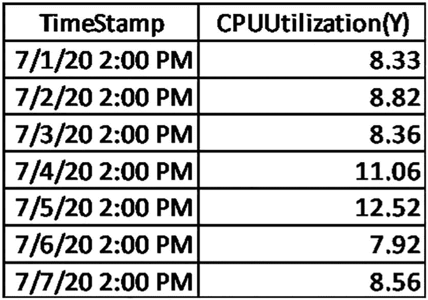

一个 CPU 利用率时间序列表，包含两列，标题分别为时间戳和 CPU 利用率 Y。

**图 7-9**

CPU 利用率时间序列

为了进行分析，可能需要通过添加一些额外的辅助列，将单变量时间序列转换为多变量时间序列。借助`TimeStamp`，我们添加了另一列`Day of the week`，从图 7-10 中我们可以观察到，与工作日相比，周末的 CPU 利用率出现了异常峰值。

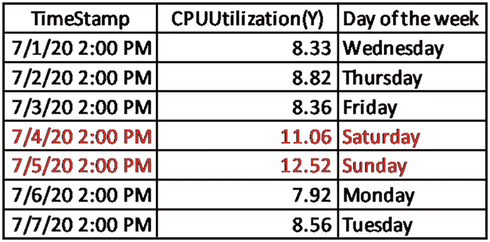

一个 CPU 利用率时间序列分析表，包含三列，标题分别为时间戳、CPU 利用率和星期几。第四行和第五行被高亮显示。

**图 7-10**

CPU 利用率的时间序列分析

### 平稳时间序列

时间序列最重要的统计特性之一是*平稳性*，即时间序列的均值和方差不随时间变化，如图 7-11 所示。简单来说，一个平稳时间序列在不同时间戳上可以有不同的值，但生成这些值的底层逻辑或方法保持不变。

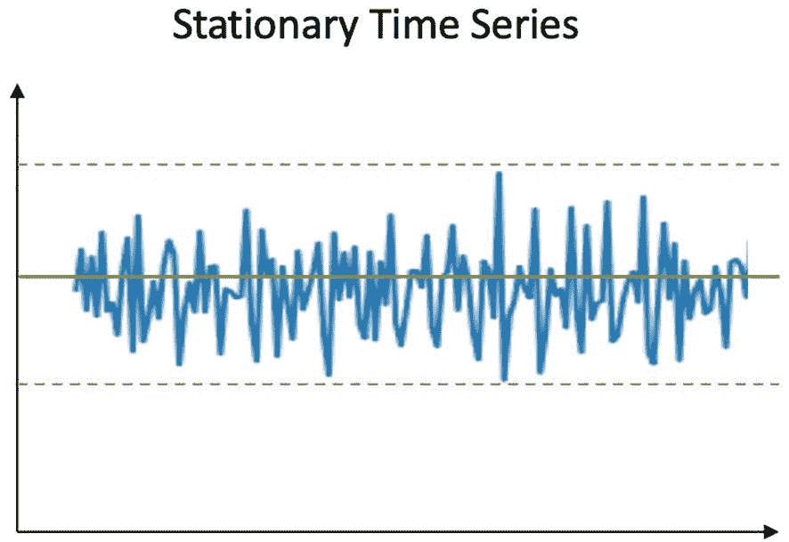

一个平稳时间序列的图表，显示一条高频波形图，位于两条平行虚线之间的水平线上。

**图 7-11**

平稳时间序列示例

### 滞后变量

滞后变量是随时间推移而滞后的因变量。`Lag-1`（`Y[t-1]`）表示因变量`Y[t]`在前一个时间单位的值，`Lag 2`（`Y[t-2]`）表示`Y[t]`在前两个时间单位的值，依此类推。

考虑前面关于特定时间戳 CPU 利用率的时间序列示例。在此示例中，`Lag-1`（`Y[t-1]`）在 2020 年 7 月 3 日下午 2:00 的值将是`Y[t]`在 2020 年 7 月 2 日下午 2:00 的值，即 8.82；而`Lag 2`（`Y[t-2]`）在 2020 年 7 月 3 日下午 2:00 的值将是`Y[t]`在 2020 年 7 月 1 日下午 2:00 的值，即 8.33，如图 7-12 所示。

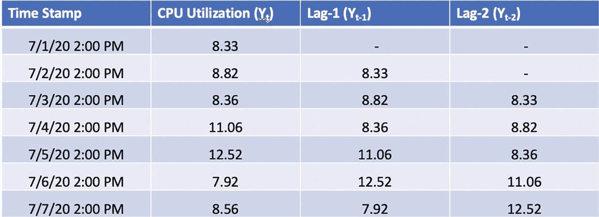

一个滞后变量表，包含四列，标题分别为时间戳、CPU 利用率 Y 下标 t、Lag 1 Y 下标 t-1 和 Lag 2 Y 下标 t-2。

**图 7-12**

滞后变量及其值

从数学上讲，如果`Y[t]`与其滞后值`Y[t-1]`、`Y[t-2]`等之间存在关系或相关性，那么可以创建一个模型来检测模式，并利用其滞后值预测同一序列的未来值。例如，假设 CPU 利用率在每个星期六都增加约 100%；那么可以考虑使用`Lag-7`（`Yt-7`）的值进行预测。

下一步是确定`Y[t]`与其滞后值之间关系的强度，以及有多少滞后值与`Y[t]`具有统计上显著的关系，以便我们可以在预测模型中使用它们。这就是`ACF`和`PACF`图发挥作用的地方，我们接下来将讨论这些内容。


### ACF 与 PACF

`ACF` 和 `PACF` 都是研究人员用来理解单个时间序列时间动态的统计方法，这基本上意味着检测随时间变化的关联性，通常称为*自相关*。对 `ACF` 和 `PACF` 的详细讨论超出了本书的范围，因此我们将把讨论限制在 `ACF` 和 `PACF` 的基础知识上，以了解如何在 AIOps 模型开发中使用它们。

`ACF` 是一个统计术语，代表自相关函数，用于衡量时间序列值 `Y[t]` 与其自身滞后值 `Y[t-1]`、`Y[t-2]`、`Y[t-3]` 等的相关性。这种不同滞后的相关性可以使用 `ACF` 图在 1 到 -1 的尺度上进行可视化，其中 1 表示完全正相关，-1 表示完全负相关。

如图 7-13 所示，y 轴代表相关值，x 轴代表滞后阶数。序列的第一个值总是与自身 100% 相关，这就是为什么在 `ACF` 图中，Lag 0 的相关值达到 1。`ACF` 图有助于检测相关数据中的模式。

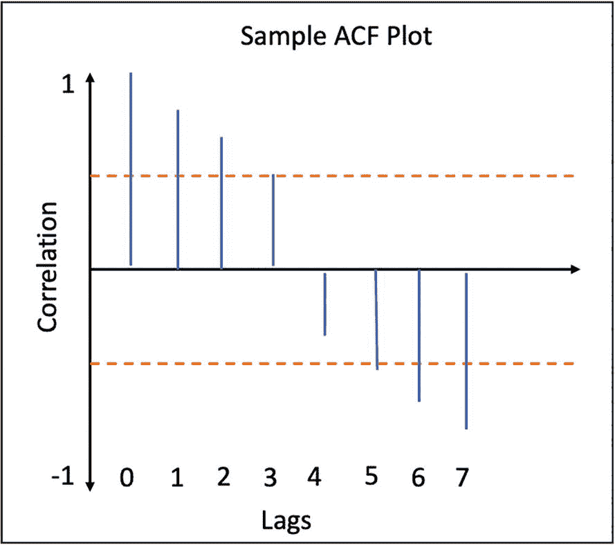

一个 `ACF` 图，其中 y 轴代表相关值，x 轴代表从 0 到 7 的滞后阶数。x 轴两侧的虚线表示显著性。序列的第一个值从 1 开始，然后逐渐减小，数值大约为 8、7、5、-4、-5、-7 和 -8。

**图 7-13** 示例 `ACF` 图

在 `ACF` 图中，两侧各有一条红线，称为显著性线，它创建了一个范围或带，称为*误差带*。跨越这条线的滞后阶数与变量 `Y` 具有统计上显著的关系。在示例 `ACF` 图中，有三个滞后阶数跨越了这条线，因此直到 Lag 3，都存在统计上显著的关系，而该带内的任何值都不具有统计显著性。

`PACF` 是另一个统计术语，代表偏自相关函数，它与 `ACF` 图类似，不同之处在于它考虑了在消除所有中间滞后效应后，特定时间点上变量与滞后值之间关系的强度。

例如，在图 7-14 的示例 `ACF` 图中，可以看到直到三个滞后阶数都存在显著相关性，但 `PACF` 图则说明了在消除 `Y[t-1]` 和 `Y[t-2]` 的任何影响后，`Y[t-3]` 单独与 `Y[t]` 的相关性强度。`PACF` 可以被视为 `ACF` 的一种过滤值。

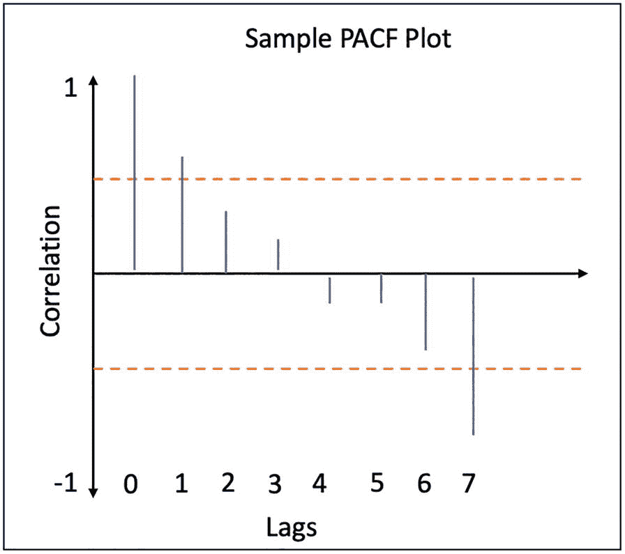

`PACF` 图，其中 y 轴代表相关值，x 轴代表从 0 到 7 的滞后阶数。x 轴两侧的虚线表示显著性。序列的第一个值从 1 开始，然后逐渐减小，数值大约为 6、3、2、-2、-2、-4.5 和 -8。

**图 7-14** 示例 `PACF` 图

现在，我们已经准备好实现两种最常用的时间序列模型 `ARIMA` 和 `SARIMA`，通过预测参数的适当监控阈值来进行降噪。这是 AIOps 实现中最常见的用例之一。

### ARIMA

`ARIMA` 是基础性的时间序列预测技术之一；它很流行，并且已被广泛使用了相当长一段时间。这个概念最早由 George Box 和 Gwilym Jenkins 在 1976 年出版的《时间序列分析：预测与控制》一书中提出。他们定义了一种称为 Box-Jenkins 分析的系统方法，用于识别、拟合和使用自回归（AR）技术与移动平均（MA）技术相结合的集成（I）方法，从而形成 `ARIMA` 时间序列模型。

`ARIMA` 利用时间序列中包含的模式和信息来预测其未来值。那么，`ARIMA` 是否可能对任何时间序列进行预测呢？例如，使用 `ARIMA` 根据其历史价格预测您最喜爱的股票价格如何？从技术上讲，可以进行预测，但可能根本不准确。例如，股票价格受多种外部因素控制，如公司的季度业绩、政府法规、天气状况、竞争对手的价格等。如果不考虑所有这些因素，`ARIMA` 无法提供有意义的预测。重要的是要注意，`ARIMA` 应仅用于表现出以下属性的时间序列：

- 它应该是平稳的，或非季节性的。
- 过去的值应具有足够的模式（不仅仅是随机白噪声）和信息来预测其未来值。
- 它应该具有中等到较长的长度，至少包含 50 个观测值。

### 模型开发

`ARIMA` 模型包含三个组成部分。

#### 差分（d）

如前所述，`ARIMA` 模型需要序列是平稳的，但面临的挑战如下：

- 如何使序列达到平稳性
- 如何验证序列是否变得平稳

有两种方法可以将非平稳序列变为平稳序列。

- 执行适当的变换，例如对数变换或平方根变换，将非平稳序列变为平稳序列，这种方法相对复杂。
- 一种更可靠且广泛使用的方法是对序列进行差分以使其变为平稳。在这种方法中，计算序列中连续值之间的差值，然后验证结果序列是否平稳。

用于确定时间序列是否平稳的最常用统计检验之一是增广迪基-富勒检验（`ADF` 检验），它是一种单位根检验，用于确定时间序列受趋势影响的强度。简单来说，`ADF` 检验验证一个原假设（`H0`），该假设声称时间序列具有某种时间依赖结构，因此是非平稳的。如果这个原假设被拒绝，则意味着时间序列是平稳的。`ADF` 检验计算 p 值，如果 p 值小于 0.05（5%），则原假设被拒绝。感兴趣的读者可以在线探索单位根检验和 `ADF` 检验的内部工作原理和数学原理。

我们需要持续进行差分，并通过 `ADF` 检验验证结果，直到我们得到一个具有定义均值的近似平稳序列。为使时间序列平稳而执行的差分次数由模型变量 `d` 表示。

需要注意的是，序列不应被过度差分，否则虽然我们得到了一个平稳序列，但模型参数会受到影响，预测的准确性也会受到影响。检查过度差分的一种方法是，自相关的 Lag 1 不应变得过于负值。


### 自回归或 AR(p)

该组件被称为*自回归*，表明因变量 `Y[t]` 可以计算为其自身滞后项 `Y[t-1]`、`Y[t-2]` 等的函数。

`Y[t] = α + β₁Y[t-1] + β₂Y[t-2] + ... + βₚY[t-p]`

其中：

- `α` 是常数项（截距）。
- `β` 是滞后项的系数，下标表示其位置。
- `ε` 是误差项或白噪声。

我们之前讨论过，PACF 图显示了在排除中间滞后项的影响后，序列与其滞后项之间的偏自相关。我们可以使用 PACF 图来确定最后一个滞后项 `p`，该滞后项截断了显著线，可以被视为 AR 的一个良好估计值。该值由模型变量 `p` 表示，作为 AR 模型的阶数。

基于图 7-15 中的样本 PACF 图，我们可以观察到滞后 1 似乎是穿过显著线的最后一个滞后项。因此，我们可以将 `p` 设为 1，并将其表示为 `AR(1)`。

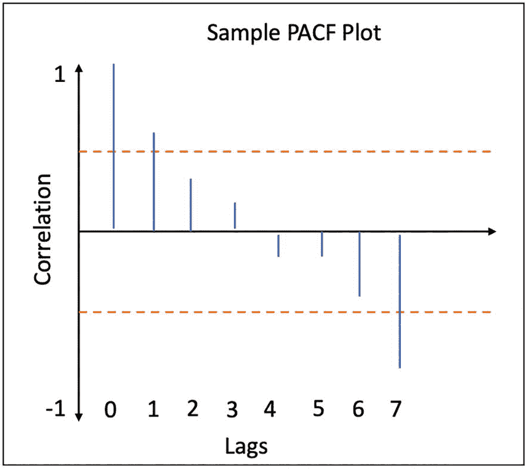

该 PACF 图中，y 轴代表相关值，x 轴代表从 0 到 7 的滞后项。x 轴两侧的虚线表示显著性。序列的第一个值从 1 开始，随后逐渐减小，数值大约为 6、4、3.5、-2、-3、-4 和 -8。

**图 7-15** – PACF 图

### 移动平均或 MA(q)

该组件被称为*移动平均*，表明因变量 `Y[t]` 可以计算为先前滞后项中预测误差的加权平均值的函数。

`Y[t] = α + ε[t] + φ₁ε[t-1] + φ₂ε[t-2] + ... + φₚε[t-q]`

- `α` 通常是序列的均值。
- `ε` 是各自滞后项处自回归模型的误差。

MA 可以检测时间序列数据中的趋势和模式。你可以使用 ACF 图来确定模型变量 `q` 的值，该值表示需要多少个移动平均来消除平稳序列中的任何自相关。从图 7-16 的 ACF 图中，我们可以观察到在滞后 2 和滞后 6 之后有一个截断。因此，我们可以尝试使用 `q = 2`、`MA(2)` 或 `q = 6`、`MA(6)` 的 ACF。

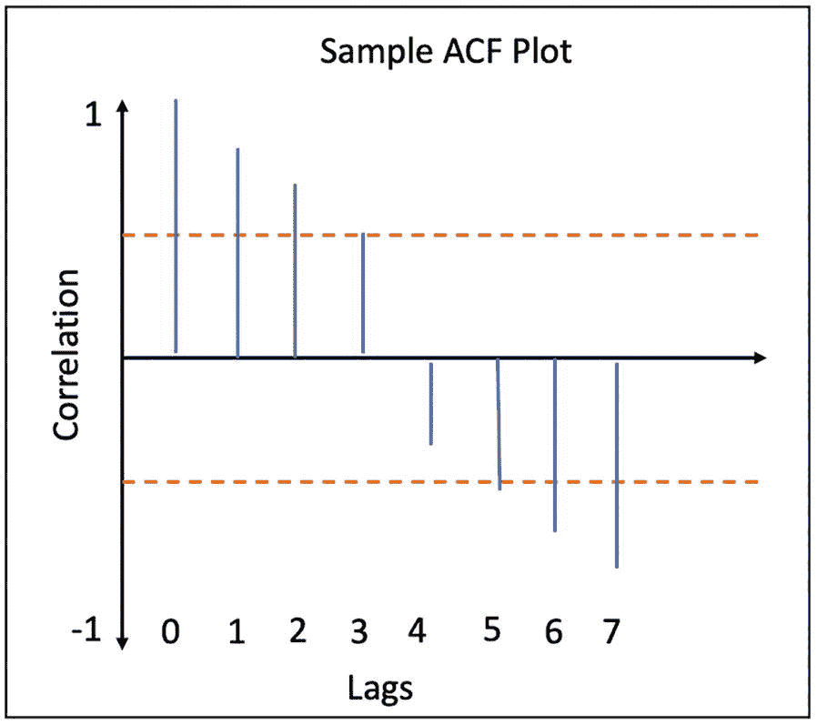

该 ACF 图中，y 轴代表相关值，x 轴代表从 0 到 7 的滞后项。x 轴两侧的虚线表示显著性。序列的第一个值从 1 开始，随后逐渐减小，数值大约为 8、7、5、-4、-5、-7 和 -8。

**图 7-16** – ACF 图

AR 和 MA 方程都需要进行差分（I 或 d）以创建 ARIMA 模型，该模型表示为 `ARIMA(p, d, q)`。

ARIMA 是其他各种自回归时间序列模型的基础，具体如下：

- **SARIMA**：如果在固定的时间间隔内存在重复模式，则称之为*季节性*，此时使用 SARIMA 模型，其中 S 代表季节性。我们将在下一节中进一步探讨。
- **ARIMAX**：如果序列依赖于外部因素，则使用 ARIMAX 模型，其中 X 代表外部因素。
- **SARIMAX**：如果除了季节性之外，还存在外部因素的强烈影响，则使用 SARIMAX 模型。

ARIMA 的一个主要局限性是无法考虑时间序列数据中的季节性，而这在现实场景中很常见，例如每年感恩节和圣诞节假期期间销售额异常高、每月第一周支出较高、周末购物中心人流量大等。这种季节性会在另一种算法（称为 SARIMA，它是 ARIMA 模型的一个变体）中得到考虑。

### SARIMA

在固定时间间隔内出现的周期性模式被称为*季节性*，应在预测模型中加以考虑，以提高预测的准确性。这就是 ARIMA 模型被修改以开发出 SARIMA 的方式，该模型考虑了时间序列数据中的季节性，并支持带有季节性成分的单变量时间序列数据。

除了 ARIMA 变量之外，SARIMA 还需要四个新组件：

- **p**：时间序列的自回归（AR）阶数。
- **d**：时间序列的差分（I）阶数。
- **q**：时间序列的移动平均（MA）阶数。
- **m（或滞后）**：季节性因子，单个季节性周期要考虑的时间步数。例如，如果是年度季节性，则 `m = 12`；如果是季度，则 `m = 4`；如果是周度，则 `m = 52`。
- **P**：季节性自回归阶数。
- **D**：季节性差分阶数。
- **Q**：季节性移动平均阶数。

SARIMA 模型的最终表示法指定为 `SARIMA(p, d, q)(P, D, Q)m`。


### ARIMA 与 SARIMA 的实现

接下来，我们将在 CPU 利用率数据上对 ARIMA 和 SARIMA 模型进行示例实现，以预测其阈值。

首先，导入所需的 Python 库。

```python
#### 数据操作库
import pandas as pd
import numpy as np
#### 数据可视化库
import matplotlib.pyplot as plt
#### 时间序列模型库
from statsmodels.tsa.stattools import adfuller
from statsmodels.graphics.tsaplots import plot_acf, plot_pacf
from statsmodels.tsa.arima.model import ARIMA
from statsmodels.tsa.stattools import acf
from statsmodels.tsa.seasonal import seasonal_decompose
#### 机器学习库
from sklearn.metrics import mean_squared_log_error
#### 时间追踪库
from datetime import datetime
```

从 CSV 文件中读取 CPU 利用率数据到 Pandas 数据框，并检查导入数据的数据类型、列名和数值数量等信息。

```python
cpu_util_raw_data= pd.read_csv("cpu_utilization-data.csv")
cpu_util_raw_data.info()
```

如图 7-17 所示，共有两列：`date_time` 和 `cpu_utilization`，总计 396 个数据点（第一行为表头）可供分析。

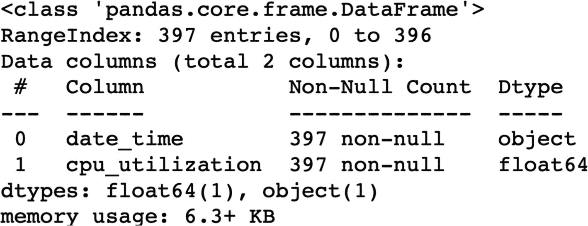

一个模型描述数据文件，表头为 `<class 'pandas.core.frame.DataFrame'>`，其中范围索引为 397 个条目（0 到 396），数据列包含两列标题：非空计数和数据类型。数据类型包括 `float64`（1 列）和 `object`（1 列），内存使用量为 6.3+ KB。

**图 7-17** 数据文件中的数据概览

将 `date_time` 列的数据类型设置为 `DateTime`，并将其设为索引以对数据框中的数据点进行排序，然后在时间尺度上绘制 CPU 利用率，如图 7-18 所示。

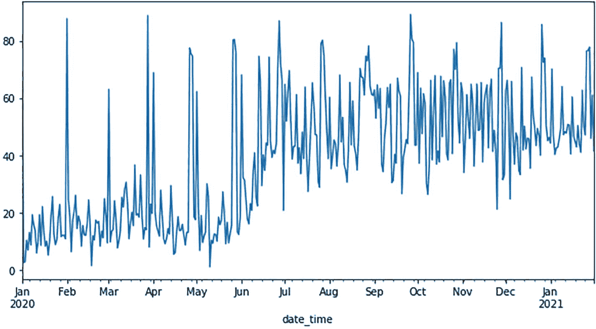

CPU 利用率实现图，其中纵轴标记为数据点，横轴标记为 `date_time`。一条高频波形从点 4 开始，大约在点 55 结束。该高频波形的最高点为 88，最低点为 0。

**图 7-18** 时间尺度上的 CPU 利用率

```python
total_records = cpu_util_raw_data.count()['cpu_utilization']
cpu_util_raw_data['date_time'] = pd.to_datetime(cpu_util_raw_data['date_time'])
cpu_util_raw_data.set_index('date_time',inplace=True)
cpu_util_raw_data = cpu_util_raw_data.sort_values(by="date_time")
fig = plt.figure(figsize =(10, 5))
cpu_util_raw_data['cpu_utilization'].plot()
```

使用箱线图检查数据中的异常值非常重要。异常值的存在会影响预测质量。如果数据中存在大量异常值，则需要根据领域需求对其进行处理或从数据集中移除。

```python
#全局变量
NOISE = False
MAPE = True
TEST_DATA_SIZE = 0.2 #百分比
SEASONAL = False
def getOutliers(data, col):
    Q3 = data[col].quantile(0.75)
    Q1 = data[col].quantile(0.25)
    IQR = Q3 - Q1
    lower_limit = Q1 - 1.5 * IQR
    upper_limit = Q3 + 1.5 * IQR
    return lower_limit, upper_limit
lower, upper = getOutliers(cpu_util_raw_data, 'cpu_utilization')
outliers_count = cpu_util_raw_data[(cpu_util_raw_data['cpu_utilization'] < lower) | (cpu_util_raw_data['cpu_utilization'] > upper)].count()['cpu_utilization']
outlier_percentage = ((outliers_count / total_records) * 100)
if outlier_percentage > 20:
    NOISE = True
print(f"数据中异常值百分比: {outlier_percentage}%")
#渲染箱线图
cpu_util_raw_data.boxplot('cpu_utilization', figsize=(10,10))
zero_values = cpu_util_raw_data[(cpu_util_raw_data['cpu_utilization']==0)].count()['cpu_utilization']
zero_values_percentage = ((zero_values / total_records) * 100)
if zero_values_percentage > 20:
    MAPE = False
print("数据中零值百分比: ", zero_values_percentage)
```

根据图 7-19，数据中既没有异常值也没有“零”值，因此我们继续使用给定的数据集。

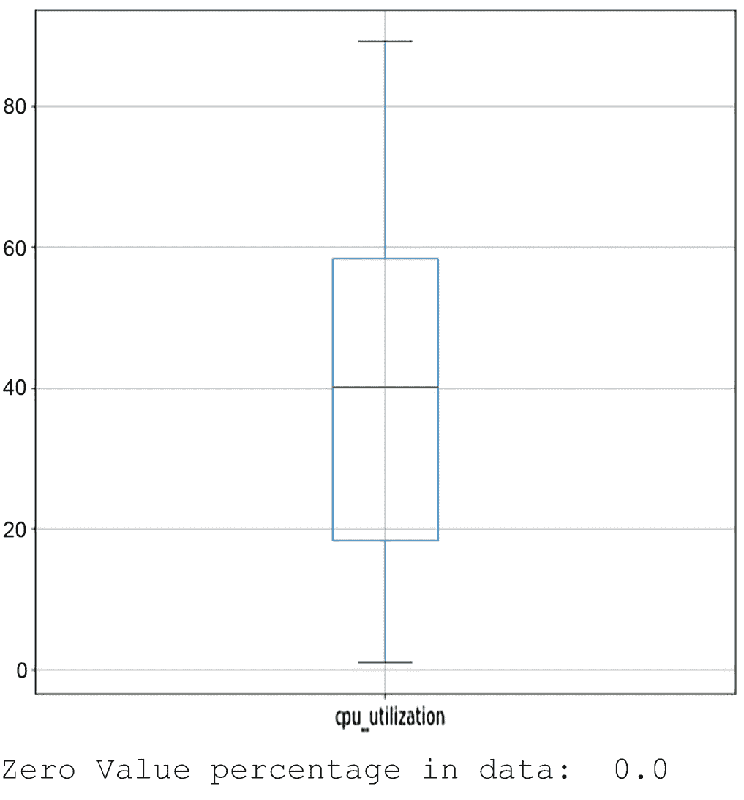

绘制箱线图用于外线分析。纵轴为数据点，横轴表示 CPU 利用率。四分位距位于点 19 到 59 之间，中位数为点 40。最小异常值位于点 1，最大异常值位于点 93。

**图 7-19** 异常值箱线图分析

接下来，使用 ADF 检验检查时间序列的平稳性。根据 ADF 检验，如果 p 值大于 0.05，则表明时间序列是非平稳的，需要使用 `diff()` 函数进行差分，并再次使用 ADF 检验检查平稳性。

```python
diff_count = 0
differencing_order = {
    1: lambda x: x['cpu_utilization'].diff(),
    2: lambda x: x['cpu_utilization'].diff().diff(),
    3: lambda x: x['cpu_utilization'].diff().diff().diff(),
    4: lambda x: x['cpu_utilization'].diff().diff().diff().diff(),
    5: lambda x: x['cpu_utilization'].diff().diff().diff().diff().diff()
}
while True:
    if diff_count == 0:
        adftestresult = adfuller(cpu_util_raw_data['cpu_utilization'].dropna())
    else:
        adftestresult = adfuller(differencing_orderdiff_count.dropna())
    print('#' * 60)
    print('ADF 统计量: %f' % adftestresult[0])
    print('p 值: %f' % adftestresult[1])
    print(f'ADF 检验结果: 时间序列{"非" if adftestresult[1] >= 0.05 else ""}平稳')
    print('#' * 60)
    if adftestresult[1] < 0.05 or diff_count >= len(differencing_order):
        break
    diff_count += 1
print("使数据平稳所需的差分阶数: ",diff_count)
```

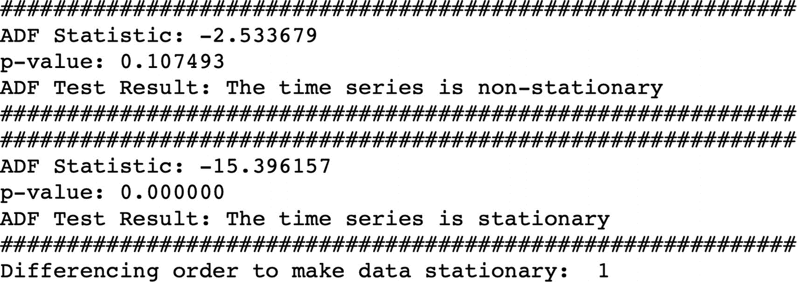

ADF 结果实现包含两个序列。序列 1：ADF 统计量：-2.5335679，p 值：0.107493，ADF 检验结果：时间序列非平稳。序列 2：ADF 统计量：-15.396157，p 值：0.000000，ADF 检验结果：时间序列平稳。下方备注：使数据平稳所需的差分阶数：1。

差分后时间序列的 ADF 结果显示 p 值为 0，这证实了数据序列现在是平稳的。可以通过在时间尺度图上绘制原始序列和差分序列来可视化这一点，如图 7-20 所示。

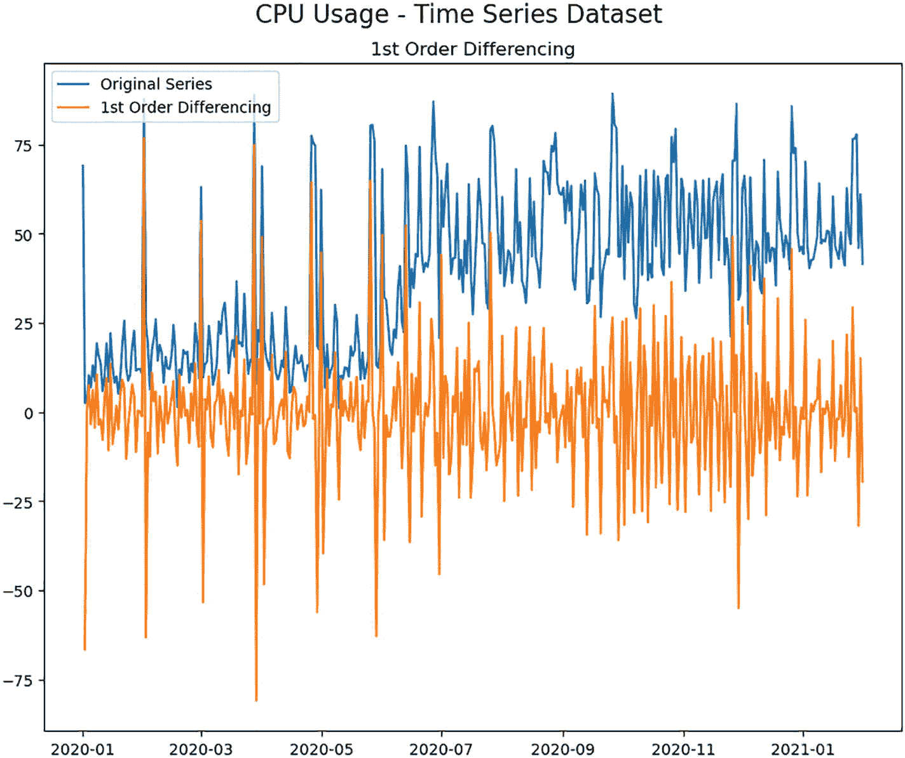

CPU 使用率时间序列数据集图，其中纵轴标记为数据点，横轴标记为 `date_time`。原始序列和 1 阶差分序列的两条高频波形分别从 2020 年 1 月的点 0 开始，并分别结束于 2021 年 1 月的点 50 和 2021 年 1 月的点 0。

**图 7-20** 时间序列平稳性检查

```python
fig, ax = plt.subplots(figsize=(10,8), dpi=100)
#### 差分
ax.plot(cpu_util_raw_data.cpu_utilization[:], label='原始序列')
ax.plot(cpu_util_raw_data.cpu_utilization.diff(1), label='1 阶差分')
ax.set_title('1 阶差分')
ax.legend(loc='upper left', fontsize=10)
plt.legend(loc='upper left', fontsize=10)
plt.suptitle('CPU 使用率 - 时间序列数据集', fontsize=16)
plt.show()
```

由于我们只进行了一次差分，因此可以将 ARIMA 的差分（d）分量设置为 `d=1`。

接下来，绘制 ACF 和 PACF 图，以获取 AR（p）和 MA（q）分量的值。

```python
plt.rcParams.update({'figure.figsize':(7, 4), 'figure.dpi':120})
plot_pacf(cpu_util_raw_data.cpu_utilization.diff().dropna());
plot_acf(cpu_util_raw_data.cpu_utilization.diff().dropna());
```

在图 7-21 的 PACF 图中，可以观察到直到滞后 6 都超过了显著性线，因此可以初步将 AR 分量 `p=6` 设置为建模参数。

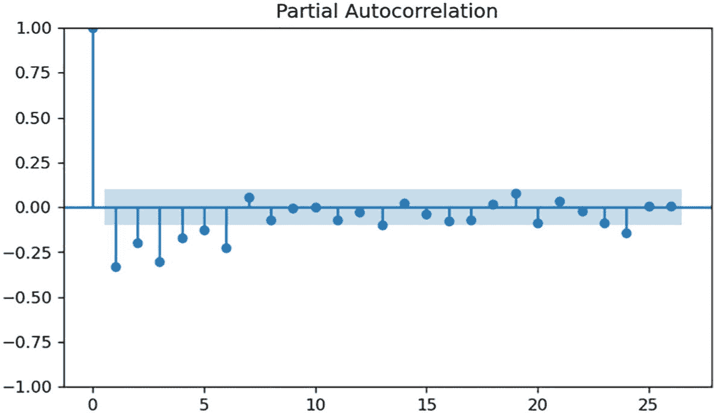


#### ACF 与 PACF 分析

##### PACF 图

PACF 图展示了从 0 到 25 的滞后值与相关性的关系。水平轴上的阴影条表示显著性水平。穿过显著性条的值序列大约为：1、-0.35、-0.22、-0.30、-0.20、-0.13、-0.23、-0.12、-0.11 和 -0.14。

**图 7-21** 时间序列的 PACF 图

##### ACF 图

在图 7-22 的 ACF 图中，滞后 2 和滞后 7 处出现急剧截断并穿过显著性线，因此我们可以尝试将 MA 分量设为 `q=2` 或 `q=7` 进行建模。

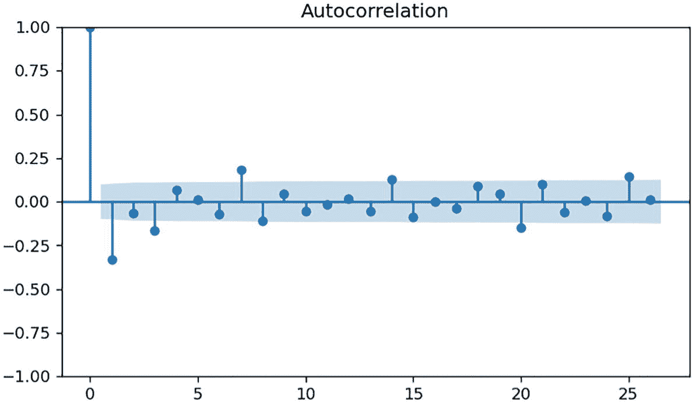

ACF 图展示了从 0 到 25 的滞后值与相关性的关系。水平轴上的阴影条表示显著性水平。穿过显著性条的值序列大约为：1、-0.38、-0.15、0.20、-0.11、0.11 和 -0.15。

**图 7-22** 时间序列的 ACF 图

#### 数据划分

接下来，将数据划分为训练数据和测试数据，用于 ARIMA `(6,1,2)` 模型。在 396 个数据点中，我们使用前 300 个（约 75%）数据点进行训练，其余数据点用于测试，并按时间尺度绘制，如图 7-23 所示。

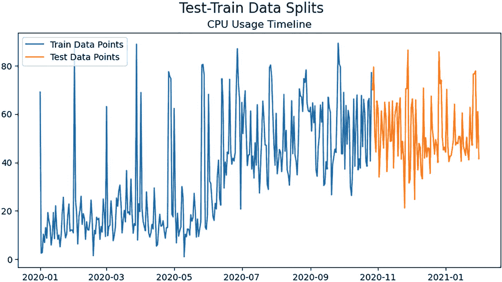

CPU 使用率的训练/测试数据划分图，纵轴标记为数据点，横轴标记为日期 _ 时间。训练数据点和测试数据点的两条高频波分别从 2020 年 1 月 4 日和 2020 年 11 月开始，结束于 2020 年 11 月的 70 点和 2021 年 1 月的 50 点。

**图 7-23** 时间序列数据划分为测试数据和训练数据

```python
#### 绘制训练数据和测试数据
train_data = cpu_util_raw_data['cpu_utilization'][:300]
test_data = cpu_util_raw_data['cpu_utilization'][300:]
fig, ax = plt.subplots(figsize=(10,5), dpi=100)
ax.plot(train_data, label='训练数据点')
ax.plot(test_data, label='测试数据点')
ax.set_title('CPU 使用率时间线')
ax.legend(loc='upper left', fontsize=10)
plt.legend(loc='upper left', fontsize=10)
plt.suptitle('测试-训练数据划分', fontsize=16)
plt.show()
```

#### ARIMA 模型创建

让我们使用训练数据创建 ARIMA `(6,1,2)` 模型。

```python
manual_arima_model = ARIMA(train_data, order=(6,1,2))
manual_arima_model_fit = manual_arima_model.fit()
print(manual_arima_model_fit.summary())
```

图 7-24 显示了训练数据上 ARIMA 模型的输出结果。

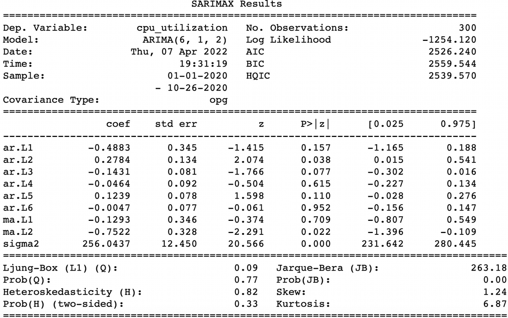

一份 SARIMAX 结果报告，顶部包含多个输出项，标题为：因变量、模型、日期、时间、样本、协方差类型、观测数、对数似然、AIC、BIC 和 HQIC。中间是一个表格，底部有更多输出项，标题为：Ljung-Box、概率、异方差性、概率和 Jarque-Bera。

**图 7-24** 训练数据上的 ARIMA 模型输出结果

#### 模型准确性检查

在将此模型应用于测试数据之前，需要检查所选分量值组合 `p,d,q` 下 ARIMA 模型的准确性。有两个关键的统计指标可用于比较不同模型的相对质量。

-   **赤池信息准则 (AIC)**：通过检查模型对调优参数的依赖程度，来验证模型对数据的拟合优度。AIC 值越低，模型性能越好。当前 ARIMA `(6,1,2)` 模型的 AIC 值为 2113。

-   **贝叶斯信息准则 (BIC)**：除 AIC 外，BIC 还使用了用于拟合的训练数据集中的样本数量。同样，BIC 值较低的模型更受青睐。当前 ARIMA `(6,1,2)` 模型的 BIC 值为 2150。

基于 PACF 和 ACF 图表，可以尝试多个值来降低 AIC 和 BIC 值。目前，我们继续使用 ARIMA `(6,1,2)`。

#### 对训练数据进行预测

让我们将训练数据集中的实际值与模型的预测值绘制在一起，以分析实际值与模型预测值的接近程度。

```python
prediction_manual=manual_arima_model_fit.predict(dynamic=False,typ='levels')
plt.figure(figsize=(15,5), dpi=100)
fig, ax = plt.subplots(figsize=(10,5), dpi=100)
ax.plot(prediction_manual, label='预测值')
ax.plot(train_data, label='训练数据')
ax.legend(loc='upper left', fontsize=10)
plt.legend(loc='upper left', fontsize=10)
plt.suptitle('训练数据上实际值与预测 CPU 使用率对比', fontsize=16)
plt.show()
```

如图 7-25 所示，模型预测值与实际值非常接近，表明模型训练效果良好。

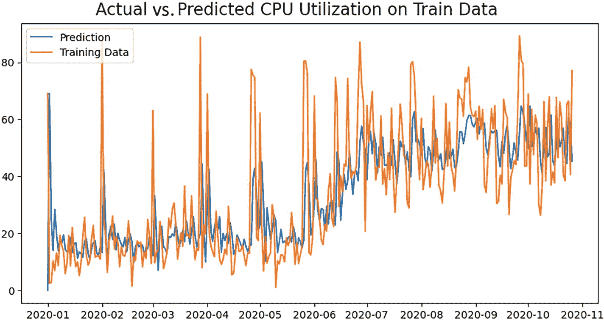

训练数据上实际值与预测 CPU 使用率对比图，纵轴表示数据点，横轴表示日期 _ 时间。预测数据和训练数据的两条高频波被绘制出来。两条波均从 2020 年 1 月的 70 点开始，结束于 2021 年 1 月的 60 点。

**图 7-25** 训练数据上的预测分析

#### 在测试数据上验证

现在，让我们在测试数据上验证模型性能。

```python
#### 使用 95% 置信区间进行预测
forecast = manual_arima_model_fit.get_forecast(97)
manual_arima_fc = forecast.predicted_mean
manual_arima_conf = forecast.conf_int(alpha=0.05)
manual_arima_fc_series = pd.Series(manual_arima_fc, index=test_data.index)
manual_arima_lower_series = pd.Series(manual_arima_conf["lower cpu_utilization"],
index=manual_arima_conf.index)
manual_arima_upper_series = pd.Series(manual_arima_conf["upper cpu_utilization"],
index=manual_arima_conf.index)
plt.figure(figsize=(15,10), dpi=100)
plt.plot(train_data, label='训练数据')
plt.plot(test_data, label='实际数据')
plt.plot(manual_arima_fc_series, label='预测数据')
plt.fill_between(manual_arima_lower_series.index, manual_arima_lower_series,
manual_arima_upper_series, color='gray', alpha=.15)
plt.title('预测值与实际值对比')
plt.legend(loc='upper left', fontsize=8)
plt.show()
```

图 7-26 显示，ARIMA `(6,1,2)` 模型在测试数据集上的性能不佳，其预测值随时间推移而恶化。

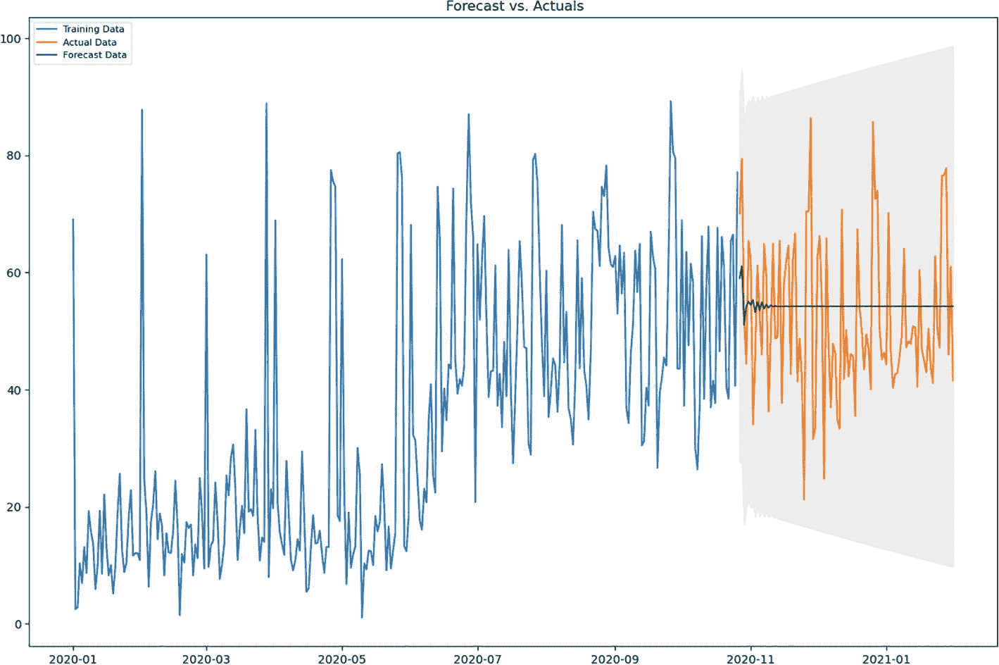

预测分析图，数据点与日期 _ 时间的关系。训练数据、实际数据和预测数据的三条高频波分别从 2020 年 1 月的 70 点、2020 年 11 月的 55 点和 2020 年 11 月的 70 点开始，结束于 2020 年 11 月的 70 点、2021 年 1 月的 55 点和 2021 年 1 月的 55 点。

**图 7-26** 测试数据上的预测分析

#### 性能指标

让我们使用之前定义的指标来量化模型性能。

```python
def forecast_accuracy(forecast, actual):
mape = np.mean(np.abs(forecast - actual)/np.abs(actual)*100)
mae = np.mean(np.abs(forecast - actual))
rmse = np.mean((forecast - actual)**2)**.5
rmsle = np.sqrt(mean_squared_log_error(actual, forecast))
return({'MAPE : ':mape, 'MAE : ': mae,
'RMSE : ':rmse, 'RMSLE : ':rmsle
})
forecast_accuracy(manual_arima_fc, test_data)
```

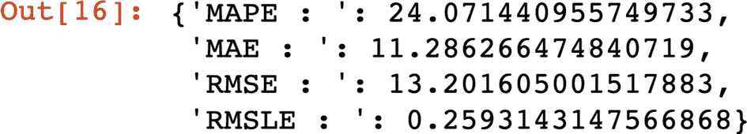

`{'MAPE : ': 24.071440955749733, 'MAE : ': 11.286266474840719, 'RMSE : ': 13.201605001517883, 'RMSLE : ': 0.2593143147566868}`

根据性能指标，模型预测的准确率约为 76%（MAPE = 约 24%）。


在实际场景中，需要使用 ARIMA 组件的多个值才能得到预测精度最高的模型。手动执行此任务需要大量的时间和统计技术专业知识。此外，要为大量实体（如服务器、参数、股票等）创建模型几乎是不可能的。

有一种称为 Auto ARIMA 的机器学习方法，可以学习组件 `p`、`d`、`q` 的最优值。在 Python 中，有一个名为 `pdarima` 的库，它提供了 `auto_arima` 函数，用于在模型创建中尝试 ARIMA/SARIMA 组件的各种值，并搜索具有最低 AIC 和 BIC 值的最优模型。

让我们尝试使用 auto ARIMA 从给定的训练数据集中为 ARIMA 模型找到最优的组件值。在 auto ARIMA 模型中，我们目前将 `seasonal` 指定为 `False`，以便更深入地探索 ARIMA。对于 SARIMA 模型，此值将为 `true`，以考虑季节性。我们还将提供 auto ARIMA 可以探索的 `p` 和 `q` 的最大值，以获得最佳模型。让我们将 `max_p` 和 `max_q` 设置为 15，以限制模型的复杂度。

```
#### 在训练集上拟合 auto_arima
auto_arima_model = pm.auto_arima(train_data, start_p = 1, start_q = 1,
max_p = 15, max_q = 15,
seasonal = False,
d = None, trace = True,
error_action ='ignore',
suppress_warnings = True,
stepwise = True)
#### 打印摘要
auto_arima_model.summary()
```

根据图 7-27 所示的 auto ARIMA 结果，最佳模型被识别为 ARIMA (6,1,0)，其 AIC 和 BIC 值相比之前的 ARIMA (6,1,2) 模型有轻微改善。

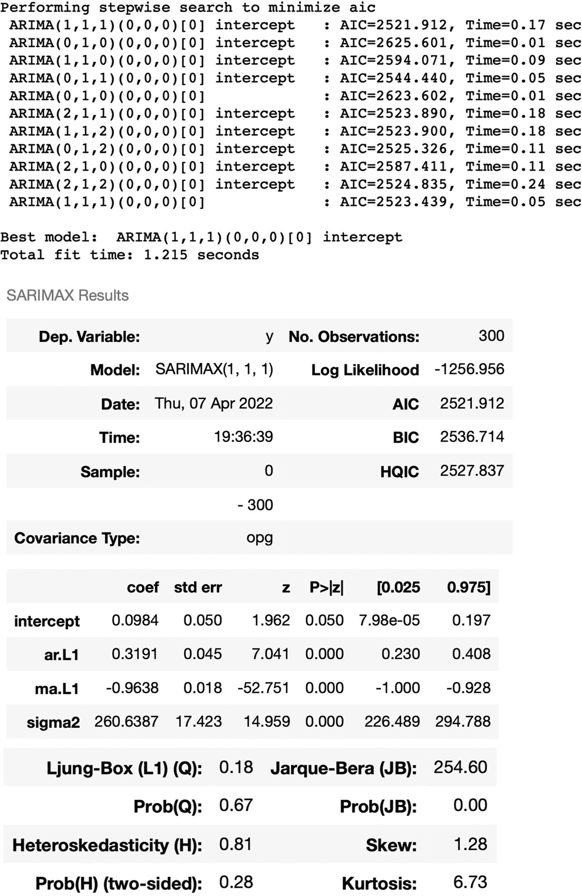

预测分析展示了为最小化 AIC 而进行的逐步性能。SARIMAX 结果如下所示，包含不同的输出标题：因变量、模型、日期、时间、样本、协方差类型、观测数、对数似然、AIC、BIC、HQIC。

**图 7-27** 对测试数据的预测分析

接下来，仅在测试数据上验证 ARIMA (1,1,1) 的性能。

```
auto_arima_predictions = pd.Series(auto_arima_model.predict(len(test_data)))
actuals = test_data.reset_index(drop = True)
auto_arima_predictions.plot(legend = True,label = "ARIMA 预测",
xlabel = "索引",ylabel = "CPU 利用率",
figsize=(10, 7))
actuals.plot(legend = True, label = "实际值");
forecast_accuracy(np.array(auto_arima_predictions), test_data)
```

如图 7-28 所示，并且根据获得的性能指标，ARIMA (1,1,1) 模型的精度进一步下降。

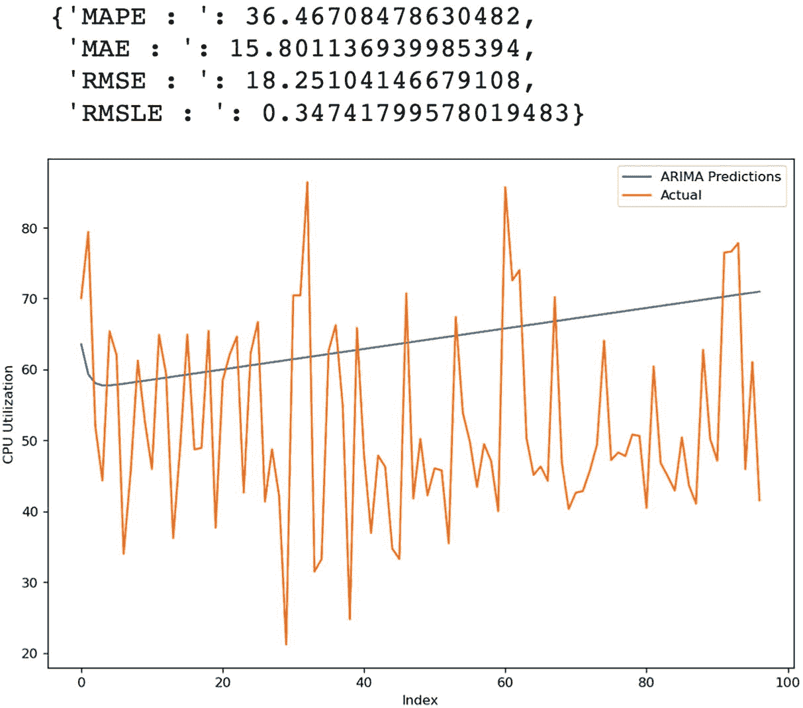

一张 CPU 利用率与索引的关系图。图中绘制了一条频率波和一条曲线。频率波表示实际值，从 (0, 70) 开始，到 (40, 95) 结束。曲线表示 ARIMA 预测，从 (0, 65) 开始，到 (95, 68) 结束。这些点是近似值。

**图 7-28** 对测试数据 ARIMA (1,1,1) 的预测分析

显然，ARIMA 模型在此场景中不适用，我们需要使用 `seasonal_decompose` 包来查找数据中的季节性。

```
seasonality_check = seasonal_decompose(cpu_util_raw_data['cpu_utilization'],
model='additive',extrapolate_trend='freq')
seasonality_check.plot()
plt.show()
```

基于图 7-29 中的图表，我们可以观察到数据中的季节性，这意味着我们应该使用 SARIMA 模型。

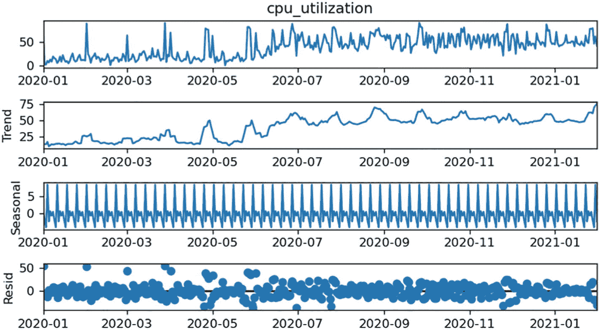

四个图表。图表 1，CPU 利用率与日期时间的关系，绘制了一条高频波。图表 2，趋势与日期时间的关系，绘制了一条低频波。图表 3，季节性与日期时间的关系，绘制了一条高度相同的高频波。图表 4，残差与日期时间的关系，绘制了一个散点图。

**图 7-29** 时间序列季节性检查

让我们使用启用了季节性的 auto ARIMA 来探索 SARIMA 模型。由于我们有每日数据点，并且根据季节性图表，似乎存在周季节性，因此我们将 SARIMA 组件的值设置为 `m = 7`。

```
#### 季节性 - 拟合逐步 auto-ARIMA
sarima_model = pm.auto_arima(train_data, start_p=1, start_q=1,
test='adf',
max_p=15, max_q=15, m=7,
start_P=0, seasonal=True,
d=None, D=1, trace=True,
error_action='ignore',
suppress_warnings=True,
stepwise=True)
sarima_model.summary()
```

如图 7-30 所示，auto ARIMA 尝试了各种组合，并将 SARIMA (3,0,2)(0,1,1)[7] 检测为最佳拟合模型，其 AIC 值与之前的 ARIMA 模型相比有显著改善。

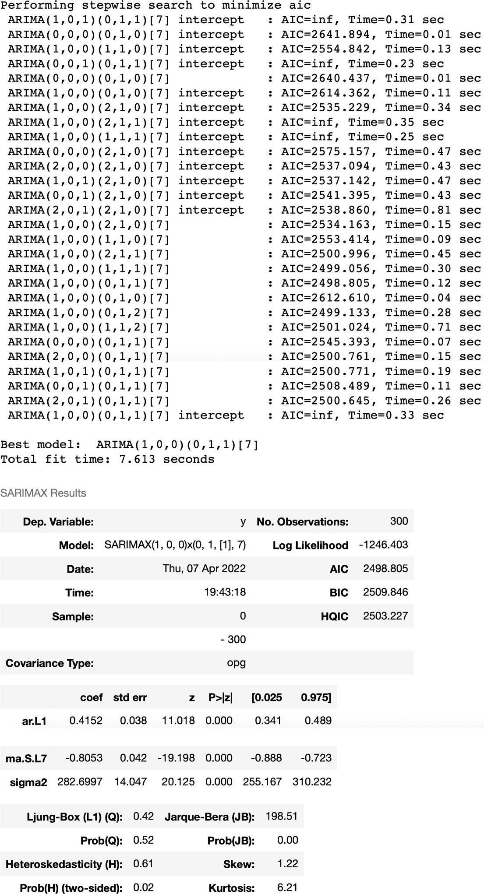

在训练数据上的自动 ARIMA 模型执行结果展示了为最小化 AIC 而进行的逐步性能。SARIMAX 结果如下所示，包含不同的输出标题：因变量、模型、日期、时间、样本、协方差类型、观测数、对数似然、AIC、BIC、HQIC。

**图 7-30** 在训练数据上的自动 ARIMA 模型执行结果

让我们验证这个新 SARIMA 模型的结果。

```
sarima_predictions = pd.Series(sarima_model.predict(len(test_data)))
actuals = test_data.reset_index(drop = True)
sarima_predictions.plot(legend = True,label = "SARIMA 预测",xlabel = "索引", ylabel = "CPU 利用率", figsize=(10, 7))
auto_arima_predictions.plot(legend = True,label = "ARIMA 预测")
actuals.plot(legend = True, label = "实际值")
forecast_accuracy(np.array(sarima_predictions), test_data)
```

在考虑了季节性之后，预测精度提高到约 62%，而 MAPE 降低到约 38%。这种精度的提升也可以通过将 ARIMA 和 SARIMA 模型的预测与观察到的实际测试数据绘制在一起，在图 7-31 中观察到。

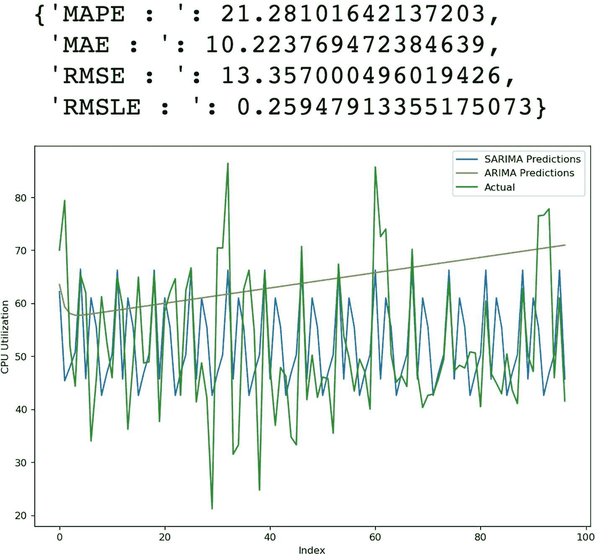

一张 CPU 利用率与索引的关系图。图中绘制了两条频率波和一条曲线。频率波表示 SARIMA 和实际值。实际值从大约 (0, 70) 开始，到 (40, 95) 结束；SARIMA 从大约 (0, 65) 开始，到 (45, 95) 结束。曲线表示 ARIMA 预测，从大约 (0, 65) 开始，到 (95, 68) 结束。

**图 7-31** ARIMA/SARIMA 对测试数据的时间序列预测

此模型可用于生成未来预测，以动态确定适当的基线，而不是使用静态的全局基线。这种方法可以显著减少大型环境中的噪声。

该模型还可用于围绕基础设施自动扩缩容的最常见用例之一，尤其是在利用率存在季节性时。SARIMA（或 SARIMAX）模型可用于分析历史时间序列数据，同时考虑季节性和任何外部因素，以预测利用率，并据此在特定时间段内扩缩容基础设施，从而提供潜在的成本节约。


## APM 与 SecOps 中的自动基线化

与 SecOps 和应用监控相关的监控工具具有不同的特性，因为大多数情况下，它们的监控参数值保持极低，几乎趋近于零，这会导致数据集不平衡，从而提供错误的预测。在这种情况下，更有意义的做法是将峰值或异常的高利用率值（称为*异常*）与预测值进行比较，以计算 `MASE` 比率，并据此调整机器学习模型，而不是利用通常较低的参数值。异常值是指那些不遵循常规模式并表现出突然峰值（上升或下降）的值。我们将在第 8 章中进一步讨论这些内容。

这些针对安全相关参数的预测阈值可以应用于监控受保护网段的策略，该网段包括定义服务的 IP 地址范围、端口和协议、VLAN 编号或 MPLS 标签。一个合适的策略将动态检测针对不同受保护网段的攻击，并触发合格的告警，而不是产生噪音。

实施具有自动基线化功能的监控解决方案，可以使运维团队快速识别中断、异常和网络攻击，而不是将时间浪费在噪音上，从而带来立竿见影的好处。但组织在采用动态阈值时常常面临一些运营挑战，我们接下来将讨论这些挑战。

### 动态阈值面临的挑战

尽管动态阈值看起来很有前景，但由于担心错过关键告警，其采用面临挑战。尤其是在 AIOps 系统刚刚开始学习过程的初始阶段，组织对预测的准确性会产生很多质疑。此外，大多数开源和原生监控工具不具备此功能。实施基于 AIOps 的动态阈值涉及使用多种算法和技术，并且需要较长时间的数据才能分析季节性和模式。

## 总结

在本章中，我们介绍了 AIOps 中的一个重要用例，即自动基线化。我们涵盖了可用于此目的的各种回归算法。我们通过使用多种算法（如线性回归、`ARIMA` 和 `SARIMA`）对该用例进行了动手实践。在下一章中，我们将介绍各种异常检测算法以及如何在 AIOps 中使用它们。

