# 8. AIOps 用例：异常检测

在前几章讨论了去重和自动基线化之后，我们现在将沿着 AIOps 成熟度阶梯向上，讨论异常检测，这为迈向主动性提供了巨大飞跃。本章将解释异常检测及其对 IT 运维的用处。

## 异常检测概述

异常检测是识别不寻常或意外数据点的过程。CPU、内存、交换内存、磁盘等的常规事件对运维来说是正常的，但如果出现任何“应用程序宕机”或防火墙事件，则代表了一种异常情况。异常检测的目标是识别数据集中与其它观测值显著不同的此类异常情况（我们称之为*离群点*）。尽管检测异常的任务可以通过所有三种类型的机器学习算法来执行，但其实现主要通过将未标记数据聚类成不同组来广泛进行。在 IT 运维中，执行服务改进计划是一项常规工作，运维并没有特定的预测目标。相反，他们需要分析大量数据，然后尝试观察相似性并将它们组合成不同的组，以理解异常并制定建议。我们在第 5 章中简要讨论了无监督机器学习中可用于异常检测的不同聚类算法，而 K-means 聚类是其中最简单、最流行的无监督机器学习算法之一，我们将在本章中探索它。

## K-Means 算法

如第 5 章所述，K-means 是一种基于质心的聚类算法，广泛用于数据挖掘中检测模式并将相似的数据点分组到一个*簇*中。从数学上讲，如果有一个由 `N` 个数据点组成的数据集 `{x1, . . . , xn}`，如图 8-1 所示，那么我们的目标是将数据集划分为 `K` 个簇。

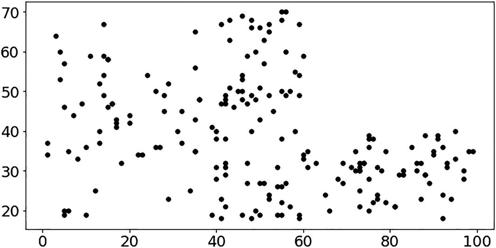

一个散点图，显示了可以在质心周围创建的不同的簇。有多种方法可以从数据集中确定质心。在散点图中，水平轴值为 0、200、400、600、800 和 1000，垂直轴值为 0、5000、10000、15000、20000 和 25000。

图 8-1

空间中的 `N` 个数据点

这里，`K` 表示可以在质心周围创建的不同的簇的数量。有多种方法可以从数据集中确定质心，本节将在我们的实现中使用肘部法来确定合适的簇数。数据集中检测到了三个质心，在图 8-2 中标记为红点。

K-means 算法试图确定数据点与质心的相似性，并相应地将数据点聚类在这些质心周围，如图 8-2 所示。

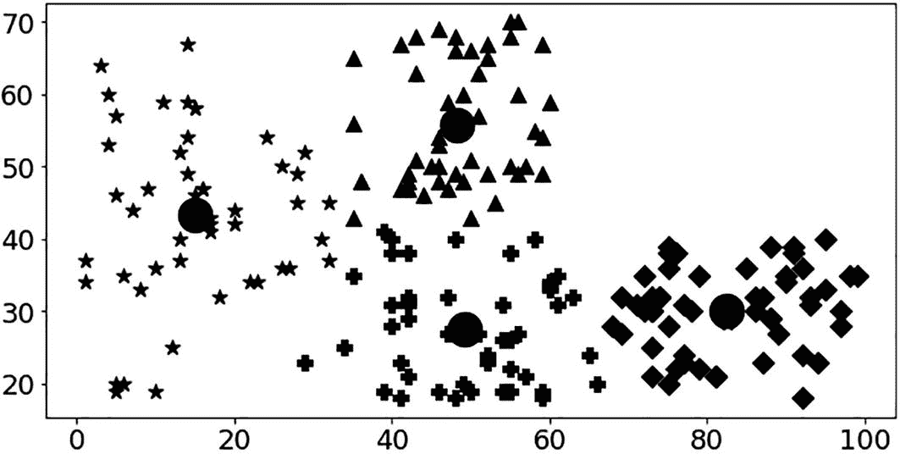

一个散点图，用于确定数据点与质心的相似性，并相应地将数据点聚类在这些质心周围。散点图的水平轴值为 0、200、400、600、800 和 1000，垂直轴值为 0、5000、10000、15000、20000 和 25000。

图 8-2

K-means 算法执行的聚类

IT 运维团队执行手动过滤数百个事件并将相关事件分组到组中的任务，用于各种目的，例如：

*   *根本原因分析*：将与某个问题或中断相关的事件分组，以了解问题是如何开始发展的。

*   *性能分析*：将与特定应用或服务相关的事件分组，以分析其性能和相关的瓶颈。

*   *服务改进*：将产生噪音的事件分组，并分析应在源头更新哪些监控配置或基线以减少噪音并提高服务质量。

*   *容量规划*：将代表热点的事件分组，这些热点需要通过容量规划流程进行及时的干预和解决。

从 AIOps 的角度来看，它可能是最简单的聚类算法，可以在广泛的场景中检测异常。在该算法中，首先为每个簇选择一个质心，然后根据数据点与质心的距离将它们分组到簇中。有多种计算距离的方法，例如闵可夫斯基距离、曼哈顿距离、欧几里得距离、汉明距离等。

聚类是一个迭代过程，用于优化计算距离的质心位置。例如，大多数组织会收到数千个与性能或可用性相关的事件，但很少收到与 DDoS/DoS 攻击相关的安全告警。不仅频率不同，告警文本消息也会不同。在这种情况下，你可以对事件消息应用 K-means 聚类，将时间尺度上的相关消息分组，而将安全告警作为异常单独处理。

让我们考虑一个实现场景：系统中存在多个告警，您需要分析告警消息，以区分频繁发生的事件和异常事件，然后尝试确定事件的根因。在此实现中，您将处理文本数据；因此，您必须使用人工智能的一个子领域，即*自然语言处理*（NLP）。您将使用 NLP 对文本进行分词分析，获取分词的相关性及其在不同事件中的相似性，从而创建聚类。

首先，您需要导入一些库。在此实现中，您将使用与 NLP 相关的库。

- *自然语言工具包 (nltk)*：这是一套用于文本分词、解析、分类、词干提取、词性标注和语义推理的库，用于处理人类语言数据，并将其用于统计或机器学习系统中的进一步分析。

- *sklearn*：这是一个机器学习库，提供了各种算法的实现，例如 K-means、SVM、随机森林、梯度提升等。该库允许您直接在数据上使用这些算法，而无需花费巨大精力手动实现它们。

- *Genism*：这是一个用于主题建模的重要库，*主题建模是一种用于文本挖掘和发现隐藏在文本集合中的抽象主题的统计模型*。*主题*可以定义为文本语料库中共同出现的术语的重复模式。例如，*switch*、*interface*、*router* 和 *bandwidth* 这些术语会频繁地一起出现，因此可以归入*网络*这一主题。这不是一种基于规则的方法，不使用正则表达式或基于字典的关键词搜索技术。它是一种无监督的机器学习算法，用于查找一组相关的词语并创建文本聚类。

您可以从 [`https://github.com/dryice-devops/AIOps/blob/main/Ch-8_Anomaly%20Detection.ipynb`](https://github.com/dryice-devops/AIOps/blob/main/Ch-8_Anomaly%2520Detection.ipynb) 下载此代码。

```python
#library for mathematical calculations
import pandas as pd
import numpy as np
#library for NLP\text processing
import nltk
from nltk.stem import WordNetLemmatizer, SnowballStemmer
from sklearn.feature_extraction.text import TfidfVectorizer
from sklearn.feature_extraction.text import TfidfVectorizer
from sklearn.decomposition import PCA
from sklearn.preprocessing import normalize
from sklearn.metrics import pairwise_distances
from sklearn.cluster import KMeans
from sklearn.metrics import silhouette_score,silhouette_samples
from sklearn.manifold import TSNE
import gensim
#library for plotting graphs and charts
import matplotlib.pyplot as plt
import matplotlib
import seaborn as sns
from IPython.display import clear_output
import time
```

加载包含一些示例事件的文件。

```python
raw_alerts = pd.read_csv(r'event_dump.csv')
```

让我们通过检查列及其示例值来了解数据。

```python
raw_alerts.info()
```

如图 8-3 所示，我们有 1,050 个事件（第一行是标题），每个事件有六列。

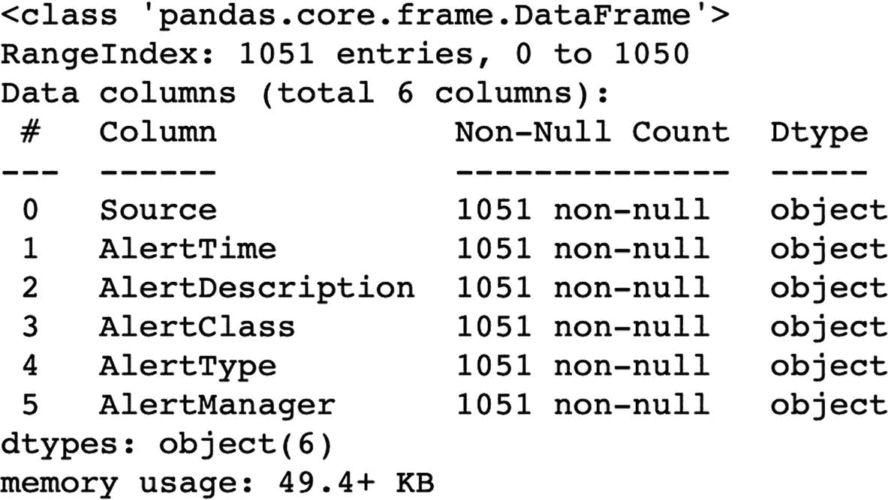

这是 K-means 算法的数据集。在该图像中，标题是列、非空计数和数据类型。顶部是 class pandas dot core dot frame dot data Frame，Range Index 1051 entries，0 to 1050。总共有 6 列：Source、Alert Time、Alert Description、Alert Class、Alert Type 和 Alert Manager。

图 8-3

数据集中的列

接下来，让我们检查数据文件中的示例事件。

```python
raw_alerts.head().transpose()
```

表 8-1 显示了来自数据输入文件的示例事件，其中包含以下字段：

表 8-1

输入文件中的示例事件

| -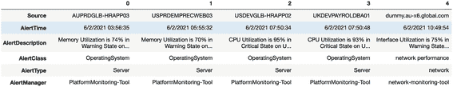该表有六列六行，六行标题为 Source、Alert Time、Alert Description、Alert Class、Alert Type 和 Alert Manager。另外五列被分为五个子行。 |

- *Source*：包含设备主机名/IP

- *AlertTime*：提供事件发生时间

- *AlertDescription*：提供详细的事件消息

- *AlertClass*：提供事件的类别

- *AlertType*：提供事件的类型

- *AlertManager*：提供生成事件的工具

检查数据中存在多少种唯一的 `Class` 事件。

```python
raw_alerts['AlertClass'].unique()
```

如图 8-4 所示，输入数据集包含六种不同的事件类别，这些类别代表了与操作系统、网络、应用程序和配置更改相关的性能和可用性问题。这些涵盖了任何运维中生成的最常见的事件类型。

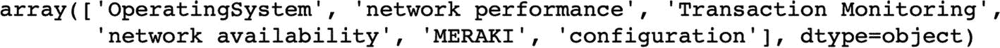

这是 K-means 算法的唯一值。这些值是 array 括号 box bracket operating system、Network Performance、Transaction Monitoring、Network Availability、MERAKI、Configuration、Box Bracket，Datatype 等于 object 括号。

图 8-4

Class 列中的唯一值

接下来，开始应用 NLP 算法。首先，我们需要从 `nltk` 下载英语单词词典。您需要添加领域特定的单词，因为这些单词可能不在英语单词词典中，例如 *app*、*HTTP*、*CPU* 等。这些领域特定的单词对于高效创建聚类非常重要。

现在对事件消息应用预处理，包括移除特殊字符和标点符号以创建分词。然后，这些分词通过词干提取和词形还原过程（在第 4 章中解释）进行处理，以获得更有意义的单词，同时移除停用词，这些停用词代表一组常用词，对句子没有太多意义，例如 *is*、*are* 等。它们携带的有用信息很少，因此可以安全地移除。

```python
nltk.download('words')
words = set(nltk.corpus.words.words())
stemmer = SnowballStemmer('english')
def lemmatize_stemming(text):
return stemmer.stem(WordNetLemmatizer().lemmatize(text, pos='v'))
def preprocess(text):
result = []
words = set(nltk.corpus.words.words())
domain_terms = set(["cpu","interface","application","failure",
"https","outage", "synthetic","timeout","utc",
"www","simulation","simulated","http",
"response","app","network","emprecord",
"global_hr","pyroll","employee_lms","demoapp1",
"emp_logistics_summary","demo","down", "tcp" ,
"connect","emp_tsms","payroll_sap_gts",
"demoapp3","high","state"])
for token in gensim.utils.simple_preprocess(text):
if token not in gensim.parsing.preprocessing.STOPWORDS:
if token.lower() in words or token.lower() in domain_terms:
result.append(lemmatize_stemming(token))
return result
```

接下来，将事件消息通过 NLP 预处理。

```python
event_msg = np.array(raw_alerts[['AlertDescription']])
temp = []
for i in event_msg :
temp.append(i[0])
event_msg = temp
for i,v in enumerate(event_msg):
event_msg[i] = preprocess(v)
for i,v in enumerate(event_msg):
event_msg[i] = " ".join(v)
```

对于每个事件句子，我们都有用于分析的相关分词。现在，我们需要将这些文本分词从词汇表映射到对应的实数向量，以便我们可以应用统计算法。这个过程称为*向量化*。

您将使用 TF-IDF 进行向量化处理。TF-IDF 是一种用于计算分词相关性的统计度量。它包含两个概念：词频（TF）和逆文档频率（IDF）。

- *TF*：这考虑了一个词在事件消息中出现的频率。由于每条消息的长度不同，长句子中的分词出现频率可能比短消息中的分词更高。

*   *IDF*：这是基于一个事实，即出现频率较低的词元信息量更大、更重要。因此，如果一个词元（例如 `high`）在多个事件消息中频繁出现，那么与那些在多个消息中不常出现的词元（例如 `down`）相比，它就不那么关键。

读者可以在 [`https://en.wikipedia.org/wiki/Tf–idf`](https://en.wikipedia.org/wiki/Tf%25E2%2580%2593idf) 获取关于 TF-IDF 的更多详细信息。

接下来，我们将使用 TF-IDF 对数据进行向量化处理：

```python
tf_idf_vectorizor = TfidfVectorizer(stop_words = 'english',
max_features = 10000)
tf_idf = tf_idf_vectorizor.fit_transform(event_msg)
tf_idf_norm = normalize(tf_idf)
tf_idf_array = tf_idf_norm.toarray()
```

现在，我们得到了最终的词元列表，可以对其应用 K-means 算法。

要应用 K-means 算法，首先需要确定 K 的理想值。为此，我们将使用**肘部法**，这是一种用于确定数据集中聚类数量的启发式方法。

让我们用这个方法绘制一个分数与聚类数量的关系图。

```python
number_clusters = range(3, 12)
kmeans = [KMeans(n_clusters=i, max_iter = 600) for i in number_clusters]
kmeans
score = [kmeans[i].fit(tf_idf_array).score(tf_idf_array) for i in range(len(kmeans))]
score
plt.plot(number_clusters, score)
plt.xlabel('Number of Clusters')
plt.ylabel('Score')
plt.title('Elbow Method')
plt.show()
```

从图 8-5 的图表中，我们知道数据集中总共可能存在七个聚类。因此，我们将 K 的值设为 7，并执行 K-means 算法。

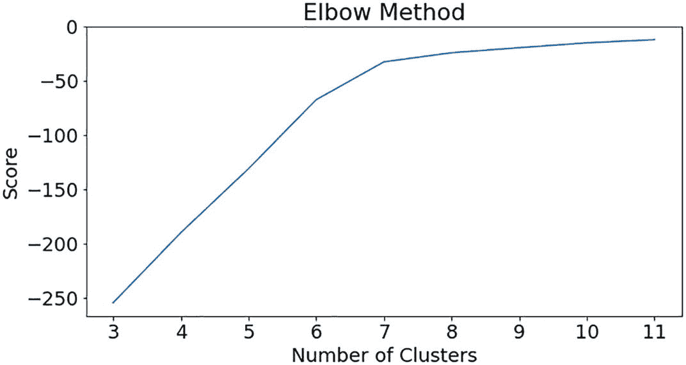

**图 8-5** 数据集上的肘部图

```python
df_temp = raw_alerts
no_cluster = 7
kmeans = KMeans(n_clusters=no_cluster, max_iter=600, algorithm = 'auto')
fitted = kmeans.fit(tf_idf_array)
print("Top terms per cluster:")
order_centroids = kmeans.cluster_centers_.argsort()[:, ::-1]
labels = {}
terms = tf_idf_vectorizor.get_feature_names()
for i in range(no_cluster):
print("Cluster %d:" % i),
labels[i]=terms[order_centroids[i, 0]]
for ind in order_centroids[i, :10]:
print(' %s' % terms[ind])
```

现在你可以看到，所有代表问题的关键词都被聚类到了不同的簇中。

让我们通过绘制每个簇中聚类的主要问题，来更详细地理解每个簇。

```
preds = kmeans.predict(tf_idf_array)
df_temp['cluster'] = preds
df_temp['AlertTime'] = pd.to_datetime(df_temp['AlertTime'])
def get_top_features_cluster(tf_idf_array, prediction, n_feats):
    labels = np.unique(prediction)
    dfs = []
    for label in labels:
        id_temp = np.where(prediction==label)
        x_means = np.mean(tf_idf_array[id_temp], axis = 0)
        sorted_means = np.argsort(x_means)[::-1][:n_feats]
        features = tf_idf_vectorizor.get_feature_names()
        best_features = [(features[i], x_means[i]) for i in sorted_means]
        df = pd.DataFrame(best_features, columns = ['features', 'score'])
        dfs.append(df)
    return dfs
def plotWords(dfs, n_feats):
    plt.figure(figsize=(8, 4))
    for i in range(0, len(dfs)):
        plt.title(("Most Common Words in Cluster {}".format(i)), \
                   fontsize=10, fontweight='bold')
        sns.barplot(x = 'score' , y = 'features', orient = 'h' , \
                    data = dfs[i][:n_feats])
    plt.show()
n_feats = 20
dfs = get_top_features_cluster(tf_idf_array, preds, n_feats)
plotWords(dfs, 10)
```

图 8-6 显示，所有类型的告警作为特征都被聚类到了簇 0 中，并显示了它们在该簇中的重要性或权重。如图所示，该簇主要由与 CPU 相关的告警或与其他不太重要的告警/问题同时发生的问题组成。从这个簇可以观察到，CPU 利用率告警与任何应用相关的问题或告警无关，这表明 CPU 告警很可能产生大量噪音，你可能需要调整 CPU 利用率参数。

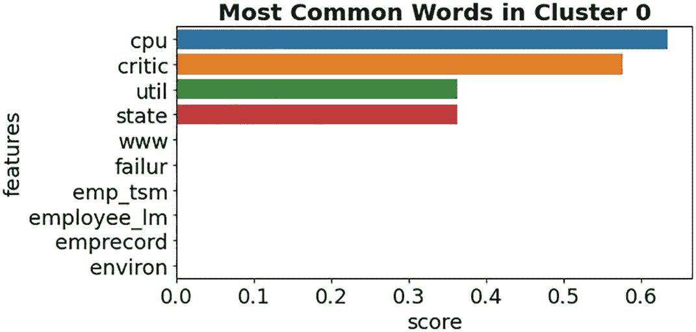

**图 8-6** 簇 0 代表 CPU 问题

如图 8-7 所示，簇 1 代表主要与 Global HR 应用相关的问题。此外，该簇还表明了 Global HR 应用问题与内存问题之间的潜在关系，这将有助于 IT 运维团队进行故障排除和修复。这是一个非常重要的洞察，无需编写任何规则，即可由机器学习算法自动检测到。


**图 8-7** 簇 1 代表 Global HR 应用问题

与簇 1 类似，图 8-8 代表主要与另一个应用——Payroll 相关的问题，该应用同样受到内存相关问题的影响。应用团队应利用此簇中的告警来了解如何改进其性能并减少应用告警。

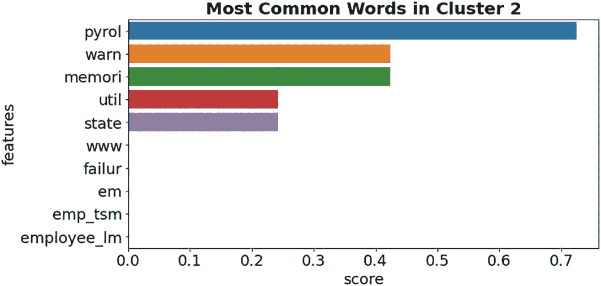

**图 8-8** 簇 2 代表 Payroll 应用问题

图 8-9 中的簇 3 代表与 Employee Record 应用相关的告警，需要对其进行分析和修复。这也是向问题管理团队提供的重要输入，因为他们需要为此问题提供长期解决方案。

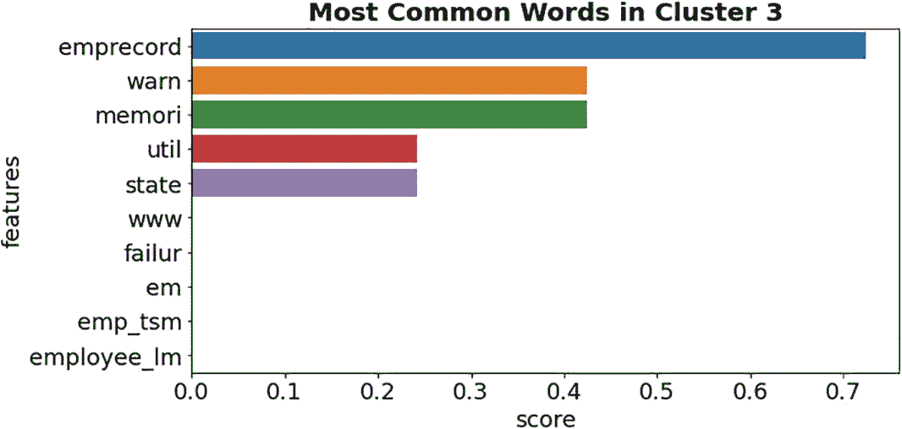

**图 8-9** 簇 3 代表 Employee Record 应用问题

图 8-10 中的簇 4 代表与网络接口利用率相关的问题，需要由网络团队进行分析。AIOps 可以使用自动化技术，针对此处聚类在一起的所有告警，为网络团队创建一个单一工单。这个单一工单将避免用重复的事件使工单系统过载。

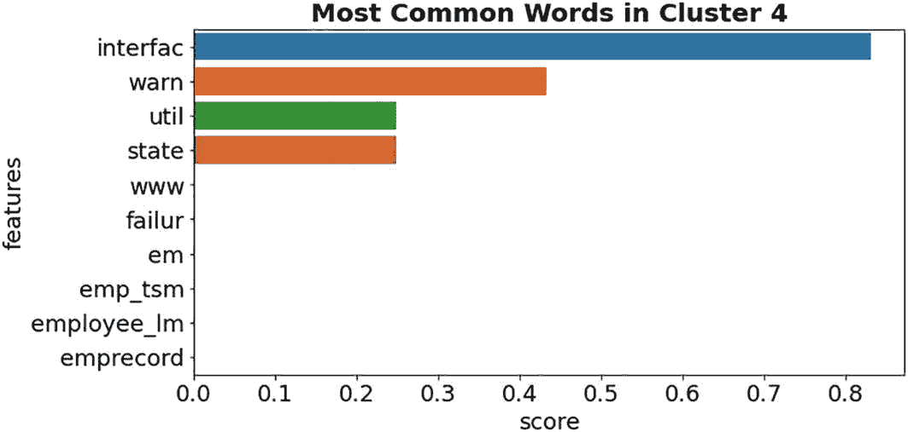

**图 8-10** 簇 4 代表网络接口利用率问题

### 网络接口问题水平条形图

垂直轴表示特征，水平轴表示分数。特征包括：`Interfac`、`warm`、`util`、`state`、`w w w`、`failur`、`em`、`emp t s m`、`employee I m` 和 `emprecord`。各特征对应的条形值大约为：0.81、0.42、0.25、0.25、0、0、0、0、0 和 0。

**图 8-10**

**集群 4** 代表网络接口相关问题。

**图 8-11** 中的**集群 5** 代表内存相关问题，我们在之前的集群中也观察到，内存相关告警与应用告警聚集在一起。这表明多个应用程序可能正在使用共同的底层基础设施（例如接近容量的公共虚拟化基础设施）。由于不同集群自动捕获不同的问题，综合分析它们可以显著缩短解决时间。

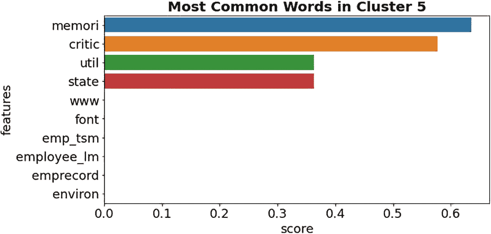

### 内存利用率问题水平条形图

垂直轴表示特征，水平轴表示分数。特征包括：`memori`、`critic`、`util`、`state`、`www`、`font`、`emp tsm`、`employee Im`、`emprecord` 和 `environ`。各特征对应的条形值大约为：0.61、0.58、0.35、0.35、0、0、0、0、0 和 0。

**图 8-11**

**集群 5** 代表内存利用率相关问题。

**图 8-12** 中的**集群 6** 最为有趣，因为它检测到了一次潜在的中断。如图 8-10 所示，集群 6 包含各种模拟、事务和应用程序相关告警，这些告警表明问题出在基础设施层面，而非应用程序层面。使用传统的 IT 运维方法，很难从这类数据中找到根本原因，但 ML 模型创建了这个集群，检测到了潜在关联并指向了根本原因。

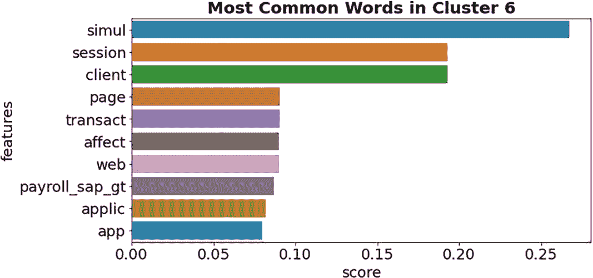

### 潜在中断水平条形图

垂直轴表示特征，水平轴表示分数。特征包括：`simul`、`session`、`client`、`page`、`transact`、`affect`、`web`、`payroll sap g t`、`applic` 和 `app`。各特征对应的条形值大约为：0.26、0.19、0.19、0.9、0.9、0.9、0.9、0.8、0.6 和 0.6。

**图 8-12**

**集群 6** 代表一次中断。

让我们观察这个特定集群（集群 6）中的所有事件。

```
df_appcluster=df_temp[df_temp['cluster'] == 6 ]
df_appcluster.info()
```

如图 8-13 所示，集群 6 中共有 43 个事件被聚集在一起。

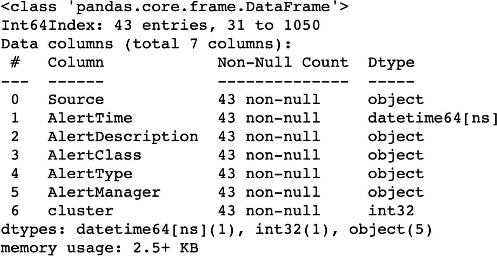

这是 K-means 算法的数据集。在该图像中，表头为：列名、非空计数和数据类型。顶部为 `class pandas.core.frame.DataFrame`，`Int64Index` 包含 43 个条目，范围从 31 到 1050。共有 7 列：`Source`、`Alert Time`、`Alert Description`、`Alert Class`、`Alert Type`、`Alert Manager` 和 `Cluster`。

**图 8-13**

**集群 6** 事件数据

让我们观察该集群中的事件。

```
df_appcluster[['AlertTime','AlertClass','AlertType','AlertDescription']]
```

仔细审查集群 6 中的事件后，您可以看到有五个来自不同事务失败的事件，它们几乎在同一时间（7 月 8 日大约 19:30）到达，表明发生了一次中断。如图 8-14 所示，这五个事件中有一个属于网络接口宕机事件，这被指示为可能的原因，因为在此事件之后，立即出现了针对 Global HR 应用程序的模拟事务失败事件。

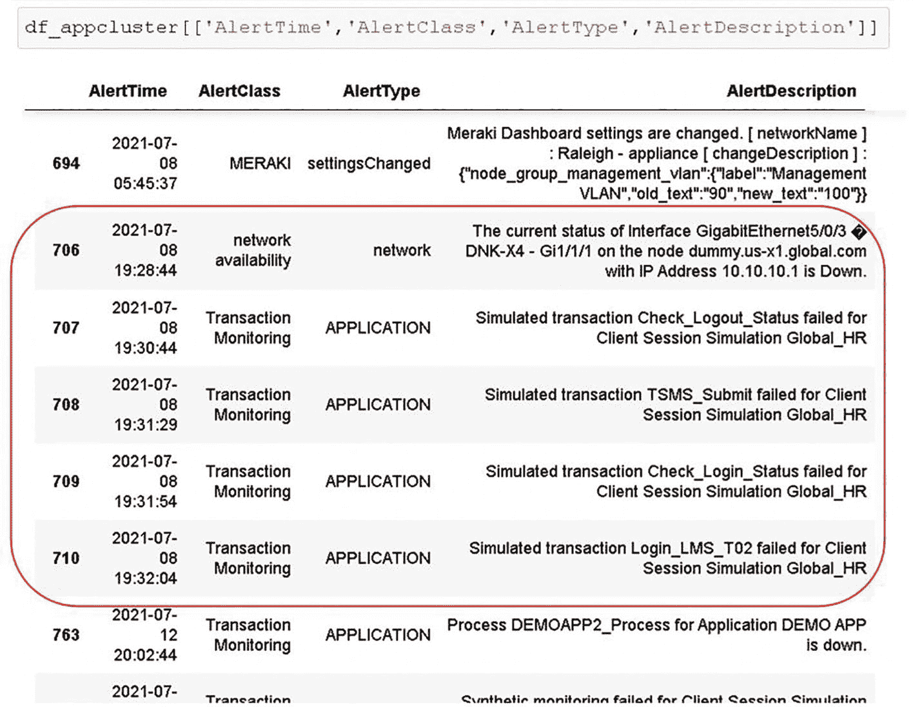

一个包含四列七行的表格，列标题为：`Alert Time`、`Alert Class`、`Alert Type` 和 `Alert Description`。该表格中，第 706、707、708、709 和 710 行被红色框标记。

**图 8-14**

**集群 6** 中的事件

借助 ML 和 NLP 能力，该算法从 1000 多个事件中发现并聚类了有用信息，而且无需编写任何静态规则或使用任何拓扑相关细节。

让我们也在时间尺度上一起分析这些集群，以揭示更多见解。

首先，打印算法根据每个集群中分组的事件检测到的标签。

```
print("Cluster Labels are: \n", labels)
Cluster Labels are:
{0: 'pyrol', 1: 'cpu', 2: 'interfac', 3: 'global_hr', 4: 'emprecord', 5: 'memori', 6: 'simul'}
```

现在，让我们在时间线上观察这些集群，以探索任何有用的细节。

```
df_temp.plot(x='AlertTime', y='cluster', lw=0, marker='s', color ="#eb5634",\
             figsize=(12,8),rot = 90,  alpha = 0.5,fontsize = 15,grid=True, legend=False,\
             ylabel="Cluster Number")
```

从图 8-15 中，您可以得出以下几点重要观察：

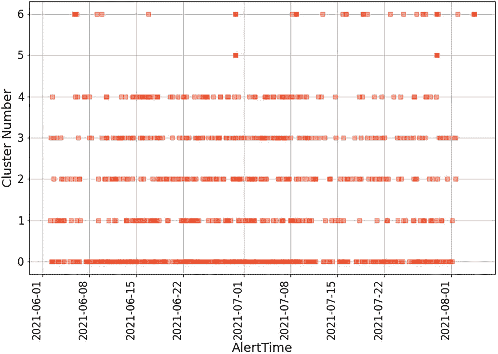

这是 K-means 算法的时间线分析。在该图像中，水平轴表示告警时间，垂直轴表示集群编号。集群编号从 0 到 6，告警时间从 2021-06-01 到 2021-08-01。

**图 8-15**

**集群时间线分析**

*   由于集群 0 中表示的 CPU 利用率事件，存在持续的大量噪声。这是调整 CPU 监控参数阈值的反馈。或者，您可以向容量规划团队提交建议，以增加 CPU 容量。

*   该算法自动为每个应用程序创建了三个集群，这些集群主要包含与该特定应用程序相关的告警。这些集群可用于分析事故或问题管理相关任务。这些集群为应用程序团队提供了大量可见性，并且在执行服务改进计划时非常有帮助。

这种 AIOps 异常检测用例还使得从海量事件中检测潜在关键事件（例如安全事件）变得极其高效，并能够启动自动化操作（例如调用终止开关）以最小化影响。您已经看到 K-means 聚类如何检测噪声，并可以为问题和容量管理流程生成建议。

> **注意**

> 根据最佳实践，安全告警不应与运维事件控制台集成。安全告警仅供安全专家查看，而非所有人。理想情况下，应为安全运维团队设置单独的 SIEM 控制台进行监控。

尽管 K-means 算法即使对于非常大的数据集也易于实现，但从 AIOps 角度来看，它存在一些挑战。

*   集群数量对 K-means 算法的效率起着关键作用。

*   K-means 聚类会因数据集中存在噪声或大量异常值而受到影响。质心会被拉伸以包含异常值或噪声。

*   较高维度的参数或变量会对算法的效率产生负面影响。

除了异常检测，AIOps 的另一个常见用例是相关性和关联分析，这将在下一节中讨论。

## 相关性与关联性

相关性是一个统计学术语，指识别两个或多个实体之间的任何关系或关联。从 AIOps 的角度来看，相关性用于确定实体之间的依赖关系或关联，并将它们聚类在一起以便进行高效分析。我们在第 5 章中介绍了多种用于确定多个实体之间关系以建立相关性的回归算法。

然而，在事件层建立相关性有些困难，因为来自不同来源的多个事件会在不同的时间间隔内到达。在事件层，基于时间的序列或事件模式相当罕见。在事件层能高效确定相关性和关联性的算法之一是`DBSCAN`，它在数据点彼此接近（密集）且存在大量噪声或异常值的场景中特别有用。

### 基于拓扑的相关性

聚类的准确性是事件管理系统最重要的关键绩效指标之一，它驱动着引擎的效率。为了提高聚类和根因确定的准确性，你需要提供一些拓扑上下文。但 CMDB 和发现本身就是一个挑战，要拥有一个 100% 准确且能 100% 发现和建模基础设施的 CMDB 是一项艰巨的任务。

考虑到 CMDB 和发现的各种挑战，拓扑相关性仍然可以用于网络拓扑相关性以及应用拓扑相关性。考虑图 8-16 中所示的示例拓扑。黑色标记的连接代表网络拓扑，而红色标记的连接代表应用拓扑。我们将使用这个示例拓扑来讨论网络拓扑和应用拓扑的相关性。

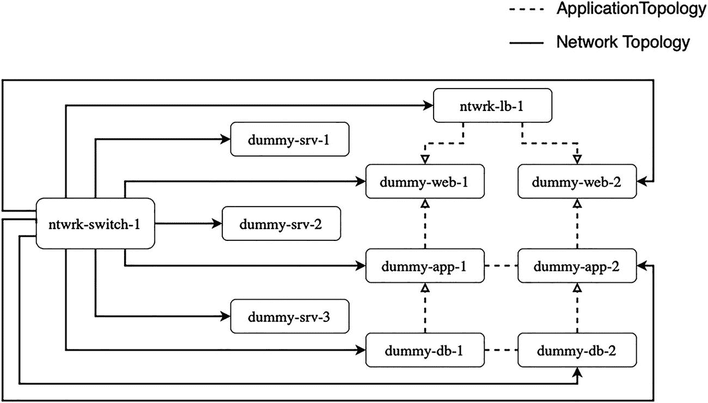

图表有一个主分支和十个子分支。主分支是网络交换机-1。在该图中，红色箭头表示应用拓扑，黑色箭头表示网络拓扑。

图 8-16

示例拓扑图

### 网络拓扑相关性

这种相关性使用网络连接图作为拓扑来执行相关性。例如，如果一个连接了数百台服务器和设备到其接口的核心交换机宕机，那么来自该交换机的告警是因果性的，而来自底层网络设备、服务器以及其上运行的应用的所有其他告警都被视为受影响的。

IT 运维团队可以专注于因果性的 CI（即网络交换机），而不是因这次中断而在系统中手动筛选告警。这种相关性需要确定起始位置和层级深度，以比较和创建此拓扑，并最终找到因果事件。由于存储整个拓扑或发现所有内容可能不切实际，次优的方法是在事件管理层存储关键设备或应用的拓扑信息子集，用于相关性分析，并每 24 小时（如果环境变化不大，可以每周）使用自动化发现/脚本或手动方式更新一次。图 8-4 中示例拓扑的网络拓扑可以在事件管理器层存储为键值对，如下所示：

```
{"network_topology": [
    {"child-ci": "dummy-app-1 ", "parent-ci": " ntwrk-switch-1 "},
    {"child-ci": "dummy-app-2 ", "parent-ci": " ntwrk-switch-1 "},
    {"child-ci": "dummy-web-1 ", "parent-ci": " ntwrk-switch-1 "},
    {"child-ci": "dummy-web-2 ", "parent-ci": " ntwrk-switch-1 "},
    {"child-ci": "dummy-db-1 ", "parent-ci": " ntwrk-switch-1 "},
    {"child-ci": "dummy-db-2 ", "parent-ci": " ntwrk-switch-1 "},
    {"child-ci": "dummy-srv-1 ", "parent-ci": " ntwrk-switch-1 "},
    {"child-ci": "dummy-srv-2 ", "parent-ci": " ntwrk-switch-1 "},
    {"child-ci": "dummy-srv-3 ", "parent-ci": " ntwrk-switch-1 "},
    {"child-ci": "ntwrk-lb-1", "parent-ci": " ntwrk-switch-1 "}
]}
```

每当生成告警时，事件管理算法将使用这些数据来确定关系、执行相关性分析，并确定因果性和受影响的 CI。此方法依赖于静态信息，因此有其局限性和挑战。存储大量拓扑数据会严重影响事件管理工具的性能。

从 AIOps 的角度来看，建议将此相关性卸载到网络监控层，该层具有扫描子网范围、发现设备并使用`ICMP`或`SNMP`将其配置到可用性监控中的原生能力。网络监控工具可以实时查看所有 CI 的可用性及其拓扑，并且可以根据网络变化动态更新它们。网络监控工具应使用检测到的拓扑执行此相关性，过滤掉受影响的 CI 告警，并将因果性告警转发到事件管理层。如果需要，可以将网络监控工具配置为以信息性严重级别转发受影响的 CI 告警，而以严重级别转发因果性告警。

如果使用的是开源网络监控工具，其原生基于拓扑的相关性能力有限或没有，组织仍然可以将所需的拓扑数据导入事件管理层，并按照前面讨论的方式执行相关性分析。

### 应用拓扑关联

此关联利用应用组件之间的关系来构建应用架构。它可以简单如一个运行在集群中多个虚拟机监控程序上并托管各种虚拟机的`vCenter`集群。也可以是一个更复杂的业务应用架构，例如一个运行在多个节点上的保险理赔处理系统，这些节点托管着 Web 服务器、数据库服务器、EDI 系统和 SAP 系统。

与仅考虑系统可用性的网络拓扑关联不同，应用关联既考虑应用的可用性，也考虑其性能。这种关联不仅需要网络拓扑的详细信息，还需要应用蓝图和关键性能指标的细节。考虑一个例子：当收到一个关于数据库进程宕机的告警时，会进一步引发以下告警：

- 来自应用服务器的应用队列请求过高

- 来自 Web 服务器的应用 URL 响应时间过长

- 来自负载均衡器的合成监控超时告警

此时，事件管理可能还会收到许多其他不相关的告警。在这种情况下，所有系统都处于运行状态，但问题出在应用层面。此时，应用层面的关联有助于隔离故障。

理想情况下，应用架构或蓝图应该可用（或被发现）并作为服务模型存储在 CMDB 中。但由于以下三个最常见的原因，组织在维护这些蓝图方面面临诸多挑战：

- 发现应用拓扑需要领域知识来确定在发现过程中需要检测的模式。发现工具的主题专家并不具备如此广泛的领域知识。

- 信息是联合的，并且存在于由多个团队管理的不同工具中。

- 获取读取应用日志/服务/进程的权限存在挑战。日志通常包含 PII/PHI/机密数据，这会引起安全和应用团队的警觉。

从 AIOps 的角度来看，每当与应用相关的告警到达时，算法应利用应用拓扑来执行必要的关联。考虑到 CMDB 的这些挑战，可以使用 AIOps 算法来学习模式和依赖关系，并自动推导出拓扑。在我们的示例拓扑中，算法可以使用以下特征来理解拓扑并执行应用关联：

- 通过分析主机名/IP 地址的相似性来学习，因为属于同一应用的服务器通常在主机名中共享共同的前缀或共同的子网细节。

- 通过分析事件的到达时间并从中检测模式来学习。

- 通过分析事件中的消息文本来学习，判断其属于可用性类别还是性能类别，或者在短时间内同时出现的事件中是否存在共同的应用/服务名称。

- 通过分析事件类别和来源来学习。来自多个运维管理数据库（OMDB）的数据，如`vCenter`、`SAP`、`SCCM`等，在此学习过程中非常有用，因为这些是管理不同配置项（CI）的来源。例如，`vCenter`数据库提供了虚拟机到 ESX 集群的映射数据，其中事件源将是`vCenter`，类别将是`Virtualization`。类似地，`SAP`可以提供应用映射细节，其中源将是`SAP System`，类别将是`Application`。算法可以使用这些数据来关联事件，并找出问题是源于底层虚拟机监控程序还是应用性能。

- 与网络拓扑关联类似，您可以将关键应用的应用拓扑数据存储在事件管理层，并让系统从中学习。除非应用运行在云或 SDI 上，否则应用拓扑的更新频率通常不如网络拓扑数据高，因此可以按月或按季度同步。对于基于云和 SDI 的应用，使用原生 API 并在变更发生时立即更新拓扑数据相对容易。

```json
{"application_topology": [
{"child-ci": " dummy-db-1 ", "parent-ci": " " ,"application":"dummy_app","kpi":["type":"process","name":" dummy-process"]},
{"child-ci": " dummy-db-2 ", "parent-ci": " " ,"application":"dummy_app","kpi":["type":"process","name":" dummy-process"]}
{"child-ci": "dummy-app-1 ", "parent-ci": " dummy-db-1", "application”: “dummy-app","kpi":["type":"service","name":" app_service "]},
{"child-ci": "dummy-app-2 ", "parent-ci": " dummy-db-2" ,"application":"dummy_app","kpi":["type":"service","name":" app_service "]},
{"child-ci": "dummy-web-1 ", "parent-ci": " ntwrk-lb-1" ,"application":"dummy_app","kpi":["type":"url","name":" dummy-url.com "]},
{"child-ci": "dummy-web-2 ", "parent-ci": " ntwrk-lb-1" ,"application":"dummy_app","kpi":["type":"url","name":" dummy-url.com "]},
{"child-ci": " dummy-web-1 ", "parent-ci": " dummy-app-1 "     ,"application":"dummy_app","kpi":["type":"url","name":" dummy-    url.com "]},
{"child-ci": " dummy-web-2 ", "parent-ci": " dummy-app-2 " ,"application":"dummy_app","kpi":["type":"url","name":" dummy-    url.com "]}
]}
```

假设运行在`dummy-db-1server`上的数据库进程宕机，它将生成一个数据库告警，以及来自`dummy-app-1`的应用队列告警和来自`dummy-web-1`服务器的 URL 响应时间告警。利用上述数据，事件管理系统可以创建集群，关联这些告警，并突出显示哪些是原因，哪些是受影响的对象。

应用拓扑或服务模型的可用性无疑可以提高算法的准确性，但这并非 AIOps 的必备要求。有监督和无监督机器学习算法都显示出巨大潜力，并且可以在执行应用拓扑关联方面提供很大帮助。

## 总结

本章涵盖了 AIOps 中关于使用 K-means 聚类进行异常检测的重要用例。您还使用了诸如停用词移除和 TF-IDF 等 NLP 技术来理解文本数据。您学习了其他技术，如应用依赖关系映射和 CMDB，以及它们与 AIOps 的相关性。在下一章中，我们将介绍如何将 AIOps 作为一项实践在组织中建立起来。