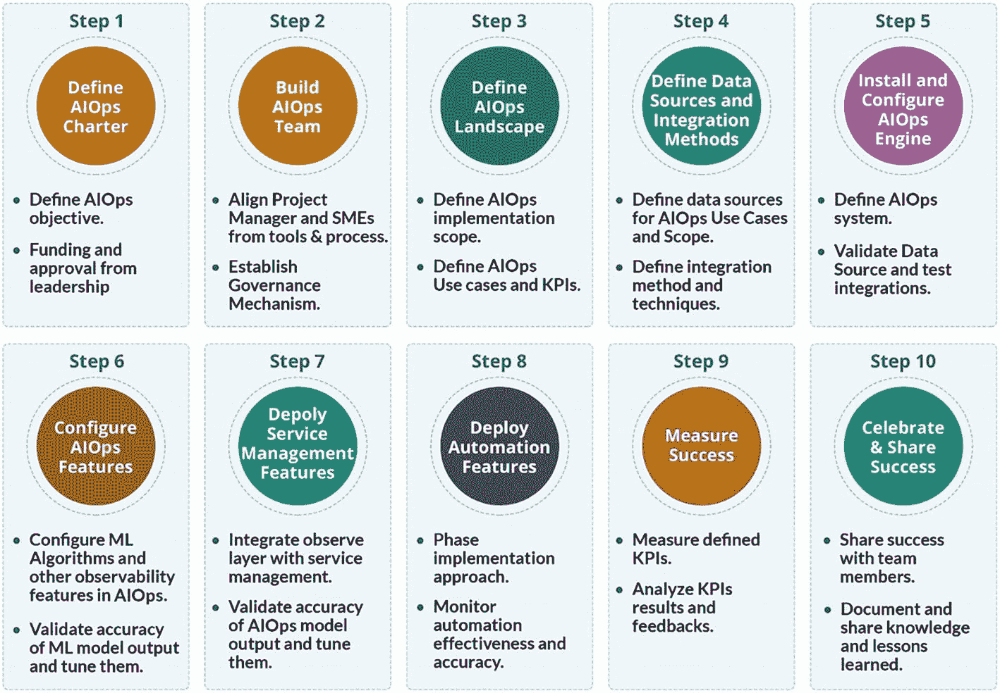

# 9. 建立 AIOps

本章为 AIOps 之旅提供了最佳实践，并就如何在您的组织中建立 AIOps 提供了指导。

在了解了 AIOps、其技术及其优势之后，现在是时候看看如何在组织中实施 AIOps 了。图 9-1 描述了在组织中建立 AIOps 实践的步骤。

在组织中实施 AIOps 有 10 个步骤，每个步骤包含两个要点。这些步骤是：定义 AIOps 章程、组建 AIOps 团队、规划环境、数据源和集成方法、安装 AIOps 引擎、配置 AIOps 功能、部署服务管理功能、自动化功能、衡量成功，以及庆祝和分享成功。

**图 9-1** AIOps 建立流程

让我们从定义 AIOps 章程开始 AIOps 之旅。

## 第一步：编写 AIOps 章程

AIOps 不仅仅是技术变革，更是一种文化变革，涉及流程和人员技能的调整，因此需要获得高层管理者的承诺才能成功实施。

AIOps 会影响多个职能和团队，包括流程团队、流程负责人、指挥中心和 IT 运维部门。组织中可能还有其他举措，例如站点可靠性工程和 DevOps，这些都需要与 AIOps 计划保持一致。

制定正式的项目章程、获得资金和高层领导的批准至关重要，这样才能确保 AIOps 项目获得所需的资金和关注。这将有助于获得受项目影响的各种团队的支持。一旦 AIOps 章程获得批准，下一步就是组建 AIOps 团队。

## 第二步：组建你的 AIOps 团队

下一步是为该项目组建一个团队。这需要一位专职项目经理和具有 AIOps 经验的领域专家，以及来自其他团队的成员，例如监控、可观测性、流程、ITSM 工具、指挥中心、IT 运维、DevOps 和 SRE 团队。

核心团队将负责实施 AIOps 系统；然而，由于该职能贯穿并集成于其他多种职能，因此建立更高级别的治理和报告机制非常重要。

这是一场文化变革，在那些存在孤岛式层级结构和垂直分割职能的大型企业中，有必要让组织变革管理和人力资源团队参与进来，以便有效地推动跨职能变革，并通过流程导向的方法来处理变革中的人员方面问题。在此阶段，你需要开始探索和评估 AIOps 实施的范围和目标，我们将在下一步中对此进行介绍。

## 第三步：定义你的 AIOps 蓝图

在着手任何技术变革之前，必须明确目标以及你试图达成的成果。团队应审视 AIOps 的各个领域，并确定最适合他们的方案。

下一步应该是定义实施 AIOps 的子集，或者定义一种分阶段实施的方法，逐步推出各种功能和特性。

因此，你可以为特定业务线部署完整的 AIOps 功能套件，也可以逐步为整个企业逐个模块地实施。决策应基于组织结构、团队结构和规模、以及复杂程度。对于高度孤岛化的大型组织，最好在某个业务垂直领域实施；而中型组织则可以着手为整个组织进行实施。

规划阶段的第一步是收集有关当前各种工具、技术以及 ITSM 流程实施情况的数据。这应包括以下内容：

-   当前的监控工具布局
-   当前的基础设施和应用布局
-   拓扑/CMDB 的数据源
-   服务管理工具
-   流程
-   指挥中心职能和流程
-   解决小组和流程
-   当前监控和管理中的问题和挑战
-   现有的事件关联基于规则的策略
-   自动化覆盖范围和工具

收集完所有这些数据后，有必要在此阶段设置一个关卡。对这些数据的分析将有助于更好地了解组织在监控和服务管理方面的成熟度。对这些数据的分析可能会导致另一个子项目，其中需要增强或更改监控或服务管理的一些基本要素，以便 AIOps 项目能够获得其运行所需的集成和数据。

如果分析结果导致需要另一个子项目来增强监控和管理工具或流程，则应将其作为同一总计划下的独立项目来处理，因为该项目的负责人可能不同。AIOps 项目可以继续其进程，而监控增强项目则并行运行。

作为数据收集的一部分，你应该收集当前 KPI 的数据，以便在实施 AIOps 前后对 KPI 进行比较。以下 KPI 是衡量 AIOps 部署成功与否的重要指标，应在实施前以及部署 AIOps 后持续进行衡量。

-   告警与事件比率
-   平均响应时间
-   平均解决时间
-   P1 和 P2 的 SLA 指标
-   服务请求关闭时间
-   自动解决的服务请求百分比
-   自动解决的事件百分比
-   关键系统的可用性

AIOps 旅程的下一步是定义数据源及其集成。

## 第四步：定义集成和数据源

在收集了环境的相关数据后，你将清楚需要哪些集成。集成将主要涉及以下系统：

-   监控工具
    -   SNMP（NetBackup、SAP Solman 等）
    -   Syslog（配置变更告警、UNIX 内核告警等）
    -   API（Zabbix、vCenter 等）
    -   其他基于数据库的连接器
-   使用 API 的服务管理工具
-   使用 API 的 CMDB
-   使用 API 的知识管理源
-   使用 API 的自动化工具

通常，你会在环境中发现多个监控工具。其中一些支持 API，数据可以通过基于 API 的连接器导入 AIOps。像 vCenter 这样的工具提供 API 来检查底层虚拟化基础设施的状态；其他工具可能发送基于 SNMP 的告警。例如，SAP Solman 会为 SAP 资源触发 SNMP 告警。有多种选项可以将数据导入 AIOps 引擎；应根据最佳方法对这些选项进行评估和实施。

通常，你会在环境中看到网络监控、服务器监控和应用监控工具，以及用于监控备份、作业、存储和其他 OEM 设备的专用工具。所有这些都需要与 AIOps 引擎集成，以便所有监控数据都驻留在单一引擎中，用于分析和训练其算法。

从服务管理的角度来看，通常只有一个工具，CMDB 可能与 KEDB 和基本知识管理位于同一工具集中。大多数主流工具都提供 API，因此可以轻松使用基于 API 的连接器为这些系统导入数据。

自动化工具可能会根据你为 AIOps 规划的用例以及你是计划直接与 AIOps 集成还是通过服务管理工具集成来进行集成。

即使在 AIOps 引擎被训练之前，一旦集成完成，组织就会开始看到单一管理视图带来的好处，所有告警都集中在一个控制台中。

此阶段标志着 AIOps 旅程中一个重要步骤的完成，即先决条件已满足，你实际上可以开始安装、部署和配置步骤，这些将在后续章节中介绍。

## 第 5 步：安装和配置 AIOps 引擎

在确定所有数据源和数据后，下一步是开始安装 AIOps 引擎。这取决于您选择的工具和技术。由于这些系统较为复杂，组织通常会向熟悉产品并具备实施这些解决方案所需专业知识的合作伙伴寻求实施服务或专业服务。核心 AIOps 团队可以在 AIOps 引擎实施过程中进行观摩学习，积累专业知识。或者，如果内部具备所需的技能和专业知识，团队也可以自行开始构建解决方案。

对于大型、复杂的部署，强烈建议采用分阶段的方法，以确保对服务或业务的影响最小化甚至为零。试图在最短时间内快速完成所有事情需要良好的经验和多个利益相关者的支持。在实施的第一阶段或初始阶段，安装基础的 AIOps 解决方案，并根据前面第 3 步和第 4 步的输出，选择并集成 APM（事务监控）、平台和网络数据源。这些集成将提供对服务器、数据库和网络设备运行状况的可视性，这涵盖了组织的大部分资产。

此阶段为后续阶段提供了良好的学习和充分的信心。然后，可以利用第一阶段学到的经验来改进现有集成，并在后续阶段执行其他数据源的集成，例如 APM（深度分析）、存储、备份、VMware、SAP Solman、作业调度等。需要注意的是，在特定阶段选择用于集成的数据源取决于组织需求的紧迫性和关键性。

按照第 3 步和第 4 步的定义，将所有数据源集成到 AIOps 引擎中可能需要时间，具体取决于其覆盖范围、成熟度以及组织流程。例如，计划集成 `vCenter`，但并非所有 ESX 和集群都已在其配置中，或者存储（如 EMC）的升级恰逢其与 AIOps 引擎的集成。实际上，要深入了解所有技术栈（尤其是在大型组织中）是很困难的，这就是为什么持续反馈对于调整集成和扩大覆盖范围至关重要。

为了降低复杂性并缩短价值实现时间（TTV），可以利用 SaaS 平台。在 SaaS 平台上，不涉及安装，因此一旦 AIOps 供应商将您接入平台，您就可以直接开始配置解决方案。

一旦 AIOps 引擎设置并配置完成，下一步就是设置和测试集成。这涉及配置和集成集成适配器。每个数据源在集成设置后都需要进行测试，以验证所需数据是否被正确捕获到 AIOps 引擎中。

如果您直接与自动化系统集成，那么到自动化的出站集成也需要设置和配置。

在此阶段，您的 AIOps 系统已设置完毕，可供运维团队进行验证，他们可以在单个控制台中查看所有事件和告警。您可以继续根据角色配置角色、用户和访问权限，并为他们提供所需的控制台和仪表板。

在此阶段，您的 AIOps 引擎充当所有数据源的中央存储库，但尚未执行任何用于事件管理的 AIOps 功能和特性。

## 第 6 步：配置 AIOps 功能

下一步是利用平台的核心 AIOps 功能来配置事件管理功能。我们已经在前面章节中介绍了事件管理的各个层面；这些都需要在系统中实施和配置。对于大型和复杂的部署，此步骤与第 5 步的集成阶段并行进行。诸如去重、富化、拓扑关联、应用关联、异常检测等功能，会处理来自各种数据源集成的事件，并选择合格的告警用于创建事件以及后续的诊断和修复自动化。同样，在配置 AIOps 特性和功能时，持续反馈对于调整 AIOps 引擎的性能和准确性至关重要。我们已经在前面章节中详细讨论了这些 AIOps 功能的实施和最佳实践。

配置完所有功能后，系统开始从数据和运维团队提供的反馈中学习，形成一个持续循环，其中新数据和新反馈为 AIOps 引擎提供新的输入，使其能够自我微调，提高覆盖范围和准确性。

一旦您设置好一切并且系统启动并运行，您应该持续监控系统的准确性以及数据中可能发生的任何漂移。在其生命周期内，环境中可能会出现需要与 AIOps 引擎集成的新集成和新工具。当环境中引入新的监控能力时，需要处理这些情况。

## 第 7 步：部署服务管理功能

接下来，您可以开始在服务管理领域使用 AIOps 的能力。正如之前在 Engage 层中定义的，可以实施逐步的方法，每个功能或特性都可以作为计划的一部分推出。AIOps 服务管理中的详细活动将从 Observe 层与事件创建和分配的集成开始，然后按顺序实施 Engage 层中的其余功能。倾向于高度谨慎方法的组织可以首先选择性地进行自动事件创建，例如仅针对生产服务器或仅针对宕机事件创建自动事件，然后逐步将自动事件和自动分配扩展到其他类型的合格告警，持续改进平均响应时间和平均修复时间。

## 第 8 步：部署自动化功能

一旦 AIOps 引擎为 Observe 和 Engage 阶段配置完成，就可以配置自动化操作了。

自动化引擎需要分两个阶段进行配置。第一阶段可称为“人工辅助自动化”，即 AIOps 引擎提供可能的原因，需要人工代理进行验证；自动化引擎提供解决建议，也需要人工代理进行验证。

一旦 AIOps Observe 引擎运行数周并达到一定的置信度分数，并且一旦可能的原因可以被视为根本原因，并且自动化引擎的置信度分数也基于人工操作的反馈达到了阈值，我们就可以继续将系统部署为全自动模式。

从此以后，系统将逐步在其知识库中添加更多的根本原因和自动化操作，以在全自动模式下覆盖更多领域。

确保监控所有模块的准确性，并跟踪和修复可能发生的任何漂移，以维持准确性水平。环境中可能会部署新的自动化运行手册和工具，并且当它们可用时，将需要进行集成。

一旦 AIOps 系统设置完毕并准备就绪，就可以观察和衡量其价值和收益了。

## 第 9 步：衡量成功

一旦实施部署完成，就该衡量你所处的阶段了。在项目初期，当你踏上 AIOps 之旅时，你已经衡量了初始的关键绩效指标（KPI）。现在是时候再次衡量这些 KPI，看看实施后的情况了。请记住，我们之前定义了以下 KPI：

- **告警与事件比率**：你应该会看到告警事件比率有显著改善。由于系统中噪音的消除和可能原因的分析，触发事件的虚假告警不再发生或显著减少。这也导致事件管理流程中的事件数量减少，因为虚假或重复的事件现在已被 AIOps 引擎抑制。
- **平均响应时间**：平均响应时间显著缩短，因为对事件的自动化分析为响应团队提供了更好的输入，并且部分响应也由系统自动完成。该指标应有明显改善。
- **平均解决时间**：该指标也应显著减少，因为响应时间缩短了，并且通过自动化解决问题的时间也大大降低。花在尝试不同方案上的时间更少，AIOps 引擎能够引导解决团队找到正确的操作手册来解决问题。该指标还会影响系统的可用性，你应该会看到应用程序和基础设施的可用性有所提升。
- **P1 和 P2 的 SLA 指标**：由于 SLA 基于响应和解决时间，这些方面的显著改善将转化为更好的 SLA 评分。事实上，运维团队可以回过头来承诺更好的 SLA，因为使用 AIOps 后运维得到了改进。
- **服务请求（SR）关闭时间**：作为 AIOps 计划的一部分，服务请求实现了自动化，因此关闭 SR 所需的时间显著减少。由于 SR 被自动处理，错误也更少，从而避免了人为错误。
- **自动解决的 SR 百分比**：由于自动化解决了许多 SR，这个数字通过自动化显著增加。
- **自动解决的事件百分比**：一旦自动化作为 AIOps 工具集的一部分建立起来，自动解决的事件数量就会显著增加。
- **关键系统的可用性**：高度自动化导致诊断和解决事件的时间缩短，从而提高了关键系统的可用性。

## 第 10 步：庆祝并分享成功

当你完成所有层级后，AIOps 之旅的最后一步就是与业务部门、领导层以及所有团队分享你的成功。利用你设定的目标和实际结果，准备一份详细的案例研究。涵盖你是如何开展这一旅程的，遇到了哪些挑战，以及如何克服这些挑战的。与 AIOps 社区分享知识，以便其他人可以从你的经验中学习。你也可以通过 `Feedback@AgileInfraOps.com` 向我们发送关于你 AIOps 之旅的说明。

接下来，让我们讨论一些 AIOps 实施的最佳实践和指南。

## AIOps 实施指南

以下是实施 AIOps 时的一些指南。

### 炒作与清晰度

不要因为某个项目花哨或受追捧就开展它，无论是 AIOps 项目还是其他任何项目。部署 AIOps 必须有明确的需求和用例。对需求和目的的清晰认识对于你成功踏上 AIOps 之旅至关重要。

### 以目标和 KPI 为驱动

在实施开始和结束时衡量你的 KPI 非常重要。有些实施会失败，因为团队对想要实现的目标没有清晰的概念。拥有 KPI 并了解它们如何受当前项目影响，能让每个人都专注于最终成果。

### 期望

AIOps 对从监控工具收集的事件、性能指标、日志和跟踪数据应用广泛的自动化和统计分析，以学习行为、识别异常、关联告警、减少噪音并查明根本原因。

必须理解并接受机器学习技术本质上是概率性的，因此它们不可能始终 100% 准确。其理念是逐步训练它们，使其达到一定的准确度和置信度水平，以便 IT 运维团队能够使用其建议来发现和解决问题。

### 实现收益的时间

对机器学习分析数据、构建和训练模型以及开始提供洞察（例如性能异常、分组告警和根本原因）所需的时间要有现实的期望。例如，识别每周的季节性模式至少需要几周的观察时间。

考虑到时间和反馈，AIOps 将为 IT 运维提供更准确的洞察，从而做出更好的决策。然而，期望 AIOps 成为一个开箱即用、第一天就能自动化一切的解决方案是不切实际的。

### 没有放之四海而皆准的方案

每个组织都是独一无二的，在基础设施、应用环境、监控和管理工具方面都会存在差异，因此在方法、实施和实现价值的时间上也会有所不同。环境的规模、范围和复杂性也会影响实施和实现价值所需的时间。然而，我们已经看到，如果实施得当，AIOps 能够快速实现价值并带来正向的投资回报率。

### 组织变革管理

熟悉 AIOps 工具和流程只是问题的一部分；然而，更大的部分是如何获得需要参与此计划的不同团队的认同；因此，组织变革管理是成功实施 AIOps 项目的关键因素。

### 大处着眼，小处着手，快速迭代

不要试图一次性完成所有事情，从小处着手。这让你有机会从成就中学习，验证和调整你的方法，获取并构建能力，并为你的组织实现至关重要的速赢。一次承担太多可能会导致失望，并可能导致业务采用率低下。

### 持续改进

一旦部署完成，你可以通过扩展 AIOps 的覆盖范围和范围，并微调其算法以获得更高的准确性来持续改进。人工智能是一个动态且快速发展的领域，新兴的 AI 技术可能会影响 AIOps 在不久的将来的交付方式。

## AIOps 的未来

随着人工智能和机器学习技术的进步，`AIOps` 系统也将通过更准确的预测能力得到增强。让我们来了解 `AIOps` 在企业中的潜在未来。

`可观测性`在`DevOps`和站点可靠性工程中扮演着关键角色。随着新的可观测性工具和技术的出现，可用于分析的数据量成倍增加。借助`AIOps`和可观测性，运维团队将对其基础设施和应用环境拥有更高的可见性和更强的控制力。在可观测性领域实施`AIOps`，部署人工智能技术来理解事件数据，并帮助运维团队找到问题的根本原因之后，下一步就是利用这些技术来自动化解决问题本身。

诸如`iAutomate`之类的工具提供了这些能力，它们使用先进的机器学习技术，将可能的原因作为输入，并应用人工智能来找到正确的自动化方案，从而将运维领域的自动化提升到更高的成熟度。目前，作为早期采用者的企业正在监控和可观测性领域使用这些技术，并通过实施自动化来实现端到端自动化的全部收益。

`AIOps`的下一个前沿领域是更好地集成开发管道，并在开发领域使用这些技术。`AIOps`应该能够通过自动化从开发到生产的路径、预测部署对生产环境的影响以及响应生产环境的变化来提供帮助。

随着云计算和微服务架构的采用，解决根本原因（特别是与基础设施容量或性能相关的根本原因）的方法将简化为启动更多容器或启动更多虚拟机。因此，微服务架构一方面通过将应用程序分解为许多需要映射和管理的服务来增加其复杂性；然而，另一方面，它通过提供简单的自动化能力来快速启动更多容器并处理工作负载峰值，从而简化了性能和容量问题的解决任务。

`AIOps`和`DevOps`共同解决了许多问题。`DevOps`将之前各自为政的团队整合在一起，而`AIOps`则将来自多个来源的数据汇集到一个地方，用于洞察和分析。两者都需要一定程度的变革，因为它们着眼于整个流程，并跨越多个团队和流程。随着企业通过重新审视其`DevOps`流程来向`AIOps`过渡，反之亦然，我们将在未来看到`AIOps`和`DevOps`之间更好的集成。组织将继续在`AIOps`和`DevOps`流程之间创建接口，并制定跨越这两个领域的程序。

`AIOps`以其当前的形式将继续被企业采用，并且通过更好的集成，`DevOps`组织将开始在运维之外的其它领域使用人工智能技术。`AIOps`目前主要专注于运维领域；然而，其工具、技术和算法同样适用于开发领域。一方面，`AIOps`数据将被用作开发流程的输入，以创建更具弹性和优化的应用程序；另一方面，将出现将`AIOps`技术引入开发领域的新用例。

与运维领域存在多种监控和管理工具类似，开发领域也存在多种工具。生成开发数据的开发工具包括：跟踪待构建功能管道的敏捷仪表板、团队统计信息、燃尽图和发布计划。此外还有来自测试工具的数据，包括功能测试、性能测试、代码质量以及安全性和漏洞测试。所有这些数据仍然由人工分析，部署决策由发布和管理团队做出。有些企业已经完善了持续交付和持续部署的艺术；然而，使用`AIOps`技术处理开发数据，并提供类似于运维领域现已可用的洞察和分析，将是`AIOps`技术的下一个前沿领域。

一些应用性能管理工具已经开始使用这些技术来洞察应用程序代码，以找出性能或可用性问题的根本原因所在。尽管大多数`APM`技术仍然基于规则或拓扑，但已有少数供应商朝着这个方向迈进，将机器学习和人工智能技术引入到应用程序开发和测试领域。

`AIOps`技术将更好地集成到开发管道中，通过管道生成的事件和数据将被发送到`AIOps`管道进行分析和自动化操作。下一步是`AIOps`能够为各种环境中正在进行的代码和配置更改提供智能指导。这可以基于管道生成的数据。它还将与历史问题和缺陷分析进行集成，这些可以作为输入来源，以对当前管道进行预测。

测试中会产生大量误报。用于检查代码质量或进行静态代码分析的自动化测试工具经常会产生误报。`AIOps`可用于消除这些误报。通过使用机器学习技术，回归测试可以实现自动化和简化。因此，`DevOps`管道中的`AIOps`技术可以减少测试量，帮助实现自动化测试，减少误报，并指导团队将时间和精力集中在最相关的部分。

`AIOps`可以智能地用于预生产和生产系统，以分析应用程序的行为以及配置更改对应用程序性能的影响。可以配置这些告警，以映射预生产和生产部署之间的变更，从而发现可能因配置问题或工作负载模式变化而出现的任何问题。

先进的自动化系统已经在使用`AIOps`来找到最佳的修复方案并自动应用；然而，未来的系统还将支持基于`ChatOps`的开发人员和运维团队之间的协作，以便在修复缺陷以及修复生产环境中的错误时实现知识共享和即时知识检索。因此，`AIOps`的应用范围将从运维扩展到整个`DevSecOps`价值链。

尽管在预测分析领域已有一些工作，但`AIOps`中使用的算法和技术将得到进一步增强，以提供越来越多的用例，并提高结果的准确性。随着越来越多的数据被输入系统，`AIOps`引擎将变得更加强大，并提供更深入的洞察和分析。

当前涉及大量机器学习模型的核心算法将演变为使用深度学习技术，由于`AIOps`系统可用的数据量将增加，神经网络系统将变得更加准确，从而提供更好的洞察。

`AIOps`已经有了一个良好的开端，组织正在从使用这些技术中获得巨大收益。它将继续征服 IT 运维之外的新领域，并最终影响整个 IT 价值链。

## 总结

在本章中，我们介绍了在组织中实施 AIOps 的分步方法。我们还讨论了在实施 AIOps 过程中需要注意的事项以及如何避免陷阱。我们为项目的成功实施提供了指导，并介绍了衡量成功的方法以及衡量 AIOps 项目成功与否的重要 KPI。

至此，本书已接近尾声；我们深入探讨了 AIOps，从其定义和涵盖的领域开始，一直到涵盖观察、参与和行动阶段的完整 AIOps 架构。我们还介绍了可在 AIOps 领域使用的各种机器学习工具、技术和算法。我们为您详细介绍了可以在组织中逐步实施 AIOps 的流程。我们衷心希望您和我们一样享受编写本书的乐趣。我们期待您的反馈和意见，请发送至 `feedback@AgileInfraOps.com`。

